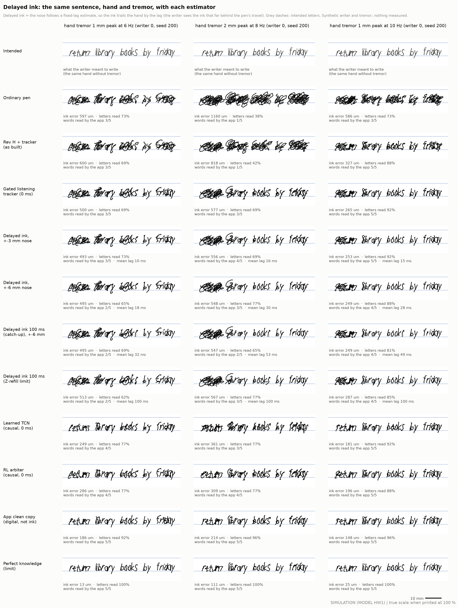
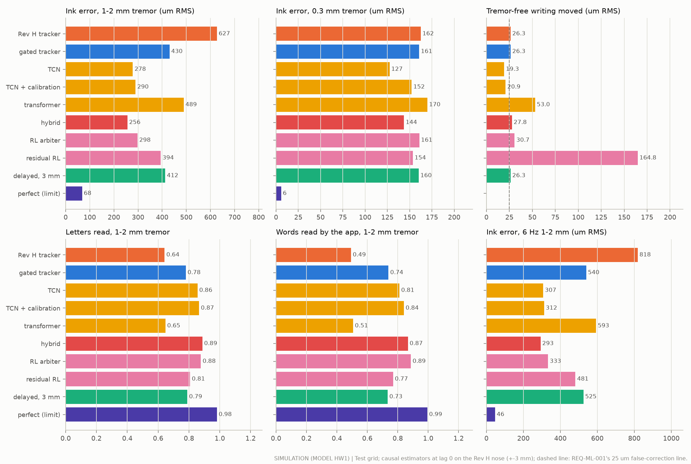
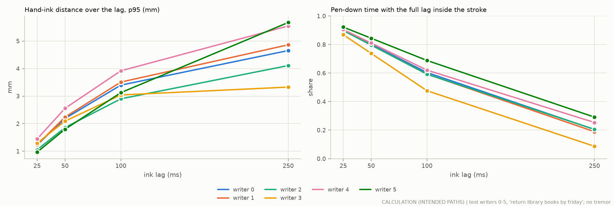
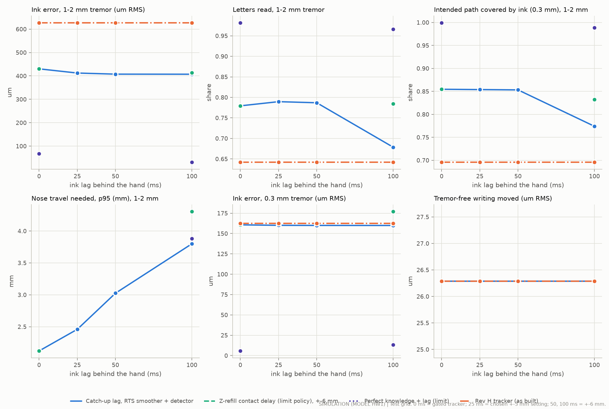
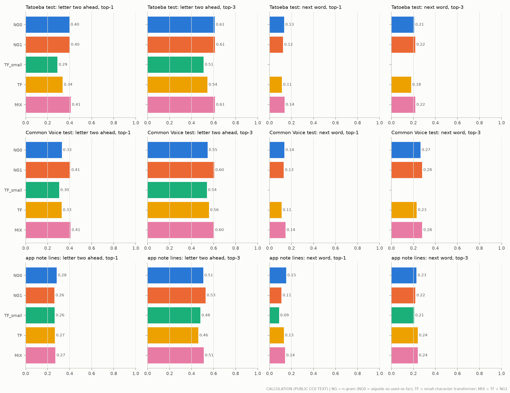
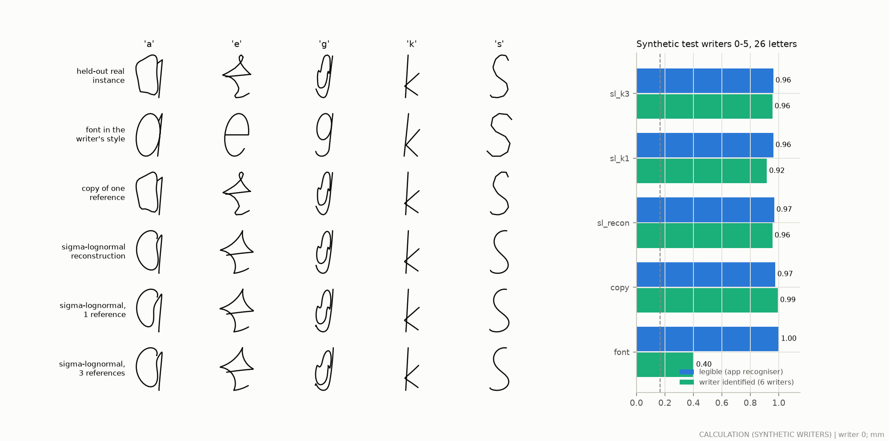
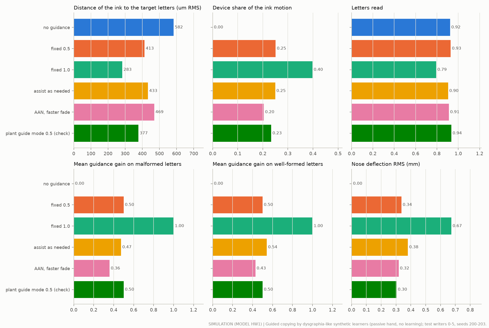

# AI and control v2 (study L): delayed ink, tremor–intent separation, RL, prediction, synthesis and shared control

**Status: studied in simulation and on public data only (2026-09-29).** Nothing was built or measured on a pen or a person. Every number carries a label:
- **SIM**: an executed simulation of model HW1 (`handwriting/`, used unchanged, through the aiprior study's conventions) on synthetic writers and synthetic tremor;
- **CALC**: a calculation (on synthetic data or public text);
- **LIT**: published literature, with its ledger id (proposed new rows in `results/ai2/evidence_rows.csv`, or existing rows in `docs/evidence.csv`);
- **ASSUMPTION**: an input nobody has measured.

Every target here is a hypothesis until it is measured.

**Data and rules.** Final numbers use the aiguide test writers 0–5 and seeds 200–203, with hand tremor at 6, 8 and 10 Hz and 0.3, 1 and 2 mm peak (216 scenarios per variant), plus each writer's tremor-free writing. Every choice was made on tuning writers 100–103 (seed 300; seed 301 to confirm), with rules written in code before the test ran. The learned models and RL policies were trained on 320 other synthetic writers (ids 1000+). Code: `ai2/`. Results: `results/ai2/`. The Rev H, ordinary-pen, clean-copy and perfect-knowledge rows reproduce the aiprior study exactly on the same seeds (531, 835, 189 and 79 µm at 8–10 Hz, 1–2 mm).

## 1. Short answer

- **The biggest dependable gain comes from listening harder only when a tremor line is present (SIM).**
  - A causal tremor-line detector on the page sensor opens a more aggressive ("listening") Kalman estimate only while the writing's spectrum shows a tremor line; otherwise the Rev H tracker runs. The gate never opened on any tuning or test writer's tremor-free writing.
  - On the test grid it cuts the ink error at 1–2 mm from 627 to 430 µm (−31 %; paired difference −197 µm, 95 % CI −206 to −188). At 6 Hz, where the Rev H tracker does nothing, 818 → 540 µm. Words read by the app: 49 % → 74 %. Tremor-free writing moves 26.3 µm, exactly as with Rev H. 0.3 mm tremor: unchanged (161 against 162 µm).
- **A learned causal estimator does better still in this simulator, and passed every rule; it is the candidate successor, not yet the default (SIM).**
  - A small causal TCN (34 k parameters), trained on 320 domain-randomised synthetic writers with a false-correction penalty: 278 µm at 1–2 mm (−56 % against Rev H; −152 µm against the gated tracker, 95 % CI −164 to −141), 307 µm at 6 Hz, 127 µm at 0.3 mm, 81 % of words. It moves tremor-free writing less than Rev H (19.3 against 26.3 µm). It passed the rules on the tuning data (seeds 300 and 301 pooled) and on the test grid.
  - The hybrid Kalman–network is better on ink (256 µm, 87 % of words), but it moved one tuning writer's tremor-free writing by 123 µm, so the rules rejected it.
  - Caveat: both were trained and tested inside one simulator family. REQ-ML-001 requires held-out real recordings before a learned estimator may drive the nose (EXP-L04).
- **Delayed ink is not worth its cost (SIM, CALC, LIT).**
  - A lag of up to 25 ms (fixed-lag Kalman smoother, ±3 mm nose) lowers the ink error by only 18 µm against the causal gated tracker (430 → 412 µm, −4 %) and reads no more words (73 % against 74 %). Up to 50 ms on a ±6 mm nose: −23 µm, 72 % of words.
  - Up to 100 ms loses stroke ends: 54 % of words (−20 points). Delaying the contact itself (a Z-actuated refill; an upper bound) keeps the letters (72 % of words) but needs 4.3 mm of nose travel at p95 and makes 0.3 mm tremor worse.
  - What the writer would see: the ball trailing the pen by a median 0.3 mm (up to 1.4 mm) at 25 ms and 0.7 mm (up to 2.6 mm) at 50 ms (CALC). People notice inking lags from a median of about 50 ms (LIT HAP-90), and delayed visual feedback makes writers repeat strokes and letters (LIT HAP-91, HAP-92).
  - With perfect knowledge a 100 ms lag would help (68 → 31 µm), so the limit is the estimate, not the idea.
- **RL learns a better arbitration in replay, but not a safe one in closed loop (SIM).**
  - A PPO policy that decides every 20 ms how much to trust the listening estimate reads 89 % of words (the most of any causal estimator here) at 298 µm, but it moves tremor-free writing by 30.7 µm and is worse than Rev H at 10 Hz, 0.3 mm, so it fails the rules on tuning and test data. The replay rule used to pick it (mean weight on tremor-free writing ≤ 0.05) did not catch brief full openings.
  - RL on the nose command itself (a residual policy on top of the model-based estimate) gained little (394 µm) and moved tremor-free writing by 165 µm.
  - Compute: 2.56 million environment steps in 13 minutes on one CPU thread.
- **Next-letter and next-word prediction improve only a little over the n-gram in use (CALC).** A transformer mixed with a larger-corpus n-gram has the best top-1 on both sentence test sets (letter two ahead: 41.0 % against 39.8 % on Tatoeba, 40.7 % against 32.9 % on Common Voice), but not on the app's note lines, and a small transformer trained for 30 CPU minutes is worse on its own. The next word before its first letter is right 9–15 % of the time (top-3: 18–28 %) for every model.
- **Writing in the user's style from a few samples works on synthetic writers (CALC).** Sigma-lognormal synthesis from one or three of the writer's own letters stays legible (96 %) and identifiable (92–96 % among six writers, against 40 % for a font in the writer's style). A learned few-shot generator on 60 real writers' letter shapes carries only a little style (65 % same-writer preference, against 59 % for the class mean).
- **Shared control: one arbitration law for all help; assistance as needed must react within the letter (SIM).** Partial guidance brings the ink 29 % closer to the target letters with no loss in letters read; a per-letter assistance-as-needed law reacted one letter late and gave no less help than fixed guidance.

## 2. Main results (SIM, test grid)



The same hand, sentence and tremor in every row, at true scale on 8 mm ruled lines (SIM, writer 0, seed 200). The first word looks the same in every model-based row: the detector needs about 4.5 s of writing before it opens (§4.1). The learned TCN and the RL arbiter have no such start-up. In the 100 ms catch-up row, "books" reads as "bookr": the lag cut the end of the s.

Means over 6 writers × 4 seeds (1–2 mm: 144 scenarios; 0.3 mm: 72; tremor-free: 6 writers). "R1–R4" are the tuning rules recomputed on the test grid (✓ pass, ✗ fail).

| Variant | Ink error 1–2 mm, 6–10 Hz | 6 Hz, 1–2 mm | 0.3 mm | Letters read 1–2 mm | Words read 1–2 mm | Intended path covered 1–2 mm | Nose travel p95 1–2 mm | Mean lag | Tremor-free writing moved | R1–R4 |
|---|---|---|---|---|---|---|---|---|---|---|
| Ordinary pen | 830 µm | 822 µm | 171 µm | 51 % | 31 % | 63 % | – | – | – | – |
| Rev H + tracker (as built) | 627 µm | 818 µm | 162 µm | 64 % | 49 % | 70 % | – | 0 | 26.3 µm | – |
| **Gated listening tracker (adopted)** | **430 µm** | **540 µm** | **161 µm** | **78 %** | **74 %** | **85 %** | **2.12 mm** | **0** | **26.3 µm** | ✓✓✓✓ |
| Delayed ink ≤ 25 ms, ±3 mm | 412 µm | 525 µm | 160 µm | 79 % | 73 % | 85 % | 2.46 mm | 15 ms | 26.3 µm | ✓✓✓✓ |
| Delayed ink ≤ 50 ms, ±6 mm | 408 µm | 525 µm | 160 µm | 79 % | 72 % | 85 % | 3.03 mm | 28 ms | 26.3 µm | ✓✓✓✓ |
| Delayed ink ≤ 100 ms, ±6 mm | 407 µm | 526 µm | 160 µm | 68 % | 54 % | 77 % | 3.80 mm | 49 ms | 26.3 µm | ✓✓✗✗ |
| Delayed ink 100 ms, contact delayed too (Z-refill, limit) | 413 µm | 509 µm | 177 µm | 78 % | 72 % | 83 % | 4.30 mm | 100 ms | – | – |
| **Learned TCN (candidate successor)** | **278 µm** | **307 µm** | **127 µm** | **86 %** | **81 %** | **93 %** | **2.13 mm** | **0** | **19.3 µm** | ✓✓✓✓ |
| Learned TCN + 20 s calibration | 290 µm | 312 µm | 152 µm | 87 % | 84 % | 93 % | 2.07 mm | 0 | 20.9 µm | ✓✓✓✓ |
| Hybrid Kalman–network (rejected on tuning) | 256 µm | 293 µm | 144 µm | 89 % | 87 % | 94 % | 2.23 mm | 0 | 27.8 µm | ✓✓✓✓ |
| Learned transformer (under-trained) | 489 µm | 593 µm | 170 µm | 65 % | 51 % | 84 % | 1.75 mm | 0 | 53.0 µm | ✗✗✗✗ |
| Delayed ink ≤ 25 ms, learned (hybrid) estimator, ±3 mm | 229 µm | 256 µm | 134 µm | 88 % | 85 % | 94 % | 2.58 mm | 22 ms | 39.9 µm | ✗✓✓✓ |
| RL arbiter (PPO) | 298 µm | 333 µm | 161 µm | 88 % | 89 % | 92 % | 2.26 mm | 0 | 30.7 µm | ✗✗✓✓ |
| Residual RL on the command | 394 µm | 481 µm | 154 µm | 81 % | 77 % | 89 % | 2.29 mm | 0 | 164.8 µm | ✗✗✓✗ |
| App clean copy (digital, after writing) | 194 µm | 203 µm | 149 µm | 96 % | 97 % | 97 % | – | – | – | – |
| Rev H, perfect knowledge (limit) | 68 µm | 46 µm | 6 µm | 98 % | 99 % | 100 % | – | 0 | – | – |
| Perfect knowledge + 100 ms lag, ±6 mm (limit) | 31 µm | 22 µm | 13 µm | 97 % | 94 % | 99 % | 3.88 mm | 41 ms | – | – |

Rules (stage D2, applied to every candidate): R1 tremor-free writing moved ≤ Rev H's + 2 µm; R2 0.3 mm ink error ≤ 1.02 × Rev H's at each frequency; R3 letters read ≥ Rev H's − 1 point at each condition; R4 intended path covered ≥ Rev H's − 1 point at each condition. The nose-travel column is the p95 of the commanded hand–ink distance while the pen touches the paper (not recorded for the Rev H row).

Ink error (µm) · words read, by condition:

| Tremor | Ordinary pen | Rev H + tracker | Gated tracker | Delayed ≤ 25 ms | Learned TCN | Hybrid | RL arbiter | Clean copy (digital) | Perfect knowledge |
|---|---|---|---|---|---|---|---|---|---|
| 6 Hz, 0.3 mm | 171 · 99 % | 185 · 98 % | 185 · 98 % | 185 · 98 % | 144 · 100 % | 165 · 99 % | 185 · 99 % | 185 · 99 % | 4 · 100 % |
| 6 Hz, 1 mm | 534 · 50 % | 550 · 49 % | 416 · 70 % | 407 · 70 % | 241 · 85 % | 236 · 93 % | 270 · 92 % | 179 · 98 % | 12 · 100 % |
| 6 Hz, 2 mm | 1110 · 9 % | 1087 · 11 % | 663 · 57 % | 642 · 57 % | 373 · 58 % | 349 · 71 % | 396 · 71 % | 227 · 96 % | 81 · 99 % |
| 8 Hz, 0.3 mm | 167 · 98 % | 173 · 98 % | 171 · 98 % | 170 · 97 % | 125 · 99 % | 147 · 99 % | 166 · 98 % | 135 · 99 % | 7 · 100 % |
| 8 Hz, 1 mm | 551 · 56 % | 430 · 69 % | 291 · 86 % | 276 · 84 % | 227 · 95 % | 199 · 97 % | 216 · 96 % | 153 · 98 % | 24 · 100 % |
| 8 Hz, 2 mm | 1124 · 8 % | 848 · 24 % | 561 · 64 % | 540 · 67 % | 381 · 66 % | 304 · 79 % | 358 · 86 % | 211 · 98 % | 143 · 99 % |
| 10 Hz, 0.3 mm | 174 · 98 % | 129 · 99 % | 126 · 99 % | 125 · 99 % | 113 · 100 % | 119 · 100 % | 132 · 99 % | 127 · 99 % | 7 · 100 % |
| 10 Hz, 1 mm | 551 · 54 % | 291 · 87 % | 223 · 88 % | 204 · 88 % | 175 · 97 % | 173 · 94 % | 201 · 95 % | 158 · 98 % | 23 · 100 % |
| 10 Hz, 2 mm | 1113 · 8 % | 556 · 56 % | 427 · 79 % | 405 · 75 % | 273 · 87 % | 274 · 86 % | 347 · 92 % | 235 · 94 % | 126 · 98 % |



## 3. Task 1: delayed ink

### 3.1 How it works (proposed design; SIM)

- The nose command is q(t) = [x̂_h(s) − x̂_h(t+δ)] − g·d̂(s) − (1−g)·d̂_RevH(t−λ), with s = t + δ − λ:
  - x̂_h is the handle position and d̂ the tremor, both smoothed with a fixed lag λ (the RTS backward pass; LIT EML-47);
  - δ = 3.4 ms is the Rev H servo's delay (CALC);
  - g is the tremor-line gate (§4.1). When it is closed the pen falls back to the Rev H tracker, delayed by the same λ.
- So the ball draws the hand's path, cleaned of tremor, λ seconds late. The nose absorbs the hand–ink distance.
- **The lag is not constant.** It grows while the hand writes a stroke (up to λ_max) and collapses within a few ms when the hand stops (speed below 4 mm/s for 4 ms) or starts to lift (refill-slide sensing, ASSUMPTION 1 ms latency). Otherwise the ball would leave the paper before drawing the end of the stroke. The alternative "limit" policy delays the contact too: the ball stays on the paper for λ after the hand lifts. That needs a refill that holds contact by itself, an actuator nobody has designed; it is an upper bound.
- **Estimators compared** (open loop, stage D0): the fixed-lag RTS Kalman smoother (forward filter over merged IMU and page-sensor samples, stored gains, a backward pass per output; Särkkä 2013 Algorithm 10.7, LIT EML-47); a windowed zero-phase smoother (the app's clean copy on a sliding window, with autoregressive padding at the window's end); a fixed-lag Wiener filter (implemented in `ai2/smoothers.py`, not carried into D0); the learned models of §4.2 (outputs at lags 0, 25, 50 and 100 ms).

### 3.2 What the writer would see (LIT, CALC; not measured)

- **The ball trails the pen.** The barrel and the fingers move ahead; the ball and the ink follow the same path λ later. For the test writers (median pen-down speed 7.6–13.2 mm/s, CALC) the ball is behind by a median 0.26–0.35 mm at 25 ms (0.97–1.44 mm in the fastest 5 % of the writing), 0.65–0.84 mm at 50 ms (1.80–2.56 mm), 1.3–1.7 mm at 100 ms (2.90–3.92 mm). The writer sees the tip lagging or "dragging", on top of the tremor-cancelling motion the nose already makes.
- **Will they notice?** On a tablet, people noticed added inking latency above a median of 50 ms while writing a word (range 32–87 ms, n = 12); with the hand and stylus visible, a median of 59 ms (LIT HAP-90). They judged it from the moving hand and pen, not from where the ink was. So 25 ms is likely unnoticed by most writers, 50 ms by about half, 100 ms by nearly everyone.
- **Will it change their writing?** When all visual feedback of writing is delayed, people add strokes, repeat letters ("feeeling") and write larger. Tamada (1995) tested delays of 33–500 ms and found error rates rising with the delay (LIT HAP-91; abstract only, so where errors start is not known here); Morikiyo & Matsushima (1990) found large decrements at 200–1000 ms (LIT HAP-92); Smith et al. (1960) called the effects "marked and deleterious" (LIT HAP-93). Delayed ink delays only the ink, while the hand and pen stay visible in real time, so the effect may be smaller. It is untested (EXP-L03).
- **At stroke ends** the ink must catch up: when the hand slows or lifts, the lag collapses, so the ink briefly moves faster than the hand.

### 3.3 How far ahead the hand gets (CALC)



On the test writers' intended pen-down paths (no tremor; `ai2/report.py`, ranges over the six writers):

| Lag | Hand–ink distance, median | p95 | Pen-down time with the full lag inside the same stroke |
|---|---|---|---|
| 25 ms | 0.26–0.35 mm | 0.97–1.44 mm | 87–92 % |
| 50 ms | 0.65–0.84 mm | 1.80–2.56 mm | 74–84 % |
| 100 ms | 1.32–1.66 mm | 2.90–3.92 mm | 48–69 % |
| 250 ms | 1.77–2.72 mm | 3.33–5.67 mm | 9–29 % |

The rest of the pen-down time is at stroke starts, where the lag must first build up, and at stroke ends, which a lagging ink cuts short. The Rev J plan's example (150 ms at 30 mm/s = 4.5 mm) assumed faster writing than these writers' medians; their fast strokes (40–62 mm/s at p95) reach it.

### 3.4 Tuning (tuning writers 100–103; rules fixed before the test)

**Stage D0, the estimator (SIM, open loop, seed 300).** Time-aligned tremor residual at 1–2 mm, 6–10 Hz:

| Estimator | lag 0 | 25 ms | 50 ms | 100 ms | output on tremor-free writing (ungated) |
|---|---|---|---|---|---|
| Fixed-lag RTS smoother, chosen (τ_decay 2 s, q_t 1e-9) | 412 µm | 345 µm | 342 µm | 317 µm | 259 µm |
| Fixed-lag RTS smoother, 6 other settings | 423–585 µm | 349–431 µm | 348–415 µm | 323–368 µm | 222–317 µm |
| Windowed zero-phase smoother | 1060 µm | 1291 µm | 1212 µm | 1116 µm | 65 µm |

- The smoother "listens": its estimate is much better than the Rev H tracker's (939 µm at lag 0 on the same data, §4.3), but it reads writing as tremor (259 µm ungated). So it needs a gate.
- The windowed zero-phase smoother is far worse: its window's edge sits exactly where the estimate is needed.

**Stage D1, the gate (SIM).** Chosen from five settings: open after the ratio stays above 5 for 0.5 s; close after it stays below 2.5 for 1 s. It never opened on the tuning writers' tremor-free writing and was open for 95 % of the detector's updates at 1–2 mm.

**Stages D2 and D2b, the lag per nose travel (SIM, closed loop).** D2 (no amplitude gate): every lag cut the ink error (631 → 392–420 µm) but none passed R3/R4 at 10 Hz, 0.3 mm, where the gate opens on a small line. D2b added an amplitude gate (the listening estimate fades in between 0.15 and 0.35 mm of line amplitude). Seed 300 (Rev H: 631 µm):

| Setting | Ink error 1–2 mm | Letters read | Words read | Path covered | Mean lag | Nose travel p95 | R1–R4 |
|---|---|---|---|---|---|---|---|
| Gated tracker, lag 0 | 428 µm | 76.0 % | 71.7 % | 83.9 % | 0 | 2.18 mm | pass |
| Lag ≤ 25 ms, ±3 mm (chosen for ±3 mm) | 408 µm | 76.4 % | 70.8 % | 83.8 % | 14 ms | 2.55 mm | pass |
| Lag ≤ 50 ms, ±6 mm (chosen for ±6 mm) | 402 µm | 75.3 % | 68.3 % | 83.8 % | 27 ms | 3.16 mm | pass |

**Seed 301 did not confirm delayed ink (SIM):** Rev H 603 µm; gated lag 0 413 µm (all rules pass); lag 25 ms 394 µm and lag 50 ms 388 µm, but both **failed R3** (letters 74.4 % and 74.7 % against 76.8 %). So delayed ink was not adopted before the test; the test grid shows it for information.

### 3.5 Test results (SIM)



- **Ink error.** 430 µm at lag 0 → 412 µm at ≤ 25 ms (paired −18 µm, 95 % CI −19 to −17) → 408 µm at ≤ 50 ms (−23 µm, CI −24 to −21) → 407 µm at ≤ 100 ms. The gain stops at about 25 ms: the smoother improves little beyond 25–50 ms (§3.4), and the catch-up at stroke ends costs what the lag gains.
- **Letters and words.** Unchanged at 25–50 ms (79 % of letters; 72–73 % of words against 74 %). At 100 ms, 68 % of letters and 54 % of words: the catch-up cuts stroke ends (path covered 77 % against 85 %; in the figure's 100 ms row "books" reads as "bookr").
- **Nose travel needed (hand − ink).** The p95 at 1–2 mm tremor: 2.12 mm at lag 0 (the tremor alone), 2.46 mm at 25 ms, 3.03 mm at 50 ms, 3.80 mm at 100 ms, 4.30 mm with the contact delayed. The command exceeded 3 mm for 2.1 % (lag 0), 3.5 % (25 ms), 7.1 % (50 ms), 13.4 % (100 ms) and 22 % (contact delayed) of pen-down time, and 6 mm for at most 0.65 %. So ±3 mm (Rev H) carries 25 ms; 50 ms and more need the ±6 mm nose.
- **False correction.** The gate stays shut on tremor-free writing, so delayed ink moves it exactly as Rev H does (26.3 µm). The learned fixed-lag estimator has no gate and moved it by 40–41 µm.
- **0.3 mm.** Unchanged (160 µm) with the catch-up policy; 177 µm with the contact delayed.
- **The clean copy** (digital, whole note, non-causal): 194 µm and 97 % of words. Delayed ink on paper gets nowhere near it: 25–50 ms of look-ahead is too little.
- **The limit.** With perfect knowledge a 100 ms lag halves the ink error (68 → 31 µm) but still loses words at stroke ends (94 % against 99 %).

**Verdict.** Delayed ink is not adopted: 4 % less ink error, no more letters or words, more travel than Rev H has beyond 25 ms, and a lag writers may notice.

## 4. Task 2: separating tremor from intent

### 4.1 The model-based causal stack (the Rev J default; SIM)

1. **Tremor-line detector** on the page sensor: every 50 ms, the Welch spectrum of the last 4 s (2 s segments), the peak-to-floor ratio in 4.5–13.5 Hz and the line's amplitude. It is the app's clean-copy detector made causal: its window ends at the latest page sample available at the update (tremor from the spectral peak of pen-tip data: LIT PDT-44).
2. **Hysteresis gate:** open after the ratio stays above 5 for 0.5 s; close after it stays below 2.5 for 1 s; 0.2 s ramp (stage D1).
3. **Amplitude gate:** the listening estimate fades in between 0.15 and 0.35 mm of line amplitude (stage D2b), so small tremor stays with the Rev H tracker.
4. **Listening estimator:** the fixed-lag RTS Kalman filter at lag 0, whose tremor states follow the measurements (τ_decay 2 s, q_t 1e-9; stage D0).
5. **Fallback:** the Rev H tracker whenever the gate is closed.

This is the "separate tremor detector could open it" that the aiprior study proposed but did not test (`docs/ai_severe_tremor.md` §4.4). It keeps the Rev H tracker's behaviour on tremor-free writing and gets much of the gain of aiprior's "severe-tremor setting", which aiprior had to reject (there: 281 µm at 8–10 Hz with 263 µm of false correction; here: 375 µm with 26 µm).

- **Gate on the test grid (SIM):** never open on tremor-free writing. At 0.3 mm it is open 0.1 % (6 Hz), 2.7 % (8 Hz) and 12.9 % (10 Hz) of the recording; at 1–2 mm 51–73 % of the whole 20 s recording, because it needs about 4.5 s to open (4 s window + 0.5 s). In open loop on tuning data its lag-0 residual is 592 µm over the whole recording but 444 µm after the first 5 s (the ungated smoother: 409 µm; CALC). **In the pen the detector must keep its state across lines and pauses within a session** (and can be armed by the 20 s calibration), so the start-up is paid once, not per line.

### 4.2 Learned estimators (SIM)

- **Training data** (`ai2/data.py`): 320 synthetic writers (aiguide style generator, ids 1000+) writing random 3–5 word CC0 phrases (never the study sentence). 25 % tremor-free; tremor 4–12 Hz, 0.1–2.5 mm (log-uniform), harmonic 0–0.3, ellipticity, orientation, frequency wander and amplitude modulation randomised; grip stiffness 300–1000 N/m and damping, hand mass, arm stiffness and damping around HAP-26; sensor rotation, noise, bias and clock draws. All ranges are ASSUMPTIONS (the principle: LIT EML-51, EML-52). Each sample holds what the pen senses with the nose held and the same writing without tremor, which defines the target.
- **Inputs:** the 7 causal sensor features of `fusion/learned.py` at 500 Hz (accelerometer 2, page-sensor increments 2, new-sample flag, page valid, axial contact). The hybrid adds the model-based stack's quantities (gate, peak ratio, line amplitude, amplitude gate, the RTS estimates) and outputs a correction to the stack's own estimate (a Kalman–network hybrid, LIT EML-45). The calibrated TCN adds the 20 s calibration's tremor frequency and amplitude as two constant inputs.
- **Outputs:** the tremor displacement of the handle at t + δ − lag for lags 0, 25, 50 and 100 ms (lag 0 drives the nose; the others serve delayed ink).
- **Loss:** squared error on pen-down steps + 4 × squared output on tremor-free samples (the false-correction penalty of `fusion/learned.py`).
- **Models:** causal TCN (dilations 1–128, 1 s receptive field; LIT EML-46); the same with calibration context; the hybrid; a small causal transformer (2 attention layers over 0.38 s with ALiBi distance biases, LIT EML-48). Each trained for 13 minutes on one CPU thread.
- **On the pen:** the network runs every 2 ms; its output is held and extrapolated to each 0.5 ms control tick from its two latest outputs (causal; ≤ 10 µm error for a 10 Hz, 1 mm tremor, CALC).

### 4.3 Open-loop tuning (SIM; tuning writers 100–103, seed 300)

J = mean residual at 1–2 mm over lags 0/25/50 ms + 2 × (output on tremor-free writing above 25 µm) (rule L1, fixed before training).

| Estimator | J | Residual 1–2 mm, lags 0 / 25 / 50 ms | 0.3 mm | Output on tremor-free writing | Parameters | MAC per 2 ms step |
|---|---|---|---|---|---|---|
| Hybrid Kalman–network | 382 µm | 389 / 325 / 315 µm | 206 µm | 44 µm | 34 440 | 33 888 |
| TCN + calibration (true tremor as context) | 384 µm | 460 / 343 / 348 µm | 178 µm | 12 µm | 33 864 | 33 312 |
| TCN | 389 µm | 457 / 360 / 350 µm | 188 µm | 23 µm | 33 800 | 33 248 |
| Transformer (489 steps in 13 min) | 861 µm | 802 / 824 / 730 µm | 251 µm | 63 µm | 23 656 | 47 456 |
| Model-based stack | 588 µm | 592 / 559 / 556 µm | 238 µm | 34 µm | – | – |
| Fixed-lag RTS, ungated | 814 µm | 412 / 343 / 335 µm | 275 µm | 251 µm | – | – |
| Rev H tracker (its estimate at t − lag) | 962 µm | 939 / 944 / 946 µm | 239 µm | 34 µm | – | – |

The open-loop ranking does not predict the closed loop well: the TCN's lag-0 residual (457 µm) is worse than the ungated smoother's (412 µm), yet in closed loop it beats the gated stack by a wide margin (§4.4), because it needs no gate start-up and does not open on writing rhythms.

### 4.4 Closed-loop tuning check (SIM; stage cl; tuning writers 100–103, seeds 300 and 301)

Rev H on the same runs: 617 µm at 1–2 mm; tremor-free writing moved 33.5 µm. Rule: R1–R4 pooled over both seeds; a learned or RL candidate is adopted only if it passes and beats the gated stack by ≥ 2 %.

| Candidate (lag 0, ±3 mm nose) | Ink error 1–2 mm | Tremor-free moved | 0.3 mm | Letters read | Words read | R1 R2 R3 R4 |
|---|---|---|---|---|---|---|
| **Learned TCN (adopted by the rule)** | 281 µm | 21.3 µm | 129 µm | 83.1 % | 78.7 % | ✓ ✓ ✓ ✓ |
| Learned TCN + calibration | 293 µm | 21.1 µm | 155 µm | 83.5 % | 81.2 % | ✓ ✓ ✓ ✓ |
| Hybrid Kalman–network | 255 µm | 51.3 µm | 145 µm | 86.3 % | 82.1 % | ✗ ✓ ✓ ✓ |
| RL arbiter (PPO) | 297 µm | 60.9 µm | 168 µm | 87.0 % | 85.8 % | ✗ ✗ ✗ ✓ |
| Residual RL | 383 µm | 166.9 µm | 154 µm | 77.6 % | 72.1 % | ✗ ✗ ✗ ✗ |
| Gated listening tracker | 419 µm | 33.5 µm | 166 µm | 76.4 % | 73.3 % | ✓ ✓ ✓ ✓ |
| Transformer | 492 µm | 62.3 µm | 171 µm | 61.9 % | 44.6 % | ✗ ✗ ✗ ✗ |

- The hybrid and the RL arbiter failed on one writer's tremor-free writing (writer 101: 123 and 128 µm moved, against Rev H's 34 µm). Both lean on the listening smoother, which reads that writer's rhythm as tremor.
- The TCN moved tremor-free writing less than Rev H on three of four writers (13.8, 16.6, 18.4 µm) and slightly more on writer 101 (36.4 against 33.6 µm).

### 4.5 Test results (SIM)

- **Gated listening tracker:** 430 µm against Rev H's 627 µm (−31 %); passes R1–R4 on the test grid.
- **TCN:** 278 µm (−56 % against Rev H; −152 µm against the gated tracker, 95 % CI −164 to −141); 0.3 mm 127 µm (Rev H 162); tremor-free writing moved 19.3 µm on average (worst writer 34.8 µm; Rev H 26.3 and 48.7 µm); passes R1–R4. Against REQ-ML-001's line (≤ 25 µm on tremor-free writing): met on average, not for the worst writer.
- **Hybrid:** 256 µm and 27.8 µm on the test grid (it would pass here), but it was rejected on tuning data (51.3 µm), and a rule is not revisited on test data.
- The learned models gain most at 6 Hz (818 → 307 µm) and, as the figure in §2 shows, in the first seconds of writing, where the model-based stack is still waiting for its gate.

### 4.6 Per-user adaptation: the 20 s calibration (SIM)

- The calibrated TCN takes the tremor frequency and amplitude that the detector finds in a separate 20 s recording of the same writer (another seed). For tremor-free test writing it is given the writer's 8 Hz, 1 mm calibration, as for a person with tremor who happens to write without it.
- It did not help: 290 against 278 µm at 1–2 mm, and worse at 0.3 mm (152 against 127 µm). With the true tremor as context on tuning data it had been slightly better (J 384 against 389 µm). The network already infers the tremor from 1 s of sensor data.
- The model-based stack can use the calibration differently: arm the detector's band at the calibrated frequency ± 1.5 Hz (implemented, `f_cal`, not tuned here) and start a session with the gate's state from the calibration.

### 4.7 Which sensors carry the estimate (SIM, open loop, tuning; information)

Residual of the ungated listening smoother at 1–2 mm by lag 0/25/50/100 ms: IMU + page sensor 412/345/342/317 µm; IMU only 421/352/352/316 µm; page sensor only 1865/1472/1291/1143 µm. The accelerometer carries the tremor estimate; the page sensor (1 kHz, 2 ms latency) anchors position and drift. The nose's Hall sensor and a grip-force sensor are not in HW1's sensor model (there the Hall only reads the nose's own commanded motion); their value is untested (EXP-L04 records them).

### 4.8 Cost on the pen (CALC)

TCN: 33 248 multiply-accumulates per 2 ms step, 34 k int8 weights (33 kB), about 16 kB of dilated-convolution history; about 0.56 ms per step on a 128 MHz Cortex-M33 with int8 CMSIS-NN (ASSUMPTION: 0.5 MAC/cycle + 300 cycles per layer call, as `fusion/budget.py`; LIT EML-13): 28 % of one core at 500 Hz. The model-based stack's detector is one 1000-point Welch spectrum every 50 ms.

## 5. Task 3: reinforcement learning

### 5.1 What the policy decides, and why

- Estimating the tremor has a known loss; supervised learning solves it directly (§4). What is a sequential decision is **how much of an aggressive estimate to trust**, knowing that trusting it on tremor-free writing distorts the user's letters. So the main policy is the shared-control arbitration weight w, chosen every 20 ms: q = −[w·d̂_listen + (1 − w)·d̂_RevH].
- **Observation** (causal, 10 values): detector ratio, line amplitude and frequency, the hysteresis gate, the recent RMS of the listening and Rev H estimates and of their difference, pen-down fraction, accelerometer RMS, the previous w.
- **Reward:** the reduction of the squared tremor residual against Rev H on pen-down steps, normalised by (0.3 mm)², minus a small penalty on changing w. The "fc" variants weight the reward of tremor-free training episodes 4× (the supervised models' false-correction weight); the policy never sees that label.
- **Comparison (residual RL, LIT EML-54, EML-55):** every 2 ms, a bounded correction (±0.2 mm) added to the model-based stack's estimate, from 16 ms of sensor history.
- **Environment backend:** replay of the nose-held HW1 runs (the project's convention); every policy's final check is the full HW1 closed loop (stages cl and test). The environments (`ai2/rl_env.py`, Gymnasium 1.2) take any backend with `n_episodes()` and `episode(i)` returning the arrays in `REQUIRED_KEYS`, so sim2 can supply episodes from its MuJoCo plant and sensors. Training in sim2's own closed loop needs the estimators run online (the lag-0 RTS is a forward Kalman filter, the Rev H filter is recursive, the detector runs every 50 ms on a ring buffer); that port is not done (EXP-L05).
- **Algorithms:** Stable-Baselines3 2.9 PPO (LIT EML-49) and SAC (LIT EML-50), MLP 64 × 64, 4 parallel environments, one CPU thread.
- **Selection rules (fixed before training):** RL1, arbiter: the highest mean tuning reward among checkpoints whose mean weight on every tremor-free tuning episode is ≤ 0.05. RL2, residual: the highest reward among checkpoints adding ≤ 10 µm RMS on tremor-free writing.

### 5.2 Training and replay results (SIM; tuning writers 100–103, seed 300, full episodes)

| Policy | Environment steps | Wall time | Best checkpoint: reward | Residual 1–2 mm | Weight on tremor-free writing (worst writer's mean) | Rule |
|---|---|---|---|---|---|---|
| Model-based gate (hysteresis × amplitude gate) | – | – | 4.28 | 592 µm | 0 | – |
| PPO arbiter | 600 000 | 4.2 min | 5.27 (at 100 000) | 483 µm | 0.027 | pass (later checkpoints 0.06–0.11: fail) |
| **PPO arbiter, fc-weighted reward (chosen)** | 600 000 | 2.9 min | 5.72 (at 600 000) | 414 µm | 0.043 | pass |
| SAC arbiter | 80 000 | 1.0 min | 5.16 | 485 µm | 0.385 | fail |
| SAC arbiter, fc-weighted | 80 000 | 0.9 min | 5.26 | 476 µm | 0.264 | fail |
| Residual PPO | 400 000 | 2.1 min | 0.30 | 560 µm (base 592) | adds 159 µm | fail |
| Residual PPO, fc-weighted | 400 000 | 2.2 min | 0.30 | 559 µm (base 592) | adds 162 µm | fail |

Total: 2.56 million environment steps in 13.3 minutes of wall time on one thread.

### 5.3 Closed loop (SIM)

- On tuning data (§4.4) and on the test grid (§2) the chosen arbiter reads the most words of any causal estimator here (89 % at 1–2 mm on test) at 298 µm, but it moves tremor-free writing by 30.7 µm on test (60.9 µm on tuning; 128 µm for tuning writer 101) and is worse than Rev H at 10 Hz, 0.3 mm. **It fails R1 and R2 and is not adopted.**
- Its replay rule (mean weight ≤ 0.05) passed because the policy opens rarely but fully. A rule on the closed-loop false correction, or on the peak weight, would have caught it.
- The residual policy learned little (tuning reward 0.30 against 5.7 for the arbiter) and adds 160–165 µm on tremor-free writing.

### 5.4 What worked and what did not

- **Worked:** framing RL as arbitration (a low-dimensional, safety-relevant decision) rather than as the command; PPO learned it in minutes; weighting the tremor-free reward kept the policy off in replay.
- **Did not:** SAC never learned to stay off on tremor-free writing in 80 000 steps; residual RL on the command; replay rewards as a proxy for closed-loop false correction.
- **Why supervised learning won here:** the TCN learns the same thing the arbiter does (when to act and how much) from a dense, per-sample target, with the false-correction penalty inside the loss.

## 6. Task 4: next-letter and next-word prediction (CALC)

### 6.1 Set-up

- **Corpora (all CC0):** Tatoeba English (the aiguide snapshot and splits: train 33 130, validation 4 227, test 4 140 sentences); Mozilla Common Voice English sentence text (`sentence-collector.txt`, 2.8 MB, and `wiki.en.txt`, 85.7 MB; the README states CC0; LIT EML-65), normalised to the glyph alphabet, de-duplicated, the wiki file subsampled to 200 000 sentences and split 90/5/5 by a hash of the sentence (235 082 / 13 121 / 13 247 sentences). Leakage filter: 41 Common Voice training sentences that also appear in the Tatoeba validation or test splits or among the evaluated app note lines were removed, and 7 Common Voice test sentences that appear in the Tatoeba training split.
- **Models:** NG0 = aiguide's calibrated Tatoeba n-gram (character 7-gram Kneser–Ney + word bigram), as used so far; NG1 = the same family on Tatoeba + Common Voice (3.8 million n-grams, 130 373 words); TF = a character transformer (3 layers × 128, 4 heads, context 128), 30 min on one CPU thread; TF_small = the pen-MCU class (2 × 96, context 64), 10 min; MIX = TF mixed with NG1 (weight chosen on Tatoeba validation).
- **Scores, on the same positions for every model:** the letter one and two ahead (spaces are gaps, as aiguide; two ahead is what a template needs), the next word before its first letter (top-1/3/5), bits per character; latency on this container's CPU (one shared thread) and a MAC count for an MCU (int8, 0.5 MAC/cycle + 300 cycles per layer call at 128 MHz, ASSUMPTION).

### 6.2 Results (CALC)



Letter two ahead (top-1 / top-3) and next word before its first letter (top-1 / top-3); Tatoeba test: 1500 letter and 300 word positions; Common Voice test: 800 and 200; app note lines and the study sentence: every position.

| Model | Tatoeba test: letter 2 ahead | next word | Common Voice test: letter 2 ahead | next word | App note lines: letter 2 ahead | next word | Bits per character (Tatoeba) |
|---|---|---|---|---|---|---|---|
| NG0 (aiguide, as used so far) | 39.8 % / 61.0 % | 13.3 % / 20.7 % | 32.9 % / 54.5 % | 13.5 % / 26.5 % | 28.3 % / 50.6 % | 15.2 % / 22.8 % | 1.81 |
| NG1 (larger CC0 corpus) | 40.1 % / 61.3 % | 12.3 % / 21.7 % | 40.5 % / 60.5 % | 13.0 % / 28.0 % | 26.1 % / 52.7 % | 10.9 % / 21.7 % | 1.76 |
| TF (character transformer, 0.62 M parameters) | 33.7 % / 54.5 % | 11.3 % / 18.0 % | 32.8 % / 55.7 % | 11.0 % / 23.0 % | 26.6 % / 46.1 % | 13.0 % / 23.9 % | 2.14 |
| TF_small (pen class, 0.24 M) | 28.9 % / 50.9 % | – | 30.5 % / 53.9 % | – | 26.4 % / 48.0 % | 8.7 % / 20.7 % | 2.32 |
| **MIX (TF 0.3 + NG1 0.7)** | **41.0 % / 61.2 %** | **13.7 % / 21.7 %** | **40.7 % / 60.4 %** | **14.5 % / 28.0 %** | 27.1 % / 51.1 % | 14.1 % / 23.9 % | 1.79 |

- **A larger corpus helps where the text looks like it** (Common Voice: 32.9 → 40.5 % top-1 two letters ahead) and not elsewhere (Tatoeba 39.8 → 40.1 %; note lines 28.3 → 26.1 %).
- **The small transformer, trained for 30 minutes on one CPU thread (24 M characters), does not beat the n-grams on its own** (2.14 against 1.76 bits per character). Mixed with NG1 (transformer weight 0.3, chosen on Tatoeba validation) it has the best top-1 on both sentence test sets (+0.9 and +0.2 points for the letter two ahead, +0.4 and +1.0 points for the next word) and is within 0.1 point of the best on top-3. It is not better on the app's note lines.
- **Next word before its first letter is hard for every model:** 9–15 % top-1 and 18–28 % top-3. Word prediction pays only when it is good enough to be used (LIT EML-63: keystroke savings 50 % with advanced prediction against 18 % with basic); these levels argue for completing a word after its first letters rather than guessing it before (EXP-L06).
- **Latency and memory.** On this container's CPU (one shared thread), per query: letter two ahead 15 ms (NG0), 34 ms (NG1), 39 ms (TF), 14 ms (TF_small), 74 ms (MIX); next word 0.2 ms (NG0), 1.1 ms (NG1), 70 ms (TF beam search), 115 ms (MIX) (CALC). The transformer needs 645 k multiply-accumulates per character (10 ms int8 on a 128 MHz MCU, 608 kB of int8 weights) and TF_small 250 k (3.9 ms, 233 kB) (CALC, ASSUMPTION MCU model). The n-grams hold 1.4 M (NG0) and 3.8 M (NG1) entries: phone-side, not pen-side.
- **Where to run what:** the app (phone) runs MIX or NG1; the pen needs predictions only two letters ahead for templates on a known text, which the phone can send.

## 7. Task 5: handwriting synthesis in the user's style (CALC)

### 7.1 Set-up

- **Sigma-lognormal model** (LIT CON-46): each stroke is a sum of lognormal velocity components. Extraction here is a simplified robust procedure (speed peaks give initial components, then bounded least squares on the velocity vector), not the full iDeLog (LIT CON-47).
- **Synthesis from k = 1 or 3 samples of the writer's own letter:** the medoid sample is the prototype; a new instance perturbs its components within an intra-writer spread (ASSUMPTION default: start ±5 ms, μ ±0.05, σ ±0.03, amplitude ±5 %, angles ±0.05 rad), scaled by a factor chosen on the tuning writers (rule Y1: the largest scale whose legibility stays within 0.02 of a plain copy).
- **Measures:** legibility by the app's recogniser; style by writer identification among the six test writers (size-normalised DTW to each writer's three held-out instances of the letter). Baselines: the glyph font in the writer's global style, and a copy of one sample.
- **Real data:** UCI Character Trajectories (one writer, pen-tip velocity at 200 Hz, CC BY 4.0; ledger CON-25) for extraction on real velocity; UCI UJI Pen Characters v2 (60 writers, shapes only, CC BY 4.0; LIT CON-48) for a learned few-shot generator: a conditional decoder trained on the 40 training writers, conditioned on a style vector from 5 of the writer's other letters, tested on the 20 test writers. No licensed, downloadable multi-writer online-handwriting corpus with time stamps was found for a Graves-style generator (LIT EML-60, EML-61, EML-62).

### 7.2 Results (CALC)



**Spread tuning (rule Y1, tuning writers 100–103, 26 letters each).** Legibility of one-sample synthesis at spread scales 1, 0.5, 0.25 and 0.1: 88 %, 86 %, 93 % and 90 %, against 97 % for a plain copy of the sample. No scale met the rule (copy − 2 points), so the smallest (0.1) is used and the rule is reported as failed: the perturbation model itself, not only its size, costs legibility on some letters.

**Test writers 0–5 (26 letters each, 156 letters per method):**

| Method | Legible (app recogniser) | Writer identified among 6 (chance 17 %) | DTW to own held-out letters / to others' (size-normalised) |
|---|---|---|---|
| Font in the writer's global style (baseline) | 100 % | 40 % | 0.115 / 0.159 |
| Copy of one sample (baseline) | 97 % | 99 % | 0.042 / 0.188 |
| Sigma-lognormal reconstruction of one sample | 97 % | 96 % | 0.069 / 0.193 |
| **Sigma-lognormal synthesis from 1 sample** | 96 % | 92 % | 0.086 / 0.205 |
| **Sigma-lognormal synthesis from 3 samples** | 96 % | 96 % | 0.085 / 0.204 |

- Extraction quality (velocity reconstruction SNR): median 22.4 dB on the synthetic writers (p10 16.5, p90 25.7 dB) and 24.0 dB on real pen-tip velocity (UCI Character Trajectories, one writer, 240 characters).
- **Synthesis from one or three of the writer's own letters keeps the writer's style** (92–96 % identified, against 40 % for the font in the writer's global style) and stays legible (96 %). It does not beat a plain copy of a sample on either measure; its value is new instances (variation), which a copy cannot give. So autowrite and templates can use the calibration letters directly (the calibration text is a pangram, so every letter has a sample) and synthesise new instances from them.
- **Learned few-shot generator on real shapes (UJI, 20 held-out writers):** its letters are legible to a classifier trained on real letters (97.5 %; real test letters 87.2 %: the generator draws tidier letters than people), and they are closer to the writer's own letter than to another writer's 65.4 % of the time, against 58.5 % for the class-mean letter (chance 50 %). So it carries a little style from 5 of the writer's other letters, trained in 1.7 minutes on 2080 letters. Shapes only (UJI has no time stamps), so it cannot drive the pen's kinematics.
- **Caveats:** the synthetic writers are glyph-font based, which flatters shape-based writer identification; the recogniser is the app's own; no human judged style (EXP-L07).

## 8. Task 6: shared control and arbitration

### 8.1 One arbitration law for every kind of help (proposed design)

Every assistance the pen gives has the same form (policy blending, LIT HAP-23; review LIT EML-58; assistance under goal uncertainty, LIT EML-57, EML-56):

  u_nose = α(t) · u_assist(t),   α = α_max(mode) × c_conf × c_need × c_agree   (slew-limited)

| Factor | What it measures | Stabilisation | Guidance (known text) | Autowrite |
|---|---|---|---|---|
| α_max | the mode's ceiling | 1 | the practice level (0.5 partial, 1.0 full) | the user's setting |
| c_conf | confidence that the help is right | the tremor-line gate × amplitude gate (or a learned estimator's own output) | 1 for a known text; the predictor's calibrated confidence otherwise (aiprior rule 5: nothing below 0.5) | 1 for a known text |
| c_need | assistance as needed | 1 | per-letter gain from the writer's own recent error, with a forgetting factor and a tolerance (LIT HAP-94, EML-59) | 1 |
| c_agree | hand-back | 1 | 0 when the writer stays > 2.5 mm from the target for 60 ms (drop rule T5) or pushes against the nose (force channel) | same |

- **How the pen decides how much to help:** c_conf from what it senses (tremor line, prediction confidence), c_need from how the writer is doing, letter by letter.
- **How it hands control back:** the forgetting factor lowers the gain after every letter written within tolerance ("the robot must relax its assistance at a rate faster than that of the learning human", LIT HAP-94); the drop rule and the force channel hand back at once when the writer disagrees.
- **Invariants:** the pen never starts a stroke (no pen-down, no help); it never scales letters (T8); its reach is the nose travel; the writer can always override (the nose's 0.84 N peak is weaker than the hand).

### 8.2 Set-up of the simulation (SIM)

- Guided copying (the handwriting study's practice task) by its dysgraphia-like synthetic learners, model HW1, with a passive hand (the learner does not learn in this model).
- An external guidance law that reproduces HW1's guide mode (nearest point of the matching template stroke from the page-sensor handle position; 2 mm capture gate; drop after 60 ms beyond 2.5 mm), with the gain set per letter: fixed 0.5 (the handwriting study's partial guidance), fixed 1.0, and assistance as needed g(k+1) = clip(f·g(k) + κ·(e(k) − e_tol)+, 0, 1), with e(k) the learner's own RMS distance to letter k's target (x-height units) and e_tol = 0.10. The AAN setting is chosen on tuning learners 100–103, seeds 300–301 (rule S1: the lowest device share whose distance to the target is within 5 % of fixed 0.5); a faster-fading variant uses f − 0.3 (not below 0.3).
- Check: the plant's own guide mode at 0.5 on the same learners.

### 8.3 Results (SIM)



Test learners (writers 0–5 × seeds 200–203, dysgraphia-like, passive hand); distance of the ink to the target letters, letters and words read against the target text, and the device's share of the ink motion:

| Policy | Distance to target | Letters read | Words read | Device share | Mean gain on malformed / well-formed letters |
|---|---|---|---|---|---|
| No guidance | 582 µm | 92.3 % | 86.7 % | 0 | – |
| Fixed 0.5 (the handwriting study's partial guidance) | 413 µm | 92.9 % | 87.1 % | 25.1 % | 0.50 / 0.50 |
| Fixed 1.0 | 283 µm | 79.3 % | 62.1 % | 39.8 % | 1.00 / 1.00 |
| Assistance as needed (chosen: f 0.5, κ 4) | 433 µm | 90.4 % | 84.6 % | 24.9 % | 0.47 / 0.54 |
| Assistance as needed, faster fade (f 0.3) | 469 µm | 91.2 % | 84.2 % | 20.4 % | 0.36 / 0.43 |
| Check: the plant's own guide mode at 0.5 | 377 µm | 93.5 % | 87.9 % | 23.4 % | 0.50 / 0.50 |

- **Full guidance pulls the ink closest to the targets (283 µm) but the app reads fewer letters (79 %) and words (62 %).** A likely cause, not analysed here: at gain 1 the pull toward the nearest template point also bends the learner's correct strokes, so letters come out distorted. Partial guidance helps without that cost.
- **Assistance as needed, driven by the previous letter's error, did not target the malformed letters.** The chosen setting gave the same share of help as fixed 0.5 (24.9 against 25.1 %) and gave *less* gain on malformed letters than on well-formed ones (0.47 against 0.54): these learners' errors are isolated letters, and a per-letter law reacts one letter late. The faster fade lowers the help (20 %) at a cost in distance (469 µm).
- **So "how much to help" needs a signal inside the letter,** not the last letter's score: the running distance to the template while writing (which the capture gate and drop rule already compute), or the recogniser's live confidence. The forgetting factor belongs across sessions (fade the level as a learner's error falls from day to day, LIT HAP-94), which this passive-hand model cannot test (EXP-L08).
- **Check:** the external law reproduces the plant's own guide mode to within 10 % (413 against 377 µm; it acts on the page-sensor stream of the unguided run, the plant on its own guided run).

## 9. Recommended algorithm stack (proposed design)

| Where | Function | Algorithm | Status |
|---|---|---|---|
| Pen MCU, every control tick (2 kHz) | Tremor estimate (default) | Gated listening tracker: causal tremor-line detector (every 50 ms, 4 s window) + hysteresis and amplitude gates + fixed-lag Kalman (RTS) estimate at lag 0; the Rev H accelerometer Kalman filter as fallback; detector state kept across lines | Adopt (SIM); confirm with EXP-L01/L02 |
| Pen MCU, every 2 ms | Tremor estimate (successor) | Causal TCN (34 k parameters, about 0.56 ms per step int8 on a 128 MHz Cortex-M33, CALC), trained with domain randomisation and a false-correction penalty | Candidate: shadow mode (computed and logged, not driving the nose) until REQ-ML-001 passes on real recordings (EXP-L04) |
| Pen MCU | Ink lag | None (lag 0). Delayed ink stays in the code, off | Not adopted |
| Pen MCU | Arbitration of every assistance | α = α_max × c_conf × c_need × c_agree, slew-limited; hand-back by the T5 drop rule and force override | Adopt (design) |
| Offline | Arbitration policies by RL | PPO in the Gymnasium arbiter environment with a false-correction-weighted reward; move to sim2 closed loop with online estimators | Research only (EXP-L05) |
| Phone app | Letter and word prediction | MIX (character transformer 0.3 + larger-corpus n-gram NG1 0.7) for top-1; NG1 alone where latency matters (1 ms per next-word query against 115 ms, CALC); word completion after the first letters rather than guessing the next word | Adopt (CALC); train on note-like text; EXP-L06 |
| Phone app → pen | Templates two letters ahead (guidance on a known text only) | The known text itself; predictions only with confidence ≥ 0.5 (aiprior rule 5) | As aiprior |
| Phone app | Clean copy (digital) | aiprior's zero-phase clean copy | Unchanged (aiprior) |
| Phone app | Writing in the user's style (autowrite, templates) | The calibration letters themselves where they exist; sigma-lognormal synthesis from them for new instances (spread scale 0.1); always labelled as synthetic | Adopt (CALC); EXP-L07 |
| Pen + app | Guided practice | Partial guidance (gain 0.5) with the drop rule; the level lowered across sessions as the learner's error falls; within a letter, help set by the running distance to the template, not by the last letter's score | Adopt fixed partial (SIM); session-level fading: EXP-L08 |

## 10. Proposed decisions (text for `docs/decisions.md`; the lead assigns the numbers)

**DEC-L1 (proposed): the Rev J tremor estimator is the gated listening tracker, with the Rev H tracker as its fallback.**
- *Context.* The Rev H tracker is safe on tremor-free writing but removes little at 1–2 mm and nothing at 6 Hz. A tracker that listens removes much more but moves tremor-free writing (aiprior: 150–407 µm).
- *Decision.* A causal tremor-line detector (4 s window, peak-to-floor ratio, hysteresis 5/2.5, amplitude gate 0.15–0.35 mm) opens the listening fixed-lag Kalman estimate at lag 0; otherwise the Rev H tracker runs. The detector keeps its state across lines within a session.
- *Evidence.* SIM: all four rules passed on tuning seeds 300 and 301 and on the test grid; 627 → 430 µm at 1–2 mm; tremor-free writing unchanged (26.3 µm).
- *Revisit.* EXP-L01 and EXP-L02.

**DEC-L2 (proposed): the learned causal TCN is the candidate successor, run in shadow mode.**
- *Context.* It passed every rule on tuning and test data and beat the gated tracker by 152 µm at 1–2 mm (SIM), but it was trained and tested inside one simulator family.
- *Decision.* Implement it on the pen MCU (int8, about 0.56 ms per 2 ms step, CALC), log its output next to the default estimator, and let it drive the nose only after REQ-ML-001 passes on held-out real recordings (EXP-L04).

**DEC-L3 (proposed): delayed ink is not adopted.**
- *Evidence.* SIM: −4 % ink error at 25 ms and no more letters or words; failed the letters rule on the confirmation seed; 100 ms loses stroke ends (54 % of words); beyond 25 ms the hand–ink distance exceeds ±3 mm. LIT: people notice inking lags from about 50 ms (HAP-90); delayed feedback causes repeated strokes (HAP-91, HAP-92).
- *Revisit.* Only with EXP-L03 and a refill that can hold contact on its own.

**DEC-L4 (proposed): RL designs arbitration offline; no RL policy drives the nose.**
- *Evidence.* SIM: the PPO arbiter beat the model-based gate in replay (reward 5.72 against 4.28) and read the most words in closed loop, but moved tremor-free writing more than Rev H (R1) and worsened 0.3 mm tremor at 10 Hz (R2). RL on the command itself gained little and moved tremor-free writing by 165 µm.
- *Next.* Closed-loop training in sim2 with the estimators run online, with a closed-loop false-correction constraint (EXP-L05).

**DEC-L5 (proposed): one arbitration law for all assistance:** α = α_max × c_conf × c_need × c_agree, slew-limited, with the hand-back rules T5 and force override. For guided practice: partial guidance (0.5) as the default level; the level fades across sessions with the learner's error (forgetting factor and tolerance); within a letter the capture gate and drop rule decide. A per-letter assistance-as-needed law reacted one letter late in simulation and is not adopted.

**DEC-L6 (proposed): text prediction.** The app uses the mixture of a small character transformer and the larger-corpus n-gram for top-1 suggestions, and the n-gram alone where latency matters; word completion after the first letters rather than next-word guessing. Retrain on note-like CC0 text and measure on users' own notes (EXP-L06). The pen gets letter templates only for a known text.

**DEC-L7 (proposed): style synthesis.** Autowrite and templates use the user's own calibration letters, and sigma-lognormal synthesis from them for new instances; every synthetic line is labelled as synthetic. A learned generator waits for a licensed multi-writer online corpus with time stamps.

## 11. Proposed requirements (rows for `docs/requirements.csv`; ids proposed, the lead confirms)

| Id (proposed) | Area | Requirement | Rationale | Verification | Status |
|---|---|---|---|---|---|
| REQ-CTRL-009 | control | Every nose command at a control tick uses only sensor samples available at that tick (acquisition time + latency ≤ tick time); estimator outputs are computed at the tick or extrapolated causally | A look-ahead of even 1–2 ms flatters estimators in simulation | Unit tests that change future samples (`ai2/tests`); firmware replay test | proposed |
| REQ-CTRL-010 | control | The tremor-line gate stays closed for ≥ 99 % of tremor-free writing time for every writer; with it the pen moves tremor-free writing no more than the Rev H tracker + 2 µm RMS | The listening estimator reads some writing rhythms as tremor | EXP-L01; SIM stages cl and test | proposed |
| REQ-CTRL-011 | control | At 1–2 mm tremor (6–10 Hz) the ink error is ≤ 0.8 × the Rev H tracker's, letters read ≥ Rev H's − 1 point at every condition, and 0.3 mm tremor no worse than 1.02 × Rev H's | The gain must be worth the risk | EXP-L02; SIM (0.69 × at 1–2 mm) | proposed |
| REQ-CTRL-012 | control | If an ink lag is ever used: ≤ 25 ms while writing, back to 0 within 5 ms of the hand stopping or lifting, and the hand–ink distance within the usable nose travel for ≥ 99 % of pen-down time | Perception (LIT HAP-90); stroke ends and travel (SIM, CALC) | EXP-L03; SIM | proposed (only if delayed ink is revived) |
| REQ-ML-003 | ml | A learned tremor estimator is causal, takes ≤ 2 ms per 2 ms step on the pen MCU (int8) with ≤ 64 kB of weights, and may drive the nose only after REQ-ML-001 passes on held-out real recordings | Compute and safety | CALC (MAC count), bench timing; EXP-L04 | proposed |
| REQ-ML-004 | ml | An RL policy may arbitrate assistance only if, in closed loop on held-out writers and seeds, it meets REQ-CTRL-010 and REQ-CTRL-011 and beats the model-based gate by ≥ 5 % | Replay rewards did not predict closed-loop false correction (SIM) | EXP-L05 | proposed |
| REQ-CTRL-013 | control | Guidance level fades across sessions with the writer's own error (forgetting factor f < 1 and a tolerance band), and guidance drops to 0 within 60 ms of the writer staying > 2.5 mm from the target | Assistance as needed and hand-back (LIT HAP-94, EML-59); per-letter AAN reacted one letter late (SIM) | EXP-L08; SIM | proposed |
| REQ-APP-003 | app | Next-word or word-completion suggestions reach ≥ 30 % top-3 accuracy on the user's own notes before they are shown by default, at ≤ 20 ms per suggestion on the phone | Weak suggestions cost more than they save (LIT EML-63); here 18–28 % top-3 before the first letter (CALC) | EXP-L06; CALC | proposed |
| REQ-APP-004 | app | Synthesised handwriting is always labelled as synthetic, and is legible to the app's recogniser for ≥ 95 % of letters | Honesty; usefulness (96 % here, CALC) | EXP-L07 | proposed |

## 12. Experiments needed (proposed; nothing here is measured)

| Id | Purpose | Method | Measurand | Pass line (hypothesis) |
|---|---|---|---|---|
| **EXP-L01** | Does the tremor-line gate stay shut on real tremor-free writing and open on real tremor? | Replay the instrumented-pen recordings of EXP-H01 (ET/PD writers and controls, tip camera as reference) through the Rev J estimator stack offline; then on the bench pen | Gate-open share of tremor-free writing time; time to open after tremor onset; open share at 1–2 mm | Open ≤ 1 % of tremor-free time for every control writer; open ≥ 80 % of pen-down time at 1–2 mm after the first 5 s |
| **EXP-L02** | Does the gated tracker beat the Rev H tracker on real writing without moving tremor-free writing? | Same recordings, paired per writer; then closed loop on the bench pen with the tremor-generating rig (EXP-I07) | Ink error against the tip-camera intent at 1–2 mm; letters read by the app; false correction on the controls' writing | Ink error ≤ 0.8 × Rev H's at 1–2 mm (paired 95 % CI below 1); false correction ≤ Rev H's + 2 µm; no worse at 0.3 mm |
| **EXP-L03** | How large an ink lag do writers notice, and does it cause writing errors? | Tablet with controlled inking latency (0, 12, 25, 50, 100 ms) and a stylus, then the ±6 mm bench nose; JND staircase against 7 ms while writing words (method of LIT HAP-90); copy task scored for added strokes and letters (LIT HAP-91); 12 controls + 12 ET/PD | JND (ms); added strokes or letters per 100 letters; letter size; writing time | Delayed ink stays an option only if the median JND ≥ the lag used (25 ms) and added errors rise by < 1 per 100 letters |
| **EXP-L04** | Does a learned estimator pass REQ-ML-001 on real data? | Train on synthetic + EXP-H01 training participants (with the Hall and grip-force channels recorded); test on held-out participants against the gated model-based stack | Residual ratio by band; false correction; spikes | REQ-ML-001 as written, with the gated stack as the conventional comparator |
| **EXP-L05** | Does an RL arbiter survive a closed-loop simulator and the bench? | Train the arbiter in sim2 (MuJoCo, closed loop, the pen's own sensors) with the estimators run online and a closed-loop false-correction constraint; test on held-out sim2 seeds, then on the bench rig | Ink error against the model-based gate; false correction; gate chatter | ≥ 5 % lower ink error than the model-based gate at 1–2 mm with false correction ≤ the gate's + 2 µm; otherwise keep the model-based gate |
| **EXP-L06** | Does better prediction save writing effort in the app? | 20 adults and 10 people with ET write their own notes in the app with word completion from NG0 against the mixture (within-subject, counterbalanced); offline scoring of every model on their notes | Top-1/top-3 accuracy on own notes; accepted completions per 100 words; words per minute | Accepted completions ≥ 10 per 100 words and no loss in words per minute |
| **EXP-L07** | Does synthesis from the 20 s calibration look like the user's writing? | 20 writers write the calibration pangram; the app synthesises 10 words in their style; the writer and 5 raters judge own against another writer's synthetic word (2AFC), and read them | Legibility (raters and recogniser); own-style choice rate | Legibility ≥ 95 %; writers choose their own synthetic word ≥ 70 % of the time |
| **EXP-L08** | Does guidance that fades across sessions help learning more than fixed guidance? | Children with dysgraphia (or adults learning an unfamiliar script), guided copying over 5 sessions with fixed partial guidance or session-level fading; retention test without guidance after 1 day and 1 week | Retention distance to the target letters; letters read; device share over sessions | Retention with fading ≤ fixed guidance; device share falls across sessions |

## 13. What changed during the study (in full)

1. **D2 found no delayed-ink setting that passed the rules** (every setting failed letters or coverage at 10 Hz, 0.3 mm, where the gate opens on a small line). Stage D2b added an amplitude gate and re-ran the lag choice with the same rules R1–R4 on the same tuning data. D2 stays in the cache for the record.
2. **Seed 301 did not confirm the delayed-ink choice** (R3, letters), so delayed ink is reported but not adopted. The causal gated tracker passed on both seeds. (On the test grid delayed ink passes R1–R4; the decision stays with the tuning data.)
3. **Causality fixes before the test grid:**
   - the detector's window now ends at the latest page sample *available* at each update. The first version could interpolate its last 250 Hz grid point towards a sample that arrives up to 1 ms later. On 4 tuning scenarios the gate was identical; the ratio and amplitude moved by one grid step of window position. Tuning (D0–D2b) and the training data used the first version; the closed-loop check (cl) and the test use the fixed one;
   - the delayed-ink command interpolated between estimator outputs 2 ms apart, up to 1.5 ms ahead of what the page sensor had delivered. On one tuning scenario the ink error changed by 0.2 µm (215.8 → 215.6 µm, SIM). The cl and test stages compute the estimates at every control tick (strictly causal);
   - the learned models run every 2 ms; their outputs are held and extrapolated to each tick from the two latest outputs.
4. **RL:** the first PPO arbiter's later checkpoints opened on tremor-free writing (mean weight 0.06–0.11), so rule RL1 kept its first checkpoint. Runs with the reward of tremor-free episodes weighted 4× (the supervised models' false-correction weight) were added for PPO, SAC and the residual policy before the closed-loop check; the rules were not changed.
5. **The learned stage's own Rev H reference** repeated the tracker's estimate at every lag; the report recomputes it with the lag applied (its estimate at t − lag). Model scores are unchanged.
6. **The guided-practice law (task 6) counted a touchdown only when a valid page-sensor sample had already arrived**, so it skipped the first stroke and then guided every stroke toward the previous template stroke. Noticed in the quick smoke run (which includes two test writers: the law gave 453 µm where the plant's own guide mode gave 363 µm), debugged on tuning learner 100, and fixed before the full shared stage ran (touchdowns counted from the contact sensor alone). No setting or rule changed.
7. **Compute:** the text transformer was reduced from 3 × 192 to 3 × 128 (the quick run showed about 4 k tokens/s for 3 × 192 on one shared thread), and the text evaluation sizes were bounded (1500 letter and 300 word positions on the Tatoeba test split; 800 and 200 on Common Voice). The synthesis spread is tuned on tuning writers (rule Y1) after a smoke run showed the default spread making a third of small letters illegible.
8. **The text stage crashed after both transformers had trained** (a log line expected a next-word score from the letters-only small model). It was fixed and resumed with the saved weights; the two training records (tokens, minutes, validation history) were reconstructed from the run's own log (`ai2/build/logs/chain2.log`), and the evaluation ran in full.
9. **The machine** was overloaded (load 6–8 on 4 cores) during tuning and learning and was restarted during the study; every stage resumed from its cache.

## 14. Assumptions and open issues

- **Sim-to-sim.** The learned estimators and the RL policies were trained on the same simulator family they were tested in (different writers, seeds and randomised parameters, but the same plant, sensor and tremor models). Their advantage over the model-based stack may not transfer; REQ-ML-001 exists for this reason. The model-based stack's parameters were also tuned in this simulator.
- **The ±6 mm nose** is an ASSUMPTION (same servo, force and moving mass as Rev H, double travel); study N decides what is buildable.
- **The Z-refill "limit" policy** assumes a refill that keeps contact for the lag after the hand lifts; no such actuator exists here.
- **What the writer sees** is inferred from literature (tablet latency, delayed video feedback), not measured for a lagging ball.
- **Start-up of the gate** (about 4.5 s per recording) is paid per 20 s recording in these simulations; the firmware should keep the detector's state across lines. Not simulated.
- **Detector features** seen by the hybrid and the RL policies at test time come from the causal-fixed detector; their training data used the first version (item 3 of §13).
- **Sensors not modelled:** the nose Hall sensor and grip force (§4.7).
- **RL** used a replay backend (the pen's sensors from the nose-held run); no RL policy was trained in closed loop, and the sim2 adapter with online estimators is not built.
- **Test grid variety:** one sentence per writer, sinusoidal-with-wander synthetic tremor, glyph-font synthetic writers.

## 15. Files and how to run

```
python3 -m ai2.run_study [--quick] [--workers 1] [--stages d01 d2 d2b learn_data learn rl cl test viz ablation text synth shared report]
python3 -m pytest -q ai2/tests
```

`--quick` (fewer writers, seeds, samples and minutes) writes to `ai2/build/quick/` and never overwrites the results. Stage caches, trained models and policies, corpora and training data are in `ai2/build/` (git-ignored); each stage re-creates what it needs. Full run on this shared machine, one process at a time, one numerical thread (wall-clock): tuning D0–D2b 43 min (d01 6 min, d2 20 min, d2b 16 min); training data 11 min; learned models 53 min; RL 13 min (2.56 M environment steps); closed-loop check 11 min; test grid 42 min; figure strips and sensor ablation 2 min; text 40 min of transformer training + 14 min of n-gram building and evaluation; synthesis 16 min; shared control 2 min; report 10 s. The `--quick` run took about 40 min (it was completed in two parts after the text-stage fix, §13 item 8).

**Code** (`ai2/`, new; `handwriting/`, `fusion/`, `aiguide/`, `aiprior/` and `app/` are used read-only):

| File | What it does |
|---|---|
| `smoothers.py` | Fixed-lag RTS Kalman smoother (numba), windowed zero-phase smoother, fixed-lag Wiener filter, the causal tremor-line detector |
| `delayed.py` | Delayed ink: estimates on a scenario, lag policies (catch-up, hold, limit), the causal nose command, closed-loop runs and metrics (path covered, travel needed, ink-timeline false correction) |
| `tuning.py` | Stages D0, D1, D2, D2b with their rules; the sensor ablation |
| `data.py`, `stage_learn_data.py` | Domain-randomised training samples and the tuning arrays |
| `learned.py`, `stage_learn.py` | TCN, calibrated TCN, hybrid Kalman–network, transformer; time-boxed training; the causal estimator wrapper and output extrapolation |
| `rl_env.py`, `stage_rl.py` | Gymnasium environments (arbiter, residual) with a swappable backend; SB3 PPO and SAC; a fast numpy policy for evaluation |
| `candidates.py`, `stage_cl.py` | The task 2–3 candidates in closed loop; the closed-loop tuning check |
| `stage_test.py` | The test grid for tasks 1–3 (and the figure strips) |
| `textpred.py`, `stage_text.py` | Corpora, n-gram and transformer predictors, evaluation (task 4) |
| `synth.py`, `stage_synth.py` | Sigma-lognormal extraction and synthesis; the UJI few-shot generator (task 5) |
| `shared.py`, `stage_shared.py` | Guided practice with fixed and assistance-as-needed gains (task 6) |
| `report.py`, `evidence.py` | Figures with CSV twins, `ai2.json` (stabpen.provenance metadata), `samples.json`, proposed ledger rows |
| `run_study.py` | The one command |
| `tests/test_ai2.py` | Causality (smoother, detector, learned models, extrapolation, policies), the gate on writing and on tremor, the RL environments' API, sigma-lognormal recovery, the AAN law, the ledger rows, output schemas |

**Results** (`results/ai2/`): `ai2.json` (everything, with provenance); `samples.json` (the before/after strips in the schema of `results/aiprior/samples.json`, 36 panels); `evidence_rows.csv` (proposed ledger rows, exact header of `docs/evidence.csv`); figures, each with a `.csv` twin: `fig_before_after`, `fig_delayed_ink`, `fig_lag_kinematics`, `fig_separation`, `fig_training`, `fig_tuning`, `fig_text`, `fig_synthesis`, `fig_shared_control`.

## 16. Sources

Opened in this study (proposed ledger rows in `results/ai2/evidence_rows.csv`): EML-44 Gallego 2010 (abstract); EML-45 Revach 2022 KalmanNet (abstract); EML-46 Bai 2018 TCN (abstract); EML-47 Särkkä 2013 fixed-lag smoothing (full text); EML-48 Press 2022 ALiBi (abstract); EML-49 Schulman 2017 PPO (abstract); EML-50 Haarnoja 2018 SAC (abstract); EML-51 Tobin 2017 (abstract); EML-52 Peng 2018 (abstract); EML-53 Luo 2024 (abstract); EML-54 Johannink 2019 (abstract); EML-55 Silver 2018 (abstract); EML-56 Reddy 2018 (abstract); EML-57 Javdani 2015/2018 (abstracts); EML-58 Losey 2018 (full text); EML-59 Wolbrecht 2008 (abstract); EML-60 Graves 2013 (abstract); EML-61 Aksan 2018 (abstract); EML-62 Luhman 2020 (abstract); EML-63 Trnka 2007 (full text); EML-64 Vertanen 2011 (full text); EML-65 Common Voice text and licence (full text); HAP-90 Annett 2014 (full text); HAP-91 Tamada 1995 (abstract); HAP-92 Morikiyo 1990 (abstract); HAP-93 Smith 1960 (abstract); HAP-94 Emken 2007 (abstract); CON-46 Plamondon 1995 (abstract); CON-47 Ferrer 2020 iDeLog (abstract); CON-48 UJI Pen Characters v2 (dataset page); PDT-43 Endrei 2025 (full text); PDT-44 Haubenberger 2011 (abstract). Also opened and already in the ledger: ACT-08 Riviere 1998, ACT-11 Veluvolu 2013, ACT-14 Ibrahim 2021, PDT-28 Drotár 2016, HAP-23 Dragan & Srinivasa 2013, HAP-03 Marchal-Crespo 2009, OPT-30 Kotani 2020, CON-25 Character Trajectories, EML-13 CMSIS-NN. Derived rows (this study's SIM/CALC): CON-49…52, PDT-45…47, EML-66…69.
