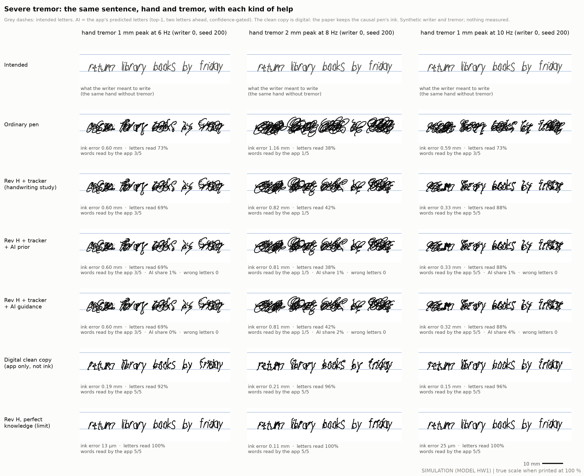
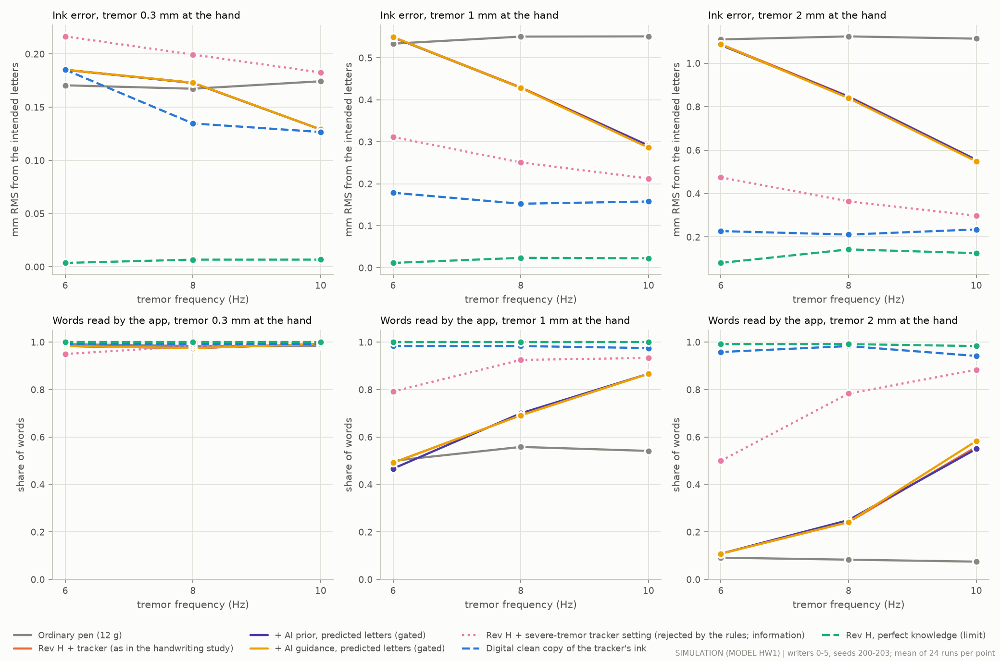
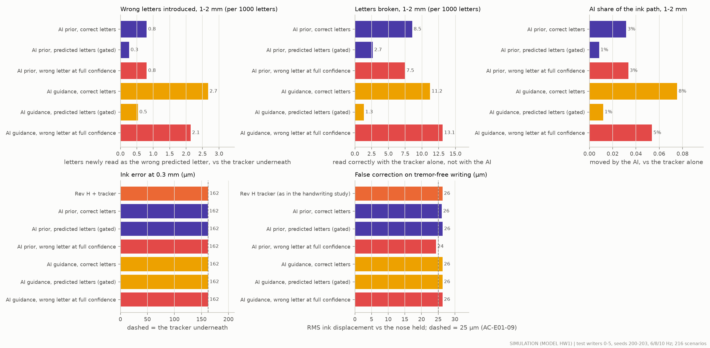
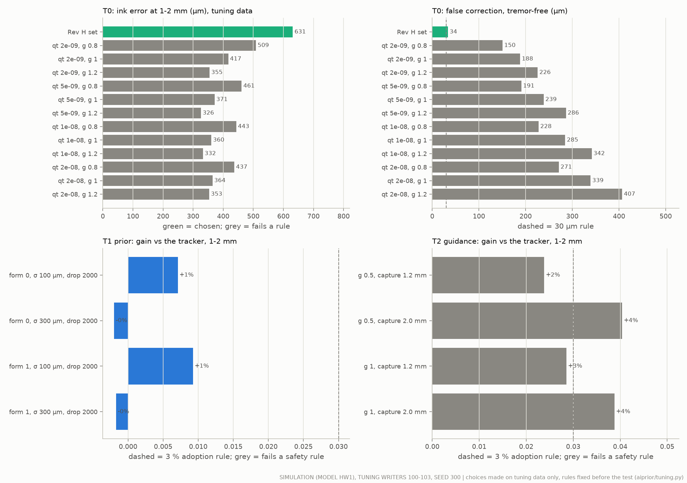

# AI help for severe tremor: does letter prediction close the tracker's gap?

**Status: a design question, studied in simulation only (2026-09-28).** Nothing was built or measured on a pen or a person. Every number carries a label:
- **SIM**: an executed simulation of model HW1 (`handwriting/`, used unchanged) on synthetic writers and synthetic tremor;
- **CALC**: a calculation;
- **LIT**: published literature, with its ledger id in `docs/evidence.csv`;
- **ASSUMPTION**: an input nobody has measured.

Every target here is a hypothesis until it is measured.

**Data.** Every final number uses the aiguide test writers 0–5 and seeds 200–203, with hand tremor at 6, 8 and 10 Hz and 0.3, 1 and 2 mm peak: 216 scenarios per variant. Every design choice was made on tuning writers 100–103 and seed 300 (seed 301 to confirm), with rules written before any test run (`aiprior/tuning.py`). Code: `aiprior/`. Results: `results/aiprior/`.

## 1. The same sentence with each kind of help



The same hand, sentence and tremor in every row, at true scale on 8 mm ruled lines (SIM, writer 0, seed 200). The grey dashes are the intended letters. Under each panel: the ink error, the letters and words the app reads, and for the AI rows the share of the ink path the AI moved and the wrong letters it introduced.
- Rows 3–5 look the same. That is the finding: the AI prior and the AI guidance barely change the ink.
- The digital clean copy (row 6) is made by the app after writing. It is readable, but it is not what is on the paper.

## 2. Short answer

- **No: the AI's letter predictions do not close the gap in the ink (SIM).** At 8–10 Hz and 1–2 mm, Rev H with its tracker leaves 531 µm of ink error; perfect knowledge of the tremor leaves 79 µm.
  - *AI prior inside the tracker:* 530 µm with the predicted letters. It closes 0 % of the gap. Even the true intended letters (a known text) close only 2 %.
  - *AI guidance of the nose:* 526 µm with the predicted letters (1 % of the gap). With every letter predicted correctly it closes 9 %; toward a known text, 12 %.
  - *At 6 Hz* neither does anything (818 → 816–818 µm).
  - Neither passed its rules on the tuning data, so **neither is adopted**. On the test grid, a wrong letter at full confidence made 3 (prior) and 8 (guidance) of 3744 letters read as the wrong letter.
- **Both are safe where it matters most (SIM).** At 0.3 mm the ink error is 162 µm with and without them. The predicted letters introduced no wrong letter. On tremor-free writing the pen moves the ink by 24–26 µm, as without AI.
- **Why the AI adds so little.**
  - The idea was that a template error of about 300 µm is small next to 1–2 mm of tremor. But the template error grows with the tremor: 317 µm at 0.3 mm, 535 µm at 1 mm and 938 µm at 2 mm (CALC). The pen places each letter where the shaking tip lands, and the app learns the writer's style from shaky ink.
  - The app can predict only 6 of the 26 letters confidently enough to send a template. Two letters ahead, its top guess is right for 27 % of letters (CALC).
  - The Rev H tracker's tremor model is nearly rigid, so it barely listens to any extra measurement, the template included. A tracker that listens also mistakes writing for tremor (§4.4).
  - Guidance switches on only when the tracker's own tremor estimate is large. At 6 Hz the tracker does not lock on, so guidance stays off.
- **The app's digital clean copy helps most (SIM, digital only).** It is signal processing with look-ahead, not letter prediction: the app sees the whole note, so it can remove the tremor with no delay.
  - At 8–10 Hz and 1–2 mm it reads 97 % of the words, against 59 % in the pen's ink (ink error 189 against 531 µm).
  - At 6 Hz it reads 97 % of the words, against 30 %.
  - It needs no letter prediction. **The paper still shows the pen's ink.**
- **The largest physical lever found is the tracker's own setting, not AI (SIM, rejected by the rules).** A setting that lets the tracker follow large tremor closes 55 % of the gap: 281 µm and 88 % of words at 8–10 Hz, 393 µm and 65 % at 6 Hz.
  - Its cost: it moves tremor-free writing by 263 µm (against 26 µm), and it makes 0.3 mm tremor 23 % worse.
  - So it failed the rules and is not adopted. It is worth testing only as a per-user "severe tremor" mode, chosen by the 20 s calibration, on real writing (EXP-W02).

**So, for "AI and physical help together" (proposed):**
- On paper: the nose and its tracker, plus a severe-tremor mode if real writing confirms it.
- In the app: the clean copy, recognition, spelling help and the calibration that chooses the tracker's setting.
- Guidance toward letters: only when the text is known (copying, tracing), never toward predicted letters in free writing.

## 3. What was tested (SIM)

**The pen and the hand.** Model HW1 of the handwriting study, used read-only (`docs/handwriting_outcomes.md` §3):
- Rev H: ±3 mm nose, 80 Hz servo, 0.84 N peak (`results/revH/tip_params.json`); the nose acts while the tip is within 2 mm of the page;
- the HAP-26 hand, adapted to the pen, compensating the paper drag;
- the fusion sensor models: IMU in the handle, page sensor at 1 kHz;
- the tracker: the accelerometer Kalman filter re-tuned for Rev H (`results/opt/inertial_tracker_revh.json`).

The "Rev H + tracker" and "perfect knowledge" rows reproduce the handwriting study exactly on the same seeds (a unit test checks 327.2 µm and 24.9 µm for writer 0, seed 200, 10 Hz, 1 mm). Over 8–10 Hz and 1–2 mm they give 835 → 531 µm and 31 % → 59 % of words, as there.

**The app's AI** (all from `aiguide/`, unchanged):
- *Text:* the calibrated Tatoeba-CC0 n-gram predictor. It predicts the letter two ahead, because the template must reach the pen before the tip lands.
- *Style:* aiguide's online style estimator. It learns from the app's own clean copy of a calibration pangram written with the same tremor, and of the hand path recorded while writing. It never learns from guided ink.
- *Placement:* each letter template is anchored where the tip touches down, at the handle position minus the tracker's tremor estimate.

**Prediction cases:**
- *AI-correct:* the right letter in the writer's estimated style, at full confidence;
- *AI-predicted* (realistic): the predictor's top guess, with its confidence gated by rule 5 (nothing below 0.5, full authority from 0.8);
- *wrong letter at full confidence* (safety): the most likely wrong letter, for every letter;
- *known text* (not AI; the upper bound of any template): the true intended letters, as when copying.

**The helpers:**
- **A(i) AI prior.** The template enters the tracker as extra information about the intended stroke (the "ctx" filter of `fusion/context.py`):
  - the page sensor's distance across the template is read as tremor;
  - its weight scales with the prediction's confidence;
  - a letter's template is dropped if it stays far from the stroke (rule T5).
  The template never moves the nose itself: the nose still cancels only the estimated tremor.
- **A(ii) AI guidance.** On top of the tracker, the nose pulls the ink partly toward the template (`aiprior/guide.py`). It corrects only the fast deviation from the template's shape, not the letter's placement. Its authority is the product of four gates:
  - the prediction's confidence;
  - the tracker's tremor-amplitude estimate (off for small or no tremor);
  - a capture distance around the template;
  - a drop rule for letters that stay far from the template.
  It is causal: a unit test changes future sensor samples and checks that no earlier command changes.
- **B Digital clean copy.** The app cleans the recorded tip path after writing (`aiprior/cleancopy.py`):
  - it finds the tremor line in the recording's own spectrum (4.5–13.5 Hz);
  - a zero-phase Wiener smoother removes that line and its harmonic;
  - a zero-phase band-stop filter was run as a check.
  It changes nothing when there is no clear line. On tremor-free writing it moved nothing.

**Metrics** (as in the handwriting study):
- *ink error*: RMS distance of the ink to the intended letters while the pen touches the paper;
- *letters read*: the app's recogniser; *words read*: the app's reader with its lexicon correction;
- *wrong letters introduced*: letters newly read as the wrongly predicted letter, against the tracker alone on the same scenario;
- *letters broken / fixed*: read correctly with the tracker alone but not with the AI, and the reverse;
- *device share*: the share of the ink's movement the device caused, against the same hand with the nose held;
- *AI share*: the same against the tracker alone, so it counts only what the AI added;
- *false correction*: how far each variant moves tremor-free writing;
- *gap closed*: (tracker − variant) / (tracker − perfect knowledge), on the mean ink error.

## 4. Results (SIM)

### 4.1 Ink error and words read



The orange "Rev H + tracker" line is hidden under the two AI lines: they lie on top of it.

Ink error and words read by the app (mean of 24 runs per cell; in brackets the change against the ordinary pen). "+ AI prior" and "+ AI guidance" use the predicted letters.

| Tremor at the hand | Ordinary pen | Rev H + tracker | + AI prior | + AI guidance | + guidance, correct letters | Severe-tremor setting (rejected) | Digital clean copy | Perfect knowledge |
|---|---|---|---|---|---|---|---|---|
| 6 Hz, 0.3 mm | 171 µm · 99% | 185 (+9%) · 98% | 185 (+9%) · 98% | 185 (+9%) · 98% | 185 (+9%) · 98% | 217 (+27%) · 95% | 185 (+9%) · 99% | 4 (-98%) · 100% |
| 6 Hz, 1 mm | 534 µm · 50% | 550 (+3%) · 49% | 549 (+3%) · 47% | 550 (+3%) · 49% | 550 (+3%) · 49% | 311 (-42%) · 79% | 179 (-67%) · 98% | 12 (-98%) · 100% |
| 6 Hz, 2 mm | 1110 µm · 9% | 1087 (-2%) · 11% | 1084 (-2%) · 11% | 1087 (-2%) · 11% | 1087 (-2%) · 11% | 475 (-57%) · 50% | 227 (-80%) · 96% | 81 (-93%) · 99% |
| 8 Hz, 0.3 mm | 167 µm · 98% | 173 (+3%) · 98% | 173 (+3%) · 98% | 173 (+3%) · 98% | 173 (+3%) · 98% | 199 (+19%) · 98% | 135 (-19%) · 99% | 7 (-96%) · 100% |
| 8 Hz, 1 mm | 551 µm · 56% | 430 (-22%) · 69% | 429 (-22%) · 70% | 429 (-22%) · 69% | 419 (-24%) · 71% | 251 (-54%) · 92% | 153 (-72%) · 98% | 24 (-96%) · 100% |
| 8 Hz, 2 mm | 1124 µm · 8% | 848 (-25%) · 24% | 845 (-25%) · 25% | 840 (-25%) · 24% | 796 (-29%) · 28% | 364 (-68%) · 78% | 211 (-81%) · 98% | 143 (-87%) · 99% |
| 10 Hz, 0.3 mm | 174 µm · 98% | 129 (-26%) · 99% | 129 (-26%) · 99% | 129 (-26%) · 99% | 129 (-26%) · 99% | 183 (+5%) · 100% | 127 (-27%) · 99% | 7 (-96%) · 100% |
| 10 Hz, 1 mm | 551 µm · 54% | 291 (-47%) · 87% | 291 (-47%) · 87% | 286 (-48%) · 87% | 255 (-54%) · 89% | 213 (-61%) · 93% | 158 (-71%) · 98% | 23 (-96%) · 100% |
| 10 Hz, 2 mm | 1113 µm · 8% | 556 (-50%) · 56% | 555 (-50%) · 55% | 548 (-51%) · 58% | 496 (-55%) · 59% | 298 (-73%) · 88% | 235 (-79%) · 94% | 126 (-89%) · 98% |

### 4.2 Averages and the share of the gap closed

Each cell: ink error · letters read · words read · share of the gap between the tracker and perfect knowledge that the variant closes.

| Variant | 8–10 Hz, 1–2 mm | 6 Hz, 1–2 mm | 0.3 mm, 6–10 Hz |
|---|---|---|---|
| Ordinary pen (12 g) | 835 µm · 51% · 31% | 822 µm · 51% · 30% | 171 µm · 98% · 99% |
| Rev H + tracker (as in the handwriting study) | 531 µm · 70% · 59% | 818 µm · 52% · 30% | 162 µm · 97% · 98% |
| + AI prior, predicted letters (gated) | 530 µm · 71% · 59% · 0% | 816 µm · 52% · 29% · 0% | 162 µm · 97% · 98% |
| + AI prior, correct letters | 524 µm · 71% · 60% · 2% | 805 µm · 52% · 29% · 2% | 162 µm · 97% · 98% |
| + prior from the known text (limit of any template) | 523 µm · 71% · 61% · 2% | 803 µm · 52% · 31% · 2% | 161 µm · 97% · 98% |
| + AI guidance, predicted letters (gated) | 526 µm · 71% · 60% · 1% | 818 µm · 52% · 30% · 0% | 162 µm · 97% · 98% |
| + AI guidance, correct letters | 491 µm · 72% · 62% · 9% | 818 µm · 52% · 30% · 0% | 162 µm · 97% · 98% |
| + guidance toward the known text (copying) | 475 µm · 74% · 65% · 12% | 818 µm · 52% · 30% · 0% | 162 µm · 97% · 98% |
| Severe-tremor tracker setting (rejected by the rules) | 281 µm · 88% · 88% · 55% | 393 µm · 73% · 65% · 55% | 200 µm · 94% · 98% |
| Digital clean copy of the tracker's ink | 189 µm · 97% · 97% · 76% | 203 µm · 96% · 97% · 80% | 149 µm · 98% · 99% |
| Digital clean copy, band-stop check | 161 µm · 98% · 99% · 82% | 184 µm · 97% · 94% · 82% | 133 µm · 99% · 99% |
| Digital clean copy of the recorded hand path | 150 µm · 98% · 99% · 84% | 194 µm · 96% · 97% · 81% | 121 µm · 98% · 99% |
| Rev H, perfect knowledge (limit) | 79 µm · 98% · 99% · 100% | 46 µm · 99% · 100% · 100% | 6 µm · 99% · 100% |

The clean-copy rows are digital, not ink; their "gap closed" only puts them on the same scale.

### 4.3 Safety and agency



Tremor 1–2 mm at 6–10 Hz (144 scenarios, 3744 letters), unless marked.

| Variant | Wrong letters introduced | Letters broken / fixed vs the tracker | AI share of the ink path | Device share | Ink error at 0.3 mm | False correction, tremor-free |
|---|---|---|---|---|---|---|
| Rev H + tracker alone | – | – | – | 27% | 162 µm | 26 µm |
| AI prior, predicted letters | 0 | 10 / 13 | 0.8% | 28% | 162 µm | 26 µm |
| AI prior, correct letters | – | 32 / 39 | 3.2% | 28% | 162 µm | 26 µm |
| AI prior, wrong letter at full confidence | 3 | 28 / 38 | 3.3% | 28% | 162 µm | 24 µm |
| AI guidance, predicted letters | 0 | 5 / 17 | 1.2% | 28% | 162 µm | 26 µm |
| AI guidance, correct letters | – | 42 / 74 | 7.5% | 28% | 162 µm | 26 µm |
| AI guidance, wrong letter at full confidence | 8 | 49 / 50 | 5.4% | 28% | 162 µm | 26 µm |
| Guidance toward the known text | – | 18 / 108 | 7.8% | 28% | 162 µm | not run |
| Severe-tremor setting (rejected) | – | – | – | 47% | 200 µm | 263 µm |
| Digital clean copy | – | – | – | – | 149 µm | 28 µm |

What the table says:
1. **No harm at 0.3 mm.** The AI variants give the same ink error as the tracker (162 µm) and introduce no wrong letter. At small tremor the amplitude gate keeps guidance off, and the prior finds nothing to change.
2. **No false correction.** On tremor-free writing every AI variant moves the ink by 24–26 µm, the same as the tracker alone. The clean copy adds 2 µm: the recorder's own noise. It left the writing itself unchanged (no tremor line, so no cleaning).
3. **Wrong predictions can make wrong letters.** With a wrong letter at full confidence, guidance made 8 of 3744 letters read as that wrong letter (2.1 per 1000), and the prior 3. The tracker alone makes none, by definition. The rule allows none, so guidance at this setting could not be adopted even if it had helped. With the realistic, gated predictions it made none, because few letters pass the gate.
4. **Agency.** The tracker already moves 27 % of the ink path, to cancel tremor. With the predicted letters the AI adds 1 % of the ink path; with every letter correct it adds 7.5 %. By design the nose can move the ink at most 3 mm from where the hand puts it, and guidance acts only while the hand writes, so the pen cannot start a letter on its own.
5. **The severe-tremor setting moves writing.** It moves tremor-free writing by 263 µm, ten times the tracker's 26 µm and above the 25 µm false-correction bound of AC-E01-09. Its device share is 47 %, close to perfect knowledge (47 %).

### 4.4 Why the AI adds so little

**The template error grows with the tremor (CALC on SIM templates).** Distance of the AI's letter templates from the intended letters, mean over the test grid:

| Tremor | Correct letter: total | after each letter's own offset | 3–15 Hz part | Predicted letter: total | Wrong letter: total |
|---|---|---|---|---|---|
| 0.3 mm | 317 µm | 225 µm | 122 µm | 959 µm | 1087 µm |
| 1 mm | 535 µm | 327 µm | 183 µm | 1093 µm | 1209 µm |
| 2 mm | 938 µm | 489 µm | 258 µm | 1369 µm | 1483 µm |

- The expectation was a fixed template error of about 300 µm. At 0.3 mm that holds (317 µm). But the pen anchors each letter where the shaking tip lands. Its tremor estimate at that instant carries what the tracker could not remove. And the app learns the style from ink that is cleaned only after the fact. So at 2 mm a correct template is 938 µm from the intended letter: as far off as the tracker's own residual (830 µm at 2 mm).
- The part of the error in the tremor band (183–258 µm at 1–2 mm) is what the prior would confuse with tremor. It is of the same size as the tremor the tracker leaves in that band. This matches the fusion study's finding on the pencil (`docs/sensor_fusion_ai.md` §6.2: 165 µm in the band).

**The predictor rarely knows the next letter (CALC).** On "return library books by friday", two letters ahead:
- the top guess is right for 7 of 26 letters (27 %);
- only 6 letters reach a confidence of 0.5 and get a template, and 4 of those 6 are right;
- the mean authority is 0.18.
So even perfect use of the predictions touches a quarter of the letters.

**The tracker barely listens (SIM, exploration on tuning writer 100, seed 300).** The Rev H tracker's tremor model has very little process noise (about 1e-10 m²/s). Its tremor estimate therefore barely moves with any measurement other than the accelerometer and its own model.
- With it, even the known-text template changed the ink error by 0 to −2 % (409 → 401 µm at 8 Hz, 1 mm; 1079 → 1059 µm at 6 Hz, 2 mm).
- With a tracker whose tremor states do listen (process noise 1e-8), the ink error fell a lot *without* any template (409 → 272 µm; 1079 → 498 µm), and the template then changed it by −4 % to +3 %.
- But that listening tracker also moves tremor-free writing by 150–400 µm (§4.6). It cannot tell writing from tremor either. The template does not tell it enough to fix that, because the template's own error is at the scale of the letter's detail.

**Guidance is gated by the tracker (SIM).** Guidance starts only when the tracker's tremor-amplitude estimate exceeds 191 µm, with full authority from 383 µm. A rule set that gate from the tuning data, so that it stays off at 0.3 mm and on tremor-free writing. At 6 Hz the tracker does not lock onto the tremor, its amplitude estimate stays low, and guidance never switches on. A separate tremor detector could open it (the clean copy's line detector, run on the last seconds of writing); that was not tested.

### 4.5 The digital clean copy (SIM; digital only)

- **What it does.** After writing, the app takes the recorded tip path: the page sensor (handle) plus the nose's Hall sensor. It finds the tremor line in the recording's own spectrum. Then it removes that line and its harmonic without delay (zero phase), leaving the slower writing.
- **How well.** At 1–2 mm tremor it brings the error to 153–235 µm at every frequency tested, and the app reads 94–98 % of the words (the ink on paper: 11–87 %). At 6 Hz, where the pen's tracker does nothing, it reads 97 % of words against 30 %.
- **Which recording.** Cleaning the recorded *hand path* (what the page sensor sees) works slightly better than cleaning the ink (150 against 189 µm at 8–10 Hz). The tracker's partial cancellation leaves a less regular tremor in the ink, which is harder to pick out.
- **Band-stop or smoother.** A plain zero-phase band-stop at the detected frequency works as well (161 µm); the Wiener smoother is the default because it removes only what stands above the writing's spectrum.
- **At 0.3 mm** the tremor line is often too weak to detect (peak-to-floor 1–4 on tuning data, threshold 3), so the copy often stays as written (149 µm, 99 % of words).
- **It needs no letter prediction.** The recogniser's templates were not needed and were not used.
- **Honesty.** The paper keeps what the causal pen wrote. The clean copy is a derived layer that cites the original strokes, shown next to the untouched ink (DEC-020 conventions). It should never be presented as the user's handwriting without saying so.

### 4.6 Tuning (tuning writers 100–103, seed 300; rules fixed before the test)



- **T0 — the tracker the AI sits on (SIM).** Twelve settings with more tremor-state process noise and a different output gain were compared with the Rev H setting.
  - All of them cut the 1–2 mm ink error: 631 µm (Rev H) → 326–509 µm on tuning data (seed 301: 603 → 319–488 µm).
  - All of them fail both safety rules. They move tremor-free writing by 150–407 µm (rule: ≤ 30 µm; the Rev H setting: 34 µm). And they worsen 0.3 mm tremor at one or more frequencies, by 8–80 % at the worst frequency.
  - So the Rev H setting stays, and the AI variants sit on it. The best-performing rejected setting is shown on the test grid for information ("severe-tremor setting").
- **T1 — the AI prior (SIM).** Four settings, measurement form × template noise.
  - It is safe: no wrong letter, no change at 0.3 mm, no change in false correction.
  - Its best gain is 0.9 %, below the 3 % needed to adopt it. **Not adopted.**
  - An exploration on tuning writer 100 had already shown that even a perfect template gains at most 2 %. So T1 ran on writers 100–101 only, and the prior was not polished further.
- **T2 — the AI guidance (SIM).** Four settings, gain × capture distance.
  - The gains were 2.4–4.0 %, but every setting made 1–7 letters read as the wrong letter at full confidence.
  - **Not adopted.** The test grid shows, for information, the setting with the fewest wrong letters (gain 0.5, capture 1.2 mm).
- **Clean copy.** Its settings were set on tuning writer 100 before any test run and not searched (§6, item 2).

## 5. What to build (proposed design; nothing is measured)

1. **Keep the tracker as the only corrector of free writing.** Keep the template prior in the code but off, as the fusion study already recommended.
2. **No guidance toward predicted letters in free writing.** It gains 1 % of the gap and can create wrong letters. Keep guidance for known text: copying, tracing and dictation practice. There it closed 12 % of the gap at 8–10 Hz, fixed 108 letters and broke 18, and never had a wrong target.
3. **Test a severe-tremor mode on real writing.** It could halve the ink error at 1–2 mm, including at 6 Hz, where nothing else works. But it moves the writer's own strokes by about 0.26 mm. Only the 20 s calibration should switch it on, and only for large tremor. Real writing (EXP-W02) decides whether its false correction is acceptable.
4. **Ship the clean copy in the app.** It is the one software function here that makes severe-tremor notes readable (97 % of words at 1–2 mm), and it works at every frequency tested. Show it next to the untouched ink, and say it is a digital copy.
5. **For Parkinson's, poor handwriting and dyslexia** nothing here changes the handwriting study's advice (`docs/handwriting_outcomes.md` §6): cues and lines for letter size, guided practice with fading, and spelling help in the app. This study adds only that AI-predicted templates should not steer free writing.

## 6. What changed during the study (in full)

1. **T1 was cut short** (§4.6), as the brief allows for a variant that is not promising on tuning data.
2. **The clean copy's tremor detector was fixed before the test grid.** A smoke run of one scenario on test writer 0 showed the first version reading the writing's own stroke rhythm (3–4 Hz) as a tremor line on tremor-free writing, and so removing part of the letters. The fix was set on tuning writers 100–103 only:
   - search band 4.5–13.5 Hz (there, tremor-free writing reads 1.0–1.5 and 1–2 mm tremor reads 5–47);
   - threshold 3, twice the largest tremor-free value;
   - the filter never reaches below 3 Hz.
   The same smoke run also confirmed the tracker reproduction on writer 0. No setting was changed after the test grid ran.
3. **The T1 and T2 runs learnt the templates' style from the first clean-copy version.** It cleans tremor-laden tracks in the same way, so the tuning choices would not change.

## 7. Assumptions

Each item says what was assumed and which way it pushes the results.

**Carried over from the handwriting study (model HW1, unchanged).**
1. **Synthetic writers and tremor** (aiguide glyph writers; the project's tremor model: one fixed axis, 0.3 Hz frequency wander, 30 % amplitude change, 15 % second harmonic). Their letters are sharper than real ones, which makes tremor harder to tell from writing. Real tremor also changes with posture and effort; LIT PDT-36 describes ET in the ink as regular, along one axis.
2. **The hand** is the HAP-26 impedance. It is passive: it neither follows nor resists the nose. The writer is adapted to the pen and compensates the paper drag. There is no learning. A writer who resists guidance would lower its effect; one who follows would raise it.
3. **Rev H** is `results/revH/tip_params.json` (±3 mm, 80 Hz servo, 0.84 N peak). The nose acts while the tip is within 2 mm of the page (rule T7).
4. **Sensors** are the fusion models: IMU in the handle, page sensor at 1 kHz with 2 ms delay and 3 µm noise.
5. **Estimates are made on the nose-held run's sensor streams**, as `handwriting/tracker.py` does. In the closed loop the handle moves a little differently, because the nose pushes back on it. The guidance command uses the same streams.

**New in this study.**
6. **The app's text AI** is aiguide's Tatoeba-CC0 n-gram predictor, two letters ahead. Its confidence is gated by rule 5: no template below 0.5, full authority from 0.8. One sentence was used; a larger language model might predict better, but the template error (§4.4) would remain.
7. **The app's style model** learns from its own clean copy: of a calibration pangram written with the same tremor (hand path + tremor, without pen dynamics, as aiguide), and of the handle track recorded while writing. It never learns from guided ink.
8. **Templates are anchored at the tip's touchdown**, at the handle position minus the tracker's tremor estimate. The pen only knows its position through its sensors, so residual tremor at touchdown moves the whole letter.
9. **The recorded tip path** for the clean copy is the handle (page sensor, 3 µm) plus the nose (Hall sensor, 5 µm, ASSUMPTION) at 1 kHz. The app bridges the short pen-up gaps where the page sensor is out of range.
10. **Reading** is done by the app's recogniser and its lexicon correction, not by people. The recogniser is lenient with odd letter shapes. A person may read a hybrid letter differently.
11. **"Wrong letters introduced"** are letters newly read as the wrongly predicted letter, compared with the tracker alone on the same scenario.
12. **The clean copy's tremor detector** searches 4.5–13.5 Hz. A 4 Hz tremor (outside this study's grid) sits on the writing's own stroke rhythm and would need another cue, such as the IMU while the hand rests.

## 8. Experiments needed

Nothing here is measured. These experiments would turn the simulations into evidence.

| Id | Question | What to do | Decides |
|---|---|---|---|
| **EXP-W02** (existing, extended) | Can a tracker separate 1–2 mm tremor from real writing, and what does a severe-tremor setting cost? | Record ET writers with 1–2 mm tremor and healthy controls with the instrumented pen (EXP-H01). Run the Rev H setting and the severe-tremor setting offline. Measure false correction on the controls' writing. | Whether a calibration-selected severe-tremor mode is worth its false correction (§4.6) |
| **EXP-A02** (existing, extended) | Do people accept AI guidance, and does it ever make a letter they did not intend? | Guidance toward known text (copying) and toward predicted letters, with 10 % deliberately wrong templates; ET writers with 1–2 mm tremor. Measure legibility to blinded readers, agency ratings, wrong letters and "fighting" forces. | Whether any free-writing guidance is allowed. This study predicts: not toward predicted letters; possibly toward known text |
| **EXP-A03** (existing, extended) | Is the clean copy readable to people, and does it ever change a letter? | Blinded raters read the raw ink and the clean copy of recorded ET notes. Compare the recogniser's reading with the raters'. | Whether the clean copy is shown by default |
| **EXP-A04** (proposed) | How far is a correctly predicted letter from what an ET writer intended? | Build style templates from the clean copy of each writer's own notes. Compare them with the same writer's slow, careful tracing of the same text. | Whether better templates could ever change the prior's result (here 535–938 µm at 1–2 mm: too far) |

Criteria in `validation/acceptance_criteria.csv`: AC-W02-03 (the severe-tremor setting offline), AC-A03-04 and AC-A03-05 (the clean copy read by blinded readers, and no harm on tremor-free notes); AC-A02-01 already counts wrong letters under guidance with 10 % deliberately wrong templates. Decision: DEC-035.

Order: EXP-W02's offline part and EXP-A03 first. They need recordings but no prototype, and they decide the two things that could help people with severe tremor: a severe-tremor mode and the clean copy.

## 9. Files and how to run

```
python3 -m aiprior.run_study [--quick] [--workers 2] [--stages t0 t1 t2 test report]
python3 -m pytest -q aiprior/tests          # 7 tests
```

The full run takes about 20 minutes with two processes: tuning about 7 minutes, the test grid about 12. `--quick` (2 writers, 1 seed; about 5 minutes) writes to `aiprior/build/quick/` and never overwrites the results. Stage caches are in `aiprior/build/cache/` (git-ignored).

**Code** (`aiprior/`, new; `handwriting/`, `fusion/` and `aiguide/` are used read-only):

| File | What it does |
|---|---|
| `core.py` | Writer set-up, tremor scenarios, sensor streams, the tracker and the oracle (the handwriting study's conventions and seeds). The app's AI: predictions, style from the clean copy, touchdown-anchored templates, template error |
| `guide.py` | A(ii): the causal guidance command (numba) |
| `cleancopy.py` | B: tremor-line detector, zero-phase band-stop, non-causal Wiener smoother |
| `study.py` | Every variant on one scenario, with the metrics (wrong letters, broken letters, device and AI share, false correction) |
| `tuning.py` | Stages T0–T2 on tuning data, with the rules written before the test |
| `report.py`, `evidence.py` | Figures and CSV twins, `aiprior.json`, `samples.json`, proposed ledger rows |
| `run_study.py` | The one command |
| `tests/test_aiprior.py` | Causality and gating of the guidance; the clean copy on clean and tremor-laden signals; the selection rules; exact reproduction of the handwriting study's tracker and limit numbers; output schemas |

**Results** (`results/aiprior/`):
- `fig_before_after.png`: the big figure (§1);
- `fig_summary.png`: ink error and words read against frequency, for each tremor size;
- `fig_safety.png`: wrong letters introduced, letters broken, AI share, 0.3 mm, false correction;
- `fig_tuning.png`: the tuning stages and their rules.

Each `.png` has a `.csv` twin with the plotted numbers. Also:
- `aiprior.json`: every aggregate, the tuning tables and choices, the configuration, and provenance (`stabpen.provenance`: git revision, parameter digest, seeds, command, input-file hashes);
- `samples.json`: the figure's ink paths for the explainer page, in the schema of `results/handwriting/samples.json`;
- `evidence_rows.csv`: proposed ledger rows ACT-76…ACT-80 and EML-40…EML-41, with the exact 23-column header of `docs/evidence.csv`, for the lead to merge.

**Other files this study read (not edited):** `results/revH/tip_params.json`, `results/opt/inertial_tracker_revh.json`, `config/parameters.yaml`, and the `handwriting`, `fusion`, `aiguide` and `app/penapp` packages.
