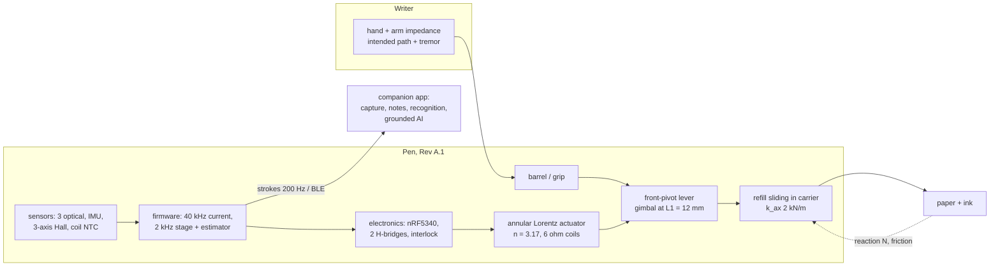

# System architecture (research pen Rev A.1)

**Status:** proposed design. The document ties the subsystem packages together, and each section says where the detail and the evidence are. Numbers come from calculation or simulation unless marked otherwise; none is a measurement.

## 1. What the system is

Configuration B, the front-pivot lever (DEC-003), is the **research pen**. It exists to measure what the audit found unmeasured:

- the transverse load (EXP-B01);
- tremor at the nib (EXP-H01);
- causal separability of tremor from writing (EXP-E01);
- loaded cancellation (EXP-B09).

Configurations D (nose skid) and E (slow bias actuator) remain the **product-path candidates** (DEC-008), because configuration B's holding power sits at the moving-coil thermal limit.

## 2. Reference frames

Page frame {P} (e_x, e_y, n) and housing frame {H} (x_H, y_H, z_H = a). Orientation is given by altitude θ, azimuth φ and roll ρ. Definitions and the Jacobians are in [`physics.md`](physics.md) P-1 to P-4, implemented in `stabpen/frames.py`. Signs and units for every interface signal are in [`icd.md`](icd.md) §1.

Two consequences shape the design:

- **Page-referenced correction.** A stage move q produces a page displacement J q. With a compliant grip, the tilt-direction gain is sin θ + γ cos²θ / sin θ (COR-04), not the textbook 1/sin θ. The compliance-aware form halves the oracle residual at 50° (0.27 → 0.13; `results/sim/design_sweeps.json`).
- **Ink position is independent of orientation.** The ball is spherical, so capture needs page-referenced position only (optical + IMU), and IMU-only capture is ruled out (COR-08).

## 3. Control architecture

| Layer | Rate | Function | Reference |
|---|---|---|---|
| Current loop | 40 kHz | PI per axis with pole cancellation; duty clamp from VBAT; dual-extreme current sampling | `electronics/calcs/drive_sense.py`; `firmware/` |
| Stage servo | 2 kHz | PID on the Hall stage position; reference, acceleration and lever-arm (`lam_hat`) compensation; no contact feedforward (DEC-011) | physics P-19 |
| Estimator | 2 kHz | Page-referenced housing motion (optical + IMU fusion) → Kalman intent/oscillator → frequency tracking, confidence, frequency gate → prediction at horizon h | physics P-20 to P-22 |
| Authority and limits | 2 kHz | g = g_max · confidence · gate · fades; radial soft limit 0.55 mm, 0.1 mm taper; slew 0.08 m/s | ICD §6 |
| Supervisor | 2 kHz / events | Modes, fault bits, derating; hardware interlock ACT_EN = REQ·FAULT_N·NOCHG | ICD §6; DEC-015 |
| Optional learned predictor | 250 Hz | Behind `ml_guard`; falls back to the Kalman estimate | ICD §5; DEC-016 |

**Timing chain (nominal).**

- IMU group delay 1 ms (optical 2 ms, bridged by the IMU).
- Half the stage period, 0.25 ms.
- Current loop 0.08 ms.
- Total prediction horizon h = 1.33 ms (`model.build_params`, `horizon_s`).

The delay-limited residual (P-23) at 8 Hz is 2 sin(π·8·1.33 ms) = 0.067 for pure delay. **Delay is therefore not the limiting factor. Intent separation is** (COR-11).

## 4. Budgets

| Budget | Allocation / estimate | Status | Source |
|---|---|---|---|
| Mass | 33.2 g with polymer rear barrel, incl. allowances and 10 % contingency (≤ 35 g) | calculation; meets requirement | `results/mechanics/mass_budget.json` |
| Centre of mass | 76.0 mm from tip (≤ 70 mm) | **violated** (M-1) | same |
| Tip-equivalent inertia | 13.7 g (≤ 12 g) | **violated** (M-6); CFRP carrier ≈ 9.5 g | CAD distributed-mass |
| Stage travel | q_lim 0.55 mm control, 0.60 mm mechanical; paddle–magnet clearance ≥ 93 µm RSS | calculation | `results/mechanics/tolerance.json` |
| Holding power (θ 50°, N 1 N) | 0.50 W copper in contact against 0.412 W allowable for a moving coil; 0.33 W average at 65 % pen-down, coil ≈ 97 °C | **over the limit in continuous contact** (E-8, M-5) | thermal, trade (v0.4.3) |
| Share of writing envelope within thermal limit | 70 % (continuous contact) | calculation | `drive_sense.json` |
| Electronics power | 115 mW (optics placeholder 15 mA) | calculation | `drive_sense.json` |
| Runtime, 200 mAh pouch | 54 min continuous contact at the design point; 81 min writing at 65 % pen-down duty. A cell fitting the Rev A.1 bay may be ~130 mAh (DEC-014) | calculation | `results/trade/config_trade.json`; `electronics/README.md` |
| Supply headroom | 6 Ω: at 3.3 V the static hold exceeds the supply at 0.5 % of the thermally allowed envelope (hot, high-force corner); 4 Ω holds everywhere | calculation; **open** (DEC-012 revisited, EXP-B03) | `drive_sense.json` |
| Ink error (neutral pen vs rigid pen) | device distortion ≈ 59 µm RMS | simulation | `results/sim/design_sweeps.json` |
| Ink error from false corrections (no tremor) | Kalman ≈ 55–100 µm (4 nominal / 12 grid seeds; one set for both profiles since v0.4.2, `docs/sim_report.md` §3.2); band-pass ≈ 170 µm. REQ-CTRL-005 (≤ 50 µm) **violated** | simulation | `results/sim/sweeps/summary.json`, `results/sim/nominal/metrics.json` |
| Tremor residual (with tremor) | oracle bound 0.22–0.32 of powered-neutral across 4–12 Hz; causal estimators ≥ 1.0 below 9 Hz (Kalman 1.03–1.14; worse at 0.15 mm) | simulation | same |
| Stage-period compute (500 µs) | CPU ≈ 130 µs; SAADC ≈ 210 µs | proposed schedule | `fig_stage_timeline.png` |
| Product capture data | 200 Hz × 24 B (20 B payload + 4 B framing) = 4.8 kB/s, ≈ 17 MB/h; 16 MB flash ≈ 1 h | calculation | ICD §4.3 |
| Research logging | 2 kHz × 56 B (52 B payload + 4 B framing) = 112 kB/s over USB | calculation | ICD §4.2 |
| PCB area | as drawn 779 mm² vs 517 mm² available; Rev A.1 plan fits a 41 mm board at 0.65 density | **open** (DEC-014) | `results/electronics/placement_study.json` |

## 5. Safety architecture

- **Hardware.** Window-comparator over-current latch; charging interlock; load switch on VMOT; independent watchdog. In ngspice, a coil short trips in 8.8 µs and VMOT opens at 22.6 µs.
- **Firmware** (DEC-015):
  - never de-energise in contact except on hard faults;
  - detect a frozen or implausible stage sensor within 5 ms;
  - derate on heat, low battery and lost optical tracking, fading authority before pen-up;
  - `ml_guard` bounds any learned output.
- **Claims** (DEC-002): assistance and capture only; no diagnosis. Parkinson's support is cueing, feedback and practice.

## 6. Features

See [`features.md`](features.md) for what each mode does, for whom, what supports it, and what may be claimed.

## 7. Where things are

| Area | Package |
|---|---|
| Requirements and evidence | `docs/requirements.csv`, `docs/evidence.csv`, `docs/research_synthesis.md` |
| Audit | `docs/audit.md`, `docs/corrections.csv` |
| Physics and simulation | `docs/physics.md`, `docs/sim_report.md`, `sim/`, `stabpen/` |
| Mechanics | `mechanics/README.md` |
| Electronics | `electronics/README.md` |
| Firmware | `firmware/README.md` |
| ML | `ml/README.md` |
| App | `app/README.md` |
| Validation | `validation/README.md` |
| Decisions | `docs/decisions.md` |
