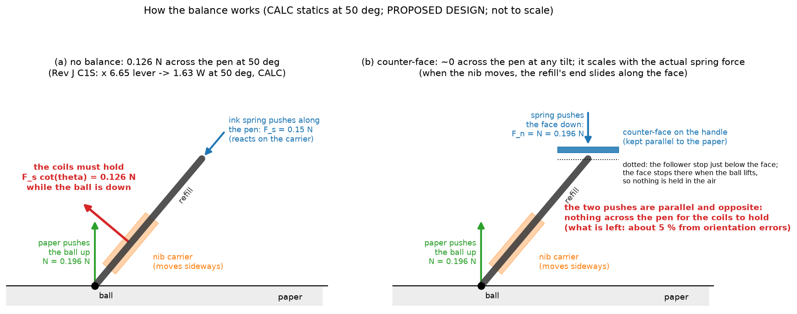
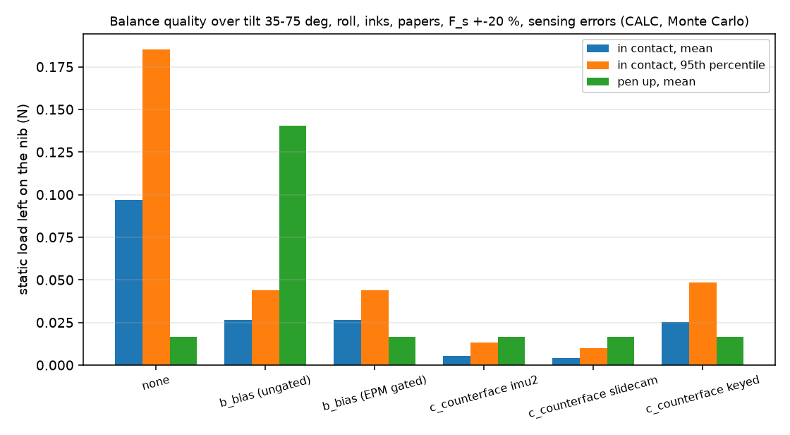
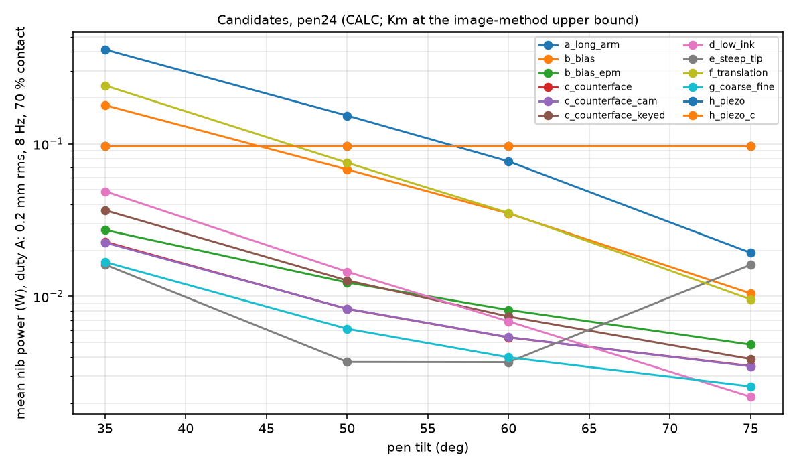
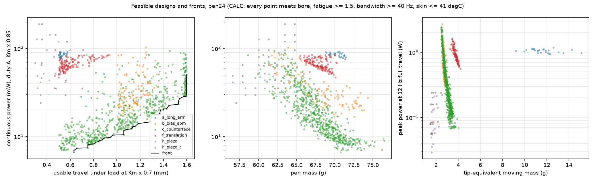
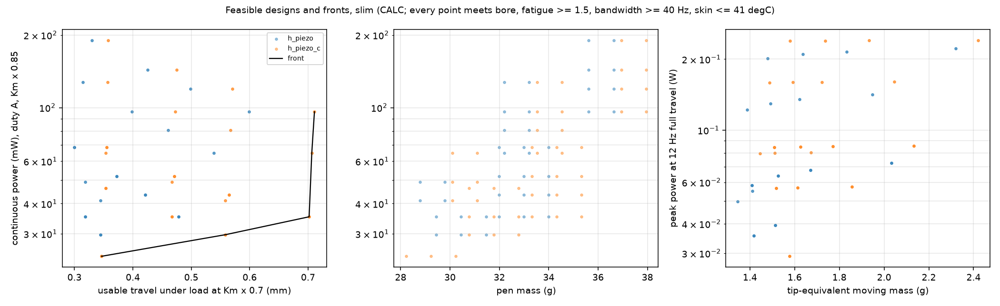
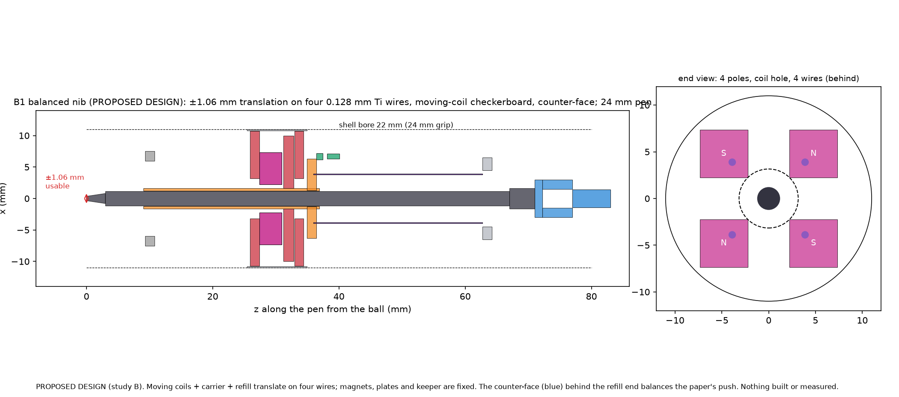
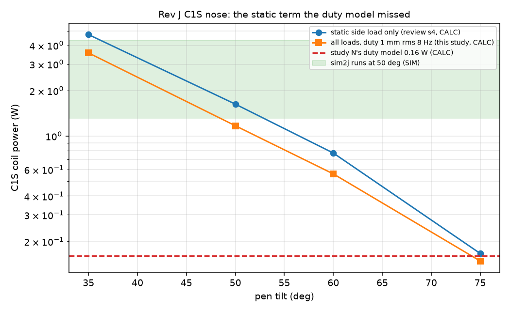
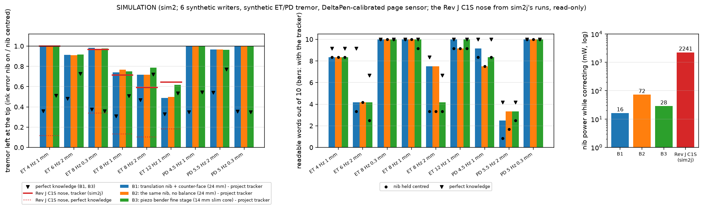
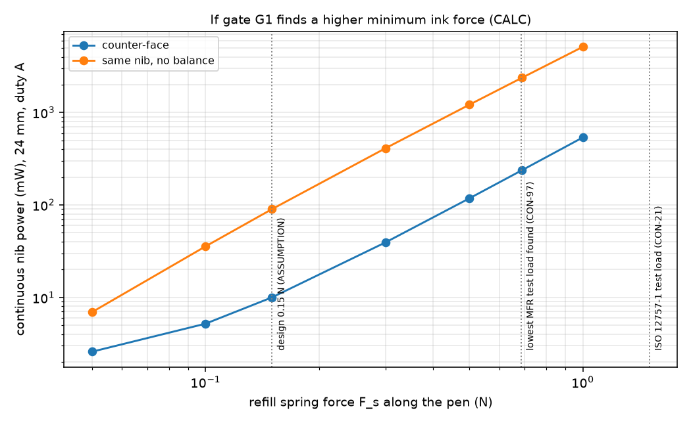
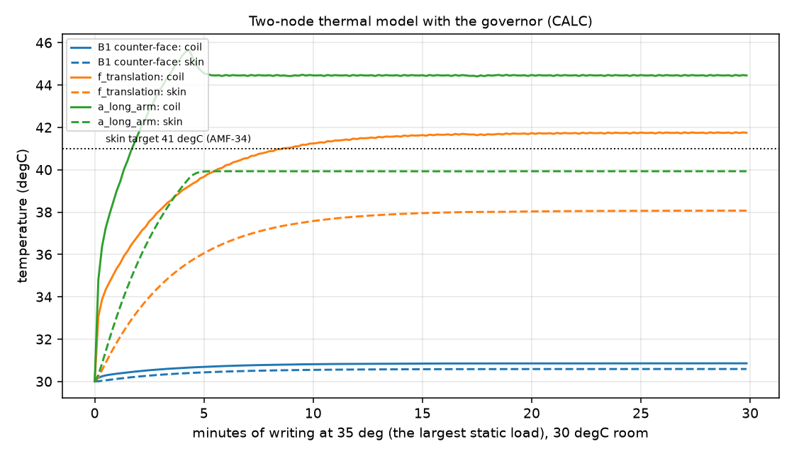

# The answer in plain words: the balanced two-axis nib (study B, round 4)

- **The review is right, and the load is bigger than the budget said.** The Rev J C1S nose holds the ball on the paper with its coils. The refill spring pushes the ball along the tilted pen; the paper pushes back straight up, so part of its push acts across the pen (0.15 N x cot(tilt): 0.21 N at 35 deg). The C1S lever (ball 76.5 mm, magnets 11.5 mm from the pivot) multiplies it by 6.65, and the coils burn 4.72 / 1.63 / 0.17 W at 35 / 50 / 75 deg just holding still (CALC, the review's numbers reproduced). Study N's duty model counted the ball's drag but not this sideways part (details in section 5.1).
- **Balance it with the spring, not with current.** Let the ink spring push the refill from its back end through a small face that is kept parallel to the paper. The face's push and the paper's push are then parallel and opposite: there is nothing left across the pen for the nib to hold, at any tilt. Because the spring's own force does the balancing, it follows the actual ink force (a new refill, another ink) without calibration, and a stop lets the face go when the ball lifts, so nothing is held in the air (the figure below).
- **The nib for the first prototype (B1):** the refill rides in a titanium carrier that slides sideways +-1 mm on four thin titanium wires; flat moving coils on the carrier sit between four fixed magnets (so there is no magnetic pull and no negative stiffness); the counter-face sits behind the refill; the pen stays 24 mm. Continuous nib power 7.6 mW at the comparison duty (17.6 mW at 35 deg; 15.4 mW if the magnets are 30 % weaker), holding heat at most 1.6 mW (the limit is 100 mW, REQ-RVJ-N10), +-1.06 mm of travel under the worst static load even if the magnets are 30 % weaker than calculated, 3.5 g moving at the tip, pen 69 g, skin 30.6 degC in a 30 degC room, about 38 h per charge (the electronics dominate). CALC.
- **The alternatives, in one line each.** The same nib without the balance: 90 mW on average but 314 mW of holding heat at 35 deg, over the 0.1 W limit (REQ-RVJ-N10) below about 50 deg. A scheduled bias spring with a clutch that lets go at every lift (b'): 8 mW holding at worst; without the clutch it pushes the nib over whenever the pen is lifted. A longer lever like Rev H: 76 mW and only about +-0.5 mm once the magnets are 30 % weaker. A lower ink force helps in proportion, but nobody knows yet how low it can go. A bent tip needs a custom short cartridge. (Sections 2 and 3.)
- **In simulation:** the sim2 runs had not finished when this page was generated (section 6).
- **Slim 12-16 mm core:** magnet-and-coil nibs around a D1 refill do not fit (they run out of force or of travel). Piezo benders do: +-0.56 mm with 29.7 mW at 12 mm (with the counter-face; CALC). That is a separate branch, not the first prototype.
- **Not proven:** the lowest ink force that still writes (no source gives it; 0.15 N is 4.6 x below the lowest maker's test load found), the real magnet strength, that the face mechanism behaves as modelled, the friction numbers, the wire fatigue with real clamps, and every tremor result (simulated). Nothing was built or measured.
- **Do next:** G1 measures the ink force and the friction (EXP-B20, EXP-B21); G2 benches the counter-face (EXP-B22), the actuator coupon (EXP-B23) and the wires (EXP-B25); then the one- and two-axis nib on the tremor rig (G3, G4).

Evidence labels: CALC (a calculation in `bnib/`), SIM (an executed sim2 run), LIT / MFR (a ledger id in `docs/evidence.csv` or this study's `results/bnib/evidence_rows.csv`), ASSUMPTION (unmeasured), PROPOSED DESIGN. The results are in `results/bnib/bnib.json`; the nib's interface in `config/nib.yaml`.

## 1. How the balance works

(a) Today: the spring pushes the refill along the pen from the moving carrier. The paper's push on the ball is vertical; its component across the pen, F_s cot(theta), must be held by the nib's coils whenever the ball is down. (b) Counter-face: the spring pushes a face on the handle, set parallel to the paper, against the refill's rolling rear end. The paper's push (up) and the face's push (down) are parallel, so the refill needs no sideways force from the nib; the two forces are offset along the pen, and that couple goes into the carrier's bushings and the wires' tilt stiffness, not the coils. When the nib moves, the refill translates parallel to the paper, so its end slides along the face and the face does not move. When the ball lifts, the refill moves forward, the face lands on a stop set a small gap (0.15 mm) beyond its writing position and leaves the refill: nothing is held in the air. The stop and the face's orientation are set slowly (seconds) by three small screw motors with no holding power, from the pen's motion sensor and the refill-slide sensor. CALC statics; PROPOSED DESIGN.

Balance quality (CALC, Monte Carlo over tilt 35-75 deg, all rolls, oil and gel ink, six papers, spring +-20 %, IMU tilt / roll errors 1 / 2 deg): residual 5.3 mN mean (6 % of the unbalanced 96 mN), 95th percentile 13.1 mN, pen-up 16.6 mN (the moving mass's weight). The scheduled bias spring leaves 26.5 mN in contact but 140 mN during pen-up unless a clutch releases it; a keyed grip instead of the roll motor leaves 25.4 mN. 

## 2. Results cards

Common conditions (CALC): duty A = sinusoidal correction 0.2 mm rms per axis at 8 Hz, writing at 30.5 mm/s (LIT CON-20) in all directions, ball on the paper 70 % of the time (ASSUMPTION); duty B = 0.5 mm rms for the +-1 mm nibs; refill spring 0.15 N along the pen (ASSUMPTION); friction map (LIT CON-13 + ASSUMPTION shapes); Km at the image-method upper bound (the optimiser checks travel at 0.7 x); 30 degC room; two-node thermal model with the governor; coils 2.5 ohm at 3.7 V / 1.5 A. For reference, the C1S nose's mean power (70 % contact, 1 mm rms duty): 35 deg 3.56 W, 50 deg 1.17 W, 60 deg 0.56 W, 75 deg 0.15 W (CALC). The cards use each candidate's hand-sized design with the same actuator (b-g); the optimised designs are in section 3.

### 2.1 The 24 mm pen (DEC-029)

#### (a) longer-arm gimbal (Rev H layout, lever 1.32), no balance - pen24

*Verdict (CALC):* **feasible: 165.7 mW continuous (duty A), 1.00 mm under load, 73 g; FAILS REQ-RVJ-N10 (holding 558 mW at the worst tilt > 0.1 W)**

| power, mW (CALC, duty A) | 35 deg | 50 deg | 60 deg | 75 deg |
|---|---|---|---|---|
| holding, ball on the paper | 558 | 206 | 101 | 22.7 |
| pen up | 10.8 | 6.66 | 4.03 | 1.08 |
| friction share | 19.7 | 6.67 | 4.27 | 2.87 |
| dynamic (inertia + suspension) | 0.46 | 0.25 | 0.21 | 0.19 |
| mean, roll 0 | 414 | 153 | 76.6 | 19.3 |
| mean, worst roll | 414 | 153 | 76.6 | 19.3 |
| holding, worst roll | 558 | 206 | 101 | 22.7 |

- continuous power (mean 35-75 deg, duty A / duty B): 166 / 167 mW
- peak power (12 Hz full travel, 35 deg, hot coil): 1.489 W
- travel under load (35 deg; design): +-1.00 mm (+-1.00 mm)
- tip-equivalent moving mass: 5.71 g
- Km at the tip (centre / worst corner): 0.344 / 0.296 N/sqrt(W) (image-method upper bound)
- bandwidth (first parasitic mode / 3): 164 Hz
- coil / skin temperature, 30-min run at 35 deg, 30 degC room, governor: 45.7 / 39.9 degC (governor authority down to 0.85)
- pen mass / diameter / length / centre of mass: 73.4 g / 24 mm / 144 mm / 82 mm from the tip
- battery time (electronics + nib): 9.2 h
- fatigue (43.2 M cycles, full stop travel, Kt): Goodman SF 4.12, strain 0.43 x 1e-3 with Kt 1.3 (301 FH strips 75 um); buckling margin 3.1 x the magnet pull
- drop / shock: Rev J.1's rule: axial stops <= 5 um rear / 20 um front keep buckled strips elastic (revj1.gimbal.shock_check)
- sensing: nib: TMAG5170-A1 3-D Hall (MFR OPT-44/OPT-53) over a 1 mm N52 magnet on the carrier; coil-field cross-talk calibrated by current (EXP-B24) (0.94 um rms at 1 kHz, CALC); page: DeltaPen-class optical flow (LIT OPT-01/02)
- manufacturability: D1 refill (ISO 12757-1 type D, LIT CON-22), user-replaceable from the front; 75 um 301 FH cross-strip gimbal (photo-etched, AMF-59), axial shock stops (Rev J.1 rule); spherical magnet cap and coil plate (study N's C1S parts, custom curved faces)
- failure state (unpowered): the nib sags onto its soft stop (ball offset <= travel + 0.2 mm): writes as a normal pen

#### (b) tilt/roll-scheduled bias spring (positioner, no clutch) - pen24

*Verdict (CALC):* **feasible: 73.0 mW continuous (duty A), 1.00 mm under load, 71 g; meets REQ-RVJ-N10 (holding <= 7.7 mW)**

| power, mW (CALC, duty A) | 35 deg | 50 deg | 60 deg | 75 deg |
|---|---|---|---|---|
| holding, ball on the paper | 7.66 | 5.01 | 2.82 | 0.55 |
| pen up | 510 | 188 | 91.1 | 19.2 |
| friction share | 18.9 | 6.38 | 4.09 | 2.75 |
| dynamic (inertia + suspension) | 1.56 | 1.56 | 1.56 | 1.56 |
| mean, roll 0 | 179 | 67.8 | 34.9 | 10.5 |
| mean, worst roll | 179 | 67.8 | 34.9 | 10.5 |
| holding, worst roll | 7.66 | 5.01 | 2.82 | 0.55 |

- continuous power (mean 35-75 deg, duty A / duty B): 73.0 / 81.2 mW
- peak power (12 Hz full travel, 35 deg, hot coil): 0.197 W
- travel under load (35 deg; design): +-1.00 mm (+-1.00 mm)
- tip-equivalent moving mass: 3.01 g
- Km at the tip (centre / worst corner): 0.352 / 0.282 N/sqrt(W) (image-method upper bound)
- bandwidth (first parasitic mode / 3): 182 Hz
- coil / skin temperature, 30-min run at 35 deg, 30 degC room, governor: 38.3 / 35.7 degC
- pen mass / diameter / length / centre of mass: 71.1 g / 24 mm / 148 mm / 72 mm from the tip
- battery time (electronics + nib): 16.5 h
- fatigue (43.2 M cycles, full stop travel, Kt): Goodman SF 1.91, strain 1.15 x 1e-3, stress 236 MPa with Kt 1.8 (Ti6Al4V)
- drop / shock: axial stops 20 um: wire stress 91 MPa at 2000 g; buckled wires stay elastic: True
- sensing: nib: TMAG5170-A1 3-D Hall (MFR OPT-44/OPT-53) over a 1 mm N52 magnet on the carrier; coil-field cross-talk calibrated by current (EXP-B24) (0.94 um rms at 1 kHz, CALC); page: DeltaPen-class optical flow (LIT OPT-01/02)
- manufacturability: D1 refill (ISO 12757-1 type D, LIT CON-22), user-replaceable from the front; 4 x Ti-6Al-4V wires, laser-welded or crimped into ring clamps with a 0.1 mm radius (Kt ~1.3-1.8); two-layer flat racetrack coils (self-bonding 0.10 mm wire) on a polyimide former, or a 4-layer flex PCB coil; 4 x N52 cuboid magnets on a laser-cut 1010 plate; a 1010 keeper; both bonded in the stator housing
- failure state (unpowered): the nib sags onto its soft stop (ball offset <= travel + 0.2 mm): writes as a normal pen

#### (b') scheduled bias with an electro-permanent clutch (released at every lift) - pen24

*Verdict (CALC):* **feasible, low power: 13.1 mW continuous (duty A), 1.00 mm under load, 72 g; meets REQ-RVJ-N10 (holding <= 7.7 mW)**

| power, mW (CALC, duty A) | 35 deg | 50 deg | 60 deg | 75 deg |
|---|---|---|---|---|
| holding, ball on the paper | 7.66 | 5.01 | 2.82 | 0.55 |
| pen up | 4.72 | 2.91 | 1.76 | 0.47 |
| friction share | 18.9 | 6.38 | 4.09 | 2.75 |
| dynamic (inertia + suspension) | 1.56 | 1.56 | 1.56 | 1.56 |
| mean, roll 0 | 27.2 | 12.3 | 8.15 | 4.83 |
| mean, worst roll | 27.2 | 12.3 | 8.15 | 4.83 |
| holding, worst roll | 7.66 | 5.01 | 2.82 | 0.55 |

- continuous power (mean 35-75 deg, duty A / duty B): 13.1 / 21.3 mW
- peak power (12 Hz full travel, 35 deg, hot coil): 0.197 W
- travel under load (35 deg; design): +-1.00 mm (+-1.00 mm)
- tip-equivalent moving mass: 3.01 g
- Km at the tip (centre / worst corner): 0.352 / 0.282 N/sqrt(W) (image-method upper bound)
- bandwidth (first parasitic mode / 3): 182 Hz
- coil / skin temperature, 30-min run at 35 deg, 30 degC room, governor: 31.3 / 30.9 degC
- pen mass / diameter / length / centre of mass: 71.5 g / 24 mm / 148 mm / 72 mm from the tip
- battery time (electronics + nib): 29.0 h
- fatigue (43.2 M cycles, full stop travel, Kt): Goodman SF 1.91, strain 1.15 x 1e-3, stress 236 MPa with Kt 1.8 (Ti6Al4V)
- drop / shock: axial stops 20 um: wire stress 91 MPa at 2000 g; buckled wires stay elastic: True
- sensing: nib: TMAG5170-A1 3-D Hall (MFR OPT-44/OPT-53) over a 1 mm N52 magnet on the carrier; coil-field cross-talk calibrated by current (EXP-B24) (0.94 um rms at 1 kHz, CALC); page: DeltaPen-class optical flow (LIT OPT-01/02)
- manufacturability: D1 refill (ISO 12757-1 type D, LIT CON-22), user-replaceable from the front; 4 x Ti-6Al-4V wires, laser-welded or crimped into ring clamps with a 0.1 mm radius (Kt ~1.3-1.8); two-layer flat racetrack coils (self-bonding 0.10 mm wire) on a polyimide former, or a 4-layer flex PCB coil; 4 x N52 cuboid magnets on a laser-cut 1010 plate; a 1010 keeper; both bonded in the stator housing
- failure state (unpowered): the nib sags onto its soft stop (ball offset <= travel + 0.2 mm): writes as a normal pen

#### (c) contact-driven counter-face, IMU-scheduled (two slow positioners) - pen24

*Verdict (CALC):* **feasible, low power: 10.0 mW continuous (duty A), 1.00 mm under load, 71 g; meets REQ-RVJ-N10 (holding <= 2.1 mW)**

| power, mW (CALC, duty A) | 35 deg | 50 deg | 60 deg | 75 deg |
|---|---|---|---|---|
| holding, ball on the paper | 2.08 | 0.42 | 0.19 | 0.07 |
| pen up | 4.72 | 2.91 | 1.76 | 0.47 |
| friction share | 19.4 | 6.59 | 4.20 | 2.78 |
| dynamic (inertia + suspension) | 0.53 | 0.53 | 0.53 | 0.53 |
| mean, roll 0 | 22.8 | 8.28 | 5.38 | 3.50 |
| mean, worst roll | 22.8 | 8.28 | 5.38 | 3.50 |
| holding, worst roll | 2.08 | 0.42 | 0.19 | 0.07 |

- continuous power (mean 35-75 deg, duty A / duty B): 10.0 / 12.8 mW
- peak power (12 Hz full travel, 35 deg, hot coil): 0.154 W
- travel under load (35 deg; design): +-1.00 mm (+-1.00 mm)
- tip-equivalent moving mass: 3.01 g
- Km at the tip (centre / worst corner): 0.352 / 0.282 N/sqrt(W) (image-method upper bound)
- bandwidth (first parasitic mode / 3): 182 Hz
- coil / skin temperature, 30-min run at 35 deg, 30 degC room, governor: 31.1 / 30.8 degC
- pen mass / diameter / length / centre of mass: 71.4 g / 24 mm / 148 mm / 73 mm from the tip
- battery time (electronics + nib): 36.5 h
- fatigue (43.2 M cycles, full stop travel, Kt): Goodman SF 1.91, strain 1.15 x 1e-3, stress 236 MPa with Kt 1.8 (Ti6Al4V)
- drop / shock: axial stops 20 um: wire stress 91 MPa at 2000 g; buckled wires stay elastic: True
- sensing: nib: TMAG5170-A1 3-D Hall (MFR OPT-44/OPT-53) over a 1 mm N52 magnet on the carrier; coil-field cross-talk calibrated by current (EXP-B24) (0.94 um rms at 1 kHz, CALC); page: DeltaPen-class optical flow (LIT OPT-01/02)
- manufacturability: D1 refill (ISO 12757-1 type D, LIT CON-22), user-replaceable from the front; 4 x Ti-6Al-4V wires, laser-welded or crimped into ring clamps with a 0.1 mm radius (Kt ~1.3-1.8); two-layer flat racetrack coils (self-bonding 0.10 mm wire) on a polyimide former, or a 4-layer flex PCB coil; 4 x N52 cuboid magnets on a laser-cut 1010 plate; a 1010 keeper; both bonded in the stator housing
- failure state (unpowered): centred by the suspension, the counter-face still balancing: writes as a normal pen

#### (c') counter-face with a slide cam for tilt and one roll positioner - pen24

*Verdict (CALC):* **feasible, low power: 9.9 mW continuous (duty A), 1.00 mm under load, 71 g; meets REQ-RVJ-N10 (holding <= 0.8 mW)**

| power, mW (CALC, duty A) | 35 deg | 50 deg | 60 deg | 75 deg |
|---|---|---|---|---|
| holding, ball on the paper | 0.78 | 0.15 | 0.06 | 0.01 |
| pen up | 4.72 | 2.91 | 1.76 | 0.47 |
| friction share | 19.4 | 6.59 | 4.20 | 2.78 |
| dynamic (inertia + suspension) | 1.13 | 0.73 | 0.62 | 0.55 |
| mean, roll 0 | 22.5 | 8.30 | 5.40 | 3.48 |
| mean, worst roll | 22.5 | 8.30 | 5.40 | 3.48 |
| holding, worst roll | 0.78 | 0.15 | 0.06 | 0.01 |

- continuous power (mean 35-75 deg, duty A / duty B): 9.9 / 13.9 mW
- peak power (12 Hz full travel, 35 deg, hot coil): 0.137 W
- travel under load (35 deg; design): +-1.00 mm (+-1.00 mm)
- tip-equivalent moving mass: 3.01 g
- Km at the tip (centre / worst corner): 0.352 / 0.282 N/sqrt(W) (image-method upper bound)
- bandwidth (first parasitic mode / 3): 182 Hz
- coil / skin temperature, 30-min run at 35 deg, 30 degC room, governor: 31.1 / 30.8 degC
- pen mass / diameter / length / centre of mass: 71.2 g / 24 mm / 148 mm / 73 mm from the tip
- battery time (electronics + nib): 36.6 h
- fatigue (43.2 M cycles, full stop travel, Kt): Goodman SF 1.91, strain 1.15 x 1e-3, stress 236 MPa with Kt 1.8 (Ti6Al4V)
- drop / shock: axial stops 20 um: wire stress 91 MPa at 2000 g; buckled wires stay elastic: True
- sensing: nib: TMAG5170-A1 3-D Hall (MFR OPT-44/OPT-53) over a 1 mm N52 magnet on the carrier; coil-field cross-talk calibrated by current (EXP-B24) (0.94 um rms at 1 kHz, CALC); page: DeltaPen-class optical flow (LIT OPT-01/02)
- manufacturability: D1 refill (ISO 12757-1 type D, LIT CON-22), user-replaceable from the front; 4 x Ti-6Al-4V wires, laser-welded or crimped into ring clamps with a 0.1 mm radius (Kt ~1.3-1.8); two-layer flat racetrack coils (self-bonding 0.10 mm wire) on a polyimide former, or a 4-layer flex PCB coil; 4 x N52 cuboid magnets on a laser-cut 1010 plate; a 1010 keeper; both bonded in the stator housing
- failure state (unpowered): centred by the suspension, the counter-face still balancing: writes as a normal pen

#### (c'') counter-face with a slide cam and a keyed grip (no motors) - pen24

*Verdict (CALC):* **feasible, low power: 15.2 mW continuous (duty A), 1.00 mm under load, 71 g; meets REQ-RVJ-N10 (holding <= 21.0 mW)**

| power, mW (CALC, duty A) | 35 deg | 50 deg | 60 deg | 75 deg |
|---|---|---|---|---|
| holding, ball on the paper | 21.0 | 6.45 | 2.89 | 0.59 |
| pen up | 4.72 | 2.91 | 1.76 | 0.47 |
| friction share | 19.4 | 6.59 | 4.20 | 2.78 |
| dynamic (inertia + suspension) | 1.13 | 0.73 | 0.62 | 0.55 |
| mean, roll 0 | 36.7 | 12.7 | 7.38 | 3.89 |
| mean, worst roll | 36.7 | 12.7 | 7.38 | 3.89 |
| holding, worst roll | 21.0 | 6.45 | 2.89 | 0.59 |

- continuous power (mean 35-75 deg, duty A / duty B): 15.2 / 19.1 mW
- peak power (12 Hz full travel, 35 deg, hot coil): 0.266 W
- travel under load (35 deg; design): +-1.00 mm (+-1.00 mm)
- tip-equivalent moving mass: 3.01 g
- Km at the tip (centre / worst corner): 0.352 / 0.282 N/sqrt(W) (image-method upper bound)
- bandwidth (first parasitic mode / 3): 182 Hz
- coil / skin temperature, 30-min run at 35 deg, 30 degC room, governor: 31.8 / 31.2 degC
- pen mass / diameter / length / centre of mass: 70.9 g / 24 mm / 148 mm / 73 mm from the tip
- battery time (electronics + nib): 34.2 h
- fatigue (43.2 M cycles, full stop travel, Kt): Goodman SF 1.91, strain 1.15 x 1e-3, stress 236 MPa with Kt 1.8 (Ti6Al4V)
- drop / shock: axial stops 20 um: wire stress 91 MPa at 2000 g; buckled wires stay elastic: True
- sensing: nib: TMAG5170-A1 3-D Hall (MFR OPT-44/OPT-53) over a 1 mm N52 magnet on the carrier; coil-field cross-talk calibrated by current (EXP-B24) (0.94 um rms at 1 kHz, CALC); page: DeltaPen-class optical flow (LIT OPT-01/02)
- manufacturability: D1 refill (ISO 12757-1 type D, LIT CON-22), user-replaceable from the front; 4 x Ti-6Al-4V wires, laser-welded or crimped into ring clamps with a 0.1 mm radius (Kt ~1.3-1.8); two-layer flat racetrack coils (self-bonding 0.10 mm wire) on a polyimide former, or a 4-layer flex PCB coil; 4 x N52 cuboid magnets on a laser-cut 1010 plate; a 1010 keeper; both bonded in the stator housing
- failure state (unpowered): the nib sags onto its soft stop (ball offset <= travel + 0.2 mm): writes as a normal pen

#### (d) lower ink force (0.075 N), no balance - pen24

*Verdict (CALC):* **feasible, low power: 18.1 mW continuous (duty A), 1.00 mm under load, 70 g; meets REQ-RVJ-N10 (holding <= 59.7 mW)**

| power, mW (CALC, duty A) | 35 deg | 50 deg | 60 deg | 75 deg |
|---|---|---|---|---|
| holding, ball on the paper | 59.7 | 16.3 | 6.81 | 1.29 |
| pen up | 4.72 | 2.91 | 1.76 | 0.47 |
| friction share | 4.97 | 1.70 | 1.04 | 0.63 |
| dynamic (inertia + suspension) | 0.53 | 0.53 | 0.53 | 0.53 |
| mean, roll 0 | 48.7 | 14.5 | 6.85 | 2.20 |
| mean, worst roll | 48.7 | 14.5 | 6.85 | 2.20 |
| holding, worst roll | 59.7 | 16.3 | 6.81 | 1.29 |

- continuous power (mean 35-75 deg, duty A / duty B): 18.1 / 20.8 mW
- peak power (12 Hz full travel, 35 deg, hot coil): 0.410 W
- travel under load (35 deg; design): +-1.00 mm (+-1.00 mm)
- tip-equivalent moving mass: 3.01 g
- Km at the tip (centre / worst corner): 0.352 / 0.282 N/sqrt(W) (image-method upper bound)
- bandwidth (first parasitic mode / 3): 182 Hz
- coil / skin temperature, 30-min run at 35 deg, 30 degC room, governor: 32.4 / 31.6 degC
- pen mass / diameter / length / centre of mass: 70.1 g / 24 mm / 144 mm / 73 mm from the tip
- battery time (electronics + nib): 32.5 h
- fatigue (43.2 M cycles, full stop travel, Kt): Goodman SF 1.91, strain 1.15 x 1e-3, stress 236 MPa with Kt 1.8 (Ti6Al4V)
- drop / shock: axial stops 20 um: wire stress 91 MPa at 2000 g; buckled wires stay elastic: True
- sensing: nib: TMAG5170-A1 3-D Hall (MFR OPT-44/OPT-53) over a 1 mm N52 magnet on the carrier; coil-field cross-talk calibrated by current (EXP-B24) (0.94 um rms at 1 kHz, CALC); page: DeltaPen-class optical flow (LIT OPT-01/02)
- manufacturability: D1 refill (ISO 12757-1 type D, LIT CON-22), user-replaceable from the front; 4 x Ti-6Al-4V wires, laser-welded or crimped into ring clamps with a 0.1 mm radius (Kt ~1.3-1.8); two-layer flat racetrack coils (self-bonding 0.10 mm wire) on a polyimide former, or a 4-layer flex PCB coil; 4 x N52 cuboid magnets on a laser-cut 1010 plate; a 1010 keeper; both bonded in the stator housing
- failure state (unpowered): the nib sags onto its soft stop (ball offset <= travel + 0.2 mm): writes as a normal pen

#### (e) steeper writing tip (35 deg bend, short custom cartridge) - pen24

*Verdict (CALC):* **feasible, low power: 9.9 mW continuous (duty A), 1.00 mm under load, 70 g; meets REQ-RVJ-N10 (holding <= 17.7 mW)**

| power, mW (CALC, duty A) | 35 deg | 50 deg | 60 deg | 75 deg |
|---|---|---|---|---|
| holding, ball on the paper | 17.7 | 1.05 | 1.04 | 17.7 |
| pen up | 0.58 | 0.04 | 0.04 | 0.58 |
| friction share | 3.04 | 2.45 | 2.45 | 3.04 |
| dynamic (inertia + suspension) | 0.51 | 0.51 | 0.51 | 0.51 |
| mean, roll 0 | 16.1 | 3.72 | 3.71 | 16.1 |
| mean, worst roll | 16.1 | 3.72 | 3.71 | 16.1 |
| holding, worst roll | 17.7 | 1.05 | 1.04 | 17.7 |

- continuous power (mean 35-75 deg, duty A / duty B): 9.9 / 12.6 mW
- peak power (12 Hz full travel, 35 deg, hot coil): 0.241 W
- travel under load (35 deg; design): +-1.00 mm (+-1.00 mm)
- tip-equivalent moving mass: 2.52 g
- Km at the tip (centre / worst corner): 0.352 / 0.282 N/sqrt(W) (image-method upper bound)
- bandwidth (first parasitic mode / 3): 182 Hz
- coil / skin temperature, 30-min run at 35 deg, 30 degC room, governor: 30.8 / 30.5 degC
- pen mass / diameter / length / centre of mass: 70.2 g / 24 mm / 148 mm / 72 mm from the tip
- battery time (electronics + nib): 37.8 h
- fatigue (43.2 M cycles, full stop travel, Kt): Goodman SF 1.91, strain 1.15 x 1e-3, stress 236 MPa with Kt 1.8 (Ti6Al4V)
- drop / shock: axial stops 20 um: wire stress 91 MPa at 2000 g; buckled wires stay elastic: True
- sensing: nib: TMAG5170-A1 3-D Hall (MFR OPT-44/OPT-53) over a 1 mm N52 magnet on the carrier; coil-field cross-talk calibrated by current (EXP-B24) (0.94 um rms at 1 kHz, CALC); page: DeltaPen-class optical flow (LIT OPT-01/02)
- manufacturability: D1 refill (ISO 12757-1 type D, LIT CON-22), user-replaceable from the front; 4 x Ti-6Al-4V wires, laser-welded or crimped into ring clamps with a 0.1 mm radius (Kt ~1.3-1.8); two-layer flat racetrack coils (self-bonding 0.10 mm wire) on a polyimide former, or a 4-layer flex PCB coil; 4 x N52 cuboid magnets on a laser-cut 1010 plate; a 1010 keeper; both bonded in the stator housing
- failure state (unpowered): the nib sags onto its soft stop (ball offset <= travel + 0.2 mm): writes as a normal pen

#### (f) two-axis flexure translation stage, no balance - pen24

*Verdict (CALC):* **feasible: 90.1 mW continuous (duty A), 1.00 mm under load, 70 g; FAILS REQ-RVJ-N10 (holding 314 mW at the worst tilt > 0.1 W)**

| power, mW (CALC, duty A) | 35 deg | 50 deg | 60 deg | 75 deg |
|---|---|---|---|---|
| holding, ball on the paper | 314 | 96.0 | 43.0 | 8.77 |
| pen up | 4.72 | 2.91 | 1.76 | 0.47 |
| friction share | 18.9 | 6.38 | 4.09 | 2.75 |
| dynamic (inertia + suspension) | 0.53 | 0.53 | 0.53 | 0.53 |
| mean, roll 0 | 241 | 75.0 | 35.2 | 9.55 |
| mean, worst roll | 241 | 75.0 | 35.2 | 9.55 |
| holding, worst roll | 314 | 96.0 | 43.0 | 8.77 |

- continuous power (mean 35-75 deg, duty A / duty B): 90.1 / 92.8 mW
- peak power (12 Hz full travel, 35 deg, hot coil): 1.069 W
- travel under load (35 deg; design): +-1.00 mm (+-1.00 mm)
- tip-equivalent moving mass: 3.01 g
- Km at the tip (centre / worst corner): 0.352 / 0.282 N/sqrt(W) (image-method upper bound)
- bandwidth (first parasitic mode / 3): 182 Hz
- coil / skin temperature, 30-min run at 35 deg, 30 degC room, governor: 41.8 / 38.1 degC
- pen mass / diameter / length / centre of mass: 70.1 g / 24 mm / 144 mm / 73 mm from the tip
- battery time (electronics + nib): 14.5 h
- fatigue (43.2 M cycles, full stop travel, Kt): Goodman SF 1.91, strain 1.15 x 1e-3, stress 236 MPa with Kt 1.8 (Ti6Al4V)
- drop / shock: axial stops 20 um: wire stress 91 MPa at 2000 g; buckled wires stay elastic: True
- sensing: nib: TMAG5170-A1 3-D Hall (MFR OPT-44/OPT-53) over a 1 mm N52 magnet on the carrier; coil-field cross-talk calibrated by current (EXP-B24) (0.94 um rms at 1 kHz, CALC); page: DeltaPen-class optical flow (LIT OPT-01/02)
- manufacturability: D1 refill (ISO 12757-1 type D, LIT CON-22), user-replaceable from the front; 4 x Ti-6Al-4V wires, laser-welded or crimped into ring clamps with a 0.1 mm radius (Kt ~1.3-1.8); two-layer flat racetrack coils (self-bonding 0.10 mm wire) on a polyimide former, or a 4-layer flex PCB coil; 4 x N52 cuboid magnets on a laser-cut 1010 plate; a 1010 keeper; both bonded in the stator housing
- failure state (unpowered): the nib sags onto its soft stop (ball offset <= travel + 0.2 mm): writes as a normal pen

#### (g) coarse/fine: +-0.5 mm counter-face nib + study W's pivot collar - pen24

*Verdict (CALC):* **feasible, low power: 7.4 mW continuous (duty A), 0.50 mm under load, 70 g; meets REQ-RVJ-N10 (holding <= 1.5 mW); the collar's own power is study W's**

| power, mW (CALC, duty A) | 35 deg | 50 deg | 60 deg | 75 deg |
|---|---|---|---|---|
| holding, ball on the paper | 1.51 | 0.30 | 0.13 | 0.05 |
| pen up | 3.94 | 2.43 | 1.47 | 0.39 |
| friction share | 14.2 | 4.81 | 3.06 | 2.03 |
| dynamic (inertia + suspension) | 0.39 | 0.39 | 0.39 | 0.39 |
| mean, roll 0 | 16.8 | 6.13 | 3.99 | 2.57 |
| mean, worst roll | 16.8 | 6.13 | 3.99 | 2.57 |
| holding, worst roll | 1.51 | 0.30 | 0.13 | 0.05 |

- continuous power (mean 35-75 deg, duty A / duty B): 7.4 / 9.4 mW (duty B beyond this nib's travel)
- peak power (12 Hz full travel, 35 deg, hot coil): 0.059 W
- travel under load (35 deg; design): +-0.50 mm (+-0.50 mm)
- tip-equivalent moving mass: 3.22 g
- Km at the tip (centre / worst corner): 0.412 / 0.365 N/sqrt(W) (image-method upper bound)
- bandwidth (first parasitic mode / 3): 182 Hz
- coil / skin temperature, 30-min run at 35 deg, 30 degC room, governor: 30.8 / 30.6 degC
- pen mass / diameter / length / centre of mass: 70.4 g / 24 mm / 148 mm / 73 mm from the tip
- battery time (electronics + nib): 38.5 h
- fatigue (43.2 M cycles, full stop travel, Kt): Goodman SF 3.27, strain 0.67 x 1e-3, stress 138 MPa with Kt 1.8 (Ti6Al4V)
- drop / shock: axial stops 20 um: wire stress 91 MPa at 2000 g; buckled wires stay elastic: True
- sensing: nib: TMAG5170-A1 3-D Hall (MFR OPT-44/OPT-53) over a 1 mm N52 magnet on the carrier; coil-field cross-talk calibrated by current (EXP-B24) (0.55 um rms at 1 kHz, CALC); page: DeltaPen-class optical flow (LIT OPT-01/02)
- manufacturability: D1 refill (ISO 12757-1 type D, LIT CON-22), user-replaceable from the front; 4 x Ti-6Al-4V wires, laser-welded or crimped into ring clamps with a 0.1 mm radius (Kt ~1.3-1.8); two-layer flat racetrack coils (self-bonding 0.10 mm wire) on a polyimide former, or a 4-layer flex PCB coil; 4 x N52 cuboid magnets on a laser-cut 1010 plate; a 1010 keeper; both bonded in the stator housing
- failure state (unpowered): centred by the suspension, the counter-face still balancing: writes as a normal pen

#### (h) piezo bender fine stage (PICMA-class plates) - pen24

*Verdict (CALC):* **feasible: 96.4 mW continuous (duty A), 0.40 mm under load, 60 g**

| piezo stage (CALC) | 35 deg | 50 deg | 60 deg | 75 deg |
|---|---|---|---|---|
| static load held by the voltage offset (N) | 0.221 | 0.128 | 0.088 | 0.041 |
| usable travel left (mm) | 0.40 | 0.43 | 0.45 | 0.46 |
| drive power incl. boost (mW) | 96.4 | 96.4 | 96.4 | 96.4 |

- continuous power (mean 35-75 deg, duty A / duty B): 96.4 / - mW
- peak power (12 Hz full travel, 35 deg, hot coil): 0.135 W
- travel under load (35 deg; design): +-0.40 mm (+-0.40 mm)
- tip-equivalent moving mass: 1.82 g
- Km at the tip (centre / worst corner): -
- bandwidth (first parasitic mode / 3): 65 Hz
- coil / skin temperature, 30-min run at 35 deg, 30 degC room, governor: - / 34.2 degC
- pen mass / diameter / length / centre of mass: 60.0 g / 24 mm / 144 mm / 81 mm from the tip
- battery time (electronics + nib): 15.5 h
- fatigue (43.2 M cycles, full stop travel, Kt): PZT plates: fatigue by the manufacturer's rating; the decoupling leaves (C17200, pencil P0.2: 38 um x 1.55 x 6.3 mm) carry the collar motion; see docs/opt_hardware.md
- drop / shock: brittle ceramic: the pencil study's finite-element drop surrogate (opt/hardware/drop_surrogate.py) sized snubbers at 4 stations; a 1 m drop is the dominant risk (EXP-Q04 plate strength)
- sensing: nib: two DRV5055A4 linear Hall sensors on the collar magnet (pencil P0.2, MFR OPT-46) (0.44 um rms at 1 kHz, CALC); page: DeltaPen-class optical flow (LIT OPT-01/02)
- manufacturability: D1 refill (ISO 12757-1 type D, LIT CON-22), user-replaceable from the front; 4 custom PICMA-class multilayer plates (supplier's standard process, custom width; MFR AMF-11/53/63); C17200 decoupling leaves (38 um), snubbers, a 60 V boost with charge-recovery half-bridges (MFR AMF-57/58)
- failure state (unpowered): unpowered plates relax to 0 V: the refill sits at the stage centre shifted by the static load / plate stiffness; writes as a normal pen

#### (h') piezo fine stage + counter-face - pen24

*Verdict (CALC):* **feasible: 96.4 mW continuous (duty A), 0.47 mm under load, 61 g**

| piezo stage (CALC) | 35 deg | 50 deg | 60 deg | 75 deg |
|---|---|---|---|---|
| static load held by the voltage offset (N) | 0.017 | 0.008 | 0.005 | 0.003 |
| usable travel left (mm) | 0.47 | 0.48 | 0.48 | 0.48 |
| drive power incl. boost (mW) | 96.4 | 96.4 | 96.4 | 96.4 |

- continuous power (mean 35-75 deg, duty A / duty B): 96.4 / - mW
- peak power (12 Hz full travel, 35 deg, hot coil): 0.160 W
- travel under load (35 deg; design): +-0.47 mm (+-0.45 mm)
- tip-equivalent moving mass: 1.72 g
- Km at the tip (centre / worst corner): -
- bandwidth (first parasitic mode / 3): 67 Hz
- coil / skin temperature, 30-min run at 35 deg, 30 degC room, governor: - / 34.2 degC
- pen mass / diameter / length / centre of mass: 61.3 g / 24 mm / 148 mm / 81 mm from the tip
- battery time (electronics + nib): 15.3 h
- fatigue (43.2 M cycles, full stop travel, Kt): PZT plates: fatigue by the manufacturer's rating; the decoupling leaves (C17200, pencil P0.2: 38 um x 1.55 x 6.3 mm) carry the collar motion; see docs/opt_hardware.md
- drop / shock: brittle ceramic: the pencil study's finite-element drop surrogate (opt/hardware/drop_surrogate.py) sized snubbers at 4 stations; a 1 m drop is the dominant risk (EXP-Q04 plate strength)
- sensing: nib: two DRV5055A4 linear Hall sensors on the collar magnet (pencil P0.2, MFR OPT-46) (0.44 um rms at 1 kHz, CALC); page: DeltaPen-class optical flow (LIT OPT-01/02)
- manufacturability: D1 refill (ISO 12757-1 type D, LIT CON-22), user-replaceable from the front; 4 custom PICMA-class multilayer plates (supplier's standard process, custom width; MFR AMF-11/53/63); C17200 decoupling leaves (38 um), snubbers, a 60 V boost with charge-recovery half-bridges (MFR AMF-57/58); counter-face: a 6 mm hardened steel disc on a 2-axis flexure gimbal behind the refill, a 3 mm rolling ball in the refill holder's end, a constant-force spring (fatigue-rated, EXP-N06) and a viscous follower stop
- failure state (unpowered): unpowered plates relax to 0 V: the refill sits at the stage centre shifted by the static load / plate stiffness; writes as a normal pen

Candidate (g)'s coarse stage is study W's pivot collar (read-only, CALC by study W): pivot 60 mm, +-2.0 mm; its own holding power is study W's to report.

### 2.2 The slim core (14 mm; the 12-16 mm trade study)

#### (a) longer-arm gimbal (Rev H layout, lever 1.32), no balance - slim14

*Verdict (CALC):* **NOT FEASIBLE: no usable travel under the 35 deg load (0.00 mm); continuous power 9.84 W; skin at the 41 degC governor limit**

| power, mW (CALC, duty A) | 35 deg | 50 deg | 60 deg | 75 deg |
|---|---|---|---|---|
| holding, ball on the paper | 34256 | 11334 | 5292 | 1127 |
| pen up | 8.16 | 5.02 | 3.04 | 0.81 |
| friction share | 1685 | 570 | 365 | 245 |
| dynamic (inertia + suspension) | 51.1 | 19.7 | 13.7 | 10.2 |
| mean, roll 0 | 25717 | 8525 | 4084 | 1044 |
| mean, worst roll | 25717 | 8525 | 4084 | 1044 |
| holding, worst roll | 34256 | 11334 | 5292 | 1127 |

- continuous power (mean 35-75 deg, duty A / duty B): 9843 / 9967 mW (duty B beyond this nib's travel)
- peak power (12 Hz full travel, 35 deg, hot coil): 226 W
- travel under load (35 deg; design): +-0.00 mm (+-1.00 mm)
- tip-equivalent moving mass: 1.66 g
- Km at the tip (centre / worst corner): 0.037 / 0.020 N/sqrt(W) (image-method upper bound)
- bandwidth (first parasitic mode / 3): 662 Hz
- coil / skin temperature, 30-min run at 35 deg, 30 degC room, governor: 113 / 41.6 degC
- pen mass / diameter / length / centre of mass: 30.4 g / 14 mm / 140 mm / 79 mm from the tip
- battery time (electronics + nib): 0.1 h
- fatigue (43.2 M cycles, full stop travel, Kt): Goodman SF 5.17, strain 0.34 x 1e-3 with Kt 1.3 (301 FH strips 75 um); buckling margin 301 x the magnet pull
- drop / shock: Rev J.1's rule: axial stops <= 5 um rear / 20 um front keep buckled strips elastic (revj1.gimbal.shock_check)
- sensing: nib: TMAG5170-A1 3-D Hall (MFR OPT-44/OPT-53) over a 1 mm N52 magnet on the carrier; coil-field cross-talk calibrated by current (EXP-B24) (0.94 um rms at 1 kHz, CALC); page: DeltaPen-class optical flow (LIT OPT-01/02)
- manufacturability: D1 refill (ISO 12757-1 type D, LIT CON-22), user-replaceable from the front; 75 um 301 FH cross-strip gimbal (photo-etched, AMF-59), axial shock stops (Rev J.1 rule); spherical magnet cap and coil plate (study N's C1S parts, custom curved faces)
- failure state (unpowered): the nib sags onto its soft stop (ball offset <= travel + 0.2 mm): writes as a normal pen

#### (b) tilt/roll-scheduled bias spring (positioner, no clutch) - slim14

*Verdict (CALC):* **NOT FEASIBLE: no usable travel under the 35 deg load (0.00 mm); continuous power 7.59 W; skin at the 41 degC governor limit**

| power, mW (CALC, duty A) | 35 deg | 50 deg | 60 deg | 75 deg |
|---|---|---|---|---|
| holding, ball on the paper | 584 | 383 | 213 | 38.7 |
| pen up | 53807 | 19585 | 9427 | 1972 |
| friction share | 2080 | 704 | 451 | 303 |
| dynamic (inertia + suspension) | 137 | 137 | 137 | 137 |
| mean, roll 0 | 18768 | 6985 | 3565 | 1058 |
| mean, worst roll | 18768 | 6985 | 3565 | 1058 |
| holding, worst roll | 584 | 383 | 213 | 38.7 |

- continuous power (mean 35-75 deg, duty A / duty B): 7594 / 8313 mW (duty B beyond this nib's travel)
- peak power (12 Hz full travel, 35 deg, hot coil): 56.1 W
- travel under load (35 deg; design): +-0.00 mm (+-1.00 mm)
- tip-equivalent moving mass: 2.34 g
- Km at the tip (centre / worst corner): 0.034 / 0.014 N/sqrt(W) (image-method upper bound)
- bandwidth (first parasitic mode / 3): 158 Hz
- coil / skin temperature, 30-min run at 35 deg, 30 degC room, governor: 120 / 41.5 degC
- pen mass / diameter / length / centre of mass: 28.5 g / 14 mm / 144 mm / 79 mm from the tip
- battery time (electronics + nib): 0.1 h
- fatigue (43.2 M cycles, full stop travel, Kt): Goodman SF 1.63, strain 1.35 x 1e-3, stress 277 MPa with Kt 1.8 (Ti6Al4V)
- drop / shock: axial stops 20 um: wire stress 114 MPa at 2000 g; buckled wires stay elastic: True
- sensing: nib: TMAG5170-A1 3-D Hall (MFR OPT-44/OPT-53) over a 1 mm N52 magnet on the carrier; coil-field cross-talk calibrated by current (EXP-B24) (0.94 um rms at 1 kHz, CALC); page: DeltaPen-class optical flow (LIT OPT-01/02)
- manufacturability: D1 refill (ISO 12757-1 type D, LIT CON-22), user-replaceable from the front; 4 x Ti-6Al-4V wires, laser-welded or crimped into ring clamps with a 0.1 mm radius (Kt ~1.3-1.8); two-layer flat racetrack coils (self-bonding 0.10 mm wire) on a polyimide former, or a 4-layer flex PCB coil; 4 x N52 cuboid magnets on a laser-cut 1010 plate; a 1010 keeper; both bonded in the stator housing
- failure state (unpowered): the nib sags onto its soft stop (ball offset <= travel + 0.2 mm): writes as a normal pen

#### (b') scheduled bias with an electro-permanent clutch (released at every lift) - slim14

*Verdict (CALC):* **NOT FEASIBLE: no usable travel under the 35 deg load (0.00 mm); continuous power 1.28 W; skin at the 41 degC governor limit**

| power, mW (CALC, duty A) | 35 deg | 50 deg | 60 deg | 75 deg |
|---|---|---|---|---|
| holding, ball on the paper | 584 | 383 | 213 | 38.7 |
| pen up | 313 | 193 | 117 | 31.3 |
| friction share | 2080 | 704 | 451 | 303 |
| dynamic (inertia + suspension) | 137 | 137 | 137 | 137 |
| mean, roll 0 | 2720 | 1167 | 772 | 476 |
| mean, worst roll | 2720 | 1167 | 772 | 476 |
| holding, worst roll | 584 | 383 | 213 | 38.7 |

- continuous power (mean 35-75 deg, duty A / duty B): 1284 / 2003 mW (duty B beyond this nib's travel)
- peak power (12 Hz full travel, 35 deg, hot coil): 56.1 W
- travel under load (35 deg; design): +-0.00 mm (+-1.00 mm)
- tip-equivalent moving mass: 2.34 g
- Km at the tip (centre / worst corner): 0.034 / 0.014 N/sqrt(W) (image-method upper bound)
- bandwidth (first parasitic mode / 3): 158 Hz
- coil / skin temperature, 30-min run at 35 deg, 30 degC room, governor: 82.6 / 40.9 degC (governor authority down to 0.22)
- pen mass / diameter / length / centre of mass: 28.9 g / 14 mm / 144 mm / 79 mm from the tip
- battery time (electronics + nib): 0.6 h
- fatigue (43.2 M cycles, full stop travel, Kt): Goodman SF 1.63, strain 1.35 x 1e-3, stress 277 MPa with Kt 1.8 (Ti6Al4V)
- drop / shock: axial stops 20 um: wire stress 114 MPa at 2000 g; buckled wires stay elastic: True
- sensing: nib: TMAG5170-A1 3-D Hall (MFR OPT-44/OPT-53) over a 1 mm N52 magnet on the carrier; coil-field cross-talk calibrated by current (EXP-B24) (0.94 um rms at 1 kHz, CALC); page: DeltaPen-class optical flow (LIT OPT-01/02)
- manufacturability: D1 refill (ISO 12757-1 type D, LIT CON-22), user-replaceable from the front; 4 x Ti-6Al-4V wires, laser-welded or crimped into ring clamps with a 0.1 mm radius (Kt ~1.3-1.8); two-layer flat racetrack coils (self-bonding 0.10 mm wire) on a polyimide former, or a 4-layer flex PCB coil; 4 x N52 cuboid magnets on a laser-cut 1010 plate; a 1010 keeper; both bonded in the stator housing
- failure state (unpowered): the nib sags onto its soft stop (ball offset <= travel + 0.2 mm): writes as a normal pen

#### (c) contact-driven counter-face, IMU-scheduled (two slow positioners) - slim14

*Verdict (CALC):* **NOT FEASIBLE: no usable travel under the 35 deg load (0.00 mm); continuous power 1.04 W**

| power, mW (CALC, duty A) | 35 deg | 50 deg | 60 deg | 75 deg |
|---|---|---|---|---|
| holding, ball on the paper | 233 | 48.0 | 22.0 | 8.27 |
| pen up | 313 | 193 | 117 | 31.3 |
| friction share | 2140 | 727 | 463 | 307 |
| dynamic (inertia + suspension) | 23.1 | 23.1 | 23.1 | 23.1 |
| mean, roll 0 | 2420 | 841 | 537 | 345 |
| mean, worst roll | 2420 | 841 | 537 | 345 |
| holding, worst roll | 233 | 48.0 | 22.0 | 8.27 |

- continuous power (mean 35-75 deg, duty A / duty B): 1036 / 1157 mW (duty B beyond this nib's travel)
- peak power (12 Hz full travel, 35 deg, hot coil): 46.5 W
- travel under load (35 deg; design): +-0.00 mm (+-1.00 mm)
- tip-equivalent moving mass: 2.34 g
- Km at the tip (centre / worst corner): 0.034 / 0.014 N/sqrt(W) (image-method upper bound)
- bandwidth (first parasitic mode / 3): 158 Hz
- coil / skin temperature, 30-min run at 35 deg, 30 degC room, governor: 78.0 / 40.9 degC (governor authority down to 0.26)
- pen mass / diameter / length / centre of mass: 28.8 g / 14 mm / 144 mm / 81 mm from the tip
- battery time (electronics + nib): 0.7 h
- fatigue (43.2 M cycles, full stop travel, Kt): Goodman SF 1.63, strain 1.35 x 1e-3, stress 277 MPa with Kt 1.8 (Ti6Al4V)
- drop / shock: axial stops 20 um: wire stress 114 MPa at 2000 g; buckled wires stay elastic: True
- sensing: nib: TMAG5170-A1 3-D Hall (MFR OPT-44/OPT-53) over a 1 mm N52 magnet on the carrier; coil-field cross-talk calibrated by current (EXP-B24) (0.94 um rms at 1 kHz, CALC); page: DeltaPen-class optical flow (LIT OPT-01/02)
- manufacturability: D1 refill (ISO 12757-1 type D, LIT CON-22), user-replaceable from the front; 4 x Ti-6Al-4V wires, laser-welded or crimped into ring clamps with a 0.1 mm radius (Kt ~1.3-1.8); two-layer flat racetrack coils (self-bonding 0.10 mm wire) on a polyimide former, or a 4-layer flex PCB coil; 4 x N52 cuboid magnets on a laser-cut 1010 plate; a 1010 keeper; both bonded in the stator housing
- failure state (unpowered): centred by the suspension, the counter-face still balancing: writes as a normal pen

#### (c') counter-face with a slide cam for tilt and one roll positioner - slim14

*Verdict (CALC):* **NOT FEASIBLE: no usable travel under the 35 deg load (0.00 mm); continuous power 1.06 W; skin at the 41 degC governor limit**

| power, mW (CALC, duty A) | 35 deg | 50 deg | 60 deg | 75 deg |
|---|---|---|---|---|
| holding, ball on the paper | 88.4 | 17.9 | 7.36 | 1.44 |
| pen up | 313 | 193 | 117 | 31.3 |
| friction share | 2141 | 727 | 463 | 307 |
| dynamic (inertia + suspension) | 184 | 78.8 | 49.4 | 28.7 |
| mean, roll 0 | 2481 | 876 | 553 | 346 |
| mean, worst roll | 2481 | 876 | 553 | 346 |
| holding, worst roll | 88.4 | 17.9 | 7.36 | 1.44 |

- continuous power (mean 35-75 deg, duty A / duty B): 1064 / 1512 mW (duty B beyond this nib's travel)
- peak power (12 Hz full travel, 35 deg, hot coil): 40.7 W
- travel under load (35 deg; design): +-0.00 mm (+-1.00 mm)
- tip-equivalent moving mass: 2.34 g
- Km at the tip (centre / worst corner): 0.034 / 0.014 N/sqrt(W) (image-method upper bound)
- bandwidth (first parasitic mode / 3): 158 Hz
- coil / skin temperature, 30-min run at 35 deg, 30 degC room, governor: 78.7 / 40.9 degC (governor authority down to 0.26)
- pen mass / diameter / length / centre of mass: 28.6 g / 14 mm / 144 mm / 81 mm from the tip
- battery time (electronics + nib): 0.7 h
- fatigue (43.2 M cycles, full stop travel, Kt): Goodman SF 1.63, strain 1.35 x 1e-3, stress 277 MPa with Kt 1.8 (Ti6Al4V)
- drop / shock: axial stops 20 um: wire stress 114 MPa at 2000 g; buckled wires stay elastic: True
- sensing: nib: TMAG5170-A1 3-D Hall (MFR OPT-44/OPT-53) over a 1 mm N52 magnet on the carrier; coil-field cross-talk calibrated by current (EXP-B24) (0.94 um rms at 1 kHz, CALC); page: DeltaPen-class optical flow (LIT OPT-01/02)
- manufacturability: D1 refill (ISO 12757-1 type D, LIT CON-22), user-replaceable from the front; 4 x Ti-6Al-4V wires, laser-welded or crimped into ring clamps with a 0.1 mm radius (Kt ~1.3-1.8); two-layer flat racetrack coils (self-bonding 0.10 mm wire) on a polyimide former, or a 4-layer flex PCB coil; 4 x N52 cuboid magnets on a laser-cut 1010 plate; a 1010 keeper; both bonded in the stator housing
- failure state (unpowered): centred by the suspension, the counter-face still balancing: writes as a normal pen

#### (c'') counter-face with a slide cam and a keyed grip (no motors) - slim14

*Verdict (CALC):* **NOT FEASIBLE: no usable travel under the 35 deg load (0.00 mm); continuous power 1.68 W; skin at the 41 degC governor limit**

| power, mW (CALC, duty A) | 35 deg | 50 deg | 60 deg | 75 deg |
|---|---|---|---|---|
| holding, ball on the paper | 2448 | 768 | 349 | 72.2 |
| pen up | 313 | 193 | 117 | 31.3 |
| friction share | 2141 | 727 | 463 | 307 |
| dynamic (inertia + suspension) | 184 | 78.8 | 49.4 | 28.7 |
| mean, roll 0 | 4132 | 1401 | 792 | 396 |
| mean, worst roll | 4132 | 1401 | 792 | 396 |
| holding, worst roll | 2448 | 768 | 349 | 72.2 |

- continuous power (mean 35-75 deg, duty A / duty B): 1680 / 2128 mW (duty B beyond this nib's travel)
- peak power (12 Hz full travel, 35 deg, hot coil): 88.0 W
- travel under load (35 deg; design): +-0.00 mm (+-1.00 mm)
- tip-equivalent moving mass: 2.34 g
- Km at the tip (centre / worst corner): 0.034 / 0.014 N/sqrt(W) (image-method upper bound)
- bandwidth (first parasitic mode / 3): 158 Hz
- coil / skin temperature, 30-min run at 35 deg, 30 degC room, governor: 102 / 41.1 degC
- pen mass / diameter / length / centre of mass: 28.2 g / 14 mm / 144 mm / 81 mm from the tip
- battery time (electronics + nib): 0.4 h
- fatigue (43.2 M cycles, full stop travel, Kt): Goodman SF 1.63, strain 1.35 x 1e-3, stress 277 MPa with Kt 1.8 (Ti6Al4V)
- drop / shock: axial stops 20 um: wire stress 114 MPa at 2000 g; buckled wires stay elastic: True
- sensing: nib: TMAG5170-A1 3-D Hall (MFR OPT-44/OPT-53) over a 1 mm N52 magnet on the carrier; coil-field cross-talk calibrated by current (EXP-B24) (0.94 um rms at 1 kHz, CALC); page: DeltaPen-class optical flow (LIT OPT-01/02)
- manufacturability: D1 refill (ISO 12757-1 type D, LIT CON-22), user-replaceable from the front; 4 x Ti-6Al-4V wires, laser-welded or crimped into ring clamps with a 0.1 mm radius (Kt ~1.3-1.8); two-layer flat racetrack coils (self-bonding 0.10 mm wire) on a polyimide former, or a 4-layer flex PCB coil; 4 x N52 cuboid magnets on a laser-cut 1010 plate; a 1010 keeper; both bonded in the stator housing
- failure state (unpowered): the nib sags onto its soft stop (ball offset <= travel + 0.2 mm): writes as a normal pen

#### (d) lower ink force (0.075 N), no balance - slim14

*Verdict (CALC):* **NOT FEASIBLE: no usable travel under the 35 deg load (0.00 mm); continuous power 2.18 W; skin at the 41 degC governor limit**

| power, mW (CALC, duty A) | 35 deg | 50 deg | 60 deg | 75 deg |
|---|---|---|---|---|
| holding, ball on the paper | 7444 | 2151 | 931 | 183 |
| pen up | 313 | 193 | 117 | 31.3 |
| friction share | 548 | 187 | 114 | 69.4 |
| dynamic (inertia + suspension) | 23.1 | 23.1 | 23.1 | 23.1 |
| mean, roll 0 | 5876 | 1774 | 824 | 230 |
| mean, worst roll | 5876 | 1774 | 824 | 230 |
| holding, worst roll | 7444 | 2151 | 931 | 183 |

- continuous power (mean 35-75 deg, duty A / duty B): 2176 / 2297 mW (duty B beyond this nib's travel)
- peak power (12 Hz full travel, 35 deg, hot coil): 147 W
- travel under load (35 deg; design): +-0.00 mm (+-1.00 mm)
- tip-equivalent moving mass: 2.34 g
- Km at the tip (centre / worst corner): 0.034 / 0.014 N/sqrt(W) (image-method upper bound)
- bandwidth (first parasitic mode / 3): 158 Hz
- coil / skin temperature, 30-min run at 35 deg, 30 degC room, governor: 105 / 41.2 degC
- pen mass / diameter / length / centre of mass: 27.5 g / 14 mm / 140 mm / 81 mm from the tip
- battery time (electronics + nib): 0.3 h
- fatigue (43.2 M cycles, full stop travel, Kt): Goodman SF 1.63, strain 1.35 x 1e-3, stress 277 MPa with Kt 1.8 (Ti6Al4V)
- drop / shock: axial stops 20 um: wire stress 114 MPa at 2000 g; buckled wires stay elastic: True
- sensing: nib: TMAG5170-A1 3-D Hall (MFR OPT-44/OPT-53) over a 1 mm N52 magnet on the carrier; coil-field cross-talk calibrated by current (EXP-B24) (0.94 um rms at 1 kHz, CALC); page: DeltaPen-class optical flow (LIT OPT-01/02)
- manufacturability: D1 refill (ISO 12757-1 type D, LIT CON-22), user-replaceable from the front; 4 x Ti-6Al-4V wires, laser-welded or crimped into ring clamps with a 0.1 mm radius (Kt ~1.3-1.8); two-layer flat racetrack coils (self-bonding 0.10 mm wire) on a polyimide former, or a 4-layer flex PCB coil; 4 x N52 cuboid magnets on a laser-cut 1010 plate; a 1010 keeper; both bonded in the stator housing
- failure state (unpowered): the nib sags onto its soft stop (ball offset <= travel + 0.2 mm): writes as a normal pen

#### (e) steeper writing tip (35 deg bend, short custom cartridge) - slim14

*Verdict (CALC):* **NOT FEASIBLE: no usable travel under the 35 deg load (0.00 mm); continuous power 1.13 W**

| power, mW (CALC, duty A) | 35 deg | 50 deg | 60 deg | 75 deg |
|---|---|---|---|---|
| holding, ball on the paper | 2149 | 128 | 127 | 2141 |
| pen up | 34.3 | 2.35 | 2.32 | 34.2 |
| friction share | 335 | 270 | 270 | 335 |
| dynamic (inertia + suspension) | 22.1 | 22.1 | 22.1 | 22.1 |
| mean, roll 0 | 1872 | 383 | 382 | 1866 |
| mean, worst roll | 1872 | 383 | 382 | 1866 |
| holding, worst roll | 2149 | 128 | 127 | 2141 |

- continuous power (mean 35-75 deg, duty A / duty B): 1126 / 1242 mW (duty B beyond this nib's travel)
- peak power (12 Hz full travel, 35 deg, hot coil): 80.1 W
- travel under load (35 deg; design): +-0.00 mm (+-1.00 mm)
- tip-equivalent moving mass: 1.85 g
- Km at the tip (centre / worst corner): 0.034 / 0.014 N/sqrt(W) (image-method upper bound)
- bandwidth (first parasitic mode / 3): 158 Hz
- coil / skin temperature, 30-min run at 35 deg, 30 degC room, governor: 69.7 / 40.9 degC (governor authority down to 0.31)
- pen mass / diameter / length / centre of mass: 27.6 g / 14 mm / 144 mm / 80 mm from the tip
- battery time (electronics + nib): 0.6 h
- fatigue (43.2 M cycles, full stop travel, Kt): Goodman SF 1.63, strain 1.35 x 1e-3, stress 277 MPa with Kt 1.8 (Ti6Al4V)
- drop / shock: axial stops 20 um: wire stress 114 MPa at 2000 g; buckled wires stay elastic: True
- sensing: nib: TMAG5170-A1 3-D Hall (MFR OPT-44/OPT-53) over a 1 mm N52 magnet on the carrier; coil-field cross-talk calibrated by current (EXP-B24) (0.94 um rms at 1 kHz, CALC); page: DeltaPen-class optical flow (LIT OPT-01/02)
- manufacturability: D1 refill (ISO 12757-1 type D, LIT CON-22), user-replaceable from the front; 4 x Ti-6Al-4V wires, laser-welded or crimped into ring clamps with a 0.1 mm radius (Kt ~1.3-1.8); two-layer flat racetrack coils (self-bonding 0.10 mm wire) on a polyimide former, or a 4-layer flex PCB coil; 4 x N52 cuboid magnets on a laser-cut 1010 plate; a 1010 keeper; both bonded in the stator housing
- failure state (unpowered): the nib sags onto its soft stop (ball offset <= travel + 0.2 mm): writes as a normal pen

#### (f) two-axis flexure translation stage, no balance - slim14

*Verdict (CALC):* **NOT FEASIBLE: no usable travel under the 35 deg load (0.00 mm); continuous power 10.45 W; skin at the 41 degC governor limit**

| power, mW (CALC, duty A) | 35 deg | 50 deg | 60 deg | 75 deg |
|---|---|---|---|---|
| holding, ball on the paper | 36542 | 11430 | 5180 | 1070 |
| pen up | 313 | 193 | 117 | 31.3 |
| friction share | 2080 | 704 | 451 | 303 |
| dynamic (inertia + suspension) | 23.1 | 23.1 | 23.1 | 23.1 |
| mean, roll 0 | 27777 | 8786 | 4135 | 1085 |
| mean, worst roll | 27777 | 8786 | 4135 | 1085 |
| holding, worst roll | 36542 | 11430 | 5180 | 1070 |

- continuous power (mean 35-75 deg, duty A / duty B): 10446 / 10567 mW (duty B beyond this nib's travel)
- peak power (12 Hz full travel, 35 deg, hot coil): 400 W
- travel under load (35 deg; design): +-0.00 mm (+-1.00 mm)
- tip-equivalent moving mass: 2.34 g
- Km at the tip (centre / worst corner): 0.034 / 0.014 N/sqrt(W) (image-method upper bound)
- bandwidth (first parasitic mode / 3): 158 Hz
- coil / skin temperature, 30-min run at 35 deg, 30 degC room, governor: 114 / 41.6 degC
- pen mass / diameter / length / centre of mass: 27.5 g / 14 mm / 140 mm / 81 mm from the tip
- battery time (electronics + nib): 0.1 h
- fatigue (43.2 M cycles, full stop travel, Kt): Goodman SF 1.63, strain 1.35 x 1e-3, stress 277 MPa with Kt 1.8 (Ti6Al4V)
- drop / shock: axial stops 20 um: wire stress 114 MPa at 2000 g; buckled wires stay elastic: True
- sensing: nib: TMAG5170-A1 3-D Hall (MFR OPT-44/OPT-53) over a 1 mm N52 magnet on the carrier; coil-field cross-talk calibrated by current (EXP-B24) (0.94 um rms at 1 kHz, CALC); page: DeltaPen-class optical flow (LIT OPT-01/02)
- manufacturability: D1 refill (ISO 12757-1 type D, LIT CON-22), user-replaceable from the front; 4 x Ti-6Al-4V wires, laser-welded or crimped into ring clamps with a 0.1 mm radius (Kt ~1.3-1.8); two-layer flat racetrack coils (self-bonding 0.10 mm wire) on a polyimide former, or a 4-layer flex PCB coil; 4 x N52 cuboid magnets on a laser-cut 1010 plate; a 1010 keeper; both bonded in the stator housing
- failure state (unpowered): the nib sags onto its soft stop (ball offset <= travel + 0.2 mm): writes as a normal pen

#### (g) coarse/fine: +-0.5 mm counter-face nib + study W's pivot collar - slim14

*Verdict (CALC):* **NOT FEASIBLE: no usable travel under the 35 deg load (0.00 mm); continuous power 0.98 W**

| power, mW (CALC, duty A) | 35 deg | 50 deg | 60 deg | 75 deg |
|---|---|---|---|---|
| holding, ball on the paper | 220 | 45.4 | 20.8 | 7.81 |
| pen up | 295 | 182 | 110 | 29.4 |
| friction share | 2020 | 686 | 437 | 290 |
| dynamic (inertia + suspension) | 21.8 | 21.8 | 21.8 | 21.8 |
| mean, roll 0 | 2285 | 794 | 507 | 326 |
| mean, worst roll | 2285 | 794 | 507 | 326 |
| holding, worst roll | 220 | 45.4 | 20.8 | 7.81 |

- continuous power (mean 35-75 deg, duty A / duty B): 978 / 1092 mW (duty B beyond this nib's travel)
- peak power (12 Hz full travel, 35 deg, hot coil): 12.6 W
- travel under load (35 deg; design): +-0.00 mm (+-0.50 mm)
- tip-equivalent moving mass: 2.33 g
- Km at the tip (centre / worst corner): 0.034 / 0.023 N/sqrt(W) (image-method upper bound)
- bandwidth (first parasitic mode / 3): 158 Hz
- coil / skin temperature, 30-min run at 35 deg, 30 degC room, governor: 75.9 / 40.9 degC (governor authority down to 0.28)
- pen mass / diameter / length / centre of mass: 28.6 g / 14 mm / 144 mm / 81 mm from the tip
- battery time (electronics + nib): 0.7 h
- fatigue (43.2 M cycles, full stop travel, Kt): Goodman SF 2.79, strain 0.79 x 1e-3, stress 162 MPa with Kt 1.8 (Ti6Al4V)
- drop / shock: axial stops 20 um: wire stress 114 MPa at 2000 g; buckled wires stay elastic: True
- sensing: nib: TMAG5170-A1 3-D Hall (MFR OPT-44/OPT-53) over a 1 mm N52 magnet on the carrier; coil-field cross-talk calibrated by current (EXP-B24) (0.55 um rms at 1 kHz, CALC); page: DeltaPen-class optical flow (LIT OPT-01/02)
- manufacturability: D1 refill (ISO 12757-1 type D, LIT CON-22), user-replaceable from the front; 4 x Ti-6Al-4V wires, laser-welded or crimped into ring clamps with a 0.1 mm radius (Kt ~1.3-1.8); two-layer flat racetrack coils (self-bonding 0.10 mm wire) on a polyimide former, or a 4-layer flex PCB coil; 4 x N52 cuboid magnets on a laser-cut 1010 plate; a 1010 keeper; both bonded in the stator housing
- failure state (unpowered): the nib sags onto its soft stop (ball offset <= travel + 0.2 mm): writes as a normal pen

#### (h) piezo bender fine stage (PICMA-class plates) - slim14

*Verdict (CALC):* **feasible: 35.3 mW continuous (duty A), 0.32 mm under load, 30 g**

| piezo stage (CALC) | 35 deg | 50 deg | 60 deg | 75 deg |
|---|---|---|---|---|
| static load held by the voltage offset (N) | 0.221 | 0.128 | 0.088 | 0.041 |
| usable travel left (mm) | 0.32 | 0.39 | 0.42 | 0.45 |
| drive power incl. boost (mW) | 35.3 | 35.3 | 35.3 | 35.3 |

- continuous power (mean 35-75 deg, duty A / duty B): 35.3 / - mW
- peak power (12 Hz full travel, 35 deg, hot coil): 0.040 W
- travel under load (35 deg; design): +-0.32 mm (+-0.40 mm)
- tip-equivalent moving mass: 1.51 g
- Km at the tip (centre / worst corner): -
- bandwidth (first parasitic mode / 3): 51 Hz
- coil / skin temperature, 30-min run at 35 deg, 30 degC room, governor: - / 32.6 degC
- pen mass / diameter / length / centre of mass: 30.5 g / 14 mm / 140 mm / 78 mm from the tip
- battery time (electronics + nib): 10.8 h
- fatigue (43.2 M cycles, full stop travel, Kt): PZT plates: fatigue by the manufacturer's rating; the decoupling leaves (C17200, pencil P0.2: 38 um x 1.55 x 6.3 mm) carry the collar motion; see docs/opt_hardware.md
- drop / shock: brittle ceramic: the pencil study's finite-element drop surrogate (opt/hardware/drop_surrogate.py) sized snubbers at 4 stations; a 1 m drop is the dominant risk (EXP-Q04 plate strength)
- sensing: nib: two DRV5055A4 linear Hall sensors on the collar magnet (pencil P0.2, MFR OPT-46) (0.44 um rms at 1 kHz, CALC); page: DeltaPen-class optical flow (LIT OPT-01/02)
- manufacturability: D1 refill (ISO 12757-1 type D, LIT CON-22), user-replaceable from the front; 4 custom PICMA-class multilayer plates (supplier's standard process, custom width; MFR AMF-11/53/63); C17200 decoupling leaves (38 um), snubbers, a 60 V boost with charge-recovery half-bridges (MFR AMF-57/58)
- failure state (unpowered): unpowered plates relax to 0 V: the refill sits at the stage centre shifted by the static load / plate stiffness; writes as a normal pen

#### (h') piezo fine stage + counter-face - slim14

*Verdict (CALC):* **feasible: 35.3 mW continuous (duty A), 0.47 mm under load, 32 g**

| piezo stage (CALC) | 35 deg | 50 deg | 60 deg | 75 deg |
|---|---|---|---|---|
| static load held by the voltage offset (N) | 0.017 | 0.008 | 0.005 | 0.003 |
| usable travel left (mm) | 0.47 | 0.47 | 0.47 | 0.48 |
| drive power incl. boost (mW) | 35.3 | 35.3 | 35.3 | 35.3 |

- continuous power (mean 35-75 deg, duty A / duty B): 35.3 / - mW
- peak power (12 Hz full travel, 35 deg, hot coil): 0.057 W
- travel under load (35 deg; design): +-0.47 mm (+-0.45 mm)
- tip-equivalent moving mass: 1.61 g
- Km at the tip (centre / worst corner): -
- bandwidth (first parasitic mode / 3): 49 Hz
- coil / skin temperature, 30-min run at 35 deg, 30 degC room, governor: - / 32.6 degC
- pen mass / diameter / length / centre of mass: 31.8 g / 14 mm / 144 mm / 78 mm from the tip
- battery time (electronics + nib): 10.6 h
- fatigue (43.2 M cycles, full stop travel, Kt): PZT plates: fatigue by the manufacturer's rating; the decoupling leaves (C17200, pencil P0.2: 38 um x 1.55 x 6.3 mm) carry the collar motion; see docs/opt_hardware.md
- drop / shock: brittle ceramic: the pencil study's finite-element drop surrogate (opt/hardware/drop_surrogate.py) sized snubbers at 4 stations; a 1 m drop is the dominant risk (EXP-Q04 plate strength)
- sensing: nib: two DRV5055A4 linear Hall sensors on the collar magnet (pencil P0.2, MFR OPT-46) (0.44 um rms at 1 kHz, CALC); page: DeltaPen-class optical flow (LIT OPT-01/02)
- manufacturability: D1 refill (ISO 12757-1 type D, LIT CON-22), user-replaceable from the front; 4 custom PICMA-class multilayer plates (supplier's standard process, custom width; MFR AMF-11/53/63); C17200 decoupling leaves (38 um), snubbers, a 60 V boost with charge-recovery half-bridges (MFR AMF-57/58); counter-face: a 6 mm hardened steel disc on a 2-axis flexure gimbal behind the refill, a 3 mm rolling ball in the refill holder's end, a constant-force spring (fatigue-rated, EXP-N06) and a viscous follower stop
- failure state (unpowered): unpowered plates relax to 0 V: the refill sits at the stage centre shifted by the static load / plate stiffness; writes as a normal pen

## 3. Trade-offs and the recommendation

Multi-objective search (CALC; `bnib/optimise.py`): CMA-ES on epsilon-constraint problems (minimise continuous power subject to a travel floor at Km x 0.7, the bore, Goodman >= 1.5, bandwidth >= 40 Hz, skin <= 41 degC), every evaluated point kept, fronts read off the pooled points; no weighted score. The translation family's power chain is exactly differentiable and was re-written in PyTorch; its gradient matches finite differences to 2e-07 (relative, worst of 21 checks) and an L-BFGS polish of the CMA-ES optima lowered the power by a further few per cent (the optima sit on the bore and on the magnet and coil thickness bounds).

| problem | travel floor (mm) | feasible | continuous power (mW, Km x 0.85 / x 0.7) | travel at Km x 0.7 (mm) | pen mass (g) | moving mass (g) | skin (degC) |
|---|---|---|---|---|---|---|---|
| pen24_c | 0.50 | yes | 6.6 / 9.7 | 0.63 | 70.8 | 4.02 | 30.7 |
| pen24_c | 0.75 | yes | 7.4 / 10.9 | 0.75 | 70.2 | 3.87 | 30.8 |
| pen24_c | 1.00 | yes | 10.5 / 15.4 | 1.06 | 68.8 | 3.49 | 31.2 |
| pen24_c | 1.25 | yes | 14.7 / 21.6 | 1.29 | 67.7 | 3.20 | 31.7 |
| pen24_c | 1.50 | yes | 23.2 / 34.3 | 1.53 | 66.6 | 2.91 | 32.6 |
| pen24_f | 0.50 | yes | 46.9 / 69.2 | 0.50 | 70.1 | 4.19 | 36.2 |
| pen24_f | 0.75 | yes | 63.4 / 93.5 | 0.76 | 68.9 | 3.87 | 38.2 |
| pen24_f | 1.00 | no | 91.5 / 135 | 1.00 | 68.7 | 3.35 | 41.0 |
| pen24_f | 1.25 | no | 112 / 164 | 1.19 | 67.0 | 3.35 | 41.0 |
| pen24_f | 1.50 | no | 117 / 172 | 1.20 | 66.8 | 3.30 | 41.0 |
| pen24_b_epm | 1.00 | yes | 16.8 / 24.7 | 1.01 | 72.6 | 2.94 | 31.7 |
| pen24_a | 0.50 | yes | 75.7 / 112 | 0.53 | 71.3 | 15.1 | 38.9 |
| pen24_a | 1.00 | no | 156 / 231 | 1.00 | 71.7 | 5.63 | 41.0 |
| pen24_a | 1.50 | no | 172 / 254 | 1.03 | 73.1 | 5.83 | 41.0 |
| slim_c | 0.30 | no | 126 / 186 | 0.41 | 30.2 | 2.58 | 41.0 |
| slim_c | 0.50 | no | 132 / 195 | 0.49 | 30.3 | 2.55 | 41.0 |
| slim_c | 1.00 | no | 152 / 225 | 0.66 | 30.6 | 2.51 | 41.0 |
| pen24 piezo h_piezo_c (PL127 x 3 per axis, lever 2, 24 mm) | - | yes | 96.2 | 0.71 | 64.7 | 1.58 | 34.2 |
| pen24 piezo h_piezo_c (PL127 x 2 per axis, lever 2, 24 mm) | - | yes | 64.8 | 0.71 | 61.3 | 1.49 | 32.8 |
| pen24 piezo h_piezo_c (PL128 x 3 per axis, lever 2, 24 mm) | - | yes | 35.2 | 0.70 | 62.1 | 1.51 | 31.5 |
| slim piezo h_piezo_c (PL127 x 3 per axis, lever 2, 14 mm) | - | yes | 96.2 | 0.71 | 36.9 | 1.58 | 37.2 |
| slim piezo h_piezo_c (PL127 x 3 per axis, lever 2, 16 mm) | - | yes | 96.2 | 0.71 | 38.0 | 1.58 | 36.3 |
| slim piezo h_piezo_c (PL127 x 2 per axis, lever 2, 14 mm) | - | yes | 64.8 | 0.71 | 33.5 | 1.49 | 34.8 |

Non-dominated designs over all eight objectives (continuous and peak power, travel under load, pen mass, moving mass, diameter, skin temperature, nib sensor noise; every one fails benign), a sample per grip class (CALC):

| grip | candidate | P cont (mW) | P peak (W) | travel (mm) | pen (g) | moving (g) | OD (mm) | CoM (mm) | skin (degC) | Hall noise (um) |
|---|---|---|---|---|---|---|---|---|---|---|
| pen24 | c_counterface | 6.6 | 0.069 | 0.63 | 70.8 | 4.02 | 24 | 73 | 30.7 | 0.65 |
| pen24 | c_counterface | 9.9 | 0.146 | 0.83 | 69.0 | 3.40 | 24 | 74 | 31.1 | 0.81 |
| pen24 | c_counterface | 14.0 | 0.260 | 1.13 | 70.1 | 2.99 | 24 | 73 | 31.6 | 1.04 |
| pen24 | c_counterface | 20.0 | 0.403 | 1.37 | 68.6 | 2.84 | 24 | 74 | 32.3 | 1.23 |
| pen24 | b_bias_epm | 28.0 | 0.481 | 1.17 | 70.5 | 2.67 | 24 | 73 | 32.9 | 1.07 |
| pen24 | c_counterface | 41.5 | 1.027 | 1.58 | 65.4 | 2.62 | 24 | 76 | 34.7 | 1.39 |
| pen24 | c_counterface | 89.4 | 2.389 | 1.57 | 63.4 | 2.46 | 24 | 78 | 40.2 | 1.40 |
| pen24 | (773 non-dominated of 937 feasible points) | | | | | | | | | |
| slim | h_piezo_c | 24.2 | 0.029 | 0.35 | 28.2 | 1.58 | 12 | 82 | 32.1 | 0.44 |
| slim | h_piezo | 29.7 | 0.036 | 0.34 | 30.5 | 1.42 | 14 | 78 | 32.2 | 0.44 |
| slim | h_piezo_c | 29.7 | 0.057 | 0.56 | 32.8 | 1.52 | 16 | 78 | 31.9 | 0.44 |
| slim | h_piezo_c | 35.2 | 0.084 | 0.70 | 33.3 | 1.51 | 12 | 75 | 33.1 | 0.44 |
| slim | h_piezo | 41.2 | 0.050 | 0.34 | 29.8 | 1.35 | 16 | 80 | 32.7 | 0.44 |
| slim | h_piezo | 64.8 | 0.122 | 0.54 | 33.2 | 1.39 | 16 | 76 | 34.2 | 0.44 |
| slim | h_piezo | 96.2 | 0.202 | 0.60 | 36.6 | 1.48 | 16 | 73 | 36.3 | 0.44 |
| slim | (27 non-dominated of 84 feasible points) | | | | | | | | | |

**Recommendation: B1 (candidate c, optimised at a +-1.0 mm travel floor).** Reasons: among the +-1 mm designs that use a standard D1 refill and need no clutch, it has the lowest power and it meets the 0.1 W holding limit (REQ-RVJ-N10) by a factor of about 30 even with 30 % weaker magnets; it is robust to what G1 may find, because the balance scales with the actual ink force (`fig_ink_force_sensitivity.png`); a moving coil has no negative stiffness and no pull on the suspension; unpowered it writes like a normal pen; its parts are ordinary (wires, flat coils, magnets, a face on a flexure, three small screw motors). The steeper tip (e) is as frugal but needs a custom short cartridge; the slide-cam variant (c') saves a motor if its cam can be made; (g) is the same nib at +-0.5 mm for use with study W's collar. The knee of B1's front lies between +-0.75 and +-1.25 mm: beyond that the coils must reach further and the power climbs. Fallbacks in order: the EPM-clutched bias (b'), then the unbalanced nib (f) only with a lower ink force or at tilts above about 50 deg. (a), (b) without a clutch and (d) alone do not solve the problem.

## 4. The recommended nib (B1) for the first prototype

Design point (PROPOSED DESIGN, `optimise.py`): poles 5.12 mm square x 3.50 mm N52, coil layers 0.80 mm, four Ti-6Al-4V wires 0.128 mm x 26.8 mm, travel +-1.06 mm. Km 0.400 N/sqrt(W) at the tip (upper bound), suspension 3.8 N/m, first parasitic mode 362 Hz, wire Goodman SF 3.25 (CALC). Layout: `results/bnib/layout_parts.json`; CAD: `mechanics/cad/bnib.py` -> `results/bnib/bnib_assembly.step`, `drawing_bnib.png`.

**Bill of materials** (evidence per line):

| item | description | qty | evidence | part number |
|---|---|---|---|---|
| refill | ISO 12757-1 type D1 ballpoint refill (brand chosen in G1) | 1 | LIT CON-22 | any compliant D1 |
| refill end cap | PEEK cap with a 3 mm Si3N4 ball (rolls on the face) | 1 | ASSUMPTION; AMF-24 | custom |
| carrier | Ti-6Al-4V tube 3.2/2.5 mm, two PTFE-lined bushings, the coils' hub and the wire flange | 1 | AMF-21 | custom |
| suspension wires | Ti-6Al-4V (grade 5) wire 0.128 mm, free length 26.8 mm, laser-welded clamps (0.1 mm edge radius) | 4 | AMF-20; AMF-21 | custom from wire stock |
| moving coils | two flat layers 0.80 mm, self-bonding 0.10 mm magnet wire on a 0.1 mm polyimide former, R 2.5 ohm per axis | 2 | AMF-29; AMF-30 | custom |
| pole magnets | NdFeB N52 cuboids 5.12 x 5.12 x 3.50 mm, axially magnetised | 4 | MFR AMF-139 | custom size |
| back plate and keeper | AISI 1010 laser-cut plates (Hiperco 50A option: AMF-140) | 2 | ASSUMPTION | custom |
| nib position sensor | TI TMAG5170 3-D Hall (A1 range) + 1 mm N52 cube | 1 | MFR OPT-44 / OPT-53 | TMAG5170 |
| coil drivers | TI DRV8214 H-bridge with current regulation, one per axis | 2 | MFR AMF-37 | DRV8214 |
| face positioners | New Scale SQL-RV-1.8 SQUIGGLE piezo screw motors (zero holding power; volume-only supply: micro-stepper lead screws as the prototype fallback) | 3 | MFR AMF-15 / AMF-106 | SQL-RV-1.8 |
| counter-face | hardened steel disc 6 mm on a 301 FH cross-strip flexure; constant-force strip spring; follower stop on a lead screw | 1 | AMF-20; EXP-N06 | custom |
| IMU | ST LSM6DSV16X (on the base board) | 1 | MFR OPT-37 | LSM6DSV16X |
| page sensor | optical navigation die near the tip (PixArt PMW3610-class; DeltaPen used two P3040) | 1 | MFR OPT-61; LIT OPT-01 | to select (EXP-T04) |
| heat spreader | Panasonic PGS graphite sheet in the shell wall, 30 mm | 1 | MFR AMF-158 | PGS |
| cell | EEMB LIR14500 Li-ion 750 mAh (base pen) | 1 | MFR AMF-80 | LIR14500 |
| shell | PEEK 450G tube 24 mm, 1 mm wall (base pen) | 1 | MFR AMF-24 | VICTREX 450G |

**What is unproven:** (1) The minimum reliable ink force (no source gives it; 0.15 N is 4.6 x below the lowest manufacturer test load found): EXP-B20. (2) Km: image-method magnetics is an upper bound; the design is checked at 0.7 x (EXP-B23). (3) That the counter-face mechanism works as modelled: a face that stays parallel to the paper from IMU estimates, a follower stop that releases on lift, rolling contact friction 0.005 (EXP-B22, EXP-B28). (4) The friction map's load and speed shapes and the paper spread (ASSUMPTION; EXP-B21). (5) Wire fatigue with real clamps (Kt 1.3-2.5 assumed; EXP-B25). (6) Every tremor result is a SIMULATION on synthetic writers and tremor with a DeltaPen-calibrated page sensor measured on a tablet, not paper (EXP-B27, EXP-B32). (7) The squiggle motors' availability (volume-only supply: micro-stepper fallback).

### DEC-050 (DRAFT, proposed by study B; resolves DEC-046; the lead decides): The mechanism that carries the static side load (DEC-046): a two-axis translation nib on four wires with the contact-driven counter-face; the C1S nose is not carried forward

- Adopt the B1 nib (candidate c) as the fast core of the first prototype and of gates G3-G4: +-1.0 mm two-axis translation of the refill on four Ti-6Al-4V wires, a moving-coil annular axial-gap checkerboard (N52 poles and 1010 plates on the handle, coils on the carrier), a filtered position servo, and the counter-face that balances the paper's push at the refill's rear end.
- Do not carry the C1S short-arm nose (DEC-036) forward as the fast core: its static side load costs 4.7 / 1.6 / 0.17 W at 35 / 50 / 75 deg (review, reproduced CALC); a longer arm (candidate a, Rev H's layout) cuts that only to 76 mW at +-0.5 mm (it runs out of force at +-1 mm with Km x 0.7) and carries 5-15 g of tip-equivalent moving mass.
- REQ-RVJ-N10 (<= 0.1 W steady coil heat with the ball on the paper over 35-75 deg): B1 holds with at most 1.6 mW (worst tilt and roll, CALC; 3.2 mW at Km x 0.7).
- Fallbacks if the counter-face fails its bench test (EXP-B22 with EXP-J17): first the EPM-clutched scheduled bias (b': 8 mW holding at worst, CALC); the same nib unbalanced (f) holds 314 mW at 35 deg and so meets REQ-RVJ-N10 only above about 50 deg or with a lower ink force.
- Large tremor (> 1 mm) is not the nib's job: it goes to study W's collar / whole-pen shifting (candidate g couples a +-0.5 mm counter-face nib to W's collar).
- Slim core (12-16 mm): voice coils around a D1 refill do not fit (candidates a-g infeasible at 14 mm); the piezo bender stage (h, h') is the slim branch, a trade study, not the first prototype.
- Freeze the refill spring force only after gate G1 measures the minimum reliable ink force (EXP-B20 / EXP-T02); the counter-face scales with the actual force, so G1 moves the numbers, not the architecture.

Because: Balance: the residual static load is 5.3 mN mean (6% of the unbalanced load) over 35-75 deg, all rolls, two inks, six papers, +-20 % spring force and the IMU errors (CALC, Monte Carlo); it vanishes on lift. Power: 7.6 mW continuous at duty A with the image-method Km (10.5 mW at 0.85 x, 15.4 mW at 0.7 x; 35 deg: 17.6 mW) against 90 mW for the same nib unbalanced (CALC). Travel +-1.06 mm under the 35 deg load at Km x 0.7, a hot coil and 3.3 V; tip-equivalent moving mass 3.5 g; first parasitic mode 362 Hz; wire Goodman safety factor 3.3 at full travel for 43.2 M cycles (CALC). A moving coil keeps the magnetic gap constant: no negative stiffness and no pull on the suspension. Unpowered it writes like a normal pen (centred by its wires, the face still balancing).

Revisit if: (1) EXP-B22 measures a residual side load > 25 % of F_s cot(theta) or a face that does not release on lift within 20 ms (-> candidate f or b'). (2) EXP-B23 measures Km < 0.7 x the image-method value (-> larger poles; the 24 mm bore is then the limit). (3) EXP-B20 finds a minimum reliable force > 0.7 N (-> the counter-face still balances; re-check the friction fluctuation and the stroke under load). (4) EXP-B25 wire coupons fail before 43.2 M cycles at the stop travel. (5) The sim2 ranking reverses when the page sensor is measured on paper (EXP-T04 / EXP-B32).

Affects: DEC-036 (C1S nose); DEC-041 (the nose's Km and stiffness claims); DEC-044 / DEC-045 (Rev J / J.1 battery and heat claims stay suspended until the B1 numbers are measured).

### Requirements (proposed)

| id | requirement | value | now | verified by | gate |
|---|---|---|---|---|---|
| REQ-BNIB-001 | Static side load left on the nib while writing | <= 10 % of F_s cot(theta), mean over 35-75 deg and all rolls; <= 25 % at the 95th percentile | CALC 6% mean | EXP-B22 | G2 |
| REQ-BNIB-002 | Balance released on lift | pen-up residual <= 10 % of the contact balance force within 20 ms of lift; full balance within 0.25 mm of refill travel at touchdown | CALC (design rule); SIM face engagement | EXP-B22 | G2 |
| REQ-BNIB-003 | Usable travel under load | >= +-1.0 mm at 35 deg, 12 Hz, coil +90 K, 3.3 V, Km x 0.7 | CALC 1.06 mm | EXP-B26 | G3 |
| REQ-BNIB-004 | Continuous nib power (duty A: 0.2 mm rms, 8 Hz, 70 % contact); holding coil heat per REQ-RVJ-N10 | <= 20 mW mean over 35-75 deg; holding <= 0.1 W at every tilt and roll (REQ-RVJ-N10) | CALC 7.6 mW; holding <= 1.6 mW | EXP-J17; EXP-B27; EXP-B29 | G4 |
| REQ-BNIB-005 | Tip-equivalent moving mass | <= 4.5 g | CALC 3.49 g | EXP-B26 | G3 |
| REQ-BNIB-006 | First parasitic mode of the loaded nib (ball free and stuck) | >= 120 Hz (bandwidth >= 40 Hz) | CALC 362 Hz | EXP-B26 | G3 |
| REQ-BNIB-007 | Suspension fatigue | Goodman safety factor >= 1.5 at the stop travel for 43.2 M cycles, clamp Kt included | CALC 3.25 | EXP-B25 | G2 |
| REQ-BNIB-008 | Ink force at the ball | set value +-20 % over 35-75 deg with the balance engaged | CALC N = F_n | EXP-B20; EXP-B22 | G1 |
| REQ-BNIB-009 | Nib position sensing and a filtered servo (with REQ-RVJ-C04) | <= 2 um rms tip-referred at 1 kHz with the coils driven (calibrated cross-talk); the servo acts on an observer's estimate, never on the raw Hall reading | CALC 0.99 um; SIM filtered servo | EXP-B24 | G2 |
| REQ-BNIB-010 | Skin temperature | <= 41 degC in a 30 degC room at 35 deg with 2 mm tremor for 30 min (governor in the loop) | CALC/SIM (bnib.json thermal) | EXP-B29 | G4 |
| REQ-BNIB-011 | Unpowered state | the nib centred by its suspension within 0.1 mm and the pen writes like a normal pen | CALC (failure state) | EXP-B27 | G4 |
| REQ-BNIB-012 | Drop | 1 m onto a hard floor: wires elastic (axial stops <= 20 um), face and positioners undamaged | CALC (flexure.shock) | EXP-B25 | G2 |
| REQ-BNIB-013 | Interface | the nib's physical interface lives in config/nib.yaml (versioned); simulators and other studies read it | PROPOSED | - | all |
| REQ-BNIB-014 | Minimum ink force known before F_s is frozen | per tip type and paper (six papers), 35-75 deg, 5-60 mm/s | UNKNOWN (no source gives it) | EXP-B20 (EXP-T02) | G1 |
| REQ-BNIB-015 | Face orientation sensing | IMU tilt error <= 1 deg and roll error <= 2 deg (1 sigma) while writing | ASSUMPTION | EXP-B28 | G2 |
| REQ-BNIB-016 | Refill guide friction | guide friction coefficient <= 0.01 (a ball or roller guide): the counter-face's couple loads the two bushings with 0.6-0.75 N, and the slide friction acts across the pen as h cot(theta) | ASSUMPTION mu_g 0.005 | EXP-B22 | G2 |

### Experiments (proposed; mapped to gates G1-G4 and to study M's rig experiments)

| id | gate | what | rig | decides |
|---|---|---|---|---|
| EXP-B20 | G1 | Minimum reliable ink force per tip type (D1 oil x2, gel, rollerball, fineliner) on six papers, 35-75 deg, 5-60 mm/s: gap fraction vs normal force | study M rig R9 + scanner (merges into EXP-T02) | the F_s set point and its tolerance in config/nib.yaml |
| EXP-B21 | G1 | Friction vector map mu(N, v, ink, paper) and the static side load measured apart (axial cell + plate under the paper) | rig R9 (EXP-T01) | the friction map in config/nib.yaml; the balance's fluctuation |
| EXP-B22 | G2 | Counter-face bench: residual side load at the carrier over tilt 35-75 deg, roll 0-360 deg, F_s 0.1-0.7 N, three refills; release on lift and return at touchdown (high-speed camera + carrier force cell); extends EXP-J17 (static load and holding power at 35/50/75 deg for C1S and the balanced nib) | new fixture on rig R12 (tilting stage, 6-axis cell under the carrier) | adopt c / fall back to b' or f |
| EXP-B23 | G2 | Moving-coil actuator coupon: Km(x, y) over +-1.2 mm, cross-coupling, keeper pull, R, L, Km(T) | rig R12 (EXP-T07 / EXP-T08) | pole size; the firmware force map; Km x 0.7-1.0 resolved |
| EXP-B24 | G2 | Nib Hall sensing with the coils driven (cross-talk vs current and PWM), 23-60 degC | rig R12 (EXP-T09) | sensor placement and the observer's noise model |
| EXP-B25 | G2 | Wire suspension coupons: stiffness, clamp Kt, accelerated fatigue at the stop travel to 43.2 M cycles (and to failure on spares), 1 m drop with the axial stops | shaker + drop fixture (new) | wire diameter, clamp design, stops |
| EXP-B26 | G3 | One-axis then two-axis loaded nib: disturbance rejection and bandwidth in contact at 35/50/75 deg | rig R13 (EXP-T10) | servo and observer gains; REQ-BNIB-003/005/006 |
| EXP-B27 | G4 | Two-axis nib with the counter-face on the tremor rig: tremor left at the tip, clean writing changed, power, 500 touchdowns, roll +-20 deg | rig R13 (EXP-T13) | G4 pass/fail; sim2 calibration |
| EXP-B28 | G2 | IMU tilt and roll estimates while writing (20 writers' recorded strokes replayed on a robot, or study R's recordings) against motion capture | rig R13 + camera | the face schedule's error budget |
| EXP-B29 | G4 | Long thermal run with the governor: 30-60 min at the design duty and at 35 deg / 2 mm in a 30 degC room | rig R13 in the chamber (EXP-T15) | REQ-BNIB-010; battery time |
| EXP-B30 | G2 (optional) | Roll spread of a keyed (triangular) grip across 10 writers | motion capture | whether the no-motor variant c'' is good enough |
| EXP-B31 | G3 (slim branch) | Piezo bender stage coupon: force-travel line, loaded resonance, drive power with a charge-recovery driver | pencil rig (EXP-Q04 / EXP-Q05) | the slim core's feasibility |
| EXP-B32 | G4 | Page sensor on paper with the nib moving: DeltaPen-style window errors, scale, drift | rig R10 (EXP-T04) | replace the DeltaPen-calibrated model in sim2 |

## 5. Details

### 5.1 Every load on the nib, and why the duty model missed the static term

Vector statics at the ball (`bnib/contact.py`): the refill's axial balance fixes the normal force, N = F_s' / (sin(theta) - mu (v . a)) with F_s' = F_s -+ h_sl, and the load on each nib axis is Q_i = -F . u_i (no constant multiplier between the axial force and the normal force). With friction the tilt-plane load lies in the band F_s cot(theta -+ phi_f), tan(phi_f) = mu. Contact Jacobian: dx_ink = dq1 / sin(theta) h + dq2 t2, and the refill slides by cot(theta) dq1 along the pen. The load list (`loads.load_catalogue`):

| load | formula | status |
|---|---|---|
| static side load | N (n . u), N = F_s' / (sin th - mu v_h cos th): F_c cot th with no friction | CALC (vector statics); F_c ASSUMPTION until gate G1 |
| ball drag and friction-dependent side load | -mu N v_hat . u; tilt-plane band F_c cot(th -+ phi_f) | CALC on a friction map (LIT CON-13 base, ASSUMPTION load/speed shapes) |
| refill slide friction | F_s' = F_s -+ h_sl changes N and the side load by -+h_sl cot th (the nib's motion slides the refill: ds = cot th dq), counted as a fluctuation of rms h_sl cot th in the tilt plane | ASSUMPTION h_sl 0.01 N (Rev J) |
| inertia | m_eff (2 pi f)^2 q | CALC (mass properties of each design) |
| suspension (flexure) | k_tip q | CALC (flexure.py; beam models) |
| magnetic negative stiffness | -k_mag q (moving-magnet designs; zero for a moving coil) | CALC (magnetics.py, image method: an upper bound for ideal iron) |
| parasitic magnetic attraction | axial pull F_pull on the suspension; lateral F_pull e for a centring error e (gimbal: -F e torque) | CALC (magnetics.py) |
| gravity (any roll) | gimbal -m g (d_cm/L_t)(n . u); translation m g (n . u) | CALC (mass properties) |
| geometric (contact through a tilting refill) | F_s (1 + cos^2 th) / (L_t sin^2 th) | CALC (gimbal only) |
| pen lift | contact load -> 0 in ms; a persisting bias B_u becomes the load | CALC |
| refill replacement | F_s +-20 % or another ink's force; ball position +0.3 mm; refill mass | LIT CON-22 (length tolerance) + ASSUMPTION |

C1S reconciliation (CALC): the review's static term reproduces exactly (4.7165 / 1.6282 / 0.1660 W; the single-node screen reaches 120 degC in 43.8 s at 1.63 W). Study N's duty model (`nose2/designs.duty_forces`, read-only) predicts 0.160 W for the tremor duty; adding the static term at 50 deg gives 1.30 W. Why it was missed: Study N's duty model (nose2/designs.duty_forces) sums inertia, suspension, gravity and the ball's DRAG mu N_BALL; the normal force N_BALL = F_c / sin(theta) is computed, but its component across the tilted pen, N_BALL cos(theta) = F_c cot(theta), never enters the force list. The design duties were calibrated on HW1 (a 2-D page-plane hand-pen model): HW1 has no refill spring geometry, so the calibration run could not reveal the term (docs/revJ_simulation.md section 5). The earlier Rev H nose held the same load on a 34 mm arm (0.36 / 0.13 / 0.01 W with image-method Km, CALC, claims register); C1S shortened the arm to 11.5 mm to reach 6 mm of travel, multiplying the coil force by 6.65: the term grew from a nuisance to the dominant load. sim2 (a 3-D model with the refill slide and the contact law) contains the term, and its runs measured it (about 1.1 W of 2.25 W, docs/revJ_simulation.md section 8.1; SIM).

sim2j measured it (SIM, `results/sim2j/power_split.json`, writer 0, tremor-free, nose held centred): nominal 2.25 W (2.68 W with the ball on the paper, 1.20 W lifted); without the Hall noise 1.51 W; with a 0.075 N spring 1.32 W. The lead's reading: about 1.1 W is the static side load, about 0.74 W the servo reacting to unfiltered Hall noise (hence the filtered servo here, REQ-RVJ-C04), about 0.4 W friction and holding. DEC-046 (recorded by the lead) sets the principle: the static side load is carried mechanically, <= 0.1 W steady coil heat with the ball on the paper over 35-75 deg (REQ-RVJ-N10); this study proposes the mechanism (DEC-050, section 4).

### 5.2 Models

- Magnetics (`magnetics.py`, `actuators.py`): magpylib cuboids with iron images (an upper bound), full-coil Lorentz integration over the stroke; a surrogate for the optimiser calibrated to 48 magpylib maps (0.65 % rms on held-out geometries). Moving coil: constant gap, no pull, no negative stiffness; the keeper pull loads only the handle.
- Flexures (`flexure.py`): fixed-guided wires with tension/compression, root moment x Kt, Goodman at the STOP travel, buckling, violin modes; loaded eigenmodes of refill + carrier with the ink force's geometric stiffness and the ball stuck (pre-sliding stiffness); tolerance Monte Carlo; drops with axial stops. The gimbal candidate reuses `revj1/gimbal.py` (co-rotational cross-strip model) by import.
- Thermal (`thermal.py`): coil and shell nodes, the shell a PEEK fin with a graphite spreader, a governor that scales the current before the coil (110 degC) or the skin (41 degC) limit.
- Piezo (`actuators.piezo_stage`): the force-travel line of the PICMA plates at -20 % tolerance, loaded resonance, the pencil study's recovery-driver power convention.

B1's nonlinear flexure and magnetics checks (CALC):

- Wires: lateral stiffness 3.8 N/m at the tip (suspension mode 5.2 Hz with the moving mass), axial 0.22 N/um, violin mode 808 Hz; full-stop strain 0.68 x 1e-3, stress 139 MPa with Kt 1.8 -> Goodman SF 3.25 at 43.2 M cycles (Ti-6Al-4V, 530 MPa x 0.85: AMF-20 low end, ASSUMPTION knock-down); static SF at the stop 6.6; sidesway buckling of the four wires 0.08 N in compression (the axial stops carry drops).
- Loaded eigenmodes of refill + carrier (planar beam with the ink force's geometric stiffness): ball free 6, 362, 2445, 5229 Hz; ball stuck on the paper 109, 568, 2509, 5235 Hz. The first parasitic mode sets the bandwidth (mode / 3).
- Tolerances (Monte Carlo, wire diameter +-2 %, length +-0.05 mm, modulus +-4 %, Kt 1.3-2.5, preload 0-0.3 N; ASSUMPTION ranges): stiffness p5/p50/p95 4.4 / 10.3 / 16.2 N/m; Goodman SF p1/p5/p50 1.62 / 1.77 / 2.49.
- Drops: 100 g -> wire stress 66 MPa (stop engaged: False); 500 g -> wire stress 85 MPa (stop engaged: True); 2000 g -> wire stress 85 MPa (stop engaged: True); buckled wires stay elastic behind 20 um stops: True.
- The counter-face moves the static load, it does not delete it: the paper's and the face's pushes are parallel but 70 mm apart, a couple of 15.0 mN m at 35 deg (N taken as F_s / sin(theta), conservative). Inside the carrier it loads the two refill bushings with 1.02 N in all (the spring-along-the-pen design: 0.35 N), so the refill's slide friction h = mu_g sum|R| grows, and h cot(theta) acts across the pen. With a ball or roller guide (mu_g 0.005, ASSUMPTION) h = 5.1 mN and B1 stays at 7.3 mW; PTFE-lined sleeves (0.05) give 51 mN, 16.2 mW and up to 33 mW of steady holding while the refill sticks; bare metal (0.1) gives 43.0 mW and 133 mW stuck, which breaks REQ-RVJ-N10 at 35 deg. Hence REQ-BNIB-016 (a low-friction guide). The same couple tilts the carrier on the wires' tilt stiffness (3.3 N m/rad): 35 deg 4.5 mrad = 0.17 mm at the ball, 50 deg 2.6 mrad = 0.10 mm at the ball, 75 deg 0.8 mrad = 0.03 mm at the ball: a slow, tilt-dependent offset that costs no current; the firmware can feed it forward from the IMU tilt, or the wires can sit on a larger circle (the tilt stiffness grows with its square). CALC.
- Actuator (magpylib map over the +-1.26 mm stroke, iron images): Km 0.397 N/sqrt(W) at the centre, 0.312-0.397 over the stroke (variation 22 %), cross-coupling up to 27.5 %; no negative stiffness (moving coil); keeper pull 9.1 N between two handle-fixed parts.

### 5.3 Simulation

sim2 (MuJoCo 3.6) and sim2j (the Rev J firmware, tracker and writers) imported read-only; `bnib/sim.py` adds: a translation nib (sim2's gimbal with a 10 m virtual pivot), the counter-face force and its follower stop, a seat spring, the nib's weight, the friction map on the ball's LuGre law, a filtered position servo (model-based observer on the noisy Hall reading), a two-node thermal model with the governor in the loop, a piezo stage servo, and a page sensor with a MEASURED-style error calibrated to DeltaPen (LIT OPT-02: per-10-ms-window translation error median 23.6 um, mean 68.3 um; held errors of lognormal size, median 9.1 um, log-sd 1.69, reproduce both; plus DeltaPen's idle drift and a 1.2 % scale error, OPT-75). The ideal 3 um sensor appears only as a labelled bound. Rules (servo bandwidth, face gap) were chosen on tuning writers 100-101 / seed 300 and frozen in `results/bnib/rules.json` before the test writers 0-5 (seeds 200-203) ran. Tasks: tremor-free writing (false correction), ET 4-12 Hz and PD 4.5-5.5 Hz tremor at 0.3-2 mm, a thermal run at 35 deg with 2 mm tremor.

The sim2 stage has not finished; no simulation results are reported here.

### 5.4 The minimum ink force

No source opened states a minimum ink force for any tip type. The lowest manufacturer test load found is 70 gf (0.69 N) at 70 deg (Pilot, US 11,993,099 B2); ISO 12757-1 tests ballpoints at 1.5 N (normal) at 75 deg; ISO 27668-1 write-test machines cover 0.1-5 N. The design's 0.15 N spring is 4.6x below the lowest test load found: it is unverified until gate G1 (EXP-B20).

| source | tip | load (N) | angle (deg) | kind |
|---|---|---|---|---|
| CON-21 | ballpoint (oil) | 1.5 | 75 | standard test load (not a minimum) |
| AMF-60 | gel | 0.1-5 | 60-90 | machine adjustment range (not a test load, not a minimum) |
| CON-95 | rollerball | - | - | no load in the preview pages (the test clause is outside the preview) |
| CON-96 | gel / water-based (Pentel) | 0.981 | 70 | manufacturer test load (not a minimum) |
| CON-97 | oil ballpoint, 0.5 mm ball (Pilot) | 0.686 | 70 | manufacturer test load (the lowest found; not a minimum) |
| CON-23 | oil ballpoint 0.7 mm (Pentel) | 1.47 | 70-90 | manufacturer test load |
| CON-98 | plotter pens (fibre-tip, drafting, roller-ball) | - | - | relative force levels (paper fibre-tip 2, drafting 1, roller-ball 6; the level-to-gram table was not in the opened documents) |
| CON-99 | ballpoint / rollerball | - | - | mechanism (ink film, ball rotation, wetting); the ball's downward pressure named as a factor of writing quality; no force threshold |
| CON-01 | any (human) | 0.56-2.08 | - | human writing force (context: what hands apply, far above the refill spring) |

### 5.5 The interface file

`config/nib.yaml` is the one versioned definition of the nib's physical interface: spring and paper-normal force, tilt range, friction map, contact Jacobian, static side load, effective actuator arm, Km over the stroke (magpylib), moving mass and suspension, travel, sensors (nib Hall, the DeltaPen-calibrated page sensor, IMU), the two-node thermal parameters and governor, the counter-face, the drive, the failure state and the C1S reference values; every leaf has a unit and an evidence status. It is generated by `python3 -m bnib.run_study` and checked against the code by the tests.

### 5.6 Thermal

Two-node model (CALC): B1 at 35 deg (its largest load) in a 30 degC room for 30 min: coil 30.9 degC, skin 30.6 degC; the governor never acts. The unbalanced nib (f) at 35 deg: coil 41.8 / skin 38.1 degC; the long-arm gimbal (a): 45.7 / 39.9 degC with the governor cutting its authority to 0.85.

### 5.7 Open issues

- The minimum reliable ink force is unknown (G1). The design value 0.15 N is below every test load found.
- Km is an image-method upper bound; the optimiser guards travel at 0.7 x, but power scales as 1/Km^2 (x 2 at 0.7).
- The counter-face is a new mechanism: its follower stop, the face flexure's friction and the IMU-based orientation are modelled, not demonstrated (EXP-B22, EXP-B28). The slide-cam and keyed variants trade motors for error.
- The refill's axial slide friction (0.01 N, ASSUMPTION) acts across the pen through cot(theta) whatever the balance; a low-friction bushing is part of the design.
- The piezo slim branch's packaging (several plates around a 2.35 mm refill in a 10-13 mm bore) was checked only by a width rule; no CAD.
- sim2 is not calibrated to hardware; the page sensor model is calibrated to DeltaPen on a Wacom tablet, not paper.
- The tracker, not the nib, limits the simulated benefit; improving it is another study's job (ai2, sim2j).
- Squiggle motors are sold only in volume (AMF-15): a micro-stepper lead-screw fallback needs its own layout.
- Study W's collar (candidate g) was taken read-only; the combined coarse/fine controller was not simulated here.
- The counter-face's couple loads the refill guide (about 1 N in all at 35 deg); with PTFE sleeves the slide friction doubles B1's power and with bare metal it breaks REQ-RVJ-N10 at 35 deg: the guide must roll (REQ-BNIB-016, EXP-B22). The couple also tilts the carrier by up to 4.5 mrad (0.17 mm at the ball, static): a feed-forward item.
- The 0.13 mm wires are soft (3.8 N/m) and buckle sideways at 0.08 N of compression for all four: any assembly preload dominates their stiffness (0.3 N of tension triples it, tolerance Monte Carlo). Proposed: assemble with a set tension of about 0.1 N and keep the 20 um axial stops; EXP-B25 checks both.
- The actuator's cross-coupling reaches 27 % at the stroke corners (magpylib): the firmware needs the measured force map (EXP-B23), not a diagonal Km.

### 5.8 Files

`bnib/` (package; `python3 -m bnib.run_study [--quick]`; tests `bnib/tests/`), `results/bnib/` (bnib.json with stabpen.provenance, figures with CSV twins, layout_parts.json, evidence_rows.csv, rules.json, the CAD outputs), `config/nib.yaml`, `mechanics/cad/bnib.py`, this page.
