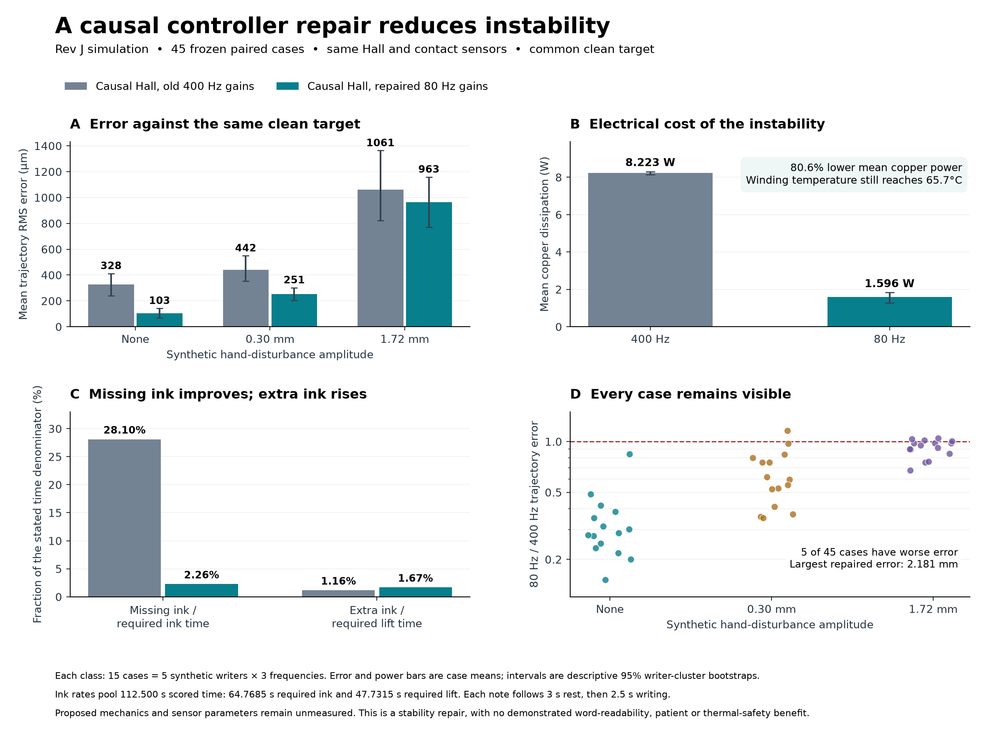

# Control, simulation and reinforcement-learning audit

30 September 2026. Repository base: `4ad62b6`. **Evidence: software verification, calculation and simulation. No hardware or participant measurements.** Historical result files are preserved. New results live in `results/improvement/control/`.

## Decision and scope

The project needs two different control problems. Tremor suppression estimates an unknown voluntary trajectory from overlapping signals. Accepted-stroke writing has an explicit geometric target. A stronger actuator or a larger neural network does not make these equivalent. Keep the former subject to clean-writing and legibility gates; implement the latter as a constrained trajectory executor with explicit user acceptance, page registration, reachable workspace and pen lift.

This audit inspected the latest tracker and readable-target reports, online firmware and sensing, physical plant interfaces, replay learning, policy training/selection, and relevant tests in `realtrack`, `sim2`, `sim2j` and `ai2`. It does not certify every earlier result or replace the mechanical force/thermal analysis. The implemented changes address errors that could make a controller appear useful when its ink, sensing or evaluation was wrong.

The existing studies already state the central negative result: no tested causal tracker simultaneously met their severe-tremor word gain and clean-writing limits. The real-writing studies composed healthy writing with separate tremor recordings; they did not measure a person writing with this pen. Their test writers have been inspected repeatedly. The new RL study therefore uses separate synthetic writer IDs and retains all failed seeds. It makes no new patient, real-data legibility or clinical-severity claim.

**The controller is repaired; the learned policies are rejected by their declared rules.** The initial three-seed, 49,152-transition PPO study selected a candidate that produced 0.45% worse large-disturbance RMS on its fresh test. Correcting hidden ideal velocity feedback then exposed an unstable inner loop. The implemented repair uses causal Hall velocity, measured delayed contact, and an 80 Hz design selected by a separate sampled-data calculation. On 45 fresh matched synthetic cases it reduces mean clean-path RMS from 328 to 103 um and mean copper dissipation from 8.223 to 1.596 W, with five cases of worse tracking and slightly more unwanted ink. A second, larger three-seed PPO study actually completed 196,608 transitions on this corrected plant. Its best final checkpoint improved large-disturbance RMS only 0.192% on tuning, below the required 2%; no seed qualified and its planned test set remains unconsumed. These are physics-model and control-integrity improvements, not evidence that tremor-free handwriting or autocorrect has been achieved.

## Implemented faults and their implications

| Fault | Previous behaviour | Correction | Evidence boundary |
|---|---|---|---|
| Reward rewarded missing ink | Both physical Gym environments stopped charging tracking cost when the ball lost contact | Charge tracking on reference-required ink, then separately charge missing and unwanted ink | Prevents a specific reward exploit; does not prove the reward matches human preference |
| Policy-step endpoint scoring | Rev J scored one endpoint each 4 ms; excursions and contact loss inside that interval were invisible | Score at all eight 2 kHz reference ticks per decision | Sub-tick behaviour is still a simulation-resolution question |
| Wrong reward timestamps | `site_xpos` after integration was scored against the next time; intent reward indexed the scenario by physics index | Align to the last resolved kinematic time and interpolate the reference by timestamp | Scenario and physics steps may now differ correctly |
| Missing/extra strokes hidden from scalar RMS | No-contact samples contributed zero error | Publish tracking, missing ink, unwanted ink, reference duty and coil power separately | Full handwriting quality still needs reader/stroke measurements |
| Contact latency existed only in the log | Rev J used immediate 2 kHz contact while its metadata claimed 1 kHz and 1 ms latency | Acquire at declared rate, queue to declared availability, compare Hall angle/slide with its stop at acquisition | Parameters remain unmeasured assumptions |
| Derivative feedback used simulator truth | Noisy Hall angle was paired with exact `qvel` | Timestamped causal Hall differences, low-pass filtering, held-sample freshness and zero demanded current on stale feedback | `legacy_true` remains an explicitly optimistic reproduction mode |
| Existing gains assumed ideal velocity | A 400 Hz inner loop became unstable with actual filter/delay phase | Select 80 Hz from a frozen discrete pole calculation and uncertainty grid, then evaluate nonlinear contact separately | Local linear stability is not global contact or hardware stability |
| Inner contact gate bypassed the firmware sensor | The servo's load bias/authority still used true ball force; `RunOptions.contact_from` was ignored | Use the delivered refill-slide contact; historical force truth is explicit `legacy_force` | Virtual relative-slide sensing still requires calibration on the mechanism |
| A noisy target could hide the controller's own oscillation | Target and evaluated trajectory shared the same servo and Hall-noise draw | New studies use one common ideal clean physical target across controllers, with noise-free Hall and an explicitly ideal derivative only in the reference | The target is privileged reward/evaluation information, never a policy observation |
| Instantaneous validity with delayed optical position | Generic `sim2` observations paired old position with current validity; warm-up could look valid | Deliver position and validity from one timestamped sample; invalid until a valid sample arrives | This remains a position-reference sensor model, not a demonstrated optical-flow device |
| Force/slide delay omitted | Generic physical RL received immediate force and slide | Honour their acquisition rates and delays | IMU model still has its own stated approximation |
| Seeded reset depended on prior episode | A seeded Rev J reset could reuse the previous three-episode plant group | Clear the group and reference on an explicit seed | Repeatability is checked with identical first-step trajectories |
| `p_free` ignored | Rev J constructor accepted a clean-episode probability but used a fixed schedule | Use the supplied probability, with 0 and 1 tested | Training distribution is now what the caller declares |
| Detector cache could collide across writers | Key used endpoints, sample counts and validity sums | SHA-256 of the full relevant sample arrays/timestamps | Computational memoisation no longer changes cases |
| Replay windows treated as task termination | PPO lost value bootstrapping when an arbitrary data window ended | Return Gymnasium truncation; consumers use termination OR truncation to stop iteration | Earlier replay checkpoints require retraining for this change |
| Last replay decisions omitted | Full arbiter replay left the final block(s) at zero action | Cover the last partial block after causal warm-up | This changes evaluation of an old policy near note endings |
| Feature/weight dtype depended on unrelated imports | Physics optimisers could make new neural layers float64 while inputs remained float32 | Explicit float32 learned factories and ALiBi buffer | Does not retrain or improve old weights by itself |
| Training accounting/cache provenance | SB3 rollout rounding was reported as requested steps; old caches could survive changed training code | Report actual transition counter and hash the training implementation before reuse | Historical computation logs remain historical |
| Missing build products raised misleading errors | Missing tuning caches became a `NoneType` failure downstream | Actionable missing-file error and honest artifact-dependent test skips | Missing checkpoints are not fabricated or claimed reproduced |

Invalid/non-finite action vectors are rejected before reaching the physical environment. Replay datasets must be nonempty and complete; malformed episodes are not silently dropped. These are software input checks, not a hardware safety certification.

## Why the corrected reward is different

Let `c*` denote reference-required contact and `c` actual ball contact. For position error `e` and normalisation `s`, the per-sample cost is

```
L = c* ||e||² / s² + w_missing c*(1-c) + w_extra (1-c*)c.
```

The reference is privileged **only in the reward**. It never enters the policy observation. In Rev J, `s = 0.3 mm` and both ink penalties are 9; in the generic environment the existing `s = 0.1 mm` is retained. These weights are declared engineering choices. Holding the same path and losing contact now strictly increases cost by `w_missing`; it can never eliminate the positional cost. A separate regression places contact loss between apparently perfect decision endpoints and verifies that it remains penalised.

The physical stepper calls MuJoCo's first half-step to resolve kinematics, applies forces/controllers, then integrates. Its stored site position after `advance()` describes `(k-1) dt`, not `k dt`. The reference position is interpolated at that resolved time; contact uses the last sample at or before that time. This avoids selecting a future contact transition. The interval cost weights a final shorter sampling chunk by its actual duration.

This reward still does not measure semantic correctness, personal handwriting style or effort. A separate accepted-word task needs target stroke coverage, stroke order, missing/extra ink, spatial error, force, timing and acceptance/release measures. A lower tremor-band RMS alone is insufficient.

## Learning design and evaluation discipline

The new experiment uses PPO as a bounded residual arbiter over the existing guarded tracker, with the same nonlinear hand, grip, paper, actuator limits and sensor draws as its zero-residual comparison. It is not trained on a replay formula that assumes commands track perfectly. Policy observations are the firmware's sensor-derived state, including previous action. Training remains offline in simulation.

PPO is a practical policy-gradient algorithm with repeated minibatch updates on collected trajectories; its published benchmark performance is not evidence of suitability for this pen. [Schulman et al., 2017, abstract reviewed](https://arxiv.org/abs/1707.06347)

Arbitrary replay cutoffs are truncations rather than absorbing task states, so the value target must retain bootstrapping. This distinction is explicitly required by the Gymnasium API guidance and is now represented in the replay environments. [Gymnasium, Handling Time Limits, reviewed 30 September 2026](https://gymnasium.farama.org/main/tutorials/handling_time_limits/)

The fresh-study protocol is saved **before** training/evaluation with source hashes, runtime versions, parameter rules, writer IDs, random seeds and rejection thresholds. Three independent training seeds are retained. Selection uses only the tuning split; if no final checkpoint meets every rule, the selected controller remains zero residual. The selected controller is then evaluated on the untouched synthetic test split. Failed candidates are not silently renamed as successful prototypes.

The protocol is an engineering screening experiment with a small computation budget. Three seeds do not establish robust statistical superiority. Uncertainty across independent runs matters in deep-RL evaluation; point estimates alone can reverse apparent rankings. [Agarwal et al., 2021/2022, abstract reviewed](https://arxiv.org/abs/2108.13264)

Frozen rules require clean-writing displacement at most 25 um in the mean and 50 um worst case, mild-case RMS no more than 1.02 times the matched model controller, large-case RMS at most 0.98 times that controller, missing/extra ink increases at most 0.005 of time, and coil power no more than 1.05 times the matched baseline. These are **screening rules**, not a replacement for the repository's word-readability criterion. The script's `severe` class label means its specified synthetic hand disturbance, not measured severe Parkinsonian handwriting.

## Actual PPO outcome and rejection

The original frozen experiment deliberately retained the existing ideal velocity feedback while the reward/split corrections were exercised. Training writers were 20000–20399; tuning writers 31001–31002; fresh test writers 32001–32003. There were 12 tuning cases per candidate and 18 test cases for the selected candidate. The final checkpoint of each seed was retained; there was no checkpoint search on the test set.

| Metric | Selected seed 0, tuning | Selected seed 0, fresh test | Required |
|---|---:|---:|---:|
| Mean clean error | 1.565 um | 5.775 um | <=25 um |
| Worst clean error | 2.868 um | 24.816 um | <=50 um |
| Mean paired mild RMS ratio | 0.99448 | 1.00603 | <=1.02 |
| Mean paired large RMS ratio | 0.97656 | **1.00448** | <=0.98 |
| Maximum missing-ink increase | 0.0004 | 0.0014 | <=0.005 |
| Maximum extra-ink increase | 0.0008 | 0.0008 | <=0.005 |
| Maximum paired coil-power ratio | 1.01624 | 1.01546 | <=1.05 |

Seeds 1 and 2 failed the tuning rule; seed 0 passed tuning and failed the independent test. Its apparent 2.34% tuning improvement did not generalise. The mean ratio is the mean of paired per-case ratios, not the ratio of pooled means. The original protocol's 5/9 Hz labels were nominal: the historical environment retained a 10% frequency redraw even with fixed parameters. That behaviour is now selectable only for historical replay; new tests honour fixed frequencies and report actual frequency.

The saved result's original generic conclusion did not adjudicate a later test failure. `rl_adoption_decision.json` explicitly records rejection, and the runner now makes its final conclusion depend on test success. All checkpoints remain research artifacts and were never installed into firmware.

Re-evaluating the frozen policy on causal Hall sensing with the old 400 Hz gains was a **post-hoc sensitivity**, using the already spent 18-case set. It failed again: mean/worst clean error 111.97/297.73 um, maximum missing-ink increase 0.0342 and extra-ink increase 0.0358. Its large-case ratio 0.98730 could not rescue those failures. Neither this reanalysis nor the original short training budget proves that RL can never help; it does show that this trained policy does not meet the declared rules.

## Causal servo derivation and independent calibration

For acquired Hall angle samples `a_k` at timestamps `t_k`, the estimator uses

```
Δt_k = t_k - t_(k-1)
α_k = 1 - exp(-2π f_c Δt_k)
v_k = (1-α_k) v_(k-1) + α_k (a_k-a_(k-1))/Δt_k.
```

Delivery time does not replace acquisition time. An unchanged acquisition timestamp cannot create another derivative observation. The servo reports sample age, requires two acquired samples, and demands zero current while feedback is unavailable or older than 1 ms; coil current then follows the modeled electrical dynamics. This is a defined fault response, not proof that a moving nib stops safely. `f_c=300 Hz` is a design setting, not a measured sensor bandwidth.

For fixed sample rate `f_s`, the discrete transfer function is `H(z)=f_s(1-z^-1)α/[1-(1-α)z^-1]`. Its white-angle-noise output variance is `2α²σ_a²f_s²/(2-α)`. At 10 kHz and 5 um tip-referred position noise with a 76.48 mm lever, this is about 0.117 rad/s angular-velocity noise (about 9 mm/s at the tip). Tests compare simulated sinusoidal response and noise variance with these independent formulas. The estimator trades noise against phase delay; supplying perfect velocity had concealed that tradeoff.

The independent local model uses `I a'' + c a' + k a = τ`, first-order coil dynamics `τ_e τ' + τ = τ_cmd`, `τ_e=L/R`, an exact zero-order-hold discretisation, delayed sampled Hall angle, the estimator above, and the implemented PI-D update order. Its nominal 400 Hz feedback has maximum pole modulus **1.06570**, predicting instability. The 80 Hz candidate's nominal modulus is **0.98161**.

Before nonlinear calibration, the saved rule selected the highest bandwidth in `[60,80,100,125,150,200,400] Hz` whose poles remained at modulus <=0.998 over 100–400 us sample delay and independent inertia/torque-gain ratios `[0.7,1.0,1.3]`. It selected 80 Hz; its worst grid modulus is **0.99754**, whereas 100 Hz reaches 1.01385. These are declared stress bounds, not measured confidence intervals or a continuous robust-stability certificate. Friction, current saturation, changing contact and hand coupling are omitted from the linear calculation and evaluated separately.

A nine-case nonlinear calibration bench used three noise seeds and stationary, 0.5 mm/6 Hz, and 1.5 mm/10 Hz stage references. Gains were already frozen before those runs. Over their scored intervals:

| Feedback and inner gain | Mean follower error | Minimum contact fraction | Mean copper power |
|---|---:|---:|---:|
| Ideal velocity, 400 Hz | 5.41 um | 0.99875 | 2.590 W |
| Causal Hall, old 400 Hz | 66.87 um | 0.13688 | 9.125 W |
| Causal Hall, frozen 80 Hz | 40.26 um | 1.00000 | 1.908 W |

This bench still inherited the historical true-contact bias gate; it is retained as a calibration result with that limitation. The subsequent final-study attempt was stopped after 11 paired cases when that remaining oracle path was discovered. Its protocol, source and partial cases are preserved in `aborted_hall_only_final/`. The gain was not changed. After measured-contact gating was implemented and tested, the final study was restarted with wholly new writers 35001–35005 and seeds 102000 onward. Both candidates now share causal Hall sensing, delayed measured contact and one ideal clean target. Copper energy is accumulated at the 10 kHz thermal/servo tick; the earlier PPO power summaries were sampled once per 4 ms decision and should not be used as precision electrical measurements.

## Fresh final controller comparison

The complete 45-case run compares the old 400 Hz gains and repaired 80 Hz gains under identical causal Hall and delayed-contact sensing. Five fresh synthetic writers each contribute three disturbance frequencies and three amplitudes. Every case uses the same clean target in both candidates; this equality is checked by a SHA-256 digest of target positions/contact. The source snapshot and protocol were frozen before the new cases ran.

| Synthetic hand disturbance | Cases | Mean RMS, causal 400 Hz | Mean RMS, causal 80 Hz | Mean paired error ratio, with descriptive 95% interval | Worse cases after repair |
|---|---:|---:|---:|---:|---:|
| None | 15 | 327.99 um | 103.30 um | 0.3327 [0.2655, 0.4185] | 0 |
| 0.30 mm nominal peak | 15 | 441.82 um | 251.50 um | 0.6385 [0.5340, 0.8169] | 1 |
| 1.72 mm nominal peak | 15 | 1060.72 um | 963.24 um | 0.9160 [0.8504, 0.9723] | 4 |

Intervals use 5,000 paired resamples of five synthetic-writer clusters. They describe variation in this small generated sample, not population or patient uncertainty. Ratios are means of per-case paired ratios; they are not ratios of the two aggregate means. The new worst error is 2.181 mm, and four of fifteen large-disturbance cases worsen. An average improvement cannot be represented as universal tremor removal.

Mean copper dissipation across the 45 scored intervals falls from **8.223 W to 1.596 W**, an 80.6% decrease associated with removing the unstable loop. Maximum modeled winding temperature still reaches **65.68°C** after the rest and short writing interval; no grip-surface temperature is predicted. This improvement does not establish long-duration thermal feasibility.

Ink denominators matter. The 45 intervals contain 112.5 s total scored time, including 64.7685 s when the reference requires ink and 47.7315 s when it requires lift. Missing ink falls from 18.2005 s to 1.4670 s: **28.10% to 2.26% of required-ink time**. Unwanted ink rises from 0.5530 s to 0.7995 s: **1.16% to 1.67% of required-lift time**. Expressed against all scored time, those rates are respectively 16.18%→1.30% and 0.49%→0.71%. The extra-ink tradeoff remains visible rather than being hidden inside RMS.



The implemented default is a more defensible causal simulation controller. It remains attached to the Rev J plant; these gains have not been validated for the balanced nib, five-bar mechanism or patient writing. The new 103 um mean common-target error on clean writing also includes plant compliance and tracking errors, so it is not interchangeable with policy-induced false correction.

## Larger causal PPO experiment

Following the controller repair, a separate larger study freezes the causal 80 Hz plant, delayed measured contact, common ideal clean target and all decision rules before training. It uses three seeds with 65,536 requested transitions each, final checkpoints only, synthetic training writers 40000–40799, tuning writers 42001–42003 and test writers 43001–43005. The original negative 49,152-transition experiment remains intact; it is not evidence that all RL is ineffective.

The clean-writing guard measures the physical policy-minus-baseline trajectory at 2 kHz, requiring mean/worst changes <=25/50 um, alongside separate limits on common-target error increase. The initial protocol text mistakenly said 4 kHz, which is generic `sim2`'s default; Rev J explicitly fixes recording at 2 kHz. The correction was recorded during training, before any tuning outcomes, in `protocol_clarification_record_rate.json`. A recording-integrity check confirms 5,000 samples per 2.5 s and exactly unchanged prior-case physical metrics. Numerical gates, dynamics, training and models were unchanged.

Selection also limits mild-error regression, requires at least 2% mean large-case improvement, limits the worst large-case regression, missing/extra ink, power and temperature, and checks a descriptive writer-cluster interval. If no seed meets every tuning rule, the fresh test set is left unconsumed. This experiment's result is recorded separately under `results/improvement/control/causal_ppo/`. Launch spawned ML work with `PYTHONNOUSERSITE=1` in this runtime: an incompatible user-site OpenCV installation otherwise polluted child import paths. The failed initial launch trained zero transitions, is archived, and did not alter model selection.

All three seeds completed exactly **65,536 transitions**, for **196,608 actual transitions**. Each completed 104 episodes. Training took about 662–665 s per seed with three parallel workers; the complete training and tuning invocation took 934 s. The 18 tuning cases contain six clean, six mild and six large cases. These are the final-checkpoint results; every checkpoint and every failed seed is retained:

| Seed | Clean policy displacement, mean/worst | Mean mild RMS ratio | Mean large RMS ratio | Descriptive large-ratio 95% upper bound | Failed tuning rules |
|---|---:|---:|---:|---:|---|
| 0 | 5.515 / 15.821 um | 1.004570 | 1.001858 | 1.018342 | Required 2% large-case improvement; upper bound <=1 |
| 1 | 0.578 / 1.946 um | 0.999401 | **0.998077** | 0.999973 | Required 2% large-case improvement |
| 2 | 9.121 / 24.046 um | 1.001772 | 1.014808 | 1.023630 | Required 2% large-case improvement; upper bound <=1 |

All seeds met the separately specified clean-error, worst-large-error, ink, power and temperature regression limits. That does not substitute for meeting the improvement criterion. Seed 1's 0.1923% tuning gain is too small to qualify and was not promoted by weakening a gate. **No policy was selected; the planned 45-case test set was not evaluated.** The zero-residual 80 Hz controller remains the simulation candidate. This outcome concerns a bounded three-action residual architecture, this observation vector, this synthetic distribution and this training budget; it is not a proof that larger, differently structured or better-informed RL methods cannot help.

Across the two distinct completed studies, six seeds accumulated 245,760 transitions. Their different observation models, plant settings and protocols prevent pooling them into one efficacy experiment. The later run's 82 declared source files are archived verbatim with SHA-256 verification in `causal_ppo/source_snapshot/`, including the original recording-rate wording and its contemporaneous clarification. `causal_ppo/results.json` records the null selection and unconsumed test split.

## Numerical-resolution check

A separate **post-hoc** sensitivity run kept the frozen 80 Hz controller, acquisition rates, random draws and a common 12.5 us ideal clean target fixed, then repeated three already inspected cases at 12.5, 25 and 50 us physics steps. The cases were the first clean case, the worst tracking case and the worst thermal clean case. They were chosen to inspect numerical sensitivity, not to estimate population performance or select gains.

| Previously inspected case | 25 us path difference from 12.5 us | 50 us path difference from 12.5 us | Target RMS at 12.5 / 25 / 50 us |
|---|---:|---:|---:|
| First clean case | 1.433 um | 2.304 um | 42.302 / 42.224 / 41.824 um |
| Worst tracking case | 8.796 um | 32.518 um | 2172.700 / 2175.272 / 2182.759 um |
| Worst thermal clean case | 2.684 um | 10.795 um | 337.590 / 336.766 / 342.478 um |

Path differences are RMS vector displacements during reference-required ink. The fine reference differs from the original final study's reference, so its target errors are not expected to duplicate that study's exact table. These three runs show why a historical sub-micrometre timestep claim from another controller cannot be carried forward: the new loop can be appreciably sensitive around contact transitions. Within these cases copper-power changes were below 0.003 W and maximum winding-temperature changes below 0.005°C. The limited refinement check supports reporting the large instability repair but does not establish a global numerical error bound. A tiny learned improvement needs paired finer-step confirmation before it becomes a positive claim; the new PPO candidates already failed their prespecified screening rule, so no such claim is made.

## Remaining information and physical-model limits

1. **Intent is not directly observed.** If measured motion is `x = writing + tremor`, adding an arbitrary component to one term and subtracting it from the other leaves the motion and its derivatives unchanged. Statistical priors can help on a tested population; they cannot guarantee that a 6 Hz voluntary stroke is tremor. An accepted target supplies information that free-writing sensing does not.
2. **Sensor availability is still unproven.** Correct timestamps make the simulator more honest, but the nominal optical page reference remains an engineering assumption. Online Rev J's white-position sensor does not demonstrate incremental optical-flow tracking through lift or relocalisation. The separate page-sensor revision must be calibrated against real motion before a product claim.
3. **The training plant is Rev J, not the proposed balanced nib.** Static holding heat, contact mechanics, geometric travel and compliance remain those of that model. Better policy reward cannot rescue an infeasible force path or transfer automatically to Rev K.
4. **Artificial writer diversity is limited.** New IDs change synthetic motor/style parameters; all inherit the generator and glyph family. They are not independent people or independent text semantics. The experiment also gives the tracker a 3 s rest before writing.
5. **The initial RL evidence used optimistic inner sensing.** Causal Hall and measured contact are now the defaults, and historical ideal modes are explicit. True mechanical velocity in a back-EMF law is legitimate plant physics; true velocity supplied to the controller's derivative term is an optimistic observation bound. The original experiment must be replayed through its frozen source overlay, not current defaults.
6. **Thermal duration is short.** Each evaluated note is 2.5 s after a 3 s rest, starting from the model's nominal thermal state. Reported temperatures are not a long-duration or ambient-temperature qualification.
7. **A learned action is not a safety controller.** Current, voltage, travel, rate, coil temperature, stale sensing, contact loss and user release need independent limits. Current plant limits bound current and travel; safe physical behaviour after faults remains a separate validation programme.
8. **Old trained artifacts are not in Git.** Several causality tests need ignored tuning/model caches. They skip explicitly until those artifacts are rebuilt. Reported historical network results are not reproduced by merely importing the source tree.

## Reproduction and result files

The audit's focused suite is `python -m pytest -q ai2/tests realtrack/tests sim2/tests sim2j/tests`. The initial corrected run passed 82 tests and skipped 9 artifact-dependent/optional checks. Hall/servo/common-reference additions raised this to 91 passed and 9 skipped. Five new contact-gating tests also passed. The final integrated default regression passed 871 tests with 20 explicit skips. All four optional slow simulator checks then passed separately, giving 875 distinct passing Python tests and 16 unavailable-artifact checks; the root verification logs record the commands and results. The causal-400 Hz failure log is retained to show that contact failures were repaired through the controller, not by weakening assertions.

The current physical RL runner accepts `--out NEW_DIRECTORY`; its defining source has changed and it correctly refuses to reuse the old frozen output directory. To reproduce the executed 49,152-transition experiment, use `python results/improvement/control/reproduce_frozen_rl.py --mode train --destination NEW_DIRECTORY`. This exports Git base `4ad62b6` plus the original source overlay; `--mode evaluate` uses the three retained checkpoints, and `--mode smoke` verifies one original matched baseline/policy pair. It checks every originally declared source hash. `sim2j/revj.py` was unchanged during the first run and is recovered from that Git base with explicit provenance, so its old 400 Hz constructor is preserved too. The original nine-file snapshot alone was insufficient after changing that constructor.

For the larger causal study, `python results/improvement/control/reproduce_causal_ppo.py --mode train --destination NEW_DIRECTORY` exports the base plus all 82 declared executed source files. It also supports `prepare`, `evaluate` and `smoke`. Both experiments' smoke modes were executed from their isolated source bundles: one saved matched baseline/policy pair each reproduced RMS, total cost, missing ink, extra ink, copper power and maximum winding temperature with exactly zero numeric difference on this host. This is a checked reproduction of those cases, not an independent rerun of all training. The full later training outcome, source hashes and case traces remain under `causal_ppo/`.

One numerical thread per process is used. The available runtime is Python 3.12 on macOS arm64, with repository-pinned major dependencies; it differs from the historical Python 3.11/Linux environment. Current final engineering tests run two independent workers with explicit per-case seeds. Source changes, failed calibration stages and spent test sets remain visible in versioned artifacts.

The result directory records protocol, training transition counts and episode metrics, individual tuning cases for every seed, the frozen selection and final test cases. Historical `results/ai2`, `results/realtrack` and `results/sim2j` files are unchanged. Future extrapolation to a new nib, real patient writing, another sensor, or accepted-word completion needs a separately labelled experiment.
