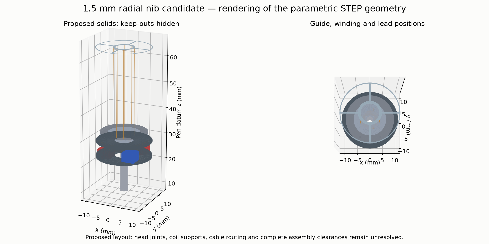
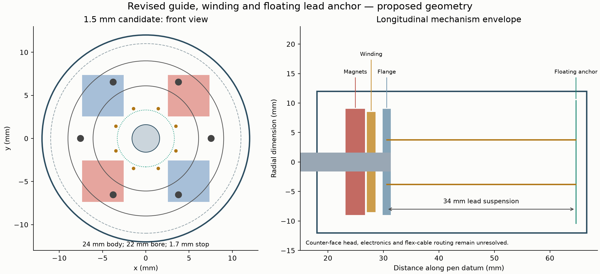
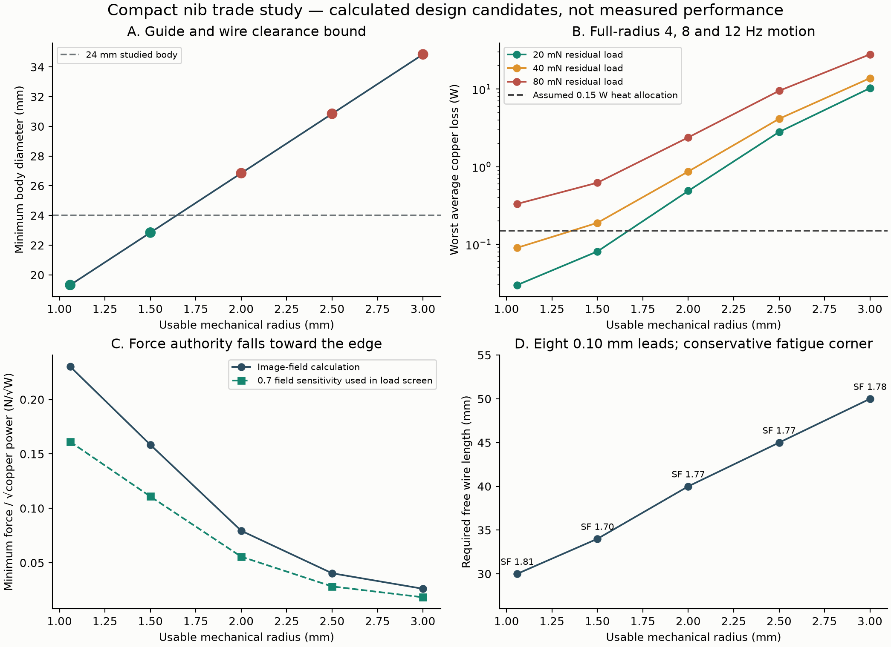
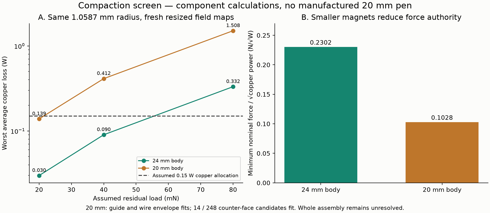
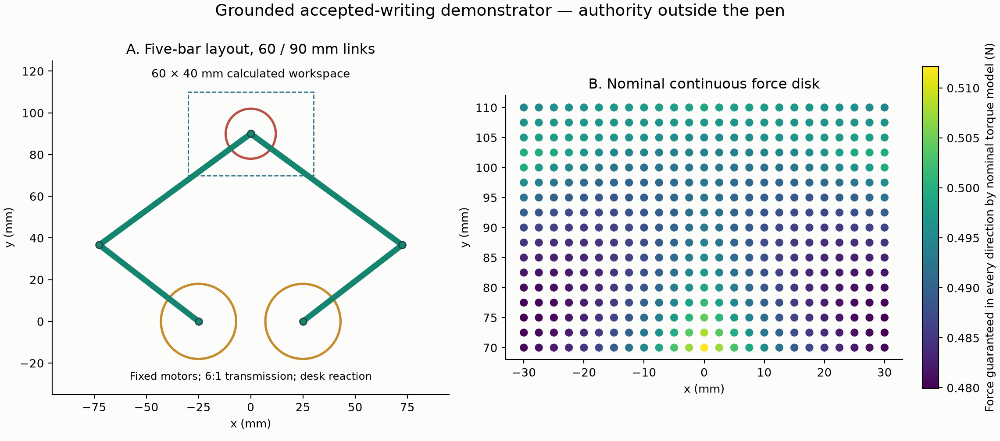
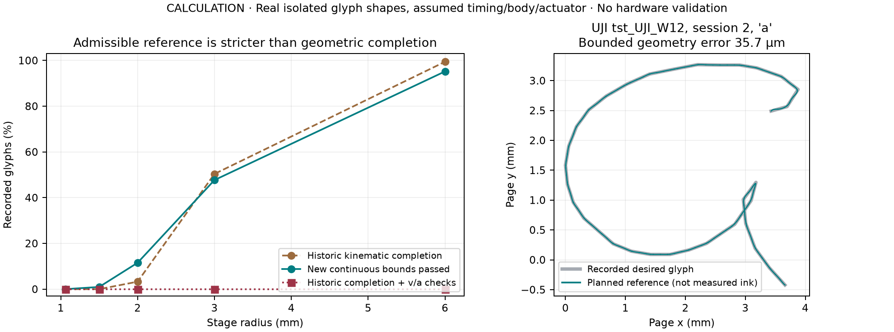
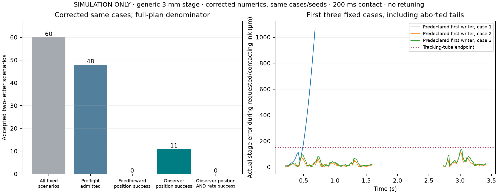
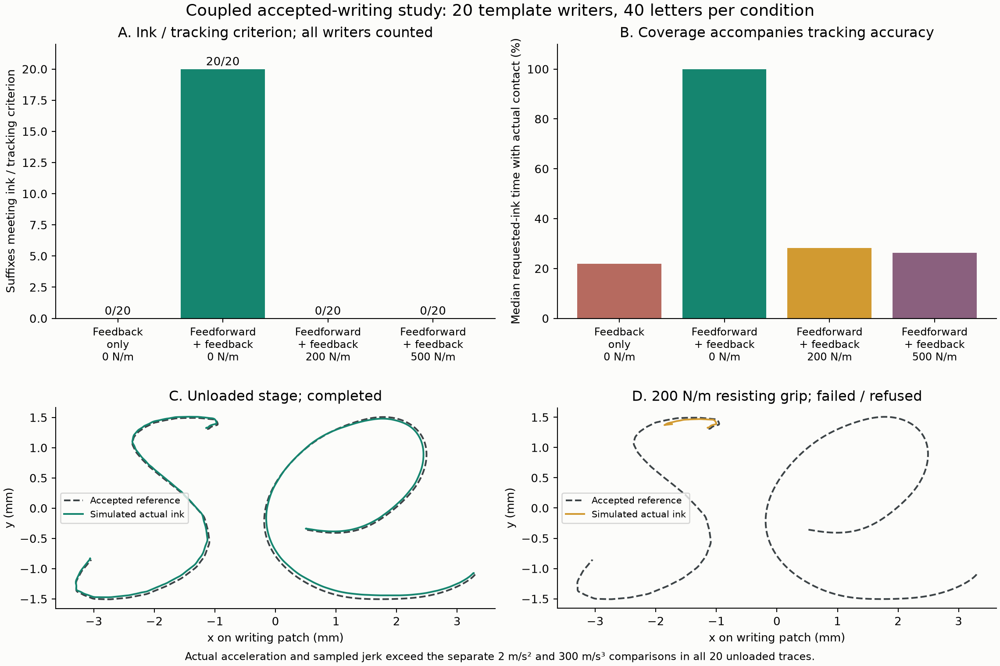
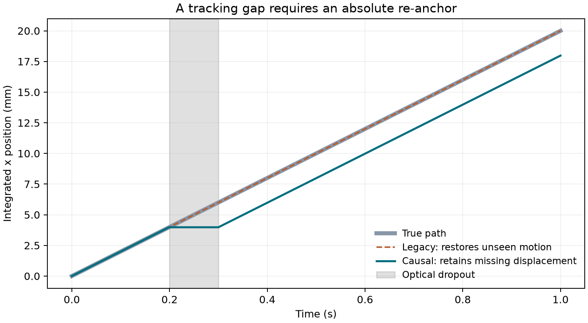

# Stabilisation Pen engineering improvement report

**30 September 2026 | Implemented changes, new experiments and proposed mechanisms**

Repository: `adambickerdike/Stabilisation_Pen`. Branch: `claude/pensive-shannon-wzm6ls`. Updated base: `4ad62b6acdcda1fa1102362f32780168297f5bb3`. The working clone contains the implemented improvements and the preserved earlier review. This report concerns the updated Rev K/B1 work and supersedes the earlier review wherever its scope or numbers differ.

**The credible route is a compact fine nib for local corrections, paired with an optional grounded mechanism when the task requires whole letters or words.** The engineering work now contains executable constrained handwriting planning, an acceptance and correction workflow, more realistic sensing and control, new actuator and guide calculations, proposed CAD, and repeatable comparisons. Six RL policies were trained across two experiments; none qualified for adoption under its declared performance rules.

This is a computational engineering improvement, not a claim that a completed pen now removes tremor or treats dyslexia. Nothing was manufactured or tested with a participant. The new reports distinguish source evidence, calculation, simulation, software verification and proposed design. The most useful result is that several optimistic paths now fail explicitly, while the feasible routes have more concrete mechanisms and interfaces.



## 1. What the product must physically do

Three different user actions need three different control problems. In free writing, the writer chooses motion and the pen estimates which part is unwanted. In guided writing, a known shape constrains the movement but the writer can control progress. In accepted writing, the writer first chooses text, and a mechanism follows a specified path. Success in one mode is not evidence for the others.

| Mode | Implemented engineering direction | Main physical or evidential limit |
|---|---|---|
| Free writing and tremor assistance | Load-balanced fine stage; causal sensor handling and bounded controller | Intent and tremor overlap; finite travel; current free-writing benefit still needs validation |
| Better letter shape or spacing | Explicit target geometry with smooth timing, tracking and contact checks | An attractive plotted target is insufficient: actual deposited ink and user effort must improve |
| Spelling and next-word help | Keep measured ink, recognized text, suggestions and accepted edits distinct | Recognition and language confidence must transfer to the user's writing; spelling is not a mechanical tremor problem |
| Physical accepted completion | Preflight the entire future text; execute only admitted strokes with fresh position and attitude | Larger letters need the body or page to move; already deposited permanent ink remains on paper |
| Pen-body motion | Grounded coarse stage paired with a fine nib; optional inertia research separately | The hand, page or desk must supply the external reaction for sustained motion |

The mechanical priority is to supply **useful controlled force over useful travel under contact**, while preserving comfort. Increasing peak motor force without changing the load path, heat rejection, sensing and support structure can make a bulkier, hotter pen without improving writing.

The reported studies use different plants. Their successful numbers cannot be combined into a specification for one validated device.

| Study | What is represented | Important boundary |
|---|---|---|
| Fine nib, 20/24 mm envelope | Magnetic map, guide, leads, geometry and periodic prescribed motion | Calculation and proposed subassembly; full packaging and measured tracking open |
| Generic accepted writing | Hypothetical planar stage, electrical dynamics and accepted trajectories | Larger travel is a model parameter; it does not fit the actual nib automatically |
| Grounded accepted writing | Five-bar body stage plus actual proposed 1.5 mm fine-stage map | Rigid mechanism and ideal current loops; hand resistance can defeat execution |
| Causal controller and RL | Earlier Rev J nonlinear hand/pen/contact plant | Its geometry and heating differ from the balanced nib |
| Host firmware | C interfaces and functional numerical behaviour | No target board timing, electronics or physical device validation |

## 2. What changed in the engineering model

### Correct force and power accounting

A tilted refill does not see only lateral ink friction. For an axial spring force `Fc`, altitude `theta`, and maintained contact in the simple frictionless static case,

```text
N sin(theta) = Fc
F_lateral = N cos(theta) = Fc cot(theta)
P_copper = (F_required / Km)^2
```

The old Rev J leverage made this holding load dominate coil power. B1/Rev K already addressed that problem with a counterface and a load-balanced refill. The new audit therefore does not present load balancing as an invention made in this turn. It improves the support, moving leads, workspace, magnetic-field and dynamic calculations around that existing idea.

Equal opposed forces can cancel net translation while leaving a couple if their lines of action differ. The couple needs a mechanically credible guide. The revised calculation includes opposed rolling contacts, preload and contact stress instead of treating the wires as an invisible load path. Preload also raises friction; its heat and required force are counted.

For harmonic motion, spring force and inertial force have opposite phase. The required ideal linear actuator amplitude is

```text
F_peak = A sqrt((k - m omega^2)^2 + (c omega)^2)
```

The earlier quadrature combination of spring and inertia was corrected. New periodic studies compute the force vector through a cycle, then solve for currents using the spatial motor matrix. Back-EMF, resistance, inductance, lead current and power are checked separately. These are model predictions, not a measured motor specification.

```text
F = K(q) i
P_copper = i^T R i
V = R i + L di/dt + K(q)^T q_dot
```

The force matrix must remain useful in its weakest direction, not only on the best axis at the centre. The implementation evaluates cross-coupling and singular values of a direct field model over the sampled workspace. A spatial sample grid is not a proof over every manufactured position; calibration and tolerance tests remain necessary.

### Support wires, electrical leads and real workspace

Moving a nominally straight wire sideways increases its arc length. If its ends cannot move axially, the resulting tension changes lateral stiffness and fatigue stress. The new self-consistent wire calculation includes anchor compliance, preload and mean-stress correction. An axially compliant anchor is now a defined component with a CAD coupon, rather than an unstated boundary condition.

The nib workspace is radial. At fixed pen attitude its projection onto the page is an ellipse; independent full travel on both axes would demand a larger diagonal excursion. The new mechanism screens and handwriting planner use that geometry. They also reserve travel for measurement error, tracking error and stopping instead of allocating the entire hard-stop distance to the intended stroke.

### Internal moving mass has a bounded role

If a shell of mass `M` and an internal mass `m` have no external force, their centre of mass is fixed:

```text
(M + m) x_ddot + m r_ddot = 0
Delta x = -m Delta r / (M + m)
F_reaction approximately -m r_ddot for a nearly fixed shell
```

An internal mass can therefore produce oscillatory reaction force and a finite body displacement. Its return stroke reverses that displacement. At fixed stroke its force decreases with frequency squared, making slow word-sized translation particularly demanding. Contact asymmetry can create locomotion, but then the page supplies an external reaction and must be modeled. This is why the new whole-word demonstrator uses an explicit desk-supported mechanism. An inertial tail can still be tested for incremental high-frequency assistance against an equal locked mass; it does not become an unlimited XY drive.

### A requested path must be physically executable

The new planner converts accepted glyph strokes into smooth quintic pieces and checks conservative bounds between samples using their Bezier control points. Position, velocity, acceleration, jerk, current, voltage, contact phases and geometric deviation are checked together. It searches timing rather than shrinking or deleting a failed letter. Pen-up body repositioning is an explicit request to the user or grounded stage.

The executor binds a trajectory to an immutable accepted-text revision and checks page anchoring, timestamp freshness, attitude, body motion, tracking, force, current and temperature. A failed bound stops the sequence and requests lift and controlled braking. This is a software supervisor: its guarantees depend on the physical motor/lifter actually meeting the stated limits. There is no firmware implementation that can be certified by the Python calculation alone.

## 3. New mechanical design results

The following results are calculations and proposed CAD. The complete parameter maps, rejected candidates and detailed mechanical audit accompany this report. They do not constitute a manufacturing release.

### A conditional 1.5 mm fine-stage candidate

The new candidate increases radial usable travel from approximately 1.059 mm to 1.5 mm, about 42%. It retains a 24 mm outer envelope in the geometric screen. Eight 0.10 mm C17200 wires replace four single leads; two wires in parallel serve each lead. Their 34 mm length and axially compliant anchor reduce imposed extension and bending stress while accounting for electrical resistance and heat conduction.

The estimated whole-body length becomes 152.3 mm, approximately 7.2 mm longer than the upstream 145.1 mm layout. This is an envelope estimate; the delivered STEP files describe a proposed subassembly and anchor coupon. Counterface joints, flexible interconnect, sensor relocation, insulation, dust protection and the complete electronics assembly remain unresolved. The partial solid mass in the CAD report must not be read as the mass of a complete pen.

Under the sampled periodic screen at 4, 8 and 12 Hz, with a 30% field derating and 20 mN residual lateral load, the largest calculated copper loss is 0.081 W. At 40 mN residual load it rises to about 0.189 W and fails the assumed 0.15 W allocation. Thus this is a **conditional research candidate**, not an unconditional upgrade. Measure residual load and guide friction before selecting it over the smaller stage. The duty screen prescribes the motion and does not establish closed-loop tracking or switching/inductance losses.

The support calculation gives a conservative Goodman factor of approximately 1.70 at the 1.7 mm stop under its selected tolerance and stress-concentration assumptions. This is a model margin, not a fatigue-life test. Lead temperature is calculated relative to its clamps; unknown clamp temperature prevents a skin-temperature or battery-runtime claim.

The anchor coupon uses four proposed 35 micrometre beams, each 6 mm long and 0.5 mm wide. Their calculated 76.6 N/m axial stiffness leaves about 23.4 N/m for the flexible interconnect within a nominal 100 N/m total. Wiring that consumes that compliance budget changes the support calculation. Material grade, temper, terminations and the actual assembled stiffness must be measured.

The opposed guide calculation also exposes a demanding contact: the selected preload produces about 8.07 N total contact normal force and 2.64 GPa peak Hertz pressure. Its assumed rolling drag is about 8.07 mN. Bearing material, finish, indentation, cyclic life and friction therefore matter directly to the candidate's force and heat budget. The wire margin is not a margin for the entire mechanism.



### Why doubling reach is costly

| Desired radial travel | Minimum outer diameter from this guide/lead geometry | Nominal weakest sampled motor constant | Outcome in a 24 mm envelope |
|---|---|---|---|
| 1.059 mm | 19.32 mm | 0.230 N/sqrt(W) | Optimized candidate passes the studied geometry and conservative duty screen |
| 1.5 mm | 22.85 mm | 0.158 N/sqrt(W) | Geometry fits; passes 20 mN duty, fails 40 mN duty |
| 2.0 mm | 26.85 mm | 0.079 N/sqrt(W) | Guide/lead geometry fails |
| 2.5 mm | 30.85 mm | 0.040 N/sqrt(W) | Guide/lead geometry fails |
| 3.0 mm | 34.85 mm | 0.026 N/sqrt(W) | Guide/lead and counterface fit fail |

These are calculated values for the studied winding/guide family, before a complete manufacturing tolerance release. The optimized 1.059 mm row is not the historical unmodified winding. Other guide topologies could change the diameter bound; the table does not prove a universal lower limit for every pen design. It does explain why increasing a software travel constant is not a credible route to a compact 6 mm nib.



A hidden reproducibility defect was also repaired. The actuator fit and selected geometry were stored only in ignored build caches. Without those caches, a clean clone could silently use a different geometry and return 0.352 instead of the recorded 0.400 N/sqrt(W) B1 value. The nine fit coefficients were recovered from 632 committed observations with a full-rank system and near-roundoff reconstruction error. Fifty independently recomputed field cases gave about 0.61% RMS and 1.33% maximum relative fit error. The recovered fit, provenance and selected geometry are now explicit. This verifies a model reconstruction; it is not calibration against a measured coil.

### A separate 20 mm compaction candidate

The compactness study actually resizes the magnets and winding packs to an 18 mm bore within a 20 mm outer body, retaining approximately 1.059 mm radial travel. It recomputes 97 spatial field positions and checks guide/wire geometry and counterface sweep. Fourteen of 248 counterface candidates fit the selected 8.7 mm sweep limit. This is stronger evidence than simply quoting the 19.32 mm necessary geometric bound, but still only a component-level design screen.

The weakest sampled motor constant falls to 0.103 N/sqrt(W), compared with 0.230 for the 24 mm optimized candidate at the same travel. Worst periodic copper loss rises from 0.0299 to 0.1386 W at 20 mN residual load, and from 0.0902 to 0.4124 W at 40 mN. The 20 mm version barely passes the assumed 0.15 W allocation at the lighter load and fails at the heavier load. The smaller guide also reaches about 2.71 GPa calculated Hertz pressure under the matched moment.



Shrinking diameter by one sixth is a useful direction, but the reduced force margin makes friction and manufacture more decisive. Electronics, hinge/positioner drives, sensor placement and complete assembly clearances remain unresolved. The existing optical depth-of-field calculation also fails the desired 2 mm lift-tracking requirement. A geometry pass is therefore not a complete compact-pen feasibility pass. The 20 mm candidate should be built only after its loaded margins and sensing arrangement are established; the larger candidate is the more forgiving mechanism-development platform.

### A grounded mechanism for whole letters

The coarse-stage demonstrator is a planar five-bar linkage with two motors fixed to a desk-supported base, 60 mm proximal links, 90 mm distal links and 50 mm base spacing. The proposed writing patch is 60 by 40 mm. A moving pen bracket couples to the fine nib, giving the large translation an explicit reaction through the desk. Link loads require output bearings; motor shafts are not assumed to carry the whole structure.

The motor model uses the Faulhaber 2224 U 012 SR manufacturer sheet. Link mass, transmission efficiency, friction, output encoder and user force cap are design assumptions. The calculation includes the motors' reflected rotor inertia even though their housings are stationary. Moving/reflected Cartesian mass is roughly 93-105 g in the sampled patch, and the two stationary motors contribute approximately 92 g before the board and electronics. This is a laboratory board, not an all-in-one pen. [Faulhaber 2224 SR data sheet](https://www.faulhaber.com/fileadmin/Import/Media/EN_2224_SR_DFF.pdf)

The mechanism uses closure-derived kinematics and rejects singular or unreachable points. For its Jacobian `J`, virtual work gives `tau = J^T F`; kinetic energy gives the Cartesian reflected inertia. The sampled nominal continuous-force disk has a minimum radius of approximately 0.480 N. The controller uses an assumed 0.4 N cap, with current, hot resistance, back-EMF and speed checked. That cap is an engineering choice, not a clinically established comfort limit.



A firm stationary grip can prevent this mechanism from following a word. The evaluation therefore includes grip-stiffness sensitivity and refusal, instead of assuming the hand moves exactly as commanded. A moving-paper platen is an alternative that can create relative ink motion without translating the hand, but has its own page mass, registration, footprint and lift problems; it is discussed as a separate architecture and was not claimed built or simulated here.

The earlier collar concept also needs redesign: its moving-pen bore was based on a 12 mm pen, while this active nib needs a 24 mm head. Combining the two old drawings would require a much larger sleeve, over 33 mm under the same simple geometry. The new report does not present that incompatible assembly as a sleek finished solution.

The coupled actual-ink replay and its limitations are reported with the final writing results below. It is the stronger mechanism check; a reference-path plot or static force map alone does not demonstrate writing.

## 4. Control and reinforcement learning

### A causal controller needs different gains

The previous physical simulation supplied noisy Hall position together with exact simulator velocity. It also let an inner contact gate use immediate true contact while the firmware log described delayed sensing. Those choices gave the controller information that the proposed hardware would not supply. The revised defaults derive velocity from timestamped Hall samples, filter the derivative, use acquired contact observations at their delivery times, and withhold demanded current when feedback is unavailable or stale.

The 400 Hz inner-loop gain that worked with ideal velocity becomes unstable in the sampled model. The independent pole calculation gives maximum pole magnitude 1.0657. A predeclared search over bandwidth, sensor delay and independent inertia/torque variation selects 80 Hz, whose worst sampled pole magnitude is 0.99754. This is a local linear calculation; nonlinear contact, saturation, flexible modes and human interaction still require separate checks. A lower gain is a more capable engineering choice here because it respects the measured-information path.

The final nonlinear comparison uses 45 matched cases from five fresh synthetic writer IDs, across clean, mild and large imposed disturbances. Both controllers receive the same causal sensing and are scored against one common ideal clean target. The target is evaluation information, not a policy input. Gains were frozen before these cases. The study reports all cases, including deteriorations.

| Simulated condition | Old 400 Hz mean path RMS | Revised 80 Hz mean path RMS | Cases where revised RMS is worse |
|---|---|---|---|
| Clean, 15 cases | 328 micrometres | 103 micrometres | 0 of 15 |
| Mild imposed disturbance, 15 cases | 442 micrometres | 251 micrometres | 1 of 15 |
| Large imposed disturbance, 15 cases | 1,061 micrometres | 963 micrometres | 4 of 15 |

Across the 45 cases, mean copper power falls from 8.223 W to 1.596 W, about 81%. The fraction of scored time with required ink missing falls from 16.18% to 1.30%. The fraction with unwanted ink rises from 0.49% to 0.71%. These fractions use the whole scored interval as denominator. Per-condition denominators and individual results are retained in the result files; neither missing ink nor extra ink is excluded from the comparison.

Using the task-specific denominators instead, missing ink falls from 28.10% to 2.26% of the 64.769 seconds when ink was required, while unwanted ink rises from 1.16% to 1.67% of the 47.732 seconds when lift was intended. The experiment has 112.5 scored seconds in total.


The largest revised case still has 2.181 mm RMS error, and the maximum simulated coil temperature reaches 65.68 degrees C. These are short Rev J plant studies, with 2.5 seconds scored after a 3 second rest. They do not demonstrate acceptable handwriting, long-duration heat rejection, skin temperature or battery life, and cannot be assigned to the new balanced Rev K nib.

### Reward, learning and provenance corrections

The physical RL reward formerly stopped charging tracking error when contact was lost. A policy could therefore improve its score by failing to deposit ink. Both environments now charge tracking error whenever the reference requires ink, with separate missing-ink and unwanted-ink penalties. Rev J evaluates all eight reference ticks inside each 4 ms policy decision. Reward timestamps match the kinematic state actually resolved by the simulator.

Replay cutoffs now retain the distinction between truncation and task termination. Final partial windows are evaluated. Explicit seeds reset the plant grouping; declared clean-episode probability is respected. Detector caches hash the full relevant data, and training reports actual transitions rather than requested counts rounded by PPO. Invalid action vectors and malformed datasets fail explicitly. These changes remove specific learning/evaluation faults; they do not make the reward a validated measure of human writing quality.

The first preserved experiment trained three seeds for 16,384 transitions each, 49,152 in total, under the historical optimistic inner sensing. The tuning-selected policy improved the large-disturbance tuning metric by about 2.34%, but worsened the independent synthetic test by 0.45% and failed its frozen adoption rule. All checkpoints and the failed decision are retained. A separate source-overlay reproducer recovered the exact historical code and reproduced an original baseline/policy pair. Replaying that policy under causal sensing also failed. This is evidence to reject that particular policy, not a proof that learning cannot help.

The subsequent causal-PPO experiment trained three new seeds for 65,536 actual transitions each, 196,608 in total. It used the repaired 80 Hz controller, measured contact, fresh synthetic train/tune/test identities and one common clean reference. Selection evaluated 18 tuning cases per candidate. Policies remained bounded residual proposals; the local controller and physical limits retained authority.

| Causal-PPO final checkpoint | Mean paired large-disturbance RMS change on tuning | Frozen decision |
|---|---|---|
| Seed 0 | 0.186% worse | Reject |
| Seed 1 | 0.192% better | Reject: less than the required 2% gain |
| Seed 2 | 1.481% worse | Reject |

All three failed the prewritten rules. The reserved 45-case test set was therefore not consumed, and the accepted controller remains the model-based zero-residual baseline. The experiment preserves every checkpoint, tuning trace and failed decision. Together with the earlier study, six policies received 245,760 actual training transitions; no successful learned-controller claim is made. This is a bounded research screen, not an exhaustive search over RL algorithms or training scale.

A separate integration-step diagnostic evaluates the clean, worst-thermal and worst-tracking examples at 12.5, 25 and 50 microsecond physics steps, against a common finest-step target. The 50 versus 12.5 microsecond trajectory differences are approximately 2.3, 10.8 and 32.5 micrometres, falling at 25 microseconds. These checks support the large controller repair while showing why a marginal learning gain would need additional resolution checks. They are post-hoc numerical diagnostics and did not retune the controller.

The engineering order remains plant identification, causal state estimation, physically constrained model control, then a learned residual only if it adds repeatable benefit. Longer training on a wrong sensor, force or contact model would produce more confident evidence about the wrong device.

## 5. Changing handwriting and completing accepted words

### An executable correction workflow

The application now separates measured ink, literal recognition, suggested text and explicitly accepted edits. `propose_autocorrect` changes nothing in storage. `accept_autocorrect` requires a selected proposal bound to the unchanged note snapshot and writes a user edit while retaining original recognition and ink. Already edited spans are protected. Tampered or stale proposals fail. These are implemented, tested APIs; migrating every existing application screen remains separate work.

The companion CLI now exposes this workflow: `propose-corrections` trains the existing research ngram scorer on a supplied local corpus and saves a reviewable proposal; `accept-corrections` requires selected span IDs and refreshes search after recording the user edit. It hashes the corpus, makes no download, protects known words by default and refuses to overwrite a proposal file. End-to-end tests check review without mutation, selected acceptance, stale rejection and preserved original content.

The physical planner accepts arbitrary explicit text and an available glyph bank. The accepted `becau` to `because` example schedules only the future suffix `se`. The accepted `libary` to `library` example schedules a separately placed rewrite. Any missing or unreachable glyph rejects the whole proposal before execution. The demonstrations supply acceptance explicitly; a recognizer is not credited with predicting those words.

Execution uses a detached immutable trajectory, ordered letter states and a text/revision digest. Fresh anchoring, contact, timing, fixed attitude, body position, travel, tracking, current and temperature are checked. Relative optical motion after an outage does not silently restore absolute page registration. Reference loss requests lift and braking and prevents automatic continuation of the rejected plan.

### Realistic constraints change the apparent writing capacity

The new screen uses 520 lowercase glyphs from session 2 of 20 UJI test writers, with scale derived from their session 1. These recorded shapes have no timestamps or pressure; 3 mm x-height, motion timing, contact and word composition are assumptions. The writer identities have already been used in repository development, so this is a replay and sensitivity study, not an untouched clinical or legibility test. [UJI Pen Characters v2, data and license](https://archive.ics.uci.edu/dataset/177/uji+pen+characters+version+2)

Both old and new planners receive the same shape, scale and favorable body placement. The new planner bounds geometric error to 75 micrometres, checks radial/elliptical reach, applies 30 mm/s speed, 2 m/s² acceleration and 300 m/s³ jerk limits, and reserves room for tracking, uncertain body motion and jerk-limited stopping. Timing is allowed to grow only while the body-prediction uncertainty still fits. It also checks current and voltage, including uncertain back-EMF and the stopping profile.

| Assumed radial stage travel | Old kinematic completions | Old completions passing the sampled dynamics screen | New bounded references admitted |
|---|---|---|---|
| 1.059 mm | 0 / 520 | 0 / 520 | 0 / 520 |
| 1.5 mm | 0 / 520 | 0 / 520 | 5 / 520 |
| 2 mm | 17 / 520 | 0 / 520 | 60 / 520 |
| 3 mm | 262 / 520 | 0 / 520 | 248 / 520 |
| 6 mm | 517 / 520 | 0 / 520 | 495 / 520 |

The original 6 mm result looked almost complete, but every completed trace violated at least one sampled motion bound; its 95th-percentile peak acceleration was about 36.7 m/s² against the selected 2 m/s² limit. The new 6 mm admission is a physically constrained **reference**, not measured tracking or evidence that a 6 mm mechanism fits a pen. Its median admitted glyph duration is 1.59 seconds before all user repositioning costs. A higher apparent completion count would be misleading if it required impossible motion.



The 1.5 mm proposal is useful as a candidate for local correction, but admits only five whole glyphs under these assumptions. This is the quantitative reason to separate fine assistance from whole-letter generation. Smaller letter size, looser bounds or different writer behavior could change the count, but those changes require a new clearly labeled comparison.

### Closed-loop execution is harder than reference generation

The generic plant replay includes planar inertia, stiffness and damping; R-L electrical dynamics; voltage/current limits; back-EMF; delayed contact; and actual ink during delayed lift. Feedback-only execution and feedforward from the accepted path use the same admitted references. The final nominal comparison uses the repaired coupled integrator, ideal sensing, 40 Hz gains with damping ratio 0.85, and assumed 20 ms contact transitions.

| Accepted future text | Hypothetical radial travel | Admitted | Feedback-only completed | Feedforward completed |
|---|---|---|---|---|
| `se` suffix | 2 mm | 2 / 20 | 0 / 20 | 2 / 20 |
| `se` suffix | 3 mm | 18 / 20 | 2 / 20 | 16 / 20 |
| `se` suffix | 6 mm | 20 / 20 | 3 / 20 | 18 / 20 |
| `library` separate rewrite | 6 mm | 16 / 20 | 2 / 20 | 11 / 20 |

These are completed sequences under the declared supervisor, not proof of compliance with actual motion-rate limits. The old explicit-integrator counts are superseded. Independent review found that its friction step could create energy, so both nominal and disturbed studies were rerun. Section 6 explains the repair and its independent checks.

The next implementation adds a causal position/velocity/disturbance observer with timestamped delayed measurements and known applied current, bounded disturbance estimates, and recovery-force/slew limits. The observer study uses damping ratio 0.9 for both policies; its baseline therefore differs from the nominal table. Development cases exposed the value and limits of estimation: the 30% weakened-force case changes from 0 to 18 completions, 2 ms delay with 5 micrometre noise from 0 to 18, and 20 mN drag from 0 to 7. The combined development condition remains 0 for both. These inspected cases informed development and cannot establish independent generalization.

The same frozen policies were then reanalyzed on 60 already-spent mixed-perturbation cases after the numerical correction, with no gain retuning. Forty-eight proposals pass preflight. The baseline completes none; the observer completes 11 of the 48 admitted proposals, or 11 of all 60 attempted proposals, while staying within the actual 150 micrometre position tube. Completion is assessed against the hidden true plant only for evaluation; that truth is not given to the controller.

Successful letters have 35.52 micrometres median RMS, but median required-ink coverage across all admitted attempts is only 28.9%. Failed attempts retain a median 200 ms of contact after refusal. Reporting only the error of completed letters would conceal the dominant practical failure.

**None of those 11 completed cases satisfies the selected actual acceleration and jerk envelope.** Peak actual acceleration ranges from 5.65 to 13.59 m/s², and internal sampled jerk from approximately 15,566 to 31,937 m/s³, against reference limits of 2 m/s² and 300 m/s³. Binary contact introduces additional separately reported acceleration jumps. Thus the observer is an implemented partial tracking improvement, not a successful physically smooth handwriting controller.

Repeating all 96 admitted policy/case pairs at 50 and 25 microsecond internal steps gives identical success, abort and letter-count decisions. The worst change in per-letter ink RMS is 0.01165 micrometres; current peaks change by at most 0.053% and copper energy by 0.752%. One refusal shifts by one 2 ms control tick. Internal jerk peaks change by up to 8.5%, so their precise magnitudes remain resolution-sensitive, but their failure against 300 m/s³ is unambiguous. These are numerical checks of the same cases, not new test subjects or a new efficacy trial.



The generic model still assumes exact body/page registration and fixed known attitude. Runtime attitude must match within a numerical tolerance suitable only for a fixture; that is not a claim of real IMU accuracy. A freehand controller needs an uncertainty envelope over orientation and angular motion. The model also omits the proposed nib's full spatial force map, nonlinear leads, coupled virtual-work inertia and lead heating. Its radius parameter cannot establish the feasibility of a larger manufactured nib.

### Coupled grounded execution

The whole-word exporter supplies all 20 accepted `se` references with 200 ms lowering and lifting, plus an explicit 500 ms minimum-jerk pen-up transfer. It keeps one common page origin throughout the word. Its internal large reference-generation radius is not a claim about physical travel; the five-bar and fine-stage limits are checked in the separate coupled plant.

That plant includes the five-bar Jacobian and reflected rotor/link inertia, the fine-stage spatial force matrix and support forces, body/fine-stage reaction, contact delay, delayed noisy position feedback, and a resisting hand. A local delayed-loop screen exposed an oscillatory 45 Hz fine controller, so the final gain was reduced to 25 Hz using independent pole calculations before the final replay. Those calculations omit grip stiffness and nonlinear contact and are not a global stability proof.

The grounded plant assumes rigid links/bearings and perfect current loops; inductive current-loop dynamics are not integrated in that replay. Actual contact becomes known ideally after the modeled lift delay. Contact gates ink, while guide drag and balance bias remain active continuously; the model does not simulate landing impact or a contact-onset force jump. These are material differences from a physical build and from the separate generic R-L replay. Mechanical flexibility, backlash, current-loop bandwidth and actual contact observability need identified models before transfer.

The frozen final comparison attempts 20 complete suffixes and 40 letters per condition. The declared engineering gate requires no refusal or stop collision, at least 98% required-ink coverage, at most 0.10 mm RMS during actual requested ink, and no more than 0.02 mm ink path during air transfer. Those are design thresholds, not clinical legibility criteria.

| Coupled condition | Completed suffixes | Median required-ink coverage | Median RMS during actual requested ink |
|---|---|---|---|
| Feedback only, no resisting hand spring | 0 / 20 | 21.94% | 0.796 mm |
| Feedforward plus feedback, no resisting hand spring | 20 / 20 | 100% | 0.03975 mm |
| Same controller, 200 N/m stationary grip | 0 / 20 | 28.16% | 0.968 mm |
| Same controller, 500 N/m stationary grip | 0 / 20 | 26.24% | 0.944 mm |

All conditions deposit some ink in every trace, so each error median includes 20 suffixes. The successful unloaded case reaches 0.2925 N maximum coarse force and 0.11384 A maximum fine current. No final case hits a hard stop. One earlier unstable-controller diagnostic does hit a stop and remains preserved.

An independent derivative check adds a material qualification: **the 20/20 result is an ink/tracking completion, and 0/20 also passes the selected actual-tip acceleration and jerk limits**. Peak combined tip speed is 32.00 mm/s, acceleration 3.696 m/s² and sampled jerk 8,064 m/s³. These derivatives are reconstructed from the 0.5 ms semi-implicit state increments, with 60 checks against saved forces agreeing to within 8.3e-13 m/s². The jerk is a sampled acceleration change, not a modeled landing-impact value. Inductive/current-loop dynamics and mechanically credible force shaping must be included before claiming a smooth executable mechanism; the imposed 2 m/s² and 300 m/s³ targets themselves still need user-relevant validation.



The 200 and 500 N/m cases are failures of writing and clean interruption. The stationary resisting hand prevents the requested motion; requesting lift cannot undo the incorrect ink deposited during the 200 ms retraction. This is an unmet interaction target, not a safely handled refusal. Measured resistance admission, sufficient force margin, positive ink-disengagement sensing and a faster reliable lift are necessary before person-assisted execution. A passive pen on an external stage or moving-paper platen could avoid parts of that hand-force problem, but requires its own mechanism and test.

A separate noiseless step-halving check changes the single-letter requested-ink RMS by about 0.6%. It supports the numerical integration at that condition; it does not establish convergence of every discontinuous contact or fault case.

### What improved in AI, and what did not

The implementation makes the recognition-to-acceptance-to-motion boundary explicit and testable. It does not claim a newly accurate continuous-handwriting recognizer or spelling model. Existing reports show substantial domain shift: roughly 82% isolated-letter accuracy on the UJI split and about 40% on another capture source. Word results use assembled isolated letters. Post-hoc spelling results on already inspected data do not establish independent generalization to dyslexia or this physical pen.

Before a language model is allowed to move the nib, measure candidate recall, confidence calibration, false edits and acceptance on actual captured writing. Preserve names, dialect, ambiguous symbols and a keep-as-written choice. A proposal can be useful without being certain; physical execution requires explicit acceptance, a reachable path and a working mechanism.

## 6. Electronics, integration and reproducibility

### Do not let the simulator recover an unobserved page position

The page-sensor model previously let future trajectory changes alter past simulated errors. It also recovered displacement lost during invalid optical intervals from the hidden true motion. The new causal model uses independent random streams and observed increments only. Relative sensing can resume after a dropout, but an independent anchor must restore the absolute page reference.

A reproducible 20 mm/s example loses 101 relative increments around 100 invalid reports: 2.02 mm. The previous model silently returned to zero final error. The revised model retains that 2.02 mm uncertainty and marks the anchor invalid. A future-mutation test changes old past readings by 284.39 micrometres and changes the revised past readings by zero. These checks establish causality and fault semantics, not real sensor accuracy.



DeltaPen's published sensor-error distribution gives a useful order of magnitude, but it does not identify a unique vector-noise process, long-term drift or performance on arbitrary paper. The model remains an assumption. The metrology code now marks all-invalid records invalid rather than returning zero error, and includes both interpolation brackets in its validity tests. [DeltaPen, UIST 2022 full paper](https://static.siplab.org/papers/uist2022-deltapen.pdf)

### The board and firmware must match the selected mechanism

The host firmware suite passes 60 cases and 1,120 checks with address and undefined-behaviour sanitizers. Floating-point contraction is explicit, build flags trigger recompilation, and bridge step counts are checked. That is functional host verification; it supplies no target interrupt-latency, ADC-noise or motor-drive measurement.

The existing bare-metal port targets nRF5340 and older DRV8212P-era electronics. Rev K text describes nRF54L15, DRV8214 and a different balanced actuator. They require an actual board/firmware integration decision. No routed replacement board, ARM target build or circuit simulation is claimed: the relevant target compiler and circuit tools were unavailable. The implementation preserves this gap in the report instead of labeling host tests as a hardware port.

| Subsystem | Concrete integration requirement | Acceptance evidence |
|---|---|---|
| Current drive | Match selected bridge modes, shunt path, ADC timing, winding map and bus rail | Current step response and saturation over winding position and temperature |
| Position sensing | Timestamp actual acquisition; characterize delay, quantization, field interference and noise spectrum | Measured transfer function and residuals against independent displacement metrology |
| Contact and lift | Detect actual contact; retain ink until verified lift; provide bidirectional clearance timing | Loaded lift/lower trials, unexpected force and failed-lift cases |
| Page registration | Carry validity, frame epoch and position uncertainty through planner and firmware | Occlusion, lift, rotation, changed paper and relocalisation trials |
| Accepted commands | Bind text revision and trajectory digest; handle reject, pause, cancel, stale reference and user release | End-to-end command lifecycle with physical override and full ink recording |
| Energy and heat | Include coil, leads, bridge, sensing, compute, radio and battery conversion | Input energy and temperatures over declared duty, ambient and charging conditions |
| Mechanism protection | Independent travel/current/temperature limits and a credible stopped state | Loaded stop and power-loss measurements; no stop impact counted as a safe refusal |

The new code does not remove electronics from the pen merely because motors can move to the board. Packaging must reserve actual volumes for sensors, connector bend radii, insulation, the lift mechanism, battery and assembly access. The 24 mm proposal is a mechanism envelope, not a complete sleek industrial design.

### Reproducible numerical and data handling

Four physics modules no longer change PyTorch's global precision on import. Physics tensors request float64 and neural factories request float32; complex frequency responses retain their imaginary part. Adversarial import-order tests exercise this boundary. CMA-ES now canonicalizes eigenvector signs and adapts from the bounded step actually evaluated, improving portability and constrained-search correctness.

The note schema fails explicitly if its validator is unavailable. Missing licensed handwriting data and model caches give their actual reason. Personal calibration keeps the selected writer fixed while finding a disjoint recording; it no longer assumes that an arbitrary seed stride preserves writer identity. Empty dataset indexes are not treated as installed data.

Historical Linux output hashes are preserved. H1 and P1 tests now export their recorded original source revisions and compare old and current code on the same runtime. They do not generate a new expected answer from modified code. All 23 H1 comparison cases matched exactly on this host; the historical Linux comparison showed up to about 0.84% RMS portability sensitivity in a saturated case. This is numerical sensitivity, not a new mechanical improvement.

Independent review also found a numerical defect in the newly added generic writing replay. Its 0.5 ms explicit update of 20 mN smoothed friction acting on a 3.44 g mass could create kinetic energy during free decay. The near-zero multiplier was about -4.81, outside the stability interval. This was a simulation error, not a measured property of paper or a controller benefit.

The repaired solver couples mechanical and electrical dynamics with implicit midpoint steps of at most 50 microseconds. It solves the current limit consistently with force and back-EMF, accumulates copper loss internally and refuses an impossible regenerative voltage condition. A separate reviewer tested 1,000 random states, including 695 active current-limit axis/substeps: energy/work residual stayed below 1.25e-19 J and momentum residual below 4.7e-18 N s. Analytic friction decay gives second-order convergence. The writing study replays the same already-inspected cases at 50 and 25 microseconds without retuning; it does not relabel them a fresh holdout. Binary contact can still create acceleration jumps, which are exposed separately rather than being called finite jerk.

The grounded model has its own weaker friction law. Its separate full-workspace linear energy bound gives a maximum step-times-decay-rate of 1.1585, below the explicit stability limit of 2. A further 20,200 sampled nonlinear velocity checks and three free-decay comparisons remain dissipative. This establishes a particular numerical stability screen; it does not replace timestep accuracy checks or prove the full human-coupled system stable.

## 7. Research and product evidence

The attached 29 September review contains 25 sources. The new targeted review adds or rechecks trajectory-generation, haptic training, writing-mode, sensor and manufacturer evidence against the implementation. It records retrieval scope and does not claim to be a systematic review. Primary papers and manufacturer documents are linked at the claims they support in the detailed audits.

Reachability-based path timing and jerk-limited online trajectories are relevant comparison methods. The implemented planner uses its own conservative polynomial-bound search; it does not claim TOPPRA's or Ruckig's algorithms or performance. Kinematic feasibility still needs a force/current/voltage and contact check. [Pham and Pham, TOPPRA author abstract](https://arxiv.org/abs/1707.07239), [Berscheid and Kroeger, RSS 2021 full paper](https://www.roboticsproceedings.org/rss17/p015.pdf)

Better assisted output and better retained handwriting skill are separate outcomes. A robotic training crossover study of 51 children with manual-control difficulties improved the practiced robotic task without transfer to its standardized pen-skill tasks. A Parkinsonian amplitude-training study also illustrates why size alone is inadequate: its analysis found costs in stroke duration and normalized jerk. Neither study evaluates this pen, but both inform the outcome measures. [Shire et al., 2016](https://journals.plos.org/plosone/article?id=10.1371/journal.pone.0151354), [Nackaerts et al., 2017](https://pmc.ncbi.nlm.nih.gov/articles/PMC5741263/)

### A credible answer to “why not type?”

Typing, accessible typing settings and dictation should be comparators. The product hypothesis is that some people value paper-based signing, drawing, annotations or personal handwriting enough to prefer an effective assistive tool. Interviews and matched tasks must establish how often that need occurs and whether the benefit justifies bulk, cost and setup. No unsupported statistic about pen use is needed.

Parkinsonian motor impairment can appear in natural keyboard timing, but that observation does not establish that handwriting is easier than typing. Dyslexia writing-mode effects are task-specific; a steadier nib does not by itself resolve spelling difficulty. Let the individual choose the better method for each task. [Arroyo-Gallego et al., 2018](https://pmc.ncbi.nlm.nih.gov/articles/PMC5891671/), [Jung et al., 2021 abstract](https://pubmed.ncbi.nlm.nih.gov/33615629/)

A defensible statement is: **We are developing an option for people who value writing or drawing on paper and have difficulty controlling it. The device must demonstrate useful task completion, comfort and user choice against an ordinary pen and available digital alternatives.** That is a development objective, not an established effectiveness or market claim.

## 8. Verification and remaining evidence

The final default Python regression passes **871 tests**, with 20 explicit skips. All four optional slow simulator checks then pass separately, giving **875 distinct passing Python tests and 16 unavailable-data/model/build checks**. The slow checks cover passive MyoArm impedance, the H1 comparison, a quick gyroscope study and PPO interface training. The remaining skips require licensed UNIPEN data, tremor libraries, learned-model/tuning caches or generated ML/C artifacts; they are not counted as passes. The host firmware suite separately passes **60 cases and 1,120 checks** under address and undefined-behaviour sanitizers. `git diff --check` also passes. Full logs and JUnit reports are included.

The criteria-ledger check finds 609 criteria and 182 named experiments with no requirement lacking a criterion. This checks documentary coverage, not completion of 182 experiments. The repository inventory records 2,103 upstream tracked files, 683 Python files and 74 original Python test modules. Scope inventory does not mean every line, citation and historic numerical result was independently revalidated.

Source hashes, protocols, all tuning seeds, failed conditions, individual cases, CAD exports and test logs accompany the implementation. The earlier optimistic controller results, rejected RL policies, failed robustness cases and historical reports remain available. The current environment uses Python 3.12.14 on macOS arm64 with pinned scientific dependencies, one numerical thread per process and disabled automatic pytest plugin loading. Spawned ML jobs also disable user-site packages to avoid unrelated local extensions.

## 9. The next physical build and decision gates

The most valuable next build is an instrumented mechanism demonstrator, with its fine nib, lift/contact and page-reference subsystems identified separately before packaging. The grounded stage tests whether accepted whole-letter execution can be useful; the handheld stage tests local assistance and comfort. Do not combine independent favorable results into a claim that one compact pen already does both.

1. **Characterize the fine nib.** Measure the full two-axis force map, residual load, guide friction, usable stroke, wire/anchor compliance, current, voltage, lead/clamp temperature and cyclic survival. Retain the smaller travel option if the 1.5 mm candidate fails its loaded duty. Compare the physical load path with the model before optimizing gains.
2. **Establish sensing and contact.** Measure delay and noise against independent tip metrology under tilted writing, grip changes and representative paper/refills. Demonstrate page anchoring through lift and occlusion. Test lift/lower timing, normal load and failed-lift response in both directions. Replace the fixed-fixture attitude assumption with a measured uncertainty bound before freehand accepted execution.
3. **Close the loop on real deposited ink.** Use the identified plant and local limits, replay frozen references, and count every missing/extra stroke and stop impact. Include inertia/friction/gain tolerance, unexpected grip force, stale sensing, reference loss and power interruption. A refusal that deposits a long unintended mark is a failed interaction, even if software stops commanding the word.
4. **Validate the useful task.** Compare an ordinary light pen, the same device disabled, a mass-matched locked mechanism, the proposed assistance, accessible typing and dictation where applicable. Use blinded reader scores, useful words per minute, omissions, extra strokes, effort, fatigue, setup time, preference and adverse device behaviour. Analyze participants as independent units, not thousands of strokes from the same person.
5. **Validate language support separately.** Freeze recognition, candidate generation, confidence calibration and thresholds before new participant/session data. Report candidate recall, false edits, corrected and newly corrupted words, names/dialects, acceptance time and completed physical text. Preserve keep-as-written and user rejection. A simulated acceptance rate is not dyslexia evidence.

Sample size should follow pilot variability and a user-relevant effect. The project should earn a stronger claim at each gate. The implemented code, CAD and protocols now make those decisions substantially more concrete, while the failed cases identify where effort is still needed.

## 10. Reproducing and reviewing the implementation

The requested branch was fetched and fast-forwarded to `4ad62b6acdcda1fa1102362f32780168297f5bb3`. Earlier local review files were preserved and reapplied; the preservation stash remains recoverable. Changes remain uncommitted in the working clone. No remote push or pull request was made.

The implementation ZIP contains a binary-capable Git patch, every new non-ignored file, a SHA-256 manifest and a helper that applies the package to a clean full clone at that exact base. It rejects a different revision, local modifications, unsafe paths or hash mismatch, then verifies the resulting files. It excludes virtual environments, Git metadata, ignored caches and raw licensed datasets. A full Git history is needed for the frozen-source H1/P1 checks.

The delivery was applied to an exported clean tree at the exact base revision using an isolated temporary Git index. The helper verified every resulting file hash, the ZIP integrity check passed, and the original working clone's index remained unchanged. The companion `engineering_improvement/package_verification.json` records the delivered ZIP hash and application result. This checks faithful delivery of the implementation; it does not turn the simulations into hardware validation.

Use an isolated Python environment and the pinned requirements. From the repository root:

```sh
export MPLCONFIGDIR=build/improvement_mpl
export NUMBA_NUM_THREADS=1 OMP_NUM_THREADS=1 OPENBLAS_NUM_THREADS=1
export PYTHONNOUSERSITE=1 PYTEST_DISABLE_PLUGIN_AUTOLOAD=1
python -m pytest -q -ra
python -m pytest -q -ra --runslow sim2/tests/test_slow.py
python validation/check_criteria.py --check
python -m realdata.sensor_integrity_study
python -m revk.improve
python -m ai3.run_reachable
python -m ai3.run_completion_replay
python -m ai3.run_completion_robustness
python -m ai3.coarse_fine
python -m ai3.export_grounded_completion
```

The detailed audits give the additional commands for CAD, grounded replay, robust accepted execution, the sampled controller design, paired controller comparison and frozen RL reproduction. Use fresh output directories for new protocols; do not overwrite a historical result with changed source. Some commands need separately obtained data or model artifacts, whose absence is reported explicitly.

| Detailed source | Contents |
|---|---|
| `docs/mechanics_improvement_audit.md` | Equations, material assumptions, wire/guide/magnet models, CAD, grounded linkage and replay |
| `docs/control_improvement_audit.md` | Causal sensors, reward, sampled loop, learning protocols, source recovery and performance limits |
| `docs/writing_improvement_audit.md` | Accepted text, continuous bounds, contact/anchor supervisor, replay and robustness |
| `docs/integration_improvement_audit.md` | Sensor integrity, firmware, numerical portability, datasets and board gap |
| `docs/research_addendum_2026_09_30.md` | Primary-source interpretation, comparator tasks and next evidence |
| `results/improvement/` | Machine-readable results, protocols, plots, proposed STEP files and verification logs |
