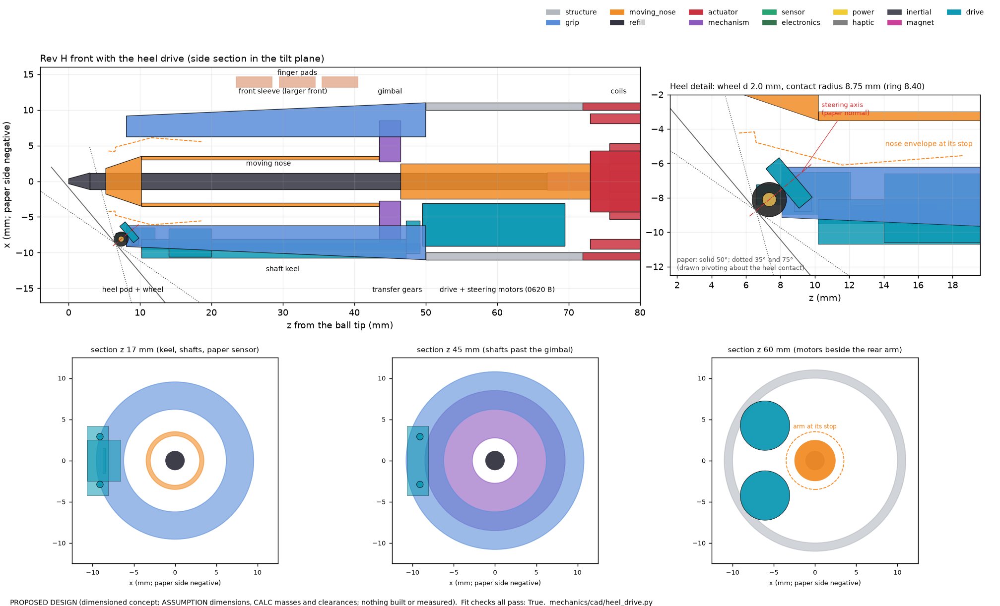

# Paper-grounded heel drive (Rev J, study D)

**Status: proposed design, calculation and simulation. Nothing has been built or measured.** Every number carries a label:

| Label | Meaning |
|---|---|
| CALC | calculated here (contact mechanics, geometry, catalogue drive trains, the differentiable design model) |
| SIM | simulated here: model HW1-D (the handwriting study's HW1 pen-hand-paper model plus a heel element), test writers 0–5, rules frozen before the test |
| MFR (id) | manufacturer statement, with its ledger id |
| LIT (id) | literature, with its ledger id |
| ASSUMPTION | chosen here; section 9 names the experiment that measures it |

Code: [`drive/`](../drive/__init__.py). One command: `python3 -m drive.run_study` (about 50 min on one core; `--quick` runs every stage in short form in about 5 min and writes `*_quick` files only). Tests: `pytest drive/tests -q` (about 10 s). CAD: [`mechanics/cad/heel_drive.py`](../mechanics/cad/heel_drive.py). Results: `results/drive/`. Proposed ledger rows: `results/drive/evidence_rows.csv` (HAP-60…70, AMF-100…118, CON-36…38, PAT-30…34; 38 sources opened). Layout parts for the 3-D explainer: `results/drive/layout_parts.json`.

**The question.** Using the paper as ground, which small actuator at the heel can push, steer or brake the pen (and so the hand) with the most useful force, safely?

## 1. The answer in plain words

**The paper can push the hand with about 0.3–0.6 N.**
- A rolling part at the heel can push on the paper with at most friction × the load on it.
- With a 0.55 N spring preload and tyre friction 0.6–1.2, that is 0.33–0.66 N; the average writer gets 0.30 N at μ 0.6 (CALC; friction ASSUMPTION, to measure in EXP-D01).
- That is as strong as the desk board's 0.4 N cap, from inside the pen. Light writers get less. A lifted pen gets nothing, so the writer can always escape.

**Recommended (provisional): a 2 mm steered wheel at the heel, with a drive motor for an explicit "lead" mode.**
- The wheel is steered about the paper normal through its contact point (the "cobot" principle, LIT HAP-60).
- **Steered only** (the default), it cannot move the pen. It lets the hand roll along the letter and holds it across with the full traction. Use: tracing, "write big" loops, copying known text.
- **Steered and driven**, it pushes along the letter. Only in a mode the user turns on, it leads a relaxed hand through a letter ("lead-through") or a sentence at gross scale ("autowrite"), while the nose adds the detail.
- Parts: two Faulhaber 0620 B motors (Ø6 × 20 mm, MFR AMF-100) in the handle, two 0.8 mm shafts in a keel under the front sleeve, and a sprung heel pod with a 2 mm O-ring wheel (PROPOSED DESIGN, section 4).
- **Alternative: the driven ball.** It traces more accurately and damps tremor better in the simulation, but it uses 34–96 mW while guiding (the wheel 1–6 mW), cannot be passive, and its rollers slip and wear. Build it as a bench alternative (EXP-D13) and choose after the human tests (EXP-D08, EXP-D09).

**Main results (SIM: model HW1-D; test writers 0–5, seeds 200–203; rules frozen before the test; tyre friction drawn 0.6–1.2 per case and unknown to the controller).**

| task (metric) | nothing on | nose alone | desk board (0.4 N, full law) | **steered wheel** (recommended hardware) | driven ball (fallback) |
|---|---|---|---|---|---|
| (a) tracing, dysgraphia-like: distance to target / letters read | 582 µm / 92 % | 378 µm / 94 % (partial) | 384 µm / 85 % | 372 µm / 86 % (steer only); **76 µm** / 79 % with the nose | **288–289 µm** / 86–90 % |
| (a) same, dyslexia-like | 616 µm / 83 % | 463 µm / 84 % | 416 µm / 79 % | 491 µm / 82 % | 312–319 µm / 76–80 % |
| (a) force on the pen, RMS / 95th percentile | – | – | 0.11 / 0.21 N | 0.12 / 0.25 N | 0.11–0.12 / 0.23 N |
| (a) drive power while guiding | – | – | (mains) | **1 mW** (steer only), 6 mW (with a small push) | 34 mW (omni rollers), 96 mW (smooth) |
| (b) "write big" loops: height / target, relaxed and resisting hand | 0.78 / 0.78 | – | 0.91 / 0.87 | **0.99 / 0.93–0.94** | 0.93–0.94 / 0.89 |
| (c) writer set on 'b', template 'd': bowl moved to 'd' | 0 % | – | 0 % | **0 %** (the writer wins; push ≤ 0.47 N) | 0 % |
| (c) relaxed hand led through 'd': bowl drawn within 0.3 mm | 3 % | – | 44 %* | **93 %** (driven) | 76 % |
| (e) autowrite, relaxed hand: letters / words read, speed | – | 9 % / 0 % | 56 % / 22 %, 3.2 mm/s* | **76 % / 60 %, 7.2 mm/s** (with the nose) | 78 % / 66 %, 5.1 mm/s (with the nose) |
| (d) tremor 1 mm at 4–10 Hz: ink error vs nothing on (clean writing moved) | 1.00 | 0.77 (18 µm) | – | 0.74 (186 µm) free writing; 0.73 (68 µm) on known text | 0.70–0.78 (94–168 µm); **0.62** (95 µm) with the nose |

\*The relaxed writer holds the pen down for a fixed time; the slower board runs out of time (section 5.3).

- **The steered wheel constrains; the ball pulls.** The wheel is best where the path matters: big loops, leading a relaxed hand, gross-scale autowrite, and it needs almost no power. The ball is best where corners matter: small letters (the wheel must stop and re-steer at cusps) and tremor damping in every direction.
- **Every "full" guide makes letters slightly less readable** (92 % → 84–90 %): the pull mixes the learner's letter with the template. The handwriting study found the same for the nose and the board; this study reproduces its numbers exactly.
- **Nothing turns a letter the writer is set on into another letter** (0 % under every device), and the writer felt at most 0.48 N (95th percentile).
- **Tremor:** the heel helps at 4–6 Hz, where the nose's tracker cannot (−12 to −31 %), but it bends clean writing by 68–186 µm. At 8–10 Hz the nose is better. The steered wheel is a weak free-writing tremor device.

**What it costs.** The heel grows: contact radius 6.75 → 8.75 mm, front sleeve Ø15.0 → Ø18.3 mm, the ball 1.4 mm further ahead of the heel, refill slide +2.0 mm (CALC). About 9 g more (CALC). Power 1–6 mW while guiding and 84 mW while leading, plus 30–80 mW for the paper sensor (SIM/CALC): about 12–18 h of writing while guiding, 8–10 h while leading (CALC, section 4.5). Two precision micromotors and watch-scale gears (cost class high). The sheet must be held.

**Rejected:** two micro omni-wheels (half the traction each; the smallest found is 11.5 mm), a braked ball (only resists, in every direction), controllable friction pads (electroadhesion far too weak; squeeze films need smooth surfaces), piezo feet, a 4 mm hub motor (too weak and slow), inertial pseudo-forces (no net force; study K).

## 2. What limits any drive at the heel

### 2.1 The force comes from friction on the paper

- The pen presses on the paper with the writer's force. The ball carries 0.15 N / sin 50° = 0.196 N of it (refill spring, CALC). The heel carries the rest.
- A sprung element in the heel gets min(P, heel load), where P is its spring preload. The skid ring takes any extra.
- The element can push sideways with at most μ × (its load). μ is the tyre-paper friction.
- Writers differ (LIT CON-01): mean force 1.01 N, SD 0.43 N between writers, 0.18 N within a word. In the model the writers' mean forces are 0.54 / 0.91 / 1.57 N at the 10th / 50th / 90th percentile (CALC).
- Friction of rubber on paper: polyurethane paper-feed rollers have 1.30–2.20 when new and 1.05–1.52 after 300 000 sheets (LIT AMF-111). A tiny heel tyre meets ink, dust and many papers, so the design range is 0.6–1.2 (ASSUMPTION). Paper friction tests agree only within 24–27 % between laboratories (LIT AMF-113). This must be measured (EXP-D01).

**T1. Traction the paper gives at preload P = 0.55 N (CALC over 1000 model writers)**

| μ | mean over writers (N) | weakest 10 % of writers (N) | writers whose mean force keeps the element fully loaded |
|---|---|---|---|
| 0.6 | 0.30 | 0.21 | 70 % |
| 0.9 | 0.45 | 0.31 | 70 % |
| 1.2 | 0.61 | 0.42 | 70 % |

- So a heel drive gives about **0.3–0.6 N**: as much as the desk board's 0.4 N cap (docs/guidance_board.md), from inside the pen.
- A writer who lightens the pen gets less. A pen in the air gets nothing: lifting always frees the writer.
- A higher preload does not help light writers: they do not press hard enough to load it (fig_traction_capacity).

### 2.2 Tyre, rolling drag and slip

**T2. The 2 mm wheel's O-ring tyre (0.6 mm cord) on paper (CALC; Hertz contact; rolling friction after LIT AMF-112; Mindlin tangential stiffness; tyre E 8 MPa, loss tangent 0.12, ASSUMPTION)**

| load (N) | contact radius (mm) | mean pressure (MPa) | rolling resistance coefficient | rolling drag (mN) | tangential stiffness (N/mm) |
|---|---|---|---|---|---|
| 0.3 | 0.23 | 1.87 | 0.066 | 20 | 2.06 |
| 0.5 | 0.27 | 2.22 | 0.078 | 39 | 2.58 |
| 0.6 | 0.27 | 2.62 | 0.092 | 55 | 2.61 |

- Rolling along the letter costs about 46 mN at 0.55 N (CALC; 0.6 mm O-ring cord). The simulation used 0.066 × load (36 mN), from an earlier cord size; the difference is small against the 0.1–0.5 N guidance forces. The Rev H skid slides with about 0.1 N (0.12 × 0.8 N, ASSUMPTION μ_skid).
- Across the heading the tyre acts as a stiff spring before it slides: 1.5 N/mm with the fork and paper in series (ASSUMPTION, EXP-D02). At 0.66 N it deflects about 0.44 mm (CALC).
- Slip is detected by comparing the paper sensor's motion with the wheel's own motion (MFR AMF-109 class sensor). The rule flags slip when the pen travels over the wheel surface by more than the tyre can deflect (1.5 × 1.2 × load / k_lat plus 8 mm/s × 4 ms; ASSUMPTION). Each new flag lowers the traction estimate by 10 %; it recovers over about 2 s (ASSUMPTION, EXP-D05).

### 2.3 Where the drive can sit: outside the swinging nose

- In Rev H the nose swings to 5.29 mm from the axis in the ring plane; the ring's lip is 1.16 mm thick at 6.75 mm (docs/opt_inertial.md 8.6). There is no room inside the ring.
- A drive element and whatever steers or drives it must sit outside the nose's envelope, at the bottom of the heel (paper side). It must also be the lowest point of the heel at every tilt from 35° to 75°.

**T3. Heel contact radius needed (CALC; drive/geometry.py; 0.3 mm wall, 0.3 mm clearance to the nose at its stop)**

| element radius (mm) | element alone (mm) | wheel + steering ring (mm) | ball + two rollers r 0.6 mm (mm) |
|---|---|---|---|
| 0.75 | 7.12 | 8.14 | 8.05 |
| 1.00 | 7.61 | 8.68 | 8.47 |
| 1.25 | 8.11 | 9.21 | 8.89 |
| 1.50 | 8.60 | 9.75 | 9.31 |
| 2.00 | 9.59 | 10.82 | 10.15 |

- The chosen wheel is 2 mm across (radius 1.0 mm): the smallest that takes a replaceable O-ring tyre (ASSUMPTION).
- **Chosen heel (CALC):** contact radius **8.75 mm** (Rev H 6.75), skid ring 8.40 mm; the wheel sticks out 0.35 mm beyond the ring; spring travel 0.54 mm; the wheel keeps contact up to **±20° of pen roll**.

**T4. What the bigger heel costs the front end (CALC; the method of opt/inertial/front_end.py)**

| | Rev H (ring 6.75 mm) | with the heel drive (ring 8.40 mm) |
|---|---|---|
| front sleeve diameter at the heel | 15.0 mm | 18.3 mm |
| ball ahead of the heel at 50° | 5.21 mm | 6.59 mm |
| ball ahead at 35° / 75° | 9.03 / 1.45 mm | 11.39 / 1.89 mm |
| refill slide over 35–75° (with corrections) | 13.5 mm | 15.5 mm |

- The front is larger but stays well inside the Rev J envelope (Ø ≤ 24 mm where held, docs/revJ_plan.md 6).
- The refill spring must allow 2.0 mm more slide.
- **Ink stays visible.** The wheel sits at the bottom of the heel, on the paper side, 6.6 mm behind the ball along the pen. The ring stays open 120° on top, as in Rev H.

### 2.4 Pen roll, pen-up gaps, paper holding

- **Roll.** Rolling the pen moves the wheel up the side of the heel. The 0.54 mm spring travel keeps it on the paper up to ±20° (CALC). The IMU knows the roll and turns the steering and force directions with it (ASSUMPTION).
- **Pen-up gaps.** Lifting the pen lifts the wheel: the drive has nothing to push against and its torque goes to zero when the wheel load falls below 0.02 N (SIM rule). During a lift the controller turns the wheel toward the next stroke, so it is ready at touchdown. Dysgraphic writers stop and lift more often (LIT CON-38).
- **The paper must be held.** A loose sheet slides when the drive's push exceeds the sheet's grip on the desk: with 1 N of writing load, no resting hand and paper-desk μ 0.25, a 0.5 N push moves the sheet (CALC; μ 0.25–0.5 ASSUMPTION). With the writing hand resting (1 N) and μ 0.5 it holds 1.0 N. The other hand or a clip must hold the sheet (EXP-D03).
- **Heading rates.** Letters turn fast. The direction of the intended path turns at up to 71 rad/s (90th percentile) and 283 rad/s (99th percentile) on the synthetic writers (CALC on tuning writers; LIT CON-37 explains why tight curves are slow). Smoothed over 2 mm, as a wheel that leaves the detail to the nose would follow, the 99th percentile is 40 rad/s (CALC).

## 3. Candidates at the heel (CALC with catalogue parts)

**T5. Candidates (CALC; catalogue parts; preload 0.55 N; μ 0.6–1.2 ASSUMPTION; 'as 3' = as the steer-only wheel)**

| concept | actuators | force on the pen (N) | force note | speed at the contact (m/s) | power (W) | mass (g) | heel size | when not driving | safety | ledger |
|---|---|---|---|---|---|---|---|---|---|---|
| **Driven ball (trackball in reverse)** | 2 motors (Faulhaber 0620 B) on shafts to 2 rollers r 0.40 mm (bevel 1:1), 1 idler, preload spring | 0.33-0.66 | traction-limited (mu 0.6-1.2 x P 0.55 N); motor limit 0.57 N continuous | 1.26 | 0.081 (2 motors, 0.15 N RMS) | 6.7 | ball d 2 mm with rollers: heel contact radius >= 8.03 mm (Rev H 6.75) | reflected mass 6 g per axis; back-drive 0.03 N plus the orthogonal roller's axial slip about 0.22 N with smooth rollers -> retract when off | force <= mu_max x P = 0.66 N by physics; lift = zero force; current cap; slip detection | AMF-100,AMF-103,AMF-117,AMF-118 |
| **Two micro omni-wheels** | 2 motors (maxon DCX 6 M + GP 6 A 3.9:1) + 2 custom omni-wheels d 6 mm (smallest commercial found: 11.5 mm, AMF-110) | 0.17-0.47 | each wheel carries about half the heel load, so along one wheel's axis only half the traction pushes (0.5-0.71 x mu P, CALC) | 1.74 | 0.127 | 9.2 | 6 mm wheels: heel contact radius >= 11.4 mm; 11.5 mm commercial wheels: >= 16 mm (does not fit) | reflected mass 3 g per wheel; the rollers clog with paper dust (ASSUMPTION) | as the ball | AMF-101,AMF-102,AMF-110 |
| **Steered wheel, steer only (cobot)** | 1 steering motor (Faulhaber 0620 B, transfer gears, crown 2:1 on the fork) + Hall angle sensor at the fork; free wheel d 2 mm with an O-ring tyre | 0.33-0.66 across the path (constraint); 0 along it | cannot push; the across-path force is a reaction, up to mu x P; along the path only rolling resistance 46 mN (CALC, Persson AMF-112) | steering 1569 rad/s no-load (needed: p90 71, p99 283 rad/s on synthetic letters) | about 0.005-0.02 (steering only; power is supplied by the writer) | 3.8 | wheel d 2 mm with steering ring: heel contact radius >= 8.68 mm | when not guiding, the wheel must follow the writer's direction (free mode, LIT HAP-60 eq. 2) or retract | intrinsically passive: cannot move the pen by itself (LIT HAP-60, PAT-27); across-path force <= mu_max P | HAP-60,AMF-112,AMF-100,AMF-103 |
| **Steered wheel with an axle brake** | steering motor + a hub-train motor used as a generator (short-circuit or PWM braking) or a friction brake | 0.33-0.66 across; along the path up to mu x P as braking only | motor braking 0.4 N s/m at full short (Faulhaber 0620 B, 2:1, r 1.0 mm); more with a higher ratio | as 3 | < 0.02 (braking recovers energy) | 6.8 | as 3 plus the hub train | as 3 | passive (can only resist) | AMF-100,AMF-103 |
| **Steered and driven wheel (powered cobot)** | steering motor + drive motor (both Faulhaber 0620 B) in the handle; two 0.8 mm shafts in a keel to the heel pod; crown 2:1 for steering, bevels 2:1 to the axle | 0.33-0.66 in any direction after steering | traction-limited; motor limit 0.41 N continuous, 0.67 N peak (0620 B at 3.7 V, 2:1, three meshes, r 1.0 mm) | 1.57 | 0.078 drive + steering | 7.2 | wheel d 2 mm with steering ring: heel contact radius >= 8.68 mm | reflected mass along the heading 3.8 g; back-drive 30 mN (so it can stay down and follow the writer) | force <= mu_max x P by physics; current cap; slip detection; lift = zero | HAP-60,AMF-100,AMF-103 |
| **Braked ball (variable damping)** | 1 brake (solenoid pad as the Reflective Haptics stylus, HAP-68; or MR fluid AMF-108; or a SQUIGGLE-pressed pad AMF-106) | 0-0.66 opposing motion only | isotropic: it cannot tell writing from tremor, so it resists both | n/a (passive) | 0.02-0.3 (solenoid holding current, ASSUMPTION) | 3-6 (ASSUMPTION) | ball d 2 mm: heel contact radius >= 7.6 mm plus the brake | a free ball: light | passive; brake force <= mu P | HAP-68,AMF-106,AMF-108 |
| **Controllable friction pads** | high-voltage electrode pad; or a piezo pad; or a pad on a steering motor | electroadhesion 0.014-0.072 extra friction | a 24 mm2 pad at 1-5 kPa on paper adds 0.024-0.120 N of normal force (dielectric targets: pre-contact pressure 1-100 x below release, AMF-114); ultrasonic squeeze films need a smooth, airtight contact (AMF-115; paper is porous); anisotropic pads (AMF-116) slide with 3-6 x the drag of a rolling wheel (ASSUMPTION ratio) | n/a | 0.01-0.1 (400-2000 V converter; ASSUMPTION) | 1-3 | a pad on the heel | none | high voltage at the fingertips (EA) | AMF-114,AMF-115,AMF-116 |

**Verdicts.**
- **Driven ball** (a trackball run backwards). Pushes in any direction at once, 0.33–0.66 N (CALC). But whenever one roller drives, the other must slip along its axis (LIT AMF-117): 0.03 N of internal drag with omni-type rollers (ASSUMPTION) or about 0.22 N with smooth rollers (CALC: 0.3 × 0.75 N roller preload). Balls collect ink and paper dust and wear (LIT AMF-117, PAT-33). **Fallback.**
- **Two micro omni-wheels.** Each wheel carries half the load, so along one wheel only half the traction pushes: 0.17–0.47 N (CALC). The smallest commercial omni-wheel is 11.5 mm across (MFR AMF-110); even custom 6 mm wheels need a heel contact radius of about 11.4 mm (CALC). **Rejected.**
- **Steered wheel, steer only (cobot).** A free wheel rolls along its heading and grips across it. It channels the writer's own motion along the letter with the full traction across the path (0.33–0.66 N) and almost no power; it cannot move the pen on its own (LIT HAP-60, PAT-27). **Recommended default mode.**
- **Steered wheel with a brake.** Adds along-path damping from the drive motor used as a generator: 0.4 N·s/m with the winding shorted (CALC), more with PWM braking of the powered motor. **Recommended tremor mode.**
- **Steered and driven wheel ("powered cobot").** Adds a push along the heading, up to the traction, and can lead a relaxed hand. Motor limit 0.41 N continuous and 0.67 N peak through three gear meshes (CALC; 0.9 per mesh ASSUMPTION). **Recommended: the same wheel with its drive motor, used only in an explicit lead-through or autowrite mode.**
- **Braked ball.** Resists in every direction; it cannot tell writing from tremor. A stylus with an electromagnetically braked ball exists (LIT HAP-68, PAT-31). **Tremor only; not pursued** (the wheel's brake does the same along the path and the wheel also constrains across it).
- **Controllable friction pads.** Electroadhesion: 1–5 kPa on a 24 mm² pad adds only 0.024–0.12 N of normal force, so 0.014–0.07 N of friction (CALC from LIT AMF-114). Ultrasonic squeeze films need a smooth, closed contact (LIT AMF-115); paper is porous. Direction-dependent skins slide with drag (LIT AMF-116). **Rejected.**
- **Others.** A piezo "walking foot" on paper (the paper's compliance absorbs micrometre steps, ASSUMPTION); a 4 mm hub motor (0.40 N continuous only with an assumed 100:1 head, 73 mm/s no-load: too slow, CALC from MFR AMF-104); asymmetric vibration (a felt pull, no net force: study K); the desk board (keeps its role at a desk). **Not pursued.**

## 4. The recommended design (proposed design)

### 4.1 What it is

*Side section in the tilt plane, the heel in detail (the wheel tilted on the paper normal) and three cross-sections. PROPOSED DESIGN; `mechanics/cad/heel_drive.py` also writes `results/cad/heel_drive_assembly.step`. The part list is `results/drive/layout_parts.json` (CSV twin `results/drive/fig_cad_heel_drive.csv`).*

- A **2 mm wheel** with a 0.6 mm O-ring tyre sits in a slot at the bottom of a larger skid ring.
- It is **steered about the paper normal through its contact point** (the cobot rule, LIT HAP-60): steering then needs almost no torque and never pushes the pen.
- It is **driven about its axle** through a 2:1 bevel.
- Two **Faulhaber 0620 B** brushless motors (Ø6 × 20 mm, 2.5 g each, MFR AMF-100) sit in the handle between the gimbal and the coils, beside the nose's rear arm.
- Transfer gears and two 0.8 mm shafts in a keel under the front sleeve carry their motion to the heel pod.
- The pod hangs on a leaf flexure that presses the wheel down with 0.55 N. A Hall sensor reads the flexure's bend (the wheel's load); another reads the wheel's heading at the fork.
- The Rev H paper sensor becomes mandatory: it sees slip.

**T6. Heel-drive parts (PROPOSED DESIGN; masses CALC from volumes and catalogue; `results/drive/layout_parts.json`)**

| id | part | where (z from the ball tip, mm) | what it does | catalogue / make | mass (g) |
|---|---|---|---|---|---|
| `drive_skid_ring` | Skid ring with wheel slot | 6.6–8.1 | Rests on the paper like the Rev H ring, but larger, with a slot at the bottom through which the drive wheel reaches the paper. | custom (PTFE-coated POM, contact radius 8.40 mm, open 120 deg on top) | 0.08 |
| `drive_wheel` | Drive wheel with O-ring tyre | 6.9–7.9 | A 2 mm wheel that rolls on the paper: steered, it lets the pen move only along the letter; driven, it pushes the pen along it. | custom brass hub d 0.8 mm + NBR O-ring 0.8 x 0.6 mm (tyre); axle d 0.3 mm in jewel bearings (AMF-111,AMF-112) | 0.01 |
| `drive_fork` | Steering fork and crown | 8.0–9.0 | Holds the wheel and turns it about the paper normal through its contact point; carries the crown gear, the axle bevel and a tiny magnet for the steering-angle sensor. | custom (hardened steel fork, brass crown gear module 0.1, bevel 2:1 to the axle) | 0.08 |
| `drive_pod` | Heel pod (sprung) | 8.1–12.1 | Bearing block for the fork, the two bevel pinions and the sensors; it hangs on a flexure so a 0.55 N preload presses the wheel onto the paper. | custom (PEEK housing, two jewel bearings) | 0.07 |
| `drive_spring` | Preload flexure | 12.1–17.1 | Leaf spring that lets the pod move 0.54 mm toward the paper and presses it with about 0.55 N; the ring takes any extra writing force. | custom (17-7PH leaf 0.1 mm, laser-cut) | 0.01 |
| `drive_load_sensor` | Wheel-load sensor | 15.6–16.6 | Hall sensor that reads the flexure's bend: the wheel's load, which sets how much force can be used before the wheel slips. | linear Hall IC (DRV5055 class) + 1 mm magnet (OPT-46) | 0.02 |
| `drive_steer_sensor` | Steering-angle sensor | 8.8–9.8 | Reads the wheel's heading from a magnet on the fork, right at the wheel (so shaft twist does not matter). | 3-D Hall IC (TMAG5273 class) + diametric magnet d 1 mm (OPT-45) | 0.02 |
| `drive_shaft_drive` | Drive shaft | 10.2–49.2 | Thin steel shaft in a PTFE liner that carries the drive motor's turning to the heel pod. | custom (stainless shaft d 0.8 mm, PTFE liner d 1.2 mm; 40 deg bevel pinion at the pod) | 0.15 |
| `drive_shaft_steering` | Steering shaft | 10.2–49.2 | Thin steel shaft in a PTFE liner that carries the steering motor's turning to the heel pod. | custom (stainless shaft d 0.8 mm, PTFE liner d 1.2 mm; 40 deg bevel pinion at the pod) | 0.15 |
| `drive_keel` | Shaft keel | 10.2–47.2 | Ridge under the front sleeve (toward the paper) that houses the two shafts either side of the paper sensor. | PEEK / TPE, part of the sleeve moulding (AMF-24) | 0.37 |
| `drive_paper_sensor` | Paper sensor (needed by the drive) | 14.0–20.0 | Optical sensor that sees the paper: it detects wheel slip (pen motion that the wheel did not make) and gives the page position. | optical flow sensor, to select (mouse-class performance as PMW3360: 1 kHz reports, 12 000 frames/s; its own package is too large) (AMF-109) | 0.30 |
| `drive_transfer` | Transfer gears | 47.2–49.2 | Two small spur-gear pairs that move each motor's output out to its shaft, around the gimbal. | module 0.1 spur gears (33 teeth, 1:1, centre distance 3.3 mm), brass | 0.12 |
| `drive_motor` | Wheel drive motor | 49.5–69.5 | Turns the wheel so the pen is pushed along the letter (up to about 0.5 N at the wheel). | Faulhaber 0620 B brushless DC, 6 x 20 mm (drive: bevel 2:1 at the wheel; steering: crown 2:1) (AMF-100) | 2.50 |
| `steer_motor` | Steering motor | 49.5–69.5 | Turns the wheel's heading to follow the letter. | Faulhaber 0620 B brushless DC, 6 x 20 mm (drive: bevel 2:1 at the wheel; steering: crown 2:1) (AMF-100) | 2.50 |
| `drive_front_sleeve` | Front sleeve (larger front) | 8.1–50.0 | Where the thumb, index and middle finger rest; its front is 18.3 mm across instead of 15.0 mm to hold the heel drive. | PEEK core + TPE overmould (AMF-24) | 10.79 |
| `drive_drivers` | Motor drivers | 99.5–103.0 | Two three-phase drivers with current sensing that set each motor's torque 2000 times a second. | 3-phase micro BLDC driver x2 (to select; DRV8311 class) | 0.15 |

**Fit checks (CALC; `drive/layout.fit_checks`).** All pass:
- motors to the nose's rear arm at its stop: 0.26 mm
- motor pocket in the 1 mm handle shell (wall left 0.60 mm): 0.40 mm
- motors to the coils' iron ring (along the pen): 2.48 mm
- motors to the gimbal (along the pen): 3.00 mm
- shafts outside the gimbal ring: 0.45 mm
- keel's front edge above the paper at 35°: 0.20 mm
- heel pod to the nose envelope at its stop: 0.41 mm
- paper sensor to the nose envelope: 0.69 mm

**What it replaces in Rev H.** The skid ring (larger, slotted), the front sleeve (larger front), the optional paper sensor (now required) and the optional board magnet and its keel (the shaft keel takes their place; the heel drive does the board's job without a board).

### 4.2 Sizing by optimisation (CALC)

- **Model.** Continuous design variables: element radius, gear ratio (relaxed to a continuous value), spring preload and, for the ball, roller radius. Discrete: the motor (enumerated from the catalogue). Terms: traction each model writer gets (CON-01 force distribution, μ 0.6), share of writers with full load, motor force, speed, reflected mass, back-drive force, copper loss at 0.15 N RMS, heel size (from the geometry of 2.3, including the steering ring or rollers), rolling drag (Persson, LIT AMF-112) and, for the ball, the rollers' internal scrub.
- **Method.** The model is smooth, cheap and analytic, so reverse-mode automatic differentiation (torch autograd, the adjoint of the model) gives exact gradients; Adam from 6 starts finds the optimum; the ratio is then snapped to catalogue options and the rest re-optimised. Gradients agree with central finite differences to a relative error of 1e-10 (CALC). **Bayesian optimisation is used instead for the control gains** (section 5), where every evaluation is a noisy, non-smooth closed-loop simulation with a recogniser.

**T7. Optimised builds (CALC; autograd optimum, ratio snapped to the catalogue options, 6 mm motors only)**

| | steered + driven wheel | driven ball |
|---|---|---|
| motor | fh0620B (Faulhaber 0620 B, MFR AMF-100) | fh0620B (Faulhaber 0620 B) |
| gear (snapped; continuous optimum) | bevel 2:1 only (1.86:1) | bevel 1:1 only (0.99:1) |
| element radius (mm) | 1.00 | 1.00 |
| roller radius (mm) | - | 0.40 |
| preload P (N) | 0.57 | 0.57 |
| motor force at the contact, continuous (N) | 0.53 | 0.71 |
| no-load speed (m/s) | 1.57 | 1.24 |
| usable force, mean writer, μ 0.6 (N) | 0.31 | 0.31 |
| usable force, weakest 10 % of writers (N) | 0.22 | 0.22 |
| writers with full load | 68 % | 68 % |
| reflected mass (g) | 3.8 | 6.1 |
| back-drive force (mN) | 23 | 28 |
| internal scrub of the rollers (mN) | 0 | 225 (smooth rollers) |
| rolling drag (mN) | 46 | 31 |
| copper loss at 0.15 N RMS (mW) | 46 | 26 |
| heel contact radius (mm) | 8.67 | 8.02 |
| mass of motors and gears (g) | 7.4 | 7.0 |

Objective of each motor (lower is better; CALC): wheel/fh0620B 0.039; wheel/mxDCX6M 0.053; wheel/mxDCX8M -0.047 (does not fit); ball/fh0620B 0.801; ball/mxDCX6M 0.862; ball/mxDCX8M 1.038 (does not fit)
Gradient check: largest relative error wheel 1.0e-10, ball 8.7e-10 (CALC).

- **The force is set by traction, not by size.** Across the size-weight sweep the usable force stays at 0.31 N (mean writer, μ 0.6) and 0.22 N (weakest 10 %) whatever the wheel size (CALC, fig_design_pareto). So the smallest wheel wins.
- **A low ratio wins.** A 2:1 bevel (no gearhead) keeps the reflected mass at 3.8 g and the back-drive force at 23–30 mN, so the wheel can stay down and follow the writer when it is not driving (CALC).
- The model's 2:1 efficiency (0.95) is optimistic for the real path (spur transfer + 40° bevel + 2:1 bevel, 0.73 at 0.9 per mesh, ASSUMPTION). With that path: 0.41 N continuous and 0.67 N peak at the wheel, 30 mN back-drive, 3.5 W/N² copper loss (CALC). The simulation used 24 mN; the difference is inside the gear-friction uncertainty.
- An 8 mm motor scores higher in the model, but it does not fit beside the nose's rear arm (CALC fit check), and its friction torque is not in the catalogue extract (ASSUMPTION). It is excluded.

### 4.3 Modes and control (SIM-tuned; gains frozen in `results/drive/rules.json`)

| mode | what the wheel does | control law (gains tuned on tuning writers) |
|---|---|---|
| steer-only guidance | channels the writer's motion along the template; the writer supplies all motion | Stanley law: heading = template tangent 0.40 mm ahead + atan(15.4 s⁻¹ × cross-track error / speed); chosen over pure pursuit by the tuning (objective 0.65 vs 0.82) |
| steer-only, free in a band | free (follows the writer) within 0.3 mm of the template, steered outside | as above, band chosen by grid |
| steer + drive guidance ("full") | as steer-only plus a small push along the path while the writer moves forward | a 0.036 N push along the path while the writer moves forward (the lead gain tuned for the ball's full law) |
| steer + brake (tremor) | follows the writer's intended direction (free mode, LIT HAP-60 eq. 2) and brakes along the path above the writing band | free mode with apparent mass 0.05 kg, heading from the force low-passed at 9.3 Hz, brake 2.0 N·s/m (tuned) |
| steer + drive lead ("lead-through", "autowrite") | leads a relaxed hand along the letter | push 0.17 N + 6.3 N·s/m × (20 mm/s − speed along the path), capped; stops at the stroke end (tuned) |
| off | free wheel, or retracted | — |

Fallback ball gains (same tuning): full law 361 N/m spring, 5.1 N·s/m damping, 0.036 N lead; damper 3.5 N·s/m above 8.0 Hz; lead 0.10 N + 6.7 N·s/m × (20 mm/s − speed) (`results/drive/rules.json`).

**Supervisor (every mode; ASSUMPTION values, tested in SIM).**
- Force cap: min(0.5 N, 0.8 × μ̂ × measured wheel load). μ̂ starts at 0.8 (the controller does not know the paper) and falls with slip flags.
- Force slew limit 20 N/s.
- Yield: if the pen stays more than 4 mm from the template for 0.3 s, the drive fades out (the board's rule).
- Zero torque when the wheel load is below 0.02 N (pen lifted).
- Physics caps everything: the wheel can never push or hold harder than the static traction, μ_s × 0.55 N (0.36–0.73 N), whatever the software does.
- Lateral release of the steer-only hold (proposed after the test, section 4.4).

### 4.4 Safety

- **Force.** Commands: at most 0.5 N and 0.8 × μ̂ × wheel load (software). Physics: at most the static traction, 0.36–0.73 N (T1 with μ_s = 1.1 μ). Handwriting-guidance devices used 0.43–0.49 N (LIT HAP-15, HAP-16, HAP-51). ISO/TS 15066 allows 140 N quasi-static on the hand (LIT HAP-70): the drive is two orders of magnitude below any injury limit. The limit that matters is comfort and trust.
- **The steered wheel's hold is a reaction, not a command.** The software cap limits what the motors command. Across its heading, the steer-only wheel resists with whatever the writer pushes, up to the traction. In the loops test it reached 0.66 N (maximum; 95th percentile 0.49–0.56 N), and the tyre slid for part of the time (SIM). **A lateral release** is therefore proposed: when the wheel-mount sensor reads more than the cap, the excess turns the wheel toward the push (apparent mass 0.02 kg, ASSUMPTION). At the worst-case friction μ = 1.2 it brought the 95th percentile to 0.43–0.50 N and the maximum to 0.49–0.56 N, cut sliding from 6–15 % to 2–3 % of the time, and cost some loop height for a resisting hand (0.94 → 0.88) (SIM on tuning writers after the test, `results/drive/release_tuning.json`; not a test result). EXP-D07 must confirm it.
- **The writer always wins** (SIM, section 5.3): a writer set on a letter still writes it.
- **Passive by default.** Steer-only and brake modes cannot move the pen. Driving needs an explicit mode, and the drive never starts a stroke: the writer puts the pen down.
- **Stall and slip.** The paper sensor detects slip; the cap follows the traction estimate; stall is limited by the current cap.
- **Pinch points.** The wheel slot is on the paper side; the wheel turns at up to 1.6 m/s no-load (CALC) but with at most 0.67 N of rim force (CALC). ASSUMPTION: no pinch hazard; check in EXP-D07.
- **Heat.** Copper loss is 35–80 mW at 0.10–0.15 N RMS (CALC, 3.5 W/N²); winding rise 5–11 K with 146 K/W (MFR AMF-100 Rth 97.5 K/W × 1.5 enclosed, ASSUMPTION). Motors sit inside the handle, away from the finger pads (z 50–70 mm vs pads at 26–38 mm).
- **Magnets and implants.** Only the motors' own small rotor magnets; far weaker than the Rev H actuator magnets.

### 4.5 Power, mass, noise, cost

- **Power (CALC on SIM).** Drive: 0–1 mW steer-only, 6 mW steered + driven guidance, 84 mW while leading (SIM means). Paper sensor: 16.3–21.6 mA (MFR AMF-109, a mouse-class sensor) is 30–80 mW from the cell, depending on the regulator (CALC). Motor drivers and Hall sensors: 10–20 mW (ASSUMPTION). Rev H uses about 0.08 W and runs 27 h on its 750 mAh cell (docs/revH_concept.md), so about 2.2 Wh are usable. With the drive: 0.12–0.19 W while guiding (12–18 h) and 0.21–0.26 W while leading (8–10 h) (CALC). The Rev J target of 8 h holds.

- **Mass.** New heel-drive parts 6.6 g plus 2.5 g for the larger front sleeve (10.8 g instead of 8.3 g, same simplified shape; CALC): 9.1 g in all, so Rev H's 75 g becomes about 84 g (Rev J envelope ≤ 120 g).
- **Noise.** Two 6 mm motors and watch-scale gears may whine. Not quantified (EXP-D06).
- **Cost class.** High: two precision micromotors, custom module-0.1 gears and a sealed pod.

## 5. Simulation results (SIM)

### 5.0 How the simulation works

- **Model HW1-D** = the handwriting study's model HW1 (hand, handle, Rev H nose, ball and skid friction, page sensor, the nose's guidance law; `handwriting/plant.py`, read-only) plus a heel element (`drive/plant.py`). With the drive off it reproduces HW1 within 2 µm (test).
- **Tyre.** A 2-D bristle between the heel and the element's surface: stiffness 1.5 N/mm, friction limit μ × wheel load with a Stribeck drop, rolling drag 0.066 × load (wheel) or 0.05 × load (ball) (ASSUMPTION/CALC). Slip is real: when the demand exceeds the limit, the element slides and the force falls.
- **Wheel.** Heading from a steering servo (40 Hz, 500 rad/s, 6·10⁴ rad/s², ASSUMPTION); rolling speed with the reflected mass 3.8 g and back-drive 24 mN (CALC); it grips across its heading and rolls free, braked or driven along it. **Ball.** Two drive axes with 6.1 g reflected mass, 28 mN back-drive and 30 mN roller scrub (omni-type rollers, ASSUMPTION).
- **Sensing noise (ASSUMPTION).** Wheel load 10 mN, lateral force 5 mN, paper-sensor velocity 2 mm/s.
- **Writing force** varies per writer and within words (LIT CON-01 statistics); the wheel load follows it.
- **Traction is unknown to the controller.** Each test case draws the true μ from 0.6–1.2 (seeded); the controller starts at μ̂ = 0.8 and lowers it on slip flags.
- **Hands.** Relaxed: the HAP-26 nominal arm (170 N/m, 11 N·s/m). Lightly resisting: the HAP-26 upper 95 % CI arm (533 N/m, 27.6 N·s/m; ASSUMPTION for co-contraction). For lead-through and autowrite, the **relaxed writer**: while the pen is down the writer's own aim follows the hand (time constant 0.25 s, the board study's model); the writer makes the pen-up moves and holds the pen down while the drive leads (ASSUMPTION).
- **The desk board** is simulated in the same plant as a grounded force on the handle with its own law, cap (0.4 N), lag, dead time, sensing noise and 0.98 N normal pull (`board/`, read-only).
- **Added conditions.** Two rows were run after the main test, with the same frozen rules and cases (`tasks_extra.json`): the recommended hardware's passive mode ("driven wheel, steer only": the steer-only law with the drive train attached and 70 % of its drag compensated) and the ball with smooth rollers ("smooth rollers"). The lateral release (section 4.4) was checked on tuning writers only.
- **Tuning and test.** Gains were tuned by Bayesian optimisation (Gaussian process, Matérn 5/2, expected improvement; 6 + 14 evaluations per law) and grids, on tuning writers 100–102 and seed 300 only, with μ = 0.9. The objectives are written in `drive/tune.py`. The rules were then frozen in `results/drive/rules.json` (hash 6b64568210e3c0b5, 2026-09-29 00:07 UTC) before any test run. Tests use writers 0–5 and seeds 200–203. No gain was changed after the freeze.
- **Metrics.** Target error: distance from the ink to the target letters (µm). Letters read: share of letters the app's recogniser reads as the target (handwriting study). Words read: the app's word reading. Force: the drive's (or board's) force on the pen, RMS, 95th percentile, maximum. Felt change: the change in the writer's grip force against the same run without the device (what the writer feels). True sliding: share of contact time the tyre slides (plant). Slip flags: the detector's flags per run. Coverage: share of the template covered by ink within 0.3 mm. Drive power: copper loss plus positive mechanical power / 0.8 (CALC on SIM).

**Check against the handwriting study.** With the drive off, and with the board emulated in the same plant, HW1-D gives the handwriting study's published numbers (docs/handwriting_outcomes.md): nothing on 582 µm / 92 % and 616 µm / 83 %; nose partial 378 µm / 94 %; board partial 444 µm / 91 %; board full 384 µm / 85 % and 416 µm / 79 % (SIM here vs SIM there, same writers and seeds).

### 5.1 (a) Guided tracing

Figure: `results/drive/fig_practice.png` (CSV twin).

**S1a. (a) Guided tracing, dysgraphia learners (SIM; 6 test writers x 4 seeds; mean ± SD)**

| condition | target error (um) | letters read | learner's error letters read as the target | words read (app) | force RMS (N) | force p95 (N) | felt change p95 (N) | true sliding | slip flags per run | coverage | drive power (mW) |
|---|---|---|---|---|---|---|---|---|---|---|---|
| Rev H, nothing on | 582 ± 131 | 92 % | 89 % | 87 % | 0.00 | 0.00 | - | 0.000 | 0.0 | 73 % | 0 |
| nose alone (partial) | 378 ± 140 | 94 % | 91 % | 89 % | 0.00 | 0.00 | 0.01 | 0.000 | 0.0 | 82 % | 0 |
| desk board, partial | 444 ± 90 | 91 % | 87 % | 87 % | 0.03 | 0.06 | 0.17 | 0.000 | 0.0 | 60 % | 0 |
| desk board, full | 384 ± 62 | 85 % | 81 % | 81 % | 0.11 | 0.21 | 0.21 | 0.000 | 0.0 | 67 % | 0 |
| heel ball, partial | 507 ± 97 | 93 % | 89 % | 89 % | 0.05 | 0.10 | 0.07 | 0.000 | 2.6 | 72 % | 6 |
| heel ball, full | 288 ± 51 | 90 % | 89 % | 80 % | 0.11 | 0.23 | 0.25 | 0.000 | 12.6 | 85 % | 34 |
| steered wheel (steer only) | 371 ± 97 | 84 % | 80 % | 74 % | 0.12 | 0.25 | 0.26 | 0.001 | 11.3 | 86 % | 0 |
| steered wheel, free in band | 425 ± 97 | 90 % | 87 % | 84 % | 0.12 | 0.25 | 0.21 | 0.001 | 39.8 | 76 % | 0 |
| driven wheel, steer only | 372 ± 99 | 86 % | 82 % | 76 % | 0.12 | 0.25 | 0.26 | 0.001 | 10.1 | 85 % | 1 |
| steered + driven wheel | 389 ± 100 | 86 % | 83 % | 75 % | 0.11 | 0.24 | 0.26 | 0.001 | 12.3 | 88 % | 6 |
| steered wheel + nose | 76 ± 14 | 79 % | 77 % | 62 % | 0.12 | 0.25 | 0.27 | 0.001 | 11.2 | 90 % | 0 |
| heel ball, full, smooth rollers | 289 ± 46 | 86 % | 84 % | 72 % | 0.12 | 0.23 | 0.24 | 0.001 | 9.9 | 79 % | 96 |

**S1b. (a) Guided tracing, dyslexia learners (SIM; 6 test writers x 4 seeds; mean ± SD)**

| condition | target error (um) | letters read | learner's error letters read as the target | words read (app) | force RMS (N) | force p95 (N) | felt change p95 (N) | true sliding | slip flags per run | coverage | drive power (mW) |
|---|---|---|---|---|---|---|---|---|---|---|---|
| Rev H, nothing on | 616 ± 173 | 83 % | 0 % | 66 % | 0.00 | 0.00 | - | 0.000 | 0.0 | 76 % | 0 |
| nose alone (partial) | 463 ± 177 | 84 % | 0 % | 68 % | 0.00 | 0.00 | 0.01 | 0.000 | 0.0 | 81 % | 0 |
| desk board, partial | 507 ± 115 | 83 % | 0 % | 65 % | 0.03 | 0.06 | 0.16 | 0.000 | 0.0 | 56 % | 0 |
| desk board, full | 416 ± 84 | 79 % | 0 % | 68 % | 0.10 | 0.20 | 0.20 | 0.000 | 0.0 | 65 % | 0 |
| heel ball, partial | 515 ± 124 | 83 % | 0 % | 65 % | 0.06 | 0.12 | 0.08 | 0.000 | 3.2 | 75 % | 8 |
| heel ball, full | 312 ± 58 | 80 % | 0 % | 62 % | 0.11 | 0.24 | 0.26 | 0.001 | 12.3 | 82 % | 34 |
| steered wheel (steer only) | 492 ± 148 | 81 % | 0 % | 65 % | 0.10 | 0.23 | 0.24 | 0.000 | 6.2 | 82 % | 0 |
| steered wheel, free in band | 514 ± 143 | 82 % | 0 % | 68 % | 0.12 | 0.25 | 0.21 | 0.000 | 30.3 | 75 % | 0 |
| driven wheel, steer only | 491 ± 147 | 82 % | 0 % | 67 % | 0.11 | 0.23 | 0.24 | 0.000 | 5.8 | 82 % | 1 |
| steered + driven wheel | 503 ± 151 | 81 % | 0 % | 65 % | 0.10 | 0.23 | 0.24 | 0.000 | 5.8 | 84 % | 6 |
| steered wheel + nose | 98 ± 25 | 76 % | 2 % | 55 % | 0.11 | 0.23 | 0.24 | 0.000 | 6.1 | 85 % | 0 |
| heel ball, full, smooth rollers | 319 ± 59 | 76 % | 0 % | 58 % | 0.11 | 0.24 | 0.25 | 0.001 | 10.7 | 77 % | 95 |

- **Distance to the target.** The driven ball's full law brings the ink closest without the nose: −51 % (dysgraphia-like) and −49 % (dyslexia-like). The steered wheel gives −36 % and −20 %, about as much as the desk board's full law (−34 % and −32 %). With the nose also correcting, the wheel brings the ink to 76 µm and 98 µm (−87 % and −84 %).
- **Readability.** Every full law lowers the share of letters the app reads as the target (dysgraphia-like: 92 % → 84–90 %). The handwriting study found the same for the nose and the board: a passive hand pulled toward the template makes hybrids of the learner's letter and the target. The partial laws (ball partial 93 %, wheel free in a 0.3 mm band 90 %) keep reading close to unguided.
- **Wrong letters stay wrong.** The dyslexia-like learners' reversed and wrong letters were read as the target 0 % of the time under every heel mode (2 % with wheel + nose), as with the nose and the board.
- **Force.** The full and steer-only heel modes used 0.10–0.12 N RMS and at most 0.25 N at the 95th percentile, like the board's full law (0.11 / 0.21 N); the writer's grip force changed by 0.21–0.26 N at the 95th percentile. The ball's partial law used half of that (0.05–0.06 N RMS).
- **Slip.** True sliding stayed below 0.1 % of contact time. The simple slip detector, however, raised 3–40 flags per sentence without sliding (false flags), most in the free-in-band mode; each lowers the force cap for about 2 s. A better detector is needed (EXP-D05).
- **Power.** Steer-only 0–1 mW; steered + driven 6 mW; ball 34 mW mean (CALC on SIM).
- **The recommended hardware's passive mode** (steer only, drive train attached, 70 % of its own drag compensated) performs as the free wheel: 372 µm / 86 % and 491 µm / 82 %.

### 5.2 What a resisting writer feels

**S2. A lightly resisting writer (SIM; upper-CI arm impedance; 6 writers x 2 seeds)**

| condition | target error (um) | letters read | force RMS (N) | force p95 (N) | felt change RMS (N) | felt change p95 (N) | yields |
|---|---|---|---|---|---|---|---|
| Rev H, nothing on | 561 ± 76 | 91 % | 0.00 | 0.00 | - | - | 0.0 |
| desk board, full | 412 ± 52 | 92 % | 0.12 | 0.25 | 0.13 | 0.26 | 0.0 |
| heel ball, full | 338 ± 42 | 90 % | 0.12 | 0.26 | 0.14 | 0.29 | 0.0 |
| heel ball, full, smooth rollers | 337 ± 37 | 90 % | 0.13 | 0.26 | 0.14 | 0.29 | 0.0 |
| steered wheel (steer only) | 390 ± 64 | 89 % | 0.14 | 0.28 | 0.15 | 0.32 | 0.0 |
| driven wheel, steer only | 392 ± 64 | 90 % | 0.14 | 0.28 | 0.14 | 0.32 | 0.0 |
| steered + driven wheel | 403 ± 67 | 88 % | 0.13 | 0.27 | 0.14 | 0.31 | 0.0 |

- A lightly resisting writer (a stiffer arm) still gets 27–40 % less distance to the target with every grounded device (SIM).
- The change in grip force they feel is 0.26 N (board) to 0.29–0.32 N (heel) at the 95th percentile, below the 0.5 N cap. No device had to yield (0 yields): the resisting writer never held the pen 4 mm off the template for 0.3 s.
- The steered wheel feels firmer than the ball (0.32 vs 0.29 N) because its constraint across the path is stiff until the tyre slips.

### 5.3 (b) "Write big" loops and (c) the reversed letter

Figure: `results/drive/fig_loops_reversal.png` (CSV twin).

**S3. (b) 'Write big' loops: the writer's loops shrink from 0.8 to 0.6 of 10 mm (SIM; 4 seeds)**

| hand | condition | loop height / target | last loop / target | ink to template RMS (mm) | force RMS (N) | felt change RMS (N) |
|---|---|---|---|---|---|---|
| relaxed | Rev H, nothing on | 0.78 ± 0.00 | 0.66 | 1.17 | 0.00 | - |
| relaxed | desk board, full | 0.91 ± 0.00 | 0.84 | 0.62 | 0.19 | 0.18 |
| relaxed | heel ball, full | 0.94 ± 0.00 | 0.87 | 0.52 | 0.17 | 0.18 |
| relaxed | heel ball, full, smooth rollers | 0.93 ± 0.00 | 0.83 | 0.58 | 0.20 | 0.20 |
| relaxed | steered wheel (steer only) | 0.99 ± 0.00 | 0.77 | 0.63 | 0.27 | 0.27 |
| relaxed | driven wheel, steer only | 0.99 ± 0.00 | 0.76 | 0.64 | 0.27 | 0.28 |
| relaxed | steered + driven wheel | 0.99 ± 0.00 | 0.87 | 0.38 | 0.24 | 0.25 |
| lightly resisting | Rev H, nothing on | 0.78 ± 0.00 | 0.66 | 1.17 | 0.00 | - |
| lightly resisting | desk board, full | 0.87 ± 0.00 | 0.79 | 0.81 | 0.22 | 0.22 |
| lightly resisting | heel ball, full | 0.89 ± 0.01 | 0.77 | 0.78 | 0.21 | 0.22 |
| lightly resisting | heel ball, full, smooth rollers | 0.89 ± 0.01 | 0.76 | 0.80 | 0.23 | 0.23 |
| lightly resisting | steered wheel (steer only) | 0.94 ± 0.03 | 0.73 | 0.82 | 0.34 | 0.34 |
| lightly resisting | driven wheel, steer only | 0.93 ± 0.03 | 0.72 | 0.75 | 0.34 | 0.34 |
| lightly resisting | steered + driven wheel | 0.94 ± 0.03 | 0.76 | 0.70 | 0.33 | 0.34 |

- **Loops.** The writer's loops shrink from 0.8 to 0.6 of the 10 mm target (a micrographia-like writer, board study's task). The steered wheel keeps the loops at 0.99 of the target height (relaxed hand) and 0.93–0.94 (lightly resisting), against 0.91 and 0.87 with the desk board and 0.94 and 0.89 with the ball. With its drive, the last loop stays at 0.87 and the ink within 0.38 mm of the template (SIM). The wheel does this with 0.24–0.34 N RMS.

**S4. (c) Reversed letter: template 'd' (SIM; 4 seeds)**

| writer | condition | bowl ink on the 'd' side | template bowl covered | bowl ink to template RMS (mm) | force max (N) | felt change p95 (N) |
|---|---|---|---|---|---|---|
| set on b | heel ball, full | 0 % | 11 % | 2.45 | 0.37 | 0.34 |
| set on b | desk board, full | 0 % | 9 % | 2.07 | 0.40 | 0.48 |
| set on b | Rev H, nothing on | 0 % | 9 % | 3.92 | 0.00 | - |
| set on b | steered + driven wheel | 0 % | 11 % | 2.72 | 0.47 | 0.46 |
| set on b | steered wheel (steer only) | 0 % | 11 % | 2.71 | 0.46 | 0.46 |
| relaxed (lead-through) | heel ball, lead | 91 % | 76 % | 0.25 | 0.23 | 0.20 |
| relaxed (lead-through) | desk board, lead | 46 % | 44 % | 0.12 | 0.31 | 0.19 |
| relaxed (lead-through) | Rev H, nothing on | 0 % | 3 % | 0.01 | 0.00 | - |
| relaxed (lead-through) | steered + driven wheel, lead | 92 % | 93 % | 0.13 | 0.33 | 0.26 |
| relaxed (lead-through) | steered wheel (steer only) | 0 % | 3 % | 0.01 | 0.05 | 0.00 |

- **A writer set on 'b' still writes 'b'.** With every device, 0 % of the bowl moved to the 'd' side (SIM). The writer simply overpowered a push of at most 0.37–0.47 N (felt change 0.34–0.48 N at the 95th percentile); the yield rule never had to act, because the 'b' bowl stays within 4 mm of the 'd' template.
- **A relaxed hand is led through 'd'.** The steered and driven wheel draws 93 % of the bowl within 0.3 mm (0.13 mm from the template), the ball 76 %. The steer-only wheel draws nothing: it cannot move a relaxed hand (it is passive, as designed).
- The desk board covers only 44 % here. This simulation lets the relaxed writer hold the pen down for a fixed time (template length / 8 mm/s × 1.3 + 0.3 s); the board leads at about 3 mm/s and runs out of time. The board study, which waited for the letter to finish, reported 94 % on the correct side. Compare the lead modes only at equal time.

### 5.4 (e) Autowrite at gross scale

Figure: `results/drive/fig_autowrite.png` (CSV twin; ink of the first test case).

**S5. (e) Autowrite: the drive leads a relaxed hand along the practice sentence (SIM; 6 writers x 2 seeds)**

| condition | letters read | words read (app) | target error (um) | device share of the work | pen speed (mm/s) | force RMS (N) | force max (N) | drive power (mW) |
|---|---|---|---|---|---|---|---|---|
| writer alone (writes) | 92 ± 6 % | 88 % | 556 ± 79 | 0 % | 18.5 | 0.00 | 0.00 | 0 |
| nose alone (writer writes) | 84 ± 9 % | 75 % | 92 ± 10 | 0 % | 18.7 | 0.00 | 0.00 | 0 |
| relaxed hand, nose only | 9 ± 2 % | 0 % | 28 ± 3 | 0 % | 0.4 | 0.00 | 0.00 | 0 |
| desk board lead + nose | 56 ± 6 % | 22 % | 29 ± 2 | 100 % | 3.2 | 0.23 | 0.35 | 0 |
| heel ball, lead | 75 ± 7 % | 60 % | 231 ± 26 | 89 % | 5.1 | 0.12 | 0.29 | 52 |
| heel ball lead + nose | 78 ± 7 % | 66 % | 30 ± 2 | 89 % | 5.1 | 0.12 | 0.29 | 52 |
| steered + driven wheel, lead | 56 ± 6 % | 31 % | 375 ± 63 | 86 % | 7.1 | 0.14 | 0.49 | 83 |
| wheel lead + nose | 76 ± 8 % | 60 % | 40 ± 3 | 86 % | 7.2 | 0.14 | 0.49 | 84 |

- **A relaxed hand with the nose alone writes nothing readable** (9 % of letters): the nose's ±3 mm cannot move the hand along a line (SIM).
- **The heel drive leads the hand along the sentence**; the nose adds the detail. Wheel + nose: 76 % of letters and 60 % of words read, at 7.2 mm/s. Ball + nose: 78 % and 66 %, at 5.1 mm/s. The desk board + nose: 56 % and 22 % at 3.2 mm/s (the fixed pen-down time again limits the slower board).
- The device did 86–89 % of the positive work: this is the device writing, by design. It must stay an explicit mode (docs/revJ_plan.md 6), for demonstration, for people who cannot write at all, or as a first stage of fading.
- Writing speed 5–7 mm/s is 2.5–3.5 times slower than the synthetic writers' own 18.5 mm/s. The lead speed is set by the push (0.10–0.17 N plus speed feedback, capped at 0.5 N and by traction) against the relaxed hand and the skid's friction (SIM).

### 5.5 (d) Tremor

Figure: `results/drive/fig_tremor.png` (CSV twin).

**S6. (d) Tremor at 4-10 Hz: ink error relative to Rev H with nothing on (SIM; 6 ET writers, 1 seed)**

| condition | ink error ratio, 1mm | ink error ratio, 2mm | letters read, 1mm | force RMS (N) | felt change RMS (N) | tremor-free distortion (um) | same, writer adapted (um) |
|---|---|---|---|---|---|---|---|
| Rev H, nothing on | 1.00 ± 0.00 | 1.00 ± 0.00 | 61 % | 0.00 | 0.00 | 1 | - |
| nose (tremor tracker) | 0.77 ± 0.24 | 0.73 ± 0.25 | 75 % | 0.00 | 0.01 | 18 | - |
| nose (oracle) | 0.03 ± 0.01 | 0.08 ± 0.03 | 99 % | 0.00 | 0.01 | 1 | - |
| heel ball, damper | 0.78 ± 0.07 | 0.83 ± 0.05 | 71 % | 0.17 | 0.17 | 94 | 91 |
| heel ball damper, smooth rollers | 0.70 ± 0.05 | 0.77 ± 0.04 | 70 % | 0.20 | 0.21 | 163 | - |
| heel ball, brake | 0.70 ± 0.04 | 0.75 ± 0.03 | 69 % | 0.19 | 0.19 | 168 | 102 |
| wheel: steer + brake | 0.74 ± 0.03 | 0.73 ± 0.03 | 63 % | 0.21 | 0.21 | 186 | 166 |
| ball damper + nose | 0.62 ± 0.21 | 0.62 ± 0.22 | 79 % | 0.17 | 0.17 | 95 | - |
| wheel on known text | 0.73 ± 0.05 | 0.78 ± 0.07 | 71 % | 0.20 | - | 68 | - |

By frequency (ratio, 1 mm):

| condition | 4Hz 1mm | 6Hz 1mm | 8Hz 1mm | 10Hz 1mm |
|---|---|---|---|---|
| nose (tremor tracker) | 1.00 | 0.97 | 0.68 | 0.42 |
| heel ball, damper | 0.88 | 0.78 | 0.72 | 0.72 |
| heel ball damper, smooth rollers | 0.77 | 0.70 | 0.65 | 0.67 |
| heel ball, brake | 0.75 | 0.70 | 0.67 | 0.68 |
| wheel: steer + brake | 0.77 | 0.74 | 0.72 | 0.72 |
| ball damper + nose | 0.88 | 0.76 | 0.52 | 0.34 |
| wheel on known text | 0.69 | 0.70 | 0.74 | 0.78 |

Writer adapted to the device's drag (ASSUMPTION sensitivity), 8 Hz 1 mm, ratio: heel ball, brake 0.71; heel ball, damper 0.73; wheel: steer + brake 0.76

- **At 8–10 Hz the nose's tracker is the better corrector** (ratio 0.42–0.68); the heel alone gives 0.67–0.78.
- **At 4–6 Hz the tracker does nothing (0.97–1.00) and the heel helps**: ball brake 0.70–0.75, ball damper 0.78–0.88, wheel steer + brake 0.74–0.77, wheel on known text 0.69–0.70.
- **Ball damper + nose** combines both: 0.62 at 1 and 2 mm, 0.34 at 10 Hz (SIM).
- **The price is clean writing.** Without tremor, the heel devices move the ink by 68 µm (wheel on known text), 94–95 µm (ball damper), 168 µm (ball brake) and 186 µm (wheel steer + brake), against 18 µm for the nose. A writer who learns to push through the device's slow drag (ASSUMPTION sensitivity) recovers part of it (ball brake 102 µm) but not all.
- The steered wheel's free-writing tremor mode is the weakest option (its tuning objective stayed at 1.69, worse than nothing on, once clean-writing distortion was counted). When the text is known (copying, tracing, dictation practice), steering the wheel along the writer's own letters is the best heel option at 4–6 Hz.

## 6. Wheel or ball: the choice

| criterion | steered (+ driven) wheel | driven ball | source |
|---|---|---|---|
| force available | 0.33–0.66 N across the path (steer only), in any direction once steered (driven) | 0.33–0.66 N in any direction at once | CALC |
| tracing accuracy (dysgraphia-like) | −36 % (372 µm) | −51 % (288–289 µm) | SIM |
| letters read under full guidance | 86 % | 86–90 % | SIM |
| "write big" loops | 0.99 / 0.93–0.94 of target | 0.93–0.94 / 0.89 | SIM |
| relaxed hand led through 'd' | 93 % of the bowl | 76 % | SIM |
| autowrite with the nose | 76 % letters at 7.2 mm/s | 78 % at 5.1 mm/s | SIM |
| tremor, free writing | 0.74 (186 µm on clean writing) | 0.70–0.78 (94–168 µm); 0.62 with the nose | SIM |
| power while guiding | 1–6 mW | 34–96 mW | SIM/CALC |
| passive when guiding | yes (steer only cannot push) | no (it holds the path by pushing) | LIT HAP-60 |
| hold not capped by software | yes: up to 0.66 N in loops (section 4.4) | no | SIM |
| internal slip and wear | none inside; tyre wear | the orthogonal roller always slips (30 mN with omni rollers, ASSUMPTION; 225 mN smooth, CALC); ball wear, dust | LIT AMF-117, PAT-33 |
| heel contact radius | 8.67 mm (8.75 used) | 8.02 mm | CALC |
| corners and stroke starts | must re-steer at cusps (hesitation, LIT HAP-60) | none | SIM, LIT |

- **Provisional choice: the steered and driven wheel.** It is passive by default, it needs almost no power, it has no internal slip, it holds the path best (loops, lead-through) and it does the gross-scale autowrite as well as the ball.
- **Its weaknesses are small letters and tremor.** It must stop and re-steer at cusps, and a heading can only resist across itself. For tracing small letters the nose must do the fine work (wheel + nose: 76 µm). For free-writing tremor the heel wheel is not the right tool; the nose is (at 8–10 Hz).
- **When to switch to the ball.** If the human trials (EXP-D08, EXP-D09) show that tracing accuracy on small letters or tremor at 4–6 Hz matter more than power and passivity, and if a low-drag roller set passes EXP-D13, the ball is the better heel drive. Both fit the same pod position and the same two motors.

## 7. Proposed decision (for docs/decisions.md; the lead assigns the number)

> **Heel drive for Rev J (proposed).** Add a paper-grounded drive at the heel: a 2 mm steered wheel with an O-ring tyre in a slot at the bottom of a larger skid ring (contact radius 8.75 mm instead of 6.75 mm), steered about the paper normal through its contact point, and driven about its axle through a 2:1 bevel. Two Faulhaber 0620 B motors sit in the handle between the gimbal and the coils; two 0.8 mm shafts in a keel under the front sleeve reach the sprung heel pod (0.55 N preload). Steer-only by default (passive guidance for tracing, loops and known text); the drive motor is used only in an explicit lead-through or autowrite mode, and never starts a stroke. Force cap: min(0.5 N, 0.8 × μ̂ × wheel load) on commands, plus a lateral release that also caps the steered wheel's hold (to be verified). The paper sensor becomes mandatory (slip detection). The front sleeve grows from 15.0 to 18.3 mm at the heel; the refill slide from 13.5 to 15.5 mm. The driven ball is the alternative, to be built on the bench. Omni-wheels, a braked ball and controllable friction pads are rejected. Adopt only after EXP-D01 (friction on paper), EXP-D05 (slip detection), EXP-D07 (force cap and release) and EXP-D08 (guidance with people).
>
> *Rejected alternatives:* driven ball as the primary (more power, not passive, internal slip and wear); two micro omni-wheels; braked ball; electroadhesive, ultrasonic or anisotropic friction pads; 4 mm hub motor; piezo foot.
>
> *Evidence:* `docs/grounded_drive.md`, `results/drive/` (CALC, SIM; test writers 0–5, seeds 200–203; rules frozen on tuning writers 100–102). HAP-60…70, AMF-100…118, CON-36…38, PAT-30…34 (proposed).

## 8. Proposed requirements (for docs/requirements.csv; also `results/drive/requirements_rows.csv`)

| id | title | requirement | verification | status now |
|---|---|---|---|---|
| REQ-DRV-001 | Heel force cap | The heel drive's commanded force stays at or below 0.5 N (software cap) and at or below 0.8 x the estimated traction (mu_hat x wheel load); the steered wheel's passive hold across its heading is capped at the same level by a lateral release (the excess turns the wheel toward the push); the physical limit is the static traction (about 0.36-0.73 N) | EXP-D07 | CALC; SIM: commands capped in every SIM run; passive hold up to 0.66 N without the release (test, loops); 95th percentile 0.43-0.50 N and maximum 0.49-0.56 N with it (tuning writers, mu 1.2) |
| REQ-DRV-002 | The writer always wins | The drive yields (force to zero within 0.1 s) when the pen is held more than 4 mm off the template for 0.3 s, when the writer's grip force against the drive exceeds 0.5 N for 0.3 s, or on lift; it never keeps pushing against a stalled pen | EXP-D07; EXP-D08 | SIM: see s5 (c) |
| REQ-DRV-003 | Passive by default | In guidance and tremor modes the wheel is steered (and braked) only: it cannot move the pen on its own. The wheel is driven only in an explicit lead-through or autowrite mode the user turns on, and never starts a stroke | design review; EXP-D08 | PROPOSED DESIGN: met by the mode logic (SIM) |
| REQ-DRV-004 | Traction on paper | Tyre-paper kinetic friction >= 0.6 on the six reference papers at 0.3-0.6 N, dry and at 60 % RH; preload 0.55 N +/- 10 % | EXP-D01 | LIT; ASSUMPTION: design range 0.6-1.2 (ASSUMPTION) |
| REQ-DRV-005 | Slip detection | Gross wheel slip is detected within 50 ms (paper sensor against wheel odometry) and the command is lowered; false slip flags fewer than 1 per 10 s of writing | EXP-D05 | SIM; ASSUMPTION: tracing: true sliding < 0.1 % of contact time, yet 3-40 false flags per sentence (SIM) |
| REQ-DRV-006 | Steering speed | Steering servo bandwidth >= 40 Hz and rate >= 300 rad/s at the wheel | EXP-D04 (bench) | CALC: 0620 B + crown 2:1: about 1570 rad/s no-load at 3.7 V (CALC); SIM servo limited to 500 rad/s |
| REQ-DRV-007 | Roll and tilt tolerance | The wheel keeps contact over tilts 35-75 deg and pen roll +/-20 deg (spring travel >= 0.54 mm) | EXP-D04 | CALC: 0.54 mm travel gives 20 deg (CALC) |
| REQ-DRV-008 | Front-end size and ink view | Heel contact radius <= 9.0 mm; front sleeve <= 18.5 mm at the heel and <= 24 mm where held; the heel stays open 120 deg on top so the ink stays visible | CAD review; EXP-D04 | CALC; PROPOSED DESIGN: 8.75 mm; 18.3 mm |
| REQ-DRV-009 | Power and heat | Heel drive electrical power (motors, drivers, paper sensor) <= 0.15 W mean in any mode; winding rise < 10 K; the pen still writes >= 8 h with assistance on | EXP-D06 | CALC; SIM: drive 1-6 mW guiding, 84 mW leading (SIM); paper sensor 30-80 mW (CALC); 8-18 h (CALC) |
| REQ-DRV-010 | Noise | Drive noise <= 35 dB(A) at 30 cm while guiding (ASSUMPTION threshold, quiet classroom) | EXP-D06 | ASSUMPTION: unknown |
| REQ-DRV-011 | Paper must be held | Instructions and app state that the sheet must be held (other hand, clip or pad) whenever the drive pushes; the drive's force stays below the sheet's holding force | EXP-D03 | CALC: a loose sheet under 1 N slides at 0.25-0.5 N (CALC) |
| REQ-DRV-012 | Clean and replaceable contact | The tyre and the heel pod can be cleaned or replaced by the user; the pod is sealed against paper dust and ink | EXP-D10; EXP-D12 | LIT: - |
| REQ-DRV-013 | Zero force in the air | Drive torque goes to zero within 20 ms when the wheel load falls below 0.02 N (pen lift); the wheel is pre-steered during lifts | EXP-D07 | SIM: met in SIM |

## 9. Experiments (protocols; nothing run; also `results/drive/experiments.json`)

| id | title | purpose | method | measurand | pass line | needs |
|---|---|---|---|---|---|---|
| EXP-D01 | Tyre-paper friction on six papers | Replace the assumed traction range (0.6-1.2) with measurements; pick the tyre compound | Horizontal-plane and rolling tribometer (TAPPI T 549 adapted) with a 2 mm wheel locked and rolling; NBR 70, PU 80 and silicone 50 Shore A tyres; copy 80 g/m2, recycled, school ruled, coated, tracing and card; 0.3 and 0.6 N; 40 and 60 % RH; 5 repeats | static and kinetic friction coefficient, rolling resistance coefficient | kinetic mu >= 0.6 on all six papers at 0.3-0.6 N; spread (max/min) reported | tribometer or tilting table, 0.01 N load cell, climate box |
| EXP-D02 | Tyre lateral stiffness and relaxation length | Check k_lat = 1.5 N/mm used by the model and the slip threshold | Wheel on paper at 0.55 N, lateral displacement stage 0-1 mm, force sensor under the paper | lateral force vs deflection; relaxation length when rolling | k_lat >= 1.0 N/mm | micrometre stage, 3-axis force sensor |
| EXP-D03 | Holding the sheet | Know when the drive drags the paper instead of the pen | Heel drive pulls 0.1-0.6 N on a sheet on wood, laminate and a pad, with and without the writing hand resting and with the other hand holding | force at which the sheet slides | >= 0.6 N with the writing hand resting | spring scale or load cell; 3 desks |
| EXP-D04 | Heel geometry, roll and steering bench | Contact over tilt and roll; steering speed and bandwidth | 3-D printed heel with the sprung wheel pod; pen held in a tilt-roll fixture at 35-75 deg and +/-25 deg roll; steering step and chirp responses with the Hall angle sensor | contact yes/no, wheel load; steering bandwidth (-3 dB), rate limit | contact at +/-20 deg roll over 35-75 deg; >= 40 Hz; >= 300 rad/s | printed heel, 0620 B motors, fixture |
| EXP-D05 | Slip detection | Test the paper-sensor-minus-odometry slip rule | Drive the wheel on six papers; impose slips by lowering the preload or raising the command; record optical flow and wheel odometry at 1 kHz | detection latency; false flags per 10 s of normal writing motion | detect within 50 ms; < 1 false flag per 10 s | paper sensor board, encoder, high-speed camera |
| EXP-D06 | Noise, heat and power | Check the power budget and comfort | Run recorded drive commands from the SIM tasks on the bench drive; microphone at 30 cm in a quiet room; thermocouples on windings and sleeve; supply current logging | dB(A); winding and surface temperature; mean electrical power | <= 35 dB(A); surface <= 41 C; <= 0.15 W | sound meter, thermocouples, power analyser |
| EXP-D07 | Force cap, stall and lift safety | Show the drive never exceeds its caps and lets go | Handle clamped to a 3-axis load cell over paper; commanded forces up to saturation; stall the wheel; lift the pen mid-push; fault injection (sensor loss, motor short) | peak and steady force; time to zero after lift or stall | steady <= 0.5 N; peak <= 0.6 N; zero within 20 ms of lift | load cell, fixture |
| EXP-D08 | Guided writing with people (tracing, loops, reversed letters, resist) | Compare heel drive, desk board and nose alone on real hands | n = 12 adults then children with dysgraphia (ethics approval); crossover of none / nose / board / heel steer-only / heel steer + drive; tracing, 'write big' loops, b-d reversal; a 'resist' block; unassisted retention block after 1 day | target error, letters read by the app, felt force (instrumented handle), yields, preference, retention | heel >= board on target error with felt force p95 <= 0.5 N; every participant can overpower it; no retention loss vs none | prototype, instrumented handle, app recogniser |
| EXP-D09 | Tremor: constraint and damping | Test steer + brake and the ball damper on tremor and on clean writing | People with ET (n >= 8): copy and free writing with none / nose / heel steer + brake / heel + nose; controls without tremor for false correction | ink error, words read, distortion of clean writing | tremor ink error -20 % with clean-writing distortion <= 100 um | prototype, IMU logging |
| EXP-D10 | Ink smear and wheel track | Make sure the wheel does not smear ink or mark the paper | Wheel rolled over fresh gel and ballpoint ink at 0.55 N; 1 page of writing; magnified images | smear length, visible track | no ink pick-up; no visible track at 30 cm | microscope camera |
| EXP-D11 | Lead-through and autowrite with relaxed hands | Check that the drive can lead a relaxed hand and that people accept it | n = 8; relaxed-hand instruction; lead speeds 4-10 mm/s; practice sentence; comfort questionnaire | letters read, pen speed, force, comfort | >= 70 % letters read at >= 5 mm/s with no discomfort | prototype with drive motor |
| EXP-D12 | Durability | Tyre wear and friction drift | Wheel rolled 10 km on copy paper at 0.55 N (about 5000 pages, ASSUMPTION), friction re-measured every 1 km | mu drift, diameter loss | mu within 20 % of new; diameter loss < 0.05 mm | rolling rig |
| EXP-D13 | Driven-ball fallback: roller drag and wear | Decide whether the driven ball (better tracing and tremor numbers in SIM) can be built with low internal drag | Bench ball drive: 2 mm urethane-coated ball, two rollers r 0.4 mm, smooth vs micro omni-type rollers (if they can be made); push the ball along each roller axis and across; 1 km rolling on paper | internal drag across the driven axis, drive force, wear, dust pick-up | drag <= 50 mN across the driven axis after 1 km (the SIM assumed 30 mN; smooth rollers: about 0.22 N, CALC) | micro-machined rollers, force sensor |

## 10. Open issues

- **The front end grows.** Contact radius 6.75 → 8.75 mm, sleeve front Ø15.0 → Ø18.3 mm, ball 1.4 mm further ahead of the heel, refill slide +2.0 mm (CALC). If the nose's travel grows (study N, ±5–8 mm), its envelope grows and the heel must grow again: re-run `drive/geometry.py` with the new envelope.
- **Watch-scale transmission.** Two 0.8 mm shafts, a 40° bevel, a crown and an axle bevel at module 0.1. Efficiency (0.9 per mesh), friction and backlash are assumptions. The steering angle is read at the fork, so shaft twist and backlash do not enter the steering loop, but they add lag to the drive (EXP-D04).
- **Tremor during free writing.** The steered wheel does not help free-writing tremor in the simulation (section 5.5). The holonomic ball damper with the nose did best. If free-writing tremor becomes the main target, reconsider the ball.
- **Slip detector.** The simple detector raises many flags without true sliding (section 5.1), which lowers the traction estimate and weakens guidance. A model-based detector (using the tyre deflection estimate) is needed (EXP-D05).
- **Relaxed-hand model.** Lead-through and autowrite rely on a writer whose aim follows the hand (τ 0.25 s). Real people may resist, over-help or tire (EXP-D11).
- **Adapted writer.** The tremor-damper sensitivity case assumes the writer learns to push through the device's low-frequency drag; not known.
- **Light writers.** About 30 % of model writers do not keep the wheel fully loaded (CALC). They get proportionally less force; nothing in the pen can change that except asking them to press a little more.
- **The paper must be held.** A loose sheet slides at 0.25–0.5 N without a resting hand (CALC; EXP-D03).
- **Guidance is not learning.** Guided accuracy did not transfer to unassisted writing in a virtual-fixture study, while error amplification did (LIT HAP-67). Use fading, catch trials and retention tests (EXP-D08).
- **Parameters behind the simulation.** Tyre stiffness, friction range, steering bandwidth, the 0.5 N cap and the relaxed-writer model are assumptions. The drive-train numbers used by the simulation (back-drive 24 mN, rolling drag 0.066) are slightly lower than the catalogue build (30 mN, 0.08); the differences are inside their uncertainty.
- **Freedom to operate.** The steered-drive-wheel drawing device (PAT-30) and the cobot patent (PAT-27) have expired. A 3-omni-wheel ball drive (PAT-34) and camera-map position correction (PAT-32, to 2032) are active: check only if those routes are taken.

## 11. Files

| file | what |
|---|---|
| `drive/params.py`, `drive/catalog.py` | every design value and catalogue part with label and source |
| `drive/contact.py`, `drive/geometry.py`, `drive/concepts.py` | writing force, traction, tyre, heel geometry, concept sizing (CALC) |
| `drive/design_opt.py` | differentiable sizing model, autograd optimisation, gradient check (CALC) |
| `drive/plant.py`, `drive/scenarios.py` | model HW1-D and tasks (a)–(e) (SIM) |
| `drive/tune.py` | Bayesian optimisation on tuning writers; rule freeze |
| `drive/figures.py`, `drive/layout.py`, `drive/evidence.py`, `drive/proposals.py` | figures and tables, layout parts, ledger rows, requirements and experiments |
| `drive/run_study.py` | `python3 -m drive.run_study [--quick] [--stages design,tune,test,extra,release,report]` |
| `drive/tests/test_drive.py` | fast checks (`pytest drive/tests -q`, about 10 s) |
| `mechanics/cad/heel_drive.py` | CadQuery concept: `results/cad/heel_drive_assembly.step`, `heel_drive_summary.json`, `drawing_heel_drive.png` |
| `results/drive/design.json`, `tuning.json`, `rules.json`, `tasks.json`, `tasks_extra.json`, `release_tuning.json`, `grounded_drive.json` | results with `stabpen.provenance` (rules.json is the frozen rule file; its provenance is in tuning.json) |
| `results/drive/tables.md` | the SIM and CALC tables of this document, generated |
| `results/drive/fig_*.png` + `.csv` | figures with CSV twins |
| `results/drive/evidence_rows.csv` | 38 proposed ledger rows (23-column header of docs/evidence.csv) |
| `results/drive/layout_parts.json` | heel-drive parts in the Rev H layout schema (group "drive"; meta: evidence status, replaces) |
| `results/drive/requirements_rows.csv`, `experiments.json` | proposed requirements (docs/requirements.csv columns) and experiments |
