# Handwriting outcomes: what the Rev H pen can change in the ink

**Status.** Every number here is labelled. **SIM** = an executed simulation of model HW1 on synthetic writers. **CALC** = a calculation. **LIT** = literature, with its ledger id (`docs/evidence.csv`, or the proposed rows in `results/handwriting/evidence_rows.csv`). **ASSUMPTION** = a value chosen here. Nothing has been measured on people or on hardware. Every target is a hypothesis until it is measured.

**Data.** Every final number uses the aiguide test writers 0–5 and seeds 200–203. Design choices were made on tuning writers ≥ 100 and seeds ≥ 300 only (`handwriting/tuning.py`, rules written before the results).

**Inputs used.**
- Rev H: the final `results/revH/tip_params.json` (generated 17:57 UTC; architecture B, ±3 mm, 0.837 N peak and 0.21 N continuous at the tip, 2.97 g moving mass, 80 Hz servo, 75 g pen). Its values did not change between the 17:04, 17:47 and 17:57 versions.
- Board: the final `results/board/board_params.json` (17:54 UTC) and the board study's own guidance law (`board/params.py`).
- The provisional files (`tip_params_provisional.json`, `board_params_provisional.json`) were used only during development. Every final number uses the final files.
- Tracker: `results/opt/tracker_models/akf_ship.json` (as shipped) and `results/opt/inertial_tracker_revh.json` (re-tuned for Rev H; the version generated 18:03 UTC, sha256 29dc0eb5…). The ET study was first run with the 16:58 version. The re-run with the 18:03 version changed no number in the ET table by more than 5 percentage points.
- `outcomes.json` records the hash of every input file. Section 7 lists what was assumed.

## 1. Short answer

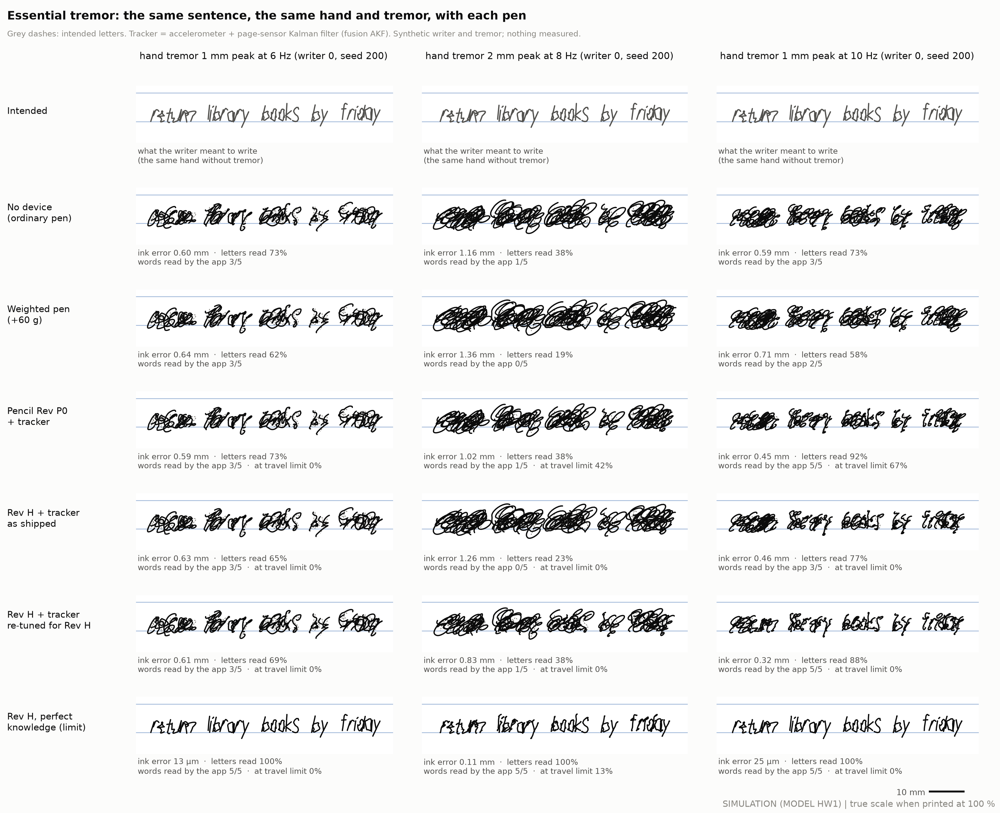

- **Essential tremor (SIM).**
  - **The ±3 mm nose is big enough.** With perfect knowledge of the tremor, Rev H removes 87–99 % of the ink error for tremor up to 2 mm at the hand. The app then reads 98–100 % of the words. The pencil's ±0.3 mm stage is too small: it sits at its limit 94–100 % of the time at 1–2 mm.
  - **The tracker limits the benefit.** With today's causal tracker (accelerometer + page sensor, re-tuned for Rev H), the ink error falls by 47–50 % at 10 Hz and by 22–25 % at 8 Hz (1–2 mm). At 10 Hz, 1 mm, the app then reads 87 % of words instead of 54 %. Over 8–10 Hz and 1–2 mm, the error falls from 835 to 531 µm on average, and the words read rise from 31 % to 59 %.
  - **At 4–6 Hz there is no benefit** (−2 to +9 %). Tracking slow tremor during writing is the main open problem (EXP-W02).
  - **Weight does not help in this model.** The 75 g Rev H and a pen with 60 g added put 14–26 % more tremor into the ink at 8–10 Hz (7–9 % at 4–6 Hz), because the pen rocks on the finger grip. With a stiffer grip the effect disappears. The literature on weights is mixed (EXP-W01).

- **Parkinson's micrographia (SIM, assumed responses).** Without help, letters shrink from 5.1 to 4.2 mm along a pangram.
  - A vibration cue keeps them at 5.2 mm, *if* people respond as small studies suggest (LIT PDT-19). It costs about 11 % more writing time.
  - Lines 1 cm apart halve the shrinkage.
  - A fixed "size assist" in the nose only rescales the shrinking letters, and it enlarges the tremor and crowds the letters.
  - An adaptive vertical size assist restores the size with little cost in the ink. But it hides the problem from the writer. It is the only size-assist variant worth testing, against lines and the cue.
- **Poor handwriting (SIM).** Nose guidance brings the ink 35–61 % closer to the copybook letters while guidance is on. The device then causes 23–38 % of the ink's movement. Full guidance does not make letters more readable. The literature says guidance helps fluency more than shape, and its effects mostly vanish when it is switched off (LIT HAP-10, HAP-42, HAP-43). Handwriting programmes with fewer than 20 practice sessions did not work (LIT HAP-41). So a benefit must be shown in unassisted writing after such a programme.
- **Dyslexia.** Dyslexia is mainly a phonological (sound–letter) difficulty (LIT HAP-47). The pen must not write for the user, and here it never turned a reversed or wrong letter into the right one (0 %). The benefit is in the app. With a known target it flags 100 % of misspelled words; in free writing its autocorrect repairs only 4 % (SIM).
- **The guidance board** pushes the hand, not the tip. It brings the letters 24–34 % closer to the target during guidance. This agrees with the board study once the differences in task and sensing noise are allowed for (§5).
- **Severe tremor and AI.** A follow-up study ([`ai_severe_tremor.md`](ai_severe_tremor.md), DEC-035) found that AI letter prediction does not close the tracker's gap at 1–2 mm (0–1 %), while the app's digital clean copy reads 97 % of words.
- **Everything above is simulation** on synthetic writers. Section 8 lists the experiments that would test it, and `handwriting/score_recording.py` scores real recordings with the same definitions.

## 2. How a pen is held and how writing moves

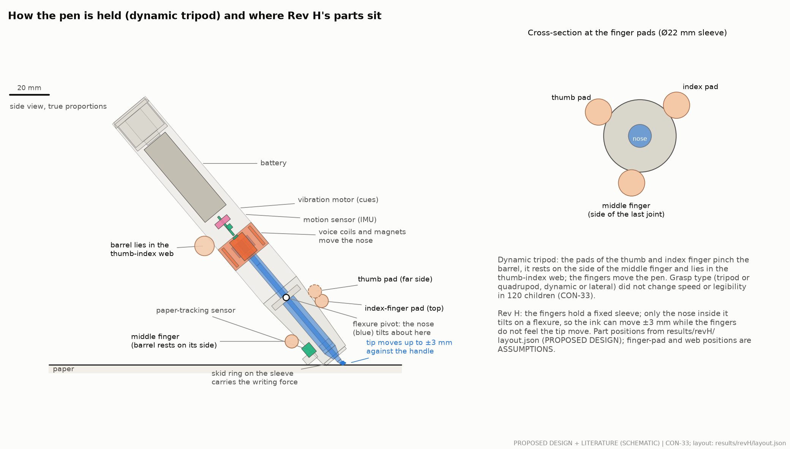

**The grasp.**
- Most people hold a pen in a dynamic tripod. The thumb and index pads pinch the barrel. The barrel rests on the side of the middle finger and lies in the thumb–index web.
- The three digits squeeze with about 4–6 N (LIT CON-05). The tip presses on the paper with about 1 N (LIT CON-01).
- Grasp type (tripod or quadrupod, dynamic or lateral) did not change speed or legibility in children (LIT CON-33). So a 22 mm sleeve must suit several grasps, not one.
- In Rev H the fingers hold a fixed sleeve. Only the nose inside it tilts. The ink can move ±3 mm while the fingers do not feel the tip move (PROPOSED DESIGN).

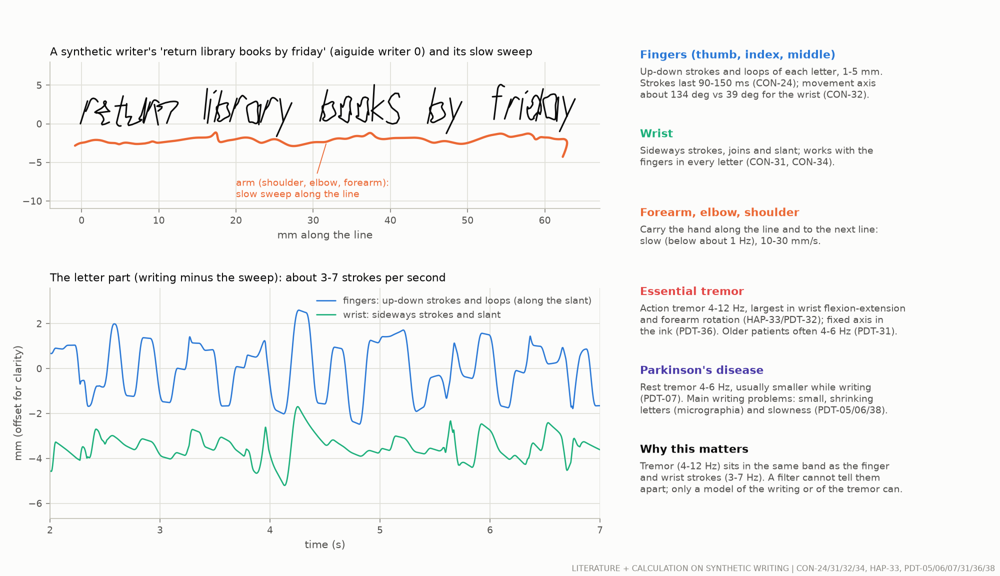

**Which joints make what.**
- The fingers make the up-down strokes and loops of each letter. The wrist makes the sideways strokes and the slant. Their movement axes are almost at right angles: about 134° for the fingers and 39° for the wrist (LIT CON-32).
- Wrist and fingers work together in every letter (LIT CON-31). Letters can be seen as two coupled oscillations riding on a slow sweep along the line (LIT CON-34).
- The arm (shoulder, elbow, forearm) carries the hand along the line, slowly.
- A person's letter shapes stay the same on paper, on a blackboard or in sand (LIT CON-35). The brain plans the shape, not the muscle commands. So the writer's eyes and brain may adapt to anything the pen does to the ink.

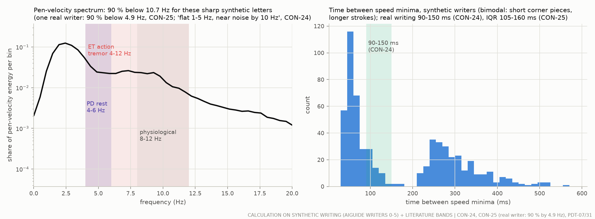

**Timing.**
- A stroke lasts about 90–150 ms. The pen's speed spectrum is flat from 1 to 5 Hz and near the noise by about 10 Hz (LIT CON-24).
- Our synthetic letters are sharper than real ones: 90 % of their speed energy lies below 10.7 Hz, against 4.9 Hz for one real writer (CALC; LIT CON-25). Sharper letters overlap the tremor band more. This makes the tremor tracker's job harder here than with real writing.

**Where tremor comes from.**
- Essential tremor (ET) is an action tremor of 4–12 Hz. It is largest in wrist flexion-extension and forearm rotation (LIT HAP-33). In the ink it usually has one fixed axis, stays below 1 cm and is regular (LIT PDT-36).
- Parkinson's disease (PD) has a rest tremor of 4–6 Hz, usually smaller while writing. The main writing problems in PD are small and shrinking letters (micrographia) and slowness (LIT PDT-05, PDT-06, PDT-38).

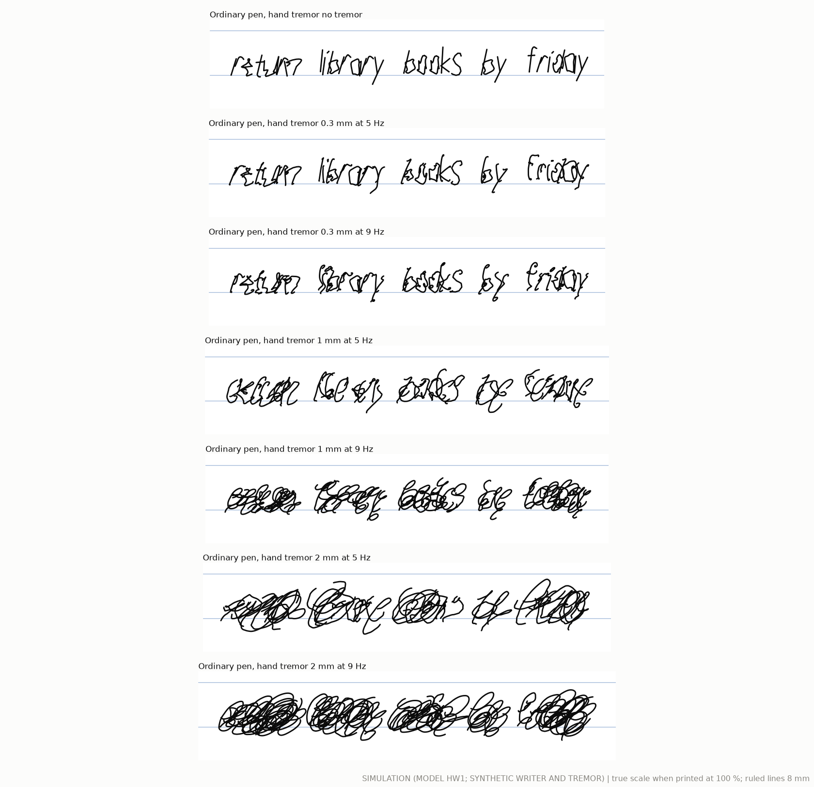

**How tremor shows in the ink (SIM).** A 0.3 mm tremor at the hand makes letters wobbly but readable. At 1 mm the loops merge letters. At 2 mm the line becomes scribble. The tremor band (4–12 Hz) overlaps the writing band (3–7 strokes per second). A simple filter cannot separate them; only a model of the writing or of the tremor can.

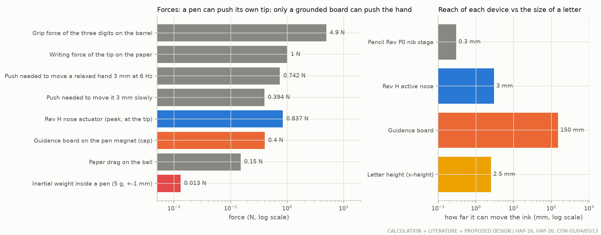

**What a handheld pen can and cannot do.**
- A handheld pen can only push its own tip against its own handle. The reaction goes into the hand. It cannot push the hand toward a place on the page.
- Rev H's nose reaches ±3 mm with 0.84 N at the tip (CALC, tip_params.json). The pencil Rev P0 nib stage reaches ±0.3 mm (CALC).
- A grounded board can push the hand. Its 0.4 N cap moves a relaxed hand about 3 mm slowly (CALC from LIT HAP-26: 0.1 N moves it 0.76 mm). It cannot act faster than its force bandwidth of about 25 Hz and its 8 N/s slew limit (CALC, board study).
- A moving weight inside a pen gives only 2–30 mN (CALC, `docs/inertial_stabilisation.md`). That is too little to steer a hand.

## 3. Essential tremor: before and after


The same hand, the same sentence and the same tremor, written with each pen, at true scale on 8 mm ruled lines (SIM, writer 0, seed 200). The grey dashes are the intended letters. Under each panel: the ink error, the share of letters the app reads correctly, and the words the app reads after its autocorrect.

**Set-up (SIM).**
- Six test writers, four seeds, tremor at 4, 6, 8 and 10 Hz with 0.3, 1 and 2 mm peak at the hand: 288 scenarios per pen.
- Pens: an ordinary 12 g pen; the same pen with +60 g (ASSUMPTION; the weighted-utensil comparators are LIT ACT-18, ACT-19); the pencil Rev P0 (±0.3 mm nib stage); Rev H (75 g, ±3 mm nose) with the nose held, with the tracker as shipped, with the tracker re-tuned for Rev H, and with perfect knowledge of the tremor (the limit of the mechanism).
- The tracker is the accelerometer + page-sensor Kalman filter of the fusion package. It runs causally on simulated sensor data (IMU at the handle, page sensor at 1 kHz).
- The writer is adapted to each pen: the tremor-free ink equals the intended letters within about 1 µm. The writer compensates the paper drag (ASSUMPTION; the open-loop case is in the sensitivity table).
- **Ink error** = RMS distance of the ink to the intended letters while the pen touches the paper. **Letters read** = the app's letter recogniser (aiguide). **Words read** = the app's reader with its lexicon correction (the app AI of DEC-020: word errors 32 % → 10 % at 7 % letter errors, CALC).

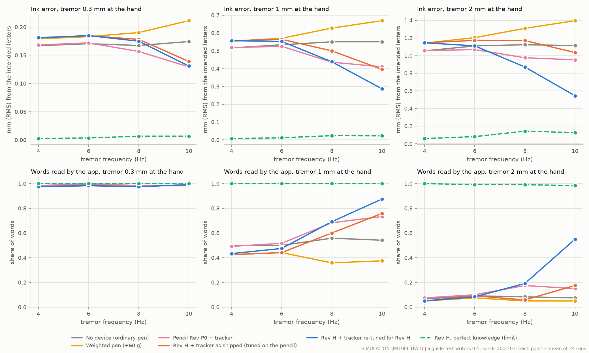

**Ink error and words read by the app** (SIM; mean of 24 runs per cell; in brackets the change against the ordinary pen):

| Tremor at the hand | Ordinary pen (12 g) | Weighted pen (+60 g) | Pencil Rev P0 + tracker | Rev H + tracker as shipped | Rev H + tracker re-tuned | Rev H, perfect knowledge (limit) |
|---|---|---|---|---|---|---|
| 4 Hz, 0.3 mm | 167 µm · 98 % | 179 (+7 %) · 98 % | 168 (+1 %) · 98 % | 181 (+8 %) · 98 % | 181 (+9 %) · 98 % | 3 (−98 %) · 100 % |
| 4 Hz, 1 mm | 516 µm · 50 % | 554 (+7 %) · 42 % | 518 (+0 %) · 49 % | 557 (+8 %) · 42 % | 557 (+8 %) · 43 % | 7 (−99 %) · 100 % |
| 4 Hz, 2 mm | 1054 µm · 7 % | 1141 (+8 %) · 5 % | 1057 (+0 %) · 8 % | 1146 (+9 %) · 5 % | 1146 (+9 %) · 6 % | 59 (−95 %) · 100 % |
| 6 Hz, 0.3 mm | 171 µm · 99 % | 183 (+7 %) · 98 % | 172 (+1 %) · 100 % | 185 (+8 %) · 98 % | 185 (+9 %) · 98 % | 4 (−98 %) · 100 % |
| 6 Hz, 1 mm | 534 µm · 50 % | 570 (+7 %) · 44 % | 525 (−2 %) · 52 % | 565 (+6 %) · 44 % | 550 (+3 %) · 49 % | 12 (−98 %) · 100 % |
| 6 Hz, 2 mm | 1110 µm · 9 % | 1204 (+8 %) · 8 % | 1068 (−4 %) · 10 % | 1172 (+6 %) · 9 % | 1087 (−2 %) · 11 % | 81 (−93 %) · 99 % |
| 8 Hz, 0.3 mm | 167 µm · 98 % | 190 (+14 %) · 98 % | 157 (−6 %) · 98 % | 178 (+7 %) · 98 % | 173 (+4 %) · 98 % | 7 (−96 %) · 100 % |
| 8 Hz, 1 mm | 551 µm · 56 % | 627 (+14 %) · 36 % | 436 (−21 %) · 68 % | 500 (−9 %) · 60 % | 430 (−22 %) · 69 % | 24 (−96 %) · 100 % |
| 8 Hz, 2 mm | 1124 µm · 8 % | 1308 (+16 %) · 5 % | 976 (−13 %) · 18 % | 1170 (+4 %) · 6 % | 848 (−25 %) · 24 % | 143 (−87 %) · 99 % |
| 10 Hz, 0.3 mm | 174 µm · 98 % | 211 (+21 %) · 98 % | 130 (−26 %) · 98 % | 139 (−20 %) · 99 % | 129 (−26 %) · 99 % | 7 (−96 %) · 100 % |
| 10 Hz, 1 mm | 551 µm · 54 % | 669 (+21 %) · 38 % | 410 (−26 %) · 73 % | 396 (−28 %) · 76 % | 291 (−47 %) · 87 % | 23 (−96 %) · 100 % |
| 10 Hz, 2 mm | 1113 µm · 8 % | 1396 (+25 %) · 5 % | 952 (−15 %) · 15 % | 1035 (−7 %) · 18 % | 556 (−50 %) · 56 % | 126 (−89 %) · 98 % |

**What the table says.**
1. **The mechanism is big enough.** With perfect knowledge of the tremor, Rev H removes 87–99 % of the ink error at every frequency up to 2 mm, and the app reads 98–100 % of the words (SIM). The nose is at its travel limit at most 14 % of the time (10 Hz, 2 mm). The pencil's ±0.3 mm stage is at its limit 94–100 % of the time at 1–2 mm, even with perfect knowledge. It then removes only 16–33 % of the error (SIM).
2. **The tracker is the limit, not the nose.** With the tracker re-tuned for Rev H, the error falls by 47–50 % at 10 Hz (1–2 mm) and by 22–25 % at 8 Hz (SIM). The words the app reads at 10 Hz rise from 54 % to 87 % (1 mm) and from 8 % to 56 % (2 mm). The tracker as shipped (tuned on the pencil) does about half as well.
3. **At 6 Hz and below the tracker does nothing useful.** At 4–6 Hz, Rev H with its tracker is between 2 % better and 9 % *worse* than an ordinary pen (SIM). The tracker cannot tell a 4–6 Hz tremor from the writing strokes in the same band (§2), and the heavier handle adds a little tremor. The shipped tracker's frequency gate (centred at 5.9 Hz) holds it back there on purpose. This matches DEC-009 (frequency-gated authority). Older ET patients and PD patients often have tremor in this band (LIT PDT-31, PDT-05/06).
4. **Weight does not help in this model.** The +60 g pen and the 75 g Rev H handle with the nose held make the ink 7–26 % worse, most at 8–10 Hz (SIM). The cause is the finger grip: a 75 g pen on the grip's 575 N/m springiness (LIT HAP-26) resonates near 14 Hz and amplifies 8–10 Hz tremor. With a grip twice as stiff, the penalty disappears (table below). People report that weighted utensils help some of them (LIT ACT-19: weighted spoon 81 % successful transfers against 74 % for a normal spoon; LIT PDT-22: inertial loading reduced postural ET tremor), but not consistently (LIT ACT-32: no effect of weights on PD postural tremor). The model has no reflex or brain response to the load. This needs a measurement (EXP-W01).
5. **The tracker barely touches clean writing.** On tremor-free writing, the tracker moves the ink by 22 µm RMS (as shipped) and 26 µm (re-tuned) (SIM). Letters and words are still read as before (99 % and 100 %). The re-tuned tracker is just above the 25 µm false-correction bound of AC-E01-09.
6. **The nose works easily.** The actuator force is at most 0.05 N RMS, well below the 0.21 N continuous rating, and never hits the force limit (SIM).

**How robust these numbers are** (SIM; ratio of ink error to the ordinary pen; writers 0–5, seed 200 only, so "this study" differs slightly from the four-seed table above):

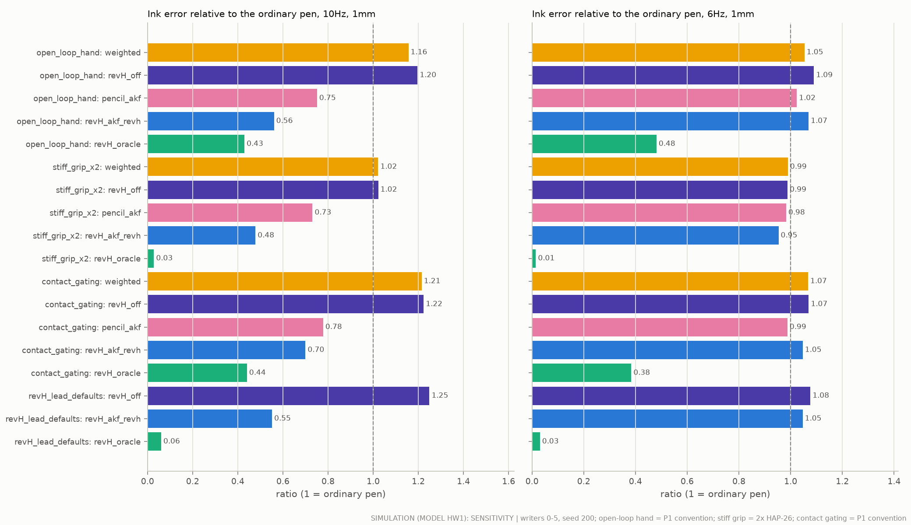

| Variant | Weighted pen | Rev H, nose held | Rev H + re-tuned tracker | Rev H, perfect knowledge |
|---|---|---|---|---|
| 10 Hz, 1 mm: this study | 1.21 | 1.22 | 0.55 | 0.04 |
| 10 Hz, 1 mm: the writer does not compensate paper drag (P1 convention) | 1.16 | 1.20 | 0.57 | 0.43 |
| 10 Hz, 1 mm: grip twice as stiff (1150 N/m) | 1.02 | 1.02 | 0.45 | 0.03 |
| 10 Hz, 1 mm: the nose acts only in contact (P1 convention) | 1.21 | 1.22 | 0.71 | 0.44 |
| 10 Hz, 1 mm: the lead's first Rev H defaults (40 Hz, 1 N, 4 g, 85 g) | – | 1.25 | 0.57 | 0.06 |
| 6 Hz, 1 mm: this study | 1.07 | 1.07 | 1.03 | 0.02 |
| 6 Hz, 1 mm: the writer does not compensate paper drag | 1.05 | 1.09 | 1.06 | 0.48 |
| 6 Hz, 1 mm: grip twice as stiff | 0.99 | 0.99 | 0.97 | 0.01 |
| 6 Hz, 1 mm: the nose acts only in contact | 1.07 | 1.07 | 1.04 | 0.38 |
| 6 Hz, 1 mm: the lead's first Rev H defaults | – | 1.08 | 1.05 | 0.03 |

- **Start before touchdown.** If the nose acts only while the tip touches the paper, the limit worsens from 0.04 to 0.44 and the tracker result from 0.55 to 0.71 (10 Hz, 1 mm). Each stroke then begins with a burst of uncorrected tremor. Starting while the tip hovers within 2 mm fixes this. This is rule T7 of `docs/ai_guidance.md` §7.3, which had not been tested before (SIM).
- **Paper drag.** If the writer does not compensate the paper drag, the drag bends the letters. That error is not tremor, so even perfect tremor knowledge leaves 43 % (SIM). The tracker result hardly changes (0.55 → 0.57).
- **Rev H parameters.** The final Rev H values and the lead's first defaults give nearly the same answer (0.55 against 0.57).
- **Grip.** A grip twice as stiff removes the weight penalty (1.02) and helps the tracker a little (0.45).

**Why a new model (HW1), and a check against P1.** Model M1 has no input for an external tremor estimate, and it models Rev A's axial suspension. So this study built HW1: a 2-D page-plane model with the HAP-26 hand, a grip, a lumped pen, paper friction and a force-limited nose module (`handwriting/plant.py`). HW1 was checked against the unmodified pencil model P1 on the pencil (SIM; 3–15 Hz ink error relative to each pen's own neutral run; writers 0–5, seed 200):

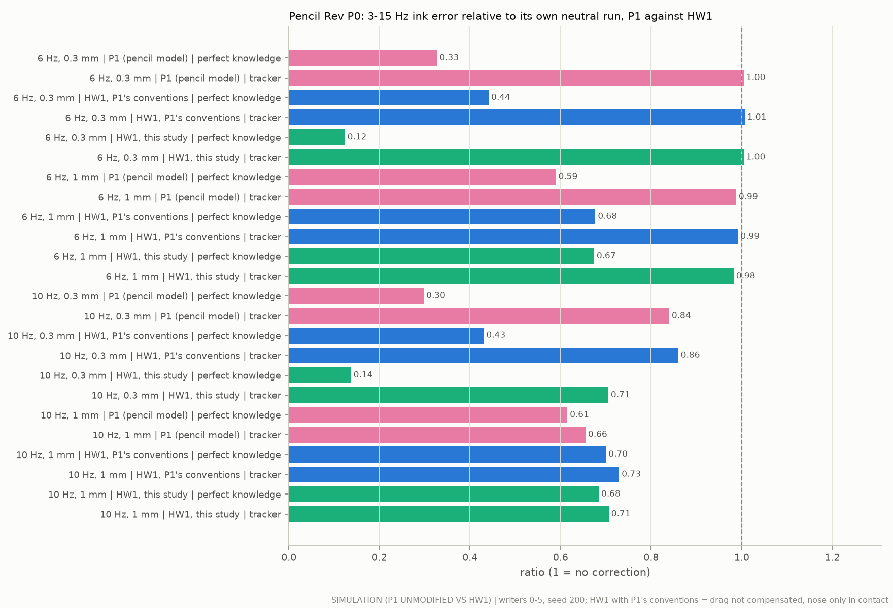

| Case | P1 perfect knowledge | HW1 with P1's conventions | HW1 (this study) | P1 tracker | HW1 tracker with P1's conventions | HW1 tracker (this study) |
|---|---|---|---|---|---|---|
| 6 Hz, 0.3 mm | 0.33 | 0.44 | 0.12 | 1.00 | 1.01 | 1.00 |
| 6 Hz, 1 mm | 0.59 | 0.68 | 0.67 | 0.99 | 0.99 | 0.98 |
| 10 Hz, 0.3 mm | 0.30 | 0.43 | 0.14 | 0.84 | 0.86 | 0.71 |
| 10 Hz, 1 mm | 0.61 | 0.70 | 0.68 | 0.66 | 0.73 | 0.71 |

HW1 reproduces P1's tracker results within 0.00–0.07. Its perfect-knowledge limit is 0.08–0.13 less favourable than P1's. So HW1 errs on the cautious side. The difference in "this study" comes from starting before touchdown (above).

## 4. Parkinson's micrographia: before and after

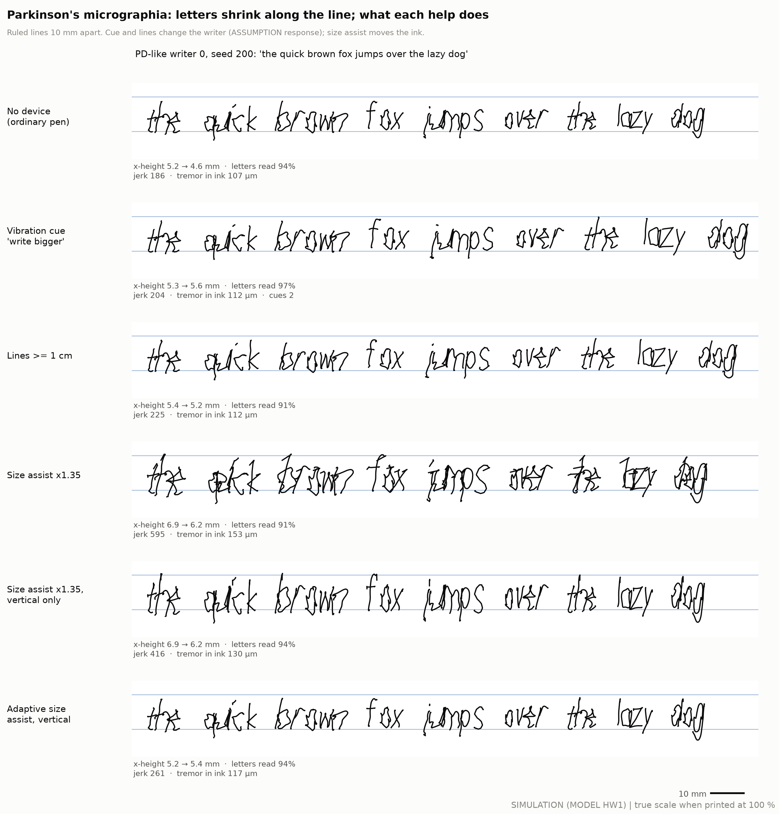

One PD-like writer copying the pangram with each kind of help, on ruled lines 10 mm apart (SIM, writer 0, seed 200). The letters start at 5 mm and shrink along the line.

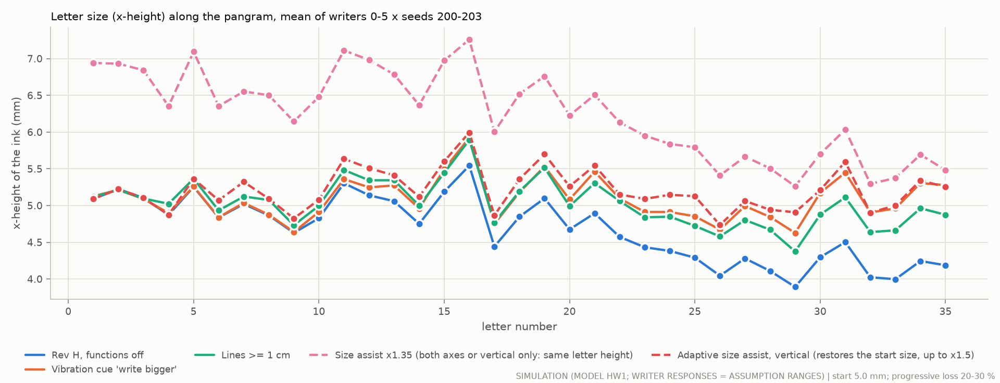

**Set-up (SIM; the writer's responses are ASSUMPTION ranges, §7 items 12–14).**
- The six test writers are made PD-like: start x-height 5.0 mm, 20–30 % progressive size loss over the pangram, 50–70 % of normal speed, and a small 4–6 Hz tremor (0.05–0.25 mm at the hand). Four seeds each: 24 runs per condition.
- **Cue:** Rev H measures each letter's size. When a letter is more than 10 % below the writer's start size, it buzzes "write bigger". The writer then recovers 50–100 % of the lost size and slows by 10–20 % for three letters (from LIT PDT-19).
- **Lines:** paper with lines at least 1 cm apart. The size loss is 30–70 % of that without lines (from LIT PDT-18, PDT-33).
- **Size assist:** a new, untested function. The nose adds (G − 1) times the fast part of the writer's movement, so the ink is larger than the hand's movement. G is 1.2, 1.35 or 1.5 in both directions, or 1.35 vertically only. The adaptive version measures each finished letter and sets a vertical G (up to 1.5) that brings the letters back to the writer's start size. The anchor time constant (0.8 s) was chosen on tuning writers.

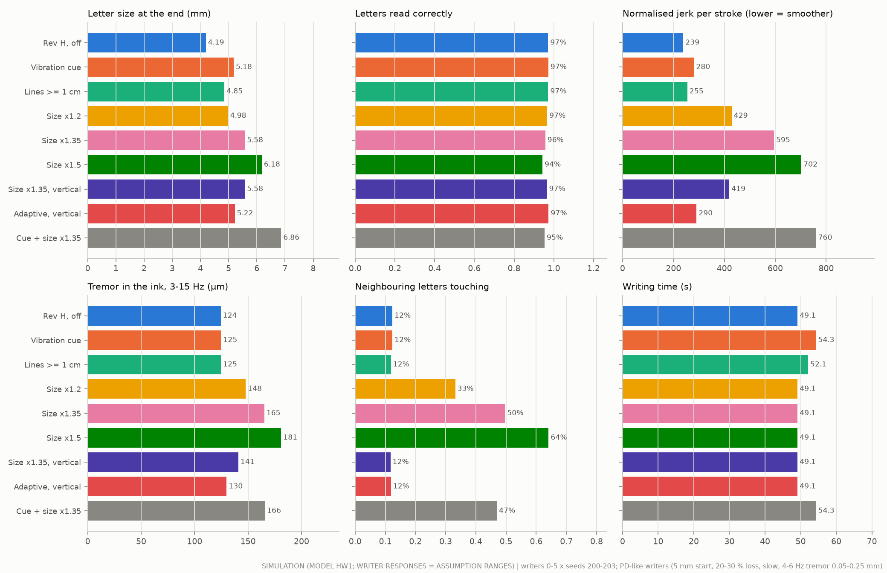

**Results** (SIM; mean of 24 runs; changes are paired against Rev H with its functions off):

| Help | x-height, first → last 5 letters | Letters / words read | Jerk (smoothness; lower is smoother) | Writing time | Tremor in the ink | Neighbouring letters touching |
|---|---|---|---|---|---|---|
| Ordinary pen | 5.10 → 4.18 mm | 97 % / 92 % | 231 | 49.1 s | 116 µm | 12 % |
| Rev H, functions off (75 g) | 5.11 → 4.19 mm | 97 % / 92 % | 239 | 49.1 s | 124 µm | 12 % |
| Vibration cue "write bigger" | 5.12 → **5.18 mm** | 97 % / 92 % | 280 (+17 %) | 54.3 s (+11 %) | 125 µm | 12 % |
| Lines ≥ 1 cm | 5.16 → 4.85 mm | 97 % / 92 % | 255 (+6 %) | 52.1 s (+6 %) | 125 µm | 12 % |
| Size assist ×1.35 | 6.83 → 5.58 mm | 96 % / 91 % | 595 (+152 %) | 49.1 s | 165 µm (+33 %) | **50 %** |
| Size assist ×1.5 | 7.56 → 6.18 mm | 94 % / 88 % | 702 | 49.1 s | 181 µm (+46 %) | 64 % |
| Size assist ×1.35, vertical only | 6.83 → 5.58 mm | 97 % / 90 % | 419 (+77 %) | 49.1 s | 141 µm (+13 %) | 12 % |
| **Adaptive size assist, vertical** | 5.13 → **5.22 mm** | 97 % / 92 % | 290 (+25 %) | 49.1 s | 130 µm (+5 %) | 12 % |
| Cue + size assist ×1.35 | 6.84 → 6.86 mm | 95 % / 88 % | 760 (+225 %) | 54.3 s (+11 %) | 166 µm (+33 %) | 47 % |

**What the table says.**
1. **Without help,** the letters shrink by 18 % along one pangram (5.1 → 4.2 mm). That is set by the assumed 20–30 % loss (LIT PDT-05: −23 % stroke length).
2. **A vibration cue keeps the size** (5.1 → 5.2 mm), *if* people respond as assumed. It costs 11 % more writing time and 17 % more jerk (SIM). The time cost is part of the assumed response. Size recovered through longer movement time in LIT PDT-19. Training for size made writing less fluent in LIT PDT-17.
3. **Lines ≥ 1 cm** halve the shrinkage in this model (4.85 mm at the end). This is the cheapest help, and the literature supports it best (LIT PDT-18, PDT-33). The app can print or show the lines.
4. **A fixed size gain is the wrong tool.** It makes every letter larger, but the letters still shrink by 18 %. Only the scale changes. Horizontal gain crowds the letters (50 % of neighbours touch, against 12 %). The nose also enlarges the tremor (+33 %) and makes the ink less smooth (jerk ×2.5). A vertical-only gain avoids the crowding but still enlarges tremor and jerk.
5. **The adaptive vertical assist** restores the start size (5.1 → 5.2 mm) with little cost in the ink: jerk +25 %, tremor +5 %, no crowding, no extra time, and the nose moves only 0.28 mm RMS (SIM). It does as well as the cue, without relying on the writer's response.
6. **But it hides the problem from the writer.** The writer sees normal-sized letters while moving small. PD patients with progressive micrographia already have altered motor awareness (LIT PDT-35). Visual feedback changes PD writing size (LIT PDT-34), so the writer may shrink the movement further. The model cannot show this. The adaptive assist is the only size-assist variant worth testing, and only against lines and the cue, for agency, after-effects and fluency (EXP-W03).
7. **Letters stay readable** at these sizes (94–97 % letters, 88–92 % words, SIM). The app's reader normalises size, so micrographia at 4 mm does not make letters unreadable to it. The benefit to aim for is the writer's own size and comfort, not the app's reading. LIT PDT-38: kinematic measures separate PD from controls better than size.
8. **The 75 g pen** puts 7 % more tremor into the ink than a 12 g pen at 4–6 Hz (124 against 116 µm, SIM; the grip effect of §3).

## 5. Guided practice and spelling

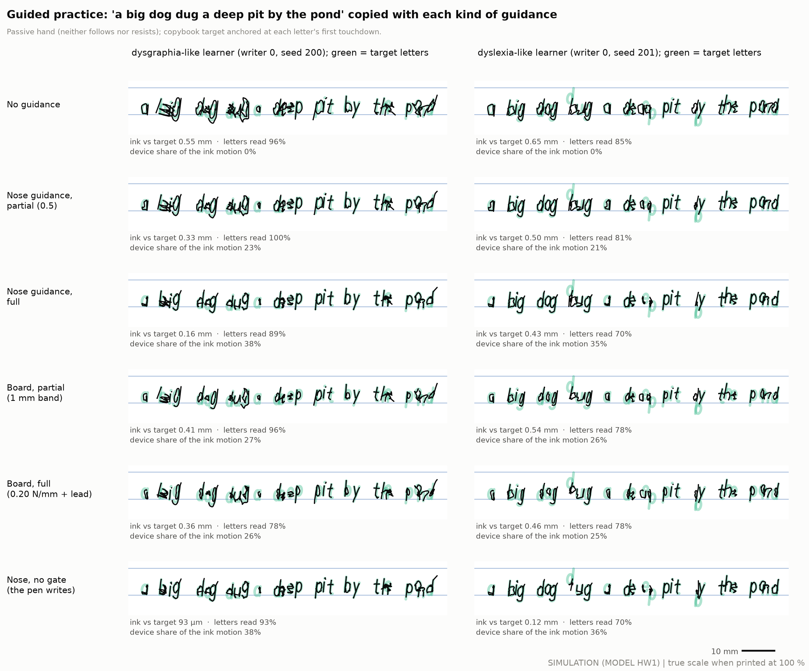

The same learner copying "a big dog dug a deep pit by the pond" with each kind of guidance (SIM). Green = the target letters. Left: a learner with poorly formed letters. Right: a learner who reverses b/d and p/q and misspells one word (seed 201 is shown because seed 200 drew no reversal; every seed counts in the numbers below).

**Set-up (SIM).**
- The six test writers become learners with an error model (§7 item 15):
  - *dysgraphia-like:* 60 % of letters malformed, plus size and baseline irregularity;
  - *dyslexia-like:* normal letter shapes, 35 % of b/d and p/q reversed, and 'deap' for 'deep'.
- **Target:** the copybook letter in the learner's size and slant, anchored where the learner first touches down in that letter. The app knows the text (copying or dictation).
- **Cue:** a buzz when the app misreads a letter against the target, or when its ink is more than 0.3 x-height from the target. The ink is not changed.
- **Nose guidance:** the nose pulls the ink toward the matching stroke of the target, within ±3 mm. Partial = gain 0.5, full = gain 1. A capture gate lets it act only within 2–3 mm of the target, and it lets go after 60 ms beyond 2.5 mm. "No gate" removes both: this is what "the pen writes for you" would look like.
- **Board:** the final board file and the board study's own law (`board/control.py`):
  - partial = no force inside a 1 mm band, then 0.10 N/mm;
  - full = 0.20 N/mm plus a 0.1 N pull along the letter;
  - cap 0.4 N, slew 8 N/s, and it yields after 0.3 s beyond 4 mm.
  - The magnet sits on the handle, so the board pushes the hand. Its sensing noise is 0.18 mm. Its 1 N pull adds paper drag that the writer does not compensate.
- **Passive hand:** the learner neither follows nor resists (an upper bound for being steered).
- **Device share** = how much of the ink's movement the device caused, against the same hand without guidance.

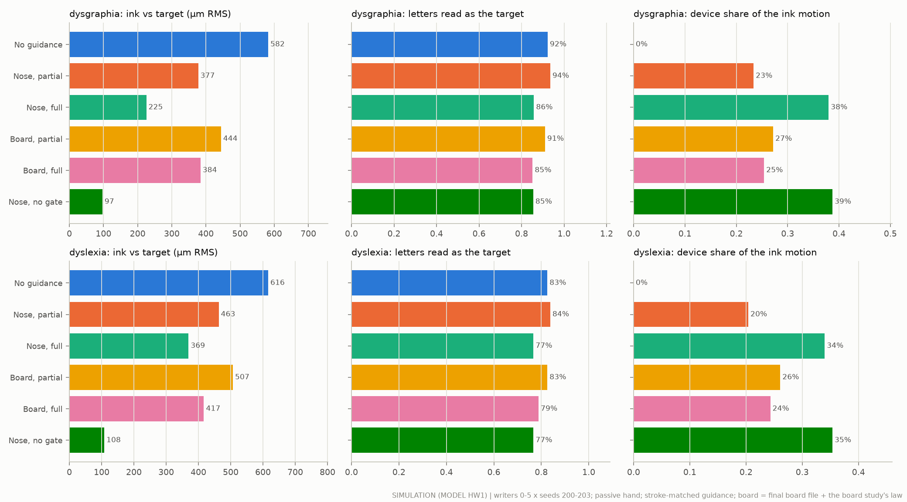

**Results** (SIM; 24 runs per learner type):

| Guidance | Dysgraphia-like: distance to target | letters read | device share | Dyslexia-like: distance to target | letters read | reversed or wrong letters read as the target |
|---|---|---|---|---|---|---|
| None | 582 µm | 92 % | 0 % | 616 µm | 83 % | 0 % |
| Cue on error (ink unchanged) | 582 µm | 92 % | 0 % | 616 µm | 83 % | 0 % |
| Nose, partial | 377 µm (−35 %) | 94 % | 23 % | 463 µm (−25 %) | 84 % | 0 % |
| Nose, full | 225 µm (−61 %) | 86 % | 38 % | 369 µm (−40 %) | 77 % | 0 % |
| Nose, no gate | 97 µm (−83 %) | 85 % | 39 % | 108 µm (−82 %) | 77 % | 0 % |
| Board, partial | 444 µm (−24 %) | 91 % | 27 % | 507 µm (−18 %) | 83 % | 0 % |
| Board, full | 384 µm (−34 %) | 85 % | 25 % | 417 µm (−32 %) | 79 % | 0 % |

**What the table says.**
1. **Guidance brings the ink closer to the target, but the device then writes part of it.** Full nose guidance cuts the distance to the target by 61 %. The device then causes 38 % of the ink's movement (SIM). Partial guidance cuts it by 35 % with a 23 % device share.
2. **Closer is not more readable.** Full guidance, from the nose or the board, *lowers* letter reading (92 → 85–86 %). With a passive hand, a strong pull makes hybrids of the learner's letter and the target (for example, a malformed 'a' becomes a hook). Partial nose guidance is the only kind that reads slightly better (94 %). A learner who actively follows would do better; one who resists, worse.
3. **Nothing turns a wrong letter into the right one.** Reversed and wrong letters were read as the target 0 % of the time with every kind of guidance, even without the gate (SIM). The gate and the ±3 mm travel make sure the pen does not write for the user. The board study's supervisor also yields to a determined writer (SIM there: 0 % of a reversed bowl moved to the correct side).
4. **The cue finds reversals and wrong letters, not poor shapes.** When the app knows the target, it flags 100 % of reversed and wrong letters (3 % false alarms). It flags only 24 % of malformed letters (4 % false alarms), because the app still reads most malformed letters (SIM).
5. **Agreement with the board study.** The board study found tracing errors of 1.49 → 1.07 mm (partial, −28 %) → 0.63 mm (full, −58 %) (SIM, `docs/guidance_board.md` §5.3). Here the board gives −24 % and −34 %. Partial agrees. Full gains less here for three reasons:
   - the errors here are letter-sized and change 3–7 times per second, while the board's force can change by only 8 N/s (50 ms from 0 to 0.4 N) with a bandwidth of about 25 Hz; the board study used smooth deviations 7–26 mm long;
   - this study includes the board's 0.18 mm sensing noise, while the board study's guidance simulation senses the handle exactly (on tuning data, removing the noise gives −38 % instead of −32 %, and 87 % instead of 79 % of letters read);
   - (both studies include the magnet's extra 1 N of pull on the page).
   The board's "lead-through" mode, in which a relaxed hand is led through a letter (94 % success in the board study), was not simulated here. There the device writes the letter by design. It can serve as a demonstration, never as the learner's work.

**What the literature says about guided practice.**
- Guidance mainly improves **fluency** (fewer speed peaks, higher speed), not **shape** (LIT HAP-10, HAP-11).
- Effects seen *during* guidance largely **vanish when guidance is off** (LIT HAP-43). Kinesthetic training did not improve legibility (LIT HAP-42). Trajectory-timed guidance improved shape with next-day retention, but path guidance did not (LIT HAP-44). Partial-then-full guidance beat either alone (LIT HAP-13, abstract only).
- Handwriting interventions need **practice, at least 20 sessions** (LIT HAP-41). The pen cannot replace practice.
- So the only valid test of guidance is **unassisted writing at retention** (EXP-W04). In this model the learner does not learn, so it says nothing about learning.

**Spelling help for dyslexia (SIM + CALC).**

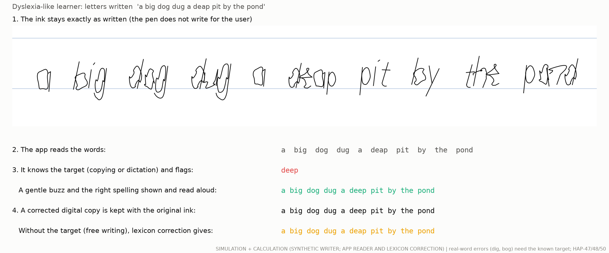

- Dyslexia is mainly a **phonological** difficulty. Children with dyslexia write as fast as their peers but pause more within words, and spelling explains their written output (LIT HAP-47, HAP-48). So spelling help belongs in the **app**, and the pen must not change the ink.
- In the 24 dyslexia-like runs there were 78 misspelled words. When the app knows the target text (copying or dictation), it flags all 78 (100 %). It also flags 10 of 162 correct words (6 %) because it misreads them (SIM).
- In **free writing** the app's lexicon correction repaired only 3 of the 78 (4 %) (SIM). It is tuned for letter-reading errors and changes a word only when it is confident. Real-word errors ('bog' for 'dog', 'bug' for 'dug', 'dig' for 'big') cannot be caught without knowing the target. A confusion model for b/d, p/q and sound-alike errors would be needed (app work, not pen work).
- Spell checking has a large effect on error rates in adults with learning disabilities (LIT HAP-50: Hedges g −1.63), and smart pens a moderate one (g 0.45). A structured phonics programme (Orton-Gillingham) had no significant effect on spelling (LIT HAP-47). The app should flag gently, show and read the right spelling, and keep a corrected copy next to the untouched ink (EXP-W05).

## 6. What each function can do for each condition

**Evidence labels:**
- **SIM** = this study's simulation (synthetic writers).
- **SIM (board study)** = `docs/guidance_board.md`.
- **CALC** = a calculation.
- **LIT** = published studies, with their ledger ids. "Analogue" means the same kind of device in another task, such as a spoon.
- Nothing has been tested with people or with hardware.

**Essential tremor**

| Function | Expected benefit | Evidence | Must be tested |
|---|---|---|---|
| Tremor stabiliser (nose + tracker) | At 8–10 Hz, 1–2 mm: 22–50 % less ink error. Words read at 10 Hz, 1 mm: 54 → 87 %. At 4–6 Hz: none (−2 to +9 %). The mechanism's limit, with perfect tremor knowledge: 87–99 % less | SIM (HW1, cross-checked with P1). Analogue: active spoons helped, but no more than a deeper, heavier spoon (LIT ACT-19) | EXP-W02, then the EXP-B09 bench test |
| Pen mass and 22 mm grip | In the model, 75 g puts 7–26 % more tremor into the ink than 12 g (worst at 8–10 Hz). With a grip twice as stiff: no change | SIM. LIT mixed: weighted spoons are liked (ACT-18, ACT-19); inertial loading reduced postural ET tremor (PDT-22) | EXP-W01 |
| Vibration cue | None expected | – | – |
| Size assist | None: ET letters are normal in size (LIT PDT-06) | LIT | – |
| Nose guidance | Only for tracing or copying practice; not a tremor treatment | – | – |
| Guidance board | Cannot cancel tremor. A 0.4 N force at 8 Hz must change at 20 N/s, but the board slews at 8 N/s with about 25 Hz bandwidth (CALC). It could steady slow drift while tracing | CALC | – |
| App AI | Reads the words that survive. Word errors 32 → 10 % at 7 % letter errors (CALC, DEC-020). Cannot rescue scribble: 5–9 % of words read at 2 mm tremor (SIM) | CALC + SIM | EXP-A03 (autocorrect on real notes) |

**Parkinson's disease (micrographia)**

| Function | Expected benefit | Evidence | Must be tested |
|---|---|---|---|
| Tremor stabiliser | Little. PD tremor while writing is small and 4–6 Hz, where the tracker does nothing (SIM) | SIM. LIT: gyroscopic spoon in PD inconsistent (ACT-31); weights no effect on PD tremor (ACT-32); a weighted pen made letter spacing more variable (PDT-21) | Not a PD claim |
| Vibration cue "write bigger" | Keeps letters at their start size (5.2 against 4.2 mm) for +11 % time and +17 % jerk, **if** people respond as assumed | LIT, small and short-term: cues normalise size through longer movement time (PDT-19); 1 cm cues help and 0.6 cm cues harm (PDT-18). SIM with the assumed response | EXP-W03 |
| Lines ≥ 1 cm (paper or app) | Halves the shrinkage (4.85 mm at the end) | LIT: +31 % word length with lines (PDT-33); PDT-18. SIM with the assumed response | Baseline arm of EXP-W03 |
| Size assist, fixed gain | Rescales but does not stop the shrinking. +33 % tremor in the ink, 50 % of letters touching, jerk ×2.5 | SIM only (new function) | Not recommended |
| Size assist, adaptive vertical | Restores the start size (5.2 mm) with jerk +25 % and tremor +5 %. Risks: hides the deficit (LIT PDT-35), visual adaptation (PDT-34), dependence | SIM only (new function) | EXP-W03: agency, after-effect with the assist off, fluency |
| Nose guidance | "Write big" practice with large targets; not simulated here | LIT: amplitude training enlarges writing but costs fluency (PDT-17) | EXP-W03 extension |
| Guidance board | "Write big" practice: loop height 0.83 → 0.93 of the target | SIM (board study) | EXP-G05, then a PD practice pilot |
| App AI | Measures letter size, speed and jerk in every note (`score_recording.py` definitions); still reads 92 % of words at 4 mm letters (SIM) | SIM + CALC. LIT: speed and fluency separate PD from controls better than size (PDT-38) | Outcome measures of EXP-W03 |

**Poor handwriting (dysgraphia-like)**

| Function | Expected benefit | Evidence | Must be tested |
|---|---|---|---|
| Tremor stabiliser | None (no tremor) | – | – |
| Vibration cue on error | Flags 24 % of malformed letters (4 % false alarms); the ink is not changed | SIM | Arm of EXP-W04 |
| Size assist | None | – | – |
| Nose guidance | During guidance: 35 % (partial) to 61 % (full) closer to the target. The device then causes 23–38 % of the ink's movement. Full guidance lowers readability (92 → 86 %). Learning: unknown | SIM. LIT: guidance improves fluency more than shape, and gains mostly vanish without it (HAP-10, HAP-11, HAP-13, HAP-42, HAP-43, HAP-44) | EXP-W04: unassisted retention after ≥ 20 sessions (HAP-41) |
| Guidance board | During guidance: 24 % (partial) to 34 % (full) closer; 25–27 % device share | SIM (this study and the board study). LIT: magnetic guidance halved the error during guidance (HAP-16) | Arm of EXP-W04; EXP-G05 |
| App AI | Letter-by-letter legibility feedback; a readable copy of notes | CALC | EXP-A03 |

**Dyslexia**

| Function | Expected benefit | Evidence | Must be tested |
|---|---|---|---|
| Tremor stabiliser, size assist | None | – | – |
| Vibration cue (target known) | Flags 100 % of reversed and wrong letters (3 % false alarms) | SIM | EXP-W05 |
| Nose guidance | None, by design: it never turned a reversed or wrong letter into the right one (0 %), and it must not | SIM. LIT: dyslexia is mainly phonological (HAP-47) | – |
| Guidance board | Lead-through can *demonstrate* a letter to a relaxed hand (94 % in the board study). The device then writes the letter | SIM (board study) | Demonstration only, with consent; never as the learner's work |
| App AI (spelling) | With a known target (dictation, copying): flags 100 % of misspelled words (6 % false flags). Free writing: repairs 4 %; real-word errors are missed | SIM + CALC. LIT: spell checking g −1.63 on error rate (HAP-50); pauses and spelling drive output (HAP-48) | EXP-W05 |

## 7. Assumptions

Each item says what was assumed and which way it pushes the results.

**Writers and tremor**
1. **Synthetic writers** (aiguide writers 0–5; lower-case print, 26 glyphs). Their letters are sharper than real writing (90 % of speed energy below 10.7 Hz, against 4.9 Hz for one real writer, CALC; LIT CON-25). This makes tremor harder to separate from writing, so the tracker results are probably on the cautious side.
2. **Tremor** is the project's model (`stabpen.signals.tremor`): an elliptical oscillation (minor/major axis 0.4) with a fixed axis, 0.3 Hz RMS frequency wander, 30 % amplitude modulation and a 15 % second harmonic. Real ET is similar in the ink (LIT PDT-36), but real tremor changes with posture, effort and fatigue.
3. **The hand** is the HAP-26 impedance used by models M1, P1 and H1: 0.21 kg hand, 170 N/m and 11 N s/m arm, 575 N/m and 1.3 N s/m grip at the tip (`config/parameters.yaml`). The tremor enters as the hand's free motion behind this impedance. That is the same as a tremor force on the hand's mass. There are no reflexes and no brain response to the pen. HAP-26's 95 % range for the grip spring is 228–651 N/m in one axis and 679–1043 N/m in another (LIT HAP-26), so the weight result (§3, item 4) can go either way.
4. **The writer adapts to each pen.** The writer's movement is the exact inverse of the hand–grip–pen chain, so tremor-free ink equals the intended letters within about 1 µm. Real writers adapt more slowly and less exactly.
5. **The writer compensates the drag of the writing load.** The extra drag from a board magnet's pull is not compensated.

**Pens**
6. **Lumped pen.** The pen is a point mass at the tip in the page plane; the nose's 2.97 g moving mass sits at the tip. Pen rotation and tilt changes are not modelled.
7. **Nose servo.** A kinematic follower with a force limit: 80 Hz, damping 0.7, 0.6 m/s slew, 0.6 ms command latency (the IMU's 1.4 ms is inside the sensor model), stops at 3.5 mm, 0.837 N peak (tip_params.json, CALC). The nose starts acting while the tip hovers within 2 mm of the page (chosen on tuning data; rule T7).
8. **Sensors.** The fusion package's models: 6-axis IMU in the handle 93.5 mm from the tip; page sensor at 1 kHz with 2 ms delay and 3 µm noise.
9. **Paper.** LuGre friction; ball 0.15 and skid 0.12 (kinetic), static 1.3 × kinetic (ASSUMPTION; LIT CON-13: 0.09–0.165).
10. **Weighted pen.** +60 g at the tip (ASSUMPTION). Real weighted pens put the mass along the barrel.

**Readability**
11. **The reader is the app's recogniser**, not a person. It matches each letter to 26 copybook glyphs in the writer's width and slant, then the app corrects words with its lexicon. It reads 99.4 % of clean test letters. It is lenient with badly formed letters that a person would struggle with (§5).

**Parkinson's writers** (every range is an ASSUMPTION within the cited magnitudes)
12. Start x-height 5.0 mm (LIT PDT-06: 5.0 mm for controls and ET, 4.3 mm for PD). Size falls by 20–30 % along the pangram (LIT PDT-05: stroke length −23 %). Speed 50–70 % of the writer's normal (LIT PDT-38). Tremor 4–6 Hz, 0.05–0.25 mm at the hand. One draw of these ranges per writer and seed.
13. **Response to a cue**: 50–100 % of the lost size comes back from the next letter, and movement time is 10–20 % longer for 3 letters (LIT PDT-19: size recovered mainly through longer movement time). **Response to lines ≥ 1 cm**: the size loss is 30–70 % of the loss without lines, with less size variability (LIT PDT-18, PDT-33).
14. **Size assist** does not change the writer. In reality the writer sees larger letters and may make smaller movements (LIT PDT-34 shows visual feedback changes PD writing size; LIT CON-35 shows letter plans are scale-free).

**Practice learners**
15. Dysgraphia-like: 60 % of letters malformed (smooth warp of 0.14 x-height), size jitter 15 %, baseline jitter 0.12 x-height. Dyslexia-like: normal letter shapes, b/d and p/q reversed in 35 % of cases, and one wrong letter ('deap' for 'deep').
16. **Passive hand.** The learner neither follows nor resists the guidance. This is an upper bound for being steered.
17. **Target.** The copybook letter in the learner's own size and slant, anchored at the learner's first touchdown of that letter (the pen knows only relative position). For a reversed letter the anchor itself is in the wrong place, so its target is misplaced (the green 'd' above the line in 'bug' in §5). Anchoring each word instead (as the board study does) would avoid this, but would count spacing errors as shape errors.
18. **Board.** The final board file's values and the board study's law (their ASSUMPTION values). A constant sensing offset cancels because each letter's template is anchored at the board's own sensed touchdown.
19. **No learning.** Nothing here models learning or retention. All practice results are *during* guidance.

## 8. Experiments needed

(Validation ids EXP-W01…W05, `validation/human_study_plan.md` §15; the code comments call them EXP-HW1…HW5.)

Nothing above has been measured. These experiments would turn the simulations into evidence. Each one uses the same outcome definitions as the simulations, through one script:

```
python3 -m handwriting.score_recording trace.csv [--units mm] [--target target.csv] [--tremor-hz 8.5] [--out result.json]
```

- **Input:** a CSV with `t_s, x, y, pen_down`, from a digitising tablet (≥ 100 Hz, ≤ 0.05 mm resolution), from the pen's own page sensor, or from motion capture of the tip.
- **Output:**
  - tremor peak frequency, peak-to-floor ratio and amplitude (the excess spectral power above the writing's broadband spectrum);
  - the raw 3–15 Hz content;
  - letter-size trend (first against last quarter of the strokes; the > 10 % micrographia flag);
  - pauses;
  - normalised jerk and speed peaks per stroke (the PDT-17 definition);
  - with `--target`, the RMS distance to a tracing target.
- **Dependencies:** Python 3.11, numpy, scipy. No hardware is needed to run it.
- **Self-check (SIM):** `handwriting/tests/test_score.py`. A 0.5 mm tremor added to synthetic writing is found at the right frequency, with a peak-to-floor ratio of 6–18. Its amplitude reads 75–90 % of the truth, because pen lifts spread the spectral line. Clean writing gives ratios of 1.6–2.2. The detection limit in free writing is about 0.2–0.3 mm. Repetitive text such as "minimum" puts a writing-rhythm peak at 3–6 Hz, so use varied sentences, a tracing target, or the IMU at rest to confirm a 4–6 Hz tremor.

| Id | Question | Protocol (short) | Primary outcome and decision | Needs |
|---|---|---|---|---|
| **EXP-W01** | Does a 75 g, 22 mm pen transmit more or less tremor than a 12 g pen? | 20 people with ET, crossover in random order: ordinary 12 g pen, 75 g Rev H dummy with the nose locked, and a 72 g weighted pen. Trace a spiral and a line, copy a sentence, all on a tablet. Measure grip stiffness with a small shaker on the barrel (as in HAP-26). | Tremor amplitude at the tip (score_recording) against the 12 g pen. The model predicts +14 to +26 % at 8–10 Hz and +7 to +9 % at 4–6 Hz with a 575 N/m grip, and no change with a stiff grip. If the 75 g pen is worse by more than 10 %, reduce Rev H's mass or move it forward. | Tablet; dummy pens; ethics approval |
| **EXP-W02** | Can the tracker separate tremor from writing on real recordings, and at which frequencies? | Extends EXP-E01 on EXP-H01 recordings (instrumented pen: IMU ≥ 1.9 kHz, page sensor, contact). Run the shipped and re-tuned trackers offline. Then a blinded crossover with Rev H, nose off against nose on, in ET writers with tremor above 7.5 Hz. | Tremor amplitude in the ink, and words read by the app. Success: ≥ 30 % less tremor at ≥ 8 Hz, and ≤ 25 µm false correction on controls (AC-E01-09). This decides the ET claim and the frequency gate (DEC-009). | EXP-H01 data; Rev H prototype after the EXP-B09 bench test |
| **EXP-W03** | Is a size assist better than lines or a vibration cue for PD micrographia, and does it cost agency or fluency? | 20 people with PD and progressive micrographia (LIT PDT-05). Within-subject order: plain paper, 1 cm lines, vibration cue at > 10 % shrinkage, adaptive vertical size assist, then the pen switched off (after-effect). Copy 3 pangrams in each condition. | Letter-height trend and x-height at the end (score_recording). Normalised jerk (LIT PDT-17). Sense of agency (as EXP-A02). After-effect with the assist off: does the writer's own movement shrink further? Build the size assist only if it beats lines and cue on size with no loss of fluency or agency. | Rev H prototype with Hall-sensed nose position; ethics |
| **EXP-W04** | Does practice with guidance improve *unassisted* handwriting more than practice alone? | Children or adults with poor handwriting (BHK-type screening, LIT HAP-49). At least 20 sessions (LIT HAP-41). Arms: practice alone; practice with a vibration cue on errors; practice with partial nose guidance; practice with the board's partial guidance (if built). Guidance fades over the sessions. | Unassisted legibility and speed (BHK-like) at 1 day and 4 weeks after the last session (LIT HAP-42, HAP-43, HAP-44: guidance effects mostly vanish when guidance is off). Keep physical guidance only if it adds to practice at retention. | Rev H; board (optional); ethics |
| **EXP-W05** | Does the app's spelling help reduce spelling errors in people with dyslexia? | Dictation practice, 4–6 weeks. The app knows the target words, flags wrong words with a gentle buzz, shows and reads the right spelling, and keeps a corrected copy. Comparison: the same app without flags. | Spelling errors in unassisted dictation, and pauses within words (LIT HAP-48). The pen never changes the ink. Compare with standard spelling support (LIT HAP-47, HAP-50). | App; the pen as a capture device only; ethics |

Order: EXP-W01 and EXP-W02's offline part first. They need no prototype and they decide whether the ET benefit is real. EXP-W03 needs a prototype. EXP-W04 and EXP-W05 need months.

## 9. Files and how to run

**Run everything** (about 45 minutes on one core: ET 14 min, PD 17 min, the rest 14 min). `--quick` (2 writers, 1 seed) takes about 5 minutes and writes to `handwriting/build/quick/` (git-ignored), so it never overwrites the published results:

```
python3 -m handwriting.run_study [--quick] [--workers 1] [--stages tuning et et_sens pd practice crosscheck figures]
python3 -m pytest -q handwriting/tests          # 16 fast tests, about 10 s
```

The stages cache their results in `results/handwriting/_cache/`. `--stages figures` rebuilds every figure, `outcomes.json`, `samples.json` and `evidence_rows.csv` from the caches in about a minute.

**Code** (`handwriting/`, new):

| File | What it does |
|---|---|
| `plant.py` | Model HW1 (numba): hand, grip, pen, nose servo with force and travel limits, paper friction, nose guidance, size assist, and the guidance board with the board study's law |
| `params.py` | Hand, pens (ordinary, weighted, pencil Rev P0, Rev H from `tip_params.json`), board (from `board_params.json` and `board/params.py`), trackers, each with its source label |
| `writers.py` | Scheduled synthetic writers (aiguide), tremor, PD micrographia schedules, dysgraphia-like and dyslexia-like error plans |
| `tracker.py` | Fusion sensor records from HW1 runs; the causal tracker (fusion AKF) and the perfect-knowledge command |
| `metrics.py` | Ink error, band error, letters and words read (aiguide recogniser, app autocorrect), travel and force limits, x-height, fluency, authorship |
| `et_study.py`, `pd_study.py`, `practice.py` | Tasks 2, 3 and 4 |
| `crosscheck.py` | HW1 against the unmodified pencil model P1 |
| `tuning.py` | Every design choice, on tuning writers and seeds only, with its rule |
| `primer.py`, `figures.py`, `report.py` | Figures, `samples.json`, `outcomes.json` and the proposed ledger rows |
| `evidence.py` | Proposed ledger rows HAP-41…50, PDT-33…38, CON-31…35 (literature) and ACT-71…75 (this study) |
| `score_recording.py` | Scores recorded traces with the same definitions (section 8) |
| `run_study.py` | The one command |
| `tests/` | Model checks (tremor transmission against the analytic formula within 2 %, writer adaptation < 10 µm, force and travel limits, board law, guidance authorship), output checks, scorer checks |

**Results** (`results/handwriting/`):
- `fig_primer_grasp`, `fig_primer_joints`, `fig_primer_spectrum`, `fig_primer_tremor_ink`, `fig_primer_forces`;
- `fig_et_before_after`, `fig_et_summary`, `fig_et_sensitivity`, `fig_crosscheck`;
- `fig_pd_before_after`, `fig_pd_size_profile`, `fig_pd_summary`;
- `fig_practice_before_after`, `fig_practice_summary`, `fig_spelling`.

Each `.png` has a `.csv` twin with the plotted numbers. Also in the folder:
- `outcomes.json`: every aggregate, the headlines, the device, hand, board and tracker values used, and provenance (`stabpen.provenance`);
- `samples.json`: before/after ink paths for the viewer, at 50 Hz (PD 30 Hz) and 0.01 mm, with the required panels;
- `evidence_rows.csv`: proposed ledger rows with the exact 23-column header of `docs/evidence.csv`, for the lead to merge.

**Other files this study read (not edited):**
- `results/revH/tip_params.json`, `results/revH/layout.json`;
- `results/board/board_params.json`, `board/params.py`;
- `results/opt/tracker_models/akf_ship.json`, `results/opt/inertial_tracker_revh.json`;
- `config/parameters.yaml`;
- the `aiguide`, `fusion`, `sim/pencil` and `app/penapp/autocorrect` packages.

`aiguide` is used through its public API. `handwriting.writers.ScheduledWriter` subclasses its writer and reproduces it exactly when no schedule is given (test).
