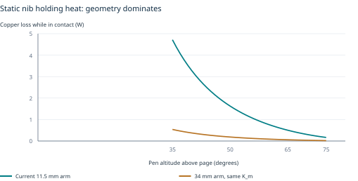
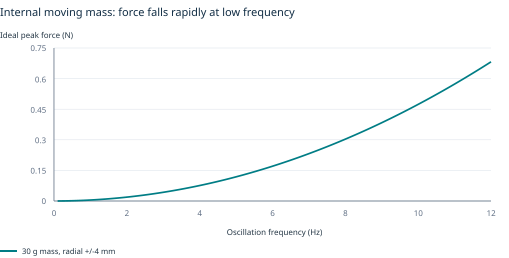
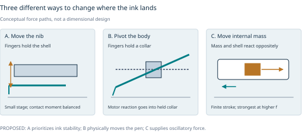
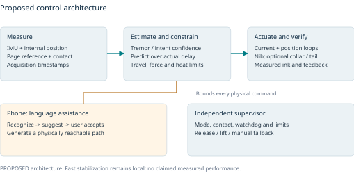
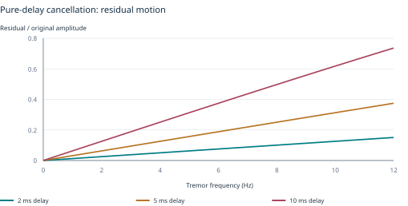

# Stabilisation Pen: independent research and engineering review

**Decision document | 29 September 2026 | Research proposal, not a validated product**

Repository reviewed: `adambickerdike/Stabilisation_Pen`, branch `claude/pensive-shannon-wzm6ls`, commit `b1694a3a35fe134026c93786dbae673c3fdbfd85`. Clone and fast-forward-only pull completed; remote reported already up to date. This review preserves that snapshot and adds an independent assessment.

**Recommendation:** develop a low-mass, mechanically load-balanced two-axis nib demonstrator first; evaluate a collar-supported moving pen body as a separate mechanism; retain a moving-mass tail only if it adds measured benefit after its mass, power and grip effects are counted. Put sustained physical word guidance on a separate development track, initially with an externally grounded writing surface. Recognition, spelling suggestions and next-word prediction can advance independently of the physical stabilizer.

The current evidence does not establish a single sleek pen that removes all tremor, fixes arbitrary handwriting and autonomously corrects spelling in permanent ink. It does establish useful mechanisms and algorithms to test. The immediate scientific priority is closing the force, sensing and validation gaps before another round of synthetic performance optimization.

Evidence labels used throughout: **REPO** = statement or result already in the cloned snapshot, not independently reproduced unless stated; **CALC** = new reproducible calculation; **LIT** = selected published primary evidence; **MFR** = manufacturer specification; **PROPOSED** = design or test target requiring validation. There are no new physical measurements or human results in this review.

## 1. What the project is trying to achieve

There are five distinct desired outcomes. A useful product may offer several modes, but each needs its own evidence and control objective.

| Outcome | What physically or computationally changes | Appropriate success measure |
|---|---|---|
| Reduce action tremor in ink | Tip moves relative to the grip; optional body actuator reduces the disturbance reaching the tip | Ink-path error and tremor-band motion, with intentional strokes preserved |
| Make handwriting clearer | User-paced guidance, spacing/size cues, or a digital clean copy | Blinded legibility and useful words per minute; separate assisted and unassisted performance |
| Move the pen body | Body pivots within a held collar, or receives oscillatory force/torque from internal inertia | Measured body motion and incremental ink benefit under the actual grip |
| Spell-check and suggest the next word | Recognition and a language model propose text; the writer accepts, ignores or edits it | Recognition CER/WER, suggestion utility, harmful edits, workload and preserved meaning |
| Physically complete an accepted word | A planner places the tip and lifts it between strokes while the hand advances, or a grounded system provides travel | Correct readable ink, uninterrupted completion, reachable workspace and easy release |

Dyslexia, dysgraphia, micrographia and tremor are not interchangeable engineering targets. Dyslexia support concerns language access and spelling; a steadier stroke alone does not resolve a spelling choice. Parkinsonian writing can include size reduction, slowness or interruptions as well as tremor. Primary writing tremor may occupy the same frequency band as normal handwriting. In one primary study, patient tremor at 4.1-7.3 Hz overlapped normal writing oscillations at 4.0-7.7 Hz. A simple high-pass or notch filter therefore cannot reliably identify unwanted movement. [R04](https://pubmed.ncbi.nlm.nih.gov/8595477/)

**Working product assumption:** favor a lighter everyday core with optional larger modules. This is a provisional interpretation of “sleek and compact,” not a dimensional requirement supplied by the user. The ranges in section 6 are targets for a trade study, not packaging claims.

## 2. What the existing documents establish, and where they conflict

The repository is unusually extensive: mechanisms, circuit concepts, firmware, synthetic data, control studies and experimental protocols already exist. Its README explicitly says that nothing has been built or measured. The evidence ledger contains **581 rows**, which must not be described as 581 independent clinical or peer-reviewed validations. Some rows represent different observations from the same source. The latest commit is a work-in-progress snapshot.

The focused audit covered the README, checkpoint, core physics, research synthesis and selected ledger entries; Rev J design, nose, end-cap and integrated simulation reports; Rev J.1 draft; Round 4 plan; dataset card; and relevant control/scaling code. This is not a line-by-line review of all 1,583 tracked files, nor an independent verification of every ledger citation.

| Finding | Evidence at the reviewed commit | Consequence |
|---|---|---|
| A missing static nose load changes power by an order of magnitude | `docs/revJ_simulation.md`, section 5, reports 0.09-0.17 W in HW1 versus 2.13 W in integrated sim2 during autowrite; section 8 identifies the load | Earlier long-runtime and low-heat claims are conditional and must be retracted from the current design summary until reconciled |
| Independent statics support the later warning | CALC below gives 1.628 W at 50 degrees from the stated 0.15 N spring and short actuator arm | A load-bypass skid has not eliminated the remaining nib reaction moment |
| Learned control does not transfer automatically | Integrated report section 8.2 gives 131-155 micrometres of false correction for the replayed TCN | Synthetic accuracy is insufficient to authorize physical ink correction |
| The heel wheel can substantially distort clean writing | Same section reports 420-427 micrometres of clean-writing displacement in its modeled tremor mode | Default-off/retracted is the credible baseline pending measured evidence and a redesigned controller |
| The assumed page sensor is doing substantial work | Integrated report assumes 1 kHz, 2 ms, 3 micrometres and validity through 2 mm lift | Ordinary-paper sensing is an unresolved subsystem, not a purchased component with those combined specifications |
| The magnet-loaded flexure is marginal in the first layout | Rev J.1 draft gives buckling near 16.3-16.5 N against about 16.5 N attraction; a thicker-strip alternative is only a calculation | Recompute nonlinear stability, stiffness, fatigue, actuator demand and tolerances together |
| Later results are not fully promoted into the top-level summary | Integrated outcome sections 6.1-6.6 and several checks remain marked pending | A single current evidence register is needed; earlier headline benefits cannot stand in for missing integrated results |
| Compactness has already been traded away | README gives diameter 24 mm, 87.0 g base and 129.2 g with tail | These dimensions are a larger research platform, not evidence that the complete feature set fits an everyday slim pen |

Stable snapshot locators: [integrated comparison and power](https://github.com/adambickerdike/Stabilisation_Pen/blob/b1694a3a35fe134026c93786dbae673c3fdbfd85/docs/revJ_simulation.md#L170), [clean-writing distortion](https://github.com/adambickerdike/Stabilisation_Pen/blob/b1694a3a35fe134026c93786dbae673c3fdbfd85/docs/revJ_simulation.md#L295), [flexure draft](https://github.com/adambickerdike/Stabilisation_Pen/blob/b1694a3a35fe134026c93786dbae673c3fdbfd85/docs/revJ1_design.md#L8), [Round 4 scope](https://github.com/adambickerdike/Stabilisation_Pen/blob/b1694a3a35fe134026c93786dbae673c3fdbfd85/docs/round4_plan.md).

The existing acceptance-criteria checker was rerun successfully: **422 criteria, 111 experiments, all requirements covered**. That verifies cross-references and document consistency within that checker; it does not mean those experiments passed. The full MuJoCo, hardware and ML suites were not rerun. The supplied environment lacks several pinned simulation dependencies; existing simulation numbers remain REPO results.

## 3. Literature review: what transfers to this pen

This is a **targeted scoping and engineering review**, not a systematic review or meta-analysis. Searches on 29 September 2026 covered active handheld stabilization, handwriting/contact mechanics, internal-mass and gyroscopic haptics, grounded guidance, pen tracking, sensor handwriting recognition and dyslexia writing assistance. Primary papers, author manuscripts and manufacturer documents were preferred. Full text was inspected where accessible; abstracts, indexed excerpts and failed retrievals are explicitly identified in the 25-entry source register. The repository's larger ledger was treated as leads, not accepted wholesale.

| Evidence stream | Useful evidence | Transfer limit and design implication |
|---|---|---|
| Active tip control | Micron shows a handheld actuated tip and approximately 84-123 Hz closed-loop bandwidth; predictive feedforward improves a hold-still comparator | External optical tracking, small travel and microsurgical tasks differ from a frictional ballpoint on paper. Transfer the architecture and measurement discipline [R01, R02] |
| Smart tremor pen | Tironi et al. compare adaptive filters, embedded execution and orbital-shaker tests | No device trial with people; signal MSE is not legibility. Include this as a baseline, not a clinical validation [R03] |
| Writing-specific tremor | Bain and Elble show task dependence and frequency overlap | Use pen-tip measurements during actual writing, including lost contact; wrist-only spectra are inadequate [R04, R05] |
| Added weight and cueing | A small weighted-pen study found increased variability; a separate randomized study tests amplitude training | Neither passive mass nor “write bigger” should be assumed universally helpful. Evaluate them separately [R06, R07] |
| Weight shift and flywheels | Shifty demonstrates perceptual effects; HapticWhirl demonstrates a substantial physical torque apparatus | Perceived pull is not sustained translation. A 95 mm flywheel in a 720 g apparatus does not establish pen-scale packaging [R11, R12] |
| Grounded guidance | Langerak et al. use an under-surface electromagnet, with up to 488 mN lateral force | Reported 2.8 +/- 0.8 mm dispersion is not fine handwriting accuracy. The force path is useful, but needs a new letter-scale evaluation [R10] |
| Page-relative tracking | DeltaPen integrates dual 1 kHz optical flow sensors | Measured 68.3 micrometres MAE per 10 ms is not 3 micrometres RMS per sample; its surface, power and geometry differ [R14] |
| Recognition and language help | OnHW provides recognition benchmarks; CTC addresses sequence alignment; calibration provides a baseline for confidence | Recognition and intent inference are distinct; patient/device transfer and harmful corrections must be measured [R15, R16, R18, R20] |

The table's source identifiers resolve to full annotated references in section 16. No pooled effect size is appropriate: tasks, denominators, sensing, populations and comparators differ. In particular, a percentage reduction in acceleration MSE cannot be equated to a percentage of words made readable. No source reviewed establishes all of the proposed pen's combined functions in the requested form factor.

## 4. Recalculate the nib load before selecting another actuator

Define the pen altitude above the page as theta; F_c is the axial refill-spring force; L_t is pivot-to-ball distance; L_a is the effective actuator moment arm. Start with maintained contact, negligible friction and quasi-static motion. These assumptions deliberately make the calculation simple; they do not replace the full frictional model.

```text
N sin(theta) = F_c                         paper-normal reaction
F_perp = N cos(theta) = F_c cot(theta)      transverse ball load
tau_pivot = L_t F_perp
F_act = tau_pivot / L_a
K_m = K_f / sqrt(R)                        motor constant, N/sqrt(W)
P_copper = (F_act / K_m)^2
```

Use the integrated design's inputs: F_c = 0.15 N, L_t = 76.48 mm, L_a = 11.5 mm, K_m = 0.656 N/sqrt(W), coil R = 2.47 ohms. These inputs are **unmeasured REPO design parameters**. Results below are independently recalculated in `independent_physics.py`.

| Altitude | Transverse ball force | Pivot torque | Coil current | Static copper heat |
|---|---|---|---|---|
| 35 degrees | 0.214 N | 16.38 mN m | 1.382 A | 4.717 W |
| 50 degrees | 0.126 N | 9.63 mN m | 0.812 A | 1.628 W |
| 75 degrees | 0.0402 N | 3.07 mN m | 0.259 A | 0.166 W |

These are holding losses during contact, before motion, driver losses and other loads. At 70% contact duty, the 50-degree static term alone averages about 1.14 W. A 1.5 g tip-equivalent mass moving with 1 mm peak amplitude at 10 Hz needs only about 5.9 mN peak inertial force. In this example the static transverse force is about 21 times that inertial force. Reducing moving mass is useful, but cannot fix this dominant holding load.



**The strongest design improvement is a mechanically balanced load path.** Route most grip force through the shell/skid or collar; then separately balance the residual refill moment. A skid alone does not remove the F_c cot(theta) term. Compare a contact-dependent spring/cam bias, a longer actuator arm, and a lower-force ink system. A fixed preload tuned at one angle will not balance 35-75 degrees. Roll, pen lift and refill replacement also change the balance.

Several useful isolated sensitivities are CALC, not complete designs:

- Halving F_c from 0.15 to 0.075 N quarters the static loss to 0.407 W at 50 degrees. The ink must still start and remain continuous on the chosen papers.
- Increasing L_a from 11.5 to 34 mm at unchanged K_m and L_t reduces the same static loss to 0.186 W. This consumes actuator travel and length; it is not free leverage.
- Balancing 90% of the static force reduces this term to 0.0163 W. This is an illustrative balance accuracy, not demonstrated hardware; noise, dynamics and friction remain.
- A 30% lower K_m multiplies heat by 1/0.7^2 = 2.04. Magnet-field-model error is therefore a first-order design risk.

Friction changes both the force projection and the relation between spring force and page reaction. Use vector contact forces and a measured friction map in the full model. Do not silently convert axial force into normal force by a constant multiplier. Schomaker and Plamondon provide a primary measurement precedent for keeping force and kinematic quantities distinct. [R08](https://www.ai.rug.nl/~lambert/papers/pen-pressure.pdf)

## 5. What an internal weight can actually do

Let x be the shell position, r the mass position relative to the shell, M the shell plus any rigidly coupled load excluding the moving mass, and m the moving mass. With no external force:

```text
(M + m) x_ddot + m r_ddot = 0
Delta x = -m Delta r / (M + m)
F_reaction = -m (x_ddot + r_ddot)
For a nearly fixed shell and r = X sin(2 pi f t):
F_peak approximately m (2 pi f)^2 X
```

This permits real shell motion. It does not provide unlimited translation: the combined centre of mass stays fixed in free space. A parked internal mass can leave a finite shell offset; resetting it gives motion back. Paper friction, gravity and the hand are external interactions, so they can change that result. If asymmetric contact is used to crawl or ratchet along the page, explicitly model it as a grounded locomotion mechanism.

For a **30 g mass with radial half-stroke 4 mm**, the ideal fixed-base force envelope is:

| Frequency | Peak reaction force | Half-stroke required for 0.5 N |
|---|---|---|
| 1 Hz | 0.0047 N | 422 mm |
| 3 Hz | 0.0426 N | 46.9 mm |
| 5 Hz | 0.118 N | 16.9 mm |
| 8 Hz | 0.303 N | 6.60 mm |
| 10 Hz | 0.474 N | 4.22 mm |
| 12 Hz | 0.682 N | 2.93 mm |



The table is a kinematic envelope, not the force a selected motor is guaranteed to deliver. For a flexure-mounted mass on a fixed base, the coil must provide

```text
F_coil,peak = X sqrt((k - m omega^2)^2 + (c omega)^2).
```

Near a tuned resonance, the flexure stores and returns energy, so coil force and net shell reaction are not the same. Away from resonance, current, voltage, stroke and thermal limits all apply. A moving base adds base-acceleration forcing. Compare measured complex transfer functions, not just min(m omega^2 X, motor force). A tuned absorber can amplify motion outside its useful band; active adaptation and a benign locked state are essential design questions.

**Pen-body translation versus pivoting:** a force at a 70 mm tail lever produces about 8.3 mN m at 5 Hz in the example. The resulting angle depends on the grip's rotational impedance, body inertia and paper contact. With a simple rotational model,

```text
angle(omega) = torque(omega) / (K_theta - I omega^2 + j C_theta omega).
```

The apparent gain can rise near resonance or collapse under a stiff grip. Thus there is no universal conversion from “30 g weight” to millimetres of tremor reduction. Identify translation, rotation and cross-coupling under actual writing postures. The existing Fu/Cavusoglu parameter source is relevant, but its numerical transfer to supported handwriting was not independently verified in this review. [R09](https://pubmed.ncbi.nlm.nih.gov/22692923/)

**Packaging is a substantial penalty.** For an illustrative solid tungsten density of 19.3 g/cm3, 30 g occupies 1.55 cm3. In a 16 mm outer barrel with 1 mm walls, circular radial travel of 4 mm leaves at most a 6 mm diameter slug. That slug is approximately 55 mm long before flexures, coils, sensor, wiring or clearance. A central refill hole makes it longer. Independent +/-4 mm motion on both axes requires even more corner clearance than this circular-workspace calculation. A 24 mm barrel makes the mass easier to package but sacrifices the sleekness objective.

**Slow weight shifting** changes the gravity moment by at most m g Delta x perpendicular to gravity: 30 g moved 4 mm gives 1.18 mN m. This can alter balance or provide a cue; its direction and magnitude depend on orientation. Shifty is evidence for perceptual weight effects, not sustained handwriting steering. [R11](https://www.dfki.de/en/web/research/projects-and-publications/publication/8925/)

**Gyroscopes deserve a calculation, not a blanket dismissal.** A control-moment gyroscope gives tau = Omega_gimbal cross H, with H = I_rotor Omega_spin. A solid 20 g, 6 mm radius rotor at 30,000 rpm has H = 1.13 mN m s and stores 1.78 J. At 5 Hz with a 20-degree sinusoidal gimbal excursion, peak torque is about 12.4 mN m. Reaching the Round 4 example H = 5 mN m s at the same mass and speed requires about a 25.2 mm rotor diameter and stores 7.85 J, before the motor, gimbal and containment. A ring rotor changes I, but does not remove packaging, balance, momentum saturation and reset constraints. A passive spinning rotor also cross-couples axes; it is not a universal damper. HapticWhirl demonstrates these effects at a much larger scale. [R12](https://www.mdpi.com/1424-8220/24/3/935)

**Decision:** retain a detachable reaction-mass experiment, particularly for higher-frequency rotational tremor, and compare it against both an equal locked mass and no module. Do not make slow letter steering or universal severe-tremor control depend on it. The weighted-pen pilot is a reason to measure added mass effects, not proof that active inertia cannot work. [R06](https://pubmed.ncbi.nlm.nih.gov/37778882/)

## 6. Mechanism architecture for a compact product

The most promising research direction is to reduce the burden on the fast actuator and move bulk out of the handheld core. The following envelopes are **PROPOSED study targets**, not CAD-verified configurations or measured user limits.

| Candidate | Provisional envelope | Best role | Decisive unresolved question |
|---|---|---|---|
| Balanced two-axis nib core | 12-16 mm grip; 25-40 g; initially +/-0.5 to 1 mm usable correction | Everyday mild/moderate ink stabilization and capture | Can load balance, sensing and drop-resistant travel coexist in this diameter? |
| Collar-supported moving body | 18-22 mm collar, 12-16 mm inner barrel; 40-65 g target | Physically pivot/shift the pen relative to the fingers, plus fine nib correction | Do grip compliance, thumb-web contact and force transmission preserve controllability? |
| Existing large-travel platform | REPO: 24 mm; 87 g base / 129 g with tail; nominal +/-6 mm nose concept | Mechanism research, accepted-text planning and larger excursions | Can revised loads, heat and page sensing close simultaneously? |
| Lightweight pen plus grounded surface | Handheld mass/diameter minimized; separate desktop stage or pad | Sustained guidance and accepted-word completion | Can letter-scale accuracy and release be achieved under realistic hand resistance? |

A collar is a distinct actuation path: the fingers hold an outer sleeve, while a gimbal or short compliant translation stage moves the inner pen. Motors react against the collar and hand. It can physically move the pen body without accelerating the entire hand as one rigid mass. It is not ungrounded inertial actuation. A 50 mm pivot-to-tip distance needs about 2.3 degrees for 2 mm motion or 4.6 degrees for 4 mm; the tail needs matching clearance. Check whether the thumb-index web touches and effectively locks the moving barrel.



For the nib, compare these changes before selecting a winner:

1. **Balanced longer-lever gimbal.** Minimize tip-equivalent inertia and carry contact moments mechanically. Map motor constant and parasitic attraction over the complete stroke, not only at the centre. A spherical magnetic gap maintains geometry but does not guarantee sufficient force or low bearing load.
2. **Two-axis flexure translation stage.** It simplifies displacement sensing and can decouple tilt from translation, but requires travel, cross-axis stiffness and normal-load support within the tip envelope. Do not reject or accept it solely from a much larger published stage.
3. **Coarse/fine separation.** A slower body/collar stage recentres a small, fast nib stage. Allocate low-frequency workspace and high-frequency tremor correction separately. The coarse stage must not chase intentional strokes without consent or a known template.
4. **Piezo fine stage.** Useful where small stroke and low static electrical loss matter. For a first-order actuator, x approximately x_free(1 - F/F_block); free displacement and blocking force cannot be demanded simultaneously. PI's PL128 nominal endpoints are +/-450 micrometres and +/-0.55 N with tolerances. Custom narrow plates, loaded resonance, shock support and drive energy need measurements. [R25](https://www.pi-usa.us/fileadmin/user_upload/pi_us/files/product_datasheets/PL112_Piezo_Bender_Piezo_Disk_Datasheet.pdf)

For a piezo, I_peak = omega C V_peak and dielectric loss approximately omega C V_rms^2 tan(delta). Drive losses depend on waveform and charge recovery. “Zero static holding power” does not imply zero battery power. Voice coils offer smooth bidirectional force and millimetre travel, but require current for unbalanced static force. Gear trains introduce backlash and reflected inertia; SMA adds a thermal bandwidth limit. These are mechanisms to characterize, not universally excluded technologies.

Separate refill force regulation from pen lift. A long free-sliding refill can follow a lifted barrel and unintentionally join strokes. Use a measured contact state and a positively bounded extension mechanism. A fail state should release powered guidance and either retract the nib or enter a verified benign conventional-writing state, according to mode; a reset must never replay a stale stroke command.

**Flexure rigor:** use nonlinear loaded eigenmodes, geometric stiffness, magnetic force gradients, full-travel strain, manufacturing tolerances and stress concentrations. Thicker leaves increase bending stiffness roughly with thickness cubed; fixing buckling may worsen actuator power. At 8 Hz, two hours per day, 250 days per year for three years gives **43.2 million cycles**. Fatigue must reflect material finish, clamps, mean stress, corrosion and occasional full-stop impacts. Rev J.1's thicker-strip calculation is a candidate for coupon tests, not qualification.

For every candidate, constrain a multiobjective optimization by the same task, load and uncertainty distributions. Report diameter, total and moving mass, centre of mass, usable travel under load, peak and continuous power, contact temperature, sensor error and failure state. Keep the Pareto frontier; a weighted score with arbitrary coefficients cannot establish a scientifically “best” pen.

## 7. Sensors: obtain a reference to the page

The estimator needs to know the barrel motion relative to the page, the nib motion relative to the barrel, orientation and contact state. An IMU measures specific force and angular rate. Constant velocity and absolute position are not observable from accelerometers alone; double integration drifts. A 1 mg acceleration bias produces about **4.9 mm position error after one second**. A 0.1-degree gravity-orientation error can contribute about **8.6 mm after one second** if integrated uncorrected. These CALC examples explain why embedded IMU sensor fusion is not a complete page-position solution.

The moving-tip geometry also matters:

```text
p_tip = p_barrel + R_barrel r_tip(q)
v_tip = v_barrel + omega cross (R_barrel r_tip) + R_barrel J_tip q_dot
a_sensor = a_origin + alpha cross r + omega cross (omega cross r)
```

Sensor acceleration must be transformed between frames, and gravity and lever-arm terms handled consistently. A 0.1-degree attitude error over a 50 mm lever is about 87 micrometres of geometric tip error. Two optical sensors can help distinguish translation and yaw; local optics still need scale calibration with tilt and height. Hall sensors read the internal stage, not the ink position on the page.

**Recommended instrumentation sequence:** first use external ground truth and a digitizing surface to establish whether the mechanism works. Then qualify a local optical implementation on actual paper. DeltaPen is a useful precedent: dual optical flow at 1 kHz, evaluated with 10 participants, produced 68.3 micrometres mean absolute translation-magnitude error per 10 ms window on a Wacom surface. That metric is neither per-sample Gaussian noise nor absolute path accuracy. Its tethered power and geometry must be reconsidered for this design. [R14](https://static.siplab.org/papers/uist2022-deltapen.pdf)

A candidate onboard stack is a six-axis IMU near the moving system's reference point, differential stage-position sensing, an axial/contact sensor, coil-current sensing and temperature sensing, plus page-relative optical data where valid. Coded paper or a sensing pad is a legitimate research fallback. Do not advertise ordinary-paper autonomy until dropout, gloss, black ink, roughness, lift, occlusion, roll and tilt have been measured.

For the TMAG5273, 10 kSPS three-axis conversion is available at no averaging; 32x averaging reduces that to 0.4 kSPS. Its maximum I2C clock is 1 MHz. An illustrative nine-byte transaction with acknowledgements already consumes 81 microseconds, before further protocol and scheduling costs. Check the actual optimized read frame, number of sensors and conversion timing rather than equating ADC rate to a 10 kHz control loop. Field noise becomes position noise through the calibrated field Jacobian. Coil and motor fields, temperature drift and external magnets can bias that map. [R22](https://www.ti.com/lit/ds/symlink/tmag5273.pdf)

ST's LSM6DSV16X remains a plausible IMU candidate, but the selected filter and operating mode determine latency and noise. Measure end-to-end sample age, not only nominal output rate. Use acquisition timestamps and hardware synchronization where possible. Replacing the IMU alone cannot solve the intent ambiguity. [R24](https://www.st.com/resource/en/datasheet/lsm6dsv16x.pdf)

## 8. Electronics, energy and heat

For a voice coil, the required terminal voltage is

```text
V = R(T) i + L di/dt + K_e v_actuator + driver losses.
```

Evaluate it at the low battery voltage, hot resistance, maximum speed and acceleration, including simultaneous axes and supply impedance. Peak current specifications do not establish continuous performance in a sealed grip. Use measured K_f(position), inductance, resistance and force ripple. A winding change redistributes current and voltage; it does not improve K_m if copper volume and magnetic geometry are unchanged.

The DRV8214 provides current sensing and regulation, but its brushed-motor ripple-counting features are not voice-coil displacement feedback. Qualify signed current measurement through braking and reversal, PWM blanking, current-mirror error at small current and low battery voltage, driver dissipation and regenerative energy. Use a simpler bridge plus suitable current amplifier if it performs better under these requirements. [R23](https://www.ti.com/lit/ds/symlink/drv8214.pdf)

Keep a deterministic microcontroller for sensor timing, current control, stage servo and the supervisor. Run recognition and language assistance on a phone initially. Use a proposed current-loop update of 20-40 kHz and stage/estimator update of 1-2 kHz only as starting design targets; they do not prove an 80 Hz mechanical closed-loop bandwidth. Establish worst-case execution time, interrupt jitter, ADC timing and bus load on the actual hardware. BLE and cloud inference do not belong in the fast stabilization loop.

For the repository's **2.22 Wh usable-energy assumption**, ideal runtime is 8.9 h at 0.25 W total, 4.4 h at 0.5 W, 2.2 h at 1 W and 0.97 h at 2.3 W. If 2.22 Wh is actually a nominal cell rating rather than net usable energy, conversion losses, cutoff, ageing and temperature reduce these times further. A proposed 300 mAh, 3.7 V cell contains 1.11 Wh nominal; at an illustrative 80% usable fraction it gives only 3.6 h at 0.25 W. Eight hours would require an average total below 0.111 W. That is a design-budget example, not a chosen battery.

For thermal screening, use C_th T_dot = P - (T - T_ambient)/R_th. With the repository's unmeasured R_th = 100 K/W and C_th = 0.5 J/K, an initial 25 C coil reaches the assumed 120 C coil limit in **43.8 seconds at 1.628 W**, or **21.9 seconds at 2.68 W**. The extremely high extrapolated steady temperatures simply invalidate continuous operation of this lumped model; they are not predictions that a protected product should reach those temperatures. The real governor should reduce power much earlier.

Resolve coil temperature, magnet/adhesive limits and external grip temperature separately. A two- or multi-node thermal model with measured contact-to-hand and airflow conditions is preferable. The repository's 41 C grip target is an internal design target here, not a certified or universally applicable medical-device limit. Test charging, low-voltage stall, maximum duty, normal grip and hot ambient. A heat spreader cannot remove the need to reduce heat generation.

A preliminary 0.25 W average allocation might reserve 0.04 W for MCU/IMU/radio, 0.05 W for optical sensing, 0.10 W for nib motion, 0.02 W for lift/cues and 0.04 W for conversion and margin. **Every allocation is a target, not a measured component budget.** If optics or actuators cannot meet it, reduce functionality or accept a larger cell; do not balance the spreadsheet by silently duty-cycling the measurement needed by the controller.

## 9. Control architecture and mathematical limits

Use a nested system: acquisition and state estimation; tremor/intent confidence; constrained reference generation; stage and current loops; then an independent supervisor enforcing contact, travel, force, voltage and temperature limits. Slow word prediction proposes an accepted target to the planner; it does not directly command coil current.



For ideal equal-amplitude cancellation with only a delay tau, the residual sinusoidal amplitude ratio is

```text
r = |1 - exp(-j 2 pi f tau)| = 2 |sin(pi f tau)|.
```

At 10 Hz, 2, 5 and 10 ms leave ratios **0.126, 0.313 and 0.618** respectively. To leave at most 0.30 in this idealized case requires tau <= **4.79 ms**. These are pure-delay calculations, not universal performance bounds once prediction, gain mismatch, contact and actuator dynamics enter. Prediction can improve the phase error while adding model-error risk; it is not free latency removal.



For a general linear channel, disturbance rejection depends on the full complex product: r(omega) = |1 - G_act(omega) H_est(omega) exp(-j omega tau)|. A controller that reacts strongly to delayed force can add negative damping at a contact resonance. Identify loaded modes and delays, then measure stability margins across contact, tilt and grip. Proposed acceptance targets of at least 45-degree phase margin and 6 dB gain margin need an agreed linearized operating envelope; they do not guarantee stability through stick-slip or mode switches.

The minimum estimator baseline is an error-state EKF or linearized Kalman model with bias states, orientation/lever-arm correction, and one or more slowly varying tremor oscillators. A representative oscillator uses [d, d_dot] with continuous matrix [[0,1],[-omega^2,-2 zeta omega]]. Fit or track frequency cautiously, and propagate the state through actual sensor age and actuator delay. Compare an adaptive harmonic model, WFLC/BMFLC-style estimator, AR predictor and a conservative no-assist baseline before adding a learned residual. The feedforward benefit reported by Becker et al. motivates this approach but does not predict its handwriting benefit. [R02](https://publications.ri.cmu.edu/storage/publications/pub_files/2011/9/Becker_IROS11.pdf)

**Intent is only partly observable.** If the same measured motion could be a deliberate flourish or a tremor, no algorithm can always choose correctly from that motion alone. Pressure, pen lift, recent stroke context, repeated-user calibration and known tracing templates add information, but do not make free writing unambiguous. Prefer abstention or reduced authority when evidence is weak. A fixed 4-8 Hz notch is especially risky given R04's overlap.

Use confidence as a calibrated decision signal rather than a raw neural softmax. Estimate risk on held-out writers, styles, languages and devices. Temperature scaling is a useful baseline; it does not guarantee calibration under distribution shift. [R18](https://proceedings.mlr.press/v70/guo17a.html)

A small constrained optimizer can allocate correction among fine nib, coarse collar and optional reaction mass:

```text
minimize sum_k ||p_tip(k)-p_target(k)||_Q^2
             + lambda_i ||i(k)||^2 + lambda_du ||Delta u(k)||^2
subject to travel, speed, acceleration, current, voltage, temperature,
           minimum/maximum ink force and contact-validity constraints.
```

Use stroke-aware recentering, anti-windup, rate limits and bumpless mode switching. For guidance along a known path, use a monotonic progress coordinate and bounded attraction normal to the path, rather than pulling toward a point that advances regardless of the user. Avoid nearest-point jumps between nearby loops. Passive constraints reduce some energy-injection risks, but can still distort writing; the existing heel-wheel result demonstrates that within its model.

A fixed-lag smoother estimates a past state using data available now. It may be causal with respect to current output time while still incurring a physical drawing delay. Label that delay and propagate to the actuation time. Test causality by changing or deleting every future sample and confirming past outputs are identical, including startup before the first optical sample, dropout and endpointing. No bidirectional model or zero-phase offline filter should silently become an online stabilizer.

Learned TCN/GRU residuals should run in shadow mode until they beat the physics baseline on unseen real participants without increasing false corrections. Penalizing harmful motion in a reward function is not a hard constraint. RL may explore allocation policies in a calibrated simulator, but a deterministic supervisor must enforce physical bounds on hardware. The current repository's TCN transfer failure argues for better data and plant identification before larger models.

## 10. Spelling, word prediction and physical completion

Build three explicitly separate outputs: an immutable record of actual strokes; a recognized and optionally corrected digital transcript; and a proposed physical writing plan for text the user has accepted. The first is evidence of what was written. The second can be revised. The third changes future ink and needs a deliberate interaction contract.

A recognition pipeline can use page-relative (x,y), time, pressure, pen-up state, tilt and IMU features, with a causal encoder and CTC or a streaming transducer. CTC sums over possible frame-to-label alignments; it does not require a manually segmented character at each frame. It also does not make a bidirectional encoder causal. Evaluate writer-disjoint and session-disjoint CER/WER with and without a language model. [R16](https://www.cs.toronto.edu/~graves/icml_2006.pdf)

OnHW is a useful recognition benchmark and a source of study protocols, not a paired record of intended motion versus tremor. Dataset availability does not imply unrestricted licence, patient coverage or a suitable sensor clock. The 2026 ECHWR preprint is a candidate training improvement for writer-independent recognition; it provides no evidence for physical stabilization. Its abstract-level review here should not be confused with reproduction. [R15](https://www.iis.fraunhofer.de/de/ff/lv/dataanalytics/anwproj/schreibtrainer/onhw-dataset.html), [R19](https://arxiv.org/abs/2602.07049)

The OnHW project page describes right-handed-only released recordings and a timestamp representing processing on the connected tablet. Account for those restrictions before making left-handed or acquisition-latency claims. Likewise, the 2025 smart-pen paper describes both JPEG drawing data and recorded BiSP time series; identify the exact raw files, sample timing and preprocessing before reusing its signal benchmark. A static handwriting image alone cannot determine a tremor frequency in hertz without temporal information. [R03](https://www.nature.com/articles/s41598-025-14196-5), [R15](https://www.iis.fraunhofer.de/de/ff/lv/dataanalytics/anwproj/schreibtrainer/onhw-dataset.html)

For spelling, combine recognition uncertainty with context and a personalized spelling-confusion model. Preserve proper names, numbers, technical terms and unusual but intentional words. One conceptual ranking is

```text
score(w) = log P(strokes | written form)
         + lambda_context log P(w | surrounding text)
         + lambda_error log P(written form | intended w, user profile).
```

This decomposition distinguishes recognition errors from spelling errors. A language model should not turn an uncertain but possible word into a fluent sentence with different meaning. Compare lexical/edit-distance and phonetic baselines with neural alternatives. Calibrate confidence after combining the models; do not treat individually calibrated components as a calibrated composite.

A practical interaction is to offer a small number of completions at natural pauses, optionally read them aloud, and accept with an accessible control. Automatic digital correction can be a user-selected, reversible mode with an audit trail. For physical writing, a chosen completion is fixed for that stroke sequence; a new prediction cannot redirect the nib mid-letter without a clear user action. Measure reading burden and flow interruption as well as accuracy. Tool-function research on dyslexia identifies this accuracy-versus-fluency tension; it does not establish one interface suitable for everyone. [R20](https://pubmed.ncbi.nlm.nih.gov/37726146/)

**Permanent ink cannot be retroactively autocorrected by moving the nib.** Once a wrong word is on paper, options are a digital correction, a suggested rewrite, an explicit crossing-out workflow, or a different erasable medium. A prospective accepted completion is possible in principle if its future strokes are reachable. Knowing the word does not enlarge the mechanism's workspace.

For physical completion, parameterize an accepted word path r(s) and plan it jointly with hand/barrel motion b(t): q(t) = r(s(t)) - b(t), transformed through the calibrated tip Jacobian. Constrain |q| to the usable workspace and bound speed, acceleration, jerk and pen-lift timing. Reserve travel for tremor and tracking error. If the hand pauses, reverses or advances too fast, slow the path, lift and request recentering, or release to manual writing. A +/-1 mm stage cannot draw an arbitrary 15 mm word around a stationary grip. The hand must advance or an external system must provide that travel.

Style synthesis, such as text-conditioned handwriting generation, supplies candidate paths. It does not certify curvature, collision clearance, legibility or current limits. Begin with deterministic strokes in a known font; personalize only after path tracking is demonstrated. [R17](https://arxiv.org/abs/1308.0850)

For dyslexia-oriented development, collect consented real spelling confusions and evaluate word completion, read-back and correction independently of motor impairment. Error-based spelling exercises are a relevant research direction, but their educational effect cannot be assumed for a robotic pen. [R21](https://arxiv.org/abs/1508.04789)

## 11. A credible data and simulation programme

The existing dataset card states that its predictor data are synthetic. Synthetic writers being disjoint by identifier does not demonstrate generalization to new people. Similarly, a parameter-identification algorithm recovering a simulated plant validates its numerical procedure within that model family; it does not validate the plant model against hardware.

Create four separate datasets:

1. **Bench mechanics:** calibrated motion, force, current, voltage, temperature and contact state; include known injected disturbances and an independent ground-truth sensor.
2. **Natural handwriting:** repeated sessions from actual users, both without impairment and from the intended user groups; retain handwriting speed, handedness, grip, posture, medication-state context where relevant and consented, and device configuration.
3. **Recognition and spelling:** image and stroke traces with literal transcription, intended/corrected text where the writer confirms it, and separately labeled recognition and spelling errors.
4. **Assisted interaction:** synchronized device commands and measured outcomes, including user overrides, failed contact, dropped strokes, rejected suggestions and fatigue.

There is no direct ground truth for the exact tremor-free version of spontaneous writing. Repeated writing is not the same intended trajectory, and subtracting two repetitions is not a pure tremor measurement. Use known-shape tracking and an independently driven disturbance fixture for mechanistic identification. For spontaneous text, report outcome-level improvement and uncertainty without pretending to observe hidden intent.

Split by participant and session before making windows. Keep calibration, fitting, validation and final test roles distinct. Prevent repeated text, generated glyph family, paper/device identity and user calibration data from leaking across splits. Store acquisition and availability timestamps separately. Randomize realistic sensor dropouts, latency, correlated noise, scale error, backlash, friction hysteresis and actuator saturation, not just a few Gaussian parameters.

Calibrate separate model components: force-versus-position/current, grip impedance, refill contact, magnetic attraction, flexible modes and thermal network. Use a held-out hardware configuration or contact condition to test prediction. Report residual model discrepancy and identify which decisions remain robust across it. Numerical convergence, conservation and agreement between two simulators are useful verification; agreement between simulators sharing the same contact law is not independent physical validation.

Avoid presenting generated before/after handwriting as observed user improvement. Any synthetic figure should have a prominent simulation label, the same writer and task, and a fixed scale. The charts in this review are physics calculations only; no fabricated human handwriting demonstration is supplied.

## 12. Experiments that decide the design

The order below is intended to retire the largest uncertainties cheaply. Targets are **PROPOSED engineering gates**, to be revised before data collection with the team and intended users. They are not established clinical thresholds.

| Gate | Experiment and measurements | Decision it enables |
|---|---|---|
| G1: contact and ink | Measure axial and normal force separately, friction and ink continuity for at least three refill types, six representative papers, several speeds and 35/50/75-degree tilt | Minimum reliable ink force and feasible static-balance range |
| G2: actuator coupon | Map 2-D force/current/displacement, K_m, magnetic attraction, sensor interference and loaded modes at temperature | Voice-coil geometry and flexure feasibility; reject models that miss force or heat materially |
| G3: one-axis loaded nib | Independent position ground truth; swept and multitone 1-30 Hz disturbances, 0.25-2 mm peak as a proposed starting envelope; separate large-excursion limits | A useful correction bandwidth under contact, with stable lift and bounded current |
| G4: complete two-axis nib | Natural sharp turns, repeated contacts, full roll/tilt range, optical dropout and at least a long-duration thermal run | Whether the core architecture remains useful outside a short ideal trace |
| G5: collar and tail | Same tasks with no module, equal mass locked, passive/unpowered module and active module; instrument translation and rotation at multiple grip strengths | Incremental active benefit per added gram, watt and unit of fatigue |
| G6: grounded guidance | Compare retracted wheel, freely rolling wheel, constrained wheel and an external pad; path and force measurements | Which ground-contact mechanism preserves intended turns and user control |
| G7: recognition and suggestions | Held-out people and sessions; raw CER/WER, corrected CER/WER, harmful edits, coverage and response time | Whether language assistance improves practical writing without excessive interruption |
| G8: user study | Randomized within-person crossover with counterbalanced order, adaptation time, blinded ink transcription and actual task completion | Physical legibility, speed, comfort and usefulness for each intended population |

For G3/G4, a useful initial target is at least 30% reduction in a predeclared ink-error metric on the chosen tremor envelope, no material slowing, and very low false correction on clean writing. The repository's 25 micrometre false-correction rule can remain a stringent **bench** target only if ground-truth uncertainty is sufficiently smaller. Do not claim that a 68 micrometre-window-error optical system has verified a 25 micrometre threshold without a separate metrology argument.

For the tail, use at least a 10% incremental improvement over the **same device with the same mass locked** as a provisional engineering selection gate, plus acceptable fatigue and no subgroup harmed materially. The existing repository's comparison against nose-only is not sufficient to isolate active mass control from added inertia. Evaluate all failures and unfavourable grip conditions, not just the mean.

Human work needs an appropriate reviewed protocol and informed consent before device trials. Initial mechanism tests can be conducted on fixtures; current, force, travel and temperature bounds should be established before participant exposure. Treat children and educational interventions as a separate research programme after adult feasibility, rather than assuming transfer from adult handwriting.

Use a prespecified primary endpoint, for example blinded correct words per minute on a standard free-text/copy task, and mechanism endpoints such as orthogonal path error on known targets. Report actual ink, not only the app's recognition score. Analyse tremor, micrographia, dysgraphia and dyslexia cohorts separately; do not pool them into one “writing improvement” percentage.

For planning only, a paired normal-approximation calculation gives n approximately (1.96 + 0.84)^2 / d^2. A standardized paired effect d = 0.5 gives approximately 32 evaluable participants for one comparison, before allowance for loss, non-normal outcomes and multiplicity. This is not a power calculation for every cohort. Obtain variance and realistic effect estimates from a pilot and use a statistician for the confirmatory design. Thousands of letters from a few people are not thousands of independent participants.

## 13. Report outcomes in a way people can understand

Use one small results card per population and mode, with the same baseline pen and task. Keep geometry, motor performance and language assistance separate.

| User-facing measure | Scientific definition to retain |
|---|---|
| Readable words out of 10 | Blinded literal transcription, with uncertainty and no language-model rescue in the primary ink endpoint |
| Useful words per minute | Correctly completed words divided by full task time, including pauses and suggestion acceptance |
| Tremor left at the tip | Calibrated displacement amplitude or RMS with frequency band, contact condition and peak/RMS convention |
| Clean writing changed | False-correction path displacement plus blinded assessment of meaning and letter identity |
| Writing time per charge | Measured task duty, ambient temperature, actual usable energy and radio/optics state |
| Comfort over a session | Fatigue, grip effort, perceived control and abandonment, with equal-mass comparisons |
| Spelling help | Correct suggestions accepted, false changes of correct words, names/numbers preserved and time cost |

Distinguish amplitude from power. A residual amplitude ratio of 0.5 is a 50% amplitude reduction and a 75% squared-signal reduction, equivalent to about -6 dB in either consistent convention. Do not label it “75% less tremor” without specifying the measured quantity. Likewise, a 20% additional reduction of a residual is not 20 percentage points off the original error.

Include incomplete and cancelled strokes. The existing physics report excludes windows around transitions for some metrics; those exclusions can be useful for steady-state analysis but can conceal real lift/touchdown failures. Report transition ink tails and dropout separately and retain an all-task endpoint. An “ink only when correct” policy can make conditional error look excellent while producing missing writing; coverage, completion time and missing-stroke rate must accompany it.

For spontaneous handwriting, use participant-level paired estimates and confidence intervals or a suitable mixed model. Keep speed-legibility and autonomy-assistance trade-offs visible. For training, repeat an unassisted test after a retention period; better guided traces alone do not demonstrate learning. [R07](https://pubmed.ncbi.nlm.nih.gov/26990651/), [R13](https://journals.plos.org/plosone/article?id=10.1371/journal.pone.0001775)

## 14. Concrete changes to make next in the repository

1. **Promote the integrated load finding.** The README now links prominently to this review and the later integrated warning. Reconcile nose2 duty forces, integrated power and Rev J.1 mechanics before issuing a new product revision. Do not silently overwrite historical studies.
2. **Unify the physical interface.** Give spring force, paper-normal force, tilt, contact Jacobian, effective actuator arm, sensor noise and thermal parameters one versioned definition with explicit units and evidence status. Record a manifest for every result.
3. **Reopen the mechanism search with corrected loads.** Compare a balanced longer-arm gimbal, a small parallel stage and a collar-supported body. Include passive static support, required actuator travel, full force maps and sensor geometry in each optimization.
4. **Make sensing a build gate.** Replace ideal 3-micrometre page noise with a measured error model before reporting expected pen performance. Retain the ideal sensor only as a labelled diagnostic upper bound.
5. **Split assist modes in the supervisor.** Manual, stabilization, tracing, accepted-text completion and digital correction should have distinct state transitions and authority. Wheel guidance should not be implicitly active during free writing.
6. **Add equal-mass and no-actuation comparators.** Re-evaluate the tail's benefit after accounting for weight, balance and grip changes. Model mass stroke, spring dynamics, coil drive and shell motion jointly.
7. **Rebuild the evaluation around real outcomes.** Add literal blinded ink scoring, all-contact-transition metrics, participant-disjoint recordings, harmful correction rates and actual task time. Existing synthetic suites remain useful regression tests.
8. **Implement language help as a separate, reviewable layer.** Begin with recognition, spelling alternatives and accepted completion; only send a constrained, approved trajectory to hardware after reachability and tracking gates pass.

This review adds research documentation and reproducible feasibility calculations. It does not claim that revised CAD, fabrication drawings, electronics layouts or a production controller have been completed. Those should follow the decisive contact, magnetics and sensing measurements instead of being optimized around unsupported parameters.

## 15. Reproduction, verification and remaining uncertainty

The accompanying package contains this Markdown source, the PDF, a 25-source annotated register in CSV/JSON, a prioritized findings register, an independent Python calculator, exact numerical results and vector charts. The calculator uses only the Python standard library; the document renderer uses ReportLab and bundled fonts when available.

```text
python3 independent_physics.py --out results
```

Eight independent checks passed: contact-vector projection, power/current consistency, force-scaling sensitivity, time-domain versus analytic delay cancellation, finite-difference reaction acceleration, conservation of centre of mass, numerical versus analytic heating, and the rotor momentum/energy identity. These check mathematics and implementation; they do not validate material properties, sensor performance, patient benefit or the input design parameters.

The new calculations reproduce the later integrated static-power values to their stated precision: 4.717, 1.628 and 0.166 W at 35, 50 and 75 degrees. They also expose a small internal text inconsistency: the integrated report's section 8.1 prose gives approximately 3.9 W and 0.3 W at its extreme angles, whereas its later table gives 4.7 W and 0.17 W, which agree with the stated geometry. The new review uses the explicitly recalculated values.

Unresolved questions with the highest decision value are minimum reliable ink force; loaded force/thermal performance of a balanced nib; achievable page-relative sensing on paper; actual translation/rotation grip impedance; clean-writing false correction on real users; and whether accepted-word completion is desirable enough to justify a larger or grounded device.

No universal handwriting improvement percentage, clinical efficacy, manufacturable compact envelope, battery endurance or autonomous spelling capability is established by this work. What is established is a traceable design direction, numerical constraints, primary-source context and a sequence of measurements capable of resolving those claims.

## 16. Annotated primary-source register

The register below is generated from `independent_review_support/sources.json`. Access level is stated per entry. An abstract-only source supports only its reported abstract-level findings; a manufacturer specification is not an independent system test. All entries were accessed or searched on 29 September 2026. R09 is retained as an explicit unverified numerical-parameter lead, not as independent support for the old hand model.

### R01. MacLachlan et al. Micron: an actively stabilized handheld tool for microsurgery. IEEE Transactions on Robotics.

[2012; primary source](https://publications.ri.cmu.edu/storage/publications/pub_files/2012/2/Micron_TRO_final.pdf). **Evidence:** Bench and human experiments. **Access:** Author full text; selected relevant sections. **Locator:** Sections II-N and III-IV; bandwidth discussion p12.

**Finding:** Actively moving a handheld tool tip is feasible; reported closed-loop bandwidth 84-123 Hz. **Limit:** External optical reference and microsurgical tasks do not establish loaded handwriting performance. **Design use:** Use as control precedent, not a transferable pen efficacy percentage.

### R02. Becker, MacLachlan and Riviere. State Estimation and Feedforward Tremor Suppression for a Handheld Micromanipulator with a Kalman Filter. IROS.

[2011; primary source](https://publications.ri.cmu.edu/storage/publications/pub_files/2011/9/Becker_IROS11.pdf). **Evidence:** Bench/handheld experiment. **Access:** Author full text; selected relevant sections. **Locator:** Section IV-C; Table I.

**Finding:** Feedback plus prediction reduced RMS error from 7.9 to 3.4 micrometres in the reported hold-still comparison. **Limit:** Improvement is relative to feedback-only Micron, not a conventional pen or handwriting population. **Design use:** Predict through measured latency; benchmark against feedback-only control.

### R03. Tironi et al. A smart pen prototype with adaptive algorithms for stabilizing handwriting tremor signals in Parkinson's disease. Scientific Reports 15:28659.

[2025; primary source](https://www.nature.com/articles/s41598-025-14196-5). **Evidence:** Simulation and shaking-table prototype. **Access:** Publisher full text; methods, results and conclusion. **Locator:** Materials and methods; real-time performance; data availability.

**Finding:** Adaptive filters and embedded execution were tested; no human participants in device validation. **Limit:** Signal MSE does not establish ink improvement. Dataset description mentions both JPEG images and recorded time series; exact signal provenance requires checking. **Design use:** Use as an algorithm baseline only; require physical ink and independent motion outcomes.

### R04. Bain et al. Primary writing tremor. Brain 118:1461-1472.

[1995; primary source](https://pubmed.ncbi.nlm.nih.gov/8595477/). **Evidence:** Human observational study. **Access:** PubMed abstract. **Locator:** Abstract; 21 patients.

**Finding:** Writing-tremor frequencies 4.1-7.3 Hz overlapped normal writing oscillations of 4.0-7.7 Hz. **Limit:** Small task-specific cohort; not a universal frequency distribution. **Design use:** A frequency threshold cannot by itself distinguish intent from tremor.

### R05. Elble et al. Quantification of essential tremor in writing and drawing. Movement Disorders 11:70-78.

[1996; primary source](https://pubmed.ncbi.nlm.nih.gov/8771070/). **Evidence:** Human measurement study. **Access:** PubMed abstract. **Locator:** Abstract; 87 patients.

**Finding:** Wrist and writing tremor measures were weakly correlated; very severe cases could lose tablet contact. **Limit:** Task- and device-specific; missing pen contact can bias recorded severity. **Design use:** Measure actual ink and pen-up time, not only wrist acceleration.

### R06. Latimer et al. The effects of auditory cues and weighted pens on handwriting in individuals with Parkinson's disease. Journal of Hand Therapy 37:144-152.

[2024; primary source](https://pubmed.ncbi.nlm.nih.gov/37778882/). **Evidence:** Human pilot cohort. **Access:** Indexed PubMed abstract; subsequent direct access challenged. **Locator:** Abstract; 8 participants; repeated cursive l task.

**Finding:** The weighted pen increased spatial and timing variability in this small novice-user sample. **Limit:** Not a trial of an actively controlled mass; short task and small sample. **Design use:** Always compare active tail with the same mass locked and with no tail.

### R07. Nackaerts et al. Relearning of Writing Skills in Parkinson's Disease After Intensive Amplitude Training. Movement Disorders 31:1209-1216.

[2016; primary source](https://pubmed.ncbi.nlm.nih.gov/26990651/). **Evidence:** Randomized controlled training study. **Access:** Indexed PubMed abstract; full text not reviewed. **Locator:** Abstract; 38 people; 6 weeks training and retention assessment.

**Finding:** Provides a controlled framework for testing handwriting amplitude training. **Limit:** Training evidence does not validate an automatic mechanical pen or immediate tremor suppression. **Design use:** Evaluate micrographia cueing and unassisted retention separately.

### R08. Schomaker and Plamondon. The relation between pen force and pen-point kinematics in handwriting. Biological Cybernetics 63:277-289.

[1990; primary source](https://www.ai.rug.nl/~lambert/papers/pen-pressure.pdf). **Evidence:** Human force and kinematic measurements. **Access:** Author full text; methods and tables. **Locator:** Methods; axial-force measurement; Tables 2 and 4.

**Finding:** Axial pen force and point kinematics are distinct measurements with substantial task and writer variation. **Limit:** Older restricted-posture setup; axial force must not be relabelled paper-normal force. **Design use:** Measure refill force and grip/paper load separately in the new fixture.

### R09. Fu and Cavusoglu. Human-arm-and-hand-dynamic model with variability analyses for a stylus-based haptic interface. IEEE TSMC-B 42:1633-1644.

[2012; primary source](https://pubmed.ncbi.nlm.nih.gov/22692923/). **Evidence:** Human impedance model. **Access:** Citation identified in primary index; full text not retrieved in this review. **Locator:** Publication identity; existing repository HAP-26 is the secondary parameter pointer.

**Finding:** Relevant precedent for identifying grip and arm dynamics. **Limit:** Numerical parameters in the existing ledger were not independently reverified; posture and contact transfer remain unknown. **Design use:** Do not reuse its parameter values as measured writing-hand impedance.

### R10. Langerak et al. Dynamic Drawing Guidance via Electromagnetic Haptic Feedback.

[2019; primary source](https://arxiv.org/html/1906.11753v1). **Evidence:** Physical prototype and initial human experiment. **Access:** Author full text; hardware and evaluation sections. **Locator:** Sections 4.1 and 6; abstract.

**Finding:** Under-table electromagnet provides externally grounded guidance; reported lateral force up to 488 mN and dispersion 2.8 +/- 0.8 mm. **Limit:** Large external apparatus, task-specific dispersion; not submillimetre pen-tip accuracy or autonomous spelling. **Design use:** A grounded accessory is credible for sustained guidance; remeasure accuracy at letter scale.

### R11. Zenner and Krueger. Shifty: A Weight-Shifting Dynamic Passive Haptic Proxy. IEEE TVCG 23:1285-1294.

[2017; primary source](https://www.dfki.de/en/web/research/projects-and-publications/publication/8925/). **Evidence:** Haptic perception experiments. **Access:** Author-institution abstract; PDF retrieval failed. **Locator:** Abstract.

**Finding:** Redistributing weight can change perceived object properties. **Limit:** Perceived weight/direction is not demonstrated writing-path control. **Design use:** Separate weight-balance cues from guaranteed steering force.

### R12. HapticWhirl, a Flywheel-Gimbal Handheld Haptic Controller for Exploring Multimodal Haptic Feedback. Sensors 24:935.

[2024; primary source](https://www.mdpi.com/1424-8220/24/3/935). **Evidence:** Physical haptic prototype. **Access:** Indexed publisher full-text hardware section; direct retrieval failed. **Locator:** Section 3.1.

**Finding:** A 95 mm flywheel and 720 g complete device demonstrate torque-feedback hardware at a much larger scale. **Limit:** Not a tremor-treatment trial or compact pen; do not extrapolate miniaturization from perception alone. **Design use:** Explicitly calculate rotor momentum, gimbal volume and containment.

### R13. Bluteau et al. Haptic Guidance Improves the Visuo-Manual Tracking of Trajectories. PLOS ONE 3:e1775.

[2008; primary source](https://journals.plos.org/plosone/article?id=10.1371/journal.pone.0001775). **Evidence:** Controlled human trajectory-learning experiments. **Access:** Publisher full text; methods and discussion. **Locator:** Experiments 1 and 2.

**Finding:** Force and position guidance can affect different aspects of tracking and fluency. **Limit:** Not proof of dyslexia spelling support or durable benefit from this pen. **Design use:** Test assistance while on separately from later unassisted learning.

### R14. Luethi, Fender and Holz. DeltaPen: A Device with Integrated High-Precision Translation and Rotation Sensing on Passive Surfaces. UIST.

[2022; primary source](https://static.siplab.org/papers/uist2022-deltapen.pdf). **Evidence:** Physical prototype; 10-person technical evaluation. **Access:** Author full text; hardware and evaluation sections. **Locator:** Sections 3.1-3.3 and 4; p8 translation errors.

**Finding:** Dual optical flow at 1 kHz; translation magnitude MAE 68.3 micrometres per 10 ms window, median 23.6 micrometres. **Limit:** Evaluation on Wacom surface; USB-powered; no numeric end-to-end latency proof for our moving-nib paper geometry. **Design use:** Use for a sensing demonstrator; do not substitute 3 micrometres of white noise for its measured error.

### R15. Fraunhofer IIS. Online Handwriting Recognition from Sensor-Enhanced Pens: OnHW datasets and publications.

[2020; primary source](https://www.iis.fraunhofer.de/de/ff/lv/dataanalytics/anwproj/schreibtrainer/onhw-dataset.html). **Evidence:** Dataset-author documentation. **Access:** Primary project page; benchmark descriptions. **Locator:** Dataset and publications sections; updated page accessed 2026.

**Finding:** Provides sensor-pen recognition datasets and writer-dependent/independent benchmarks. **Limit:** Not paired intention/tremor ground truth, nor evidence for a high-bandwidth closed-loop pen. **Design use:** Use to benchmark recognition and test writer-disjoint generalization, subject to licence.

### R16. Graves et al. Connectionist Temporal Classification: Labelling Unsegmented Sequence Data with Recurrent Neural Networks. ICML.

[2006; primary source](https://www.cs.toronto.edu/~graves/icml_2006.pdf). **Evidence:** Algorithm paper. **Access:** Author full text; method. **Locator:** Sections 2-4.

**Finding:** CTC trains sequence labels without manual frame alignment. **Limit:** CTC does not make a bidirectional encoder causal or recover the writer's hidden intent. **Design use:** Use a causal recognizer for streaming, with explicit endpointing and latency.

### R17. Graves. Generating Sequences With Recurrent Neural Networks.

[2013; primary source](https://arxiv.org/abs/1308.0850). **Evidence:** Author preprint. **Access:** Abstract only. **Locator:** Abstract.

**Finding:** Demonstrates sequence generation and text-conditioned handwriting synthesis. **Limit:** Generated strokes do not establish mechanical reachability or correct user intent. **Design use:** Separate style generation from a constrained physical motion planner.

### R18. Guo et al. On Calibration of Modern Neural Networks. ICML / PMLR 70:1321-1330.

[2017; primary source](https://proceedings.mlr.press/v70/guo17a.html). **Evidence:** Empirical machine-learning methods. **Access:** Primary proceedings abstract and linked paper. **Locator:** Calibration method and abstract.

**Finding:** High classification confidence can be miscalibrated; temperature scaling is a useful baseline. **Limit:** Calibration on one distribution does not guarantee reliability under handwriting or language shift. **Design use:** Validate selective prediction and abstention on held-out writers and devices.

### R19. Li et al. Enhancing IMU-Based Online Handwriting Recognition via Contrastive Learning with Zero Inference Overhead.

[2026; primary source](https://arxiv.org/abs/2602.07049). **Evidence:** Recent author preprint. **Access:** Abstract only. **Locator:** Abstract; OnHW-Words500.

**Finding:** Training-time auxiliary contrastive learning is a candidate for better writer-independent recognition without extra deployed branches. **Limit:** Preprint and abstract-level review; no closed-loop physical-control evidence. **Design use:** Candidate benchmark extension, not a reason to replace a measured control baseline.

### R20. How do technologies meet the needs of the writer with dyslexia? An examination of functions scaffolding the transcription and proofreading in text production. Dyslexia.

[2023; primary source](https://pubmed.ncbi.nlm.nih.gov/37726146/). **Evidence:** Original analysis of writing-tool functions. **Access:** Indexed PubMed abstract; full text not retrieved. **Locator:** Abstract; nine programmes.

**Finding:** Spelling aids may trade accuracy against time and attention; severe-difficulty performance remains unclear. **Limit:** Feature analysis rather than validation of our hardware or all dyslexic writers. **Design use:** Measure workload, accepted suggestions, harmful edits and writing fluency.

### R21. Rello et al. A Computer-Based Method to Improve the Spelling of Children with Dyslexia. ASSETS 2014; author preprint posted 2015.

[2014/2015; primary source](https://arxiv.org/abs/1508.04789). **Evidence:** Original educational intervention report. **Access:** Author abstract only. **Locator:** Abstract.

**Finding:** Examines spelling exercises based on actual errors and switching games over an intervention. **Limit:** Learning exercises do not validate automatic ink correction; full methods not assessed here. **Design use:** Personalized confusion data is useful; assess learning and assistance separately.

### R22. Texas Instruments. TMAG5273 Low-Power Linear 3D Hall-Effect Sensor, datasheet SLYS045C.

[2026; primary source](https://www.ti.com/lit/ds/symlink/tmag5273.pdf). **Evidence:** Manufacturer specification. **Access:** Datasheet; relevant timing and noise tables. **Locator:** Tables 5.7 and 6.4; revision April 2026.

**Finding:** 10 kSPS for three axes at 1x averaging; 0.4 kSPS at 32x; 1 MHz maximum I2C clock. **Limit:** Conversion rate is not delivered loop bandwidth; noise depends on mode and position sensitivity. **Design use:** Budget bus time, filter delay and coil-field interference.

### R23. Texas Instruments. DRV8214 2-A Brushed DC Motor Driver with Ripple Counting, Stall Detection, and Speed Regulation.

[2023; primary source](https://www.ti.com/lit/ds/symlink/drv8214.pdf). **Evidence:** Manufacturer specification. **Access:** Datasheet; current-sense and bridge sections. **Locator:** Electrical characteristics; current sense and bridge control.

**Finding:** Integrated current mirror and regulation have explicit ranges, error and blanking times. **Limit:** Brushed-motor ripple counting does not measure voice-coil displacement; peak current is not thermal continuous capability. **Design use:** Validate signed current sensing, PWM modes and low-voltage headroom on a coil.

### R24. STMicroelectronics. LSM6DSV16X 6-axis inertial measurement unit datasheet.

[2023; primary source](https://www.st.com/resource/en/datasheet/lsm6dsv16x.pdf). **Evidence:** Manufacturer specification. **Access:** Datasheet and product overview; relevant sensor features. **Locator:** Sensor architecture; operating-mode and filter sections.

**Finding:** Accelerometer and gyroscope provide local motion sensing with selectable modes and filters. **Limit:** Embedded sensor fusion is not an absolute page-position measurement or clinical tremor discriminator. **Design use:** Timestamp acquisition, characterize delay, calibrate lever arm and bias.

### R25. PI Ceramic. PL112-PL140 PICMA multilayer piezo bending actuators.

[2017; primary source](https://www.pi-usa.us/fileadmin/user_upload/pi_us/files/product_datasheets/PL112_Piezo_Bender_Piezo_Disk_Datasheet.pdf). **Evidence:** Manufacturer specification. **Access:** Datasheet; specification table and clamping notes. **Locator:** pp1-2; document timestamp 13 February 2017.

**Finding:** PL128 nominal free displacement +/-450 micrometres and blocking force +/-0.55 N are endpoint specifications with tolerances. **Limit:** Endpoints cannot be achieved simultaneously; custom widths and actual preload change performance. **Design use:** Evaluate the force-travel line, loaded resonance and driver energy before selecting a piezo.
