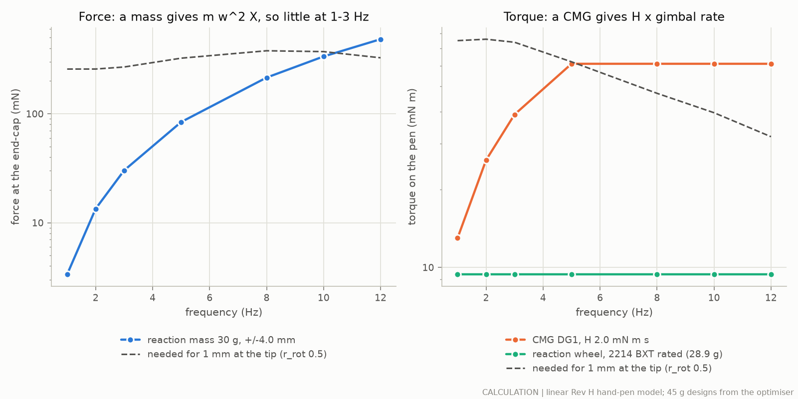
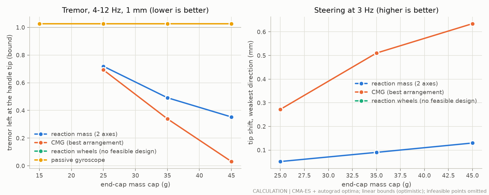
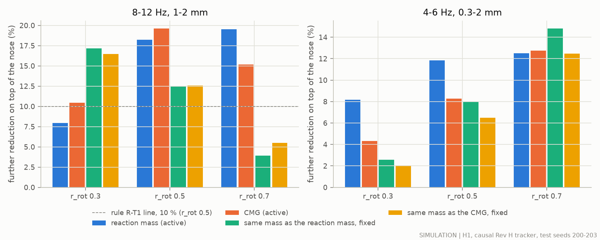
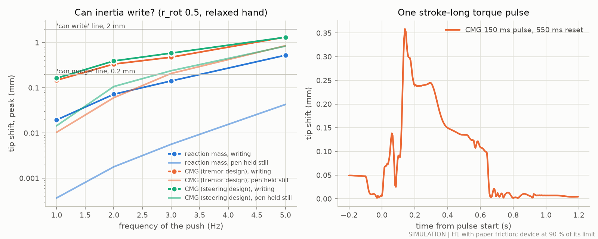
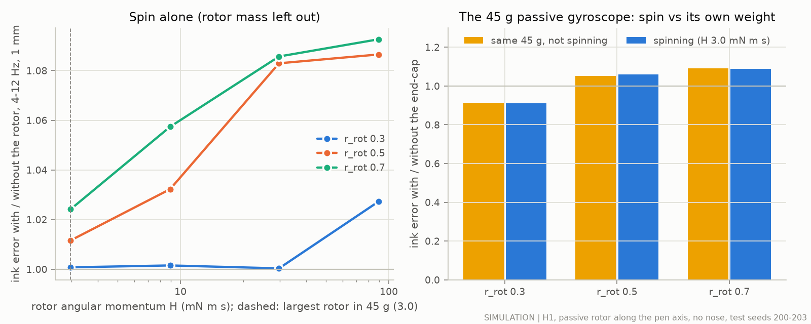
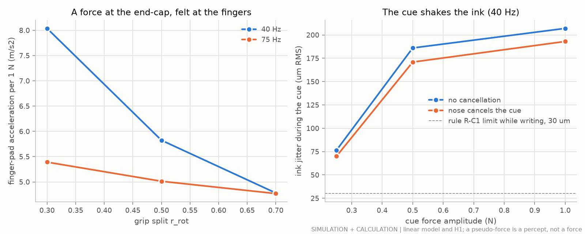
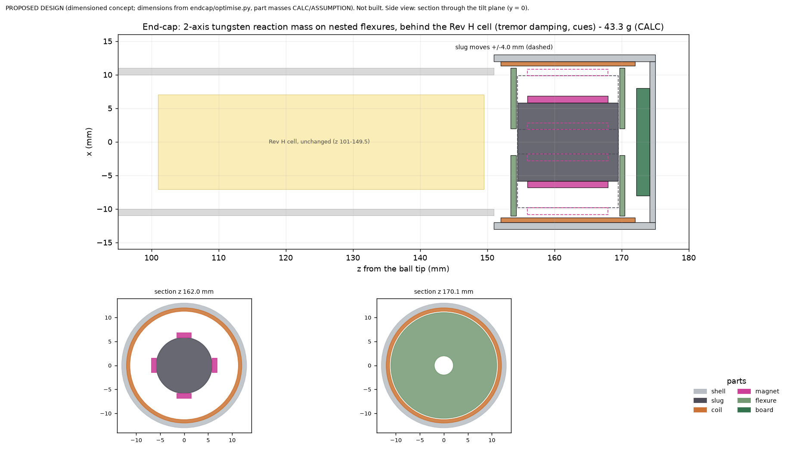

# Rev J study K: the inertial end-cap (what weight, spin and "pull" at the back of the pen can do)

**Status: calculation and simulation only, 2026-09-29.** Nothing here was built or measured on a pen or a person. Labels:
- **SIM**: an executed simulation (model H1, `sim/handpen`, read-only, extended in `endcap/sim.py`; synthetic writing and tremor);
- **CALC**: a calculation (closed-form laws in `endcap/scaling.py`, the linear hand-pen model in `endcap/linear_torch.py`, design models in `endcap/design.py`);
- **LIT (id)**: published literature, with its ledger id (proposed rows in `results/endcap/evidence_rows.csv`, or `docs/evidence.csv`);
- **MFR (id)**: a manufacturer statement, with its ledger id;
- **ASSUMPTION**: an input nobody has measured (listed in `endcap/params.py`, `LABELS`).

Numbers come from `results/endcap/endcap_study.json` (with its `stabpen.provenance` block) unless a ledger id is given.

## 1. The answer in plain words

- **The best system for the back of the pen is a two-axis tungsten reaction mass.** It is a 30 g slug that four coils push up to ±4 mm sideways. It sits in a 43 g end-cap behind the Rev H cell (PROPOSED DESIGN).
  - On top of the Rev H nose it removes a further 8 / 18 / 20 % of the ink error at 8–12 Hz, 1–2 mm (grip split r_rot 0.3 / 0.5 / 0.7; SIM, test seeds 200–203).
  - A control-moment gyroscope (CMG) did about as well (10 / 20 / 15 %). But it needs a hub motor that does not exist yet. It also brings a spinning rotor storing 3 J, a 466 Hz tone and 7.5–7.8 h of writing per charge.
  - The rules fixed before the test pick the reaction mass: the two were within 2 points, and the tie goes to the lower power.
- **Much of that benefit is just the weight.** The same 45 g fixed in place removes 17 / 12 / 4 %.
  - Moving the slug adds 6 points at r_rot 0.5 and 16 at 0.7, but loses 9 points at 0.3.
  - The fixed weight is also less reliable. It makes 29–42 % of the hard cases worse than the nose alone at r_rot 0.5–0.7; the moving slug makes 4–12 % worse (SIM).
  - How writers hold the pen decides whether the motion is worth it. That grip split has not been measured yet.
- **Inertia cannot write.** At writing speeds (1–3 Hz) the reaction mass moves the ink by at most 0.21 mm, and the best CMG by 1.06 mm. Half a letter is 2 mm (SIM, while writing, relaxed hand; rule R-S1).
  - Writing would need a steady 0.5 N or 150 mN m at the end-cap, before paper friction (CALC). That is 18–150 times what the 45 g slug can push, and 4–12 times what a 45 g CMG can twist.
  - At 5 Hz the CMG shakes the ink by 0.7–2.8 mm (1.3–1.8 mm at r_rot 0.5), but it cannot hold the ink anywhere: every push must be paid back.
  - Knowing the letters in advance does not help, because the limit is physical.
  - A bigger end-cap does not change this. At 90 g and 1 W the best reach at 3 Hz is 1.0 mm, in a model that is already optimistic (CALC).
- **Inertia can nudge and cue.**
  - A 150 ms pulse while writing shifts the ink by 0.2–0.6 mm, and the shift is gone once the slug or gimbal returns (SIM).
  - A CMG twist is a real torque. Healthy adults named its direction 99 % of the time in a 198 g device (LIT HAP-82).
  - The slug can also play an asymmetric "pull" of up to about 0.7 N (CALC). This is something the hand feels, not a force that moves the pen.
- **Spinning a rotor does not steady a pen.** Spinning the largest rotor that fits made the ink error 0.7 % larger than the same mass not spinning (rule R-G1 fails). Even 30 times more spin did not help (SIM).
  - The grip is stiff and the rotor small: the gyroscopic moment is only 2–11 % of the grip's stiffness, against about 60 % for a glove on the wrist (CALC, assumed glove rotor).
- **Pseudo-force cues are for pauses.**
  - A cue of the published kind (0.5 N, 40 Hz) shakes the ink by 186 µm RMS while writing (SIM); the rule allows 30 µm.
  - People need 0.33 s or more to respond (LIT HAP-84), while a stroke lasts 0.09–0.15 s (LIT CON-24).
  - The only patient study found reports near-chance direction on sides with tremor (LIT PDT-39, preprint).
- **Reaction wheels, propellers and weight-shifting are ruled out.**
  - No pair of reaction wheels fits the bore within 0.3 W. The strongest catalogue wheel motor gives 9.4 mN m for 3.3 W of heat (MFR AMF-123, CALC).
  - A 22 mm fan gives about 27 mN at 0.5 W. It would need 41–44 W to move the ink 2 mm at 1–3 Hz (CALC).
  - Sliding 30 g by 4 mm tilts the pen by about 0.8 mN m, which moves the ink about 12 µm (CALC).
- **Packaging, weight and power.**
  - The brief's 45 mm slot would leave the Rev H cell no room. The proposed 24 mm end-cap behind the cell solves this (section 13), and the simulated benefit barely changes (17.8 against 18.2 %, SIM).
  - The pen then weighs about 115 g (limit 120 g), and its balance point moves 24 mm toward the back (CALC).
  - The brief's 0.3 W average does not give 8 h on the Rev H cell: 8 h allows only 0.197 W for the end-cap. The reaction mass needs 0.03–0.15 W; the CMG needs 0.20–0.21 W.

## 2. Main results

### 2.1 The main numbers

These are the best 45 g designs (section 4), run in H1 on test seeds 200–203 unless labelled CALC.
- "Further reduction" is the extra cut in the RMS ink error on top of the Rev H nose (positive = better).
- The three numbers in a cell are for the grip splits r_rot 0.3 / 0.5 / 0.7.

| | Reaction mass (recommended) | CMG, one rotor, hub motor | Same mass, fixed | Passive gyroscope | Label |
|---|---|---|---|---|---|
| Further reduction, 8–12 Hz, 1–2 mm | +8 / +18 / +20 % | +10 / +20 / +15 % | +17 / +12 / +4 % (45 g) | spin: 0.7 % worse than not spinning | SIM |
| Further reduction, 4–6 Hz, 0.3–2 mm | +8 / +12 / +12 % | +4 / +8 / +13 % | +3 / +8 / +15 % | – | SIM |
| Further reduction, 0.3 mm, 4–12 Hz | +13 / +18 / +15 % | +15 / +18 / +13 % | +14 / +11 / +6 % | – | SIM |
| Share of 8–12 Hz, 1–2 mm cases made worse than the nose alone (r_rot 0.5 / 0.7) | 12 / 4 % | 8 / 17 % | 29 / 42 % | – | SIM |
| Rule R-T1 (worth fitting for tremor) | pass | pass | (comparator) | R-G1 fails | SIM |
| Peak ink shift while writing, r_rot 0.5, at 1 / 3 / 5 Hz | 0.02 / 0.14 / 0.53 mm | 0.15 / 0.47 / 1.33 mm | – | 0 | SIM |
| Largest shift at 1–3 Hz (any split, direction) | 0.21 mm: "can nudge" | 0.88 mm (steering design 1.06 mm): "can nudge" | – | – | SIM (rule R-S1: write ≥ 2 mm) |
| Mass | 45.0 g (43.3 g packed behind the cell) | 39.9 g | 45.0 g | 44.7 g | CALC |
| Average power: design model / test runs | 0.145 / 0.029 W | 0.204 / 0.214 W (0.20 W is spin) | 0 | 0.091 W | CALC / SIM |
| Writing time on the Rev H cell (8 h target) | 9.8 h (design) to 20 h (test runs) | 7.5–7.8 h | 27 h | 13 h | CALC |
| Stored energy, spin-up, tone | none | 3.0 J, 8.1 s, 466 Hz | none | 2.2 J, 10 s, 237 Hz | CALC |
| Whole pen with this end-cap | 115 g, balance point z 117 mm (Rev H: 75 g, 93 mm) | – | as the reaction mass | – | CALC |

**Comparison with Rev H.** The Rev H rear module (a 19.8 g slug, 27.8 g in all; DEC-033) added 6 / 17 / 17 % at 8–12 Hz, 1–2 mm (SIM, `docs/opt_inertial.md` §6.2). That run used the same model, tracker and test seeds. In both studies the nose alone leaves 0.64 / 0.70 / 0.76 of the ink error there.

## 3. The physics: what each option can make

### 3.1 What the pen needs

The linear hand-pen model says how far the ink moves for a push at the end-cap (CALC, `endcap/linear_torch.py`: Rev H pen, H1 grip calibrated to HAP-26, relaxed hand, no paper friction; end-cap centre at z 152.5 mm):

| Push at the end-cap | 1 Hz | 3 Hz | 5 Hz | 8 Hz | 12 Hz |
|---|---|---|---|---|---|
| Ink motion per 1 N of force (mm), r_rot 0.5, weaker direction (in the tilt plane) | 3.9 | 3.7 | 3.1 | 2.6 | 3.1 |
| Ink motion per 1 mN m of torque (µm), r_rot 0.5, weaker direction | 13.3 | 13.5 | 16.1 | 21.3 | 31.3 |
| Torque, r_rot 0.3 to 0.7 (µm per mN m, weaker direction) | 7.9–18.8 | 7.8–19.6 | 8.9–24.4 | 10.6–35.0 | 13.3–51.4 |

- So moving the ink **2 mm at 3 Hz needs about 0.54 N at the end-cap, or about 150 mN m of torque** (CALC, r_rot 0.5).
- These are optimistic. Paper friction and a firmer hand make the need larger (see section 6).

### 3.2 Scaling laws

All laws are in `endcap/scaling.py` (CALC). ω = 2πf is the push frequency.

| Option | What it makes | Law | Grows with | Main costs |
|---|---|---|---|---|
| **Linear reaction mass** (a slug moved sideways by coils) | a real force | net force F = η·m·ω²·X at most (stroke-limited), and the coil must also carry the flexure: coil force = X·√((k − m·ω²)² + (c·ω)²) ≤ K_m·√P (η 0.7 ASSUMPTION; k, c: the flexure) | mass × stroke × f² | stroke room; flexure; coil heat |
| **Control-moment gyroscope (CMG)** (a spinning rotor tilted by a gimbal motor) | a real torque | τ = k·H·min(δ̇_max, ω·δ_max), with H = J·ω_spin ∝ density × thickness × D⁴ × rpm | rotor size⁴ × speed; f only below the corner | spin power; stored energy; tone; spin-up time; the gimbal angle runs out |
| **Reaction wheel** (a rotor sped up and slowed down) | a real torque | τ ≤ the motor's torque | motor size | copper heat grows with τ² |
| **Passive gyroscope** (a spinning rotor, no gimbal motor) | resistance to turning | stiffening ratio = H·ω / K_rot | H × f | as a CMG, with no control |
| **Asymmetric vibration** ("pseudo-force") | a feeling of a pull | mean force = 0 | – | shakes the pen and the ink |
| **Propeller** (limiting case) | a real force | T = (2ρA)^⅓·(FM·η·P)^⅔ (FM 0.5, η 0.6 ASSUMPTION) | power^⅔ | noise; air blast; weak |
| **Weight shift** (a mass slid slowly) | a steady torque | τ = m·g·Δx | mass × travel | slow |

Two further limits (CALC):
- **One push, no return.** The pen and hand cannot move their shared centre of mass by pushing on themselves. Moving 30 g by 8 mm shifts a 330 g pen-plus-hand by at most 0.67 mm (a free 120 g pen by 1.6 mm). And the mass must come back.
- **A CMG runs out of angle.** One rotor can give an impulse of at most 2·H·sin δ_max per swing. Then the gimbal must swing back, which gives the opposite torque unless it returns slowly (Walker 2018 used a 150 ms push and a 550 ms return; LIT HAP-82). This is "gimbal saturation" and "momentum management".

### 3.3 Scale at a glance (CALC, stage `scaling`)

- **Reaction mass, 30 g × ±3.5 mm:** 2.9 mN at 1 Hz, 26 mN at 3 Hz, 73 mN at 5 Hz; 0.19 N at 8 Hz, 0.42 N at 12 Hz. The force falls as f². Writing needs about 0.5 N.
- **CMG pair, H 1.2 mN m s each:** 15 mN m at 1 Hz, 45 mN m at 3 Hz, 72 mN m from 5 Hz up (angle-limited below about 4 Hz). Writing needs about 150 mN m.
- **Reaction wheel:** 0.89 mN m (0824 B, rated; MFR AMF-120) to 9.4 mN m (2214 BXT, rated, 28.9 g; MFR AMF-123). A small wheel also runs out of speed at low frequency: with 1.5 g cm² and ±3000 rpm (ASSUMPTION) the 2214 BXT gives only 3.0 mN m at 1 Hz. Holding 9.4 mN m costs about 3.3 W of copper heat (CALC: the listed 1.16 A through 2.42 Ω, AMF-123). Far too weak and too hungry.
- **Propeller:** about 27 mN per 22 mm fan at 0.5 W; 0.1 N needs about 3.5 W. Far too weak, loud and windy.
- **Weight shift:** 30 g moved 4 mm gives 0.76–0.90 mN m. That moves the ink about 12 µm.
- **Passive rotor 3 mN m s:** stiffening ratio H·ω/K_rot is 2.6 % at 4 Hz and 7.9 % at 12 Hz (r_rot 0.5). For a glove on the wrist (K 1.3 N m/rad, LIT HAP-32; H 0.03 N m s, ASSUMPTION) it is 0.58 at 4 Hz. Gyroscopic stiffening needs about 20 times more momentum than a pen can carry.

### 3.4 Ceilings of the two 45 g designs (CALC)

Sustained sine pushes at each device's limit, and the ink motion they would cause in the linear model (r_rot 0.5, relaxed hand, no paper friction: optimistic). Designs from section 4. `fig_ek_ceiling.png` plots them.

| Push frequency | Reaction mass (30.4 g moving, ±4.0 mm): net force → ink | CMG (one Ø15.8 mm rotor, H 2.04 mN m s, ±58°): torque → ink | Reaction wheel (2214 BXT at its rated 9.4 mN m, wheel speed not limiting; MFR AMF-123) |
|---|---|---|---|
| 1 Hz | 3.4 mN → 0.013 mm | 13 mN m → 0.17 mm | 9.4 mN m → 0.13 mm, but 3.3 W |
| 2 Hz | 13 mN → 0.05 mm | 26 mN m → 0.34 mm | → 0.12 mm |
| 3 Hz | 30 mN → 0.11 mm | 39 mN m → 0.53 mm | → 0.13 mm |
| 5 Hz | 84 mN → 0.26 mm | 61 mN m → 0.98 mm | → 0.15 mm |
| 8 Hz | 0.21 N → 0.57 mm | 61 mN m → 1.30 mm | → 0.20 mm |
| 10 Hz | 0.34 N → 0.90 mm | 61 mN m → 1.55 mm | → 0.24 mm |
| 12 Hz | 0.48 N → 1.48 mm | 61 mN m → 1.91 mm | → 0.29 mm |

- The reaction mass is strong only at tremor frequencies. Its force falls as f² below them.
- The CMG's torque is flat above its corner (4.7 Hz for this design) and falls as f below it. One gimbal swing gives at most 3.5 mN m s of twist, then it must swing back (CALC).
- Even these optimistic ceilings are 4–150 times short of the 2 mm "writing" line at 1–3 Hz. Section 6 shows what H1 (with paper friction) gives.




## 4. Optimising the end-cap (CALC)

### 4.1 What was optimised

Four device classes were sized inside the envelope: Ø26 mm × 45 mm, 1 mm PEEK wall, ≤ 45 g, ≤ 1 W peak, ≤ 0.3 W average (targets from the brief; treated as hypotheses).
- **Reaction mass (LRM2):** a tungsten slug (diameter, length) on two spiral flexure plates, pushed in two axes by four thin coils lining the bore (coil thickness). The stroke is the free gap, at most ±4 mm (flexure limit, ASSUMPTION). Flexure tuned to 5 Hz.
- **CMG:** five arrangements × five spin motors, with rotor diameter, thickness, speed and gimbal range.
  - SP2: two scissored pairs (4 rotors); SP1: one pair (one axis); DG1: one rotor on a double gimbal; DG2: two counter-spinning rotors on double gimbals (as Walker 2018, LIT HAP-82); PL2: a pair with gimbals about the pen axis.
  - Motors: Faulhaber 0308, 0515, 0620, 0824 B (MFR AMF-50, AMF-51, AMF-78, AMF-120), or "INT": a motor built into the rotor hub (the outrunner casing is the flywheel, as in HAP-82; mass and size ASSUMPTION, constants of the 0620 B).
- **Reaction wheels (RW2):** two tungsten-rim wheels on catalogue motors (0824 B, 1226 B, 1509 B, 2610 B, 2214 BXT; MFR).
- **Passive gyroscope (PG):** a rotor spinning along the pen axis, no gimbal motor.

Constraints: mass cap (15, 25, 35 or 45 g); average power (spin plus actuation at 10 Hz, 1 mm) ≤ 0.3 W; peak ≤ 1 W; fit (length, and the swept radius of the tilting rotor, motor and gimbal rings); ≤ 40 000 rpm (about half the 618/4 bearing's listed limit, AMF-126); spin-up ≤ 10 s; stored energy ≤ 3 J; parts ≥ 1 mm thick. The last three are ASSUMPTION safety and usability caps.

Objectives (linear model, `endcap/optimise.py`):
- **tremor:** tremor left at the handle tip when the device cancels as much as it can within its limits, knowing the tremor exactly (a capped least-squares input), mean over r_rot 0.3/0.5/0.7 and 4, 6, 8, 10, 12 Hz at 1 mm. It is optimistic against any real (causal) controller;
- **steer:** tip motion at 3 Hz in the weakest direction, at the device's limit;
- **H:** the largest rotor momentum (passive gyroscope).

### 4.2 Method, and why

- **CMA-ES** (a derivative-free evolution strategy; `endcap/cmaes.py`; 2 restarts × 400 evaluations per case). It handles the discrete choices (arrangement, motor) as rounded coordinates and the non-smooth "weakest direction" minima.
- **Autograd (Adam)** through the differentiable linear model (`endcap/linear_torch.py`, PyTorch complex arithmetic; its gradient matched central differences to 1e-9). It starts from the CMA-ES optimum plus 2 random starts and keeps the best feasible point. It refines the continuous sizes; it cannot pick motors.
- **Not Bayesian optimisation.** One evaluation takes milliseconds, so BO's sample efficiency buys nothing, and BO handles the mixed discrete choices less naturally than CMA-ES.
- The designs carried into H1 are, at 45 g, the better of the CMA-ES and autograd results.

### 4.3 Results (CALC, linear bounds)

"Tremor left" is what the device leaves at the handle tip when it knows the tremor exactly (mean over 4–12 Hz, 1 mm, three splits; 1 = no change, lower is better). "Reach" is the ink motion at 3 Hz in the weakest direction (higher is better). Both assume perfect knowledge of the tremor and a relaxed hand, so they are optimistic. `fig_ek_pareto.png` plots them.

| Device class | 15 g | 25 g | 35 g | 45 g |
|---|---|---|---|---|
| Reaction mass: tremor left | does not fit | 0.72 | 0.49 | **0.35** |
| Reaction mass: reach at 3 Hz | – | 0.05 mm | 0.09 mm | **0.13 mm** |
| CMG: tremor left | does not fit | 0.69 (two rotors, 0308 B) | 0.34 (planar pair, hub motor) | **0.031** (one rotor, double gimbal, hub motor) |
| CMG: reach at 3 Hz | – | 0.27 mm | 0.51 mm | **0.63 mm** |
| Reaction wheels | no feasible design at any cap (the motors that fit across the bore need > 0.3 W; tremor left 1.05, worse than nothing) | | | |
| Passive gyroscope | tremor left 1.03 at its lightest (10.9 g); the largest rotor that fits 45 g (H 2.97 mN m s) leaves 1.17: worse than nothing, because of its weight | | | |

Values at 25 and 45 g are the better of CMA-ES and autograd; at 15 and 35 g CMA-ES only. The separate per-arrangement run below found a slightly better CMG (0.025); the design carried into H1 is the 0.031 one from the main front. The difference is small next to the tracker limit of section 5.



**CMG arrangements at 45 g** (CMA-ES, best motor for each):

| Arrangement | Tremor left | Reach at 3 Hz | Momentum per rotor | Why |
|---|---|---|---|---|
| SP2, two scissored pairs (4 rotors) | 0.99 | 0.03 mm | 0.11 mN m s | four small rotors: momentum grows with D⁴, so splitting it kills it |
| SP1, one scissored pair (1 axis) | 0.68 | 0.00 mm (other axis) | 0.79 mN m s | only one axis |
| **DG1, one rotor on a double gimbal** | **0.025** | **0.67 mm** | **2.0 mN m s** | one big rotor serves both axes; but its momentum is not cancelled |
| DG2, two counter-spinning rotors (Walker 2018 style) | 0.062 | 0.57 mm | 0.87 mN m s | no net momentum (no twist when the pen is turned), at about half the rotor size |
| PL2, planar pair (gimbals about the pen axis) | 0.18 | 0.19 mm | 1.07 mN m s | limited to ±0.5 rad by the bore |

- **The best CMG is one rotor on a double gimbal with the motor built into its hub.** A catalogue spin motor (8–24 mm long) sticks out of the rotor and sweeps a large radius when the rotor tilts, which the 24 mm bore does not allow at large gimbal angles; a 3 mm hub motor (ASSUMPTION, like HAP-82's outrunner-casing flywheels) avoids that. **With catalogue motors only** (no hub motor; CALC, stage `offshelf`), the best 45 g CMG is two counter-spinning rotors on Faulhaber 0308 B motors: tremor left 0.70 and reach 0.08–0.11 mm at 3 Hz, for 33 g and 0.17–0.21 W. So the CMG's strength in this study rests on the hub-motor concept, which does not exist yet.
- **Gradient vs derivative-free.** Autograd improved the CMA-ES CMG optimum at 45 g from 0.086 to 0.031 and at 25 g from 0.75 to 0.69; it matched CMA-ES for the reaction mass (0.353 both). CMA-ES is needed to choose motors and arrangements; autograd polishes the sizes.
- **A stiffer hand (×2)** leaves the reaction mass's tremor bound about the same (0.35 → 0.36) but cuts its reach from 0.13 to 0.05 mm; the CMG's reach falls from 0.63 to 0.28 mm (CALC).
- **A fixed weight** (no motion) in the end-cap, linear model without the nose: 45 g leaves 0.97 / 0.75 / 0.63 / 1.64 / 2.19 of the tremor at 4 / 6 / 8 / 10 / 12 Hz (r_rot 0.5). It helps below the hand–pen resonance and amplifies above it (CALC). A passive tuned-mass damper (30 g slug on a spring tuned to 6, 8 or 10 Hz, damping ratio 0.1, plus 8 g of frame) helps in a band below its tuning and amplifies at and above it: tuned to 8 Hz at r_rot 0.5 it leaves 0.56 at 6 Hz but 1.30–1.49 at 8–12 Hz (CALC). A passive damper cannot cover 4–12 Hz; that is why the reaction mass is driven.

### 4.4 Would a bigger end-cap change the answer? (CALC, stage `budgets`)

Envelopes of 60 and 90 g with 1 W average and 60 mm length, against the brief's 45 g. Each cell is the best of two CMA-ES runs and an Adam run started from the 45 g design (linear bounds, as in 4.3). In brackets: the mass and average power the optimum actually uses.

| Envelope (1 W peak in all) | Reaction mass: tremor left | Reaction mass: reach at 3 Hz | CMG: tremor left | CMG: reach at 3 Hz |
|---|---|---|---|---|
| 45 g, 0.3 W average, 45 mm (the brief) | 0.35 | 0.13 mm | 0.031 | 0.63 mm |
| 60 g, 1 W average, 60 mm | 0.26 (60 g, 0.25 W) | 0.19 mm (60 g) | 0.012 (57 g, 0.26 W; DG2/INT) | 0.87 mm (58 g) |
| 90 g, 1 W average, 60 mm | 0.23 (72 g, 0.34 W) | 0.35 mm (90 g) | 0.003 (66 g, 0.25 W; DG2/INT) | 1.02 mm (73 g) |

- **Tremor bounds improve with size** (reaction mass 0.35 → 0.23; CMG 0.031 → 0.003). In H1, though, the causal tracker limits the benefit, not the hardware: with perfect knowledge of the tremor the 45 g devices would already leave 0.31–0.39 against about 0.70 (section 5.3).
- **Reach does not come close to writing.** At 90 g the best reach at 3 Hz is 0.35 mm (reaction mass) and 1.02 mm (CMG). The 2 mm line is still out of reach, and H1 with paper friction gave 1.1–1.9 times less than this linear model at 1–3 Hz (section 6). A larger budget does not change the answer.
- At 60 and 90 g the best CMG changes to two counter-spinning rotors (DG2): more room lets it carry two large rotors instead of one.

## 5. Tremor on top of the Rev H nose (SIM)

### 5.1 Set-up

- **Model.** H1 is the project's hand–pen simulator (`sim/handpen`, used through `opt/inertial`; both read-only): a rigid Rev H pen that can tilt in a two-zone grip whose stiffness and damping are calibrated to a measured stylus-hand model (LIT HAP-26), a hand mass on an arm spring, LuGre paper friction at the skid and the ball, the Rev H nose as a ±3 mm stage with an 80 Hz servo, synthetic writers and tremor. The end-cap device is added at z 152.5 mm with its full mass.
- **Cascade (as in the Rev H study).** The Rev H tracker (ParEGO setting, `results/opt/inertial_tracker_revh.json`) estimates the tremor on the pen. The end-cap's feed-forward pushes against it. The tracker re-estimates on the resulting motion. The nose corrects what is left.
- **Feed-forward.** The phasor inverse of the linear model at r_rot 0.5 (the controller does not know the true split), capped at 70 % of the device's limit. For the reaction mass the cap is flexure-aware (section 13); for the CMG it is 70 % of 2H'·min(rate, ω·δ).
- **Devices.** The 45 g optima of section 4: the reaction mass and the CMG. **Comparators:** the nose alone; the same total mass fixed in the end-cap.
- **Tuning (seeds 300–303 only).** Feed-forward gain 0.5, 0.75 or 1.0, chosen by rule at r_rot 0.5, 6–12 Hz × 1–2 mm.
- **Test (seeds 200–203).** r_rot 0.3 / 0.5 / 0.7 × 4, 6, 8, 10, 12 Hz × 0.3, 1, 2 mm of translational tremor (180 runs per device), plus wrist tremor at 8 Hz, 1 mm; false correction on tremor-free writing; an oracle with perfect knowledge (iterative learning control).
- **Metric.** RMS ink error against the same pen's tremor-free trace, divided by the uncorrected Rev H pen's error ("ratio"; lower is better). "Further reduction" = 1 − (nose + device) / (nose alone).
- **Rules, fixed before the test runs** (`endcap/run_study.py`, `RULES`; time stamps in the results JSON):
  - R-T1: a device is worth fitting for tremor if it adds ≥ 10 % further reduction at 8–12 Hz × 1–2 mm at r_rot 0.5, ≥ 5 % at 0.3 and 0.7, makes no split worse on average, and fits 45 g / 0.3 W.
  - R-T2: rank passing devices by the reduction at r_rot 0.5; within 2 points, the lower power, then the lower mass.
  - R-D1: recommend the best R-T1 device; if none passes, choose the end-cap for its other uses against its costs.

### 5.2 Tuning (seeds 300–303 only)

Further reduction at 8–12 Hz, 1–2 mm, r_rot 0.5, for each feed-forward gain (SIM):

| Gain | 0.5 | 0.75 | 1.0 | Chosen by the rule |
|---|---|---|---|---|
| Reaction mass | 17.6 % | 20.2 % | 19.3 % | 0.75 |
| CMG | 16.3 % | 18.3 % | 19.0 % | 0.75 (1.0 is within 1 point, so the lower gain wins) |

The gains were fixed at 00:21 UTC and the test runs started at 00:28 UTC (time stamps in the results JSON).

### 5.3 Results on the test seeds (SIM, seeds 200–203)

Each cell gives the ink error as a ratio of the uncorrected Rev H pen's error (lower is better). In brackets is the further reduction against the nose alone:

| Tremor | r_rot | Nose alone | Nose + reaction mass | Nose + CMG | Nose + 45 g fixed weight | Nose + 39.9 g fixed weight |
|---|---|---|---|---|---|---|
| 8–12 Hz, 1–2 mm | 0.3 | 0.644 | 0.596 (+8 %) | 0.581 (+10 %) | 0.542 (+17 %) | 0.546 (+16 %) |
|  | 0.5 | 0.705 | 0.579 (+18 %) | 0.567 (+20 %) | 0.618 (+12 %) | 0.617 (+13 %) |
|  | 0.7 | 0.765 | 0.612 (+20 %) | 0.646 (+15 %) | 0.729 (+4 %) | 0.717 (+5 %) |
| 4–6 Hz, 0.3–2 mm | 0.3 | 0.992 | 0.911 (+8 %) | 0.949 (+4 %) | 0.966 (+3 %) | 0.971 (+2 %) |
|  | 0.5 | 1.007 | 0.887 (+12 %) | 0.923 (+8 %) | 0.927 (+8 %) | 0.941 (+6 %) |
|  | 0.7 | 0.998 | 0.872 (+12 %) | 0.871 (+13 %) | 0.850 (+15 %) | 0.873 (+12 %) |
| 0.3 mm, 4–12 Hz | 0.3 | 0.937 | 0.821 (+13 %) | 0.801 (+15 %) | 0.814 (+14 %) | 0.825 (+12 %) |
|  | 0.5 | 0.962 | 0.794 (+18 %) | 0.788 (+18 %) | 0.852 (+11 %) | 0.855 (+11 %) |
|  | 0.7 | 0.980 | 0.836 (+15 %) | 0.849 (+13 %) | 0.924 (+6 %) | 0.923 (+6 %) |
| All 45 conditions | 0.3 | 0.834 | 0.755 (+9 %) | 0.751 (+10 %) | 0.746 (+12 %) | 0.753 (+11 %) |
|  | 0.5 | 0.872 | 0.734 (+16 %) | 0.735 (+16 %) | 0.780 (+11 %) | 0.785 (+10 %) |
|  | 0.7 | 0.898 | 0.759 (+16 %) | 0.777 (+14 %) | 0.829 (+7 %) | 0.831 (+7 %) |

- **Check against Rev H.** The nose alone gives 0.644 / 0.705 / 0.765 at 8–12 Hz, 1–2 mm. The Rev H study gave 0.64 / 0.70 / 0.76 (`docs/opt_inertial.md` §6.2), so this study reproduces its model chain. The Rev H 28 g module added 6 / 17 / 17 % there; this 45 g reaction mass adds 8 / 18 / 20 %.
- **Spread over the four test seeds** (8–12 Hz, 1–2 mm), at r_rot 0.3 / 0.5 / 0.7:
  - reaction mass: +4 to +11 %, +11 to +24 % and +12 to +25 %;
  - CMG: +6 to +13 %, +13 to +26 % and +12 to +21 %.
  - The two devices overlap everywhere.
- **The fixed weight is the key comparator.** The same mass, not moving, adds +17 / +12 / +4 %.
  - So the *motion* of the reaction mass adds −9, +6 and +16 points at r_rot 0.3 / 0.5 / 0.7. At r_rot 0.3 a plain weight does better than the driven slug.
  - The weight is less reliable. On top of the nose it makes 8 / 29 / 42 % of the 8–12 Hz, 1–2 mm cases worse than the nose alone; the driven slug makes 4 / 12 / 4 % worse.
  - Without the nose, the weight raises tremor at r_rot 0.7 (ratio 1.27): the hand–pen resonance moves into the tremor band, as in the Rev H study.
- **By frequency** (r_rot 0.5, 1–2 mm), the further reduction at 4 / 6 / 8 / 10 / 12 Hz is:
  - reaction mass: 6 / 17 / 17 / 31 / 7 %;
  - CMG: 3 / 14 / 27 / 29 / 3 %;
  - the 45 g weight: 3 / 12 / 26 / 20 / −9 %.
- **Parkinson's range (4–6 Hz):** the nose alone does nothing there (0.99–1.01). The end-cap adds 8–12 % (reaction mass) and 4–13 % (CMG), which is modest.
- **Wrist tremor** (8 Hz, 1 mm, mean of the three splits): the nose alone leaves 0.777. The reaction mass brings this to 0.615 and the CMG to 0.600; the fixed weights reach 0.641 and 0.649.
- **With perfect knowledge of the tremor** (iterative learning, device alone, no nose; 8–12 Hz, 1 mm, r_rot 0.5): the reaction mass would leave 0.39 and the CMG 0.31. The causal feed-forward alone leaves about 0.70. As in Rev H, the tracker is the limit, not the hardware.
- **False correction on tremor-free writing** (nose + device, r_rot 0.5):
  - lognormal writers (test seeds): 11 µm RMS with the reaction mass and 11 µm with the CMG;
  - glyph writers (seeds 210–213): 20 µm and 23 µm, with one writer at 39–42 µm.
- **Stroke, gimbal angle and power.**
  - The slug's peak excursion had a median of 1.7 mm. In 39 of the 180 test cases it reached its ±4 mm stops, mostly at 10–12 Hz and at 6 Hz with 2 mm of tremor, so soft end-stops are needed.
  - The CMG's gimbals peaked at a median of 0.09 rad. They reached their ±1.01 rad stops only at 12 Hz, 2 mm.
  - Actuation power: the reaction mass used 0.029 W on average (0.098 W at most), including 0.012 W for drivers and sensors (ASSUMPTION). The CMG used 0.014 W for its gimbals, plus 0.20 W of spin.



### 5.4 Verdict by the rules

- **R-T1 (worth fitting for tremor):** the reaction mass **passes** (8 / 18 / 20 %, no split worse on average, 0.145 W). The CMG **passes** too (10 / 20 / 15 %, 0.204 W).
- **R-T2 (ranking):** the CMG is 1.4 points ahead at r_rot 0.5 (19.6 against 18.2 %). That is within 2 points, so the tie goes to the lower average power: **the reaction mass** (0.145 against 0.204 W).
- **R-D1:** recommend the reaction-mass end-cap for tremor.
- **A correction, disclosed.** The first version of the ranking code rounded the reductions into 2-point bins. That would have picked the CMG (bins 10 against 9). The rule written before the test says "ties within 2 points", so I corrected the code to match the text before writing this report. The rule text itself did not change.

## 6. Can inertia write? (SIM, CALC)

### 6.1 Set-up

- H1 with paper friction, the Rev H pen with the nose held, the relaxed HAP-26 hand.
- Each 45 g device is driven open-loop with a sine at 90 % of its limit, at 1, 2, 3 and 5 Hz, for 3 s, along one axis (in the tilt plane, or sideways), while a synthetic writer writes (test seeds 200–203) or holds the pen still on the paper.
- For the reaction mass, "its limit" is the coil force that swings the slug through 90 % of its stroke on its flexure; the net push on the pen is then about 0.9·m·ω²·X.
- Measured: the ink's displacement caused by the device (the difference to the same run without the command), as the amplitude in a band around f and as the peak.
- Variants: a ×2 stiffer hand; the writer's visual correction (a loop with a 1 Hz crossover and 0.12 s delay, ASSUMPTION); single stroke-long pulses (CMG: a 150 ms swing across the gimbal range and a 550 ms return, as in LIT HAP-82; reaction mass: a push-pull across the stroke in 150 ms). Before a CMG pulse the gimbal is moved slowly to one end of its range; that move shifts the ink by about 0.05 mm and is not counted.
- Rule R-S1 (fixed before the runs): "can write" = ≥ 2 mm peak at 1–3 Hz (half a 4 mm letter), repeatable, with the relaxed hand while writing; "can nudge" = ≥ 0.2 mm; below that, a cue at most.

### 6.2 Results (SIM, test seeds 200–203)

The table gives the peak ink shift that each device causes while a synthetic writer writes (mean over the four seeds). Each cell gives a push in the tilt plane / a push sideways, at r_rot 0.5 unless stated:

| Device (45 g designs) | 1 Hz | 2 Hz | 3 Hz | 5 Hz | Largest at 1–3 Hz, any split and direction |
|---|---|---|---|---|---|
| Reaction mass (net push about 0.9·m·ω²·X) | 0.02 / 0.03 mm | 0.07 / 0.09 mm | 0.14 / 0.20 mm | 0.53 / 0.59 mm | 0.21 mm (r_rot 0.7, sideways, 3 Hz) |
| CMG, tremor design (H 2.04 mN m s, ±58°) | 0.15 / 0.19 mm | 0.33 / 0.40 mm | 0.47 / 0.65 mm | 1.33 / 1.78 mm | 0.88 mm (r_rot 0.7, sideways, 3 Hz) |
| CMG, steering design (H 1.97 mN m s, ±67°) | 0.16 / 0.21 mm | 0.39 / 0.49 mm | 0.58 / 0.78 mm | 1.31 / 1.76 mm | 1.06 mm (r_rot 0.7, sideways, 3 Hz) |

- **No device reaches the 2 mm "can write" line at 1–3 Hz**, at any grip split or direction.
  - By rule R-S1 all three **can nudge** (≥ 0.2 mm).
  - The CMG nudges by up to 0.9–1.1 mm. The reaction mass only just passes the line (0.21 mm in its best case).
- **At 5 Hz, the top of the writing band, the CMG gets close:** 1.3–1.8 mm at r_rot 0.5, and 0.7–2.8 mm over all splits and directions (2.8 mm sideways at r_rot 0.7).
  - But this is a steady 5 Hz wobble, not a letter. The gimbal must swing back every half-cycle, and the push cannot hold the ink anywhere.
- **Holding still is harder.** With the ball stuck on the paper, the same pushes move the ink much less at 1–3 Hz: at most 0.02 mm for the reaction mass and 0.01–0.48 mm for the CMG. Static friction holds the tip.
- **A firmer hand halves the shift or more.** With a ×2 stiffer hand (r_rot 0.5, writing) the shift at 1 / 2 / 3 / 5 Hz is:
  - reaction mass: 0.01 / 0.03 / 0.06 / 0.18 mm;
  - CMG: 0.08 / 0.13 / 0.24 / 0.44 mm.
- **The writer's own visual correction did not cancel the push.** It was modelled as a 1 Hz loop with a 0.12 s delay (ASSUMPTION). Near its crossover it amplified the push: the CMG at 1 Hz went from 0.15 to 0.46 mm, and the reaction mass at 3 Hz from 0.14 to 0.25 mm. Either way, the shift stays far from 2 mm.
- **One stroke-long pulse** (150 ms) while writing, at r_rot 0.3 / 0.5 / 0.7:
  - the CMG (a full gimbal swing, then a 550 ms return as in HAP-82) moves the ink by 0.23 / 0.36 / 0.54 mm;
  - the reaction mass (a push-pull across its stroke) moves it by 0.38 / 0.41 / 0.46 mm.
  - After the return the ink is back within 0.005 mm: the push is lent, not given.
  - Holding still, a pulse can leave the pen up to 0.19 mm off (the tip slips, then sticks).
- **H1 against the linear model.** Per unit push, H1 with paper friction gave 1.1–1.9 times less motion than the frictionless linear model at 1–3 Hz, for both devices. So the linear ceilings of sections 3–4 are optimistic. At 5 Hz the CMG matched the linear model (ratio 0.98), and the reaction mass gave 1.6 times less.
- **Knowing the letters in advance does not help.** These runs already give each device the ideal command at its limit.



## 7. Gyroscopic stiffening (SIM, CALC, LIT)

### 7.1 Set-up

- A passive rotor spins along the pen axis in the end-cap. No gimbal motor. It resists turning of the pen with a torque H × Ω.
- H1 runs (test seeds 200–203, r_rot 0.3 / 0.5 / 0.7, 4 / 8 / 12 Hz at 1 mm, and wrist tremor at 8 Hz), without the nose and with it:
  - the largest rotor that fits 45 g (section 4), spinning;
  - the same mass not spinning (rule R-G1 compares these two);
  - "massless" rotors with 1, 3, 10 and 30 times its momentum, to see what spin alone could do.
- Rule R-G1 (fixed before the runs): a passive rotor is useful if spin lowers the ink error by ≥ 10 % at 4–12 Hz, 1 mm, r_rot 0.5, against the same mass without spin.

### 7.2 Results (SIM, test seeds 200–203)

Each cell gives the ink error as a ratio of the uncorrected Rev H pen's error, averaged over 4, 8 and 12 Hz at 1 mm (lower is better). "No nose" is the passive end-cap alone; "with nose" adds the Rev H nose.

| End-cap | r_rot 0.3: no nose / with nose | r_rot 0.5 | r_rot 0.7 | Wrist tremor, 8 Hz, r_rot 0.5 (no nose) |
|---|---|---|---|---|
| No end-cap (nose alone) | – / 0.81 | – / 0.85 | – / 0.88 | – |
| Largest rotor in 45 g, **not spinning** (44.7 g) | 0.91 / 0.78 | 1.05 / 0.81 | 1.09 / 0.83 | 0.73 |
| Largest rotor in 45 g, **spinning** (H 2.97 mN m s) | 0.91 / 0.76 | 1.06 / 0.81 | 1.09 / 0.86 | 0.72 |
| Spin only, no mass: 3.0 mN m s | 1.00 / 0.81 | 1.01 / 0.85 | 1.02 / 0.89 | 1.00 |
| Spin only: 8.9 mN m s | 1.00 / 0.80 | 1.03 / 0.85 | 1.06 / 0.91 | 1.01 |
| Spin only: 30 mN m s | 1.00 / 0.79 | 1.08 / 0.86 | 1.09 / 0.90 | 0.97 |
| Spin only: 89 mN m s | 1.03 / 0.80 | 1.09 / 0.86 | 1.09 / 0.88 | 0.92 |

- **Rule R-G1 fails.** At r_rot 0.5 the spin made the ink error 0.7 % larger than the same mass not spinning; the rule needed it 10 % smaller. Spinning or not, the 45 g rotor behaves like a 45 g weight.
- **More spin does not help either.** The massless rotors go up to 30 times the momentum that fits: 89 mN m s would need about a 110 g, Ø39 × 5 mm tungsten disc at 40 000 rpm (CALC).
  - Without the nose they change the ink error by −8.5 % to +9 % against no rotor; the −8.5 % is wrist tremor at 89 mN m s.
  - The spin mostly moves the pen's rocking resonance and couples the two tilt directions. At 12 Hz it makes things worse (ratio up to 1.31).
- **Why the effect is so small (CALC).** The rotor splits the pen's rocking mode in the grip (9.9 Hz at r_rot 0.5) into two modes 0.6 Hz apart (9.6 and 10.2 Hz for 3 mN m s). It shifts the resonance a little but does not stiffen the pen. The grip is already stiff (2.1–4.8 N m/rad) compared with the gyroscopic moment H·ω.



### 7.3 Gyroscopic tremor devices in the literature (LIT)

- **They work at hand or limb scale, not pen scale.**
  - GyroGlove: a rotor up to 10 000 rpm on the back of the hand; the medium glove weighs about 580 g; a controlled trial is registered with no results posted (LIT ACT-81, ACT-61). A self-controlled pilot abstract reports a writing task 48 % better (LIT ACT-25).
  - A 145 g bench gyroscope reduced a simulated rest tremor by more than 50 % at 4–7 Hz (LIT ACT-27).
  - A model study concluded that the rotor's inertia and speed should be as high as the design allows (LIT ACT-82, abstract only).
  - One wearable reports "up to 92.6 %" (LIT ACT-83, abstract only; the metric is not defined there).
  - A student glove tested on one PD patient reports 62–82 %, but its own table implies 43–58 % (LIT PDT-42; CALC by this ledger).
  - Camera-stabiliser gyroscopes on a hand splint weighed 0.7–2.3 kg and took 5–7 min to start (LIT PAT-38).
- **Why the pen is different (CALC).** Gyroscopic "stiffening" scales with H·ω/K: the rotor's momentum times the tremor frequency, over the rotational stiffness it works against.
  - Hand on the wrist: K is about 1.3 N m/rad (LIT HAP-32). A glove rotor of 0.03 N m s (ASSUMPTION) gives H·ω/K = 0.58 at 4 Hz.
  - Pen in the grip: K is 2.1–4.8 N m/rad (CALC, the H1 grip at r_rot 0.7–0.3). A 3 mN m s rotor (the largest in 45 g, section 4) gives 0.03–0.11 at 8–12 Hz.
  - For scale (CALC): Walker's 4.1 mN m s flywheel (LIT HAP-82) would give 0.02–0.15 in the pen grip at 4–12 Hz; the iTorqU 2.0 flywheel (0.15 N m s, LIT HAP-83) would give 0.8–5.5, but it alone weighs 138 g (486 g with its gimbals).

### 7.4 Published ungrounded inertial devices (LIT; momentum values CALC from the published inertia and speed)

| Device | Type | Mass | Size of the effect | What it showed | Source |
|---|---|---|---|---|---|
| Walker et al. 2018 | two counter-spinning rotors on double gimbals (CMG) | 197.7 g | flywheel 13.4 g, 1.98e-6 kg m², about 20 000 rpm: H ≈ 4.1 mN m s each (CALC); pulse 51.19 N mm for 150 ms, reset −14.25 N mm for 550 ms | direction named 99.3 % (286/288, 12 adults); guided orientation took a median 8.63 s, path 3.31× the direct one | HAP-82 |
| iTorqU 2.0 (Winfree 2009) | one flywheel on a 2-axis gimbal | 486 g gimballed gyroscope | flywheel 138 g, 218 000 g mm², 6600 rpm: H ≈ 0.15 N m s (CALC); nearly 1.2 N m per gimbal axis | bench only; re-centring the gimbal limits bandwidth | HAP-83 |
| Bi-Hap (Wang 2024) | reaction wheel | 320 g | 15 and 30 mN m sine torques, error 2.1–9.5 mN m RMS, latency 12.6–25.3 ms | when the wheel saturates, torque turns into vibration | HAP-87 |
| Traxion (Rekimoto 2014) | asymmetric vibration (5.2 g actuator) | 5.2 g | felt like 29.8 g (s.d. 8.5 g), about 0.29 N (CALC) | a felt pull with no net force | HAP-81 |
| Yem 2016 | motor rotor sped up and slowed down | 4–18 g actuators | pseudo-torque direction about 90 % at 10 Hz, falling above | a small wheel can be a cue actuator | HAP-86 |
| GyroGlove | gyroscope on the back of the hand | about 580 g (medium glove) | rotor up to 10 000 rpm | writing task −48 % in a self-controlled pilot (abstract); controlled trial registered, no results | ACT-81, ACT-61, ACT-25 |
| Bench gyroscope glove (Zulkefli 2019) | gyroscope on the hand | 145 g gyroscope | – | > 50 % at 4–7 Hz on a simulated rest tremor (bench) | ACT-27 |
| Honda SP-CMG patent | scissored CMG pair for balance | ≤ 9 kg | flywheels ≤ 900 g, ≤ 5000 rpm, ≥ 25 N m | fast swing, slow reset | PAT-37 |
| Kalvert patent | gyroscopes on a hand splint | 0.7–2.3 kg (1.5–5.13 lb) | about 22 000 rpm; 5–7 min to start | no performance data | PAT-38 |

## 8. Guidance by feel

### 8.1 What a pseudo-force is

- A pseudo-force is a **perceptual cue, not a force**. An actuator shakes back and forth with a lopsided acceleration: sharp one way, gentle the other. Its average force is zero, so it cannot move the pen or the hand.
- People may *feel* a pull and may *choose* to move with it (LIT HAP-80, HAP-81, HAP-85).
- A CMG pulse is different: it is a real torque, but it is lent, not given. The gimbal must swing back, so the net twist over a pulse and its reset is zero (LIT HAP-82, CALC).

### 8.2 What the studies found (LIT; healthy adults unless stated)

| Channel | Direction named correctly | Strength | Effect on movement | People with tremor | Source |
|---|---|---|---|---|---|
| Asymmetric vibration, hand-held 67 g box (75 Hz + 150 Hz, 60 m/s²) | median 96.9 % (IQR 7.5 %), before the task | not measured | peak wrist speed up, Cohen's d 0.22 against no cue; people felt less in control | – | HAP-85 |
| Asymmetric vibration, frequency and phase (40 / 75 / 110 Hz, 8–40 m/s²) | illusion at phase 0 and −180°; lowest threshold at 40 Hz | thresholds shown only in figures | – | – | HAP-80 |
| Asymmetric vibration in neurological patients (75 + 150 Hz, 40 m/s²) | near 100 % or near chance (bimodal) | 10–100× above detection | – | sides with tremor or hemiplegia near chance: log-odds −1.95 (95 % CI −2.48 to −1.62); only 2 PD with tremor | PDT-39 (preprint) |
| Force Reactor pulses (Traxion, 5.2 g) | – | felt like 29.8 g (s.d. 8.5 g) | – | – | HAP-81 |
| Motor rotor sped up and slowed down (a small wheel) | about 90 % at 10 Hz, less above | – | – | – | HAP-86 |
| CMG torque pulses (51 mN m for 150 ms; 198 g device) | 99.3 % (286/288), 12 adults | a real torque | orientation guidance: median 8.6 s, path 3.3× the direct one | – | HAP-82 |
| Skin stretch at the finger pads (3 mm in 0.2 s) | > 93.3 % for 8 directions, 20 adults | – | movement starts 0.33 s (fast responders) or 1.56 s (slow) after the cue | – | HAP-84 |
| Asymmetric waveform shape | – | the pull grew with the sawtooth's asymmetry up to summation order 3; no further gain above order 4 | – | – | HAP-89 (abstract only) |
| Motion-coupled asymmetric vibration | – | felt about 30 % less "buzzy" at the same pull | – | – | HAP-88 (abstract only) |

### 8.3 What this means for the pen

- **Too slow for strokes.** A person needs at least 0.33 s to act on a cue (fast responders; slow ones 1.56 s; LIT HAP-84). A writing stroke lasts 0.09–0.15 s (LIT CON-24). In the synthetic writers (seeds 300–303), 48 % of the writing motion (by power, above 0.3 Hz) is slower than 1.5 Hz, the fastest a 0.33 s responder could follow, and 5 % is slower than 0.32 Hz (a 1.56 s responder) (SIM + CALC). So a cue can steer drift, letter size and line direction, not strokes.
- **Weak in a heavy pen.** The published illusions used 8–60 m/s² on hand-held boxes (67 g in HAP-85; LIT HAP-80, HAP-85). In the Rev H pen held in the HAP-26 hand, 1 N at the end-cap gives only 4.8–8.0 m/s² at the finger pads at 40 Hz in the weaker direction (r_rot 0.7–0.3; CALC, linear model). Reaching 8 m/s² takes 1.0–1.7 N of cue force; 60 m/s² takes 7.5–12.6 N (CALC). A 5 g vibrator cannot do that.
- **The reaction mass can be the vibrator.** Playing 0.5 N at 40 Hz needs only ±0.26 mm of slug travel and about 0.46 W of coil power; 1 N needs about 1.9 W, over the 1 W peak (CALC, the 45 g design). So the end-cap slug can give cues of up to about 0.7 N, with no extra part.
- **It shakes the ink.** A cue shaped like the published ones (0.5 N at the end-cap, 40 Hz plus its 80 Hz harmonic) moves the ink by 186 µm RMS while writing (SIM, r_rot 0.5; 116–239 µm over the three splits), and shifts it by about 0.1 mm over the 1 s cue. The nose, which knows the cue, removes the drift (to 15 µm) but not the jitter (171 µm): its 80 Hz servo cannot follow 40–80 Hz. At 75 Hz the jitter falls to 31 µm; at 0.25 N and 40 Hz it is 76 µm. Holding still, the stuck ball limits it to 16–87 µm. Rule R-C1 (≤ 30 µm while writing) fails, so **cues belong in pauses or with the pen lifted.** At 0.5 N the finger pads would move at about 8 m/s² (holding) to 17 m/s² (writing; part of it is friction at the ball) (SIM, 40 + 80 Hz), the low end of the published illusions.
- **It may fail in the people who need it.** In the only patient study found, sides with tremor or hemiplegia were often near chance (LIT PDT-39, preprint; only 2 PD with tremor). PD can impair proprioception (LIT PDT-40, abstract only), although mild-to-moderate PD had normal wrist position sense in one study (LIT PDT-41).
- **Adaptation and comfort.** Psychophysics protocols pause "considering the fatigue ... and the adaptation to the stimulus" (LIT HAP-85). Vibration and gyroscopic pulse patterns "can be unpleasant in extended use" (LIT HAP-84, related-work remark). Cues should be short and rare (ASSUMPTION; EXP-K05).
- **Buzz.** Coupling the cue to the writer's own motion made it feel about 30 % less like vibration while keeping the pull (LIT HAP-88, abstract only).
- **Real torque pulses (CMG).** A CMG pulse is felt and named reliably by healthy adults (99.3 %, LIT HAP-82), but guidance with it was slow (median 8.6 s per orientation). The 45 g CMG end-cap gives about 39 mN m at 3 Hz (CALC), close to HAP-82's 51 mN m pulse, but in a pen that also writes.
- **The grip may be a better place for guidance by feel than the end-cap.** Skin stretch at the finger pads (3 mm in 0.2 s) was named correctly more than 93 % of the time for 8 directions, and people moved in the cued direction before any training (LIT HAP-84). It needs no inertia, but it would need moving pads in the grip sleeve, which is outside this study.

### 8.4 Combinations

- **Reaction mass + asymmetric cue:** the same slug damps tremor while writing and plays a cue in pauses (above). This is the cheapest combination.
- **CMG + asymmetric cue:** the rotor gives real torque pulses; the asymmetric vibration adds a felt pull. It carries all the rotor's costs (section 9).
- **Variable-speed CMG (VSCMG):** changing the rotor speed adds J·dΩ/dt, at most the spin motor's torque: 0.28 mN m for the hub motor (0620 B constants, ASSUMPTION), against about 39–61 mN m from the gimbal. Not worth it (CALC).



## 9. The recommended end-cap

### 9.1 The two candidates (PROPOSED DESIGN; CALC unless stated)

| | Reaction-mass end-cap (LRM2) | CMG end-cap (DG1 + hub motor) |
|---|---|---|
| Moving part | tungsten slug Ø11.6 × 15.0 mm, 28.7 g (30.4 g with its magnets), ±4.0 mm in two axes on two spiral flexures (5 Hz) | tungsten rotor Ø15.8 × 6.4 mm, 22.0 g, 27 987 rpm, on a double gimbal (±58°) |
| Actuators | four arc-shaped coils lining the bore, 0.68 mm thick, K_m 0.735 N/√W, 0.52 N per axis at 0.5 W | hub motor (ASSUMPTION) + two geared gimbal drives (0515 B class, ASSUMPTION), 30 rad/s |
| Mass | 45.0 g in the design model; 43.3 g as packed behind the cell (section 9.4) | 39.9 g |
| Power, design model (full cancellation at 10 Hz, 1 mm) | 0.145 W average, 1.0 W peak | 0.20 W spin + gimbals = 0.204 W average, 0.233 W peak |
| Power in the test runs (SIM) | 0.029 W average, drivers included | 0.214 W average (0.20 W of it spin) |
| Battery, 14500 cell (2.22 Wh usable; Rev H base 0.081 W) | 9.8 h (design model); 20 h at the test-run power | 7.8 h (design model); 7.5 h at the test-run power: below the 8 h target |
| Battery, 10440 cell (0.95 Wh) | 4.2 h | 3.3 h |
| Stored energy | none | 3.0 J (at the 3 J cap): a 1 kg weight dropped 0.30 m |
| Spin-up | none | 8.1 s |
| Tone | none (drives at 4–12 Hz; the flexure may rattle at the stops) | 466 Hz rotor tone; loudness unknown (EXP-K06) |
| Rotor stress | – | centre stress 3.9 MPa vs ≥ 724 MPa strength (AMF-49): factor 184 |
| Imbalance force | – | 0.16 N at G2.5, 0.026 N at G0.4, at 466 Hz |
| Twist when the writer turns the pen | none | H·Ω: 4 / 10 / 20 mN m at 2 / 5 / 10 rad/s (illustrative turn rates, ASSUMPTION; the DG2 pair would cancel it) |
| If the rotor seized in 10 ms | – | about 0.2 N m kick (H / 0.01 s) |
| Linear tremor bound (section 4) | 0.35 | 0.031 |
| Reach at 3 Hz, linear (section 4) | 0.13 mm | 0.56 mm |
| Whole pen with this end-cap | about 115 g (limit 120 g); balance point moves from z 93 to z 117 mm | not estimated (the CMG cannot be packed behind the cell; section 13) |
| Parts that do not exist yet | none (flexures, coils, tungsten slug are standard processes) | the hub motor; a 2-axis gimbal with drives in a 24 mm bore |

### 9.2 Recommendation

- **By the pre-declared rules: the reaction-mass end-cap.** Both devices pass R-T1; the CMG is 1.4 points ahead at r_rot 0.5 (19.6 against 18.2 %), which is a tie under R-T2, and the tie goes to the lower average power (0.145 against 0.204 W). R-D1 then recommends the reaction mass (SIM, test seeds 200–203).
- **Judgement on top of the rules (a proposal, not a rule):**
  - **The CMG is not worth it for tremor.** Its benefit equals the reaction mass's within the seed spread, but it needs a hub motor that does not exist yet (with catalogue motors its tremor bound is 0.70 instead of 0.031; section 4), 0.20 W of spin (7.5 h of writing on the Rev H cell, below the 8 h target), 3.0 J of stored energy, 8 s of spin-up, a 466 Hz tone and a twist whenever the pen is turned. Its one unique ability (real twist pulses, and nudges of 0.5–1 mm at 3 Hz) makes it a **research module for guidance cues** (EXP-K04, EXP-K05), not a product part.
  - **Measure the grip split before building.** The same 45 g fixed in place beats the driven slug at r_rot 0.3 (17 against 8 %); the slug's motion pays off only at r_rot 0.5 (+6 points) and 0.7 (+16 points). EXP-I01/EXP-K08 decide which case real writers are in.
  - **Give the slug a "weight mode" (proposal, to test).** For writers with a translational grip, the coils could hold the slug centred so that it acts as a fixed weight, and a short grip calibration would pick the mode. This is an ASSUMPTION: a slug held by its coils was not simulated, and the free slug on its 5 Hz flexure is *not* a fixed weight (without the nose, at r_rot 0.3 and 8–12 Hz, 1–2 mm, it left 0.84 against 0.74 for the weight).
  - **Power is not the issue.** The design model's 0.145 W is a worst case; in the test runs the slug used 0.029 W on average (drivers included), about 20 h of writing on the Rev H cell (CALC on SIM). Either way it meets the 0.197 W limit that 8 h allows.

### 9.3 If a rotor is ever fitted (the CMG research module): safety and comfort (CALC; test in EXP-K06)

- **Stored energy 3.0 J** (the cap set for this study): the energy of a 1 kg weight dropped 0.30 m. A containment ring and a burst test are needed.
- **Burst margin is large:** the rotor's centre stress is 3.9 MPa against ≥ 724 MPa for ASTM B777 tungsten heavy alloy (AMF-49), a factor of 184. The real risks are a loose part or a failed bearing.
- **Imbalance:** 0.16 N at 466 Hz with standard motor balance (G2.5), 0.026 N at gyroscope balance (G0.4; AMF-52). It would buzz in the fingers and the ink.
- **Twist when the pen is turned:** 4, 10 and 20 mN m at turn rates of 2, 5 and 10 rad/s (illustrative rates, ASSUMPTION): up to a third of the torque the device uses for correction. Two counter-spinning rotors (DG2) cancel it.
- **Seizure:** stopping 2.0 mN m s in 10 ms would kick with about 0.2 N m.
- **Spin-up 8 s and 0.20 W of spin** whenever the pen is in use; spin down on a fall or when the pen is put down (EXP-K06).
- **Noise:** a 466 Hz rotor tone plus bearing and gimbal-gear noise; loudness not modelled.

### 9.4 Parts and packaging of the recommended end-cap (PROPOSED DESIGN; `results/endcap/layout_parts.json`)

The parts below use the proposed compact packaging (section 13): the end-cap sits behind the Rev H cell, with its flexures nested inside the coil ring. z is measured along the pen axis from the ball tip. The end-cap replaces the Rev H parts `rear_cap`, `rm_frame`, `rm_mass` and `rm_coils`, and moves `usb`.

| Part | Shape | z (mm) | Size (mm) | Moves with | Mass (g) | Part / material | Ledger |
|---|---|---|---|---|---|---|---|
| End-cap shell (`ec_shell`) | tube | 151.0–175.0 | Ø26.0 / Ø24.0 | handle | 2.45 | PEEK tube, 1 mm wall | AMF-24 |
| End-cap rear wall (`ec_end_wall`) | cylinder | 174.2–175.0 | Ø24.0 | handle | 0.47 | PEEK disc 0.8 mm | AMF-24 |
| End-cap driver board (`ec_board`) | box | 172.2–174.2 | 16.0 × 16.0 × 2.0 | handle | 1.50 | PCB with coil drivers (ASSUMPTION) | AMF-37 |
| Tungsten reaction mass (`ec_slug`) | cylinder | 154.5–169.5 | Ø11.6 | inertial_mass | 28.74 | tungsten heavy alloy, non-magnetic grade (INERMET class) | AMF-49/AMF-125 |
| Flexure plate (front) (`ec_flexure_front`) | tube | 153.5–154.3 | Ø22.0 / Ø4.0 | handle | 2.94 | 17-7PH or 301 spring steel, laser cut (ASSUMPTION) | AMF-20 |
| Flexure plate (rear) (`ec_flexure_rear`) | tube | 169.7–170.5 | Ø22.0 / Ø4.0 | handle | 2.94 | 17-7PH or 301 spring steel, laser cut (ASSUMPTION) | AMF-20 |
| Slug magnet (`ec_magnet_x+`) | box | 156.0–168.0 | 1.0 × 3.0 × 12.0, 6.3 off the axis | inertial_mass | 0.41 | NdFeB N45 tile 1 mm thick | AMF-28 |
| Slug magnet (`ec_magnet_x-`) | box | 156.0–168.0 | 1.0 × 3.0 × 12.0, 6.3 off the axis | inertial_mass | 0.41 | NdFeB N45 tile 1 mm thick | AMF-28 |
| Slug magnet (`ec_magnet_y+`) | box | 156.0–168.0 | 3.0 × 1.0 × 12.0, 6.3 off the axis | inertial_mass | 0.41 | NdFeB N45 tile 1 mm thick | AMF-28 |
| Slug magnet (`ec_magnet_y-`) | box | 156.0–168.0 | 3.0 × 1.0 × 12.0, 6.3 off the axis | inertial_mass | 0.41 | NdFeB N45 tile 1 mm thick | AMF-28 |
| Drive coils (4, arc-shaped) (`ec_coils`) | tube | 152.0–172.0 | Ø24.0 / Ø22.6 | handle | 2.64 | self-bonding magnet wire, IEC class 155, wound on an arc former (ASSUMPTION) | AMF-29/AMF-30 |
| USB-C port and button (moved) (`ec_usb_moved`) | box | 147.0–150.5 | 8.4 × 2.6 × 3.5, 9.0 off the axis | handle | 0.00 | USB-C receptacle (mid-mount) | – |
| **Total** | | | | | **43.3** | | |



- **Length:** 24 mm (z 151–175), not 45 mm. The simulations used the slug centre at z 152.5 mm; the compact packaging puts it at z 162 mm (see section 13 for the check).
- **Standard and new parts:** a tungsten slug (ASTM B777 class, non-magnetic grade), NdFeB tiles, self-bonding coils and laser-cut spring-steel flexures are standard processes (AMF-49, AMF-125, AMF-28, AMF-29/30, AMF-20). New work: the arc-shaped coils (flat 8 mm coils would cut into the wall at their corners, so the layout draws the four coils as one ring), the nested flexure design, soft end-stop bumpers (in the test runs the slug reached its ±4 mm stops in 39 of 180 cases), and the coil drivers (EXP-K01).
- **Size and weight.** The end-cap is 26 mm across (the Rev J limit for the end-cap), 4 mm more than the 22 mm Rev H handle it joins at z 151. With it, the pen weighs about 115 g (limit 120 g) and its balance point moves from z 93 to z 117 mm (CALC: Rev H 74.95 g minus about 3.0 g of shell and rear cap, plus 43.3 g). The flexure-plate masses include the design model's allowance for the frame (5.9 g in all).

## 10. Proposed decision (for `docs/decisions.md`; the lead assigns the number)

> **DEC-new (proposed): the Rev J rear end-cap is a two-axis tungsten reaction mass behind the cell. Inertia steadies and cues; it does not write.**
> The end-cap (Ø26 × 24 mm at z 151–175 mm, 43 g; it replaces the Rev H rear cap and the DEC-033 module) carries a non-magnetic tungsten slug (28.7 g; 30.4 g moving) that four arc-shaped coils lining the bore push ±4 mm in two axes on two 5 Hz spiral flexures nested inside the coil ring. The Rev H cell and board stay in place; the USB-C side port moves to z 147–150.5. The Rev H tracker's feed-forward drives the slug on top of the nose (gain 0.75, stroke cap aware of the flexure). A grip calibration may switch it to a held "weight mode" if EXP-K02/K08 show that a fixed weight does better for that writer. In pauses the slug may play short asymmetric 40 Hz cues, only after EXP-K05 shows that people with ET or PD feel their direction. It is never used or described as a writing or steering device. No CMG, reaction wheel, passive gyroscope, propeller or weight-shifter in the product; a CMG end-cap stays a research module for torque-pulse cues (EXP-K04, EXP-K05).
> **Alternatives:** the CMG end-cap (one rotor on a double gimbal with a hub motor, or two counter-spinning rotors); the same 45 g as a fixed weight; the Rev H 28 g module (DEC-033); no end-cap.
> **Evidence:** `docs/inertial_endcap.md`, `results/endcap/endcap_study.json` (H1, causal Rev H tracker, test seeds 200–203, three grip splits). On top of the nose at 8–12 Hz, 1–2 mm it adds 8 / 18 / 20 % at r_rot 0.3 / 0.5 / 0.7 (the CMG 10 / 20 / 15 %; the same mass fixed 17 / 12 / 4 %); 8–12 % at 4–6 Hz; 0.029 W mean actuation power; the pen weighs about 115 g with it (limit 120 g). No device reaches 2 mm of ink motion at 1–3 Hz (reaction mass ≤ 0.21 mm, CMG ≤ 1.06 mm); spin does not stiffen the pen (R-G1 fails: spin made the ink error 0.7 % larger); a 0.5 N pseudo-force cue moves the ink 186 µm RMS while writing (ACT-84…90) — simulation, calculation.
> **Status:** proposed.
> **Revisit if:** EXP-K02 (with EXP-I06) gives < 10 % further reduction at the measured grip split, or the same mass fixed comes within 5 points (then fit a weight, or nothing); EXP-K01 misses the force model by > 20 %; EXP-I01/K08 find r_rot outside 0.3–0.7; the compact packaging fails its fit check (then a shorter slug with less stroke, or no end-cap); EXP-K05 shows that cues are felt reliably in ET and PD (then add a cue mode).

## 11. Proposed requirements (for `docs/requirements.csv`; the lead merges)

Same columns as `docs/requirements.csv`. All are proposals; every threshold is a hypothesis to test.

```csv
id,area,title,requirement,rationale,source,verification,evidence_status,current_estimate,trace,status
REQ-EC-001,revJ-endcap,End-cap envelope,"Rear end-cap <= 26 mm across and <= 45 mm long, <= 45 g, <= 1 W peak and <= 0.3 W average; the pen stays <= 175 mm and <= 120 g with every module",Rev J envelope (lead); a heavier or hungrier end-cap costs grip comfort and battery,docs/revJ_plan.md s6,CAD check; weighing; EXP-K01 power log,calculated,"see docs/inertial_endcap.md s9 (CALC, PROPOSED DESIGN)",results/endcap/endcap_study.json,proposed
REQ-EC-002,revJ-endcap,End-cap tremor benefit,"With the nose on, on a hand simulant, the end-cap adds >= 10 % further reduction of the ink error at 8-12 Hz and 1-2 mm at the measured grip split (>= 5 % at the other splits) and never raises it on average",Pre-declared rule R-T1 of study K; same bar as DEC-033 for the Rev H module,DEC-033; study K rule R-T1,EXP-K02 (with EXP-I06),simulated,"see docs/inertial_endcap.md s5 (SIM, synthetic writers)",results/endcap/endcap_study.json,proposed
REQ-EC-003,revJ-endcap,Active beats its own weight,"An active end-cap is fitted only if it beats the same mass fixed in the end-cap by >= 5 points of further reduction at the measured grip split; otherwise fit the weight or nothing",The weight alone gives part of the benefit in SIM; an active part costs power and complexity,study K s5,EXP-K02; EXP-K03,simulated,"see docs/inertial_endcap.md s5",results/endcap/endcap_study.json,proposed
REQ-EC-004,revJ-endcap,No writing claim for inertia,"No product text, mode or app screen may claim that the end-cap moves, steers or writes letters; the end-cap is described as a steadier and a cue",SIM: no end-cap design reaches the 2 mm 'can write' line at 1-3 Hz,study K s6 (rule R-S1),EXP-K04,simulated,"see docs/inertial_endcap.md s6",results/endcap/endcap_study.json,proposed
REQ-EC-005,revJ-endcap,Cue side effect,"Any end-cap cue given while the ball is on the paper keeps the ink jitter <= 30 um RMS; otherwise cues are given only in pauses or with the pen lifted",Pre-declared rule R-C1; a cue that moves the ink defeats the pen,study K s8 (rule R-C1),EXP-K05,simulated,"see docs/inertial_endcap.md s8",results/endcap/endcap_study.json,proposed
REQ-EC-006,revJ-endcap,Cue validated in the target users,"A directional cue is shipped only if >= 90 % of directions are named correctly by writers with ET and with PD (with tremor) in EXP-K05",Pseudo-force direction was near chance on sides with tremor in the only patient study found (preprint),PDT-39; PDT-40; PDT-41,EXP-K05,literature,"healthy adults 93-99 % (HAP-82, HAP-84, HAP-85); tremor sides near chance (PDT-39, preprint)",docs/inertial_endcap.md s8,proposed
REQ-EC-007,revJ-endcap,Rotor safety (only if a rotor is fitted),"Stored rotor energy <= 3 J; a burst is contained by the end-cap; the rotor stops within 2 s after a fall is detected; balance grade G1 or better (G0.4 is the gyroscope class); spin-up <= 10 s",A spinning tungsten disc in a hand-held pen is a new hazard (Rev J plan s6),docs/revJ_plan.md s6; AMF-52; AMF-49,EXP-K06,calculated,"see docs/inertial_endcap.md s9 (CALC)",results/endcap/endcap_study.json,proposed
REQ-EC-008,revJ-endcap,Battery with the end-cap,">= 8 h of writing per charge with the end-cap active",Rev J envelope,docs/revJ_plan.md s6,EXP-K01 power log with the nose on,calculated,"see docs/inertial_endcap.md s9 (CALC: base 0.081 W + end-cap average)",results/endcap/endcap_study.json,proposed
REQ-EC-009,revJ-endcap,Non-magnetic mass near the sensors,Tungsten parts within 20 mm of a Hall sensor or coil are a non-magnetic grade (W-Ni-Cu class),W-Ni-Fe heavy alloys are weakly ferromagnetic and would bias the Hall sensors and the coils,AMF-49; AMF-125,incoming inspection (permeability),manufacturer,"ET95NM relative permeability <= 1.05 (AMF-49); INERMET grades paramagnetic (AMF-125)",docs/inertial_endcap.md s9,proposed
```

## 12. Proposed experiments

Nothing below has been run. Each pass line is a hypothesis to test, not a result. Equipment, files and protocol are named so the test can start without this study's author.

| Id | Purpose | Method | Measurand | Pass line |
|---|---|---|---|---|
| EXP-K01 | Check the reaction-mass actuator against its model | Clamp the end-cap to a force sensor (6-axis load cell, ATI Nano17 class); drive each axis with sines 1–15 Hz at 0.1–1 W; measure the coil current and the slug position (Hall) | Net force on the housing, coil force constant K_m, slug stroke, flexure frequency and damping, power | Net force within ±20 % of the model (`endcap/design.py`, `rm_coil_cap` in `endcap/sim.py`); stroke ±4 mm reached without contact; K_m ≥ 90 % of the design value |
| EXP-K02 | Tremor on top of the nose, on a bench (extends EXP-I06 to the Rev J end-cap) | Rev H nose + end-cap on a hand-pen rig with an HAP-26-like spring-mass "hand" and a shaker injecting 4–12 Hz, 0.3–2 mm; three grip split settings; writing on paper by a 2-axis stage; four configurations: nose alone, nose + same mass fixed, nose + active end-cap, nose + end-cap off | RMS ink error vs the tremor-free trace (digitiser or camera) | Rule R-T1: ≥ 10 % further reduction at 8–12 Hz, 1–2 mm at the middle split, ≥ 5 % at the others, never worse on average; **and** ≥ 5 points better than the same mass fixed |
| EXP-K03 | Does it help people? | Crossover, 12 writers with ET (and a PD group), blinded housings: nose alone, nose + weight, nose + active end-cap; Archimedes spirals, lines, a sentence | Tip tremor amplitude (IMU in the pen, 4–12 Hz band), spiral rating, legibility, preference, fatigue | ≥ 10 % lower tremor amplitude than nose alone, no loss of legibility, active better than the weight by ≥ 5 points to justify its cost |
| EXP-K04 | Can an end-cap steer the ink? | CMG research module (or the reaction mass) on the rig and in 6 healthy writers; open-loop sines 1–5 Hz and single 150 ms pulses while writing lines | Tip displacement caused by the device (difference to the same run with the device idle) | "Can write" ≥ 2 mm at 1–3 Hz; "can nudge" ≥ 0.2 mm (rule R-S1). Expected: nudge at most (SIM) |
| EXP-K05 | Is a cue felt, and felt correctly, by people with tremor? | Pen with the end-cap vibrator (40 Hz + 80 Hz, phase 0 and −180°) and CMG pulses; 8 directions; ET, PD and matched controls; at rest and while writing | Direction identification (% correct), detection threshold (m/s² at the grip), reaction time, ink jitter during the cue | ≥ 90 % correct in the patient groups at a cue that keeps ink jitter ≤ 30 µm RMS (rule R-C1); otherwise cues only in pauses |
| EXP-K06 | Rotor safety and comfort (only if a rotor is kept) | Spin test to 1.2× the design speed; drop test from 1 m with the rotor running; burst containment; stop-time test; acoustic test at 30 cm; power and spin-up logging | Containment (pass/fail), stop time, sound level (dB(A)) and tone, spin-up time, spin power | No fragments escape; rotor stops within 2 s of a drop detection (target, ASSUMPTION); spin-up ≤ 10 s; sound level agreed with users before the test |
| EXP-K07 | Does spin itself steady the pen? | Same rig as EXP-K02, no nose; a rotor end-cap with the rotor spinning vs not spinning (same mass) | RMS ink error at 4–12 Hz, 1 mm | Rule R-G1: ≥ 10 % lower with spin. Expected: fail (SIM) |
| EXP-K08 | Measure the grip split r_rot with the end-cap fitted (EXP-I01's method on the Rev J pen) | Instrumented pen with a 6-axis load cell between the front and rear grip zones; 20 writers; with and without the 45 g end-cap | Rotational stiffness K_rot about the grip, and the split r_rot | Gives r_rot with a 95 % interval; if outside 0.3–0.7, rerun this study with the measured value |

## 13. Open issues and limits

**Model limits (all results are SIM or CALC on synthetic writing and tremor).**
- The hand is the relaxed HAP-26 hand, a linear spring-damper grip. Real writers stiffen their grip, co-contract and correct by sight. A ×2 stiffer hand and a simple visual correction were tried (sections 4 and 6); both shrink what inertia can do.
- The grip split r_rot is unmeasured (EXP-I01, EXP-K08). Every result is given at 0.3, 0.5 and 0.7.
- The CMG is modelled in H1 as a per-axis torque source with gimbal angle, rate and servo limits (a scissored pair per axis). The single-rotor double gimbal's cross-coupling and its uncancelled momentum are not in the time-domain runs; section 7 shows that the momentum's own passive effect is small (a few %).
- The integrated hub motor ("INT") is a concept: its mass and size are ASSUMPTION (constants of the 0620 B, AMF-78). A catalogue-motor check is in section 4.
- The pseudo-force is modelled only for its side effects (grip acceleration, ink jitter and drift). Whether a writer feels a direction in a 110–120 g pen is not modelled; it must be measured (EXP-K05).
- No acoustic model. The rotor tone frequency is CALC; its loudness is unknown (EXP-K06).
- Rotor safety numbers (hoop stress, imbalance force, stop torque) are CALC from ideal discs; the containment design is not done.
- The feed-forward is the Rev H phasor law with a flexure-aware stroke cap for the reaction mass (section 5.1). It is limited by the tracker, as in Rev H: with perfect knowledge (iterative learning) much more is possible (section 5.3).
- Seeds: tuning 300–303, test 200–203 (4 synthetic writers). Small samples: the seed ranges are shown.

**Packaging conflict with the cell, and a proposed resolution.**
- *The conflict.* The brief's end-cap slot (z 130–175 mm) overlaps the Rev H cell (a 14500, 48.5 mm long, at z 101–149.5; AMF-80). Only 31 mm would remain behind the main board (which ends at z 99). A 10440 (44.5 mm, AMF-31) does not fit either.
- *Proposed resolution (PROPOSED DESIGN, CALC geometry; section 9.4).* Put the reaction-mass end-cap where the Rev H rear module sat, behind the cell, and make it short:
  - nest the two spiral flexures inside the coil ring (their rims held by four tabs between the coils), so the mechanism is only as long as the coils (20 mm);
  - the end-cap then spans z 151–175 mm (24 mm, Ø26), with the slug centre at z 162 mm;
  - the cell and the main board stay where they are; the Rev H handle shell ends at z 151;
  - the USB-C side port moves 3 mm forward, to z 147–150.5, beside the cell's rear end (the cell is 14.1 mm across; the port sits at the wall, 9 mm off the axis);
  - the pen grows from 170 to 175 mm, the Rev J limit; the end-cap weighs 43.3 g (CALC, shorter shell).
- *Does moving the slug back 9.5 mm matter?* In the linear model it changes the tremor bound from 0.353 to 0.352 and the reach at 3 Hz from 0.131 to 0.133 mm (CALC, at z 162 mm). In H1 (test seeds, r_rot 0.5, 8–12 Hz × 1–2 mm; a check run after the test, not used to choose anything) the further reduction is 17.8 % with the slug centre at z 162 mm, against 18.2 % at z 152.5 mm (SIM). So the move costs about 0.4 points.
- A CMG end-cap cannot be packed this short: its tilting rotor stack alone needs 19 mm and its gimbal drives sit behind it, about 30 mm in all (CALC from the layout), which would again push into the cell.
- *Weight and balance.* With the end-cap the pen weighs about 115 g, against 75 g for the standard Rev H and a Rev J limit of 120 g "with every module". Its balance point moves from z 93 to z 117 mm, well behind the fingers (CALC, `layout_parts.json` `pen_estimate`). The Rev H study declined a 28 g module partly because it took the pen over 100 g (DEC-024). Whether writers accept a back-heavy 115 g pen is untested; EXP-K03 asks for preference and fatigue. The fixed-weight comparator has the same cost.

**Envelope conflict.** The brief allows 0.3 W average for the end-cap and asks for ≥ 8 h of writing. With the Rev H 14500 cell (2.22 Wh usable, AMF-80 + ASSUMPTION 80 %) and the Rev H base load of 0.081 W, 8 h allows only 0.197 W for the end-cap (CALC). The reaction mass fits (0.145 W in the design model, 9.8 h); the CMG does not quite (0.204 W, 7.8 h). With a 10440 cell no end-cap reaches 8 h (3.3–4.2 h; CALC).

**Changes made during the study.**

Before the final tuning and test runs:
- The CMA-ES stop rule stopped maximisations at the first feasible point (a tolerance meant for positive objectives). Fixed and tested; all fronts were rerun.
- The CMG fit check first ignored the spin motor's swept radius when the rotor tilts. Fixed; all fronts were rerun.
- The reaction mass's force cap (linear model, steering runs and the Rev H feed-forward) treated the coil force as if it were the net force on the pen. Below the flexure's 5 Hz resonance most of the coil force goes into the spring, so the cap under-used the stroke (about 25× at 1 Hz, 1.8× at 4 Hz, about 1× from 8 Hz). Fixed (flexure-aware cap); all stages were rerun. The Rev H study used the old cap; its 8–12 Hz numbers are almost unaffected.
- The rules (R-T1 … R-D1) were written before the test stage was first run and were not changed. During development, quick smoke runs (`--quick`: one seed, including test seed 200) checked the code and exposed two of the bugs above; they were not used to choose designs, gains or rules. The final JSON records the tuning and test time stamps.

After the test runs (none of these changes a design, gain or rule used in sections 5–8):
- The reaction-wheel peak-power model always exceeded the 1 W peak by the spin power, so every wheel was "infeasible". Fixed; the wheel fronts were rerun (stage `rw`). The wheels stay infeasible for real reasons: the catalogue motors are too long to lie across the 24 mm bore, and the flat one that fits needs more than 0.3 W.
- The larger-budget cases (60 and 90 g) were redone with a second CMA-ES run and an Adam run started from the 45 g design (stage `budgets`), because single CMA-ES runs sometimes stopped at poorer designs than the 45 g one.
- The R-T2 ranking code was corrected to the rule's text (section 5.4).
- The compact-packaging check (stage `compact`) was added after the packaging conflict was found; it is a sensitivity check on the test seeds and chose nothing.

## 14. Files and how to rerun

Code (new package `endcap/` and the CAD script `mechanics/cad/endcap.py`; nothing else in the repository was edited):

| File | What it does |
|---|---|
| `endcap/params.py` | Envelope, materials, motors (MFR rows), assumptions, seeds, rules' constants; every number labelled (`LABELS`) |
| `endcap/scaling.py` | Closed-form laws: reaction mass, CMG, wheel, passive rotor, propeller, weight shift, rotor energy, stress, imbalance |
| `endcap/linear_torch.py` | Differentiable (PyTorch, complex) linear hand-pen model with the end-cap device; checked against `opt/inertial/linear_ext.py` |
| `endcap/design.py` | Physical design models: sizes → masses, fit, H, force, power, spin-up, safety numbers |
| `endcap/cmaes.py` | Small CMA-ES (the `cma` package is not installed) |
| `endcap/optimise.py` | Objectives, penalties, CMA-ES and Adam (autograd) optimisers, comparators |
| `endcap/sim.py` | H1 runs: tremor cascade with the Rev H tracker, steering, pulses, passive rotors, cue side effects |
| `endcap/cue.py` | Cue physics (grip acceleration per newton), writing-speed share, channel table |
| `endcap/run_study.py` | All stages and the pre-declared rules; `--quick` for a small grid |
| `endcap/report.py` | JSON, figures with CSV twins, headline numbers |
| `endcap/evidence.py` | 30 literature/manufacturer rows + 7 result rows in the ledger's 23-column format |
| `endcap/layout.py` | The recommended end-cap as parts in the Rev H layout schema |
| `endcap/tests/` | Fast tests (< 1 min) |
| `mechanics/cad/endcap.py` | CadQuery concept (STEP) and a drawing on the Rev H outline |

Commands (from the repository root):
- Full study: `python3 -m endcap.run_study` (one process; about 76 min on one shared core in this run).
- Quick check: `python3 -m endcap.run_study --quick` (about 2.5 min; writes only to `results/endcap/_cache/quick/`).
- Tests: `python3 -m pytest -q endcap/tests`.
- Drawing and STEP: `python3 mechanics/cad/endcap.py` (needs CadQuery 2.x).

Results (`results/endcap/`; every figure has a CSV twin with the same name):

| File | What it shows | Label |
|---|---|---|
| `endcap_study.json` | all numbers in this doc, with `stabpen.provenance` (git revision, time, seeds), the rules and their time stamps | CALC + SIM |
| `fig_ek_ceiling.png` | force and torque the 45 g designs can make at 1–12 Hz, against what 1 mm of ink motion needs | CALC |
| `fig_ek_pareto.png` | best tremor bound and steering reach vs the mass cap, per device class | CALC |
| `fig_ek_tremor.png` | further reduction on top of the nose, per grip split | SIM |
| `fig_ek_steer.png` | "can inertia write?": ink shift vs push frequency, and one stroke-long pulse | SIM |
| `fig_ek_gyro.png` | gyroscopic stiffening: spin alone, and the 45 g rotor against its own weight | SIM |
| `fig_ek_cue.png` | cue acceleration at the fingers per newton, and ink jitter vs cue force | CALC + SIM |
| `drawing_endcap.png` (+ `_lrm`, `_cmg`) | the recommended end-cap on the Rev H outline, sections, moving parts dashed | PROPOSED DESIGN |
| `endcap_lrm.step`, `endcap_cmg.step` | CadQuery solids of the two concepts | PROPOSED DESIGN |
| `layout_parts.json` | the recommended end-cap in the Rev H layout schema (for the 3-D explainer) | PROPOSED DESIGN |
| `evidence_rows.csv` | 30 literature and manufacturer rows + 7 result rows, 23-column ledger format | LIT, MFR, CALC, SIM |
| `_cache/stage_*.json` | each stage's raw output | CALC, SIM |


## 15. Sources

Opened for this study (proposed ledger rows in `results/endcap/evidence_rows.csv`):

- **HAP-80** Tanabe T, Endo H, Ino S. Effects of Asymmetric Vibration Frequency on Pulling Illusions. Sensors 2020;20(24):7086. https://doi.org/10.3390/s20247086 (full text (PMC)).
- **HAP-81** Rekimoto J. Traxion: A Tactile Interaction Device with Virtual Force Sensation. SIGGRAPH 2014 Emerging Technologies (1-page abstract; full paper UIST 2013 pp. 427-432). https://history.siggraph.org/wp-content/uploads/2022/03/2014-25-Rekimoto_Traxion.pdf (full text (SIGGRAPH 2014 one-page abstract); UIST 2013 paper not opened).
- **HAP-82** Walker JM, Culbertson H, Raitor M, Okamura AM. Haptic Orientation Guidance Using Two Parallel Double-Gimbal Control Moment Gyroscopes. IEEE Trans Haptics 2018;11(2):267-278. https://doi.org/10.1109/TOH.2017.2713380 (full text (PMC author manuscript)).
- **HAP-83** Winfree KN, Gewirtz J, Mather T, Fiene J, Kuchenbecker KJ. A High Fidelity Ungrounded Torque Feedback Device: The iTorqU 2.0. Proc. World Haptics 2009, pp. 261-266. https://doi.org/10.1109/WHC.2009.4810866 (full text).
- **HAP-84** Walker JM, Zemiti N, Poignet P, Okamura AM. Holdable Haptic Device for 4-DOF Motion Guidance. IEEE World Haptics Conference 2019 (arXiv:1903.03150). https://arxiv.org/abs/1903.03150 (full text (arXiv)).
- **HAP-85** Tanabe T, Kaneko H. Illusory Directional Sensation Induced by Asymmetric Vibrations Influences Sense of Agency and Velocity in Wrist Motions. IEEE Trans Neural Syst Rehabil Eng 2024;32:1749-1756. https://doi.org/10.1109/TNSRE.2024.3393434 (full text (IEEE open access PDF)).
- **HAP-86** Yem V, Okazaki R, Kajimoto H. Vibrotactile and Pseudo Force Presentation using Motor Rotational Acceleration. IEEE Haptics Symposium 2016, pp. 47-51. https://kaji-lab.jp/ja/index.php?plugin=attach&pcmd=open&file=HS2016_Yem.pdf&refer=publications (full text).
- **HAP-87** Wang H, Guo H, Ba H, Li Z, Tao L. Bi-directional Momentum-based Haptic Feedback and Control System for In-Hand Dexterous Telemanipulation. arXiv:2409.20527 (v2, 2025). https://arxiv.org/abs/2409.20527 (full text (arXiv, short paper)).
- **HAP-88** Sabnis N, Roche M, Wittchen D, Degraen D, Strohmeier P. Motion-Coupled Asymmetric Vibration for Pseudo Force Rendering in Virtual Reality. CHI 2025, paper 1134. https://doi.org/10.1145/3706598.3713358 (abstract only (Semantic Scholar API; ACM page returned 403)).
- **HAP-89** Asakura T, Hirasawa H. Case study: Effect of asymmetry of vibration on the perceived illusion force. Noise Control Eng J 2022;70(3):264-269. https://doi.org/10.3397/1/377020 (abstract only).
- **PDT-39** Tanabe T, Yamamoto S, Yamada T, Ishii D, Kohno Y. Pulling Illusion in Individuals with Neurological Disorders. arXiv:2609.10566 (submitted to IEEE), 1 Sep 2026. https://arxiv.org/abs/2609.10566 (full text (preprint)).
- **PDT-40** Konczak J, Corcos DM, Horak F, Poizner H, Shapiro M, Tuite P, Volkmann J, Maschke M. Proprioception and motor control in Parkinson's disease. J Mot Behav 2009;41(6):543-552. https://doi.org/10.3200/35-09-002 (abstract only (Europe PMC)).
- **PDT-41** Elangovan N, Tuite PJ, Konczak J. Somatosensory Training Improves Proprioception and Untrained Motor Function in Parkinson's Disease. Front Neurol 2018;9:1053. https://doi.org/10.3389/fneur.2018.01053 (full text).
- **PDT-42** Ahmad AN, Khokhar AS, Shajani MB. Innovative and Affordable Anti-Tremor Gyroscopic Glove Prototype for Parkinson's Patients. Int J Comput Trends Technol 2025;73(10):1-9. https://doi.org/10.14445/22312803/IJCTT-V73I10P101 (full text).
- **ACT-81** Adabi K, Ondo WG. Shaking Up Essential Tremor: Peripheral Devices and Mechanical Strategies to Reduce Tremor. Tremor Other Hyperkinet Mov 2024;14(1):55. https://doi.org/10.5334/tohm.930 (full text).
- **ACT-82** Allen BC. Effect of Gyroscope Parameters on Gyroscopic Tremor Suppression in a Single Degree of Freedom. MS thesis, Brigham Young University, 2018 (also J Mech Med Biol 2019). https://doi.org/10.1142/S0219519419500246 (abstract only (full text returned HTTP 403)).
- **ACT-83** Phan Van H, Ngo HQT. Developing an Assisting Device to Reduce the Vibration on the Hands of Elders. Appl Sci 2021;11(11):5026. https://doi.org/10.3390/app11115026 (abstract only (Crossref; MDPI returned HTTP 403)).
- **AMF-120** FAULHABER. Brushless DC-Servomotors 2 Pole Technology, Series 0824 ... B (EN_0824_B_FMM). https://www.faulhaber.com/fileadmin/Import/Media/EN_0824_B_FMM.pdf (full text).
- **AMF-121** FAULHABER. Brushless DC-Servomotors 2 Pole Technology, Series 1226 ... B (EN_1226_B_FMM). https://www.faulhaber.com/fileadmin/Import/Media/EN_1226_B_FMM.pdf (full text).
- **AMF-122** FAULHABER. Brushless DC-Flat Motors 4 Pole Technology, Series 2610 ... B (EN_2610_B_DFF). https://www.faulhaber.com/fileadmin/Import/Media/EN_2610_B_DFF.pdf (full text).
- **AMF-123** FAULHABER. Brushless DC-Flat Motors, External rotor technology, with housing, Series 2214 ... BXT H (EN_2214_BXTH_DFF), edition 2025. https://www.faulhaber.com/fileadmin/Import/Media/EN_2214_BXTH_DFF.pdf (full text).
- **AMF-124** Tactile Labs. Haptuator Redesign High-Bandwidth Vibrotactile Transducer, Product Specification R1.0, 3 May 2014. https://tactilelabs.com/wp-content/uploads/2023/11/HaptuatorRedesign_datasheet.pdf (full text).
- **AMF-125** Plansee SE. W-MMC Tungsten-based metal matrix composites (brochure, 09-2021). https://cdn.plansee-group.com/is/content/planseemedia/plansee/downloads/werkstoffe/W_MMC_Broschuere_Plansee_09-2021.pdf (full text (mechanical-strength charts read as images; values not extracted)).
- **AMF-126** SKF 618/4 and 618/8 product data as listed by Quality Bearings Online (retailer pages). https://www.qualitybearingsonline.com/618-4-skf-miniature-deep-groove-4x9x2-5mm/ (secondary account).
- **AMF-127** BETAFPV. 0802SE Brushless Motors product page. https://betafpv.com/products/0802se-22000kv-brushless-motors (full text (product page; no thrust data published)).
- **PAT-35** Nippon Telegraph and Telephone Corp. (inventors Shoji T, Ochiai K, Gomi H). Pseudo force sense generation apparatus. US 10,864,552 B2, granted 2020-12-15; priority 2015-12-28. https://patents.google.com/patent/US10864552B2/en (full text).
- **PAT-36** Tampereen Yliopisto; Fukoku Co Ltd (inventors Evreinov G, Farooq A, Raisamo R, et al.). Haptic stylus. US 10,133,370 B2, granted 2018-11-20; priority 2015-03-27. https://patents.google.com/patent/US10133370B2/en (full text).
- **PAT-37** Honda Motor Co., Ltd. (inventors Chiu J, Bannai T, Goswami A). Wearable scissor-paired control moment gyroscope (SP-CMG) for human balance assist. US 9,649,242 B2, granted 2017-05-16; priority 2014-01-17. https://patents.google.com/patent/US9649242B2/en (full text).
- **PAT-38** Kalvert MA. Adjustable and tunable hand tremor stabilizer. US 6,730,049 B2, granted 2004-05-04; priority 2002-06-24. https://patents.google.com/patent/US6730049B2/en (full text).
- **PAT-39** Immersion Corp (inventor Rosenberg LB). Haptic feedback stylus and other devices. US 7,265,750 B2, granted 2007-09-04; priority 1998-06-23. https://patents.google.com/patent/US7265750B2/en (full text).

Existing ledger rows used (`docs/evidence.csv`):

- **HAP-26** Fu MJ, Cavusoglu MC (2012) Human-arm-and-hand-dynamic model with variability analyses for a stylus-based haptic interface. IEEE Trans Syst Man Cybern B Cybern 42(6):1633-1644 https://doi.org/10.1109/TSMCB.2012.2197387
- **HAP-32** Formica D, Charles SK, Zollo L, Guglielmelli E, Hogan N, Krebs HI (2012) The passive stiffness of the wrist and forearm. J Neurophysiol 108(4):1158-1166 https://doi.org/10.1152/jn.01014.2011 ; PMC3424077
- **CON-24** Schomaker LRB. Simulation and recognition of handwriting movements: a vertical approach to modeling human motor behavior. PhD thesis, University of Nijmegen (NICI) - summarising Teulings HL, Maarse FJ (1984) Digital recording and processing of handwriting movements, Human Movement Science 3:193-217 https://www.ai.rug.nl/~lambert/papers/thesis-schomaker-1991.pdf
- **ACT-25** Ong F (GyroGear Ltd). Efficacy of the GyroGlove in modulating hand tremors in essential tremor - a self-controlled pilot study. Conference abstract, Neurology Congress 2023, Boston. https://neurologycongress.com/program/scientific-program/2023/efficacy-of-the-gyroglove-in-modulating-hand-tremors-in-essential-tremor-a-self-controlled-pilot-study ; trial registry NCT05958030
- **ACT-27** Zulkefli AM, Muthalif AGA, Nordin DNH, Syam TMI (2019) Intelligent glove for suppression of resting tremor in Parkinson's disease. Vibroengineering PROCEDIA 29:176-181 https://doi.org/10.21595/vp.2019.21078 ; https://www.extrica.com/article/21078
- **ACT-61** ClinicalTrials.gov NCT05958030 'Effectiveness and Safety of GyroGlove in Stabilising Hand Tremors in Essential Tremor' (API v2 record, last update 2025-03-14); Practical Neurology, 'An Update on Devices for Essential Tremor Treatment', Sep-Oct 2026. https://clinicaltrials.gov/api/v2/studies/NCT05958030 ; https://practicalneurology.com/archives/sept-oct-2026-issue/an-update-on-devices-for-essential-tremor-treatment/70087/
- **AMF-20** MakeItFrom.com material pages: CH900-, RH950- and TH1050-Hardened S17700; Full-Hard 301 Stainless Steel; Grade 5 (Ti-6Al-4V) Titanium. Undated aggregated database. https://www.makeitfrom.com/material-properties/CH900-Hardened-S17700-Stainless-Steel ; https://www.makeitfrom.com/material-properties/RH950-Hardened-S17700-Stainless-Steel ; https://www.makeitfrom.com/material-properties/TH1050-Hardened-S17700-Stainless-Steel ; https://www.makeitfrom.com/material-properties/Full-Hard-301-Stainless-Steel ; https://www.makeitfrom.com/material-properties/Grade-5-Ti-6Al-4V-3.7165-R56400-Titanium
- **AMF-24** Victrex. VICTREX PEEK POLYMER 450G technical data sheet, revision date March 2026. https://www.victrex.com/-/media/downloads/datasheets/victrex_tds_450g.pdf
- **AMF-28** K&J Magnetics. Neodymium Magnet Specifications (retailer web page). Undated. https://www.kjmagnetics.com/specs.asp
- **AMF-29** National Bureau of Standards. Copper Wire Tables, NBS Handbook 100, issued 21 February 1966. https://nvlpubs.nist.gov/nistpubs/Legacy/hb/nbshandbook100.pdf
- **AMF-30** Wikipedia. 'Insulation system' (IEC 60085 / NEMA thermal class table). https://en.wikipedia.org/wiki/Insulation_system
- **AMF-31** EEMB Co., Ltd. Li-ion Battery Specification LIR10440 320mAh, Doc. ZJQM-RD-SPC-H0730, 2019-06-05; EEMB product page LIR10440. https://www.eemb.com/product-18 ; https://eemb.oss-accelerate.aliyuncs.com//uploads/20230228/25b14c5cde78643603d584bdcb7d1586.pdf
- **AMF-37** Texas Instruments. DRV8214 2-A Brushed DC Motor Driver with Ripple Counting, Stall Detection, and Speed Regulation, SLVSH04 (November 2023); DRV8234 (same title), SLVSH03 (December 2023). https://www.ti.com/lit/ds/symlink/drv8214.pdf ; https://www.ti.com/lit/ds/symlink/drv8234.pdf
- **AMF-45** Vybronics VG0640001D product page; NFP/Micro DC Motors NFP-ELV0832B product page; Precision Microdrives LRA overview. https://www.vybronics.com/coin-vibration-motors/lra/v-g0640001d ; https://microdcmotors.com/product/8mm-linear-resonant-actuator-3mm-type-mdm-elv0832b-205hz-or-235hz
- **AMF-49** Elmet Technologies. ASTM B777 Class 3 tungsten heavy alloy product page (ET95 / ET95NM). https://www.elmettechnologies.com/tungsten-heavy-alloy/astm-b777-class-3/
- **AMF-50** FAULHABER. Brushless DC-Servomotors 2 Pole Technology, sensorless, Series 0308 ... B (0308 H 003 B) datasheet. https://www.faulhaber.com/fileadmin/Import/Media/EN_0308_B_DFF.pdf
- **AMF-51** FAULHABER. Brushless DC-Servomotors 2 Pole Technology, sensorless, Series 0515 ... B (0515 G 006 B) datasheet. https://www.faulhaber.com/fileadmin/Import/Media/EN_0515_B_DFF.pdf
- **AMF-52** ISO 21940-11:2016 Mechanical vibration - Rotor balancing - Part 11: Procedures and tolerances for rotors with rigid behaviour (as summarised by vendor and engineering web pages). https://www.iso.org/standard/54074.html ; e.g. https://vibromera.eu/glossary/balance-quality/
- **AMF-78** FAULHABER. Brushless DC-Servomotors 2 Pole Technology Series 0620 ... B (EN_0620_B_FMM); Brushless DC-Flat Motors 4 Pole Series 1509 ... B (EN_1509_B_DFF). https://www.faulhaber.com/fileadmin/Import/Media/EN_0620_B_FMM.pdf ; https://www.faulhaber.com/fileadmin/Import/Media/EN_1509_B_DFF.pdf
- **AMF-80** EEMB Co., Ltd. LIR14500 Lithium Ion Battery Brief Datasheet (distributor copy jm.pl). https://jm.pl/gfx-base/s_1/orgs/18/LIR14500-EEMB.pdf ; https://www.eemb.com/product-19
- **PDT-18** Nackaerts E, Nieuwboer A, Broeder S, Smits-Engelsman BC, Swinnen SP, Vandenberghe W, Heremans E. Opposite Effects of Visual Cueing During Writing-Like Movements of Different Amplitudes in Parkinson's Disease. Neurorehabil Neural Repair 2016;30(5):431-439. 10.1177/1545968315601361
- **PDT-19** Oliveira RM, Gurd JM, Nixon P, Marshall JC, Passingham RE. Micrographia in Parkinson's disease: the effect of providing external cues. J Neurol Neurosurg Psychiatry 1997;63(4):429-433. 10.1136/jnnp.63.4.429
