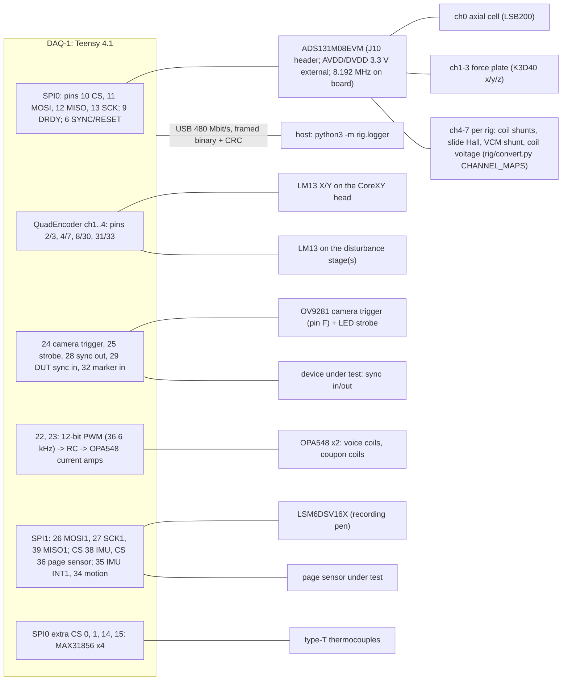
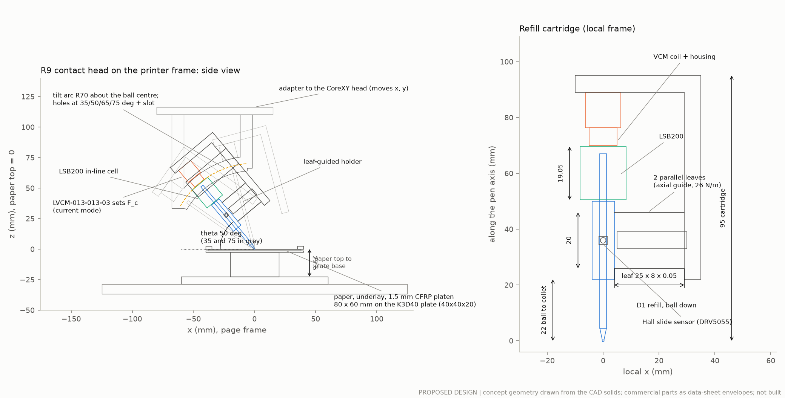
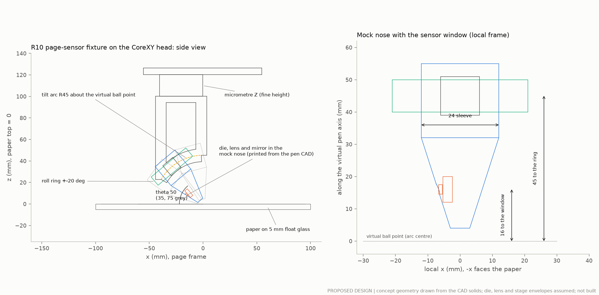
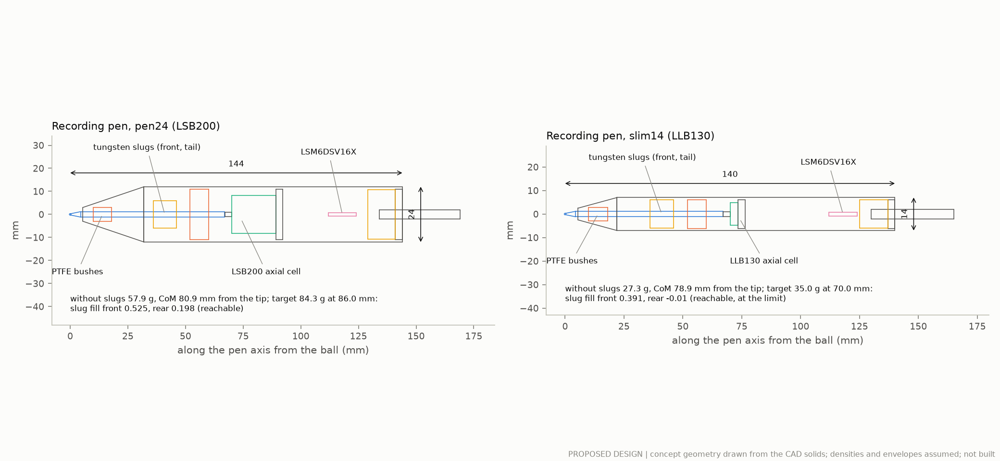
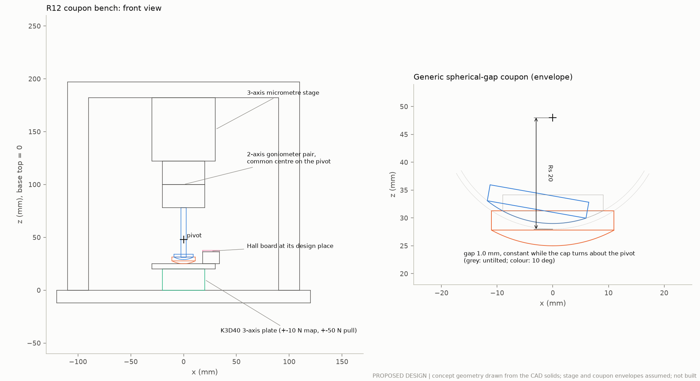
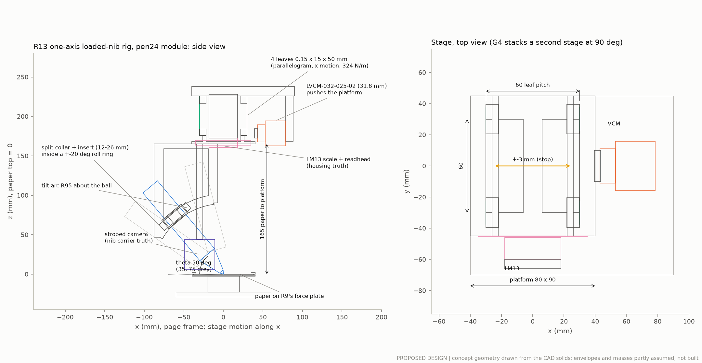
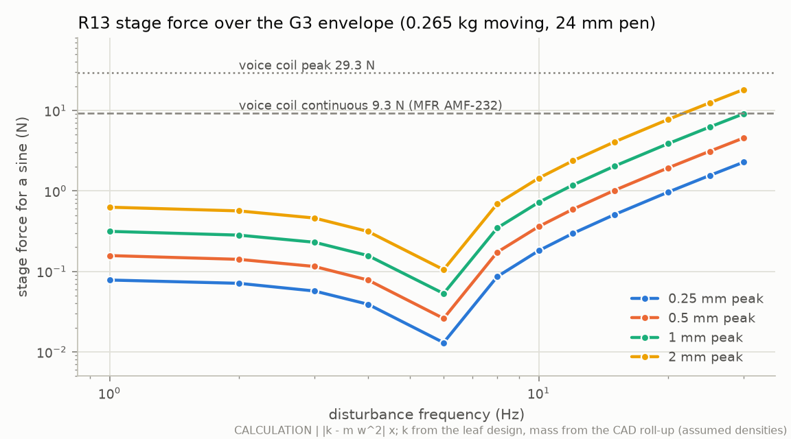
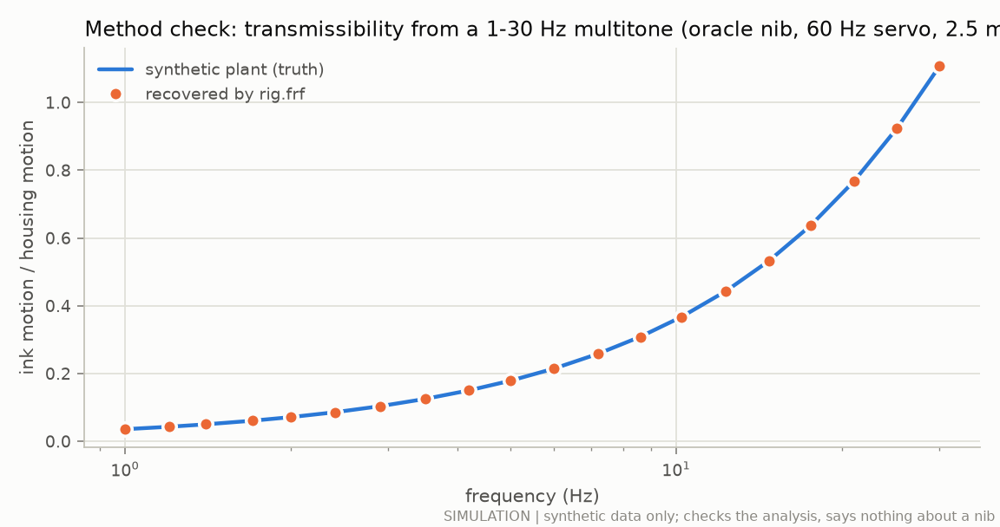
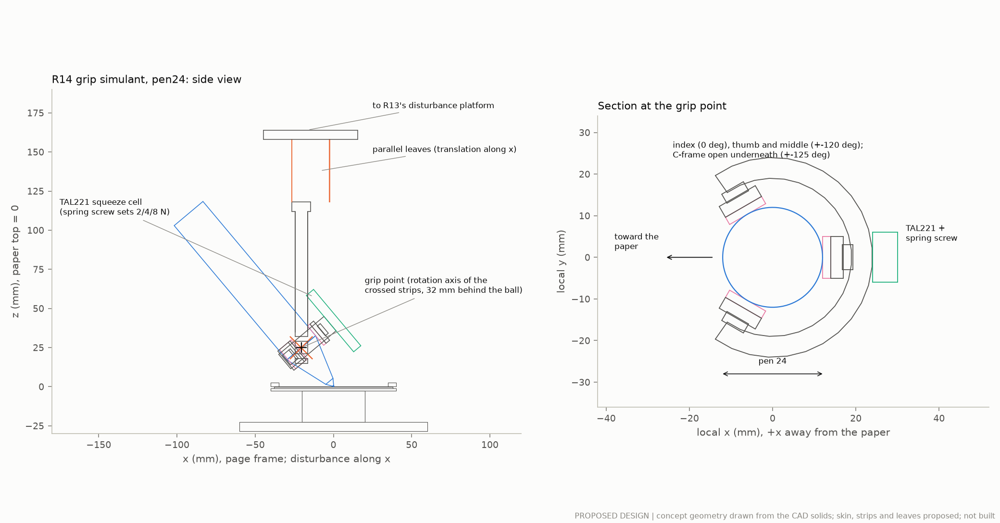

# Measurement rigs for gates G1-G5 and page sensing (study M)

**Status: PROPOSED DESIGN, 2026-09-29. Nothing has been built or measured.** This document specifies the bench rigs that the independent review of 29 September 2026 asks for (§12 "Experiments that decide the design"; the lead's response §4). It provides the CAD, the acquisition firmware, the logger and every analysis as runnable code, tested on synthetic data only.

**Labels** (as the rest of the repository):
- **SIM**: synthetic data run through the rig analyses (`rig/synth.py`, partly through `s2r`'s instrument models). It checks the software, not a pen.
- **CALC**: a calculation (uncertainty budgets, force envelopes, sizing).
- **LIT (id)** / **MFR (id)**: a published or manufacturer statement with its ledger id (`docs/evidence.csv`, or the rows proposed in `results/rig/evidence_rows.csv`, only for sources opened in this study).
- **ASSUMPTION**: an input nobody has measured.
- **PROPOSED DESIGN**: a choice made here.
- **MEASURED**: nothing yet.

**Where things are.** Software `rig/` (acquisition, analysis, self-test); firmware `rig/firmware/`; tablet recorder `rig/tablet/`; CAD `mechanics/cad/rig_*.py` with STEP files and drawings in `results/rig/cad/`; tables, budgets and figures in `results/rig/`. Section 12 says how to run everything.

---

## The answer in plain words

**Build six small rigs around one data-acquisition box and one converted 3-D printer, in this order.** The first two cost little and answer the questions that decide the nib's design. The later ones wait for study B's parts.

| Order | Rig | What it answers | Gate | Cost class (hardware) | Build time |
|---|---|---|---|---|---|
| 0 | **DAQ-1**: Teensy 4.1 + 24-bit simultaneous ADC, encoders, camera trigger, sync pulse | Puts every instrument on one clock | all | A | 2 weeks |
| 1 | **R9 contact and ink rig** on a CoreXY printer frame | How hard the refill must push to write without gaps (four ink systems, six papers, three tilts, three speeds), and how hard and in which direction the paper pushes back on the ball. This sets the range the balanced nib must carry. The same frame runs the static nose test (EXP-J17): the coil power a nib needs just to hold the ball on the paper | **G1** (and G2's static part) | B (low-cost) / C (standard) | 4 weeks |
| 2 | **R10 page-sensor rig** on the same frame | Whether a small optical sensor can track real paper well enough, at which tilt, roll, height and paper, and how it compares with DeltaPen | sensing build gate | A-B on R9's frame / D with the reference stages | 3 weeks |
| 3 | **R11 recording pen and tablet protocol** | Tremor and writing forces of real people (EXP-H01). The tablet protocol needs no build and can start as soon as ethics allows | EXP-H01 | B | 1 week (tablet), 3 weeks (pen) |
| 4 | **R12 actuator coupon bench** | Whether study B's actuator gives the force the model says over its whole stroke, how hard its magnets pull the flexure, whether the coils disturb the Hall sensors, and what changes when warm | **G2** | C | 3 weeks, once coupons exist |
| 5 | **R13 loaded-nib rig** (one axis, then two) | Whether the nib cancels a known shaking of the pen body while it writes on paper: bandwidth, current, large excursions, lifts; then turns, roll and tilt, sensor dropouts and a 30-minute heat run | **G3**, **G4** | B-C | 4 + 3 weeks |
| 6 | **R14 grip simulant** on R13's shaker | Whether a moving collar or tail helps more than the same mass locked, at light, medium and firm grips | **G5** | A-B | 3 weeks |

Cost classes: A < USD 500, B USD 500-2,000, C USD 2,000-10,000, D > USD 10,000. Prices were used only where a page showed one (`results/rig/bom.csv`); the classes of rigs whose main sensors had no visible price are ASSUMPTIONS. Build times assume one engineer with the parts in stock (ASSUMPTION).

**Why this order.**
- **G1 first, because the static side load dominates the nib's power.** A refill spring F_c pushes the ball along the tilted pen; the paper pushes back partly sideways, F_c·cot θ, which the nib must hold (review §4). For the Rev J C1S nose that costs 4.72 / 1.63 / 0.17 W at 35 / 50 / 75° (CALC, reproduced). The load scales with F_c² in power, so the lowest force that still writes reliably is the most valuable single number. No design choice about balance springs, cams, levers or actuators is safe before it.
- **Page sensing second, on the same frame.** The integrated simulations assumed a sensor giving 1 kHz, 2 ms and 3 µm; DeltaPen measured 68.3 µm mean and 23.6 µm median error per 10 ms window on a tablet surface (LIT OPT-02, OPT-85). The review makes sensing a build gate. The rig costs little once R9 exists.
- **The recording pen in parallel**, because ethics approval has the longest lead time and the tablet protocol needs no hardware work.
- **G2 before G3**, because a coupon that misses its force or pulls the flexure out of shape stops the nib before it is built.
- **G3 → G4 → G5**, as the review orders them: a loaded one-axis nib, then the complete two-axis nib, then the modules around it.

**What each rig's result decides.**
- R9 → the balance range and the refill (study B's balance mechanisms (b)-(d)); the friction map of the simulator.
- R10 → whether ordinary-paper sensing is feasible for the product, which die and optics, and which papers are supported; until then external truth stays in the loop.
- R11 → the tremor-at-nib census (who the pen can help) and real axial and paper-normal forces.
- R12 → the voice-coil geometry and whether the flexure survives its magnets; which force models to trust.
- R13 → a correction bandwidth under contact (G3) and whether the core stays useful outside a short ideal trace (G4); the heat of the balanced nib.
- R14 → whether a module earns its grams and watts (≥ 10 % over the same mass locked).

**What is delivered.** CAD for every rig (six CadQuery scripts: STEP files, drawings drawn from the solids, and fit checks, all of which pass); one firmware for the DAQ (written but **not compiled for the Teensy or run**: it passes a g++ syntax check against API stubs, and its frame header produces byte-for-byte the frames the Python parser expects); a USB logger; the analyses (minimum ink force from continuity, the friction vector map, the static balance range, K_m(position), attraction and negative stiffness, Hall interference, frequency responses from multitones, ground-truth alignment and latency, DeltaPen-style and per-sample page-sensor errors, one- and two-node thermal fits, the G5 decision); a browser-based tablet recorder and its loader; the page-sensor error model in the form sim2j uses (EXP-J10's addition); 17 proposed experiments (EXP-T01…T17) with 50 criteria, covering the lead's EXP-J17 and EXP-V07; a bill of materials; 31 proposed ledger rows. `python3 -m rig.selftest` runs every analysis on synthetic data in about 4 s (49 of 49 checks pass; SIM); `python3 -m pytest rig/tests` runs 25 tests in about 11 s.

**Findings from doing this.**
1. **DeltaPen's metric is not the one our protocol wrote down.** DeltaPen reports "the MAE for the magnitude of the translation" per 10 ms window and needed to compensate rotation for X and Y errors, so its headline metric reads as | |d_pen| − |d_truth| |, a rotation-invariant difference of lengths (LIT OPT-85). EXP-S01 describes the norm of the vector difference, which is always larger. The rig computes both and judges the DeltaPen comparison on the like-for-like one.
2. **A 3-axis plate cannot resolve friction at the lowest ink forces well.** At N = 0.2 N and μ 0.15 the friction force is 30 mN; the ±2 N plate's expanded uncertainty is about 4.3 mN, a test uncertainty ratio of 1.4 against ±20 % (CALC, `rig/uncertainty.py`). F_c,min itself is measured well (TUR 10-26), but low-load friction needs guarded acceptance or a finer tangential sensor.
3. **The sensing rig must fit the latency and the sensor's axes together.** A sensor mounted a few degrees off the truth axes mixes the quadrature axes of elliptical tremor and biased the latency by 0.13 ms in the synthetic check until the two fits were alternated (SIM, `rig.pagesense.qualify`).
4. **sim2j's DeltaPen-like "held" page error is harsher than DeltaPen, and "drift over 2 s" must mean the part that accumulates.** Drawn as sim2j draws it, the held error gives 10 ms window errors of 54.7 µm median and 117 µm mean (DeltaPen: 23.6 and 68.3), and a raw 2 s position difference of 416 µm (95th percentile) with no drift at all (SIM). EXP-J10's addition therefore fits held and walking parts separately and judges only the walking part against 0.1 mm (§3.6).
5. **The shaker needs the real moving mass.** With the holder, arc, camera and coil the R13 stage moves 0.21-0.27 kg (CALC from the CAD), so 2 mm sines at 25-30 Hz need 10-18 N, above the voice coil's 9.3 N continuous rating: bursts only, or a larger coil. Hung from the printer head the whole rig weighs about 1 kg (CALC), so the bridge build with a moving paper table is the realistic one for G3/G4.

---

## 0. Conventions

- **Everything in `validation/bench_protocols.md` §0 applies**: pre-registration and frozen predictions (§0.2), frames and signs (§0.3, `docs/physics.md` P-1…P-7), the metrology and decision rules (§0.5: simple acceptance at TUR ≥ 4, otherwise guarded; safety criteria always guarded), randomisation and blinding of ink scans (§0.6), metric definitions M-e…M-delay (§0.8), and the record rules of `validation/records/README.md`.
- **New shared rigs R9-R14** extend the list R1-R8 of §0.9. They replace R1 for G1 (R9), R5 for page sensing (R10), R4 for coupons (R12), R2 for loaded nibs (R13) and add a grip simulant (R14). R3 (ink scans), R7 (electronics) and R8 (fatigue) are used as specified there.
- **Frames.** Page frame: x, y in the paper, z up. Pen axis a = cos θ·h + sin θ·z, with h the page direction from the ball toward the cap's projection; stroke direction β relative to h (0 pull, 180° push), as `stabpen/contact.py`.
- **One clock.** Every instrument that DAQ-1 reads is time-stamped by the Teensy's cycle counter in the same interrupt (§1.3). Devices with their own clocks (a pen prototype, a camera PC, a tablet PC) record the coded sync pulse and are mapped onto the DAQ clock (`rig.sync.fit_clock`, residual ≤ 50 µs required by §0.4).
- **Files.** Raw bytes as received (`raw.bin`, write-once), parsed arrays (`session.npz`), metadata (`session.json` with SHA-256 and `stabpen.provenance`), then records in the `s2r-bench-1` layout (`s2r/io.py`) that the s2r identification pipeline already reads.
- **Safety.** No participant touches a powered prototype before gate G-S (`validation/prototype_stages.md`). Human sessions with R11 run from a battery (power bank) with no connection to mains-powered equipment, or through a medical-grade USB isolator (R7).

---

## 1. Shared infrastructure

### 1.1 DAQ-1 (PROPOSED DESIGN)

| Part | Part number | Qty | Price seen | Source | Role |
|---|---|---|---|---|---|
| Teensy 4.1 | SparkFun DEV-16771 | 1 per rig | USD 31.50 | sparkfun.com (MFR AMF-220) | 600 MHz Cortex-M7; cycle counter time base; 4 hardware quadrature decoders; USB 480 Mbit/s |
| ADS131M08 evaluation module, used without its PHI controller | TI ADS131M08EVM | 1 | not seen | TI SBAU334A (MFR AMF-222) | 8 simultaneously sampled 24-bit channels, PGA 1-128; onboard 8.192 MHz oscillator; digital header J10 |
| Thermocouple amplifier | Adafruit 3263 (MAX31856) | up to 4 | USD 17.50 | adafruit.com (MFR AMF-234) | magnet, housing, web and room temperatures |
| Precision shunts 0.1 Ω, 0.1 % | class | 4 | — | — | coil and voice-coil currents |
| Low-cost option: NAU7802 breakout | Adafruit 4538 | 4 | USD 5.95 | adafruit.com (MFR AMF-228) | quasi-static bridge channels only |

**Noise floor (MFR AMF-221/222).** 0.77 µV RMS at 1 kSPS and 1.20 µV RMS at 4 kSPS at gain 128 (Table 7-1). A 1 N, 2 mV/V load cell at 3.3 V excitation then shows 0.12 mN RMS per sample at 1 kSPS (CALC).

### 1.2 Wiring



The ADC channels shown are R9's and R13's; each rig's map is in `rig/convert.py` (`CHANNEL_MAPS`; R12 puts the plate on channels 0-2 and two coil shunts on 3-4). Pin choices follow the QuadEncoder README (Teensy 4.1 encoder pins 0-8, 30, 31, 33, 37; pins 0/5/37 and 1/36 exclusive; MFR AMF-238). Excitation for the bridges: the ADS131M08EVM's 3.3 V analogue supply through a 10 Ω/10 µF filter (PROPOSED), read ratiometrically on a spare channel.

### 1.3 Acquisition and one clock

- **One interrupt does everything.** On each ADC DRDY (4 kSPS by default, OSR 1024; 1, 2 or 8 kSPS selectable), the firmware (`rig/firmware/rig_daq/rig_daq.ino`) reads the 10-word ADS131M08 frame, latches the four encoder counters, stamps the 64-bit cycle count, runs the disturbance servo (R13) or the current setpoint (R12), writes the outputs and queues a 68-byte SAMPLE frame. The commanded disturbance or current is logged in every frame (`cmd`), so frequency responses can use the instrumental-variable estimate with the known digital excitation (s2r, validation/sim_to_real.md §2 item 4).
- **Camera.** Every 40th sample (100 Hz at 4 kSPS) the ISR raises the camera trigger (≥ 2 µs, MFR OPT-88) and, after a set delay inside the exposure, fires the LED strobe for 20-50 µs; the strobe's cycle count is the image time. Frames are captured on the host (UVC) and matched to strobe events by order and count.
- **Sync pulse.** Once per second the ISR raises the sync line and holds it for 1 ms + n·0.25 ms (n an 8-bit counter). Rising and falling edges are logged as EVENT frames. A device under test logs the edges on its own clock; `rig.sync.fit_clock` maps its clock onto the DAQ's (SIM: 20 ppm drift and 2 µs jitter recovered with a 6 µs worst residual).
- **Host.** `python3 -m rig.logger --port /dev/ttyACM0 --seconds 60 --out DIR --cmd "RATE 4000" --cmd START` writes `raw.bin`, `session.npz`, `session.json`; `rig.convert` turns sessions into physical units and `s2r-bench-1` records. The parser resynchronises on CRC errors and counts missing frames from the sequence number (SIM: every corrupted frame rejected, every good frame kept).
- **ADC timing (CALC).** The ADS131M08's sinc3 filter (SBAS950B Equation 6, OSR ≤ 1024) has linear phase, so the data read at DRDY represent the inputs about 1.5 output periods earlier: 375 µs at 4 kSPS. The encoders are latched at the interrupt, so `rig.convert` gives every session `t_adc_s = t_s − 1.5/f_data` for force-position alignment (at 100 mm/s the uncorrected offset would be 37.5 µm). The interrupt's own latency (up to about 20 µs while another pin interrupt runs: the SPI frame takes 15 µs at 16 MHz) jitters the time stamps; the ADC's crystal is the true sample clock, so a straight-line fit of `t_cyc` against `seq` removes it.
- **Other channels.** Thermocouples (MAX31856) are read in the same interrupt, one every 0.1 s in turn, and logged as EVENT kind 10 (`rig.protocol.temp_event_to_celsius`). The recording pen's LSM6DSV16X interrupts on data-ready at 1.92 kHz and is time-stamped at the edge (registers from ST's header, MFR OPT-92). Page sensors are polled from the main loop at 1 kHz (PAGE frames stamped at the read).
- **Commands** (one text line each): `RATE n`, `GAIN ch code`, `START`, `STOP`, `MARK n`, `CAM div delay_us width_us`, `CAMOFF`, `SYNC 0|1`, `TONES`, `TONE f amp phase`, `SWEEP f0 f1 T amp`, `WAVE 0|1`, `HOLD counts`, `ZERO ch`, `SERVO KP KI KD KFF`, `ILIM A [A_fullscale]`, `TRIP err_counts pos_counts`, `DIST 0|1`, `ISET A`, `IOFF`, `TC mask [div]`, `IMU 0|1`, `PAGE 0|1 [period_us]`, `CONFIG`, `STATUS`. The disturbance servo trips itself off when the following error or the position leaves its limits.
- **Firmware status.** Written, not compiled for the target and not run. `rig/tests/test_firmware.py` compiles the frame header on the PC and checks its bytes against `rig/protocol.py`, and parses the sketch with g++ against do-nothing stubs of the Teensy API (`rig/firmware/host_check/`); neither says anything about timing. The MAX31856 and page-sensor register addresses in the sketch are marked UNVERIFIED (their data sheets were not opened in this study). **Bring-up before any rig**: (1) boot text shows `crc_check=0x29B1` and the ADC's CLOCK register (0xFF0E at 4 kSPS); (2) loop-backs: sync out → DUT in (edge times agree within the interrupt latency), camera trigger → marker in, PWM through its RC filter → a spare ADC channel, a signal generator in quadrature → each encoder input; (3) 10 min at 8 kSPS with no dropped frames (`session.json` → `stats`).

### 1.4 Ground-truth kit

| Truth | Part | Performance (label) | Used by |
|---|---|---|---|
| Head position on the CoreXY | 2 × RLS LM13, resolution 13B (≈ 0.244 µm) with MS scale | accuracy grade ±10 µm/m, hysteresis < 4 µm, repeatability better than the resolution (MFR OPT-89); sub-divisional error not stated | R9, R10, R13 |
| Disturbance stage position | LM13 per axis | as above | R13, R14 |
| Reference page truth | 2 × Zaber X-LDM110C-AE54D12 | 1 nm count, 1 µm accuracy, < 0.08 µm repeatability, 1200 mm/s, USD 9,255 each (MFR AMF-229) | R10 reference build |
| Image truth | OV9281 global-shutter camera, external trigger to 100 fps (MFR OPT-88), strobed LED, dot grid | 2.1 µm per 10 ms window (CALC on ASSUMED centroid noise and distortion; to qualify) | R10 low-cost, R13, R14 |
| Ink truth | Epson Perfection V850 Pro, 4800/6400 dpi, USD 1,999 (MFR AMF-236); R3 procedure | ≤ 5 µm (k = 2) in a 25 mm field required by R3 | R9, R13 |

Rejected: Zaber X-LSM100A-E03 (USD 2,871; 26 mm/s maximum, too slow for writing at up to about 100 mm/s, LIT CON-20; MFR AMF-230).

---

## 2. R9: contact and ink rig (G1)

### 2.1 Purpose and the decisions it enables

Measure, separately, the **axial force the refill spring applies (F_c)** and the **force the ball applies to the paper (N, and the friction vector f)**, as the review asks (Schomaker and Plamondon 1990: an in-pen axial transducer and a transducer under the writing surface measure different quantities, LIT CON-01, CON-101). Then map friction over speed, tilt (35/50/75°, and 65°) and stroke direction, and find the **minimum reliable ink force** for four ink systems on six papers at three speeds.

Decisions:
- **the static balance range** the nib must carry without current: R_perp/F_c measured per tilt, direction and speed, times the chosen F_c (study B's mechanisms (b) scheduled bias, (c) contact-driven counter-face, (d) low ink force);
- **the refill and F_c** (REQ-RVJ-N05 holds F_c at 0.15 N ± 20 %);
- **the friction map** for sim2 and study B (replacing the ASSUMED μ(N, v) shapes in `bnib/labels.py`).

### 2.2 Mechanical design (PROPOSED DESIGN; `mechanics/cad/rig_contact.py`)

- **Frame.** A Prusa CORE One+ CoreXY printer (kit USD 925, assembled USD 1,202.78, MFR AMF-231). Its head moves in X and Y while its bed moves only in Z, so the force plate on the bed stays still and is never accelerated; Z sets the pen height. The print head is replaced by the contact head on an adapter plate.
- **Contact head.** A tilt arc of radius 70 mm (30-85°) centred on the ball's centre, with indexed holes at 35, 50, 65 and 75° and a slot for any angle (verified under load with a 0.1°-class inclinometer). The contact point lies straight below the ball's centre at every tilt, so rotating the cartridge on the arc leaves it where it was.
- **Refill cartridge.** Collet for a D refill (Ø2.35 mm) or a G2/capless refill (Ø6 mm) → aluminium holder guided by **two parallel leaf springs** (0.05 × 8 × 25 mm spring steel; axial stiffness 25.6 N/m, CALC E b t³/L³ per leaf with E 200 GPa ASSUMED; stress 72 MPa at ±1.5 mm, CALC 3 E t δ/L²) → **FUTEK LSB200** in-line cell (100 g for F_c ≤ 0.5 N; 250 g otherwise; MFR AMF-225) → **Moticont LVCM-013-013-03** voice coil in current mode (K_f 1.14 N/A, MFR AMF-02) that sets F_c, including ramps. A small magnet and a DRV5055 Hall sensor read the slide s, so the guide force k_g·(s − s_free) is subtracted: it reaches 38 mN at 1.5 mm, a quarter of F_c = 0.15 N (CALC), which is why s is measured rather than assumed. The moving axial parts weigh about 19 g (CALC on ASSUMED densities), so the cell also reads about 19 mN per m/s² of axial acceleration (the logged slide signal lets the analysis bound it); the guided suspension's mode is near 6 Hz (CALC), and with the voice coil in current mode F_c depends on the slide only through k_g.
- **Force plate.** An ME K3D40 3-axis sensor (±2 N for the ink series, ±10 N for the friction map to 4 N; MFR AMF-224) under a 1.5 mm carbon platen (80 × 60 mm, about 11 g, CALC); the rated 0.1 mm displacement at full scale gives about 2 × 10⁴ N/m for the ±2 N version, so the platen, a 1 mm glass underlay and the paper (22 g) sit near 150 Hz, and near 340 Hz on the ±10 N version (CALC; the sensor's own top mass lowers both: measure it by a tap test before EXP-T01). Paper strips are held by edge clamps; the underlay (glass, 10-sheet pad, 1 mm elastomer) goes between paper and platen.
- **Encoders.** LM13 scales on the frame, readheads on the X carriage and the Y gantry.

STEP: `results/rig/cad/rig_contact_assembly.step`; drawing `results/rig/cad/drawing_rig_contact.png`; fit checks in `results/rig/cad/rig_contact_summary.json`. **Fit checks (CALC on the CAD):** at 35, 50, 65 and 75°, with the ball anywhere in the writing area (x −29…33 mm, y −26…26 mm; the −x side keeps 6 mm from the clamp because the pen leans that way), only the ball touches the paper; the lowest other part is 9.7 mm above the paper at 35° and 20.6 mm at 75°; nothing on the cartridge touches the arc. The eccentric-load error at the corner of the area is 0.21 % FS before the in-situ calibration (0.5 % FS per 100 mm, MFR AMF-224). The head carries about 190 g (CALC): the printer page lists no payload (MFR AMF-231), so its acceleration settings are checked with this mass first.



### 2.3 Instruments

| Measurand | Instrument | Part number | Price seen | Ledger |
|---|---|---|---|---|
| F_c (axial) | FUTEK LSB200 100 g / 250 g | FSH03870 / FSH03871 | not seen | MFR AMF-225 |
| N, f (page frame) | ME K3D40 ±2 N and ±10 N | K3D40 | not seen | MFR AMF-224 |
| Reference plate | ATI Nano17 SI-12-0.12 | Nano17 | not seen | MFR AMF-223 |
| Head position, speed | RLS LM13 13B | LM13 | not seen | MFR OPT-89 |
| F_c actuator | Moticont LVCM-013-013-03 | LVCM-013-013-03 | not seen | MFR AMF-02 |
| Current drive | TI OPA548 | OPA548 | not seen | MFR AMF-233 |
| Tilt | digital inclinometer, 0.1° class | class | — | — |
| Ink | Epson V850 Pro (or any 2400 dpi flatbed for gaps) | B11B224201 | USD 1,999 | MFR AMF-236 |
| Refills | Schmidt S 635 (ballpoint, D), easyFLOW 9000 (hybrid, G2), P 8126 (capless ceramic rollerball 0.6), FL 6040 F (fineliner); a gel D1 refill from another maker | as listed | not seen | MFR CON-100 |
| Papers | copy 80 g/m², recycled, school ruled, coated, tracing, card (the six of EXP-D01/J04); ISO 12757-1 test atmosphere 23 °C/50 % RH | class | — | LIT CON-21 |

### 2.4 Calibration and uncertainty (CALC, `rig/uncertainty.py`)

- **In situ, at every test angle** (bench_protocols.md R1): dead weights 5-500 g on the platen at nine positions and horizontal pulls over a jewel-bearing pulley fit the plate's 3 × 3 matrix, offsets and an eccentricity correction (`rig.calib.fit_plate`); dead weights on the cartridge fit the axial cell (`fit_bridge`); the guide stiffness k_g is fitted with the refill off the paper (`fit_guide_stiffness`).
- **Closure check.** With the refill free to slide, F_c must equal the plate force projected on the pen axis (P-7). The median closure residual is a live check of both sensors and the angle (AC-T01-01; SIM 0.13 mN).

| Measurand | U (k = 2) | Dominant term | Decision tolerance | TUR | Rule |
|---|---|---|---|---|---|
| F_c (LSB200 1 N) | 1.9 mN | hysteresis ±0.1 % RO (MFR AMF-225) | 50 mN (0.15 N design vs 0.2 N limit, AC-Q02-01) | 26 | simple |
| F_c | 1.9 mN | same | 20 mN (is F_c,min below 0.12 N?) | 10.5 | simple |
| N (K3D40 ±2 N) | 3.6 mN | linearity 0.2 % FS, half left after calibration (MFR AMF-224, ASSUMPTION) | 20 mN band | 5.6 | simple |
| N (K3D40 ±10 N) | 17.9 mN | same | friction map at 0.5-4 N (3 % of reading) | 1-7 | guarded below 1.2 N |
| Friction force (±2 N plate) | 4.3 mN | linearity, crosstalk | 6 mN (±20 % of 30 mN at N 0.2 N) | 1.4 | **guarded** |
| R_perp | 4.3 mN | same | 10 mN (AC-B01-09 floor) | 2.4 | guarded |

The weak line is friction at the lowest loads; if it matters, fit a finer tangential stage (two LSB200 10 g cells on a flexure-guided platen: ±0.1 % of 0.1 N, MFR AMF-225) for the ink-threshold series.

### 2.5 Procedure and data (EXP-T01, T02, T03)

- **EXP-T01 friction vector map.** Nominal pair (S 635 on copy paper, hard underlay): θ {35, 50, 65, 75}° × β every 45° × v {3, 10, 30, 100} mm/s × F_c {0.08, 0.15, 0.30} N, 20 mm strokes on fresh tracks, 3 repeats with 3 refills. Reduced grid on the other 23 refill × paper pairs: θ {35, 50, 75} × β {0, 90, 180, 270} × v {10, 30} × F_c 0.15 N. Indentation ramps 0 → 2 → 0 N on each paper and underlay. About 1 h per pair on the core grid, 20 min on the reduced one (CALC from stroke counts; ASSUMED overheads).
- **EXP-T02 ink.** For each refill type (≥ 3), paper (6), θ (35/50/75°) and v (10/30/100 mm/s): 5 lines of 100 mm with F_c ramped 0.30 → 0.02 N, then 100 mm lines at fixed F_c in {0.05, 0.08, 0.10, 0.12, 0.15, 0.20} N around the threshold; optional ±0.03 N modulation at 3-15 Hz by the voice coil (the EXP-B08 part). Sheets are scanned within 1 h and coded blind (§0.6).
- **EXP-T12 part A (= EXP-J17, the static nose test).** The nose or nib module replaces the refill cartridge on R9's head (the R13 collar and roll ring on a rigid adapter), with the ball on the K3D40 plate at 35, 50 and 75°, 60 s each, refill spring 0.15 N: coil current on a shunt channel, coil temperature by thermocouple and 4-wire resistance, and the plate's side load and friction at the same time. First the C1S nose (pass line AC-T12-03: 0.81 A and 1.62 W at 50°, each within ±20 %, the lead's CALC), then the balanced nib (AC-T12-01: ≤ 0.10 W). Because the plate measures the side load itself, a miss can be traced either to the load (friction, angle) or to the actuator (K_m, lever).
- **EXP-T03 friction dynamics (optional, after G1).** The R13 disturbance stage on the head reciprocates 0.02-0.5 mm at 3-15 Hz with and without drift, plus velocity steps at quarter-decade speeds and slow triangular sweeps (EXP-B01 Part 3, EXP-B02; `s2r.exp_b01b02.identify` reads the records).
- **Data.** One session per block; MARK events cut conditions; records `EXP-T01/<record-id>/raw` as validation/records/README.md; `s2r-bench-1` groups `strokes`, `indentation`, `lines`; arrays `t_s, F_a, F_x, F_y, F_z, x_enc, y_enc, s_hall_V, iref_A`; attributes θ, β, v, F_c setpoint, refill id and lot, paper batch, underlay, T, RH.

### 2.6 Analysis

- `rig.contact.analyse_stroke`: steady window (first and last 2 mm excluded, speed within 20 %), N = −F_p,z, friction f = −F_p,xy; μ_drag (along −v̂), μ_cross (perpendicular) and the friction angle; R_a and the closure F_c − R_a; R_perp and R_perp/F_c; 3-15 Hz friction ripple (AC-B01-06).
- `rig.contact.fit_mu_of_N`, `p6_check` (AC-T01-03), `side_load_table` and `balance_range`: the static side load (mN) and pivot torque per candidate F_c and pivot length — **the table study B needs**.
- `rig.ink.analyse_line` and `minimum_ink_force`: centreline samples every 20 µm, ink presence from the darkest pixel across the line with an adaptive threshold, gap fraction in 5 mm windows, the force where the gap fraction first exceeds 1 % (AC-B01-07 definition), a logistic model of gaps per 0.5 mm segment, bootstrap over lines. The window estimate is biased low by up to half the force span of a window (about 7 mN on a 0.28 N/100 mm ramp; SIM 5.6 mN): the fixed-force lines confirm it.
- **SIM check** (`rig.selftest`): μ 0.1498 against 0.15; friction angle 3.0° recovered; R_perp/F_c within 1.2 %; F_c,min 0.140 N against 0.145 N.

### 2.7 Pass/fail lines (PROPOSED; `results/rig/proposed_criteria.csv`)

| Id | Metric | Line | Status |
|---|---|---|---|
| AC-T01-01 | axial closure median | ≤ max(3 mN, 3 % of F_c) | derived (rig validity) |
| AC-T01-02 | U(N) over 0.05-1 N | ≤ 5 mN | derived |
| AC-T01-03 | R_perp/F_c within ±15 % of P-6/P-7 | ≥ 90 % of strokes | hypothesis |
| AC-T01-04 | μ_drag every refill × paper | 0.09-0.40 | hypothesis (CON-13, CON-14) |
| AC-T01-05 | side friction \|μ_cross\|/μ_drag | ≤ 0.2 | hypothesis (every model assumes 0) |
| AC-T01-06 | envelope coverage (REQ-ENV-001/002) | 100 % of cells | requirement |
| AC-T02-01 | refill types with F_c,min ≤ 0.12 N everywhere (REQ-RVJ-N05's low end) | ≥ 3 | derived |
| AC-T02-02 | U(F_c,min) | ≤ 12 mN | derived (EXP-Q02 rule) |
| AC-T02-03 | gaps under ±0.03 N modulation (REQ-MECH-005) | ≤ 1 % | hypothesis |

The main output is not a pass: it is the measured static balance range (R_perp/F_c per tilt, direction and speed) and F_c,min per refill and paper, handed to study B.

### 2.8 Existing experiments

EXP-B01 Parts 1-2 and 4 (re-specified: page-frame plate plus in-line axial cell, instead of one F/T sensor on the holder), EXP-Q02 Part A, EXP-B08 (modulated-force part) and EXP-V01 merge into EXP-T01/T02; EXP-B01 Part 3 and EXP-B02 become EXP-T03; EXP-Q01 (skid) and EXP-D01 (tyre) run on R9 with other heads.

### 2.9 Low-cost build and what it gives up

Dead weights on a thread over a jewel-bearing pulley instead of the voice coil (fixed F_c levels only, no ramps; the ramp lines become stepped lines); a TAL221 100 g bar (USD 14.50, MFR AMF-227) through a bell crank instead of the LSB200 (combined error 0.05 % FS, but crank friction to calibrate); NAU7802 boards (USD 5.95) instead of the ADS131M08EVM (quasi-static only: no ripple or reciprocation); a 2400 dpi scanner. It keeps G1's two main answers (F_c,min and the static side load at 35/50/75°) and loses the dynamic friction terms and some force resolution. Seen prices of this build: USD 925 printer kit + USD 31.50 Teensy + 2 × USD 14.50 + 4 × USD 5.95, plus a K3D40 (price not seen).

---

## 3. R10: page-sensor rig (sensing build gate)

### 3.1 Purpose and decisions

Qualify page-relative optical sensing on real paper before any closed-loop claim rests on it: accuracy, noise, scale versus tilt, height and roll, papers, lift and dropout, and latency. Compare with DeltaPen: 68.3 µm mean and 23.6 µm median absolute error of the translation magnitude per 10 ms window, against Wacom position differences, on a tablet surface (Luethi, Fender, Holz, UIST 2022; opened: §4.4, p. 8; LIT OPT-02, OPT-85).

Decides: whether ordinary-paper sensing can replace external truth; the die and optics (PMW3610 class of Rev J.1, PMW3360/3389 class, PAA5100JE class); the supported papers; the estimator's latency budget (REQ-CTRL-003).

### 3.2 Mechanical design (`mechanics/cad/rig_pagesense.py`)

A sensor fixture on the CoreXY head: a tilt arc (R 45 mm, 30-88°) centred on the look point, a roll ring ±20° about the virtual pen axis, the printer's Z for coarse height and a micrometre Z for fine height. The paper lies on 5 mm float glass on the bed. Two holders share the ring:
- **Mode A, bare sensor (EXP-T04 physics).** The die, lens and a small carrier (14 × 12 mm) with the optical axis through the arc centre: obliquity 2-30° (90° minus the arc angle), lens heights 1.5-4.5 mm and roll ±20° are set independently. Fit check (CALC on the CAD): clear of the paper over that whole range; a 20 × 16 mm carrier touched the paper at 30° obliquity, 1.5 mm and ±20° roll, hence the small carrier.
- **Mode B, nose insert (EXP-J04, EXP-J10).** The front of the pen, printed from its CAD, carrying the die, lens and mirror as in the pen, turned about the virtual ball point, so the lens height follows the nose design. With a generic nose whose window sits 16 mm behind the tip, the lens would be 3.3-15 mm above the paper over 35-75° (CALC on the CAD), outside a 2.2-2.6 mm band: the reason the pen needs folded optics next to the tip (`docs/revJ_design.md`).

Far-field boards (PAA5100JE, 15-35 mm) mount on a flat plate at the printer's Z. Reference build: the fixture fixed on a bridge and the paper on two stacked Zaber X-LDM110C stages (USD 9,255 each, MFR AMF-229). The R13 flexure stage provides fast steps for latency.



### 3.3 Instruments

Sensor boards under test (JACK Enterprises' PMW3360 and PMW3389 boards are retired, MFR OPT-91; Pimoroni PAA5100JE PIM573, 15-35 mm, 242 fps, MFR OPT-90; Rev J.1's PMW3610-class die, MFR OPT-61). Truth: LM13 encoders (standard), Zaber stages (reference) or the strobed camera (low-cost). The DAQ polls the sensor over SPI1 at 1 kHz from its main loop (the motion line is wired to pin 34 for later use); each PAGE frame carries the sensor's increments, SQUAL and a validity flag, stamped on the DAQ clock at the read. Sensors with their own MCU log the sync pulse instead.

### 3.4 Uncertainty (CALC)

Truth error of one 10 ms window: 0.38 µm with the Zaber stages (TUR 26 against 10 µm), 2.6 µm with LM13 (TUR 3.8: guarded acceptance; the unknown sub-divisional error and the < 4 µm hysteresis at reversals dominate), 2.1 µm with the camera (TUR 4.8, resting on ASSUMED centroid noise until the static-target check is done). Against DeltaPen's 23.6 µm median every build has TUR ≥ 9.

### 3.5 Procedure and data (EXP-T04, T05)

- **Poses and papers**: θ {35, 45, 55, 65, 75}° × roll {0, ±5, ±10, ±20}° × height {band centre, ±0.2, ±0.4 mm, then 1.5-4.5 mm in 0.25 mm steps at 55°} × the six papers plus glossy, printed text and fresh ink.
- **Motions**: straight lines at 1, 10, 30, 100, 200 mm/s in 8 directions; 5 mm circles; a replay of writing-like paths (sigma-lognormal, `stabpen.signals`) with 4-12 Hz, 0.1-1 mm tremor added by the stage; 10 s rests for noise.
- **Lift and dropout**: Z steps of 0.1-3 mm while moving; a glossy strip and an ink crossing in the path.
- **Latency (EXP-T05)**: ≥ 200 voice-coil steps of 50 µm with random phase (the step's 10-90 % rise ≤ 0.5 ms checked on the encoder, AC-T05-02), plus the phase slope under multitone motion; optional LED-strobe method of EXP-S01.
- **Power**: the sensor's supply current on an ADC shunt channel at each polling mode (AC-J10-03 stays).

### 3.6 Analysis (`rig/pagesense.py`)

`qualify()` alternates the latency and the 2 × 2 scale-rotation fit on the first 30 % of a run, then scores the held-out rest: DeltaPen's metric (| |Δs| − |Δg| | per 10 ms window, mean and median) and the vector metric (|Δs − Δg|, mean, median, 95th percentile); per-sample noise after a linear detrend per 100 ms (AC-S01-02); the RMS error over the longest dropout-free stroke (REQ-RVJ-N06's 10 µm); dropouts and report rate. SIM check: latency 1.615 ms against 1.600 ms; matrix within 0.001; per-sample noise 3.77 µm against 3.77 µm expected.

**EXP-J10's addition: the error of every 10 ms window and its correlation over time, in sim2j's form.** `sim2j/sensing.py` (read-only here) models the page sensor as white noise per 1 kHz sample (`page_noise`), a latency (`page_latency`), and a DeltaPen-like error drawn every 10 ms as a 2-D vector with lognormal magnitude (`DP_MEDIAN`, `DP_SIGMA`) and random direction, either held for its window (`deltapen_held`: errors do not add up) or added to the previous ones (`deltapen_walk`). `rig.pagesense.sim2j_page_model` measures exactly those quantities on paper. It samples the position error P every 10 ms along each dropout-free run and fits the structure function V(L) = E|P(k+L) − P(k)|² = 2·E|h|² + L·E|w|², so the held part h and the walking part w separate (intercept and slope, 10 ms to 2 s). It reports which mode dominates at 2 s, the `DP_MEDIAN`/`DP_SIGMA` that reproduce the measured window-error median and mean in either mode (for the held mode by inversion, because a held draw's window difference is larger than the draw), the autocorrelation of the window errors, the accumulated drift over 2 s, the latency and the per-sample noise. `rig.pagesense.patch_sim2j` loads the measured values into sim2j's module constants for one run without editing sim2j: `with patch_sim2j(model, sim2j.sensing, sim2j.run_study): run_study.stage_page_noise()`. SIM checks: walk steps of 0 and 8 µm recovered within 0.3 µm with the right mode.

Two findings for the lead (SIM, `results/rig/page_noise_model_example.json`):
1. **sim2j's `deltapen_held` model is harsher than DeltaPen.** Drawing a held position error with DeltaPen's window median and mean (23.6/68.3 µm) gives window errors of median 54.7 µm and mean 117 µm, 2.3 and 1.7 times DeltaPen's. The SIM conclusions that used it are therefore conservative on this point.
2. **"Drift over 2 s" has to mean the accumulated part.** With that held model, |P(t + 2 s) − P(t)| has a 95th percentile of 416 µm although nothing accumulates, because the held error sits at both ends. The proposed line AC-T04-06 therefore judges the walking part, √(200·E|w|²), against 0.1 mm (REQ-RVJ-C05), and reports the raw difference beside it. A 5 µm walk step under the same held error gives 70 µm of accumulated drift over 2 s, within the line.

### 3.7 Pass/fail lines

AC-T04-01 (REQ-RVJ-N06: ≥ 1 kHz and ≤ 10 µm RMS over 35-75°, roll ±20°, six papers), AC-T04-02 (10 ms-window error, DeltaPen's metric, median ≤ 23.6 µm and mean ≤ 68.3 µm, REQ-RVJ-C05), AC-T04-06 (accumulated error ≤ 0.1 mm over 2 s of writing, REQ-RVJ-C05), AC-T04-03 (truth U ≤ 2.5 µm per window), AC-T04-04 (REQ-SNS-001: ≤ 5 µm RMS per sample), AC-T04-05 (dropouts ≤ 1 %, none > 300 ms), AC-T05-01 (latency ≤ 2 ms, 99th percentile), AC-T05-02 (step rise ≤ 0.5 ms). EXP-S01, EXP-B04 procedure 5, EXP-N07, EXP-J04 and EXP-J10 merge here.

### 3.8 Low-cost build

The camera instead of encoders: 100 fps limits truth to the 10 ms windows (enough for DeltaPen's metric and the stroke error, not for per-sample noise at 1 kHz, which then needs the encoders). No Zaber stages: TUR against 10 µm falls from 26 to 3.8-4.8, so verdicts near the line are guarded.

---

## 4. R11: recording pen and tablet protocol (EXP-H01)

### 4.1 Purpose

EXP-H01 needs tremor at the nib during real writing (amplitude, frequency, axis) and real axial forces, from ET, PD, older and healthy adults (`validation/human_study_plan.md` §4). Two instruments, used in this order:

1. **Tablet protocol (no build).** Paper clipped on an EMR tablet whose pen writes real ink: Wacom Intuos Pro Paper Edition PTH-660P with the Finetip Pen (0.4 mm gel) or Ballpoint Pen (1.0 mm oil), 8,192 pressure levels, tilt ±60° (MFR OPT-86). The current Intuos Pro (2025) lists no paper mode (MFR OPT-87): buy a Paper Edition while available. `rig/tablet/tablet_recorder.html` logs every pen sample the browser receives (Pointer Events with coalesced samples: position, pressure, tilt, twist, altitude and azimuth where offered, buttons, hover and pen-down, time) and saves a CSV (format `rig-tablet-1`, pseudonymous participant code only, nothing sent anywhere); four taps on printed fiducials map the tablet to the page. `rig.tablet.load_recording` reads the file and applies the fiducial map; `analyse_recording` reports sampling rate and jitter and runs the excess-power method (SIM round trip through the file format: 0.797 mm against 0.800 mm, 6.0 Hz). Nothing to install.
2. **Recording pen (build).** A passive pen with the candidate's grip (Ø24 mm and a 14 mm slim body; mass and centre of mass adjustable with tungsten slugs to match study B's pens), the refill seated on an axial cell (LSB200 in the 24 mm body, FUTEK LLB130 Ø9.5 × 3.3 mm in the slim one, MFR AMF-225/226), an LSM6DSV16X at 1.92 kHz in the tail (registers MFR OPT-92), and a 1.5 m, 12-core cable to a desk box (DAQ-1). With the paper on R9's force plate it measures, during real writing, the axial force and the paper-normal force apart. `mechanics/cad/rig_recpen.py` (CALC on the CAD, densities ASSUMED): the LSB200 fits the 24 mm body's 22 mm bore (section diagonal 17.8 mm, or 20.2 mm if its load axis turns out to be along the 16.5 mm side: to check on drawing FI1455); the LLB130 fits the slim body's 12.4 mm bore; the refill slides 0.3 mm freely in two PTFE bushes. Without slugs the 24 mm pen weighs 57.9 g with its centre of mass 80.9 mm from the tip; front and tail tungsten slugs reach Rev J.1's base pen (84.3 g at 86.0 mm, CALC in `docs/revJ1_design.md`). The slim pen weighs 27.3 g at 78.9 mm; an ASSUMED 35 g at 70 mm target is reachable only at the limit (front slug alone), so a slim target further forward needs a heavier front slug. A light preload spring (about 20 mN, ASSUMPTION) keeps the refill on the cell's pin when lifted; its offset is re-zeroed at every lift.



### 4.2 What it can and cannot measure

- Tablet: position resolution 0.01 mm but accuracy of about ±0.25 mm class (Calcomp 9000 in Schomaker and Plamondon, LIT CON-101; Wacom sensor boards ±0.4 mm, MFR AMF-98). Fine for tremor amplitude over 3-12 Hz (relative motion); not for the 25 µm false-correction scale. Time stamps are the host's event times: jitter is reported; latency cannot be measured this way.
- The excess-power method of `validation/human_study_plan.md` §3.6 needs pen-down runs of ≥ 4 s (4 s Welch windows). Spirals, "el" loops and dot-holds have them; sentence copying rarely does. **Open issue**: sentence copying needs a pooled-run variant (for example 1 s windows over pen-down runs), qualified by the same injection test (AC-T06-02).

**EXP-V07** (12 healthy adults write "return library books by friday" on a ≥ 200 Hz tablet; `docs/revJ_simulation.md`) runs on the tablet protocol once AC-T06-04 shows that the tablet and browser deliver a median pen report rate of at least 200 Hz, coalesced samples included; the recorder's CSV goes through `rig.tablet.load_recording` into `sim2j/writers.kinematics`.

### 4.3 Pass/fail lines (EXP-T06)

AC-T06-01 (reference chain against scanned ink ≤ 50 µm RMS, the AC-H01-08 line; the tablet's accuracy class may fail it, then register per stroke), AC-T06-02 (excess-power method recovers injected amplitudes within ±10 %; SIM 0.797 against 0.800 mm), AC-T06-03 (axial channel U ≤ 10 mN in the 24 mm pen, ≤ 60 mN in the slim pen), AC-T06-04 (median report rate ≥ 200 Hz, EXP-V07's dependency). `rig.contact.apf_npf` reports how far real N/F_a departs from sin θ (Schomaker and Plamondon's eq. 1, which assumes the whole pen force is axial).

---

## 5. R12: actuator coupon bench (G2)

### 5.1 Purpose and decisions

Map force against current and position in two dimensions over the whole magnet stroke, K_m(position), the parasitic magnetic pull on the suspension (the 12.4-22.2 N of Rev J.1's C1S cap; up to 36 N by a cruder estimate, CALC in `docs/revJ1_design.md` §3.1), the negative stiffness, the Hall sensors' errors from coil currents and magnets, and the loaded modes at 23, 35 and 50 °C. Decides the voice-coil geometry and whether the flexure is feasible; rejects force models that miss by more than 10 % (review G2).

### 5.2 Mechanical design (`mechanics/cad/rig_coupon.py`)

A base plate carries the stator (coil plate) on a K3D40 (±50 N for the pull, ±10 N for the force map; MFR AMF-224). An overhead bridge holds the moving part (magnet cap on its arm) on a 3-axis micrometre stage and a two-axis goniometer whose centre is set on the coupon's pivot, so spherical-gap coupons tilt about their real pivot and translation coupons translate. The Hall board sits at its design place on a printed fixture. The whole coupon can go into the R9 frame's chamber (up to 55 °C, MFR AMF-231) or a small heated box.

**Centring rule (CALC on the CAD, generic spherical-gap coupon of radius 20 mm, ASSUMPTION).** Tilted 10° about a goniometer centre that is off the sphere centre by e (laterally and axially), the gap closes by 0.012 mm at e = 0.05 mm, 0.024 mm at 0.1 mm and 0.047 mm at 0.2 mm, the last being 9 % of a 0.5 mm gap. So the goniometer centre is set on the pivot within 0.05 mm (the same tolerance Rev J asks of the pen, DEC-044), using the zero-current pull map, which is symmetric only when centred.



### 5.3 Procedure (EXP-T07, T08, T09)

- **Map (T07)**: 7 × 7 (or 11 × 11) nodes over the stroke; at each node currents {−0.6, −0.3, −0.1, 0.1, 0.3, 0.6} × I_max in reversal order, 0.2 s holds and ≥ 30 s cooling above 0.3 I_max (validation/sim_to_real.md §2 item 5); one axis, the other, then both. Back-EMF K_f at the centre with the R13 stage shaking the magnet part (±0.5 mm, 10/20/50 Hz) — a second, independent route (s2r G3). R20 (4-wire), L (voltage step at ≥ 12 bit).
- **Pull (T08)**: gap 0.5-1.5 mm and lateral offset ±0.1 mm at zero current; the lateral zero-current map gives the negative stiffness; then current-to-position FRFs of the assembled magnet-loaded suspension (multitone 20-2000 Hz from the coil, position from the Hall pair or the camera at low frequency) at 23/35/50 °C; K_f(T), R(T).
- **Hall (T09)**: at 9 fixed positions, coil current 0 → 1.5 A with the linear amplifier (DC) and with the pen's own PWM driver, magnets present and absent, at two temperatures.

### 5.4 Uncertainty and lines

K_f at one node by the reversal method: U ≈ 1.2 % (TUR 8.4 against ±10 %), dominated by the plate's hysteresis at small forces (CALC). Lines: AC-T07-01 (K_m lowest point ≥ 0.85 × study B's design value over the whole stroke, REQ-RVJ-N02's rule), AC-T07-02 (≥ 90 % of nodes within ±10 % of the model), AC-T07-03 (ripple ≤ 15 %), AC-T07-04 (force and back-EMF routes agree), AC-T08-01 (pull within ±20 % of the model), AC-T08-02 (suspension stiffness ≥ 2 × negative magnetic stiffness), AC-T08-03 (first loaded mode ≥ 240 Hz at 23 and 50 °C, REQ-RVJ-N02), AC-T09-01 (≤ 10 µm RMS at the tip with 0-1.5 A, REQ-RVJ-I04), AC-T09-02 (crosstalk ≤ 5 µm/A after compensation, REQ-SNS-004).

Analysis: `rig.coupon.km_map`, `attraction_fit`, `lateral_stiffness`, `hall_interference`, `mode_fit`, `tempco` (SIM: K_f map within 0.34 %, K_m at the centre 0.661 against 0.662, negative stiffness 0.600 against 0.600 N/mm, loaded mode 420 Hz and ζ 0.030 recovered).

Merges: EXP-B03 (force map, back-EMF, R/L, thermal steps, crosstalk), EXP-N01, EXP-J01, EXP-J03, EXP-J14, EXP-J11 step 1 (stiffness against preload), EXP-K01 (force-constant part).

Low-cost build: a manual micrometre stage only (7 × 7 nodes by hand), the Lepton 3.5 thermal camera (USD 172, 160 × 120, MFR AMF-235) for hot-spot maps only; thermocouples and coil resistance carry the temperatures.

---

## 6. R13: loaded-nib rig (G3, then G4)

### 6.1 Purpose and decisions

G3 (one axis): with independent position truth, shake the nib's housing with swept sines and multitones at 1-30 Hz and 0.25-2 mm peak (the review's proposed starting envelope) while it writes on paper; measure how much of the shaking reaches the ink, the bandwidth under contact, stable pen lift, bounded current and large-excursion limits. G4 (two axes): natural sharp turns, repeated contacts, the full roll and tilt range, optical dropout and a long thermal run with the governor. Decides the correction bandwidth under contact and whether the core stays useful outside a short trace.

### 6.2 Mechanical design (`mechanics/cad/rig_nib.py`)

- **Disturbance stage**: a parallel-leaf flexure (four 0.15 × 15 × 50 mm spring-steel leaves in a parallelogram; 324 N/m, stress 108 MPa at ±3 mm; CALC with E 200 GPa ASSUMED) hanging from the head, so the leaves carry the weight in tension (upright, the four would buckle at about 13 N, CALC), driven by a Moticont LVCM-032-025-02 (31.8 mm housing, 12.7 mm stroke, 9.3 N continuous, 29.3 N peak; MFR AMF-232; its 25.4 mm length is read from the maker's naming convention, ASSUMPTION) through an OPA548 (3 A continuous, MFR AMF-233), closed-loop at the ADC rate on an LM13 in the DAQ interrupt. G4 stacks a second stage at 90°. A parallelogram also rises 0.6 d²/L: 48 µm at 2 mm, at twice the drive frequency (CALC), which modulates the ink force through the nib's own spring; the force plate under the paper measures it.
- **Nib holder**: a split collar with printed inserts for Ø12, 14, 16, 20, 24 and 26 mm bodies (study B's slim core and the 24 mm pen) inside a ±20° roll ring, on a CFRP tilt arc of R 95 mm about the ball (30-82°).
- **Moving mass (CALC, CAD roll-up with ASSUMED densities, coil 30 g and camera 15 g).** 173-178 g without the pen: 0.21 kg with a 35 g slim module, 0.265 kg with a 90 g 24 mm module. The stage's own mode is then 5.6-6.2 Hz, inside the band; the position loop controls through it (the flexure guides, the loop sets the motion).
- **Fit checks (CALC on the CAD).** For both pens at 35-75°, with the stage at ±3 mm and the pen rolled ±20°, only the nib touches the paper, and nothing on the stage touches the pen; the lowest other part (the camera) is 6 mm above the paper.
- **Writing motion**: two ways. (a) The stage rides on the CoreXY head (R9 frame), which draws lines and the feature course; the head encoders and the stage encoder together give the housing's motion in the page frame, and the voice coil's reaction on the gantry is measured, not assumed away. But the whole rig hung from the head weighs about 1.06 kg with the 24 mm pen (CALC from the CAD: a solid 12 mm aluminium base as drawn, a pocketed one saves a few hundred grams), and the printer's page lists no payload (MFR AMF-231). (b) Recommended until (a) is proven: the stage hangs from a fixed bridge over the bed and the paper moves under it on a one-axis table carrying R9's force plate (G3 needs only straight strokes at constant speed after the ramp), or on the two Zaber stages for G4's feature course (reference build, class D).
- **Truth**: housing (LM13), nib carrier (strobed camera on a dot near the tip), ink (scan). The nib's own Hall sensors are logged but are not truth.

**Force envelope (CALC, `rig.run_all.disturbance_envelope`; stiffness from the leaves, mass from the CAD roll-up).** A sine needs |k − mω²|·x. With the 24 mm pen (0.265 kg), 2 mm at 25 Hz needs 12.4 N and at 30 Hz 18.2 N; with the slim core (0.21 kg) 9.7 N and 14.3 N. Those two corners exceed the coil's 9.3 N continuous rating but stay within its 29.3 N peak: they run as short bursts with the coil temperature logged. Every other point of the envelope (0.25-1 mm at any frequency, though 1 mm at 30 Hz uses 9.1 N of the 9.3 N; 2 mm up to 20 Hz) is within the continuous rating, and so is every 24-tone multitone up to 2 mm peak: at 17 m/s² peak acceleration it needs 4.2 N peak and 1.5 N RMS with the 24 mm pen. If the 2 mm, 25-30 Hz sines must run continuously, the LVCM-038-038-02 (24.9 N continuous, 78.8 N peak, 0.38 in stroke; MFR AMF-232) covers them; its moving mass is not on the maker's page and must be weighed.





### 6.3 Procedure

- **EXP-T10**: amplitude ladder 0.25/0.5/1/2 mm; 10 s periodic multitones (24 log-spaced tones 1-30 Hz on the 0.1 Hz grid, Schroeder phases, peak acceleration capped at 40 m/s² [ASSUMPTION]) and log sweeps; locked nib, then nib on with the oracle reference (the stage encoder), then the nib's own estimator; in contact at 35/50/75° on three paper stacks; clean writing without disturbance for false correction.
- **EXP-T11**: ladder beyond the usable travel to saturation; recovery; 1.5 mm pen lifts at 50/60/70° and touchdowns; ink tails.
- **EXP-T12 (the static term)**: part A (= EXP-J17) runs first on R9's frame (§2.5); part B here: holding current and copper loss with the ball on the paper at 35-75°, roll ±20°, 8 directions, F_c 0.08-0.2 N, balance mechanism on and off. It measures directly what the review found missing.
- **EXP-T13**: feature course (corners, dots, hatching, fast strokes) under multitone tremor, 500 touchdowns, tilt 35-75°, roll ±20° (G4).
- **EXP-T14**: forced page-sensor dropouts (glossy strip, ink crossing, 2 mm lift, occlusion) in closed loop.
- **EXP-T15**: 30-60 min of design duty and a worst-case duty (35°, 2 mm tremor) in the 30 °C chamber with the governor; coil by resistance, magnets and web by thermocouple.

### 6.4 Analysis (`rig/frf.py`, `rig/thermal.py`)

Transmissibility T(f) = X_ink/X_housing at the excited lines, averaged over whole periods, with the between-period spread as its standard error (`frf_periodic`), or the IV estimate with the logged command (`frf_iv`); the closed-loop −3 dB bandwidth; the 3-12 Hz ink-error reduction against the locked nib over seeds (`ink_error_reduction`); the excursion limit; one- and two-node thermal fits and time to the limits (`fit_1node`, `fit_2node`, `time_to_limit`). SIM: |T(f)| recovered within 0.0007 over 1-30 Hz; bandwidth 68.6 Hz against 68.6 Hz; two-node R12, R2a within 0.1 %, C2 within 0.1 %.



### 6.5 Uncertainty and lines

Housing truth U ≈ 4.8 µm (LM13 hysteresis dominates), ink truth U ≈ 3.2 µm (CALC). Against the 25 µm false-correction bound: TUR 5.2 (stage) and 7.8 (scan); against a 30 % reduction of a 250 µm residual: TUR 15.7. Coil temperature by resistance U ≈ 2.5 K, so the 20 K rise limit is guarded (TUR 2.0 at a 15 K rise) — it is a safety line anyway.

Lines: AC-T10-01 (≥ 30 % reduction of the 3-12 Hz ink-error RMS against the locked nib, the review's G3/G4 target), AC-T10-02 (bandwidth ≥ 60 Hz in contact, REQ-RVJ-N02), AC-T10-03 (≥ 45° and ≥ 6 dB, REQ-CTRL-002), AC-T10-04 (false correction ≤ 25 µm), AC-T11-01 (current never above the software limit; guarded), AC-T11-02 (recovery ≤ 0.2 s, no limit cycle), AC-T11-03 (no joined strokes; ink tail ≤ 0.5 mm), AC-T12-01 (holding copper loss ≤ 0.10 W at every tilt, roll and direction: the review's provisional allocation for nib motion), AC-T12-02 (holding force within ±20 % of study B's model), AC-T12-03 (EXP-J17: the C1S nose at 50° within ±20 % of 0.81 A and 1.62 W), AC-T13-01..03, AC-T14-01, AC-T15-01..03.

Merges: EXP-I05 (bandwidth, tremor rig), EXP-N03, EXP-B05 (in contact), EXP-B09, EXP-Q06, EXP-N05 step 4, EXP-Q08, EXP-N02, EXP-N04, EXP-J05, EXP-J13, EXP-B07 (pen part); later EXP-N08 and the bench part of EXP-V05.

Low-cost build: an audio-class shaker cannot hold ±2 mm at 1 Hz; keep the flexure stage but drive it open loop with the camera as truth. It gives up closed-loop disturbance amplitude control (the multitone's spectrum then follows the stage's resonance) and per-sample housing truth.

---

## 7. R14: grip simulant (G5)

### 7.1 Purpose

The same tasks with **no module, the same mass locked, the module unpowered and the module active**, at several grip strengths, measuring the instrument's translation and rotation. Decides whether a collar or tail earns its grams and watts: the review's gate is ≥ 10 % improvement over the same mass locked, with no subgroup harmed.

### 7.2 Design (`mechanics/cad/rig_grip.py`)

Three pads (index on top, thumb and middle finger at ±120°) with a 2 mm platinum-silicone skin clamp the pen 32 mm behind the ball (ASSUMPTION, tripod grip) in a printed C-frame that is open toward the paper; the squeeze is set by a spring screw and read by a TAL221 bar cell in the index arm, the 1000 g variant (price not seen; the 100 g SparkFun SEN-14727 at USD 14.50 would overload; MFR AMF-227), at 2, 4 and 8 N (writing forces of about 0.47, 0.93 and 1.86 N at the grip-to-normal ratio of 4.3 ± 1.5 that Chau et al. report in children, LIT HAP-140; adult values come from EXP-B06/I01). The pad block turns about the grip point on two pairs of crossed strips (rotation about the page-frame y axis) and translates along x on a pair of parallel leaves 10 × 40 mm; the mount hangs from the R13 disturbance platform, so tremor enters from the hand. A dummy module of the same mass, centre of mass and inertia is printed with tungsten inserts for the locked condition.

| Translation leaves (thickness) | k_trans (CALC) | Strips for r_rot 0.3 / 0.5 / 0.7 (CALC) |
|---|---|---|
| 0.15 mm | 211 N/m | 0.25 / 0.19 / 0.14 mm |
| 0.20 mm | 500 N/m | 0.33 / 0.25 / 0.19 mm |
| 0.25 mm | 977 N/m | 0.41 / 0.31 / 0.23 mm |

The three leaf sets span HAP-26's k1 95 % interval (228-651 N/m in X, 679-1043 N/m in Z, LIT HAP-26). r_rot is the share of the nib's displacement that comes from rotation about the grip point for a force at the nib; strips 10 × 20 mm, four of them, small-angle stiffness E I/L each (CALC, E 200 GPa ASSUMED). **Fit checks (CALC on the CAD):** for both pens at 35-75° nothing touches the paper but the nib (the lowest grip part is 3.6 mm above it with the 24 mm pen at 35°), and the mount clears the pen (the leaves sit 6 mm forward so that the 24 mm pen clears them at 75°).



### 7.3 Procedure, analysis, lines (EXP-T16, T17)

Four conditions in random order, 10 disturbance seeds each, three grip strengths, the EXP-K02 tasks; the camera tracks dots at the front and rear of the pen (translation at the grip and rotation about it), the pen IMU adds 1.92 kHz angular rate. `rig.collar.g5_decision` pairs conditions per seed and uses the lower 95 % bound (SIM: passes at a 16 % margin, fails at 6 %). EXP-T17 first qualifies the simulant's FRF within ±10 % of its target (R2's rule). Lines AC-T16-01 (≥ 10 % over the locked mass at every grip, REQ-EC-003), AC-T16-02 (never worse than no module on average, REQ-EC-002), AC-T17-01. Merges EXP-I06, EXP-K02, EXP-J16, EXP-K07, EXP-I04.

---

## 8. Proposed experiments and where the existing ones go

`results/rig/proposed_experiments.csv` (17 experiments), `proposed_criteria.csv` (50 criteria in the `acceptance_criteria.csv` format), `experiment_merge_map.csv` (42 existing experiments mapped, including the lead's EXP-J17, EXP-V07 and EXP-J10 addition).

| Id | Gate | Rig | Title | Requirements |
|---|---|---|---|---|
| EXP-T01 | G1 | R9 | Axial and paper-normal force apart; friction vector map; static side load | REQ-ENV-001/002, REQ-ACT-001, REQ-RVJ-N05 |
| EXP-T02 | G1 | R9 + R3 | Minimum reliable ink force and continuity | REQ-RVJ-N05, REQ-PNC-002, REQ-MECH-005 |
| EXP-T03 | G1 (opt.) | R9 + R13 stage | Friction dynamics at tremor amplitudes | (P-9 model validation) |
| EXP-T04 | sensing | R10 | Page-sensor accuracy, noise, scale, band, dropout; window errors and drift in sim2j's form (EXP-J10 addition) | REQ-SNS-001/002, REQ-RVJ-N06, REQ-RVJ-I07, REQ-DRV-005, REQ-RVJ-C05 |
| EXP-T05 | sensing | R10 | Page-sensor latency | REQ-SNS-001, REQ-RVJ-N06, REQ-CTRL-003 |
| EXP-T06 | H01, V07 | R11 | Recording pen and tablet qualification; real force split; report rate for EXP-V07 | REQ-USR-002, REQ-ENV-001/002, REQ-DATA-001 |
| EXP-T07 | G2 | R12 | Force/current/displacement map, K_m(position) | REQ-RVJ-N02, REQ-ACT-002 |
| EXP-T08 | G2 | R12 | Pull, negative stiffness, loaded modes at temperature | REQ-RVJ-I02, REQ-RVJ-N02 |
| EXP-T09 | G2 | R12 | Hall interference | REQ-RVJ-I04, REQ-SNS-004 |
| EXP-T10 | G3 | R13-1 | Disturbance rejection and bandwidth in contact | REQ-RVJ-N02, REQ-CTRL-002/003/005, REQ-VAL-001 |
| EXP-T11 | G3 | R13-1 | Large excursions, bounded current, pen lift | REQ-SAF-002, REQ-RVJ-N04, REQ-RVJ-N09 |
| EXP-T12 | G1/G2 (A), G3 (B) | R9 frame (A = EXP-J17), R13 (B) | Static side load and holding power over tilt, roll, direction | REQ-ACT-002, REQ-RVJ-N03, REQ-RVJ-N10 |
| EXP-T13 | G4 | R13-2 | Sharp turns, repeated contacts, full roll and tilt | REQ-CTRL-005, REQ-VAL-001, REQ-ENV-001 |
| EXP-T14 | G4 | R13 + R10 | Optical dropout in closed loop | REQ-SAF-003, REQ-CTRL-005, REQ-RVJ-N06 |
| EXP-T15 | G4 | R13, 30 °C | Long thermal run with the governor | REQ-RVJ-N03, REQ-THM-001/002 |
| EXP-T16 | G5 | R14 | None / same mass locked / unpowered / active, 3 grips | REQ-EC-002/003 |
| EXP-T17 | G5 | R14 | Simulant qualification | (inputs) |

### 8.1 Proposed decisions (for the lead: DEC-058, DEC-059)

| Id | Decision (proposed) | Alternatives | Basis | Falsifier |
|---|---|---|---|---|
| DEC-058 | Gate G1 is measured on R9: a 3-axis plate under the paper (page frame) plus an in-line axial cell behind a leaf-guided refill, on a CoreXY frame whose bed does not move in x-y; the same frame runs EXP-J17 and the page-sensor rig. EXP-B01's single F/T sensor on the pen holder is retired for G1 | EXP-B01 as written (one F/T on the holder: axial and normal forces not separable); a pen tablet's pressure (not a force) | Schomaker and Plamondon's two-transducer method (LIT CON-101); CALC budgets: F_c TUR 10-26, N TUR 5.6; SIM closure 0.13 mN | the closure check AC-T01-01 fails persistently, or the plate's mode (tap test) falls below 100 Hz |
| DEC-059 | Page-sensor acceptance uses DeltaPen's magnitude metric like-for-like (the absolute difference of the lengths \|Δs\| and \|Δg\| per 10 ms window, median and mean), reports the vector metric beside it, and judges drift on the accumulated part of the error fitted from the structure function (REQ-RVJ-C05), not on raw 2 s differences | the vector norm only (EXP-S01's wording); raw \|P(t+2 s) − P(t)\| | DeltaPen's wording (LIT OPT-85); SIM: a held error of sim2j's DeltaPen-like size gives a raw 2 s p95 of 416 µm with no drift at all | a sensor whose accumulated drift passes but whose autowrite fails in the sim2j re-run with the measured model |

**Study B's ids.** Study B's code (read-only, 2026-09-29) names EXP-B21 (the six-paper friction spread), EXP-B23 (a magnetic effect it does not model), EXP-B25 (flexure coupons) and EXP-B28 (tilt from the IMU). When its document appears they map onto EXP-T01 (B21), EXP-T07/T08 (B23), R8 fatigue (B25, unchanged) and EXP-T06/T12 (B28); the lead should keep one id per experiment.

---

## 9. Software (`rig/`)

| Module | Role |
|---|---|
| `protocol` | Frame format shared with the firmware (sync bytes, CRC-16/CCITT-FALSE, SAMPLE/EVENT/IMU/PAGE/TEXT/CONFIG, temperature events), incremental parser |
| `logger` | USB-serial capture (pyserial), replay, `raw.bin` + `session.npz` + `session.json` |
| `convert` | Session → physical units (channel maps per rig; `t_adc_s` corrects the ADC filter delay) → `s2r-bench-1` records |
| `sync` | Coded sync pulse, device-to-DAQ clock fit, cross-correlation and phase-slope delays, step latency |
| `calib` | Bridge, force-plate (matrix + eccentricity) and guide-stiffness calibrations |
| `uncertainty` | GUM budgets per rig, TUR table, simple/guarded decision rule |
| `contact` | G1 contact components, friction vector, closure, P-6 check, static balance range, APF/NPF |
| `ink` | Line sampling, ink presence, gap fraction, minimum ink force (windows and logistic) |
| `coupon` | K_m map, attraction, negative stiffness, Hall interference, loaded modes, tempco |
| `frf` | Multitone design with acceleration cap, force envelope, periodic and IV FRFs, bandwidth, reduction, excursion limit |
| `pagesense` | DeltaPen and vector window errors, per-sample noise, stroke error, latency, dropouts, `qualify()`; the sim2j page-noise model (`sim2j_page_model`, `page_error_model_from_runs`, `patch_sim2j`) |
| `thermal` | Coil temperature by resistance, one- and two-node fits, time to limit, governor check |
| `collar` | Paired G5 decision, pose from two markers, translation/rotation split |
| `tablet` | Recorder files (`load_recording`, `analyse_recording`, `write_recording_csv`), affine page map, sampling quality, excess-power tremor amplitude |
| `camera` | Sub-pixel dot centroid, dot-grid calibration with radial distortion, synthetic frames |
| `synth` | Synthetic data with hidden truth for every analysis (s2r instrument models) |
| `selftest` | `python3 -m rig.selftest`: 49 checks, about 4 s |
| `bom`, `ledger`, `experiments`, `run_all` | Tables and figures in `results/rig/`; `run_all --cad` also runs the six CAD scripts (about 90 s) |
| `tests/` | 25 pytest tests, about 11 s: protocol and parser, clock fit, logger replay and units, firmware header against Python (g++), sketch syntax (g++), ledger header equal to `docs/evidence.csv`, id ranges, prices only where seen, experiment/criterion consistency, merged ids present in `validation/`, the full self-test, the recorder file round trip, CAD fit checks and the stage constants against the CAD |
| `firmware/rig_daq/` | `rig_daq.ino`, `rig_protocol.h` (Teensy 4.1; not compiled here); `firmware/host_check/` holds the PC-side stubs and test vectors |
| `tablet/tablet_recorder.html` | Offline Pointer Events recorder for EMR tablets with inking pens |

**Dependencies (exact).** Python 3.11 with the repository's `requirements.txt` (numpy 2.4.6, scipy 1.17.1, matplotlib 3.11.2, cadquery 2.8.0, pytest 9.1.1); the two firmware tests need g++ (skipped without it). Live capture adds `pyserial==3.5`; live camera capture adds `opencv-python-headless==4.14.0.94` (both optional, imported only when used). Firmware: Arduino IDE ≥ 2.3.10 with Teensyduino 1.62 (Boards Manager URL `https://www.pjrc.com/teensy/package_teensy_index.json`, MFR AMF-237) and the QuadEncoder library (`#include <QuadEncoder.h>`; the README's `Quadencoder.h` fails on case-sensitive file systems; MFR AMF-238).

---

## 10. Evidence

31 proposed ledger rows in `results/rig/evidence_rows.csv` (23-column header of `docs/evidence.csv`): AMF-220…238, OPT-85…92, CON-100…101, HAP-140…141, each from a page or document opened on 2026-09-29. Existing rows used: OPT-01/02 (DeltaPen), CON-01/02 (Schomaker and Plamondon), CON-13/14 (friction), CON-20 (writing speed), CON-21/22 (ISO 12757-1), AMF-02 (Moticont LVCM-013), AMF-29 (copper), AMF-98 (Wacom sensor boards), HAP-26 (hand impedance), OPT-37, OPT-46, OPT-54, OPT-61.

---

## 11. Open issues

1. **No rig exists.** Every number in this document is a calculation, a manufacturer statement or a synthetic check.
2. **Prices not seen** for the K3D40, LSB200, LLB130, LM13, ADS131M08EVM, Nano17, the Moticont coils, the OV9281 camera and the Wacom tablet: their cost classes are ASSUMPTIONS until quotes arrive.
3. **The firmware was not compiled for the Teensy or run** (no toolchain or board here). Its frame header matches the Python parser byte for byte and the sketch parses with g++ against stubs; interrupt timing, SPI clock and the ADC register writes are untested. The MAX31856 and page-sensor register addresses are UNVERIFIED (data sheets not opened). The first bench step is the bring-up of §1.3.
4. **LM13 sub-divisional error is unknown** (not in the data sheet read): qualify it once against the Zaber stage or an interferometer; until then LM13-based page-sensing verdicts are guarded.
5. **The camera truth rests on ASSUMED centroid noise and distortion**; a static-target and a moving-target check against the encoders come first.
6. **Friction at the lowest ink forces** has TUR 1.4 with the K3D40; add the finer tangential stage if the balance design needs it.
7. **The excess-power method** needs a variant for sentence copying (short pen-down runs).
8. **Study B's candidates** were read from its code on 2026-09-29 (24 mm pen and 12-16 mm slim core; balance mechanisms (b)-(e)); its document was not yet written. The rigs take both grip classes; EXP-T12's lines take study B's design values when frozen.
9. **The Wacom Paper Edition** may no longer be sold; any EMR tablet with an inking pen works with the recorder page (to verify per model).
10. **R13 on the printer head** would hang about 1.06 kg from it (CALC) and shake the gantry with the voice coil's reaction; until the head is shown to carry that, R13 hangs from a fixed bridge and the paper moves on a one-axis table (§6.2).
11. **R13's 2 mm sines at 25-30 Hz exceed the coil's continuous rating** (12-18 N against 9.3 N, CALC with the CAD's moving mass); they run as bursts within the 29.3 N peak, or with the larger LVCM-038-038-02. The LVCM-032-025-02's length and coil mass, the camera mass and the densities behind the 173-178 g stage mass are ASSUMPTIONS: weigh the parts.
12. **Parts to confirm on drawings or by test**: the LSB200's load axis (drawing FI1455); the K3D40 plate mode with the sensor's own top mass (tap test); the CoreXY head's behaviour with a 190 g payload; the TAL221 1000 g variant's price and supply.
13. **The slim recording pen** reaches an ASSUMED 35 g / 70 mm target only at the limit of its slugs; the real target comes from study B's slim design.
14. **The sim2j re-run with a measured page-noise model is not done here** (sim2j is read-only for this study and there is no measurement yet). `rig.pagesense.patch_sim2j` loads a measured model into sim2j's constants for one run; the run writes into sim2j's own results, so its owner runs it. sim2j has no mixed held-plus-walk mode: when EXP-J10 finds both parts, the two pure modes bound the answer.
15. **EXP-J17's rig mount** (the C1S nose on R9's head) needs the nose prototype of study N, a clamp for its sleeve and its own coil driver; the DAQ logs the driver's current on a shunt channel and the coil temperature (thermocouple, and resistance from the 4-wire voltage).

---

## 12. Files and how to run

```bash
python3 -m rig.selftest                 # every analysis on synthetic data, ~4 s (SIM)
python3 -m pytest rig/tests -q          # 25 tests, ~11 s (the CAD checks skip until the CAD has run)
python3 -m rig.run_all [--cad]          # results/rig/: BOM, ledger rows, experiments, budgets, figures (+ CAD, ~90 s)
python3 mechanics/cad/rig_contact.py    # one rig's STEP + drawing (also rig_pagesense, rig_recpen, rig_coupon, rig_nib, rig_grip)
python3 -m rig.logger --port /dev/ttyACM0 --seconds 60 --out DIR --cmd "RATE 4000" --cmd START   # live capture (pyserial==3.5)
```

Firmware: open `rig/firmware/rig_daq/rig_daq.ino` (with `rig_protocol.h` beside it) in Arduino IDE ≥ 2.3.10 with Teensyduino 1.62, board "Teensy 4.1", USB type "Serial", CPU 600 MHz, and upload. First run: `CONFIG`, `START`, `STOP`, then check `session.json` → `stats` (no CRC errors, no missing frames) and the bring-up steps of §1.3.
