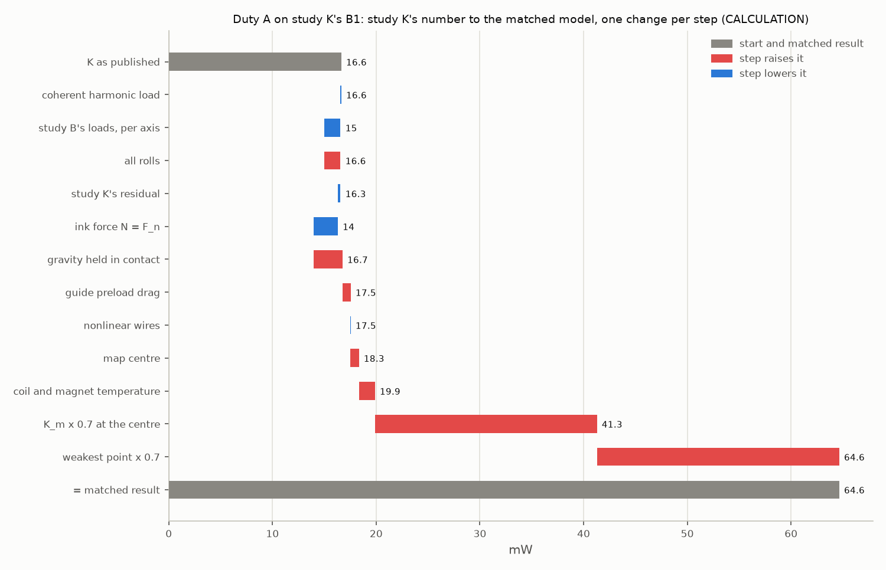
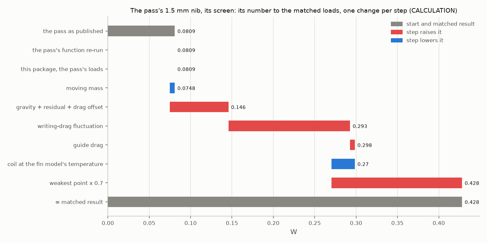
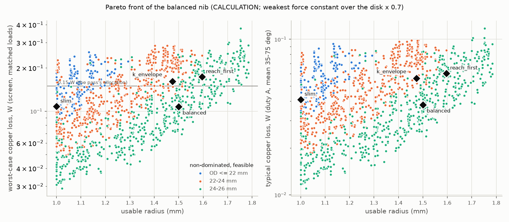
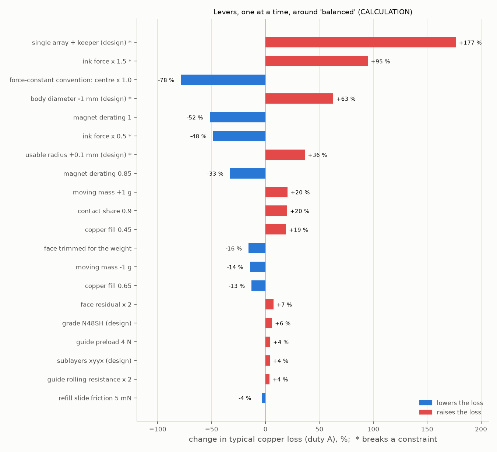
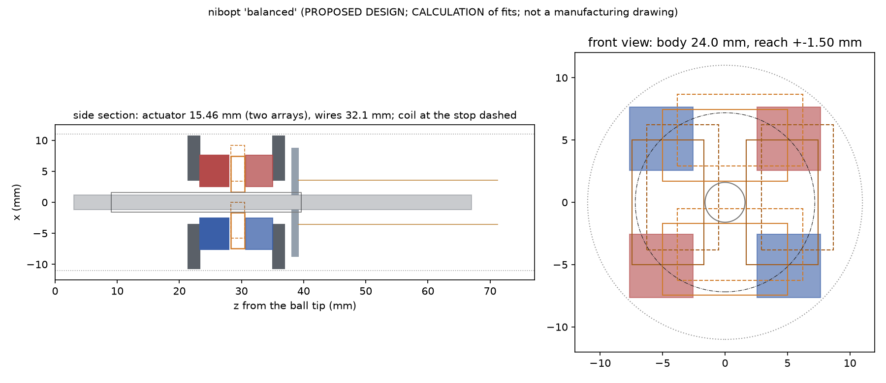
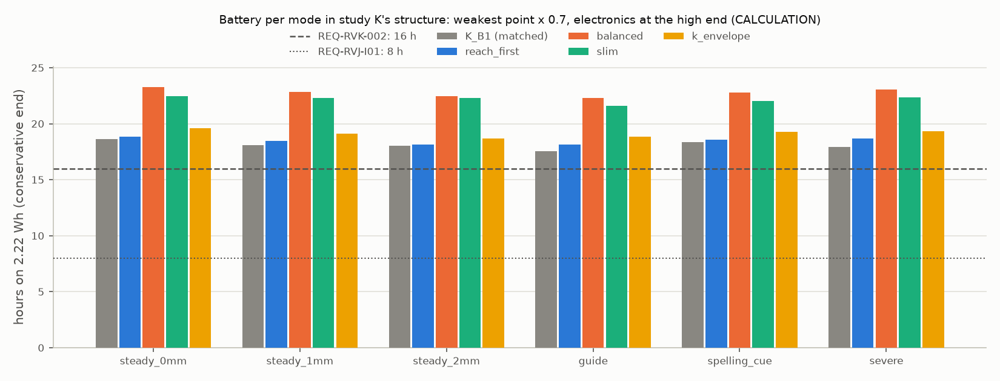

# The balanced nib's reach, force and heat, reconciled and optimised (study N, round 4)

## The answer in plain words

Every number in this summary is a calculation (CALC) on a proposed design (PROPOSED DESIGN) unless it is a limit or a target, which carries its own label. Nothing was measured.

**What the nib is.** In Rev K the ballpoint refill rides in a small carrier. Two flat coils on the carrier sit between fixed magnets; current in the coils pushes the carrier sideways to cancel the hand's tremor. The *reach* is how far the tip can move from the centre: ±1.06 mm in Rev K. The coils warm up. How much depends on how hard they must push (the ball's drag on the paper as it writes, the weight of the moving parts, the friction of the guide that carries them) and on how strong the magnets are at the weakest point of the travel.

**Two earlier estimates disagreed.** Study K put Rev K's nib at about 17 mW in normal writing. An independent engineering pass re-optimised the coils and reported that a ±1.5 mm nib fits the 24 mm pen at 0.081 W in its worst-case test. Put under one set of rules (CALC):

- **Rev K's nib takes about 65 mW, not 17**, with the cautious rule the brief asks for: take the magnets at the weakest point of the travel and assume the real parts give 70 % of the ideal model. Only a small part of the difference is physics (17 → 20 mW); the rule accounts for the rest. With study K's own optimistic rule the matched number is 20 mW.
- **The pass's ±1.5 mm nib takes 0.43 W in the worst-case test, not 0.081 W**, and would warm the skin to 46 °C in a 30 °C room (the limit is 41 °C, LIT AMF-34; the room PROPOSED DESIGN, REQ-THM-001). The pass stood in for every steady load with a 20 mN push. The realistic loads are three to four times that: the weight of the moving parts, the counter-face's small error, and the ball's drag, which turns with the writing direction.
- **The pass's ±1.06 mm nib is as good as Rev K's** (64 against 65 mW). It also fixes a real flaw: with study K's stiff anchor, stretching the lead wires at the stop adds so much tension that they fail the fatigue check (safety factor 0.71 where 1.5 is required). A soft, floating anchor fixes that.
- **The ball's drag on the paper makes about two thirds of the heat in normal writing**; the weight of the moving parts makes most of the rest. Study K's text said the weight dominated, but its own sums had set the weight aside while the ball is on the paper.

**What the search found.** A search of 13,200 designs covered reach, body width, magnets, iron, coils, lead wires, anchor, guide and lighter moving parts; 8,361 met every limit (CALC). The most useful single change is **a second set of magnets on the far side of the coils**. It cuts the loss to about a third at the same size, and beyond ±1.3 mm in a 24 mm body only designs with two magnet sets work. The four candidates (CALC on PROPOSED DESIGNS; "worst case" is the pass's periodic test with realistic loads; battery at the cautious end, steady writing with 1 mm of tremor):

| | reach | body | length | pen mass | typical loss | worst case | skin, severe tremor, 30 °C room | battery |
|---|---|---|---|---|---|---|---|---|
| Rev K's nib, matched | ±1.06 mm | 24 mm | 145 mm | 66 g | 65 mW | 0.17 W | 38 °C | 18 h |
| **balanced (recommended)** | **±1.50 mm** | **24.0 mm** | **157 mm** | **70 g** | **38 mW** | **0.11 W** | **34 °C** | **23 h** |
| reach-first | ±1.60 mm | 23.7 mm | 156 mm | 67 g | 60 mW | 0.17 W | 36 °C | 18 h |
| inside Rev K's 150 mm | ±1.47 mm | 23.5 mm | 150 mm | 66 g | 56 mW | 0.16 W | 36 °C | 19 h |
| slim | ±1.00 mm | 20.9 mm | 154 mm | 60 g | 41 mW | 0.11 W | 35 °C | 22 h |

**The three questions.**

1. **Can ±1.5 mm be reached within the heat limits, at realistic loads, in a body of 24 mm or less?** Yes, on paper. The balanced candidate takes 38 mW in typical writing and 0.11 W in the worst-case test, keeps the skin at 34 °C, and runs 23 h on the cell. The price is length: the pen grows from 145 to 157 mm, 7 mm over Rev K's 150 mm target (REQ-RVK-001, proposed). The second magnet set and the longer lead wires push the head back; the wires must be 32 mm long so they do not fatigue at the larger travel. Inside 150 mm the best found is ±1.47 mm at 56 mW.
2. **What would ±2 mm need?** A body about 27.5–30 mm across. The narrowest design that met every limit is 27.5 mm across and 165 mm long, at 54 mW typical and 0.17 W worst case. At 30 mm and ≤ 160 mm it takes 21 mW. Below 27 mm the 3.3 V supply (ASSUMPTION: the low-battery bus), the lead wires' fatigue and the heat all fail. The layout is the same: two magnet sets, a ball guide and eight lead wires 36–40 mm long on a soft anchor. It does not fit a 24 mm pen.
3. **Best reach per watt, and the lever that matters most?** In a 24 mm body the most reach per watt is at ±1.0–1.1 mm (21 mW for ±1.05 mm). ±1.5 mm costs about 38 mW. Each extra 0.1 mm of reach costs about a third more heat, and each millimetre less body width about two thirds more. The biggest design lever is the second magnet set: without it the loss nearly triples. Among the unknowns, the ink force at the ball matters most: 1.5 times the force roughly doubles the loss. Next comes the real strength of the magnets: at 100 % of the model instead of 70 %, the loss halves.

**What to do next.** Two measurements set everything above: wind an actuator coupon of the balanced candidate and measure its force map (EXP-NB01), and measure the ball's writing drag with the counter-face (EXP-NB02). Then the soft anchor (EXP-NB03), lead fatigue with current (EXP-NB04) and guide drag against preload (EXP-NB05). Section 9 proposes decisions DEC-080…084, requirement changes, experiments EXP-NB01…NB09 and three ledger rows.

## 1. What was asked, and how it was done

Study N, 2026-09-30. Everything below is a calculation on proposed designs: nothing was built or measured. Code in `nibopt/`, results in `results/nibopt/` (every JSON carries a `stabpen.provenance` block), CAD in `mechanics/cad/nibopt.py`. Evidence labels: CALC (a calculation in `nibopt/`), SIM (an executed simulation, quoted from its study), PROPOSED DESIGN (a dimension or choice made here), MFR / LIT (a ledger id in `docs/evidence.csv` or in `results/nibopt/evidence_rows.csv`), ASSUMPTION (an input nobody has measured; the experiment that pins it is named). The magnet model is an upper bound (ideal iron, images); every headline number derates it to 0.7 at its weakest point in the workspace.

The lead asked for four things. (1) Put study K's B1, the pass's re-optimised 1.059 mm and 1.5 mm nibs and its 20 mm compaction under identical assumptions, and explain every difference between study K's and the pass's numbers. (2) Search the nib family for the best reach, the least worst-case and typical loss, and the smallest body, under the listed constraints. (3) Answer three questions plainly. (4) Deliver CAD and pen-level budgets. `nibopt/` imports `revk/`, `bnib/`, `revj/` and `nose2/` read-only and reproduces their numbers before changing anything. Its 17 tests check the reproductions and invariants, including study K's chain to 1e-4, the pass's screen to 0.2 % and study K's fin model to 1e-12. Section 8 has the commands.

## 2. Task 1: the four designs under one set of assumptions

### 2.1 What was matched

| item | matched choice (label) | study K had | the pass had |
|---|---|---|---|
| designs | study K's B1 as study K laid it out (`results/revK/layout.json`); the pass's re-optimised 1.059 mm and 1.5 mm nibs in 24 mm and its 20 mm / 1.059 mm compaction (`results/improvement/mechanics/`), each with its own coil, wires, anchor and guide (PROPOSED DESIGN, theirs) | - | - |
| gravity | m g cos(theta) on the moving mass at 35, 50, 60 and 75 deg and twelve rolls, held by the coils in contact and pen-up: study K's head keeps the face parallel to the paper, so nothing trims the weight (CALC) | trimmed in contact in the budget (study B's face schedule), although its text says most of the power holds the weight | inside a constant 20 mN along the motion |
| face residual | study K's Monte Carlo re-drawn (seed 5, 20,000 draws): 5.7 mN mean, 6.4 mN rms for the mean loss, 11.2 mN at the 95th percentile aligned with gravity for the worst case (CALC) | the same Monte Carlo, but the chain used study B's +1 sigma IMU residual (16 mN at 35 deg) | 20 mN constant (40 and 80 mN as sensitivities) |
| writing drag | the ball's drag in every writing direction at 30.5 mm/s (LIT CON-20) with the ink force at the ball N = F_n = 0.196 N at every tilt (study K's constant-force float; PROPOSED DESIGN), common oil ink (LIT CON-13): 28 mN at 35 deg, its mean offset and its fluctuation per axis; plus the refill slide 10 mN x cot(theta) and the face friction (ASSUMPTION, study B) | study B's model: N = F_s / sin(theta), 38 mN at 35 deg | none |
| guide drag | mu_roll x the total ball load from the opposed-race Hertz model at each design's preload (4 N per race for all four): 8.1 mN at 35 deg (CALC; mu_roll 0.001 ASSUMPTION, AMF-262) | 2.6 mN (the couple's ball load only) | 8.1 mN in its guide study, not in its screen |
| wires | the pass's nonlinear beam-column with an axially compliant anchor (`revk/feasibility.wire_anchor`, read-only) at each design's anchor stiffness (CALC) | linear, 10,000 N/m anchor | nonlinear, 100 N/m floating anchor |
| force constant | primary: the weakest singular value of the 2 x 2 force matrix over the usable disk x 0.7 in every direction ("weakest x 0.7"); for comparison: the centre value x 1.0 (study K's low end), x 0.7 (study K's high end) and the pass's map x 0.7 at each position (CALC; the image-method model is an upper bound, 0.7 is the stated derating, ASSUMPTION) | centre x 1.0 to x 0.7 | the map's own matrix x 0.7 |
| temperature | copper resistance and magnet Br at the coil temperature that study K's fin model gives for the duty's loss at 35 deg (thermal loop, two passes; magnets at the coil's temperature, an upper bound on their warming) (CALC) | 20 degC | copper +90 K (x 1.354), magnets 20 degC |
| duties | (a) typical: study B's duty A (0.2 mm rms per axis at 8 Hz, 70 % contact; mean over the four tilts and twelve rolls; worst = 35 deg, worst roll, residual p95) and the severe-tremor correction duty at study F's +2-words target (below); (b) the pass's worst-case periodic screen (full-radius sinusoids at 4 / 8 / 12 Hz in eight directions, continuous contact at 35 deg, every roll) with the matched loads | duty A | the screen |
| skin | study K's fin model (`revk/budgets.heat`, reproduced to 1e-12 in the tests) generalised to the body diameter, 30 degC room, study K's other heat sources at its high end; coil = shell + P x 15 K/W (CALC; h 10 W/m^2 K ASSUMPTION) | the same at 24 mm, with its nib numbers | not computed (+90 K as a screen) |
| battery | study K's modes on the LIR14500 (2.22 Wh usable) with the matched nib loss: "conservative" = weakest x 0.7 with the electronics at study K's high end; "optimistic" = centre x 1.0 with the electronics at its low end (CALC) | centre x 0.7 / x 1.0 with its chain | - |

**The severe-tremor correction duty (CALC fitted to SIM statistics).** Study F (`docs/readable_target.md` s8, `results/readable/readable.json`) found that the nib's command in the severe class, scaled so that the words land at DEC-067's +2-words residual, is 1.036 mm rms in 2-D (SIM) for an unlimited reach. This package makes a 60 s elliptical (minor/major 0.4) narrowband Gaussian process at 6 Hz (study R's severe classes, 5.7-6.3 Hz) with 0.6 Hz of line width, whose magnitude spread matches study F's perfect-knowledge command (p50 / p90 / p99 1.21 / 2.50 / 3.81 mm), scaled to 1.036 mm, clipped at the design's reach and smoothed by a 40 Hz servo. At +-1.06 mm the nib then travels 0.76 mm rms and sits at its limit 32 % of the time; at +-1.5 mm 0.90 mm rms and 14 % (CALC). Study F's own tip residuals at these reaches are quoted with the reach (SIM, interpolated).

### 2.2 The matched table

All CALC on the four PROPOSED DESIGNS; the bold rows are the brief's primary numbers.

| quantity (label) | Rev K's B1 (study K) | pass 1.059 mm / 24 mm | pass 1.5 mm / 24 mm | pass 1.059 mm / 20 mm |
|---|---|---|---|---|
| usable radius / stop (mm) (PD) | 1.059 / 1.259 | 1.059 / 1.259 | 1.500 / 1.700 | 1.059 / 1.259 |
| body OD / length (mm) (PD / CALC) | 24 / 145.1 | 24 / 148.3 | 24 / 152.3 | 20 / 152.3 |
| moving mass, this model (g) (CALC) | 3.44 | 3.59 | 3.44 | 2.66 |
| K_m at the centre x / y, upper bound (N/sqrt W) (CALC) | 0.327 / 0.265 | 0.281 / 0.268 | 0.273 / 0.219 | 0.135 / 0.147 |
| weakest over the disk / x 0.7 (N/sqrt W) (CALC) | 0.235 / 0.164 | 0.230 / 0.161 | 0.158 / 0.111 | 0.103 / 0.072 |
| wires: n x d x L (mm), anchor (N/m) (PD) | 4 x 0.10 x 26.8, 10000 | 8 x 0.10 x 30.0, 100 | 8 x 0.10 x 34.0, 100 | 8 x 0.10 x 30.0, 100 |
| Goodman at the stop, worst tolerance corner (CALC; >= 1.5) | 0.71 | 1.81 | 1.70 | 1.81 |
| guide drag at 35 deg (mN) / Hertz sustained / drop (GPa) (CALC) | 8.1 / 2.64 / 3.05 | 8.1 / 2.65 / 3.05 | 8.1 / 2.68 / 3.05 | 8.1 / 2.72 / 3.05 |
| lead factor R_loop / R_coil (CALC) | 1.214 | 1.120 | 1.136 | 1.120 |
| **duty A, mean 35-75 deg (mW): weakest x 0.7** (CALC) | **64.6** | **63.7** | **141.6** | **354.1** |
| duty A, mean: centre x 1.0 / centre x 0.7 (mW) (CALC) | 19.9 / 41.3 | 21.2 / 44.2 | 27.3 / 57.0 | 73.7 / 162.7 |
| duty A, worst (35 deg, worst roll, residual p95): weakest x 0.7 / centre x 1.0 (mW) (CALC) | 124.1 / 43.9 | 123.0 / 42.4 | 271.6 / 60.6 | 653.5 / 143.6 |
| severe duty (study F's +2-words residual, 6 Hz), mean / at 35 deg: weakest x 0.7 (mW) (CALC on SIM statistics) | 65.9 / 104.5 | 64.4 / 102.8 | 142.9 / 227.3 | 356.8 / 558.2 |
| severe duty: nib travel rms 2-D (mm) / share at the stop (CALC) | 0.76 / 0.32 | 0.76 / 0.32 | 0.90 / 0.14 | 0.76 / 0.32 |
| tremor left at the tip at the severe class, estimator at the +2 residual / perfect knowledge (mm) (SIM, study F, interpolated by reach) | 1.02 / 0.96 | 1.02 / 0.96 | 0.82 / 0.67 | 1.02 / 0.96 |
| **worst-case screen, matched loads (W): weakest x 0.7** (CALC) | **0.168** | **0.171** | **0.428** | **1.246** |
| screen: the pass's map x 0.7 / centre x 1.0 (W) (CALC) | 0.137 / 0.058 | 0.140 / 0.058 | 0.270 / 0.089 | 0.691 / 0.207 |
| screen: coil if sustained (degC) (CALC) | 44 | 45 | 66 | 141 |
| hours, steady 1 mm: conservative / optimistic (CALC) | 18.1 / 46.5 | 17.9 / 44.6 | 10.8 / 39.6 | 5.3 / 21.6 |
| hours, severe duty: conservative / optimistic (CALC) | 17.9 / 46.2 | 18.1 / 45.0 | 11.0 / 40.2 | 5.4 / 21.7 |
| skin, hottest point, severe at 35 deg: weakest x 0.7 / centre x 1.0 (degC, 30 degC room) (CALC) | 37.8 / 32.8 | 37.7 / 32.9 | 46.3 / 33.6 | 77.1 / 40.3 |
| front finger pad, steady 1 mm at 35 deg: weakest x 0.7 (degC) (CALC) | 37.4 | 37.5 | 46.3 | 77.1 |
| peak force (N) / current (A) / voltage (V) at 3.3 V (CALC) | 0.161 / 0.66 / 2.34 | 0.148 / 0.61 / 2.03 | 0.154 / 0.96 / 3.33 | 0.135 / 1.42 / 5.36 |
| servo bandwidth allowed, worst case (Hz; >= 40) (CALC) | 46.1 | 45.0 | 45.9 | 52.2 |
| coil clearance at the stop, p99 (mm; >= 0.2) (CALC) | 0.21 | 0.28 | 0.25 | 0.21 |
| constraints failed (CALC) | goodman, wires_max | none | skin, voltage | skin, board, voltage, magnet_T |

Battery per mode in study K's structure and the hottest skin point (CALC; `results/nibopt/reconciliation.json`):

| mode: hours conservative - optimistic / hottest skin at 35 deg, weakest x 0.7 (degC) | Rev K's B1 (study K) | pass 1.059 mm / 24 mm | pass 1.5 mm / 24 mm | pass 1.059 mm / 20 mm |
|---|---|---|---|---|
| steady_0mm | 18.6 - 47.5 / 37.4 | 18.8 - 46.2 / 37.4 | 11.6 - 41.3 / 45.6 | 5.7 - 22.9 / 74.5 |
| steady_1mm | 18.1 - 46.5 / 37.7 | 17.9 - 44.6 / 37.8 | 10.8 - 39.6 / 46.6 | 5.3 - 21.6 / 77.4 |
| steady_2mm | 18.1 - 46.4 / 37.7 | 17.9 - 44.5 / 37.8 | 10.5 - 38.7 / 47.0 | 5.3 - 21.6 / 77.5 |
| guide | 17.6 - 45.7 / 37.7 | 17.7 - 44.4 / 37.6 | 10.9 - 39.6 / 46.2 | 5.3 - 21.7 / 76.9 |
| spelling_cue | 18.3 - 47.4 / 37.4 | 18.5 - 46.1 / 37.4 | 11.5 - 41.3 / 45.6 | 5.7 - 22.9 / 74.5 |
| severe | 17.9 - 46.2 / 37.8 | 18.1 - 45.0 / 37.7 | 11.0 - 40.2 / 46.3 | 5.4 - 21.7 / 77.1 |

**Reading it.**

- **Study K's B1 and the pass's 1.059 mm nib are the same machine on power** (65 vs 64 mW typical, 0.168 vs 0.171 W worst case, 38 degC skin, 18 h at the conservative end; CALC). The pass's re-optimised coil gains nothing at this reach under realistic loads; what it does gain is fatigue life: with study K's 10,000 N/m anchor, B1's wires fail the Goodman check at the worst tolerance corner (0.71 against 1.5; CALC), while the pass's 100 N/m floating anchor gives 1.81. B1 as laid out also leaves its wires 0.04 mm short of the 0.3 mm running clearance to the rear race at the stop (CALC).
- **The pass's 1.5 mm nib does not meet the heat limit under realistic loads.** Its worst-case screen is 0.43 W with the brief's convention (0.27 W on its own map convention), not 0.081 W; the severe duty warms the skin to 46.3 degC in a 30 degC room (limit 41; 45.6-47.0 degC in every mode), the peak force needs 3.33 V on a 3.3 V bus, and the cell lasts 10.5-11.6 h at the cautious end, below REQ-RVK-002's 16 h (CALC).
- **The 20 mm compaction is far outside:** 0.35 W typical, 1.25 W worst case, 77 degC skin; its magnets would pass 80 degC and study K's 14 mm board does not fit a 20 mm body (CALC).
- All four keep their structural modes (servo bandwidth 45-52 Hz allowed against 40 Hz), their Hertz stresses (2.6-2.7 GPa against 3.33 GPa) and their coil clearance (0.21-0.28 mm p99 against 0.2 mm) (CALC).

### 2.3 Study K's number, step by step

One change per step, duty A, mean over 35-75 deg (CALC; the table is `results/nibopt/fig_waterfall_K.csv`):

| step | change | duty A, mean (mW) | change (mW) |
|---|---|---|---|
| 0 | K as published: study K's chain at duty A: study B's P_cont 7.56 mW (results/revK/revK.json power_table km1_q0.2) x 1.80 x 1.21 + the 2.6 mN guide friction, K_m at the upper bound (study K's low end) | 16.63 | - |
| 1 | coherent harmonic load: the same chain re-run with bnib/loads.py as the pass corrected it (spring and inertia keep their phase) | 16.55 | -0.07 |
| 2 | study B's loads, per axis: study B's loads (bnib/loads.loads_at with the counter-face: F_s along the pen, +1 sigma IMU errors, the weight trimmed in contact) re-implemented per axis with study K's K_m (0.334 / 0.272) in place of the scalar x 1.80, roll 0, linear wires, 2.6 mN guide, 20 degC | 14.98 | -1.57 |
| 3 | all rolls: mean over twelve rolls (study B's fast mode evaluates roll 0 only; with unequal x and y K_m the roll matters) | 16.55 | +1.57 |
| 4 | study K's residual: study K's face-parallelism Monte Carlo (5.7 mN mean, 6.4 mN rms) in place of study B's deterministic +1 sigma IMU residual (16 mN at 35 deg); weight still trimmed, F_s still along the pen | 16.30 | -0.26 |
| 5 | ink force N = F_n: study K's constant-force float: the ball's normal force is F_n = 0.196 N at every tilt (study B's duty model used F_s / sin(theta): 0.26 N at 35 deg), so the ball's drag is 28 mN instead of 38 mN at 35 deg | 13.95 | -2.35 |
| 6 | gravity held in contact: study K's head keeps the face parallel to the paper, so the coils hold the 3.44 g moving mass (28 mN at 35 deg) in contact as well as pen-up; study B's schedule trimmed the face to cancel it in contact and study K's budget inherited that | 16.75 | +2.80 |
| 7 | guide preload drag: the ball guide's drag from its 4 N internal preload per race (8.1 mN) instead of the couple's ball load alone (2.6 mN) (the pass's correction) | 17.54 | +0.79 |
| 8 | nonlinear wires: the pass's beam-column wires with study K's 10,000 N/m anchor (at duty A's 0.28 mm radius the force is small) | 17.52 | -0.01 |
| 9 | map centre: study K's coil's centre force matrix from this package's map (fine quadrature, raw image method: 0.329 / 0.266 N/sqrt(W)) in place of study K's values scaled to study B's calibration (0.334 / 0.272) | 18.33 | +0.81 |
| 10 | coil and magnet temperature: copper resistance and Br at the coil temperature of study K's fin model (33.0 degC at 35 deg; study K computed at 20 degC) | 19.87 | +1.55 |
| 11 | K_m x 0.7 at the centre: study K's high-end convention (centre K_m x 0.7) | 41.28 | +21.41 |
| 12 | weakest point x 0.7: the brief's convention: the smallest singular value of the force matrix over the usable disk x 0.7 in every direction | 64.64 | +23.36 |

Study K's 16.6 mW becomes 64.6 mW. Only 16.6 -> 19.9 mW (x 1.2) is physics: gravity held in contact (+2.8 mW), the ink force at the ball (-2.35 mW), the guide's preload drag (+0.8 mW), the raw force map (+0.8 mW) and the coil's temperature (+1.55 mW) nearly cancel. The rest (19.9 -> 64.6 mW, x 3.25) is the force-constant convention: centre x 0.7 doubles it (x 2.08), and taking the weakest point of the workspace instead of the centre adds x 1.57 more. Study K's own high end (centre x 0.7) was 33.9 mW; the matched centre x 0.7 is 41.3 mW.

**What the loss is made of** (B1, duty A, weakest x 0.7, mean; CALC): writing drag 43.4 mW (67 %), gravity 20.1 mW (31 %), guide drag 3.3 mW, face residual 1.5 mW, inertia and wires 0.15 mW, cross terms -3.8 mW. The ball's drag on the paper, not the moving mass's weight, dominates the typical duty; in the worst case (35 deg, worst roll) the split is 70 / 39 mW, still drag first. Study K's text says the opposite ("most of it holds the 3.4 g moving mass against gravity"), but the chain it used (study B's duty model) trimmed the weight in contact, so the weight counted only pen-up: restoring it in contact (step 6) adds 2.8 mW to 14.0 mW. In study K's own number the ball's drag was the larger part. Gravity dominates only the pen-up hold.

### 2.4 The pass's numbers, step by step

The pass's worst-case screen on its 1.5 mm nib, one change per step (CALC):

| step | change | worst-case screen (W) | change (W) |
|---|---|---|---|
| 0 | the pass as published: results/improvement/mechanics: worst cycle-mean copper loss, 20 mN constant residual along the motion, field x 0.7 on the map, coil and leads at +90 K | 0.0809 | - |
| 1 | the pass's function re-run: revk/improve.matched_force_duty on the pass's stored map (read-only): reproduces it | 0.0809 | +0.0000 |
| 2 | this package, the pass's loads: nibopt's screen with the pass's loads, mass and hot factor on nibopt's own 97-point map: the models agree | 0.0809 | -0.0000 |
| 3 | moving mass: this package's moving-mass model 3.44 g (study K's layout conventions) in place of the pass's 3.67 g | 0.0748 | -0.0060 |
| 4 | gravity + residual + drag offset: the constant load: gravity on 3.44 g at 35 deg and the worst roll (27.6 mN) + study K's residual p95 (11.2 mN) aligned with it + the drag's mean offset, in place of 20 mN along the motion | 0.1457 | +0.0709 |
| 5 | writing-drag fluctuation: the ball's drag as the writing direction turns (28 mN magnitude at N = F_n) with the refill-slide and face friction (study B's friction share), continuous contact | 0.2927 | +0.1470 |
| 6 | guide drag: the ball guide's Coulomb drag at its 4 N preload (8.1 mN), opposing every stroke | 0.2984 | +0.0057 |
| 7 | coil at the fin model's temperature: coil and magnets at the temperature study K's fin model gives for this screen sustained at 35 deg (53 degC: x 1.224) instead of +90 K copper (x 1.354) with 20 degC magnets | 0.2701 | -0.0283 |
| 8 | weakest point x 0.7: the brief's convention: the smallest singular value over the disk x 0.7 in every direction, in place of the map's own matrix x 0.7 at each position | 0.4280 | +0.1579 |

The same steps on all four designs (W, CALC):

| design | the pass (20 mN) | re-run | this package, the pass's loads | + matched static | + drag fluctuation | + guide drag | coil temperature | weakest x 0.7 |
|---|---|---|---|---|---|---|---|---|
| Rev K's B1 (study K) | 0.0248 | 0.0248 | 0.0248 | 0.0638 | 0.1592 | 0.1624 | 0.1374 | 0.1680 |
| pass 1.059 mm / 24 mm | 0.0299 | 0.0299 | 0.0299 | 0.0720 | 0.1619 | 0.1651 | 0.1398 | 0.1714 |
| pass 1.5 mm / 24 mm | 0.0809 | 0.0809 | 0.0809 | 0.1457 | 0.2927 | 0.2984 | 0.2701 | 0.4280 |
| pass 1.059 mm / 20 mm | 0.1386 | 0.1386 | 0.1386 | 0.1978 | 0.5801 | 0.5950 | 0.6911 | 1.2463 |

The pass's own function re-run on its stored map reproduces its published numbers exactly, and this package's screen with the pass's loads reproduces them to within 0.2 % (tests `test_pass_screen_reproduced`), so every later step is a change of assumption, not of code. The largest single change is the load: the pass stood for all static loads with 20 mN along the motion; the matched static load is gravity on 3.44 g at 35 deg and the worst roll (27.6 mN) plus study K's residual p95 (11.2 mN) aligned with it plus the drag's mean offset, and the ball's drag then turns with the writing direction (28 mN in magnitude). With these the screen sits between the pass's own 40 mN (0.189 W) and 80 mN (0.621 W) sensitivity cases. The pass's +90 K copper overstated the temperature at these losses (the fin model gives 53 degC for the 1.5 mm nib's screen sustained), which lowers the number by 9 %; the brief's weakest-point convention then raises it by 58 %.

### 2.5 Every difference between study K and the pass, item by item

| # | item | study K | the pass | matched | effect (CALC) |
|---|---|---|---|---|---|
| 1 | which duty | study B's duty A: typical writing, mean over 35-75 deg | a worst-case periodic screen: full radius at 4-12 Hz, continuous contact | both, plus the severe-tremor duty | study K's 16.6 mW and the pass's 24.8 mW on the same B1 answer different questions (typical vs worst case) |
| 2 | force-constant convention | centre K_m x 1.0 (low end) to x 0.7 (high end) | the map's own matrix x 0.7 at each position | weakest point x 0.7 (brief); centre x 1.0 alongside | B1 duty A 19.9 -> 41.3 (centre x 0.7) -> 64.6 mW; 1.5 mm screen 0.270 -> 0.428 W |
| 3 | gravity in contact | trimmed (inherited from study B's face schedule; study K's head has no trim) | not separate (inside 20 mN) | held in contact and pen-up | B1 duty A +2.8 mW; the trim as a lever: -15 % on the balanced candidate |
| 4 | face residual | Monte Carlo 5.7 mN mean in the text; study B's +1 sigma IMU residual in the chain | 20 mN constant along the motion | study K's Monte Carlo (rms for the mean, p95 for the worst) | B1 duty A -0.26 mW; 1.5 mm screen: part of +0.071 W with gravity and the drag offset |
| 5 | writing drag | study B's model with N = F_s / sin(theta) (38 mN at 35 deg) | none | N = F_n (study K's float), 28 mN at 35 deg, turning with the writing direction | B1 duty A -2.35 mW; 1.5 mm screen +0.147 W (the fluctuation alone) |
| 6 | guide drag | 2.6 mN | 8.1 mN at 4 N preload (in its guide study, not its screen) | preload model at each design's preload | B1 duty A +0.79 mW; 1.5 mm screen +0.006 W |
| 7 | wire force | linear, 10,000 N/m anchor | nonlinear, 100 N/m anchor | nonlinear at each design's anchor | duty A -0.01 mW; decisive for fatigue: B1's anchor gives Goodman 0.71 (fails) |
| 8 | moving mass | 3.44 g | 3.49 g (B1), 3.67 g (1.5 mm) | this package's model on study K's layout conventions: 3.44 g for both | 1.5 mm screen -0.006 W |
| 9 | temperature | 20 degC copper and magnets | copper +90 K, magnets 20 degC | fin model's coil temperature, thermal loop | B1 duty A +1.55 mW (33 degC); 1.5 mm screen -0.028 W (53 degC) |
| 10 | force-map calibration | study K's K_m scaled to study B's calibration (0.334 / 0.272 N/sqrt W) | raw image method | raw image method, fine quadrature (0.329 / 0.266) | B1 duty A +0.81 mW |
| 11 | leads | x 1.21 (four 0.10 mm wires and the flex) | eight wires in parallel pairs (x 1.12-1.14) | each design's own leads | built into each design |
| 12 | roll | study B's fast mode at roll 0, scaled x 1.80 | its screen's worst direction | mean of twelve rolls (typical), worst roll (worst case) | -1.57 then +1.57 mW: study K's x 1.80 happens to equal the per-axis roll mean |
| 13 | spring and inertia | added in magnitude (study B's original) | coherent (its correction) | coherent | B1 duty A -0.07 mW |
| 14 | skin | fin model at 24 mm with its nib numbers: 36-38 degC | not computed | fin model at each body diameter | B1 37.8 degC; 1.5 mm nib 46.3 degC (fails 41 degC) |
| 15 | battery | 23.5-48.6 h at steady 1 mm | not computed | study K's modes, matched nib loss | B1 18.1-46.5 h at steady 1 mm |

## 3. How the carrier is held: guide topologies screened first

The counter-face's couple is what decides the guide. The ink force at the ball and the face's push on the refill's rear end are parallel and opposite, so the nib holds no side load, but they are 67.8 mm apart along the tilted refill (CALC, study K): the carrier must carry a couple M = F_n L cos(theta) = 10.9 mN m at 35 deg (more when the refill holder moves back: 12.8 mN m on the balanced candidate), and it must do so while staying soft sideways (a stiff suspension costs copper loss at every excursion). Each alternative against that (CALC, `nibopt/suspension.screen_topologies`, at the 1.7 mm stop of a +-1.5 mm nib):

| topology | carries the couple? | lateral force at the 1.7 mm stop (mN) | drag (mN) | why |
|---|---|---|---|---|
| wires alone (study B / K's four 0.10 mm C17200 wires on a 5.5 mm circle) | no | - | 0.0 | 0.70 N of compression per wire against 34.4 mN fixed-fixed buckling (study K N14) |
| four wires pre-tensioned to 1.19 N each (circle 5.5 mm, 34.0 mm long) | yes | 286 | 0.0 | tension stiffening n T / L: the spring force at the stop exceeds the moving mass's weight |
| four wires pre-tensioned to 0.72 N each (circle 9.0 mm, 40.0 mm long) | yes | 149 | 0.0 | tension stiffening n T / L: the spring force at the stop exceeds the moving mass's weight |
| necked struts (stiff middle, short C17200 hinges) in place of wires and balls | yes | 12 | 0.0 | a hinge short enough to carry the couple's compression twice over bends to Goodman 1.04 at the stop (target 1.5) |
| two planar flexure stages (beams 15 x taller than wide, 5 N/m lateral each, 20 mm apart) | no | - | 0.0 | tilt 149 mrad under the couple (5.4 mm at the ball): the out-of-plane to in-plane stiffness ratio of a planar beam is only (height / width)^2 |
| nested parallel-blade XY stage (two blades per axis, 16 mm apart) | yes | 49 | 0.0 | carries the couple, but its lateral spring force at the stop is several times the wires' and it needs two stages in series (about 35-60 mm) |
| ball thrust guide, 2 x 6 Si3N4 0.8 mm on 16.6 mm, 4 N preload per race + wires | yes | - | 8.1 | rolling drag mu_roll x total normal load, Coulomb |
| ball thrust guide, 2 x 6 Si3N4 0.8 mm on 16.6 mm, 1 N preload per race + wires | yes | - | 2.3 | rolling drag mu_roll x total normal load, Coulomb |

The ball thrust guide with the wires as leads (study K's topology, the pass's analysis) is the only one that carries the couple with a small lateral force; its cost is drag, mu_roll x the total ball load, which the preload sets. The search therefore keeps the ball guide and makes its preload, ball size and ball circle design variables, with the rear race either a full ring (the leads pass inside it) or one pad per ball (the leads pass between the pads, and the main board then has to move behind the counter-face head: +22.8 mm of pen). One more alternative was set aside before the search, by scaling (CALC), and the moving-mass options went into the search:

- **Moving magnet.** The poles weigh 3.8-7.0 g in the four candidates (7.0 g on the balanced one) against 3.29 g for the balanced candidate's whole moving carrier. Moving them at least doubles the moving mass, and the gravity and inertia terms of the loss grow with its square (gravity alone is 11.5 of the balanced candidate's 37.9 mW); moving poles over fixed iron also add a negative lateral stiffness. Its one advantage, leads that do not move, is already met by the wire leads within their fatigue limit. Not pursued.
- **Lighter moving parts** are in the search instead: a carbon-fibre carrier tube (1.55 g/cc, ASSUMPTION) or titanium, a titanium or aluminium flange (the aluminium one with 0.1 g of hard inserts under the balls), the flange's thickness and radius, and the refill holder's extension charged at 0.025 g per mm (the pass's convention, ASSUMPTION).

## 4. Task 2: the search

### 4.1 Variables, objectives, constraints

A design is 26 genes (`nibopt/optimise.py`; PROPOSED DESIGN ranges), built into a pen by the rules of study K's layout (`nibopt/design.py`):

| group | genes (range) |
|---|---|
| reach and body | usable radius 1.0-2.0 mm (the hard stop 0.2 mm beyond it); body OD 20-26 mm (22-34 mm in the +-2 mm runs) |
| magnets | pole side (0.55-1.0 of what the bore allows around the central hole), thickness 1.5-5 mm, grade N52 or N48SH (MFR AMF-139, AMF-28; low ends of Br), layout: one array and an iron keeper, or two arrays (poles on both sides of the winding), the second array's thickness 0.3-1.0 of the first |
| iron path | 1010 steel or Hiperco 50A plates, their thickness from a flux rule (1.5 / 2.1 T working density, ASSUMPTION) |
| winding | copper stack 0.8-2.6 mm, sublayer order xy or xyyx (x/y interleaving), fill 0.45 (etched flex), 0.55 (bonded round wire: study B / K) or 0.65 (bonded rectangular wire), racetrack bundle 0.8-3.2 mm, row and leg positions (fractions of the pole pitch), coil resistance 2-12 ohm per axis |
| wires (the leads) | 4 or 8 wires of 0.08 or 0.10 mm C17200, 26-50 mm long, anchor stiffness 50-10,000 N/m (log) |
| guide | preload 0.3-4 N per race, ball 0.8-1.5 mm, flange thickness 1.0-1.5 mm and radius, rear race ring or pads |
| moving mass | carrier tube Ti or CFRP, flange Ti or Al with inserts |
| board | study K's 14 mm board, or a 10 mm board 40 % longer |

**Objectives (all minimised):** minus the usable radius; the worst-case copper loss (the pass's screen with the matched loads, weakest x 0.7, the coil at the temperature it would reach sustained); the typical copper loss (duty A, mean 35-75 deg, weakest x 0.7); body OD; pen length.

**Constraints (CALC unless stated):** Goodman >= 1.5 at the stop at the pass's worst tolerance corner (diameter +2 %, length -0.05 mm, modulus +4 %, anchor +20 %, Kt 2.5; ASSUMPTION); Hertz <= 3.33 GPa under the sustained writing load and <= 3.67 GPa at a drop (the 4.2 GPa of the static rating, MFR AMF-260, with a static safety factor of 2 for quiet, accurate running and 1.5 for shock, MFR AMF-261; the stress scales with the cube root of the load); guide preload >= 1.2 x the preload at which the first ball unloads under the 35 deg couple (PROPOSED DESIGN; applied at the refinement, see below); lowest structural mode >= 2.5 x the 40 Hz servo bandwidth, ball free and stuck (REQ-BNIB-006; study B's loaded-mode model, read-only); coil clearance >= 0.2 mm at the stop at the 99th percentile (study K's tolerance loss 0.09 mm, CALC); skin <= 41 degC in a 30 degC room under the severe duty at 35 deg (LIT AMF-34); coil, magnets, leads, guide, board and counter-face head inside the body; length <= 175 mm (the Rev J envelope, ASSUMPTION); <= 3.3 V at the peak force with the coil hot, back-EMF included (ASSUMPTION: study B's low-battery bus); lead heating <= 45 K (the pass's screen); magnets below their grade's temperature.

**Method.** NSGA-II written here (`nibopt/optimise.py`: simulated binary crossover, polynomial mutation, Deb's constraint rules: feasible beats infeasible, then the smaller normalised violation), every evaluated point kept. Four runs: the main one over the whole space (96 x 80 generations, seed 7); +-2 mm with the body free to 34 mm (48 x 40, seed 11; objectives OD and typical loss) and again between 24 and 29.8 mm (48 x 30, seed 17), because the first left that band thinly sampled; +-1.5 mm in <= 24 mm (48 x 40, seed 13; objectives typical and worst-case loss). The optimiser uses a fast force map (17 positions: the centre and two rings of eight; its quadrature within 0.3 % of the fine one, test `test_fast_quadrature_converged`); every candidate is re-evaluated with the fine quadrature on 33 positions and its weakest point checked on 97 (equal to 1e-4); the reconciliation uses 97. The candidates are then refined by a (1 + 6) evolution strategy on the continuous genes (30 iterations, fill fixed at 0.55, the candidate's length cap and the preload floor added as constraints). The preload floor was added after the four archives were computed; the guide's drag is under 1 % of the typical loss, so it moves the front by well under 1 % (it matters for the balls, not for the watts).

### 4.2 The Pareto front

The main run's front has 1,444 non-dominated feasible designs in five objectives (`results/nibopt/pareto.json`, `fig_pareto.csv`); the four runs evaluated 13,200 designs, 12,186 of them buildable and 8,361 feasible (4,314 at fill 0.55). Reach against body diameter, and reach per typical watt, read off the pooled feasible points (CALC):

| body OD <= (mm) | largest usable radius, any fill (mm) | its typical (mW) / worst case (W) / length (mm) | largest usable radius, fill 0.55 and <= 160 mm (mm) | its typical (mW) / worst case (W) / length (mm) |
|---|---|---|---|---|
| 21 | 1.16 | 87.5 / 0.238 / 160.0 | 1.07 | 87.1 / 0.240 / 156.7 |
| 22 | 1.29 | 78.5 / 0.222 / 166.7 | 1.21 | 77.2 / 0.213 / 158.4 |
| 23 | 1.46 | 87.4 / 0.250 / 158.9 | 1.46 | 87.4 / 0.250 / 158.9 |
| 24 | 1.60 | 84.9 / 0.245 / 157.2 | 1.60 | 84.9 / 0.245 / 157.2 |
| 25 | 1.73 | 75.6 / 0.229 / 158.9 | 1.71 | 90.5 / 0.268 / 158.8 |
| 26 | 1.78 | 59.7 / 0.184 / 168.4 | 1.78 | 65.0 / 0.195 / 159.9 |
| 28 | 2.00 | 31.6 / 0.101 / 166.4 | 2.00 | 97.4 / 0.324 / 158.2 |
| 30 | 2.00 | 18.5 / 0.059 / 174.0 | 2.00 | 21.3 / 0.068 / 159.4 |
| 32 | 2.00 | 13.0 / 0.042 / 160.2 | 2.00 | 13.6 / 0.044 / 159.2 |
| 34 | 2.00 | 9.3 / 0.031 / 161.0 | 2.00 | 9.6 / 0.032 / 159.7 |

| usable radius bin (mm), OD <= 24, fill 0.55, <= 160 mm | lowest typical loss (mW) | its worst case (W) | OD (mm) | length (mm) | reach per typical watt (mm/W) |
|---|---|---|---|---|---|
| 1.0-1.1 | 21.2 | 0.056 | 23.7 | 151.4 | 49.6 |
| 1.1-1.2 | 27.8 | 0.073 | 23.9 | 150.9 | 40.7 |
| 1.2-1.3 | 31.0 | 0.084 | 23.9 | 150.7 | 41.6 |
| 1.3-1.4 | 33.9 | 0.092 | 24.0 | 148.6 | 38.8 |
| 1.4-1.5 | 47.8 | 0.130 | 24.0 | 149.9 | 29.6 |
| 1.5-1.6 | 39.8 | 0.113 | 24.0 | 157.2 | 37.7 |

| pen length cap (mm), OD <= 24, fill 0.55 | largest reach (mm) | lowest typical at +-1.0 / +-1.25 / +-1.5 mm (mW) |
|---|---|---|
| 145.2 | 1.009 | 60.0 / - / - |
| 148 | 1.475 | 31.5 / 40.3 / - |
| 150 | 1.478 | 26.7 / 33.9 / - |
| 152 | 1.500 | 21.2 / 31.0 / 56.6 |
| 155 | 1.551 | 21.2 / 31.0 / 52.2 |
| 160 | 1.596 | 21.2 / 31.0 / 39.8 |

Shortest pen for a reach (OD <= 24, fill 0.55): +-1 mm: 145.1 mm (60 mW); +-1.25 mm: 146.1 mm (53 mW); +-1.5 mm: 150.9 mm (78 mW)

What the front says (CALC; the counts come from the pooled archives in `nibopt/build/`, which `python3 -m nibopt.run` regenerates):

- **Reach is bought with body diameter, not with watts.** At a fixed body the largest reach is set by geometry and fatigue: the reach-first candidate sits on the coils' clearance to the bore at the stop, the poles' fit around the central hole (which grows with the stop), the lead wires' room between the refill and the rear race and the Goodman limit all at once, with 4.8 K of skin margin left. The 59 designs sampled beyond ±1.6 mm in 24 mm all failed the skin limit as well, most of them also the leads' room (52) and the supply (55). Between 21 and 26 mm each millimetre of body adds 0.07-0.25 mm of reach, 0.14 mm on average.
- **The typical loss rises about 2 x from ±1.0 to ±1.5 mm in 24 mm** (21 to 40 mW before refinement), because the central hole grows with the stop (the poles move outward) and the weakest point of a larger disk is weaker.
- **The ±1.4-1.5 mm bin reads worse than ±1.5 mm itself** (47.8 against 39.8 mW): the targeted run sampled ±1.5 mm 1,968 times, the main run the band below it far more thinly. The front there is under-sampled, not worse.
- **Length is the third currency.** Longer wires keep the fatigue margin at a larger stop, and a second magnet array thickens the stack; both push the counter-face head and the refill holder back (the pass's convention). Inside 24 mm the shortest pen for ±1.5 mm is 150.9 mm (78 mW); the least loss at ±1.5 mm is 57 mW within 152 mm, 52 mW within 155 mm and 40 mW at 157 mm.
- **Every feasible design beyond ±1.3 mm in 24 mm has two magnet arrays** (630 of 630); a single array with a keeper reaches at most ±1.25 mm, and at ±1.0 mm it needs 58 mW where two arrays need 21 mW. Wire sets of eight wires dominate (8 x 0.08 mm or 8 x 0.10 mm in parallel pairs: 2,784 of the 2,843 feasible fill-0.55 designs at ±1.3 mm or more), and the anchor floats: median 102 N/m and 95th percentile 408 N/m at ±1.3 mm or more; 99 % of all feasible designs sit at 1,000 N/m or below. The pad rear race (+22.8 mm of pen) almost never pays (146 of 4,314 feasible designs at fill 0.55).

### 4.3 The candidates

Selection (`nibopt/candidates.py`): fill 0.55 only (study B / K's bonded round wire; the 0.45 and 0.65 fills stay ASSUMPTIONS), length ≤ 160 mm for the first three (ASSUMPTION: at most 10 mm over REQ-RVK-001), and every constraint met after refinement:

- **reach_first**: the largest reach in ≤ 24 mm (ties within 0.03 mm by the worst-case loss);
- **balanced**: ±1.5 mm (DEC-050's option; where study F's perfect-knowledge line approaches DEC-067's target) in ≤ 24 mm with the least typical loss;
- **slim**: the narrowest body that keeps ±1.0 mm (DEC-060), ties within 0.25 mm by typical loss;
- **k_envelope**: the largest reach inside Rev K's envelope as REQ-RVK-001 states it (≤ 24 mm, ≤ 150 mm).

All four re-evaluated with the fine quadrature on 33 map positions; the balanced and reach-first minima agree with a 97-position map to 1e-4 (CALC). Every number CALC on a PROPOSED DESIGN:

| quantity (label) | reach_first | balanced | slim | k_envelope |
|---|---|---|---|---|
| usable radius / stop (mm) (PD) | 1.60 / 1.80 | 1.50 / 1.70 | 1.00 / 1.20 | 1.47 / 1.67 |
| body OD / length (mm) (PD / CALC) | 23.7 / 156.4 | 24.0 / 157.1 | 20.9 / 153.8 | 23.5 / 149.7 |
| poles w x t_m (mm), grade, layout (PD) | 4.90 x 3.55, N52, double (3.53) | 5.09 x 4.71, N52, double (4.34) | 4.35 x 4.06, N48SH, double (3.94) | 4.91 x 3.48, N52, double (1.84) |
| iron, plate thickness (mm) (PD / CALC) | 1010, 1.68 | 1010, 1.86 | Hiperco50A, 1.06 | 1010, 1.56 |
| winding: copper stack (mm), order, fill, bundle (mm) (PD) | 2.23, xyyx, 0.55, 2.39 | 2.24, xy, 0.55, 2.11 | 2.39, xy, 0.55, 1.78 | 2.14, xy, 0.55, 2.18 |
| coil resistance per axis (ohm) (PD) | 4.27 | 6.46 | 4.45 | 4.52 |
| wires n x d x L (mm), anchor (N/m) (PD) | 8 x 0.10 x 33.8, 342 | 8 x 0.10 x 32.1, 50 | 8 x 0.10 x 27.3, 501 | 8 x 0.08 x 28.9, 91 |
| guide: ball circle (mm), balls, preload per race (N), rear race (PD) | 7.23, 6 x 0.8 mm, 1.59, ring | 7.19, 6 x 0.9 mm, 1.82, ring | 6.69, 6 x 0.8 mm, 1.29, ring | 7.20, 6 x 0.8 mm, 1.99, ring |
| carrier / flange (PD) | CFRP / Al r 8.73 x 1.07 mm | CFRP / Ti r 8.69 x 1.02 mm | CFRP / Al r 7.89 x 1.15 mm | Ti / Al r 8.64 x 1.44 mm |
| moving mass (g) (CALC) | 3.06 | 3.29 | 2.65 | 3.28 |
| K_m centre x / y; weakest over the disk (N/sqrt W, upper bound) (CALC) | 0.376 / 0.337; 0.216 | 0.398 / 0.409; 0.272 | 0.312 / 0.324; 0.250 | 0.350 / 0.352; 0.231 |
| **duty A mean, weakest x 0.7 (mW)** (CALC) | **60.4** | **37.9** | **41.0** | **56.0** |
| duty A mean, centre x 1.0 (mW) (CALC) | 10.6 | 8.3 | 12.2 | 11.5 |
| severe duty at 35 deg, weakest x 0.7 (mW) (CALC) | 97.6 | 61.6 | 65.8 | 91.0 |
| **worst-case screen, weakest x 0.7 (W)** (CALC) | **0.173** | **0.107** | **0.108** | **0.161** |
| skin, hottest point, severe at 35 deg (degC) (CALC) | 36.2 | 33.7 | 34.9 | 36.3 |
| Goodman worst corner / Hertz sustained (GPa) (CALC) | 1.51 / 2.29 | 1.53 / 2.16 | 1.53 / 2.23 | 1.51 / 2.33 |
| servo bandwidth allowed (Hz) / coil clearance p99 (mm) (CALC) | 48.5 / 0.21 | 46.7 / 0.21 | 52.2 / 0.21 | 46.9 / 0.21 |
| voltage at the peak force (V; <= 3.3) (CALC) | 2.64 | 2.48 | 1.99 | 2.57 |
| study F at this reach: tip residual, estimator at +2 / perfect knowledge (mm) (SIM) | 0.80 / 0.63 | 0.82 / 0.67 | 1.04 / 1.00 | 0.83 / 0.69 |
| all constraints met (CALC) | yes | yes | yes | yes |

**Why the balanced candidate is recommended.** At ±1.5 mm it needs the least heat of any design found: 37.9 mW typical and 0.107 W worst case. That is 37 % less than reach-first for 0.1 mm less reach, and 32 % less than the 150 mm design for 0.03 mm more. It keeps 7.3 K of skin margin at the severe duty and gives 22.3-23.3 h in every mode at the cautious end. What it costs against Rev K's B1 (CALC): 12 mm of length (157.1 against 145.1 mm; the second array adds 7.0 mm of stack and the leads 5.3 mm); 4.1 g of pen (70.4 g; REQ-RVK-001 allows 75 g); 7.0 g of N52 in place of 2.75 g, which raises the stray field and the heel motors' detent to be re-checked (REQ-RVJ-I05, REQ-RVJ-I03); and a floating anchor of 50 N/m. Built from four 6 mm x 0.5 mm leaves of 301 stainless, that anchor needs a 25 µm leaf with the flex lead's 23.4 N/m allowance (the pass's figure) taken out, which is thin for photo-etching (ASSUMPTION; EXP-NB03).
It moves 3.29 g (coils 1.15 g, Ti flange 0.73 g, refill 0.84 g, holder extension 0.30 g) and keeps the ball free and stuck modes above 2.5 x 46.7 Hz. Its guide preload (1.82 N per race) is above the floor (1.31 N) and its Hertz stress (2.16 GPa) well below 3.33 GPa; the leads' tension at the stop is 7.7 mN; the peak force needs 2.48 V of the 3.3 V bus. Study F's reach check at ±1.5 mm (SIM, interpolated): 0.82 mm of tremor left at the tip with the +2-words estimator and 0.67 mm with perfect knowledge, against DEC-067's 0.55-0.65 mm. The extra reach only reaches the target together with a better estimator.

**When to take another one.** Take **k_envelope** (±1.47 mm, 149.7 mm, 56 mW) if 150 mm is firm: it gives up 0.03 mm of reach and costs 18 mW more. Take **slim** (±1.0 mm, 20.9 mm, N48SH on Hiperco plates, 41 mW) if a narrower grip matters more than reach: it is Rev K's reach at 63 % of Rev K's matched loss, 3.1 mm narrower (study K's 14 mm board still fits). Take **reach_first** (±1.60 mm, 60 mW, 0.173 W) only if the extra 0.1 mm proves worth 60 % more heat on the rig (EXP-NB09).

### 4.4 Which lever matters most

One change at a time around the balanced candidate (CALC; the fast map, so the base reads 38.6 mW rather than the fine map's 37.9 mW; "design" rows rebuild the geometry from the candidate's genes with every other gene held):

Around 'balanced' (base: typical 38.6 mW, screen 0.109 W, skin 33.8 degC)

| lever | kind | typical (mW) | change | screen (W) | skin (degC) | constraints broken |
|---|---|---|---|---|---|---|
| single array + keeper | design | 106.8 | +177 % | 0.315 | 41.4 | skin, voltage |
| ink force x 1.5 | input | 75.3 | +95 % | 0.188 | 36.5 | preload |
| force-constant convention: centre x 1.0 | convention | 8.4 | -78 % | 0.024 | 31.9 | none |
| body diameter -1 mm | design | 62.9 | +63 % | 0.179 | 36.1 | wires_min, wires_max |
| magnet derating 1 | input | 18.7 | -52 % | 0.052 | 32.2 | none |
| ink force x 0.5 | input | 19.9 | -48 % | 0.072 | 32.4 | modes |
| usable radius +0.1 mm | design | 52.7 | +36 % | 0.152 | 34.9 | goodman, wires_min, wires_max |
| magnet derating 0.85 | input | 26.0 | -33 % | 0.073 | 32.7 | none |
| moving mass +1 g | input | 46.5 | +20 % | 0.138 | 34.5 | none |
| contact share 0.9 | input | 46.4 | +20 % | 0.109 | 34.4 | none |
| copper fill 0.45 | input | 46.0 | +19 % | 0.129 | 34.4 | none |
| face trimmed for the weight | input | 32.6 | -16 % | 0.075 | 33.3 | none |
| moving mass -1 g | input | 33.1 | -14 % | 0.088 | 33.3 | none |
| copper fill 0.65 | input | 33.7 | -13 % | 0.096 | 33.4 | none |
| face residual x 2 | input | 41.5 | +7 % | 0.139 | 33.9 | none |
| grade N48SH | design | 40.9 | +6 % | 0.116 | 34.0 | none |
| guide preload 4 N | input | 40.3 | +4 % | 0.111 | 33.9 | none |
| sublayers xyyx | design | 40.1 | +4 % | 0.113 | 33.9 | none |
| guide rolling resistance x 2 | input | 40.1 | +4 % | 0.111 | 33.8 | none |
| refill slide friction 5 mN | input | 37.2 | -4 % | 0.104 | 33.6 | none |

- **Design: the magnet circuit.** Taking away the second array (a keeper in its place) nearly triples the loss (+177 %) and breaks the skin and supply limits. Each millimetre of body is worth about 40 % of the loss (−1 mm: +63 %). Each 0.1 mm of reach costs about a third (+36 %). The grade and the sublayer order are worth a few per cent.
- **Inputs: the ink force first.** The ball's drag is 72 % of the balanced candidate's typical load (27.2 of 37.9 mW), so the ink force at the ball moves the loss almost in proportion to its square (×1.5: +95 %; ×0.5: −48 %). The ×1.5 case also raises the guide's preload floor above the set preload, because the couple grows with the ink force.
- **Unknowns: the real force constant.** At the model's full value the loss halves (−52 %); at 0.85 it falls by a third. The convention alone (centre × 1.0 instead of the weakest point × 0.7) reads 78 % lower. That is why every number here states its convention.
- The moving mass (±1 g: +20 / −14 %), the contact share, the fill (0.45: +19 %; 0.65: −13 %) and trimming the weight in contact (−16 %) come next. The guide's preload and rolling resistance and the refill's slide friction are worth under 5 % each.

## 5. Task 3: the three answers, with their numbers

**Q1. Can ±1.5 mm be reached within the heat limits at realistic loads in a body of 24 mm or less?** Yes (CALC on PROPOSED DESIGNS, weakest point × 0.7). In the targeted ±1.5 mm / ≤ 24 mm run, 1,512 of 1,968 designs met every constraint (any fill). The balanced candidate (fill 0.55, 24.0 mm, 157.1 mm) takes 37.9 mW typical, 61.6 mW under the severe duty at 35 deg and 0.107 W in the worst-case screen. Its skin stays at 33.7 °C against 41 °C, with 22.3-23.3 h per mode at the cautious end. It meets the constraints that bind the pass's own 1.5 mm nib (46.3 °C, 3.33 V) because two magnet arrays raise its weakest force per √W from 0.158 to 0.272 N/√W. The condition is length. Inside REQ-RVK-001's 150 mm no design reached ±1.5 mm: the shortest was 150.9 mm, and the largest reach inside 150 mm is ±1.47-1.48 mm (the k_envelope candidate: 56.0 mW, 0.161 W, 36.3 °C). Nothing here is measured. With the force constant at its model value (derating 1.0) every number halves; at 0.5 × the model they double. EXP-NB01 decides.

**Q2. What would ±2 mm need?** OD, power and topology (CALC): the narrowest body that met every constraint at ±2.0 mm is **27.5 mm** at fill 0.55: 53.6 mW typical, 0.172 W worst case, skin 34.4 °C, 165.3 mm long, 3.75 g moving; two N48SH arrays on 1010 plates, eight 0.10 mm leads 40 mm long on a 296 N/m anchor, 1.0 mm balls at 2.3 N per race. With bonded rectangular wire (fill 0.65, ASSUMPTION) 27.2 mm. Wider bodies need less: 29.9 mm and ≤ 160 mm take 21.3 mW (0.068 W worst case), 34 mm takes 9.3 mW. Nothing narrower than 27 mm met the constraints in 3,456 evaluations at ±2 mm (1,488 of them in a run confined to 24-29.8 mm). At 26-27 mm the closest design still needed 3.46 V, missed Goodman (0.88) and the 175 mm length, and heated its leads by 95 K. At 24-26 mm the skin (58 °C at best) and the supply fail by wide margins. The topology does not change (two arrays, ball guide, wire leads on a floating anchor); only the body grows. ±2 mm is not available in the 24 mm pen.

| +-2 mm, body band (mm) | evaluated | feasible | constraints failing most often (count) | the closest design's failing margins (Goodman: factor - 1.5; skin: K; length: mm; voltage: V; lead heat: K) |
|---|---|---|---|---|
| 22-24 | 7 | 0 | skin 7, voltage 7, lead_heat 7, magnet_T 7, goodman 4, wires_min 4, wires_max 3, length 2 | goodman -0.33, skin (thermal runaway), voltage (thermal runaway), lead_heat (no convergence), magnet_T (thermal runaway) |
| 24-26 | 37 | 0 | skin 37, voltage 37, lead_heat 30, magnet_T 29, goodman 28, wires_min 16, wires_max 16, length 14 | skin -16.75, length -4.22, voltage -2.15 |
| 26-27 | 16 | 0 | voltage 16, skin 13, goodman 12, length 7, lead_heat 7, wires_min 5, wires_max 5, magnet_T 4 | goodman -0.62, length -0.79, voltage -0.16, lead_heat -50.50 |
| 27-28 | 420 | 224 | wires_min 101, wires_max 101, voltage 81, length 76, skin 71, goodman 57, lead_heat 45, magnet_T 13 | - |
| 28-29 | 572 | 299 | goodman 173, length 95, voltage 91, wires_min 67, wires_max 67, coil_inner 41, skin 40, modes 22 | - |
| 29-30 | 549 | 337 | goodman 75, length 63, voltage 56, wires_min 52, wires_max 52, modes 40, coil_inner 37, skin 33 | - |
| 30-32 | 1045 | 745 | goodman 209, voltage 73, wires_min 46, wires_max 46, coil_inner 37, length 32, skin 30, lead_heat 17 | - |
| 32-34 | 741 | 575 | goodman 116, coil_inner 45, length 38, modes 35, voltage 29, skin 8, wires_min 4, wires_max 4 | - |

**Q3. Best reach per watt, and which lever matters most?** In a body of 24 mm or less (fill 0.55, ≤ 160 mm) the reach per typical watt is highest at the small end: ±1.05 mm at 21.2 mW (50 mm/W). It falls to about 41 mm/W at ±1.1-1.3 mm and about 38-40 mm/W at ±1.5 mm (39.8 mW before refinement; the refined balanced candidate reaches 39.6 mm/W). Across bodies it keeps rising with diameter: ±2 mm at 34 mm takes 9.3 mW (215 mm/W), because bigger poles sit in a stronger field. The lever that matters most is the magnet circuit: two arrays instead of one (×2.8 on the loss) and the body diameter (about 40 % of the loss per millimetre). The input that matters most is the ink force at the ball, through the writing drag (72 % of the typical load). The unknown that matters most is the real force constant. Each 0.1 mm of reach costs about a third more loss at a fixed body.

## 6. Task 4: CAD and pen-level budgets

`mechanics/cad/nibopt.py` (CadQuery, after `mechanics/cad/improved_nib.py`) builds each candidate from `results/nibopt/candidates.json`: back plate, poles, every winding sublayer, second array or keeper, races, balls, flange, carrier tube, the eight leads, the floating anchor coupon (four etched 301 leaves), the refill envelope, and keep-outs for the counter-face head and for a 0.2 mm ring inside the bore. It writes `nibopt_<candidate>.step`, `drawing_nibopt_<candidate>.png` and `nibopt_cad_summary_<candidate>.json`. The boolean check (moving solids against fixed solids, at rest and at the stop in eight directions) finds **no interference for any of the four candidates**. Because the bore keep-out is one of the fixed solids, the check also shows ≥ 0.2 mm of nominal coil clearance at the stop (CALC; the tolerance loss to the 99th percentile is in the fit table: 0.21 mm). The CAD leaves out the head's mechanism, the flex lead, the solder pads, the Hall sensor, the coil formers and the drop stops. It is a fit model, not a manufacturing drawing.

| candidate | solids | partial solid mass (g) | actuator stack (mm) | leads (mm) | anchor: leaves + flex (N/m) | leaf thickness (um) | head moved back (mm) | interference, rest and stop x 8 |
|---|---|---|---|---|---|---|---|---|
| reach_first | 46 | 15.8 | 13.13 | 33.8 | 318 + 23.4 | 56 | 11.3 | none |
| balanced | 42 | 19.4 | 15.46 | 32.1 | 27 + 23.4 | 25 | 12.0 | none |
| slim | 42 | 10.7 | 12.95 | 27.3 | 477 + 23.4 | 51 | 4.6 | none |
| k_envelope | 42 | 14.3 | 11.03 | 28.9 | 67 + 23.4 | 33 | 4.6 | none |

Budgets in study K's structure (`revk/budgets.py` layout, parts and modes; CALC): mass and balance from study K's layout with the nib's parts replaced and everything behind the actuator moved back by the candidate's shift (+10 % wiring and adhesive); battery per mode on the LIR14500's 2.22 Wh, where "conservative" is the weakest point × 0.7 with the electronics at study K's high end and "optimistic" is the centre × 1.0 with the electronics at its low end; skin from study K's fin model at 35 deg in a 30 °C room.

| quantity (CALC) | K_B1 (matched) | reach_first | balanced | slim | k_envelope |
|---|---|---|---|---|---|
| pen mass (g) / balance point from the tip (mm) | 66.3 / 75.0 | 67.3 / 82.5 | 70.4 / 81.4 | 60.0 / 83.5 | 65.9 / 78.7 |
| moving mass (g) | 3.44 | 3.06 | 3.29 | 2.65 | 3.28 |
| length / OD (mm) | 145.1 / 24.0 | 156.4 / 23.7 | 157.1 / 24.0 | 153.8 / 20.9 | 149.7 / 23.5 |
| hours, steady_0mm: conservative - optimistic | 18.6 - 47.5 | 18.9 - 57.9 | 23.3 - 61.6 | 22.5 - 55.5 | 19.6 - 56.6 |
| hours, steady_1mm: conservative - optimistic | 18.1 - 46.5 | 18.5 - 57.2 | 22.8 - 60.9 | 22.3 - 55.3 | 19.1 - 55.7 |
| hours, steady_2mm: conservative - optimistic | 18.1 - 46.4 | 18.1 - 56.7 | 22.5 - 60.4 | 22.3 - 55.3 | 18.7 - 55.0 |
| hours, guide: conservative - optimistic | 17.6 - 45.7 | 18.2 - 56.5 | 22.3 - 60.1 | 21.6 - 54.4 | 18.8 - 55.2 |
| hours, spelling_cue: conservative - optimistic | 18.3 - 47.4 | 18.6 - 57.7 | 22.8 - 61.4 | 22.0 - 55.4 | 19.3 - 56.5 |
| hours, severe: conservative - optimistic | 17.9 - 46.2 | 18.7 - 57.6 | 23.0 - 61.2 | 22.3 - 55.3 | 19.4 - 56.1 |
| skin at 35 deg, steady 1 mm, weakest x 0.7: front pad / hottest (degC) | 37.4 / 37.7 | 35.7 / 36.2 | 33.3 / 33.8 | 34.4 / 34.9 | 36.0 / 36.4 |
| skin at 35 deg, severe, weakest x 0.7: front pad / hottest (degC) | 37.5 / 37.8 | 35.7 / 36.2 | 33.2 / 33.7 | 34.4 / 34.9 | 35.9 / 36.3 |

Against study K's published budget (CALC): Rev K's B1 was 23.5-48.6 h at steady 1 mm and 36.0-37.9 °C at the hottest point. Matched, it is 18.1-46.5 h and 37.7 °C. Every candidate keeps REQ-RVK-002's 16 h in every mode at the cautious end (17.6 h is the lowest, B1 guiding). The balanced candidate adds about 4.7 h over the matched B1.

## 7. Limitations and open items, with the measurement that closes each

| # | open item (label) | what it could change | closed by |
|---|---|---|---|
| 1 | The force constant: ideal-iron images with no saturation, fringing or winding build; derated 0.7 at the weakest point (ASSUMPTION) | every loss scales with 1 / derating²: model value −52 %, 0.5 × +96 % | EXP-NB01 (coupon force map; supersedes EXP-K22 for the double array) |
| 2 | Writing drag: the ink force F_n = 0.196 N (PROPOSED DESIGN, gate G1), the ball's friction on paper (LIT CON-13 shapes), its direction dependence | 72 % of the typical load; F_n ×1.5 → +95 % | EXP-NB02 with EXP-B20 / EXP-B21 |
| 3 | The floating anchor: 50-500 N/m including the flex lead (the pass's 23.4 N/m allowance, ASSUMPTION); a 25 µm etched leaf for 50 N/m | Goodman at the stop (K's 10,000 N/m gives 0.71) | EXP-NB03 |
| 4 | Lead fatigue with current at the new stop (1.7 mm), Kt 2.5 at the clamp (ASSUMPTION), 8 wires in parallel pairs | whether the balanced leads keep Goodman ≥ 1.5 (CALC 1.53 at the worst corner) | EXP-NB04 (extends EXP-K21) |
| 5 | Guide: mu_roll 0.001 at light load (ASSUMPTION; THK's catalogue shows friction rising at light load, AMF-262), the preload floor, brinelling in drops against the 3.67 GPa allowable (AMF-260 / 261, rotating-bearing practice applied to a sphere-on-flat) | drag < 1 % of the loss; the floor and the races' life | EXP-NB05 (extends EXP-K20) |
| 6 | Trimming the moving mass's weight in contact (not assumed) | −16 % typical loss if the float allows it | EXP-NB06 |
| 7 | Thermal: h 10 W/m² K and 15 K/W coil to shell (ASSUMPTION, study K) | skin and coil temperature (7 K of margin on the balanced candidate) | EXP-NB07 |
| 8 | Moving mass and modes as built; refill EI 0.09-0.385 N m² and pre-sliding (ASSUMPTION, study B) | +1 g → +20 % loss; the 2.5 × mode rule | EXP-NB08 |
| 9 | The severe duty is a synthetic process fitted to study F's statistics (CALC on SIM) | severe-duty loss and skin | EXP-NB09 |
| 10 | Stray field and heel-motor detent with 7.0 g of N52 (not computed here) | REQ-RVJ-I05, REQ-RVJ-I03 | study K's stray-field and cogging checks re-run on the double array (a gauss-meter sweep of the EXP-NB01 coupon) |
| 11 | Length convention: the counter-face head and refill holder move back with the anchor (the pass's convention); a folded lead path or a forward anchor might recover some of the 12 mm | REQ-RVK-001 | a packaging study in CAD (no measurement needed) |
| 12 | Fills 0.45 and 0.65 are ASSUMPTIONS (the recommendations use 0.55) | 0.65: −13 %; 0.45: +19 % | wind both on the EXP-NB01 coupon |
| 13 | The NSGA-II archives predate the preload floor (the refined candidates carry it) | the front by well under 1 % | re-run from scratch: `python3 -m nibopt.run` (about 37 min on two processes) |
| 14 | The optimiser's fast map samples 17 positions; the candidates were re-evaluated on 33 and checked on 97 (weakest point equal to 1e-4) | the weakest point of a design between samples | the EXP-NB01 map has 33 positions |

## 8. Files, commands, run times and tests

| file | what |
|---|---|
| `nibopt/` | the package: `magnet.py` (closed-form B_z of cuboids with images, force maps), `design.py` (designs and study K's layout rules), `suspension.py` (wires, ball guide, preload floor, flexure screening), `duty.py` (matched loads, duties, copper loss), `pen.py` (fin model, battery modes, loaded modes, fit), `evaluate.py`, `reconcile.py` (task 1), `optimise.py` (NSGA-II), `candidates.py`, `levers.py`, `budgets.py`, `figures.py`, `evidence.py`, `doc_tables.py`, `run.py`, `tests/test_nibopt.py` |
| `results/nibopt/` | `reconciliation.json`, `pareto.json`, `candidates.json`, `levers.json`, `budgets.json`, `nibopt.json` (headline, answers, inputs with labels, times), `evidence_rows.csv`, `fig_*.png` with `fig_*.csv` twins, `nibopt_<candidate>.step`, `drawing_nibopt_<candidate>.png`, `nibopt_cad_summary_<candidate>.json` |
| `mechanics/cad/nibopt.py` | the CAD |
| `nibopt/build/` (git-ignored) | the four NSGA-II archives (`nsga_full.json`, `nsga_reach2.json`, `nsga_reach2_small.json`, `nsga_reach15.json`; 18 MB), run logs |

| command | time (this machine, shared with other studies) |
|---|---|
| `python3 -m nibopt.run` (everything from scratch, two processes) | main search 1,119 s + ±2 mm 273 s + ±2 mm small bodies 307 s + ±1.5 mm 282 s + the rest about 250 s: about 37 min |
| `python3 -m nibopt.run --reuse` (reuses the archives in `nibopt/build/`) | 198 s (reconcile 36 s, refinement 132 s, candidates 15 s, levers 6 s) |
| `python3 -m nibopt.run --quick` (coarse, into `nibopt/build/quick/`) | 57 s |
| `python3 -m nibopt.run --figures-only` | 7 s |
| `python3 mechanics/cad/nibopt.py --candidate all` | 24 s |
| `python3 -m nibopt.doc_tables > nibopt/build/doc_tables.md` (the tables in this document) | 1 s |
| `python3 -m pytest nibopt/tests -q` | 17 tests, about 19 s |

The tests: the fast B_z against magpylib (1e-12 T); the force map against the pass's `winding_map` (1e-12); the fast quadrature within 0.3 % of the fine one; study K's residual Monte Carlo reproduced; study K's moving mass (3.4398 g) and the pass's lengths reproduced; study K's chain reproduced per axis (1e-4) and its published 16.63 mW; the pass's screen reproduced (its own function exactly, this package to 0.2 %); study K's fin model (1e-12); the coherent harmonic load is zero at resonance; the temperature factor monotonic and clamped; the wires nonlinear with a stiff anchor; the guide's drag falling with preload; the preload floor keeping every ball loaded; the flexure screening; the loss items adding up; the optimiser's build and dominance rules; the evidence rows' format.

## 9. Proposed rows for the lead

Ranges checked on 2026-09-30: DEC-080…084 unused (DEC-075…079 are study X's, DEC-090…099 are used); REQ-RVK-001…005 and REQ-BNIB-001…017 exist, so the new rows are REQ-RVK-006…015 and REQ-BNIB-018…025; no EXP-NB or AC-NB row exists in `validation/acceptance_criteria.csv` (EXP-NB12 appears only in the checker's self-test); the ledger holds AMF-250…254 and AMF-300…322, so AMF-260…262 are free.

### 9.0 Evidence rows

**New:** AMF-260…262 in `results/nibopt/evidence_rows.csv` (docs/evidence.csv's 23 columns, CRLF; checked by `nibopt/evidence.check`). AMF-260: MinebeaMitsumi, the basic static load rating is the load giving 4,200 MPa at the most heavily loaded ball contact (≈ 0.0001 of the ball diameter of permanent set). AMF-261: NES Bearing Company's ISO 76 note, minimum static safety factor s0 2 for quiet, accurate running, 1 normal, 1.5 for pronounced shock (ball bearings). AMF-262: THK's catalogue friction coefficients (ball slides 0.0006-0.0012, cross-roller 0.001-0.0025) and the rise at light load.

### 9.1 Decisions

| Id | Decision | Alternatives | Evidence | Revisit if |
|---|---|---|---|---|
| DEC-080 | **One matched model for every nib power, heat and battery claim**: gravity on the moving mass held in contact unless a weight trim is proven, study K's face-residual Monte Carlo, the ball's writing drag at N = F_n, the guide's drag from its preload, nonlinear wires at the design's anchor, coil and magnet at the fin model's temperature; the headline force constant is the weakest singular value over the usable disk × 0.7, with centre × 1.0 stated beside it until EXP-NB01 | study K's chain (study B × 1.80 × 1.21, 16.6 mW); the pass's 20 mN screen (0.081 W) | section 2 (CALC; the two reproduced exactly, then one change per step) | EXP-NB01 measures the force map (replace 0.7 × by the measured map) or EXP-NB02 the writing drag |
| DEC-081 | **Two magnet arrays** (poles on both sides of the winding, 1010 or Hiperco plates) for any nib reaching beyond ±1.25 mm, and preferred at ±1.0 mm | one array and a keeper (Rev K's B1): ×2.8 the loss at ±1.5 mm, ±1.25 mm at most in 24 mm | sections 4.2, 4.4 (CALC) | the EXP-NB01 coupon's weakest force per √W < 0.6 × the model |
| DEC-082 | **Float the leads' anchor and set the guide's preload from the couple**: anchor 50-500 N/m axially with the flex lead (study K's 0.01 N/µm withdrawn), eight 0.10 mm C17200 leads in parallel pairs; preload per race ≥ 1.2 × the preload at which a ball first unloads under the 35 deg couple and ≤ 2 N (study K's 4 N withdrawn) | study K's anchor (Goodman 0.71 at the stop from 0.31 N of stretch tension); 4 N preload (8.1 mN drag, 2.7 GPa) | sections 2.2, 3 (CALC); AMF-260…262 | EXP-NB03 / NB04 (anchor, fatigue) or EXP-NB05 (drag not falling with preload, or brinelling) |
| DEC-083 | **The next nib is the balanced candidate** (±1.5 mm, 24.0 mm, 157 mm, 37.9 mW typical, 0.107 W worst case; section 4.3) for CAD, the actuator coupon and the rig, with REQ-RVK-001's length raised to 158 mm; k_envelope (±1.47 mm in 150 mm) is the fallback if 150 mm is firm, slim (±1.0 mm, 20.9 mm) the narrow-grip option | keep Rev K's B1 (±1.06 mm, 65 mW matched, fails Goodman as laid out); the pass's 1.5 mm nib (46 °C) | sections 4.3, 5, 6 (CALC) | EXP-NB01 or EXP-NB02 moves the balanced candidate's typical loss above 60 mW, or the severe-tremor residual at ±1.5 mm (EXP-NB09) is no better than at ±1.0 mm |
| DEC-084 | **Not pursued**: flexure-guided carriers (none carries the couple within the stiffness and fatigue budget), moving-magnet nibs (moving mass ×2 or more), ±2 mm in a hand-held body (≥ 27.5 mm needed), and fills above 0.55 until a coil is wound | the six screened topologies (section 3); ±2 mm at 27.5-30 mm | sections 3, 5 (CALC) | a flexure concept that carries ≥ 13 mN m with ≤ 10 mN at the stop and Goodman ≥ 1.5; or a platen / body concept that makes ±2 mm useful |

### 9.2 Requirement changes

| Id | Change | Why (current estimate, CALC) |
|---|---|---|
| REQ-RVK-006 (new) | Every nib power, skin or battery figure states its force-constant convention and is computed with the matched model (DEC-080); the headline uses the weakest point over the usable disk × 0.7 | study K 16.6 mW and the pass 0.081 W differ mostly by convention (section 2.5) |
| REQ-RVK-007 (edit of REQ-RVK-001) | "≤ 24 mm across where held, ≤ 158 mm long with the ±1.5 mm nib (≤ 150 mm with a ±1.47 mm nib), ≤ 75 g with every module" | balanced 24.0 mm, 157.1 mm, 70.4 g; k_envelope 23.5 mm, 149.7 mm, 65.9 g |
| REQ-RVK-008 (new) | The leads' anchor: axial stiffness 50-500 N/m including the flex lead, within ±20 % of the design value; the leads' tension at the stop ≤ 15 mN | balanced 50 N/m, 7.7 mN; study K's 10,000 N/m gives 0.31 N and Goodman 0.71; test EXP-NB03 |
| REQ-RVK-009 (edit of REQ-RVK-002) | "≥ 16 h in every writing mode up to 2 mm of tremor with the nib's loss at the weakest point × 0.7 and the electronics at their high end" (states the convention) | balanced 22.3-23.3 h; matched B1 17.6-18.6 h |
| REQ-RVK-010 (new) | Guide preload per race ≥ 1.2 × the preload at which a ball first unloads under the 35 deg couple, and ≤ 2 N; the guide's drag ≤ 5 mN at 35 deg | balanced 1.82 N (floor 1.31 N), 3.95 mN; test EXP-NB05 |
| REQ-RVK-011 (new) | Guide contact stress: peak Hertz ≤ 3.33 GPa under the sustained writing load and ≤ 3.67 GPa at the race springs' release in a drop | 4.2 GPa static rating (AMF-260) with s0 2 / 1.5 (AMF-261); balanced 2.16 / 2.17 GPa |
| REQ-RVK-012 (new) | The worst-case screen's peak force with the coil hot needs ≤ 3.3 V at the driver, back-EMF included | balanced 2.48 V; the pass's 1.5 mm nib 3.33 V |
| REQ-RVK-013 (new) | The magnets stay ≥ 20 K below their grade's limit with the worst-case screen sustained at 35 deg in a 30 °C room | balanced 37.2 °C against N52's 80 °C |
| REQ-RVK-014 (new) | The ball's in-plane drag at N = F_n, mean over writing directions at 35 deg on the six papers, ≤ 30 mN; if higher, the nib budgets are re-run before the design freezes | model 28 mN (72 % of the typical load); test EXP-NB02 |
| REQ-RVK-015 (new) | The measured weakest force per √W over the usable disk ≥ 0.7 × the image-method value (the derating in every claim) | balanced 0.272 → ≥ 0.19 N/√W; test EXP-NB01 |
| REQ-BNIB-018 (edit of REQ-BNIB-003) | "Usable nib travel ≥ ±1.5 mm at 35 deg and 12 Hz with the coil hot, a 3.3 V supply and K_m at 0.7 × the weakest point" (was ±1.0 mm) | balanced ±1.50 mm, 2.48 V |
| REQ-BNIB-019 (edit of REQ-BNIB-004) | "Continuous nib power at duty A ≤ 45 mW as the mean over 35-75 deg at the weakest point × 0.7 (≤ 20 mW at centre × 1.0)" | balanced 37.9 / 8.3 mW; matched B1 64.6 / 19.9 mW |
| REQ-BNIB-020 (new) | Worst-case screen (full radius, 4-12 Hz, eight directions, matched loads, weakest × 0.7, coil hot) ≤ 0.15 W | balanced 0.107 W; the pass's allocation |
| REQ-BNIB-021 (edit of REQ-BNIB-005) | "Tip-equivalent moving mass ≤ 3.5 g" (was 4.5 g) | balanced 3.29 g; +1 g → +20 % loss; test EXP-NB08 |
| REQ-BNIB-022 (edit of REQ-BNIB-010) | "Skin ≤ 41 °C in a 30 °C room at 35 deg under the severe-tremor correction duty (study F's +2-words command, clipped at the reach) for 30 min, with the governor in the loop" (names the duty) | balanced 33.7 °C; the pass's 1.5 mm nib 46.3 °C; test EXP-NB07 |
| REQ-BNIB-023 (new) | The budgets hold the moving mass's weight in contact unless EXP-NB06 shows a weight trim that keeps REQ-BNIB-001 | trim −16 %, not assumed |
| REQ-BNIB-024 (new) | Lead heating ≤ 45 K above the clamps at the severe duty's rms current, and the leads ≥ 0.3 mm clear of the rear race at the stop | balanced 1.1 K, 0.08 mm of margin on the lead circle; study K's B1 −0.04 mm |
| REQ-BNIB-025 (edit of REQ-BNIB-013) | config/nib.yaml also carries the matched model's inputs: moving mass, the force map (measured when EXP-NB01 reports), anchor stiffness, guide preload, lead resistance | the simulators read one set |

### 9.3 Experiments (proposed)

Criteria in `validation/acceptance_criteria.csv`'s form (id, metric, threshold, direction); status "derived" unless a requirement id is given.

| Id | What | Acceptance (proposed) |
|---|---|---|
| EXP-NB01 | Actuator coupon of the balanced candidate: two N52 arrays (5.09 mm poles, 4.71 / 4.34 mm), 1010 plates, the xy winding at fill 0.55 (and 0.45 / 0.65 samples); F_x, F_y per √W at the centre and on rings of 0.75 and 1.5 mm × 16 angles, 20 and 60 °C; a gauss-meter sweep outside the body | AC-NB01-01 (REQ-RVK-015) weakest singular value ≥ 0.19 N/√W (0.7 × 0.272); AC-NB01-02 centre K_m ≥ 0.28 N/√W on each axis; AC-NB01-03 cross-coupling ≤ 0.25; AC-NB01-04 the stray-field distance to the implant limit reported (REQ-RVJ-I05) |
| EXP-NB02 | Writing drag with the constant-force face (EXP-B22's rig): drag vector against writing direction at 30.5 mm/s, F_n 0.196 N, 35 / 50 / 60 / 75 deg, six papers, oil and gel ink | AC-NB02-01 (REQ-RVK-014) mean drag at 35 deg ≤ 30 mN; AC-NB02-02 the per-axis fluctuation within ±20 % of the model |
| EXP-NB03 | Floating anchor coupon: four etched 301 leaves with the flex lead fitted; axial stiffness over ±1 mm; the leads' tension at the 1.7 mm stop | AC-NB03-01 (REQ-RVK-008) stiffness within ±20 % of the design value (50 N/m); AC-NB03-02 the flex lead ≤ 25 N/m; AC-NB03-03 tension at the stop ≤ 15 mN |
| EXP-NB04 | Lead fatigue with current: eight 0.10 mm C17200 leads, 32.1 mm, soldered clamps, on the NB03 anchor, cycled to the 1.7 mm stop in random directions at 10-12 Hz with 0.1 A per pair (the EXP-K21 shuttle) | AC-NB04-01 no failure in 43.2 M cycles; AC-NB04-02 loop resistance change ≤ 2 %; AC-NB04-03 anchor stiffness change ≤ 10 % |
| EXP-NB05 | Guide drag against preload: 2 × 6 Si3N4 0.9 mm on lapped 440C, preloads 0.5 / 1.0 / 1.3 / 1.8 / 4 N, ±1.5 mm at 8 Hz under the 35 deg couple; then ten 1 m drops (extends EXP-K20) | AC-NB05-01 (REQ-RVK-010) drag ≤ 5 mN at 1.8 N; AC-NB05-02 no ball unloads (acoustic or drag-trace rattle) at or above the floor; AC-NB05-03 (REQ-RVK-011) no race mark deeper than 0.1 µm after the drops |
| EXP-NB06 | Weight trim on the counter-face rig: schedule the face to cancel the moving mass's weight in contact; residual side load and the float's reserve at 35-75 deg | AC-NB06-01 (REQ-BNIB-001) residual ≤ 10 % of F_s cot(theta) mean and ≤ 25 % at p95 with the trim; AC-NB06-02 float reserve ≥ 0.5 mm |
| EXP-NB07 | Thermal mock-up: 24 mm PEEK shell with the balanced candidate's severe-duty loss (61.6 mW at 35 deg) and study K's board heat, 30 °C chamber, 30 min | AC-NB07-01 (REQ-BNIB-022) skin ≤ 41 °C; AC-NB07-02 within ±2 K of the fin model (33.7 °C); AC-NB07-03 coil ≤ 110 °C |
| EXP-NB08 | Moving mass and modes as built: weigh the carrier assembly; tap test, ball free and stuck, 35 / 50 / 75 deg (EXP-T10's method) | AC-NB08-01 (REQ-BNIB-021) moving mass ≤ 3.5 g; AC-NB08-02 (REQ-BNIB-006) lowest mode ≥ 100 Hz |
| EXP-NB09 | Severe-tremor duty on the tremor rig: study F's severe-class commands with the +2-words estimator on the balanced nib; coil currents and tip residual | AC-NB09-01 mean copper loss within ±30 % of the model's severe-duty loss (CALC 38.2 mW); AC-NB09-02 tip residual within ±20 % of study F's 0.82 mm |

**Gate (proposed).** Build the balanced nib when AC-NB01-01, AC-NB02-01, AC-NB03-01 and AC-NB05-01 pass; freeze the leads when EXP-NB04 passes.
