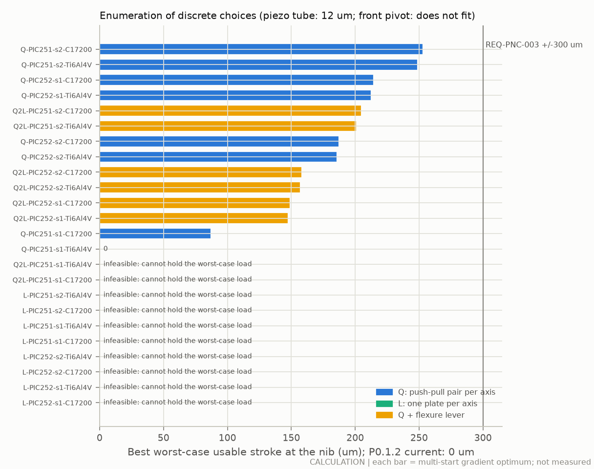
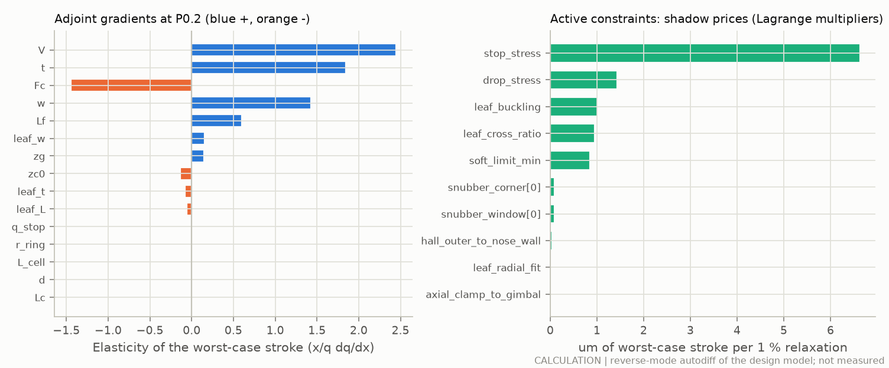
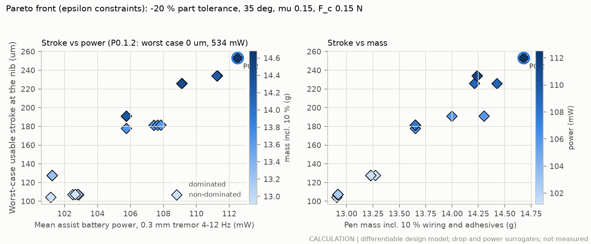
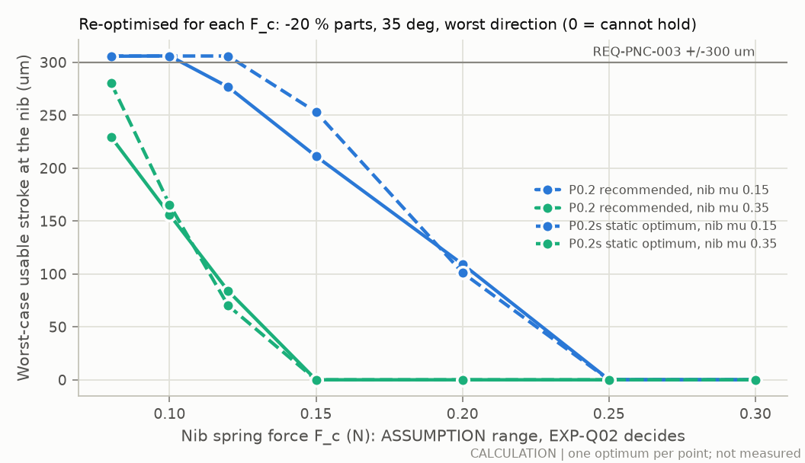
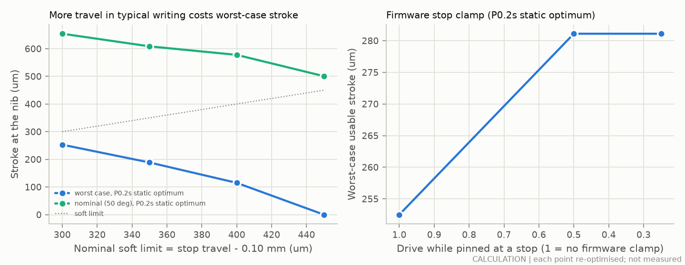
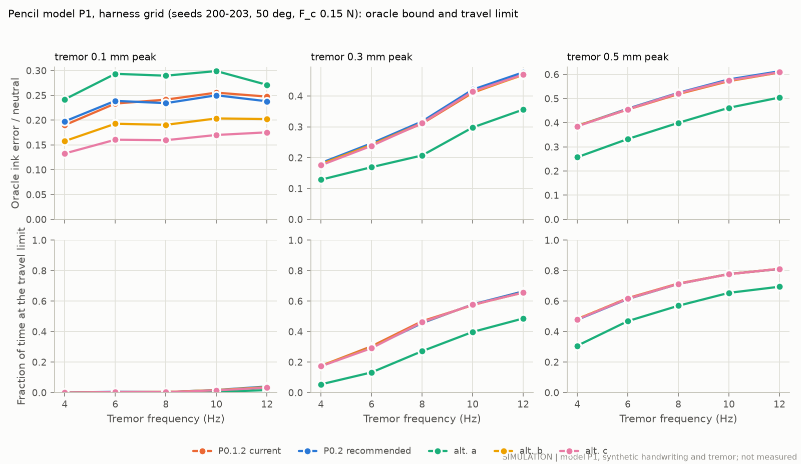
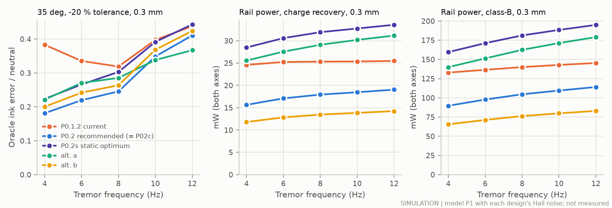

# Slim pencil nib stage: hardware optimisation (proposed Rev P0.2)

This document optimises the hardware of the slim actively stabilising pencil (Rev P0.1.2, Ø8.9 × 166 mm) for the most correction authority in the same envelope, with parts that can be bought or made. It defines the **slim pencil variant (Rev P0.2)**, now the secondary option behind the Rev H grip. The tremor tracker and the touchdown behaviour are covered elsewhere.

Everything below is a calculation or a simulation from labelled inputs. **Nothing has been built or measured.** P0.2 is a proposed design.

**Labels.**

| Label | Meaning |
|---|---|
| CALC | calculation from labelled inputs (here mostly the differentiable design model, `opt/hardware/model.py`) |
| SIM | simulation: FE drop model, magpylib, or the pencil model P1 (`sim/pencil`) |
| MFR (id) | manufacturer statement, with its ledger id |
| LIT (id) | literature, with its ledger id |
| ASSUMP | assumption, with the experiment that replaces it (§7) |
| PROPOSED | proposed design, not built |

New sources are AMF-53 to AMF-64 and OPT-44 to OPT-46, in `results/opt/hardware_evidence_rows.csv` (same columns as `docs/evidence.csv`, for the lead to merge). All numbers are transcribed from `results/opt/hardware.json`, which `python3 -m opt.hardware.run_study` regenerates (§8).

## 1. Answer first

**Scope.** This study defines the **slim pencil variant** (Rev P0 → P0.2), which stays in the record as the secondary option. The primary concept is now Rev H: a Ø22 mm grip with an active nose on a flexure pivot, where voice coils move the whole tip about ±3 mm. Another agent is designing it. Everything below applies to the slim pencil only.

### 1.1 Recommendation for the slim pencil (PROPOSED)

Keep what P0.1.2 already gets right:

- the skid ring (1.4 mm) and the nose;
- the Q layout (a push-pull pair of piezo plates per axis) with the front collar and the rear gimbal;
- the ±0.40 mm stops and the 0.30 mm servo limit;
- the D1 refill, the 0.15 N nib spring, the 40 mm cell and the Ø8.9 × 166 mm envelope.

Change five things:

1. **Plates.** Four custom PIC252 multilayer plates, **3.23 × 39.8 × 0.96 mm**, with a 36.3 mm free length and a 3.5 mm clamp zone without electrodes. They replace 2.6 × 36 × 0.67 mm plates with a 28 mm free length and an 8 mm clamp.
   - They are a supplier's standard PICMA process with more layers (thicker), a custom width and a shorter clamp; nothing new is invented.
   - The pen still uses four plates.
2. **Leaves.** C17200 leaves, **38 µm × 1.55 mm, 6.3 mm free span**, instead of 30 µm × 1.2 mm × 5 mm. 38 µm is the standard 0.0015" strip. The P0.1.2 leaf breaks the 5 % cross-coupling rule (6.6 %); the new one meets it.
3. **Geometry.** The gimbal moves back from 62 to **65.5 mm** from the ball and the collar front from 15.0 to 14.9 mm. The lever stays at 1.33 (it was 1.36); the plates and the leaves get the length.
4. **Drive.** An **LT8365** low-Iq boost with two discrete charge-recovery half-bridges at **58 V**, instead of 2 × DRV2700 at 60 V.
5. **Position sensing.** **Two DRV5055A4** analog linear Hall sensors, moved 0.1 mm further from the collar magnet, instead of one TMAG5170-A2.

The skid ring, stops, cell and nib spring do not change, so the touchdown and tracker work is unaffected.

### 1.2 How much more correction authority

| | P0.1.2 | **P0.2** | Label |
|---|---|---|---|
| Worst-case usable stroke (−20 % parts, 35°, μ 0.15, worst direction) | 0 µm (raw −67) | **±212 µm** | CALC |
| Loaded stroke in typical writing (50°, nominal parts) | ±277 µm | **±477 µm** (servo limit ±300) | CALC |
| Blocking force at the nib | 0.33 N | **0.64 N** | CALC |
| Stage stiffness at the nib | 575 N/m | **980 N/m** | CALC |
| First resonance | 192 Hz | **213 Hz** | CALC |
| P1 oracle error left, worst corner (35°, −20 %, 0.3 mm, mean 4–12 Hz) | 37.5 % | **28.1 %** | SIM |
| P1 oracle error left, 0.1 mm tremor (4–12 Hz) | 19–26 % | **13–18 %** | SIM |
| P1 oracle error left, 0.3 / 0.5 mm tremor | 18–47 % / 39–61 % | unchanged | SIM |
| P1 time at the travel limit, worst corner | 57 % | **38 %** | SIM |
| Assist battery life, worst 0.3 mm case | 0.50 h | **2.73 h** | CALC |
| Pen mass incl. 10 % | 13.4 g | 14.6 g | CALC |

(P1 "oracle error left" is the ink error of the ideal-disturbance-knowledge controller as a fraction of the uncorrected pencil's error; lower is better. P0.1.2 is simulated as documented, with 1 µm Hall noise; P0.2 with its own sensor noise, 0.44 µm. At 1 µm noise P0.2 gives the same ratios at twice the rail power, §3.10.)

In plain words:

- **In the worst corner** (low pen angle, weak plates, high nib friction) P0.1.2 cannot hold the pen's load at all. P0.2 keeps ±212 µm there. In the simulation its error left in that corner falls from 37.5 % to 28.1 %.
- **In typical writing** P0.2 has 1.7 times the stroke and 1.7 times the stiffness. The travel is still capped at ±0.30 mm by the stops that the 1.4 mm skid ring allows. So at 0.3–0.5 mm tremor the result is unchanged, while at 0.1 mm tremor the stiffer stage leaves about 30 % less error.
- **More travel** needs a larger skid ring. Alternative P0.2a (±0.40 mm servo limit, 1.89 mm ring) cuts the simulated error at 0.3–0.5 mm tremor by about a quarter. But it cuts the worst-case stroke to ±120 µm, is the worst of all at 0.1 mm tremor, and changes the touchdown geometry (§3.9).

### 1.3 Why this design and not the "maximum stroke" design

The design model's optimum is a different design, **P0.2s**: two thin PIC251 plates per position (eight in all). It has ±253 µm worst case, 19 % more than P0.2. But its stage is 38 % less stiff (612 against 980 N/m) and resonates lower (169 Hz). In the closed-loop simulation it removes *less* error than P0.2 in every condition: 32.5 % against 28.1 % left in the worst corner, and 20–25 % against 13–18 % at 0.1 mm tremor. It also needs eight plates, 7.7 µF per axis and more power.

The finalists were therefore ranked by the P1 worst case (§3.4). This is the main lesson of the study: **stroke under load is necessary but not sufficient.** With the P1 servo (integral action plus damping at a fixed bandwidth), the nib and skid force fluctuations deflect the stage by about 1/k. So a stiffer, faster stage corrects better once the stroke is enough.

### 1.4 What else was found

- **P0.1.2 fails four rules under the same model** (§3.1):
  - worst-case stroke −67 µm;
  - nominal stroke 23 µm short of the servo limit;
  - leaf cross-coupling 6.6 % (limit 5 %);
  - assist life 0.50 h.
  - Its collar magnet also saturates the TMAG5170-A2 (about 170 mT against a ±150 mT range).
- **What limits the plates is their own strength**, not the bore. The largest shadow price is the plate stress when a plate is pinned at a stop and driven the other way: each 1 % of extra ceramic strength is worth 6.6 µm of worst-case stroke. A firmware stop clamp (halve the drive while the Hall sensor sees a stop) was worth 29 µm on the static optimum (§3.9).
- **F_c is the strongest input:** about 20 µm of worst-case stroke per 10 mN near 0.15 N (§3.8). So EXP-Q02 remains the most important measurement.
- **Rejected options:**
  - the L layout (one plate per axis cannot hold the worst case);
  - a second, flexure lever;
  - piezo tubes (≈ 12 µm);
  - a front pivot (does not fit);
  - single PIC251 plates (fracture-limited);
  - the TMAG5170 (its noise costs the battery: ≤ 1.65 h) and the TMAG5273 (I²C too slow);
  - 2 × DRV2700 (no design reaches 2 h assisted);
  - the BOS1931 (rated to about 2.5 µF per axis; P0.2 has 3.6 µF).

### 1.5 What must happen next

1. **Custom plates.** Send the request for quotation in §4 to PI and CTS. Qualify the plates by EXP-Q04 (stroke, force, strength).
2. **Nib force.** Measure it (EXP-Q02); it moves every number here.
3. **Driver.** Measure the LT8365 charge-recovery drive on 3.6 µF (EXP-Q05).
4. **Loaded one-axis rig.** Measure the loaded stroke and the Hall noise (EXP-Q06).
5. **Two-axis demonstrator** (EXP-Q07). Check the leaf cross-coupling there, since the leaf sits on two rules at once.

A bench mock-up with catalogue PiezoDrive BA3502 plates (USD 11.80 each, seen 2026-09-28) can start the assembly and servo work now.

## 2. How the hardware was optimised

### 2.1 A differentiable copy of the design model (the adjoint)

`opt/hardware/model.py` rewrites the existing design relations in PyTorch:

- from `sim/pencil/design.py`:
  - the PICMA-class bender as a cantilever (force source k_b·δ_free(V) in parallel with its stiffness k_b);
  - the decoupling leaf (cross and drive stiffness, lateral-torsional buckling, stress);
  - the nib assembly about the rear gimbal (inertia and lever from the part positions);
  - the reduction of the stage to the nib (blocking force, stiffness, parasitics, first resonance, loaded stroke);
  - the skid contact loads with friction, with the worst stroke direction taken over the same 360-point grid;
  - the Weibull strength scaling (LIT AMF-48);
- from `analysis/pencil_mechanisms.py`: the clamp stress of a plate pinned at a stop while driven the other way;
- from `sim/pencil/power.py`: the drive-power conventions (class-B: V_rail·⟨max(i, 0)⟩; charge recovery: ⟨p⁺⟩/η − η⟨p⁻⟩);
- from `mechanics/cad/pencil_revP.py`:
  - the section checks with the tips at the stops (plate to bore, plate to plate, plate to refill);
  - the nose checks (Hall sensor, collar, optical sensor, refill cone in the skid aperture);
  - the snubber frames and their webs;
  - the part masses.

Every relation works on a batch of designs. One reverse-mode pass of automatic differentiation therefore gives the exact gradient of every objective and constraint with respect to all 16 continuous variables. This is the adjoint of the design model.

Agreement with the existing code at the P0.1.2 design (CALC; `opt/hardware/tests`):

| Quantity | Torch model against numpy / CAD |
|---|---|
| Load, blocking force, stiffnesses, inertia, first resonance, stroke (nominal and worst case), clamp stress, Weibull σ₀, leaf buckling factor and stress | identical to round-off (largest relative difference 2·10⁻¹⁵; criterion 0.1 %) |
| All fit gaps and snubber webs (Q and L layouts) | identical to round-off against the CAD formulas; within the CAD summary's 1 µm rounding |
| Mass | 12.203 g against 12.20 g (the CAD rounds part masses to 1 mg) |
| Gradients | equal to central finite differences within 2·10⁻⁴ (relative), 10 outputs × 16 variables, Q and Q2L layouts |

### 2.2 Custom plates: what suppliers make and how it scales

PI's PICMA datasheet lists benders 18–45 mm long and 0.55–0.67 mm thick, in two ceramics: PIC252 (PL112, PL128) and PIC251 (PL122, PL127, PL140). It states *"Custom designs or different specifications on request"* (MFR AMF-11, supplemented as AMF-53). CTS (Noliac) makes multilayer plate benders 0.7–1.8 mm thick with a 3.5 mm inactive clamp zone, and custom designs (MFR AMF-54).

Custom plates are scaled from the reference part at fixed layer thickness and field (Euler–Bernoulli bimorph):

- free stroke ∝ L_f²/t;
- blocking force ∝ w·t²/L_f;
- capacitance ∝ w·L_el·t;
- resonance ∝ t/L_f²;
- stroke and force ∝ drive voltage.

Checked against the catalogues (CALC, AMF-63):

- PL112 predicted from PL128 (same ceramic): stroke 0.83, force 0.95, resonance 1.09 × datasheet;
- PL122 and PL140 predicted from PL127: 0.96–1.20, inside the ±20 % datasheet tolerance;
- CTS length series: 0.95–1.00;
- CTS thickness series: force 0.93–0.98. The thick plates give 20–25 % **more** stroke than 1/t predicts, so the law is conservative for thicker plates.

At equal geometry PIC251 gives 24 % more force and 7.5 % more stroke than PIC252, and 2.1 times the capacitance (CALC from AMF-53). Its plates are also 15 % stiffer (58 → 67 GPa effective modulus from the datasheet force and stroke), so a PIC251 plate is more highly stressed when it is pinned at a stop or dropped.

### 2.3 Drive power and battery life

The rail power at each P1 tremor case has two parts, combined per axis as E[max(Gaussian + sinusoid, 0)] of the per-sample voltage change:

- **Signal.** The zero-Hall-noise P1 rail power of the current design per case (oracle and neutral; `opt/hardware/calibrate.py`). The tremor part is scaled by C·V·k_tot/F_v and by the stroke-limited amplitude; the writing part by C·V/F_v and F_c.
- **Hall noise.** A closed-loop discrete-time model of the P1 inner servo: one-sample Hall delay, filtered derivative, integral action, driver lag and the stage dynamics. Its stationary covariance comes from a discrete Lyapunov equation.

Held-out check against P1 at 0.3 µm and 1 µm Hall noise (30 grid cases; SIM against CALC):

- class-B rail power: −10 % mean (10 % rms, 15 % max);
- charge recovery: −5 % mean (7 % rms, 12 % max).

Battery power = electronics (65 mW, ASSUMPTION) + sensor power change + driver quiescent power + rail power / η_boost. Capacity: 90 mAh at 40 mm, scaled with cell length using the CG-series dead length (ASSUMPTION from AMF-43).

### 2.4 Drop survival

The finite-element drop model of `analysis/pencil_mechanisms.py` (1 m sideways drop, restitution 0.4, four snubbers, stop stiffness 2·10⁵ N/m; SIM with ASSUMPTIONS) takes 0.3 s per run. That is too slow inside the optimiser, so a Gaussian-process regressor written in torch (`opt/hardware/gp.py`, ARD kernel, linear mean) stands in for it:

- trained on 608 FE runs over plate thickness, free length, width, stop deflection, tip-mass ratio and modulus;
- on 96 held-out FE runs: 9 % rms error (34 % max), against 20 % (103 % max) for a quadratic response surface;
- the optimiser uses the GP mean + 1 predictive sd for the 2 ms (compliant-nose) pulse;
- the recommended design is re-checked with the FE model itself (§3.5).

### 2.5 Optimisers

- **Problem.** Maximise the worst-case usable stroke U_wc = min(stroke at −20 % tolerance, 35°, worst stroke direction, μ 0.15; stop travel − 0.10 mm), written in epigraph form. It is subject to 43 constraints:
  - fit with the tips at the stops, and snubber webs ≥ 0.2 mm at each of the four stations;
  - axial stack;
  - leaf rules: cross stiffness ≤ 5 % of the axis, drive stiffness ≥ 20×, buckling SF ≥ 2, stress ≤ allowable;
  - first resonance ≥ 150 Hz;
  - fracture probability ≤ 10⁻⁴ per event at the stops and in the 2 ms drop;
  - mass ≤ 20 g with 10 % margin, pen ≤ 170 mm;
  - soft limit ≥ 0.30 mm, with the nominal stroke filling it;
  - battery life ≥ 2 h assisted in every 0.3 mm tremor case, ≥ 4 h recording;
  - skid ring ≤ 2.0 mm, nib-spring travel ≤ 3.0 mm, leaf radial fit.
- **Gradient-based.**
  - Batched projected Adam on the augmented Lagrangian, one multiplier set per start. Starts: Sobol points, the current design, and warm starts from the best optima found so far.
  - Then L-BFGS-B (scipy) with the exact torch gradient, in an augmented-Lagrangian outer loop.
- **Global.**
  - Exhaustive enumeration of the discrete choices (24 combinations): layout (Q, L, Q + flexure lever) × ceramic (PIC252, PIC251) × plates per position (1, 2) × leaf material (C17200, Ti-6Al-4V).
  - A refinement pass re-solves the best six with 26 starts, and re-solves any combination that fell below 70 % of a sibling from that sibling's optimum.
  - Then driver (4) × Hall sensor (2) × clamp electrodes (2) for the best combination.
  - A derivative-free CMA-ES on an exact penalty checks the continuous optimum.
  - Piezo tubes and a front pivot are evaluated in closed form.
- **Pareto front.** ε-constraint method: maximise U_wc subject to mean assist power ≤ P_max and mass ≤ M_max over a 5 × 4 grid. A repair pass re-solves any point that a looser point beats, from the tighter points' optima.

### 2.6 Finalists ranked in the closed loop

The design model ranks designs by their static worst-case stroke. Four finalists were built in CAD, registered as stages in `sim/pencil/design.py` and run through the P1 harness grid (§3.10):

- the static-stroke optimum;
- the same with ±0.40 mm travel;
- the best design with catalogue-thickness plates;
- the best design with one plate per position.

The recommendation is the finalist with the lowest P1 oracle ratio in the worst-case condition. The studies of §3.6–3.9 were then run around it.

## 3. Results

### 3.1 The P0.1.2 design under the same rules

The P0.1.2 design, with its documented parts (2 × DRV2700, one TMAG5170-A2), evaluated by the same model and the same rules (CALC):

| Check | P0.1.2 | Rule | Verdict |
|---|---|---|---|
| Worst-case loaded stroke (−20 % parts, 35°, μ 0.15, worst direction) | −67 µm | > 0, as large as possible | **cannot hold the load** |
| Same at nib friction μ 0.35 | −470 µm | | cannot hold the load |
| Nominal loaded stroke (50°) | 277 µm | ≥ soft limit 300 µm | **short by 23 µm** |
| Leaf cross stiffness / axis stiffness | 6.6 % | ≤ 5 % | **fails the leaf rule** |
| Hall-sensor noise at the nib (TMAG5170-A2, 160 µT rms, MFR OPT-44) | 2.3 µm rms | (P1 assumed 1 µm) | drives servo power |
| Peak field at the TMAG5170-A2 (collar magnet, magpylib SIM) | about 170 mT | ±150 mT range | **saturates** |
| Assist battery life, worst 0.3 mm tremor case | 0.50 h | ≥ 2 h | **fails** (P1 figure 0.8 h assumed 1 µm noise) |
| Plate stress pinned at a stop / 2 ms drop | 55 / 56 MPa | ≤ 57 MPa (P_fail 10⁻⁴) | passes, 3 % margin |
| First resonance | 192 Hz | ≥ 150 Hz | passes |
| Fit in the bore, snubber webs, mass (13.4 g incl. 10 %) | all pass | | passes |

The torch model reproduces the numpy model at this design to round-off (§2.1): load 0.1697 N, blocking force at the nib 0.3288 N, f1 191.95 Hz, worst-case stroke −66.5 µm, stop stress 55.30 MPa, and every CAD gap.

### 3.2 Layouts and discrete choices

Each combination of discrete choices was optimised on its own (multi-start gradient search, then the refinement pass; CALC, reference electronics LT8365 + 2 × DRV5055A4). The full table is in §5.2 and `fig_hw_topologies.png`.



- **The Q layout stays.** It is the only layout with enough force for the worst case.
  - The best L design (one plate per axis) reaches 0.375 N at the nib. At −20 % tolerance that equals the worst-case load, so its worst-case stroke is zero (−1 µm; infeasible).
  - This holds for every ceramic, stack and leaf choice in L (−1 to −15 µm).
- **Two plates per position pay only with PIC251.**
  - A PIC251 plate is 15 % stiffer and gives 7.5 % more stroke than a PIC252 plate of the same size (§2.2). Pinned at a stop and driven the other way, it reaches the fracture limit (P_fail 10⁻⁴) before it can use its force. The best single-plate PIC251 design gives only 87 µm.
  - Two thinner PIC251 plates per position carry the same force at a lower bending stress each: **253 µm**.
  - For PIC252 one thick plate is better (214 µm against 187 µm with two), because two plates also need their spacer in the radial room.
- **A second (flexure) lever does not pay.** The Q + lever layout puts a flexure lever at each plate tip.
  - Best 205 µm (lever 1.26), against 253 µm without it.
  - The hinge compliance and the 3 mm the lever takes from the plate length cost more than the lever gains.
  - The first-stage lever (gimbal and collar) is already close to its optimum (§3.6).
- **Leaf material hardly matters.** C17200 and Ti-6Al-4V leaves differ by less than 4 µm. C17200 is kept (the P0.1.2 choice, with fatigue data, AMF-18/19). Ti-6Al-4V is the fallback where beryllium handling is unwanted; its allowable stress is an assumption.
- **Closed-form checks.**
  - A quartered piezo tube that fits the bore gives about 12 µm at the nib at 60 V (CALC, from the PT230 formula, MFR AMF-56).
  - A front pivot does not fit: the refill would swing 0.37–1.30 mm in the plate zone against 1.04 mm of room (CALC).
- **The optimum is robust to the optimiser.**
  - The refinement pass (26 starts per combination, warm starts from every good optimum) reproduced every screening optimum within 2 µm.
  - Derivative-free CMA-ES (three seeds, 400 generations each) on the static optimum's combination reached 0–208 µm on its own. Polished by the gradient method, all three runs converged to the same design (253.04–253.06 µm).
  - On P0.2's combination CMA-ES reached 114–177 µm. Polished, 2 of 3 runs converged to 212.4 µm (the gradient optimum is 212.4 µm); the other stopped in a worse, infeasible basin.
  - Neither found a better design than the gradient method.

### 3.3 Electronics: drivers and Hall sensors

The electronics set the battery life, which is a constraint (≥ 2 h assisted, REQ-PNC-005). They were enumerated on the best mechanical combination: 4 drivers × 2 sensors × clamp electrodes on/off, each combination re-optimised (CALC):

| Driver | Hall sensors | Best worst-case stroke | Assist life | Verdict |
|---|---|---|---|---|
| 2 × TI DRV2700 (MFR AMF-16) | TMAG5170-A2 or 2 × DRV5055A4 | none feasible | 0.9–2.1 h (2.1 h only at 20 V, where the stroke is gone) | 72 mW quiescent plus class-B charging: **no** |
| LT8330 boost, 55 V (MFR AMF-47) + discrete charge recovery | 2 × DRV5055A4 | 228 µm | 2.55–2.65 h | feasible; 55 V rail costs 10 % of the stroke |
| **LT8365 boost, 60 V switch (MFR AMF-58) + discrete charge recovery** | **2 × DRV5055A4** | **253 µm** | 2.13–2.20 h (static optimum) | **selected** |
| either recovery driver | TMAG5170-A2 | none feasible | 1.5–1.65 h | sensor noise (3 µm rms at the nib) drives the servo: **no** |
| Boreas BOS1931 (MFR AMF-46) | either | none feasible | – | rated for about 2.5 µF per axis at 12 Hz; the plates need more: **no** |

- **Hall noise at the nib.** TMAG5170-A2: 160 µT rms at 20 kSPS (MFR OPT-44) over 72 T/m gives about 3 µm at the nib. DRV5055A4: 215 nT/√Hz (MFR OPT-46); with a 3 kHz filter and 12-bit sampling that is 24 µT, about 0.44 µm (CALC).
- **Sensor position.** The sensor sits 0.1 mm further from the collar magnet than in P0.1.2 (magpylib SIM, Br 1.32 T ASSUMPTION). The peak field falls from 171 to 132 mT, inside both sensors' ranges (±150 mT TMAG5170-A2, ±169 mT DRV5055A4), and the weak-axis sensitivity is 72 T/m.
- **Rejected sensor.** The TMAG5273 (I²C, MFR OPT-45) cannot carry two axes at the 10 kSPS servo rate.
- **Unelectroded clamp zones** (electrodes over the free length only, like the CTS inactive zone, AMF-54) cut the capacitance by 10 % and the power by 3 %. They are part of the plate specification.

P0.2 uses the selected electronics. Its capacitance is 3.6 µF per axis (P0.1.2: 2.0 µF). The battery power is 96 mW, of which 65 mW is the electronics placeholder (ASSUMPTION). Assist life is 2.73 h and recording life 4.30 h (CALC; REQ-PNC-005 met).

### 3.4 Finalists and the closed-loop selection

Four finalists were built in CAD, registered as stages and simulated in P1 (§3.10). The recommendation is the one with the lowest mean oracle ratio in the worst-case condition.

| Candidate | P1 worst case (35°, −20 %, 0.3 mm) | P1 grid mean | P1 time at limit | static worst case (µm) | nominal (µm) | k at the nib (N/m) | f1 (Hz) | skid ring (mm) | life (h) |
|---|---|---|---|---|---|---|---|---|---|
| P0.2c **(selected)**: one plate per position (PIC252, custom thickness): no stacked plates | 0.281 | 0.330 | 0.37 | 212 | 476 | 980 | 213 | 1.40 | 2.73 |
| P0.2a: soft limit 0.40 mm (stops 0.50 mm), skid ring free | 0.296 | 0.301 | 0.27 | 120 | 553 | 512 | 166 | 1.89 | 2.36 |
| P0.2b: catalogue plate thickness 0.67 mm, one plate per position, PIC252 (custom width and length only) | 0.300 | 0.341 | 0.37 | 84 | 375 | 765 | 206 | 1.40 | 2.87 |
| P0.2s: static-stroke optimum (two plates per position) | 0.325 | 0.358 | 0.38 | 253 | 654 | 612 | 169 | 1.40 | 2.32 |

- **Stiffness decides it.** P1's ratio at 0.1 mm tremor follows the stage stiffness at the nib almost exactly: 980 N/m → 0.13–0.18, 765 → 0.16–0.20, 575 (P0.1.2) → 0.19–0.26, 612 → 0.20–0.25, 512 → 0.24–0.30. In the worst corner, stiffness and stroke both count. P0.2c has enough stroke (212 µm) and the highest stiffness.
- **The static-stroke optimum loses.** P0.2s (two thin PIC251 plates per position) has the most stroke but is the most compliant after P0.2a.
- **Larger travel helps typical writing only.** P0.2a (±0.40 mm) is best on the nominal grid (0.301) because its travel is larger. But it is the worst at small tremor, needs a 1.89 mm skid ring and has 120 µm worst case.
- **The catalogue-thickness plate** (P0.2b, 0.67 mm plates cut to 3.60 × 32.2 mm) is a respectable fallback in P1 (0.300 worst case, lowest power). But it has only 84 µm of static worst-case stroke, so REQ-PNC-003 fails at the combined corner.

**Caveat.** The ranking uses P1's default servo (integral action and damping at a fixed bandwidth, no proportional stiffness). The touchdown and servo work may change the servo. A servo with proportional stiffness would narrow the stiffness advantage and favour stroke (P0.2s) again. The ranking should be repeated with the final servo: `python3 -m opt.hardware.run_study` re-runs it from the caches.

### 3.5 The recommended design

| Quantity | P0.1.2 current | **P0.2 recommended** | P0.2s | P0.2a | P0.2b |
|---|---|---|---|---|---|
| plate width (mm) | 2.60 | 3.23 | 2.83 | 2.90 | 3.60 |
| plate thickness (mm) | 0.67 | 0.96 | 0.60 | 0.54 | 0.67 |
| free length (mm) | 28.0 | 36.3 | 33.1 | 30.6 | 28.7 |
| clamp length (mm) | 8.0 | 3.5 | 3.5 | 3.5 | 3.5 |
| plate offset from axis (mm) | 2.55 | 2.58 | 2.53 | 2.54 | 2.63 |
| gimbal z (mm) | 62.0 | 65.5 | 65.5 | 65.5 | 65.5 |
| collar front z (mm) | 15.0 | 14.9 | 15.4 | 19.0 | 14.9 |
| leaf thickness (µm) | 30 | 38 | 47 | 41 | 32 |
| leaf width (mm) | 1.20 | 1.55 | 1.55 | 1.51 | 1.55 |
| leaf span (mm) | 5.00 | 6.33 | 9.00 | 7.92 | 5.81 |
| skid ring radius (mm) | 1.40 | 1.40 | 1.40 | 1.89 | 1.40 |
| drive range (V) | 60 | 58 | 58 | 54 | 60 |
| stop travel at the nib (mm) | 0.40 | 0.40 | 0.40 | 0.50 | 0.40 |
| cell length (mm) | 40.0 | 40.0 | 40.0 | 40.0 | 40.0 |
| lever (nib per collar) | 1.363 | 1.334 | 1.347 | 1.455 | 1.334 |
| **worst-case usable stroke (µm)** (−20 %, 35°, μ 0.15, worst direction) | -67 | 212 | 253 | 120 | 84 |
| worst-case loaded stroke, raw (µm) | -67 | 212 | 253 | 120 | 84 |
| worst case at μ 0.35 (µm) | -470 | -24 | -126 | -333 | -220 |
| nominal loaded stroke (µm) (50°, μ 0.15) | 277 | 476 | 654 | 553 | 375 |
| nominal at −20 % tolerance (µm) | 162 | 347 | 468 | 376 | 256 |
| servo soft limit (µm) | 300 | 300 | 300 | 400 | 300 |
| blocking force at the nib (N) | 0.329 | 0.637 | 0.570 | 0.453 | 0.457 |
| free stroke at the nib (µm) | 613 | 685 | 984 | 935 | 629 |
| first resonance (Hz) | 192 | 213 | 169 | 166 | 206 |
| driven capacitance per axis, small signal (µF) | 2.03 | 3.64 | 7.69 | 6.58 | 2.24 |
| pen mass incl. 10 % (g) | 13.4 | 14.6 | 14.7 | 14.1 | 13.1 |
| plate clamp stress, driven onto a stop (MPa) | 55 | 52 | 56 | 57 | 55 |
| drop stress 2 ms, surrogate + 1 sd (MPa) | 56 | 52 | 52 | 57 | 54 |
| allowable at P_fail 10⁻⁴ (MPa) | 57 | 52 | 56 | 57 | 55 |
| leaf buckling safety factor | 2.37 | 2.00 | 2.00 | 2.00 | 2.00 |
| nib travel the spring must take (mm) | 2.25 | 2.25 | 2.25 | 2.99 | 2.25 |
| Hall noise at the nib (µm rms) | 2.30 | 0.44 | 0.44 | 0.48 | 0.44 |
| assist power, mean of 0.3 mm cases (mW) | 534 | 96 | 112 | 110 | 91 |
| assist life, worst 0.3 mm case (h) | 0.50 | 2.73 | 2.32 | 2.36 | 2.87 |
| recording life (h) | 4.3 | 4.3 | 4.3 | 4.3 | 4.3 |

**Checks of the recommended design.**

- **FE drop (1 m sideways, SIM; `analysis/pencil_mechanisms.py`):** peak plate stress 48.8 MPa with the 2 ms compliant nose (fracture probability 6.3·10⁻⁵; allowable 51.6 MPa at 10⁻⁴; the optimiser's surrogate value was 51.6 MPa). A harder nose fails: 85 MPa at 1 ms and 109 MPa at 0.5 ms, as for P0.1.2: the compliant nose stays mandatory.
- **FE modes of one plate with its collar share:** 217, 1597, 4793 Hz; lumped f1 213 Hz.
- **CAD rebuild** (`results/opt/cad/pencil_revPQ_P02_*`, STEP included): section checks all_ok; no interference; mass 13.29 g (model 13.29 g); lever 1.334.
- **P1 statics** (open-loop drive against 0.17 N in the numba core): loaded stroke 240.0 µm against 240.0 µm in the torch model (-0.00 %); ring-down frequency 226.7 Hz against 226.4 Hz with the housing free (+0.11 %).
- **Tolerances:**
  - Plate ±20 % (AMF-11): stroke and force at −20 % are already in the worst case.
  - Leaf thickness: see §3.9.
  - The plate-to-bore gap with the tips at the stops is 0.174 mm and the snubber webs are 0.20 mm (active).

### 3.6 Why it looks like this: active constraints and gradients



At the optimum these constraints are active. The shadow price is the worst-case stroke gained per 1 % relaxation of each (CALC, Lagrange multipliers of the augmented Lagrangian):

- plate stress when pinned at a stop and driven the other way (P_fail ≤ 10⁻⁴): **6.63 µm** per 1 %
- plate stress in the 2 ms drop (P_fail ≤ 10⁻⁴): **1.44 µm** per 1 %
- leaf buckling safety factor ≥ 2: **1.01 µm** per 1 %
- leaf cross stiffness ≤ 5 % of the axis: **0.95 µm** per 1 %
- servo limit ≥ 0.30 mm (shorter stops would lower the stop stress; the requirement keeps them at 0.40 mm): **0.84 µm** per 1 %
- front snubber corner web ≥ 0.2 mm: **0.10 µm** per 1 %
- front snubber window web ≥ 0.2 mm: **0.09 µm** per 1 %
- Hall sensor clearance to the nose wall: **0.05 µm** per 1 %
- leaf radial fit: **0.02 µm** per 1 %

Exact gradients of the worst-case stroke at P0.2 (adjoint, CALC; P0.1.2 in brackets):

- nib spring force: -20.5 µm per +10 mN (-34.9);
- drive voltage: +8.9 µm per V (+7.6);
- plate thickness: +41 µm per +0.1 mm (+156);
- plate width: +9.4 µm per +0.1 mm (+19.3);
- plate free length: +3.5 µm per +1 mm (-20.9);
- lever (through the gimbal position): -72 µm per unit of lever (-433).

- **The lever sits on a geometric limit.** The load-optimal lever for these plates is n* = k_eff·δ_free/(2F) = 1.13 (worst case) against the design's 1.334. Each 0.1 less lever would add about 7.2 µm.
  - It cannot drop further. The gimbal is already at its rearmost position (65.5 mm, set by the refill length), and the collar is held by the Hall-sensor clearance in the nose taper.
  - P0.1.2's plates were much too weak for its lever: n* = 0.59 against n = 1.363 (−433 µm per unit of lever). That is one reason P0.1.2 cannot hold the worst case.
- **Voltage.** V is not at the 60 V rating. More drive raises the stop stress (the plate is pinned and driven), which is the most expensive constraint.

### 3.7 Pareto front: worst-case stroke, power and mass

The worst-case stroke was maximised with mean assist battery power ≤ P_max and pen mass ≤ M_max over a 5 × 4 grid around P0.2 (and, for comparison, around the static optimum P0.2s). Every point is a separate optimum (CALC).



P0.2's combination (worst-case usable stroke in µm; 0 = no feasible design):

| Power budget (mW) | mass ≤ 12.87 g | mass ≤ 13.60 g | mass ≤ 14.18 g | mass ≤ 15.35 g |
|---|---|---|---|---|
| ≤ 86.5 | 0 | 0 | 0 | 0 |
| ≤ 90.3 | 65 | 66 | 67 | 67 |
| ≤ 93.2 | 89 | 149 | 150 | 149 |
| ≤ 96.1 | 89 | 160 | 205 | 212 |
| ≤ 101.9 | 89 | 160 | 204 | 212 |

The static optimum's combination (two PIC251 plates per position), same layout:

| Power budget (mW) | mass ≤ 12.92 g | mass ≤ 13.65 g | mass ≤ 14.24 g | mass ≤ 15.41 g |
|---|---|---|---|---|
| ≤ 101.3 | 104 | 127 | 128 | 128 |
| ≤ 105.8 | 107 | 178 | 191 | 191 |
| ≤ 109.1 | 107 | 181 | 226 | 226 |
| ≤ 112.5 | 107 | 181 | 234 | 253 |
| ≤ 119.3 | 107 | 181 | 234 | 253 |

- **Power is the tight budget for P0.2's combination.**
  - The electronics take most of the 96 mW (65 mW placeholder, sensors, boost).
  - Below about 90 mW no design meets the rules.
  - Between 90 and 96 mW the worst-case stroke climbs from about 65 to 212 µm.
- **Mass buys stroke up to about 14.2 g** (thicker, wider plates). Beyond that it adds little; the 20 g limit never binds.
- **The two-plate combination** needs 10–15 mW more for the same stroke, because of its 2.1× capacitance.

### 3.8 Nib force F_c and nib friction

The hardware was re-optimised for each nib spring force (CALC; skid ring 1.4 mm; `fig_hw_fc_sweep.png`):

| F_c (N) | 0.08 | 0.10 | 0.12 | 0.15 | 0.20 | 0.25 | 0.30 |
|---|---|---|---|---|---|---|---|
| Worst-case usable stroke, nib μ 0.15 (µm) | 306* | 306 | 277 | 211 | 109 | 0 | 0 |
| Worst-case usable stroke, nib μ 0.35 (µm) | 230 | 156 | 84 | 0 | 0 | 0 | 0 |

(* the stops the 1.4 mm skid ring allows limit the stroke, not the force; "0" means no design holds the worst-case load.)



- **F_c is the strongest single input.** Near 0.15 N each 10 mN costs about 20 µm of worst-case stroke (adjoint gradient at P0.2). Going from 0.15 to 0.20 N costs 102 µm.
- **At about 0.10 N and below, the stops, not the force, set the worst case.** A lower F_c then buys typical-writing travel only if the stops open, which needs a larger skid ring (§3.9).
- **Nib friction matters as much.** At μ 0.35 in the worst stroke direction, P0.2 itself cannot hold the worst-case load (-24 µm raw). A design re-optimised for μ 0.35 needs F_c ≤ 0.10 N for 156 µm.
- **For REQ-PNC-002** (F_c ≤ 0.14 N, derived from P0.1.2's stroke): with P0.2 the nominal-corner stroke (50°, nominal parts) stays above ±0.30 mm up to F_c 0.25 N (CALC). The combined corner (35°, −20 % parts) is what limits F_c: 0.15 N gives 212 µm, and about 0.10 N would give ±0.30 mm there.

### 3.9 Authority against robustness: stops, firmware, sensor position, skid ring, leaf

The stop, firmware-clamp, sensor-position and leaf-gauge studies were run around the static optimum P0.2s: same layout, electronics, stops and skid ring as P0.2. They were not repeated for P0.2 before this study was closed. They show the trends, which do not depend on the plate choice; the numbers are P0.2s's (CALC; `fig_hw_stop_sweep.png`). The leaf-tolerance table is for P0.2 itself.



- **Servo limit (typical-writing travel) against worst case.** P0.2 keeps the P0.1.2 servo limit of 0.30 mm (stops 0.40 mm). Opening it costs worst-case stroke, and longer stops need a larger skid ring so that the refill cone clears the aperture:

  | Servo limit (mm) | 0.30 | 0.35 | 0.40 | 0.45 | 0.50 |
  |---|---|---|---|---|---|
  | Worst-case usable stroke (µm) | 253 | 189 | 115 | 0 | infeasible |
  | Nominal loaded stroke (µm) | 654 | 608 | 578 | 501 | – |
  | Skid ring of the optimum (mm) | 2.00 | 1.95 | 1.89 | 1.82 | – |

  At 0.30 mm the 1.4 mm ring gives the same stroke (the free optimum simply drifted to the 2.0 mm bound). At longer stops the plates are pinned further out, so the stop-stress limit bites harder. Finalist P0.2a (§3.4) is this trade at 0.40 mm.
- **Firmware stop clamp.** The firmware can limit the drive while a stop contact is detected (the Hall sensor sees the stop). The plates can then be designed closer to their force limit: drive 100 % at a stop → 252 µm; drive 50 % at a stop → 281 µm; drive 25 % at a stop → 281 µm. This is cheap and worth specifying for the firmware. It does not help in a drop.
- **Hall sensor behind the collar** (in the leaf zone instead of the nose): 253 µm against 253 µm with the sensor in the nose: no gain, so the sensor stays in the nose.
- **Skid ring.** A larger ring (up to the 2.0 mm of `config/pencil.yaml`) gains nothing at a 0.30 mm servo limit: for the static optimum the 2.0 mm ring gave 253.0 µm and the 1.4 mm ring 253.0 µm. The ring stays at 1.4 mm. The nib's axial travel between tilts, which the touchdown work depends on (EXP-Q08, REQ-PNC-006), is therefore unchanged.
- **Leaf thickness (P0.2).** The leaf sits on two rules at once: cross stiffness ≤ 5 % of the axis and buckling safety factor ≥ 2. The stroke barely depends on it, but a thickness error breaks one of the rules:

  | Leaf thickness vs drawing | −10 % | −5 % | 0 | +5 % | +10 % |
  |---|---|---|---|---|---|
  | Leaf thickness (µm) | 34.0 | 35.9 | 37.8 | 39.7 | 41.6 |
  | Cross ratio (≤ 5 %) | 3.6 % | 4.3 % | 5.0 % | 5.8 % | 6.7 % |
  | Buckling safety factor (≥ 2) | 1.46 | 1.72 | 2.00 | 2.31 | 2.66 |
  | Worst-case stroke (µm) | 214 | 213 | 212 | 211 | 210 |

  P0.2's leaf (38.0 µm) is the standard 0.0015" strip (38.1 µm). Specify the strip thickness at ±3 % (±1.1 µm) and check the cross ratio on EXP-Q07. The leaf's drive stiffness matters too: at a given cross stiffness, a wide, thin leaf is stiffer in the drive direction. That is why the optimiser widens it to the radial limit (1.55 mm). For P0.2s's 46.6 µm leaf, forcing the nearest inch strips cost 11 %: 224 µm with 38.1 µm strip; 224 µm with 50.8 µm strip.

### 3.10 Validation in the pencil model P1

Each design runs as a registered stage, `PencilConfig(stage_key=...)`:

- harness grid of `sim/pencil/run_study.py`: `scenarios.handwriting(seed=200..203, duration=5.0, tremor=TremorSpec(f0, amp_pk), N0=1.0)`, 4–12 Hz × 0.1/0.3/0.5 mm;
- NEUTRAL reference and ORACLE (`M.housing_disturbance` / `M.with_disturbance`), ratio = e_rms(oracle)/e_rms(neutral);
- plus the worst-case condition: 35°, −20 % parts, 0.3 mm, seeds 200–201;
- each design with its own drive range, servo limit (stop − 0.10 mm), skid ring, pen mass (CAD × 1.1) and Hall noise (P0.1.2: the documented 1 µm; P0.2: 0.44 µm).

All numbers are SIM on synthetic handwriting and tremor.





| Case | P0.1.2 ratio / at limit / rail rec. mW | P0.2 ratio / at limit / rail rec. mW | P0.2s ratio / at limit / rail rec. mW | P0.2a ratio / at limit / rail rec. mW | P0.2b ratio / at limit / rail rec. mW |
|---|---|---|---|---|---|
| 4Hz_0.1mm | 0.19 / 0.00 / 24.4 | 0.13 / 0.00 / 14.4 | 0.20 / 0.00 / 26.7 | 0.24 / 0.00 / 24.0 | 0.16 / 0.00 / 10.9 |
| 4Hz_0.3mm | 0.18 / 0.18 / 24.6 | 0.18 / 0.17 / 15.6 | 0.18 / 0.17 / 28.5 | 0.13 / 0.05 / 25.6 | 0.18 / 0.18 / 11.8 |
| 4Hz_0.5mm | 0.39 / 0.48 / 24.8 | 0.39 / 0.48 / 16.5 | 0.39 / 0.48 / 29.8 | 0.26 / 0.31 / 27.0 | 0.39 / 0.48 / 12.4 |
| 6Hz_0.1mm | 0.23 / 0.00 / 24.6 | 0.16 / 0.00 / 15.0 | 0.24 / 0.00 / 27.6 | 0.29 / 0.00 / 24.7 | 0.19 / 0.00 / 11.3 |
| 6Hz_0.3mm | 0.24 / 0.30 / 25.2 | 0.24 / 0.29 / 17.1 | 0.25 / 0.30 / 30.6 | 0.17 / 0.13 / 27.6 | 0.24 / 0.30 / 12.8 |
| 6Hz_0.5mm | 0.45 / 0.62 / 25.3 | 0.46 / 0.62 / 17.8 | 0.46 / 0.61 / 31.7 | 0.33 / 0.47 / 29.2 | 0.46 / 0.62 / 13.3 |
| 8Hz_0.1mm | 0.24 / 0.00 / 24.8 | 0.16 / 0.00 / 15.6 | 0.23 / 0.00 / 28.5 | 0.29 / 0.00 / 25.5 | 0.19 / 0.00 / 11.8 |
| 8Hz_0.3mm | 0.31 / 0.47 / 25.3 | 0.31 / 0.46 / 17.9 | 0.32 / 0.46 / 31.9 | 0.21 / 0.27 / 29.1 | 0.31 / 0.46 / 13.5 |
| 8Hz_0.5mm | 0.52 / 0.72 / 25.4 | 0.52 / 0.71 / 18.8 | 0.52 / 0.71 / 33.2 | 0.40 / 0.57 / 30.9 | 0.52 / 0.71 / 14.0 |
| 10Hz_0.1mm | 0.26 / 0.01 / 24.9 | 0.17 / 0.01 / 16.1 | 0.25 / 0.02 / 29.3 | 0.30 / 0.00 / 26.1 | 0.20 / 0.02 / 12.2 |
| 10Hz_0.3mm | 0.41 / 0.57 / 25.4 | 0.41 / 0.58 / 18.5 | 0.42 / 0.58 / 32.8 | 0.30 / 0.40 / 30.2 | 0.41 / 0.58 / 13.8 |
| 10Hz_0.5mm | 0.57 / 0.78 / 25.7 | 0.58 / 0.78 / 19.6 | 0.58 / 0.78 / 34.5 | 0.46 / 0.65 / 32.5 | 0.57 / 0.78 / 14.6 |
| 12Hz_0.1mm | 0.25 / 0.04 / 25.2 | 0.18 / 0.03 / 16.7 | 0.24 / 0.04 / 30.1 | 0.27 / 0.02 / 26.8 | 0.20 / 0.04 / 12.6 |
| 12Hz_0.3mm | 0.47 / 0.66 / 25.5 | 0.47 / 0.66 / 19.0 | 0.48 / 0.66 / 33.6 | 0.36 / 0.49 / 31.2 | 0.47 / 0.66 / 14.2 |
| 12Hz_0.5mm | 0.61 / 0.81 / 26.0 | 0.61 / 0.81 / 20.6 | 0.61 / 0.81 / 35.9 | 0.50 / 0.69 / 34.1 | 0.61 / 0.81 / 15.3 |
| **mean** | 0.355 / 0.38 / - | 0.330 / 0.37 / - | 0.358 / 0.38 / - | 0.301 / 0.27 / - | 0.341 / 0.37 / - |

| 35°, −20 %, 0.3 mm | P0.1.2 | P0.2 | P0.2s | P0.2a | P0.2b |
|---|---|---|---|---|---|
| 4Hz_0.3mm | 0.38 (0.52) | 0.18 (0.13) | 0.22 (0.13) | 0.22 (0.03) | 0.20 (0.17) |
| 6Hz_0.3mm | 0.34 (0.48) | 0.22 (0.22) | 0.27 (0.23) | 0.27 (0.07) | 0.24 (0.24) |
| 8Hz_0.3mm | 0.32 (0.59) | 0.25 (0.41) | 0.30 (0.43) | 0.29 (0.18) | 0.26 (0.43) |
| 10Hz_0.3mm | 0.40 (0.61) | 0.35 (0.52) | 0.39 (0.53) | 0.34 (0.30) | 0.37 (0.53) |
| 12Hz_0.3mm | 0.44 (0.65) | 0.41 (0.62) | 0.44 (0.62) | 0.37 (0.41) | 0.42 (0.62) |

- **Worst corner.** P0.2 leaves 28.1 % of the error against 37.5 % for P0.1.2 (mean over 4–12 Hz), and is at its limit 38 % of the time against 57 %.
- **Typical writing.**
  - At 0.1 mm tremor P0.2 leaves 13–18 % against 19–26 %.
  - At 0.3 and 0.5 mm tremor both designs are held by the same ±0.30 mm servo limit, and the ratios agree within 0.01.
  - The grid mean moves from 0.355 to 0.330.
- **Rail power.**
  - With charge recovery at 0.3 mm tremor: 16–19 mW (P0.1.2 with its 1 µm noise: 25 mW).
  - At the same 1 µm noise P0.2 needs 31–33 mW for the same ratios: the lower sensor noise is what pays for the larger capacitance.
  - Class-B equivalents: 90–114 mW against 133–145 mW.
- **The design model predicted the P1 statics** (loaded stroke and ring-down frequency, §3.5). The power model was calibrated on P0.1.2 and held out at 0.3 and 1 µm noise (§2.3).

## 4. Bill of materials (P0.2)

Status:

- **catalogue:** buy;
- **custom:** made by a supplier on its standard process to our drawing;
- **build:** made in-house or by a job shop from a drawing.

Parts not listed are as in P0.1.2 (`docs/pencil_mechanisms.md` §8). No prices or lead times are given where none were seen.

| Part | Source | Status | Key specification | Ledger |
|---|---|---|---|---|
| 4 x custom PICMA-class multilayer bender 3.23 x 39.8 x 0.96 mm, free length 36.3 mm, PIC252, inactive clamp zone | PI (custom designs on request, AMF-11; AMF-53); CTS/Noliac as second source (AMF-54) | custom (supplier standard process) | free stroke 514 µm (tip, 60 V), per position blocking force at 60 V from the scaling law (CALC) | AMF-11; AMF-53; AMF-54; AMF-63 |
| 4 x decoupling leaf C17200 38 µm x 1.55 mm x 6.33 mm span | photo-etch service (VACCO / PEI class) | build | MFR (AMF-18) / review (AMF-19: fatigue 310 MPa at 1e8, TH04); allowable 150 MPa = fatigue/2 | AMF-18, AMF-19; AMF-59 |
| piezo drive: LT8365 low-Iq boost (150 V switch) + 2 discrete charge-recovery half-bridges | AMF-58 | build | Burst-mode Iq 9 µA, 1.5 A/150 V switch, 2.8-60 V in, 100-500 kHz, MSOP-16 (MFR AMF-58, radiolocman mirror; analog.com HTTP 503): allows the full 60 V bender range with switch margin | AMF-58 |
| stage position sensing: 2 x TI DRV5055A4 ratiometric linear Hall (analog, 20 kHz, ±169 mT) + MCU ADC | OPT-46 | catalogue | 215 nT/√Hz at 3.3 V (MFR OPT-46, SBAS640C); with a 3 kHz RC anti-alias filter (noise bandwidth 4.7 kHz) 14.8 µT rms, plus 12-bit ADC quantisation at 12.5 mV/mT (18.5 µT) → 23.6 µT rms (CALC); 2 mA each at 3.3 V; SOT-23 2.92 x 2.37 mm: one sensor and magnet per axis (packaging ASSUMPTION) | OPT-46 |
| collar (Ti-6Al-4V) with PTFE liner, magnets, etched cross-strip gimbal, PEEK snubber frames, Ti clamp block | CAD mechanics/cad/pencil_revP.py | build | as P0.1.2 with the new positions | - |
| cell: custom 6.5 x 40.0 mm Li-ion (about 90 mAh) | cell maker (custom); fallback 3 x Panasonic CG-425A | custom | capacity ASSUMPTION scaled from AMF-42/43 | AMF-42; AMF-43 |
| bench prototype plates: PiezoDrive BA3502 (35 x 2.5 x 0.8 mm, LF 28 mm) | piezodrive.com | catalogue | USD 11.80 each (seen 2026-09-28); 150 V; for fit, assembly and servo bring-up of the Q stage before custom plates arrive | AMF-55 |
| bench driver: TI DRV2700 EVM or DRV8662 | ti.com | catalogue | 105 V boost; 72 mW quiescent for two | AMF-16; AMF-57 |

**Request for quotation.** This is the dependency that unblocks EXP-Q04. Send it to PI (custom PICMA, AMF-11/53) and to CTS (custom multilayer, AMF-54):

> Custom co-fired multilayer piezo bending actuators, PICMA type, 0–60 V (±30 V about the centre electrode), three leads at the clamp end, as the PL1xx series.
>
> 1. **P0.2 (recommended).** Ceramic PIC252 (as PL128.10). 3.23 ± 0.05 mm wide × 39.8 mm long × 0.96 mm thick (nearest standard layer count). Electrodes over the 36.3 mm free length only; 3.5 mm clamp zone without electrodes. Quantity 12.
> 2. **P0.2b (lowest risk).** Standard 0.67 mm PIC252 plate cut to 3.60 × 32.2 mm, 28.7 mm free length, same clamp zone. Quantity 12.
> 3. **P0.2s (only if the final servo favours stroke over stiffness, §3.4).** Ceramic PIC251 (as PL127.10). 2.83 × 36.6 × 0.60 mm, 33.1 mm free length. Quantity 24.
>
> For each, please state:
> - free stroke, blocking force, capacitance and resonance, with tolerances;
> - the layer count and the thickness tolerance;
> - the edge finish (diced or lapped);
> - the narrowest width and the thickness range you can make;
> - price and lead time.

## 5. Tables

### 5.1 Parts catalogue (status, source)

| Category | Part | Status | Key specification | Price seen | Ledger | Role / verdict |
|---|---|---|---|---|---|---|
| piezo bender | PI PICMA PL128.10 | catalogue | 36 x 6.15 x 0.67 mm, LF 28 mm, ±450 µm, ±0.55 N, 2 x 1.2 µF, 360 Hz, 0-60 V, PIC252 | - | AMF-11; AMF-53 | reference for the PIC252 custom plates; bench part for the 1-axis rig (EXP-Q06); one axis only in the bore |
| piezo bender | PI PICMA PL127.10 | catalogue | 31 x 9.60 x 0.67 mm, LF 27 mm, ±450 µm, ±1.1 N, 2 x 3.4 µF, 420 Hz, PIC251 | - | AMF-11; AMF-53 | reference for PIC251 custom plates (24 % more force and 7.5 % more stroke than PIC252 at equal geometry, 2.1 x the capacitance, CALC); too wide for the bore as-is |
| piezo plate (custom) | PICMA-class multilayer bender, custom width/length/thickness | custom | scaled from PL128.10 (PIC252) or PL127.10 (PIC251): delta ~ LF^2/t, F ~ w t^2/LF, C ~ w L t (CALC, checked against the PICMA and CTS families within ±20 %, AMF-63) | - | AMF-53; AMF-63 | the P0.2 stage plates (quote needed: EXP-Q04 qualifies stroke, force, strength) |
| piezo bender | CTS (Noliac) NAC2224 plate bender | catalogue | 32 x 7.8 x 0.7 mm, inactive clamp 3.5 mm, 200 V, ±530 µm, 0.92 N, 2 x 170 nF, 1.7 N/mm, 340 Hz, NCE51F | - | AMF-54 | reject for the product (200 V drive, 7.8 mm wide); evidence that multilayer benders are made 0.7-1.8 mm thick with a 3.5 mm inactive clamp and custom designs |
| piezo bender | CTS (Noliac) NAC2225 | catalogue | 32 x 7.8 x 1.3 mm, 200 V, ±365 µm, 3.4 N, 2 x 350 nF, 9.3 N/mm, 620 Hz | - | AMF-54 | thickness scaling check (force ~ t^2: 3.7x vs 3.45x predicted) |
| piezo bender | PiezoDrive BA3502 bimorph | catalogue | 35 x 2.5 x 0.8 mm, LF 28 mm, 0-150 V (±90 V AC), 0.7 mm range, 0.08 N, 20 nF, 220 N/m, 230 Hz, 0.3 g | USD 11.80 each (piezodrive.com, seen 2026-09-28) | AMF-55 | buy now: same footprint as the Q plates (2.5 mm wide, 28 mm free) for a fit / assembly / servo mock-up of the Q stage; 150 V and about 1/4 of the custom plate's work, so not the product |
| piezo bender | Thorlabs PB4NB2W | catalogue | 150 V, ±450 µm, 28 mm active free length, co-fired multilayer (force/capacitance not retrieved) | - | AMF-12 | reject: 150 V drive, width not suited; no force data |
| piezo bender | PIEZO.COM Q220-A4BR-1305YB | catalogue | 31.8 x 12.7 x 0.51 mm, ±90 V, ±0.32 mm, 0.24 N | - | AMF-13 | reject: 12.7 mm wide |
| piezo bender | Steminc SMBA3531T06 bimorph | catalogue | 35 x 31 x 0.57 mm, 200 V, 8 nF | USD 26.14 per 2 (steminc.com, seen 2026-09-28; out of stock) | AMF-62 | reject: 31 mm wide, 200 V; no narrow multilayer bender found at Steminc |
| piezo bender | APC International bimorphs | not verified | no bender specification could be retrieved (search returned no part data) | - | - | not used |
| piezo tube | PI PT230.14 quartered scanner tube | catalogue | 30 x 6.35 x 5.35 mm, ±250 V, ±16 µm XY, 4 x 4.5 nF, PIC255; custom L <= 70 mm, OD 2-80 mm, wall >= 0.30 mm | - | AMF-56 | reject: best custom tube in the bore at <= 60 V gives about 10 µm at the tip (CALC, 30x short) |
| piezo driver | TI DRV2700 | catalogue | 105 V boost, class-B; Iq 5/9/13/24 mA at 30/55/80/105 V; 4 x 4 mm VQFN | - | AMF-16 | prototype driver (EVM); 72 mW quiescent for two |
| piezo driver | TI DRV8662 | catalogue | 105 V boost, differential; IDDQ 5/9/13/24 mA at 30/55/80/105 V; CL to 3 µF at 20 Vpp/300 Hz; 4 x 4 mm | - | AMF-57 | alternative prototype driver; same quiescent power as DRV2700 |
| piezo driver | Boreas BOS1921/BOS1931 CapDrive | catalogue (vendor qualification) | energy recovery; 3.7 mA at DC output; <= 820 nF rated | - | AMF-46 | integrated recovery option only if the plate capacitance stays <= 2.5 µF per axis |
| boost converter | ADI LT8330 | catalogue | 60 V/1 A switch, Iq 6 µA | - | AMF-47 | rail for a 55 V recovery driver |
| boost converter | ADI LT8365 | catalogue | 150 V/1.5 A switch, 2.8-60 V in, Iq 9 µA (Burst Mode), 100-500 kHz, MSOP-16 | - | AMF-58 | rail for a full 60 V recovery driver (+8.3 % stroke and force over 55 V) |
| piezo driver | discrete charge-recovery half-bridge per axis | build | bidirectional buck/boost between the rail capacitor and the plate; eta 0.85 per transfer ASSUMPTION | - | AMF-46 (topology) | product driver |
| position sensor | TI TMAG5170-A2 | catalogue | 3-D Hall, SPI, 13.3 kSPS (2 axes), 160 µT rms XY | - | OPT-44 | baseline sensor: about 3 µm rms at the nib on the weaker axis with the sensor 0.1 mm further out (72 T/m, needed to stay inside the ±150 mT range) and lever 1.34 (CALC) |
| position sensor | TI DRV5055A4 x 2 | catalogue | analog linear Hall, 20 kHz, 215 nT/√Hz at 3.3 V, ±169 mT | - | OPT-46 | low-noise option: about 0.44 µm rms at the nib at 72 T/m and lever 1.34 (CALC) → lower servo power |
| position sensor | TI TMAG5273 | reject | 3-D Hall, I2C 1 MHz, 125 µT rms | - | OPT-45 | reject: I2C rate below the 10 kSPS servo |
| cell | Panasonic CG-425A | catalogue | 4.7 x 25 mm, 32 mAh, 1.0 g | - | AMF-43 | fallback cell (3 in series length) |
| cell | custom 6.5 mm Li-ion cylinder | custom | 90 mAh at 40 mm (ASSUMPTION), +2.7 mAh per mm (scaled with the CG-series dead length, AMF-43) | - | AMF-42; AMF-43 | baseline cell (EXP-Q03) |
| flexure | C17200 TH04 photo-etched leaf | build | E 131 GPa, fatigue 310 MPa at 1e8; etch tolerance ±10 % of thickness, >= ±25 µm | - | AMF-18; AMF-19; AMF-59 | decoupling leaves (Be dust controls) |
| flexure | Ti-6Al-4V etched or laser-cut leaf | build | E 110 GPa, fatigue 530-630 MPa (screening) | - | AMF-20; AMF-21; AMF-59 | alternative leaf, higher stress allowance, non-magnetic |
| flexure | 301 full-hard / 17-7PH leaf | reject | E 200 GPa, fatigue 540 MPa | - | AMF-20 | reject next to the collar magnet and Hall sensor (ferromagnetic) |
| refill | ISO 12757-2 D1 gel / fineliner refills | catalogue | 67 x 2.35 mm; no published line-quality-vs-force data found | - | AMF-60 | F_c must be measured (EXP-Q02); ISO 27668-1:2017 write-test machines span 0.1-5 N and 60–90° (AMF-60), so a standard write tester can run EXP-Q02 |

### 5.2 Enumeration (best design of each discrete combination, CALC)

| Combination | feasible | worst-case usable (µm) | nominal loaded (µm) | mass (g) | power (mW) | life (h) |
|---|---|---|---|---|---|---|
| Q-PIC251-s2-C17200-recovery_lt8365-drv5055a4_x2 | yes | 253 | 654 | 15.1 | 116 | 2.51 |
| Q-PIC251-s2-Ti6Al4V-recovery_lt8365-drv5055a4_x2 | yes | 249 | 651 | 15.1 | 116 | 2.50 |
| Q-PIC252-s1-C17200-recovery_lt8365-drv5055a4_x2 | yes | 214 | 478 | 15.1 | 98 | 2.98 |
| Q-PIC252-s1-Ti6Al4V-recovery_lt8365-drv5055a4_x2 | yes | 213 | 477 | 14.7 | 98 | 2.67 |
| Q2L-PIC251-s2-C17200-recovery_lt8365-drv5055a4_x2 | yes | 205 | 572 | 15.2 | 117 | 2.48 |
| Q2L-PIC251-s2-Ti6Al4V-recovery_lt8365-drv5055a4_x2 | yes | 201 | 569 | 15.2 | 117 | 2.48 |
| Q-PIC252-s2-C17200-recovery_lt8365-drv5055a4_x2 | yes | 187 | 470 | 14.7 | 99 | 2.98 |
| Q-PIC252-s2-Ti6Al4V-recovery_lt8365-drv5055a4_x2 | yes | 186 | 464 | 14.6 | 99 | 2.98 |
| Q2L-PIC252-s2-C17200-recovery_lt8365-drv5055a4_x2 | yes | 158 | 392 | 14.5 | 101 | 2.92 |
| Q2L-PIC252-s2-Ti6Al4V-recovery_lt8365-drv5055a4_x2 | yes | 157 | 387 | 14.5 | 101 | 2.92 |
| Q2L-PIC252-s1-C17200-recovery_lt8365-drv5055a4_x2 | yes | 149 | 405 | 14.2 | 98 | 2.67 |
| Q2L-PIC252-s1-Ti6Al4V-recovery_lt8365-drv5055a4_x2 | yes | 148 | 403 | 14.2 | 98 | 2.66 |
| Q-PIC251-s1-C17200-recovery_lt8365-drv5055a4_x2 | yes | 87 | 481 | 14.2 | 107 | 2.73 |
| Q-PIC251-s1-Ti6Al4V-recovery_lt8365-drv5055a4_x2 | yes | 0 | 475 | 13.3 | 106 | 2.45 |
| L-PIC252-s1-C17200-recovery_lt8365-drv5055a4_x2 | no | -1 | 341 | 13.0 | 91 | 3.22 |
| L-PIC252-s1-Ti6Al4V-recovery_lt8365-drv5055a4_x2 | no | -1 | 340 | 12.6 | 91 | 2.88 |
| L-PIC252-s2-C17200-recovery_lt8365-drv5055a4_x2 | no | -15 | 246 | 12.5 | 89 | 3.33 |
| L-PIC252-s2-Ti6Al4V-recovery_lt8365-drv5055a4_x2 | no | -15 | 246 | 11.9 | 89 | 2.82 |
| L-PIC251-s1-C17200-recovery_lt8365-drv5055a4_x2 | no | -2 | 338 | 12.6 | 100 | 2.62 |
| L-PIC251-s1-Ti6Al4V-recovery_lt8365-drv5055a4_x2 | no | -2 | 338 | 13.0 | 100 | 2.94 |
| L-PIC251-s2-C17200-recovery_lt8365-drv5055a4_x2 | no | -3 | 330 | 12.5 | 100 | 2.94 |
| L-PIC251-s2-Ti6Al4V-recovery_lt8365-drv5055a4_x2 | no | -3 | 329 | 12.5 | 100 | 2.94 |
| Q2L-PIC251-s1-C17200-recovery_lt8365-drv5055a4_x2 | no | -0 | 342 | 13.6 | 106 | 2.73 |
| Q2L-PIC251-s1-Ti6Al4V-recovery_lt8365-drv5055a4_x2 | no | -0 | 341 | 13.6 | 106 | 2.74 |

## 6. Assumptions that matter

Ordered by how much the recommendation depends on them. Each one names the experiment that replaces it.

| # | Assumption | Value used | Why it matters | Experiment |
|---|---|---|---|---|
| A1 | Nib spring force F_c | 0.15 N (ASSUMPTION; swept 0.08–0.30 N) | Every stage load scales with it (§3.8). | EXP-Q02 |
| A2 | Custom plates follow the scaling laws from the PICMA reference parts | δ ∝ L_f²/t, F_b ∝ w·t²/L_f, C ∝ w·L_el·t (CALC, AMF-63) | The P0.2 plates are not catalogue parts. The laws reproduce the catalogue families within the ±20 % datasheet tolerance. | EXP-Q04 (quote, then measure) |
| A3 | Ceramic strength | σ₀ 124 MPa, Weibull m 8, scaled to each plate's volume (LIT AMF-48); fracture probability ≤ 10⁻⁴ per event | The stop-stress and drop-stress limits are the two most expensive active constraints. The PICMA material and diced edges are unknown. | EXP-Q04 |
| A4 | Drop model | 1 m sideways drop, restitution 0.4, four snubbers, stop stiffness 2·10⁵ N/m, 2 ms compliant-nose pulse (SIM with ASSUMPTIONS, `analysis/pencil_mechanisms.py`) | Sets the drop-stress constraint. The GP surrogate adds one predictive sd. | EXP-Q04 drop test |
| A5 | (P0.2s only) Stacked plates act in parallel | Two plates per position, clamped together with a 0.05 mm spacer. Their tips are not joined to each other; each plate drives the collar through its own half of a slit leaf | A rigid joint between the two tips would force about 9 µm of relative axial slip at the stops and make the pair act as a parallelogram. Plates bonded along their length act as one plate of twice the thickness: about 4× stiffer, half the free stroke, twice the bending stress. | EXP-Q04 (two-plate coupon), EXP-Q07 |
| A6 | Leaf allowables and thickness | C17200: 150 MPa (fatigue/2, AMF-18/19). Ti-6Al-4V: 200 MPa (ASSUMPTION). Nominal thickness | The cross-stiffness and buckling rules are active. The leaves' cross stiffness scales with t³, so a leaf 10 % thicker than drawn raises the cross ratio by 33 % (5 % → 6.7 %). | EXP-Q07 |
| A7 | Electronics and driver | 65 mW electronics (ASSUMPTION). Recovery: η 0.85 per direction, 80 % boost (ASSUMPTION). Quiescent currents from AMF-16/47/57/58 | Sets battery life, which is a constraint (≥ 2 h assisted). | EXP-Q05 |
| A8 | Hall noise at the nib | Datasheet noise (OPT-44, OPT-46) × magnet gradient from magpylib (Br 1.32 T ASSUMPTION, sensor 0.1 mm further out) × lever | Drives servo power. The P1 documentation assumed 1 µm. The TMAG5170 gives about 3 µm; two DRV5055A4 give about 0.4 µm. | EXP-Q06 |
| A9 | Cell capacity against length | 90 mAh at 40 mm, scaled with the CG-series dead length (ASSUMPTION from AMF-42/43) | Battery life. | EXP-Q03 |
| A10 | Worst-case definition | −20 % stroke and force (AMF-11 tolerance), θ 35°, μ 0.15 at the nib, worst stroke direction; μ 0.35 checked | A higher worst-case μ costs stroke directly (§3.8). | EXP-Q01, EXP-Q06 |
| A11 | P1 model and servo | Open-loop damping 0.05, hysteresis 12 %, 10 kHz servo, 10 kSPS sensing (as P0.1.2); P1's default servo: integral action and damping at a fixed bandwidth, no proportional stiffness | The validation numbers and the finalist ranking (§3.4, §3.10). A servo with proportional stiffness would narrow the advantage of the stiffer P0.2 and favour the higher-stroke P0.2s | EXP-Q04, EXP-Q07; the servo work |
| A12 | Q + lever layout (Q2L) | Flexure-hinge stiffness 10 % of the plate stiffness, 95 % lever efficiency (ASSUMPTION) | Only to rank the Q2L layout (it loses either way). | none needed |

## 7. Experiments needed

Nothing in this document has been measured. These experiments replace the assumptions above, in this order. Each one says what to measure, how to feed the result back into the code, and the exact thing it needs.

### EXP-Q02: lowest usable nib force (sets F_c)
- **Measure.** Line width, skips and optical density of 5–8 D1 low-force refills against nib force 0.05–0.5 N, at 35°, 50° and 70°, 20–100 mm/s, on three papers. Use a write-test rig (ISO 27668-1 machines span 0.1–5 N and 60–90°, AMF-60) or a weighted-sled rig.
- **Feed back.** Set `Fc` in `opt/hardware/study.py` (`FC_DEFAULT`) and re-run `python3 -m opt.hardware.run_study --force`. `results/opt/hardware.json → fc_sweep` shows the effect in advance.
- **Needs.** The refills (catalogue), a force-controlled writing rig, a line-scan or microscope.

### EXP-Q04: custom plates: supplier quote, characterisation and strength
- **Get.** A quotation from PI for the P0.2 plates (the request in §4), and from CTS as second source (AMF-54). Also buy 10 PiezoDrive BA3502 (AMF-55) for fit and assembly practice.
- **Measure on 10 plates.**
  - Free stroke and blocking force at 0–60 V.
  - Small- and large-signal capacitance and leakage.
  - Hysteresis and creep.
  - Tip load to failure on 10–20 plates, for σ₀ and m.
  - Drop tests of a clamped plate with snubbers at the design stop gap.
- **Stacked-plate check** (only if P0.2s is pursued): a two-plate coupon clamped with the 0.05 mm spacer, each plate on its own leaf half. Measure stroke and stiffness against one plate to confirm the parallel law (A5).
- **Feed back.**
  - Replace the reference numbers in `opt/hardware/catalogue.py` (`CERAMICS`) by the measured plate.
  - Replace the strength in `sim/pencil/design.py` (`PZT_SIGMA0_4PB`, `PZT_WEIBULL_M`) through the lead.
  - Re-run the study.
- **Needs.** The quote/parts, a force gauge with a 1 mN resolution, an LCR meter, a drop fixture (1 m).

### EXP-Q05: driver efficiency and quiescent power at the P0.2 capacitance
- **Measure.** Battery power of (a) 2 × DRV2700 and (b) the LT8365 boost with two discrete charge-recovery half-bridges, both driving the P0.2 capacitance per axis at 4–12 Hz. Use the P1 drive waveforms, which include Hall-noise activity: `results/opt/hardware.json → p1_validation.P02` gives the rail powers to compare. Also ask Boreas whether the BOS1931 runs the per-axis capacitance at 12 Hz (AMF-46 states 5.3 kΩ at 190 Vpp).
- **Feed back.** The driver entries (`DRIVERS`: quiescent, η) in `opt/hardware/catalogue.py`.
- **Needs.** Evaluation boards (DRV2700EVM; LT8365 demo board), a capacitor bank equal to the plates, a power analyser.

### EXP-Q06: loaded one-axis rig
- **Measure.** One axis of P0.2, a push-pull plate pair (or PL128.10 until the custom plates arrive), with the leaf, collar and a D1 refill, behind a skid nose on the stage-A rig. Measure:
  - loaded stroke against θ (35–70°) and μ, compared with `stroke_under_load` of the registered stage `P02`;
  - Hall noise at the nib with the DRV5055A4 pair at the P0.2 gap;
  - resonance and closed-loop tracking;
  - the EXP-B09 cancellation protocol.
- **Feed back.** The loaded stroke, noise and damping into `config/pencil.yaml` (through the lead).
- **Needs.** The plates, a laser displacement sensor or capacitive gauge, the stage-A rig.

### EXP-Q07: two-axis demonstrator in the 7.9 mm bore (gates Rev P1)
- **Measure.** The P0.2 stage in a split test barrel built from `results/opt/cad/` (STEP):
  - FRF and cross-coupling of both axes (EXP-B05 protocol); the cross ratio checks the leaf rule;
  - stops and snubber contact;
  - repeat the EXP-Q04 drop test on the assembly.
- **Feed back.** Cross stiffness, f1 and damping, compared with `results/opt/hardware.json → recommended`.
- **Needs.** Etched C17200 leaves (VACCO/PEI-class photo-etch, AMF-59), the machined collar and clamp block, the plates.

## 8. Files, how to run, and changes to shared code

**Run.**

```
python3 -m opt.hardware.run_study            # everything; heavy steps cached in results/opt/_cache (computes the
                                             # stop/firmware/Hall/leaf-gauge studies for P0.2, about 30 min)
python3 -m opt.hardware.run_study --no-robustness   # as delivered: those studies taken from P0.2s's cache
python3 -m opt.hardware.run_study --force    # recompute from scratch (about 3-4 h on one core)
python3 -m opt.hardware.run_study --skip-p1  # without the P1 validation
python3 -m pytest -q opt/hardware/tests      # fast tests
python3 -m opt.hardware.report_tables        # the tables of this document, from results/opt/hardware.json
```

Run the P0.2 stage in the pencil simulator:

```python
from sim.pencil import model as M
from opt.hardware import p1_harness as H
cfg = H.pencil_config("P02", V_rail=58.4, overrides={"hall_noise": 4.37e-07})   # pen mass from the P0.2 CAD
res = M.run(scenario, M.Controller(mode="oracle", q_lim=3.00e-04), cfg)
```

`M.PencilConfig(stage_key="P02")` also works directly. The registry entry in `results/opt/stage_registry.json` lists the drive range, soft limit and pen mass to use.

**Code** (`opt/hardware/`).

| File | Content |
|---|---|
| `model.py` | differentiable design model (torch): benders, leaves, nib assembly, stage reduction, loads, strength, fit, mass, power, battery |
| `catalogue.py` | parts with sources, status and ledger ids |
| `optimise.py` | augmented-Lagrangian Adam, L-BFGS-B polish, CMA-ES, sensitivities |
| `study.py` | heavy steps (enumeration, refinement, drivers, CMA-ES, Pareto, F_c, stop, firmware-clamp, Hall-position and skid-ring studies), cached |
| `drop_surrogate.py`, `gp.py` | FE drop runs and the torch GP surrogate |
| `calibrate.py`, `p1_harness.py` | P1 power calibration and the P1 harness grid for any stage |
| `registry.py` | stage registry entries, CAD overlay, the P0.2 yaml overlay |
| `reference.py` | the numpy/CAD reference values the tests compare against |
| `figures.py`, `report_tables.py` | figures and tables |
| `run_study.py` | the pipeline |
| `tests/test_hardware.py` | fast tests |

**Outputs** (`results/opt/`): `hardware.json` (all numbers, with provenance), `stage_registry.json`, `pencil_P0.2_proposed.yaml`, `hardware_evidence_rows.csv`, `fig_hw_*.png`, `cad/` (P0.2 CAD summary, viewer JSON and STEP; alternatives without STEP), `p1_power_calibration.json`, `drop_surrogate.json`, `_cache/`.

**Changes to shared code** (both backward compatible; default outputs unchanged, checked):
- `sim/pencil/design.py`: `stage()` looks up keys outside `STAGE_VARIANTS` in a registry of custom stage specifications (`register_stage()`, `registered_stages()`, file `results/opt/stage_registry.json`). The reduction was factored into `_reduce_stage()` with the same operations. `nib_assembly()` takes an optional geometry dict. Every built-in stage gives identical numbers (compared field by field before and after).
- `mechanics/cad/pencil_revP.py`: `--overlay FILE --tag NAME --out DIR` apply a parameter overlay (primary parameters only; derived ones are recomputed, unknown keys are refused). The optional `hall_gap_extra` moves the nose Hall sensor outward. Without an overlay the Q and L summaries and viewer files are numerically identical to before.
