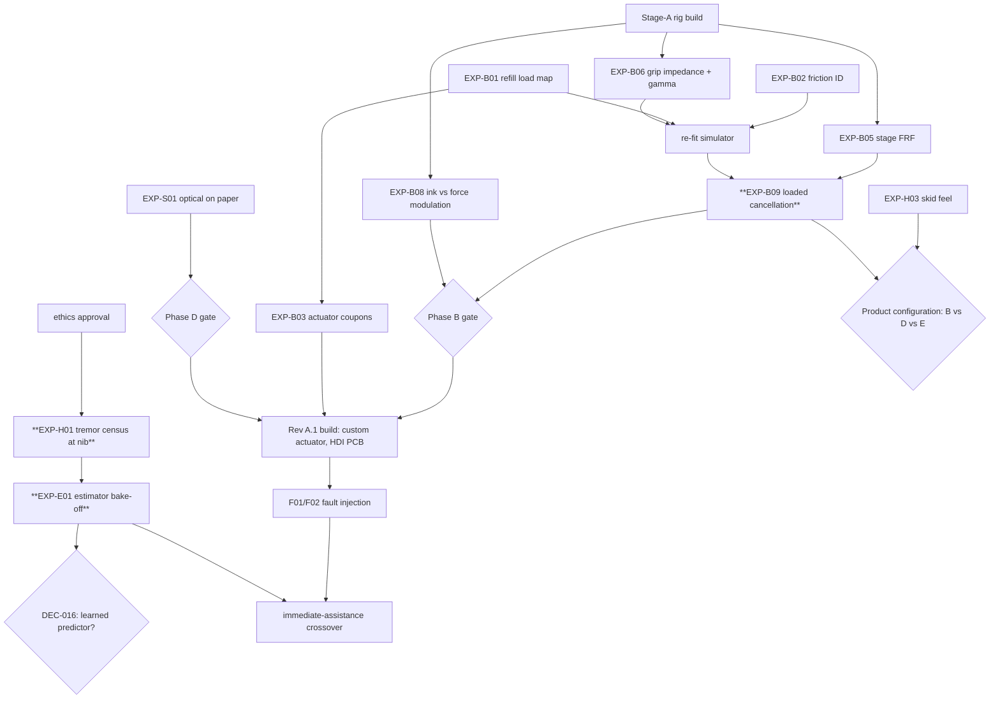

# Development plan: dependencies, resources and gates

This is a plan, not a promise. It orders work by dependency and risk, as the brief requires (§18), and gives effort ranges with their basis. There are no calendar dates, because the critical path runs through measurements and an ethics approval whose timing is external. **No prices are invented.** Custom actuators, optics, cells, flexures and calibration need supplier quotations (list in §4).

## 1. Where the programme stands (brief §18 phases)

Naming: **Phases A–G** below follow the brief's §18. **Prototype stages A–D** in `validation/prototype_stages.md` are hardware builds (stage A = bench rig, B = tethered pen, C = untethered pen, D = product-form candidates). `validation/prototype_stages.md` §2.1 maps one onto the other.

| Phase | Outputs so far | Gate status |
|---|---|---|
| A Requirements and evidence | Audit with 28 corrections; evidence ledger of 247 sources; 53 requirements; parameter file v0.4.2 with provenance; physics; coupled simulator | **Met on paper.** Bounded first use case: action tremor ≤ 1 mm p-p at the nib with f ≥ gate, plus guided tasks, plus capture for everyone. The measurements that close it are listed |
| B Loaded mechanism feasibility | Refill drag protocol (EXP-B01); rig concept CAD; controller simulated with sweeps, Monte Carlo and failures | **Open.** Needs measured transverse load, ink tolerance and loaded cancellation (B01, B08, B09) |
| C Research electronics and mechanics | Editable KiCad schematic (ERC and netlist verified); calculations and SPICE; parametric pen CAD with tolerance and mass models; firmware core (60 test cases on host and emulated Cortex-M33; ARM image links; see `firmware/`) | **Design review possible; packaging (DEC-014) and winding (DEC-012 revisited) open.** No PCB yet |
| D Local sensing and capture | Capture format, app reference implementation, fusion model in simulation | **Open.** Optical sensor on paper unmeasured (EXP-S01) |
| E ML contribution | Synthetic pipeline with baselines, int8 export without f_est (bit-exact C, 16.2 k MAC) and MCU budget (`ml/`) | **Not met by design:** no real data yet (EXP-H01 → E01) |
| F Compact integration | Placement study; Rev A.1 package plan | Not started |
| G Product evidence | Study plans (`validation/`) | Not started |

## 2. Dependency order (critical path in bold)

Two lines of work run **in parallel** from day one because they share no hardware:

- **Rig line.** EXP-B01, B02 and B03 need only a force sensor, a stage and coupons.
- **Human line.** The ethics submission for EXP-H01 uses an instrumented *passive* pen with no actuation. It carries the lowest risk category and has the longest lead time.

Capture and app work proceed independently (Phase D minus optics).

## 3. Specialist work and effort ranges

Effort is in person-weeks (pw) to complete each item to its gate. The basis for each range is the task breakdown in the named document.

| Item | Specialists | Effort | Basis |
|---|---|---|---|
| Stage-A rig: detail design, procurement, assembly, calibration | precision mechanics; metrology | 8–14 pw | ~35 custom parts + ~12 catalogue items (`mechanics/cad/bench_rig.py`); calibration of the F/T sensor, stage and lasers |
| Bench electronics from the Rev A schematic (4-layer, bench size) | analogue/power electronics; layout | 5–8 pw | 148 placements; bring-up steps 1–12 (`electronics/README.md`) |
| Firmware from core to running on nRF5340 DK + rig | embedded real-time | 6–10 pw | Drivers (SAADC/PWM/DPPI, SPI sensors, USB streaming) around the tested core (`firmware/README.md`) |
| EXP-B01/B02/B03/B05/B08/B09 execution and analysis | experimentalist; controls | 12–20 pw | 6 protocols (`validation/bench_protocols.md`), each 1–4 weeks including repeats |
| EXP-B06 grip impedance (volunteers) | experimentalist; ethics (low risk) | 4–6 pw + approval lead time | n ≥ 8 participants, protocol in `validation/` |
| EXP-H01 tremor census (ET, PD, older adults, controls) | clinical research (neurology), study coordinator, statistician | 10–16 pw staff + recruitment time | n ≈ 20 per group; instrumented passive pen |
| EXP-S01 optical sensing on paper | optics; embedded | 6–12 pw | Sensor access (several candidates under NDA), micro-optics, latency rig |
| Custom actuator (Rev A.1): magnetics FEM, coil winding, magnet rings, thermal test | magnetics; manufacturing | 8–14 pw + supplier lead times | EXP-B03 coupons first; K_m target ≥ 0.29 N/√W at the 0.50 mm gap |
| Rev A.1 HDI PCB and mechanical integration | layout (HDI); precision mechanics | 10–16 pw | Placement study at 0.65 density; aQFN94 needs via-in-pad |
| ML on real data (E01 onward) | ML engineer; controls | 8–12 pw after H01 data exist | `ml/README.md` pipeline already runs on synthetic data |
| Human studies H02–H05 and the assistance crossover | clinical research; human factors; statistician | 20–40 pw + recruitment | `validation/human_study_plan.md` sample sizes |
| Regulatory and quality framing | regulatory affairs | 3–6 pw early, more later | Claims (DEC-002) set obligations: assistance and capture, no diagnosis |
| **Total to the gates above** | | **100–174 pw** | Sum of the rows. It excludes ethics approval, recruitment, supplier lead times and manufacturing engineering for Phase G |

**Cost basis.** Labour cost is the effort above times the organisation's loaded weekly rate; no rate is assumed here. Instruments, custom parts and services are priced by the quotations in §4. The two lines that set the calendar are the ethics approval for EXP-H01 and the custom-actuator lead time, not the effort total.

## 4. Needs quotations (do not estimate prices)

- Custom coils: 6 Ω target, bonded flat or annular, with an NTC.
- Magnet rings: quadrant NdFeB, 1.5 mm, ground.
- Back iron.
- Etched BeCu flexures: 0.05 mm gimbal strips; 0.22 mm spiral diaphragm.
- Titanium or CFRP carrier tubes.
- HDI PCB fabrication and assembly (6–8 layers, via-in-pad).
- LiPo pouch cell: 5 × 12 × 32 mm class, ≥ 5 C, with supplier drawing and IEC 62133 test report.
- Near-nib optical sensor modules and micro-optics (NDA).
- Stage-A instruments:
  - 6-axis F/T sensor (Nano17 class) with DAQ;
  - motorised XY stage (100 mm, 1–100 mm/s);
  - two µm-class laser triangulation heads;
  - 12.7 mm VCMs;
  - 25 mm shaker VCMs;
  - goniometer.
- Calibration fixtures: Hall-map jig (EXP-B04); force-map jig (EXP-B03).

## 5. Next concrete actions (in order)

1. Order the stage-A instruments and fabricate the rig (`mechanics/cad/bench_rig.py`). Run **EXP-B01** (refill load map) and **EXP-B02** (friction). The sensitivity analysis ranks friction as the strongest driver of estimator performance.
2. Submit the ethics application for **EXP-H01** with the passive instrumented pen. Build that pen from the Rev A sensing subset: optics, IMU, force; no actuator.
3. Commission the bench electronics and firmware on the nRF5340 DK. Then run **EXP-B09** (loaded cancellation, oracle-referenced) and **EXP-B08**.
4. Decide DEC-014 (packaging) and DEC-008 (product configuration) with the measured B01/B03/B09 numbers.
