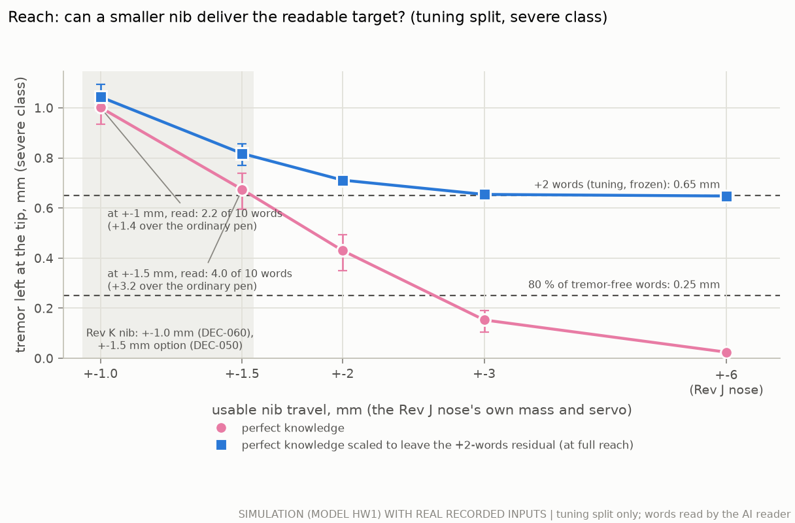

# How much tremor may be left at the pen tip, and where the gap lies (study F)

<!-- Generated by `python3 -m readable.doc --fill readable/doc_template.md --out docs/readable_target.md` from
results/readable/readable.json. The tables and the placeholders of the template are filled from that file; the round
numbers in the prose summarise them, and numbers from studies R, E, B and K are quoted as theirs. -->

## The answer in plain words

*Study F, 30 September 2026. SIMULATION (the hand–pen model HW1) with real recorded handwriting and real recorded
tremor; nothing was built, and nothing was measured on a pen or a person. Every number is labelled SIM (simulation),
CALC (calculation), ASSUMPTION or PROPOSED DESIGN (§1).*

**What was asked.** Study E found no tremor tracker that makes severely tremulous writing readable: at the severe
class (about 1.7 mm of tremor at the pen tip) an ordinary pen gives 0.5 readable words out of 10, perfect knowledge of
the tremor 7.0, and the best causal tracker 0.5, because it still leaves 1.1 mm of tremor at the tip. Three questions
followed:
1. **How much tremor may be left at the tip for words to be readable?** (EXP-E13: the target for any tracker.)
2. **Does setting the tracker's on/off gate from each user's own clean writing keep every writer's clean writing
   within 50 µm?** (EXP-E11, REQ-CTRL-016.)
3. **Is the gap to perfect knowledge a problem of predicting the tremor a few milliseconds ahead, or of telling tremor
   from writing in the pen's sensors?**

**The answer in two numbers.** At the severe class a tracker must leave **no more than about 0.55-0.65 mm** of
tremor at the pen tip for DEC-055's +2 readable words, and **about 0.25 mm** for near-normal reading; today's best
causal tracker leaves 1.12 mm. The gap is in telling tremor from writing, not in predicting the tremor (SIM, with an AI
reader standing in for people).

**The answers.**

1. **The readable level (EXP-E13; SIM, with the curve a CALC).** Drive the Rev J nose with perfect knowledge of the
   tremor, then spoil it on purpose (cancel only part of the tremor, cancel it late, or add random error) and read the
   ink. Words read fall along one curve as more tremor is left at the tip.
   - **DEC-055's words line (+2 words over the ordinary pen) needs no more than about 0.55-0.65 mm of tremor left at
     the tip.** The tuning split puts it at 0.65 mm (95 % interval 0.56-0.70). The test split, run
     once after that value was frozen, confirms it: with 0.65 mm left its writers gained 1.98 (1.44 to 2.61)
     words, at the line (the mean just short of 2, well inside its interval); its own curve, on notes that are harder
     to read, puts the line at
     0.55 mm (0.47-0.64). Parkinson's tremor needs a little less than essential tremor (test split:
     0.46 against 0.62 mm).
   - **Near-normal reading (80 % of the words read without tremor) needs about 0.25 mm or less**: 0.25 mm on the
     tuning split (0.20-0.30), 0.26 mm on the test split; within one word of the clean notes:
     0.19 and 0.22 mm.
   - **Study E's best causal tracker leaves 1.12 mm: about 1.7 times too much** in amplitude
     (3.0 times in power) against the tuning value, and 2.1 times against the test value.
   - **How the error is made matters.** At the same tip tremor, random error costs more words than a smaller copy of the
     tremor: the +2-words level is 0.73 mm for an amplitude error, 0.67 mm for a lag error and 0.51 mm
     for random error (tuning). On the test split, with 0.60 mm left, random error gained 0.6
     words where the amplitude error gained 2.0 with 0.65 mm.

2. **Per-writer gates (EXP-E11; SIM, information only: study E has already seen these test writers).** Setting the
   gate from each writer's own clean writing (a different note from the one scored), with the rule chosen on the tuning
   writers, **kept every test writer's clean writing within 19.1 µm** for study E's frozen design (from
   493.0 µm) and within 18.9 µm for the network trained on real data, and removed the added
   tremor at small tremor. **It does not make words readable:** the words gained at the severe class stay at
   -0.22 (ai2's TCN) and 0.11 (the real-data TCN), because the estimators still leave about
   1 mm. A rule that may lower the
   threshold as well as raise it let one writer reach 60.5 µm, so calibration should only ever raise it.
   The real answer needs shadow-mode recordings of people (EXP-R01).

3. **Prediction or separation? Separation (SIM; the split of the residual is a CALC).**
   - **Predicting the tremor is not the problem.** Given the true tremor signal 1.52 ms late (the pen's sensor and filter
     delays), a simple causal linear predictor covers the whole 4.9 ms to the moment the nib acts: it leaves
     0.03 mm, the same as perfect knowledge, and its ink was read as well (6.9 words of
     10 on the test split). A 10 ms horizon costs almost nothing more, and raw broadband tremor recordings give the same
     answer.
   - **Telling tremor from writing is the problem.** With the tremor alone in the pen's own sensors, a plain linear
     filter on the pen's accelerometer already gets down to 0.29 mm (4.3 words read).
     Once the person writes, every estimator either backs off and leaves 0.97-1.12
     mm (study E's estimators; about half a word read), or keeps acting and moves the writing itself (the same linear
     filter moved clean writing by 2.4 mm on average, and 0.0 of 10 words were read).
   - **Sensing is the smaller, second part.** From the accelerometer alone even a perfect sensor stalls near 0.3 mm (a
     fixed filter cannot turn acceleration into position well enough near the bottom of the tremor band); an accurate,
     drift-free position reference would allow about 0.1 mm; the page sensor modelled on the one measured pen-tip
     sensor would not.
   - **So the project should invest in separating tremor from writing first, and in position sensing in the tremor band
     second. Prediction and latency need no investment.**

**A check the brief did not ask for: the nib's reach (SIM, tuning split; §8).** The readable level was found with the
Rev J nose's ±6 mm. Cancelling the severe tremor moves the nib more than 1 mm from centre 61 % of the
time. With Rev K's ±1.0 mm (DEC-060) even perfect knowledge leaves 1.00 mm and gains only
1.4 (0.8 to 1.9) words (read), short of DEC-055's +2: **no estimator could pass DEC-055 at the severe class with that
nib.** With ±1.5 mm (DEC-050's option) perfect knowledge gains 3.2 (2.6 to 3.7) words, but an estimator that itself
leaves the +2 residual would be left with 0.82 mm; it keeps its result only with about ±2-3 mm
(0.71 mm at ±2, 0.65 mm at ±3).

**What it means for the pen.**
- **A tracker now has a number to hit.** At the severe class (1.7 mm at the tip) it must leave no more than about 0.55
  mm, a third of the tremor, while keeping clean writing within DEC-055's 25 µm on average and 50 µm for any writer;
  about 0.25 mm for near-normal reading. Study E's best leaves 1.1 mm.
- **Rev K's ±1.0 mm nib cannot pass DEC-055 at the severe class, whatever the estimator.** In this simulation even
  perfect knowledge gains only 1.4 (0.8 to 1.9) words with it. ±1.5 mm passes with perfect knowledge, a gain of
  3.2 (2.6 to 3.7) words, but leaves little room for an estimator's own error; about ±2-3 mm keeps an estimator's result at the target. DEC-060's
  ±1.0 mm stands for today's estimators and for smaller tremor; severe-tremor legibility with the nib would need
  DEC-050's ±1.5 mm or more (§8).
- **Per-user gates make trackers safe, not useful.** Calibrating the gate on the user's own writing (only ever raising
  it) keeps clean writing still for every simulated writer, but it cannot add tremor removal the estimator does not have.
- **The work is in separation.** Better prediction or lower latency would not change the words. An estimator that
  tells writing from tremor, or a drift-free position reference at tremor frequencies, would.
- **Nothing here is a benefit to people yet.** It is a simulation with an AI reader standing in for a person.

**What to test next.**
- Whether people read these inks the way the AI reader does (a small blinded panel on the E13 inks; EXP-R03, proposed
  EXP-E20).
- How accurate a pen-tip position sensor must be in the tremor band to reach 0.25 mm with the tremor alone (a sensor
  sweep in simulation, then the rig; proposed EXP-E21).
- Per-user gates on people's own writing in shadow mode (EXP-R01), including users who cannot write without tremor
  (proposed EXP-E22).
- The readable level with the B1 nib's own reach and dynamics (sim2, real inputs; proposed EXP-E23), before DEC-050's
  and DEC-060's reach is fixed for good.
- Estimators that separate writing from tremor, judged against the 0.55 mm target on new held-out data (EXP-E10,
  EXP-E12).

## One number per condition: words you can read out of 10, against the tremor left at the tip

**Words read out of 10 against the tremor left at the tip, read off the fitted curves** (CALC on SIM points; PD and ET, severe and moderate pooled)

| Tremor left at the tip, mm | Words of 10, tuning curve | Words of 10, test curve |
|---|---|---|
| 0.00 (no tremor left) | 8.4 | 6.9 |
| 0.10 | 8.2 | 6.8 |
| 0.20 | 7.4 | 6.1 |
| 0.30 | 6.2 | 4.9 |
| 0.40 | 5.0 | 3.8 |
| 0.50 | 3.9 | 2.9 |
| 0.60 | 3.1 | 2.2 |
| 0.75 | 2.2 | 1.6 |
| 1.00 | 1.4 | 1.1 |
| 1.12 (study E's best causal tracker, test) | 1.1 | 0.9 |
| 1.40 | 0.8 | 0.7 |
| 1.64 (ordinary pen, severe, test) | 0.6 | 0.7 |

- **Read off the curve fitted to every simulated reading** (below, and §3). The tuning curve was fitted and frozen
  first; the test curve comes from the test split's own readings. The AI reader (TrOCR base, literal) stands in for a
  person.
- **For comparison** (study E, test split): an ordinary pen leaves 1.64 mm, study E's best causal tracker 1.12 mm,
  perfect knowledge 0.03 mm.

## Details

### 1. Status, labels and how to reproduce

- **Labels.** **SIM**: an executed simulation of model HW1 (`handwriting/`, read-only) with real recorded inputs (study
  R's library: UNIPEN hpb2 writing, UCI Parkinson's tip tremor, Zenodo essential-tremor hand acceleration; recordings made
  by others). **CALC**: a calculation on simulated signals or on real recorded inputs (the curve fit, the thresholds, the
  part residuals, the broadband check). **ASSUMPTION**: a value chosen here. **PROPOSED DESIGN**: nothing was built.
  **LIT**: literature with its ledger id (none new here). Nothing here is a MEASUREMENT: nothing was built, and nothing
  was measured on a person or on hardware.
- **Package.** `readable/` (new). `python3 -m readable.run` runs every stage (`--quick` for a short check that writes to
  `readable/build/quick/` and never to `results/readable/`). Stages resume from `readable/build/` (git-ignored). Tests:
  `python3 -m pytest -q readable/tests`.
- **Reused read-only.** `realdata/` (R's library, splits, HW1 set-up, the reader, R's measures and writer bootstrap,
  R's cached test cases) and `realtrack/` (E's tuning selection set and folds, cached cases, estimators, frozen designs,
  the command-path surrogate, the FIR code). Nothing in them was changed; the numba cache is private to `readable/build`.
- **Results.** `results/readable/readable.json` (with `stabpen.provenance`: git revision, the inputs' sha256, seeds,
  parameters and splits, command, python, numpy and torch versions), `frozen.json` (written after the tuning runs and
  before any test case was built), five figures with their CSV twins, and `evidence_rows.csv` (proposed ledger rows).
  The tables of this document are generated by `python3 -m readable.doc` into `readable/build/doc_tables.md`.

### 2. EXP-E13: how the readable level was found

- **The pen and the inputs.** Study R's hand–pen model HW1 with the Rev J nose (±6 mm), study R's real notes and real
  tremor, study R's reader and measures. On the tuning split: study E's selection set (5 tuning writers × 2 notes,
  tuning texts; PD and ET recordings of tuning patients of the note's fold) at the severe class (1.72 mm at the tip,
  DEC-055's condition) and the moderate class (0.24 mm), and the same 10 notes without tremor. Every case was rebuilt
  with study E's code and seeds: the nose-held tip tremor of every case equals study E's cached value to the last digit.
- **Three kinds of residual on top of perfect knowledge** (`readable/residual.py`; perfect knowledge is study R's:
  the nose is given the true handle tremor, previewed by the servo's delay):
  - **(a) amplitude error**: the nose cancels a share k of the tremor, so 1 − k is left: 0, 10, 18, 27, 38, 55 and 100 %
    left (100 % is the nose held still);
  - **(b) lag error**: the perfect estimate arrives τ late: 5.2 ms (study E's whole IMU-to-tip chain without any
    prediction: it leaves about 20 % of a 6 Hz tremor, CALC), 13.4 ms (the far end of study E's horizon sweep: the
    servo delay + 10 ms) and 25 ms;
  - **(c) random error**: perfect cancellation plus band-limited noise (two-dimensional, the tremor's own band
    f0 ± 2 Hz) of 0.2, 0.4 and 0.8 mm (the class convention: √2 × RMS of the major axis).
  At the moderate class only perfect knowledge was added to the ordinary pen (the reading budget).
- **Measures.** Words read out of 10 (TrOCR base, literal: greedy decoding, no dictionary, no correction: study R's
  reader, unchanged), and the tremor left at the tip (study R's measure: √2 × RMS of the major axis of ink minus
  intended, in contact, f0 ± 2 Hz). Every run was read. The same notes without tremor give the ceiling.
- **The curve** (`readable/curve.py`, fixed before any reading): words fall from the tremor-free level to a floor
  along a log-logistic curve, w(r) = w_lo + (w_hi − w_lo) / (1 + (r / r50)^s), fitted by least squares to every run of
  every case (the ordinary pen and the clean notes included). Read off it:
  - **the residual for +2 words**: where the curve reaches the ordinary pen's words at the severe class plus 2
    (DEC-055's words line);
  - **the residual for 80 %** of the words read on the same notes without tremor (the brief);
  - **the residual for words within 1 of the clean notes** (EXP-E13's measurand in `validation/bench_protocols.md`).
  95 % intervals: 2000 bootstrap resamples of writers, each refitted.
- **Frozen, then confirmed once.** The tuning curve, its thresholds and six test levels aimed at them were written to
  `results/readable/frozen.json` before any test case was built: (a) at the 80 % residual, midway, the +2 residual and
  1.3 × the +2 residual; (b) the delay whose steady-sine residual equals the +2 residual; (c) noise at the +2 residual.
  On R's test split (9 test writers, R's severe PD and ET cases and seeds) each case ran once with those six levels;
  R's own readings of the same cases (ordinary pen, perfect knowledge at the severe and moderate classes, clean notes)
  were merged in, as study E did.

### 3. EXP-E13: results

**Tuning split** (SIM; study R's tuning split, study E's selection set: 5 writers, 10 notes, 20 severe and 20 moderate
cases, 10 clean notes; every run read).
- **Words fall smoothly as tremor is left at the tip.** The fitted curve starts at 8.2 words of 10 with 0.1 mm
  left, is at 6.2 with 0.3 mm, 3.9 with 0.5 mm, 2.2 with 0.75 mm and 1.4 with 1 mm (the
  same notes without tremor: 8.5; the ordinary pen at the severe class: 0.8).
- **The thresholds** (CALC; 95 % writer-bootstrap intervals): +2 words over the ordinary pen at **0.65 mm**
  (0.56-0.70); 80 % of the tremor-free words at **0.25 mm** (0.20-0.30); within 1 word
  of the clean notes (EXP-E13's measurand) at **0.19 mm** (0.15-0.22). A model-free check (straight
  lines through the per-level means of the amplitude sweep) gives 0.74, 0.27 and 0.19 mm.
- **The kind of error matters for the +2 level, less for near-normal reading.** Fitted per kind of residual: +2 words
  at 0.73 mm for an amplitude error (0.62-0.78), 0.67 mm for a lag error
  (0.55-0.76), 0.51 mm for random error (0.45-0.57); the 80 % levels are
  0.28, 0.26 and 0.25 mm. Random error costs the most at the same tip tremor. Part of it is the
  measure: R's convention counts the major axis only, and the isotropic noise has as much motion across the major axis
  as along it, where the real tremor has about half; with study E's broadband residual (0.5-20 Hz RMS, both axes) as
  the x-axis the three kinds give +2 words at 0.63, 0.60 and 0.56 mm RMS.
- **Parkinson's tremor needs a little less than essential tremor:** +2 words at 0.61 mm for PD
  (0.53-0.65) and 0.68 mm for ET (0.58-0.74); 80 % at 0.22 and
  0.30 mm. The test split shows the same order with a wider gap (+2 at 0.46 mm for PD,
  0.26-0.56, and 0.62 mm for ET, 0.50-0.77; at 0.65 mm the PD cases
  gained 1.4 words and the ET cases 2.6). The intervals overlap.
- **One reading of one note is noisy** (the curve's RMS error per reading is 1.66 words): the AI reader moves in
  whole words, and a note can drop from 7 to 5 words between two inks that differ little. Means over writers are much
  steadier (the intervals in the tables).
- **AC-E13-01** (validation pass 10; a hypothesis: the +2-words residual with perfect knowledge scaled, on R's tuning
  notes, lies within 0.24-1.0 mm): 0.73 mm for the scaled residual alone (0.62-0.78), 0.65 mm
  for all three kinds pooled: inside the range (SIM). Study E expected about 0.2-0.3 mm; that is the near-normal level
  here, not the +2 level.

**Test split** (SIM; run once after the freeze; 9 writers, R's severe PD and ET cases, six levels aimed at the frozen
thresholds; R's readings of the ordinary pen, perfect knowledge and the clean notes merged).
- **The test notes are harder to read** even without tremor (6.8 words of 10 against 8.5 on the
  tuning notes), so the whole curve sits lower; the ordinary pen reads 0.5.
- **The test curve**: +2 words at **0.55 mm** (0.47-0.64), 80 % of the tremor-free words at
  **0.26 mm** (0.22-0.31), within 1 word at 0.22 mm; model-free 0.65 and 0.26
  mm (the levels run do not bracket the within-1-word level).
- **At the level aimed at the tuning +2 residual** (the nose leaving 0.65 mm): 2.5 (1.7 to 3.5) words of
  10, a gain of 1.98 (1.44 to 2.61) words over the ordinary pen. DEC-055 asks for a mean gain of at least 2 with the
  interval above 0: the interval is above 0; the mean, 1.98, is just short of 2, well inside its
  interval. The test split confirms the tuning value to within the reading noise.
- **The frozen tuning curve against the test readings** (the table below): it over-predicts the test readings by
  1.4 words with perfect knowledge and 1.3 at the 80 % level, where
  the test notes' lower ceiling shows, but only by 0.2 at the +2 level for the amplitude error
  (0.5 for the lag error). Random error at the +2 level read 2.0 words
  below the curve: on the test notes random error is costlier still.

**Results card: EXP-E13 on the test split, severe class, PD and ET pooled** (SIM; 9 test writers, 18 cases; 95 % writer-bootstrap intervals; E13 rows are perfect knowledge made imperfect on purpose, so they move no clean writing by construction)

|  | Ordinary pen | (a) aimed at the 80 % level | (a) midway | (a) aimed at +2 words | (b) lag, aimed at +2 | (c) noise, aimed at +2 | (a) 1.3 x the +2 level | Perfect knowledge (R) |
|---|---|---|---|---|---|---|---|---|
| Readable words out of 10 | 0.5 (0.1 to 1.0) | 5.5 (4.4 to 6.6) | 3.5 (2.5 to 4.6) | 2.5 (1.7 to 3.5) | 2.3 (1.5 to 3.2) | 1.1 (0.7 to 1.6) | 1.6 (0.8 to 2.4) | 7.0 (5.8 to 8.1) |
| ... gain over the ordinary pen | - | 5.0 (4.0 to 5.8) | 2.9 (2.2 to 3.7) | 2.0 (1.4 to 2.6) | 1.8 (1.2 to 2.3) | 0.6 (0.2 to 1.0) | 1.0 (0.5 to 1.5) | 6.4 (5.4 to 7.4) |
| Tremor left at the tip, mm | 1.64 (1.58 to 1.69) | 0.25 (0.25 to 0.26) | 0.45 (0.45 to 0.45) | 0.65 (0.65 to 0.65) | 0.64 (0.63 to 0.65) | 0.60 (0.58 to 0.62) | 0.84 (0.84 to 0.84) | 0.03 (0.02 to 0.05) |
| ... share of the ordinary pen's (amplitude) | 1 (reference) | 0.16 (0.15 to 0.16) | 0.28 (0.27 to 0.29) | 0.40 (0.39 to 0.42) | 0.40 (0.38 to 0.42) | 0.37 (0.36 to 0.38) | 0.52 (0.50 to 0.54) | 0.02 (0.01 to 0.03) |
| Clean writing moved, um (notes without tremor) | 0 (reference) | 0 by construction | 0 by construction | 0 by construction | 0 by construction | 0 by construction | 0 by construction | 0 by construction |
| Readable words without tremor | 6.8 (5.5 to 8.1) | - | - | - | - | - | - | - |

**E13, tuning split, PD and ET pooled, severe class** (SIM; mean over writers, 95 % writer-bootstrap interval; same notes without tremor: 8.5 (7.6 to 9.3) words of 10)

| Residual at the tip | Tremor left at the tip, mm | Words of 10 | Gain over the ordinary pen | Cases |
|---|---|---|---|---|
| Ordinary pen | 1.70 (1.66 to 1.74) | 0.8 (0.4 to 1.1) | - | 20 |
| Rev J, perfect knowledge | 0.02 (0.02 to 0.03) | 8.3 (7.3 to 9.3) | 7.6 (6.8 to 8.4) | 20 |
| (a) 10 % of the tremor left | 0.18 (0.18 to 0.19) | 7.6 (6.3 to 8.7) | 6.8 (6.0 to 7.7) | 20 |
| (c) perfect + noise 0.20 mm | 0.19 (0.18 to 0.20) | 7.1 (5.8 to 8.4) | 6.3 (5.4 to 7.3) | 20 |
| (a) 18 % of the tremor left | 0.33 (0.32 to 0.34) | 6.2 (4.4 to 7.7) | 5.4 (4.0 to 6.7) | 20 |
| (b) perfect estimate 5.2 ms late | 0.37 (0.32 to 0.41) | 5.2 (4.3 to 6.1) | 4.5 (3.9 to 5.1) | 20 |
| (c) perfect + noise 0.40 mm | 0.38 (0.37 to 0.39) | 4.5 (3.4 to 5.4) | 3.7 (2.9 to 4.6) | 20 |
| (a) 27 % of the tremor left | 0.50 (0.49 to 0.51) | 4.5 (3.3 to 5.4) | 3.7 (2.9 to 4.4) | 20 |
| (a) 38 % of the tremor left | 0.70 (0.68 to 0.72) | 3.0 (2.1 to 3.6) | 2.2 (1.7 to 2.6) | 20 |
| (c) perfect + noise 0.80 mm | 0.77 (0.75 to 0.79) | 1.1 (0.6 to 1.5) | 0.3 (0.1 to 0.7) | 20 |
| (b) perfect estimate 13.4 ms late | 0.90 (0.79 to 1.00) | 1.8 (1.3 to 2.4) | 1.1 (0.8 to 1.3) | 20 |
| (a) 55 % of the tremor left | 1.01 (0.99 to 1.04) | 1.5 (0.8 to 2.0) | 0.8 (0.4 to 1.1) | 20 |
| (b) perfect estimate 25.0 ms late | 1.61 (1.43 to 1.79) | 0.8 (0.4 to 1.0) | 0.0 (-0.2 to 0.2) | 20 |
| Rev J, nose held (a: 100 % left) | 1.85 (1.80 to 1.89) | 0.6 (0.1 to 1.1) | -0.2 (-0.7 to 0.3) | 20 |

**E13, tuning split, Parkinson's, severe class** (SIM; mean over writers, 95 % writer-bootstrap interval; same notes without tremor: 8.5 (7.6 to 9.3) words of 10)

| Residual at the tip | Tremor left at the tip, mm | Words of 10 | Gain over the ordinary pen | Cases |
|---|---|---|---|---|
| Ordinary pen | 1.71 (1.68 to 1.74) | 0.1 (0.0 to 0.3) | - | 10 |
| Rev J, perfect knowledge | 0.03 (0.02 to 0.04) | 8.2 (7.2 to 9.3) | 8.1 (7.1 to 9.2) | 10 |
| (a) 10 % of the tremor left | 0.19 (0.18 to 0.19) | 7.1 (5.7 to 8.5) | 7.0 (5.7 to 8.4) | 10 |
| (c) perfect + noise 0.20 mm | 0.19 (0.19 to 0.20) | 6.5 (4.9 to 8.0) | 6.4 (4.9 to 8.0) | 10 |
| (a) 18 % of the tremor left | 0.34 (0.33 to 0.35) | 5.3 (3.4 to 7.3) | 5.2 (3.4 to 7.2) | 10 |
| (c) perfect + noise 0.40 mm | 0.39 (0.38 to 0.39) | 4.1 (3.1 to 5.1) | 4.1 (3.1 to 5.0) | 10 |
| (b) perfect estimate 5.2 ms late | 0.44 (0.35 to 0.51) | 3.7 (3.0 to 4.5) | 3.6 (3.0 to 4.2) | 10 |
| (a) 27 % of the tremor left | 0.51 (0.49 to 0.52) | 3.6 (2.7 to 4.6) | 3.5 (2.7 to 4.4) | 10 |
| (a) 38 % of the tremor left | 0.71 (0.69 to 0.73) | 1.6 (1.2 to 2.1) | 1.5 (1.0 to 2.0) | 10 |
| (c) perfect + noise 0.80 mm | 0.77 (0.74 to 0.80) | 0.6 (0.3 to 1.1) | 0.6 (0.1 to 1.0) | 10 |
| (a) 55 % of the tremor left | 1.03 (1.00 to 1.06) | 0.6 (0.2 to 1.1) | 0.6 (0.1 to 1.0) | 10 |
| (b) perfect estimate 13.4 ms late | 1.07 (0.86 to 1.25) | 0.2 (0.0 to 0.4) | 0.1 (-0.2 to 0.4) | 10 |
| Rev J, nose held (a: 100 % left) | 1.88 (1.82 to 1.94) | 0.0 (0.0 to 0.0) | -0.1 (-0.3 to 0.0) | 10 |
| (b) perfect estimate 25.0 ms late | 1.89 (1.55 to 2.19) | 0.1 (0.0 to 0.3) | 0.0 (0.0 to 0.0) | 10 |

**E13, tuning split, Essential tremor, severe class** (SIM; mean over writers, 95 % writer-bootstrap interval; same notes without tremor: 8.5 (7.6 to 9.3) words of 10)

| Residual at the tip | Tremor left at the tip, mm | Words of 10 | Gain over the ordinary pen | Cases |
|---|---|---|---|---|
| Ordinary pen | 1.69 (1.61 to 1.74) | 1.4 (0.7 to 2.1) | - | 10 |
| Rev J, perfect knowledge | 0.02 (0.02 to 0.02) | 8.5 (7.3 to 9.4) | 7.1 (6.5 to 7.7) | 10 |
| (a) 10 % of the tremor left | 0.18 (0.17 to 0.19) | 8.0 (6.7 to 9.1) | 6.6 (5.9 to 7.3) | 10 |
| (c) perfect + noise 0.20 mm | 0.18 (0.17 to 0.19) | 7.7 (6.6 to 8.6) | 6.2 (5.4 to 6.9) | 10 |
| (b) perfect estimate 5.2 ms late | 0.30 (0.27 to 0.32) | 6.8 (5.3 to 8.0) | 5.3 (4.6 to 6.1) | 10 |
| (a) 18 % of the tremor left | 0.33 (0.31 to 0.34) | 7.1 (5.4 to 8.3) | 5.6 (4.6 to 6.5) | 10 |
| (c) perfect + noise 0.40 mm | 0.38 (0.36 to 0.40) | 4.8 (3.6 to 6.1) | 3.4 (2.4 to 4.4) | 10 |
| (a) 27 % of the tremor left | 0.49 (0.47 to 0.51) | 5.3 (3.5 to 6.8) | 3.9 (2.8 to 4.8) | 10 |
| (a) 38 % of the tremor left | 0.69 (0.66 to 0.71) | 4.3 (2.8 to 5.5) | 2.9 (2.1 to 3.4) | 10 |
| (b) perfect estimate 13.4 ms late | 0.74 (0.68 to 0.78) | 3.5 (2.2 to 4.7) | 2.0 (1.3 to 2.7) | 10 |
| (c) perfect + noise 0.80 mm | 0.77 (0.75 to 0.78) | 1.5 (1.0 to 2.0) | 0.1 (-0.4 to 0.5) | 10 |
| (a) 55 % of the tremor left | 1.00 (0.95 to 1.03) | 2.4 (1.3 to 3.5) | 0.9 (0.1 to 1.6) | 10 |
| (b) perfect estimate 25.0 ms late | 1.34 (1.23 to 1.42) | 1.4 (0.7 to 2.0) | 0.0 (-0.5 to 0.4) | 10 |
| Rev J, nose held (a: 100 % left) | 1.82 (1.73 to 1.88) | 1.2 (0.1 to 2.2) | -0.3 (-1.3 to 0.6) | 10 |

**E13, tuning split, PD and ET pooled, moderate class** (SIM; mean over writers, 95 % writer-bootstrap interval; same notes without tremor: 8.5 (7.6 to 9.3) words of 10)

| Residual at the tip | Tremor left at the tip, mm | Words of 10 | Gain over the ordinary pen | Cases |
|---|---|---|---|---|
| Ordinary pen | 0.24 (0.23 to 0.24) | 7.3 (6.3 to 8.4) | - | 20 |
| Rev J, perfect knowledge | 0.00 (0.00 to 0.00) | 8.5 (7.6 to 9.3) | 1.2 (0.8 to 1.7) | 20 |

**E13, tuning split, Parkinson's, moderate class** (SIM; mean over writers, 95 % writer-bootstrap interval; same notes without tremor: 8.5 (7.6 to 9.3) words of 10)

| Residual at the tip | Tremor left at the tip, mm | Words of 10 | Gain over the ordinary pen | Cases |
|---|---|---|---|---|
| Ordinary pen | 0.24 (0.23 to 0.25) | 7.1 (6.1 to 8.1) | - | 10 |
| Rev J, perfect knowledge | 0.00 (0.00 to 0.00) | 8.5 (7.6 to 9.3) | 1.4 (0.8 to 1.9) | 10 |

**E13, tuning split, Essential tremor, moderate class** (SIM; mean over writers, 95 % writer-bootstrap interval; same notes without tremor: 8.5 (7.6 to 9.3) words of 10)

| Residual at the tip | Tremor left at the tip, mm | Words of 10 | Gain over the ordinary pen | Cases |
|---|---|---|---|---|
| Ordinary pen | 0.24 (0.22 to 0.24) | 7.5 (6.4 to 8.7) | - | 10 |
| Rev J, perfect knowledge | 0.00 (0.00 to 0.00) | 8.5 (7.6 to 9.3) | 1.0 (0.6 to 1.5) | 10 |

**E13 curve, tuning split** (CALC on SIM points; 95 % writer-bootstrap intervals; the anchors are the ordinary pen, perfect knowledge, the nose held and the clean notes)

| Points fitted | Residual for +2 words (DEC-055), mm | Residual for 80 % of the tremor-free words, mm | Residual for words within 1 of the clean notes, mm | w_hi | r50, mm | steepness | w_lo | RMSE, words | points |
|---|---|---|---|---|---|---|---|---|---|
| all points (PD + ET, severe + moderate, all types) | 0.65 (0.56 to 0.70) | 0.25 (0.20 to 0.30) | 0.19 (0.15 to 0.22) | 8.4 | 0.46 | 2.3 | 0.2 | 1.66 | 330 |
| severe class only | 0.65 (0.55 to 0.69) | 0.24 (0.18 to 0.30) | 0.18 (0.14 to 0.22) | 8.4 | 0.46 | 2.2 | 0.1 | 1.68 | 290 |
| Parkinson's only | 0.61 (0.53 to 0.65) | 0.22 (0.17 to 0.28) | 0.16 (0.13 to 0.21) | 8.2 | 0.40 | 2.6 | 0.0 | 1.41 | 170 |
| essential tremor only | 0.68 (0.58 to 0.74) | 0.30 (0.24 to 0.36) | 0.23 (0.19 to 0.27) | 8.5 | 0.51 | 2.3 | 0.8 | 1.66 | 170 |
| (a) amplitude + anchors | 0.73 (0.62 to 0.78) | 0.28 (0.22 to 0.33) | 0.20 (0.17 to 0.25) | 8.4 | 0.52 | 2.2 | 0.1 | 1.62 | 210 |
| (b) lag + anchors | 0.67 (0.55 to 0.76) | 0.26 (0.21 to 0.30) | 0.19 (0.16 to 0.23) | 8.5 | 0.47 | 2.3 | 0.2 | 1.44 | 170 |
| (c) noise + anchors | 0.51 (0.45 to 0.57) | 0.25 (0.22 to 0.28) | 0.20 (0.18 to 0.22) | 8.4 | 0.38 | 3.1 | 0.5 | 1.44 | 170 |
| check: all points, broadband residual (0.5-20 Hz RMS) as x | 0.60 (0.52 to 0.63) | 0.23 (0.19 to 0.28) | 0.18 (0.14 to 0.21) | 8.4 | 0.44 | 2.3 | 0.0 | 1.61 | 330 |
| check: (a) + anchors, broadband x | 0.63 (0.54 to 0.68) | 0.24 (0.19 to 0.28) | 0.18 (0.15 to 0.22) | 8.4 | 0.45 | 2.2 | 0.1 | 1.62 | 210 |
| check: (b) + anchors, broadband x | 0.60 (0.48 to 0.68) | 0.23 (0.19 to 0.27) | 0.17 (0.15 to 0.20) | 8.5 | 0.42 | 2.2 | 0.1 | 1.40 | 170 |
| check: (c) + anchors, broadband x | 0.56 (0.50 to 0.62) | 0.24 (0.20 to 0.27) | 0.18 (0.16 to 0.21) | 8.4 | 0.41 | 2.6 | 0.3 | 1.44 | 170 |

Model-free check (type (a) per-level means, piecewise linear): +2 words at 0.74 mm, 80 % at 0.27 mm, within 1 word at 0.19 mm.

Ordinary pen at the severe class: 0.76 words of 10 (target 2.76); the same notes without tremor: 8.49 (80 %: 6.79).

**E13, test split, PD and ET pooled, severe class** (SIM; mean over writers, 95 % writer-bootstrap interval; same notes without tremor: 6.8 (5.5 to 8.1) words of 10)

| Residual at the tip | Tremor left at the tip, mm | Words of 10 | Gain over the ordinary pen | Cases |
|---|---|---|---|---|
| Ordinary pen | 1.64 (1.58 to 1.69) | 0.5 (0.1 to 1.0) | - | 18 |
| Rev J, perfect knowledge | 0.03 (0.02 to 0.05) | 7.0 (5.8 to 8.1) | 6.4 (5.4 to 7.4) | 18 |
| (a) 14 % of the tremor left [aimed at 0.25 mm] | 0.25 (0.25 to 0.26) | 5.5 (4.4 to 6.6) | 5.0 (4.0 to 5.8) | 18 |
| (a) 25 % of the tremor left [aimed at 0.45 mm] | 0.45 (0.45 to 0.45) | 3.5 (2.5 to 4.6) | 2.9 (2.2 to 3.7) | 18 |
| (c) perfect + noise 0.65 mm [aimed at 0.65 mm] | 0.60 (0.58 to 0.62) | 1.1 (0.7 to 1.6) | 0.6 (0.2 to 1.0) | 18 |
| (b) perfect estimate 9.3 ms late [aimed at 0.65 mm] | 0.64 (0.63 to 0.65) | 2.3 (1.5 to 3.2) | 1.8 (1.2 to 2.3) | 18 |
| (a) 36 % of the tremor left [aimed at 0.65 mm] | 0.65 (0.65 to 0.65) | 2.5 (1.7 to 3.5) | 2.0 (1.4 to 2.6) | 18 |
| (a) 46 % of the tremor left [aimed at 0.84 mm] | 0.84 (0.84 to 0.84) | 1.6 (0.8 to 2.4) | 1.0 (0.5 to 1.5) | 18 |

**E13, test split, Parkinson's, severe class** (SIM; mean over writers, 95 % writer-bootstrap interval; same notes without tremor: 6.8 (5.5 to 8.1) words of 10)

| Residual at the tip | Tremor left at the tip, mm | Words of 10 | Gain over the ordinary pen | Cases |
|---|---|---|---|---|
| Ordinary pen | 1.58 (1.46 to 1.68) | 0.3 (0.1 to 0.7) | - | 9 |
| Rev J, perfect knowledge | 0.02 (0.02 to 0.02) | 7.1 (6.0 to 8.2) | 6.8 (5.7 to 7.8) | 9 |
| (a) 14 % of the tremor left [aimed at 0.25 mm] | 0.25 (0.25 to 0.25) | 4.4 (2.8 to 5.9) | 4.1 (2.6 to 5.4) | 9 |
| (a) 25 % of the tremor left [aimed at 0.45 mm] | 0.45 (0.45 to 0.45) | 2.4 (1.2 to 3.6) | 2.0 (1.1 to 3.0) | 9 |
| (c) perfect + noise 0.65 mm [aimed at 0.65 mm] | 0.59 (0.56 to 0.62) | 1.3 (0.7 to 1.9) | 1.0 (0.5 to 1.4) | 9 |
| (a) 36 % of the tremor left [aimed at 0.65 mm] | 0.65 (0.65 to 0.65) | 1.7 (0.9 to 2.5) | 1.4 (0.8 to 2.0) | 9 |
| (b) perfect estimate 9.3 ms late [aimed at 0.65 mm] | 0.66 (0.65 to 0.67) | 1.3 (0.6 to 2.0) | 1.0 (0.5 to 1.4) | 9 |
| (a) 46 % of the tremor left [aimed at 0.84 mm] | 0.84 (0.84 to 0.84) | 0.9 (0.3 to 1.5) | 0.5 (0.1 to 1.0) | 9 |

**E13, test split, Essential tremor, severe class** (SIM; mean over writers, 95 % writer-bootstrap interval; same notes without tremor: 6.8 (5.5 to 8.1) words of 10)

| Residual at the tip | Tremor left at the tip, mm | Words of 10 | Gain over the ordinary pen | Cases |
|---|---|---|---|---|
| Ordinary pen | 1.69 (1.64 to 1.73) | 0.7 (0.0 to 1.6) | - | 9 |
| Rev J, perfect knowledge | 0.04 (0.02 to 0.07) | 6.8 (5.5 to 8.1) | 6.1 (5.0 to 7.1) | 9 |
| (a) 14 % of the tremor left [aimed at 0.25 mm] | 0.25 (0.25 to 0.26) | 6.6 (5.7 to 7.5) | 5.9 (5.2 to 6.5) | 9 |
| (a) 25 % of the tremor left [aimed at 0.45 mm] | 0.45 (0.45 to 0.45) | 4.6 (3.2 to 6.0) | 3.8 (2.8 to 4.9) | 9 |
| (c) perfect + noise 0.65 mm [aimed at 0.65 mm] | 0.61 (0.59 to 0.63) | 1.0 (0.3 to 1.7) | 0.2 (-0.9 to 1.1) | 9 |
| (b) perfect estimate 8.8 ms late [aimed at 0.65 mm] | 0.62 (0.60 to 0.64) | 3.3 (2.1 to 4.5) | 2.6 (1.7 to 3.4) | 9 |
| (a) 36 % of the tremor left [aimed at 0.65 mm] | 0.65 (0.65 to 0.65) | 3.3 (2.2 to 4.6) | 2.6 (1.7 to 3.6) | 9 |
| (a) 46 % of the tremor left [aimed at 0.84 mm] | 0.84 (0.84 to 0.84) | 2.3 (1.1 to 3.4) | 1.5 (0.7 to 2.5) | 9 |

**E13, test split, PD and ET pooled, moderate class** (SIM; mean over writers, 95 % writer-bootstrap interval; same notes without tremor: 6.8 (5.5 to 8.1) words of 10)

| Residual at the tip | Tremor left at the tip, mm | Words of 10 | Gain over the ordinary pen | Cases |
|---|---|---|---|---|
| Ordinary pen | 0.23 (0.22 to 0.24) | 5.7 (4.6 to 6.7) | - | 18 |
| Rev J, perfect knowledge | 0.00 (0.00 to 0.00) | 6.9 (5.6 to 8.2) | 1.2 (0.8 to 1.6) | 18 |

**E13, test split, Parkinson's, moderate class** (SIM; mean over writers, 95 % writer-bootstrap interval; same notes without tremor: 6.8 (5.5 to 8.1) words of 10)

| Residual at the tip | Tremor left at the tip, mm | Words of 10 | Gain over the ordinary pen | Cases |
|---|---|---|---|---|
| Ordinary pen | 0.23 (0.22 to 0.24) | 5.6 (4.7 to 6.3) | - | 9 |
| Rev J, perfect knowledge | 0.00 (0.00 to 0.00) | 7.0 (5.7 to 8.3) | 1.5 (0.5 to 2.3) | 9 |

**E13, test split, Essential tremor, moderate class** (SIM; mean over writers, 95 % writer-bootstrap interval; same notes without tremor: 6.8 (5.5 to 8.1) words of 10)

| Residual at the tip | Tremor left at the tip, mm | Words of 10 | Gain over the ordinary pen | Cases |
|---|---|---|---|---|
| Ordinary pen | 0.23 (0.21 to 0.24) | 5.9 (4.3 to 7.3) | - | 9 |
| Rev J, perfect knowledge | 0.00 (0.00 to 0.00) | 6.8 (5.5 to 8.1) | 0.9 (0.4 to 1.6) | 9 |

**E13 curve, test split** (CALC on SIM points; 95 % writer-bootstrap intervals; the anchors are the ordinary pen, perfect knowledge, the nose held and the clean notes)

| Points fitted | Residual for +2 words (DEC-055), mm | Residual for 80 % of the tremor-free words, mm | Residual for words within 1 of the clean notes, mm | w_hi | r50, mm | steepness | w_lo | RMSE, words | points |
|---|---|---|---|---|---|---|---|---|---|
| all points (PD + ET, severe + moderate, all types) | 0.55 (0.47 to 0.64) | 0.26 (0.22 to 0.31) | 0.22 (0.18 to 0.29) | 6.9 | 0.41 | 2.6 | 0.5 | 1.85 | 189 |
| Parkinson's only | 0.46 (0.26 to 0.56) | 0.21 (0.16 to 0.29) | 0.18 (0.13 to 0.27) | 7.0 | 0.33 | 2.5 | 0.3 | 1.57 | 99 |
| essential tremor only | 0.62 (0.50 to 0.77) | 0.33 (0.30 to 0.37) | 0.29 (0.26 to 0.33) | 6.9 | 0.48 | 3.1 | 0.9 | 1.95 | 99 |

Model-free check (type (a) per-level means, piecewise linear): +2 words at 0.65 mm, 80 % at 0.26 mm; not bracketed by the levels run: within 1 word.

Ordinary pen at the severe class: 0.54 words of 10 (target 2.54); the same notes without tremor: 6.82 (80 %: 5.45).

**E13 test split against the frozen tuning curve** (CALC on SIM; words read against the tuning curve's words at the measured residual; mean error -0.95 words, mean absolute error 1.67 per run)

| Run | Tip tremor, mm | Words read | Tuning curve predicts | Read minus predicted | Runs |
|---|---|---|---|---|---|
| perfect knowledge (severe and moderate) | 0.02 | 6.96 | 8.39 | -1.43 | 36 |
| (a) aimed at the 80 % level | 0.25 | 5.52 | 6.77 | -1.25 | 18 |
| (a) midway | 0.45 | 3.47 | 4.43 | -0.95 | 18 |
| (a) aimed at +2 words | 0.65 | 2.53 | 2.77 | -0.24 | 18 |
| (b) lag, aimed at +2 | 0.64 | 2.30 | 2.83 | -0.53 | 18 |
| (c) noise, aimed at +2 | 0.60 | 1.13 | 3.10 | -1.97 | 18 |
| (a) 1.3 x the +2 level | 0.84 | 1.56 | 1.83 | -0.26 | 18 |
| ordinary pen (severe and moderate) | 0.93 | 3.13 | 3.82 | -0.69 | 36 |

At the level aimed at the tuning +2 residual ((a), E13a_r2): tip tremor 0.65 (0.65 to 0.65) mm, words 2.5 (1.7 to 3.5), gain over the ordinary pen 1.98 (1.44 to 2.61); DEC-055's words line (a mean gain of at least 2 with the interval above 0) not met by the mean (1.98 against 2).

### 4. EXP-E11: how the per-writer gate was calibrated

- **The designs** (study E's frozen files, read-only): **D1** ai2's causal TCN with its soft size gate (E's frozen
  choice, retired as a nib driver by DEC-061, kept as a test object); **D2** the TCN trained on real data ('net') with its
  soft size gate; **D3** the listening AKF with the soft confidence gate (information, not read).
- **The gate.** The nose gets g × gain × the raw estimate, where g ramps from 0 to 1 as the estimate's own size A (√2 ×
  RMS over τ_amp) goes from a_lo to a_hi, with attack and release times. Calibration moves a_lo and a_hi only.
- **The rule** (REQ-CTRL-016, written before any run): run the design's raw estimate on another note of the same writer,
  written without tremor (the nose held, the DeltaPen-class page sensor, its own sensor seed); take the p-quantile of A
  over its pen-down time; set a_lo = κ × that quantile ('per user': it may go up or down), or the larger of that and the
  frozen a_lo ('raise only'); a_hi keeps the frozen ratio a_hi / a_lo. Grid: p ∈ {0.99, 0.999, 1 (the maximum)} × κ ∈
  {1, 1.25, 1.5, 2} × the two modes: 24 rules per design.
- **The calibration note** is the first note of the same writer (seed i + K·k, K = the number of writers in the split)
  that shares no recorded line with the scored note.
- **The choice on the tuning split** (study E's surrogate of the Rev J command path, the DeltaPen-class sensor; each
  tuning note calibrated on its writer's other note; the learned model of each tuning note is its cross-fitted fold
  model, which never saw that writer): a rule passes if clean writing moves ≤ 40 µm on every tuning note (the 50 µm
  line with a 10 µm margin) and ≤ 20 µm on average (E's T2), with E's T3 and T4 (no harm at the mild and moderate
  classes, none at 0.6 mm). The passing rule that removes the most severe tremor (E's T1) wins; within 0.01 of it, the
  most conservative.
- **The test** (once, after the freeze; information only): each of R's 9 test writers calibrated on another of their
  own notes, then R's cases in the full HW1 plant: the clean note (clean writing moved; words), the severe PD and ET
  cases (words read for D1 and D2; tip tremor), the moderate and mild cases (tip tremor: the no-harm check against the
  nose-held pen).

### 5. EXP-E11: results (information only)

**Tuning split** (SIM, surrogate of the command path; each tuning note calibrated on its writer's other note). The
rules chosen: D1 q0.99_k1_raise_only, D2 q1_k2_raise_only, D3 q0.99_k1_per_user (q = the quantile, k = the margin κ). For the two networks
the rule only **raises** the frozen threshold where the writer's own clean writing needs it. The table below gives the
tuning numbers next to the frozen gates.

**Test split** (SIM, full plant, INFORMATION ONLY: study E has already seen these writers; each writer calibrated on a
different note of their own).

- **Every writer within 50 µm, for both networks.** With the gate calibrated on each writer's own clean note, the
  largest clean-writing change is **19.1 µm** for ai2's TCN (D1; study E's frozen gate: 493.0
  µm, writer 'an') and **18.9 µm** for the real-data TCN (D2; frozen: 18.9 µm); the means
  are 5.4 (1.9 to 9.9) and 2.3 (0.0 to 6.5) µm. For D1 the calibration raised the gate's opening threshold for
  6 of the 9 writers: for writer 'an', whose large fast letters look like tremor to ai2's
  TCN, from 0.51 to 1.67 mm, for the others to 0.59-0.79
  mm; 3 writers kept the frozen threshold.
- **No harm at small tremor any more.** The worst writer's tip tremor at the mild class, as a share of the nose-held
  pen's: 1.004 for D1 calibrated (frozen: 2.892), 1.000 for D2 (1.010);
  at the moderate class 1.000 and 1.000 (REQ-CTRL-017 asks for at most 1.02).
- **But the words do not come back.** At the severe class, words gained over the ordinary pen: -0.22 (-0.55 to 0.06) (D1
  calibrated) and 0.11 (-0.10 to 0.36) (D2 calibrated), against DEC-055's +2. The estimators still leave
  0.75 (0.67 to 0.84) and 0.62 (0.56 to 0.70) of the ordinary pen's tip tremor, about 1 mm, far above the 0.65 mm that
  EXP-E13 asks for; calibration costs a little tremor removal (D1 0.69 → 0.75, D2
  0.60 → 0.62). For writer 'an' the raised gate stays mostly shut even at the severe
  class: little harm, and little help.
- **A rule that may also lower the threshold is not safe.** The listening AKF's chosen rule (D3, q0.99_k1_per_user) lowered
  the threshold (frozen 1.00 mm) for 4 of the 9 writers. For writer 'hu' it
  went to 0.50 mm, because the estimate on the calibration note stayed smaller than on the scored
  note, and that writer's clean writing moved 60.5 µm: above the 50 µm line.
- **AC-E11-01** (the threshold set from the user's own clean writing, above the estimator's output on it): the rules
  conform in simulation, with one reading to note: D2's rule sits at 2 × the maximum of the estimate's size on the
  calibration note, D1's at its 99th percentile, so 1 % of D1's calibration writing lies above the threshold (the tuning
  choice accepted it). **AC-E11-02** (the largest single writer ≤ 50 µm): met in this simulation for D1 and D2 with the
  raise-only rules, not met for D3 with its per-user rule. Information only: the test split was seen by study E, one
  note per writer calibrates, and people's own writing (EXP-R01 shadow mode) is the real test.

**Results card: EXP-E11 on the test split, severe class, PD and ET pooled** (SIM; INFORMATION ONLY; 9 test writers; D1 = ai2's TCN + size gate, D2 = the real-data TCN + size gate, D3 = the listening AKF + confidence gate; D3 not read)

|  | Ordinary pen | D1 frozen gate (E's reading) | D1 calibrated | D2 frozen gate | D2 calibrated | D3 frozen gate | D3 calibrated |
|---|---|---|---|---|---|---|---|
| Readable words out of 10 | 0.5 (0.1 to 1.0) | 0.5 (0.1 to 0.9) | 0.3 (0.1 to 0.6) | 0.6 (0.3 to 1.0) | 0.6 (0.2 to 1.2) | - | - |
| ... gain over the ordinary pen | - | -0.1 (-0.2 to 0.0) | -0.2 (-0.5 to 0.1) | 0.1 (-0.2 to 0.3) | 0.1 (-0.1 to 0.4) | - | - |
| Tremor left at the tip, mm | 1.64 (1.58 to 1.69) | 1.12 (1.02 to 1.21) | 1.22 (1.07 to 1.38) | 0.97 (0.87 to 1.09) | 1.02 (0.89 to 1.16) | 1.51 (1.37 to 1.62) | 1.54 (1.41 to 1.67) |
| ... share of the ordinary pen's (amplitude) | 1 (reference) | 0.69 (0.63 to 0.75) | 0.75 (0.67 to 0.84) | 0.60 (0.54 to 0.65) | 0.62 (0.56 to 0.70) | 0.92 (0.86 to 0.98) | 0.94 (0.89 to 1.00) |
| Clean writing moved, um (notes without tremor) | 0 (reference) | 68.2 (7.8 to 177.5) | 5.4 (1.9 to 9.9) | 2.5 (0.0 to 6.7) | 2.3 (0.0 to 6.5) | 82.6 (6.3 to 215.1) | 12.9 (3.0 to 25.9) |
| Readable words without tremor | 6.8 (5.5 to 8.1) | 6.8 (5.6 to 8.0) | 7.0 (5.9 to 8.1) | - | 7.0 (5.9 to 8.1) | - | - |
| ... worst writer, um | - | 493.0 | 19.1 | 18.9 | 18.9 | 593.0 | 60.5 |

**E11 rule chosen on the tuning split** (SIM, E's surrogate of the command path; each tuning note calibrated on its writer's other note; severe tip tremor as a share of the ordinary pen's)

| Design | Rule chosen | Passes | Severe tip tremor, x ordinary | Clean moved, um: mean | worst note | Moderate, x held | Mild, x held | Frozen gate: severe | clean mean | worst note |
|---|---|---|---|---|---|---|---|---|---|---|
| D1 | q0.99_k1_raise_only | yes | 0.69 | 11.7 | 34.1 | 0.998 | 1.000 | 0.66 | 17.8 | 41.0 |
| D2 | q1_k2_raise_only | yes | 0.68 | 1.0 | 7.4 | 0.989 | 1.000 | 0.67 | 4.3 | 19.8 |
| D3 | q0.99_k1_per_user | yes | 0.92 | 9.4 | 27.9 | 1.000 | 1.007 | 0.85 | 19.5 | 39.6 |

**E11 on the test split, per writer: clean writing moved, um** (SIM, full HW1 plant; INFORMATION ONLY; a_lo = the calibrated opening threshold of the gate, mm)

| Test note | Writer | D1 frozen gate | D1 calibrated | D1 a_lo | D2 frozen gate | D2 calibrated | D2 a_lo | D3 frozen gate | D3 calibrated |
|---|---|---|---|---|---|---|---|---|---|
| 0 | hpb2-an | 493.0 | 0.0 | 1.67 | 1.8 | 0.0 | 0.74 | 593.0 | 0.0 |
| 1 | hpb2-ba | 11.5 | 11.5 | 0.51 | 1.7 | 1.7 | 0.20 | 33.9 | 7.1 |
| 2 | hpb2-bo | 19.2 | 9.4 | 0.59 | 0.1 | 0.0 | 0.27 | 87.4 | 29.1 |
| 3 | hpb2-da | 0.0 | 0.0 | 0.79 | 0.0 | 0.0 | 0.35 | 0.0 | 0.0 |
| 4 | hpb2-hu | 0.8 | 0.8 | 0.51 | 18.9 | 18.9 | 0.20 | 1.1 | 60.5 |
| 5 | hpb2-js | 9.5 | 4.7 | 0.59 | 0.0 | 0.0 | 0.42 | 10.1 | 9.0 |
| 6 | hpb2-lb | 31.9 | 19.1 | 0.61 | 0.0 | 0.0 | 0.20 | 0.7 | 2.6 |
| 7 | hpb2-mg | 3.0 | 3.0 | 0.51 | 0.0 | 0.0 | 0.54 | 0.6 | 2.6 |
| 8 | hpb2-se | 44.8 | 0.1 | 0.79 | 0.0 | 0.0 | 0.40 | 16.7 | 5.4 |

**E11 on the test split, summary** (SIM; 9 test writers; words gain over the ordinary pen at the severe class, PD and ET pooled; 'frozen' D1 words are study E's reading of the same cases)

| Design and gate | Clean moved, um: mean (95 %) | worst writer | writers > 50 um | Severe words of 10 | gain over ordinary | Severe tip tremor, x ordinary | Moderate, worst writer x held | Mild, worst writer x held | DEC-055 |
|---|---|---|---|---|---|---|---|---|---|
| D1|frozen | 68.2 (7.8 to 177.5) | 493.0 | 1 | 0.5 (0.1 to 0.9) | -0.05 (-0.15 to 0.00) | 0.69 (0.63 to 0.75) | 1.421 | 2.892 | not passed |
| D1|cal | 5.4 (1.9 to 9.9) | 19.1 | 0 | 0.3 (0.1 to 0.6) | -0.22 (-0.55 to 0.06) | 0.75 (0.67 to 0.84) | 1.000 | 1.004 | not passed |
| D2|frozen | 2.5 (0.0 to 6.7) | 18.9 | 0 | 0.6 (0.3 to 1.0) | 0.05 (-0.21 to 0.31) | 0.60 (0.54 to 0.65) | 1.000 | 1.010 | not passed |
| D2|cal | 2.3 (0.0 to 6.5) | 18.9 | 0 | 0.6 (0.2 to 1.2) | 0.11 (-0.10 to 0.36) | 0.62 (0.56 to 0.70) | 1.000 | 1.000 | not passed |
| D3|frozen | 82.6 (6.3 to 215.1) | 593.0 | 2 | - | - | 0.92 (0.86 to 0.98) | 2.101 | 2.888 | words not read |
| D3|cal | 12.9 (3.0 to 25.9) | 60.5 | 1 | - | - | 0.94 (0.89 to 1.00) | 1.020 | 1.050 | words not read |

### 6. Prediction or separation: how the gap was split

The question: of the words lost between perfect knowledge (7.0 of 10) and the best causal estimator (0.5 of 10) on the
test split, how much is lost to predicting the tremor over the pen's horizon, and how much to getting the tremor out
of the pen's sensors while the person writes? Every configuration below drives the nose on the **full** case (tremor
and writing), in the full HW1 plant, at the severe class; the tremor left at the tip is study R's measure.

| Step | What the estimator is given | Configuration |
|---|---|---|
| C0 perfect knowledge | the true tremor, previewed by the servo delay (3.39 ms) | study R's oracle |
| C1 prediction only | the **true tremor signal**, known causally but 1.52 ms late (the IMU path's sensor and filter delays in study E's budget: anti-aliasing 1.04 ms, FIFO and SPI 0.35 ms, pair averaging 0.13 ms), to be predicted 3.39 ms ahead: a 4.9 ms horizon | a causal linear predictor (least-squares AR on the true tremor, 1 ms lag spacing, order chosen on the tuning split, cross-fitted by fold); with no prediction for comparison |
| C2 sensing, tremor alone | the pen's **sensor streams of the tremor alone**: the same case, sensor models and noise draws, the note's own contact, but only the tremor part of the handle's motion (and no writing in the pen-rotation model) | a linear filter on the IMU trained here on the tremor alone (study E's polyphase FIR, length chosen on the tuning split); the AR predictor on the page sensor's position (ideal and DeltaPen-class); study E's estimators as frozen |
| C3 full | the pen's real sensor streams: tremor **and** writing | the same estimators (study E's configuration) |

- **C1 − C0 is prediction; C2 − C1 is sensing; C3 − C2 is separation** (what the writing does to the estimate). The
  task's two parts are (i) = C1 and (ii) = everything between C1 and C3; the split of (ii) into sensing and separation
  is added because it changes where to invest.
- **Part residuals** (CALC): study R's measure applied to each error signal at the moment the nose acts, e.g. the
  separation part alone = the tremor-alone estimate minus the full estimate.
- **Words**: every tip residual is mapped to words through the frozen E13 tuning curve; on the test split four
  configurations were also read directly as a check of the mapping.
- **Clean writing**: the same estimators on the notes without tremor (tuning: study E's cached cases with E's surrogate;
  test: the full plant): the other face of separation.
- **A check on the tremor signal** (CALC on real recorded inputs): study R's tremor waveforms keep only f0 ± 2 Hz and
  2 f0 ± 2 Hz, which makes them smooth. The predictor was refitted on the raw tuning ET recordings made displacement both
  in those bands and in one broad band (f0 − 2 Hz to 20 Hz), cross-fitted by subject.

### 7. Prediction or separation: results

**Tuning split** (SIM, 20 severe cases; the full plant; words via the frozen tuning curve, CALC):

| Step | Tremor left at the tip, mm | Words of 10 via the curve | What it shows |
|---|---|---|---|
| C0 perfect knowledge | 0.02 | 8.4 | the nose's own floor |
| C1 prediction only: AR on the true tremor, 4.9 ms horizon | 0.03 | 8.4 | predicting 4.9 ms ahead costs nothing |
| ... the same with a 10 ms horizon | 0.03 | 8.4 | even twice the horizon costs almost nothing |
| ... no prediction (the true tremor 4.9 ms late) | 0.35 | 5.6 | why prediction is needed, and is enough |
| C2 sensing, tremor alone: ideal page sensor (3 µm, 2 ms) + AR | 0.11 | 8.1 | a position sensor that is accurate in the tremor band would suffice |
| C2 sensing, tremor alone: linear filter on the pen's IMU | 0.31 | 6.1 | the IMU alone, with no writing to reject: close to the 80 % level |
| C2 sensing, tremor alone: study E's listening AKF (capture-tuned) | 0.73 | 2.5 | |
| C2 sensing, tremor alone: study E's TCN trained on real data + gate | 1.02 | 1.6 | E's networks stay cautious even with no writing |
| C2 sensing, tremor alone: ai2's TCN + gate (E's frozen) | 1.03 | 1.5 | |
| C3 full: the IMU filter trained on the tremor alone meets writing | 0.75 | 2.6 | less tremor left, but it moves clean writing 1935 µm (tuning notes) |
| C3 full: study E's listening AKF | 0.92 | 1.8 | moves clean writing 657 µm |
| C3 full: the real-data TCN + gate | 1.14 | 1.2 | clean writing 4 µm |
| C3 full: E's frozen design | 1.12 | 1.2 | clean writing 18 µm |
| Rev J, nose held | 1.85 | 0.5 | |

- **(i) Prediction is not the gap.** Given the true tremor signal 1.52 ms late, a causal linear predictor leaves
  0.03 mm (perfect knowledge 0.02 mm): the words are those of perfect knowledge. Its
  cross-fitted in-band error is 2.7 µm, against 326 µm with no prediction. The check on broadband
  tremor (11 raw ET recordings, 9 subjects; CALC on real recorded inputs): the predictor's in-band
  error is 0.10 % of the tremor in the library's bands and 0.11 % in a broad band to 20 Hz
  (0.21 % of the broadband RMS), against 16.1 % with no prediction. So the library's band
  limits do not create the result.
- **(ii) The gap is getting the tremor out of the pen's sensors while the person writes.** Split in two:
  - **Sensing, with no writing at all.** Even with the tremor alone, the pen's IMU gives a linear filter
    0.31 mm (6.1 words): acceleration must be turned into position causally, which
    a fixed filter can do only roughly near the low edge of the tremor band. A perfect accelerometer does no better
    (§7.1). An accurate position sensor would (ideal page sensor: 0.11 mm); the DeltaPen-class
    page sensor is not accurate enough in the tremor band (§7.1).
  - **Separation.** With writing present, the same tremor-trained filter moves clean writing by 1935 µm
    on average: it cannot tell writing from tremor. Study E's estimators avoid that by caution, and pay for it: with
    writing they leave 1.12 mm (E's frozen design) and 1.14 mm (the real-data
    TCN), and still 1.03 and 1.02 mm on the tremor alone. The error that the
    writing itself puts into their estimates is 0.34 mm and 0.54 mm at the tip (CALC).

**Test split** (SIM, 18 severe cases of R's 9 test writers, run once after the freeze; four configurations read
directly; words also mapped through the test split's own curve, since the test notes are harder to read):

| Step | Tremor left at the tip, mm | Words via the test curve | Words read directly |
|---|---|---|---|
| C0 perfect knowledge (R's reading) | 0.03 | 6.9 | 7.0 (study R) |
| C1 prediction only: AR on the true tremor, 4.9 ms | 0.03 | 6.9 | 6.9 |
| C2 tremor alone: linear IMU filter | 0.29 | 5.1 | 4.3 |
| C2 tremor alone: ideal page sensor + AR | 0.12 | 6.6 | - |
| C2 tremor alone: real-data TCN + gate | 0.89 | 1.4 | 1.1 |
| C3 full: the same IMU filter meets writing | 0.72 | 2.2 | 0.0 |
| C3 full: real-data TCN + gate | 0.97 | 1.2 | 0.6 (§5, D2 frozen) |
| C3 full: E's frozen design | 1.12 | 1.0 | 0.5 (study E) |

- **The test split repeats the tuning split.** Prediction costs nothing (0.03 mm left; read
  6.9 words, as perfect knowledge). The IMU alone, with no writing, leaves 0.29 mm
  (4.3 words read). With writing, the estimators leave 0.97-1.12
  mm.
- **The tip-tremor number is not enough on its own.** The IMU filter trained on the tremor alone leaves only
  0.72 mm of tremor with writing present, which the curve would score at 2.2 words,
  but it moves the writing itself (clean notes: 2439 µm on average) and 0.0 words are
  read. DEC-055's second line, on clean writing, is what catches this.
- **The mapping holds within about a word where the writing is left alone.** Read directly, the AR prediction, the IMU
  filter on the tremor alone and the real-data TCN on the tremor alone give 6.9, 4.3
  and 1.1 words, against 6.9, 5.1 and
  1.4 from the test curve.

**7.1 What the sensors allow with the tremor alone** (CALC on SIM, tuning split; `readable/gap.py`, sensing check).

**What the sensors allow with the tremor alone** (CALC on SIM streams, tuning split, severe class, cross-fitted by fold; the tip column is the full plant on the full case, SIM)

| Sensor and estimator (tremor alone) | Error in the tremor band, mm (R's measure) | Tremor left at the tip, mm | Cases |
|---|---|---|---|
| the pen's IMU (noise, bias, drift, scale, misalignment, pen rotation): linear filter | 0.305 | 0.309 | 20 |
| a perfect accelerometer (none of those errors, no rotation): the same filter | 0.287 | 0.291 | 20 |
| ideal page sensor (3 um, 2 ms): linear estimator on the high-passed position | 0.342 | 0.340 | 20 |
| DeltaPen-class page sensor (R's headline): the same estimator | 0.591 | 0.588 | 20 |

- **A perfect accelerometer is barely better than the pen's IMU** (0.29 against 0.30
  mm in the tremor band; 0.29 against 0.31 mm at the tip): the limit of the IMU route is
  turning acceleration into position causally with a fixed filter, not the sensor's noise, bias or the pen's rotation.
- **An accurate, drift-free position sensor would do it.** With the ideal page sensor (3 µm, 2 ms; a bound) the AR
  predictor fitted on the true tremor leaves 0.055 mm in the tremor band and
  0.11 mm at the tip (tuning; test 0.12 mm).
- **The DeltaPen-class page sensor does not.** Its window error grows with movement and accumulates (R's pessimistic
  model of the one measured pen-tip sensor). With the same predictor its in-band error is
  0.286 mm, but its drift carries the nose away from centre and
  1.14 mm is left at the tip. Removing the drift with a causal high-pass (1.5 Hz) before a
  linear estimator fitted to it leaves 0.59 mm (with the ideal sensor that high-passed estimator
  gives 0.34 mm: the high-pass itself costs accuracy with a 64-tap, 64 ms linear filter). So, in R's
  model, the relative page sensor is no better than the IMU for the tremor; an absolute, drift-free position reference
  in the tremor band is what would help.

**Linear IMU filter trained on the tremor alone** (CALC on SIM; cross-fitted in-band residual on the severe tuning cases; chosen: 256 taps at 250 Hz, ridge 1e-05)

| Taps and ridge | Residual, um |
|---|---|
| L128_r0.001 | 372 |
| L128_r1e-05 | 366 |
| L256_r0.001 | 317 |
| L256_r1e-05 | 305 |

**Prediction on broadband tremor** (CALC on real recorded inputs: 11 tuning ET recordings, 9 subjects; AR structure as chosen, refitted per band, cross-fitted by subject)

| Horizon | ms | AR residual, library bands, % (in band) | AR residual, broad band, % (in band) | AR residual, broad band, % (RMS, 1.5-20 Hz) | no prediction, broad band, % (in band) | AR residual at 1.72 mm, um (broad) |
|---|---|---|---|---|---|---|
| imu | 4.9 | 0.10 | 0.11 | 0.21 | 16.1 | 1.8 |
| servo_only | 3.4 | 0.06 | 0.07 | 0.13 | 11.1 | 1.1 |
| page | 6.4 | 0.15 | 0.16 | 0.32 | 20.9 | 2.8 |
| h10 | 10.0 | 0.33 | 0.37 | 0.72 | 32.5 | 6.4 |

AR predictor chosen on the tuning split: Delta 1.0 ms x 64 lags (cross-fitted in-band residual 2.7 um; no prediction: 326.1 um).

**Gap decomposition, tuning split, severe class** (SIM, full HW1 plant; words via the frozen E13 tuning curve = CALC; 5 writers, 20 cases)

| Estimator | Step | Configuration | Tremor left at the tip, mm | Error signal alone, mm (R's measure) | Words of 10 via the tuning curve | Words read directly |
|---|---|---|---|---|---|---|
| a linear filter on the IMU trained on the tremor alone (no writing seen in training) | perfect knowledge (C0) | oracle | 0.02 (0.02 to 0.03) | - | 8.4 (8.4 to 8.4) | - |
| a linear filter on the IMU trained on the tremor alone (no writing seen in training) | prediction only, AR, IMU horizon (C1) | pred_ar_imu | 0.03 (0.02 to 0.03) | 0.00 (0.00 to 0.00) | 8.4 (8.4 to 8.4) | - |
| a linear filter on the IMU trained on the tremor alone (no writing seen in training) | sensing + prediction, tremor alone (C2) | fir_trem_raw | 0.31 (0.26 to 0.35) | 0.30 (0.26 to 0.35) | 6.1 (5.6 to 6.6) | - |
| a linear filter on the IMU trained on the tremor alone (no writing seen in training) | full: tremor + writing (C3) | fir_full_raw | 0.75 (0.65 to 0.88) | 0.71 (0.58 to 0.85) | 2.6 (2.0 to 3.1) | - |
| a linear filter on the IMU trained on the tremor alone (no writing seen in training) | separation part alone (e_sep) | - | - | 0.63 (0.49 to 0.77) | - | - |
| a linear filter on the IMU trained on the tremor alone (no writing seen in training) | clean writing moved, um (tuning notes) | - | 1934.8 (1685.1 to 2163.1); worst note 2272.5 | - | - | - |
| E's frozen design: ai2's TCN + soft size gate | perfect knowledge (C0) | oracle | 0.02 (0.02 to 0.03) | - | 8.4 (8.4 to 8.4) | - |
| E's frozen design: ai2's TCN + soft size gate | prediction only, AR, IMU horizon (C1) | pred_ar_imu | 0.03 (0.02 to 0.03) | 0.00 (0.00 to 0.00) | 8.4 (8.4 to 8.4) | - |
| E's frozen design: ai2's TCN + soft size gate | sensing + prediction, tremor alone (C2) | ai2tcn_trem_gated | 1.03 (0.97 to 1.09) | 1.03 (0.98 to 1.09) | 1.5 (1.4 to 1.7) | - |
| E's frozen design: ai2's TCN + soft size gate | full: tremor + writing (C3) | ai2tcn_full_gated | 1.12 (1.06 to 1.19) | 1.12 (1.07 to 1.19) | 1.2 (1.1 to 1.3) | - |
| E's frozen design: ai2's TCN + soft size gate | separation part alone (e_sep) | - | - | 0.34 (0.29 to 0.39) | - | - |
| E's frozen design: ai2's TCN + soft size gate | clean writing moved, um (tuning notes) | - | 17.8 (8.3 to 24.7); worst note 41.0 | - | - | - |
| the real-data TCN + soft size gate (E, information) | perfect knowledge (C0) | oracle | 0.02 (0.02 to 0.03) | - | 8.4 (8.4 to 8.4) | - |
| the real-data TCN + soft size gate (E, information) | prediction only, AR, IMU horizon (C1) | pred_ar_imu | 0.03 (0.02 to 0.03) | 0.00 (0.00 to 0.00) | 8.4 (8.4 to 8.4) | - |
| the real-data TCN + soft size gate (E, information) | sensing + prediction, tremor alone (C2) | net_trem_gated | 1.02 (0.89 to 1.14) | 1.02 (0.90 to 1.14) | 1.6 (1.3 to 1.9) | - |
| the real-data TCN + soft size gate (E, information) | full: tremor + writing (C3) | net_full_gated | 1.14 (1.05 to 1.25) | 1.14 (1.05 to 1.24) | 1.2 (1.1 to 1.3) | - |
| the real-data TCN + soft size gate (E, information) | separation part alone (e_sep) | - | - | 0.54 (0.45 to 0.65) | - | - |
| the real-data TCN + soft size gate (E, information) | clean writing moved, um (tuning notes) | - | 4.3 (0.4 to 10.3); worst note 19.8 | - | - | - |
| ai2's TCN, no gate | perfect knowledge (C0) | oracle | 0.02 (0.02 to 0.03) | - | 8.4 (8.4 to 8.4) | - |
| ai2's TCN, no gate | prediction only, AR, IMU horizon (C1) | pred_ar_imu | 0.03 (0.02 to 0.03) | 0.00 (0.00 to 0.00) | 8.4 (8.4 to 8.4) | - |
| ai2's TCN, no gate | sensing + prediction, tremor alone (C2) | ai2tcn_trem_raw | 1.04 (0.98 to 1.10) | 1.04 (0.98 to 1.10) | 1.5 (1.3 to 1.6) | - |
| ai2's TCN, no gate | full: tremor + writing (C3) | ai2tcn_full_raw | 1.14 (1.08 to 1.21) | 1.15 (1.09 to 1.21) | 1.1 (1.1 to 1.2) | - |
| ai2's TCN, no gate | separation part alone (e_sep) | - | - | 0.30 (0.26 to 0.34) | - | - |
| ai2's TCN, no gate | clean writing moved, um (tuning notes) | - | 126.4 (91.4 to 160.6); worst note 193.4 | - | - | - |
| the real-data TCN, no gate | perfect knowledge (C0) | oracle | 0.02 (0.02 to 0.03) | - | 8.4 (8.4 to 8.4) | - |
| the real-data TCN, no gate | prediction only, AR, IMU horizon (C1) | pred_ar_imu | 0.03 (0.02 to 0.03) | 0.00 (0.00 to 0.00) | 8.4 (8.4 to 8.4) | - |
| the real-data TCN, no gate | sensing + prediction, tremor alone (C2) | net_trem_raw | 1.03 (0.93 to 1.14) | 1.03 (0.94 to 1.13) | 1.6 (1.4 to 1.8) | - |
| the real-data TCN, no gate | full: tremor + writing (C3) | net_full_raw | 1.20 (1.13 to 1.31) | 1.20 (1.13 to 1.31) | 1.1 (1.0 to 1.2) | - |
| the real-data TCN, no gate | separation part alone (e_sep) | - | - | 0.44 (0.36 to 0.52) | - | - |
| the real-data TCN, no gate | clean writing moved, um (tuning notes) | - | 32.0 (21.3 to 44.3); worst note 60.7 | - | - | - |
| the listening AKF tuned for capture, no gate (E's 'ungated_akf') | perfect knowledge (C0) | oracle | 0.02 (0.02 to 0.03) | - | 8.4 (8.4 to 8.4) | - |
| the listening AKF tuned for capture, no gate (E's 'ungated_akf') | prediction only, AR, IMU horizon (C1) | pred_ar_imu | 0.03 (0.02 to 0.03) | 0.00 (0.00 to 0.00) | 8.4 (8.4 to 8.4) | - |
| the listening AKF tuned for capture, no gate (E's 'ungated_akf') | sensing + prediction, tremor alone (C2) | akf_trem_raw | 0.73 (0.66 to 0.83) | 0.73 (0.66 to 0.83) | 2.5 (2.2 to 2.9) | - |
| the listening AKF tuned for capture, no gate (E's 'ungated_akf') | full: tremor + writing (C3) | akf_full_raw | 0.92 (0.79 to 1.07) | 0.92 (0.80 to 1.07) | 1.8 (1.4 to 2.3) | - |
| the listening AKF tuned for capture, no gate (E's 'ungated_akf') | separation part alone (e_sep) | - | - | 0.56 (0.48 to 0.65) | - | - |
| the listening AKF tuned for capture, no gate (E's 'ungated_akf') | clean writing moved, um (tuning notes) | - | 656.6 (565.6 to 728.7); worst note 809.4 | - | - | - |

**Every configuration, tuning split** (SIM)

| Configuration | Tremor left at the tip, mm | Error signal alone, mm | Words via the tuning curve | Words read directly |
|---|---|---|---|---|
| ai2tcn_full_gated | 1.12 (1.06 to 1.19) | 1.12 (1.07 to 1.19) | 1.2 (1.1 to 1.3) | - |
| ai2tcn_full_raw | 1.14 (1.08 to 1.21) | 1.15 (1.09 to 1.21) | 1.1 (1.1 to 1.2) | - |
| ai2tcn_trem_gated | 1.03 (0.97 to 1.09) | 1.03 (0.98 to 1.09) | 1.5 (1.4 to 1.7) | - |
| ai2tcn_trem_raw | 1.04 (0.98 to 1.10) | 1.04 (0.98 to 1.10) | 1.5 (1.3 to 1.6) | - |
| akf_full_raw | 0.92 (0.79 to 1.07) | 0.92 (0.80 to 1.07) | 1.8 (1.4 to 2.3) | - |
| akf_trem_raw | 0.73 (0.66 to 0.83) | 0.73 (0.66 to 0.83) | 2.5 (2.2 to 2.9) | - |
| akf_trem_raw_idealpage | 0.71 (0.62 to 0.83) | 0.71 (0.62 to 0.83) | 2.7 (2.3 to 3.1) | - |
| fir_full_raw | 0.75 (0.65 to 0.88) | 0.71 (0.58 to 0.85) | 2.6 (2.0 to 3.1) | - |
| fir_trem_raw | 0.31 (0.26 to 0.35) | 0.30 (0.26 to 0.35) | 6.1 (5.6 to 6.6) | - |
| held | 1.85 (1.80 to 1.89) | - | 0.5 (0.5 to 0.5) | - |
| net_full_gated | 1.14 (1.05 to 1.25) | 1.14 (1.05 to 1.24) | 1.2 (1.1 to 1.3) | - |
| net_full_raw | 1.20 (1.13 to 1.31) | 1.20 (1.13 to 1.31) | 1.1 (1.0 to 1.2) | - |
| net_trem_gated | 1.02 (0.89 to 1.14) | 1.02 (0.90 to 1.14) | 1.6 (1.3 to 1.9) | - |
| net_trem_raw | 1.03 (0.93 to 1.14) | 1.03 (0.94 to 1.13) | 1.6 (1.4 to 1.8) | - |
| oracle | 0.02 (0.02 to 0.03) | - | 8.4 (8.4 to 8.4) | - |
| page_ar_trem_deltapen | 1.14 (1.02 to 1.26) | 0.29 (0.27 to 0.30) | 1.3 (1.0 to 1.6) | - |
| page_ar_trem_ideal | 0.11 (0.07 to 0.15) | 0.06 (0.04 to 0.07) | 8.1 (7.8 to 8.3) | - |
| pred_ar_h10 | 0.03 (0.03 to 0.04) | 0.01 (0.01 to 0.01) | 8.4 (8.4 to 8.4) | - |
| pred_ar_imu | 0.03 (0.02 to 0.03) | 0.00 (0.00 to 0.00) | 8.4 (8.4 to 8.4) | - |
| pred_ar_page | 0.03 (0.02 to 0.03) | 0.00 (0.00 to 0.00) | 8.4 (8.4 to 8.4) | - |
| pred_ar_servo_only | 0.03 (0.02 to 0.03) | 0.00 (0.00 to 0.00) | 8.4 (8.4 to 8.4) | - |
| pred_hold | 0.35 (0.31 to 0.39) | 0.33 (0.29 to 0.36) | 5.6 (5.2 to 6.1) | - |

**Gap decomposition, test split, severe class** (SIM, full HW1 plant; words via the frozen E13 tuning curve = CALC; 9 writers, 18 cases)

| Estimator | Step | Configuration | Tremor left at the tip, mm | Error signal alone, mm (R's measure) | Words of 10 via the tuning curve | Words of 10 via the test curve | Words read directly |
|---|---|---|---|---|---|---|---|
| a linear filter on the IMU trained on the tremor alone (no writing seen in training) | perfect knowledge (C0) | oracle | 0.03 (0.02 to 0.05) | - | 8.4 (8.3 to 8.4) | 6.9 (6.8 to 6.9) | - |
| a linear filter on the IMU trained on the tremor alone (no writing seen in training) | prediction only, AR, IMU horizon (C1) | pred_ar_imu | 0.03 (0.02 to 0.05) | 0.00 (0.00 to 0.00) | 8.4 (8.3 to 8.4) | 6.9 (6.8 to 6.9) | 6.9 (5.6 to 8.1) |
| a linear filter on the IMU trained on the tremor alone (no writing seen in training) | sensing + prediction, tremor alone (C2) | fir_trem_raw | 0.29 (0.27 to 0.31) | 0.28 (0.26 to 0.31) | 6.3 (6.1 to 6.5) | 5.1 (4.8 to 5.3) | 4.3 (3.1 to 5.6) |
| a linear filter on the IMU trained on the tremor alone (no writing seen in training) | full: tremor + writing (C3) | fir_full_raw | 0.72 (0.56 to 0.90) | 0.63 (0.45 to 0.85) | 2.9 (2.0 to 3.8) | 2.2 (1.5 to 2.8) | 0.0 (0.0 to 0.0) |
| a linear filter on the IMU trained on the tremor alone (no writing seen in training) | separation part alone (e_sep) | - | - | 0.56 (0.36 to 0.78) | - | - | - |
| a linear filter on the IMU trained on the tremor alone (no writing seen in training) | clean writing moved, um (test notes) | - | 2439.2 (2172.2 to 2762.7); worst note 3471.3 | - | - | - | - |
| E's frozen design: ai2's TCN + soft size gate | perfect knowledge (C0) | oracle | 0.03 (0.02 to 0.05) | - | 8.4 (8.3 to 8.4) | 6.9 (6.8 to 6.9) | - |
| E's frozen design: ai2's TCN + soft size gate | prediction only, AR, IMU horizon (C1) | pred_ar_imu | 0.03 (0.02 to 0.05) | 0.00 (0.00 to 0.00) | 8.4 (8.3 to 8.4) | 6.9 (6.8 to 6.9) | 6.9 (5.6 to 8.1) |
| E's frozen design: ai2's TCN + soft size gate | sensing + prediction, tremor alone (C2) | ai2tcn_trem_gated | 1.05 (0.97 to 1.13) | 1.06 (0.98 to 1.13) | 1.5 (1.3 to 1.6) | 1.1 (1.1 to 1.2) | - |
| E's frozen design: ai2's TCN + soft size gate | full: tremor + writing (C3) | ai2tcn_full_gated | 1.12 (1.02 to 1.21) | 1.12 (1.03 to 1.22) | 1.2 (1.1 to 1.4) | 1.0 (0.9 to 1.1) | - |
| E's frozen design: ai2's TCN + soft size gate | separation part alone (e_sep) | - | - | 0.34 (0.25 to 0.43) | - | - | - |
| E's frozen design: ai2's TCN + soft size gate | clean writing moved, um (test notes) | - | 68.2 (7.8 to 177.5); worst note 493.0 | - | - | - | - |
| the real-data TCN + soft size gate (E, information) | perfect knowledge (C0) | oracle | 0.03 (0.02 to 0.05) | - | 8.4 (8.3 to 8.4) | 6.9 (6.8 to 6.9) | - |
| the real-data TCN + soft size gate (E, information) | prediction only, AR, IMU horizon (C1) | pred_ar_imu | 0.03 (0.02 to 0.05) | 0.00 (0.00 to 0.00) | 8.4 (8.3 to 8.4) | 6.9 (6.8 to 6.9) | 6.9 (5.6 to 8.1) |
| the real-data TCN + soft size gate (E, information) | sensing + prediction, tremor alone (C2) | net_trem_gated | 0.89 (0.80 to 1.00) | 0.88 (0.79 to 0.99) | 1.9 (1.7 to 2.1) | 1.4 (1.3 to 1.5) | 1.1 (0.5 to 1.8) |
| the real-data TCN + soft size gate (E, information) | full: tremor + writing (C3) | net_full_gated | 0.97 (0.87 to 1.09) | 0.97 (0.86 to 1.09) | 1.7 (1.4 to 1.9) | 1.2 (1.1 to 1.4) | - |
| the real-data TCN + soft size gate (E, information) | separation part alone (e_sep) | - | - | 0.51 (0.38 to 0.64) | - | - | - |
| the real-data TCN + soft size gate (E, information) | clean writing moved, um (test notes) | - | 2.5 (0.0 to 6.7); worst note 18.9 | - | - | - | - |
| ai2's TCN, no gate | perfect knowledge (C0) | oracle | 0.03 (0.02 to 0.05) | - | 8.4 (8.3 to 8.4) | 6.9 (6.8 to 6.9) | - |
| ai2's TCN, no gate | prediction only, AR, IMU horizon (C1) | pred_ar_imu | 0.03 (0.02 to 0.05) | 0.00 (0.00 to 0.00) | 8.4 (8.3 to 8.4) | 6.9 (6.8 to 6.9) | 6.9 (5.6 to 8.1) |
| ai2's TCN, no gate | sensing + prediction, tremor alone (C2) | ai2tcn_trem_raw | 1.07 (0.99 to 1.14) | 1.07 (0.99 to 1.14) | 1.4 (1.3 to 1.5) | 1.1 (1.0 to 1.2) | - |
| ai2's TCN, no gate | full: tremor + writing (C3) | ai2tcn_full_raw | 1.14 (1.06 to 1.23) | 1.15 (1.06 to 1.24) | 1.2 (1.0 to 1.3) | 1.0 (0.9 to 1.0) | - |
| ai2's TCN, no gate | separation part alone (e_sep) | - | - | 0.29 (0.22 to 0.37) | - | - | - |
| ai2's TCN, no gate | clean writing moved, um (test notes) | - | 171.8 (93.5 to 286.0); worst note 582.7 | - | - | - | - |
| the real-data TCN, no gate | perfect knowledge (C0) | oracle | 0.03 (0.02 to 0.05) | - | 8.4 (8.3 to 8.4) | 6.9 (6.8 to 6.9) | - |
| the real-data TCN, no gate | prediction only, AR, IMU horizon (C1) | pred_ar_imu | 0.03 (0.02 to 0.05) | 0.00 (0.00 to 0.00) | 8.4 (8.3 to 8.4) | 6.9 (6.8 to 6.9) | 6.9 (5.6 to 8.1) |
| the real-data TCN, no gate | sensing + prediction, tremor alone (C2) | net_trem_raw | 0.89 (0.81 to 0.98) | 0.88 (0.80 to 0.97) | 2.0 (1.8 to 2.2) | 1.5 (1.4 to 1.6) | - |
| the real-data TCN, no gate | full: tremor + writing (C3) | net_full_raw | 1.04 (0.94 to 1.15) | 1.04 (0.94 to 1.15) | 1.4 (1.2 to 1.6) | 1.1 (1.0 to 1.2) | - |
| the real-data TCN, no gate | separation part alone (e_sep) | - | - | 0.41 (0.31 to 0.51) | - | - | - |
| the real-data TCN, no gate | clean writing moved, um (test notes) | - | 31.7 (24.2 to 38.2); worst note 43.1 | - | - | - | - |
| the listening AKF tuned for capture, no gate (E's 'ungated_akf') | perfect knowledge (C0) | oracle | 0.03 (0.02 to 0.05) | - | 8.4 (8.3 to 8.4) | 6.9 (6.8 to 6.9) | - |
| the listening AKF tuned for capture, no gate (E's 'ungated_akf') | prediction only, AR, IMU horizon (C1) | pred_ar_imu | 0.03 (0.02 to 0.05) | 0.00 (0.00 to 0.00) | 8.4 (8.3 to 8.4) | 6.9 (6.8 to 6.9) | 6.9 (5.6 to 8.1) |
| the listening AKF tuned for capture, no gate (E's 'ungated_akf') | sensing + prediction, tremor alone (C2) | akf_trem_raw | 0.75 (0.67 to 0.83) | 0.75 (0.67 to 0.84) | 2.4 (2.0 to 2.9) | 1.8 (1.5 to 2.1) | - |
| the listening AKF tuned for capture, no gate (E's 'ungated_akf') | full: tremor + writing (C3) | akf_full_raw | 0.95 (0.82 to 1.09) | 0.95 (0.82 to 1.09) | 1.7 (1.3 to 2.1) | 1.3 (1.0 to 1.5) | - |
| the listening AKF tuned for capture, no gate (E's 'ungated_akf') | separation part alone (e_sep) | - | - | 0.58 (0.42 to 0.75) | - | - | - |
| the listening AKF tuned for capture, no gate (E's 'ungated_akf') | clean writing moved, um (test notes) | - | 791.9 (553.2 to 1090.2); worst note 1813.8 | - | - | - | - |

**Every configuration, test split** (SIM)

| Configuration | Tremor left at the tip, mm | Error signal alone, mm | Words via the tuning curve | Words via the test curve | Words read directly |
|---|---|---|---|---|---|
| ai2tcn_full_gated | 1.12 (1.02 to 1.21) | 1.12 (1.03 to 1.22) | 1.2 (1.1 to 1.4) | 1.0 (0.9 to 1.1) | - |
| ai2tcn_full_raw | 1.14 (1.06 to 1.23) | 1.15 (1.06 to 1.24) | 1.2 (1.0 to 1.3) | 1.0 (0.9 to 1.0) | - |
| ai2tcn_trem_gated | 1.05 (0.97 to 1.13) | 1.06 (0.98 to 1.13) | 1.5 (1.3 to 1.6) | 1.1 (1.1 to 1.2) | - |
| ai2tcn_trem_raw | 1.07 (0.99 to 1.14) | 1.07 (0.99 to 1.14) | 1.4 (1.3 to 1.5) | 1.1 (1.0 to 1.2) | - |
| akf_full_raw | 0.95 (0.82 to 1.09) | 0.95 (0.82 to 1.09) | 1.7 (1.3 to 2.1) | 1.3 (1.0 to 1.5) | - |
| akf_trem_raw | 0.75 (0.67 to 0.83) | 0.75 (0.67 to 0.84) | 2.4 (2.0 to 2.9) | 1.8 (1.5 to 2.1) | - |
| akf_trem_raw_idealpage | 0.72 (0.64 to 0.81) | 0.72 (0.64 to 0.81) | 2.6 (2.1 to 3.0) | 1.9 (1.6 to 2.2) | - |
| fir_full_raw | 0.72 (0.56 to 0.90) | 0.63 (0.45 to 0.85) | 2.9 (2.0 to 3.8) | 2.2 (1.5 to 2.8) | 0.0 (0.0 to 0.0) |
| fir_trem_raw | 0.29 (0.27 to 0.31) | 0.28 (0.26 to 0.31) | 6.3 (6.1 to 6.5) | 5.1 (4.8 to 5.3) | 4.3 (3.1 to 5.6) |
| held | 1.77 (1.70 to 1.82) | - | 0.5 (0.5 to 0.6) | 0.6 (0.6 to 0.7) | - |
| net_full_gated | 0.97 (0.87 to 1.09) | 0.97 (0.86 to 1.09) | 1.7 (1.4 to 1.9) | 1.2 (1.1 to 1.4) | - |
| net_full_raw | 1.04 (0.94 to 1.15) | 1.04 (0.94 to 1.15) | 1.4 (1.2 to 1.6) | 1.1 (1.0 to 1.2) | - |
| net_trem_gated | 0.89 (0.80 to 1.00) | 0.88 (0.79 to 0.99) | 1.9 (1.7 to 2.1) | 1.4 (1.3 to 1.5) | 1.1 (0.5 to 1.8) |
| net_trem_raw | 0.89 (0.81 to 0.98) | 0.88 (0.80 to 0.97) | 2.0 (1.8 to 2.2) | 1.5 (1.4 to 1.6) | - |
| oracle | 0.03 (0.02 to 0.05) | - | 8.4 (8.3 to 8.4) | 6.9 (6.8 to 6.9) | - |
| page_ar_trem_deltapen | 1.03 (0.93 to 1.16) | 0.28 (0.26 to 0.29) | 1.6 (1.3 to 1.8) | 1.2 (1.1 to 1.4) | - |
| page_ar_trem_ideal | 0.12 (0.10 to 0.14) | 0.06 (0.04 to 0.07) | 8.0 (7.8 to 8.2) | 6.6 (6.5 to 6.8) | - |
| pred_ar_h10 | 0.04 (0.03 to 0.05) | 0.01 (0.01 to 0.01) | 8.4 (8.3 to 8.4) | 6.9 (6.8 to 6.9) | - |
| pred_ar_imu | 0.03 (0.02 to 0.05) | 0.00 (0.00 to 0.00) | 8.4 (8.3 to 8.4) | 6.9 (6.8 to 6.9) | 6.9 (5.6 to 8.1) |
| pred_ar_page | 0.03 (0.02 to 0.05) | 0.00 (0.00 to 0.00) | 8.4 (8.3 to 8.4) | 6.9 (6.8 to 6.9) | - |
| pred_ar_servo_only | 0.03 (0.02 to 0.05) | 0.00 (0.00 to 0.00) | 8.4 (8.3 to 8.4) | 6.9 (6.8 to 6.9) | - |
| pred_hold | 0.33 (0.31 to 0.35) | 0.31 (0.29 to 0.33) | 5.8 (5.5 to 6.1) | 4.6 (4.3 to 4.8) | - |

### 8. A check the brief did not ask for: the reach the target needs

The readable level (§3) was found with the Rev J nose (±6 mm). Rev K's balanced nib has ±1.0 mm (DEC-060; ±1.5 mm was
DEC-050's option). A target is only useful if a nib can deliver it, so the tuning cases were run again with the Rev J
nose's usable travel cut to ±3, ±2, ±1.5 and ±1.0 mm (the taper and the stop scaled with it; the Rev J pen's mass,
servo, latency and force unchanged, so this is the reach alone, not the B1 nib's own dynamics), driven by perfect
knowledge and by perfect knowledge scaled to the frozen +2 residual (`readable/reach.py`; SIM, tuning split only,
20 severe cases; perfect knowledge read at ±1.5 and ±1.0 mm, the rest mapped through the frozen curve).

**Reach: perfect knowledge with less travel** (SIM, model HW1 with real recorded inputs; tuning split, 20 severe cases, 5 writers; the Rev J nose with its usable travel limited, its mass and servo unchanged; words via the frozen tuning curve = CALC; 95 % writer-bootstrap intervals)

| Usable travel | Perfect knowledge: tremor left at the tip, mm | share of contact time at the travel limit | words of 10 via the curve | words read | gain read over the ordinary pen | Scaled to the +2 residual: tip, mm | words via the curve |
|---|---|---|---|---|---|---|---|
| +-6 mm (the Rev J nose as modelled) | 0.02 (0.02 to 0.03) | 0.00 | 8.4 (8.4 to 8.4) | - | - | 0.65 (0.65 to 0.65) | 2.8 (2.8 to 2.8) |
| +-3 mm | 0.15 (0.11 to 0.19) | 0.06 | 7.5 (7.2 to 7.9) | - | - | 0.65 (0.65 to 0.66) | 2.7 (2.7 to 2.8) |
| +-2 mm | 0.43 (0.35 to 0.49) | 0.23 | 4.8 (4.1 to 5.7) | - | - | 0.71 (0.69 to 0.73) | 2.4 (2.3 to 2.6) |
| +-1.5 mm (Rev K's two-axis option, DEC-050) | 0.67 (0.59 to 0.74) | 0.40 | 2.8 (2.4 to 3.3) | 4.0 (3.3 to 4.6) | 3.2 (2.6 to 3.7) | 0.82 (0.77 to 0.86) | 2.0 (1.8 to 2.2) |
| +-1 mm (Rev K's nib, DEC-060) | 1.00 (0.94 to 1.06) | 0.64 | 1.4 (1.3 to 1.6) | 2.2 (1.5 to 2.8) | 1.4 (0.8 to 1.9) | 1.04 (0.98 to 1.09) | 1.3 (1.2 to 1.4) |

The perfect-knowledge command itself (CALC on SIM signals, in contact): 2-D magnitude median 1.21 mm, 90th percentile 2.50 mm, 99th percentile 3.81 mm; above 1.0 mm 61 % of the time, above 1.5 mm 37 %, above 3 mm 4 %. Check: the +-6 mm runs repeat EXP-E13's perfect-knowledge tip tremor within 0.0000 mm.

- **With Rev K's ±1.0 mm, even perfect knowledge falls short of DEC-055's words line.** It leaves 1.00 mm
  at the severe class; 2.2 words of 10 were read, a gain of 1.4 (0.8 to 1.9) over the ordinary pen
  (with the full reach: 8.3 words). At ±1.5 mm it leaves 0.67 mm; 4.0
  words were read, a gain of 3.2 (2.6 to 3.7): above the line. The nib sits at its travel limit 64 %
  and 40 % of the writing time.
- **Clipping costs fewer words than the curve says.** Read directly, the clipped runs gave about a word more than the
  frozen curve predicts from their tip tremor (2.2 against 1.4 at ±1.0 mm,
  4.0 against 2.8 at ±1.5 mm): the error left by clipping sits at the tremor's peaks
  and costs less than the same tip tremor spread evenly. Here the words read, not the curve, decide.
- **Why.** The severe class's tremor is 1.72 mm in study R's convention (√2 × RMS along its major axis, in band), but
  the command that cancels it is two-dimensional and wanders in size: its magnitude is above 1 mm 61 % of
  the time and above 1.5 mm 37 %, with a 99th percentile of 3.8 mm (CALC on SIM signals).
- **An estimator needs more reach than perfect knowledge.** Perfect knowledge leaves 0.43 mm at ±2 mm and
  0.15 mm at ±3 mm. An estimate that itself leaves the +2 residual (perfect knowledge scaled) keeps
  0.65 mm at ±6 mm, 0.65 mm at ±3 and 0.71 mm at ±2, but 0.82 mm at ±1.5
  and 1.04 mm at ±1.0 (not read; the curve gives 2.0 and 1.3 words and, as above,
  may be about a word low for clipped runs).
- **What it means.** In this simulation no estimator can meet DEC-055's words line at the severe class with a ±1.0 mm
  nib: perfect knowledge itself falls short. ±1.5 mm is enough for perfect knowledge but leaves little room for an
  estimator's own error; about ±2-3 mm keeps an estimator's result. This does not change DEC-060 today (no causal
  estimator reaches the target anyway), but it bounds what Rev K can promise: with ±1.0 mm the reach limits the nib at
  the severe class only (perfect knowledge moves the nib 0.22 mm RMS at the moderate class, 0.24 mm,
  against 1.60 mm at the severe class), so the nib cannot make severe tremor readable. The check uses the Rev J nose's
  dynamics with its travel cut, the tuning split only, and the AI reader; the B1 nib's own reach and dynamics in sim2
  (proposed EXP-E23) should confirm it before DEC-050's and DEC-060's reach is revisited.

### 9. What this means for the pen

- **The target, in the pen's terms (CALC).** At the severe representative (1.72 mm at the tip) the nose-held Rev J
  pen shows about 1.8 mm; leaving 0.55-0.65 mm means cancelling about two thirds of it, about 1.2 mm of the tremor's
  amplitude (√2 × RMS along its major axis), and more at its bursts (its size varies by about 60 % RMS, study R).
  §8 shows what that takes in travel: more than Rev K's ±1.0 mm, where perfect knowledge gains only
  1.4 (0.8 to 1.9) words; ±1.5 mm with perfect knowledge, about ±2-3 mm with an estimator's own error.
- **The words line in tip-tremor terms.** With study R's ordinary pen at 1.64 mm (test split), 0.55 mm is a share of
  0.34 (power −89 %); study E's best causal tracker reached 0.69 (power −52 %).
- **A tip-tremor target is necessary, not sufficient.** The linear IMU filter shows that tremor left at the tip can fall
  while the words vanish, because the correction moves the writing. Any estimator must pass both of DEC-055's lines.
- **Per-user calibration belongs in the firmware as a raise-only rule** (proposed REQ-CTRL-019): it removed study E's
  worst clean-writing case and the added tremor at small tremor at the cost of a little severe-tremor removal; a rule
  that can lower the threshold failed one writer.
- **Where to spend the next estimator effort:** on separation (features and training that tell writing from tremor,
  per-user adaptation in shadow mode), and on an absolute position reference in the tremor band; not on prediction,
  latency or RL policies (study E §12 reached the same view from the other side).

### 10. Data discipline and reproduction checks

- **Every choice on R's tuning split.** The E13 levels, the curve model, the thresholds' definitions, the E11 rule grid
  and selection rule, the predictor's structure and the linear filter's size were written in the code before the runs
  and chosen on the tuning split only (E's selection set: 5 tuning writers x 2 notes, tuning texts, tuning patients).
- **Frozen, then tested once.** `results/readable/frozen.json` holds the tuning curve, its thresholds, the test levels
  aimed at them, the E11 rules and the predictor, with its time. The test split (R's 9 test writers, test texts, test
  patients) was then run once. The reach check (§8) ran after the test, on the tuning split only.
- **E11 on the test split is information only.** Study E has already looked at the test split; a per-user gate chosen
  after E's result cannot be claimed from it. The real answer needs shadow-mode data on people (EXP-R01).
- **Reproduction checks.** The rebuilt tuning cases give study E's nose-held tip tremor to the last digit; the rebuilt
  sensor streams equal E's cached streams sample for sample; the rebuilt test runs of E's frozen designs give E's test
  results; the rebuilt perfect-knowledge runs give R's; the reach check's ±6 mm runs give EXP-E13's.

### 11. Limitations

- **Simulation only.** Model HW1 with real recorded inputs; nothing was measured on a person or a pen. The Rev J nose is
  a PROPOSED DESIGN; the next prototype, Rev K, has a ±1.0 mm nib (DEC-050, DEC-060), and §8 shows DEC-055's words line
  cannot be met at the severe class within that reach, even with perfect knowledge.
- **The AI reader stands in for people.** Words are read by TrOCR base, literal (study R's reader). Its readings move in
  whole words and can change by 1-2 words between two inks that differ little; the curve smooths over this, the
  per-level tables do not. How people read the same ink is EXP-R03's question; the thresholds here are the reader's.
- **Composed inputs.** Healthy adults' notes (UNIPEN hpb2) with patients' tremor added at the hand. Patients' own
  writing (smaller, slower, adapted) may be more or less tolerant of residual tremor (EXP-R01).
- **Idealised residuals.** The three residual kinds are clean shapes (a scaled copy, a delayed copy, band-limited
  noise). A real estimator's error mixes them and adds error outside the f0 ± 2 Hz band, which R's measure does not
  count; the per-type fits show how much the kind matters.
- **Few writers.** 5 tuning writers (10 notes) and 9 test writers (one note each): the writer-bootstrap intervals are wide
  and the tuning split's own interval rests on 5 writers.
- **R's tremor waveforms are band-limited by construction** (f0 ± 2 Hz and 2 f0 ± 2 Hz). That makes the prediction step
  easy; the broadband check on the raw ET recordings (hand acceleration, 1.5-20 Hz) shows the same answer, but no open
  broadband recording of tremor at the pen tip exists (PD tip data are pixel-quantised at 0.2 mm).
- **The sensing step is one design.** The linear IMU filter is the best fixed linear filter of its size found on the
  tuning split; a non-linear or adaptive estimator trained on tremor alone might do better. The page-sensor rows use a
  predictor fitted on the true tremor.
- **E11 is information only.** Study E has already looked at the test split. One clean calibration note per writer; a
  person with severe tremor has no tremor-free writing to calibrate on (the gate would then have to be calibrated with
  the tremor present, which raises the threshold by the tremor itself).
- **The reach check** keeps the Rev J pen's mass and servo and only cuts the travel; the B1 nib is lighter and slower
  (40 Hz, DEC-066). Tuning split only.
- **R's convention.** Estimators see the sensor streams of the nose-held run (the nose's action does not feed back into
  what they see), as in studies R and E.
- **Compute limits.** One seed per case (R's and E's), and the reading budget: every E13 run was read, but at the
  moderate class only the ordinary pen and perfect knowledge; in E11 the D3 design, in the gap study most configurations
  and in the reach check most runs were measured by tip tremor and mapped through the curve, not read.

### 12. Proposals for the lead (not written into the shared files)

**Id ranges checked** (30 September 2026, 05:20 UTC, after study K's integration and validation pass 11: commit
7bd29cb and the working tree): `docs/decisions.md` (highest DEC-066); `docs/evidence.csv` and every other `results/*/evidence_rows.csv`
(highest EML-103, ACT-144, PDT-83, CON-101, HAP-141, AMF-254, OPT-92, PAT-44); `docs/requirements.csv` (REQ-CTRL up
to 017, REQ-SNS up to 005); `validation/acceptance_criteria.csv`, `validation/bench_protocols.md`,
`validation/human_study_plan.md` and `docs/*.md` (EXP-E01, E02 and E10-E19 used or mentioned; criteria AC-E01, E02,
E10-E13, E17). None of the ids below appears anywhere else in the repository. Other studies may be claiming ids at the
same time: the lead may renumber.

**Proposed ledger rows** (`results/readable/evidence_rows.csv`: the 23-column header of `docs/evidence.csv`, CRLF; all
derived, no new literature):

| id | Topic |
|---|---|
| EML-104 | How much tremor may be left at the pen tip for words to be readable (EXP-E13) |
| EML-105 | Per-writer calibration of the authority gate on the user's own clean writing (EXP-E11; information only) |
| EML-106 | Where the gap to perfect knowledge lies: prediction, sensing or separation |
| EML-107 | The reach a nib needs for the readable target at the severe class (tuning split) |
| ACT-145 | Predicting real tremor over the pen's 4.9 ms horizon is not the limit (with the broadband check) |

**Proposed decisions** (for `docs/decisions.md`):

| id | Proposed decision | Evidence | Revisit when |
|---|---|---|---|
| DEC-067 | **The readable target for a severe-tremor tracker: at most 0.55 mm of tremor left at the tip** (study R's measure), about a third of the severe class's 1.72 mm, PD and ET pooled and each reported; about 0.25 mm for near-normal reading. Every tracker result reports its tip tremor against these lines; DEC-055 stays the pass line (words and clean writing), because a correction that moves the writing can meet a tip-tremor number and still lose every word. Alternatives: 0.65 mm (the tuning value, frozen before the test); study E's 0.2-0.3 mm; no number | SIM (HW1, real inputs, the literal AI reader), the curve CALC: +2 words at 0.65 mm on the tuning split (0.56-0.70), confirmed once on the test split: at 0.65 mm the gain was 1.98 (1.44 to 2.61); the test split's own curve gives 0.55 mm (0.47-0.64; PD 0.46, ET 0.62); 80 % of tremor-free words at 0.25 / 0.26 mm | EXP-E20 (people reading the inks) or EXP-R01 (patients' own writing) moves the +2 level outside 0.47-0.70 mm |
| DEC-068 | **The per-user gate is calibrated raise-only** (refines DEC-061, REQ-CTRL-016): the opening threshold is the larger of the design's own threshold and a high quantile (or a multiple of the maximum, per design, fixed on tuning writers) of the estimate's size on the user's own clean writing; calibration never lowers it. Alternative: a per-user rule that may lower it | SIM (information only): the largest clean-writing change over 9 test writers fell from 493.0 to 19.1 µm (ai2's TCN) and was 18.9 µm (real-data TCN); the worst mild-tremor ratio to the held nose fell from 2.892 to 1.004; no words were gained; a rule that could lower the threshold moved one writer 60.5 µm | EXP-R01's shadow-mode logs; EXP-E22 (users who cannot write without tremor) |
| DEC-069 | **Estimator effort goes to separating tremor from writing, then to a drift-free position reference in the tremor band; not to prediction or latency** (refines DEC-052, DEC-061). Alternatives: faster servo or lower latency; better predictors; RL policies | SIM and CALC (§7): prediction over 4.9 ms leaves 0.03 mm (perfect knowledge 0.03; 6.9 words read); the IMU with the tremor alone 0.29 mm (4.3 read); with writing 0.97-1.12 mm, or clean writing moved 2.4 mm; a perfect accelerometer 0.29 mm; an ideal page sensor 0.12 mm | an estimator reaches the target with clean writing within DEC-055 (EXP-E10); EXP-E21; broadband pen-tip tremor recordings (EXP-R01) make prediction harder than the ET check shows |

**Proposed addition to DEC-060's and DEC-050's "revisit when"** (not a new decision): study F's reach check (§8, SIM,
tuning split) finds that at the severe class perfect knowledge gains 1.4 (0.8 to 1.9) words with ±1.0 mm (below
DEC-055's +2) and 3.2 (2.6 to 3.7) with ±1.5 mm; so the ±1.0 mm nib cannot pass DEC-055 at the severe class with
any estimator, and ±1.5 mm only with a near-perfect one. Revisit the reach when EXP-E23 (the B1 nib's own reach in
sim2) confirms it, or when an estimator gets near the target.

**Proposed claims-register rows** (section "Tremor"; columns Claim | Value | Evidence | Status | Source | What changes
it):

| Claim | Value | Evidence | Status | Source | What changes it |
|---|---|---|---|---|---|
| **How much tremor may be left at the tip for readable words** (real inputs, severe class) | +2 words over the ordinary pen at 0.65 mm on the tuning split (0.56-0.70), 0.55 mm on the test split (0.47-0.64); 80 % of the tremor-free words at 0.25-0.26 mm; study E's best causal tracker leaves 1.12 mm | SIM (HW1, real inputs, literal AI reader); thresholds CALC | CURRENT: the AI reader's levels, not people's | `docs/readable_target.md` §3 | EXP-E20 / EXP-R03 (people); EXP-R01 (patients' own writing) |
| Per-user gates on the user's own clean writing | Largest clean-writing change over 9 test writers: ai2's TCN 493.0 → 19.1 µm; the real-data TCN 18.9 µm; no words gained at the severe class (-0.22, 0.11) | SIM (HW1, real inputs) — information only: study E had seen these writers | CURRENT, information only | `docs/readable_target.md` §5 | EXP-R01 shadow-mode logs; EXP-E22 |
| Where the gap to perfect knowledge lies | Not prediction: the true tremor predicted over the pen's 4.9 ms horizon leaves 0.03 mm (6.9 words read, perfect knowledge 7.0). Sensing, tremor alone: 0.29 mm from the IMU (4.3 words read). Separation: with writing the estimators leave 0.97-1.12 mm or move clean writing 2.4 mm | SIM; CALC | CURRENT | `docs/readable_target.md` §7 | EXP-E21; an estimator that separates writing from tremor; broadband pen-tip tremor (EXP-R01) |
| The nib's reach at the severe class | Perfect knowledge with ±1.0 mm leaves 1.00 mm and gains 1.4 (0.8 to 1.9) words (read; ±6 mm: 0.02 mm, 8.3 words): below DEC-055's +2 with any estimator. ±1.5 mm: 0.67 mm, 3.2 (2.6 to 3.7) words; an estimator's own error needs about ±2-3 mm | SIM (HW1, real inputs; the Rev J nose with its travel cut; tuning split) | CURRENT, one model | `docs/readable_target.md` §8 | EXP-E23 (B1 in sim2) |

**Proposed requirements** (for `docs/requirements.csv`):

| id | Requirement | Rationale | Verification |
|---|---|---|---|
| REQ-CTRL-018 | A tracker offered for severe tremor leaves at most 0.55 mm of tremor at the tip (study R's measure: √2 × RMS along the major axis of ink minus intended, in contact, f0 ± 2 Hz) at the severe class on held-out real inputs, PD and ET pooled and each reported, with DEC-055's clean-writing lines; 0.25 mm for near-normal reading | DEC-067 (proposed); study F's +2-words level (SIM, AI reader) | EXP-E10's results card (proposed AC-E10-03); EXP-E20 |
| REQ-CTRL-019 | Per-user calibration of the authority gate only ever raises the design's opening threshold; the rule (quantile and margin) is fixed per design on tuning writers | DEC-068 (proposed); a rule that could lower the threshold moved one simulated writer 60.5 µm | firmware review; EXP-E11 in simulation; EXP-R01 shadow-mode logs (AC-E11-02); EXP-E22 |
| REQ-SNS-006 | If the tremor estimate uses a position reference (the page sensor), its error on the tremor alone at the severe class, in the tremor band (f0 ± 2 Hz, study R's measure) and with its drift removed, is at most 0.15 mm (hypothesis; EXP-E21 sets the number), and its accumulated drift meets REQ-RVJ-C05 | Study F (SIM): the ideal page sensor gives 0.055 mm in band and 0.11 mm at the tip; the DeltaPen-class model 0.286 mm in band but 1.14 mm at the tip (drift); the IMU alone 0.30 mm in band | EXP-E21 (AC-E21-01); EXP-T04 / EXP-R07 (the die on paper) |

**Proposed experiments** (for `validation/bench_protocols.md`):

| id | Question | Method | Decides |
|---|---|---|---|
| EXP-E20 | Do people read the E13 inks as the AI reader does? | A blinded panel inside EXP-R03 reads the E13 test inks (clean notes, ordinary pen, perfect knowledge and the four amplitude levels); the words-against-residual curve refitted as in study F. UNIPEN-derived inks are research-only (REQ-DATA-006) | DEC-067's number (AC-E20-01) |
| EXP-E21 | How accurate must a position reference be in the tremor band? | Simulation first: the tremor-alone sensing check with page-sensor error models swept (in-band error, drift) and a fused IMU + page estimator, then EXP-T04's chosen die on rig R10 with its model refitted (EXP-R07) | REQ-SNS-006's number (AC-E21-01) |
| EXP-E22 | Can a gate be calibrated when the user cannot write without tremor? | Simulation on the tuning split, then EXP-R01 shadow-mode logs: calibrate on writing with tremor present (the estimate's size outside the tremor band, or low-tremor periods), score a separate clean note | REQ-CTRL-019 for severe-tremor users (AC-E22-01) |
| EXP-E23 | Does the B1 nib's own reach and dynamics deliver the readable target? | sim2 with the B1 nib (study B's set-up, 40 / 46 Hz per DEC-066) and study R's real inputs at the severe class: perfect knowledge and the E13 amplitude levels at ±1.0 and ±1.5 mm, words read | DEC-050 and DEC-060's reach (AC-E23-01) |

**Proposed criteria** (for `validation/acceptance_criteria.csv`; columns id, requirement_id, experiment_id, metric,
threshold, direction, basis, status, decision_gated):

| id | requirement | experiment | metric | threshold | direction | basis | status | decision gated |
|---|---|---|---|---|---|---|---|---|
| AC-E10-03 | REQ-CTRL-018 | EXP-E10 | Tremor left at the tip at the severe class on the new held-out data, mean over writers (PD and ET pooled; each reported), estimator frozen | 0.55 mm | <= | DEC-067 (proposed): study F's +2-words level, 0.55 mm on the test split (0.47-0.64), 0.65 mm on the tuning split (SIM) | derived | DEC-067; DEC-060 |
| AC-E20-01 | REQ-CTRL-018 | EXP-E20 | Residual tip tremor at which the panel's words of 10 reach the ordinary pen's plus 2, fitted as in study F on the E13 test inks | 0.47-0.70 mm | within | study F's AI-reader values: 0.55 mm (test) and 0.65 mm (tuning), with their writer-bootstrap intervals (SIM) | hypothesis | DEC-067 |
| AC-E21-01 | REQ-SNS-006 | EXP-E21 | Tremor left at the tip at the severe class with the tremor alone, estimated from the chosen page sensor's refitted error model (EXP-R07) after drift removal, tuning split | 0.25 mm | <= | study F (SIM): ideal page sensor 0.11 mm; DeltaPen-class model 1.14 mm (drift), 0.59 mm high-passed; the IMU alone 0.31 mm | hypothesis | DEC-069; REQ-SNS-006's number |
| AC-E22-01 | REQ-CTRL-019 | EXP-E22 | Clean real writing moved with the gate calibrated on the same writer's writing with severe tremor present (the scored clean note separate): the largest single writer | 50 µm | <= | DEC-055's per-writer cap; raise-only calibration on clean writing gave 19.1 µm (SIM, information only) | derived | DEC-068 |
| AC-E23-01 | | EXP-E23 | Words of 10 gained over the ordinary pen at the severe class with perfect knowledge and the B1 nib at its chosen reach (sim2, real inputs, the literal reader), mean over writers | 2 words, 95 % interval above 0 | >= | DEC-055's words line; study F (SIM, the Rev J nose with its travel cut, tuning split): 1.4 (0.8 to 1.9) at ±1.0 mm, 3.2 (2.6 to 3.7) at ±1.5 mm | hypothesis | DEC-050; DEC-060 (the nib's reach) |

**Results on existing criteria** (for the lead to record): **AC-E13-01** (hypothesis 0.24-1.0 mm): 0.73 mm for the
scaled residual on the tuning split (0.62-0.78), 0.65 mm pooled: within (SIM). **AC-E11-01**:
conforms in simulation (§5). **AC-E11-02** (≤ 50 µm, largest writer): 19.1 µm (D1) and 18.9 µm
(D2) with raise-only rules, met; 60.5 µm (D3, per-user rule), not met (SIM, information only).

### 13. Open issues and what this study could not do

- **People, not the AI reader.** Every threshold here is the literal AI reader's. Needed: EXP-R03's blinded panel on
  the E13 inks (proposed EXP-E20).
- **Patients' own writing, and broadband tremor at the pen tip.** The inputs are composed (healthy writers' notes and
  patients' tremor added at the hand), and no open recording of tremor at the pen tip is broadband (the PD tip data are
  pixel-quantised). Needed: EXP-R01 / EXP-H01 recordings (ink over a digitiser and the pen's IMU, REQ-DATA-009).
- **E11's real answer.** Needs EXP-R01's shadow-mode logs (the estimate's size on each user's own writing over days),
  and a way to calibrate for users who cannot write without tremor (proposed EXP-E22).
- **More writers.** 5 tuning writers carry every choice. Needed: EXP-R06's sets (IAM-OnDB, PaHaW, OnHW need registration
  or agreements) or EXP-R01.
- **The test split is spent.** Studies E and F have both used R's test split; any estimator aimed at the 0.55 mm target
  needs new held-out data (EXP-E10).
- **Reach.** The reach check (§8) keeps the Rev J pen's dynamics; the B1 nib's own reach and dynamics in sim2 are
  needed (proposed EXP-E23).
- **Not done here:** imperfect residuals at the moderate class (only the ordinary pen and perfect knowledge were read);
  the mild class; residual kinds mixed as a real estimator makes them; a Kalman fusion of the IMU and the page sensor
  (the sensing check used fixed linear filters); non-linear estimators trained on the tremor alone.

### 14. Files, how to run, tests and compute used

**Code** (`readable/`, new; imports `realdata/`, `realtrack/`, `handwriting/`, `ai2/`, `aiprior/`, `fusion/` and
`stabpen/` read-only):

| File | What it does |
|---|---|
| `run.py` | `python3 -m readable.run [--quick] [--stages ...] [--workers 2]`: every stage, resumable (predictor, tuning, freeze, test, extras, report) |
| `common.py` | R's and E's objects rebuilt with their own code and seeds (tuning and test cases), R's measures and results cards |
| `residual.py` | the three E13 residuals (amplitude, lag, band-limited noise) |
| `curve.py` | the words-against-residual model, its fit and inversion, the writer bootstrap |
| `e13.py` | the E13 plan, tuning and test jobs, the freeze levels, the aggregation, the model-free check |
| `e11.py` | the per-writer gate calibration: the rule grid, the tuning choice, the test part, the aggregation |
| `gap.py` | the AR predictor, the tremor-only sensor streams, the IMU filter, the page estimator, the decomposition, the sensing and broadband checks |
| `reach.py` | the reach check (§8): the Rev J nose with its travel cut, on the tuning split |
| `jobs.py`, `stages.py` | the job runner (at most two worker processes, spawned) and the job functions and the freeze |
| `report.py`, `figures.py`, `doc.py`, `evidence.py` | `readable.json` with provenance, the figures with CSV twins, this document from `doc_template.md`, the ledger rows |
| `tests/test_readable.py` | residual shapes, the curve and its inversion, the predictors' accuracy and causality, the gate rule, the part-residual measure, the limited pen, the job runner, and the published files' format |

**Results** (`results/readable/`): `readable.json`, `frozen.json`, `evidence_rows.csv`, `fig_e13_curve`,
`fig_e13_by_kind`, `fig_e11_clean`, `fig_gap`, `fig_reach` (each `.png` with its `.csv`). Build products (per-case
caches with the readings, the predictor, logs) are in `readable/build/` (git-ignored; they include UNIPEN-derived
material and must not be committed).

**Run commands and durations** (this machine, two worker processes, one numerical thread each):
- `python3 -m readable.run`: predictor 3.0 min, tuning 48.9 min, freeze 0.5 min, test
  45.3 min, extras 10.5 min (the sensing and clean-writing checks 2.6 min; the reach check, added and run afterwards, 8.0 min), report 1.1 min: about 109 min in all.
- `python3 -m readable.run --quick`: 3.2 min (193 s from an empty quick build, exit 0).
- `python3 -m pytest -q readable/tests`: 18 passed in 6.2 s.

**Compute.** At most two worker processes at a time; the main process only waits while they run. The AI reader
dominates (about 15 s per note read, one thread; 622 readings in all). Memory: about 3 GB per worker with the
reader loaded. Disk: `readable/build/` 4 MB; `results/readable/` 1.4 MB.
