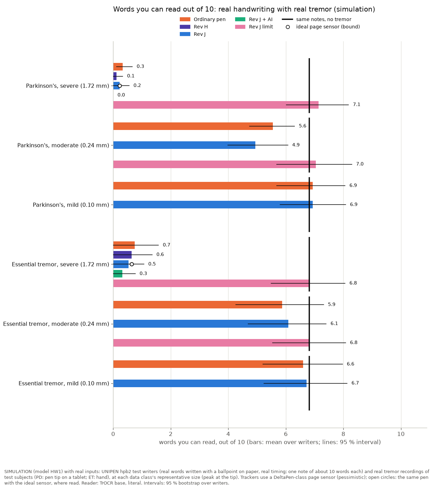
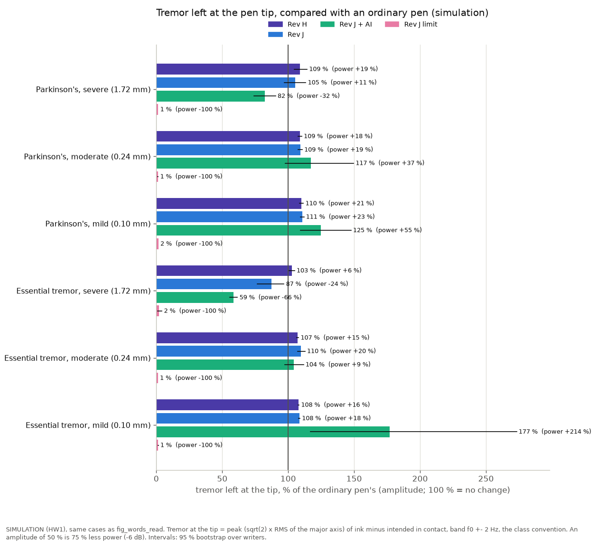
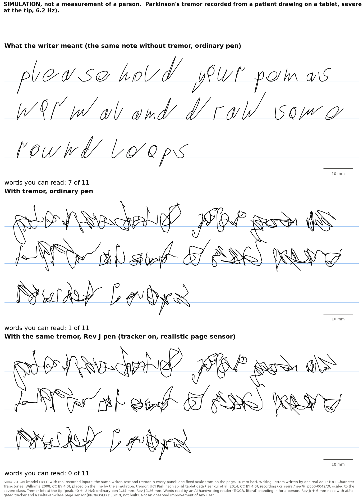
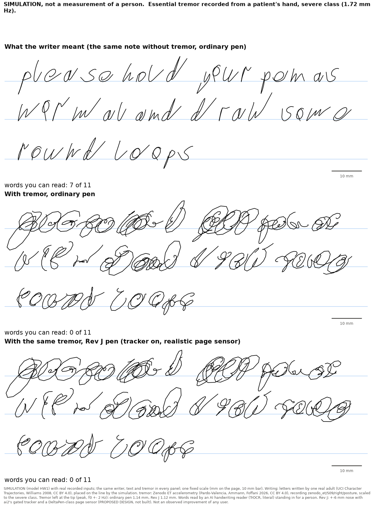
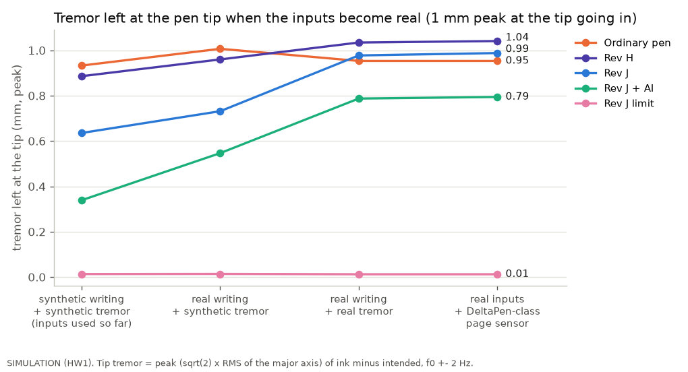
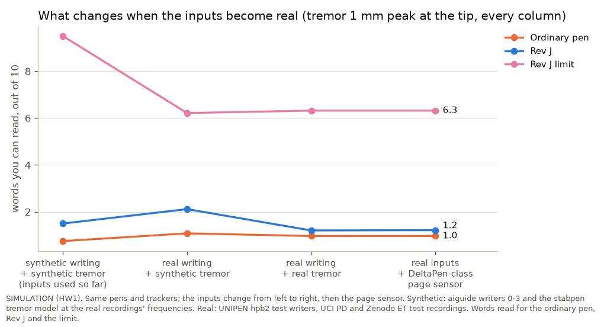
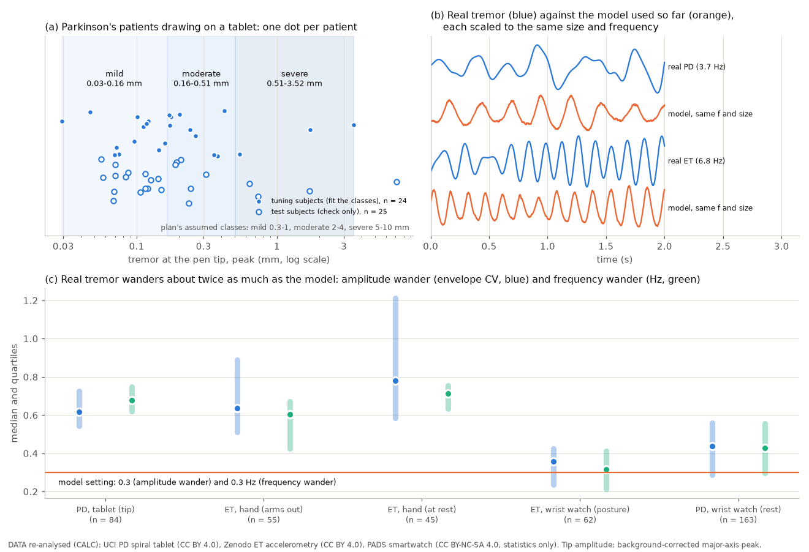
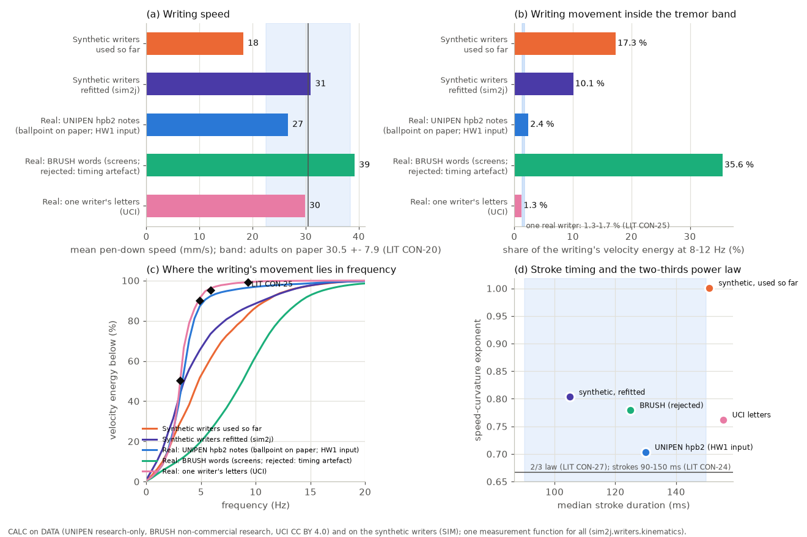
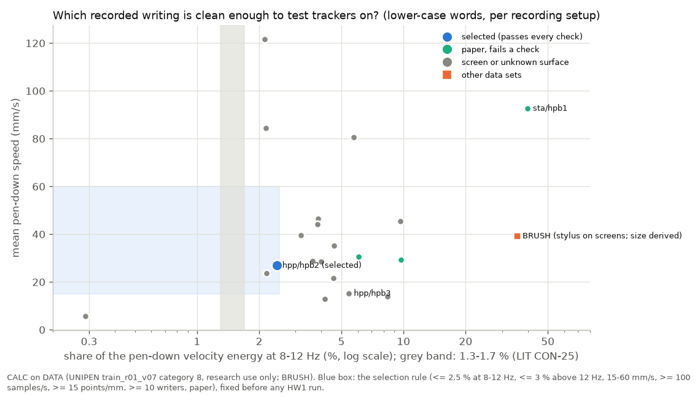
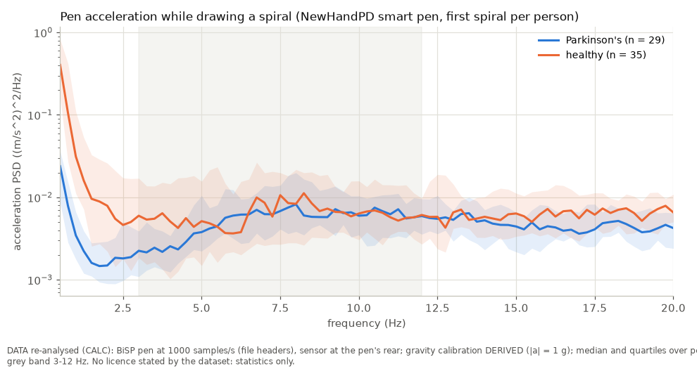

# Real recorded data in the simulations (study R)

**Status.** Every number is labelled:
- **DATA**: a recording made by others, re-analysed here.
- **SIM**: an executed simulation (model HW1) with real recorded inputs.
- **CALC**: a calculation.
- **LIT**: the literature, with its ledger id.
- **MFR**: a manufacturer statement.
- **ASSUMPTION**: a value chosen here.

Nothing here was measured on a person or on hardware. Every target is a hypothesis until it is measured.

**Package.** `realdata/`, run with `python3 -m realdata.run [--quick]`. Results are in `results/realdata/`. The numbers
below come from `results/realdata/realdata.json` (91 simulated cases, generated 2026-09-29).

## The answer in plain words

**What changed.** The pens are now tested in simulation on **real writing and real tremor** instead of made-up ones:
- **Real notes.** 14 adults wrote them with a ballpoint on paper (UNIPEN, HP Labs 1992). The recording keeps each
  note's own timing and size.
- **Real tremor.**
  - Parkinson's tremor was recorded at the pen tip while patients drew spirals on a tablet (UCI).
  - Essential tremor was recorded from patients' hands (Zenodo).
- **Real page-sensor errors.** The trackers' page sensor now has the errors a real pen-tip sensor was measured to make
  (DeltaPen, pessimistic).
- **Held-out data only.** Every number below comes from 9 writers, their texts and the patients that were set aside
  before anything was tuned.

**What we found** (SIMULATION with real recorded inputs; the intervals are in the results cards below):

1. **Real tremor at the pen tip is smaller and messier than the plan assumed.**
   - Most Parkinson's patients who could draw had 0.1-0.3 mm of tremor at the tip.
   - The top 10 % start at 0.5 mm. We call them "severe"; the typical severe size is **1.7 mm**. The plan assumed 5-10
     mm for severe.
   - Real tremor wanders in size and frequency about twice as much as the model used so far.
2. **With a severe tremor, no tracker makes the words readable.** Out of 10 words (1.7 mm at the tip; Parkinson's and
   essential tremor pooled):

   | Ordinary pen | Rev H | Rev J | Rev J + AI (TCN) | Same notes without tremor |
   |---|---|---|---|---|
   | 0.5 | 0.4 | 0.4 | 0.2 | 6.8 |

3. **The Rev J nose itself is not the limit.** With perfect knowledge of the tremor, the same Rev J nose gives **7.0 of
   10**, as good as no tremor. What fails is knowing the tremor in time.
4. **The trackers fail because real tremor is irregular.**
   - The gated tracker waits for a sharp, steady tremor line. On real tremor that line is often not there.
     - At the severe size the gate opens 21-42 % of the time.
     - At 1 mm it opened 62 % of the time on model Parkinson's tremor, but 28 % on real Parkinson's tremor of the
       same frequency.
   - When the gate is shut, the older Rev H tracker acts instead, and it adds about 3-9 % to the tremor.
   - Net result: Rev J gated leaves 0.96 x the ordinary pen's tremor at the tip.
   - The learned tracker removes the most: 0.71 x, half the power. But 1.1 mm of tremor still makes the words
     unreadable.
5. **At a moderate tremor (0.24 mm) the pens neither help nor hurt much.**
   - Words: 5.7 of 10 with an ordinary pen, 5.5 with Rev J, 6.9 with perfect knowledge.
   - The gate stays shut (under 1 % of the time), as designed.
6. **Clean writing.**
   - Rev H and Rev J leave tremor-free real writing almost alone: 25 um. Their gate stays shut 99.8 % of the time.
   - The learned tracker moves it by **170 um** and costs a readable word. It was trained on synthetic writers and must
     stay in shadow mode.
7. **A realistic page sensor changes almost nothing here.** The trackers are limited by telling tremor from writing,
   not by the sensor.
8. **What this means.**
   - Claims of better handwriting at severe tremor are not supported yet.
   - The mechanism is ready (perfect knowledge). The tracker is not.
   - Next:
     - re-tune the trackers on real tremor (the library's tuning split; EXP-R05);
     - record patients' own writing with the pen (EXP-R01);
     - check the AI reader against people (EXP-R03).

**One number per condition: words you can read out of 10** (SIM; mean over the 9 test writers, one note each; the
same notes without tremor are the reader's ceiling)

| Tremor (size at the pen tip) | No tremor (same notes) | Ordinary pen | Rev H | Rev J | Rev J + AI | Rev J limit |
|---|---|---|---|---|---|---|
| Parkinson's, severe (1.72 mm) | 6.8 | 0.3 | 0.1 | 0.2 | 0.0 | 7.1 |
| Parkinson's, moderate (0.24 mm) | 6.8 | 5.6 | - | 4.9 | - | 7.0 |
| Parkinson's, mild (0.10 mm) | 6.8 | 6.9 | - | 6.9 | - | - |
| Essential tremor, severe (1.72 mm) | 6.8 | 0.7 | 0.6 | 0.5 | 0.3 | 6.8 |
| Essential tremor, moderate (0.24 mm) | 6.8 | 5.9 | - | 6.1 | - | 6.8 |
| Essential tremor, mild (0.10 mm) | 6.8 | 6.6 | - | 6.7 | - | - |

- **"-" means not read.** Reading costs about 5 s per line with the chosen reader, and this study runs as one process.
  So at moderate and mild tremor only the pens that could differ were read. The tremor left at the tip is measured for
  every pen (results cards).
- **Rev J** is the ±6 mm nose with ai2's gated tracker. **Rev J + AI** is ai2's causal TCN. **Rev J limit** is the same
  nose with perfect knowledge of the tremor. It is the mechanism's limit, not a design.
- **The page sensor.** Every tracker uses the DeltaPen-class page sensor. With the ideal sensor the numbers change by at
  most 0.1 word and 0.01 mm (results cards).
- **The reader** is the AI handwriting reader TrOCR base, literal: greedy decoding, no dictionary, no correction.



## Results cards (one per population and tremor size)

Each card uses the same notes, the same tremor recording per note and the same ordinary pen as reference. Intervals are
95 % bootstrap over writers.
- **Tremor left at the tip** is the peak (sqrt(2) x RMS of the major axis) of ink minus intended while in contact, in
  the band f0 +- 2 Hz. This is the convention of the severity classes.
- **A share of 0.5** means half the amplitude: 75 % less power, -6 dB.
- **Clean writing moved** is the false correction on the same notes without tremor (ai2's definition). The words read
  on those clean notes are given too.
- **Coverage** (ink where ink was intended) was 100 % for every pen: none of these pens withholds ink.

**Parkinson's tremor, severe class: 1.72 mm peak at the tip, about 6.3 Hz** (9 test writers, 9 notes; 95 % intervals over writers)

| | Ordinary pen | Rev H | Rev J | Rev J + AI | Rev J limit |
|---|---|---|---|---|---|
| Readable words out of 10 | 0.3 (0.1-0.7) | 0.1 (0.0-0.3) | 0.2 (0.0-0.6) | 0.0 (0.0-0.0) | 7.1 (6.0-8.2) |
| Tremor left at the tip, mm (peak, f0 +- 2 Hz) | 1.58 (1.46-1.68) | 1.73 (1.56-1.88) | 1.67 (1.49-1.85) | 1.30 (1.15-1.45) | 0.02 (0.02-0.02) |
| ... as a share of the ordinary pen's (amplitude) | 1 (reference) | 1.09 (power +19 %) | 1.05 (power +11 %) | 0.82 (power -32 %) | 0.01 (power -100 %) |
| Clean writing moved, um (tremor-free notes) | 0 (reference) | 25 (15-41) | 25 (14-42) | 172 (93-286) | - |
| Readable words without tremor | 6.8 | 6.9 | 7.0 | 5.8 | - |
| With the ideal page sensor instead: words / tremor left | - | - / 1.72 mm | 0.2 / 1.67 mm | - / 1.30 mm | - |

**Parkinson's tremor, moderate class: 0.24 mm peak at the tip, about 6.0 Hz** (9 test writers, 9 notes; 95 % intervals over writers)

| | Ordinary pen | Rev H | Rev J | Rev J + AI | Rev J limit |
|---|---|---|---|---|---|
| Readable words out of 10 | 5.6 (4.7-6.3) | - | 4.9 (4.0-6.1) | - | 7.0 (5.7-8.3) |
| Tremor left at the tip, mm (peak, f0 +- 2 Hz) | 0.23 (0.22-0.24) | 0.25 (0.24-0.26) | 0.25 (0.24-0.26) | 0.27 (0.22-0.35) | 0.00 (0.00-0.00) |
| ... as a share of the ordinary pen's (amplitude) | 1 (reference) | 1.09 (power +18 %) | 1.09 (power +19 %) | 1.17 (power +37 %) | 0.01 (power -100 %) |
| Clean writing moved, um (tremor-free notes) | 0 (reference) | 25 (15-41) | 25 (14-42) | 172 (93-286) | - |
| Readable words without tremor | 6.8 | 6.9 | 7.0 | 5.8 | - |
| With the ideal page sensor instead: words / tremor left | - | - / 0.25 mm | - / 0.25 mm | - / 0.27 mm | - |

**Parkinson's tremor, mild class: 0.10 mm peak at the tip, about 6.3 Hz** (9 test writers, 9 notes; 95 % intervals over writers)

| | Ordinary pen | Rev H | Rev J | Rev J + AI | Rev J limit |
|---|---|---|---|---|---|
| Readable words out of 10 | 6.9 (5.7-8.1) | - | 6.9 (5.8-8.1) | - | - |
| Tremor left at the tip, mm (peak, f0 +- 2 Hz) | 0.10 (0.09-0.10) | 0.11 (0.10-0.11) | 0.11 (0.10-0.11) | 0.12 (0.10-0.15) | 0.00 (0.00-0.00) |
| ... as a share of the ordinary pen's (amplitude) | 1 (reference) | 1.10 (power +21 %) | 1.11 (power +23 %) | 1.25 (power +55 %) | 0.02 (power -100 %) |
| Clean writing moved, um (tremor-free notes) | 0 (reference) | 25 (15-41) | 25 (14-42) | 172 (93-286) | - |
| Readable words without tremor | 6.8 | 6.9 | 7.0 | 5.8 | - |
| With the ideal page sensor instead: words / tremor left | - | - / 0.11 mm | - / 0.11 mm | - / 0.12 mm | - |

**Essential tremor, severe class: 1.72 mm peak at the tip, about 5.7 Hz** (9 test writers, 9 notes; 95 % intervals over writers)

| | Ordinary pen | Rev H | Rev J | Rev J + AI | Rev J limit |
|---|---|---|---|---|---|
| Readable words out of 10 | 0.7 (0.0-1.6) | 0.6 (0.0-1.4) | 0.5 (0.0-1.1) | 0.3 (0.0-0.8) | 6.8 (5.5-8.1) |
| Tremor left at the tip, mm (peak, f0 +- 2 Hz) | 1.69 (1.64-1.73) | 1.74 (1.69-1.78) | 1.47 (1.30-1.63) | 0.99 (0.94-1.04) | 0.04 (0.02-0.07) |
| ... as a share of the ordinary pen's (amplitude) | 1 (reference) | 1.03 (power +6 %) | 0.87 (power -24 %) | 0.59 (power -66 %) | 0.02 (power -100 %) |
| Clean writing moved, um (tremor-free notes) | 0 (reference) | 25 (15-41) | 25 (14-42) | 172 (93-286) | - |
| Readable words without tremor | 6.8 | 6.9 | 7.0 | 5.8 | - |
| With the ideal page sensor instead: words / tremor left | - | - / 1.74 mm | 0.6 / 1.46 mm | - / 0.98 mm | - |

**Essential tremor, moderate class: 0.24 mm peak at the tip, about 5.5 Hz** (9 test writers, 9 notes; 95 % intervals over writers)

| | Ordinary pen | Rev H | Rev J | Rev J + AI | Rev J limit |
|---|---|---|---|---|---|
| Readable words out of 10 | 5.9 (4.3-7.3) | - | 6.1 (4.7-7.4) | - | 6.8 (5.5-8.1) |
| Tremor left at the tip, mm (peak, f0 +- 2 Hz) | 0.23 (0.21-0.24) | 0.24 (0.22-0.26) | 0.25 (0.22-0.27) | 0.24 (0.21-0.26) | 0.00 (0.00-0.00) |
| ... as a share of the ordinary pen's (amplitude) | 1 (reference) | 1.07 (power +15 %) | 1.10 (power +20 %) | 1.04 (power +9 %) | 0.01 (power -100 %) |
| Clean writing moved, um (tremor-free notes) | 0 (reference) | 25 (15-41) | 25 (14-42) | 172 (93-286) | - |
| Readable words without tremor | 6.8 | 6.9 | 7.0 | 5.8 | - |
| With the ideal page sensor instead: words / tremor left | - | - / 0.24 mm | - / 0.24 mm | - / 0.24 mm | - |

**Essential tremor, mild class: 0.10 mm peak at the tip, about 5.5 Hz** (9 test writers, 9 notes; 95 % intervals over writers)

| | Ordinary pen | Rev H | Rev J | Rev J + AI | Rev J limit |
|---|---|---|---|---|---|
| Readable words out of 10 | 6.6 (5.2-8.0) | - | 6.7 (5.2-8.1) | - | - |
| Tremor left at the tip, mm (peak, f0 +- 2 Hz) | 0.09 (0.09-0.10) | 0.10 (0.10-0.10) | 0.10 (0.10-0.10) | 0.17 (0.11-0.27) | 0.00 (0.00-0.00) |
| ... as a share of the ordinary pen's (amplitude) | 1 (reference) | 1.08 (power +16 %) | 1.08 (power +18 %) | 1.77 (power +214 %) | 0.01 (power -100 %) |
| Clean writing moved, um (tremor-free notes) | 0 (reference) | 25 (15-41) | 25 (14-42) | 172 (93-286) | - |
| Readable words without tremor | 6.8 | 6.9 | 7.0 | 5.8 | - |
| With the ideal page sensor instead: words / tremor left | - | - / 0.10 mm | - / 0.11 mm | - / 0.17 mm | - |



## Pictures: real letters, real tremor, on ruled lines





**Every picture is a SIMULATION, not a measurement of a person.** In each figure:
- the same writer, text and tremor appear in every panel;
- everything is drawn at one fixed scale (10 mm bar);
- the number under a panel is the words the AI reader read.

**What is drawn.**
- **The letters.** They were written by one real adult (UCI Character Trajectories, CC BY 4.0). The simulation places
  them into the sentence "please hold your pen as normal and draw some round loops".
- **The tremor.** It is a test patient's recording (UCI PD or Zenodo ET, CC BY 4.0), scaled to the class's
  representative size.
- **The panels.** Top: the note without tremor. Middle: an ordinary pen with the tremor. Bottom: Rev J with the gated
  tracker and the realistic (DeltaPen-class) page sensor.

**More pictures.**
- The moderate-class pictures are in the same folder (`fig_before_after_chartraj_*_moderate.png`).
- The same pictures made from UNIPEN notes are in `realdata/build/figures_research_only/`. They are not committed,
  because UNIPEN is for research use only.
- `results/realdata/samples.json` holds every committed panel, including Rev H, the TCN, the ideal-sensor Rev J and the
  perfect-knowledge limit.

## How the numbers change, and why (the bridge)

To see *which* realistic input changes the result, the same pens were run with the tremor fixed at 1 mm peak at the
tip. One input was changed at a time. Four test writers and four synthetic writers; PD and ET pooled; SIM.

| Inputs (1 mm at the tip) | Gate open (PD / ET) | Ordinary pen: tip tremor, words | Rev J gated: tremor left (x ordinary), words | Rev J + AI: tremor left | Perfect knowledge: words |
|---|---|---|---|---|---|
| Synthetic writing + synthetic tremor (the inputs used so far) | 62 % / 28 % | 0.93 mm, 0.8 of 10 | 0.68 x, 1.5 of 10 | 0.36 x | 9.5 of 10 |
| Real writing + synthetic tremor | 63 % / 29 % | 1.01 mm, 1.1 of 10 | 0.72 x, 2.1 of 10 | 0.54 x | 6.2 of 10 |
| Real writing + real tremor | 28 % / 4 % | 0.95 mm, 1.0 of 10 | 1.03 x, 1.2 of 10 | 0.82 x | 6.3 of 10 |
| ... + DeltaPen-class page sensor | 17 % / 3 % | same | 1.04 x, 1.2 of 10 | 0.83 x | same |

Tremor left is an amplitude ratio to the ordinary pen. A ratio of 0.68 means 54 % less power; 1.03 means 6 % more.
Rev H's tracker gives 0.95 x, 0.95 x and 1.08 x on the same three rows.

**1. Real writing changes little for the gated tracker, a lot for the learned one, and a lot for the reader.**
- **The gated tracker is unaffected.** It opens as often on real writing as on synthetic writing and removes about as
  much (0.72 against 0.68).
- **The TCN is not.**
  - It was trained on synthetic writers. It removes less real tremor (0.54 against 0.36).
  - It moves tremor-free real writing by **160-170 um**, against 17 um on the synthetic writers. On real notes this
    costs a readable word (5.8 against 6.8 of 10 without tremor).
  - This is the domain shift the review warned about. The TCN stays in shadow mode (DEC-042, REQ-ML-003).
- **Real handwriting is harder to read.** The reader reads 9.5 of 10 synthetic words without tremor but 6.8 of 10 real
  words. The synthetic writers' letters are cleaner than people's.

**2. Real tremor is what takes the benefit away.**
- **The gate stops opening.** It needs a sharp, steady spectral line. Real tremor wanders in size (envelope CV about
  0.6) and frequency (SD about 0.6 Hz), so the line is broad. At 1 mm the gate opens 28 % of the time for real PD
  tremor (63 % for model tremor at the same frequency), and 4 % for real ET (29 %).
- **When the gate is shut, the Rev H tracker acts instead.** On real tremor it adds about 8 % to the tip tremor. The
  delay makes its correction partly add to the tremor (the review's pure-delay limit, s9).
- **The TCN keeps some effect.** 0.82 x: 33 % less power.

**3. A realistic page sensor changes little.** With DeltaPen-class errors (pessimistic) the gate opens a little less.
The tip tremor, the words and the false correction are within a few percent of the ideal sensor's. On these inputs the
trackers are limited by telling tremor from writing, not by the page sensor. The sensor is still a build gate for
other reasons: absolute position and capture.

**4. The sizes change the question.** The plan's classes were 5-10 mm for severe. The data put severe at 0.5 mm and
above, typical 1.7 mm, and moderate at 0.16-0.5 mm.
- At moderate size the ink is still readable with an ordinary pen: 5.7 of 10, against 6.8 without tremor.
- At severe size it is not: 0.5 of 10.
- So the programme's target is the severe tail. There, the nose is big enough (perfect knowledge restores 7.0 of 10)
  but the trackers are not good enough.

**Compared with the earlier headline (ai2, synthetic inputs, SIM).**
- **Earlier.** Rev J with the gated tracker cut the ink error at 1-2 mm from 830 to 430 um, and the app's reader read
  74 % of words instead of 31 % (`results/ai2/ai2.json`).
- **Now.** With real inputs at the severe class, Rev J gated leaves the tip tremor at 0.96 x the ordinary pen's, and
  0.4 of 10 words can be read. The ordinary pen gives 0.5 of 10.
- **Where it changed.** Above, most of the difference comes from the real tremor. Part comes from the stricter, literal
  reader on real handwriting.





## The data behind the inputs

### The tremor library: how big real tremor is at the pen tip

The only open recordings of tremor **at the pen tip, in millimetres** are the UCI spirals: Parkinson's patients
drawing on a Wacom Cintiq 12WX. The pixel pitch is 0.204 mm (MFR, CON-84). Each recording's tremor is measured as a
spectral line above its fitted broadband background (Welch 4 s). Its size is the background-corrected peak of the
major axis, one value per patient (the median of their recordings with a line).

| Class | Peak at the tip (fitted on 24 tuning patients) | Representative (used in the headline) | The plan assumed |
|---|---|---|---|
| mild | 0.03-0.16 mm (below the median) | 0.10 mm | 0.3-1 mm |
| moderate | 0.16-0.51 mm (median to 90th percentile) | 0.24 mm | 2-4 mm |
| severe | above 0.51 mm (top 10 %; largest tuning patient 3.5 mm, largest test patient 7.1 mm) | 1.72 mm | 5-10 mm |

- **The check on held-out patients.** On the 25 test patients the shares are 60 / 24 / 16 % (expected 50 / 40 / 10;
  n = 25). CALC on DATA.
- **What is missing.** People whose tremor stops them drawing on a tablet are not in these data (Elble et al. 1996,
  PDT-82: very severe tremor could not be recorded when the pen left the tablet).
- **So the classes are a floor.** They describe the patients who could draw, not everyone with tremor.
- **How the sizes compare.** The data's severe class starts where the plan's mild class sat. Most PD tip tremor while
  drawing is 0.1-0.3 mm.



**Real tremor is about twice as irregular as the model used so far.** Medians over recordings with a line (CALC on
DATA):

| | Amplitude wander (envelope CV) | Frequency wander (SD) |
|---|---|---|
| PD tip (UCI) | 0.62 | 0.68 Hz |
| ET hand, arms out (Zenodo) | 0.64 | 0.60 Hz |
| PADS ET wrist, posture | 0.36 | 0.31 Hz |
| The model (TremorSpec) | 0.3 | 0.3 Hz |

**Frequencies.**
- PD tip line: median 6.3 Hz.
- ET posture: median 5.2 Hz.
- 2-D PD tip tremor: ellipticity median 0.46 (IQR 0.35-0.57); the model uses 0.4.
- ET recordings are one axis of hand acceleration. They are made 2-D by a documented construction (ASSUMPTION): a
  Hilbert-quadrature minor axis, with the ellipticity drawn from the PD IQR and the axis at 30 +- 15 degrees.

**The generator.** It holds 47 PD tip waveforms and 28 ET waveforms: 27 PD (17 patients) and 17 ET (13 patients) in
the test split. How a waveform is extracted and scaled:
- Extraction is zero-phase: the band f0 +- 2 Hz plus the band 2 f0 +- 2 Hz. It is an INPUT only and is never shown to
  a controller.
- Each waveform is scaled by its **power amplitude** (sqrt(2) x RMS of the major axis at f0 +- 2 Hz). This is the
  class convention, and equals the model's peak amplitude for a steady tremor.
- The real wander, intermittency and frequency are kept.

### The writing library: which real writing is clean enough to test trackers on

Trackers separate tremor from writing partly by frequency. So the writing input must not carry spurious movement in
the tremor band. Real writing on paper puts 1.3-1.7 % of its pen-down velocity energy at 8-12 Hz (LIT CON-25). Every
set below is measured with the one function the project uses (`sim2j.writers.kinematics`, read-only). CALC on DATA and
SIM.

| Writing | Speed (mm/s) | Median stroke (ms) | 50 / 90 % of velocity energy below (Hz) | Share at 8-12 Hz | Speed-curvature exponent |
|---|---|---|---|---|---|
| **UNIPEN hpb2 notes (ballpoint on paper; the HW1 input)** | 26.7 | 130 | 3.4 / 5.4 | 2.4 % | 0.70 |
| UCI Character Trajectories (one writer, composed) | 29.9 | 156 | 3.4 / 4.9 | 1.3 % | 0.76 |
| BRUSH (170 writers, stylus on screens) | 39.2 | 125 | 9.3 / 15.1 | **35.6 %** | 0.78 |
| Synthetic writers used so far (aiguide v1) | 18.3 | 151 | 4.9 / 11.2 | **17.3 %** | 1.00 |
| Synthetic writers refitted (sim2j v2, read-only) | 31.0 | 105 | 3.9 / 10.7 | **10.1 %** | 0.80 |
| Literature | 30.5 +- 7.9 (CON-20) | 90-150 (CON-24) | 3.1 / 4.9 (CON-25) | 1.3-1.7 % (CON-25) | 0.67 (CON-27) |

**BRUSH and the synthetic writers put far too much movement in the tremor band.**
- BRUSH is the only large open set with letter labels, but its 36 % at 8-12 Hz is a timing artefact.
- In a first HW1 run on BRUSH notes the trackers took it for tremor. They moved tremor-free ink by 160-310 um (Rev H and Rev J trackers) and 440-880 um (TCN), on two notes.
- That run was stopped and kept as a labelled diagnostic in `realdata/build/cache/hw1/brush_diagnostic/`.
- The synthetic writers carry 10-17 %: 6-13 times the real share.



**The selection rule (`kinematics.unipen_survey`).** The UNIPEN writing was chosen by a rule applied to all 26
category-8 recording setups, before any HW1 run on UNIPEN. A setup must pass every check:
- at most 2.5 % of the pen-down velocity energy at 8-12 Hz, and at most 3 % above 12 Hz;
- 15-60 mm/s;
- 100-250 samples/s and at least 15 points/mm;
- at least 10 writers;
- writing on paper.

Only **hpb2** passes: HP Labs Palo Alto, 1992, a Wacom 420-510C, an inking pen with a ballpoint refill on preprinted
paper forms, 100 samples/s, 0.05 mm. Two things about the rule:
- **The first survey sampled too little.** It took 12 lines per contributor, and all 12 fell in hpb2. It measured
  1.5 %. The full survey, with 60 random lines of lower-case words per setup, measures 2.4 %.
- **The same contributor's screen setup fails.** Its hpb3 setup (Wacom HD648A LCD screen, emulated ink) has 5.4 % at
  8-12 Hz and 14 % above 12 Hz on lower-case words.



The hpb2 notes:
- **Size.** 14 writers, one note of about 10 words per writer, in their recorded size. Letter height (the mean of
  'T', 'p' and 'a') is about 3-6 mm, median 4.4 mm (estimate from the line's ink, ASSUMPTION). That is close to
  healthy adults on paper (median 5.0 mm, LIT PDT-06). One test writer writes tall, narrow letters of about 15 mm.
- **Timing.** The recorded timing is kept. So are the recorded hover paths between strokes: 75-95 % of in-air moves,
  median 91 %. Only line changes and the few moves out of the tablet's range are added moves (ASSUMPTION). A note
  lasts 33-63 s (median 44 s).
- **Split.** 5 tuning and 9 test writers. Because every line text was written by 2-12 writers, the texts are split
  too (81 tuning, 133 test). No test note repeats a tuning text.

### The page sensor: from 3 um of white noise to a DeltaPen-class error

**What every earlier tracker result assumed.** The pen's page sensor read at 1 kHz, with 2 ms latency and 3 um of white
noise (fusion default, ASSUMPTION).

**What has been measured.** The one published pen-tip optical-flow pen, DeltaPen (OPT-01, OPT-02), was measured on a
Wacom surface, not paper. Its translation error per 10 ms window has a **median of 23.6 um and a mean of 68.3 um**.

**The model used here** (`realdata/sensors.py`; the review's R14 and response row 8):
- **Window error.** Each 10 ms window gets an error that grows with the window's movement (exponent 0.5, ASSUMPTION)
  with a log-normal spread. c = 20.5 um and sigma = 1.35 are fitted on the tuning notes so that the median and mean
  match OPT-02 (CALC). The error accumulates, as it does in a relative sensor.
- **Other errors.** Idle drift 43.75 um/s per axis (OPT-02). Scale error N(0, 3 %) (ASSUMPTION). 4.23 um counts
  (OPT-01).
- **Lost samples.** 0.05 % outliers (OPT-01). Dropouts at 0.2 per second, 20-150 ms each (ASSUMPTION).
- **Timing.** Latency 2 ms plus 0-1 ms jitter (ASSUMPTION). Acquisition and availability times are kept separately.

**Why it is pessimistic.** It gives all of DeltaPen's measured error to the sensor, although part belongs to the Wacom
reference.

**It reproduces the target.** On the tremor-free test notes the simulated window error has a median of 27 um and a
mean of 76 um, against 23.6 and 68.3 (CALC). With severe tremor the pen moves more in each window, so by the model's
design the error grows: 45 and 112 um. The trackers are used as built (tuned for the ideal sensor). The ideal sensor
stays as a labelled bound (open circles and "ideal sensor" rows).

### Roles, splits and leakage

- **Split first.**
  - Subjects are split per source and group, stratified by a detection-free amplitude, before anything is fitted:
    UCI, Zenodo, PADS and NewHandPD. All of a person's recordings, tasks and sessions go to one split.
  - UNIPEN writers are split 5/9 by rank of a hash, and the line texts 81/133. UNIPEN files hold one session per
    writer.
- **Calibration** uses device documents or calibration data only:
  - the Cintiq pixel pitch (MFR);
  - UNIPEN resolutions from the headers;
  - the NewHandPD gravity fit, which is used only for its spectra, never as HW1 input.
- **Fitting** uses tuning data only:
  - the tremor-line thresholds (95th percentile of the tuning controls);
  - the severity classes (tuning PD patients);
  - the page-sensor model and the reader choice (tuning writers).
- **Validation.** The classes are checked on the test patients. Nothing is refitted.
- **Final test.** HW1 uses test writers, test texts and test patients only. Intervals are over writers, the
  participant level.
- **What cannot leak.** No model is trained on these data. The TCN is ai2's, trained on synthetic writers.
- **What differs by device and cannot be separated here.** Writing is from one digitiser (Wacom 420-510C), PD tremor
  from one tablet, and ET from one accelerometer set-up.
- **Time stamps.** The loaders' time is the acquisition time: UCI tablet time stamps, otherwise sample index / the
  documented rate. No dataset records availability times. The simulated sensors carry both.
- **No ground truth for spontaneous writing.** None exists for tremor-free writing by patients. Here the "intended"
  writing is by construction a healthy person's real note, and the tremor a patient's real recording, so the
  simulation knows the truth. Known shapes (the UCI spirals) give the tremor sizes. Nothing here claims to see a
  patient's hidden intent.

### The pen's own sensor in patients (NewHandPD)



**What the data are.** NewHandPD's smart pen (BiSP) records acceleration at its rear end: 31 PD patients and 35 healthy
people, 12 tasks each. The acceleration is calibrated here against gravity (a sphere fit, DERIVED: residual 0.07
m/s^2).

**What the spectra show.** For the first spiral of each person (CALC on DATA):
- **Healthy people.** The pen's acceleration is largest at low frequency (the drawing movement) and falls with
  frequency.
- **Parkinson's.** The patients' median spectrum is lower below 5 Hz (slower drawing) and about the same at 5-12 Hz.
- **Tremor lines.** A clear line above the tuning controls' 95th percentile appears in 7 % of the Parkinson's
  recordings and in 7 % of the healthy ones.
- **Why so few.** This pen's accelerometer resolves about 0.11 m/s^2 per step (0.0165 units x 6.7 m/s^2 per unit,
  DERIVED). The 0.1-0.3 mm tremor typical of drawing is 0.14-0.43 m/s^2 at 6 Hz (CALC), only a few steps. A pen IMU for
  tremor needs a much finer resolution than this one (the LSM6DSV16X in the design has 0.122 mg, about 0.0012 m/s^2,
  per step: MFR OPT-37).

**The files' timing (for anyone reusing them).**
- The file headers say 1000 samples/s, and the durations and tremor frequencies agree.
- The acceleration channels are held for 3-4 samples, so they update only about 250-330 times a second. Tironi et al.
  (2025, PDT-83) report 200 Hz for these signals.

### Datasets and licences (opened 2026-09-29; raw files in `realdata/build/raw/`, git-ignored)

| Dataset | What it is | Licence | May go into `results/` | Used here for |
|---|---|---|---|---|
| **UNIPEN train_r01_v07**, setup **hpb2** (International Unipen Foundation 1999; Zenodo 10.5281/zenodo.1195803; HP Labs Palo Alto 1992) | 14 adults copying 2-3 word phrases onto paper forms with a **ballpoint refill** on a Wacom 420-510C; 100 points/s, 0.05 mm; hover points recorded | research use only (iUF notice in the data; the Zenodo page tags CC BY 4.0: the stricter terms are applied) | statistics only | **the writing of the headline comparison** (real words, real timing, real size on paper) |
| UNIPEN, the other 25 category-8 setups | text lines from many labs and devices | as above | statistics only | the kinematics survey that selected hpb2 |
| UCI Parkinson Disease Spiral Drawings (Isenkul et al. 2014; 10.24432/C5Q01S) | 62 PD + 15 controls drawing spirals on a Wacom Cintiq 12WX; X, Y, pressure, grip angle, time | CC BY 4.0 | short attributed excerpts, statistics | PD tremor at the pen tip in mm; the severity classes; the PD tremor waveforms |
| Zenodo ET accelerometry (Pardo-Valencia, Ammann, Foffani 2026; 10.5281/zenodo.19130599) | 29 ET patients, both hands, rest and arms out, one axis, 5 kHz | CC BY 4.0 | excerpts, statistics | ET tremor waveforms (shape, frequency, wander); amplitude set by the class |
| NewHandPD smart-pen signals (Pereira et al., SIBGRAPI 2016) | 31 PD + 35 healthy, 12 tasks each (PatientSignal.zip, HealthySignal.zip); BiSP pen: microphone, grip, refill force, 3-axis tilt/acceleration at the pen's rear; files at 1000 samples/s (headers), the acceleration channels updated about 250-330 times a second (held samples) | none stated (cite the paper) | statistics only | pen acceleration spectra; gravity calibration |
| PADS smartwatch (Varghese et al. 2024; 10.13026/m0w9-zx22) | 469 people (276 PD, 28 ET, 79 healthy); two watches, 100 Hz; rest, postural, kinetic tasks | CC BY-NC-SA 4.0 | statistics only | wrist tremor size; rest against action |
| UCI Character Trajectories (Williams 2008; 10.24432/C58G7V) | 2858 letters of one adult, 200 Hz | CC BY 4.0 | excerpts, statistics | the letters of the **committed** pictures |
| UJI Pen Characters v2 (Llorens et al., LREC 2008; 10.24432/C5FG8S) | 11,640 letters of 60 writers | CC BY 4.0 | excerpts, statistics | checked: no timing in the data, so not used |
| BRUSH (Kotani, Tellex, Tompkin, ECCV 2020) | 27,649 short sentences of 170 writers, stylus on screens, 10 ms points | non-commercial research use only | statistics only | **rejected as tracker input**: 36 % of its pen-down movement energy sits at 8-12 Hz (real writing on paper: 1.3-1.7 %, LIT CON-25), a timing artefact the trackers take for tremor |
| Wacom Cintiq 12WX manual (MFR) | pixel pitch 0.204 mm, 133 points/s, accuracy +-0.5 mm, pen 18 g | manufacturer document | numbers cited | the mm calibration of the UCI spirals |
| TrOCR handwritten, base and small (Li et al. 2021) | handwriting-reading transformers trained on IAM | base: MIT (model card); small: none stated; code MIT | not redistributed | the "words you can read" judge (base, chosen on tuning notes) |
| DeltaPen (Lüthi, Fender, Holz, UIST 2022; ledger OPT-01, OPT-02) | pen-tip optical flow, measured on a Wacom surface: 68.3 um mean and 23.6 um median error per 10 ms window | paper | numbers cited | the page-sensor error model |

**Not obtained.**
- IAM-OnDB: needs registration, which was not done (as instructed). It is the dataset to request for English sentences with timing.
- PaHaW: PD handwriting, licence agreement on request.
- DiaGraMo: CC BY 4.0, 276 Czech children (161 with dysgraphia), found late (1.36 GB). It is the natural source for the poor-handwriting and dyslexia work.
- OnHW (Fraunhofer IIS): the project page and README were opened. They state no licence, so permission is needed before use. OnHW-chars releases right-handed writers only. Its timestamp is when the connected tablet processed the data, not when the sample was taken. It is a recognition benchmark for study S, with no tremor or page trajectory.
- ET at the pen tip: no open recording exists in what was searched. Elble et al. 1996 (PDT-82) measured it on a tablet but did not release the data.

## The independent review (2026-09-29): what this study adopted

| Review point | Done here |
|---|---|
| Four separate datasets (s11) | This library is the **natural handwriting and tremor** dataset only. It contains no bench mechanics, no recognition or spelling labels, and no assisted interaction. The AI reader is a measuring instrument. OnHW belongs to study S's recognition dataset. |
| Split by participant and session before windows; distinct roles; no leakage (s11) | Subjects are split first, and all their recordings and sessions go to one split. UNIPEN writers and texts are split. Thresholds, classes, page model and reader are fitted on tuning data; the classes are checked on test patients; final numbers use the test split only. No model is trained on these data. The one-writer UCI letters appear only in the pictures, never in the headline. |
| No ground truth for spontaneous writing; known shapes for mechanistic numbers; outcomes with uncertainty (s11) | Tremor sizes come from known-shape tracking (spirals). The simulation's "intended" writing is a real note by construction, and the text says so. Results are outcome-level (words, tip tremor, clean writing) with 95 % writer-bootstrap intervals. |
| Acquisition and availability time stamps; realistic randomised sensor errors (s11) | The fusion streams keep both time stamps. The DeltaPen-class page model adds window error with a heavy tail and accumulation, drift, scale error, quantisation, outliers, dropouts, latency jitter and saturation. The IMU model already had bias, drift, scale, misalignment, quantisation and range. |
| Pictures: prominent SIMULATION label, same writer and task, fixed scale, never observed improvement (s11) | Bold SIMULATION header on every picture, one writer, text and tremor per figure, a 10 mm bar, and a footer that says "Not an observed improvement of any user". |
| Results cards: readable words (literal), tremor left at the tip (calibrated, band, convention), clean writing changed; ratios explained (s13) | Cards per population and class. TrOCR is literal (greedy, no lexicon, no correction). Tip tremor is the peak (sqrt(2) x RMS of the major axis) in f0 +- 2 Hz, in mm. Clean writing changed is the false correction in um plus the words read on clean ink. Ratios are amplitude, with the power change stated. |
| Sources (R03, R04, R05, R14, R15) | Bain 1995 (PDT-81), Elble 1996 (PDT-82), OnHW (EML-82) and Tironi 2025 (PDT-83) were opened; DeltaPen is used through the existing OPT-01 and OPT-02. For NewHandPD the exact files (PatientSignal.zip, HealthySignal.zip, 12 tasks), timing (header 1000/s, acceleration held about 250-330/s) and preprocessing are identified (PDT-76). |

## How other studies use the library

```python
from realdata import library as RL

RL.classes()                                   # severity classes (mm at the pen tip, peak), fitted on tuning subjects
tr = RL.tremor("severe", seed=3, kind="PD", split="test", duration=20.0)       # real PD tip tremor, severe class
tr = RL.tremor("moderate", seed=3, kind="ET", split="tuning", t=my_t)          # real ET waveform on your time grid
tr = RL.tremor("moderate", seed=3, kind="PD", amp_mm=1.0)                       # a fixed size instead of a draw
syn = RL.synthetic_like(tr)                    # the old model (TremorSpec) at the same frequency and size
wr = RL.writing("test", seed=3)                # a real note: UNIPEN hpb2, ballpoint on paper, about 10 words
wr = RL.writing("test", seed=0, source="chartraj")          # the CC BY writer's letters composed into a sentence
scn = RL.hw1_scenario(wr, tr)                  # handwriting.plant.Scenario (model HW1)
s2 = RL.sim2_scenario(wr, tr)                  # sim.pensim Scenario for sim2's H1 hand (pref, vref, fpush, lift)
RL.RealWriter("unipen/0").write(seed=0)        # writer-interface parity with aiguide/sim2j

from realdata import sensors as RS, hw1 as H
st2 = RS.degrade_page(streams, H.page_model(), seed=1)   # DeltaPen-class page sensor on any fusion Streams
from realdata import ocr as OC
OC.reader_choice(); OC.words_read(result, wr)  # literal words read by the AI reader (TrOCR base)
```

- `tr.d` is an (n, 2) array in metres on the page (x along the line, y up). `tr.meta` records the recording, its
  frequency, the class, the amplitude convention (peak = sqrt(2) x RMS of the major axis at f0 +- 2 Hz) and the
  construction used.
- `wr` is an `aiguide.writer.Written` (`text`, `intended` = `stabpen.signals.Intended`, `letters`, `dt`) with
  `wr.real` holding the source, writer, lines, line time spans, recordings, device, pen, surface, split and licence.
  UNIPEN strokes carry their recorded hover paths between strokes. Line changes are added moves (ASSUMPTION).
  UNIPEN has no letter labels, so each stroke is one pseudo-letter.
- Choose `split="tuning"` while designing and `split="test"` only for final numbers. Subjects, writers and (for
  UNIPEN) line texts are split before any evaluation.
- Everything that uses the future of a recording (the zero-phase tremor extraction) is an INPUT only. Trackers must
  see only the simulated sensor streams.

## Files

| Path | What |
|---|---|
| `realdata/` | the package: `python3 -m realdata.run [--quick] [--stages fetch tremor writing kinematics hw1 figures report]`. Each stage resumes from `realdata/build/cache/`. The full HW1 stage took about 2 h (91 cases, one process). `--quick` writes to `realdata/build/quick/` instead: one test note per tremor kind at the severe class, a small bridge and three pictures |
| `realdata/tests/` | fast tests: `python3 -m pytest -q realdata/tests` (23 tests, about 3 s) |
| `results/realdata/realdata.json` | everything numeric, with `stabpen.provenance`: datasets and licences, tremor library (classes, thresholds, summary statistics), writing library, kinematics and the UNIPEN survey, page-sensor model, reader choice, HW1 results cards and aggregate, gate-open shares |
| `results/realdata/samples.json` | the committed before/after panels (CC BY inputs only) in the schema of `results/handwriting/samples.json` |
| `results/realdata/evidence_rows.csv` | 18 proposed ledger rows with the 23-column header (CON-80…85, PDT-75…83, EML-80…82) |
| `results/realdata/tremor_library.csv` | per-recording tremor parameters of the CC BY sources (UCI spirals, Zenodo ET), attributed |
| `results/realdata/fig_words_read.png` (+ `.csv`) | readable words out of 10, per class and pen, with 95 % intervals |
| `results/realdata/fig_tremor_left.png` (+ `.csv`) | tremor left at the tip as a share of the ordinary pen's |
| `results/realdata/fig_bridge_words.png`, `fig_bridge_tremor_left.png` (+ `.csv`) | what changes from synthetic to real inputs and to the measured-error sensor |
| `results/realdata/fig_before_after_chartraj_*.png` (+ `.csv`) | the committed pictures (CC BY letters and tremor) |
| `results/realdata/fig_tremor_library.png`, `fig_writer_kinematics.png`, `fig_unipen_setups.png`, `fig_pen_acceleration_spectra.png` (+ `.csv`) | the inputs against the literature |
| `realdata/build/figures_research_only/` (git-ignored) | the same pictures with UNIPEN writing (research use only) |
| `realdata/build/cache/hw1/full_v2/` (git-ignored) | one JSON per simulated case |
| `realdata/build/cache/hw1/brush_diagnostic/` (git-ignored) | the stopped BRUSH run (diagnostic of the timing artefact) |

## Assumptions and limits

- **The inputs are composed.** Healthy adults' real notes plus patients' real tremor are added in the model's hand.
  Patients' own writing is slower and smaller (micrographia), and they adapt to their tremor. None of that is here.
  EXP-R01 records it.
- **Writing.**
  - 14 healthy writers of 1992, copying 2-3 word phrases into boxes on forms.
  - One digitiser, 100 samples/s. Its 8-12 Hz share is 2.4 %, against 1.3-1.7 % in the literature.
  - Line changes and moves out of the tablet's range are added moves (ASSUMPTION). No letter labels.
- **Tremor.**
  - PD sizes come from patients who could draw spirals on a tablet, so they are a floor.
  - ET waveforms come from the hand, one axis, and are made 2-D by construction (ASSUMPTION). They are scaled to the PD
    tip classes, because no open ET tip data exist.
  - The severe class rests on 3 tuning patients. On 25 held-out patients the class shares were 60/24/16 % (expected
    50/40/10).
- **Page sensor.** The DeltaPen-class model is pessimistic. The ideal sensor is optimistic. The truth lies between them
  until the sensor is measured on paper (EXP-S01, EXP-R07).
- **Trackers.** They were used as built: tuned by earlier studies on synthetic writers and tremor, and on the ideal
  sensor. Re-tuning them on the real tuning split is the obvious next step (EXP-R05). It was not done here: this study
  supplies the data.
- **Reader.** An AI reader stands in for people. It is literal, but its decoder has a language prior from IAM text. The
  test phrases include rare words, so even clean notes are not all read. The ceiling row shows this. EXP-R03 checks it
  against people.
- **HW1.**
  - The writer adapts to each pen (ASSUMPTION, as in all HW1 studies).
  - The nose acts within 2 mm of the page.
  - Rev J is a PROPOSED DESIGN. Its battery and heat claims are suspended (review response, row 1).
- **Uncertainty.** 9 test writers give wide intervals. The words-read measure moves in whole words per note, and on a
  hard-to-read note it can change by 1-2 words between two inks that differ by only 25 um. That is why the intervals
  are over writers. The tip tremor measure is the more precise of the two.

## Open issues

1. **Experiment id clash.** EXP-R01 is also used in `docs/revH_concept.md` (line 193, bench active nose, proposed).
   The lead should rename one of them.
2. **UNIPEN licence.** The iUF notice allows research use and forbids commercial distribution. The Zenodo record tags
   CC BY 4.0. The stricter terms are applied here: statistics only in `results/`; pictures of UNIPEN writing are in
   `realdata/build/figures_research_only/`. The iUF could be asked.
3. **BRUSH.** The origin of its 8-12 Hz content (resampling to 10 ms, or the devices) is not established. Its authors
   could be asked. It stays out of tracker tests.
4. **NewHandPD timing.** The files' header gives 1000 samples/s, and durations and tremor frequencies support it. The
   acceleration channels update only about 250-330 times a second. Tironi et al. 2025 report 200 Hz. Anyone reusing
   these signals must use the held-sample structure.
5. **Gate on real tremor.** The gate's tremor-line test assumes a sharp, steady line. Real tremor wanders, so the gate
   opens 21-42 % of the time at the severe size, and 4-28 % at 1 mm, against 28-62 % for model tremor (this study).
   A detector tuned on the real tuning split, or on EXP-R01 recordings, is needed (EXP-L01 with real data).
6. **Delay makes many cases worse.** The Rev H tracker made the tip tremor larger than an ordinary pen's in 56 % of
   the severe notes (+6 % on average) and in every moderate and mild note (+7-10 %). Rev J gated falls back on it
   while its gate is shut, and did the same in 33 % of the severe and 94 % of the moderate notes. The pure-delay limit
   (review s9) predicts this; the tracker studies should check it.
7. **Missing data.**
   - IAM-OnDB needs registration.
   - PaHaW needs a licence.
   - OnHW has no stated licence.
   - DiaGraMo (CC BY) is not yet used.
8. **Reading budget.** With the chosen reader (about 5 s per line) and one process, the moderate and mild classes were
   read only for the ordinary pen, Rev J and (moderate) the limit. Their tip tremor was measured for every pen.

## Proposed ledger rows

`results/realdata/evidence_rows.csv` has 18 rows with the 23-column header of `docs/evidence.csv`. Every source was
opened by this study.

| id | Topic |
|---|---|
| CON-80 | BRUSH kinematics: a timing artefact in the tremor band (36 % at 8-12 Hz); rejected as tracker input |
| CON-81 | UNIPEN hpb2 (ballpoint on paper): the writing input, chosen by the kinematics survey |
| CON-82 | UCI Character Trajectories: file constants and letter timing |
| CON-83 | UJI Pen Characters: no timing in the data |
| CON-84 | Wacom Cintiq 12WX: pixel pitch and accuracy (MFR) |
| CON-85 | DiaGraMo children's handwriting with dysgraphia: available, not used yet |
| PDT-75 | PD tremor at the pen tip (UCI spirals): severity classes fitted on tuning patients, checked on test patients |
| PDT-76 | NewHandPD smart-pen signals: files, timing (held acceleration samples), gravity calibration, spectra |
| PDT-77 | Zenodo ET accelerometry: waveforms, frequency and wander |
| PDT-78 | PADS smartwatch: wrist tremor, rest against action |
| PDT-79 | Urso et al. 2025: ET postural frequency, the Zenodo lab's method |
| PDT-80 | Real tremor is about twice as irregular as the model (CALC) |
| PDT-81 | Bain et al. 1995: writing tremor 4.1-7.3 Hz overlaps normal writing oscillation 4.0-7.7 Hz (abstract) |
| PDT-82 | Elble et al. 1996: ET in writing and drawing; weak link to wrist tremor; severe cases lose contact (abstract) |
| PDT-83 | Tironi et al. 2025: a smart pen reusing NewHandPD signals (200 Hz claimed; no files named) |
| EML-80 | TrOCR readers as the literal "words you can read" judge; reader chosen on tuning notes |
| EML-81 | This study's headline simulation on real inputs with a measured-error page sensor |
| EML-82 | OnHW datasets: no licence stated; right-handed only; tablet-processing time stamps |

DeltaPen is used through the existing rows OPT-01 and OPT-02. No duplicate row was made.

## Proposed requirements (for the lead to merge into `docs/requirements.csv`)

| id | Requirement | Rationale | Verification |
|---|---|---|---|
| REQ-DATA-002 | Every tracker or pen claim about writing is also evaluated on **real recorded writing and real recorded tremor** (this library or better), on test writers and test subjects only, and reported next to the synthetic result | The synthetic writers and tremor model differ from real ones in ways that change the results (bridge, this doc) | results card with both input sets |
| REQ-DATA-003 | False correction ("clean writing changed") is measured on **real tremor-free writing recorded on paper with a clean digitiser**, i.e. <= 2.5 % of its pen-down velocity energy at 8-12 Hz | BRUSH's timing artefact made the trackers move clean ink by 160-880 um | kinematics check (realdata.kinematics) before use |
| REQ-DATA-004 | Claims name the **tremor class in mm at the tip** (peak = sqrt(2) x RMS of the major axis in f0 +- 2 Hz) and the population, never "tremor" alone | The data's severe class starts at about 0.5 mm, far below the plan's assumed 5-10 mm | review of every claim |
| REQ-DATA-005 | Inputs built with non-causal (zero-phase) filters are **never** given to a controller or estimator | The tremor extraction uses the future of the recording | code review; library docstrings |
| REQ-DATA-006 | Datasets are used and redistributed only within their licences; results hold statistics only for research-only and non-commercial sources | UNIPEN, BRUSH, PADS, NewHandPD terms | sources.py registry test |
| REQ-DATA-007 | Every simulation that reports tracker performance also reports it with a **measured-error page-sensor model** (for now the DeltaPen-class model); the ideal sensor only as a labelled bound | Review 2026-09-29 R14; this study's sensor results | results card has both columns |
| REQ-DATA-008 | Words-you-can-read results use a **literal** reader (no lexicon, no spelling correction, greedy decoding) and report the clean-ink ceiling of the same notes and a 95 % interval over writers | Review s13 | results card |
| REQ-DATA-009 | EXP-H01 recordings: ink on paper over a digitiser (>= 200 points/s, <= 0.05 mm, hover tracked), the pen's IMU with **acquisition and availability time stamps**, handedness, grip, posture, medication state, device configuration; participant- and session-level splits | Review s11; this study's gaps | protocol review |

## Proposed experiments

EXP-R01 is also used in `docs/revH_concept.md` (line 193, "bench active nose", proposed). The lead should rename one
of the two. The ids below follow the round-4 plan.

| id | Question | Method | Decides |
|---|---|---|---|
| EXP-R01 | What do ET and PD patients' **own** writing and tremor look like at the pen tip, with ink? | Sentences on ruled paper over a digitiser (>= 200 points/s, hover), plus the instrumented pen's IMU; ET, PD, age-matched controls; two sessions; REQ-DATA-009 (the recording part of EXP-H01) | Replaces the healthy writers + patient tremor composition; class sizes in writing, not spirals |
| EXP-R02 | Do the trackers leave real clean writing alone and remove real tremor? | Offline replay of EXP-R01/EXP-H01 recordings through the Rev H, Rev J gated and TCN estimators with measured sensor streams | Tracker choice (with EXP-L01) |
| EXP-R03 | Does the AI reader's "words you can read" match people? | Blinded human panel transcribes the rendered ink of this study's test cases (and EXP-R01 ink); literal scoring; compare with TrOCR | Whether words-read numbers can stand for people |
| EXP-R04 | Poor handwriting and dyslexia inputs | DiaGraMo (CC BY 4.0, 276 children, 161 with dysgraphia) through this library's loaders | Study S and the practice functions |
| EXP-R05 | Does a learned tracker trained on real inputs keep clean writing still? | Retrain the TCN on real writing (UNIPEN hpb2 tuning + EXP-R01 training participants) with real tremor; test writer-disjoint | REQ-ML-001 on real data |
| EXP-R06 | Get the missing data sets | Request IAM-OnDB (registration), PaHaW (licence), OnHW (licence) | Larger real-writing test sets |
| EXP-R07 | Is DeltaPen's window error the sensor's or the reference's? | Pen-tip flow sensor and a motion-capture or stage reference on paper; 10 ms window error, latency, dropouts (with EXP-S01) | Replaces the pessimistic page model |

## Proposed decisions (for the lead; ids DEC-054 and DEC-055 as reserved)

| id | Proposed decision | Why | Status |
|---|---|---|---|
| DEC-054 | **Real inputs become the standard test.** Every pen and tracker claim reports its result on the real-input test split of `realdata` next to any synthetic result: UNIPEN hpb2 writers and texts, UCI and Zenodo tremor at the data classes, and the DeltaPen-class page sensor. It uses the same results card: readable words out of 10, tremor left at the tip, clean writing changed. Synthetic-only numbers are labelled as model-input results. | Real tremor removed most of the benefit that synthetic inputs showed (bridge). The data's severity classes are far below the plan's. | proposed |
| DEC-055 | **No legibility claim at severe tremor until a tracker passes on real inputs.** The gate: at least +2 readable words out of 10 over the ordinary pen in the severe class, with the 95 % writer interval above 0, while moving clean real writing by at most 25 um (REQ-CTRL-010, REQ-ML-001). The TCN stays in shadow mode (it moves clean real writing by 170 um). The tracker studies re-tune on the real tuning split first (EXP-R05). | Severe class: 0.4 of 10 with Rev J gated, against 7.0 of 10 with perfect knowledge | proposed |

**On EXP-V07 (the lead's note).** These data answer it in part.
- **What they give now.** A clean real target for refitting sim2j's v2 writers below about 12 Hz: UNIPEN hpb2 has 14
  adults on paper, 100 samples/s, letters about 3-6 mm, and 2.4 % of the velocity energy at 8-12 Hz. The UCI letters
  add one adult at 200/s, with 1.3 %. The refit can use `realdata.library.writing("tuning", ...)` directly.
- **What they do not give.** The 100/s rate limits the band above about 12 Hz. None of these writers writes small on
  purpose. So EXP-V07's recordings (at least 200 Hz, small writing) are still needed for that part.
