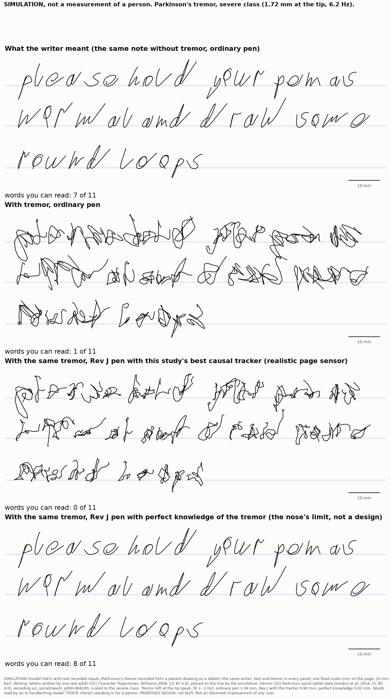
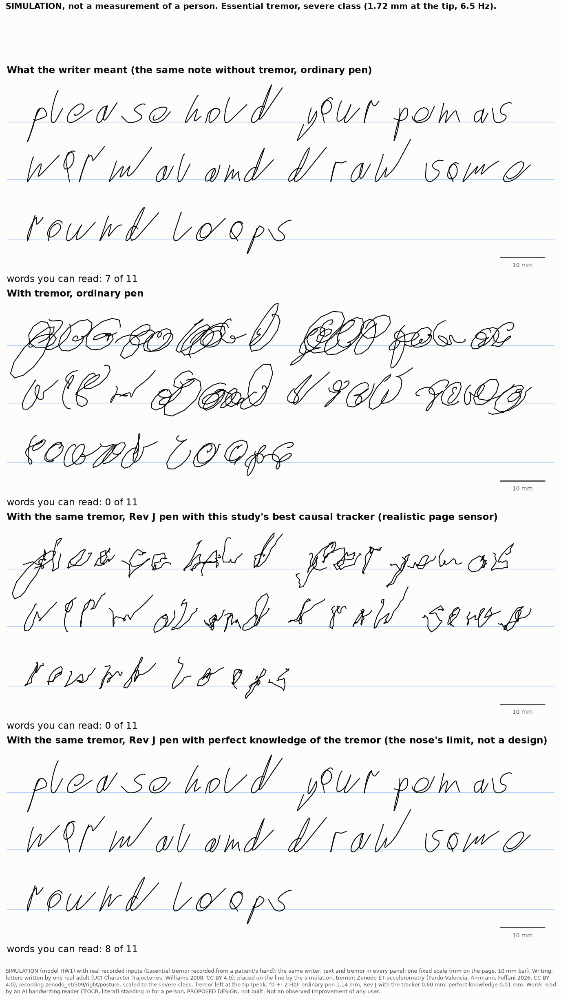
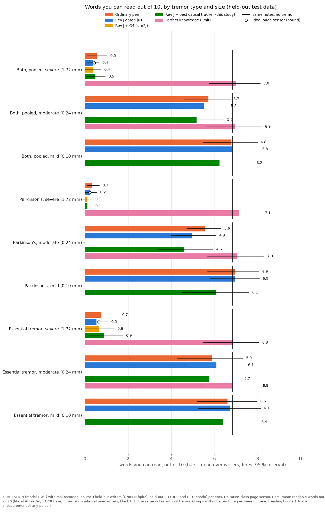
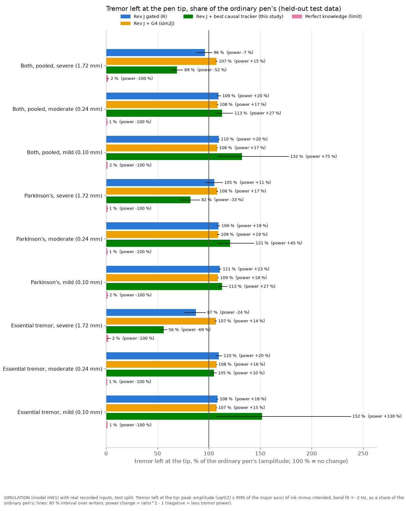
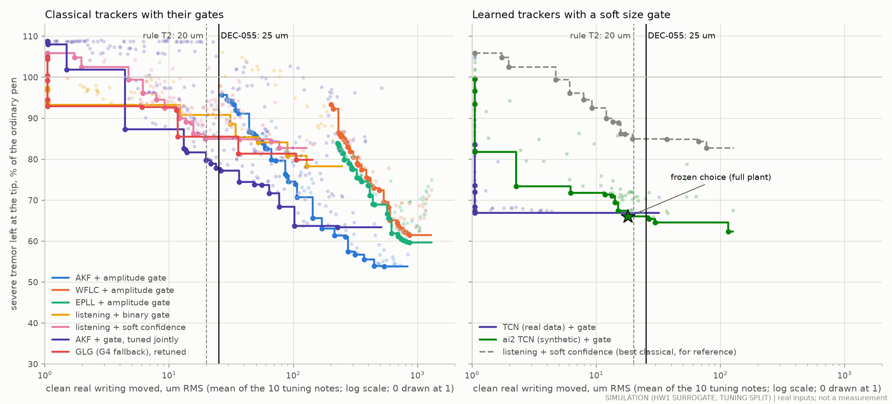
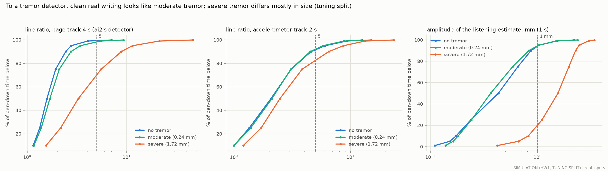
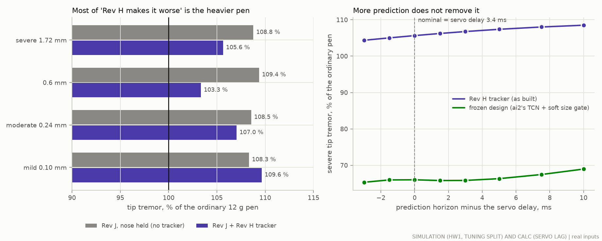

# A causal tremor tracker on real writing and real tremor (study E)

## The answer in plain words

*Study E, 30 September 2026. SIMULATION (model HW1) with real recorded writing and tremor; nothing was built or
measured on a pen or a person. Every number is labelled SIM, CALC, DATA, LIT (with its ledger id), MFR, ASSUMPTION or
PROPOSED DESIGN; §1 says what they mean.*

**The question.** Can a tremor tracker small enough for the pen's microcontroller make real tremor-affected writing
more readable, while leaving clean real writing alone?

**The answer: not yet. No causal tracker we could find does both on held-out real data.**

- **What we did.** We tried every kind of tracker in the brief, and study W's GLG: filters, oscillator trackers, the
  pen's own Kalman tracker with new gates, a small network trained on real writing, and ai2's network. We tuned each on
  study R's 5 tuning writers and tuning patients only. A rule written before the search picked the best, we froze it,
  and then we ran the held-out test once: 9 new writers and new patients.
- **The winner on the tuning writers** was ai2's small network (a causal TCN, 34 k weights, 28 % of the
  microcontroller, over the firmware's budget for a network) with a soft size gate: the nose acts only when the
  network's tremor estimate is large. On the tuning writers it took off a third of the severe tremor and moved clean
  writing by 18 um.
- **On the 9 new writers it failed both halves of the question.**
  - **Severe tremor (1.72 mm at the tip):** it took off about a third of the tremor at the tip (0.69 x the ordinary
    pen, half the power), but 1.1 mm was left. Words you can read out of 10: **0.5 with an ordinary pen, 0.5 with this
    tracker, 7.0 with perfect knowledge of the tremor** (so the nose itself could do it).
  - **Clean writing:** for 8 of the 9 writers it stayed within 45 um (15 um on average). But one writer writes letters
    twice as large and 1.5 x as fast as any tuning writer. The network took that writing for tremor, and the pen moved
    it by 0.49 mm. The mean over writers is 68 um; DEC-055 allows 25 um, and 50 um for any one writer.
  - **Small tremor:** for that writer it added tremor instead of removing it (up to 4.6 x the nose-held pen at the
    mild class), and a little for one more writer (1.13 x).
- **So DEC-055 is not passed**, by this design or by any other causal design tested (sim2j's G4, R's gated tracker,
  ai2's network without a gate). No legibility claim at severe tremor is supported.
- **Why it is hard.**
  1. **Handwriting moves in the same rhythm as tremor.** Letter strokes repeat 4-8 times a second, like tremor (LIT
     PDT-81). A tracker that listens to that band mistakes some people's writing for tremor. A gate tuned on 5 writers
     did not cover the 9th.
  2. **Real tremor wanders.** Its rhythm and size keep changing, so the gates that wait for a clean tremor "line"
     (G4, R's gated tracker, GLG) seldom open: G4 on real tremor acts no more than a pen with the nose held.
  3. **Taking off a third is not enough.** At 1.72 mm, even 0.6-0.7 x leaves about 1 mm of tremor, and the words
     stay unreadable. Words are read at 0.24 mm (5-6 of 10) but not at 1 mm; the readable level lies in between.
  4. **It is not the delay.** Prediction covers the 3.5 ms servo lag. Most of "Rev H makes it worse" is the heavier
     Rev J pen (84 g against 12 g in the model), which by itself adds 8-9 % tip tremor.
- **What looks promising (information only, not a result).** The small network we trained on real writing and tremor
  (17 k weights, 7.5 % of the microcontroller, within the network budget) removed a little more severe tremor than the
  winner on the test (0.60 against 0.69 x) and moved no new writer's clean writing by more than 19 um. It lost the
  pre-registered choice by a small margin on the tuning writers. Because we looked at it after the test, it must be
  tested again on new data before any claim (EXP-E10).
- **What it means for the pen.** Keep DEC-055, and G4 as the safe default: on real inputs it leaves clean writing
  alone but acts no more than a held nose. Per DEC-052, the help for severe tremor moves to the page side (autowrite
  of accepted text, the clean copy). The next tracker should learn from real recordings, and its gate should be set on
  the user's own writing (proposed REQ-CTRL-015...017, DEC-060, DEC-061).

## One number per condition: words you can read out of 10

(SIM, model HW1; mean over the 9 held-out test writers, one note each; the same notes without tremor are the reader's
ceiling; DeltaPen-class page sensor.)

| Tremor (size at the pen tip) | No tremor (same notes) | Ordinary pen | Best causal tracker (this study) | Perfect knowledge |
|---|---|---|---|---|
| Parkinson's, severe (1.72 mm) | 6.8 | 0.3 | 0.1 | 7.1 |
| Parkinson's, moderate (0.24 mm) | 6.8 | 5.6 | 4.6 | 7.0 |
| Parkinson's, mild (0.10 mm) | 6.8 | 6.9 | 6.1 | - |
| Essential tremor, severe (1.72 mm) | 6.8 | 0.7 | 0.9 | 6.8 |
| Essential tremor, moderate (0.24 mm) | 6.8 | 5.9 | 5.7 | 6.8 |
| Essential tremor, mild (0.10 mm) | 6.8 | 6.6 | 6.4 | - |
| Both, pooled, severe (1.72 mm) | 6.8 | 0.5 | 0.5 | 7.0 |

- **Best causal tracker** is the design frozen on the tuning split before the test: ai2's causal TCN with a soft size
  gate, on the Rev J nose (±6 mm). **Perfect knowledge** is the same nose driven by the true tremor: the mechanism's
  limit, not a design. The **ordinary pen**, **perfect knowledge** and the **no tremor** columns are study R's results
  for the same cases (reproduced bit for bit, §6.1).
- **"-" means not read** (the reader costs about 5 s per line; §16 lists what was read).
- **The reader** is the AI handwriting reader TrOCR base, literal (greedy decoding, no dictionary): R's reader.
- The 95 % intervals, tip tremor in mm and clean-writing change are in the results cards (§5); DEC-055 is in §2.

## Before and after

Real letters (UCI Character Trajectories, one adult, CC BY 4.0) and real tremor of held-out patients (CC BY 4.0), severe
class. From top: what the writer meant, the ordinary pen, the Rev J pen with this study's best causal tracker, and the
same nose with perfect knowledge of the tremor (SIM).

The moderate class (0.24 mm) is in `fig_before_after_chartraj_{pd,et}_moderate.png`.

## Details

### 1. Status, labels and how to reproduce

- **Labels.** **SIM**: an executed simulation (model HW1, or sim2 where stated) with real recorded inputs (DATA:
  recordings made by others). **CALC**: a calculation. **LIT**: literature, with its ledger id. **MFR**: a
  manufacturer's statement. **ASSUMPTION**: a value chosen here. **PROPOSED DESIGN**: nothing here was built. Nothing
  was measured on a person or on hardware.
- **Package.** `realtrack/` (new). Run everything with `python3 -m realtrack.run` (`--quick` for a short check). Every
  stage resumes from its caches in `realtrack/build/` (git-ignored). Tests: `python3 -m pytest -q realtrack/tests`
  (under a minute).
- **Results.** `results/realtrack/realtrack.json` (with `stabpen.provenance`), `frozen.json` (the design frozen before
  the test), the figures with CSV twins, and `evidence_rows.csv` (proposed ledger rows). Every table below is generated
  from `realtrack.json` by `python3 -m realtrack.doc`; no number was copied by hand.
- **Inputs.** Study R's library, read-only (`realdata/`): UNIPEN hpb2 notes (research use only: statistics only are
  committed here, no writing and no picture of it), UCI Parkinson's spiral tremor and Zenodo ET accelerometry (CC BY
  4.0), UCI Character Trajectories letters (CC BY 4.0, the only writing in the pictures).

### 2. DEC-055, as now worded in `docs/decisions.md`

At the severe class (PD and ET pooled): at least 2 more readable words out of 10 than the ordinary pen, with the 95 %
writer-bootstrap interval above 0, and at most 25 um of change to clean real writing as the mean over the test writers,
with no single writer above 50 um (SIM, 9 test writers).

| Design | Words gained over the ordinary pen, severe, PD and ET pooled (95 % interval) | Clean writing moved, um: mean over writers (worst writer) | Words line (>= 2, interval above 0) | Clean line (<= 25 um mean, no writer above 50 um) | DEC-055 |
|---|---|---|---|---|---|
| Best causal tracker (frozen: ai2's TCN + soft size gate) | -0.05 (-0.15 to 0.00) | 68.2 (493.0) | not met | not met | **not passed** |
| G4, ported (sim2j) | -0.17 (-0.39 to 0.00) | 0.1 (1.1) | not met | met | **not passed** |
| Rev J gated (R) | -0.16 (-0.38 to 0.00) | 25.5 (84.7) | not met | not met | **not passed** |
| ai2's TCN, no gate (R) | -0.38 (-0.66 to -0.11) | 171.8 (582.7) | not met | not met | **not passed** |

### 3. Every pen on the test split, on one line each

Tip tremor as a share of the ordinary pen's (amplitude; PD and ET pooled; mean over writers with the 95 % interval),
clean-writing change, and words where they were read (SIM, test split, DeltaPen-class page sensor unless noted).

| Pen | Severe: tip tremor (x ordinary pen) | Moderate | Mild | Clean writing moved, um: mean (worst writer) | Words of 10, severe | Words of 10, no tremor |
|---|---|---|---|---|---|---|
| Rev J, nose held (no tracker) | 1.08 (1.07-1.09) | 1.08 (1.08-1.09) | 1.08 (1.08-1.08) | 0 (reference) | - | - |
| Rev J gated (R's baseline) | 0.96 (0.88-1.03) | 1.09 (1.08-1.12) | 1.10 (1.09-1.10) | 25.5 (84.7) | 0.4 (0.1-0.7) | 7.0 (5.9-8.1) |
| G4, ported (second baseline) | 1.07 (1.07-1.08) | 1.08 (1.08-1.09) | 1.08 (1.08-1.08) | 0.1 (1.1) | 0.4 (0.0-0.7) | 7.0 (5.9-8.1) |
| ai2's TCN, no gate (R) | 0.71 (0.65-0.75) | 1.11 (1.03-1.25) | 1.51 (1.14-2.02) | 171.8 (582.7) | 0.2 (0.0-0.4) | 5.8 (4.1-7.5) |
| **Best causal tracker, frozen: ai2's TCN + soft size gate** | 0.69 (0.63-0.75) | 1.13 (1.07-1.23) | 1.32 (1.08-1.78) | 68.2 (493.0) | 0.5 (0.1-0.9) | 6.8 (5.6-8.0) |
| ... the same with the ideal page sensor (bound) | 0.69 (0.63-0.74) | 1.12 (1.07-1.21) | 1.28 (1.08-1.65) | 61.3 (445.4) | - | - |
| Information: TCN trained on real data + soft size gate | 0.60 (0.54-0.65) | 1.06 (1.05-1.07) | 1.08 (1.08-1.09) | 2.5 (18.9) | - | - |
| Information: listening AKF + soft confidence gate | 0.92 (0.86-0.98) | 1.22 (1.08-1.49) | 1.33 (1.08-1.78) | 82.6 (593.0) | - | - |
| Information: GLG (study W), as tuned here | 0.97 (0.90-1.02) | 1.09 (1.08-1.10) | 1.13 (1.08-1.19) | 28.6 (125.0) | - | - |
| Information: listening AKF, no gate | 0.58 (0.51-0.65) | 2.45 (1.72-3.35) | 5.08 (3.28-6.95) | 791.9 (1813.8) | 0.4 (0.1-0.6) | 2.4 (0.9-3.8) |
| Perfect knowledge (the nose's limit) | 0.02 (0.01-0.03) | 0.01 (0.01-0.01) | 0.02 (0.01-0.02) | - | 7.0 (5.8-8.1) | - |

- **The frozen design** is the only row chosen by the rules. Every "information" row was frozen at the same time
  (`frozen.json`) and run once on the test split, but none was chosen, and nothing was changed after the test.
- **"-" means not read** (reading costs about 5 s per line in one process). The frozen design was read at every class
  and on the clean notes; G4 and the ungated listening AKF at the severe class and on the clean notes; the other rows
  were measured by tip tremor and clean-writing change only. R's rows are R's own results (read by R).
- **Rev J with the nose held** is the same pen with no tracker. It is the reference for "no harm": any row above it at
  the mild class adds tremor.

### 4. Where the means come from: per test writer

**Clean writing moved (um RMS) on each test writer's note without tremor** (SIM):

| Test note (UNIPEN writer) | Letter height, mm | Pen speed, median, mm/s | Rev J gated (R) | ai2's TCN, no gate (R) | G4 | Best causal (frozen) | TCN on real data (info) | Listening + soft gate (info) | GLG (info) | Listening AKF, no gate (info) |
|---|---|---|---|---|---|---|---|---|---|---|
| 0 (hpb2-an) | 15.0 | 38 | 85 | 583 | 1 | 493 | 2 | 593 | 8 | 1814 |
| 1 (hpb2-ba) | 3.7 | 21 | 17 | 136 | 0 | 11 | 2 | 34 | 82 | 798 |
| 2 (hpb2-bo) | 4.6 | 25 | 34 | 174 | 0 | 19 | 0 | 87 | 125 | 998 |
| 3 (hpb2-da) | 4.0 | 18 | 21 | 104 | 0 | 0 | 0 | 0 | 0 | 513 |
| 4 (hpb2-hu) | 4.3 | 16 | 10 | 67 | 0 | 1 | 19 | 1 | 42 | 617 |
| 5 (hpb2-js) | 4.5 | 20 | 21 | 117 | 0 | 10 | 0 | 10 | 0 | 647 |
| 6 (hpb2-lb) | 4.6 | 17 | 12 | 89 | 0 | 32 | 0 | 1 | 0 | 468 |
| 7 (hpb2-mg) | 3.2 | 12 | 7 | 40 | 0 | 3 | 0 | 1 | 0 | 309 |
| 8 (hpb2-se) | 3.8 | 23 | 22 | 236 | 0 | 45 | 0 | 17 | 0 | 965 |

The 5 tuning writers (10 notes): letter height 3.4-7.4 mm, median pen speed 14-25 mm/s. Letter height is R's metadata
estimate (its rule is an ASSUMPTION of realdata); pen speed is the median pen-down speed of the recorded path (CALC).
Statistics only.

**Tremor left at the tip in the severe class (mm, peak in f0 +- 2 Hz), per note** (SIM):

| Test note | Tremor | Ordinary pen | Nose held | Best causal (frozen) | TCN on real data (info) | Perfect knowledge |
|---|---|---|---|---|---|---|
| 0 | PD | 1.69 | 1.82 | 1.21 | 1.38 | 0.02 |
| 0 | ET | 1.70 | 1.83 | 0.89 | 0.82 | 0.02 |
| 1 | PD | 1.70 | 1.84 | 1.56 | 1.62 | 0.02 |
| 1 | ET | 1.74 | 1.86 | 1.01 | 0.78 | 0.02 |
| 2 | PD | 1.70 | 1.91 | 0.98 | 0.98 | 0.03 |
| 2 | ET | 1.58 | 1.70 | 0.78 | 0.72 | 0.02 |
| 3 | PD | 1.53 | 1.65 | 1.55 | 1.04 | 0.02 |
| 3 | ET | 1.57 | 1.69 | 0.98 | 0.83 | 0.02 |
| 4 | PD | 1.56 | 1.70 | 0.96 | 0.76 | 0.02 |
| 4 | ET | 1.65 | 1.78 | 0.99 | 0.81 | 0.18 |
| 5 | PD | 1.14 | 1.22 | 1.12 | 0.92 | 0.01 |
| 5 | ET | 1.79 | 1.92 | 0.96 | 0.77 | 0.02 |
| 6 | PD | 1.67 | 1.79 | 1.31 | 1.17 | 0.02 |
| 6 | ET | 1.75 | 1.88 | 0.83 | 0.65 | 0.02 |
| 7 | PD | 1.53 | 1.68 | 1.26 | 0.74 | 0.02 |
| 7 | ET | 1.72 | 1.86 | 1.04 | 0.96 | 0.02 |
| 8 | PD | 1.71 | 1.85 | 1.64 | 1.58 | 0.02 |
| 8 | ET | 1.72 | 1.85 | 1.05 | 1.00 | 0.02 |

### 5. Results cards

Each card uses the same notes, the same tremor recording per note and the same ordinary pen as reference. Intervals are
95 % bootstrap over writers (R's: 2000 resamples, seed 20260929). **Tremor left at the tip** is R's measure: the peak
(sqrt(2) x RMS of the major axis) of ink minus intended while in contact, in f0 +- 2 Hz. **A share of 0.5** means half
the amplitude, 75 % less power. **Clean writing moved** is ai2's false correction on the same notes without tremor.
R's columns (ordinary pen, Rev J gated, ai2's TCN, perfect knowledge) are R's cached results, which a re-run of R's code
reproduced to the last digit (§6.1).

**PD and ET pooled, severe class: 1.72 mm at the tip, about 6.0 Hz** (9 test writers, 18 notes; 95 % intervals over writers)

| | Ordinary pen | Rev J gated (R) | ai2's TCN, no gate (R) | Rev J + G4 | Rev J + best causal | Perfect knowledge |
|---|---|---|---|---|---|---|
| Readable words out of 10 | 0.5 (0.1-1.0) | 0.4 (0.1-0.7) | 0.2 (0.0-0.4) | 0.4 (0.0-0.7) | 0.5 (0.1-0.9) | 7.0 (5.8-8.1) |
| ... gain over the ordinary pen | - | -0.2 (-0.4 to 0.0) | -0.4 (-0.7 to -0.1) | -0.2 (-0.4 to 0.0) | -0.1 (-0.2 to 0.0) | 6.4 (5.4-7.4) |
| Tremor left at the tip, mm | 1.64 (1.58-1.69) | 1.57 (1.41-1.71) | 1.14 (1.06-1.23) | 1.76 (1.70-1.81) | 1.12 (1.02-1.21) | 0.03 (0.02-0.05) |
| ... share of the ordinary pen's (amplitude) | 1 (reference) | 0.96 (power -7 %) | 0.71 (power -50 %) | 1.07 (power +15 %) | 0.69 (power -52 %) | 0.02 (power -100 %) |
| Clean writing moved, um (notes without tremor) | 0 (reference) | 25.5 (14.4-41.6) | 171.8 (93.5-286.0) | 0.1 (0.0-0.4) | 68.2 (7.8-177.5) | - |
| Readable words without tremor | 6.8 | 7.0 | 5.8 | 7.0 | 6.8 | - |

Rev J with the nose held (no tracker): tip tremor 1.08 (1.07-1.09) x the ordinary pen's. Best causal tracker with the
ideal page sensor (bound): 0.69 (0.63-0.74) x.

**PD and ET pooled, moderate class: 0.24 mm at the tip, about 5.7 Hz** (9 test writers, 18 notes; 95 % intervals over writers)

| | Ordinary pen | Rev J gated (R) | ai2's TCN, no gate (R) | Rev J + G4 | Rev J + best causal | Perfect knowledge |
|---|---|---|---|---|---|---|
| Readable words out of 10 | 5.7 (4.6-6.7) | 5.5 (4.4-6.6) | - | - | 5.2 (3.8-6.4) | 6.9 (5.6-8.2) |
| ... gain over the ordinary pen | - | -0.2 (-0.7 to 0.4) | - | - | -0.5 (-1.5 to 0.2) | 1.2 (0.8-1.6) |
| Tremor left at the tip, mm | 0.23 (0.22-0.24) | 0.25 (0.24-0.26) | 0.25 (0.23-0.29) | 0.25 (0.24-0.26) | 0.26 (0.24-0.29) | 0.00 (0.00-0.00) |
| ... share of the ordinary pen's (amplitude) | 1 (reference) | 1.09 (power +20 %) | 1.11 (power +23 %) | 1.08 (power +17 %) | 1.13 (power +27 %) | 0.01 (power -100 %) |
| Clean writing moved, um (notes without tremor) | 0 (reference) | 25.5 (14.4-41.6) | 171.8 (93.5-286.0) | 0.1 (0.0-0.4) | 68.2 (7.8-177.5) | - |
| Readable words without tremor | 6.8 | 7.0 | 5.8 | 7.0 | 6.8 | - |

Rev J with the nose held (no tracker): tip tremor 1.08 (1.08-1.09) x the ordinary pen's. Best causal tracker with the
ideal page sensor (bound): 1.12 (1.07-1.21) x.

**PD and ET pooled, mild class: 0.10 mm at the tip, about 5.9 Hz** (9 test writers, 18 notes; 95 % intervals over writers)

| | Ordinary pen | Rev J gated (R) | ai2's TCN, no gate (R) | Rev J + G4 | Rev J + best causal | Perfect knowledge |
|---|---|---|---|---|---|---|
| Readable words out of 10 | 6.8 (5.5-8.0) | 6.8 (5.6-8.1) | - | - | 6.2 (4.6-7.8) | - |
| ... gain over the ordinary pen | - | 0.1 (-0.3 to 0.4) | - | - | -0.5 (-1.5 to 0.2) | - |
| Tremor left at the tip, mm | 0.09 (0.09-0.10) | 0.10 (0.10-0.11) | 0.14 (0.10-0.20) | 0.10 (0.10-0.11) | 0.13 (0.10-0.18) | 0.00 (0.00-0.00) |
| ... share of the ordinary pen's (amplitude) | 1 (reference) | 1.10 (power +20 %) | 1.51 (power +128 %) | 1.08 (power +17 %) | 1.32 (power +75 %) | 0.02 (power -100 %) |
| Clean writing moved, um (notes without tremor) | 0 (reference) | 25.5 (14.4-41.6) | 171.8 (93.5-286.0) | 0.1 (0.0-0.4) | 68.2 (7.8-177.5) | - |
| Readable words without tremor | 6.8 | 7.0 | 5.8 | 7.0 | 6.8 | - |

Rev J with the nose held (no tracker): tip tremor 1.08 (1.08-1.08) x the ordinary pen's. Best causal tracker with the
ideal page sensor (bound): 1.28 (1.08-1.65) x.

**Parkinson's, severe class: 1.72 mm at the tip, about 6.3 Hz** (9 test writers, 9 notes; 95 % intervals over writers)

| | Ordinary pen | Rev J gated (R) | ai2's TCN, no gate (R) | Rev J + G4 | Rev J + best causal | Perfect knowledge |
|---|---|---|---|---|---|---|
| Readable words out of 10 | 0.3 (0.1-0.7) | 0.2 (0.0-0.6) | 0.0 (0.0-0.0) | 0.1 (0.0-0.3) | 0.1 (0.0-0.3) | 7.1 (6.0-8.2) |
| ... gain over the ordinary pen | - | -0.1 (-0.3 to 0.0) | -0.3 (-0.7 to -0.1) | -0.2 (-0.6 to 0.0) | -0.2 (-0.6 to 0.0) | 6.8 (5.7-7.8) |
| Tremor left at the tip, mm | 1.58 (1.46-1.68) | 1.67 (1.49-1.85) | 1.30 (1.15-1.45) | 1.71 (1.57-1.81) | 1.29 (1.14-1.44) | 0.02 (0.02-0.02) |
| ... share of the ordinary pen's (amplitude) | 1 (reference) | 1.05 (power +11 %) | 0.82 (power -32 %) | 1.08 (power +17 %) | 0.82 (power -33 %) | 0.01 (power -100 %) |
| Clean writing moved, um (notes without tremor) | 0 (reference) | 25.5 (14.4-41.6) | 171.8 (93.5-286.0) | 0.1 (0.0-0.4) | 68.2 (7.8-177.5) | - |
| Readable words without tremor | 6.8 | 7.0 | 5.8 | 7.0 | 6.8 | - |

Rev J with the nose held (no tracker): tip tremor 1.08 (1.08-1.10) x the ordinary pen's. Best causal tracker with the
ideal page sensor (bound): 0.83 (0.73-0.92) x.

**Parkinson's, moderate class: 0.24 mm at the tip, about 6.0 Hz** (9 test writers, 9 notes; 95 % intervals over writers)

| | Ordinary pen | Rev J gated (R) | ai2's TCN, no gate (R) | Rev J + G4 | Rev J + best causal | Perfect knowledge |
|---|---|---|---|---|---|---|
| Readable words out of 10 | 5.6 (4.7-6.3) | 4.9 (4.0-6.1) | - | - | 4.6 (3.4-5.9) | 7.0 (5.7-8.3) |
| ... gain over the ordinary pen | - | -0.6 (-1.3 to 0.2) | - | - | -1.0 (-2.2 to 0.2) | 1.5 (0.5-2.3) |
| Tremor left at the tip, mm | 0.23 (0.22-0.24) | 0.25 (0.24-0.26) | 0.27 (0.22-0.35) | 0.25 (0.24-0.26) | 0.28 (0.24-0.34) | 0.00 (0.00-0.00) |
| ... share of the ordinary pen's (amplitude) | 1 (reference) | 1.09 (power +19 %) | 1.17 (power +37 %) | 1.09 (power +19 %) | 1.21 (power +45 %) | 0.01 (power -100 %) |
| Clean writing moved, um (notes without tremor) | 0 (reference) | 25.5 (14.4-41.6) | 171.8 (93.5-286.0) | 0.1 (0.0-0.4) | 68.2 (7.8-177.5) | - |
| Readable words without tremor | 6.8 | 7.0 | 5.8 | 7.0 | 6.8 | - |

Rev J with the nose held (no tracker): tip tremor 1.09 (1.08-1.10) x the ordinary pen's. Best causal tracker with the
ideal page sensor (bound): 1.19 (1.08-1.39) x.

**Parkinson's, mild class: 0.10 mm at the tip, about 6.3 Hz** (9 test writers, 9 notes; 95 % intervals over writers)

| | Ordinary pen | Rev J gated (R) | ai2's TCN, no gate (R) | Rev J + G4 | Rev J + best causal | Perfect knowledge |
|---|---|---|---|---|---|---|
| Readable words out of 10 | 6.9 (5.7-8.1) | 6.9 (5.8-8.1) | - | - | 6.1 (4.5-7.6) | - |
| ... gain over the ordinary pen | - | 0.0 (-0.5 to 0.6) | - | - | -0.9 (-2.1 to 0.3) | - |
| Tremor left at the tip, mm | 0.10 (0.09-0.10) | 0.11 (0.10-0.11) | 0.12 (0.10-0.15) | 0.10 (0.10-0.11) | 0.11 (0.10-0.12) | 0.00 (0.00-0.00) |
| ... share of the ordinary pen's (amplitude) | 1 (reference) | 1.11 (power +23 %) | 1.25 (power +55 %) | 1.09 (power +18 %) | 1.13 (power +27 %) | 0.02 (power -100 %) |
| Clean writing moved, um (notes without tremor) | 0 (reference) | 25.5 (14.4-41.6) | 171.8 (93.5-286.0) | 0.1 (0.0-0.4) | 68.2 (7.8-177.5) | - |
| Readable words without tremor | 6.8 | 7.0 | 5.8 | 7.0 | 6.8 | - |

Rev J with the nose held (no tracker): tip tremor 1.09 (1.08-1.09) x the ordinary pen's. Best causal tracker with the
ideal page sensor (bound): 1.12 (1.09-1.16) x.

**Essential tremor, severe class: 1.72 mm at the tip, about 5.7 Hz** (9 test writers, 9 notes; 95 % intervals over writers)

| | Ordinary pen | Rev J gated (R) | ai2's TCN, no gate (R) | Rev J + G4 | Rev J + best causal | Perfect knowledge |
|---|---|---|---|---|---|---|
| Readable words out of 10 | 0.7 (0.0-1.6) | 0.5 (0.0-1.1) | 0.3 (0.0-0.8) | 0.6 (0.0-1.4) | 0.9 (0.2-1.8) | 6.8 (5.5-8.1) |
| ... gain over the ordinary pen | - | -0.2 (-0.5 to 0.0) | -0.4 (-0.8 to 0.0) | -0.1 (-0.3 to 0.0) | 0.1 (-0.2 to 0.5) | 6.1 (5.0-7.1) |
| Tremor left at the tip, mm | 1.69 (1.64-1.73) | 1.47 (1.30-1.63) | 0.99 (0.94-1.04) | 1.81 (1.76-1.85) | 0.95 (0.88-1.00) | 0.04 (0.02-0.07) |
| ... share of the ordinary pen's (amplitude) | 1 (reference) | 0.87 (power -24 %) | 0.59 (power -66 %) | 1.07 (power +14 %) | 0.56 (power -69 %) | 0.02 (power -100 %) |
| Clean writing moved, um (notes without tremor) | 0 (reference) | 25.5 (14.4-41.6) | 171.8 (93.5-286.0) | 0.1 (0.0-0.4) | 68.2 (7.8-177.5) | - |
| Readable words without tremor | 6.8 | 7.0 | 5.8 | 7.0 | 6.8 | - |

Rev J with the nose held (no tracker): tip tremor 1.07 (1.07-1.08) x the ordinary pen's. Best causal tracker with the
ideal page sensor (bound): 0.55 (0.52-0.58) x.

**Essential tremor, moderate class: 0.24 mm at the tip, about 5.5 Hz** (9 test writers, 9 notes; 95 % intervals over writers)

| | Ordinary pen | Rev J gated (R) | ai2's TCN, no gate (R) | Rev J + G4 | Rev J + best causal | Perfect knowledge |
|---|---|---|---|---|---|---|
| Readable words out of 10 | 5.9 (4.3-7.3) | 6.1 (4.7-7.4) | - | - | 5.7 (4.1-7.2) | 6.8 (5.5-8.1) |
| ... gain over the ordinary pen | - | 0.2 (-0.3 to 0.7) | - | - | -0.1 (-0.8 to 0.5) | 0.9 (0.4-1.6) |
| Tremor left at the tip, mm | 0.23 (0.21-0.24) | 0.25 (0.22-0.27) | 0.24 (0.21-0.26) | 0.24 (0.22-0.26) | 0.24 (0.21-0.26) | 0.00 (0.00-0.00) |
| ... share of the ordinary pen's (amplitude) | 1 (reference) | 1.10 (power +20 %) | 1.04 (power +9 %) | 1.08 (power +16 %) | 1.05 (power +10 %) | 0.01 (power -100 %) |
| Clean writing moved, um (notes without tremor) | 0 (reference) | 25.5 (14.4-41.6) | 171.8 (93.5-286.0) | 0.1 (0.0-0.4) | 68.2 (7.8-177.5) | - |
| Readable words without tremor | 6.8 | 7.0 | 5.8 | 7.0 | 6.8 | - |

Rev J with the nose held (no tracker): tip tremor 1.08 (1.07-1.08) x the ordinary pen's. Best causal tracker with the
ideal page sensor (bound): 1.05 (1.02-1.07) x.

**Essential tremor, mild class: 0.10 mm at the tip, about 5.5 Hz** (9 test writers, 9 notes; 95 % intervals over writers)

| | Ordinary pen | Rev J gated (R) | ai2's TCN, no gate (R) | Rev J + G4 | Rev J + best causal | Perfect knowledge |
|---|---|---|---|---|---|---|
| Readable words out of 10 | 6.6 (5.2-8.0) | 6.7 (5.2-8.1) | - | - | 6.4 (4.6-8.0) | - |
| ... gain over the ordinary pen | - | 0.1 (0.0-0.3) | - | - | -0.2 (-1.0 to 0.3) | - |
| Tremor left at the tip, mm | 0.09 (0.09-0.10) | 0.10 (0.10-0.10) | 0.17 (0.11-0.27) | 0.10 (0.10-0.10) | 0.14 (0.10-0.24) | 0.00 (0.00-0.00) |
| ... share of the ordinary pen's (amplitude) | 1 (reference) | 1.08 (power +18 %) | 1.77 (power +214 %) | 1.07 (power +15 %) | 1.52 (power +130 %) | 0.01 (power -100 %) |
| Clean writing moved, um (notes without tremor) | 0 (reference) | 25.5 (14.4-41.6) | 171.8 (93.5-286.0) | 0.1 (0.0-0.4) | 68.2 (7.8-177.5) | - |
| Readable words without tremor | 6.8 | 7.0 | 5.8 | 7.0 | 6.8 | - |

Rev J with the nose held (no tracker): tip tremor 1.07 (1.07-1.08) x the ordinary pen's. Best causal tracker with the
ideal page sensor (bound): 1.44 (1.07-2.15) x.

### 6. How the study was done

#### 6.1 Study R's baseline, reproduced with R's code

- R's quick cases were rebuilt from scratch with R's own code and seeds (`realdata.hw1.run_case`, R's case keys): test
  note 0, PD and ET tremor of test patients at the severe representative (1.72 mm), and the same note without tremor.
  Every pen of R's card was run and read again.
- **Every field of every pen agreed with R's cached run to the last digit** (max. absolute difference 0; SIM). The test
  stage therefore re-uses R's cached per-case results for R's pens (ordinary pen, Rev H, Rev J gated, ai2's TCN, perfect
  knowledge) and computes only the new pens, on the very same scenarios and sensor draws (`realtrack/repro.py`).

#### 6.2 G4 ported to HW1 (the second baseline)

sim2j's guarded tracker G4, exactly as frozen in `results/sim2j/rules.json` (the Rev H AKF, guard G4_gate_r8, ai2's
line detector with r_on 8 / r_off 4), run tick by tick on the HW1 sensor streams, predicting to the Rev J servo delay;
its detector sees page samples only while the ball is on the paper, as in sim2j. Nothing in it was retuned.

#### 6.3 The tuning set (R's tuning split only)

- **Notes.** 10 tuning notes: R's 5 tuning writers, 2 notes each, tuning texts only.
- **Tremor.** Per note, PD and ET recordings of **tuning** patients at four tip sizes: 1.72 mm (the severe
  representative, DEC-055's condition), 0.6 mm (low in the severe class), 0.24 mm (moderate) and 0.098 mm (mild). Plus
  the 10 notes without tremor: 90 cases.
- **Folds.** Fold k = tuning writer k + one fifth of the tuning patients. A learned estimator scored on fold k's cases
  was trained without fold k's writer and patients (cross-fitting), so its tuning score is out of sample.
- **Sensor.** Every choice used the DeltaPen-class page sensor (R's headline sensor).
- **Fast evaluation.** Searches used a surrogate of the Rev J command path (the plant's own equations: authority ramp,
  soft limit, slew limit, latency, 80 Hz follower) added to the nose-held run. It matched the full HW1 plant to 0.05 %
  on average (max. 0.3 %) for the Rev H tracker's commands (SIM). Every finalist was re-run in the full plant before
  the choice.

#### 6.4 The rules (written in `realtrack/tune.py` before any search ran)

- **T1, the objective.** The mean over the severe tuning cases of the broadband residual: RMS of ink minus intended in
  contact, 0.5-20 Hz, divided by the same for the pen with the nose held. It counts tremor left in every band and
  anything the correction adds, so a tracker cannot buy in-band gains with out-of-band damage. R's tip-tremor ratio is
  reported next to it.
- **T2, clean writing.** Mean change of clean writing over the 10 notes <= 20 um (5 um under DEC-055's 25 um), every
  note <= 60 um. (DEC-055 has since added "no single writer above 50 um"; the frozen design's worst tuning note was
  40 um.)
- **T3, no harm at small tremor.** At 0.098 and 0.24 mm the tip tremor is at most 1.02 x the nose-held pen's.
- **T4.** At 0.6 mm the broadband residual is at most the nose-held pen's.
- **The choice.** The finalist with the lowest T1 that passes T2-T4 in the full plant; within 0.02 of it, the cheapest
  on the MCU. **Frozen** in `results/realtrack/frozen.json` (with its time) before the test split was touched; the
  test ran once.

#### 6.5 What was tried

| Family | What it is | Source |
|---|---|---|
| AKF, listening | the Rev H tracker's Kalman model (intent + tremor oscillator + harmonic, frequency from the phase rate) with its output gates off | fusion, ai2 |
| WFLC | weighted-frequency Fourier linear combiner on the acceleration | LIT ACT-08 |
| BMFLC | fixed Fourier bank, LMS weights | LIT ACT-09, ACT-10 |
| BMFLC-KF | fixed Fourier bank, Kalman-filter weights (one covariance shared by both axes) | LIT ACT-09 |
| EPLL / adaptive oscillator | shared phase and frequency, per-axis amplitudes of the fundamental and the 2nd harmonic; amplitude, frequency and proportional phase loops | LIT ACT-140, ACT-142 (ACT-141 abstract only) |
| Gates and authorities | ai2's binary line gate retuned (band, window, thresholds, hysteresis, amplitude gate, fallback); a soft authority from the estimate's size; the soft authority times the line detector's continuous confidence | ai2, this study |
| Joint search | the AKF's leakage and capture parameters tuned together with the soft authority | this study |
| Learned, linear | a polyphase FIR on the accelerometer (the best linear causal filter), cross-fitted | this study |
| Learned, network | a causal TCN (16,960 weights, int8-friendly) trained on real tuning writing + real tuning tremor, with a clean-writing penalty, cross-fitted; compared with ai2's TCN (33,800 weights, trained on synthetic writers) | this study, ai2 |
| GLG | study W's candidate: ai2's gated listening estimate with G4 as the fallback; W's setting, then the gate retuned the same way | study W, sim2j |
| Own ideas | a frequency prior from a calibration; a gate that measures tremor only while the pen is up | this study |
| Not tried | a GRU (the TCN covered the learned-network question within the budget); PPO (§12) | |

Every estimator is causal: at each 2 kHz tick it uses only sensor samples available by then (tested: changing the
streams after a time T never changes an output before T). Every one predicts its estimate to the moment the nose acts
(§9).

### 7. What was learned on the tuning split (every choice was made here)

**Severe tremor left at the tip against clean writing moved** (SIM, 20 severe tuning cases and 10 clean tuning notes,
DeltaPen-class page sensor, surrogate of the command path; "worst note" is the largest of the 10 clean notes):

| Design (literature) | Severe tremor left at the tip (x ordinary pen) | Broadband residual, severe (x nose held) | Clean writing moved, um: mean (worst note) | Passes T2-T4 |
|---|---|---|---|---|
| AKF, listening form (the Rev H tracker's model): tuned for capture, no gate | 0.55 | 0.68 | 657 (809) | no |
| WFLC (ACT-08): tuned for capture, no gate | 0.62 | 0.70 | 1008 (1255) | no |
| BMFLC, LMS weights (ACT-09/10): tuned for capture, no gate | 1.08 | 0.99 | 88 (117) | no |
| BMFLC with Kalman weights (ACT-09): tuned for capture, no gate | 0.99 | 0.99 | 547 (654) | no |
| EPLL / adaptive oscillator (ACT-140/142): tuned for capture, no gate | 0.61 | 0.74 | 1017 (1301) | no |
| Linear FIR on the accelerometer, least squares, cross-fitted (the best fixed filter) | 0.79 | 0.77 | 246 (324) | no |
| AKF, listening form (the Rev H tracker's model) + size gate (best setting) | 0.96 | 0.90 | 26 (79) | no |
| WFLC (ACT-08) + size gate (best setting) | 0.93 | 0.88 | 200 (347) | no |
| EPLL / adaptive oscillator (ACT-140/142) + size gate (best setting) | 0.84 | 0.81 | 226 (350) | no |
| ai2's listening estimate + binary gate, R's setting (Rev H fallback) | 0.85 | 0.81 | 34 (89) | no |
| ai2's listening estimate + binary gate, retuned | 0.94 | 0.87 | 4 (27) | yes |
| GLG (study W): as W froze it | 0.86 | 0.82 | 12 (87) | no |
| GLG (study W): retuned here | 0.92 | 0.86 | 11 (33) | yes |
| AKF + soft size gate, tuned jointly | 0.88 | 0.84 | 9 (26) | yes |
| ai2's listening estimate + soft confidence gate (best classical) | 0.85 | 0.80 | 20 (40) | yes |
| TCN trained here on real data (17 k parameters): no gate | 0.71 | 0.72 | 32 (61) | no |
| TCN trained here on real data (17 k parameters) + soft size gate | 0.67 | 0.71 | 4 (20) | yes |
| ai2's TCN (34 k parameters, synthetic writers): no gate | 0.67 | 0.67 | 126 (193) | no |
| ai2's TCN (34 k parameters, synthetic writers) + soft size gate | 0.66 | 0.68 | 18 (41) | yes |

What this shows:
- **Fixed filters fail.** The best linear causal filter of the accelerometer (a 0.5 s FIR fitted by least squares on
  the tuning data, cross-fitted) leaves 0.79 x and moves clean writing 246 um. A 1 s filter is no better (0.79 x).
- **Fixed Fourier banks fail.** BMFLC with LMS or Kalman weights (LIT ACT-09, ACT-10), tuned in a box around the
  literature's settings, never beat the nose-held pen on the broadband measure (0.99 x). With slow weights they cannot
  follow real tremor's wander; with fast weights they pick up writing and spread error outside the band.
- **Adaptive single-frequency trackers capture tremor, but take writing for tremor.** Tuned for capture only, the
  listening AKF removes about half the tip tremor (0.55 x), WFLC and the EPLL 0.61-0.62 x. Without a gate they move
  clean writing by 0.66-1.0 mm on average (AKF 657 um, WFLC 1008 um, EPLL 1017 um; the fixed Kalman bank 547 um;
  table above).
- **A gate on size alone cannot fix them.** Clean writing's leakage has a long tail (the listening estimate's size
  exceeds 1 mm in 5.7 % of clean pen-down time, 1.5 mm in 1 %), so a size gate that keeps clean writing under 20 um
  opens only for the biggest tremor. The AKF's best size-gated setting fails the 20 um rule at 26 um (0.96 x); WFLC's
  and the EPLL's move clean writing by 200 um or more at their best.
- **ai2's line detector is specific but deaf on real tremor** (§8).
- **Retuning the binary gate** (band, window, thresholds, hysteresis, size gate, fallback) passes the rules at 0.94 x.
  R's own setting, with the Rev H tracker as fallback, reaches 0.85 x on the tuning notes but moves clean writing
  34 um (89 um on one note).
- **A soft confidence-weighted authority beats the binary gate.** Size x the line ratio as a continuous weight, on
  ai2's listening estimate: 0.85 x at 19.5 um. This is the best classical design.
- **Study W's GLG**: as W froze it 0.86 x, clean writing 12 um on average but 87 um on one note (fails the per-note
  limit); retuned 0.92 x at 11 um (§11).
- **Learning helps most.** The small TCN trained here on real tuning writing and tremor (cross-fitted) removes 0.71 x
  raw and 0.67 x with a soft size gate, moving clean writing 32 um raw and 4 um gated. ai2's TCN (synthetic writers)
  removes as much (0.67 x raw) but moves clean writing 126 um raw; with a size gate tuned on the tuning writers,
  0.66 x at 18 um.
- **Own ideas.** A tremor-frequency prior from a calibration (the recording's own frequency, an upper bound on what a
  calibration could give) improves the capture-only AKF from 0.55 to 0.49-0.50 x: useful, not decisive. Measuring the
  tremor's size only while the pen is up does not separate better: real in-air movements are as busy in the band.

**The finalists in the full HW1 plant and the freeze** (SIM, tuning split):

| Finalist (full HW1 plant, tuning split) | Objective T1 | Severe tip tremor (x ordinary): PD / ET | Moderate / mild (x nose held) | Clean writing moved, um: mean (worst note) | Passes | Chosen |
|---|---|---|---|---|---|---|
| ai2's TCN + soft size gate | 0.679 | 0.74 / 0.58 | 0.997 / 0.999 | 18.0 (40.5) | yes | **yes** |
| TCN trained on real data + soft size gate | 0.706 | 0.76 / 0.58 | 0.987 / 1.000 | 4.3 (19.7) | yes |  |
| listening AKF + soft confidence gate | 0.803 | 0.88 / 0.82 | 1.001 / 1.000 | 19.5 (39.5) | yes |  |

The rule chose **ai2's TCN with the soft size gate** (objective 0.679). The TCN trained on real data was 0.027 behind
(0.706; clean 4 um), outside the rule's 0.02 tie band, so the MCU tie-break (7 % against 28 % of the core) did not
apply. Frozen at 2026-09-30T00:22:50Z in `results/realtrack/frozen.json`, before the test split was opened. The
frozen gate: the nose gets no authority while the TCN's estimated tremor size (sqrt(2) x RMS over 0.81 s) is below
0.51 mm, full authority (gain 1.18) above 1.06 mm, a ramp between, 27 ms attack and 106 ms release.

**Why the choice did not hold on the test split.** The size gate's thresholds were set by what ai2's TCN outputs on 5
tuning writers' clean writing (at most 40 um of movement on any tuning note). On one test writer's clean note ('an',
large and fast letters) ai2's TCN estimates so much "tremor" that the gate is on average half open while the pen is on
the paper (mean authority 0.50), so the nose moves that writer's clean writing 0.49 mm and adds tremor-band motion at
the small tremor classes. ai2's TCN without the gate had already moved this writer's clean writing 0.58 mm in study R.
A gate calibrated on 5 writers did not cover the spread of 9 new ones. The TCN trained on real data, with its own size
gate, moved every test writer's clean writing by at most 19 um (2 um for 'an').

### 8. Why real writing fools the trackers

(SIM, tuning split: 10 clean notes, 20 moderate and 20 severe cases; DeltaPen-class page sensor.)
- **ai2's tremor-line detector is specific but deaf on real tremor.** Its line ratio (Welch over 4 s against the
  running-median floor) exceeds 5 in 0.6 % of clean pen-down time, but only in 29 % of severe-tremor time
  (median ratio 3.3). Real tremor's line is broad and wanders (study R: about twice as irregular as the model), so a
  gate that waits for a sharp line rarely opens. This is why G4 and R's gated tracker leave the severe tremor almost
  as it is, and why their clean writing stays still.
- **A wider, faster detector lets handwriting in.** The same line ratio on an accelerometer track, with a wider band
  (3.5-12 Hz) and a 2 s window, sees clean writing and severe tremor almost alike (ratio above 5 in 8.3 % against
  15.9 % of pen-down time). The binary-gate search was offered this wider setting (on the page track) in 22 of its 90
  settings; the best of them removed almost nothing (broadband 0.98 x) and moved clean writing 27 um, and the search
  kept ai2's band (4.5-13.5 Hz, 4 s).
- **The estimate's size overlaps too.** The listening estimate's size (1 s RMS) on clean writing exceeds 1 mm in 5.7 %
  of pen-down time; on severe tremor its median is 1.5 mm. Any size gate trades tremor removed against clean writing
  moved along one curve (the trade-off figure in §7).
- **The literature expected this.** Writing tremor at 4.1-7.3 Hz overlaps normal writing's own oscillation at
  4.0-7.7 Hz (LIT PDT-81, abstract).

### 9. Delay: the servo lag, prediction, and "Rev H makes it worse"

- **The lag** (CALC on the HW1 plant's own command path for the Rev J pen: 80 Hz follower, zeta 0.7, 0.6 ms latency,
  2 kHz ticks). A sinusoidal nose command reaches the tip with gain 1.000 and an equivalent delay of 3.52-3.55 ms at
  3-14 Hz (7.6 degrees at 6 Hz).
- **From the handle's motion to the tip** the whole chain is about 5.2 ms: accelerometer anti-aliasing 1.04 ms, FIFO
  read 0.35 ms, pair averaging 0.13 ms, tick hold 0.25 ms, command latency 0.6 ms, follower 2.79 ms (11 degrees at
  6 Hz). An exact tremor estimate that were not predicted ahead would still leave 19 % of the tremor. Every estimator
  here predicts to the moment the nose acts.
- **Where "Rev H makes it worse" comes from** (SIM, tuning split). The Rev J pen with the nose simply held already has
  more tip tremor than the ordinary 12 g pen: 1.08-1.09 x at every size. It is the heavier pen (83.5 g) on the hand's
  compliant grip. The Rev H tracker takes off only 3 % of that at the severe size (1.06 x the ordinary pen) and adds
  1 % at the mild size. So most of the "worse" is the pen, not the tracker's delay. The test split shows the same:
  the nose held is 1.08 x the ordinary pen at every class (§3).
- **More prediction does not remove it.** Prediction swept from 3 ms less to 10 ms more than the servo delay:

| Prediction beyond the servo delay, ms | -3 | -1.5 | +0 | +1.5 | +3 | +5 | +7.5 | +10 |
|---|---|---|---|---|---|---|---|---|
| Rev H tracker (as built): severe tip tremor (x ordinary pen) | 1.044 | 1.050 | 1.056 | 1.062 | 1.068 | 1.074 | 1.080 | 1.085 |
| Rev H tracker (as built): mild tip tremor (x nose held) | 1.010 | 1.011 | 1.012 | 1.013 | 1.014 | 1.014 | 1.014 | 1.013 |
| Frozen design (ai2's TCN + soft size gate): severe tip tremor (x ordinary pen) | 0.653 | 0.660 | 0.660 | 0.658 | 0.658 | 0.663 | 0.675 | 0.690 |
| Frozen design (ai2's TCN + soft size gate): mild tip tremor (x nose held) | 0.999 | 0.999 | 0.999 | 0.999 | 1.001 | 1.018 | 1.064 | 1.121 |

  The Rev H tracker's severe-class ratio goes monotonically from 1.04 to 1.09 x: never below the ordinary pen. Its
  estimate is almost uncorrelated with real tremor at the moment the nose acts (tremor-band regression gain 0.01): it
  barely acts, so its timing hardly matters. For the frozen design the sweep is flat: from 3 ms less to 3 ms more
  prediction its severe ratio stays at 0.65-0.66 on the tuning cases; only from +5 ms does it rise, and it then starts
  to add tremor at the mild size (1.02-1.12 x the nose-held pen). Its estimate at the moment the nose acts has a
  tremor-band regression gain of 0.58 against the true tremor (median over the severe tuning cases). The delay is
  handled; what limits it is how much of the tremor it knows, not when.

### 10. Learned estimators: trained on real data against ai2's TCN

- **What was trained** (SIM with DATA inputs; tuning split only; `realtrack/netmodel.py`). A causal dilated TCN (the
  same architecture family as ai2's TCN): 16,960 weights, 24 channels, kernel 3, dilations 1-64 (1.02 s receptive field
  at 250 Hz). Inputs per 4 ms step: the page-frame acceleration (x, y) and the contact flag. Outputs: the handle tremor at
  each of the next step's 8 control ticks, each predicted to its tick + the servo delay (the delay handling is learned).
  Training data, 210 cases: 20 further tuning notes (4 per tuning writer) with 5 tremor draws each (PD or ET, tuning
  patients of the note's fold, 0.05-3.5 mm log-uniform) and the same note without tremor, plus the 90 selection cases
  for the folds they do not score. Loss: squared error weighted 1 / max(A, 0.3 mm)^2 (so small tremor counts) + 10 x
  the squared output on clean notes (the clean-writing penalty, fixed before training). Cross-fitted: 5 models, each
  without one tuning writer and one fifth of the tuning patients, scored only on the held-out fold; the epoch count
  (7 of at most 10) fixed on fold 0's validation loss; a sixth model on all tuning data is the one run on the test split.
- **Against ai2's TCN** (33,800 weights, trained on synthetic writers and tremor; R's "Rev J + AI"). On the tuning split
  both remove about a third of the severe tremor (0.71 and 0.67 x raw). The real-data TCN moves clean writing 32 um
  raw, ai2's 126 um: training on real writing taught it what writing looks like. On the test split (information, not a
  choice) the difference is larger: the real-data TCN with its gate moved no test writer's clean writing by more than
  19 um, where the frozen ai2 TCN with its gate moved one writer's by 493 um.
- **int8** (CALC). Per-channel int8 weights change the real-data TCN's output by 5.0 um RMS on a 739 um output (0.7 %),
  and ai2's TCN's by 6.0 um RMS on a 710 um output (0.8 %).
- **A GRU was not trained.** The TCN answered the question (a small learned estimator trained on real data beats every
  classical one on the tuning split) within the budget; a GRU of the same size is an open item (EXP-E12).

### 11. Study W's GLG (the lead's request)

- **What it is.** ai2's gated listening estimate, with sim2j's guarded tracker G4 as the fallback while the gate is
  shut (study W §4.3). Run on real inputs exactly as W froze it first, then with its gate retuned the same way as the
  binary gate (45 settings, fallback among G4, the Rev H tracker and none; the search kept G4).
- **Tuning split** (SIM). As W froze it: severe tip tremor 0.86 x the ordinary pen, clean writing 12 um on average but
  87 um on one note, so it fails the per-note rule. Retuned: 0.92 x at 11 um (33 um worst note); it passes the rules but
  was not a finalist (objective 0.86 against 0.68).
- **Test split** (information): severe 0.97 x, mild 1.13 x, clean writing 29 um on average and 125 um for one
  writer (§3).
- **Why it helps less on real tremor than on W's synthetic tremor.** Its gate is ai2's line detector, which rarely
  opens on real tremor (§8); when shut it falls back to G4, which also barely acts. On W's synthetic 3 mm tremor with a
  steady line the gate opened and removed two thirds of the tremor.

### 12. RL

- **PPO was not run.** It was optional in the brief, and the compute budget (one process, about 6 CPU hours on a shared
  machine, three container restarts) went to the estimators, which the tuning results show are the bottleneck.
- **What was run is the policy search the question needs.** For every estimator family the authority (how much of the
  estimate the nose applies, moment by moment) was searched as a small parametric policy (6-8 numbers: size
  thresholds, attack and release times, gain, line-confidence thresholds) by random search with local refinement,
  against the reward the brief names: tremor left, with clean-writing movement penalised (T1-T4).
- **Why RL would not change the answer.** A policy, learned or not, can only switch or scale the estimate. Its ceiling
  is a perfect switch: full authority whenever tremor is present, none otherwise. The ungated information row of the
  test is that ceiling for the strongest raw classical estimator, and it does not make severe-tremor words readable
  (0.4 of 10 against 0.5 with the ordinary pen, while it moved clean writing by 0.79 mm on average). On synthetic
  inputs ai2's replay-trained PPO arbiter already failed the clean-writing rule (30.7 um; REQ-ML-004); sim2j planned PPO
  but did not train it.
- **So better RL is not the next step; better estimation, learned on real recordings, is.**

### 13. MCU cost per 1 kHz step (CALC; nRF54L15 and nRF5340 application core: Cortex-M33 at 128 MHz with FPU)

Cycle model of the programme (fusion/budget.py; ASSUMPTION, to be profiled with DWT CYCCNT): 2 cycles per float32
multiply-accumulate, int8 CMSIS-NN 0.5 MAC per cycle plus 300 cycles per layer call. Per 1 ms of real time:

| Design | Multiply-accumulates per 1 ms | Share of a 128 MHz Cortex-M33 | RAM (share of the nRF54L15's 256 KB) | Weights and constants (flash) |
|---|---|---|---|---|
| **Best causal tracker, frozen: ai2's TCN (int8) + soft size gate** | 16,658 | 28.1 % | 16.2 kB (6.3 %) | 33.4 kB |
| TCN trained on real data (int8) + soft size gate | 4,180 | 7.5 % | 6.2 kB (2.4 %) | 17.0 kB |
| Listening AKF + ai2's detector + soft confidence gate | 6,588 | 10.3 % | 15.0 kB (5.9 %) | 9.2 kB |
| G4 (Rev H AKF + guard + ai2's detector) | 6,554 | 10.2 % | 15.0 kB (5.9 %) | 8.8 kB |
| AKF alone (the Rev H tracker's model) | 3,826 | 6.0 % | 2.2 kB (0.9 %) | 2.9 kB |
| EPLL, fundamental + 2nd harmonic | 319 | 0.5 % | 0.2 kB (0.1 %) | 1.5 kB |
| WFLC, fundamental + harmonic | 195 | 0.3 % | 0.1 kB (0.0 %) | 1.2 kB |
| BMFLC, 19 frequencies (LMS) | 780 | 1.2 % | 0.5 kB (0.2 %) | 1.5 kB |
| BMFLC-KF, 19 frequencies | 3,377 | 5.3 % | 6.1 kB (2.4 %) | 2.0 kB |
| BMFLC-KF, 37 frequencies | 11,648 | 18.2 % | 22.3 kB (8.7 %) | 2.0 kB |
| Linear FIR, 128 taps, polyphase | 513 | 0.8 % | 5.0 kB (2.0 %) | 4.0 kB |

- **The frozen design** (ai2's TCN in int8 + the soft size gate) costs about 16,700 MAC per ms: **28 % of the core**,
  16 kB of RAM (6 % of the nRF54L15's 256 KB, 3 % of the nRF5340's 512 KB) and 33,800 bytes of int8 weights.
- **The real-data TCN** is a quarter of that (7.5 %, 6 kB RAM, 16,960 bytes of weights): it runs at 250 Hz with 24
  channels.
- **The classical trackers are cheap** (EPLL and WFLC under 1 %; the AKF 6 %); ai2's detector (4 %) is what makes G4
  and the gated designs cost 10 %.
- **Against the network contract of ICD §5 (v1.2)**: at most 35 k MAC per inference at 250 Hz, 32 kB of weights,
  8 kB of activations and 1 ms per 4 ms. **The frozen design does not fit it:** ai2's TCN runs at 500 Hz, so it needs
  1.12 ms per 4 ms, 33,800 bytes of weights and 16 kB of activation history. **The real-data TCN fits the budget**
  (16.6 k MAC per inference at 250 Hz, 16,960 bytes of weights, 6.0 kB of activations, 0.30 ms per 4 ms), but its inputs (acceleration
  and contact) and outputs (the next 8 ticks) differ from the contract's (page displacement increments; one prediction
  6 ms ahead), so the contract would need a revision. Both fit REQ-ML-003 (at most 2 ms of compute per 2 ms step, at
  most 64 kB of weights).
- The firmware's own load in assist, without any network, is about 31 % of the core at one cycle per instruction (a
  lower bound from QEMU instruction counts, firmware/README.md). With the frozen design the core would be at least
  59 % busy; with the real-data TCN at least 39 %.

### 14. sim2 confirmation (one writer, synthetic inputs)

(SIM in sim2, MuJoCo, with SYNTHETIC writer and tremor: sim2j's ET grid, test writer 0, seed 200. The frozen design ran
once, causally, on the sensor samples the pen recorded in sim2j's device-off run, and its output was replayed as the
nose command in a second run with the same seed (sim2j/learned_replay's method). The G4, ai2-TCN and perfect-knowledge
rows are sim2j's own cached test rows for the same writer, seed and cells. Ratios: ink error against the device-off
run.)

| ET cell (f0, size) | Ink error, device off, um | G4 (sim2j) | ai2's TCN (sim2j) | Best causal (frozen) | Perfect knowledge (sim2j) | App reader's word accuracy, sim2j's measure (device off / G4 / frozen / perfect) |
|---|---|---|---|---|---|---|
| 4 Hz, 0.3 mm | 117 | 1.00 | 1.45 | 1.01 | 0.34 | 1.0 / 1.0 / 1.0 / 1.0 |
| 8 Hz, 0.3 mm | 154 | 0.97 | 1.19 | 0.98 | 0.26 | 1.0 / 1.0 / 1.0 / 1.0 |
| 12 Hz, 0.3 mm | 101 | 1.03 | 1.62 | 0.99 | 0.44 | 1.0 / 1.0 / 1.0 / 1.0 |
| 4 Hz, 1 mm | 503 | 1.00 | 0.94 | 0.99 | 0.10 | 1.0 / 1.0 / 1.0 / 1.0 |
| 8 Hz, 1 mm | 441 | 0.86 | 0.70 | 0.76 | 0.13 | 1.0 / 1.0 / 1.0 / 1.0 |
| 12 Hz, 1 mm | 398 | 0.58 | 0.60 | 0.65 | 0.17 | 1.0 / 1.0 / 1.0 / 1.0 |
| 4 Hz, 2 mm | 1062 | 1.00 | - | 0.84 | 0.06 | 0.0 / 0.0 / 0.0 / 1.0 |
| 8 Hz, 2 mm | 1097 | 0.54 | - | 0.54 | 0.10 | 0.0 / 1.0 / 0.5 / 1.0 |
| 12 Hz, 2 mm | 1090 | 0.62 | - | 0.71 | 0.29 | 0.5 / 1.0 / 0.5 / 1.0 |

No tremor (same writer and seed): writing moved 0.0 um by G4, 154.6 um by ai2's TCN (no gate), 6.4 um by the frozen
design; app reader's word accuracy: G4 1.0, frozen 1.0.

- **What it shows.** The device-off runs repeated here matched sim2j's rows (exactly in 8 of 9 cells, within 0.05 % in
  one). On this synthetic writer the frozen design behaves like G4: no effect at 0.3 mm (0.98-1.01), 0.65-0.99 at 1 mm
  and 0.54-0.84 at 2 mm, against 0.06-0.44 with perfect knowledge. It moved the clean synthetic writing 6 um (ai2's
  TCN without the gate: 155 um). So its size gate does its job on a writer whose letters look like the tuning
  writers', and the sim2 check shows neither a benefit beyond G4 nor the failure seen on test writer 'an'.
- **One writer and one seed** only (compute budget); synthetic inputs; the app reader's word accuracy on a two-word
  sentence is a coarse measure.

### 15. What failed, and why

| What | Result | Why |
|---|---|---|
| **The frozen design on the test split** (ai2's TCN + soft size gate) | DEC-055 not passed: -0.05 (-0.15 to 0.00) words at the severe class; clean writing 68 um mean, 493 um for one writer; more tremor than the nose-held pen at the mild and moderate classes for that writer (up to 4.6 x) and slightly for one more (1.13 x) | Its gate was calibrated on 5 tuning writers whose letters are 3.4-7.4 mm and slow; test writer 'an' writes 15 mm letters about 1.5 x as fast, which ai2's TCN (trained on synthetic writers) takes for tremor. And at the severe class 0.69 x of 1.64 mm still leaves 1.1 mm of tremor: not readable |
| Every causal design at the severe class | 0.4-0.5 of 10 against 0.5 with the ordinary pen and 7.0 with perfect knowledge (§2, §3) | Words are read at 0.24 mm of tip tremor (the moderate class: 5-6 of 10) but not at about 1 mm, which is what the best causal estimates leave; the readable level lies in between (EXP-E13) |
| G4 ported (the second baseline) | Same as the nose held: 1.07-1.08 x the ordinary pen at every class, clean writing 0-1 um | Its line detector (r_on 8) almost never opens on real tremor's broad, wandering line, so it barely acts |
| Fixed filters (FIR, BMFLC, BMFLC-KF) | 0.79 x at best, with 246 um of clean-writing movement; the banks never beat the nose-held pen | Real tremor wanders; a fixed filter cannot follow it without also passing writing |
| Adaptive trackers (AKF, WFLC, EPLL) without a gate | 0.55-0.62 x, but clean writing moved by hundreds of um | They lock on whatever oscillates in the band, and handwriting oscillates there |
| Size-only gates on the classical trackers | fail the clean-writing rule, or keep 0.96 x | Clean writing's "tremor size" has a long tail that overlaps severe tremor |
| ai2's line detector (the binary gates, G4, GLG) | opens on 29 % of severe-tremor time | Real tremor has a broad, wandering line |
| More prediction for the Rev H tracker | never below the ordinary pen | Its estimate barely correlates with real tremor; the heavier pen is the main cause of "Rev H makes it worse" |
| GLG | as frozen by W: 87 um on one tuning note; retuned: 0.92 x | its gate is ai2's detector (above) |
| PPO | not run | budget; a gate policy cannot beat its estimate (§12) |

### 16. Data discipline and what was not read

- **Every choice on R's tuning split.** Folds, search spaces, rules and the choice were fixed in code before the runs
  (`realtrack/tune.py`, `cases.py`, `netmodel.py`). The learned models' tuning scores are cross-fitted.
- **Frozen, then tested once.** `results/realtrack/frozen.json` (2026-09-30T00:22:50Z, with the model and search-file
  checksums) was written before any test case ran. The test ran once; three container restarts only resumed it (one
  JSON per case). Nothing was changed after the test.
- **Information rows.** Other finalists, GLG and the ungated AKF were frozen with the design and run once on the test
  split for information. They are not choices, and the fact that the real-data TCN did better on the test split cannot
  be claimed from this test: it was seen after the freeze. It needs a new held-out test (§18, EXP-E10).
- **Reading budget** (the reader costs about 5 s per line; one process):
  - **read:** the frozen design at every class and on the clean notes; G4 and the ungated listening AKF at the severe
    class and on the clean notes; R's pens as R read them (the ordinary pen and Rev J gated at every class, Rev H and
    ai2's TCN at the severe class and on the clean notes, perfect knowledge at the severe and moderate classes).
  - **not read** (tip tremor and clean-writing change only): the nose-held pen; the frozen design with the ideal page
    sensor; the real-data TCN, the listening AKF with the soft confidence gate and GLG at every class; G4 at the
    moderate and mild classes; perfect knowledge at the mild class.
- **Sensors.** The frozen design ran with both page sensors (the ideal one as a bound); all other new rows with the
  DeltaPen-class sensor only.
- **Licences.** Only statistics of UNIPEN writing are in this repository's results; the pictures use UCI Character
  Trajectories letters (CC BY 4.0) and CC BY tremor recordings.

### 17. Limitations

- **Simulation.** Model HW1 with real recorded inputs; nothing was measured on a person or a pen.
- **Composed inputs.** Healthy adults' notes with patients' tremor added at the hand. Patients' own writing may differ
  (slower, smaller, more pauses); EXP-R01 is still needed.
- **5 tuning writers.** Too few to set a writer-independent gate: one of 9 test writers fell outside their range and
  broke the frozen design. The real-data TCN had 25 notes of the same 5 writers.
- **The AI reader** (TrOCR base, literal) stands in for people (EXP-R03).
- **R's convention.** Trackers see the sensor streams of the nose-held run (the nose's action does not feed back into
  what the tracker sees); for the small nose motions here this is a close approximation.
- **One seed per case** (R's), 9 test writers: the writer-bootstrap intervals are wide.
- **sim2** confirmation: one synthetic writer, one seed.

### 18. Proposals for the lead (not written into the ledgers)

**Proposed ledger rows** (`results/realtrack/evidence_rows.csv`, the 23-column header of `docs/evidence.csv`, CRLF):

| id | Topic | Access |
|---|---|---|
| ACT-140 | Rosenblum et al. 2021: causal phase and amplitude estimation with locking and resonant oscillators (ET accelerometer example) | full text (PMC) |
| ACT-141 | Xiao et al. 2023: adaptive Hopf-oscillator combiner separating PD tremor from voluntary motion in real time | abstract only |
| ACT-142 | Abrar 2026 (arXiv): the standard EPLL equations (Karimi-Ghartemani; Wu and Bodson, not opened) | full text |
| EML-100 | This study's frozen tracker on the real-input test split: DEC-055 not passed | derived |
| EML-101 | Real writing and real tremor look alike to a tremor-line detector | derived |
| EML-102 | Learned estimators trained on real inputs against ai2's TCN | derived |
| EML-103 | G4 and GLG on real inputs | derived |
| ACT-143 | "Rev H makes it worse": the heavier pen, not the delay | derived |
| ACT-144 | MCU cost of the frozen tracker per 1 kHz step | derived (CALC) |

PDT-90...94 and OPT-95...99 were not needed.

**Proposed requirements** (for `docs/requirements.csv`):

| id | Requirement | Rationale | Verification |
|---|---|---|---|
| REQ-CTRL-015 | A tremor estimator is accepted only if its **worst held-out writer** meets the clean-writing limit (DEC-055: <= 50 um), not only the mean; its tuning set spans the letter sizes and speeds of the population it will meet (at least the 5-95 % range of the held-out writers) | The frozen design met 18 um mean and 40 um worst on 5 tuning writers but moved one test writer's clean writing 493 um: that writer's letters were 2 x larger and 1.5 x faster than any tuning writer's | per-writer table of the results card; writer statistics of the tuning and test sets |
| REQ-CTRL-016 | The nose's authority gate is **calibrated on the user's own clean writing** (a short tremor-free or low-tremor sample, or the first minutes of use in shadow mode) before it may act: the gate's opening threshold sits above the estimator's output on that writing | Size thresholds fixed on a few writers do not transfer (§7, §15); ai2's TCN without a gate moved the 9 test writers' clean writing by 40-583 um | shadow-mode log of the estimate's size on clean writing; EXP-E11 |
| REQ-CTRL-017 | Every tracker result reports the **nose-held pen** beside the ordinary pen, and a tracker may not raise the tip tremor above the nose-held pen at the mild and moderate classes for any held-out writer (<= 1.02 x) | The heavier pen alone adds 8-9 %; the frozen design added up to 4.6 x at the mild class for one writer | results card rows "nose held" and per-writer ratios |

**Proposed experiments:**

| id | Question | Method | Decides |
|---|---|---|---|
| EXP-E10 | Does the TCN trained on real data pass DEC-055 on **new** held-out data? | Freeze it now (as in `frozen.json`, "net"); test once on data not used here: EXP-R01 recordings or further UNIPEN/IAM-OnDB writers (EXP-R06) with held-out tremor | Whether a learned estimator may leave shadow mode |
| EXP-E11 | Does calibrating the gate on the user's own clean writing keep every writer under 50 um? | Simulation first: per-writer thresholds from each test writer's clean note (a different note from the one scored), then EXP-R01 shadow-mode data | REQ-CTRL-016 |
| EXP-E12 | Does more real training data (more writers, larger and faster writing), or a GRU, close the gap to perfect knowledge? | Retrain the real-data TCN and a GRU of the same size on more writers (EXP-R06 sets); writer-disjoint cross-fitting; per-writer worst case | The learned estimator's design |
| EXP-E13 | How much tremor may be left for words to be readable? | Sweep the residual tremor at the tip (perfect knowledge scaled) on R's tuning notes; words read against residual mm | The target for any estimator (about 0.2-0.3 mm expected from the moderate class) |
| EXP-E14 | Does the int8 TCN run in its budget on the board? | Profile ai2's and the real-data TCN on the nRF54L15 with DWT CYCCNT, int8 CMSIS-NN | ACT-144's cycle model |
| EXP-E15 | Is the Rev J command path's lag 3.5 ms on hardware? | Bench: sinusoidal nose commands 3-14 Hz, tip motion by optical sensor | The prediction horizon |
| EXP-E16 | Does the heavier pen add tip tremor in people? | Tremor at the tip with a 12 g and an 84 g dummy pen, same grip, PD and ET participants | ACT-143, the pen's mass target |
| EXP-E17 | Does the frozen and the real-data design hold in sim2 on more writers? | sim2j's test grid, 6 writers, 4 seeds, replay method of §14 | The sim2 side of any claim |

EXP-E18 and EXP-E19 were not needed. R's EXP-R05 (retrain the TCN on real inputs) is done here in simulation
(the real-data TCN); its writer-disjoint test on new data is EXP-E10.

**Proposed decisions:**

| id | Proposed decision | Why | Status |
|---|---|---|---|
| DEC-060 | **No causal tracker drives the Rev J nose at severe tremor yet; DEC-055 stays.** No design tested here passes DEC-055 on real inputs (this study's frozen design, G4, R's gated tracker, ai2's TCN). DEC-047's G4 stays the default because it leaves clean writing alone (0-1 um), knowing that on real tremor it acts no more than the nose held. Per DEC-052, the help for severe tremor moves to the page side (autowrite of accepted text, the clean copy) | §2, §3, §15 (SIM, 9 held-out writers) | proposed |
| DEC-061 | **Estimators are learned from real recordings and gated per user.** ai2's TCN (synthetic training) is retired as a candidate for driving the nose (it moved clean real writing 0.49-0.58 mm for one writer, with and without a gate). The candidate is a small causal network trained on real writing and tremor (like this study's 17 k-weight TCN, 7.5 % of the MCU), with its gate calibrated on the user's own writing (REQ-CTRL-016), to be tested once on new held-out data (EXP-E10) | §7, §10, §15; the real-data TCN's test-split result is information only | proposed |

### 19. Open issues

- **The test split is spent for this question.** Any design chosen with knowledge of these results (such as the
  real-data TCN) needs new held-out data (EXP-E10).
- **The tuning split is small.** 5 writers cannot represent the spread of letter sizes and speeds, and R's UNIPEN hpb2
  set has 14 writers, all in use (5 tuning, 9 test). More writers (EXP-R06) or patients' own writing (EXP-R01) are
  needed.
- **What tremor level is readable** is not pinned down (EXP-E13); it sets how good an estimator must be.
- **The AI reader** stands in for people (EXP-R03).
- **sim2's IMU delay.** The sim2 check sets the IMU's group delay to sim2's online IMU (0.25 ms), as sim2j's firmware
  does, so the frozen TCN (trained for HW1's 1.04 ms chain) is predicted 0.35 ms less far than in HW1; within the
  flat part of the delay sweep (§9).
- **Id ranges.** None of EXP-E10...E17, REQ-CTRL-015...017, DEC-060/061, EML-100...103 or ACT-140...144 is used
  elsewhere in the repository at the time of writing. Study B's evidence module names ACT-140...154 as its range too,
  but B's proposed rows use none of them (OPT-75, CON-95...99); the lead may want to confirm the ACT range.

### 20. Files, how to run, compute used

**Code** (`realtrack/`, new; imports `realdata/`, `handwriting/`, `ai2/`, `sim2j/`, `stabpen/`, `fusion/` read-only):

| File | What it does |
|---|---|
| `run.py` | `python3 -m realtrack.run [--quick]`: every stage, resumable (repro, cases, search, learn, freeze, test, sim2, report) |
| `repro.py` | re-runs R's quick cases with R's code and compares every field with R's cache |
| `cases.py` | the tuning set (folds, levels) and its compact case cache |
| `servo.py` | the surrogate of the Rev J command path; the fast measures (R's tip tremor, broadband residual, clean change) |
| `estimators.py` | every estimator family (AKF, WFLC, BMFLC, BMFLC-KF, EPLL, G4 port, gated, GLG, ai2's TCN) and the authorities |
| `tune.py`, `search.py` | the rules T1-T4, the searches (stage 1, gates, authorities, joint, GLG) |
| `learned.py`, `netmodel.py` | the polyphase FIR and the TCN trained on real tuning data (cross-fitted) |
| `delay.py`, `analysis.py` | the servo lag, the delay budget, horizon sweeps, detector separability, learned summaries, int8 checks, writer statistics |
| `freeze.py` | finalists in the full plant, the choice, `results/realtrack/frozen.json` |
| `test.py` | the one test run on R's test split (R's cases and seeds), R's cards and bootstrap, DEC-055, the pictures |
| `mcu.py` | operation counts and the cycle model (CALC) |
| `sim2check.py` | the sim2 confirmation (sim2j's replay method) |
| `figures.py`, `report.py`, `evidence.py`, `doc.py` | figures with CSV twins, `realtrack.json`, the ledger rows, the tables of this document |
| `chain_after.py`, `post.py`, `final.py` | the resumable stage chains used after the container restarts |
| `tests/test_realtrack.py` | causality of every estimator (the TCNs included), the gate re-implementation, R's measure, the surrogate, the ledger format, the MCU counts |

**Results** (`results/realtrack/`): `realtrack.json`, `frozen.json`, `evidence_rows.csv`, `fig_words_read`,
`fig_tremor_left`, `fig_tuning_tradeoff`, `fig_detector_separability`, `fig_delay`,
`fig_before_after_chartraj_{pd,et}_{severe,moderate}` (each `.png` with its `.csv`). Build products (caches, models,
training arrays, logs) are in `realtrack/build/` (git-ignored; they include UNIPEN-derived material and must not be
committed).

**Compute used.** About 5 CPU hours on one core, under the 6 h budget, one process at a time with one numerical thread
(estimated from the stage logs and per-case timings): searches on the tuning split 2.0 h (GLG 0.5 h of it), learned
models 1.1 h, case building and R's reproduction 0.2 h, the freeze and the analyses 0.45 h, the test with the pictures
1.0 h, sim2 and the reports 0.15 h, checks 0.3 h; about 0.3 h of it was work repeated after the three container
restarts. **Memory:** 2.4-2.7 GB resident for the test with the AI reader loaded; while the reader's weights were
being memory-mapped at start-up the process briefly showed 3.4 GB resident (file-backed pages), above the brief's 3 GB
for a few seconds. The other stages were not metered continuously.
