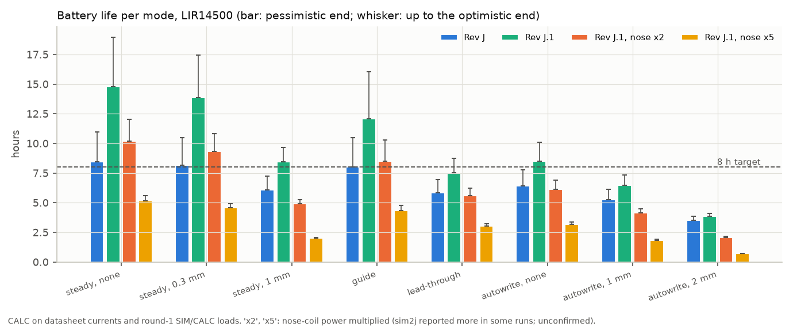
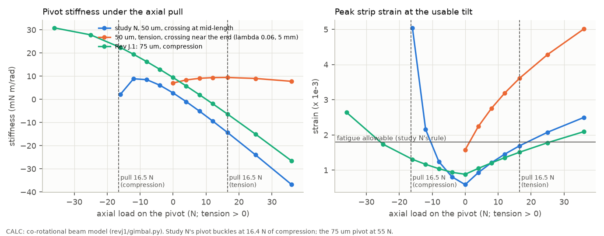
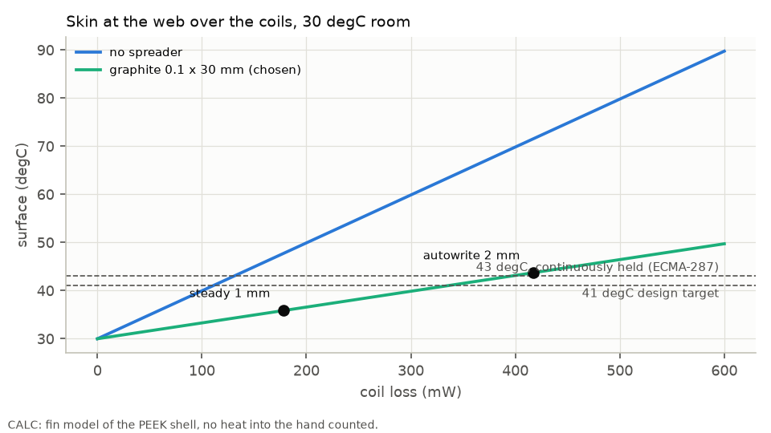
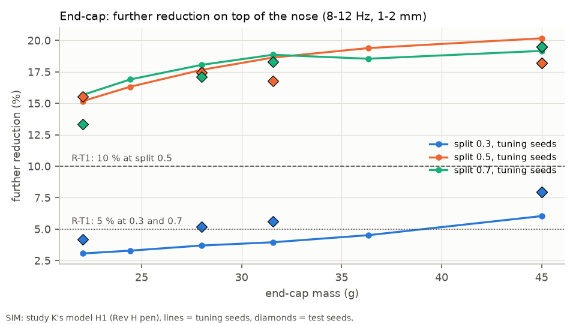
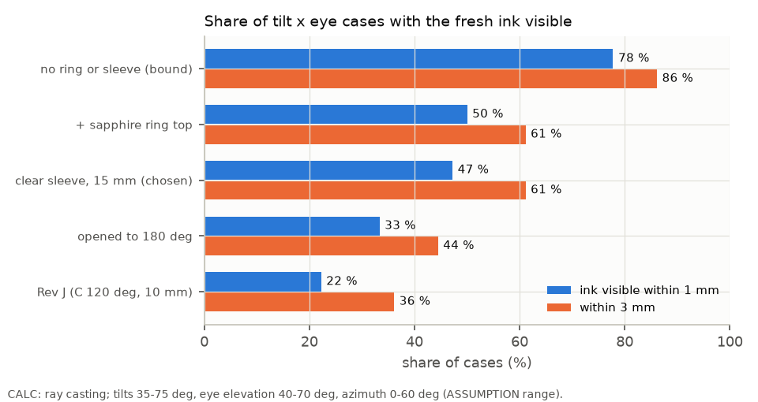
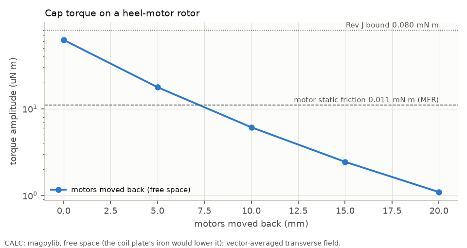
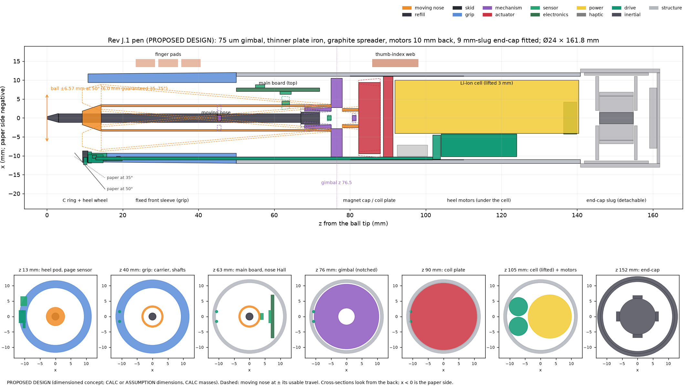

# Rev J.1: fixing the Rev J budgets and loads (design iteration, round 3)

**Status: proposed design, 2026-09-29.** Nothing here was built or measured on a pen or a person.

**Labels.**
- **CALC**: a calculation in this study's package `revj1/` (or in the package named).
- **SIM**: an executed simulation. Here only the end-cap sweep (study K's model H1, run read-only on synthetic writing and tremor). Other SIM numbers are quoted from round-1 studies, with the file named.
- **LIT / MFR**: a published or manufacturer statement, with its ledger id. Ids AMF-155…160 and OPT-60…61 are proposed in `results/revJ1/evidence_rows.csv`.
- **ASSUMPTION**: an input nobody has measured.
- **PROPOSED DESIGN**: a dimension or choice made here.

**Where things are.** Code in `revj1/`. Results in `results/revJ1/`. CAD in `mechanics/cad/revJ1_pen.py`. Section 14 says how to run it.

---

## 1. The answer in plain words

Rev J passed all its geometric fit checks, but six loads and budgets failed. Rev J.1 fixes five of them and states the limit of the sixth.

| Problem | What Rev J had | What Rev J.1 does | Result (label) |
|---|---|---|---|
| P1 gimbal axial load | The cap's 16.5 N pull squeezes 50 µm strips; safety factor 1.24 claimed | Keep the strips in compression, make them 75 µm thick. Add axial shock stops. Centre the spheres within 0.05 mm | Buckling 16.4 → 55 N; fatigue safety factor 2.0 (CALC) |
| P2 battery ≥ 8 h | 6.1–7.3 h at 1 mm tremor | Electronics counted from datasheets; a low-power page sensor that stays on; heel drivers asleep in steady mode | 8.5–9.7 h at 1 mm tremor; lead-through 7.5–8.8 h; autowrite 6.5–7.4 h (CALC) |
| P3 heat | Skin 45.7 °C at the web in a 30 °C room | A 0.1 mm graphite sheet in the shell wall, 30 mm long | 35.9 °C in a 30 °C room at 1 mm tremor; +0.2 g (CALC) |
| P4 mass ≤ 120 g | 129.2 g with the end-cap | A lighter end-cap (9 mm tungsten slug), a thinner plate back iron, the graphite spreader | 112.7 g with the end-cap; it still passes study K's rule R-T1 (CALC, SIM) |
| P5 ink visibility | Ink hidden at 50–75° for the assumed eye | A clear front-sleeve window, 15 mm long, over the top 240° | Ink visible within 1 mm in 47 % of tilt × eye cases (Rev J 22 %) (CALC) |
| P6 heel-motor detent | Up to 0.080 mN·m, 7 × the motor friction | Motors and their gears 10 mm further back | 0.0073 mN·m, 0.66 × the friction (CALC, free space) |

**The big caveat.** Every battery and heat number rests on the nose-coil power of study N's model. The running whole-pen simulation (sim2j) has reported 1.3–2.4 W in some tremor runs (unconfirmed). If the coil power doubles, steady writing at 1 mm tremor lasts 4.9–5.3 h and the web reaches 42.1 °C. At five times, 2.0–2.1 h and 63.8 °C. Section 4.6 and section 5.4 show this.

**Two findings that change earlier proposals.**
- Putting the gimbal strips in tension (Rev J's proposal) does not work. A tensioned strip bends in a short layer at its clamp. The strain there grows with the square root of the tension, and it fails fatigue even with 10 mm wide strips (section 3.2).
- DEC-042's tremor-line detector runs on the page sensor. So the steady mode cannot switch the page sensor off, as Rev J assumed. Rev J.1 keeps it on and makes it cheap instead (section 4.2).

---

## 2. Rev J.1 against the envelope

| Quantity | Rev J (CALC) | Rev J.1 (CALC) | Envelope or requirement |
|---|---|---|---|
| Length, base / with end-cap | 144.7 / 165.7 mm | **143.9 / 161.9 mm** | ≤ 175 mm (ASSUMPTION, envelope) |
| Mass, base / with end-cap | 87.0 / 129.2 g | **84.3 / 112.7 g** | ≤ 120 g with every module (ASSUMPTION, envelope) |
| Centre of mass from the tip, base / with end-cap | 86.1 / 108.1 mm | **86.0 / 102.5 mm** | web at 92 mm (ASSUMPTION, Rev H hand model) |
| Inertia across the pen, base / with end-cap | 9.8 / 23.0 × 10⁴ g·mm² | **9.8 / 19.0 × 10⁴ g·mm²** | — |
| Battery, steady, 1 mm tremor | 6.1–7.3 h | **8.5–9.7 h** | ≥ 8 h (ASSUMPTION, envelope) |
| Battery, same, end-cap active | 4.3–6.6 h | **6.4–8.6 h** | REQ-EC-008: 8 h |
| Battery, guide | 8.0–10.5 h | **12.1–16.1 h** | ≥ 8 h |
| Battery, lead-through | 5.9–6.9 h | **7.5–8.8 h** | REQ-DRV-009: 8 h |
| Battery, autowrite, 1 / 2 mm tremor | 5.3–6.1 / 3.5–3.9 h | **6.5–7.4 / 3.8–4.1 h** | REQ-RVJ-I01 proposed ≥ 5 h |
| Web skin over the coils, 1 mm tremor, 30 °C room | 45.7 °C (37.3 °C with 0.5 mm Al) | **35.9 °C** | ≤ 43 °C (LIT AMF-35), target 41 °C (LIT AMF-34) |
| Coil temperature rise, 1 mm tremor | 16.8 K | **8.5 K** | ≤ 20 K (REQ-RVJ-N03) |
| Gimbal buckling / axial pull | 14.5 N per strip (Euler) / 16.5 N | **55.3 N / 12.4–22.2 N** | ≥ 2 × the pull (REQ-RVJ-I02) |
| Heel-motor detent / motor friction | 0.080 / 0.011 mN·m | **0.0073 / 0.011 mN·m** | ≤ friction (REQ-RVJ-I03) |
| Nose-Hall ripple from the motors | 15.4 µm | **10.2 µm** | ≤ 10 µm (REQ-RVJ-I04), after calibration |
| Fit checks | 38 of 38 | **44 of 44** | — |

Battery ranges run from the pessimistic end (maximum datasheet currents, high duty cycles) to the typical end. Cell: LIR14500, 2.22 Wh usable (MFR AMF-80; 80 % usable, ASSUMPTION). Room for the battery: 23 °C.



---

## 3. P1: the gimbal's axial load

### 3.1 How big is the pull? (CALC, magpylib, ideal iron)

- The image method with infinitely permeable iron gives **16.5 N**. It is an upper bound for a given iron face: real iron is finite, notched and near saturation.
- The pull depends strongly on where the iron face is. Rev J's code has three positions for it:
  - study N's flux model: 22.2 N;
  - Rev J's pull calculation: 16.5 N;
  - Rev J's layout (plate front plus two coil layers): 12.4 N.
- The cruder estimate of 36 N (gap flux squared over the pole area) ignores the fringing between alternating poles. It is not a bound.
- **Rev J.1 designs for 22.2 N** (the largest convention) and states 12.4–22.2 N. EXP-J01 measures it.

### 3.2 The strips (CALC, `revj1/gimbal.py`)

**The model.** A geometrically non-linear (co-rotational) beam model of one cross-strip pivot: two strips at ±45°, a rigid moving body, an axial load through the pivot. It reproduces the closed-form stiffness E b t³/(6 L) = 2.80 mN·m/rad exactly. It also reproduces Wittrick's classic result: the load does not change the stiffness when the strips cross 12.7 % from one end (in the small-load limit). Converged to 1 % with 16–48 elements per strip.

| Option | Load in the strips | Pivot stiffness under the pull (mN·m/rad) | Peak strain at the usable tilt | Fatigue safety factor (Goodman) | Buckling (N) | Verdict |
|---|---|---|---|---|---|---|
| Study N: 50 µm × 2.55 × 3.8 mm, crossing at mid-length | compression 16 N | 1.9 | 0.0051 | 0.53 | **16.4** | fails: buckles at the pull |
| Same strips, arranged in tension | tension 16.5 N | **−14.3** (unstable) | 0.0017 | 1.45 | — | fails: the pull makes the nose snap to a stop |
| Tension, crossing near the end (λ 0.06, 5 mm) | tension 16.5 N | 9.5 | **0.0036** | 0.71 | — | fails fatigue |
| Same, strips 10 mm wide | tension 16.5 N | 33.2 | 0.0023 | 1.16 | — | fails fatigue |
| **Rev J.1: 75 µm × 2.55 × 3.8 mm, compression** | compression 16.5 N | **22.7** (9.4 unloaded) | **0.0013** | **2.03** | **55.3** | **chosen** |
| Same, at 22.2 N | compression 22.2 N | 26.3 | 0.0016 | 1.70 | 55.3 | passes |
| Same, at the crude 36 N | compression 36 N | 30.8 | 0.0026 | 1.02 | 55.3 | marginal |
| 100 µm × 2.55 × 5 mm, compression | compression 16.5 N | 35.1 | 0.0012 | 2.28 | 76.7 | the fallback if the pull is > 27 N |

All CALC. Material LIT AMF-20 (301 full hard: E 200 GPa, fatigue 540 MPa, UTS 1460 MPa). The safety factor treats full-travel tilt as fully reversed and ignores a compressive mean stress.

**Why tension fails.**
- A strip under tension T whose clamp turns by φ bends in a layer of length √(EI/T) at the clamp. Its peak strain is about φ √(3σ/E), with σ the tensile stress (CALC).
- At 16.5 N and the usable tilt this is 0.0036, twice the fatigue allowable of 0.0018 (study N's rule).
- Widening the strips lowers σ, but only as its square root: 10 mm wide strips still give 0.0023.
- With the crossing at mid-length, tension also gives a negative stiffness of −F L / (6 cos 45°) (CALC, derived here). At 16.5 N that is −14.8 mN·m/rad against +2.8.

**Why thicker strips in compression work.**
- Buckling grows as t³: 16.4 N × 1.5³ ≈ 55 N (CALC).
- Compression stiffens a mid-length cross-strip pivot (the same term, opposite sign). The pivot stays stable.
- The strain rises only 1.5 × (with t) and the load stays far from buckling, so the P-δ growth is small.

**What it costs.**
- Stiffness at the ball: 3.9 N/m at 16.5 N (study N 0.48 N/m).
- Coil power: +3.1 mW at 1 mm tremor, +7 mW in autowrite (CALC). The nose's servo stiffness is about 530 N/m (CALC: 2.1 g at 80 Hz), so this is a small load.
- Mass: +0.02 g.

### 3.3 Shock (CALC)

- A tail-first drop pushes the nose toward the plate. Above 222 g of deceleration the 75 µm pivot buckles.
- The pivot shortens only 3.9 µm between the pull and buckling (axial stiffness 10 N/µm).
- A buckled strip stays elastic if its end shortening stays ≤ 5 µm (peak strain 0.0045 against 0.0054 at yield).
- **Proposal (PROPOSED DESIGN):** axial stops on the nose at the gimbal. The rear stop engages ≤ 5 µm beyond the loaded position. The front stop engages ≤ 20 µm. The cap's 0.5 mm clearance to the coils is not a stop. The drop test is EXP-J11.

### 3.4 Thrust pivots (CALC)

- The refill holder passes the gimbal's centre (its rear end reaches z 80.4 mm, `revj/refill.py`). So no pivot can sit on the axis.
- A sliding ball or jewel carrying 16.5 N needs a radius of about 3 mm to keep the Hertz pressure near 2 GPa (limit 2.5 GPa, ASSUMPTION).
- Its friction torque μ F r is then 5–7 mN·m (μ 0.10–0.15, ASSUMPTION): 65–97 mN at the ball, three to four times the whole tremor duty (22 mN of inertia, 16 mN of ball drag). A 530 N/m servo would carry a dead band of about 120–180 µm. Rejected.
- A rolling element has little friction (0.2–4 mN at the ball for 1–20 µm of rolling resistance, ASSUMPTION). But its contact point moves as it rolls, so the pivot point moves. Not pursued.

### 3.5 Reducing the pull instead (CALC, magpylib, ideal iron)

| Option | Pull (N) | Force constant (ratio) | Coil power (ratio) | Verdict |
|---|---|---|---|---|
| Rev J | 16.5 | 1.00 | 1.00 | — |
| 0.25 mm non-magnetic spacer behind the coils | 12.7 | 0.91 | 1.20 | costs heat and battery |
| 0.5 mm spacer | 9.9 | 0.85 | 1.38 | idem |
| 1.0 mm spacer | 6.0 | 0.77 | 1.70 | idem |
| Air-core plate (no plate iron) | 0 from the plate; ≤ 9.9 from the cell's steel can | 0.64 | 2.41 | rejected (heat) |
| Air core, coil grown into the iron's space | ≤ 1.2 from the can | 0.71 | 2.00 | rejected (heat) |
| Two repelling ring magnets at the gimbal (3–9 mm, 1 mm, 0.5 mm gap) | −10.9 (cancels 66 %) | tilt stiffness **+289 mN·m/rad** | — | rejected: 49 N/m at the ball, more than the nose can push at full travel |
| Thinner or split back iron | not modelled with ideal iron | falls with the pull | — | saturation lowers flux, pull and Km together |

- The pull per unit force constant squared barely improves: 0.83 at 0.5 mm spacer (CALC). There is no free reduction.
- Repelling rings (magpylib getFT) also bring a lateral negative stiffness of −4.1 to −9.1 kN/m (Earnshaw).

### 3.6 Centring (CALC)

- The pull's line runs through the coil plate's sphere centre, which is fixed in the handle. An axial offset e of that centre from the pivot adds −F e to the pivot stiffness (its sign follows the offset).
- At 0.05 mm: 0.83 mN·m/rad, 3.6 % of the 75 µm pivot's 22.7. At 0.1 mm: 7.3 %.
- A lateral offset makes a steady torque F e: 0.83 mN·m at 0.05 mm, which the coils hold with 12 mW (a lower bound, because study N's Km is an upper bound).
- **Proposal:** the sphere centre on the pivot within 0.05 mm both ways (as Rev J). Seat the coil plate on a shim chosen after measuring the unpowered nose's stiffness.

### 3.7 The back iron is thicker than it needs to be (CALC)

- The flux entering the plate over one pole is 2.35 × 10⁻⁵ Wb (magpylib, ideal iron). It returns to two neighbours, so each path carries half.
- Through a 1.5 mm plate the mean flux density is about 1.24 T; with a 1.5 × peak factor for crowding (ASSUMPTION), 1.9 T. Hiperco 50A saturates at 2.4 T (MFR AMF-140).
- **Rev J.1 thins the plate's back iron from 2.37 to 1.5 mm:** −2.7 g, and every part behind it moves 0.87 mm forward.
- The cap's own iron stays: it counterweights the nose (thinning it would raise the gravity-holding power by about 70 %, CALC).
- EXP-N01's force map must confirm Km with the thinner plate.



---

## 4. P2: battery with assistance on

### 4.1 The electronics, counted from datasheets (CALC)

Rev J carried 77 mW of electronics from a Rev H ASSUMPTION. Rev J.1 counts it.

| Item | Source | Power from the cell (mW) |
|---|---|---|
| nRF54L15 SoC: CPU at 50–80 % (2.6 mA at 128 MHz), radio at 3–10 % (4.8 mA TX, 3.6 mA RX), peripherals 0.8–1.5 mA; 3.0 V rail at 85 % | MFR OPT-60; duty cycles ASSUMPTION | 7.9–14.1 |
| IMU LSM6DSV16X, 0.65 mA at 1.8 V | MFR OPT-37 | 1.4 |
| Two nose Hall sensors DRV5055, 2 mA typical (4 max) each at 3.3 V | MFR OPT-46 | 14.8–29.6 |
| Two coil drivers DRV8214, active 1.3 mA typical (1.9 max) each | MFR AMF-37 (re-read) | 9.6–14.1 |
| Charger, fuel gauge, regulators | ASSUMPTION | 0.5–1.0 |
| **Total** | | **34.2–60.2** (Rev J 77) |

- The two Hall sensors are now the largest item. They must run at the servo rate.
- The TCN in shadow mode alone takes 28 % of the core (DEC-042, CALC), so the CPU duty is not small.

### 4.2 The page sensor and DEC-042's detector

**What each mode needs from it** (DEC-042, `docs/ai_control_v2.md`, `docs/nose_v2.md`):

| Mode | Needs |
|---|---|
| Steady | The tremor-line detector: a Welch spectrum of the last 4 s every 50 ms on a 250 Hz grid, 4.5–13.5 Hz band, amplitude gate 0.15–0.35 mm. The listening smoother (the IMU carries the estimate: 421 µm without the page sensor against 412 µm with it, SIM study L). The ink log for the app |
| Guide | Position on the page for the template (≥ 120 Hz, ≤ 10 ms, CHECKPOINT §7); heel slip |
| Lead-through | Position and heel slip, ≥ 120 Hz |
| Autowrite | 1 kHz, ≤ 2 ms, ≤ 10 µm (DEC-036, REQ-RVJ-N06). A 120 Hz sensor doubles the ink error (SIM, study N) |

**So Rev J's lever ("switch the page sensor off in steady mode") would blind the detector.**

| Option | Power (mW, CALC) | Steady-mode detector | Autowrite |
|---|---|---|---|
| PMW3360 always on at 1 kHz (Rev J) | 34.4–79.9 | as DEC-042 | yes (MFR AMF-109) |
| PMW3360 gated by an IMU pre-detector (on 10–30 % of the time, ASSUMPTION) | 3.4–24.0 | only if EXP-L01 shows the IMU pre-detector misses no line | yes |
| **PMW3610-class die, always on (chosen)** | **1.3–1.9** | as DEC-042 | to be shown (EXP-J10) |

- The PMW3610 draws 0.60 mA at 1.8 V, has 3200 cpi (7.9 µm counts), 24–30 in/s and 10 g, and the same 2.2–2.6 mm lens plane as the PMW3360 (MFR OPT-61). Its frame rate and paper accuracy are not stated.
- A lower frame rate alone does not help the PMW3360 much: its run current is quoted with 1 ms polling and is set by its internal frame rate.
- **What EXP-L01 must show** (extension proposed): on real recordings, (a) the detector on the chosen sensor's stream at 250 Hz matches the 1 kHz page-sensor detector's gate in ≥ 95 % of 50 ms decisions and never opens on tremor-free writing; (b) an IMU-only detector's gate, for the fallback. If (a) holds, the steady mode keeps the page sensor on at no real cost.

### 4.3 Other levers (CALC)

- **Heel drivers asleep in steady mode.** The wheel free-follows; its drivers and pod sensors sleep (0–2 mW instead of 11–21 mW, ASSUMPTION).
- **End-cap only while a tremor line is detected** (Rev J's DEC-038 proposal kept). Its power: 27.6 mW (SIM, study K's model, the Rev J.1 end-cap on test seeds, drivers included) to 82 mW (CALC, design model).
- **Coil temperature.** Study N's force constant assumes copper at 20 °C. The coil runs at 31.5 °C at 1 mm tremor with the spreader (CALC), 41 °C without it. That costs +4.5 % with the spreader and +7.9 % without (copper 0.393 %/K, ASSUMPTION). The spreader saves about 3 % of coil power.
- **Stiffer gimbal** (P1): +3.1 mW at 1 mm tremor.

### 4.4 Power per mode, Rev J.1, LIR14500 (CALC)

| Mode | Nose coils | Heel | Pen lift | Electronics | Page + slide Hall | Total (mW) | Hours | Rev J hours |
|---|---|---|---|---|---|---|---|---|
| Steady, no tremor | 66 | 0–2 | 12 | 34–60 | 5–10 | 117–150 | **14.8–18.9** | 8.5–11.0 |
| Steady, 0.3 mm | 76 | 0–2 | 12 | 34–60 | 5–10 | 127–160 | **13.9–17.5** | 8.2–10.5 |
| Steady, 1 mm | 178 | 0–2 | 12 | 34–60 | 5–10 | 230–263 | **8.5–9.7** | 6.1–7.3 |
| Steady, 1 mm, end-cap active | +28–82 | | | | | 257–345 | **6.4–8.6** | 4.3–6.6 |
| Guide | 76 | 11–26 | 12 | 34–60 | 5–10 | 138–184 | **12.1–16.1** | 8.0–10.5 |
| Lead-through | 99 | 103–113 | 12 | 34–60 | 5–10 | 254–294 | **7.5–8.8** | 5.9–6.9 |
| Autowrite, no tremor | 99 | 11–21 | 71 | 34–60 | 5–10 | 220–261 | **8.5–10.1** | 6.4–7.8 |
| Autowrite, 1 mm | 181 | 11–21 | 71 | 34–60 | 5–10 | 302–343 | **6.5–7.4** | 5.3–6.1 |
| Autowrite, 2 mm | 418 | 11–21 | 71 | 34–60 | 5–10 | 539–579 | **3.8–4.1** | 3.5–3.9 |

Sources of the columns: nose coils CALC (study N's duty model with the Rev J.1 gimbal and copper temperature; autowrite rows from study N's SIM values); heel SIM study D (1, 6, 84 mW; lead divided by 0.9 for the idler mesh) plus drivers 10–20 mW (ASSUMPTION); pen lift CALC study N (autowrite) or 6 mJ × 2 lifts/s (ASSUMPTION); electronics §4.1; page §4.2; slide Hall 4–8 mW (ASSUMPTION, Rev J).

### 4.5 Cells (CALC on MFR data)

| Cell | Usable energy | Size | Mass | Fits? | Result |
|---|---|---|---|---|---|
| **LIR14500, 750 mAh (kept)** | 2.22 Wh | Ø14.1 × 48.5 mm | 20 g | yes | the table above |
| 14650, 1100 mAh minimum (MFR AMF-156) | 3.26 Wh | Ø14.5 × 65.3 mm | 27 g | +16.8 mm: base 160.7 mm, with end-cap 178.7 mm (over 175) | steady 1 mm 12.4–14.2 h; lead 11.1–12.8 h; autowrite 1 mm 9.5–10.8 h |
| 16 mm cell beside the motors | — | Ø16 | — | no: the motors' centres would need x ≤ −7.43 mm, the bore allows −7.19 (CALC) | — |
| 16 × 65 mm cell with the motors behind it | — | — | — | base pen 181.4 mm (CALC) | — |
| Custom D-shaped pouch over the motors | about 3.2 Wh in 48.5 mm (energy density of a catalogue pouch, MFR AMF-157, about 390–415 Wh/L) | section about 213 mm² | — | custom part, no catalogue shape | a later option |

**Choice: keep the LIR14500.** The 14650 is the fallback if the nose power turns out higher, but with the end-cap it breaks 175 mm.

### 4.6 If the nose coils draw more (sensitivity, CALC)

| Mode | × 1 (study N's model) | × 2 | × 5 |
|---|---|---|---|
| Steady, no tremor | 14.8–18.9 h | 10.2–12.0 h | 5.2–5.6 h |
| Steady, 1 mm | 8.5–9.7 h | 4.9–5.3 h | 2.0–2.1 h |
| Guide | 12.1–16.1 h | 8.5–10.3 h | 4.4–4.8 h |
| Lead-through | 7.5–8.8 h | 5.6–6.2 h | 3.1–3.2 h |
| Autowrite, 1 mm | 6.5–7.4 h | 4.1–4.5 h | 1.8–1.9 h |

- At × 5 (about 0.9–1.0 W at 1 mm tremor, near the lower end of what sim2j reported) no cell that fits gives 8 h: the 14650 gives 2.9–3.0 h.
- A fivefold coil power would be a nose-design problem (Km, drag, servo tuning), not a battery problem. It should be settled by EXP-N01 (Km), EXP-N04 (heat at the duty) and the sim2j investigation before hardware.

### 4.7 One reconciled set of battery targets (proposed)

| Mode | Target (LIR14500, continuous writing, 23 °C) | Rev J.1 estimate |
|---|---|---|
| Steady, up to 1 mm rms tremor | ≥ 8 h | 8.5–9.7 h |
| Steady, end-cap fitted and active while tremor is detected | ≥ 8 h at the end-cap's measured duty; ≥ 6 h at its design power | 8.6 h / 6.4 h |
| Guide | ≥ 8 h | 12.1–16.1 h |
| Lead-through | ≥ 7.5 h | 7.5–8.8 h |
| Autowrite, up to 1 mm tremor | ≥ 6 h | 6.5–7.4 h |
| Autowrite, 2 mm tremor | ≥ 3.5 h (short texts) | 3.8–4.1 h |

- This replaces the hours in REQ-DRV-009 (keep its ≤ 0.15 W for the heel drive itself: 0.103–0.113 W) and REQ-EC-008, and revises REQ-RVJ-I01.
- The page sensor stays on in every mode (it feeds DEC-042's detector).
- Every target is conditional on the nose-coil power model (§4.6).

---

## 5. P3: heat at the web

### 5.1 The limit (LIT, opened here)

- **ECMA-287 Table 5.2** (ledger AMF-35, re-read): parts **continuously held, all materials: 43 °C**. Continuous holding is assumed to be below 8 h; the limit comes from EN 563 (the predecessor of EN ISO 13732-1).
- **ECMA-287 B.5:** the limits assume a 25 °C room unless the maker states a higher maximum room temperature T_mra. The check is then T − T_amb ≤ 43 − T_mra.
- IEC 60601-1 (AMF-34, not re-opened): 41 °C needs no justification.

**Proposal: one room and one limit.** A rated maximum room of **30 °C**, and **43 °C absolute** on the held surface (a 13 K rise), with **41 °C (11 K) as the design target.** This replaces the 30 °C of REQ-RVJ-N03 and the 25 °C of REQ-THM-001 with one rule. Checked at the web over the coil plate.

### 5.2 Spreader options (CALC, fin model, 1 mm tremor duty 0.17 W)

| Spreader (30 mm long) | Surface resistance (K/W) | Web rise at 0.17 W (K) | Mass (g) |
|---|---|---|---|
| None | 99.6 | 17.8 | 0 |
| Aluminium 0.2 / 0.3 / 0.5 mm | 33.1 / 33.0 / 32.8 | 5.9 | 1.1 / 1.7 / 2.8 |
| Copper 0.1 / 0.2 mm | 33.1 / 32.8 | 5.9 | 1.8 / 3.7 |
| **Graphite sheet 0.05 / 0.10 mm (PGS class)** | 33.2 / **32.9** | 5.9 | 0.10 / **0.21** |

- Every spreader is nearly isothermal over its length. So the length (the shell area it wets) sets the result, not the material. 20 mm gives 43 K/W; 40 mm gives 27 K/W.
- A graphite sheet (a–b plane 600–800 W/mK, about 1 g/cm³; MFR AMF-158) does the job at a tenth of the aluminium's mass.
- **Rev J's 0.5 mm aluminium sleeve inside the bore does not fit.** Over z 82–102 it would hit the swinging magnet cap (margin 0.19 mm) and the motors (0.12 mm) (CALC from Rev J's fit checks).

**Choice (PROPOSED DESIGN):** a 0.1 mm graphite sheet, 30 mm long (z 80–110), laminated into a 0.1 mm recess of the shell's inner wall. The bore does not change; 0.9 mm of PEEK insulates it from the plate. +0.21 g (0.23 g with the wiring allowance).

### 5.3 Temperatures per mode (CALC, 30 °C room, with the graphite spreader)

| Mode | Coil loss (mW) | Web (°C) | Coil rise (K) |
|---|---|---|---|
| Steady, no tremor | 66 | 32.2 | 3.2 |
| Steady, 1 mm | 178 | **35.9** | 8.5 |
| Guide | 76 | 32.5 | 3.6 |
| Lead-through | 99 | 33.2 | 4.7 |
| Autowrite, 1 mm | 181 | 35.9 | 8.7 |
| Autowrite, 2 mm | 418 | **43.7** | 20.0 |

- The coil may dissipate **0.395 W** for 43 °C and **0.334 W** for 41 °C in a 30 °C room (CALC).
- Autowrite with 2 mm tremor exceeds 43 °C by 0.7 K in a 30 °C room: short texts only, as study N said, or a firmware cap at 0.39 W of coil loss.
- No heat into the hand is counted (conservative). EXP-J13 measures.

### 5.4 If the nose coils draw more (CALC, 30 °C room)

| Mode | × 1 | × 2 | × 5 |
|---|---|---|---|
| Steady, 1 mm | 35.9 °C | 42.1 °C | 63.8 °C |
| Lead-through | 33.2 °C | 36.6 °C | 47.5 °C |
| Autowrite, 1 mm | 35.9 °C | 42.3 °C | 64.3 °C |

At × 2 the web stays under 43 °C at 1 mm tremor but passes the 41 °C target. At × 5 it burns: no spreader fixes that.



---

## 6. P4: mass

### 6.1 The lightest end-cap that keeps rule R-T1 (SIM, study K's models, read-only)

**Method.**
- Study K's recommended reaction mass (tungsten slug Ø11.65 mm, ±4.0 mm stroke) with shorter slugs: 15.0 (study K), 11, 9, 7.5, 6 and 5 mm. Mass, force constant and coil force from study K's design model.
- Study K's feed-forward gain 0.75 kept for every member (ASSUMPTION: not re-tuned per mass).
- Stage 1, tuning seeds 300–303: grip splits 0.3 / 0.5 / 0.7, 8–12 Hz × 1–2 mm.
- Stage 2, test seeds 200–203, study K's full test grid (4–12 Hz × 0.3 / 1 / 2 mm, three splits), with R-T1 exactly as study K applies it.
- The 45 g design reproduced study K's test verdict exactly (8.0 / 18.2 / 19.5 %), which checks the reuse.

**Rules, fixed before the test runs they govern.**
- J1-M1 (before any test run): the lightest member with ≥ 12 % at split 0.5 and ≥ 6 % at splits 0.3 and 0.7 on tuning seeds. Only the 45 g design passed (split 0.3 is the binding split: 4.5 % at 36.3 g).
- J1-M2 (written after the tuning results, before any test run of a lighter member): test the 31.6, 28.0 and 22.0 g members; take the heaviest that keeps the pen with the end-cap ≤ 120 g and passes the split-0.5 part of R-T1 with no split worse on average; report splits 0.3 and 0.7 as they fall.

| End-cap (design model) | Slug | Tuning, split 0.3 / 0.5 / 0.7 | **Test, split 0.3 / 0.5 / 0.7** | R-T1 (test) | Same mass fixed, test | End-cap power (SIM, test) |
|---|---|---|---|---|---|---|
| 45.0 g (study K) | 28.8 g | 6.0 / 20.2 / 19.2 % | 8.0 / 18.2 / 19.5 % | pass | — | 29 mW |
| 36.3 g | 21.1 g | 4.5 / 19.4 / 18.5 % | not tested | — | — | — |
| **31.6 g (chosen, 9 mm slug)** | 17.3 g | 4.0 / 18.6 / 18.9 % | **5.6 / 16.8 / 18.3 %** | **pass** | 12.6 / 11.1 / 6.7 % | 28 mW |
| 28.0 g | 14.4 g | 3.7 / 17.7 / 18.1 % | 5.2 / 17.4 / 17.1 % | pass | 10.8 / 10.3 / 6.9 % | 29 mW |
| 24.4 g | 11.5 g | 3.3 / 16.3 / 16.9 % | not tested | — | — | — |
| 22.0 g | 9.6 g | 3.1 / 15.2 / 15.7 % | 4.2 / 15.6 / 13.4 % | fails at split 0.3 | 7.1 / 10.3 / 5.5 % | 31 mW |

All SIM (model H1, the Rev H pen and tracker; synthetic writing and tremor). "Further reduction" is on top of the nose, 8–12 Hz, 1–2 mm.

**What it means.**
- The benefit falls slowly with mass: at split 0.5, 18.2 % at 45 g and 16.8 % at 31.6 g.
- **The lightest end-cap that keeps the full R-T1 is 28.0 g** (5.2 % at split 0.3, just over 5 %). The lightest that keeps its split-0.5 part is below 22 g (15.6 %).
- At split 0.3 the same mass fixed does better than the moving slug (12.6 against 5.6 % at 31.6 g), as study K found. At split 0.5 the slug is 5.7 points better, just outside DEC-038's revisit trigger (5 points).
- **Choice:** the 31.6 g member (rule J1-M2). In Rev J.1's compact packaging it weighs **29.6 g** and is **21 mm** long (the shell follows the coils, 17 mm, + 4 mm).

### 6.2 Base-pen savings that cost no function (CALC)

| Change | Mass (g, incl. +10 % wiring) | Function kept? |
|---|---|---|
| Coil-plate back iron 2.37 → 1.5 mm (§3.7) | −2.9 | yes, if EXP-N01 confirms Km |
| Graphite spreader instead of Rev J's 0.5 mm aluminium | +0.2 (Rev J's spreader: +2.1, not in its 87.0 g) | yes (§5) |
| 75 µm gimbal strips | +0.02 | yes |
| End-cap 43.3 → 29.6 g | −13.7 | R-T1 still passes (§6.1) |
| **Base pen** | **84.3 g** (Rev J 87.0) | |
| **With the end-cap** | **112.7 g** (Rev J 129.2) | ≤ 120 g with 7.3 g to spare |

Not taken (they cost function or rest on thin grounds):
- a thinner shell wall (the shaft grooves need the wall: 0.07 mm margin now);
- a ribbed grip core (needs an FEM check of the grip's stiffness);
- re-basing the 10 % wiring allowance off the cell and the magnets (an accounting change, about −2.8 g, not a design change);
- thinning the cap's iron (it counterweights the nose).

**The 130 g provisional limit of REQ-EC-001 is no longer needed:** propose ≤ 120 g with the end-cap fitted.



---

## 7. P5: ink visibility

### 7.1 Method (CALC)

- Ray casting as Rev J (`revj/frontend.visibility`, reused), with the ring and the sleeve rebuilt so they can open wider or turn clear.
- Tilts 35, 50, 60 and 75°. Eye elevations 40, 55 and 70° above the paper. Eye azimuths 0, 30 and 60° to the left of the pen's back direction (right-handed; left-handed writers mirror). Fresh ink trailing at 120° (Rev J's ASSUMPTION). 36 cases per option.
- **Eye positions are an ASSUMPTION range.** No writing-posture source with eye angles could be opened. A search found an IOVS abstract (2006) reporting text about 63° below the eyes when reading at a desk, but the page returned HTTP 403, so it is not used as evidence.

### 7.2 Options

| Option (PROPOSED DESIGN variants) | Ink visible within 1 mm | within 3 mm |
|---|---|---|
| Rev J: C ring open 120°, opening carried 10 mm into the sleeve | 22 % | 36 % |
| Opened to 150° | 28 % | 42 % |
| Opened to 180° | 33 % | 44 % |
| Clear sleeve top (±75°), first 20 mm | 36 % | 50 % |
| **Clear sleeve over the top 240°, first 15 mm (chosen)** | **47 %** | **61 %** |
| + a clear (sapphire) top on the ring | 50 % | 61 % |
| Clear sleeve over 240°, 30 mm, and a clear ring | 61 % | 75 % |
| No ring and no sleeve at all (the bound) | 78 % | 86 % |

All CALC. At 50° with the eye at 55° and 30° to the left: 3.0 mm with the chosen window, not within 6 mm in Rev J.

### 7.3 Materials

| Material | Light | Scratch | Toughness | Source | Use |
|---|---|---|---|---|---|
| PC, hard-coated | 88–90 % | coated: comparable to PMMA (uncoated HB–2H) | 60–80 kJ/m² | LIT AMF-159 (secondary) | **sleeve window (chosen)** |
| PMMA | 92 % | 2H–4H | 1.5–2.5 kJ/m² (brittle in a drop) | LIT AMF-159 | not chosen |
| Sapphire | — | Vickers 22.5 GPa | flexural 690 MPa; 3.97 g/cm³ | MFR AMF-160 | ring insert: only +3 points, not chosen |

- The ring rubs on paper, whose fillers would haze PC or PMMA. Only sapphire would survive there, and it adds little.
- The finger pads sit at z 26–38 (Rev H hand model). The first 15 mm behind the ring (z 10.8–25.8) are free of fingers; a longer window would sit under them.
- The bottom 120° of the sleeve stays PEEK: it carries the shaft grooves, the heel pod and the page sensor.



---

## 8. P6: heel-motor detent

### 8.1 Numbers (CALC, magpylib, free space: an upper bound)

- **The torque that turns a rotor** is |m| × |⟨B⊥⟩|: the transverse field, vector-averaged over the rotor magnet. Rev J multiplied |m| by the mean |B| including the axial part, which turns nothing.
- At Rev J's motor position: **0.062 mN·m** (Rev J's bound 0.080), 5.6 × the motor's static friction (0.011 mN·m, MFR AMF-155), 0.12 N at the tyre.
- **The motor's housing is aluminium, black anodized** (MFR AMF-155). It does not shield. Rev J assumed a steel housing would help. Whether the stator has an iron return ring is not stated.
- The coil plate's back iron lies between the cap and the motors (the motors sit 24° from the bottom, outside the plate's ±10° notch). Free space is therefore an upper bound; an infinite ideal plane would give zero.

| Change | Torque (mN·m) | × friction | Cost |
|---|---|---|---|
| Rev J position | 0.062 | 5.6 | — |
| Motors 5 mm back | 0.018 | 1.6 | shafts +5 mm |
| **Motors and gears 10 mm back (chosen; with the plate change, net +9.1 mm)** | **0.0073** | **0.66** | shafts 80 → 89 mm (twist +11 %); LRA moves forward |
| Motors 15 mm back | 0.0024 | 0.22 | shafts +15 mm |
| Soft-iron cup 0.2 mm, μr 500 / 2000 (at Rev J's position) | 0.0041 / 0.0011 | 0.37 / 0.10 | +0.6 g; **does not fit**: 0.12 mm left between motor and bore, 0.10 mm between the motors |

- Cup numbers use the transverse shielding factor of a thin iron shell, 1 + (μr − 1)²/(4 μr) (1 − R_i²/R_o²) ≈ 1 + μr t/(2R) (CALC, derived; μr ASSUMPTION range). Wall flux about 0.34 T at 0.2 mm (CALC): no saturation.
- Moving the motors back also lowers their ripple at the nose Hall sensors: 15.4 → 10.2 µm (CALC).
- The field outside the pen does not change: 1 mT at about 23 mm from the surface (CALC; the 1 mT level is Rev J's ASSUMPTION until ISO 14117 is read).

### 8.2 What EXP-J02 must measure

- **Set-up:** a 0620 B at its Rev J.1 place (and at Rev J's), behind a C1S cap and a coil-plate dummy with a 1.5 mm Hiperco back iron; the cap at rest and at the stops in four directions.
- **Measure:** cogging torque against rotor angle (a torque sensor with ≤ 1 µN·m resolution on the motor shaft, unpowered, turned slowly), and the motor's own Hall signals; the same with a 0.1 mm low-carbon steel cup if a later layout finds room.
- **Also measure:** no-load current and speed (an iron ring near the rotor adds loss); the motor's stray field at the nose Hall sensors' place, with the rotor turning (for REQ-RVJ-I04).
- **Pass:** added detent ≤ 0.011 mN·m at every cap position (REQ-RVJ-I03). If it fails, move the motors 15 mm back.



---

## 9. The Rev J.1 layout

### 9.1 Changes against Rev J (PROPOSED DESIGN)

| Part | Rev J | Rev J.1 |
|---|---|---|
| Gimbal strips | 301 FH, 50 µm × 2.55 × 3.8 mm | 75 µm × 2.55 × 3.8 mm; crossing at mid-length; compression; axial stops |
| Coil-plate back iron | 2.37 mm (z 88.8–92.2) | 1.5 mm (z 88.8–91.4); everything behind 0.87 mm forward |
| Heel motors and transfer gears | z 94.9–114.9, gears 92.7–94.7 | z 104.1–124.1, gears 101.9–103.9 |
| Drive shafts | 80 mm | 89 mm |
| Cue LRA | z 115.7–123.7 | z 92.5–100.5 (under the cell's front, over the shafts: 0.08 mm gap) |
| Heat spreader | 0.5 mm Al proposed inside the bore (does not fit) | 0.1 × 30 mm graphite sheet in the shell wall, z 80–110 |
| Front sleeve | PEEK + TPE; C opening 10 mm | first 15 mm clear hard-coated PC over the top 240° |
| Page sensor | PMW3360-class die | PMW3610-class die (same place and optics) |
| End-cap | 43.3 g, 24 mm, slug 28.7 g | 29.6 g, 21 mm, slug 17.3 g |
| Cell | LIR14500 | LIR14500 (z 91.9–140.4) |

### 9.2 Fit checks (CALC, `results/revJ1/layout.json` → fit_checks)

- **44 of 44 pass:** Rev J's 38 checks re-run on the changed layout, plus six new ones.
- New checks (margins beyond each rule): LRA to the transfer gears 1.2 mm; LRA behind the plate 0.9 mm; motors under the cell 16.3 mm; length with the end-cap 13.2 mm under 175; PEEK left over the spreader recess 0.9 mm (rule ≥ 0.5 mm, margin 0.4); LRA to the shaft liners 0.08 mm.
- Tight spots below 0.15 mm (unchanged from Rev J unless named): the carrier at the ring 0.09; the heel pod at the nose 0.10; the wall outside the shaft liners 0.07 and the preload flexure 0.04; the shaft notches 0.10; motor to motor 0.10; motors and LRA in the bore 0.12 / 0.14; **new: LRA over the shaft liners 0.08**.

### 9.3 Mass and balance (CALC, +10 % wiring on the base pen, ASSUMPTION)

| Group | Rev J (g) | Rev J.1 (g) |
|---|---|---|
| Power (cell) | 22.0 | 22.0 |
| Actuator (cap, plate) | 20.3 | 17.4 |
| Structure (shell, rear cap, spreader) | 10.7 | 10.9 |
| Grip | 8.6 | 8.6 |
| Drive | 6.8 | 6.8 |
| Electronics | 6.6 | 6.6 |
| Mechanism (gimbal, drum, pulleys) | 4.4 | 4.5 |
| Moving nose, refill, sensors, haptic, skid | 7.7 | 7.6 |
| **Base pen** | **87.0** | **84.3** |
| End-cap / rear cap it replaces | +43.3 / −1.2 | +29.6 / −1.2 |
| **With the end-cap** | **129.2** | **112.7** |

- The tilting nose is unchanged: 18.1 g, 1.53 g at the tip, centre of mass 4.7 mm ahead of the pivot. The coils hold its weight with 0.8–8.3 mW over 75–35° (CALC).



---

## 10. Simulator parameters

`results/revJ1/sim_params.json` has the schema of `results/revJ/sim_params.json`. It is Rev J's builder run on the Rev J.1 layout, with these entries replaced (value, unit, label, source each):

| Block | Changed entries |
|---|---|
| Nose | flexure 22.8 mN·m/rad under the pull (9.4 unloaded); buckling 55.3 N; axial pull 16.5 N with the 12.4–22.2 N range; magnetic negative stiffness 0–0.83 mN·m/rad (centring ≤ 0.05 mm); coil-to-ambient 47.9 K/W; the coil-power sensitivity (1, 2, 5) |
| Heel wheel | detent bound 0.0073 mN·m; shafts 89.1 mm, 0.036 N·m/rad |
| End-cap | slug 18.5 g moving (17.3 g tungsten + tiles); ±4.0 mm; 5 Hz flexure; Km 0.598 N/√W; 0.42 N; the SIM test verdict |
| Sensors | page sensor: PMW3610 class, 1 kHz and 2 ms kept as the requirement, 7.9 µm counts, on in every mode |
| Handle | mass, centre of mass and inertia of the Rev J.1 handle, with and without the end-cap |
| Randomisation | axial pull 12.4–22.2 N; flexure 9.4–27.3 mN·m/rad; detent 0–0.0073 mN·m; coil-power factor (reporting only) |

---

## 11. What is still open

1. **The nose-coil power.** If sim2j confirms 1.3–2.4 W, the battery and heat conclusions fall (§4.6, §5.4). That is a nose-design question first.
2. **The pull's size.** 12.4–22.2 N depending on where the iron face is; ideal iron everywhere. EXP-J01.
3. **The low-power page sensor's accuracy on paper at 1 kHz** is unknown (EXP-J10). If it fails, autowrite needs a PMW3360-class die, and the steady mode needs EXP-L01 to back an IMU pre-detector.
4. **Lead-through** reaches 8 h only at the typical end (7.5–8.8 h).
5. **End-cap at split 0.3** keeps R-T1 by 0.6 points (5.6 %); the fixed weight does better there. The model is study K's Rev H pen, not Rev J.1.
6. **Shock.** The strips need axial stops with ≤ 5 µm of post-buckling travel. Not designed.
7. **The thinner back iron** rests on a magnetic-circuit estimate with a crowding factor (ASSUMPTION). EXP-N01.
8. **The clear window** needs a hard coat that survives hands, pockets and cleaning (EXP-J15); eye positions are an assumed range.
9. **Motor detent** is a free-space bound; the plate's iron will lower it by an unknown amount (EXP-J02).
10. **New tight spot:** the LRA sits 0.08 mm over the shaft liners.
11. **Nose-Hall ripple** from the motors is 10.2 µm, just over REQ-RVJ-I04's 10 µm before calibration by rotor angle.
12. **Electronics duty cycles** (CPU 50–80 %, radio 3–10 %) are assumptions until the firmware runs on the nRF54L15 (EXP-J12).
13. Rev J's open items not touched here stay open: page-sensor roll range, refill stiffness, the main board's placement, the implant limit (ISO 14117), the desk-board magnet, the notches' effect on Km.

---

## 12. Proposals for the lead

### 12.1 DEC-045 (draft)

**DEC-045: Rev J.1 fixes to the integrated Rev J pen** (proposed; refines DEC-036, DEC-037, DEC-038, DEC-042, DEC-044).
- *Decision.*
  - The gimbal keeps study N's cross-strip geometry and load path (the cap's pull compresses the strips) with **75 µm** 301 full-hard strips (buckling 55 N against a 12.4–22.2 N pull, CALC), axial shock stops (≤ 5 µm rear, ≤ 20 µm front) and the sphere centre on the pivot within 0.05 mm. Strips in tension and thrust pivots are not used.
  - The coil plate's back iron is 1.5 mm.
  - The page sensor is a PMW3610-class die, **on in every mode** (DEC-042's detector needs it in the steady mode); a PMW3360-class die stays the fallback for autowrite.
  - The electronics budget is counted from datasheets (34–60 mW); the heel drivers sleep in the steady mode; the end-cap runs only while a tremor line is detected.
  - The cell stays the LIR14500.
  - A 0.1 mm graphite heat spreader, 30 mm long, sits in the shell wall over the coil plate and the web.
  - The end-cap uses a 9 mm tungsten slug (29.6 g, 21 mm; R-T1 passes at 5.6 / 16.8 / 18.3 %, SIM).
  - The front sleeve's first 15 mm are clear hard-coated PC over the top 240°.
  - The heel motors and their gears sit 10 mm further back; the cue LRA moves in front of them.
- *Alternatives.* Strips in tension (negative stiffness at mid-length crossing; fatigue fails at a near-end crossing even at 10 mm width); sliding thrust pivots (65 mN of friction at the ball); spacers and air-core plates (1.2–2.4 × coil power); repelling rings (289 mN·m/rad of tilt stiffness); the page sensor off in steady mode (blinds the detector); a 14650 cell (178.7 mm with the end-cap); 16 mm cells (do not fit beside the motors); aluminium or copper spreaders (same effect, 5–15 × the mass; inside the bore they hit the cap and the motors); the 45 g end-cap (129 g pen); a clear ring (only +3 points); a soft-iron cup on the motors (no room).
- *Evidence.* `docs/revJ1_design.md`, `results/revJ1/` — calculation (beam model, magpylib, fin model, ray casting, datasheet budgets), simulation (study K's model H1 on test seeds, end-cap family). Pen 143.9 / 161.9 mm, 84.3 / 112.7 g; steady 1 mm tremor 8.5–9.7 h, lead-through 7.5–8.8 h, autowrite 1 mm 6.5–7.4 h; web 35.9 °C at 1 mm tremor in a 30 °C room; detent 0.66 × the motor friction (free space); ink visible within 1 mm in 47 % of tilt × eye cases (Rev J 22 %); 44 of 44 fit checks.
- *Status.* Proposed.
- *Revisit if.* EXP-J01 measures a pull above 27 N (then 100 µm × 5 mm strips); EXP-J10 shows the low-power page sensor cannot give autowrite's 1 kHz / 10 µm; EXP-L01 shows the detector needs the 1 kHz stream; EXP-N01/N04 or sim2j confirm a nose-coil power ≥ 2 × study N's model (then the battery and heat targets cannot be met with this nose); EXP-J02 measures a detent above the motor friction; EXP-K02 gives < 10 % further reduction with the 29.6 g end-cap at the measured grip split.

### 12.2 Requirement changes (proposed)

| Id | Change | Rev J.1 estimate |
|---|---|---|
| REQ-RVJ-I01 | Replace by the per-mode table of §4.7; the page sensor on in every mode | steady 1 mm 8.5–9.7 h; lead 7.5–8.8 h; autowrite 1 mm 6.5–7.4 h (CALC) |
| REQ-DRV-009 | Keep ≤ 0.15 W for the heel drive; move its hours to REQ-RVJ-I01 | 0.103–0.113 W while leading (CALC) |
| REQ-EC-008 | Fold into REQ-RVJ-I01 (end-cap row) | 6.4–8.6 h (CALC) |
| REQ-EC-001 | ≤ 120 g with the end-cap fitted (drop the provisional 130 g) | 112.7 g (CALC) |
| REQ-RVJ-I02 | Add: fatigue safety factor ≥ 1.5 at full-travel tilt under the measured pull; axial stops so a 1 m drop leaves the strips elastic | buckling 55.3 N; SF 2.0 at 16.5 N, 1.7 at 22.2 N (CALC) |
| REQ-RVJ-I03 | Unchanged | 0.0073 mN·m, 0.66 × friction (CALC, free space) |
| REQ-RVJ-I04 | Unchanged; note the motors' ripple | 10.2 µm unshielded (CALC) |
| REQ-RVJ-I06 | Add "for eye positions 40–70° up and 0–60° to the writer's side" | 47 % within 1 mm, 61 % within 3 mm (CALC) |
| REQ-RVJ-N03 and REQ-THM-001 | One rule: held surfaces ≤ 43 °C absolute at a rated maximum room of 30 °C (13 K rise), design target 41 °C; checked at the web over the coil plate | 35.9 °C at 1 mm tremor; autowrite 2 mm 43.7 °C (CALC) |
| **new** REQ-RVJ-I07 Page-sensor power | The page sensor stays on in every mode and draws ≤ 3 mW; its stream feeds DEC-042's detector | 1.3–1.9 mW (CALC on MFR OPT-61) |
| **new** REQ-RVJ-N09 Front stop | The refill's front stop engages within 0.3 mm of slide beyond the contact position; ink tail ≤ 0.5 mm after a 30 mm/s lift (Rev J §5.3 design; not changed by Rev J.1) | 0.33 mm (CALC, Rev J) |

### 12.3 New experiments

| Id | Question | Set-up | Pass line |
|---|---|---|---|
| EXP-J10 | Does a low-power navigation die serve every mode? | PMW3610-class die with the folded optics on the EXP-J04 stage; six papers; heights 2.0–2.8 mm; tilt 35–75°; roll 0–5°; 1 kHz polling; encoder ground truth; current probe | ≤ 10 µm rms and ≤ 2 ms at 1 kHz for autowrite, or ≥ 250 Hz and ≤ 50 µm for the detector and slip; ≤ 3 mW |
| EXP-J11 | 75 µm gimbal under the pull, and shock | Gimbal on a load frame: axial load 0–60 N (buckling), rotational stiffness at 0 / 12 / 16.5 / 22 N preload; 10⁸ tilt cycles of ±0.017 rad about ±0.086 rad offsets, 10⁵ full-travel cycles; 1 m drops onto hardwood, tip-first and tail-first, with the stops | buckling ≥ 2 × the EXP-J01 pull; stiffness within 20 % of `gimbal.json`; no fracture; strips elastic after the drops |
| EXP-J12 | Electronics power | nRF54L15 + 2 × DRV5055 + 2 × DRV8214 + LSM6DSV16X + page sensor running the firmware loop at 2 kHz with the TCN in shadow and a BLE log link; per-mode current at 3.7 V | ≤ 60 mW base; the per-mode totals of §4.4 within 15 % |
| EXP-J13 | Heat with the graphite spreader | EXP-J05's heated shell with the 0.1 × 30 mm graphite sheet in the wall; 0.06–0.42 W; 23 and 30 °C rooms; with and without a hand phantom | web ≤ 41 °C at 0.18 W and ≤ 43 °C at 0.39 W in a 30 °C room |
| EXP-J14 | Km and pull with the 1.5 mm back iron | EXP-N01/J01 coupons with 2.37 and 1.5 mm Hiperco plates; force map; Hall probe at the plate rim | Km ≥ 0.97 × the 2.37 mm plate's; pull within 20 % of `magnetics.json` |
| EXP-J15 | Clear sleeve window | Printed fronts with the 15 mm × 240° hard-coated PC window (and Rev J's front) on dummy pens; 10 right- and 10 left-handed writers, eye tracking or video; abrasion (Taber or steel wool) and pocket-key tests on coated PC coupons | ink seen within 3 mm for most writers at their own tilt; haze ≤ 5 % after the abrasion test |
| EXP-J16 | Light end-cap | EXP-K02 repeated with the 29.6 g end-cap (9 mm slug) and the same mass fixed, at the measured grip split (EXP-I01) | ≥ 10 % further reduction at the measured split; the fixed weight not within 5 points |
| EXP-L01 (extension) | Detector on the new sensor | Replay recorded writing through the detector at 250 Hz from the chosen sensor, and from the IMU alone | ≥ 95 % of 50 ms gate decisions agree with the 1 kHz page-sensor detector; never open on tremor-free writing |

EXP-J02 (motor detent) is re-specified in §8.2.

---

## 13. Evidence

**Sources opened in this study** (proposed rows in `results/revJ1/evidence_rows.csv`, 23 columns as `docs/evidence.csv`):

| Id | Source | Used for |
|---|---|---|
| OPT-60 | Nordic nRF54L15/L10/L05 Preliminary Datasheet v0.10 (Farnell copy) | SoC currents |
| OPT-61 | PixArt PMW3610DM-SUDU datasheet (EPSGlobal copy) | low-power page sensor |
| AMF-155 | Faulhaber 0620 B datasheet, edition 2026-07-28 | aluminium housing; friction torque |
| AMF-156 | KeepPower ICR14650 product page | 14650 cell |
| AMF-157 | LP503562 1200 mAh specification (Hunan Sounddon, Adafruit copy) | pouch energy density |
| AMF-158 | Panasonic PGS graphite sheet brochure (2005, Digi-Key copy; text partly unreadable) | spreader |
| AMF-159 | KunststoffWissen PC vs PMMA comparison (secondary web page) | window material |
| AMF-160 | Kyocera single-crystal sapphire catalogue | ring insert |

**Re-read, already in the ledger:** ECMA-287 (AMF-35: Table 5.2 and B.5); TI DRV5055 (OPT-46: ICC 2 / 4 mA); TI DRV8214 (AMF-37: active current IVM 1.3 / 1.9 mA — not in its findings column; proposed amendment).

**Found but not opened (no row, not used as evidence):** an IOVS 2006 abstract on head and book position when reading (HTTP 403).

---

## 14. Files and how to run

| File | What it does |
|---|---|
| `revj1/gimbal.py` | Co-rotational beam model of the cross-strip pivot; closed forms; designs; thrust pivots; shock |
| `revj1/magnetics.py` | Pull variants (spacer, air core), repelling rings, centring, back-iron flux, motor detent, cups |
| `revj1/power.py` | Electronics from datasheets, page-sensor options, per-mode power, cells, targets |
| `revj1/thermal.py` | Skin limit, fin model with any spreader, web temperatures |
| `revj1/endcap_mass.py` | The end-cap family on study K's model (SIM; rules J1-M1, J1-M2) |
| `revj1/visibility.py` | Ray casting with wider openings, clear windows and swept eye positions |
| `revj1/layout.py` | The Rev J.1 layout (Rev J's builder + changes) and fit checks |
| `revj1/budgets.py` | Mass, power and battery (× 1 / 2 / 5), heat |
| `revj1/simparams.py` | MuJoCo parameters (Rev J's schema) |
| `revj1/figures.py`, `revj1/evidence.py`, `revj1/run.py` | Figures with CSV twins; ledger rows; the pipeline |
| `revj1/tests/test_revj1.py` | 20 fast tests |
| `mechanics/cad/revJ1_pen.py` | STEP and drawings, using `mechanics/cad/revJ_pen.py` |

**Results `results/revJ1/`** (every JSON carries `stabpen.provenance`): `layout.json`, `budgets.json`, `sim_params.json`, `gimbal.json`, `magnetics.json`, `endcap.json`, `visibility.json`, `revJ1.json`, `evidence_rows.csv`; figures `fig_revJ1_{gimbal,battery,heat,endcap,visibility,detent}.png` with CSV twins; CAD `revJ1_pen_assembly.step`, `revJ1_pen_assembly_no_endcap.step`, `drawing_revJ1_pen*.png` / `.csv`, `revJ1_cad_summary*.json`. The end-cap SIM rows are cached in `results/revJ1/_cache/`.

**Commands** (repository root, one process each):

```
python3 -m revj1.run                      # about 1-2 min with the end-cap cache; --quick writes results/revJ1/_quick/
python3 -m revj1.endcap_mass --stage all  # the end-cap SIM stages (about 20 min on one core; cached)
python3 -m pytest revj1/tests -q          # 20 tests, about 15 s
python3 mechanics/cad/revJ1_pen.py        # STEP + drawing with the end-cap; --no-endcap for the base pen
```

**Dependencies** (versions used): Python 3.11, numpy 2.4.6, scipy 1.17.1, matplotlib, magpylib 5.2.3 (getFT for the rings), torch (CPU; study N's design model for the travel factor), numba (study K's H1), CadQuery 2.8.0 (CAD only). Read-only inputs: `revj/`, `results/revJ/`, `results/nose2/`, `results/endcap/`, `nose2/`, `endcap/`, `drive/`, `opt/`, `sim/`.

**Compute used:** about 35 min of one core (end-cap SIM about 26 min; beam-model scans, magnetics, ray casting and the pipeline runs about 10 min).
