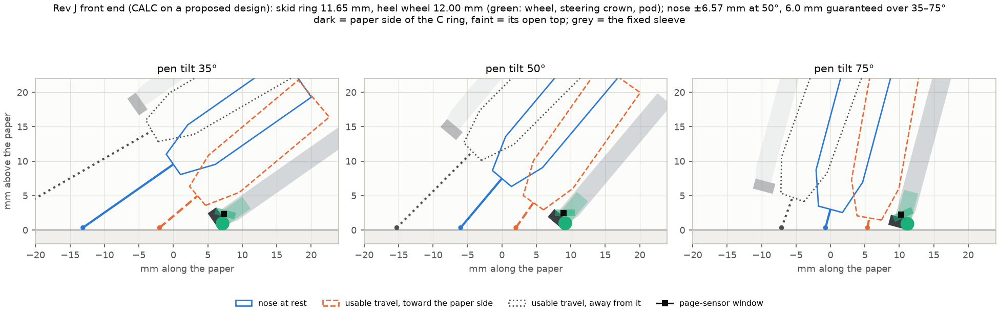
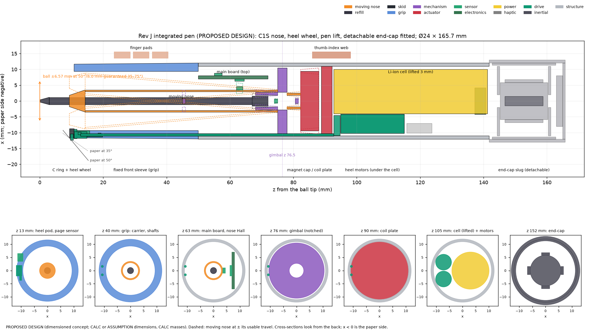
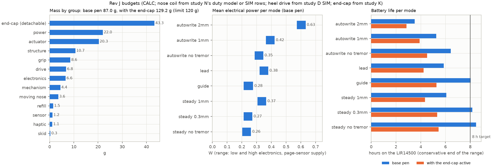

# Rev J integrated design (round 2)

**Status: proposed design, 2026-09-29.** This study joins the round-1 designs into one pen: study N's nose v2 (C1S), study D's heel drive and study K's end-cap. Nothing here is built or measured. No new closed-loop simulation was run: every SIM number is quoted from a round-1 study.

**Labels.** SIM: simulation (the study is named). CALC: calculation (this study's code in `revj/`, unless another study is named). LIT or MFR: a source in the ledger, with its id. ASSUMPTION: an input or design choice that no source or measurement backs yet. Dimensions chosen here are a PROPOSED DESIGN. The CALC results rest on them.

**Where things are.** Code in `revj/`. Results in `results/revJ/`. CAD in `mechanics/cad/revJ_pen.py`. Section 14 says how to run it.

---

## 1. The pen in plain words

- **One handle, three helpers.** The writer holds a fixed Ø24 mm handle.
  - Inside it, the C1S nose (study N) tilts the refill on a gimbal 76.5 mm behind the ball.
  - At the heel, a 2 mm wheel (study D) is steered. It is driven only in the lead-through and autowrite modes.
  - Behind the cell, an optional end-cap (study K) holds a moving tungsten mass.
- **The front.**
  - A C-shaped skid ring rests on the paper and carries the writing force. Its contact radius is 11.65 mm.
  - The ring is open 120° on top, so the writer can see the ink. The opening carries on 10 mm into the sleeve.
  - The wheel sits in a slot at the bottom of the ring, at 12.0 mm from the axis.
  - The page sensor looks at the paper beside the wheel.
- **The middle.**
  - The main board lies along the top of the handle, above the swinging carrier. The IMU and the nose's two position sensors (Hall sensors) sit on it.
  - The pen-lift and ink-force drum sits just in front of the gimbal and tilts with the nose.
- **The actuator.** Behind the gimbal come a short arm, the spherical magnet cap and the coil plate (all study N).
- **The rear.**
  - The cell sits right behind the coil plate. It is lifted 3 mm toward the top.
  - The two heel motors lie under the cell.
  - Two 0.8 mm shafts run 80 mm forward to the wheel, in grooves in the bottom wall.
  - A rear cap closes the base pen. The end-cap screws on in its place.
- **Size and weight.**
  - Base pen: 144.7 mm long and 87.0 g. Its centre of mass is 86 mm from the tip, just in front of the thumb–index web.
  - With the end-cap: 165.7 mm and 129.2 g. That is over the 120 g envelope, so the end-cap stays a detachable module (as DEC-038 already says).

### Headline numbers

| Quantity | Rev J | Round 1, or the limit | Label |
|---|---|---|---|
| Ball travel: nominal at 50° / guaranteed over 35–75° | ±6.57 mm / 6.00 mm | study N 6.49 / 6.0 mm; REQ-RVJ-N01 ≥ 6.0 mm | CALC |
| Contact radius: skid ring / wheel | 11.65 / 12.0 mm | study N ring 10.0 mm; study D on Rev H 8.40 / 8.75 mm | CALC |
| Front sleeve | Ø23.3 mm, flush with the ring | study N Ø21.5 mm; ≤ Ø24 mm where held (ASSUMPTION, envelope) | CALC |
| Refill slide / tendon travel | 26.6 / 27.4 mm | study N 24.4 mm | CALC |
| Length: base / with end-cap | 144.7 / 165.7 mm | ≤ 175 mm (ASSUMPTION, envelope) | CALC |
| Mass: base / with end-cap | 87.0 / 129.2 g | ≤ 120 g with every module (ASSUMPTION, envelope) | CALC |
| Centre of mass from the tip: base / with end-cap | 86.1 / 108.1 mm | web at 92 mm (ASSUMPTION, Rev H hand model) | CALC |
| Battery: steady writing, no tremor / 1 mm tremor | 8.5–11.0 h / 6.1–7.3 h | ≥ 8 h (ASSUMPTION, envelope) | CALC |
| Coil temperature rise at 1 mm tremor | 16.8 K | ≤ 20 K (REQ-RVJ-N03) | CALC |
| Skin at the web over the coils, 1 mm tremor, 23 / 30 °C room | 38.7 / 45.7 °C; 30.3 / 37.3 °C with an Al spreader | ≤ 41 °C (REQ-RVJ-N03) | CALC |
| Axial magnetic pull on the gimbal | 16.5 N (upper bound) | 14.5 N strip buckling load (CALC, study N) | CALC |
| Fit checks | 38 of 38 pass | — | CALC |

---

## 2. What changed from round 1

| Item | Round 1 | Rev J | Why |
|---|---|---|---|
| Skid-ring contact radius | study N 10.0 mm; study D (on Rev H) 8.40 mm | 11.65 mm | The heel pod must clear the C1S nose's swing (§3). |
| Wheel contact radius | study D 8.75 mm | 12.0 mm | Same reason. The steering crown sets it. |
| Front sleeve | study N Ø21.5 mm with a 0.75 mm step; study D Ø18.3 mm | Ø23.3 mm, flush with the ring | With the step it would be Ø24.8 mm, over the 24 mm limit. |
| Nominal ball travel at 50° | study N 6.49 mm | 6.57 mm | The bigger ring shortens the gimbal-to-ball lever at 75°. 6.0 mm stays guaranteed. |
| Refill slide | study N 24.4 mm | 26.6 mm | Bigger ring. |
| Heel spring travel | study D 0.54 mm | 0.75 mm | ±20° of roll on a bigger ring. |
| Heel motors | study D: z 49.5–69.5, beside the Rev H carrier | z 94.9–114.9, under the cell | In study D's place they overlap the C1S carrier's swing by 1.9 mm (§4.1). |
| Drive shafts | study D: 39 mm, in a keel under the sleeve | 80 mm, in grooves of the bottom wall; no keel | The motors moved. The keel and the shafts also hit the C1S swing near the front. |
| Gear train | study D: 3 meshes | 4 meshes (an idler moves each motor's output out to its shaft) | Wheel force 0.41 → 0.37 N continuous, 0.67 → 0.60 N peak (CALC, 0.9 per mesh, ASSUMPTION). |
| Page sensor | study D: at the bottom, z 14–20 | folded optics beside the wheel, 24° round from the bottom | Study D's spot lies inside the C1S nose's swing. |
| Main board and IMU | study N: behind the actuator, z 95.7–111.7 | on top of the mid-section, z 50–72 | With the cell moved up behind the actuator, this takes 30 mm off the pen. The IMU is now 56 mm from the tip (Rev H: about 92 mm). |
| Nose position sensor | study N: one 3-D Hall behind the coil plate | two linear Halls on the board, over a magnet on the carrier | 5.6–6.1 µm rms at the tip, against 24–49 µm for the 3-D Hall at full rate (CALC). |
| Coil-plate back iron | study N's layout drew 0.8 mm | 2.37 mm (study N's own flux model) | The actuator now ends at z 92.2 mm. |
| Cell | study N: z 112.7–161.2 | z 92.7–141.2, axis 3 mm up | The motors fit under it. |
| Pen length | study N 175 mm; study K on Rev H 175 mm | 144.7 mm; 165.7 mm with the end-cap | Board moved; cell right behind the actuator. |
| Pen mass | study N 83.5 g; DEC-038 estimate with every module 134–136 g | 87.0 g; 129.2 g | Shorter shell; no keel; no desk-board magnet. |
| End-cap place | study K: z 151–175 on Rev H | z 141.7–165.7 | It follows the cell. |
| Ink-force path | study N: spiral spring and tendon, a concept | tendon loop over a front pulley (z 45) and a rear pulley (z 80.6); spring 38 µm × 2.6 × 139 mm | The holder passes through the drum when the refill retracts. |
| Front stop | DEC-041: it must follow the nose | the drum brake locks when the slide runs 0.3 mm past the contact | §5.3 |
| Gimbal load | study N: magnetic pull not checked | 16.5 N axial pull (upper bound) | It exceeds the strips' 14.5 N buckling load (§7.1). |
| Battery | round 1: on the Rev H base load | recomputed with every Rev J load | 8 h fails at 1 mm tremor (§6.3). |

---

## 3. Front end (conflict 1)

### 3.1 The rules

DEC-034's rules stay as they are (values ASSUMPTION, from DEC-034; code `opt/inertial/front_end.py`, vectorised in `nose2/frontend.py`):

- The ring's lip (the wall between its contact and its bore) is at least 1.0 mm. The ring is 1.5 mm long.
- At the nose's stop, the carrier clears the ring's bore by at least 0.3 mm. The stop is the usable travel plus 0.5 mm at the ball.
- Over 35–75° of tilt, the nozzle stays at least 0.3 mm above the paper at the usable travel.
- The sleeve's front edge stays above the paper.
- The refill slide follows from where the ball must be at each tilt.

This study adds the heel to them. The rules come from study D's `drive/geometry.py` and now work with any nose (values ASSUMPTION, study D):

- The heel pod clears the nose's swept envelope at its stop by at least 0.3 mm. The pod is modelled as a 1.3 mm sphere round the 2 mm wheel, plus a steering crown (1.5 mm radius, 1 mm tall, on the 50° paper normal above the wheel).
- The wheel's contact radius is 0.35 mm larger than the ring's. So the wheel is the lowest point of the heel at every tilt.
- The pod's spring travel covers every tilt and ±20° of roll.
- The ring and wheel radii sit on a 0.25 mm grid, as in DEC-034.

### 3.2 How the numbers close

The ring, the wheel and the travel depend on each other. `revj/frontend.close` iterates until they agree:

1. **The pod sets the ring.** The smallest wheel radius whose pod clears the C1S nose is 11.91 mm (CALC). On the grid that is 12.0 mm. The ring is 0.35 mm inside it: 11.65 mm.
2. **The ring sets the travel.** With an 11.65 mm ring the ball sits 9.3 mm ahead of the ring plane at 50° (study N: 7.9 mm). At 75° the refill then retracts 6.6 mm, so the gimbal-to-ball lever shortens to 69.9 mm (CALC).
3. **Raise the angle.** Study N's angle (0.0849 rad) would give only 5.93 mm there. 0.0859 rad restores 6.00 mm, which is 6.57 mm at 50° (CALC).
4. The loop settles in two passes (CALC).

### 3.3 Front-end variants

| Front end | Ring R (mm) | Wheel R (mm) | Sleeve front Ø (mm) | Travel at 50° (mm) | Guaranteed 35–75° (mm) | Refill slide (mm) | Pod margin beyond 0.3 mm (mm) | Spring travel (mm) |
|---|---|---|---|---|---|---|---|---|
| Rev H nose alone (DEC-034) | 6.75 | – | 15.0 | 3.00 | 2.75 | 13.5 | – | – |
| Rev H nose + study D heel | 8.40 | 8.75 | 18.3 | 3.00 | 2.68 | 15.5 | 0.06 | 0.54 |
| Study N nose alone (C1S) | 10.00 | – | 21.5 | 6.49 | 6.01 | 24.4 | – | – |
| C1S + heel, study N's angle kept | 11.65 | 12.00 | 23.3 | 6.49 | **5.93** | 26.4 | 0.17 | 0.75 |
| **Rev J: C1S + heel, angle raised** | **11.65** | **12.00** | **23.3** | **6.57** | **6.00** | **26.6** | **0.10** | **0.75** |
| Rev J with Rev H's 0.75 mm sleeve step | 11.65 | 12.00 | **24.8** | 6.57 | 6.00 | 26.6 | 0.10 | 0.75 |

All rows CALC (`results/revJ/frontend.json`, `variants`). Every row passes DEC-034's rules. The last row breaks the 24 mm envelope.

### 3.4 What sets the heel

- **The steering crown.** Without it the wheel could sit at 10.6 mm (CALC). The pod's worst point is the crown's inner edge: 1.1 mm behind the ring plane and 3.3 mm inboard of the wheel's contact (CALC).
- **The steering axis.** Tilting it to 55° gains only 0.04 mm (11.87 mm, CALC). It is not worth it.
- **A flush front.** A flush sleeve keeps its front edge 0.86 mm above the paper at 35°, because the 1.5 mm ring stands in front of it (CALC). Rev H's step is not needed.
- **Margins at the stop** (CALC):
  - ring lip 2.97 mm (rule ≥ 1.0 mm);
  - nozzle 1.45 mm above the paper (rule ≥ 0.3 mm);
  - carrier 0.39 mm from the ring (rule ≥ 0.3 mm);
  - pod 0.40 mm from the nose (rule ≥ 0.3 mm).
- **Wheel height.** The wheel reaches 0.32 / 0.22 / 0.18 mm below the ring's paper plane at 35 / 50 / 75°. So its 0.55 N preload (ASSUMPTION, study D) always acts. The 0.75 mm spring travel is set by ±20° of roll (CALC).

### 3.5 Ball protrusion

How far the ball sits ahead of the ring plane, in mm (CALC):

| Tilt | 35° | 40° | 50° | 60° | 70° | 75° |
|---|---|---|---|---|---|---|
| Rev H | 9.0 | 7.5 | 5.2 | 3.5 | 2.1 | 1.4 |
| Rev H + study D heel | 11.4 | 9.5 | 6.6 | 4.4 | 2.7 | 1.9 |
| Study N | 13.7 | 11.4 | 7.9 | 5.4 | 3.3 | 2.3 |
| **Rev J** | **16.0** | **13.3** | **9.3** | **6.3** | **3.9** | **2.8** |

The nozzle's front sits at the ring plane. So the bare refill sticks out as far as the table says: up to 16 mm at 35°. Its sideways stiffness over that length has not been checked (open issue 10).

### 3.6 Can the writer see the ink?

**Method (CALC; eye position ASSUMPTION).** Rays go from points on the paper toward the eye. A point counts as visible if no solid blocks the ray: the C ring (open 120° on top), the sleeve, the nose with the refill's tip cone, the pod and the page-sensor cheek. The right-handed eye is 55° above the paper and 30° to the left of the pen's back direction. The fresh ink trails 120° from that direction. The number given is how far behind the ball the ink first shows, searching up to 6 mm.

| Front end | 35° | 50° | 75° |
|---|---|---|---|
| Rev H (Ø15 front) | from 2.0 mm (33 % of directions visible within 3 mm) | from 5.0 mm (0 %) | not within 6 mm |
| Study N (Ø21.5 front with step) | 2.5 mm (25 %) | not within 6 mm | not within 6 mm |
| Rev J (Ø23.3, flush) | 2.25 mm (29 %) | not within 6 mm | not within 6 mm |
| **Rev J + the C opening carried 10 mm into the sleeve (chosen)** | **0.5 mm (88 %)** | not within 6 mm | not within 6 mm |
| Same, seen from the side (eye 90° to the left) | 0.5 mm (88 %) | 0.5 mm (88 %) | not within 6 mm (12 %) |

All CALC (`frontend.json`, `visibility`).

**What it means.**

- From this eye position, the pen's body hides the ink next to the ball at 50–75°, in every variant, Rev H included.
- Rev J's bigger front makes 50° worse: Rev H showed the ink from 5 mm.
- Carrying the C opening 10 mm into the sleeve fixes 35°. It is in the design.
- Real writers move their heads. EXP-J08 checks this with people.

### 3.7 Page sensor

- **Where.** A window beside the wheel: 24° round from the bottom, 1.9 mm behind the ring plane, 11.07 mm from the axis (CALC).
- **How.** A 45° mirror folds the view to a chip-on-board optical-flow die in the sleeve wall (PROPOSED DESIGN). A packaged mouse sensor with its lens is about 4 mm tall (ASSUMPTION), but there are only about 2.4 mm between the window and the ring's bore (CALC).
- **Why there.**
  - Study D's spot (bottom, z 14–20) lies inside the C1S nose's swing on Rev J: the nose reaches 9.0 mm from the axis there, and the sensor's inner face was at 6.6 mm (CALC).
  - The point whose height does not change with tilt (1.42 mm inboard, 2.02 mm behind the ring plane) lies inside the wheel pod (CALC).
- **Height of the lens above the paper** (`fig_revJ_page_sensor.png`, CALC):
  - 2.23–2.45 mm over 35–75° with no roll. That is inside the lens's 2.2–2.6 mm reference band (MFR OPT-54).
  - With ±5° of roll: 2.06–2.74 mm. With ±20°: 1.59–4.11 mm.
  - The band holds only up to about ±1.5° of roll.
  - If the writer presses less than the wheel's 0.55 N preload, the ring lifts by up to 0.32 mm and the height reaches 2.71 mm.
- **Consequence.** REQ-RVJ-N06 (page position) and REQ-DRV-005 (slip detection) are at risk whenever the pen is rolled.
- **Options** (none designed):
  - a lens with more depth of field (EXP-J04 measures the usable band);
  - the wheel's own odometry (drive-motor angle and steering heading) to bridge short dropouts;
  - a window inside a redesigned pod, near the tilt-invariant point.



---

## 4. Placement along the pen (conflict 2)

### 4.1 Why the round-1 places do not fit together

Study D placed its parts around the Rev H nose, whose gimbal sits 45 mm behind the ball. The C1S carrier swings about a gimbal at 76.5 mm, so it sweeps a much wider cone further forward.

| Study D part | z (mm) | Nearest point to the axis (mm) | C1S swing there (mm) | Overlap, incl. 0.3 mm clearance (mm) |
|---|---|---|---|---|
| Drive and steering motors | 49.5–69.5 | 4.40 | 5.98 | **1.88** |
| Gear train | 47.2–49.2 | 5.50 | 6.19 | **0.99** |
| Keel | 10.2–47.2 | 8.10 | 9.22 | **1.42** |
| Shafts | 10.2–49.2 | 9.15 | 9.22 | **0.37** |
| Paper sensor | 14–20 | 6.60 | 9.22 | **2.92** |

All CALC (`revJ.json`, `round1_conflicts`; the swing is the carrier, 3.5 mm radius, at the nose's stop).

Study N's own layout also filled the rear: board, IMU and Hall sensor behind the actuator, then the cell, the LRA and the USB. That made 175 mm, with no room left for motors.

### 4.2 The Rev J arrangement

Front to back. Positions CALC; part sizes MFR where a part is named, otherwise ASSUMPTION.

| z from the ball tip (mm) | What is there | Moves with |
|---|---|---|
| 0–9.3 | Refill tip and ball (9.3 mm ahead of the ring at 50°) | nose |
| 9.3–10.8 | C skid ring, Ø23.3 mm, open 120° on top, a 3.2 mm slot at the bottom for the wheel; the nozzle's front | handle; nozzle: nose |
| 9.6–19.8 | Heel wheel (Ø2 mm), fork, pod, preload spring, load and steering sensors | drive (spring and load sensor: handle) |
| 10.7–15.7 | Page sensor: window beside the wheel, die in the sleeve wall | handle |
| 10.8–50 | Front sleeve (grip), Ø23.3 → 24 mm; the C opening carries on for 10 mm; shaft grooves in its bottom wall | handle |
| 12.8–92.7 | Two 0.8 mm steel shafts in PTFE liners, 10.8 mm from the axis, at the bottom | drive |
| 14.3–75.0 | Carrier (Ø7 mm) with the refill; front tendon pulley at z 45 | nose |
| 50–141.7 | Shell, Ø24 mm, 1 mm wall | handle |
| 50–72 | Main board on top (7–8 mm above the axis): MCU, coil drivers, pen-lift driver, two motor drivers, charger, IMU (z 55–57.5), nose Hall sensors (z 61.5–64.5) | handle |
| 62–64 | Position magnet on top of the carrier | nose |
| 67–72 at rest | Refill holder; it slides −7.9 … +18.7 mm | nose (slides) |
| 68–75 | Pen-lift and ink-force drum, with the slide sensor | nose |
| 75–78 | Gimbal (pivot at z 76.5), notched at the bottom for the shafts | handle |
| 78–82.3 | Arm; rear tendon pulley at z 80.6–81.6 | nose |
| 82.3–88.0 | Magnet cap, Ø18.9 mm, flattened at the bottom (to 8.8 mm) | nose |
| 88.8–92.2 | Coil plate, Ø22 mm, with 2.37 mm of back iron, notched at the bottom (beyond 9.9 mm) | handle |
| 92.7–94.7 | Transfer gears (two idler trains) | handle |
| 92.7–141.2 | Cell, Ø14.1 × 48.5 mm (MFR AMF-80), axis 3 mm up | handle |
| 94.9–114.9 | Two Faulhaber 0620 B motors (MFR AMF-100) under the cell | handle |
| 115.7–123.7 | Cue LRA (optional) under the cell | handle |
| 137.2–140.7 | USB-C on the side, beside the cell's end | handle |
| 141.7–144.7 | Rear cap (base pen only) | handle |
| 141.7–165.7 | End-cap (Ø26 mm, optional); its slug at z 145.2–160.2 | handle; slug: inertial_mass |



### 4.3 How the shafts get past the actuator

- They run 10.8 mm from the axis, 8.5° either side of the bottom, in grooves in the bottom wall of the sleeve and the shell.
- That radius is set at the front. There the sleeve is only Ø23.3 mm, and 0.37 mm of wall must stay outside each liner (CALC).
- The magnet cap is flattened at the bottom, to 8.8 mm from the axis. The poles end 6.3 mm from the axis there, so no pole area is lost (CALC).
- The coil plate and the gimbal frame are notched at the bottom (beyond 9.9 mm, ±10°; ASSUMPTION). The notch's effect on the force constant has not been computed. EXP-N01's force map will show it.
- Gaps (CALC): shaft liner to the cap's flat at the stop 0.44 mm; to the notches 0.40 mm.
- Twist: each 80 mm shaft gives 0.040 N·m/rad. At the motor's rated 0.28 mN·m (MFR AMF-100) it twists 7 mrad, which is 0.2° at the wheel after the 2:1 crown (CALC).

### 4.4 Rev H parts that move

| Rev H part | Rev H place (z, mm) | Rev J place | Why |
|---|---|---|---|
| Main board (pcb) | 86.5–99 (study N: 95.7–111.7) | on top of the mid-section, z 50–72 | frees the space behind the actuator for the cell |
| IMU | 90–92.5 | on the board, z 55–57.5 (56 mm from the tip) | moves with the board |
| 3-D Hall (nose position) | 84.8–85.8 | replaced by two linear Halls on the board's underside, z 61.5–64.5, reading a magnet on the carrier | lower noise (§7.3); frees the space behind the plate |
| Cell | 101–149.5 | 92.7–141.2, axis 3 mm up | right behind the actuator; the motors fit under it |
| LRA (optional) | 94–97 | under the cell, z 115.7–123.7 | the board moved |
| USB | 150–153.5 | beside the cell's end, z 137.2–140.7 (side port) | reachable with the end-cap fitted |
| Optical sensor | 14–20 | page sensor beside the heel wheel | the old spot is inside the C1S swing |
| Desk-board magnet and its keel | 11.4–15.6 | removed | the heel drive takes over the board's role; if the desk board stays, its magnet needs a new place (open issue 11) |
| Skid ring | contact radius 6.75 mm | 11.65 mm, with the wheel slot | §3 |
| Gimbal | 43.5–46.5 | 75–78 (study N) | C1S |
| Shell / rear cap | shell 50–170, cap 167–170 | shell 50–141.7, cap 141.7–144.7 | shorter pen; the end-cap replaces the cap |

### 4.5 Length

- The front, the gimbal and the actuator end at z 92.2 mm (study N's geometry, with the thicker back iron) (CALC).
- The cell is 48.5 mm long (MFR AMF-80). With 0.5 mm clearances the shell ends at 141.7 mm (CALC).
- The rear cap brings the base pen to 144.7 mm. The 24 mm end-cap brings it to 165.7 mm (CALC).
- That leaves 30.3 mm (base) and 9.3 mm (with the end-cap) under 175 mm (CALC). A longer cell could use some of it (§6.3).

---

## 5. Refill (conflict 3)

### 5.1 Slide and tendon

- The refill slides from −7.9 to +18.7 mm about its 50° rest: 26.6 mm in all, 20.9 mm over 40–70° (CALC).
- The ink force reaches the holder through a tendon loop: drum (z 68–75) → front pulley (z 45) → holder → rear pulley (z 80.6) → drum (PROPOSED DESIGN).
- The rear pulley is needed because the holder passes through the drum when the refill retracts. At full retraction the holder's rear end reaches z 80.4 mm, 1.9 mm in front of the magnet cap (CALC).
- Tendon travel: 26.6 mm of slide + 0.5 mm of lift + 0.3 mm of front-stop margin = 27.4 mm (CALC; lift from study N, margin from DEC-041, both ASSUMPTION).

### 5.2 The ink-force spring (fatigue-rated)

| Quantity | Value | Label |
|---|---|---|
| Spring | spiral (clock) spring, 301 full-hard stainless strip, 38 µm × 2.6 mm × 139 mm | CALC (sized here) |
| Drum | 2.8 mm outer and 1.8 mm inner radius, 7 mm long | ASSUMPTION (study N's module size) |
| Working range | 1.56 turns | CALC |
| Force along the refill | 0.12–0.18 N (0.15 N ± 20 %) over the whole 27.4 mm | CALC |
| Normal force at the ball | 0.19–0.21 N at every tilt | CALC |
| Stress | 535–803 MPa; at most 0.55 × UTS (1460 MPa) | CALC; UTS LIT AMF-20; 0.55 ASSUMPTION |
| Fatigue, 10⁸ small cycles (±1.3 mm) | Goodman safety factor 1.73 | CALC |
| Fatigue, full-travel cycles | safety factor 1.30 | CALC |
| Fatigue strength used | 540 MPa × 0.8 | LIT AMF-20 (cycle count not stated there); 0.8 ASSUMPTION |
| Fill of the drum's annulus | 37 % | CALC |
| Moving mass | 1.74 g (refill 0.84, holder and pulleys 0.5, drum 0.3, spring 0.1) | CALC; masses ASSUMPTION |
| Acceleration the spring can give / tremor needs | 69 / 7.4 m/s² (2 mm at 12 Hz; 0.65 mm of slide per mm at the ball) | CALC |

The spring is wound so its force is lowest with the refill out (35°). The ball's normal force (the spring force ÷ sin θ) then stays nearly constant (CALC).

### 5.3 A front stop that follows the nose (DEC-041 item 4)

- **A fixed stop does not work.** It would have to allow 9.7 mm of extra extension. The refill would then follow 7.4 mm of pen lift at 50° and join the strokes (CALC; DEC-041's formula).
- **The rule.** An electro-permanent brake locks the drum when the slide runs more than 0.3 mm past the ball's contact position.
  - The contact position comes from the tilt (IMU, gyro-aided) and the nose position (Hall sensors).
  - The slide itself is the main signal: a lift shows as a fast extension that the nose's motion does not explain.
  - The brake releases when the wheel-load or writing-force sensor sees contact again.
- **Error budget.** A 0.5° tilt error (ASSUMPTION) moves the computed contact by 0.17 mm (0.34 mm per degree, CALC).
- **Speed.** At a 30 mm/s lift (ASSUMPTION), detection takes 7.7 ms and the brake 3 ms (ASSUMPTION). About 0.33 mm of ink tail follows (CALC).
- **Sensor.** A 3-D Hall on the pen-lift module reads a 1 mm magnet on the drum (MFR OPT-45, AMF-72). Duty-cycled, it takes 4–8 mW (ASSUMPTION).

### 5.4 Changing the refill

1. In "refill change" the pen drives the holder to its front stop and locks the drum. The old refill then sticks out about 18 mm beyond the nozzle.
2. Unscrew the nozzle (a 5 mm PEEK cone at the ring plane). Fingertips or the supplied key reach it through the ring's 120° top opening.
3. Pull the refill forward out of the holder's socket and the carrier. The holder stays on its tendon; nothing else is unhooked.
4. Push a new D1 refill in until it seats. Screw the nozzle back on. The pen releases the drum and checks the rest position with the slide sensor: a refill that is not seated shows a wrong rest position.

---

## 6. Budgets (conflict 4)

### 6.1 Mass and centre of mass

Part masses come from volumes and catalogue values. The base pen carries 10 % for wiring and adhesive (ASSUMPTION, the Rev H convention). The group values below include it.

| Group | Mass (g) | Main parts |
|---|---|---|
| power | 22.0 | cell 20 g (MFR AMF-80) |
| actuator | 20.3 | magnet cap 9.75 g, coil plate 8.71 g |
| structure | 10.7 | shell, rear cap |
| grip | 8.6 | front sleeve |
| drive | 6.8 | two motors 5.0 g (MFR AMF-100), shafts, gears, pod |
| electronics | 6.6 | main board, USB |
| mechanism | 4.4 | gimbal, pen-lift drum, pulleys |
| moving nose | 3.6 | carrier, nozzle, arm |
| refill | 1.5 | D1 refill, holder |
| sensor | 1.2 | page sensor, position magnet, slide sensor |
| haptic | 1.1 | LRA (optional) |
| skid | 0.3 | C ring |
| **Base pen** | **87.0** | |
| End-cap (study K) | +43.3 | slug 28.7 g, flexures, coils, tiles, shell, board |
| Rear cap it replaces | −1.2 | |
| **With the end-cap** | **129.2** | |

All CALC (`budgets.json`, `mass`).

| | Base pen | With the end-cap |
|---|---|---|
| Mass | 87.0 g | 129.2 g |
| Centre of mass from the tip | 86.1 mm | 108.1 mm |
| Where that is | 6 mm in front of the web (z 92, ASSUMPTION) | 16 mm behind the web |
| Moment of inertia across the pen, about its centre of mass | 9.8 × 10⁴ g·mm² | 23.0 × 10⁴ g·mm² |
| Handle only (without the nose; slug excluded) | 68.9 g | 80.7 g |

All CALC. For reference: Rev H 75.0 g (centre of mass 92.9 mm); study N's pen 83.5 g (102.1 mm); DEC-038's estimate with every module 134–136 g (CALC, earlier studies).

- **The tilting nose.** 18.1 g, with its centre of mass 4.7 mm ahead of the pivot. About the pivot that is 8.9 × 10³ g·mm², or 1.53 g at the tip (CALC). The coils hold its weight: 0.8–8.3 mW over 75–35° of tilt (CALC; Km from study N is an upper bound, so this is a lower bound). This load is in the power budget.
- **Verdict.** The base pen passes 120 g with 33 g to spare. With the end-cap it fails by 9.2 g.
- **Ways back to 120 g** (none designed):
  - a lighter slug; study K would have to re-run its benefit;
  - a separate limit per configuration: base ≤ 120 g, end-cap fitted ≤ 130 g, pending EXP-K03 (writers' acceptance) and EXP-J09.

### 6.2 Length

144.7 mm base; 165.7 mm with the end-cap; limit 175 mm (CALC; see §4.5).

### 6.3 Power and battery per mode

Energy: 750 mAh × 3.7 V × 0.8 usable = 2.22 Wh (MFR AMF-80; 0.8 ASSUMPTION). Each mode shows a low and a high end. The ends differ in the page sensor's supply (a 90 % buck at 1.9 V, or linear from 3.7 V; ASSUMPTION) and in the motor drivers' draw (10–20 mW, ASSUMPTION).

| Mode | Nose coils (mW) | Heel drive (mW) | Pen lift (mW) | Electronics (mW) | Page sensor + slide Hall (mW) | Total (mW) | Hours | Hours with the end-cap | Hours, page sensor gated | Wh needed for 8 h |
|---|---|---|---|---|---|---|---|---|---|---|
| Steady, no tremor | 64 | 11–21 | 12 | 77 | 38–88 | 203–262 | **8.5–11.0** | 5.5–9.6 | 12.2–13.2 | 2.10 |
| Steady, 0.3 mm tremor | 74 | 11–21 | 12 | 77 | 38–88 | 212–272 | **8.2–10.5** | 5.3–9.2 | 11.6–12.5 | 2.17 |
| Steady, 1 mm tremor | 168 | 11–21 | 12 | 77 | 38–88 | 306–365 | **6.1–7.3** | 4.3–6.6 | 7.8–8.2 | 2.92 |
| Guide (tracing, loops) | 74 | 11–26 | 12 | 77 | 38–88 | 212–277 | **8.0–10.5** | 5.3–9.2 | – | 2.21 |
| Lead-through | 89 | 103–113 | 12 | 77 | 38–88 | 320–379 | **5.9–6.9** | 4.2–6.4 | – | 3.03 |
| Autowrite, no tremor | 89 | 11–21 | 71 | 77 | 38–88 | 286–346 | **6.4–7.8** | 4.5–7.0 | – | 2.77 |
| Autowrite, 1 mm tremor | 166 | 11–21 | 71 | 77 | 38–88 | 363–423 | **5.3–6.1** | 3.9–5.7 | – | 3.38 |
| Autowrite, 2 mm tremor | 376 | 11–21 | 71 | 77 | 38–88 | 573–633 | **3.5–3.9** | 2.9–3.7 | – | 5.06 |

Sources of the columns:

- **Nose coils.** Steady rows: study N's duty model (CALC), with the Rev J travel (× 1.017) and the Rev J nose's weight. Autowrite rows: SIM, study N.
- **Heel drive.** SIM, study D: 1 mW steering only, 6 mW guiding, 84 mW leading. The lead figure is divided by 0.9 for the extra mesh (CALC). Motor drivers add 10–20 mW (ASSUMPTION, study D).
- **Pen lift.** 71 mW in autowrite (CALC, study N). Otherwise the brake only: 6 mJ × 2 lifts/s (ASSUMPTION).
- **Electronics.** 77 mW (ASSUMPTION, Rev H: MCU and radio 65 mW, drivers and Hall sensors 12 mW).
- **Page sensor.** 16.3–21.6 mA (MFR AMF-109), plus 4–8 mW for the slide Hall (ASSUMPTION).
- **End-cap.** 29 mW (SIM, study K test runs) to 145 mW (CALC, study K design model).
- **Hours and energy.** CALC.

What it means:

- The electronics and the page sensor take 115–165 mW before anything moves. That is what breaks 8 h.
- **8 h holds** only for steady writing up to about 0.3 mm of tremor and for guide mode, and then only just.
- **8 h fails** at 1 mm tremor (6.1–7.3 h), in lead-through (5.9–6.9 h) and in autowrite (3.5–7.8 h).
- **With the end-cap active**, the conservative end falls below 8 h in every mode (2.9–5.5 h). The optimistic end reaches 8 h only in the steady and guide modes with little tremor. REQ-EC-008 fails.
- **Lever 1: gate the page sensor.** Tremor correction does not use the page position (ASSUMPTION). Switching the sensor off in the steady modes gives 7.8–8.2 h at 1 mm tremor (CALC). This is proposed.
- **Lever 2: a longer cell.** 8 h at 1 mm tremor needs 2.92 Wh, 1.32 × the cell. That is a 14 mm cell about 63 mm long (ASSUMPTION: energy in proportion to length less 3 mm). The pen would grow to 159.1 mm, or 180.1 mm with the end-cap, over 175 mm (CALC).
- **Autowrite at 1 mm tremor** needs 3.38 Wh. It cannot reach 8 h inside the envelope. Proposal: rate autowrite and lead-through at ≥ 5 h.



### 6.4 Heat

The coil plate (z 88.8–92.2) lies right under the thumb–index web (z about 92, ASSUMPTION). The fingertips (z 26–38) are 50 mm away. The fin model of the PEEK shell gives 93.5 K/W from the plate to the skin surface (CALC; h 10 W/m²K and 15 K/W inside, ASSUMPTION). No heat into the hand is counted.

| Mode | Coil loss (mW) | Coil rise at 100 K/W (K) | Coil rise, fin model (K) | Web, 23 °C room (°C) | Web, 30 °C room (°C) | Web with spreader, 23 °C (°C) | Web with spreader, 30 °C (°C) | Over the motors (°C) |
|---|---|---|---|---|---|---|---|---|
| Steady, no tremor | 64 | 6.4 | 7.0 | 29.0 | 36.0 | 25.8 | 32.8 | 23.0 |
| Steady, 0.3 mm | 74 | 7.4 | 8.0 | 29.9 | 36.9 | 26.2 | 33.2 | 23.0 |
| Steady, 1 mm | 168 | 16.8 | 18.2 | 38.7 | **45.7** | 30.3 | 37.3 | 23.0 |
| Guide | 74 | 7.4 | 8.0 | 29.9 | 36.9 | 26.2 | 33.2 | 23.3 |
| Lead-through | 89 | 8.9 | 9.7 | 31.3 | 38.3 | 26.9 | 33.9 | 27.0 |
| Autowrite, no tremor | 89 | 8.9 | 9.7 | 31.3 | 38.3 | 26.9 | 33.9 | 23.0 |
| Autowrite, 1 mm | 166 | 16.6 | 18.0 | 38.5 | **45.5** | 30.2 | 37.2 | 23.0 |
| Autowrite, 2 mm | 376 | **37.6** | **40.8** | **58.2** | **65.2** | 39.3 | **46.3** | 23.0 |

All CALC. The 100 K/W rise uses study N's figure (ASSUMPTION). The fin-model rise adds the shell's own resistance.

- **Coil rise** stays under 20 K up to 1 mm of tremor in every mode. Autowrite with 2 mm tremor fails (37.6 K). Keep such texts short, as study N said.
- **At the web**, 1 mm of tremor gives 38.7 °C in a 23 °C room: a pass. In a 30 °C room it gives 45.7 °C: a fail. For 41 °C in a 23 °C room the coils may dissipate 0.19 W (CALC).
- **The fix: a spreader.** A 0.5 mm aluminium sleeve inside the shell over z 82–102 (PROPOSED DESIGN) halves the resistance to 43.3 K/W. The web then reaches 37.3 °C in a 30 °C room (CALC). It adds 1.9 g, 2.1 g with wiring allowance (CALC), which is not yet in the base mass.
- **Other surfaces** in a 23 °C room (CALC): over the board 26.4 °C; over the motors at most 27.0 °C; over the page sensor 30.4 °C; the end-cap 24.2–28.8 °C.

### 6.5 Cost class

No prices were seen on a page, as for Rev H. Classes only (ASSUMPTION):

| Module | Class | Why |
|---|---|---|
| Base pen (shell, sleeve, ring, cell, board, IMU, LRA) | medium | catalogue electronics (nRF54L15, DRV8214, LSM6DSV16X, LIR14500); moulded PEEK and TPE parts |
| C1S nose (gimbal, spherical-gap actuator, carrier) | high | custom spherical Hiperco cap and plate; curved N52 segments; bonded coils on a formed plate; laser-cut 50 µm flexures |
| Pen lift and ink-force drum | high | custom 38 µm spiral spring; watch-scale electro-permanent brake and bistable latch; tendon loop |
| Heel drive (wheel, pod, shafts, motors, gears) | high | two precision 6 mm brushless motors; module-0.1 gears; jewel bearings; a sealed sprung pod |
| Page sensor (folded optics) | high (development) | chip-on-board optical-flow die with a custom lens and mirror; no catalogue module this size |
| Reaction-mass end-cap (detachable) | medium–high | non-magnetic tungsten slug, arc coils, nested spiral flexures, its own driver board |

---

## 7. Magnetics (conflict 5)

All fields are CALC with magpylib in free space, unless stated. Iron and motor housings are ignored, so the stray fields are upper bounds.

### 7.1 The pull on the gimbal

- **The pull.** The magnet cap pulls toward the coil plate's iron with 16.5 N (CALC, image method with ideal iron: an upper bound for this geometry). A cruder uniform-gap-flux estimate gives 36 N; it ignores the fringing between alternating poles.
- **Why it matters.** The skid ring carries the writing force, so the gimbal carries almost nothing else. But study N's cross strips buckle at 14.5 N each (CALC, study N). If the pull squeezes them, each 45° strip carries 11.7 N: a safety factor of only 1.24 (CALC).
- **Proposal.** Arrange the strips so that the pull stretches them, or add a jewel thrust pivot at the gimbal's centre (PROPOSED DESIGN).
- **Centring tolerance.** The spheres' centre should sit on the pivot.
  - An offset along the axis gives a negative stiffness F·e: 29 % of the gimbal's 2.8 mN·m/rad at 0.05 mm, and 59 % at 0.1 mm (CALC).
  - A sideways offset gives a steady torque that the coils must hold: 2 / 12 / 48 mW at 0.02 / 0.05 / 0.1 mm (CALC; a lower bound, since Km is an upper bound).
  - Proposed tolerance: ≤ 0.05 mm both ways.

### 7.2 The C1S magnets and the heel motors

- The motors' front faces sit 2.7 mm behind the coil plate. The cap's field there is 18–21 mT at the face and 1.4 mT averaged over the rotor (CALC, free space; the plate's 2.37 mm back iron between them is ignored).
- On the rotor magnet (Ø2.5 × 12 mm NdFeB, ASSUMPTION) that makes a torque of up to 0.080 mN·m (CALC). That is 7.3 × the motor's friction torque (0.011 mN·m) and 29 % of its rated torque (0.28 mN·m) (MFR AMF-100).
- It acts as a detent once per turn. Through the 2:1 crown and the 1 mm wheel it is up to 0.16 N at the tyre, before gear losses (CALC). Study D's backdrive force is 0.03 N (CALC, study D).
- **Action.** Measure it (EXP-J02). If it exceeds the friction torque, fit a thin soft-iron cup over the motor fronts (ASSUMPTION, not computed). The motor's own steel housing, not modelled here, will also help.

### 7.3 Nose position sensors

- **Layout.** Two DRV5055-A4 linear Hall sensors sit 2.4 mm apart on the board's underside, about 0.55 mm from the carrier's 2 × 2 × 1 mm magnet at the stop (CALC). x comes from their sum, y from their difference. The difference is a gradiometer: uniform fields cancel in y.
- **Signal.** The magnet moves 0.18 mm per mm at the ball. The slope is 16–17 mT per mm of magnet motion. The field reaches 84 mT over the usable travel and 94 mT at the stop, inside the A4's ±169 mT (CALC; MFR OPT-46).
- **Noise.** 5.6 µm (x) and 6.1 µm (y) rms at the ball (CALC from OPT-46's noise). The 3-D Hall (TMAG5170) would give 24 / 49 µm at full rate, and 4.2 / 8.3 µm with on-chip averaging, which is slower (CALC; MFR OPT-53).
- **Disturbances**, as an equivalent error at the ball (CALC, free space):
  - the cap's own field over the stroke: 2.8 µm in y. It is a fixed map of the nose position, so it can be calibrated out;
  - the heel motors, unshielded: up to 15.4 µm in x, turning with the rotor;
  - the end-cap's tiles: 0.34 µm;
  - the Earth's field: 16.8 µm in x (50 µT ASSUMPTION). It is slow, changing only as the pen turns.
- **Action.**
  - Calibrate the cap map.
  - Subtract the motors' field by rotor angle (the motors' own Hall signals give it), or shield them.
  - In autowrite, the page sensor removes slow x offsets.
- **Not computed:** the pen-lift brake's field when it switches (a few mm behind the sensors) and the coils' own fields. EXP-J03 measures both.

### 7.4 Heel-pod sensors

- The steering sensor's magnet puts 0.28 mT (peak to peak over a turn) on the load sensor. That reads as a 1.5 µm false deflection, or a 1.6 mN false load (CALC; magnet sizes ASSUMPTION, AMF-72 class).
- The load magnet puts 0.24 mT on the steering sensor (CALC).
- Both are fixed functions of the heading. Calibrate them with a table by heading, or place the load magnet and sensor 90° round the fork.

### 7.5 IMU

- The LSM6DSV16X has an accelerometer and a gyroscope, but no magnetometer (MFR OPT-37). The fields do not enter its readings.
- It now sits 56 mm from the tip (Rev H: about 92 mm) (CALC).

### 7.6 Field outside the pen (implants)

Largest field at a given distance from the pen's surface, in mT (CALC, free space):

| Distance | All sources | Magnet cap alone | Motors alone | End-cap tiles alone |
|---|---|---|---|---|
| 5 mm | 13.3 | 4.2 | 13.2 | 2.9 |
| 10 mm | 5.3 | 1.05 | 5.2 | 0.90 |
| 20 mm | 1.35 | 0.15 | 1.33 | 0.17 |
| 30 mm | 0.52 | 0.04 | 0.51 | 0.05 |
| 50 mm | 0.14 | 0.005 | 0.13 | 0.01 |

- The unshielded motor rotors dominate, over the motors at z 105. Their housings are ignored here.
- 1 mT is crossed at about 23 mm from the surface (between 20 and 30 mm, log interpolation, CALC). For the magnet cap alone it is about 10 mm.
- The 1 mT level is an ASSUMPTION: a level commonly used for the magnet mode of implanted cardiac devices. ISO 14117 and the makers' guidance were not opened here. A user-manual rule must wait for that check and for EXP-J07.

### 7.7 What to shield and what to measure

| Item | Risk | Action | Experiment |
|---|---|---|---|
| Axial pull | buckles the gimbal strips | strips in tension, or a thrust pivot; centring ≤ 0.05 mm | EXP-J01 |
| C1S magnets at the heel motors | detent up to 0.16 N at the tyre; heading ripple | measure; a soft-iron cup if above 0.011 mN·m | EXP-J02 |
| Motors and pen-lift brake at the nose Halls | 15 µm ripple; steps when the brake switches | subtract by rotor angle, or shield; calibrate the cap map | EXP-J03 |
| Heel-pod crosstalk | 1.6 mN false load | a table by heading, or the 90° layout | EXP-D04 (study D) |
| Outside field | 1 mT at about 23 mm | manual rule after the ISO 14117 check | EXP-J07 |
| Tungsten slug | would bias the Halls if magnetic | non-magnetic grade only (REQ-EC-009) | incoming inspection |
| IMU | none (no magnetometer) | none | — |

---

## 8. Fit checks

Margins beyond each rule, in mm, unless stated (CALC, `layout.json`, `fit_checks`). The rule is a 0.3 mm clearance (ASSUMPTION), and DEC-034's rules apply at the front. All 38 pass.

| Check | Margin | Check | Margin |
|---|---|---|---|
| Guaranteed travel ≥ 6.0 mm | 0.00 | Shaft to the cap's flat, at the stop | 0.14 |
| Skid-ring lip ≥ 1.0 mm | 1.97 | Shaft to the coil-plate notch | 0.10 |
| Nozzle above the paper | 1.15 | Shaft to the gimbal notch | 0.10 |
| Sleeve front above the paper | 0.86 | Wall outside the shaft liners (at the Ø23.3 front) | 0.07 |
| Carrier to the ring, at the stop | 0.09 | Wall outside the preload flexure | 0.04 |
| Heel pod to the nose, at the stop (closure model) | 0.10 | Preload flexure to the load sensor (gap) | 0.15 |
| Heel parts above the paper, 35–75° | 0.44 | Steering sensor to the steering shaft (gap) | 0.15 |
| Drive pod to the nose, at the stop (layout) | 0.16 | Shafts to the page sensor (gap) | 1.40 |
| Page sensor to the nose, at the stop | 0.40 | Shafts to the preload flexure (gap) | 0.10 |
| Refill holder to the cap / rear pulley | 0.39 | Magnet cap to the gimbal | 4.00 |
| Spring fatigue: safety factor beyond 1.3 | 0.43 | Cell inside the bore | 0.95 |
| Page-sensor height band, no roll | 0.03 | Cell behind the coil plate | 0.20 |
| Board underside to the nose | 0.15 | Motor inside the bore (gap) | 0.12 |
| Hall sensors to the magnet, at the stop | 0.25 | Motor to motor | 0.10 |
| Cap rim inside the bore, at the stop | 0.19 | Motor to cell | 0.34 |
| Length, base (under 175 mm) | 30.28 | Transfer gears to cell (beyond 0.2 mm) | 0.25 |
| Length with the end-cap | 9.28 | LRA inside the bore (gap) | 0.14 |
| Diameter where held (≤ 24 mm) | 0.00 | LRA to cell (gap) | 3.05 |
| End-cap diameter (≤ 26 mm) | 0.00 | USB to cell (gap) | 1.32 |

"(gap)" marks a fit between fixed parts, where the number is the plain gap.

**Tight spots**, below 0.15 mm: the carrier at the ring, the heel pod at the nose, the wall outside the shaft liners and outside the preload flexure, the shaft notches, the shafts at the flexure, motor to motor, and the motors and the LRA in the bore. They are PROPOSED-DESIGN numbers. The detailed CAD must hold them.

---

## 9. Simulation parameters for sim2

`results/revJ/sim_params.json` gives MuJoCo inputs for the Rev J pen. Every entry carries value, unit, label and source. Metres, kilograms and seconds are used there. Summary:

| Block | Key values | Labels |
|---|---|---|
| Handle | 68.9 g (80.7 g with the end-cap, slug excluded); centre of mass at z 89.8 mm (99.4 mm); I_xx 8.5 × 10⁻⁵ kg·m² (1.30 × 10⁻⁴) | CALC |
| Skid ring | contact radius 11.65 mm; ring plane at z 9.32 mm; open 120°; μ 0.12 | CALC; ASSUMPTION |
| Nose | two hinges at z 76.48 mm; 18.1 g; centre of mass at z 71.8 mm; 8.94 × 10⁻⁶ kg·m² about the pivot; 1.53 g at the tip (layout) or 2.10 g (study N, used for power); flexure 2.80 mN·m/rad; magnetic negative stiffness 0–1.65 mN·m/rad; axial pull 16.5 N; usable / stop angle 0.0859 / 0.0925 rad; Km 0.656 N/√W at the magnets (z 88.0 mm); 2.47 Ω, 1.03 N/A, 100 µH; 100 K/W, 0.5 J/K; 1.5 A, 3.7 V; servo 80 Hz; first parasitic mode 788 Hz | CALC (study N and here); ASSUMPTION |
| Refill | slide joint; 1.74 g; slide −7.9 … +18.7 mm; spring 0.12–0.18 N, −2.19 N/m; friction 0.01 N; the front stop follows the nose (0.3 mm margin, 3 ms brake) | CALC; ASSUMPTION |
| Heel wheel | contact at (−12.0, 0, 9.32) mm; radius 1 mm; steering axis on the 50° paper normal; 0.35 mm beyond the ring (radially); preload 0.55 N; travel 0.75 mm; 200 N/m; μ 0.6–1.2; tyre stiffness 1500 N/m; rolling coefficient 0.078; reflected mass 3.8 g; backdrive 0.03 N; cap 0.5 N; 0.37 N continuous / 0.60 N peak; steering 40 Hz and 500 rad/s; 2:1 drive and steer; efficiency 0.66; shafts 79.9 mm at 0.040 N·m/rad; detent 0–0.080 mN·m | CALC (here and study D); ASSUMPTION; MFR AMF-100 |
| End-cap (optional) | slug 30.4 g at z 152.7 mm; ±4 mm; 30.0 N/m (5 Hz); damping ratio 0.05; Km 0.735 N/√W; 1.0 W peak; feed-forward gain 0.75 | CALC (study K); SIM (gain, study K); ASSUMPTION |
| Sensors | IMU at (8.4, 0, 56.3) mm; nose position noise 5.6 / 6.1 µm at the tip, 50 µs delay; page-sensor window position | CALC; ASSUMPTION |
| New randomisation ranges | tyre μ 0.6–1.2; preload 0.5–0.6 N; spring 0.12–0.18 N; negative stiffness 0–1.65 mN·m/rad; Km × 0.7–1.0; motor detent 0–0.080 mN·m; roll ±20° | ASSUMPTION |

---

## 10. Proposed changes to decisions

The lead edits the decision log. These are proposals only.

### DEC-036 (nose v2)

- **Travel.** 6.5 → 6.6 mm at 50° (6.57 mm, CALC). "6.0 mm guaranteed over 35–75°" stays. Reason: the heel's bigger ring shortens the gimbal-to-ball lever at 75°.
- **Front end.**
  - Skid contact radius 10.0 → 11.65 mm, with the heel wheel at 12.0 mm.
  - Front sleeve Ø21.5 mm with a step → Ø23.3 mm, flush with the ring.
  - Refill slide 24 → 26.6 mm; tendon travel 27.4 mm.
  - The ring's 120° top opening carries on 10 mm into the sleeve.
- **Gimbal.** It must carry the actuator's axial magnetic pull: 16.5 N (CALC, upper bound), above the 14.5 N strip buckling load. Strips in tension, or a thrust pivot. The spheres' centre on the pivot within 0.05 mm, axially and sideways.
- **Actuator.**
  - Back iron 2.37 mm, so the actuator ends at z 92.2 mm.
  - The cap is flattened, and the plate and gimbal notched, at the bottom for the drive shafts.
- **Nose position.** Two linear Hall sensors (DRV5055-A4) on the main board read a magnet on the carrier. They replace the 3-D Hall behind the plate.
- **Pen lift.**
  - The tendon loop has a front pulley and a rear pulley.
  - The spring is 301 full-hard strip, 38 µm × 2.6 × 139 mm, 0.12–0.18 N.
  - The front stop is the drum brake, driven by the slide sensor (DEC-041 item 4).
- **Page sensor.** Folded optics beside the heel wheel. Note the roll limit: the lens stays in its 2.2–2.6 mm band only within ±1.5° of roll (CALC).
- **Revisit trigger.** "The front end cannot also hold the heel drive within Ø24 mm" is resolved: it fits at Ø23.3 mm, provided the flush front is accepted.
- **Add a trigger:** EXP-J01 measures an axial pull above half the gimbal's tested capacity.

### DEC-037 (heel drive)

- **Front end.**
  - Contact radius 8.75 → 12.0 mm (ring 8.40 → 11.65 mm). The steering crown sets it; without the crown it would be 10.6 mm.
  - Spring travel 0.54 → 0.75 mm.
- **Motors.**
  - They move from z 49.5–69.5, where they would overlap the C1S carrier's swing by 1.9 mm, to under the cell at z 94.9–114.9.
  - The shafts grow from 39 to 80 mm and run in grooves in the bottom wall. The keel goes.
  - One more mesh (an idler): 0.37 N continuous and 0.60 N peak at the wheel (from 0.41 and 0.67 N).
  - Lead-through power 84 → 93 mW (CALC).
- **Paper sensor.** It moves from the bottom (inside the C1S swing) to the page sensor beside the pod. It is shared with autowrite.
- **Magnetics.** The C1S magnets may cog the motors: up to 0.080 mN·m, a free-space bound, 7 × the motor friction. Add a trigger: EXP-J02 shows cogging above the friction torque that a cup does not remove.
- **Revisit trigger.** "The front-end integration with DEC-036 exceeds the envelope" is not triggered (Ø23.3 mm).

### DEC-038 (end-cap)

- **Place.** Behind the cell, at z 141.7–165.7 (study K: 151–175 on Rev H). The pen is 165.7 mm with it.
- **Mass with every module.** 129.2 g (CALC), not 134–136 g. Still over 120 g, so the end-cap stays detachable.
- **Proposed limits.** Base pen ≤ 120 g (87.0 g now). End-cap fitted ≤ 130 g, provisional, until EXP-K03 and EXP-J09 set it.
- **Battery with the end-cap active.** 4.3–6.6 h at 1 mm tremor and 5.5–9.6 h without tremor (CALC). REQ-EC-008 fails.
- **Proposal.** Run the end-cap only while tremor is detected, and log its duty in EXP-K01.

### DEC-041 (corrections)

- Items 2 and 4 now have a design: the fatigue-rated spiral spring in the drum (safety factor 1.73 at 10⁸ cycles, CALC) and the following front stop (§5.3).
- Item 1 (the force constant is contested) still stands. The Rev J heat and power numbers use study N's Km, which is an upper bound.

---

## 11. Proposed requirement changes

The lead edits `docs/requirements.csv`. These are proposals only.

| Id | Change | Rev J estimate |
|---|---|---|
| REQ-RVJ-N01 | Keep the requirement. Update the estimate. | 6.00 mm guaranteed, 6.57 mm at 50°; ring 11.65 mm, wheel 12.0 mm; slide 26.6 mm (CALC) |
| REQ-RVJ-N03 | Name the ambient (30 °C, ASSUMPTION) and the web surface over the coil plate as the place to check. | 1 mm tremor: 16.8 K; web 38.7 °C at 23 °C and 45.7 °C at 30 °C; 37.3 °C at 30 °C with the spreader (CALC) |
| REQ-RVJ-N05 | "over the whole refill slide (26.6 mm; tendon travel 27.4 mm)". State that the force acts along the refill. | 0.12–0.18 N along the refill; 0.19–0.21 N normal at the ball; safety factor 1.73 at 10⁸ cycles (CALC) |
| REQ-RVJ-N06 | Add "and pen roll ±20°" and "lens height within the sensor's working band". | band held only within ±1.5° of roll (CALC): at risk |
| REQ-DRV-005 | Note its dependence on the page sensor's roll range. | at risk, as REQ-RVJ-N06 |
| REQ-DRV-007 | Spring travel ≥ 0.75 mm (was 0.54). | 0.75 mm (CALC) |
| REQ-DRV-008 | Replace the Rev H numbers: heel contact radius ≤ 12.0 mm, ring ≤ 11.65 mm, front ≤ Ø23.3 mm flush, ≤ Ø24 mm where held; top opening 120°, carried 10 mm into the sleeve. | met (CALC) |
| REQ-DRV-009 | Update the estimate with the Rev J base load. | lead-through 5.9–6.9 h (CALC): fails 8 h |
| REQ-EC-001 | Estimate: 129.2 g with every module, 165.7 mm. | fails 120 g (CALC) |
| REQ-EC-008 | Estimate with the nose v2 load. | 4.3–6.6 h at 1 mm tremor; 5.5–9.6 h without tremor (CALC): fails |
| **new** REQ-RVJ-I01 Battery per mode | ≥ 8 h in the steady and guide modes; ≥ 5 h in lead-through and autowrite at ≤ 1 mm tremor. The page sensor is off when only the tremor is corrected. | steady at 1 mm, gated: 7.8–8.2 h; autowrite at 1 mm: 5.3–6.1 h (CALC) |
| **new** REQ-RVJ-I02 Gimbal axial load | The gimbal carries ≥ 2 × the measured axial magnetic pull without buckling. The spheres' centre is on the pivot within 0.05 mm. | 16.5 N pull, an upper bound (CALC) |
| **new** REQ-RVJ-I03 Motor cogging | The detent torque the pen's magnets add at each heel motor is ≤ the motor's friction torque (0.011 mN·m, MFR AMF-100). | ≤ 0.080 mN·m, free-space bound (CALC): to measure |
| **new** REQ-RVJ-I04 Nose position sensing | ≤ 10 µm rms at the tip over the servo band, including the running heel motors, the pen-lift brake and the coil currents. | 5.6–6.1 µm noise; up to 15 µm motor ripple unshielded (CALC) |
| **new** REQ-RVJ-I05 Stray field | The distance at which the pen's field falls to the implant limit is measured and stated in the manual. The limit is to be set from ISO 14117. | 1 mT at about 23 mm (CALC, free space, ASSUMPTION limit) |
| **new** REQ-RVJ-I06 Ink visibility | With the pen at the writer's own tilt, the fresh ink is visible within 3 mm behind the ball for most writers. | 35°: 0.5 mm; 50–75°: not within 6 mm from the assumed eye (CALC): EXP-J08 |

---

## 12. Proposed experiments

The printed mock-ups come from `results/revJ/revJ_pen_assembly.step` and `revJ_pen_assembly_no_endcap.step`. The predictions to compare against are in `results/revJ/*.json`.

| Id | Question | Set-up | Pass line |
|---|---|---|---|
| EXP-J01 | Axial pull and centring | C1S cap and a Hiperco plate dummy on an x-y-z stage over a load cell (±50 N, 0.01 N resolution); gaps 0.6–1.2 mm; axial and sideways offsets 0–0.1 mm; tilt ±5.3° | the pull and the F·e torque agree with `magnetics.axial_pull` within 20 %; the gimbal carries 2 × the measured pull |
| EXP-J02 | Motor cogging from the C1S magnets | a 0620 B at its Rev J place behind the plate dummy and cap; cogging torque against rotor angle, with and without a 0.2 mm soft-iron cup | added detent ≤ 0.011 mN·m |
| EXP-J03 | Nose Hall sensors in the real neighbourhood | board with two DRV5055-A4 over the carrier magnet on a 2-axis micrometre stage; motors running; brake switching; coil currents 0–1.5 A | ≤ 10 µm rms at the tip after calibration |
| EXP-J04 | Page-sensor working band | the optical-flow die with the folded optics on a tilt, roll and height stage over the six reference papers (EXP-D01); heights 1.5–4.2 mm, roll 0–20°, tilt 35–75°; against an encoder stage | the usable height band measured; ≤ 10 µm rms and no dropouts over the working range, or a redesign |
| EXP-J05 | Heat at the web | PEEK shell with a heater in place of the coil plate (0.06–0.38 W), with and without the 0.5 mm Al spreader; 23 and 30 °C rooms, still air, 30 min; IR camera and thermocouples | web ≤ 41 °C at 0.17 W in a 30 °C room |
| EXP-J06 | Ink-force drum, spring and front stop | drum, 38 µm spring, brake, slide Hall and tendon loop on a linear stage: force over 27.4 mm; 10⁸ cycles at ±1.3 mm and full-travel cycles (10⁵, ASSUMPTION); lifts at 30 mm/s | 0.12–0.18 N; no fracture; ink tail ≤ 0.5 mm |
| EXP-J07 | Field outside the pen | a magnetic mock-up (cap, plate, two motors, end-cap tiles) scanned with a gaussmeter 5–50 mm from the surface | agrees with `magnetics.outside_field` within 30 %, or replaces it; sets the manual's distance |
| EXP-J08 | Ink visibility | printed fronts (Rev H; Rev J; Rev J with the 10 mm C opening; Rev J with a clear front sleeve) on dummy pens; 10 right- and left-handed writers; video from the eye; ratings | Rev J with the C opening rated no worse than Rev H |
| EXP-J09 | Mass and balance | dummies of 87 g (centre of mass 86 mm) and 129 g (108 mm); 10 writers; 10 min each; comfort and fatigue ratings (with EXP-K03) | sets the mass limit with the end-cap |

---

## 13. Open issues

1. **Page sensor and roll.** The lens stays in its band only within ±1.5° of roll (§3.7). This limits autowrite's page position and the drive's slip detection.
2. **Ink visibility at 50–75°.** From the assumed eye position the ink near the ball is hidden in every variant. Rev J hides more at 50° than Rev H does.
3. **Mass with the end-cap.** 129.2 g against 120 g.
4. **Battery.** 8 h fails at 1 mm tremor, in lead-through and in autowrite; with the end-cap in every mode. Gating the page sensor rescues the steady mode.
5. **Heat in a warm room.** The web over the coils reaches 45.7 °C at 30 °C. The spreader fixes this but is not in the base mass (+2.1 g).
6. **The gimbal's axial load.** 16.5 N against 14.5 N strips. This is new, and it applies to study N's design too.
7. **Motor cogging** from the C1S magnets: a free-space bound 7 × the motor friction.
8. **Fields at the nose Halls** from the pen-lift brake and the coils: not computed.
9. **The main board** (14 × 22 mm, ASSUMPTION) is not placed. It now also carries two 3-phase motor drivers. Rev H's open issue E-1 continues.
10. **Refill stiffness.** The bare refill sticks out up to 16 mm beyond the nozzle at 35°. Its sideways stiffness under ball drag is not checked.
11. **Desk-board magnet.** It was removed. If the desk board stays in use with Rev J, the magnet needs a new place in a crowded front.
12. **Plate and gimbal notches.** Their effect on Km is not computed.
13. **No closed-loop run of Rev J yet.** The front end (6.57 mm travel, 11.65 mm ring, 12.0 mm wheel), the new masses and the magnetic stiffness need sim2 runs. `sim_params.json` is ready for them.
14. **Tight margins** (0.04–0.14 mm) at the carrier, the heel pod, the thin front wall over the shafts and the preload flexure, and in the motor bay must hold in detailed CAD.
15. **The implant limit** (1 mT) is an ASSUMPTION until ISO 14117 is read.
16. **The front stop** relies on a 0.5° tilt estimate while writing (ASSUMPTION).
17. **No new sources were opened** by this study, so no ledger rows are proposed.

---

## 14. Files and how to run

**Package `revj/`** (plain Python; reads the round-1 packages and results read-only):

| File | What it does |
|---|---|
| `revj/params.py` | All inputs, each with value, unit, label and source; loads study N's recommended design from `results/nose2/nose2.json` |
| `revj/frontend.py` | DEC-034 closure with the heel pod (fixed point), variants, protrusion, ink visibility (ray casting), page-sensor window |
| `revj/refill.py` | Slide and tendon travel, spiral-spring sizing (Goodman), front-stop rule, refill change |
| `revj/packaging.py` | The layout (Rev H component record), fit checks, the round-1 collision check |
| `revj/budgets.py` | Mass and inertia, power per mode, battery options, heat (fin model, spreader), cost class |
| `revj/magnetics.py` | magpylib fields: axial pull, the cap at the motors, nose Halls, pod crosstalk, stray field |
| `revj/simparams.py` | MuJoCo parameters for sim2 |
| `revj/figures.py` | Figures with CSV twins |
| `revj/run.py` | Runs everything and writes `results/revJ/` |
| `revj/tests/test_revj.py` | 23 fast tests |

**Results `results/revJ/`** (every JSON carries `stabpen.provenance`):

- `layout.json`: the Rev H layout schema. Groups: moving_nose, refill, skid, grip, mechanism, actuator, sensor, electronics, power, haptic, drive, inertial, structure. The end-cap parts are `optional: true`. `moves_with` is nose, handle, drive or inertial_mass. `meta.rev_h_parts_moved` lists the moves.
- `budgets.json`: mass, length, power, power options, heat, cost.
- `sim_params.json`: parameters for sim2.
- `frontend.json`, `refill.json`, `magnetics.json`: the detail. `revJ.json`: headline numbers and the round-1 collision check.
- Figures: `fig_revJ_front_end.png`, `fig_revJ_budgets.png`, `fig_revJ_page_sensor.png`, each with a `.csv` twin.
- CAD: `revJ_pen_assembly.step`, `revJ_pen_assembly_no_endcap.step`, `drawing_revJ_pen.png` / `.csv`, `drawing_revJ_pen_no_endcap.png` / `.csv`, `revJ_cad_summary.json`, `revJ_cad_summary_no_endcap.json`.

**Commands** (from the repository root; one process each):

```
python3 -m revj.run                             # about 25 s; add --quick for results/revJ/_quick/, --no-figures to skip figures
python3 -m pytest revj/tests -q                 # 23 tests, about 8 s
python3 mechanics/cad/revJ_pen.py               # STEP + drawing with the end-cap, about 5 s
python3 mechanics/cad/revJ_pen.py --no-endcap   # the base pen
```

**Dependencies** (versions used): Python 3.11, numpy 2.4.6, scipy 1.17.1, matplotlib 3.11.2, magpylib 5.2.3, torch 2.14 (CPU; only for study N's `nose2/designs.py`, used read-only for the travel factor), CadQuery 2.8.0 (CAD only). The run reads `opt/inertial/`, `nose2/`, `drive/`, `results/nose2/nose2.json`, `results/drive/layout_parts.json`, `results/endcap/layout_parts.json` and `results/revH/layout.json`.
