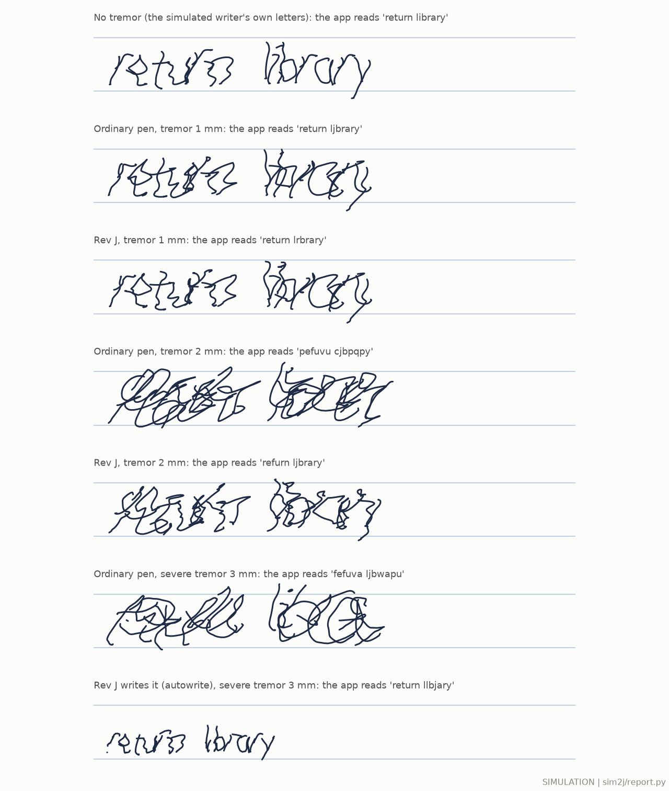

# Rev J in the physics simulator: closed-loop study, round 2

Status: final for this round, with unfinished parts marked (§11). 29 September 2026.

**Evidence status.** Every number here is a SIMULATION (sim2, MuJoCo 3.6) or a CALCULATION on synthetic writers and
synthetic tremor, on a PROPOSED DESIGN. Nothing was built or measured. sim2 ranks concepts (context of use COU-1,
`docs/sim_v2.md` §8.1) until EXP-V01, EXP-V02 and EXP-V04 calibrate it and EXP-V05 validates it. None of these numbers
is evidence of benefit to people. Labels: SIM (sim2 run), CALC (calculation), LIT/MFR (ledger id), ASSUMPTION,
PROPOSED DESIGN.

## 1. The answer in plain words

**Results cards.** For each condition: the ordinary pen → the Rev J pen. Means over the simulated test cases (SIM:
synthetic writers and synthetic tremor; not evidence of benefit to people). "Ordinary pen" is the Rev J pen with every
device off.

| Who (tremor at the hand, peak) | What Rev J does | Readable words out of 10: ordinary pen → Rev J | Error left at the tip, mm rms: ordinary pen → Rev J | Tremor-free writing changed | Writing time per charge | Cases |
|---|---|---|---|---|---|---|
| Essential tremor, mild (0.3 mm, 4–12 Hz) | the nose stays out of the way (tremor below what it acts on) | 10 → 10 (letters 9.9 → 9.8 of 10) | 0.13 → 0.13 | 0.00 mm | suspended | 18 |
| Essential tremor, moderate (1 mm, 8–12 Hz) | the nose cancels the tremor it detects | 10 → 10 (letters 9.4 → 9.8 of 10) | 0.41 → 0.28 | 0.00 mm | suspended | 12 |
| Essential tremor, strong (2 mm, 8–12 Hz) | the nose cancels the tremor it detects | 5.4 → 10 (letters 6.5 → 9.0 of 10) | 0.93 → 0.54 | 0.00 mm | suspended | 12 |
| Slow tremor (4 Hz, 1–2 mm) | nothing: the detector listens from 4.5 Hz up (4 Hz overlaps the writing's own rhythm) | 5.4 → 5.4 (letters 6.9 → 6.9 of 10) | 0.69 → 0.69 | 0.00 mm | suspended | 12 |
| Severe tremor (3 mm, 5 and 8 Hz), writing through it | the nose cancels what it can | 0.4 → 3.8 (letters 4.0 → 5.9) | 1.47 → 1.15 | 0.00 mm | suspended | 12 |
| Severe tremor (3 mm, 5 and 8 Hz), known text | the pen writes the text itself (autowrite, 2.5 mm letters) while the hand sweeps | 0.4 → 8.8 (letters 4.0 → 8.5) | 1.47 → 0.08 (to the planned letters) | not applicable (the pen writes) | suspended | 12 |
| Parkinson's, writing shrinks (five 10 mm loops), relaxed hand | the driven heel wheel pushes the pen along the template | not scored (loops) | last loop 6.6 → 8.6 mm high (target 10) | – | suspended | 2 |
| Parkinson's, writing shrinks (five 10 mm loops), lightly resisting hand | the driven heel wheel pushes the pen along the template | not scored (loops) | last loop 6.6 → 7.4 mm high (target 10) | – | suspended | 2 |
| Dysgraphia (badly formed letters), copying a sentence | the nose pulls the ink half-way toward the copybook letter | 9.7 → 9.7 (letters 9.6 → 9.7) | to the copybook letters: 0.83 → 0.64 | – | suspended | 6 |
| Dyslexia, led through the right spelling (hand relaxed) | the driven heel wheel pushes the pen along the right letters | 5.8 (writing alone) → 6.7 (letters 7.5 → 7.5) | to the right letters: 0.70 → 0.50 | – | suspended | 4 |
| Dyslexia, or anyone: a known text, no tremor | the pen writes it (autowrite) | – → 10 (letters 9.8) | 0.04 (to the planned letters) | not applicable (the pen writes) | suspended | 6 |
| Anyone, no tremor | should change nothing | – | – | 0.00 mm (nose); 0.41 mm with the heel wheel on | suspended | 6 |

- **Readable words:** the share of words the app reads correctly after its autocorrect, out of 10. Words per case:
  2 in the tremor text ("return library"), 5 in the autowrite text, 9 in the tracing text, 3 in the lead-through text.
  Letters read (out of 10) are in brackets. "Cases" counts simulated writer–seed–tremor combinations.
- **Left at the tip:** the rms distance between the ink and the same writer's tremor-free ink, in mm. The tremor at
  the hand is given as a peak; the hand and the paper absorb part of it (2 mm peak leaves 0.96 mm rms with the
  ordinary pen).
- **Writing time per charge: suspended.** In the simulation the nose draws about 2.3 W in every mode, mostly to hold
  the ball's static side load (below, §8.1). That would empty the 2.22 Wh cell in about an hour and heat the coil past
  120 °C within a minute of continuous writing (CALC). No writing time is claimed until that load is carried
  passively.

*The ink only, at true scale on 8 mm ruled lines, 0.3 mm line (SIM, test writer 0, seed 200; tremor at 8 Hz, severe
at 5 Hz). The first line is the same simulated writer with no tremor: the writer model's own letters are crude print,
a limit of the synthetic writers (§11), not of the pen. The ordinary pen is the Rev J pen with every device off. The
labels give what the app's recogniser reads. More: `fig_et.png`, `fig_autowrite.png`, `fig_guided.png`,
`fig_power.png` (each with a CSV twin).*

**Real tremor (study R, `real_data.md`).** Every tremor row above uses synthetic tremor. With real recorded tremor and real writing in the simpler hand–pen model HW1, the gated listening tracker and the Rev H tracker did not help (0.96–1.06 × of the ordinary pen's tip tremor; readable words 0.4 of 10 at the severe size, against 7.0 with perfect knowledge). The chosen tracker G4 has not been run on real inputs yet.

**What to do** (recommendations; the lead decides, §10):

- **Keep the chosen tremor tracker (G4).** At 8–12 Hz it takes out about a third of 1–2 mm tremor (0.63 of the
  ordinary pen's error), and it never moved tremor-free writing (0 mm, 5 writers).
- **Keep the heel wheel retracted by default** until its controller is redesigned. Switched on in its tremor mode it
  moved tremor-free writing by 0.40 mm (up to 0.50 mm; the rule is 0.025 mm), doubled the error at 0.3 mm tremor and
  pushed on the hand 8× harder. Deploy it only where it helped: Parkinson's "write big" practice and lead-through.
- **Filter the nose servo's position signal.** About 0.7 W of the nose's 2.3 W is the servo reacting to its own
  sensor noise: without that noise the simulated nose drew 0.74 W less (SIM). A filter to the servo's bandwidth should
  recover most of it (not simulated; REQ-RVJ-C04).
- **Carry the ball's static side load passively.** It is the largest real power item (1.6 W at 50°, CALC; the
  balanced-nib study takes it up).
- **For severe tremor (3 mm), let the pen write a known text (autowrite):** 8.8 of 10 words readable, against 0.4
  with the ordinary pen and 3.8 writing through with the nose.
- **Parkinson's small writing: only the driven heel wheel keeps the loops big to the end** (last loop 6.6 → 8.6 mm of
  10 with a relaxed hand, 7.4 mm with a lightly resisting one). The hand feels it (0.25–0.31 N rms).
- **Dysgraphia: a gentle nose helps.** Pulling the ink half-way toward the copybook letter brings it 23 % closer
  without making it harder to read. Stronger guidance (nose + wheel) gets closer still (0.27 mm) but the app then reads
  fewer words (6.3 of 10).
- **Dyslexia: prefer autowrite of the known text (10 of 10 words) to lead-through.** Lead-through by the driven wheel
  barely helped (5.8 → 6.7 words of 10): the letters came out distorted, and slowly (8 mm/s).
- **Page sensing: measure drift on paper before trusting the guidance and autowrite numbers.** They assume a 3 µm
  page sensor. With a DeltaPen-like error (LIT OPT-02: 68 µm mean, 24 µm median per 10 ms, on a tablet) autowrite
  stayed readable with 2–4× the ink error, but if the errors add up over a word the letters drift apart (7 of 10
  words). The tremor tracker did not depend on it (§6.7; 2 writers).

**What did not work, or was not done:**

- **Slow tremor (4 Hz):** no estimator acts on it (ai2's detector listens from 4.5 Hz up). With perfect knowledge the
  nose would remove 90 % of it, so the gap is in estimation.
- **ai2's gated listening tracker and ai2's TCN** both move tremor-free writing in sim2 (59 and 150 µm; rule 25 µm).
  The end-cap added nothing.
- **RL** was not trained (time); there is no RL-versus-model-based answer (§7). The environment runs (a 5 000-step
  smoke run); the full run would take about 2.4 CPU hours.
- **Unfinished:** the second test seed of the tremor grid, the wheel with a writer who has learned it, the domain
  randomisation population (§11). (Test writers 4 and 5 were run by the lead after the study; every tremor cell now has 6 cases.)
- **Writer model v2** (§3): speed and the speed–curvature law now match the literature; the 8–12 Hz content of
  tremor-free writing is still 6–8× too high. On v2 writers the listening estimators lose more than the chosen tracker
  (0.65 → 0.83 against 0.69 → 0.73).

**Why the nose uses 1.3–2.7 W instead of the budget's 0.06–0.38 W** (details §8.1):

- About half is real and is a design problem: the refill spring presses the ball on the paper along the nose; at a
  50° tilt the paper pushes the ball sideways (0.126 N), and the C1S nose's soft gimbal and short magnet arm need
  1.6 W of coil current to hold that, all the time the ball touches the paper (CALC). The budget's duty model left it
  out. At this power the coil would pass its 120 °C limit within about 45 s of continuous writing (CALC).
- About a third is mostly a simulator artefact: sim2's nose servo reacts to the position sensor's noise because the
  signal is not filtered (0.7 W, SIM). A filtered servo should not pay most of this (not simulated).
- The rest is ball friction and holding the nose steady while the hand moves (0.4 W, SIM).
- If the magnets are weaker than the image-method estimate (0.7×, the lead's range), the power doubles, the nose sags
  under the load and tremor-free writing degrades (62 % of letters read, one writer, SIM). Halving the spring force to
  0.075 N cuts the power to 1.3 W and let the tracker remove more tremor (SIM, one writer).

**Why some runs moved tremor-free writing by 0.04–0.50 mm** (details §8.2): never the chosen tracker (0 mm). The
0.32–0.50 mm comes from the heel wheel: switched on, it steers after the pen with a lag and its tyre resists sideways
motion, so fast turns in the letters change shape (real in the model; the simulated writer learned the pen with the
wheel retracted). The 0.11–0.21 mm comes from ai2's TCN, trained in another simulator, reading the Rev J pen's
signals as tremor (retraining needed). ai2's gated listening tracker moved it 0.04–0.08 mm because its fallback, the
Rev H tracker, locks onto fast writing. The hand model and the ball's stick-slip only amplify such differences.

## 2. What was simulated

- **Simulator.** sim2: H1 contact law at the ball and the skid ring, the H1 hand (HAP-26 lumped grip and arm) and, for
  a subset, sim2's articulated 'arm' hand. Step 50 µs (sim2 §5.3: 0.66 µm against 12.5 µs; 25 µs check in §9).
- **Pen.** The lead's Rev J integration, read at run time from `results/revJ/sim_params.json` and
  `results/revJ/layout.json` (CALC on a PROPOSED DESIGN). Each result file records the version used (`pen_source`:
  generation time and SHA-256). Every result file of this study used the same version: generated 13:28:08 UTC,
  SHA-256 prefix e4d769dd72035480 (the lead's late change: heel-drive force 0.369 N continuous / 0.603 N peak).

| Part | Value used (label) |
|---|---|
| Handle incl. heel drive | 68.89 g, centre of mass 89.8 mm from the tip, 8.53·10⁻⁵ kg·m² transverse (CALC; the lead's budget to 0.1 %) |
| Moving nose (C1S gimbal at 76.48 mm) | 16.6 g without the refill; refill, holder, ink drum and spring 1.74 g; tip-equivalent mass 1.50 g (CALC; study N's model: 2.10 g) |
| Nose flexure and actuator | 0.0028 N·m/rad; Km 0.656 N/√W at the magnets (image method, an upper bound); 2.47 Ω, 1.5 A, 3.7 V; 80 Hz servo (CALC / ASSUMPTION) |
| Nose travel | 6.57 mm at 50° (soft limit), stop at 7.07 mm (CALC) |
| Refill | 0.15 N spring, −2.19 N/m, 0.01 N friction; front stop follows the nose 0.3 mm beyond contact; pen lift 0.5 mm after 8 ms (ASSUMPTION) |
| Skid ring | contact radius 11.65 mm, open 120° on top (CALC / ASSUMPTION) |
| Heel wheel | 2 mm wheel at 12.0 mm in the ring plane (0.35 mm beyond the ring); 0.55 N preload on 200 N/m; tyre–paper μ drawn 0.6–1.2 per case; bristle tyre 1500 N/m; rolling 0.078; back-drive 0.03 N; 0.603 N peak, 0.369 N continuous; copper loss 4.30 W/N² (CALC from the motor data) |
| End-cap (optional) | 30.39 g slug at 152.7 mm, ±4 mm, 5 Hz flexures, damping ratio 0.05, Km 0.735 N/√W, 1 W peak; fixed parts in the handle (pen 129.4 g, CALC) |
| Sensors | IMU at 56.25 mm, 8.42 mm off the axis (LSM6DSV16X model); page sensor 1 kHz, 2 ms, 3 µm, valid to 2 mm lift; nose Hall 5.9 µm rms; refill slide 1 kHz, 2 µm |

- **Writers.** The v2 writers of §3 (the v1 writers of the handwriting study for comparison). Test writers 0–5, test
  seeds 200–203. Every rule was fixed first on tuning writers 100–103, seed 300 (`results/sim2j/rules.json`, frozen
  14:02 UTC before any test run). RL would train on writers 1000–1399 only (not run, §7). Which test writers each
  stage ran is stated with its results (the ET grid is incomplete, §6.1).
- **Tremor.** The project's tremor model on the hand path (H1), 4–12 Hz, 0.3–2 mm peak (severe: 3 mm); for the 'arm'
  hand, sim2's ET torque profile at the forearm and wrist, calibrated to the peak at the lifted tip.
- **Start of each ET run.** The pen rests on the paper for 4 s before writing, tremor on (ASSUMPTION: a person places
  the pen before writing; the tremor detectors need 2–4 s of signal). The ink of the rest is not scored.
- **Writer adaptation.** As in round 1, the writer has learned the pen: the hand path is corrected by iterative learning
  on the tremor-free run (3 passes, 10 Hz, time-advanced by the measured lag). sim2's stick-slip still leaves
  60–130 µm between the tremor-free ink and the intended letters (SIM). So the ink error is measured against the
  writer's own tremor-free ink letters ("clean ink"), and letters and words are read on the ink.
- **Metrics** (as the handwriting study). Ink error: rms distance of the in-contact ink to the clean-ink letters.
  Letters read: share read as the intended letter by the app's recogniser. Words: share read correctly after the app's
  autocorrect. Device share: share of the ink motion that comes from the device. Felt force: rms change of the grip
  force on the hand. Power: mean electrical power incl. 0.077 W electronics; battery 2.22 Wh usable. False correction:
  rms ink moved on tremor-free writing against the device-off pen with the same seed (project rule ≤ 25 µm).

## 3. Writer model v2 (CALC on synthetic writing)

- **What it is** (`sim2j/writers.py`). The handwriting study's glyph writers, re-timed. Along each pen-down piece the
  speed follows the two-thirds power law v = K (κ + κ₀)^(−1/3) (LIT CON-27), with an acceleration cap and smoothing in
  time; the writer stops at sharp corners (above 74°). Each writer draws a target speed from N(30.5, 7.9) mm/s, clipped
  to 18–45 mm/s (LIT CON-20); K is calibrated so the mean pen-down speed meets it. Letters have an x-height of 3.65 mm
  (CALC from LIT PDT-06's 5.0 mm median letter height).
- **Fit.** Seven shape parameters by Nelder–Mead on fitting writers 1000–1009 against CON-20, CON-24, CON-25 and CON-27
  (`results/sim2j/writer_fit.json`). Checked on held-out writers 1010–1019 and on test writers 0–5
  (`results/sim2j/writers.json`, `fig_writers.png`).

| Quantity (pen-down, intended path, "return library books by friday") | Target (LIT) | v1, test 0–5 | v2, held-out 1010–1019 | v2, test 0–5 |
|---|---|---|---|---|
| Mean speed | 30.5 mm/s (CON-20) | 18.3 mm/s | 26.8 mm/s | 31.0 mm/s |
| Median stroke (between speed minima) | 90–150 ms (CON-24) | 151 ms | 118 ms | 105 ms |
| Share of velocity energy at 8–12 Hz | 1.3–1.7 % (CON-25) | 17.3 % | 12.2 % | 10.1 % |
| 50 % / 90 % of that energy below | 3.1 / 4.9 Hz (CON-25) | 4.9 / 11.2 Hz | 4.4 / 10.7 Hz | 3.9 / 10.7 Hz |
| Speed–curvature exponent (fitted slope) | 2/3 (CON-27) | 1.00 | 0.80 | 0.80 |

- **What the refit fixed.** Speed (18 → 27–31 mm/s) and the speed–curvature law (slope 1.00 → 0.80). Stroke times stay
  in range.
- **What it did not fix.** The spectrum: 10–12 % of the velocity energy at 8–12 Hz, six to eight times the target
  (v1: 17 %).
  - Likely reason (not tested): CON-25 recorded large characters (about 14 mm), whose strokes are slower. At 3.65 mm and
    30 mm/s the glyphs' tight turns carry more fast motion. The target may not apply to small letters.
  - Consequence: tremor-free writing contains spectral lines a tremor detector can take for tremor. On the intended
    paths alone ai2's detector reaches peak ratios of 4–6 on v2 writers and 14 on one v1 writer (threshold 5; CALC).
    sim2's touchdown adds a 9.4 Hz line at the start of writing (SIM, tuning writer 100).
- **How the refit changes tremor separation** (`results/sim2j/writer_cmp.json`; test writers 0–2, their first test
  seed, 8 Hz × 1 mm and tremor-free writing, the same pen and tremor; SIM):

| Ratio to the device-off pen (lower is better) | v1 writers | v2 writers |
|---|---|---|
| Device off: ink error / letters read | 472 µm / 85 % | 434 µm / 92 % |
| Chosen tracker G4 | 0.69 | 0.73 |
| The same tracker without the runaway guard (detector gate kept) | 0.69 | 0.73 |
| ai2's gated listening tracker (GL) | 0.65 | 0.83 |
| Perfect knowledge (limit of the mechanism) | 0.10 | 0.14 |
| False correction on tremor-free writing: G4 / GL | 0 / 35 µm | 0 / 62 µm |

- On the refitted writers the guarded tracker loses a little (0.69 → 0.73) and ai2's listening tracker loses more
  (0.65 → 0.83), and its false correction almost doubles (35 → 62 µm). The listening model takes more of the faster
  v2 writing for tremor. Findings on v1 writers (round 1 and ai2) are therefore optimistic for listening estimators.

## 4. Controllers, and the rules fixed before the test

### 4.1 Tremor estimation: what was compared (tuning writers 100–103, seed 300; SIM)

- **G0: the Rev H tracker as built** (AKF re-tuned in round 1). On tremor-free v2 writing its frequency estimate runs
  to its bound and it moves the ink by 51–141 µm (4 writers; rule ≤ 25 µm).
- **G3/G4: the guarded tracker** (this study, `sim2j/akf_online.py`). The same AKF, run tick by tick (bit-exact against
  fusion's batch version), plus a runaway guard (re-seed the frequency at the detector's line or at 6.3 Hz, then lock
  it within ±1 Hz of the line) and ai2's tremor-line detector as a gate on the output. G3 uses ai2's threshold (open
  above a peak ratio of 5 for 0.5 s); G4 a stricter one (open above 8, close below 4).
- **GL: ai2's gated listening tracker (DEC-042), as built.** ai2's detector and amplitude gate weight a listening AKF;
  the Rev H tracker as built is the fallback.
- **GLG: gated listening with G4 as the fallback** (this study).
- The detectors see page-sensor samples taken while the ball is on the paper. The Rev J page sensor stays valid up to
  2 mm lift; with air moves in its input ai2's detector opened on tremor-free writing (SIM, tuning writer 100).

| Tuning cell (4 writers) | Device off: ink error | G3 | **G4 (chosen)** | GL (ai2, as built) | GLG |
|---|---|---|---|---|---|
| 6 Hz, 1 mm | 414 µm | 0.96 | 0.96 | 1.00 | 0.99 |
| 8 Hz, 0.3 mm | 117 µm | 1.03 | 1.02 | 1.16 | 1.02 |
| 8 Hz, 1 mm | 425 µm | 0.71 | 0.77 | 0.82 | 0.85 |
| 8 Hz, 2 mm | 892 µm | 0.58 | 0.58 | 0.55 | 0.55 |
| 10 Hz, 1 mm | 411 µm | 0.56 | 0.56 | 0.75 | 0.75 |
| False correction, mean (max) | – | 0 (0) µm | 0 (0) µm | 76 (141) µm | 0 (0) µm |
| Rules R1 (≤ 25 µm) and R2 (0.3 mm ratio ≤ 1.02) | – | R2 fails | pass | both fail | pass |

Ratios are ink error with the controller / ink error of the device-off pen in the same case (SIM). Rule (written
before the runs, `sim2j/tuning.py`): among the variants that pass R1 and R2, the lowest mean ratio at 1–2 mm. **G4**
(0.72) beat GLG (0.78). Letters read at 8 Hz, 2 mm: 67 % device off, 94 % with G4 (SIM).

- **ai2's gated listening does not hold in sim2 as built.** Its fallback (the Rev H tracker as built) fails the
  false-correction rule on v2 writing, and its 0.3 mm result is worse than the device-off pen. With the guarded
  fallback it passes, but it is worse than G4 at 1 mm.
- **The unfiltered listening output cannot be followed by the C1S nose.** At lag 0 the listening prediction carries
  15–200 Hz content (p99 command speed 0.33 m/s at 10 Hz, 1 mm; SIM). The nose then missed its command by 890 µm rms and
  the ink moved 1.6× more than with the device off (tuning writer 100). With the Rev H tracker's 64 Hz output filter
  (its delay added to the prediction horizon) it helps; the table uses that version. ai2's HW1 nose model did not show
  this.
- **ai2's causal TCN (DEC-043 shadow candidate)** was run on the pen's own sensor record and replayed as the nose
  command (`sim2j/learned_replay.py`; valid here because the nose's action leaves the handle's motion unchanged within
  1 %). Without retraining, on tuning writer 100: 0.66 at 10 Hz 1 mm and 0.73 at 8 Hz 1 mm, but 1.56 at 0.3 mm and
  184 µm false correction on tremor-free writing (HW1: 19.3 µm). It does not transfer. Test results in §6.1.
- **Delayed ink** was not re-run: ai2 found it not worth its cost (DEC-042/043 context) and the lead asked for at most
  25 ms or none.

### 4.2 The other controllers

- **Coordinated nose + wheel (ET).** The heel wheel in its tremor mode: it steers to follow the pen's low-passed
  direction of travel and brakes along it (study D's gains); the nose cancels what the tracker still sees.
- **End-cap.** Phasor feed-forward on the tracker's estimate through the end-cap's linearised plant (internal model),
  gain 0.75 (study K's rule).
- **Guidance (dysgraphia tracing, PD loops).** The nose pulls the ink toward the template (capture 2 mm, drop after
  2.5 mm for 60 ms, HW1's law); the wheel steers along the template (Stanley law, study D's gains); both together.
- **Lead-through (dyslexia).** A relaxed writer (the arm's aim follows the hand in 0.25 s while the pen is down: the
  drive study's model); the driven wheel pushes along the target letters (0.167 N + speed loop to 20 mm/s); the nose adds
  the detail.
- **Autowrite.** nose2's planner and firmware (plan inside 5.5 mm of reach, 1.25× the line speed, pen lift 0.5 mm with
  8 ms switching); the hand sweeps along the line.
- **Supervisor.** Wheel force cap min(0.5 N, 0.603 N, 0.8 μ̂ N), slew 20 N/s, yield after 4 mm for 0.3 s, slip detection.

### 4.3 Model fixes made during this study (all in `sim2j/`)

- IMU lever arm: the firmware removes α × r with the IMU's full position (56.25 mm along, 8.42 mm across the axis).
- Detector input: ball-on-paper samples only (see 4.1).
- Stroke matching: a touchdown starts the template stroke whose start is nearest (sim2 starts with the ball on the
  paper and bounces at touchdown, so counting touchdowns skipped strokes and the lead-through followed the wrong stroke).
- False correction and device share are measured against the device-off run with the same seed (the Hall noise enters
  the physics; stick-slip amplifies any difference).

## 5. Verification against round 1 (SIM against SIM; `results/sim2j/verify.json`)

The same tasks, writers (v1, as round 1) and seed (200) in sim2 and in the round-1 models. HW1 is 2-D: the nose moves
the ink in the page plane, with no tilt, no refill spring geometry, no rotation in the grip and a simpler contact.
sim2 is 3-D with the H1 contact law and the pen's mass properties.

**Autowrite** ("return library books by friday" at 2.5 mm, test writers 0–5):

| | nose2 in HW1 (Rev J, results/nose2) | sim2, round-1 C1S pen (study N, no heel drive) | sim2, the lead's Rev J pen |
|---|---|---|---|
| No tremor: ink error | 29 µm | 41 µm | 46 µm |
| No tremor: letters / words read | 99 % / 100 % | 98 % / 100 % | 98 % / 100 % |
| 1 mm at 8 Hz: ink error | 36 µm | 48 µm | 54 µm |
| 1 mm at 8 Hz: letters / words read | 99 % / 100 % | 97 % / 93 % | 97 % / 97 % |
| Nose coil power | 0.09–0.17 W | 1.33 W | 2.13 W |

- Agreement: the order of the ink error (tens of µm) and near-ceiling reading hold in both simulators.
- Differences: sim2's ink error is 1.4–1.6× HW1's. The likely reasons are the ball's stick-slip on the paper and the
  refill's slide and front stop, which HW1 does not have. The coil power is 8–24× HW1's because sim2 includes the
  refill spring's side load at the ball (§8), which HW1 does not model.

**Dysgraphia tracing** (the drive study's task a, v1 learners; HW1-D: 48 cases, sim2: 6 writers):

| | HW1-D: target error | letters / words read | sim2: target error | letters / words read |
|---|---|---|---|---|
| Nothing on | 599 µm | 87 % / 76 % | 563 µm | 94 % / 90 % |
| Wheel steers along the template | 432 µm | 83 % / 69 % | 392 µm | 76 % / 57 % |
| Wheel + nose guidance | 87 µm | 77 % / 58 % | 228 µm | 66 % / 52 % |

- Agreement: the same ranking, and in both the guidance pulls the ink toward the template while fewer letters are read
  (the template letters are the copybook's, not the learner's own: the recogniser was built on the learner's writing).
- Differences: the nose's fine correction removes less in sim2 (228 against 87 µm). In sim2 the nose also fights the
  ball's stick-slip and the static ball load. Area-coverage agrees (0.86 against 0.87).

## 6. Outcomes per condition (SIM; the test writers and seeds of each run are stated with it)

### 6.1 Essential tremor

Each case: a v2 test writer writes "return library" after a 4 s rest on the paper, with hand tremor of one frequency
and amplitude, the writer's first test seed. **Coverage:** writers 0–5 ran every cell on their first test seed (writers 4
and 5 were run one per process by the lead after the study, because a single process grew to 11.5 GB); the second seed
was not run (§11). So a cell has 6 cases. "Ordinary pen" is the Rev J pen with the nose held centred by its servo and the wheel
retracted: its ink moves like an ordinary pen's (it still draws the holding power, §8.1). Numbers: the ink error with
the controller divided by the ordinary pen's in the same case (lower is better), then the letters the app reads.

| Tremor (cases) | Ordinary pen: ink error · letters read | Nose, chosen tracker (G4) | Nose + heel wheel | Nose + wheel + end-cap | Nose, ai2 GL | Nose, ai2 TCN (replay) | Limit: perfect knowledge |
|---|---|---|---|---|---|---|---|
| 4 Hz, 0.3 mm (6) | 141 µm · 99 % | 1.00 · 99 % | 1.95 · 96 % | 2.20 · 97 % | 1.06 · 100 % | 1.35 · 99 % | 0.29 · 100 % |
| 4 Hz, 1 mm (6) | 417 µm · 82 % | 1.00 · 82 % | 0.99 · 71 % | 1.11 · 72 % | 1.04 · 85 % | 0.97 · 78 % | 0.12 · 99 % |
| 4 Hz, 2 mm (6) | 970 µm · 55 % | 1.00 · 55 % | 0.73 · 54 % | 0.75 · 58 % | 0.97 · 55 % | not run | 0.07 · 99 % |
| 8 Hz, 0.3 mm (6) | 127 µm · 97 % | 0.97 · 97 % | 2.25 · 96 % | 2.02 · 96 % | 1.05 · 97 % | 1.27 · 95 % | 0.34 · 100 % |
| 8 Hz, 1 mm (6) | 434 µm · 94 % | 0.71 · 97 % | 0.71 · 95 % | 0.73 · 92 % | 0.82 · 94 % | 0.72 · 87 % | 0.13 · 99 % |
| 8 Hz, 2 mm (6) | 944 µm · 68 % | 0.59 · 87 % | 0.53 · 83 % | 0.43 · 78 % | 0.55 · 94 % | not run | 0.10 · 99 % |
| 12 Hz, 0.3 mm (6) | 109 µm · 100 % | 1.07 · 99 % | 2.44 · 96 % | 2.43 · 97 % | 1.27 · 100 % | 1.43 · 96 % | 0.41 · 100 % |
| 12 Hz, 1 mm (6) | 384 µm · 94 % | 0.64 · 99 % | 0.79 · 96 % | 0.92 · 82 % | 0.67 · 97 % | 0.65 · 97 % | 0.18 · 99 % |
| 12 Hz, 2 mm (6) | 921 µm · 63 % | 0.56 · 92 % | 0.55 · 85 % | 0.61 · 82 % | 0.61 · 85 % | not run | 0.20 · 96 % |
| Tremor-free writing moved, mean (max), writers 0–5 | – | **0 (0) µm** | 410 (503) µm | 417 (497) µm | 54 (84) µm | 150 (206) µm | 0 µm by definition |
| Felt grip-force change, rms, 8–12 Hz × 1–2 mm | – | 21 mN | 164 mN | 263 mN | 29 mN | 20 mN | 21 mN |
| Mean electrical power, all tremor runs | 2.32 W | 2.33 W | 2.29 W | 2.35 W | 2.35 W | 2.60 W | 2.30 W |

All SIM (`results/sim2j/et.json`, rows in `sim2j/build/et_rows.json`). The TCN was not run at 2 mm (outside its
training range, ai2).

**What the table says** (means over cases; 95 % bootstrap intervals over cases in brackets; SIM):

- **The chosen tracker helps at 8–12 Hz and 1–2 mm:** 0.63 of the ordinary pen's ink error (0.59–0.66; 24 cases).
  Letters read 79 % → 94 %; words read after autocorrect 77 % → 100 %. The nose supplies about a third of the ink
  motion (device share 0.34).
- **It does no harm and no good at 0.3 mm:** 1.01 (0.98–1.04; 18 cases), inside the tuning rule (≤ 1.02 at 8 Hz).
- **It does nothing at 4 Hz:** 1.00 (12 cases). ai2's detector listens from 4.5 Hz up, so it never opens. Perfect
  knowledge would remove 91 % (0.09), so the nose could do it; the estimator cannot, because 4 Hz sits inside the
  writing's own rhythm (90 % of writing's velocity energy lies below 4.9 Hz, LIT CON-25). Open issue (§11).
- **The estimator, not the nose, is the limit.** Perfect knowledge reaches 0.16 at 8–12 Hz × 1–2 mm (0.14–0.17) and
  0.35 at 0.3 mm.
- **The heel wheel in its tremor mode should stay retracted by default.** It helps a little at 8 Hz × 2 mm (0.53 against
  0.59) and at 4 Hz × 2 mm (0.73, where the nose does nothing); over 8–12 Hz × 1–2 mm it gives 0.65 against 0.63. But it
  multiplies the error at 0.3 mm by 2.21, moves tremor-free writing by 0.41 mm (max 0.50 mm; rule 25 µm), and pushes on
  the hand about 8× more (164 against 21 mN rms). Recommendation: retracted by default until its controller is redesigned (§10).
- **The end-cap adds nothing here.** Nose + wheel + end-cap: 0.68 at 8–12 Hz × 1–2 mm against 0.65 without it, fewer
  letters read (84 % against 90 %) and more felt force (263 mN). With every device off the heavier end-cap pen (129 g)
  writes better at 4 Hz (361 against 417 µm at 1 mm) and worse at 12 Hz × 2 mm (1132 against 921 µm).
- **ai2's gated listening tracker (GL) as built** fails both rules on the test writers too: 1.13 at 0.3 mm and 54 µm
  (max 84 µm) on tremor-free writing. At 8–12 Hz × 1–2 mm it is close to G4 (0.66 against 0.63).
- **ai2's TCN, replayed without retraining,** fails both rules: 1.35 at 0.3 mm and 150 µm (max 206 µm) on tremor-free
  writing; 0.69 at 8–12 Hz × 1 mm (12 cases).
- **Power does not depend on the controller** (2.3 W in every column): it is mostly the nose holding the ball's static
  side load (§8.1), paid by the "ordinary pen" of the simulation too.

### 6.2 Severe tremor: writing through it, or letting the pen write

Test writers 0–5, first test seed, 3 mm peak tremor at 5 Hz and at 8 Hz (12 cases per column; SIM,
`results/sim2j/autowrite.json`).

- **Writing through it** ("return library", 2 words; ratios to the ordinary pen in the same case):

| 3 mm tremor | Ordinary pen: ink error · letters · words | Nose, chosen tracker | Nose + heel wheel | Limit: perfect knowledge |
|---|---|---|---|---|
| 5 Hz | 1.55 mm · 40 % · 8 % | 0.96 · 42 % · 8 % | 0.70 · 37 % · 17 % | 0.06 · 99 % · 100 % |
| 8 Hz | 1.38 mm · 41 % · 0 % | 0.59 · 76 % · 67 % | 0.47 · 78 % · 67 % | 0.10 · 99 % · 100 % |
| Felt grip-force change, rms | – | 9 mN | 232 mN | 26 mN |

- **Letting the pen write** (autowrite: the hand sweeps along the line, the nose writes the known text "return library
  books by friday" at 2.5 mm and lifts the ball between strokes; nose2's planner; 6 cases per row):

| Tremor | Ink error to the planned letters | Letters read | Words read (after autocorrect) | Speed |
|---|---|---|---|---|
| none | 45 µm | 98 % | 100 % | 3.5 letters/s |
| 1 mm, 8 Hz | 55 µm | 97 % | 100 % | 3.5 letters/s |
| 2 mm, 5 / 8 Hz | 53 / 73 µm | 94 / 96 % | 97 / 100 % | 3.6 letters/s |
| 3 mm, 5 / 8 Hz | 67 / 83 µm | 82 / 88 % | 80 / 97 % | 3.6 letters/s |

- **Answer.** At 3 mm the ordinary pen's writing is unreadable (4 % of words). Writing through it with the nose helps
  at 8 Hz (67 % of words) but not at 5 Hz (8 %), where the tracker hardly acts (0.96). Autowrite of a known text stays
  readable (88 % of words at 3 mm). The nose then works near the end of its travel (peak 6.55 of 6.57 mm; above
  5.7 mm about 1 % of the time), so 3 mm is about as far as autowrite goes with this nose.
- The misreadings at 3 mm are mostly the letter i read as l or z ("llbrary", "frlday"): the i-dot, a short separate
  stroke, is lost or misplaced (the planned letters themselves read 99 %).
- The heel wheel adds a little at 5 Hz (0.70) and pushes on the hand (232 mN rms).
- Power is 2.3 W in every case (the static load, §8.1).

### 6.3 Parkinson's "write big" loops

A micrographia-like writer draws five loops against a 10 mm template; the writer's loops shrink from 0.8 to 0.6 of the
target (drive study task b). Hands: relaxed (HAP-26 nominal arm) and lightly resisting (the HAP-26 upper 95 % CI arm).
Test seeds 200–201.

| Hand (2 seeds each) | Controller | Height of all loops, % of target | Last loop, % of target | Felt force rms | Wheel force rms |
|---|---|---|---|---|---|
| Relaxed | Nothing on | 79 % | 66 % | – | – |
| Relaxed | Wheel steers along the template | 102 % | 55 % | 234 mN | 302 mN |
| Relaxed | Wheel steers + nose guides | 100 % | 55 % | 227 mN | 295 mN |
| Relaxed | **Driven wheel pushes along the template (lead mode)** | 100 % | **86 %** | 248 mN | 286 mN |
| Relaxed | Nose guides alone | 96 % | 66 % | 4 mN | – |
| Resisting | Nothing on | 81 % | 66 % | – | – |
| Resisting | Wheel steers along the template | 97 % | 68 % | 311 mN | 379 mN |
| Resisting | Wheel steers + nose guides | 101 % | 68 % | 310 mN | 379 mN |
| Resisting | **Driven wheel pushes along the template** | 95 % | **74 %** | 306 mN | 353 mN |
| Resisting | Nose guides alone | 96 % | 66 % | 16 mN | – |

SIM, `results/sim2j/guided.json`. Power 2.7–2.9 W in every row (the static load, §8.1).

- **Only the driven wheel keeps the last loop big:** 66 % → 86 % of the target with a relaxed hand, 74 % with a lightly
  resisting one. Steering alone makes the first loops bigger (the height of all loops reaches 100 %) but not the last
  one. The nose alone does not: likely because its guidance lets go when the ink is more than 2.5 mm from the template
  for 60 ms (HW1's capture law, §4.2), and the last loops are 3–4 mm too small (not isolated).
- The hand feels it: 0.25–0.31 N rms of changed grip force with the wheel on.
- The "ink to template" distance of the drive study's metric is not reported: in this setup the ink and the template
  are offset by 7–10 mm (a registration difference between the two frames, not fixed), so it does not measure the fit.

### 6.4 Dysgraphia tracing

Dysgraphia-like v2 learners copy "a big dog dug a deep pit by the pond" (the handwriting study's error model); the
template is the copybook letter anchored at the learner's touchdown. Test writers 0–5, seed 200.

| Controller (6 writers) | Distance to the copybook letters | Letters read | Words read (after autocorrect) | Area covered | Device share | Felt force rms |
|---|---|---|---|---|---|---|
| Nothing on | 833 µm | 96 % | 97 % | 0.57 | – | – |
| **Nose pulls half-way (gain 0.5)** | 640 µm | 97 % | 97 % | 0.72 | 0.24 | 7 mN |
| Nose pulls fully | 594 µm | 88 % | 85 % | 0.85 | 0.39 | 18 mN |
| Wheel steers along the template | 521 µm | 81 % | 70 % | 0.75 | 0.33 | 136 mN |
| Wheel + nose | 273 µm | 72 % | 63 % | 0.86 | 0.43 | 134 mN |

SIM, `results/sim2j/guided.json` (9 words per case; power 2.3–2.4 W in every row).

- **More guidance brings the ink closer to the copybook letters (833 → 273 µm) and the app reads fewer of them
  (97 % → 63 % of words).** The app's recogniser was built on each learner's own writing (§5), so letters pushed toward
  the copybook shape read worse to it. A reader trained on copybook letters might score them higher (not tested).
- **The half-way nose is the setting to prefer:** 23 % closer to the copybook letters with no loss of readability, and
  almost nothing felt at the hand (7 mN).
- The wheel pushes on the hand (0.13 N rms) and costs readability.

### 6.5 Dyslexia: lead-through, and autowrite of a known text

- Lead-through: a dyslexia-like learner (who misspells "deep" with a vowel substitution; the app reads "deap")
  relaxes the hand; the pen goes down at each stroke of the correct letters of "dug a deep", and the driven heel
  wheel pushes it along (with the nose adding the detail). Test writers 0–3, seed 200.
- Autowrite: the pen writes a known text itself (§6.2).

| Controller (4 writers, "dug a deep") | Distance to the right letters | Letters read | Words read (after autocorrect) | Pen speed | Felt force rms |
|---|---|---|---|---|---|
| The learner writes alone (misspells "deep") | 698 µm | 75 % | 58 % | – | – |
| Hand relaxed, device off | 222 µm (few strokes) | 3 % | 0 % | 3.7 mm/s | – |
| **Driven wheel leads** | 504 µm | 75 % | 67 % | 7.8 mm/s | 120 mN |
| Driven wheel leads + nose adds the detail | 454 µm | 72 % | 50 % | 8.7 mm/s | 120 mN |

SIM, `results/sim2j/guided.json` (3 words per case; power 2.6–2.8 W).

- **Lead-through moves the pen along the right letters (698 → 504 µm) but the letters come out distorted**: the app
  read "dug a dobb", "dug a dwwp", "dug a deep". Words read rise only from 5.8 to 6.7 of 10; the nose's detail does
  not help (5.0). It is slow (8 mm/s against the writers' 31 mm/s).
- **Autowrite of a known text does what lead-through was meant to do:** 10 of 10 words read with no tremor (§6.2).

### 6.6 The other hand model and the domain randomisation

- **sim2's articulated 'arm' hand** (forearm–wrist–hand chain with its own writer controller; the tremor enters as
  joint torques calibrated to 1 mm peak at the lifted tip; 8 Hz; writers 0–1, first test seed; SIM,
  `results/sim2j/arm.json`):

| 8 Hz × 1 mm, writers 0–1 | Ordinary pen | Nose, chosen tracker | Nose + heel wheel | Limit: perfect knowledge |
|---|---|---|---|---|
| 'Arm' hand: ink error (ratio) · letters read | 430 µm · 85 % | 0.63 · 85 % | 0.70 · 81 % | 0.13 · 96 % |
| H1 hand, the same writers and seeds (§6.1) | 441 / 439 µm | 0.85 / 0.60 | – | 0.13 / 0.13 |
| 'Arm' hand: tremor-free writing moved | – | 0 µm | – | – |

  The ranking holds with the other hand model: the chosen tracker helps about as much (0.63 against 0.73 with the H1
  hand for these two writers), the wheel adds nothing, perfect knowledge reaches 0.13, and tremor-free writing is not
  moved. Two writers only.

- **Domain randomisation population: not run** (§11). Every result above is for the nominal Rev J pen; the spread
  over the lead's tolerances (Km 0.7–1.0, spring 0.12–0.18 N, friction, sensors) is not known. §8.1 shows the two
  factors that matter most for power (Km and the spring).

### 6.7 Page sensing: which results rest on the 3 µm page sensor

- **What uses the page sensor.** The tremor tracker (its position input and ai2's detector), the guidance (the nose
  pulls the ink toward the template by the measured position, so a position error goes straight into the ink), the
  wheel's steering, and autowrite (the planner places the letters by the measured position). sim2 assumes 3 µm rms
  white noise per 1 kHz sample (ASSUMPTION). The ET, tracing, lead-through and autowrite numbers above all rest on it.
- **What a measured pen shows.** DeltaPen (LIT OPT-02; a research pen with an optical-flow sensor at the tip, on a
  Wacom tablet surface, not paper) had a translation error per 10 ms window of 68.3 µm mean and 23.6 µm median; its
  drift at rest was 2.6 mm/min.
- **Check (SIM, `results/sim2j/page_noise.json`; ASSUMPTION for the error model).** Each 10 ms window gets an error
  drawn from a lognormal with that median and mean, in a random direction, on top of the 3 µm noise. "Held": the error
  is a position error for that window only (errors do not add up). "Adding up": the errors accumulate, as dead
  reckoning with no correction would (far more drift than DeltaPen showed: an upper bound). Test writers 0–1, first
  seed, the chosen tracker; autowrite of the known text.

| Writers 0–1 (2 cases per cell) | sim2's 3 µm white noise | DeltaPen-like, held | DeltaPen-like, adding up |
|---|---|---|---|
| ET, tremor-free writing moved (chosen tracker) | 0 µm | 0 µm | 0 µm |
| ET, 8 Hz × 0.3 mm: ratio to the ordinary pen | 0.98 | 0.98 | 1.00 |
| ET, 8 Hz × 1 mm: ratio to the ordinary pen | 0.73 | 0.62 | 0.65 |
| Autowrite, no tremor: ink error · letters · words | 49 µm · 96 % · 100 % | 114 µm · 94 % · 100 % | 2.24 mm · 75 % · 70 % |
| Autowrite, 8 Hz × 1 mm: ink error · letters · words | 62 µm · 98 % · 100 % | 196 µm · 90 % · 100 % | 2.13 mm · 76 % · 70 % |

- **The tremor tracker does not depend on the 3 µm figure** (2 writers): no false correction in any model, and no loss
  at 0.3 or 1 mm. Why it is robust was not analysed (it fuses the page samples with the IMU, and its detector gate
  stayed shut on tremor-free writing). Writer 0's 1 mm ratio changed 0.86 → 0.64 between models: small differences
  move sim2's stick-slip; this is not a real gain.
- **Autowrite and guidance do depend on it.** They place the ink by the measured position, so the page error goes
  straight into the ink. With DeltaPen-like errors that do not add up, autowrite's ink error rose 2–4× (to
  114–235 µm) and the text stayed readable (10 of 10 words). If the errors add up (dead reckoning), the letters drift
  apart by 1.5–3 mm and 7 of 10 words are read. Tracing and lead-through (not re-run) use the page position the same
  way as autowrite.
- So the property that matters is **drift over a word**, more than the noise per sample (REQ-RVJ-C05). The 3 µm
  figure makes the autowrite, tracing and lead-through ink errors of §6.2–6.5 optimistic by up to 2–4×.

## 7. RL in the physics simulator (`sim2j/rl.py`; ai2's EXP-L05 in closed loop)

- **Environment** (Gymnasium on sim2, 50 µs physics, the firmware and online sensors exactly as in the test). An episode:
  the pen rests on the paper for 3 s with the chosen tracker running (the policy's action held at 0), then writes 5 s
  of a training writer's sentence (writers 1000–1399 only) while the policy acts at 250 Hz. One episode in three is
  tremor-free. Three episodes share a plant draw and one tremor-free, nose-held reference run.
- **Domain randomisation.** sim2's 25 factors (grip, hand, tremor 4–12 Hz and 0.1–2 mm, friction, sensors, tolerances,
  posture; `sim2/env.py`) mapped onto Rev J, plus the lead's Rev J factors: refill spring 0.12–0.18 N, Km scale 0.7–1.0,
  magnetic negative stiffness 0–0.00165 N·m/rad, tyre friction, wheel preload (`results/revJ/sim_params.json`).
- **Observation** (19 values, the pen's own signals only): the tracker's estimate and its ungated oscillator, frequency,
  authority and amplitude; the detector's gate, log peak ratio and line frequency; page-sensor velocity (raw and 3 Hz);
  ball contact; page-sensor validity; the previous action.
- **Action** (3 values in [−1, 1], a residual on the model-based tracker): a gain (1 + a₀) on the gated estimate, a
  weight max(0, a₁) on the ungated oscillator (an arbiter that can act before the gate opens), and a quarter-period
  phase term 0.5 a₂. a = 0 is the model-based controller.
- **Reward.** −(|ink − reference ink| / 0.3 mm)² while the ball is on the paper, − 0.005 |a|². In tremor-free episodes
  this is the false correction itself: the closed-loop false-correction constraint of EXP-L05, as a penalty in training
  and as a hard rule in selection.
- **Training: NOT DONE.** Planned: Stable-Baselines3 PPO, MLP 64-64 tanh, 400 000 steps, one process, resumable
  (`python3 -m sim2j.run_study --stages rl_train rl_select rl_test`). When the lead cut the study to one process and a
  hand-back within hours, the remaining time went to the conditions the user asked about. A smoke run checked the
  environment: 5 000 PPO steps (4 episodes, 48 s of simulated writing) took 74 s on one CPU core, 68 steps/s
  (`sim2j/build/rl_quick/`). At that rate the planned 400 000 steps take about 1.6 CPU hours, and checkpoint
  selection and the test about 0.8 more (estimate): about 2.4 CPU hours in all. The untrained policy moved tremor-free
  writing by 28 and 76 µm in its two tremor-free episodes (random exploration; the reward penalises exactly this).
- **Selection** (rule frozen in `results/sim2j/rules.json` before any test run): the last checkpoints on tuning writers
  100–103, seeds 300–303; pass S1 (false correction ≤ 25 µm mean, every case ≤ 50 µm) and S2 (no worse than the
  model-based tracker at 0.3 mm); among those, the lowest ink error at 1–2 mm; otherwise RL is not adopted. Not run.
- **RL against model-based: no result.** The model-based tracker G4 stays the proposal (DEC-047). What RL could gain
  is bounded by the gap between G4 (0.63) and perfect knowledge (0.16) at 8–12 Hz × 1–2 mm, and at 4 Hz, where G4
  does nothing (§6.1).

## 8. Why the nose uses 1.3–2.7 W, and why some runs moved clean writing

The integrated budget (`results/revJ/budgets.json`, study N's duty model) gives the nose 64–376 mW. sim2 gives
1.3–2.7 W. The budget's model counts the nose's inertia, its flexure, ball drag and gravity. It leaves out the two
largest terms below.

### 8.1 Where the nose's power goes (SIM, writer 0, tremor-free writing, nose held; `results/sim2j/power_split.json`)

| Run (4 s rest on the paper + 7.5 s of writing) | Nose copper loss, mean | While the ball is on the paper | While lifted |
|---|---|---|---|
| Nominal Rev J pen | 2.25 W | 2.68 W | 1.20 W |
| The same without Hall-sensor noise | 1.51 W | 2.01 W | 0.31 W |
| The same without sim2's feed-forward bias current (the servo's feedback holds the load instead) | 2.25 W | 2.68 W | 1.20 W |
| Refill spring 0.075 N instead of 0.15 N | 1.32 W | 1.28 W | 1.38 W |
| Km 0.7× (the lead's lower bound) with the 0.075 N spring | 2.43 W | – | – |

- **About 1.1 W: the refill spring's side load at the ball (real physics, a design problem).**
  - The spring (0.15 N, along the nose) presses the ball on the paper. At tilt θ the paper pushes back with a side
    component F_c·cot θ: 0.126 N at 50° (CALC).
  - The C1S gimbal is soft (0.0028 N·m/rad), so the coils must hold the resulting 9.6 mN·m. With Km 0.656 N/√W on the
    11.5 mm magnet arm that is 0.81 A and 1.62 W while the ball is on the paper (CALC); about 1.1 W over a run with
    70 % pen-down time. It scales with F_c² (0.41 W at 0.075 N) and with cot²θ (4.7 W at 35°, 0.17 W at 75°; CALC, as the table below).
  - The servo holds this load by feedback whether or not sim2's feed-forward bias is on (the same 2.25 W either way).
  - Rev H's 34 mm magnet arm needed about 0.13 W for the same load (CALC). This is a consequence of the C1S nose's short
    arm, not of the simulator.
- **About 0.7 W: the servo reacting to the Hall-sensor noise (mostly a modelling artefact).** sim2's nose servo reads
  the position sensor at 10 kHz with the lead's 5.9 µm rms noise and no filter; its derivative action turns the noise
  into coil current. A real servo would filter the position signal. Worth a firmware requirement, not a hardware
  change (REQ-RVJ-C04 in §10).
- **About 0.4 W: the rest** – ball friction and stick-slip on the paper, and the servo holding the nose against the
  handle's own writing motion (real, and about what the budget assumed plus friction).
- **Km.** Power goes with 1/Km². The image-method Km is an upper bound; at 0.7× (the lead's randomisation range) the
  same run needs about twice the power.
- **For reuse** (the balanced-nib study): `results/sim2j/power_split.json` holds this breakdown (SIM) with the static
  load at 35 / 50 / 75° (CALC); `results/sim2j/power.json` the static load over tilt, spring force and Km (CALC) and the
  four spring/Km runs below (SIM). `python3 -m sim2j.run_study --stages power_split` re-runs it in about a minute.

**Spring force and Km (writer 0, seed 200; `results/sim2j/power.json`):**

| Refill spring, Km | Static load at 35° / 50° / 75° (CALC) | Nose power, tremor-free (SIM) | Tremor-free ink to intended letters, letters read (SIM) | 8 Hz × 1 mm: device off → tracker G4 (SIM) |
|---|---|---|---|---|
| 0.15 N, 1.0× (nominal) | 4.7 / 1.6 / 0.17 W | 2.24 W | 97 µm, 100 % | 441 → 377 µm (0.85) |
| 0.15 N, 0.7× | 9.6 / 3.3 / 0.34 W | 4.21 W | 421 µm, 62 % | 795 → 806 µm (1.01) |
| 0.075 N, 1.0× | 1.2 / 0.41 / 0.04 W | 1.32 W | 82 µm, 100 % | 451 → 287 µm (0.64) |
| 0.075 N, 0.7× | 2.4 / 0.83 / 0.09 W | 2.43 W | 84 µm, 100 % | 454 → 291 µm (0.64) |

- **At 0.7× Km the nominal spring overloads the nose.** The static load then needs 1.16 A of the 1.5 A limit (CALC);
  with the noise and friction currents the coil saturates, the nose sags, tremor-free writing degrades (62 % of
  letters read) and the tracker no longer helps (SIM, one writer).
- **Halving the spring force helps twice**: power 2.24 → 1.32 W, and the tracker removes more tremor (0.85 → 0.64),
  likely because the nose has current to spare and less ball friction to drag (not isolated; SIM, one writer, to
  confirm on more writers). Ink laydown at 0.075 N is untested (EXP-Q02).
- **Heat (CALC on the SIM power).** The coil's 100 K/W and 0.5 J/K (ASSUMPTION, as Rev H): at 2.68 W the coil would
  settle 268 K above ambient and pass 120 °C after about 22 s of continuous writing (sim2: 25 → 61.5 °C in 11.5 s). Even
  the static load alone (1.62 W) would settle 162 K above ambient. The lead's thermal check (16.8 K at 1 mm tremor,
  DEC-044) did not include it.
- **Battery.** At 2.3 W the 2.22 Wh cell lasts about 1 h (CALC), against 5.3–11 h in the budget.
- The ET results of §6 are short runs (about 12 s): the coil stays below 120 °C (61.5 °C at the end, writer 0). Over
  minutes of writing the coil limit would cut the nose's authority; that is not simulated. Not checked: how often the
  coil current reached its 1.5 A limit in the tremor runs.

### 8.2 Why some runs moved tremor-free writing (the false-correction check)

"Moved" is the rms distance between the ink with the controller on and the ink of the device-off pen, same writer,
same seed, no tremor (rule ≤ 25 µm). SIM, test writers 0–4 (range over the five):

| Controller | Moved | Cause | Artefact or real? |
|---|---|---|---|
| Chosen tracker G4 | 0 µm | its detector gate stays closed on tremor-free writing | – |
| ai2's gated listening (GL) | 36–85 µm (mean 59) | its fallback, the Rev H tracker as built, locks onto the writing's own 8–12 Hz content | real for that tracker on these writers (§3); v2 writers exaggerate it |
| TCN (replayed) | 107–206 µm (mean 150) | the network, trained on HW1 streams of Rev H, reads sim2's Rev J sensor signals as tremor | real for the TCN as trained (domain shift); retraining needed |
| Nose + heel wheel (± end-cap) | 324–503 µm (mean 403) | the wheel, not the tracker: in its tremor mode it steers after the pen with a lag and its tyre resists sideways motion (1500 N/m), so fast turns in the letters are pulled out of shape | real in the model; the writer learned the pen with the wheel retracted. A writer who has learned the wheel was not tested (§11) |

- The hand model matters in one way: sim2's ball stick-slip and the H1 grip amplify any small difference between two
  runs (that is why "moved" is measured against the same seed). It does not create the differences above.

## 9. Checks

- **Code.** The online AKF equals fusion's batch AKF bit for bit (maximum difference 0.0 on a synthetic record; test in
  `sim2j/tests`). The Rev J handle's mass properties match the lead's budget within 0.1 % (test). 9 fast tests pass (about 5 s).
- **Step size** (`dt_check.json`; writers 0–1, 8 Hz × 1 mm): 25 µs against the test's 50 µs changes the device-off
  ink error by 0.15 µm (439.9 → 439.8 µm), the tracker's ratio by less than 0.001 (0.729 both), the limit's by 0.001
  (0.130 → 0.129) and the nose power by 2 % (2.27 → 2.22 W) (SIM). 50 µs is adequate for these rankings.
- **Determinism.** Two runs with the device off and the same seed give identical ink (0.0 µm; test). This is the basis
  of the false-correction measure.
- **Replay validity (TCN).** The nose's action changes the handle's motion by less than 1 % (handle-tip deviation 690–696 µm
  across device off, tracker and perfect knowledge; tuning writer 100, 10 Hz × 1 mm; SIM).

## 10. Proposed decisions, requirements and experiments

Proposals only; the lead decides. Identifiers are the next free ones in the ledgers on 29 September (the lead's
DEC-045, REQ-RVJ-N09 and EXP-J10–J16 were taken meanwhile, so this draft's earlier numbers moved).

**Proposed decisions**

- **DEC-046 (proposed): carry the ball's static side load passively, or re-size the C1S actuator for it.** Until then the
  Rev J nose cannot write for more than about 45 s (static load alone, CALC) or 22 s (sim2's full 2.68 W, CALC on SIM)
  without passing its 120 °C coil limit. Options, in order of expected power: (a) a bias element that loads the nose
  against F_c·cot θ only while the refill is extended (a spring or magnet acting through the refill slide, so it
  vanishes when the ball lifts); (b) a longer actuator arm or a higher Km (Rev H's 34 mm arm needs about 0.13 W, CALC);
  (c) a lower refill spring force (power ∝ F_c², §8), limited by ink laydown (EXP-Q02). The balanced-nib study (bnib/)
  takes this up. Re-run nose2's optimiser with the static load in its duty (not done here).
- **DEC-047 (proposed): the sim2 default tremor estimator for Rev J is the guarded tracker G4** (Rev H AKF run tick by
  tick, runaway guard, ai2's detector with a stricter threshold, ball-on-paper input; `results/sim2j/rules.json`). It
  refines DEC-042 for sim2. Test writers (§6.1): 0.63 of the ordinary pen's ink error at 8–12 Hz × 1–2 mm, 1.02 at
  0.3 mm, 0 µm on tremor-free writing (5 writers). ai2's gated listening tracker as built failed the false-correction
  rule (59 µm) and the 0.3 mm rule (1.14); the TCN stays in shadow mode until retrained on sim2 and real recordings.
- **DEC-048 (proposed): the heel wheel is retracted by default.** It is deployed for Parkinson's "write big" practice
  (driven, §6.3) and lead-through only (in tracing it cost readability, §6.4), until a redesigned tremor-mode
  controller moves tremor-free writing by ≤ 25 µm in sim2 (REQ-RVJ-C02). In its present tremor mode it moved tremor-free writing by 0.40 mm (max 0.50 mm), doubled the error at
  0.3 mm and pushed on the hand 8× more (167 against 21 mN rms); it gained only at 8 Hz × 2 mm (0.54 against
  0.59; 0.57 for both at 12 Hz) and at 4 Hz (0.73, where the nose does nothing).
- **DEC-049 (proposed): autowrite is the severe-tremor mode for a known text, up to 3 mm.** 88 % of words read at
  3 mm, against 4 % with the ordinary pen and 38 % writing through with the nose (SIM, §6.2). Beyond 3 mm the nose's
  travel runs out (peak 6.55 of 6.57 mm).
- RL: no decision (not trained, §7).

**Proposed requirements**

- **REQ-RVJ-N10:** With the refill spring at its nominal force and the ball on the paper at 35–75° tilt, the nose's
  steady coil heat shall be ≤ 0.1 W (ASSUMPTION target; now 1.6 W at 50°, CALC).
- **REQ-RVJ-C01:** The nose command shall be band-limited to what the nose servo follows (the Rev H tracker's 64 Hz
  second-order output filter or equivalent, with its delay inside the prediction horizon).
- **REQ-RVJ-C02:** Every controller, the heel wheel's modes included, shall move tremor-free writing by ≤ 25 µm rms
  (the project rule), checked in sim2 against the device-off pen with the same noise.
- **REQ-RVJ-C03:** The tremor-line detector shall not open on the tremor-free writing of the tuning writers of every
  writer model in use (v1 and v2), with its input restricted to page samples taken while the ball is on the paper.
- **REQ-RVJ-C04 (filtered nose servo):** The nose servo's position-sensor noise shall add ≤ 50 mW of coil loss: filter
  the Hall signal to the servo's bandwidth. In sim2 the unfiltered 5.9 µm rms at 10 kHz adds about 0.7 W (SIM).
- **REQ-RVJ-C05 (page sensor):** On paper at writing speeds, the page sensor's position error shall not accumulate by
  more than 0.1 mm over 2 s of writing (about one word; ASSUMPTION target), and its error per 10 ms window shall be no
  worse than DeltaPen's (median 24 µm, mean 68 µm; LIT OPT-02). Basis (SIM, writers 0–1, §6.7): with DeltaPen-like
  errors that do not add up, autowrite stayed readable with 2–4× the ink error; with errors that add up the letters
  drifted 1.5–3 mm apart and 7 of 10 words were read. The tremor tracker was insensitive. Verified by EXP-J10.

**Proposed experiments** (equipment and data missing here; executable files in `sim2j/`)

- **EXP-J17 (nose static load):** N-rig with the C1S nose and a 0.15 N refill spring; ball on paper at 35°, 50°, 75°;
  measure coil current and coil temperature for 60 s; compare with 0.81 A and 1.62 W at 50° (CALC). Pass: within 20 %.
  Dependency: the C1S nose prototype (study N), a current probe, a thermocouple on the coil.
- **EXP-J18 (wheel on writing):** healthy writers write with the heel wheel retracted, free, and in its tremor mode;
  measure letter distortion against their own writing and how it changes over 10 minutes (adaptation). Dependency: a
  Rev J heel-drive prototype (study D) and the page sensor log.
- **EXP-V07 (small handwriting kinematics):** 12 healthy adults write "return library books by friday" at their own
  size on a tablet (≥ 200 Hz); compute the 8–12 Hz share of velocity energy, speed and stroke times with
  `sim2j/writers.kinematics`; refit the v2 writers. Dependency: a pen tablet (e.g., Wacom-class, 200 Hz), consent.
- **EXP-J10 (the lead's page-sensor test), an addition:** log the error of each 10 ms window and its correlation over
  time on paper at writing speeds, in the form `sim2j/sensing.py` uses; then re-run `python3 -m sim2j.run_study
  --stages page_noise` with the measured model.
- **EXP-L05 (ai2's, closed-loop RL in sim2):** the environment is ready (`sim2j/rl.py`); training, selection and test
  were not run (§7).

## 11. Open issues, and what was not finished

**Not finished (marked, not hidden):**

- **ET grid:** all six test writers on their first test seed (writers 4 and 5 were run by the lead one per process after
  the study: `SIM2J_WRITERS=4` then `=5`, about 24 min each, peak about 4.4 GB); the second test seed was not run. The
  single process of the study grew to 11.5 GB over four writers and was killed; one writer per process does not grow.
- **Wheel with a writer who has learned it** (`et_wheel`): not run. The 0.40 mm on tremor-free writing may shrink
  with practice (EXP-J18).
- **RL:** not trained (§7).
- **Domain randomisation population** (`dr`, 8 draws): not run; the results hold for the nominal pen only.
- **'Arm' hand:** two writers at one tremor (8 Hz × 1 mm) and tremor-free (§6.6), not the full grid.
- **Current limit:** how often the coil hit 1.5 A in the tremor runs was not checked.

**Open issues:**

- **How realistic is this?** The pen's mechanics are detailed (3-D contact, stick-slip, the lead's masses and
  sensors). The people are not: the writers are synthetic (print-like glyph letters re-timed to measured speeds), the
  tremor is a model, the hand is a lumped spring–mass (or sim2's simple arm), and the writer does not adapt to the pen
  during writing. Even without tremor the simulated letters look crude (first line of the handwriting figure, §1).
  The first real check is the recorded-data study now starting and EXP-V05.
- **Page sensing.** Every tremor, guidance and autowrite result uses sim2's page sensor: 3 µm rms white noise at
  1 kHz (ASSUMPTION). A measured research pen (DeltaPen, LIT OPT-02) had 68.3 µm mean and 23.6 µm median error per
  10 ms window, on a tablet, not paper. §6.7 shows what a DeltaPen-like error does. EXP-J10 (the lead's) measures the
  Rev J die on paper.
- **4 Hz tremor** is not handled by any estimator tried (§6.1). Perfect knowledge shows the nose could remove it.
- The v2 writers' velocity spectrum is 6–8× the literature's 8–12 Hz share (§3); results on false detection are
  therefore conservative, and the ranking of estimators may change with realistic small writing (EXP-V07).
- The writer does not relearn the pen with the heel wheel or the end-cap engaged (the adaptation was done with both
  off).
- The TCN was not retrained on sim2 streams; the domain shift (HW1 → sim2, Rev H → Rev J IMU position) is the likely
  reason it fails the false-correction rule here.
- The nose's static load (§8) is modelled as a contact-gated bias current (sim2's H1 convention); a passive bias is not
  modelled. Every power, battery and heat number rests on it; writing time per charge is suspended.
- The heel motors' magnetic detent and the pen's roll in the hand (the lead's added DR factors) are not modelled.
- Delayed ink was not re-run in sim2 (ai2: not worth its cost).
- sim2 results rank concepts only (COU-1) until EXP-V01/V02/V04 and EXP-V05.

## 12. Files and reproduction

**Code** (`sim2j/`, this study; sim2 and every other package unchanged):

| File | What it holds |
|---|---|
| `writers.py` | writer model v2 (power-law timing, fit, kinematics) |
| `revj.py` | the Rev J pen in sim2 from the lead's `results/revJ/sim_params.json` and `layout.json` (round-1 assembly kept as `source="round1"`) |
| `wheel.py` | heel wheel kernel (pod, bristle tyre, steering servo, rolling, drive), every physics step |
| `sensing.py` | the pen's sensors online (IMU with lever arm, page sensor, refill slide) |
| `akf_online.py` | the fusion AKF tick by tick (bit-exact), runaway guard, tremor-line detector, ai2's gated listening tracker |
| `firmware.py` | controllers: tremor, template guidance, wheel modes, lead-through, end-cap feed-forward, autowrite, pen lift, supervisor |
| `stepper.py` | sim2's stepper with the devices and the firmware in the loop; relaxed writer |
| `tasks.py`, `et.py`, `guided.py` | scenarios, metrics, ET cases, tracing, loops, lead-through |
| `learned_replay.py` | ai2's TCN on the pen's own sensor record |
| `rl.py` | Gymnasium environment with domain randomisation; PPO training (resumable) |
| `tuning.py` | the rules fixed on tuning writers; `results/sim2j/rules.json` |
| `run_study.py` | every stage; rows cached in `sim2j/build/*_rows.json`, adapted hand paths in `sim2j/build/setups/` |
| `report.py` | figures with CSV twins, `samples.json`, the viewer replay |
| `tests/test_sim2j.py` | fast checks (9 tests, about 5 s with a warm numba cache) |

**Results** (`results/sim2j/`, each JSON with `stabpen.provenance` and the pen-parameter version): `writer_fit.json`,
`writers.json`, `writer_cmp.json`, `rules.json`, `verify.json`, `et.json` (with its coverage), `autowrite.json`
(autowrite and severe tremor), `guided.json`, `page_noise.json`, `power.json`, `power_split.json`, `arm.json`,
`dt_check.json`; figures `fig_*.png` with `fig_*.csv` (`fig_handwriting.png`: the before/after handwriting);
`samples.json` (the handwriting study's schema: before/after strips); `viz_sim2j.json` (sim2's viewer replay format).
Not produced (not run): `et_wheel.json`, `et_rl.json`, `rl_select.json`, `rl_test.json`, `dr.json`.

**Reproduce:** `python3 -m sim2j.run_study --stages <stage>`, one stage per process (rows are cached in
`sim2j/build/*_rows.json`, so a stopped stage resumes). Stages: tune, writers, writer_cmp, verify, et, autowrite,
guided, page_noise, power, power_split, dt, arm, report, handwriting; not yet run: et2, et_wheel, dr, rl_train (a
5 000-step smoke run only), rl_select, rl_test. Run the ET grid one writer per process (`SIM2J_WRITERS=5 python3 -m sim2j.run_study --stages et`); the
whole grid in one process grew to 11.5 GB. `--quick` gives a smoke run; `pytest sim2j/tests -q` the fast checks.
Dependencies as the repository (MuJoCo 3.6, numba, SciPy, Stable-Baselines3 with PyTorch for RL, ai2's trained TCN in
`ai2/build/models/tcn.pt` for the replay).

**Compute used** (from the stage logs; one CPU core per process, one or two processes at a time, one after the lead's
instruction): tuning 44 min, ET grid 79 min (then stopped), writer comparison 12 min, verification 17 min, power 4 min,
step check 9 min, autowrite and severe tremor 23 min, guided tasks 49 min, page sensing 11 min, 'arm' hand 8 min,
report and figures 6 min, power split 1 min, RL smoke run 1 min: about 4.4 CPU hours logged, plus writer fitting,
memory tests and debugging runs that were not logged (roughly another half hour). Finishing the ET grid (writers
4–5, about 20 min each) and the second seed, the domain randomisation (8 draws) and RL (about 2.4 CPU hours) would add
roughly 5 CPU hours (estimate).
