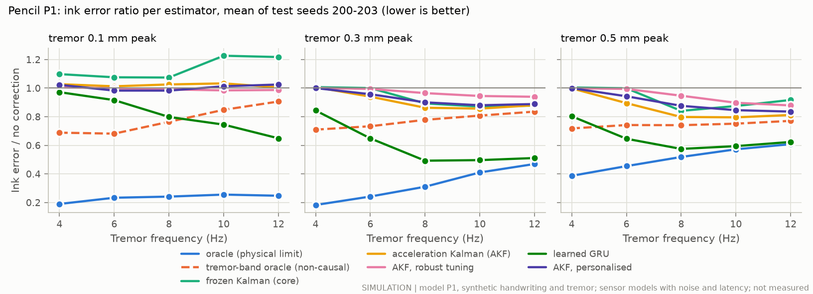
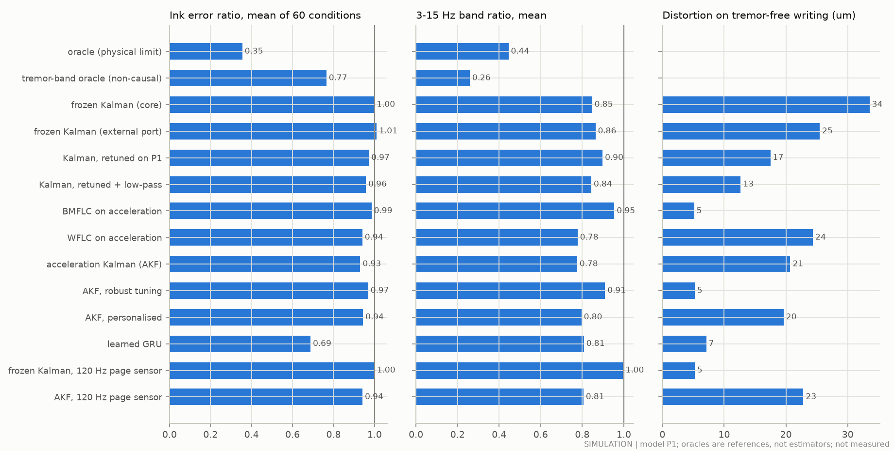
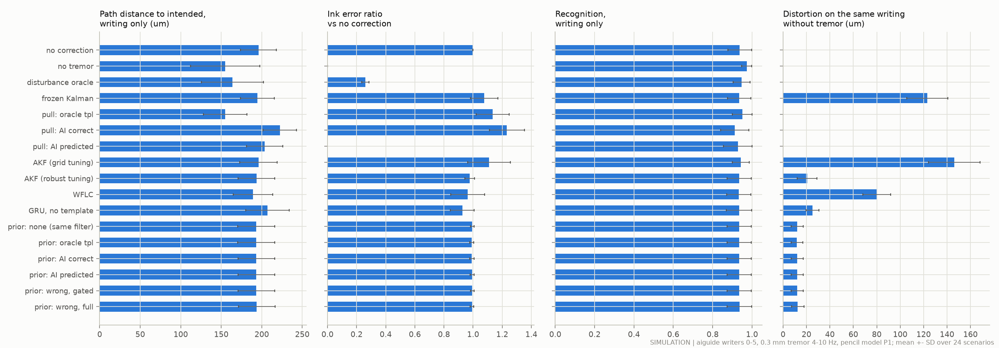
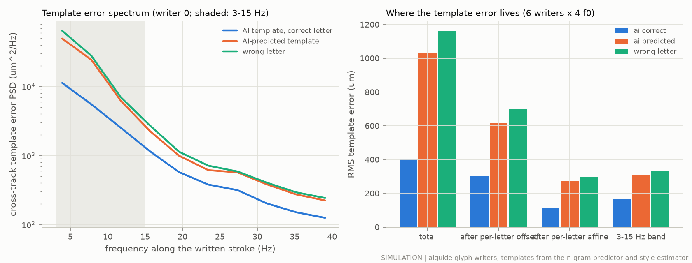
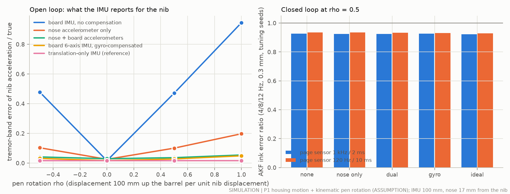
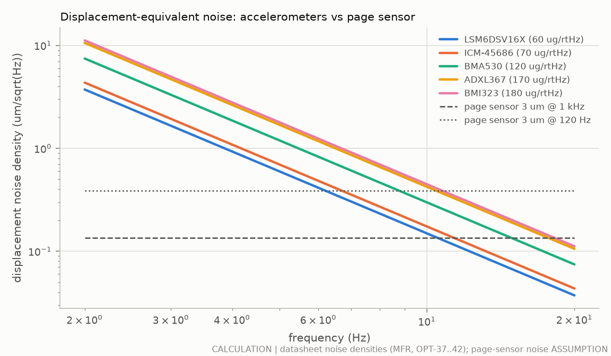
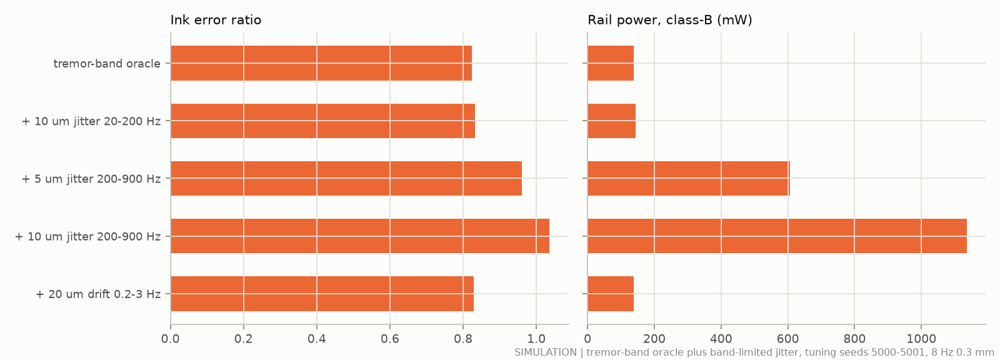

# Sensing and AI: telling tremor from intended writing (pencil concept)

**Status: proposed design and first study (2026-09-28).** Every number below is a calculation (CALC), a simulation on the pencil model P1 with synthetic handwriting and synthetic tremor (SIM), a manufacturer statement with its ledger id (MFR), literature with its ledger id (LIT) or an assumption (ASSUMPTION). **No person was recorded and no hardware was measured.** Numerical targets are hypotheses until the experiments of §11 are run. Code: [`fusion/`](../fusion/__init__.py). Results: `results/fusion/`. Ledger rows: `results/fusion/evidence_rows.csv` (ids ACT-40…, OPT-37…, EML-31…, PDT-32), merged into `docs/evidence.csv`. The inertial and pivot mechanisms are a separate study ([`docs/inertial_stabilisation.md`](inertial_stabilisation.md): the nib stage stays the only physical corrector, DEC-024); this page covers what decides the stage's command: sensing, estimation and the AI.

## 1. Short answer

- **The accelerometer now drives the tremor tracker directly. It helps, but modestly.**
  - A new Kalman filter reads the pen's 6-axis IMU at about 2 kHz: the acceleration-domain Kalman filter (AKF).
  - On the pencil model's test grid it leaves 0.78 of the tremor-band ink error (mean over 4–12 Hz and 0.1–0.5 mm), against 0.85 for today's filter.
  - It no longer makes small tremor worse: 0.96–1.04 at 0.1 mm, against 0.93–1.09 for today's filter.
  - Its best cells are 0.44–0.47 at 8–12 Hz and 0.5 mm.
  - With perfect knowledge of the tremor band, the stage would leave 0.26. The gap is the separation of tremor from writing, not the sensor (SIM).
- **Why the accelerometer is not a cure.**
  - It is fast: about 1.4 ms from motion to the estimate, against 2–10 ms plus a frame for the page sensor.
  - It is quiet enough: every candidate part resolves 0.1 mm of tremor at 4 Hz.
  - But it also sees the intended strokes, and handwriting shares the 3–7 Hz band with Parkinsonian and essential tremor. No filter can tell them apart by frequency alone (CALC, SIM).
- **Pen rotation matters, and the gyroscope fixes it.**
  - The IMU sits about 100 mm up the barrel. When the wrist's tremor tilts the pen, the board accelerometer's tremor-band reading of the nib is 36–58 % wrong at the assumed rotation.
  - The gyroscope in the same 6-axis chip brings that to 2–4 %.
  - A second accelerometer in the nose is needed only if real pens rotate more (ρ ≥ 1, EXP-I02) (SIM).
- **Personalisation is the AI that helps most.**
  - A 20 s calibration (a spiral, a circle and lines) lets the phone measure each writer's tremor frequency and amplitude, and choose the filter's settings.
  - The personalised filter leaves 0.58–0.71 of the tremor-band error at 8–12 Hz and 0.3 mm, against 0.77–0.90 for the safe population setting, with 20 µm of distortion on tremor-free writing (SIM).
- **Writing that looks like tremor is the main risk.**
  - Filters tuned on smooth synthetic writing, today's included, moved sharper writers' tremor-free ink by 123–146 µm.
  - A robust setting that learns the tremor amplitude only during slow motion keeps that to 21 µm, at the cost of most of the benefit.
  - Real handwriting of the target groups (EXP-H01) decides which setting ships (SIM).
- **AI letter prediction does not help the tremor estimate.**
  - Used as a prior inside the filter, the phone's templates changed nothing: path error 193 µm with or without any template. A correctly predicted letter in the writer's style is off by 165 µm in the tremor band itself.
  - Pulling the nib toward the template made the letters worse (222 against 196 µm), and a wrong prediction flipped letters.
  - With a known template (tracing, copying), the same pull brought the path error to the no-tremor level (155 µm) (SIM).
- **The learned network trained on the simulator scores best on the headline ratio but writes worse.** Its ratio is 0.69, but its path error is 282 µm against 258 µm uncorrected. It learned the simulated pen's friction behaviour rather than the writer's intent. It stays behind the ICD §5 guard until real data (EXP-E01) (SIM).
- **In this model most of the "disturbance" is friction, not tremor.**
  - The tremor makes the skid and the nib slide more freely, so the pen follows the hand differently. That slow drift is 316 µm, against 173 µm in the tremor band.
  - Perfect cancellation of everything therefore moves the ink *away* from the intended letters.
  - Friction under vibration (EXP-B01/B02) is the biggest open question of the model (SIM).

### Results at a glance (SIM)

| | P1 grid ratio | P1 grid 3-15 Hz ratio | P1 distortion (µm) | aiguide path RMS, writing only (µm) | aiguide ink ratio | aiguide distortion (µm) |
|---|---|---|---|---|---|---|
| No correction | 1 | 1 | 0 | 196 | 1 | 0 |
| Oracle: perfect knowledge of the whole disturbance (a limit, not an estimator) | 0.355 | 0.445 | – | 164 | 0.260 | – |
| Tremor-band oracle: perfect 3-15 Hz knowledge, non-causal (the limit for tremor estimators) | 0.765 | 0.259 | – | – | – | – |
| Frozen Kalman filter (today's core) | 0.999 | 0.847 | 34 | 195 | 1.077 | 123 |
| AKF, tuned on the grid's writing | 0.930 | 0.775 | 21 | 196 | 1.109 | 146 |
| AKF, robust tuning (recommended) | 0.969 | 0.910 | 5 | 193 | 0.978 | 21 |
| WFLC on acceleration | 0.941 | 0.777 | 24 | 189 | 0.963 | 80 |
| Learned GRU | 0.688 | 0.808 | 7 | 207 | 0.925 | 25 |
| AKF, personalised by the 20 s calibration | 0.944 | 0.796 | 20 | – | – | – |
| AI prior: correct letters in the writer's style | – | – | – | 193 | 0.991 | 12 |
| AI prior: the phone's predicted letters (confidence-gated) | – | – | – | 193 | 0.994 | 12 |
| AI prior: wrong letter at full confidence (safety) | – | – | – | 194 | 0.992 | 12 |
| Old template pull: correct letters (for comparison) | – | – | – | 222 | 1.232 | – |

How to read it:
- **P1 grid:** the harness convention (sigma-lognormal handwriting, tremor 4-12 Hz × 0.1-0.5 mm, test seeds 200-203; 60 runs per row). **aiguide:** 6 synthetic glyph writers write a sentence with 0.3 mm tremor at 4-10 Hz (24 runs per row).
- **Ratio:** ink error with the estimator divided by ink error without correction, both against the same pen writing without tremor. Below 1 is better.
- **3-15 Hz ratio:** the same for the tremor band of the ink error only.
- **Distortion:** how far the estimator moves the ink when there is no tremor at all (false correction). Lower is better.
- **Path RMS:** distance of the ink from the letters the writer intended, writing strokes only (as `docs/ai_guidance.md`).

### What to ship

1. **Sensors.**
   - The board 6-axis IMU (LSM6DSV16X class, MFR OPT-37), read through its FIFO at ≥ 1.9 kHz, with gyroscope compensation of the lever arm and of gravity.
   - Acquisition time stamps on every page-sensor and IMU sample.
   - A nose accelerometer (BMA530 class, 1.2 × 0.8 mm, OPT-41) only if EXP-I02 finds ρ ≥ 1.
2. **Page sensor.** 1 kHz with ≤ 2 ms latency if it can be had. 120 Hz / 10 ms is workable with the AKF (all-band 0.94 against 0.93, in band 0.81 against 0.78), but not with today's filter (0.998).
3. **Estimator.** The AKF replaces the frozen filter.
   - Default to the robust set.
   - Switch to the personalised set after a 20 s calibration whose check passes.
   - Use the grid-tuned set only if EXP-H01/E01 show that the target groups' writing is smooth.
4. **Output rule.** Every estimator ends in a 2nd-order low-pass (20–75 Hz) whose delay is predicted ahead. No estimate content may reach the stage near its 192 Hz resonance.
5. **AI.**
   - No template pull in free writing.
   - The template prior is implemented but off by default.
   - Guided mode with known templates for tracing and copying.
   - Digital autocorrect in the app (DEC-020).
6. **Learned models.** The GRU and the TCN stay behind the ICD §5 guard until EXP-E01.

## 2. What was done

- **Sensors (CALC, SIM):** six candidate IMUs and accelerometers from their datasheets; tremor-band SNR; the lever-arm problem with a kinematic pen-rotation model added to P1; five compensation options open loop and closed loop.
- **Estimators (SIM, all causal, all fed by sensor models with noise, bias, rate and latency):** (a) the frozen Kalman oscillator of the core, internal and through an external port; (b) an acceleration-domain Kalman filter (AKF) with delayed page-sensor updates and frequency tracking; (c) WFLC and BMFLC on acceleration; (d) a learned GRU; (e) the AI-context estimator (the phone's letter template as an intent prior); (f) personalisation from a 20 s calibration.
- **Closed loop:** the P1 test grid (60 conditions × 4 seeds) and the aiguide writers (6 writers × 4 frequencies, with the phone's real predictions and templates).
- **Tuning and training only on other seeds and writers** (§12); the test seeds 200-203 and aiguide writers 0-5 were used for nothing but the final numbers.

## 3. What there is to cancel, and what limits every estimator

### 3.1 Test protocol (the harness convention)

- **P1 grid:** `scenarios.handwriting(seed, duration=5.0, tremor=TremorSpec(f0, amp_pk), N0=1.0)`, tremor 4, 6, 8, 10, 12 Hz × 0.1, 0.3, 0.5 mm peak, test seeds 200-203, `PencilConfig()` defaults, q_lim 0.30 mm: 60 runs per estimator.
- **Reference:** the same pen in NEUTRAL writing the same handwriting without tremor.
- **Ratio:** e_rms(controller) / e_rms(NEUTRAL with tremor), both against the reference. Below 1 is better; 1 is no benefit.
- **Band ratio:** the same for the 3-15 Hz band of the ink error (`sim/pencil/evaluate.py`).
- **Distortion (false correction):** the estimator on the tremor-free writing, RMS ink difference from the reference.
- **External estimators:** sensor streams are generated from the NEUTRAL tremor run's recorded housing motion; the causal estimate is injected with `M.with_estimate` into `Controller(mode="external")`. The controlled run's housing departs from the neutral run's by mean akf 38 µm, akf_robust 15 µm, gru 28 µm RMS. One re-estimation from the controlled run's own motion changed the ratio by akf: mean change -0.010 (largest 0.018); estimate change 17.0 µm RMS; akf_robust: mean change -0.002 (largest 0.007); estimate change 2.6 µm RMS; gru: mean change -0.002 (largest 0.006); estimate change 23.2 µm RMS (seed 200, 0.3 mm, 5 frequencies), so the approximation holds.
- **aiguide set:** 6 synthetic glyph writers (aiguide's test writers 0-5) write "return library books by friday" (about 20 s) with 0.3 mm tremor at 4, 6, 8, 10 Hz, on P1 (`pencil_P1`), with the phone's real recogniser, predictor and style templates (§5.e).

### 3.2 In P1 most of the tremor-induced error is not tremor-band motion (SIM)

The oracle cancels the whole disturbance d = housing path with tremor − housing path without. On tuning seeds 5000-5001 (6 and 10 Hz, 0.3 mm; `sensors.json` `friction_control`):

| | d below 3 Hz | d in 3-15 Hz | Oracle ratio | Tremor-band oracle ratio |
|---|---|---|---|---|
| P1 as configured | 316 µm | 173 µm | 0.30 | 0.80 |
| Skid and nib near frictionless (μ_skid = 0, μ_nib = 0.02) | 12 µm | 241 µm | 0.13 | 0.19 |

- The slow part is not tremor. The tremor vibration keeps the skid and the nib sliding (dither), so the pen follows the hand differently and drifts. Without friction it almost vanishes.
- The coupled simulator of the `ml/` study shows the same: 40-68 % of its housing disturbance power lies below 3 Hz (`ml/README.md` §c.4).
- **Consequence:** in P1 as configured, even perfect knowledge of the tremor band (the non-causal tremor-band oracle) reaches only about 0.77 on the all-band ratio. That is the fair ceiling for a tremor estimator; the band ratio is the fair measure of its quality.
- How the skid and nib friction respond to vibration is the biggest single lever in this model, bigger than any estimator (EXP-B01/B02). That is not a case for more friction: the inertial study found that extra skid friction filters writing as much as tremor (`docs/inertial_stabilisation.md` §1).

### 3.3 Estimate jitter near the stage resonance costs more than it gains (SIM)

The tremor-band oracle plus band-limited noise (tuning seeds 5000-5001, 8 Hz, 0.3 mm; `sensors.json` `jitter_check`):

| Added to the perfect tremor-band estimate | Ratio | Class-B rail power | Housing departs from neutral |
|---|---|---|---|
| nothing | 0.82 | 138 mW | 33 µm |
| 10 µm RMS at 20-200 Hz | 0.83 | 144 mW | 35 µm |
| 5 µm RMS at 200-900 Hz | 0.96 | 606 mW | 71 µm |
| 10 µm RMS at 200-900 Hz | 1.04 | 1136 mW | 105 µm |
| 20 µm RMS slow drift, 0.2-3 Hz | 0.83 | 138 mW | 33 µm |

- Jitter near the stage's 192 Hz resonance shakes the nib, dithers the friction and moves the housing path; it also multiplies the rail power.
- **Rule adopted:** every estimator ends in a 2nd-order low-pass (tuned between 20 and 75 Hz) whose group delay is predicted ahead, and tuning penalises estimate content above 150 Hz. Accelerometer noise must not reach the stage command.

### 3.4 Writing that looks like tremor (SIM)

- The grid's sigma-lognormal handwriting has 238 µm RMS of intended pen-down motion in 3-15 Hz (test seeds). The aiguide glyph writers have 584 µm (test writers): sharper letters at 20-34 mm/s. A 0.3 mm tremor line has 212 µm RMS.
- Tuned on the grid, the AKF misreads that writing as tremor. On the test writers' tremor-free glyph writing it moves the ink by 146 µm RMS (21 µm on the grid's writing), and on their tremor writing its ink ratio is 1.11. The frozen filter does the same (123 µm; ratio 1.08).
- The `ml/` study saw the same with fast writing: gains frozen for 25 µm of false correction gave 73-155 µm on writing faster than any training writer (`ml/README.md` §c.4).
- A frequency model alone cannot separate them, because they share the band. What still separates them: tremor persists through pauses and slow strokes, while fast writing does not (the amplitude reference of 5.b); the letter shape (the AI template, 5.e); and whatever a learned model can pick up from diverse training data (5.d).
- **Robust tuning** (grid tuning seeds plus aiguide tuning writers) trades some grid benefit for not harming sharp writers (§6).

## 4. Sensor architecture

### 4.1 What the accelerometer sees (CALC)

A tremor line of peak amplitude A at frequency f has an acceleration amplitude A(2πf)². The accelerometer therefore weights motion by ω²:

| Motion | Displacement | Acceleration (CALC) |
|---|---|---|
| Letter stroke, 2 mm at 3 Hz | 2 mm | 0.71 m/s² |
| Tremor 0.1 mm at 6 Hz | 5 % of the stroke | 0.14 m/s², **20 %** of the stroke |
| Tremor 0.3 mm at 10 Hz | 15 % of the stroke | 1.18 m/s², **167 %** of the stroke |

- The ω² weighting is a free high-pass filter. It favours tremor over the slow parts of writing (drift, the rightward advance, stroke fundamentals at 2-3 Hz) by (f_tremor/f_stroke)², 4× to 16× for 6-12 Hz against 3 Hz.
- It does **not** separate tremor from writing at the same frequency. Strokes of 0.15-0.25 s have harmonics at 4-8 Hz, and sharp letters have much more (§3.4). Separation needs a model: a Kalman filter, a learned network or a template.

### 4.2 Candidate parts: noise is not the limit (MFR values, CALC)

| Part (ledger) | Type | Accel noise (µg/√Hz) | Gyro noise (mdps/√Hz) | Max ODR | Filter and latency, as stated | Current (µA) | Package (mm) | SNR, 0.1 mm at 4 Hz, 1 Hz band |
|---|---|---|---|---|---|---|---|---|
| LSM6DSV16X (OPT-37) | 6-axis | 60 | 2.8 | 7.68 kHz | analog anti-aliasing in high-performance mode; LPF1 at ODR/2, optional LPF2; latency not stated | 650 (acc + gyro, HP) | 2.5 × 3.0 × 0.83 | 76 |
| ICM-45686 (OPT-38) | 6-axis | 70 | 3.8 | not in the source read | not in the source read | 420 (6-axis LN) | 2.5 × 3.0 × 0.81 | 65 |
| ICM-42688-P (OPT-39) | 6-axis | 70 | 2.8 | not verified | programmable 2nd-order anti-aliasing (search snippet only) | 880 (6-axis LN) | 2.5 × 3.0 × 0.91 | 65 |
| BMI323 (OPT-40) | 6-axis | 180 | 7.0 | 6.4 kHz | −3 dB at 674-1677 Hz; **group delay 0.39-0.63 ms** | 790 (HP) | 2.5 × 3.0 × 0.83 | 25 |
| BMA530 (OPT-41) | accel | 120 | - | 6.4 kHz | not in the flyer read | 125 (HP) | 1.2 × 0.8 × 0.55 | 38 |
| ADXL367 (OPT-42) | accel | 170 | - | 400 Hz (too slow for a 2 kHz loop) | 2-pole anti-aliasing, −3 dB at ODR/2 | 0.9-1.8 at 100 Hz | 2.2 × 2.3 × 0.87 | 27 |

- Every candidate resolves the smallest tremor of the grid (0.1 mm at 4 Hz) with an amplitude SNR of 25-76 in a 1 Hz band (CALC; `results/fusion/sensors.json` `snr`).
- **Closed loop confirms it (SIM):** the AKF with the BMI323's 3× higher noise gave the same ratio as with the LSM6DSV16X (ratio 0.927 vs 0.927 with the 1 kHz page sensor, 0.930 vs 0.931 with 120 Hz; tuning seeds 5000-5001, 4/8/12 Hz, 0.3 mm).
- Against the page sensor (3 µm per sample, ASSUMPTION, `config/parameters.yaml` `sensing.opt_noise`): the LSM6DSV16X is the better *position* sensor only above **10.5 Hz** against a 1 kHz page sensor and above **6.2 Hz** against a 120 Hz one.
- What the accelerometer adds is **speed and continuity**: about 1.4 ms from motion to firmware (1.04 ms filter + 0.35 ms read; ASSUMPTION built on MFR OPT-37/OPT-40) against 2-10 ms plus a frame period for the page sensor, and it keeps working when the pen is lifted and the page sensor is invalid.
- The gyroscope's own noise enters the lever-arm correction as r·dω/dt: 12.5 µg/√Hz at 4 Hz to 37.6 µg/√Hz at 12 Hz for r = 100 mm (CALC from OPT-37 2.8 mdps/√Hz), below the accelerometer's 60 µg/√Hz.
- `config/parameters.yaml` `sensing.imu_acc_noise_density` is 70 µg/√Hz "(verify datasheet)"; DS13510 Rev 3 gives **60 µg/√Hz** in high-performance mode (MFR OPT-37). `fusion/` uses 60.

### 4.3 The lever-arm problem: the IMU is not at the nib

The board IMU sits 78-120 mm up the barrel (100 mm here, ASSUMPTION). If the pen only translated, the board would see the nib's acceleration. It does not only translate: tremor of the wrist and forearm rotates the pen (PDT-32, LIT: wrist and forearm degrees of freedom carry most of essential tremor), and every finger stroke tilts it a little.

**Model (ASSUMPTION, parametric; P1 itself has no pen rotation).** A small rigid rotation Ω(t) is added on top of the P1 motion:

Ω = (ρ_t / r_ref)(d_ψ × a) + (ρ_w / r_ref)(h_w × a)

- d_ψ: the hand tremor displacement, phase-shifted by ψ; h_w: the intended hand path high-passed at 1 Hz (finger strokes); a: barrel axis; r_ref = 100 mm.
- ρ is how far a point 100 mm up the barrel moves, relative to the nib, per unit of nib displacement: 0 = pure translation, 0.67 = rotation about a wrist 150 mm from the nib, 1.25 = rotation about the web of the hand 80 mm from the nib.
- The nominal ρ = 0.5 tilts the pen by about 1 mrad RMS at 0.3 mm tremor (CALC), inside the 0.8-2.2 mrad RMS that the hand-pen model H1 of the inertial study predicts (SIM, `docs/inertial_stabilisation.md` §3.3). EXP-I02 measures it.
- The IMU at distance r then sees a_nib + r·(Ω̈ × a) (the lever-arm term) plus g rotated by Ω (the gravity leak), in its own tilted frame.

**Compensation options compared:**

| Option | Hardware | What it removes |
|---|---|---|
| none | board accelerometer only | nothing |
| nose | one accelerometer 17 mm from the nib (BMA530, 1.2 × 0.8 mm, fits the 7.9 mm bore; MFR OPT-41) | most of the lever arm (17 mm instead of 100 mm); not the gravity leak |
| dual | nose + board accelerometers | lever arm exactly, by rigid-body extrapolation to the nib; not the gravity leak (attitude from double-integrating the difference drifted in tests and was dropped) |
| gyro | board 6-axis IMU (accelerometer + gyroscope) | the lever arm from r·dω/dt, and the gravity leak from the gyroscope's attitude |
| ideal | translation-only IMU at the nib | reference only |

**Open loop (SIM, seed 5000, 0.3 mm, mean over 4-12 Hz): tremor-band error of the nib-acceleration estimate relative to the truth**

| Compensation | ρ = 0 (translation only) | ρ = 0.5 | ρ = 1.0 |
|---|---|---|---|
| board accelerometer, no compensation | 1.6 % | 47.1 % | 94.5 % |
| nose accelerometer only (17 mm) | 2.5 % | 10.1 % | 19.8 % |
| nose + board accelerometers | 3.0 % | 3.6 % | 5.5 % |
| board 6-axis IMU, gyroscope-compensated | 1.6 % | 2.8 % | 4.9 % |
| translation-only IMU at the nib (reference) | 1.6 % | 1.6 % | 1.6 % |

**Phase and distance (SIM, open loop, ρ = 0.5, 8 Hz):** tremor-band error of the nib acceleration over rotation phases −90° to 180° and board distances 78-120 mm: no compensation 36-58 % (100 mm: 46-49 %); nose only 9-11 % (100 mm: 9-11 %); gyroscope 2-4 % (100 mm: 3-3 %); nose + board 2-4 % (100 mm: 3-4 %).

**Closed loop (SIM, AKF, tuning seeds 5000-5001, 4/8/12 Hz, 0.3 mm): ink error ratio**

| Compensation | page 1 kHz, ρ = 0.5 | page 1 kHz, ρ = 1.0 | page 120 Hz, ρ = 0.5 | page 120 Hz, ρ = 1.0 |
|---|---|---|---|---|
| board accelerometer, no compensation | 0.927 (band 0.743) | 0.959 (band 0.859) | 0.934 (band 0.798) | 0.962 (band 0.881) |
| nose accelerometer only (17 mm) | 0.924 (band 0.728) | 0.925 (band 0.729) | 0.935 (band 0.781) | 0.941 (band 0.801) |
| nose + board accelerometers | 0.924 (band 0.730) | 0.925 (band 0.730) | 0.934 (band 0.777) | 0.937 (band 0.788) |
| board 6-axis IMU, gyroscope-compensated | 0.927 (band 0.747) | 0.933 (band 0.763) | 0.930 (band 0.765) | 0.938 (band 0.797) |
| translation-only IMU at the nib (reference) | 0.922 (band 0.730) | 0.922 (band 0.730) | 0.929 (band 0.775) | 0.929 (band 0.775) |

- **Open loop,** the board accelerometer alone gets the nib's tremor about half wrong at ρ = 0.5 and fully wrong at ρ = 1. The gyroscope brings that to a few percent; a nose accelerometer alone to 10-20 %; nose plus board to about the gyroscope's level.
- **Closed loop, the differences are small,** because the AKF leans on the page sensor. At ρ = 0.5 the uncompensated board accelerometer does as well as the gyroscope-compensated one. At ρ = 1 compensation matters, and the nose accelerometer (alone or with the board's) does best, close to the translation-only reference. The gyroscope compensation adds noise of its own (the r·dω/dt term): with no rotation at all (ρ = 0) the gyroscope-compensated AKF gives 0.926 against 0.922 for the ideal translation-only IMU (1 kHz page sensor).
- **Consequence:** the board's 6-axis IMU (needed anyway for tilt and attitude) with gyroscope compensation is enough at the assumed rotation. If EXP-I02 finds ρ near 1 or more, add the nose accelerometer (BMA530, 1.2 × 0.8 mm, 125 µA; MFR OPT-41) and feed the estimator from it; a better r·dω/dt filter is the cheaper first step.

## 5. Estimators (all causal; tuned only on tuning seeds and tuning writers)

**Common interface.** Every estimator reads the same sensor streams (`fusion/sensors.py`) and returns, at each 0.5 ms stage tick, the housing disturbance the stage should cancel, already multiplied by its own authority. A sample is used only once the tick time reaches its availability time. A unit test perturbs every sample that becomes available after time T and checks that no output before T changes (`fusion/tests/test_fusion.py::test_estimators_are_causal`). The estimate is injected with `sim.pencil.model.with_estimate` into `Controller(mode="external")`.

**Sensor models used in every closed-loop number (ASSUMPTION unless marked):**
- page sensor 1 kHz, 2 ms latency, 3 µm RMS (the P1 default, `config/parameters.yaml` `sensing.opt_*`), or 120 Hz, 10 ms, 3 µm (the proposed requirement); invalid above 0.8 mm lift;
- IMU: LSM6DSV16X class, 60 µg/√Hz and 2.8 mdps/√Hz (MFR OPT-37), 3.84 kHz, 0.35 ms read latency after the recorded 1.04 ms anti-aliasing filter, bias 0.02 m/s² (`sensing.imu_acc_bias`) plus 0.5 mg drift, 0.5 % scale, 0.5° misalignment, 16-bit at ±4 g; gyroscope bias 0.1 °/s and 1 % scale after calibration; board IMU 100 mm from the nib;
- pen rotation ρ_t = ρ_w = 0.5 (§4.3), gyroscope compensation of attitude and lever arm;
- axial contact sensor 1 kHz, 1 ms, 2 µm (as the P1 core).

**Tuning.** Random search, then local refinement, of an open-loop proxy on tuning seeds 5000-5007 (all 15 tremor conditions each): mean residual ratio against the oracle's disturbance, plus a penalty on estimate content above 150 Hz (§3.3) and a cap on false correction at the frozen filter's level (14 µm RMS on tremor-free writing). The **robust** variants add aiguide tuning writers 100-105 (4.5-9 Hz, 0.3 mm) to the objective with equal weight and a 30 µm cap on false correction on their tremor-free writing (§3.4). The chosen sets were checked in closed loop on seeds 5000-5003 (`results/fusion/tuning.json`).

### 5.a Baseline: the frozen Kalman oscillator

- `fusion.estimators.kfosc` ports core mode 3: `_kf_step` is a verbatim copy (unit-tested against `sim.pencil.core._kf_step.py_func`), fed as the core feeds it (latest optical sample plus the IMU-integrated motion since then), with the frozen M1 parameters (`results/sim/estimator_selection.json`), NIS confidence and the 7.5 Hz frequency gate.
- **Agreement (SIM, test grid):** with the core's own IMU settings (ideal translation-only IMU at 4 kHz, 70 µg/√Hz), the external port gives mean ratio 1.000 against the core's 0.999 over the 60 runs (mean difference +0.001, mean absolute difference 0.017, correlation 0.97).
- Two retuned variants show how much of any gain comes from tuning rather than structure: the same filter retuned on P1 tuning seeds, and retuned with the output low-pass of 5.b.
- **With a 120 Hz / 10 ms page sensor the frozen filter does nothing** (core mode, test grid at 0.3 mm: 0.998 against 0.930 at 1 kHz; `sensors.json` `imu_aa_check`). Its IMU-increment fusion does not bridge a 10 ms delay. The core's optional IMU anti-aliasing filter (`imu_aa`) makes no difference.

### 5.b Acceleration-domain Kalman filter (AKF)

- **States per axis (8):** intent position, velocity and acceleration (white jerk); a damped tremor oscillator at the tracked frequency ω (2 states); a second harmonic at 2ω (2 states); the accelerometer bias (random walk). Both axes share ω and, because F, Q, H and R are the same, one covariance.
- **Measurements:** the accelerometer directly, y_a = a − ω²c₁ − 4ω²c₂ + b, at 1.92 kHz (two samples averaged per FIFO read), time-stamped at acquisition minus the known filter group delay; the page sensor y_p = p + c₁ + c₂ at its acquisition time.
- **Latency:** the filter keeps its state after each accelerometer update. A page sample that arrives late is applied at its acquisition time by rolling back to the snapshot before it and re-applying the later accelerometer samples. This is exact for any latency (2 ms: about 4 samples re-applied; 10 ms at 120 Hz: about 19).
- **Frequency tracking:** phase rate of the larger fundamental oscillator over the advance of the filter time, smoothed with τ_w and clamped to [f_min, 14 Hz].
- **Gates:** a soft frequency gate (no correction when the tracked frequency sits in the writing band) and a soft amplitude gate.
- **Output:** the tremor (c₁ + c₂) predicted to t + h through a 2nd-order low-pass whose group delay is added to h (§3.3).
- **Options added for robustness (§3.4):** an **amplitude reference** learned only while the intended motion is slow (pauses, slow strokes), which caps the output at k times that reference during fast writing; and a cross-track-only output. The robust search chose the amplitude reference (k = 3.0, slow below 9.8 mm/s, τ_ref 0.56 s).
- **Tuned sets:** grid-tuned q_j 0.0221 m²/s⁵, q_t 1.81e-09 m²/s, τ_osc 0.466 s, r_a 0.0515 (m/s²)², r_p 5.75e-12 m², τ_w 0.157 s, f_min 3.1 Hz, frequency gate centre 6.04 Hz, gate width 2.22 Hz, amplitude gate from 4.23e-05 m, to 0.000169 m, τ_amp 0.254 s, harmonic 1, output low-pass 20.6 Hz, h 0.000159 s, gain 0.902; robust q_j 0.0173 m²/s⁵, q_t 1.56e-10 m²/s, τ_osc 0.153 s, r_a 0.0721 (m/s²)², r_p 5.31e-10 m², τ_w 0.302 s, f_min 3.79 Hz, frequency gate centre 6.3 Hz, gate width 2.05 Hz, amplitude gate from 5.51e-06 m, to 0.000164 m, τ_amp 1.05 s, harmonic 0, output low-pass 56.5 Hz, h 0.000925 s, gain 1.14, cap k 3, v_slow 0.0098 m/s, τ_ref 0.556 s, cross-track only 0 (search `akfc`).
- **In words, the robust set** corrects only a narrow, steady oscillation above about 6 Hz (its frequency gate opens between 5.3 and 7.3 Hz), averages the tremor amplitude over about a second, and caps its output at three times the tremor amplitude seen while the pen moved slower than 10 mm/s. It gives up most of the grid's 4-6 Hz benefit, where writing and tremor overlap most. Closed loop on tuning seeds 5000-5003: ratio 0.976, band ratio 0.924, distortion 4.5 µm, against 0.942, 0.789 and 11.9 µm for the grid-tuned set.

### 5.c WFLC and BMFLC on acceleration

- **BMFLC:** a fixed bank of sin/cos pairs (f_lo to f_hi in df steps) adapted by normalised LMS on the band-limited acceleration. Each component's displacement is −1/ω_k² of its acceleration; the pre-filter's gain and phase are inverted per basis frequency; prediction to t + h is exact for the bank.
- **WFLC:** fundamental plus harmonic with an adaptive frequency (Riviere et al. 1998, ACT-08). The frequency gradient uses the fundamental only: with the harmonic in the gradient the combiner locked onto half the tremor frequency on a pure sinusoid (tested).
- Both use the accelerometer only (no page sensor), as in the literature (ACT-08 to ACT-10), with the same output low-pass rule.

### 5.d Learned estimator (GRU)

- **Inputs, 1 kHz, all causal (7):** mean page-frame nib acceleration of the IMU samples that arrived in the step (2), page-sensor increment when a new sample arrived (2), new-sample flag, page-sensor valid, axial contact.
- **Output:** the housing disturbance at t + 2 ms + 3.75 ms (the delay of the same 60 Hz output low-pass as the AKF), so the network predicts over its own sensor latency.
- **Model:** one GRU layer, 48 units, linear head: 8,306 parameters, 8,304 MAC per step (CALC).
- **Training data (SIM):** 400 domain-randomised pairs on P1, each a tremor run and the same writing without tremor, with 2 sensor augmentations each. 70 % use sigma-lognormal handwriting (seeds 6000 + i), 30 % the first 5 s of a note line by a random aiguide glyph writer (seeds 16000 + i; never the aiguide study sentence, never writers 0-5 or 100-105). Validation: seeds 9000-9011 and 9100-9111 (glyph 19000 + j).
- **Randomised:** tremor 3-14 Hz, 0.05-0.6 mm peak, 2nd harmonic 0-0.4, amplitude and frequency drift, ellipticity and orientation; handwriting size, slant, speed and advance; tilt 35-75°; user force 0.5-2 N; hand impedance over the `hand` ranges of `config/parameters.yaml` (PencilConfig overrides); skid friction 0.06-0.2; pen rotation ρ_t ∈ [−0.5, 1.5], ρ_w ∈ [0, 1] with random phase; sensor noise and bias. A quarter of the pairs use the nominal pen and hand.
- **Loss:** squared error on the tremor runs plus λ_FC = 4 times the squared output on the tremor-free runs (the false-correction penalty). Model selection on the validation seeds by residual ratio, with a penalty when validation false correction exceeds 25 µm (the `ml/` matched-false-correction bound).
- **Why not the `ml/` TCN:** it takes only page-sensor increments at 250 Hz (ICD §5). The question here is what the IMU adds, so a streaming GRU on IMU + page inputs at 1 kHz was trained instead; `ml/`'s int8 cost model and false-correction bound were reused.
- **Cost of training:** 18 min (3 min data generation) on 2 CPU threads, data generation included.
- **Training record:** validation residual ratio 0.95 after the first epoch, 0.64 at the chosen epoch 10 of 12; false correction on the tremor-free validation runs 16 µm (validation residual ratio, all bands; false correction on the tremor-free validation runs).
- **What it learned beyond the tremor band (SIM).** The target is the whole disturbance, and part of the slow friction shift of §3.2 is predictable from what the sensors see: with tremor, the skid and nib slide more freely, so the housing lags the hand differently, and the lag follows the writing direction. Open loop on the test grid, the GRU's residual below 3 Hz is 0.56 of the slow disturbance (AKF: 1.00; a tremor estimator cannot do better than 1). This part of its gain is specific to P1's friction model (ASSUMPTIONS; EXP-B01/B02) and would have to be re-learned, or would vanish, on a real pen.

### 5.e AI-context estimator: the template as an intent prior

The phone predicts the next letters, synthesises them in the writer's style and sends template segments (proposed ICD record 0x06, `docs/ai_guidance.md` §7). The old guided mode pulled the nib toward the template, so every micrometre of template error became ink error.

Here the template **never commands the stage**. It enters the estimator as extra information about the *intended* path, and the stage still cancels only the estimated tremor. Two measurement forms were implemented (`fusion/context.py`) and chosen between by tuning:

- **Intent-referenced** (form 0): n·T(s*) = n·p − n·b_T + e_T. The template's cross-track position constrains the filter's intent position p.
- **Tremor-referenced** (form 1): n·(y_p − T(s*)) = n·c + n·b_T + e_T. The page-sensor sample's cross-track distance from the template is tremor plus template bias, so the writing's own shape is removed before the tremor model sees it.

Common to both:

- n: unit normal of the template at the point s* nearest to the filter's intent position, searched forward from the current progress (re-acquired after a lift). Only the cross-track component is used, because the template carries no timing.
- b_T: a slowly varying template-bias state (placement offset; kept across letters with 150 µm of added uncertainty per new letter).
- R_T = σ_T² / min(1, ĉ/c_full), with ĉ the predictor's calibrated confidence; letters below c_min = 0.5 send no template.
- Safety: an update whose normalised innovation exceeds the gate is skipped; a letter's template is dropped for the rest of the letter once the cross-track residual has stayed above 250 µm for 60 ms (rule T5 of `docs/ai_guidance.md` §7.3).
- Optional cross-track-only output: the stage cancels only the tremor component across the stroke direction given by the template (along the stroke, the writing's own speed changes and tremor cannot be told apart without timing).
- The filter is the AKF of 5.b with both axes joined (18 states), because the template couples x and y.

**Hypothesis tested first:** template errors are mostly low-frequency (offset, size and slant, which the bias state absorbs), so their 3-15 Hz content is small next to their ~300-450 µm total.

**Tuning:** form (2), σ_T (20, 60, 150 µm), innovation gate (off, 4σ) and the cross-track-only output (off, on) were chosen, with the drop rule always on, on aiguide writers 100-102 (never the test writers 0-5), open loop, at 5 and 8 Hz, with the robust AKF (5.b) as the base. Objective: residual ratio plus false correction on the tremor-free writing, with the AI-correct and AI-predicted templates, plus a penalty when the full-confidence wrong-letter template does worse than no template. Chosen: tremor-referenced form, σ_T = 20 µm, gate 4.0, drop rule on (250 µm, 60 ms), cross-track-only output on, template rate 500 Hz. On the tuning writers every one of the 24 settings changed the residual ratio against the same filter without a template by between -0.004 and -0.000: the template made no measurable difference, and the choice was decided by false correction, which the cross-track-only output lowers (0.06 against 0.10 of the disturbance RMS).

### 5.f Personalisation from a 20 s calibration

- **Task (SIM):** an Archimedean spiral (3 turns to 5 mm), a slow circle and back-and-forth lines, with pen lifts, 20 s. The writer's tremor is a new realisation of the same process (seed = test seed + 40000). The test recording is never used.
- **Analysis (phone, offline, no simulator truth):** each page-sensor sample is matched to the known shapes in drawing order (their timing is unknown). The residual, page path minus shape, is band-passed 3-15 Hz per stroke between reversals, because the pen's friction lag changes at every reversal.
  - The label for the choice is the cross-track part of that residual. On the tuning seeds it matches the true tremor-band disturbance to about 5 µm RMS, and reads 6.5 µm on the same task without tremor (SIM, seed 5000).
  - Frequency and amplitude come from the full 2-D residual on the curved strokes (on a turning normal the projection would shift the tremor line by the turning rate) and from the cross-track part on the straight lines. On tuning seeds the estimated frequency was within 0.5 Hz of the true one (5, 8 and 10 Hz).
- **Choice:** among 12 AKF parameter sets built around the population (robust) set: frequency window f̂ ± 1.5 or 3 Hz, starting frequency f̂, amplitude gate scaled to the measured amplitude, oscillator process noise ×0.5/1/2, frequency gate off. The set whose output best matches the label on the calibration recording itself wins.
- **Sent to the pen:** the chosen set (proposed CAL_USER fields, §8.2).

## 6. Results

### 6.1 P1 test grid (SIM, seeds 200-203, `results/fusion/grid.json`)

Ink error ratio per condition, mean ± SD over the 4 test seeds (lower is better; 1 = no benefit). Sensors: page 1 kHz / 2 ms unless marked, gyroscope-compensated 6-axis IMU, pen rotation ρ = 0.5.


**0.1 mm peak** (ratio, mean ± SD over seeds 200-203)

| Estimator | 4 Hz | 6 Hz | 8 Hz | 10 Hz | 12 Hz |
|---|---|---|---|---|---|
| Oracle (physical limit, perfect knowledge) | 0.19 ± 0.03 | 0.23 ± 0.04 | 0.24 ± 0.04 | 0.26 ± 0.02 | 0.25 ± 0.02 |
| Tremor-band oracle (3-15 Hz, non-causal) | 0.69 ± 0.08 | 0.68 ± 0.07 | 0.76 ± 0.03 | 0.85 ± 0.04 | 0.91 ± 0.02 |
| (a) Frozen Kalman, core mode | 1.10 ± 0.06 | 1.08 ± 0.03 | 1.07 ± 0.05 | 1.23 ± 0.05 | 1.22 ± 0.06 |
| (a) Frozen Kalman, external port, core's IMU | 1.08 ± 0.09 | 1.05 ± 0.04 | 1.08 ± 0.05 | 1.21 ± 0.05 | 1.22 ± 0.09 |
| (a) Frozen Kalman, external port, this study's sensors | 1.12 ± 0.07 | 1.06 ± 0.04 | 1.11 ± 0.08 | 1.24 ± 0.06 | 1.21 ± 0.09 |
| Frozen-structure Kalman retuned on P1 | 1.02 ± 0.01 | 1.03 ± 0.02 | 0.98 ± 0.01 | 0.99 ± 0.02 | 0.99 ± 0.02 |
| Frozen-structure Kalman retuned on P1, with the output low-pass | 1.00 ± 0.00 | 1.04 ± 0.03 | 1.00 ± 0.01 | 1.05 ± 0.02 | 1.04 ± 0.02 |
| (c) BMFLC on acceleration | 1.00 ± 0.00 | 1.00 ± 0.00 | 0.99 ± 0.01 | 1.01 ± 0.02 | 1.02 ± 0.02 |
| (c) WFLC on acceleration | 1.03 ± 0.02 | 1.00 ± 0.02 | 1.01 ± 0.03 | 1.05 ± 0.06 | 1.05 ± 0.05 |
| (b) Acceleration Kalman (AKF), page 1 kHz | 1.03 ± 0.01 | 1.01 ± 0.02 | 1.03 ± 0.02 | 1.03 ± 0.01 | 1.01 ± 0.02 |
| (b) AKF, robust tuning (grid + glyph writers) | 1.01 ± 0.00 | 1.00 ± 0.01 | 0.99 ± 0.00 | 0.98 ± 0.00 | 0.99 ± 0.01 |
| (f) AKF, personalised | 1.02 ± 0.02 | 0.98 ± 0.01 | 0.98 ± 0.02 | 1.01 ± 0.03 | 1.03 ± 0.02 |
| (d) Learned GRU, page 1 kHz | 0.97 ± 0.02 | 0.92 ± 0.04 | 0.80 ± 0.10 | 0.74 ± 0.02 | 0.65 ± 0.04 |
| (a) Frozen Kalman, page 120 Hz | 1.00 ± 0.01 | 1.00 ± 0.00 | 1.00 ± 0.01 | 1.00 ± 0.01 | 1.00 ± 0.01 |
| (b) AKF, page 120 Hz / 10 ms | 1.03 ± 0.01 | 1.01 ± 0.03 | 1.01 ± 0.01 | 1.03 ± 0.02 | 1.05 ± 0.03 |

**0.3 mm peak** (ratio, mean ± SD over seeds 200-203)

| Estimator | 4 Hz | 6 Hz | 8 Hz | 10 Hz | 12 Hz |
|---|---|---|---|---|---|
| Oracle (physical limit, perfect knowledge) | 0.18 ± 0.04 | 0.24 ± 0.06 | 0.31 ± 0.06 | 0.41 ± 0.05 | 0.47 ± 0.04 |
| Tremor-band oracle (3-15 Hz, non-causal) | 0.71 ± 0.06 | 0.73 ± 0.03 | 0.78 ± 0.03 | 0.81 ± 0.03 | 0.84 ± 0.04 |
| (a) Frozen Kalman, core mode | 1.01 ± 0.01 | 1.00 ± 0.00 | 0.89 ± 0.03 | 0.87 ± 0.03 | 0.88 ± 0.02 |
| (a) Frozen Kalman, external port, core's IMU | 1.01 ± 0.01 | 1.00 ± 0.01 | 0.90 ± 0.03 | 0.89 ± 0.02 | 0.88 ± 0.02 |
| (a) Frozen Kalman, external port, this study's sensors | 1.01 ± 0.01 | 1.00 ± 0.01 | 0.91 ± 0.03 | 0.90 ± 0.01 | 0.89 ± 0.02 |
| Frozen-structure Kalman retuned on P1 | 1.00 ± 0.00 | 1.00 ± 0.01 | 0.94 ± 0.01 | 0.93 ± 0.01 | 0.94 ± 0.02 |
| Frozen-structure Kalman retuned on P1, with the output low-pass | 1.01 ± 0.01 | 1.00 ± 0.00 | 0.90 ± 0.03 | 0.89 ± 0.03 | 0.90 ± 0.03 |
| (c) BMFLC on acceleration | 1.00 ± 0.00 | 1.00 ± 0.00 | 0.95 ± 0.03 | 0.98 ± 0.02 | 0.99 ± 0.02 |
| (c) WFLC on acceleration | 1.01 ± 0.00 | 0.99 ± 0.02 | 0.87 ± 0.03 | 0.84 ± 0.04 | 0.87 ± 0.04 |
| (b) Acceleration Kalman (AKF), page 1 kHz | 1.01 ± 0.01 | 0.94 ± 0.02 | 0.86 ± 0.03 | 0.86 ± 0.04 | 0.88 ± 0.03 |
| (b) AKF, robust tuning (grid + glyph writers) | 1.00 ± 0.00 | 0.99 ± 0.00 | 0.97 ± 0.01 | 0.95 ± 0.02 | 0.94 ± 0.03 |
| (f) AKF, personalised | 1.00 ± 0.00 | 0.96 ± 0.01 | 0.90 ± 0.02 | 0.88 ± 0.03 | 0.89 ± 0.03 |
| (d) Learned GRU, page 1 kHz | 0.84 ± 0.02 | 0.65 ± 0.02 | 0.49 ± 0.03 | 0.50 ± 0.02 | 0.51 ± 0.02 |
| (a) Frozen Kalman, page 120 Hz | 1.00 ± 0.00 | 1.00 ± 0.00 | 0.99 ± 0.01 | 1.00 ± 0.00 | 1.00 ± 0.00 |
| (b) AKF, page 120 Hz / 10 ms | 1.00 ± 0.00 | 0.97 ± 0.01 | 0.90 ± 0.05 | 0.89 ± 0.06 | 0.87 ± 0.03 |

**0.5 mm peak** (ratio, mean ± SD over seeds 200-203)

| Estimator | 4 Hz | 6 Hz | 8 Hz | 10 Hz | 12 Hz |
|---|---|---|---|---|---|
| Oracle (physical limit, perfect knowledge) | 0.39 ± 0.06 | 0.45 ± 0.06 | 0.52 ± 0.04 | 0.57 ± 0.04 | 0.61 ± 0.03 |
| Tremor-band oracle (3-15 Hz, non-causal) | 0.72 ± 0.04 | 0.74 ± 0.02 | 0.74 ± 0.02 | 0.75 ± 0.02 | 0.77 ± 0.02 |
| (a) Frozen Kalman, core mode | 1.00 ± 0.00 | 1.00 ± 0.00 | 0.84 ± 0.01 | 0.88 ± 0.04 | 0.92 ± 0.03 |
| (a) Frozen Kalman, external port, core's IMU | 1.01 ± 0.01 | 1.00 ± 0.00 | 0.86 ± 0.01 | 0.88 ± 0.02 | 0.92 ± 0.02 |
| (a) Frozen Kalman, external port, this study's sensors | 1.00 ± 0.00 | 1.00 ± 0.00 | 0.87 ± 0.01 | 0.90 ± 0.02 | 0.93 ± 0.02 |
| Frozen-structure Kalman retuned on P1 | 0.99 ± 0.00 | 1.00 ± 0.01 | 0.93 ± 0.01 | 0.92 ± 0.01 | 0.93 ± 0.00 |
| Frozen-structure Kalman retuned on P1, with the output low-pass | 1.00 ± 0.01 | 1.00 ± 0.00 | 0.85 ± 0.02 | 0.85 ± 0.03 | 0.84 ± 0.03 |
| (c) BMFLC on acceleration | 1.00 ± 0.00 | 1.00 ± 0.00 | 0.93 ± 0.02 | 0.95 ± 0.02 | 0.96 ± 0.02 |
| (c) WFLC on acceleration | 1.00 ± 0.01 | 0.97 ± 0.03 | 0.81 ± 0.02 | 0.80 ± 0.02 | 0.81 ± 0.02 |
| (b) Acceleration Kalman (AKF), page 1 kHz | 1.00 ± 0.01 | 0.90 ± 0.03 | 0.80 ± 0.02 | 0.80 ± 0.02 | 0.81 ± 0.02 |
| (b) AKF, robust tuning (grid + glyph writers) | 1.00 ± 0.00 | 0.99 ± 0.00 | 0.95 ± 0.01 | 0.90 ± 0.02 | 0.88 ± 0.03 |
| (f) AKF, personalised | 1.00 ± 0.00 | 0.94 ± 0.01 | 0.88 ± 0.02 | 0.85 ± 0.03 | 0.84 ± 0.03 |
| (d) Learned GRU, page 1 kHz | 0.80 ± 0.02 | 0.65 ± 0.01 | 0.57 ± 0.04 | 0.59 ± 0.03 | 0.62 ± 0.03 |
| (a) Frozen Kalman, page 120 Hz | 1.00 ± 0.00 | 1.00 ± 0.00 | 1.00 ± 0.00 | 1.00 ± 0.00 | 1.00 ± 0.00 |
| (b) AKF, page 120 Hz / 10 ms | 1.00 ± 0.00 | 0.92 ± 0.03 | 0.83 ± 0.03 | 0.82 ± 0.03 | 0.81 ± 0.02 |

| Estimator | mean ratio | mean band ratio (3-15 Hz) | distortion (µm) | saturation | class-B rail (mW) | recovery rail (mW) |
|---|---|---|---|---|---|---|
| Oracle (physical limit, perfect knowledge) | 0.355 | 0.445 | – | 0.376 | 139 | 25.1 |
| Tremor-band oracle (3-15 Hz, non-causal) | 0.765 | 0.259 | – | 0.129 | 142 | 26.9 |
| (a) Frozen Kalman, core mode | 0.999 | 0.847 | 34 ± 17 | 0.004 | 203 | 38.1 |
| (a) Frozen Kalman, external port, core's IMU | 1.000 | 0.851 | 37 ± 15 | 0.001 | 197 | 37.0 |
| (a) Frozen Kalman, external port, this study's sensors | 1.010 | 0.864 | 25 ± 24 | 0.000 | 201 | 37.9 |
| Frozen-structure Kalman retuned on P1 | 0.972 | 0.898 | 17 ± 3 | 0.000 | 132 | 25.0 |
| Frozen-structure Kalman retuned on P1, with the output low-pass | 0.958 | 0.843 | 13 ± 12 | 0.017 | 135 | 25.6 |
| (c) BMFLC on acceleration | 0.985 | 0.954 | 5 ± 2 | 0.001 | 133 | 25.2 |
| (c) WFLC on acceleration | 0.941 | 0.777 | 24 ± 6 | 0.032 | 137 | 26.1 |
| (b) Acceleration Kalman (AKF), page 1 kHz | 0.930 | 0.775 | 21 ± 10 | 0.038 | 138 | 26.2 |
| (b) AKF, robust tuning (grid + glyph writers) | 0.969 | 0.910 | 5 ± 3 | 0.001 | 132 | 24.9 |
| (f) AKF, personalised | 0.944 | 0.796 | 20 ± 5 | 0.010 | 135 | 25.6 |
| (d) Learned GRU, page 1 kHz | 0.688 | 0.808 | 7 ± 1 | 0.236 | 136 | 24.5 |
| (a) Frozen Kalman, page 120 Hz | 1.000 | 0.997 | 5 ± 1 | 0.000 | 137 | 25.8 |
| (b) AKF, page 120 Hz / 10 ms | 0.941 | 0.806 | 23 ± 6 | 0.030 | 138 | 26.2 |

Share of the tremor-band limit reached, (1 − ratio) / (1 − tremor-band oracle ratio), mean over conditions: kfosc_internal -0.09, kfosc_port_matched -0.10, kfosc_port -0.14, kfosc_p1 0.14, kfosc_p1_lp 0.17, bmflc 0.05, wflc 0.25, akf 0.31, akf_robust 0.15, akf_personal 0.24, gru 1.56, kfosc_port_120 -0.00, akf_120 0.24.

- **Agreement of the port with the core (a):** mean ratio 1.000 against the core's 0.999 over the 60 runs (mean difference +0.001, mean absolute difference 0.017, correlation 0.97).
- **Re-estimation iteration:** akf: mean change -0.010 (largest 0.018); estimate change 17.0 µm RMS; akf_robust: mean change -0.002 (largest 0.007); estimate change 2.6 µm RMS; gru: mean change -0.002 (largest 0.006); estimate change 23.2 µm RMS.





### 6.2 aiguide writers: AI + physical in closed loop (SIM, writers 0-5 × 4-10 Hz, `results/fusion/context.json`)

Mean ± SD over 24 scenarios. "Writing only" excludes the touchdown and lift tails (as aiguide). Distortion: the same estimator and template on the tremor-free writing.

| Case | path RMS all ink (µm) | path RMS writing only (µm) | DTW writing only (µm) | recognised (writing only) | ink ratio vs no correction | distortion on tremor-free writing (µm) | at soft limit | flips |
|---|---|---|---|---|---|---|---|---|
| neutral_no_tremor | 212 ± 27 | 155 ± 43 | 191 ± 36 | 0.973 ± 0.026 | 0.000 ± 0.000 |  | 0.000 ± 0.000 |  |
| neutral | 243 ± 15 | 196 ± 22 | 197 ± 21 | 0.938 ± 0.061 | 1.000 ± 0.000 |  | 0.000 ± 0.000 |  |
| oracle_disturbance | 230 ± 25 | 164 ± 38 | 197 ± 33 | 0.947 ± 0.043 | 0.260 ± 0.024 |  | 0.110 ± 0.066 |  |
| kfosc_internal | 242 ± 14 | 195 ± 21 | 196 ± 19 | 0.934 ± 0.059 | 1.077 ± 0.094 | 123 ± 17 | 0.003 ± 0.002 |  |
| pull_oracle | 213 ± 15 | 155 ± 27 | 189 ± 19 | 0.950 ± 0.050 | 1.135 ± 0.115 |  | 0.122 ± 0.028 |  |
| pull_ai_correct | 265 ± 13 | 222 ± 21 | 223 ± 16 | 0.912 ± 0.072 | 1.232 ± 0.120 |  | 0.210 ± 0.019 |  |
| pull_ai_predicted | 249 ± 15 | 204 ± 22 | 206 ± 21 | 0.928 ± 0.073 |  |  | 0.037 ± 0.010 |  |
| pull_wrong_letter_gated | 246 ± 16 | 200 ± 23 | 203 ± 21 | 0.931 ± 0.068 |  |  | 0.013 ± 0.005 | 2/624 |
| pull_wrong_letter_full | 274 ± 18 | 235 ± 24 | 243 ± 18 | 0.870 ± 0.073 | 1.251 ± 0.122 |  | 0.245 ± 0.016 | 9/624 |
| akf | 244 ± 15 | 196 ± 23 | 192 ± 20 | 0.942 ± 0.043 | 1.109 ± 0.146 | 146 ± 22 | 0.047 ± 0.032 |  |
| akf_robust | 241 ± 15 | 193 ± 23 | 194 ± 21 | 0.934 ± 0.061 | 0.978 ± 0.033 | 21 ± 8 | 0.000 ± 0.000 |  |
| wflc | 238 ± 16 | 189 ± 24 | 192 ± 22 | 0.933 ± 0.062 | 0.963 ± 0.117 | 80 ± 12 | 0.002 ± 0.004 |  |
| gru | 254 ± 19 | 207 ± 27 | 217 ± 21 | 0.934 ± 0.064 | 0.925 ± 0.081 | 25 ± 5 | 0.018 ± 0.022 |  |
| ctx_none | 241 ± 15 | 193 ± 23 | 194 ± 21 | 0.934 ± 0.061 | 0.994 ± 0.013 | 12 ± 5 | 0.000 ± 0.000 |  |
| ctx_oracle | 241 ± 15 | 193 ± 23 | 195 ± 21 | 0.934 ± 0.061 | 0.991 ± 0.015 | 12 ± 5 | 0.000 ± 0.000 |  |
| ctx_ai_correct | 241 ± 15 | 193 ± 23 | 195 ± 21 | 0.934 ± 0.061 | 0.991 ± 0.015 | 12 ± 5 | 0.000 ± 0.000 |  |
| ctx_ai_predicted | 241 ± 15 | 193 ± 23 | 194 ± 21 | 0.934 ± 0.061 | 0.994 ± 0.013 | 12 ± 5 | 0.000 ± 0.000 |  |
| ctx_wrong_letter_gated | 241 ± 15 | 193 ± 23 | 194 ± 21 | 0.934 ± 0.061 | 0.994 ± 0.013 | 12 ± 5 | 0.000 ± 0.000 | 0/624 |
| ctx_wrong_letter_full | 241 ± 15 | 194 ± 23 | 195 ± 21 | 0.936 ± 0.061 | 0.992 ± 0.013 | 12 ± 5 | 0.000 ± 0.000 | 1/624 |

- **Free writing: no causal estimator moved the ink meaningfully closer to the intended letters.**
  - Writing-only path RMS: 196 ± 22 µm without correction.
  - Robust AKF 193 µm.
  - WFLC 189 µm, but it moves tremor-free writing by 80 µm.
  - GRU 207 µm, which is worse.
  - Today's filter 195 µm, with 123 µm of false correction; the grid-tuned AKF 196 µm, with 146 µm.
  - With perfect knowledge of the disturbance the pen reaches 164 µm; without tremor it is 155 µm. So the stage could undo most of the tremor's damage; the estimators cannot tell it from these writers' sharp strokes.
- **The template prior neither helps nor harms.**
  - With the oracle template, the AI-correct and AI-predicted templates, and even a full-confidence wrong letter, the prior filter stays at 193–194 µm and an ink ratio of 0.991–0.994, the same as with no template.
  - One of 624 letters flipped with the full-confidence wrong letter; none with gating.
- **The old pull is harmful with AI templates.** It gives 222 µm with a correct prediction, and 235 µm with 9 flipped letters for a full-confidence wrong letter. It helps only with the true template (155 µm, as good as no tremor): that is tracing and copying known text.
- **Recognition barely moves** across estimators: 0.933–0.942, against 0.938 uncorrected and 0.973 without tremor.
- **The ink-ratio and path columns can disagree.** The GRU has the best ink ratio (0.925) but the worst path (207 µm).
  - The ink ratio measures closeness to the same pen's tremor-free ink, which includes the pen's own lag behind the hand.
  - The path measures closeness to the intended letters.
  - For help with writing, the path is the one that matters.



**Template error: where it lives (the hypothesis of 5.e).**

| Template | total (µm) | after per-letter offset | after per-letter affine | segment-mean removed | < 3 Hz | 3-15 Hz |
|---|---|---|---|---|---|---|
| oracle | 1 | 1 | 1 | 1 | 0 | 0 |
| ai_correct | 406 | 301 | 113 | 316 | 153 | 165 |
| ai_predicted | 1031 | 618 | 271 | 686 | 403 | 306 |
| wrong_letter | 1160 | 700 | 298 | 779 | 462 | 331 |

- **The hypothesis is refuted for these writers.**
  - A correctly predicted letter in the writer's estimated style lies 406 µm from the intended letter.
  - Removing a per-letter offset leaves 301 µm; a per-letter affine fit leaves 113 µm.
  - Along the stroke, 165 µm of the error lies in 3–15 Hz and 153 µm below 3 Hz. The style mismatch is not slow: it sits at the scale of letter detail, the same band as tremor.
- A letter predicted by the phone (gated) or a wrong letter is 1031–1160 µm off.
- **What a template can do.** It can tell the estimator where the letter is, but not how the pen should move within it at tremor frequencies. That is why the prior made no difference at any setting.
- **What would change this.** A better personal style model, for example the writer's own recent instances of each letter, might bring the tremor-band error below the tremor. The template-error spectrum on real writing (AC-A02-04) decides it.



### 6.3 Sensors in closed loop







## 7. What runs where

| Function | Runs on | Why there | Cost (CALC, §9) |
|---|---|---|---|
| IMU read (FIFO), attitude from the gyroscope, gravity and lever-arm compensation | pen MCU | 1.4 ms from motion to estimate | small (a few hundred MAC per sample) |
| AKF: tremor estimate, frequency tracking, gates, output low-pass with prediction | pen MCU, every accelerometer sample | the 2 kHz stage loop | 6 % CPU, 2.3 kB |
| Context prior: template buffer, progress search, cross-track measurement, gate and drop rule | pen MCU (joint 18-state filter) | acts within a stroke; needs the nib position | 26 % CPU |
| Learned GRU (candidate only, behind the ICD §5 guard) | pen MCU at 1 kHz | latency | 13 % CPU float, 8.3 kB int8 weights |
| Handwriting recognition, text prediction, style estimation, template synthesis, confidence calibration | phone | model size and note history (`docs/ai_guidance.md` §2) | unchanged |
| Per-letter template-error model σ_T (the writer's own instance variability) | phone | needs the note history | small |
| Personal calibration: analysis of the 20 s task, choice of the personal parameter set | phone (offline, seconds) | needs the known shapes and a spectral estimate | seconds per calibration |
| Training and re-training of the learned estimator | offline (workstation), never on the pen | data and compute | about 40 min on 2 CPU threads here |
| Digital autocorrect | phone | unchanged (`docs/ai_guidance.md` §6) | unchanged |

## 8. ICD implications (proposals; `docs/icd.md` is not edited)

### 8.1 Record 0x06 (template segment, proposed in `docs/ai_guidance.md` §7.1): what the estimator needs

| Field of 0x06 | Needed by the estimator prior? | Note |
|---|---|---|
| seg_id, part, glyph | yes | letter identity: a new letter adds the letter's own placement uncertainty to the template-bias state |
| flags ANCHOR / SUPERSEDE / CANCEL | yes | the prior anchors at the first contact like the pull did; the estimator then tracks the remaining offset itself (template-bias state), so the anchor only has to be roughly right |
| confidence ĉ (u8) | yes | scales the measurement noise, R_T = σ_T² / min(1, ĉ/c_full); letters below c_min = 0.5 send geometry only and give no update |
| t_valid_from / t_valid_to | yes | as `docs/ai_guidance.md` §7.3 T1/T4 |
| x0, y0 and the point differences | yes | the pen densifies the 100 µm points to 20 µm by linear interpolation; 10 µm quantisation adds 2.9 µm RMS, far below σ_T |
| speed | no | the prior uses the cross-track distance only, so it needs no timing; keep the field for the guided mode |
| **new: flag bit 4 PRIOR** | proposed | "use as estimator prior only", the recommended use in free writing. A pull toward the template would need an explicit, separate flag |
| **new: σ_T (u8, 5 µm units)** | proposed, optional | the phone's expected cross-track error of this letter after the offset is removed, from the writer's own instance variability in the style estimator; default the tuned population value 20 µm |

- **Latency.** The prior needs a template before the pen writes the part it describes. The allocation of `docs/ai_guidance.md` §5 still applies: 182 ms end to end against the 0.3 s lead, with prediction depth 2 (CALC there). Unlike the pull, a template that arrives mid-letter still helps the rest of the letter, and a late one is simply unused.
- **Bandwidth.** Unchanged from `docs/ai_guidance.md` §5: about 117 points/s, 0.30 kB/s (0.9 kB/s with three revisions per letter), under 20 % of the 4.8 kB/s stroke uplink (CALC there). The prior adds nothing to the uplink.
- **Pen side.** A template buffer of two letters (about 1000 points after densifying, as int16 pairs 4 kB) and a nearest-point search over at most 90 points per update at the template rate (1500 at re-acquisition after a lift).
- **Rules §7.3.** T1, T2, T4, T5 (drop a letter after a persistent mismatch, implemented in the estimator) and T8 apply unchanged. T3 (authority) does not apply: the prior never commands the stage. T6 and T7 concern the pull only.

### 8.2 Calibration record CAL_USER (personalisation, §5.f)

`CAL_USER` v2 (ICD §3) already carries f0_hz (the calibration's f̂), f_gate_hz and f_gate_width_hz. The personal AKF set needs in addition (a cal_version 3 proposal): the frequency-window half-width (f32, Hz), the amplitude gate a_lo / a_hi (f32 ×2, m) and the oscillator process-noise scale (f32). A `mode_perm` bit for the template prior (bit 4 PRIOR_OK) lets the user or clinician switch the AI prior off. The existing flag bit0 "tremor and writing separable in frequency" is exactly the question of §3.4: a calibration that also records one line of the user's normal writing could measure its tremor-band content, set this flag and choose between the grid-tuned and the robust AKF set (proposal, not simulated). Re-run the calibration when the pen's tracked frequency leaves the window for more than a set time.

### 8.3 Research frame and a raw IMU record (for EXP-H01, EXP-I02, EXP-E01, EXP-B09)

- The research frame 0x01 logs `imu_ax, imu_ay` as i16 in **1 mg** steps. That is too coarse for this study: a 0.1 mm tremor at 4 Hz is 6.4 mg peak, and the lever-arm correction needs all three axes and the gyroscope.
- Proposed record 0x07 "IMU block": t_us of the first sample, ODR code, then n samples of (ax, ay, az, gx, gy, gz) as i16 at the sensor's native LSB (0.122 mg at ±4 g, 4.375 mdps at ±125 dps). At 3.84 kHz that is 46 kB/s on USB (research builds only).
- The page-sensor samples need their **acquisition** time stamps (not arrival), as ICD §5 v1.2 already requires for the ML input.

### 8.4 The ML contract (ICD §5)

The ICD §5 model takes 64 page-sensor increments at 250 Hz and predicts 6 ms ahead. The GRU of §5.d needs a different contract: 7 inputs at 1 kHz (page-frame nib acceleration from the compensated IMU, page increments with a new-sample flag, page validity, contact), acquisition-time stamps, output at h = 2 ms plus the output low-pass delay. The guard rules (expiry, confidence, saturation) carry over unchanged. Proposed as §5 v2 only if EXP-E01 shows the learned model's margin (REQ-ML-001).

## 9. Firmware budget (CALC, `results/fusion/budget.json`)

nRF54L15-class MCU: Cortex-M33 at 128 MHz with FPU, 256 KB RAM (AMF-44). Counts are multiply-accumulates of the implementations in `fusion/`, with the block structure of the transition matrix exploited. **Cycle model (ASSUMPTION, to be profiled):** 2 cycles per float32 MAC in plain C; int8 CMSIS-NN at 0.5 MAC per cycle plus 300 cycles per layer call (the `ml/budget.py` convention).

| Estimator | MAC per second | CPU share (float32) | Per 0.5 ms tick, mean / worst | RAM |
|---|---|---|---|---|
| Frozen Kalman (core mode 3) | 1.34 M | 2.1 % | 10 µs | 0.3 kB |
| AKF, page 1 kHz / 2 ms (about 4 samples re-applied) | 3.83 M | 6.0 % | 30 / 51 µs | 2.3 kB |
| AKF, page 120 Hz / 10 ms (about 19 samples re-applied) | 2.47 M | 3.9 % | 19 / 186 µs | 7.2 kB |
| Context filter (18 joint states, template at 500 Hz), page 1 kHz | 16.68 M | 26.1 % | 130 / 216 µs | 41.6 kB |
| WFLC | 0.20 M | 0.3 % | 2 µs | 0.1 kB |
| BMFLC (23 frequencies) | 1.47 M | 2.3 % | 12 µs | 0.6 kB |
| GRU 48 units, float32, 1 kHz | 8.30 M | 13.0 % | 130 µs per 1 ms network step | 33 kB weights float (8.3 kB int8) |

- **Latency budget (motion to stage command):** accelerometer 1.04 ms anti-aliasing + 0.35 ms read (ASSUMPTION; EXP-S01 measures it), estimator ≤ 0.03 ms, stage tick 0.5 ms and the stage's own lag; page sensor 2 ms (P1 default) or 10 ms (proposed requirement) plus up to one frame. Every estimator predicts its output ahead by the known delays (horizon + the output low-pass's group delay).
- **Worst tick:** when a delayed page sample arrives, the AKF re-applies the accelerometer samples since its acquisition time. At 120 Hz / 10 ms that is about 19 samples, 186 µs in one tick; the joint context filter would need 0.8 ms, more than a tick. The firmware should then re-apply stored gains to the state only (about 60 MAC per sample) and update the covariance once per page sample, or run the rollback in a lower-priority thread (proposal, not simulated).
- **All estimators fit** next to the servo, the ML guard and BLE; the GRU in float costs about 3× the AKF.

## 10. Limitations (most decisive first)

1. **No human or hardware data.** Handwriting is sigma-lognormal (P1 grid) or glyph-font writers (aiguide set); tremor is the synthetic narrow-band model of `stabpen.signals.tremor`. Every estimator ranking can change on real writing.
2. **The result depends on the writing.** Estimators tuned on the grid's smooth sigma-lognormal writing misread the aiguide writers' sharper letters (3-4× the tremor-band content) as tremor (§3.4). Which of the two is closer to people with PD or ET writing at their own speed is unknown; EXP-H01 must record it.
3. **The "physical limit" depends on the friction model.** Most of the oracle's disturbance in P1 is a tremor-induced friction shift of the housing path (§3.2). The LuGre parameters of skid and nib are ASSUMPTIONS (EXP-B01/B02). If real friction is less sensitive to vibration, the oracle and the tremor-band oracle move closer together and every estimator's ratio improves.
4. **Pen rotation is kinematic and assumed.** P1 has no pen rotation. The rotation ratio ρ = 0.5 and its phase are ASSUMPTIONS; PDT-32 (LIT) only says that wrist and forearm rotations carry most kinetic ET tremor. Roll about the barrel and centripetal terms are neglected.
5. **External-estimate approximation.** Estimates are computed from the neutral run's housing motion and injected into a separate controlled run (§3.1).
6. **Open-loop hand.** The hand follows a fixed reference path; users neither adapt to the correction nor fight it.
7. **Tuning.** Conventional estimators were tuned with an open-loop proxy on 8 tuning seeds (plus 6 aiguide tuning writers for the robust variants) and checked in closed loop on 4 of them; the GRU on 400 domain-randomised pairs. Single tuning runs; no uncertainty over tuning is reported.
8. **The learned model shares its generators with the tests** (sigma-lognormal and glyph writing, the same tremor model, P1), with different seeds and writers.
9. **Templates** come from the Tatoeba-CC0 n-gram predictor and the synthetic writers' style; one sentence; pen anchoring is emulated from the neutral run's touchdowns.
10. **Firmware cost** is counted, not profiled; the cycle model is an ASSUMPTION.

## 11. Experiments needed to validate on real data

The software for each is in `fusion/` and runs on recorded streams unchanged: `fusion.sensors.Streams` is the only input of every estimator, so a recording converted to that structure (acquisition and availability time stamps, page positions with validity, page-frame nib acceleration or raw IMU + attitude, axial contact) replaces the sensor models.

| Experiment | What to add or measure | Decides | Dependency |
|---|---|---|---|
| **EXP-H01** tremor-at-nib census (`validation/human_study_plan.md`) with **EXP-I02** (rotational share, inside H01) | Put the proposed sensor set in the instrumented passive pen: LSM6DSV16X-class 6-axis IMU on the board at its final distance from the nib, a BMA530 on the nose flex, raw logging at 3.84 kHz (proposed record 0x07), page sensor with acquisition time stamps, and the µm-class nib reference already planned. **Record normal-speed writing of the target groups, not only tremor tasks.** | The pen-rotation ratio ρ and its phase (ASSUMPTION 0.5 here); the tremor-band content of real PD/ET writing (§3.4: it decides between the grid-tuned and the robust estimator); the real template-error spectrum per writer (§5.e) | ethics approval; the passive pen build |
| **EXP-E01** estimator bake-off (offline, after H01) | Add the AKF (grid-tuned and robust), WFLC/BMFLC, the GRU and the context prior (templates from the recognised text, confidence from the calibrated predictor) to the pre-registered bake-off at matched false correction. Report the band residual (3-15 Hz) and the false correction on tremor-free writing next to the all-band ratio. | Which AKF set ships; whether the GRU meets REQ-ML-001's margin on held-out participants; the context prior's gain with real templates | H01 data |
| **EXP-S01** optical latency (`validation/bench_protocols.md`) | Also strobe the IMU: measure the accelerometer and gyroscope group delay and FIFO latency at 3.84 and 7.68 kHz (LSM6DSV16X states none; BMI323 states 0.39-0.63 ms, OPT-40). | The acc_gd and read-latency values the AKF compensates (1.04 + 0.35 ms here, ASSUMPTION) | bench rig |
| **EXP-B01 / B02** refill and skid friction | Add superimposed 4-12 Hz vibration (0.1-0.5 mm) to the drag and LuGre identification. | The friction-dither effect that makes up most of the oracle's disturbance in P1 (§3.2), i.e. whether the "physical limit" is tremor cancellation or re-created stick-slip | existing rigs |
| **EXP-B09** bench cancellation | Run the AKF (and the context prior with a tracing template) on the bench with replayed tremor; log the stage command spectrum. Test the jitter finding: inject 200-900 Hz command noise and measure housing drift and rail power. | Closed-loop benefit with real contact; the output low-pass rule | Rev A/P prototype |
| **EXP-A02** guidance acceptance (pencil concept) | Replace the "AI-template guidance" arm by "template as estimator prior" (no pull); keep the 10 % wrong-template arm. | Whether the prior helps people's writing without any sense of being steered | ethics approval |
| New, proposed: **EXP-A04** template error on real writing | Handwriting of the target groups on a tablet (reference path) with the app's recogniser, predictor and style estimator running; compute the cross-track template error and its spectrum along the stroke per letter and writer (`fusion.aieval.template_error_signal`). | σ_T per writer and letter; whether any AI template is accurate enough in the tremor band to help (§5.e) | tablet, app build |

## 12. Reproduce

```bash
python3 -m pytest -q fusion/tests                 # fast unit tests (about 1 min)
python3 -m fusion.run_study --workers 2           # all stages; about about 25 min for the GRU and 45 min for the rest on 2 processes (training included)
python3 -m fusion.run_study --stages grid --quick # smoke run: seed 200 at 6 and 10 Hz
python3 -m fusion.report                          # the tables of this page from results/fusion/*.json
```

- Stages: `tune` (records the tuned parameters and checks them in closed loop on tuning seeds; `--retune` re-runs the searches, about 1 h), `sensors`, `learned` (`--retrain` forces training), `grid`, `context`, `budget`, `figures`, `evidence`.
- Dependencies: the repository's Python 3.11 stack (numpy, scipy, numba, matplotlib) and torch (CPU) for the GRU. Nothing is downloaded.
- Caches (git-ignored): `fusion/build/` holds the numba cache, the P1 run cache (`cache/*.npz`) and the search logs.

### Seed plan (no test data used for tuning or training)

| Use | Seeds | Where |
|---|---|---|
| Test grid (P1) | 200-203 (tremor streams 1200-1203, the harness convention) | `results/fusion/grid.json` |
| Tuning of every conventional estimator | 5000-5007, all 15 tremor conditions each | `fusion/tune.py`, `results/fusion/tuning.json` |
| Closed-loop check of the tuned sets | 5000-5003 | `tuning.json` |
| Robust tuning (AKF) | 5000-5007 plus aiguide writers 100-105 at 4.5-9 Hz | `tuning.json` `robust_searches` |
| Context-prior tuning | aiguide writers 100-102 at 5 and 8 Hz | `context.json` `context_tuning` |
| Sensor design studies (compensation, IMU noise, jitter, friction control) | 5000-5001 | `sensors.json` |
| Check of the core's IMU filter option | 200-203 (a check, not a design choice) | `sensors.json` `imu_aa_check` |
| GRU training | 6000 + i sigma-lognormal, 16000 + i glyph writers (tremor streams + 1000) | `fusion/learned.py` |
| GRU validation (model selection) | 9000-9011 and 9100-9111, glyph 19000 + j | `learned.json` |
| Personal calibration task | test seed + 40000 | `fusion/personal.py` |
| Sensor noise draws | 10,000,000 + 1000·seed + 10·f0 + amp[0.1 mm] (+100,000 tremor-free) | `fusion/harness.py` |
| aiguide test writers | 0-5 (aiguide's own seeds: tremor 3000 + 10w + f0, sensor noise 11 + w) | `context.json` |
| aiguide tuning writers (template parameters) | 100-102 at 5 and 8 Hz | `context.json` `context_tuning` |
| Open-loop lever-arm study | 5000 | `sensors.json` |

## 13. Files

| Path | What |
|---|---|
| `fusion/parts.py` | datasheet values (MFR, ledger ids) and the SNR arithmetic (CALC) |
| `fusion/sensors.py` | page sensor, IMU (accelerometer + gyroscope), nose accelerometer, contact sensor; kinematic pen rotation; compensation options |
| `fusion/data.py` | test scenarios (harness convention), domain-randomised training scenarios (sigma-lognormal and glyph writers), cached P1 runs |
| `fusion/estimators.py` | frozen Kalman port, AKF, WFLC, BMFLC (numba) |
| `fusion/learned.py` | GRU features, training, inference |
| `fusion/context.py` | the AI-context estimator (template prior) |
| `fusion/personal.py` | the 20 s calibration and the personal parameter choice |
| `fusion/aieval.py` | the aiguide closed loop, template-error spectrum, context tuning |
| `fusion/harness.py` | closed-loop evaluation through `Controller(mode="external")` |
| `fusion/tune.py` | parameter searches (grid tuning seeds; robust variant with aiguide tuning writers) |
| `fusion/budget.py` | MCU cost (CALC) |
| `fusion/run_study.py`, `fusion/report.py`, `fusion/figures.py`, `fusion/evidence.py` | study driver, tables, figures, proposed ledger rows |
| `fusion/tests/test_fusion.py` | fast unit tests (causality, sensor models, filter correctness, seed plan, ledger format) |
| `results/fusion/tuning.json`, `sensors.json`, `learned.json`, `grid.json`, `context.json`, `budget.json` | results, each with provenance metadata (`stabpen/provenance.py`) |
| `results/fusion/model/gru48_1k.pt`, `.json` | the trained GRU and its training record |
| `results/fusion/fig_*.png` (+ `.csv` data twins) | figures |
| `results/fusion/evidence_rows.csv` | proposed ledger rows in the `docs/evidence.csv` format |

The study edited no shared file. The lead merged its ledger rows and decisions into `docs/` and its validation items into `validation/`.
