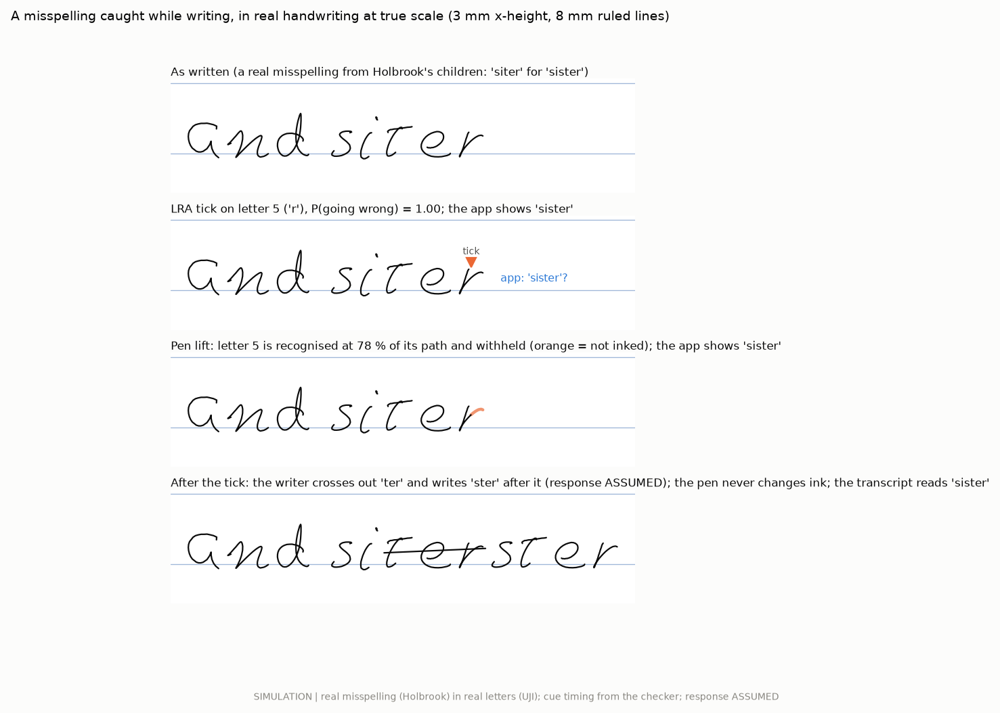
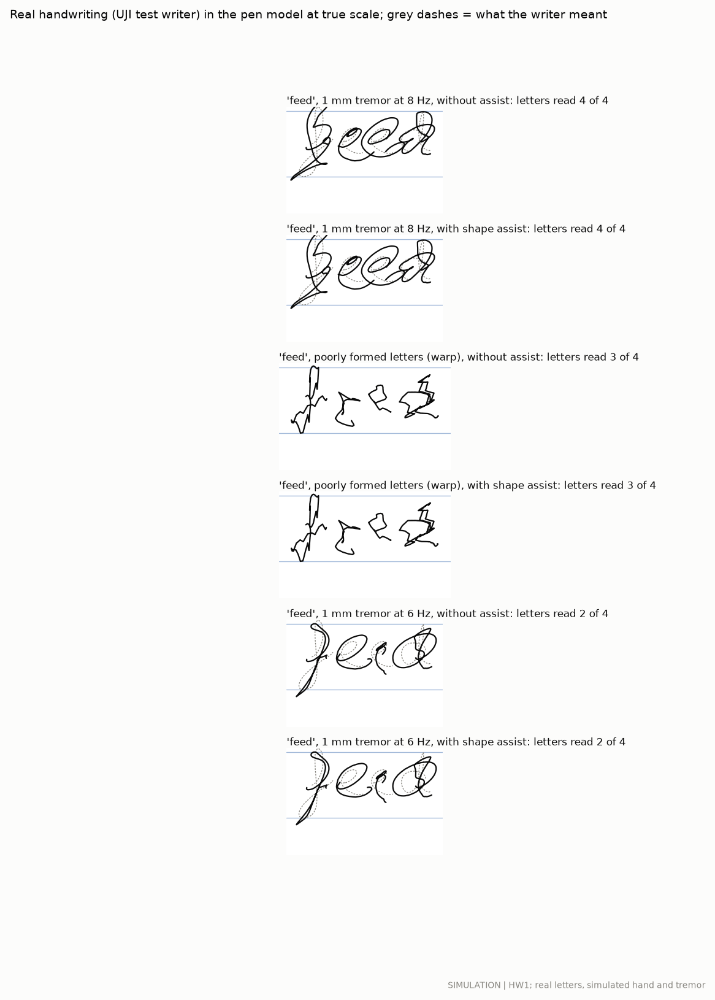
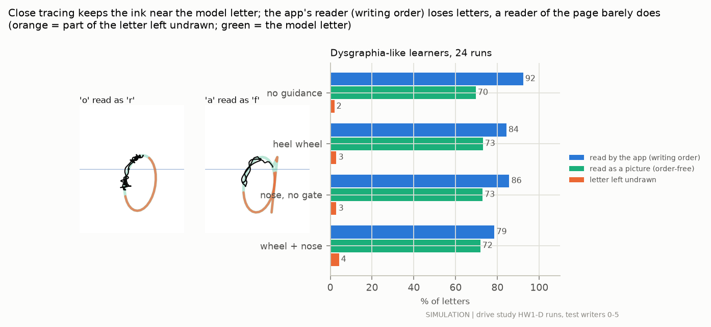
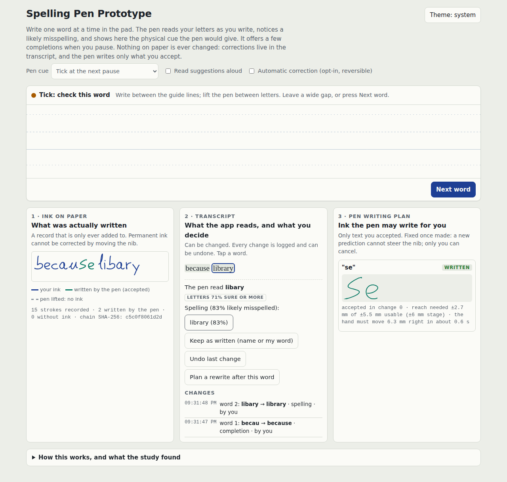

# Spelling help, text prediction and clearer handwriting (study S)

## The answer in plain words

- **The pen can read letters while they are written, and reading is the weak link.** For a writer it has never seen,
  the recogniser names 82 % of letters by the end of the letter and 52 % halfway through. One sample of each letter
  from the writer's other session raises this to 86 % and 60 %. With a language model, one word in five is still read
  wrong (9 % of letters). That is good enough to suggest, not good enough to act without asking.
- **A spelling checker built from real misspellings catches 63 % of children's real misspellings** with 2.3 false
  alarms per 100 correct words, when it knows the letters exactly. It catches 92 % of non-words but only 20 % of
  misspellings that are real words.
- **When the pen must read the letters itself, recognition errors look like spelling errors.** The planned design failed
  (1-3 % caught). A design added after that failure (so it needs confirming) puts the dictionary into the reading: it
  catches 34 % of misspellings at 1.7 false alarms per 100 correct words (28 % at 2.3 with the calibrated recogniser),
  puts right 68-72 % of the misread words, and its confidence is calibrated. The pen should ask, not act.
- **The physical cue that fixes most misspellings is a tick, plus a pen lift when the checker is very sure:** 3.4 of 10
  misspellings fixed on paper (simulated writers, responses assumed). Waiting for the next pause fixes 3.0 of 10 without
  any cue while a word is being written. Choosing between them is a matter of accuracy against fluency, to be settled
  with writers (EXP-S18).
- **Personal text prediction meets its target.** After one letter, the word being written is in the top three 52-56 %
  of the time on a person's own running text (so far: 46-47 %), in 3 ms. It saves effort, not time: letting the pen
  finish a word costs a typical writer about 15 % more time.
- **Close tracing lowered the letters read for two reasons, and neither was distance.** The app reads letters in writing
  order, and close tracing changes how ink is laid down (about half of the drop). The rest is real: parts of letters
  left undrawn. A reader of the page alone sees no loss (70 % unguided, 72 % traced).
- **Shape assist does not make handwriting clearer within safe limits.** Nudging the ink toward the recognised letter
  changes the letters read by less than one point (1 mm tremor: 41.4 % -> 41.9 %), because the nose may move only
  0.3 mm and must leave clean writing alone. The app's digital clean copy, on screen, doubles the letters read with 1 mm
  tremor (41 % -> 83 %).
- **The pen can write an accepted word only with enough reach and a moving hand.** With +-6 mm of nib reach and the
  hand advancing as usual, 95 % of accepted completions are written in full; at +-4 mm 23 %, at +-1-2 mm none.
  Starting a letter only when all of it fits means a hand-back never leaves half a letter.
- **A prototype page** reads handwriting with the study's own recogniser, shows the pen's cue on screen, offers
  completions at pauses, and keeps the ink record, the transcript and the pen's writing plan apart (28 of 28 smoke-test
  checks pass).

| Feature | One number | What it means | Label |
|---|---|---|---|
| Reading letters while writing | **82 %** (86 % calibrated) | letters named right by the end of the letter, 20 new writers | CALC on real letters (CON-90) |
| Reading words | **20 %** of words wrong | with the language model; 55 % wrong without it; held-out writers and sessions | SIM on real letters (EML-97) |
| Spelling check, letters known | **63 %** caught | children's real misspellings, 2.3 false alarms per 100 correct words | CALC (EML-93) |
| Spelling check, the pen's own reading | **34 %** caught | 1.7 false alarms per 100 correct words; a design chosen after the planned one failed | SIM (EML-98) |
| Physical cue (tick + lift) | **3.4 of 10** fixed on paper | misspellings fixed while writing; responses assumed | SIM (HAP-134) |
| Completion after one letter | **52-56 %** in the top 3 | on a person's own running text, 3 ms per suggestion | CALC (EML-94) |
| Close tracing explained | **70 % -> 72 %** | letters a page reader reads, unguided -> traced (the app: 92 % -> 79 %) | SIM (CON-91) |
| Shape assist | **+0.5 points** | letters read with 1 mm tremor, 41.4 % -> 41.9 % (the app's clean copy on screen: 41 % -> 83 %) | SIM (CON-92) |
| Writing an accepted word | **95 %** in full | at +-6 mm reach with the hand moving; 0 % at +-1-2 mm | SIM (CON-93) |
| Prototype | **28 of 28** checks pass | its smoke test (Playwright, desktop and phone, light and dark) | test |

Study S, 2026-09-29, with the lead's additions from the independent review (section 10). Labels: SIM (simulation),
CALC (calculation on recorded data), LIT + ledger id, ASSUMPTION, PROPOSED DESIGN. Nothing here was measured on people
or on a pen.

## Before and after, in pictures

Real handwriting at true scale; every picture is stamped with its evidence status and has a CSV twin in `results/ai3/`.

**A misspelling caught while it is written** (a real error by one of Holbrook's children, written with a UJI test
writer's real letters; the cue's timing comes from the checker; the writer's response is ASSUMED; the pen never
changes ink, so the correction is a crossing-out and the transcript holds the right word):



**Shape assist on real handwriting with tremor** (SIM, HW1; the same words without and with the assist):



**Why close tracing lowered the letters read** (SIM): guided letters with the parts left undrawn in orange, and the two
readers side by side:



**The prototype page** (screenshots from its smoke test; the page is `ai3/demo/index.html`):



Other figures: `fig_online.png` (letters read against the share of the letter written), `fig_words.png` (CER/WER),
`fig_spell_tradeoff.png`, `fig_spell_when.png`, `fig_spell_words.png`, `fig_calibration.png`, `fig_cues.png`,
`fig_predict.png`, `fig_shape_summary.png`, `fig_plan.png`.

## What each physical cue does

| Cue | What the pen does | When | What it cannot do |
|---|---|---|---|
| Tick at the next pause (the review's interaction) | One LRA tick when the pen lifts after a flagged word; the phone shows up to 3 suggestions, read aloud if wanted | after the word | help before the ink is down |
| Tick on the suspect letter | One LRA tick as soon as the checker's P(the word is going wrong) passes theta | mid-word | say what is wrong |
| Tick before a risky letter | One tick before a letter the model expects to go wrong (no knowledge of the answer) | mid-word | be right often: most warnings are for letters the writer gets right |
| Pen lift (withhold ink) | Lifts the ball off the paper once the letter being written is recognised AND the checker is very sure (theta_w); the phone shows suggestions | mid-letter | stop the part of the letter already drawn; it leaves a fragment |
| Tick + pen lift | Pen lift when very sure, a tick for every other flag | mid-word | as above |
| Show me (opt-in) | The nose draws the correct next letter lightly within its reach for the writer to trace | after a flag | reach letters beyond the nose's travel |
| Heel wheel steer | The wheel steers the start of the next letter toward the right letter | before a letter | move the pen; the writer decides |
| App only | Underlines flagged words after the note | after writing | help while writing |

In every mode the writer keeps control: outside the opt-in "show me" and an accepted completion, the pen never draws a
letter the writer did not write, and it never changes ink.

### Which physical cue we recommend

**Rule S4 (tuning children) recommends "tick, plus pen lift when very sure"**, and the choice holds at the low end of
the assumed responses (not fragile). On the 11 test children's real misspellings (SIM, letters known exactly, writer
responses ASSUMED) it gets 3.4 of every 10 misspellings fixed on paper (2.4-4.1 across the response range), at 2.3
false cues per 100 correct words and about 15 % more writing time.

The review's interaction, **a tick at the next pause with up to three suggestions**, gets 3.0 of 10 fixed (1.6-4.0)
with **no cue while a word is being written** (tick + lift: 7.7 cues per 100 words mid-word) and a similar reading load
(6.4 against 8.0 suggestion lists read per 100 words). The difference between the two is the accuracy-against-fluency
trade-off the review points to (R20); it cannot be settled by simulation, so EXP-S18 compares them with writers. The
prototype offers both and starts with the pause, because it reads the letters itself (see the last point).

- **Pen lift alone** (only when very sure) is the gentlest: 0.3 false lifts per 100 correct words, 2.3 of 10 fixed,
  but it leaves a fragment of the wrong letter about once per 100 words.
- **Show me** (opt-in) fixes 2.7 of 10 and draws about 4 letters per 100 words for the writer; the next letter is
  within the nose's reach only 47 % of the time.
- **A warning before a risky letter** never fired at an acceptable false-warning rate: the checker cannot see an error
  coming before it starts.
- **The heel-wheel steer** fixes 0.6 of 10: the writer rarely follows a nudge toward a letter they did not plan.
- **With letters read by the recogniser instead of known**, every mid-word cue floods the writer (about 40 false cues
  per 100 correct words at the same threshold): recognition errors look like misspellings. This is why the spelling
  layer must keep the two apart (T8), and why the physical cue should wait for the calibrated recogniser.

## The three outputs, kept apart (adopted from the review, section 10)

| Output | What it holds | Who can change it | Where it lives |
|---|---|---|---|
| 1. Ink record | Every pen-down stroke as written, with time and what the pen did on it (nothing, nudged, withheld ink, wrote an accepted word). Hash-chained, so any later edit shows. | Nobody. It is only ever added to. Permanent ink cannot be corrected by moving the nib. | `ai3/layers.py` `StrokeRecord`; the demo's panel 1 |
| 2. Transcript | What the app reads (the literal reading, never changed) and what the writer decides it should say. Every change is a logged revision (who, what, why, when) and can be undone. | The writer, by accepting a suggestion or editing. Automatic correction only in an opt-in mode, still logged and reversible. | `Transcript`; panel 2 |
| 3. Pen writing plan | Ink the pen may write for the writer. | Created only from an explicit acceptance. Fixed for its strokes: a new prediction cannot change it or steer the nib mid-letter; only the writer cancels it. A letter that has started is finished or abandoned, never re-routed. | `WritingPlan` + `ai3/complete_plan.py`; panel 3 |

Once a wrong word is on paper, the options are: a digital correction in the transcript; a suggested rewrite (the pen can
write the corrected word after it, if the writer accepts); an explicit crossing-out by the writer; or an erasable medium.
The tests `ai3/tests/test_layers.py` check each rule of this table (append-only record and tamper detection, audited
and undoable transcript, protected words never flagged, auto mode only when opted in and confident, plans only from a
writer's acceptance, plans that a prediction cannot change).

## The prototype you can try (`ai3/demo/index.html`)

One self-contained page (about 1.1 MB, no build step, no network calls; it works at phone width and in light and dark
mode). It opens on an example page ("we went to the libary", written with a UJI test writer's real letters) so the three
outputs are filled at first sight; "Start my own page", or simply writing on the pad, clears it.

- **Writing.** Write one word at a time between the guide lines with a mouse, a finger or a stylus. Letters are
  separated at pen lifts by rule W0 (the same rule as the study). A wide gap or "Next word" ends the word.
- **Reading.** The page runs the study's recogniser itself (the chosen GRU, weights inlined); the letters appear as
  chips while you write, with the top three below. Tapping a letter chip and choosing the right letter stores your own
  sample of it, which calibrates the recogniser to your hand (rule O4, kept in this browser only).
- **Spelling.** The task-2 checker (channel from real misspellings, 20,000-word lexicon) runs letter by letter on the
  letters the recogniser has committed to; at the word's end the review's score combines the recogniser's 3 best
  readings and the 3 dictionary words it finds most likely with the checker, calibrated by the study's Platt scaling
  (rule W5). Recognition alternatives ("Maybe you wrote ...?")
  and spelling suggestions are shown separately. "Keep as written" protects a name or an unusual word for good.
- **The pen cue.** Choose the cue: tick at the next pause (default, because the page reads the letters itself and a
  mid-word cue would also fire on misread letters), tick on the suspect letter, tick and pen lift when very sure (the
  rest of the word is drawn as dashed "no ink"), show me (opt-in: the next letter appears lightly, in your own style
  once you have written it), or none. On a phone a tick also vibrates the phone.
- **Completions.** At a pause (pen up for 0.8 s) the page offers up to three completions of the letters so far
  (keys 1-3, Esc to close; optional read-aloud). Accepting one writes it into the transcript and creates a pen writing
  plan for the missing letters, with its reach check (tallest letter against the usable reach at a 3 mm x-height) and
  how far the hand must move. "Let the pen write it" animates the pen writing the accepted letters; those strokes enter
  the ink record marked as written by the pen, with the plan's number. While the pen writes, no new suggestion can
  change the plan; "Stop" hands back.
- **The three outputs** sit side by side (stacked on a phone): the ink record (append-only, hash-chained, with a
  counter of pen-written and no-ink strokes), the transcript (literal reading, current text, every change with time,
  kind and who made it, undo), and the pen writing plans.

The page is a prototype of the interaction, not of the pen: the cue, the pen lift and the pen's writing are shown on
the screen.

**Smoke test** (`ai3/demo/smoke_test.js`, Playwright with Chromium; the page served locally inside the same document
skeleton the artifact host adds): **28 of 28 checks pass** at 1280 x 900 and 390 x 844, in light and dark. It checks:
no script errors; no request to any other host; no sideways scroll; the example page reads "we went to the libary" and
flags "libary" with "library"; the page's recogniser gives the Python model's top letter on 26 of 26 real test letters
(largest probability difference 0.0004); a pause after "becau" offers "because"; accepting it logs a transcript change
and makes a plan for "se" without adding ink; the pen then writes it, the ink record holds the pen-written strokes and
its hash chain verifies; "libary" written on the pad is flagged with "library", and accepting the suggestion changes the
transcript only; a letter drawn with the mouse is read as the Python model reads it; with the tick-and-lift cue chosen,
the cue fires on "libary" in the middle of the word.

## Details

### T1. Recognising letters while they are written (task 1)

A causal 2-layer GRU (114,842 parameters) reads the pen path point by point, resampled every 0.1 x-height, and gives a
probability for each of the 26 letters after every point. It was trained on 34 UJI writers (CC BY 4.0, CON-48) with
tremor added (rule O1 chose the tremor variant: it tied with the sigma-lognormal variant within 0.5 points on the tuning
writers and is simpler). The 20 test writers were used only for these numbers (CALC on real handwriting):

- **New writers:** 82 % of letters read at the letter's end (top 3: 94 %), 70 % at 70 % of the letter, 52 % halfway.
  With 1 mm tremor added (0.33 x-height): 73 %.
- **Calibrated** with one sample of each letter from the writer's other session (rule O4): 86 % at the end, 60 % halfway.
- **Committing early** (rule O2: top probability >= 0.9): 59 % of letters are committed before or at their end, 94 %
  of them right, at a median of 70 % of the letter.
- **With the next-letter prior** of the text predictor (rule O3, beta 0.5) on letters in held-out sentences: 74 % at
  half the letter and 88 % at the end (without: 54 % and 82 %).
- **Another dataset** (Character Trajectories, one writer on a Wacom tablet, single-stroke letters): 40 %. The model
  does not transfer to other capture conventions without calibration.
- **Cost:** 113,568 multiply-accumulates per point; 0.19 ms per point on this container's CPU (7.5 ms per median
  letter); 112 kB as int8; about 1.8 ms per point on a 128 MHz Cortex-M33 (CALC).

#### T1. Letters recognised while being written (20 UJI test writers, 1,040 letters; CALC)

| Recogniser and letters | 30 % written | 50 % | 70 % | whole letter | top-3, whole letter |
|---|---|---|---|---|---|
| New writer, clean | 32 % | 52 % | 70 % | 82 % | 94 % |
| New writer, 0.3 mm tremor | 30 % | 48 % | 67 % | 80 % | 93 % |
| New writer, 1 mm tremor | 17 % | 37 % | 55 % | 73 % | 90 % |
| Calibrated (writer's own letters), clean | 38 % | 60 % | 75 % | 86 % | n/a |
| Calibrated, 1 mm tremor | 20 % | 41 % | 61 % | 76 % | n/a |
| Other writer and tablet (Character Trajectories, 2,858 letters) | 28 % | 46 % | 55 % | 40 % | 65 % |

Commit rule (O2, tau 0.9): 59 % of letters committed before or at their end, commits right 94.3 %, median 70 % of the letter written at commit.
Calibrated: 22 % committed, right 99.1 %, median 78 % written; committed before the letter's end: 19 %.
With the text predictor's next-letter prior (beta 0.5, rule O3), letters in Tatoeba test sentences: half letter 54 % -> 74 %, whole letter 82 % -> 88 % (7255 letters).
Size and speed: 114,842 parameters (112 kB int8, 449 kB float32); 113,568 multiply-accumulates per point; 0.19 ms per point on this container's CPU (one thread), 7.5 ms for a median letter; 1.79 ms per point on a 128 MHz Cortex-M33 (int8, CALC).

Variants on the test writers, for information only (the choice was made on tuning writers, rule O1): whole-letter top-1 clean / 1 mm tremor: base 81 % / 41 %; tremor 82 % / 73 %; full 83 % / 74 %

### T7. Words: CER and WER, writer-disjoint and session-disjoint (review gate G7; SIM on real letters)

6,173 words of held-out sentences, each written with the real letters of one of the 20 test writers from one of their
two sessions (letters placed with ASSUMED print spacing; the recogniser never saw these writers). "Calibrated" uses
one sample of each letter from the writer's OTHER session (session-disjoint). Letters were separated at pen lifts by
rule W0 (2.8 % of letters split or merged wrongly).

| Recogniser | Language model | Letters wrong (CER) | Words wrong (WER) |
|---|---|---|---|
| New writer (writer-disjoint) | none | 22.9 % | 54.7 % |
| New writer | NG1x character model, beta 0.75 (rule W1) | 9.1 % | 19.8 % |
| Calibrated on the other session (session-disjoint) | none | 20.1 % | 50.9 % |
| Calibrated on the other session | NG1x, beta 0.75 | 9.2 % | 20.2 % |

With tight spacing (ASSUMPTION: gaps of 0.08 x-height) the language-model rows rise to 10.5 % and 22.5 %. The
language model does most of the work: calibration helps letters on their own (20 % against 23 % CER) but adds nothing
once the language model is on. One word in five is still read wrong: enough to offer, not enough to act without asking.

#### T7. Word recognition: character and word error rates (20 held-out UJI writers; SIM on real letters)

| Recogniser | Spacing | CER no LM | CER with LM | WER no LM | WER with LM |
|---|---|---|---|---|---|
| new writer (writer-disjoint) | normal | 22.9 % | 9.1 % | 55 % | 20 % |
| calibrated on the other session (session-disjoint) | normal | 20.1 % | 9.2 % | 51 % | 20 % |
| segmentation errors per letter | normal | 2.8 % | | | |
| new writer (writer-disjoint) | tight | 23.9 % | 10.5 % | 56 % | 22 % |
| calibrated on the other session (session-disjoint) | tight | 21.1 % | 10.6 % | 52 % | 23 % |
| segmentation errors per letter | tight | 3.5 % | | | |

Rule W1 (tuning writers): language weight beta_w = 0.75. Words: Tatoeba test sentences written with each writer's letters from one session; spacing N(0.25, 0.12) x-height (normal) and N(0.08, 0.12) (tight), ASSUMPTION.

### T2. The spelling checker on children's real misspellings (task 2)

The checker reads each letter as it is written and asks, after every letter, how likely it is that the letters so far
are no longer the start of the word the writer means (a noisy channel: a dictionary prior from NG1x, an error model
learned from 29,483 real misspellings of the Birkbeck corpus, and the writer's error rate from the tuning children).
On 11 test children's real writing from Holbrook's collection (CALC; 1,879 misspelled and 12,242 correctly spelled
words; letters known exactly):

- **Caught: 63 %** of misspellings, with **2.3 false alarms per 100 correct words** (the rule aimed at 2 on the tuning
  children and got 1.7 there). Non-words: 92 % caught. Misspellings that are real words ("there" for "their"): 20 %.
- **When:** 42 % are flagged on the first wrong letter, 28 % one letter later and 28 % two or more letters later; the
  median flag comes at letter 4. The first wrong letter is typically letter 3 (three quarters into the word), and 17 %
  of errors only show at the word's end, when nothing written is wrong yet.
- **Suggestions:** the right word comes first 59 % of the time and is in the top 3 77 % of the time.
- **One word later** (the next word as context): 67 % caught at 2.9 false alarms.
- **The pen-lift threshold** (very sure, mid-word only): 35 % caught with 0.29 false lifts per 100 correct words.
- **Other text:** Birkbeck test misspellings placed in CC0 sentences: 82 % caught, 6.3 false alarms per 100 (a different
  text style than the tuning children's).

#### T2. The spelling checker on 11 test children's real writing (Holbrook; CALC)

| Measure | Value |
|---|---|
| Misspelled words (scored) | 1879 |
| Correctly spelled words | 12242 |
| Caught (flag while writing or at the word's end) | 63 % |
| False alarms per 100 correct words | 2.3 |
| Caught non-word errors | 1028 of 1116 |
| Caught real-word errors | 156 of 763 |
| Flag on the first wrong letter / one letter later / two or more later | 42 % / 28 % / 28 % |
| Right word first / in the top 3 (caught single words) | 59 % / 77 % |
| With the next word as context (one word later) | caught 67 %, 2.9 false alarms per 100 |
| Pen-lift threshold (mid-word only, rule S3) | caught 35 %, 0.29 false lifts per 100 |

Earliest letter (single-word errors, n = 1773): the first wrong letter is letter 3 (median; 75 % of the word); 17 % of errors only show at the word's end (the child wrote the start of the right word); the written letters stop being the start of ANY dictionary word at letter 5 (median), and 51 % never do (real-word errors).

Rules: alpha 0.063 (tuning children's error share); p_oov 0.01; theta 0.3; theta_w 0.9999. Lexicon 32,531 words, covering 98.4 % of the children's intended words; 10.3 ms per letter on this CPU.

Birkbeck test misspellings placed in CC0 sentences (3068 words, 4 % misspelled): caught 82 %, 6.3 false alarms per 100, right word in the top 3 81 %.
Letters read by the recogniser (writer_independent, 19 % letter errors): caught 77 %, 40.6 false alarms per 100 correct words (724 errors, 4767 correct words).
Letters read by the recogniser (calibrated, 15 % letter errors): caught 76 %, 38.7 false alarms per 100 correct words (724 errors, 4767 correct words).

| Test child | Words misspelled | Caught | False alarms per 100 |
|---|---|---|---|
| Nigel Thrush | 12 % | 63 % | 3.1 |
| George Green | 14 % | 71 % | 3.8 |
| John Young | 9 % | 66 % | 1.4 |
| Roger Scott | 12 % | 59 % | 1.9 |
| James Carr | 16 % | 69 % | 1.5 |
| Tom Sullivan | 8 % | 49 % | 2.4 |
| Rose Jameson | 17 % | 70 % | 1.5 |
| Kenneth Prime | 23 % | 62 % | 1.2 |
| Gerald Goodchild | 13 % | 24 % | 2.2 |
| Pat Johnson | 5 % | 57 % | 3.3 |
| Michael Holmes | 10 % | 55 % | 3.3 |

### T8. Spelling help when the pen reads the letters itself (the review's score; SIM)

Every letter a test child wrote is replaced by a real sample of that letter written by a held-out UJI writer and read
by the recogniser, so recognition errors (18 % of letters for a new writer) mix with the child's spelling errors. Of
2,171 single words, 986 were misread somewhere.

- **As planned (rules W2-W3), the design failed.** Scoring only the recogniser's 3 best letter strings, the correct
  word was often not among them; temperature scaling could not repair the overconfident score (ECE 0.19-0.22 before,
  0.33-0.35 after) and at <= 2 false alarms per 100 correct words it caught 1-3 % of misspellings.
- **Post hoc (rule W5, written after that result and labelled so):** adding the 3 dictionary words of the written
  length that the recogniser finds most likely, and calibrating with Platt scaling (a slope and an offset), the pen's
  own reading catches 34 % (new writer) and 28 % (calibrated) of misspellings at 1.7 and 2.3 false alarms per 100 correct words (letters known exactly, on
  the same words: 63 % at 1.8). It puts right 68-72 % of the misread words and changes 1-5 % of the right readings; it
  leaves 83-95 % of unusual correct words (not in the dictionary) unflagged; its confidence is calibrated (ECE
  0.06-0.08 raw, 0.03 after Platt scaling). A suggestion is shown for 26-65 % of flagged misspellings and is right 62-79 % of the time (87 % on
  the tuning children for the new-writer version: the suggestion threshold overfitted). The opt-in automatic correction changed no correct word and
  fixed almost nothing: at this reading accuracy the pen should ask, not act.
- **Lesson:** the dictionary must enter the reading of the letters, not only the spelling check afterwards; and each
  new design must be confirmed on new children and writers (EXP-S20), since W5 was chosen after seeing W2 fail.

#### T8. Spelling help with the pen's own reading of the letters (the review's score; 11 test children; SIM)

| Recogniser | Caught | False alarms per 100 correct | Suggestion shown / right when shown | Misread words put right / right readings changed | Unusual correct words kept | ECE raw / calibrated | Auto mode: errors fixed / correct words changed per 100 |
|---|---|---|---|---|---|---|---|
| independent, as planned (W2, temperature) (lambda_r 0.5, T 13.63, theta_c 0.8, p_s 0.7) | 1 % | 1.3 | 0 % / 0 % | 36 % / 2.3 % | 100 % | 0.224 / 0.353 | 0.0 / 0.00 |
| calibrated, as planned (W2, temperature) (lambda_r 0.5, T 10.42, theta_c 0.85, p_s 0.7) | 3 % | 1.1 | 0 % / 0 % | 40 % / 2.7 % | 100 % | 0.193 / 0.334 | 0.0 / 0.00 |
| independent, post hoc (W5: + lexicon readings, Platt) (lambda_r 1.5, Platt a 0.38, b -1.37, theta_c 0.4, p_s 0.2) | 34 % | 1.7 | 65 % / 62 % | 68 % / 1.0 % | 83 % | 0.062 / 0.032 | 0.4 / 0.00 |
| calibrated, post hoc (W5: + lexicon readings, Platt) (lambda_r 1.0, Platt a 0.38, b -0.71, theta_c 0.3, p_s 0.4) | 28 % | 2.3 | 26 % / 79 % | 72 % / 5.2 % | 95 % | 0.081 / 0.035 | 0.0 / 0.00 |
| letters known exactly, same words (task 2's checker) | 63 % | 1.8 | right word first 59 % | n/a | n/a | n/a | n/a |

Letters seen through real held-out letters (test pool): read right 82 % (new writer), 86 % (calibrated).

### T3. Physical cues (task 2)

#### T3. Physical cues (11 test children's real errors; writer responses ASSUMED; SIM)

| Cue | Mistakes caught per 10 | Fixed on paper per 10 (low - high) | False cues per 100 correct | Correct words made wrong per 100 | Extra time | Cues felt mid-word per 100 words | Suggestion lists read per 100 words | Letters drawn by the pen per 100 words | Wrong-letter fragments per 100 words |
|---|---|---|---|---|---|---|---|---|---|
| No cue | 0.0 | 0.0 (0.0 - 0.0) | 0.0 | 0.00 | +0 % | 0.0 | 0.0 | 0.0 | 0.0 |
| App underlines afterwards (no physical cue) | 6.1 | 0.0 (0.0 - 0.0) | 2.3 | 0.25 | +5 % | 0.0 | 10.1 | 0.0 | 0.0 |
| LRA tick on the suspect letter | 6.1 | 2.6 (1.4 - 3.4) | 2.3 | 0.16 | +16 % | 7.4 | 6.4 | 0.0 | 0.0 |
| LRA tick before a risky letter | 0.0 | 0.0 (0.0 - 0.0) | 0.0 | 0.00 | +0 % | 0.0 | 0.0 | 0.0 | 0.0 |
| Pen lift: the wrong letter is not drawn | 3.6 | 2.3 (1.8 - 2.7) | 0.3 | 0.03 | +8 % | 4.8 | 4.8 | 0.0 | 1.0 |
| Tick, plus pen lift when very sure | 6.1 | 3.4 (2.4 - 4.1) | 2.3 | 0.16 | +15 % | 7.7 | 8.0 | 0.0 | 1.0 |
| Show me (opt-in): nose draws the next letter | 6.1 | 2.7 (1.5 - 4.0) | 2.3 | 0.22 | +9 % | 7.4 | 0.0 | 4.4 | 0.0 |
| Heel wheel steers toward the right letter | 0.0 | 0.6 (0.2 - 1.0) | 1.9 | 0.09 | +0 % | 8.3 | 0.0 | 0.0 | 0.0 |
| Tick at the next pause + suggestions | 6.1 | 3.0 (1.6 - 4.0) | 2.3 | 0.15 | +17 % | 0.0 | 6.4 | 0.0 | 0.0 |

Rule S4 (tuning children): recommended **tick_lift** (fragile: False); admissible: tick_after, tick_before, withhold, tick_lift, heel_steer, pause_offer. Rule S5: theta_b 0.02. Recogniser commit before a letter's end: 19 %. Next letter within the nose's reach: 47 % (median farthest point 5.6 mm).

With letters from the recogniser (writer_independent), nominal responses: tick_after fixed 2.1/10, false cues 40.6/100; tick_lift fixed 2.2/10, false cues 40.6/100; withhold fixed 0.1/10, false cues 0.1/100
With letters from the recogniser (calibrated), nominal responses: tick_after fixed 2.3/10, false cues 38.7/100; tick_lift fixed 2.3/10, false cues 38.7/100; withhold fixed 0.1/10, false cues 0.1/100

### T4. Personal text prediction (task 3)

The predictor learns the writer's own words as they write (a decaying word cache and the writer's own word pairs on top
of NG1x; rule P1 chose cache weight 0.1, half-life 500 words, pair weight 0.4). On two public-domain journals it has never
seen, used as stand-ins for a person's notes (EML-91; CALC):

- **After one letter** of a word, the word is in the top 3 **52-56 %** of the time (the model used so far: 46-47 %),
  in 2.2-3.0 ms (95th percentile, this CPU). REQ-APP-003 (>= 30 % top-3 at <= 20 ms) is met for completions.
- **Before any letter** (next word) the top 3 hold it 22-24 % of the time (so far: 20 %): below 30 %; offer next words
  only after the first letter.
- **Letters saved** if the writer always took the right word from a top-3 list: 46-50 %.
- **Time.** Accepting a completion costs a look and a gesture (ASSUMED 0.25 s and 0.6 s). Offered only when very likely
  (p >= 0.7, rule P2), letting the pen write the rest costs a typical writer about 7 s per 100 letters (15 % more time)
  and saves a slow writer 1-3 %. Completion is worth offering for spelling and effort, not for speed.

#### T4. Text prediction on the user's own notes (test journals; CALC)

| Journal | Model | Next word top-1 / top-3 | After 1 letter top-1 / top-3 | After 2 letters top-1 / top-3 | Letters saved (top-1 / top-3 list) | p95 latency |
|---|---|---|---|---|---|---|
| 11579 | NG0 (as used so far) | 11 % / 20 % | 30 % / 46 % | 45 % / 59 % | 29 % / 41 % | 0.3 ms |
| 11579 | NG1x (larger corpus) | 12 % / 21 % | 31 % / 47 % | 48 % / 62 % | 31 % / 44 % | 0.8 ms |
| 11579 | personalised (chosen) | 14 % / 24 % | 37 % / 56 % | 55 % / 70 % | 37 % / 50 % | 3.0 ms |
| 2024 | NG0 (as used so far) | 10 % / 20 % | 31 % / 47 % | 46 % / 61 % | 28 % / 41 % | 0.3 ms |
| 2024 | NG1x (larger corpus) | 11 % / 21 % | 31 % / 49 % | 48 % / 63 % | 30 % / 44 % | 1.0 ms |
| 2024 | personalised (chosen) | 12 % / 22 % | 33 % / 52 % | 50 % / 64 % | 32 % / 46 % | 2.2 ms |

Rule P1 chose {'base': 'NG1x', 'lc': 0.1, 'half_life': 500.0, 'lb': 0.4, 'score': 0.5267777777777778}; rule P2 chose p_offer 0.7.

Journal 11579, autowrite completion on request (offers at p >= 0.7): -7.1 s per 100 letters for a typical writer (-16 % of writing time), +2.7 s (3 %) for a slow writer.
Journal 2024, autowrite completion on request (offers at p >= 0.7): -6.9 s per 100 letters for a typical writer (-15 % of writing time), +1.3 s (1 %) for a slow writer.

### T5. Why close tracing made letters harder to read (task 4a)

The drive study found that with the heel wheel steering and the nose pulling the ink onto the model letter, the ink lay
76 um from the letter but the app read only 79 % of letters (92 % unguided). Re-running its 24 test runs per profile
(SIM, model HW1-D, read-only) letter by letter reproduces those numbers exactly (92.3 % and 78.5 %) and explains them:

1. **The app's reader reads letters as paths in writing order** (its strokes joined in the order they were drawn,
   pen-up jumps included), so it reacts to how the ink was laid down (where strokes start and stop, and in which order
   the parts are covered), not only to what the page shows. Close tracing pulls the ink to the nearest point of the
   model letter, which changes exactly that.
2. **A reader of the page sees little or no loss.** A second, order-free reader looks only at the picture of the ink
   (the same 26 letter shapes in the writer's style, matched by chamfer distance). For the dysgraphia-like learners it
   reads 70 % of unguided letters and 72 % of closely traced ones (the app's reader: 92 % and 79 %); for the
   dyslexia-like learners 77 % and 72 % (the app's: 83 % and 76 %). It is a weaker reader than the app's, but it treats
   both conditions alike.
3. **Some parts of letters are never drawn.** With close tracing 4.2 % of each letter's path has no ink within 1 mm
   (2.0 % unguided). The 123 letters the app reads unguided but misreads when traced have 18 % of their path undrawn on
   average, and 56 % of them miss more than 15 %.
4. **Counterfactual readings of those 123 letters:** redrawing only the parts that were drawn, in the letter's own
   order, makes the app read 58 % of them again; adding the missing parts, 42 %; snapping the ink exactly onto the
   letter while keeping its order, only 9 %. 60 of the 123 are also misread by the order-free reader, and the letters
   that reader loses are read again in 80 % of cases when the missing parts are added.

**So:** about half of the drop is the app's order-sensitive reader reacting to how the ink was laid down, and the rest
is real: parts of letters left undrawn. None of it comes from the ink being too far from the letter (snapping it onto
the letter does not help). Guidance should advance along the letter instead of jumping to its nearest part, check that
every part gets drawn, and be judged by a reader of the page or by people, not only by an order-sensitive recogniser
(DEC-057, EXP-S16). The shape assist below follows these rules.

#### T5. Why close tracing lowers legibility (drive study's runs, 6 test writers x 4 seeds; SIM)

| Learners | Condition | Ink to target | Letters read by the app (writing order) | Read as a picture (order-free) | Share of each letter left undrawn (> 1 mm from any ink) | Ink running backwards along the letter | Newly misread by the app / by both readers | ...app reads them again if drawn in the letter's own order / if the missing part is added |
|---|---|---|---|---|---|---|---|---|
| dysgraphia | none | 447 um | 92 % | 70 % | 2 % | 7 % | 0 / 0 | n/a / n/a |
| dysgraphia | nose_partial | 268 um | 94 % | 77 % | 1 % | 8 % | 13 / 4 | 69 % / 23 % |
| dysgraphia | wheel_path | 277 um | 84 % | 73 % | 3 % | 6 % | 67 / 22 | 48 % / 54 % |
| dysgraphia | nose_nogate | 83 um | 86 % | 73 % | 3 % | 10 % | 75 / 44 | 69 % / 20 % |
| dysgraphia | wheel_path+nose | 68 um | 79 % | 72 % | 4 % | 7 % | 123 / 60 | 58 % / 41 % |
| dyslexia | none | 412 um | 83 % | 77 % | 6 % | 6 % | 0 / 0 | n/a / n/a |
| dyslexia | nose_partial | 274 um | 84 % | 79 % | 6 % | 6 % | 7 / 3 | 71 % / 0 % |
| dyslexia | wheel_path | 293 um | 81 % | 73 % | 8 % | 5 % | 19 / 15 | 53 % / 32 % |
| dyslexia | nose_nogate | 82 um | 77 % | 73 % | 7 % | 8 % | 53 / 37 | 58 % / 2 % |
| dyslexia | wheel_path+nose | 72 um | 76 % | 72 % | 8 % | 6 % | 59 / 54 | 56 % / 20 % |

### T6. Shape assist and clean copy (task 4b)

Shape assist (PROPOSED DESIGN) nudges the ink toward the recognised letter's shape, in the writer's own style, within
small limits. It acts only on a letter the recogniser has named with at least 90 % confidence; it follows the writer's
own other sample of that letter by open-end time warping, so it can only move forward along the letter and cannot jump
to its nearest part as close tracing did; it keeps the writer's position and size; it ignores deviations below 0.2
x-height; and it moves the nose by at most 0.3 mm at gain 0.25. Rule A1 chose these settings on 6 tuning writers: only
3 of 81 settings kept clean writing within 25 um, made no letter unreadable and left at least 75 % of the ink's motion
to the writer. The settings that helped most (+0.8 letters per 100) moved clean writing by 62 um and made 2.8 % of
letters unreadable.

It was tested in model HW1 (Rev H nose, page sensor) on 1,400 words written with the real UJI letters of the 20 test
writers, with tremor or a dysgraphia-like warp added. Letters were read by an independent offline reader of the page (a
CNN trained on other writers; it reads 89 % of clean test letters):

- **Within these limits the assist changes almost nothing.** Letters read without and with it: clean 87.9 % and 88.3 %;
  1 mm tremor at 8 Hz 41.4 % and 41.9 %; real essential tremor (study R's recordings, 1 mm) 47.0 % and 47.3 %; real
  Parkinson's tremor 29.4 % and 28.9 %; warped letters 55.7 % and 55.3 %. Clean writing moved 23 um on average (121 um
  in the worst word). A 1 mm tremor is more than three times the nose's 0.3 mm, and the gentle gain moves the ink only a
  little toward the letter.
- **Close tracing lowers reading of the same warped words** (55.7 % to 51.2 %), as task 4a found.
- **The app's digital clean copy helps much more, on screen:** with 1 mm tremor at 8 Hz it raises the letters read
  from 41 % to 83 % and the words from 4 % to 45 %; with real essential tremor from 47 % to 52 %, with real Parkinson's
  tremor from 29 % to 39 %. It slightly lowers clean writing (88 % to 85 %), because it switched on for 27 % of the clean
  words: its tremor detector should be stricter. Clean copy v2 (redrawing confidently read letters from the writer's own
  calibration letters, marked synthetic) added at most one point and was not adopted (rule A2 needed 2 points).

**So:** clearer handwriting on paper, for tremor, has to come from the tremor stabilisation itself or from writing
accepted text (DEC-049); the shape assist, kept gentle enough to leave clean writing alone, does not add legibility.
Clearer text on screen comes from the clean copy.

#### T6. Shape assist on 20 new writers' real letters in HW1 (SIM)

| Writer's hand | Letters read without / with assist | Words fully read without / with | Ink moved (mean / worst word) | Device share of ink motion | Ink to intended letters without / with | Letters helped / harmed |
|---|---|---|---|---|---|---|
| clean | 88 % / 88 % | 56 % / 58 % | 23 / 121 um | 1 % | 1 / 24 um | 4 / 0 |
| warp | 56 % / 55 % | 8 % / 8 % | 32 / 184 um | 1 % | 6 / 35 um | 2 / 6 |
| tremor_0.3mm_8Hz | 80 % / 80 % | 38 % / 38 % | 23 / 112 um | 1 % | 275 / 276 um | 3 / 3 |
| tremor_1mm_8Hz | 41 % / 42 % | 4 % / 4 % | 41 / 153 um | 1 % | 916 / 912 um | 12 / 8 |
| tremor_1mm_6Hz | 46 % / 47 % | 4 % / 4 % | 37 / 165 um | 1 % | 863 / 859 um | 9 / 7 |
| real_PD_tremor_1mm | 29 % / 29 % | 1 % / 1 % | 41 / 122 um | 1 % | 1014 / 1010 um | 3 / 8 |
| real_ET_tremor_1mm | 47 % / 47 % | 2 % / 2 % | 42 / 126 um | 1 % | 1000 / 994 um | 9 / 6 |

Close tracing (nearest-point, full gain, no gate) on the same poorly formed words: letters read 56 % -> 51 %.

Rule A1 chose {'c_min': 0.9, 'g': 0.25, 'q_max_mm': 0.3, 'd0_xh': 0.2}. Judge (offline reader) accuracy on clean test letters: 89 %.

Spot check with study R's word reader (microsoft/trocr-base-handwritten, literal, no lexicon; post hoc) on 60 sample words: read 85 % of the writers' clean letters, 23 % without the assist, 23 % with it. By condition (without / with): clean 100 % / 100 % (9 words); real_ET_tremor_1mm 0 % / 0 % (8 words); real_PD_tremor_1mm 0 % / 0 % (8 words); tremor_0.3mm_8Hz 56 % / 56 % (9 words); tremor_1mm_6Hz 0 % / 0 % (8 words); tremor_1mm_8Hz 0 % / 0 % (9 words); warp 0 % / 0 % (9 words).

| Writer's hand | App clean copy: letters read raw / clean copy / clean copy v2 | Words read raw / clean copy / v2 | Letters re-drawn (synthetic) | ...of which the wrong letter |
|---|---|---|---|---|
| clean | 88 % / 85 % / 85 % | 56 % / 52 % / 52 % | 15 % | 1 |
| warp | 56 % / 54 % / 55 % | 8 % / 7 % / 8 % | 6 % | 1 |
| tremor_0.3mm_8Hz | 80 % / 84 % / 84 % | 38 % / 46 % / 46 % | 13 % | 0 |
| tremor_1mm_8Hz | 41 % / 83 % / 83 % | 4 % / 44 % / 45 % | 13 % | 0 |
| tremor_1mm_6Hz | 46 % / 57 % / 58 % | 4 % / 12 % / 13 % | 6 % | 2 |
| real_PD_tremor_1mm | 29 % / 39 % / 40 % | 1 % / 4 % / 4 % | 4 % | 1 |
| real_ET_tremor_1mm | 47 % / 52 % / 52 % | 2 % / 8 % / 8 % | 5 % | 0 |

Rule A2 (tuning writers): clean copy v2 words gain +0.007; adopted: False.

### T9. Writing an accepted word with the pen (review section 10; rule C1; SIM, kinematics only)

The rest of an accepted word is a path r(s) in the writer's own letters; the hand moves as b(t); the nib must stay
within its usable reach, |r(s(t)) - b(t)| <= R - 0.5 mm. 100 completions (the rest of words of 5 or more letters,
accepted after 40-60 % was written) in the 20 test writers' own letters at a 3 mm x-height: the part the pen writes is
11.8 mm long (median; 19.1 mm at the 90th percentile), and a writer's hand advances about 7.4 mm/s.

- **Reach decides.** With the hand advancing as usual, 95 % of accepted completions are written in full at +-6 mm of
  nib reach, 23 % at +-4 mm, 4 % at +-3 mm and none at +-1-2 mm. The letters' own height already needs about +-3 mm
  (ascenders and descenders around a 3 mm x-height), and the nib moves back and forth inside each letter while the hand
  moves on. Knowing the word does not enlarge the workspace.
- **The hand must move.** With the hand held still, 2 % complete even at +-6 mm; if it runs ahead (1.8 x its usual
  pace) the nib, limited to the writer's own speed (30 mm/s), cannot keep up and hands back; a 3-second pause ends 76 %
  of completions in a hand-back.
- **Letter admission keeps the page clean.** Starting a letter only when all of it is predicted to stay in reach
  leaves 0-8 half-written letters per 100 completions at +-6 mm, against 4-99 when the pen writes point by point; the
  price is fewer completions when the hand pauses (24 % against 42 %).
- **Time.** When the hand advances as usual the pen takes the same time as the writer's own writing (x1.01); it saves
  effort and spelling, not time.

#### T9. Writing an accepted word with the pen (kinematic planner, rule C1; SIM)

| Hand | +-1 mm | +-2 mm | +-3 mm | +-4 mm | +-6 mm | half letters per 100 (point by point / whole letter) at +-6 mm | time vs own writing |
|---|---|---|---|---|---|---|---|
| steady | 0 % | 0 % | 4 % | 23 % | 95 % | 4 / 0 | 1.01 |
| slow | 0 % | 0 % | 16 % | 42 % | 98 % | 2 / 0 | 1.23 |
| fast | 0 % | 0 % | 0 % | 0 % | 1 % | 99 / 8 | 1.01 |
| pause | 0 % | 0 % | 0 % | 8 % | 24 % | 58 / 8 | 1.01 |
| still | 0 % | 0 % | 0 % | 0 % | 2 % | 97 / 0 | 1.01 |

100 completions (the rest of words of 5+ letters after 40-60 % written); rest-of-word extent median 11.8 mm (90th percentile 19.1 mm); the hand's usual advance 7.4 mm/s.

## Methods

### Task 1: online recognition
- Data: UJI Pen Characters v2, lower-case a–z (CC BY 4.0, CON-48): 60 writers × 26 letters × 2 repetitions = 3,120 real letters on a tablet. 34 training, 6 tuning, 20 test writers (sha256 split of the 40 'trn' writers; the 20 'tst' writers only for the final table). Character Trajectories (CC BY 4.0, CON-25): one other writer on a Wacom tablet, 2,858 single-stroke letters of 20 classes with real 200 Hz timing, as a cross-dataset test.
- Timing of UJI (ASSUMPTION, checked): points are taken as samples at a uniform rate (their speed–curvature exponent is 0.21, against 0.05 when the same letters are resampled by arc length; the two-thirds power law, LIT CON-27, predicts about 0.33 for timed samples), with the rate set so that the median pen-down speed at a 3 mm x-height is 30 mm/s (LIT CON-20: adults on paper 30.5 mm/s). This gives 8.1 ms per point.
- Input: the letter as far as it is written, resampled every 0.1 x-height of pen path, (x, y) from the letter's first point, (dx, dy), pen flag. Output: posterior over 26 letters after every point.
- Model: 2-layer GRU, 96 units, 114,842 parameters; loss on every prefix (weights rising along the letter).
- Augmentation variants (rule O1): base (affine + jitter), + tremor (4–12 Hz, up to 0.4 x-height), + sigma-lognormal variation (each stroke fitted with ai2's extractor, parameters perturbed at 0.3 or 0.6 of ai2's intra-writer spread).
- Rules O2 (commit threshold), O3 (language weight), O4 (writer calibration fusion) on the tuning writers.

### Task 2: spelling checker
- Channel: Brill & Moore (2000) segment edits alpha → beta (|alpha|, |beta| ≤ 3, with one letter of context), plus context-free single-letter substitution/insertion/deletion/match probabilities, all estimated from 29,483 Birkbeck pairs whose target word is in the training bucket; probabilities are conditional on the word being misspelled.
- Prior: word bigram Kneser–Ney of NG1x; out-of-vocabulary words get p_oov × the character model's probability of the letters.
- Writer: with probability alpha a word goes through the channel.
- Search: the whole lexicon as a trie in arrays; each written letter adds one dynamic-programming column over all trie nodes (vectorised by depth), so the cost per letter does not depend on the number of candidate words.
- After every letter: P(deviation) = mass of (intended word, misspelling) pairs in which the letters so far are not the start of the intended word, against the mass of words that start with these letters and of an unknown word. At the word end: P(the finished word is not the intended word); ranked corrections. One word later: the same with the next word as right context.
- Names: a word written with a capital inside a sentence is not flagged (tuning children).

### Task 4b: shape assist
- Controller per letter: recognise (task 1 model on the page-sensor path; commit when the top posterior ≥ c_min) → template = the writer's own other sample of the recognised letter → open-end DTW of the path so far to the template (progress only forward) → template placed by the least-squares offset over the matched points → command = g × (deviation − dead band), |q| ≤ q_max, 30 Hz low-pass, 30 ms ramp in/out.
- Plant: HW1 (Rev H nose, 80 Hz servo, ±3 mm; the command enters as an external nose command computed from the page sensor of the nose-held run: 1 kHz, 2 ms late, 3 µm noise).
- Judge: an offline CNN reader of the rendered ink (32 × 32 px, 7 px per x-height), trained on the training writers' letters with augmentation; never the recogniser the assist uses.

### Words (review section 10, gate G7)
- Words of held-out CC0 sentences (Tatoeba test; validation for tuning) written with ONE UJI writer's real letters from ONE session, left to right with gaps of N(0.25, 0.12) x-height (ASSUMPTION; tight N(0.08, 0.12) as a sensitivity).
- Letters separated at pen lifts by rule W0 (a stroke joins the letter before it if it overlaps its horizontal extent by 0.2 x-height; dots within 0.5).
- Reading: each segment through the GRU (no language); calibrated: fused with open-end DTW to the writer's letters from the OTHER session (O4). With LM: beam search (8) with the NG1x character 7-gram, weight beta_w (W1).
- CER = edit distance / letters; WER = share of words with any error.

### Spelling with the pen's reading (the review's score)
- For every letter a Holbrook child wrote, the posterior of a real sample of that letter by a random held-out UJI writer (tuning writers for tuning children, test writers for test children), independent or calibrated.
- The 3 best readings x of the word (pruned below e^-14 of the best); for each, task 2's checker gives P(x | w) P(w | context) over the lexicon and the unknown-word branch. Score = lambda_r log P(strokes | x) + log P(x, w). P(misspelled) = sum over readings of the misspelled mass; the reading with the highest posterior is the pen's reading (a recognition fix if it differs from the letter-by-letter reading).
- Temperature scaling of P(misspelled) (Guo et al. 2017, EML-96) and of the top suggestion's probability, fitted on tuning children by NLL; theta_c for <= 2 false alarms per 100 correct words (W2); suggestions shown only above p_s (W3); opt-in auto mode at 0.9/0.9 (W4). ECE with 15 bins.

### Physical completion (rule C1)
- Completions: words of >= 5 letters from Tatoeba test sentences, accepted after 40-60 % of the letters; the rest written with the test writer's session-1 letters at 3 mm x-height.
- Nib: path speed <= 30 mm/s, acceleration <= 2 m/s^2, only forward along the accepted path; usable reach = stage radius - 0.5 mm. Hand (ASSUMPTION): advancing at the writer's own pace (+-15 % at 1.3 Hz), half speed, 1.8x, pausing 3 s, or still; 2 ms steps.
- Policies: point by point, or letter admission (start a letter only if all of it is predicted to stay in reach from the hand's velocity over the last 0.3 s). A pen-down point out of reach forces a lift (an ink gap); 0.5 s without progress lifts; 2 s hands back; running past hands back.

## Rules (written before each test; the tests used only the values these rules chose)

Rules of the original brief (hash `0fb2465cae45f7d2`, recorded by every stage that used them):

| Rule | Text |
|---|---|
| O1 | Three augmentation variants are trained for the same number of steps (5,470 batches of 48 letters; first written as 'the same time budget', changed before the choice because the shared machine stalled one variant) on the 34 UJI training writers: 'base' (affine + jitter), 'tremor' (+ tremor 4-12 Hz up to 0.4 x-height) and 'full' (+ sigma-lognormal variation).  Choose the one with the highest mean top-1 accuracy on the UJI tuning writers over the fractions 0.3-1.0 of the letter, averaged over clean letters and letters with 0.33 x-height tremor (1 mm at a 3 mm x-height).  Ties within 0.5 points: the simpler variant. |
| O2 | Commit threshold tau: the smallest value in {0.5, 0.6, 0.7, 0.8, 0.9, 0.95} whose commits are correct >= 97 % of the time on clean tuning letters (letters never committed are decided at their end). |
| O3 | Language-context weight beta in {0, 0.25, 0.5, 0.75, 1.0}: the one with the highest top-1 at half of the letter on tuning writers' letters in Tatoeba validation sentences, provided top-1 at the full letter does not fall by more than 0.5 points against beta = 0. |
| O4 | Writer calibration (the app holds one sample of every letter from the calibration pangram; here the writer's other UJI repetition): fused posterior = GRU^a x exp(-DTW/tau), a in {0.3, 0.5, 0.7}, tau in {0.05, 0.1, 0.2} x-height; choose the pair with the highest mean top-1 over the fractions 0.3-1.0 on the tuning writers. |
| S1 | The spelling-error (channel) model is estimated from Birkbeck pairs whose target word falls in the training bucket (sha256 bucket >= 20 of 100); pairs with target buckets < 10 are the tuning pairs, 10-19 the test pairs.  Holbrook passages: the 19 children are split by sha256 of the name into tuning (bucket < 40) and test children. |
| S2 | Word-level flag threshold theta (posterior probability that the word as written so far is not what the writer intends to spell) and the out-of-vocabulary prior p_oov in {0.01, 0.03, 0.1, 0.3}: for each p_oov the lowest theta on a grid 0.30-0.9999 whose false alarms on correctly spelled words of the tuning children stay <= 2 per 100 correct words; the pair with the highest detection rate wins.  The error prior (share of misspelled words) is set to the tuning children's measured rate.  A word written with a capital inside a sentence is taken as a name and never flagged (added before the test: in a first look at 4 tuning children, 12 of 43 false alarms were names and 7 of 123 errors were capitalised). |
| S3 | Ink withholding (pen lift on the letter being written) uses a stricter threshold theta_w: the lowest value whose false withholdings on correct words of the tuning children stay <= 0.2 per 100 correct words, and it acts only on a letter the online recogniser has committed to (rule O2). |
| S4 | The recommended physical cue is the one with the most words finally spelled right per 100 words on tuning simulated writers, subject to: false physical interventions <= 2 per 100 correct words, no word ever changed by the pen outside an opt-in mode, and extra writing time <= 25 %.  Writer-response parameters are ASSUMPTIONS and are varied in a sensitivity table; the choice must hold at the low end of the ranges or it is reported as fragile. |
| S5 | Warning before a risky letter (tick_before, heel_steer): theta_b = the lowest value in {0.02, 0.03, 0.05, 0.08, 0.12} whose warnings on correctly spelled words of the tuning children stay <= 5 per 100 correct words. |
| P1 | Personalisation settings (base model in {NG0, NG1x}; cache weight lc in {0, 0.05, 0.1, 0.2, 0.3}; cache half-life in words {500, 5000, inf}; user-bigram weight lb in {0, 0.2, 0.4}) are chosen by the highest mean top-3 accuracy (next word before its first letter, and completion after 1 and 2 letters, averaged) over the tuning journals, evaluated online on 1500 words after the first half of each journal (the model adapts as the user writes).  Latency <= 20 ms per suggestion is a hard constraint. |
| P2 | A completion is offered physically (haptic tick, or ghost word) only when its calibrated probability is >= p_offer, p_offer in {0.3, 0.4, 0.5, 0.6, 0.7}: the value with the most letters saved on tuning journals with an acceptance cost of one gesture (ASSUMPTION: 0.6 s) and a checking cost of 0.25 s per offer read. |
| A1 | Shape-assist settings (confidence gate c_min in {0.6, 0.8, 0.9}, gain g in {0.25, 0.5, 0.75}, nose limit q_max in {0.15, 0.3, 0.5} mm, dead band d0 in {0.05, 0.1, 0.2} x-height) are chosen on UJI tuning writers by the largest gain in letters read by the independent offline judge, subject to: clean well-formed letters (judge-read, no tremor) moved <= 25 um RMS; no letter read as another letter that was read correctly without assist (net-harm share <= 0.5 %); device share of ink motion <= 25 %. |
| A2 | Clean-copy v2 (re-rendering low-confidence letters from the writer's own calibration letters) is adopted only if on tuning writers it reads >= 2 points more words than the aiprior clean copy and every re-rendered letter is marked as synthetic (REQ-APP-004). |

Rules added after the lead forwarded the review, before these tests ran, except W5 (hash `187c5fd7ef4b67ce`, recorded by the words and plan stages):

| Rule | Text |
|---|---|
| W0 | Letters are separated at pen lifts: a stroke joins the current letter if it overlaps the letter's horizontal extent by at least m x-height (a dot, a stroke shorter than 0.3 x-height, joins within 0.5); m in {-0.15, -0.1, -0.05, 0, 0.05, 0.1, 0.15, 0.2, 0.3} is the value with the fewest segmentation errors per letter, mean of normal and tight spacing, on the UJI tuning writers' words (geometry only).  The demo uses the same rule. |
| W1 | Word decoding: the weight beta_w of the NG1x character model in {0, 0.25, 0.5, 0.75, 1.0} is the one with the lowest character error rate of the writer-independent recogniser on the UJI tuning writers' words (Tatoeba validation sentences, both sessions, normal spacing); ties: the smaller beta. |
| W2 | Recognition-aware spelling, score = lambda_r log P(strokes | reading) + log P(w | context) + log P(reading | w): lambda_r in {0.5, 0.75, 1.0, 1.5}; for each, a temperature T fitted by the NLL of P(misspelled) on the tuning children's words (letters observed through UJI tuning writers' real letters; capitalised words, never flagged, left out of the fit), then theta_c = the lowest value in {0.3, ..., 0.99} with <= 2 false alarms per 100 correct words; the lambda_r with the highest detection wins.  Separate choices for the writer-independent and the writer-calibrated recogniser. |
| W3 | A suggestion is shown only when its calibrated probability (temperature T_s fitted by NLL on the tuning children's flagged words) is >= p_s: the lowest p_s in {0, 0.2, ..., 0.7} whose shown suggestions are the intended word >= 80 % of the time on the tuning children; below it the word is marked 'check this word' without a suggestion (abstain). |
| W4 | Opt-in automatic digital correction replaces a word only when calibrated P(misspelled) >= 0.9 and the calibrated top suggestion >= 0.9 (fixed, not tuned); every replacement is logged and reversible; it is reported as errors fixed and correct words changed per 100. |
| W5 | Written at 19:05 AFTER the first test of W2 had failed (1 % caught; temperature scaling made the calibration worse, ECE 0.22 -> 0.35), so its test numbers are a post-hoc design and are reported as such: the readings are the recogniser's 3 best letter strings PLUS the 3 lexicon words of the written length that the recogniser finds most likely; P(misspelled) and the top suggestion are calibrated by Platt scaling (sigmoid(a logit p + b), a and b by NLL on the tuning children); lambda_r and theta_c as in W2, p_s as in W3. |
| C1 | Physical completion planner (complete_plan.py), fixed before simulation: nib path speed <= 30 mm/s (the median pen-down speed, LIT CON-20) and acceleration <= 2 m/s^2; usable reach = stage radius minus a 0.5 mm reserve for tremor and tracking; the nib only moves forward along the accepted path; it slows or waits when the next path point is outside the reach disc; it lifts when the hand has not advanced for 0.5 s and hands back to the writer after 2 s without progress or when the hand has run past the next path point by more than the usable reach. |
| I1 | Interaction measures (review section 10, R20), defined before simulation: reading burden = suggestion lists read per 100 words (3 words each); flow interruptions = physical cues and pop-ups noticed while a word is being written, per 100 words; harmful edits = correct words changed per 100 correct words; time cost = extra seconds per 100 words and % of writing time. |

## Proposed decisions (ids given by the lead: DEC-056 and DEC-057)

| Id | Decision | Why | Status |
|---|---|---|---|
| DEC-056 | **Language help is a separate layer with three outputs.** (a) The ink record, the transcript and the pen writing plan are kept apart as specified in `ai3/layers.py`. (b) Letters are read by task 1's causal streaming recogniser, calibrated on the user's own letters. (c) Spelling help uses the review's score over several readings, with recognition fixes and spelling suggestions kept apart, calibrated confidence, and abstention; names, numbers and words the writer marks are never flagged. (d) Physical cue: a tick at the next pause (with the calibrated word-level score) while the pen reads the letters itself; a tick on the suspect letter plus a pen lift when very sure (rule S4's choice when the letters are known) only once mid-word flags use the recognition-aware score, since with raw recognised letters mid-word cues fire about 40 times per 100 correct words; EXP-S18 compares the two with writers. (e) Completions are offered only at natural pauses. (f) The pen writes only accepted text, through a writing plan with letter admission and a reach gate; this is the input of DEC-049's autowrite mode. | Review section 10; tasks 1-3; rules S4, W0-W4, C1 | proposed |
| DEC-057 | **Guidance keeps letters whole, and legibility is judged by a reader of the page.** Nearest-point close tracing is retired for letters; guidance advances along the letter (progress-aligned correspondence with the writer's own letter) and checks that every part is drawn. The shape assist is not adopted as a legibility feature: kept within the safe limits (<= 25 um on clean writing, nose <= 0.3 mm, no letter made unreadable) it changes the letters read by less than one point. Clearer text on screen comes from the app's clean copy, whose tremor detector must be made stricter (it switched on for 27 % of clean words). | Tasks 4a and 4b | proposed |

**Link to DEC-049 (autowrite for severe tremor, proposed today).** The accepted text that DEC-049 writes can come from
this pipeline's accepted completions (the writer accepts, then the plan is written). Our planner adds a constraint that
DEC-049 should state: at a 3 mm x-height a whole accepted word needs about +-4-6 mm of nib reach with the hand advancing
as usual, and nothing completes at +-1-3 mm (the letters' own height already needs about +-3 mm); so the travel must come
from the hand, the collar (study W) or a larger stage, not from the nose alone.

## Proposed requirements

| Id | Requirement | Verification |
|---|---|---|
| REQ-APP-005 | The ink record, the transcript and the pen writing plan are separate stores; the record is append-only and verifiable; every transcript change is logged and undoable; a plan exists only for text the writer accepted | `ai3/tests/test_layers.py`; demo smoke test; code review of firmware/app |
| REQ-APP-006 | Recognition is reported as CER and WER on held-out people AND held-out sessions, with and without the language model, before any spelling cue is on by default | EXP-S17 |
| REQ-APP-007 | Spelling help: <= 2 false alarms per 100 correct words; names, numbers and marked words never flagged; calibrated P(misspelled) with ECE <= 0.05 on held-out users; below the threshold it abstains; in the opt-in auto mode <= 0.5 correct words changed per 100 | EXP-S12, EXP-S20 |
| REQ-APP-008 | Suggestions and completions only at natural pauses (no pop-up while a letter is being written), at most 3, accepted with one accessible action (tap, key, or pen gesture), optionally read aloud | EXP-S18 |
| REQ-CTRL-014 | The pen writes an accepted word only if (a) the tallest letter fits the usable reach (stage minus 0.5 mm reserve), (b) each letter is admitted whole, (c) it slows or waits when the hand lags, lifts after 0.5 s without progress and hands back after 2 s or when the hand runs ahead; it never leaves half a letter | `ai3/complete_plan.py`; EXP-S19 |

## Proposed experiments

EXP-S01 and EXP-S02 are already used for the page-sensor experiments, so this study's experiments start at EXP-S10.

| Id | Question | Method | Measurand | Pass line (hypothesis) | Needs |
|---|---|---|---|---|---|
| EXP-S10 | How early and how well does the recogniser read letters while real people write them on paper with the pen? | 20 adults + 10 ET/PD writers write the calibration pangram, then 3 notes; the pen's page sensor records; offline replay through the streaming recogniser with and without the calibration letters | top-1 at 50 % and 100 % of each letter; commit point; latency on the phone | calibrated: >= 90 % at the letter's end, >= 70 % at half; <= 5 ms per point on a mid-range phone | pen prototype or a digitiser pen on paper (Wacom-class), ethics |
| EXP-S11 | English dyslexic misspellings in context, with consent (the missing corpus) | 30 adults and 30 children with a dyslexia assessment write free text and dictation by hand; transcribe and tag every misspelling with its target (Mitton's tag format); release under an open licence | error rate per word; non-word / real-word / word-boundary shares; first wrong letter position | corpus of >= 20 000 words, >= 2 000 tagged errors | ethics, consent for release |
| EXP-S12 | Does a tick while writing help people with dyslexia fix misspellings, and does it annoy them? | within-subject, counterbalanced: no cue / tick on the suspect letter / tick + pen lift when very sure / app afterwards; free writing and dictation with the pen; 20 adults with dyslexia, 20 controls | misspellings left on paper per 100 words; time; false-alarm tolerance (NASA-TLX, agency questionnaire); noticing rate of the tick | tick: >= 30 % fewer misspellings left than no cue, time +<= 20 %, notice >= 85 % | pen with LRA and pen lift; app |
| EXP-S13 | Vibrotactile tick while writing: detection and the smallest tick that is noticed | LRA in a pen body; 2AFC and a yes/no detection task while writing (3 cm/s) and at rest; 5 pulse lengths, 3 amplitudes | detection rate, reaction time | >= 95 % detection at the chosen pulse while writing | pen LRA mock-up |
| EXP-S14 | Personalised prediction on the user's own notes (REQ-APP-003) | 20 users keep notes in the app for 4 weeks; offline replay of NG0, NG1x and the personalised model on their own notes | top-3 after 0/1/2 letters; letters saved; latency | personalised top-3 after 1 letter >= 30 % and > NG0 by >= 5 points | app with logging, consent |
| EXP-S15 | Shape assist with real writers: legibility, false correction and agency (only after a redesign shows a simulated gain; the present design showed none) | writers with ET (1-2 mm tremor) and with poor handwriting write words with the pen, assist off/on (blinded order); a panel of 5 readers transcribes the ink | letters read by people; RMS nose motion on clean writing; sense of agency; after-effect with the assist off | >= 10 % more letters read with tremor; <= 25 um on clean writing; no loss of agency | Rev J prototype |
| EXP-S16 | Close tracing: do completeness-aware guidance laws keep letters readable? | the drive study's tracing task on the bench (EXP-D08) with a progress-aligned law vs the nearest-point law | letters read; share of each letter left undrawn | undrawn share <= 5 %, letters read >= unguided | heel drive + nose prototype |
| EXP-S17 | Word recognition on the pen's own recordings, print and joined-up, writer- and session-disjoint | 30 writers (10 with ET/PD, 10 with dyslexia) write 2 sessions a week apart on paper with the pen (page sensor + IMU); literal transcription by two people; train a causal CTC recogniser on 20 writers; test on 10 held-out writers and on held-out sessions of the calibrated writers | CER, WER without and with the language model; latency; segmentation errors | calibrated, with LM: CER <= 8 %, WER <= 25 % on print; report joined-up separately | pen prototype with page sensor; ethics; a licence that allows release |
| EXP-S18 | Suggestions at pauses vs cues while writing: accuracy against fluency (review R20) | within-subject, 24 adults with dyslexia, counterbalanced: app afterwards / tick at the next pause with 3 suggestions (read aloud optional) / tick on the suspect letter / auto-correction (opt-in); dictation and free writing | misspellings left; suggestion lists read per 100 words; pauses and writing speed; harmful edits; NASA-TLX; preference | pause offers: fewer misspellings than app-afterwards, <= 10 % slower, <= 0.5 harmful edits per 100 words | app + pen with LRA; ethics |
| EXP-S19 | Bench: writing an accepted word with a reach-limited nib while a fixture moves the pen | hand-motion fixture replays recorded hand advances (steady, slow, pausing, running ahead, still); the nib writes accepted words; camera or digitiser measures the ink | words written in full; half letters; ink gaps; reach used; time | >= 90 % in full with a steady hand at the design reach; 0 half letters with letter admission | nib stage with >= +-4 mm reach, fixture, digitiser |
| EXP-S20 | Is P(misspelled) calibrated for new users and devices? | the EXP-S18 data: reliability of the calibrated score per user and per device; temperature refitted per user after 200 words | ECE per user; detection at <= 2 false alarms per 100 | ECE <= 0.05 for >= 80 % of users | EXP-S18 data |
| EXP-S21 | Shape assist and spelling cues on real children's handwriting with dysgraphia | replay DiaGraMo (Czech children's online handwriting with dysgraphia, CC BY; ledger CON-85, found by study R) through the task-1 recogniser (after calibration on each child's letters) and the shape assist in HW1; letters read by R's word reader and by the per-letter reader | letters and words read with and without the assist; false correction on the children's clean letters | as EXP-S15 | the DiaGraMo files; a recogniser with the Czech diacritics or a letter subset |

## What changed during the study (in order)

1. **Rule O1: equal steps instead of equal minutes.** The shared machine stalled while the 'tremor' variant trained (1,812 steps in 15 minutes against 5,470 for 'base'). Before any variant was compared, the budget became 5,470 steps for each; the rule text says so.
2. **Sigma-lognormal fitting** was capped at 60 function evaluations per stroke (0.3 s per letter, fit SNR 29 dB) to keep the augmentation affordable.
3. **Spelling lexicon and names (rule S2).** The first checker used words seen at least twice and flagged many names. Before the test: the lexicon uses words seen at least 4 times in NG1x's training text; a capitalised word inside a sentence is taken as a name and never flagged; p_oov and theta are chosen jointly (grid 0.30-0.9999). The names rule was justified on 4 tuning children (12 of 43 false alarms were names). **Disclosure:** during a smoke test, before this rule was written, I also looked at the false alarms in the first 250 words of one test child (Nigel Thrush). The rule was not tuned on them, but the look happened.
4. **Recognition noise in task 2** uses the first 500 word units of each test child (compute).
5. **Rule P1's grid** was reduced to 90 settings on 1,500 words per journal (compute).
6. **Writer response p_self** (fixing a word when told where, without a suggestion) was raised from 0.20 to 0.35 after reading Rello et al. 2015 (HAP-133), before any cue result existed.
7. **Cue 'tick + pen lift'** was added before the cue simulation ran.
8. **Real tremor** from study R (`realdata.library.tremor`: PD UCI spirals and an ET Zenodo set, CC BY 4.0) was added to the shape-assist conditions when study R's API appeared.
9. **After the lead forwarded the independent review (29 September, 17:15)**, before any of these tests ran: rules W0-W4, C1 and I1 were written (`RULES_V2`, with their own hash so the earlier rules' hash stays valid); the `words` and `plan` stages, the three-outputs specification (`ai3/layers.py`), the 'tick at the next pause' cue (added to rule S4's candidates), the interaction measures and the prototype page were added.
10. **Order-free reader in task 4a.** Added before the trace stage ran. Its design was tried on one case of the drive study's runs (writer 0, seed 200): a first version that removed the letter's size (RMS) read only 67 % of the unguided letters there and was replaced by the fixed-scale version with a small scale search (78 % there). This reader has no separate tuning data; it is a diagnostic, and its lower baseline (70 % against the app reader's 92 %) is reported.
11. **Rule W0 (letter segmentation).** The prototype's first rule joined strokes within 0.15 x-height; on the UJI tuning writers this split or merged 15 % of letters. Rule W0 was written and applied on the tuning writers before the word test: strokes must overlap by 0.2 x-height (dots within 0.5).
12. **Compute:** the recognition-aware spelling test uses the first 200 word units per child (tuning 8, test 11 children).
13. **A bug found in a test number and fixed.** The task-2 run with recognised letters first added a floor of 0.02 to every entry of an already normalised confusion matrix, which turned the recogniser's 18 % letter errors into 45 % (it showed as 68 false alarms per 100 correct words). The floor was set to 0.0005, and that part (and the cue simulation that uses it) was re-run before the report. No threshold was changed.
14. **Rule W2 failed on its test, and W5 was added afterwards (post hoc).** Scoring only the recogniser's 3 best letter strings caught 1-3 % of misspellings, and temperature scaling made the calibration worse. W5 (the same score plus the 3 dictionary words of the written length the recogniser likes best, calibrated by Platt scaling) was written after that result; the idea was first checked on 3 tuning children with the small language model NG0. Its test numbers are reported as post hoc and need confirming on new data (EXP-S20).
15. **Out of memory.** The spelling stage (5.4 GB) was killed once by the memory limit while a quick check of another stage ran beside it; the spelling and word stages now keep partial results, and no two heavy stages run at once.
16. **A process incident:** for about 15 minutes two copies of the stage runner ran at once (a stop signal missed its process). The duplicate (the prediction stage) was stopped and its output discarded; the prediction stage was run again later.

## Assumptions and open issues

- **No open English dyslexic corpus with consent was found.** Real misspellings come from the Birkbeck corpus (lists) and Holbrook's 1960s schoolchildren (in context, EML-85/86). Neither states a licence (the Oxford Text Archive was unreachable). They are used for evaluation; the prototype embeds only aggregate edit statistics estimated from Birkbeck. The lead should confirm that this is acceptable or replace it (EXP-S11).
- **UJI has no timing** (uji2.names: "Only X and Y coordinate information was recorded"); a uniform point rate at 30 mm/s is ASSUMED. Its two sessions per writer were non-consecutive, which makes the session-disjoint test possible.
- **Words are assembled from isolated letters** written in boxes on a Tablet PC, with ASSUMED spacing: print writing only. Joined-up writing needs a CTC recogniser and real word recordings (EXP-S17).
- **OnHW** (review R15) states no licence on its page or README and holds IMU signals, not page positions: not used (EML-95).
  **UNIPEN** (research use only) was not used either; **DiaGraMo** (CC BY, CON-85) is left to the next round (EXP-S21).
- **Which reader measures legibility, and why (for comparison with study R, which uses TrOCR base as its literal "words you can read" judge, EML-80).** Task 1, the words and the spelling tasks use the pen's own recogniser, because the pen's reading is what is being tested. Task 4a uses the app's glyph recogniser (it produced the drive study's 92 % -> 79 %, the number to explain) and an order-free page reader. Task 4b uses an offline CNN letter reader trained on other UJI writers, because rule A1 counts letters made unreadable, which needs a per-letter reader; TrOCR reads whole words and its decoder can complete a damaged word. A post-hoc spot check reads task 4b's sample words with R's TrOCR base as well (T6), so the two studies' numbers can be compared. None of these readers is a person (EXP-S15 uses a reader panel).
- **Writer responses** in the cue simulation are ASSUMPTIONS (anchored in HAP-130, HAP-131, HAP-133), varied in a low/high table.
- **Journals stand in for notes** in task 3 (EML-91).
- **The completion planner** is kinematics only; the hand's advance is ASSUMED; tracking error is assumed inside a 0.5 mm reserve.
- **The prototype's checker** uses a unigram prior and a 20,000-word lexicon (the study: bigram context, 32,531 words), so its thresholds, tuned on the study's model, are approximate in the page. Its recogniser is the study's model (same top letter as Python on 26 of 26 test letters).
- **Recognition is the bottleneck** for spelling help from the pen's own reading: see T8.

## Files and how to run

```
python3 -m ai3.run_study [--quick] [--stages online calib lm spell cues words plan predict trace shape ocr report demo] [--force]
python3 -m pytest -q ai3/tests                                   # 21 tests, about 5 s
python3 -m ai3.demo.build                                        # the prototype page (also the 'demo' stage)
NODE_PATH=$(npm root -g) node ai3/demo/smoke_test.js --shots DIR # its smoke test (Playwright, Chromium)
```

`--quick` runs every stage small and writes to `ai3/build/quick/` only (never to `results/ai3`). Stage caches, trained
models, partial results, the sigma-lognormal fits and raw downloads live in `ai3/build/` (git-ignored); every stage
resumes from its cache; the long stages (recogniser training, spelling, words) also resume from partial results.

| File | What it does |
|---|---|
| `ai3/data.py` | Downloads (TLS-verified, through the proxy) into `ai3/build/raw/` with URL, sha256, licence; parsers for UJI v2, Character Trajectories, the Birkbeck/Holbrook/Aspell/Wikipedia misspelling files, Project Gutenberg journals |
| `ai3/online.py`, `ai3/stage_online.py` | Task 1: the causal streaming GRU, augmentation (affine, tremor, sigma-lognormal via `ai2/synth.py`), evaluation by the share of the letter written, commit rule, language context, writer calibration (rules O1-O4) |
| `ai3/stage_words.py` | Word recognition CER/WER (writer- and session-disjoint, with and without the language model; rules W0-W1) and the recognition-aware spelling score with calibration and abstention (rules W2-W4, and the post-hoc W5) |
| `ai3/spell.py`, `ai3/stage_spell.py` | Task 2: the channel from real misspellings, the lexicon trie, the letter-by-letter checker, Holbrook and Birkbeck-in-text evaluation (rules S1-S3) |
| `ai3/cues.py`, `ai3/stage_cues.py` | Task 2: the physical cue simulation with assumed responses and the interaction measures (rules S4-S5, I1) |
| `ai3/layers.py` | The three outputs as an executable specification: `StrokeRecord`, `Transcript`, `WritingPlan` |
| `ai3/complete_plan.py` | Writing an accepted word with a reach-limited nib while the hand advances (rule C1) |
| `ai3/lmx.py` | NG0 (read-only) and NG1x (ai2's NG1 recipe rebuilt) |
| `ai3/predict.py`, `ai3/stage_predict.py` | Task 3: personalised prediction, letters saved, offer threshold and time saved (rules P1-P2) |
| `ai3/tracing_diag.py` | Task 4a: per-letter diagnosis of close tracing on the drive study's runs, with the order-free reader |
| `ai3/shape.py`, `ai3/stage_shape.py` | Task 4b: words from real letters in HW1 (streamed one word at a time: each scenario is 14 MB), the shape-assist controller, the offline judge, clean copy v2 (rules A1-A2) |
| `ai3/ocr_check.py` | Spot check of task 4b's sample words with study R's word reader (TrOCR base), for comparability |
| `ai3/rules.py` | Every tuning rule, written before its test; the hashes are stored with the results |
| `ai3/report.py`, `ai3/evidence.py` | Figures with CSV twins, `ai3.json`, `samples.json`, `tables.md`, `evidence_rows.csv` |
| `ai3/demo/template.html`, `ai3/demo/build.py` | The prototype page; `build.py` inlines the model, lexicon, error model and tuned settings into `ai3/demo/index.html` and writes `fixtures.json` |
| `ai3/demo/smoke_test.js` | The page's smoke test |
| `ai3/tests/` | 21 fast tests: alignment, checker, trie, recogniser causality, calibration fusion, DTW progress, command limits, rendering, cue invariants, personal cache, ledger header, the three outputs, segmentation, N-best, the score's separation of misreadings from misspellings, temperature scaling, the planner's reach and hand-back |

Read-only dependencies: `aiguide/` (language models, glyph recogniser), `ai2/synth.py` (sigma-lognormal), `aiprior/cleancopy.py`,
`handwriting/` (model HW1), `drive/` (model HW1-D and its frozen rules), `realdata/library.py` (study R's real tremor), `realdata/ocr.py` (study R's TrOCR base reader), `stabpen/`.

## Sources

Proposed ledger rows are in `results/ai3/evidence_rows.csv` (the 23-column header of `docs/evidence.csv`); only sources
this study opened are listed.

| Id | Source | Used for |
|---|---|---|
| CON-48 | UJI Pen Characters v2 (UCI; CC BY 4.0; 60 writers, 2 non-consecutive sessions) | letters for tasks 1, 3 (words), 4b, the planner and the prototype |
| CON-25 | Character Trajectories (UCI; CC BY 4.0) | cross-dataset test of task 1 |
| CON-20, CON-27 | handwriting speed; the two-thirds power law | the UJI timing ASSUMPTION |
| EML-85 | Mitton's misspelling corpora (Birkbeck, Holbrook, Aspell, Wikipedia) | the spelling-error model; test pairs |
| EML-86 | Holbrook, English for the Rejected (1964), tagged by Mitton | real misspellings in context (tuning and test children) |
| EML-87 | Pedler 2007 (dyslexic real-word errors) | error types; the limits of non-word checking |
| EML-88 | Brill and Moore 2000 | the segment channel |
| EML-89 | Kernighan, Church and Gale 1990 | the noisy-channel baseline |
| EML-90 | Kuhn and De Mori 1990 (record only) | cache language models |
| EML-91 | Project Gutenberg journals | personal-notes stand-ins (task 3) |
| EML-92 | Bodard et al. 2023 and the Corpus DYS (French) | no open English dyslexic corpus exists; open-licence model |
| EML-95 | OnHW (Fraunhofer IIS) project page and README | benchmark candidate; no licence stated, not used |
| EML-96 | Guo et al. 2017 | temperature scaling |
| HAP-130 | MacArthur et al. 1996 | writer responses to spelling checkers |
| HAP-131 | Yildiz et al. 2015 | noticing a tick while the hand moves |
| HAP-132 | MacArthur 1999 | word prediction for poor spellers |
| HAP-133 | Rello et al. 2015 | detection-only against suggestions (dyslexia) |
| CON-90-93, EML-93, EML-94, EML-97, EML-98, HAP-134 | this study's derived rows | the numbers above |
| Review | `docs/reviews/2026-09-29_independent_review.pdf`, section 10, 13 and sources R15-R21 (R16 CTC, R17 handwriting synthesis, R18 calibration, R20 accuracy against fluency in dyslexia tools, R21 error-based exercises: cited through the review, not opened here) | the three outputs, the score, the interaction, the completion planner |
