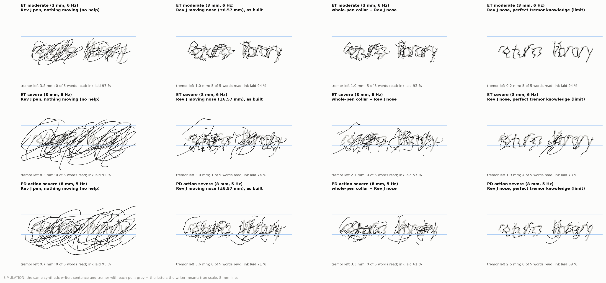
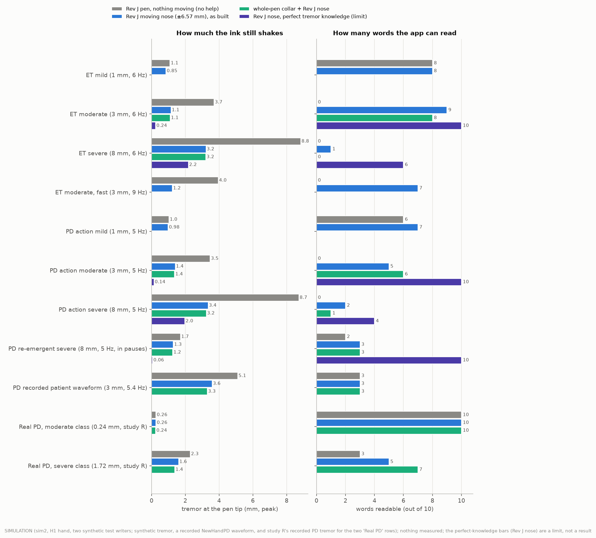
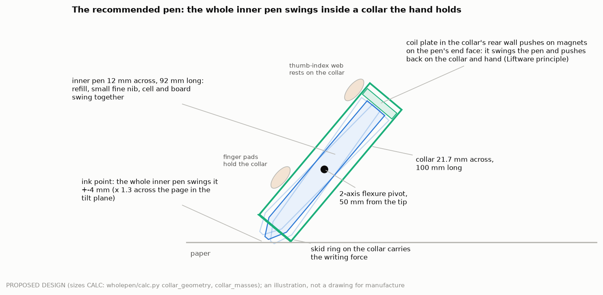

# Moving the whole pen against large tremor (study W)

Round 4, study W, 29 September 2026. **Nothing here was built or measured on a pen or a person.** Every number is labelled:
SIM (simulation: MuJoCo sim2 with the sim2j firmware, synthetic writers), CALC (calculation), LIT + ledger id,
MFR + ledger id, ASSUMPTION, PROPOSED DESIGN. The simulator ranks ideas; its numbers are not evidence of benefit to people
(sim2 context of use COU-1, DEC-040). This study answers the user's request for "much better mechanics" to shift and pivot
the whole pen against hand tremor of 1–10 mm, and the independent review of 29 September (§§5, 6, 12; the lead's response
`docs/reviews/2026-09-29_review_response.md`).

## The answer in plain words

<!-- W:answer -->
(filled at the end of the study)
<!-- /W:answer -->

### One number per tremor class and design: the tremor left at the pen tip (mm, peak)

Mean of the two test writers (SIM). "No help" is the Rev J pen with nothing moving. "Perfect knowledge" rows show what the
mechanism could do if the pen knew the tremor exactly: the limit of the mechanics, not a result anyone can have today.

<!-- W:table_tip -->
<!-- /W:table_tip -->

### The same cases: words the app can read (out of 10)

The app's handwriting recogniser reading each test writer's five-word sentence ("return library books by friday"), two
writers, words read correctly, summed; no language-model rescue (SIM). Two writers and one seed each: a ranking, not a
population estimate.

<!-- W:table_words -->
<!-- /W:table_words -->

How to read a ratio: the tremor left divided by the tremor with no help. **0.5 means half the amplitude, which is 75 %
less tremor power (−6 dB); it is not "75 % less tremor".** The ratios are in §4.4.

### Before and after

*SIMULATION: test writer 0, grey = the letters the writer meant, black = the ink; true scale on 8 mm lines. Rows: ET 3 mm,
ET 8 mm, PD 8 mm. Columns: no help, the Rev J nose, the whole-pen collar with the nose, the same with perfect knowledge.
The pictures are synthetic; they carry this label wherever they are shown.*

### The recommended system in one picture

<!-- W:recommend -->
(filled at the end of the study)
<!-- /W:recommend -->

### Results cards (one per population and mode; the review's §13)

<!-- W:cards -->
<!-- /W:cards -->

---

## Details

### 1 Tremor at the pen tip: the targets (task 1)

Amplitude convention everywhere: **peak** = half the peak-to-peak excursion of a sine of the same power along the
tremor's main axis, at the ink, in the page plane. The classes are ASSUMPTION built on the sources below and stay
hypotheses until EXP-W10 measures pen-tip tremor while writing (`wholepen/targets.py`, `results/wholepen/targets.json`).

| Class | Peak at the tip (range) | Value simulated | Basis |
|---|---|---|---|
| ET mild | 0.5–1.5 mm | 1 mm at 6 Hz | spiral rating FTM about 1 gives 1.1 mm peak on a tablet (LIT PDT-12: log10 T(cm p-p) = 0.6 FTM − 1.27, 18 ET patients); cohort median about 1 mm |
| ET moderate | 2–4.5 mm | 3 mm at 6 Hz (and 9 Hz) | FTM about 2: 4.3 mm peak (PDT-12) |
| ET severe | 5–17 mm | 8 mm at 6 Hz | FTM 2.5–3: 8–17 mm peak (PDT-12); tablets lose very severe tremor (PDT-13) |
| PD action mild | 0.2–1 mm | 1 mm at 5 Hz | recorded drawing tremor 0.3–1.4 mm at the pen's sensor in 4 of 26 NewHandPD patients; UCI spirals ≤ 0.45 mm (REAL DATA, LIT PDT-67, PDT-30) |
| PD action moderate | 2–4 mm | 3 mm at 5 Hz | MDS-UPDRS 2 (1–3 cm maximal amplitude at the limb, LIT PDT-68); ASSUMPTION at the pen |
| PD action severe | 5–10 mm | 8 mm at 5 Hz | rest-tremor amplitudes re-emerging in pauses and slow strokes off medication (PDT-09, PDT-65); ASSUMPTION |
| PD re-emergent | 5–10 mm | 8 mm at 5 Hz, suppressed by movement, re-emerging over about 3 s in pauses | PDT-09 (12 of 18 PD with rest tremor, latency 9.4 ± 10.7 s, about 5.5 Hz); PDT-65 (25 % of PD with tremor have lagged mixed tremor) |
| PD recorded | 3 mm | a recorded NewHandPD patient's tremor line (5.37 Hz, its own amplitude and frequency wander), scaled | REAL DATA (PDT-67) |

How often PD tremor matters while writing (LIT): action tremor in 36–39 % and rest tremor in 52–69 % of PD in three
cohorts (PDT-08); 96.2 % of de novo PD show some tremor within 7 years (PDT-66); writing tremor proper in 10 % of 100
consecutive PD patients, 26 % of those with postural or kinetic tremor, task-specific in 4 of 10 (PDT-63). ET tremor while
writing is kinetic, usually 4–8 Hz and often along one axis (PDT-56, PDT-36). Recorded data (REAL DATA, CALC; `results/wholepen/realdata.json`):
the UCI spiral archive shows PD tremor of at most about 0.45 mm (pixel pitch 0.204 mm, MFR AMF-180, ASSUMPTION that the
coordinates are pixels); NewHandPD's pen accelerations show a tremor line (4.4–5.9 Hz) in 4 of 26 patients while drawing,
about 0.3–1.4 mm at the pen's sensor and bursty. **Most PD writers have small tremor at the pen; the 3–8 mm classes are a
minority, but they are the people this study is about.**

### 2 The grip: how freely a held pen can pivot (task 2)

The model every simulation here uses is H1's two-zone grip (identical to study K's): finger pads at 32 mm from the tip,
the thumb-index web at 92 mm, calibrated so the tip sees the measured stylus-grip impedance of LIT HAP-26 (575 N/m,
1.3 N·s/m). What is not measured is how that compliance splits between the pen sliding and the pen rotating in the fingers
(r_rot, EXP-I01); every result is given at r_rot 0.3 / 0.5 / 0.7 and, new in this study, at grip stiffness 0.5 / 1 / 2 ×
(HAP-26's own range is 228–1043 N/m). Bounds used (CALC on LIT; `results/wholepen/grip.json`): three finger pads give
about 5.8 kN/m of skin shear stiffness (HAP-31 power law at the digit forces of CON-04); finger joints 0.45–0.71 N·m/rad
while tapping and 1.0–1.7 N·m/rad expected at higher forces (HAP-115); the wrist 1.3–1.7 N·m/rad (HAP-32).

**What this means for "pivoting the pen in the hand":** a pen held in the fingers resists being tilted in the grip with
about 1.0–4.8 N·m/rad (CALC, nominal 2.9 N·m/rad: about 50 mN·m per degree, or 29–96 mN·m per millimetre of tip motion
by tilting). Tilting the pen *against the skin* is therefore expensive and grip-dependent. Tilting it *in a bearing inside
something the fingers hold* (a collar) costs only the pen's own inertia and the ball's drag: 0.4–4.8 mN·m per millimetre
for a light inner pen (CALC, §3d). That difference is the whole argument for the collar.

### 3 The candidates, designed (task 3)

Three places a pen can push against, and what each can do at tremor speed:

| Push against | Example | What limits it | Verdict |
|---|---|---|---|
| the hand (the motor reacts on what the fingers hold) | Rev J's moving nose; **the whole-pen collar** | travel inside the grip; knowing the tremor | the only way to move the ink by millimetres at 4–10 Hz in a pen |
| a mass inside the pen (inertia) | gyroscopic tail, reaction or tuned mass | force = m ω² X; a gyroscope's stored energy | cannot beat the same mass locked in closed loop (§3b, §3c, §4.5) |
| the paper | heel wheel, a hand-rest sled | friction μN ≈ 0.3–1.4 N against the hand's much larger tremor force | trims a little; the heel wheel stays retracted by default (the review) |

#### 3a Rev J baseline and its static load (the review's point 1)

The Rev J nose (C1S) tilts only the refill carrier, on a gimbal 76.5 mm behind the ball, ±6.57 mm at 50°. Its magnets
sit on an 11.5 mm arm, so the refill spring's side load at the ball, F_c cot θ, reaches the coils 6.65 × larger. CALC
(`wholepen/calc.py nose_static`, reproducing the review): **4.72 / 1.63 / 0.17 W at 35 / 50 / 75°** while the ball is on
the paper. Every Rev J result in this study counts it: the simulated nose power (P_nose, SIM, sim2j's coil model with the
contact-gated bias) is 2.2–2.4 W per pen in every design that keeps the Rev J nose, whether or not it corrects. The collar
design below does not carry this load (its ball rides on a light refill spring and the writing force goes through a skid
ring on the collar); its fine nib is study B's balanced nib (not designed here), which is assumed to remove the static
load (ASSUMPTION, `bnib/` not yet available).

#### 3b The gyroscopic tail (severe-tremor candidate)

A detachable tail behind the thumb-index web (it may be up to 30 mm across; the held part stays ≤ 24 mm), with **one
scissored pair of control-moment gyroscopes on a turret** (two tungsten rings spinning in opposite senses, gimbals tipped
in opposite senses by one motor through scissor gears so their twists add on one axis and cancel on the others, LIT
PAT-37; the turret turns that axis to the tremor's main direction at ≤ 1 rad/s). Sized in `designs.cmg_design` (CALC,
PROPOSED DESIGN): for a 100 g module, two 26.7 g rings (r 6.25–12.5 mm, 4.0 mm thick) at 25 000 rpm, h = 6.8 mN·m·s per
rotor, pair torque 0.38 N·m at 5 Hz with ±1 rad gimbals (2 h ω 2 J₁(1)); spin power 0.52 W; tone 417 Hz; rim 32.7 m/s,
hoop stress 19 MPa (margin 38 on the alloy's 724 MPa, MFR AMF-49), bearings at 0.29 × their listed limit (MFR AMF-126);
spin-up 4.5 s; module 64 × 28.6 mm. **Stored energy 17.8 J** — the energy of a 100 g pen dropped from 18 m. A seized
bearing would dump the rotor's momentum as a 0.68 N·m jolt over 10 ms (CALC, ASSUMPTION 10 ms).

The review's examples, recomputed (CALC, `calc.cmg_sizing`, `results/wholepen/calc.json`):

| Rotor | h per rotor | Stored (all rotors) | Largest tip tremor it could cancel at 5 Hz (perfect knowledge) |
|---|---|---|---|
| review: solid 20 g, r 6 mm, 30 000 rpm | 1.13 mN·m·s | 1.78 J | 1.9 mm (one rotor as a pair's worth: 12.4 mN·m at 5 Hz with 20°, matching the review) |
| review: solid 20 g, 25.2 mm diameter, 30 000 rpm | 5.0 mN·m·s | 7.8 J | 8.6 mm |
| study W pair, 60 g module | 1.7 mN·m·s | 4.6 J | 3.0 mm |
| study W pair, 80 g module | 4.3 mN·m·s | 11.2 J | 9.8 mm |
| study W pair, 100 g module | 6.8 mN·m·s | 17.8 J | 17 mm (9.8 mm at 9 Hz) |

The torque a gyroscope must make is large because it has to *rotate the pen in the grip* against the fingers and the
pen's own tail-heavy inertia: 22–69 mN·m per millimetre of tip tremor (CALC). Two further limits: the gimbal motor must
carry 2 h Ω, the gyroscopic reaction of the writer's own pen rotation (20–41 mN·m at 1.5–3 rad/s for the 100 g module,
CALC), and a passive spinning rotor (gimbals locked, one rotor) cross-couples axes and is not a damper (the review; the
scissored pair's net momentum is zero, so locked it is just a mass). **Containment:** a burst ring in three pieces carries
about 68 % of its energy as translation (CALC); a pen wall cannot be relied on to contain 5–18 J, so a burst must be
excluded by design (stress margin ≥ 3, over-speed trip, balance grade G1, ASSUMPTION practice), and the tail is a bench
experiment only.

With perfect knowledge the linear model says a 100 g pair would pass the review's gate by a wide margin (42–86 %
better than the same 100 g locked, CALC, `tail_gate`). In the closed loop it does not (§4.5): the causal laws cannot phase
a torque this large against a grip whose response changes with the writer.

#### 3c Tuned and reaction masses

A mass m moving ±X on a fixed base pushes with at most m ω² X: 30 g over ±4 mm gives 0.118 N at 5 Hz and 0.474 N at
10 Hz; 0.5 N at 1 Hz would need ±422 mm (CALC, matching the review's table). A coil must also carry the flexure:
F_coil = X √((k − mω²)² + (cω)²) (CALC, `calc.reaction_mass`). Against the same mass locked (CALC, perfect knowledge,
`tail_gate`, grips 0.5–2 ×, splits 0.3–0.7, 5–9 Hz):

- **Tuned (passive) 40 g at the tail:** worse than the same 40 g locked in most conditions (−92 % to +23 %; passes the
  10 % gate in 18 % of them). A tuned mass pins the tail and the pen then pivots about its tail, so the tip moves *more*.
  The simulator agrees (SIM, tuning writer: tip 3.98 mm with the tuned mass against 3.56 mm for the base pen; semi-active
  retuning 3.95 mm).
- **Active reaction mass 30 g, ±4 mm, 0.6 N:** +16 % on average over the locked mass with perfect knowledge, but only
  in 56 % of conditions, and −25 % at 8 mm where its stroke runs out.

These match the review (§5) and study K: an internal mass is a high-frequency trim, not a way to move the ink by
millimetres at 5 Hz.

#### 3d The whole-pen collar (the review's option B) — recommended

**What it is.** The fingers hold a collar (a sleeve about 21.7 mm across) that also rests in the thumb-index web and carries
a skid ring on the paper at its front. The whole inner pen — a 12 mm barrel with the refill, a small fine nib, the cell and
the board — hangs in the collar on a two-axis flexure pivot 50 mm behind the tip. Two motors in the collar swing the inner
pen; they push back on the collar and so on the hand (the Liftware principle, LIT ACT-16, ACT-17, PAT-08, PAT-12).

**How it moves.** A pivot angle of 4.6° moves the tip 4 mm (the review: 2.3° for 2 mm). Sideways, the ink moves exactly
z_p × angle; in the tilt plane the ball also slides along the pen on its refill spring to stay on the paper, which adds
cot θ: the ink moves z_p × angle / sin θ, 1.3 × more at 50° (CALC; the simulator confirms both within 2–3 %,
`verification.json collar_v2_transmission`). The rear of the inner pen swings the other way, ±7.6 mm at its end — in free
air behind the web.

**Why V2 (skid ring on the collar) and not V1 (the whole pen, skid ring included, swinging).** In V1 the writing force
passes through the pivot to the tip: its moment N z_p cos θ = 32 mN·m at 1 N must be held by the motors (0.59–1.24 W,
CALC), and tilting the pen presses the skid ring into the paper or lifts it (SIM: with V1 the ink was laid only 44–65 % of
the time under correction). In V2 the skid ring carries the writing force and the ball only its 0.15 N refill spring: the
moment is F_c cot θ z_p = 6.3 mN·m (0.02–0.05 W, CALC). The refill's front stop must follow the paper while the skid ring is
loaded (a load cell tells), bounded to 3 mm, and lift with the pen otherwise, so strokes do not join (PROPOSED DESIGN;
SIM: ink laid 97 % of the time under correction with this stop, 70 % without it).

**Geometry** (CALC, `calc.collar_geometry`, PROPOSED DESIGN; 12 mm barrel, 0.8 mm wall, 0.3 mm running gap):

| Pivot from tip | Tip travel | Swing | Collar across | Fits 22 mm? |
|---|---|---|---|---|
| 50 mm | ±3 mm | ±3.4° | 19.8 mm | yes |
| 50 mm | ±4 mm | ±4.6° | 21.7 mm | yes |
| 50 mm | ±5 mm | ±5.7° | 23.6 mm | no |
| 56 mm | ±4 mm | ±4.1° | 20.8 mm | yes |
| 56 mm | ±5 mm | ±5.1° | 22.4 mm | no (by 0.4 mm) |

So a compact collar gives **±4 mm of body travel** (±5.2 mm of ink in the tilt plane); combined with a ±1 mm fine nib the
reach is about ±5 mm. For more, the collar must grow (±6 mm needs 25.5 mm) or keep Rev J's ±6.57 mm nose inside a larger
barrel.

**Mass** (CALC from volumes and catalogue parts, PROPOSED DESIGN): collar 18.9 g (voice coils) or 28.9 g (two Faulhaber
0824 B motors with 06/1 planetary heads, MFR AMF-120, AMF-103); inner pen 22.4–24.8 g; **total 43.7–51.2 g**, inside the
review's 40–65 g target.

**Does it stay controllable across grip strengths, and does the web lock the barrel?** (the review's decisive question;
CALC, `calc.collar_control`, grip 0.5–2 ×, split 0.3–0.7, 4–10 Hz; the controller's model assumes grip 1 ×, split 0.5 and
the web on the collar)

| Inner pen | Web rests on | Ink moved / ideal lever | Error of the controller's model | Loop margin (gain 0.75) |
|---|---|---|---|---|
| compact 12 mm barrel | the collar (saddle) | 0.81–1.24 | gain 0.91–1.05, phase ≤ 9° | ≥ 0.88 |
| compact 12 mm barrel | the moving barrel | 0.59–1.24 | gain 0.66–1.08, phase ≤ 6° | ≥ 0.74 |
| Rev J pen as the inner pen | the collar | 0.93–1.87 | gain 0.67–1.23, phase ≤ 53° (10 Hz, soft grip) | ≥ 0.38 |
| Rev J pen as the inner pen | the moving barrel | 0.65–1.66 | gain 0.49–1.02, phase ≤ 18° | ≥ 0.59 |

Yes, it stays controllable: a phasor law with a fixed model keeps a positive margin everywhere. **The web does not lock the
barrel, but where it touches it takes up to 40 % of the motion at a stiff grip**, and that share depends on the writer; the
design therefore puts the web on the collar (a saddle to z 97 mm) and the heavy parts close to the pivot. The Rev J pen is
too heavy and tail-heavy to be the inner pen (its model error reaches 53° at 10 Hz). Motor torque for the compact pen:
0.4–4.8 mN·m per millimetre of tip tremor (CALC; about 10 mN·m at 8 mm: within the 06/1 head's 25 mN·m continuous
rating, MFR AMF-103), so the tremor itself costs 0.01–0.05 W; the static V2 load 0.02–0.05 W (CALC). The reaction the
fingers feel is that torque: SIM grip-force change 0.2–0.3 N rms (§4).

**Coarse and fine, and not chasing strokes.** The collar only moves at the tremor frequency: its command is a phasor at the
tracked tremor line, gated by the tremor-line detector, so it never follows the slow shape of letters (no template, no
consent needed for a motion it never makes). It takes only the share of the estimated tremor that the fine nib cannot
cover (`collar_alloc = "overflow"`: at 3 mm with Rev J's nose it stays almost still; at 8 mm it takes about half), and the
nib is commanded on what the collar leaves *at the ink* (§4.1).

#### 3e Paper-grounded force

The heel wheel stays retracted by default (the review; SIM in sim2j: with it on, clean writing moved 0.42 mm). As bounds
(SIM, tuning writer 100, ET 3 mm at 6 Hz): an ideal omni-directional heel pushing 0.37 N anywhere removed 15 % of the tip
tremor; a hand-rest sled carrying 2 N of the hand's weight onto a braked element removed 54 % only with perfect knowledge
of the tremor, and nothing causally. The paper's friction (μN of 0.3–1.4 N) is smaller than the force the hand's tremor
drives through the grip (575 N/m × 3 mm ≈ 1.7 N), so paper grounding can only trim (CALC).

#### 3f Write only when in reach

The pen lift raises the ball while the estimated tremor exceeds the nose's reach minus a margin, so ink is laid only where
the nose can cancel. The review's warning holds: the ink error falls because ink goes missing. Every such result below
carries coverage (share of the letters' ink laid), missing strokes (strokes less than half inked) and completion time
(if the pen re-traced the lost ink afterwards at the writer's own speed, CALC on SIM). The writer model does not wait for
the pen, so the task time itself is unchanged; a real writer might slow down.

#### 3g Combinations and optimisation

- **Gyroscope tail design** (CMA-ES over rotor radius, speed, gimbal range and gimbal-motor torque at a fixed 100 g, with
  an exact torch gradient check, `optimise.optimise_combo`, CALC): see `results/wholepen/optimise.json`. It improves the
  perfect-knowledge ceiling; it does not change the closed-loop verdict (§4.5).
- **Collar design** (CMA-ES over the pivot position, servo stiffness and damping and the inner pen's centre of mass,
  minimising the tremor left after the collar and a ±1 mm fine nib over 5–9 Hz, 3–8 mm, grips 0.5–2 × and splits 0.3–0.7,
  with the 22 mm envelope as a constraint and a torque penalty; exact gradient of the residual with respect to the pivot
  position checked against a central difference, `optimise.optimise_collar`, CALC): see `results/wholepen/optimise.json`.

### 4 Simulation (task 4)

#### 4.1 Method

sim2 (MuJoCo 3.6) with the sim2j firmware in the loop at 2 kHz (tracker, nose servo, pen lift), the H1 hand (HAP-26 +
two-zone grip) and, for a subset, the articulated arm; the H1 contact law; 50 µs steps (25 µs checked). New devices in
`wholepen/devices.py` (the CMG tail, tuned mass, the collar as an MJCF patch: the grip joints move to the collar body, the
pen hangs from it on two hinges driven by torque motors with a 22 Hz position servo and the writing force's static moment
from the load cell; V2 moves the skid ring and its contact point to the collar). Device laws in `wholepen/control.py`, run
inside the firmware's tick (`wholepen/stepper.py`, a copy of sim2j's step with the insertions marked). The tremor is the
same hand tremor for every pen (its hand-path amplitude set on the Rev J pen with nothing moving), so a heavier pen shows
what its mass does. **Page sensor:** sim2j's measured-style model (DeltaPen per-window statistics, LIT OPT-02: lognormal
error per 10 ms window, median 23.6 µm, mean 68.3 µm, errors adding up); sim2j's 3 µm white noise is used only where
marked. **Tracker:** chosen on the tuning writer between sim2j's frozen guarded tracker and ai2's gated listening tracker
(DEC-042's default). **Collar law:** the internal-model phasor law with the controller's model of the collar at grip 1 ×
and split 0.5; the nose is re-commanded on what the collar leaves at the ink (the measured barrel tip and the ink differ
by (G − G_ink) u because the ball slides on its refill).

Metrics: tremor left at the tip (§ conventions above), ink error against the writer's tremor-free letters, letters and
words read by the app's recogniser, coverage and missing strokes, the grip-force change the writer feels, power (the nose's
copper loss from sim2j's coil model; the devices' from `designs.py` electrical models on the simulated mechanics).

#### 4.2 Verification of the simulator for each new device

<!-- W:verify -->
(filled from `results/wholepen/verification.json`)
<!-- /W:verify -->

#### 4.3 Tuning and frozen rules

Rules were chosen on tuning writer 100, seed 300 only, and frozen in `results/wholepen/rules.json` (with its time stamp)
before any test run:

<!-- W:rules -->
<!-- /W:rules -->

#### 4.4 Test results

Test writers 0 and 1 (five words each), seeds 200 and 201, H1 hand. Ratios to "no help" (SIM):

<!-- W:table_ratio -->
<!-- /W:table_ratio -->

#### 4.5 Against the same mass locked, at three grip strengths (the review's gate G5)

<!-- W:gate_sim -->
<!-- /W:gate_sim -->

#### 4.6 The articulated arm

<!-- W:arm -->
(filled from `results/wholepen/arm.json`)
<!-- /W:arm -->

### 5 Proposed decision (number to be assigned by the lead)

<!-- W:decision -->
**DEC-051 (proposed): the whole-pen mechanism is a hand-referenced collar; inertial tail modules stay bench experiments.**
The pen's body is split into a held collar (≤ 22 mm across, resting in the thumb-index web, carrying the skid ring and
the writing force) and a swinging inner pen (12 mm barrel with the refill, a small fast nib, the cell and the board) on a
two-axis flexure pivot about 50 mm behind the tip, swung ±4.6° by two motors that react on the collar (±4 mm at the tip,
±5.2 mm across the page in the tilt plane). The collar is the coarse stage: it moves only at the detected tremor line and
only by the share of the estimated tremor that the fast nib cannot reach; the nib is commanded on what the collar leaves at
the ink. Gyroscopic, tuned and reaction-mass tail modules are not part of the product path; each stays a bench experiment
under the review's gate G5 (≥ 10 % better than the same mass locked, at three grip strengths).
Alternatives considered: the gyroscopic tail as the severe-tremor device (stores 5–18 J to matter, fails G5 in the closed
loop); a tuned or driven tail mass (worse than or no better than the same mass locked); paper-grounded force (friction far
below the hand's tremor force); a V1 collar in which the whole pen with its skid ring swings (the motors hold the writing
force: 0.6–1.2 W, and the ring rocks off the paper); a bigger Rev J nose alone (the refill spring's static load grows with
the lever, the review's point 1).
Evidence: this document §§3–4 (CALC, SIM on synthetic writers). Revisit if EXP-W11 finds the ink moves less than 0.6 of
the lever or the loop's model error exceeds 45° at any grip strength, or if EXP-W13 finds the refill cannot follow the
paper through the swing.

**DEC-052 (proposed): large-tremor modes use the gated listening estimate with the guarded fallback; every gated or
ink-only-when-correct mode reports coverage, missing strokes and completion time.** On the tuning writer the gated
listening estimate removed about two thirds of 3 mm tremor at 6 Hz with the Rev J nose where the guarded tracker removed
about a tenth (SIM), and the guarded fallback keeps tremor-free writing within the 25 µm rule (§4.3). Revisit with
EXP-W15 on recorded writing.

**DEC-053 (proposed): whole-pen results are reported against the same pen with its devices locked, on a measured-style
page sensor, at three grip strengths, with power including the nib's static load.**
<!-- /W:decision -->

### 6 Proposed requirements

<!-- W:requirements -->
| Id | Requirement (PROPOSED) | Verified by |
|---|---|---|
| REQ-WP-001 | The whole-pen stage reacts on what the hand holds (a collar); no inertial-only device is the large-tremor solution | design review; EXP-W14 |
| REQ-WP-002 | Held collar ≤ 22 mm across; inner barrel ≤ 12 mm; tip travel ≥ ±4 mm at 4–10 Hz under a 1 N writing load; pen ≤ 55 g in total | CAD fit checks (`mechanics/cad/wholepen.py`); EXP-W11 |
| REQ-WP-003 | The writing force goes through the collar's skid ring; the inner pen carries only its refill spring; static holding power ≤ 0.05 W at 35–75° | EXP-W11 (current at rest while writing) |
| REQ-WP-004 | The refill follows the paper through the swing while the skid ring is loaded (bounded extension ≥ z_p × swing × cot θ_min + 0.3 mm, about 3.3 mm at 35°), and lifts with the pen when the ring unloads, so strokes do not join | EXP-W13 |
| REQ-WP-005 | The thumb-index web rests on the collar (a saddle to z ≥ 97 mm); the swinging barrel clears the web and the sleeve at full swing (fit margin ≥ 0.3 mm) | CAD fit checks; EXP-W12 |
| REQ-WP-006 | With one fixed controller model, the loop stays stable and removes ≥ 50 % of a 3 mm, 5–9 Hz tremor at grip 0.5–2 × nominal, web on the collar | EXP-W11 (hand phantom) |
| REQ-WP-007 | The collar moves only at a detected tremor line and only by the share beyond the nib's reach; it never follows letter shapes; tremor-free writing moves ≤ 25 µm with it enabled | SIM rule (§4.3); EXP-W15 |
| REQ-WP-008 | The pivot never reaches its hard stops in use: the reference stays ≤ 65 % of the range and a stop-approach limiter backs the servo off (the SIM hit the stops at 8 mm) | EXP-W11 (8 mm, 5 Hz) |
| REQ-WP-009 | The reaction the fingers feel stays ≤ 0.5 N rms grip-force change (SIM 0.2–0.3 N); motor noise ≤ 35 dBA at 30 cm (ASSUMPTION target) | EXP-W12 |
| REQ-WP-010 | A tail module enters a pen only after beating the same mass locked by ≥ 10 % (G5) at three grip strengths; a gyroscope stores ≤ 2 J and excludes a burst by design (stress margin ≥ 3, over-speed trip) | EXP-W14 |
| REQ-WP-011 | Every gated or ink-only-when-correct mode reports coverage, missing strokes and completion time beside its error | every report; EXP-W16 |
| REQ-WP-012 | Whole-pen results use the measured-style page sensor (OPT-02 statistics) by default; 3 µm white noise only as a labelled bound | every report |
<!-- /W:requirements -->

### 7 Proposed experiments (EXP-W10 onward)

<!-- W:experiments -->
| Id | Question | Set-up and measurements | Decides |
|---|---|---|---|
| EXP-W10 | How large is tremor at the ink while writing, per population? | ET, PD-action and PD-re-emergent writers (≥ 20 each, reviewed protocol and consent) write the study's sentence and spirals on a digitising tablet with an ink pen and a 1 kHz IMU on the pen; ink amplitude along the main axis (peak, 2.5–20 Hz), frequency, axis, share of time with a line | the classes (§1), the needed travel |
| EXP-W11 | Does the collar move the ink as calculated, across grip strengths? | V2 mock-up (3D-printed sleeve, cross-strip flexure pivot at 50 mm, two geared 0824 B motors or voice coils, 12 mm barrel with a refill); a hand phantom with swappable grip springs (300 / 575 / 1100 N/m, split variants) on a shaker; paper on a force plate; optical ground truth of the ink; swept 2–12 Hz, ±1–5 mm; web on the collar vs on the barrel; motor current at rest while writing | REQ-WP-002/003/006/008; DEC-051 |
| EXP-W12 | Can people hold and write with it? | tremor-free adults first: comfort, felt reaction, noise, the web's contact, writing speed, with the collar locked and active (equal mass) | REQ-WP-005/009 |
| EXP-W13 | Does the refill follow the paper through the swing without joining strokes? | the mock-up's collar swung ±4.6° at 5 Hz on paper at 35 / 50 / 75°; ball load and contact continuity; lifts between strokes | REQ-WP-004 |
| EXP-W14 | Do tail modules beat the same mass locked (G5)? | on the EXP-W11 phantom: tuned mass (40 g), driven reaction mass (30 g), gyroscope pair (≤ 2 J, in a burst-test housing) against the same masses locked, three grip strengths, 4–10 Hz | REQ-WP-010 |
| EXP-W15 | Does the listening estimate with the guarded fallback separate large tremor from writing on real writing? | replay EXP-W10 recordings (and the NewHandPD / UCI data) through the firmware estimator; false correction on tremor-free writing ≤ 25 µm; share of tremor removed at the ink in the replay model | DEC-052; REQ-WP-007 |
| EXP-W16 | What does "write only when in reach" cost people? | the Rev J or collar pen with the gate on and off: legibility (blinded transcription), coverage, missing strokes, completion time, preference | REQ-WP-011 |
| EXP-W17 | Is an amplitude-gated paper force useful? (the lead's note) | the heel wheel's tremor mode enabled only above a detected tremor amplitude (e.g. ≥ 2 mm); clean-writing movement and severe-tremor error | whether paper grounding joins the severe mode |
<!-- /W:experiments -->

### 8 Open issues

<!-- W:open -->
(filled at the end of the study)
<!-- /W:open -->

### 9 Files and how to reproduce

- Package `wholepen/` — `python3 -m wholepen.run_study [--quick] [--stages ...]` (stages resume from `wholepen/build/rows/`);
  tests `pytest wholepen/tests -q` (about 10 s).
- Results `results/wholepen/`: `targets.json`, `realdata.json`, `grip.json`, `calc.json`, `optimise.json`,
  `verification.json`, `tuning.json`, `rules.json`, `test.json`, `grips.json`, `arm.json`, `summary.json` (each with
  `stabpen.provenance`), figures `fig_w_*.png` with CSV twins, `animation.json` (keyframes: time, part, position, angle),
  `layout_parts.json` (the explainer's schema), `evidence_rows.csv` (proposed ledger rows, the ledger's 23 columns).
- CAD: `python3 mechanics/cad/wholepen.py` → `results/wholepen/cad/` (STEP, drawing with CSV twin and fit checks).
- Data outside the repository: the UCI spiral archive and NewHandPD signals (paths in `wholepen/realdata.py`).
