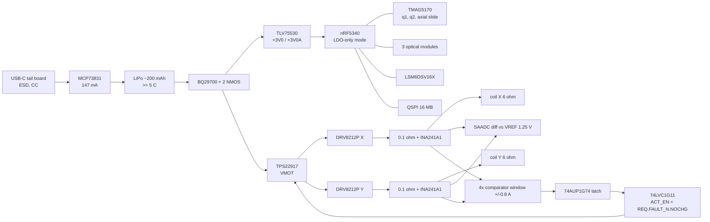

# Research electronics, Rev A

**Evidence status: PROPOSED DESIGN.** Nothing in this directory has been built or measured.

| Check | Status |
|---|---|
| Schematic | Generated and checked by software |
| Calculations | Analytical |
| Drive stage | Simulated in ngspice with idealised switches |
| Placement | Area-feasibility calculation only |

Every part carrying a `VERIFY` or `SELECT` note in [`bom_revA.csv`](bom_revA.csv) must be checked against its datasheet or reference design before layout. The note gives the specific item to check.

## What is here

| Path | Content | How it is checked |
|---|---|---|
| `gen/design_revA.py` | Declarative circuit specification: 11 sheets, 148 placements | — |
| `gen/kicad_gen.py`, `gen/sexpr.py` | Generator that writes editable KiCad 8 schematics from the specification. Symbols are copied from the installed KiCad 8 libraries, so pin numbers come from maintained library data | — |
| `kicad/` | `pen_research.kicad_pro` / `.kicad_sch`, one sheet per function, `sym-lib-table` and `fp-lib-table` | `kicad-cli sch erc`: 0 errors, 1 accepted warning (below) |
| `kicad/pen_research.net` | KiCad's own netlist export | `gen/check_netlist.py` against `intended_netlist.json`: **PASS**, 102 nets, 492 pins |
| `kicad/pen_research_revA.pdf` | Plotted schematic, 12 pages | — |
| `bom_revA.csv` | BOM generated by `gen/make_bom.py`: 79 lines, 148 placements | 45 VERIFY, 3 SELECT, 26 generic passives, 5 fully specified |
| `calcs/drive_sense.py` | Coil winding vs supply, current-sense chain, PWM ripple, current-loop bandwidth, timing, power | → `results/electronics/drive_sense.json`, figures |
| `spice/drive_stage.cir`, `spice/plot_drive_stage.py` | ngspice transient: H-bridge, shunt, INA241, anti-alias, window comparator, latch and load switch, including a coil short | → `results/electronics/spice_drive_stage.json`, `fig_spice_drive_stage.png` |
| `gen/placement_study.py` | Board area and height feasibility from library courtyards and the CAD envelope | → `results/electronics/placement_study.json`, `fig_placement_study.png` |

Regenerate everything:

```bash
python3 electronics/gen/design_revA.py
cd electronics/kicad
kicad-cli sch erc --format report --severity-all -o erc_report.rpt pen_research.kicad_sch
kicad-cli sch export netlist --format kicadsexpr -o pen_research.net pen_research.kicad_sch
python3 ../gen/check_netlist.py
kicad-cli sch export pdf -o pen_research_revA.pdf pen_research.kicad_sch
cd ../..
python3 electronics/gen/make_bom.py
python3 electronics/gen/placement_study.py
python3 electronics/calcs/drive_sense.py
cd electronics/spice && ngspice -b drive_stage.cir && python3 plot_drive_stage.py
```

Dependency: KiCad 8.0 (tested with 8.0.9, libraries version 20231120). Also ngspice 42 and Python 3.11 with numpy, scipy and matplotlib.

**Accepted ERC warning.** The IMU's unused auxiliary SPI pins `SDx`/`SCx` connect to GND, as the LSM6DS-family datasheets recommend for unused pins. ERC flags this as a power-output-to-bidirectional connection. Pin functions for the LSM6DSV16X are marked VERIFY.

## Architecture



| Sheet | Function |
|---|---|
| `power_charge` | USB-C receptacle, USBLC6 ESD, CC pull-downs, MCP73831 charger, VBUS/2 detect |
| `battery_supply` | Cell pads, BQ29700 protector with charge/discharge FETs, TLV75530 LDO with a filtered analogue rail, TPS22917 actuator load switch, VBAT divider, REF3012 1.25 V reference |
| `mcu` | nRF5340-QKAA with DEC decoupling, 32 MHz and 32.768 kHz crystals, RF match, antenna pi-pad and chip antenna, Tag-Connect SWD, SPI series termination, isolated ADC reference input |
| `sensing` | IMU, three optical-module flex connectors, coil NTC |
| `force` | DNP: ADS1220 and strain-bridge input for bench reference measurements |
| `stage_position` | TMAG5170 3-axis Hall on the tail flex; DNP analogue Hall alternative |
| `actuator_x`, `actuator_y` | DRV8212P, 0.1 Ω shunt, INA241A1, 1 kΩ/10 nF anti-alias filter, two comparators per axis, coil pads |
| `storage_comm` | QSPI flash, UART pads |
| `user_interface` | Button, LED, ERM driver, test points |
| `fault_handling` | Over-current latch, charging interlock, 3-input enable gate, trip thresholds |

## Decisions carried by the circuit

- **DEC-012: coil wound to 6 Ω (was 11 Ω).**
  - Holding power (F/(n·K_m))² does not depend on the winding. The voltage needed does: V = F/(n·K_m·√R)·(aR + R_ext).
  - With the 11 Ω winding, at VBAT = 3.3 V and an 85 °C coil, 3.7 % of the thermally allowed envelope is voltage-limited.
  - 6 Ω is the largest winding with none voltage-limited (`drive_sense.py`, `fig_headroom.png`).
  - Consequences: K_f = 0.717 N/A (after the 0.50 mm gap of DEC-007 rev.), L ≈ 175 µH (air-core estimate scaled by turns²), design-point hold current 0.335 A, bridge and shunt loss 7.7 % of copper loss.
- **40 kHz centre-aligned PWM, 200 duty levels.**
  - At 20 kHz the 6 Ω coil's ripple is 159–239 mA p-p and loop delay limits the current loop to about 1.3 kHz.
  - At 40 kHz the ripple is 83–129 mA p-p and the crossover is 2.3 kHz at 50° phase margin. This matches the 2 kHz current bandwidth the simulator assumes.
  - The force ripple at 40 kHz moves the stage by less than 1 nm.
- **In-line shunt with INA241A1.**
  - The INA241 tolerates PWM common-mode swings. The chain gives 1.0 V/A about 1.25 V, a ±1.2 A linear range and 0.59 mA per ADC LSB.
  - Noise is about 0.55 mA RMS per sample and is ADC-dominated.
  - Offset is calibrated at every pen-up with the bridge in coast.
- **Sampling.** ngspice shows that sampling only at the PWM-period centre biases the current reading by −11 mA (−3.4 %) after the anti-alias RC at duty 0.72. The firmware samples at both counter extremes and averages: 2 axes × 2 × 40 kHz = 160 kS/s, SAADC limit VERIFY. The remaining duty-dependent error goes into a `CAL_ISNS` table (docs/icd.md §3).
- **nRF5340 in LDO-only, normal-voltage mode.** DCC, DCCD and DCCH are left open, so there is no DC/DC switching next to the Hall and sense front ends. The few-mA LDO penalty is small against 0.2–0.8 W of actuator load. DEC-pin capacitor values are marked VERIFY: the Nordic reference circuitry could not be retrieved in this session.
- **Hardware interlock, independent of firmware.** ACT_EN = ACT_EN_REQ AND FAULT_N AND NOCHG.
  - Any window-comparator trip latches FAULT_N low and opens VMOT.
  - VBUS presence blocks actuation.
  - An MCU reset releases ACT_EN_REQ through a 100 kΩ pull-down.
  - In ngspice, a coil short is detected in **8.8 µs** and VMOT opens at **22.6 µs**. The load switch is modelled as a 20 µs first-order turn-off (VERIFY). The fault peak is 5.4 A with ideal switches; the DRV8212P's internal over-current protection (VERIFY) would clamp it earlier.
- **One 3-axis Hall sensor for stage and force.** The TMAG5170 reads a sense magnet on the lever tail. Bx and By give the stage angles; Bz gives the axial slide s, and F_ax = F_pre + k_ax·s. The strain-bridge ADC is DNP and kept only as a bench reference.

## Budgets (calculation)

| Quantity | Value | Source |
|---|---|---|
| Electronics supply current (typical, excl. actuator) | 31 mA (115 mW at 3.7 V); optics are a 15 mA placeholder | `drive_sense.json` |
| Actuator copper loss, nominal writing (θ 50°, N 1 N) | ≈ 0.45 W at 20 °C, ≈ 0.57 W hot (direction-averaged) | sim static check; `drive_sense.py` |
| Allowable average copper loss (moving coil) | 0.455 W | `results/thermal/thermal.json` |
| Share of the writing envelope within that limit | 68 % (θ 35–75°, N 0.2–2 N log-uniform, μ 0.05–0.35) | `drive_sense.json` |
| Runtime at the design point, 200 mAh × 0.8 usable | 54 min of continuous contact; 81 min of writing at 65 % pen-down duty (`results/trade/config_trade.json`). A cell that fits the Rev A.1 bay may hold only ~130 mAh (DEC-014) | this README |
| Stage-period CPU and bus occupancy (500 µs) | CPU ≈ 130 µs, SAADC ≈ 210 µs, SPIM4 ≈ 50 µs, SPIB ≈ 16 µs | `fig_stage_timeline.png`; to be replaced by logic-analyser captures |

The nominal design point sits at the moving-coil thermal limit. This is the audit's conclusion (COR-02) seen from the electronics side: Rev A is a research instrument, and the skid or bias variants (DEC-008) remain the product path.

## Packaging finding (placement study)

The courtyard area of the main-board parts is **779 mm²**. Two sides of the 29 × 11.5 mm board in the CAD, less the antenna keep-out, give **517 mm²**. **The Rev A circuit as drawn does not fit the Rev A mechanical envelope.** Three parts also exceed the 1.2 mm component-height envelope:

- the button (1.9 mm);
- the SOT-23-5/6 LDO and load switch (1.45 mm);
- the SOT-23-5 charger (1.45 mm).

The "Rev A.1 package plan" in `placement_study.py` makes these changes:

- one 10-pin nose flex instead of three optical connectors;
- X2SON comparators and LDO;
- USON flash;
- 0201 passives below 1 µF;
- a WLCSP-class dual MOSFET;
- charger moved to the USB tail board.

That plan cuts the area to 506 mm². It fits only if the board grows to **41 mm**, which requires the 44 mm 10440 bay to become a ~32 mm pouch cell. Courtyard density is then 0.65, so HDI is required (via-in-pad under the aQFN94, 6–8 layers). The button and load switch still need a thinner part or a local wall relief.

These substitutions change symbols and pin maps, so they are **not yet applied** to the schematic. Each is a VERIFY or SELECT item, tracked as open issue E-1.

## MCU pin plan (nRF5340-QKAA)

| Function | Pins | Notes |
|---|---|---|
| Current sense | AIN0 = ISNS_X, AIN1 = ISNS_Y, AIN4 = VREF_ADC | Differential against AIN4 |
| Monitoring | AIN2 = VBAT/2, AIN3 = NTC | Ratiometric NTC |
| Analogue Hall option | AIN5/AIN6 (DNP DRV5055) | — |
| Spare | AIN7 | Test point |
| High-speed SPI (SPIM4) | P0.08 SCK, P0.09 MOSI, P0.10 MISO, P0.11 HALL_CS_N, P0.12 OPT1_CS_N | 33 Ω series termination |
| Other optics | P0.29/P0.30 CS, P0.31 IRQ | — |
| QSPI flash | P0.13–P0.18 | — |
| Bridges | P0.19–P0.22 IN1/IN2 X/Y, P0.23 DRV_SLEEP_N, P0.24 ACT_EN_REQ | — |
| SPIB (IMU, ADC option) | P1.02–P1.04 | IMU CS P1.01, INT1/INT2 P1.00/P1.15 |
| Bench ADC option | ADC_DRDY_N P0.02, ADC_CS_N P0.03 | NFC pins: set UICR.NFCPINS to GPIO |
| UART | P1.05/P1.06 | Pads |
| Fault and interlock | P1.07 FAULT_N, P1.12 FAULT_CLR_N, P1.14 CHG_DET | — |
| UI | P1.08 button, P1.09 LED, P1.11 haptic | — |
| Status inputs | P1.10 CHG_STAT, P1.13 HALL_ALERT_N | — |

## Board-to-board connections

| Link | Signals | Current | Form |
|---|---|---|---|
| Main ↔ nose flex (optics) | +3V0, GND, SCK, MOSI, MISO, 3× CS, IRQ | < 50 mA | 0.5 mm FPC, ~60 mm; SI check at SPI clock |
| Main ↔ tail flex (Hall) | +3V0A, GND, SPIA ×3, HALL_CS_N, HALL_ALERT_N | < 5 mA | Solder or hot-bar flex |
| Main ↔ actuator coils | COIL_X_P/OUT2_X, COIL_Y_P/OUT2_Y, NTC ×2 | ≤ 0.8 A per coil | Flying leads to pads; strain relief on the moving coil is an EXP-B03 item |
| Main ↔ cell | VBAT, CELL_NEG | ≤ 1.2 A peak | Pads |
| Main ↔ USB tail board | VBUS, D+, D−, GND (+ charger if Rev A.1) | 0.5 A | Flex along the cell |

## Bring-up procedure (bench, before any closed-loop test)

The steps below are measurements still to be made; nothing here has been measured yet. Record every result in `validation/records/` with the board serial.

| Step | Action | Pass criterion |
|---|---|---|
| 1 | Visual and X-ray inspection of the aQFN94 and WSON parts; ohmmeter checks VBAT–GND, VMOT–GND, +3V0–GND | No shorts (> 1 kΩ) |
| 2 | Bench supply on VBAT, 3.7 V with 50 mA limit, pads unloaded | +3V0 = 3.00 V ± 1.5 %; +3V0A same; VREF_1V25 = 1.250 V ± 0.2 %; supply current < 15 mA before firmware |
| 3 | SWD connect and erase; flash a blink-and-clock test | HFXO starts; 32 MHz within ±40 ppm (frequency counter on a GPIO clock output); LFXO runs |
| 4 | SPI ID reads: TMAG5170, LSM6DSV16X, flash JEDEC ID, optical modules | All IDs correct at 1, 8 and 32 MHz (SPIM4); scope SCK at the nose connector (ringing < 20 % of swing) |
| 5 | Current-sense offset with bridges asleep | ISNS_X − VREF within ±3 mV; noise ≤ 1 mA RMS equivalent |
| 6 | Dummy load (6.8 Ω + 180 µH) on each coil output; 40 kHz PWM at duties 0.1–0.9 | ISNS vs a 0.1 %-class current probe: gain error ≤ 1 % after `CAL_ISNS`; ripple matches `fig_pwm_ripple.png` within 25 % |
| 7 | Timing: toggle GPIOs at ISR and task entry and exit; logic analyser | 40 kHz ISR ≤ 5 µs; 2 kHz task ≤ 250 µs; jitter ≤ 20 µs |
| 8 | Protection: step the dummy load to 0.2 Ω with the lab supply current-limited to 2 A | FAULT_N latches; VMOT < 0.5 V within 50 µs; recovery only via the clear sequence with ACT_EN_REQ low |
| 9 | Interlocks: plug USB during PWM | ACT_EN low within 1 ms; no actuation while charging |
| 10 | Watchdog: halt the core under the debugger during PWM | Reset releases ACT_EN_REQ; VMOT off |
| 11 | Charger: 147 mA CC into a 200 mAh cell at 25 °C; skin-temperature probe on the barrel | Termination at 4.20 V ± 0.75 %; barrel < 41 °C |
| 12 | Hall calibration jig (EXP-B04) and actuator force map (EXP-B03) | Produces `CAL_HALL` and `CAL_ACT` |

## Open issues

1. **E-1** Packaging: apply the Rev A.1 package plan (new symbols and pin maps), then lay out. Decide between the 41 mm board with a pouch cell and a two-board split.
2. **E-2** nRF5340 DEC-pin capacitor values, RF matching and antenna keep-out against Nordic's reference circuitry and a VNA measurement on the assembled pen.
3. **E-3** LSM6DSV16X pin functions on the LSM6DS-family placeholder symbol.
4. **E-4** TMAG5170 range variant from the sense-magnet field map; field crosstalk from the actuator at 40 kHz (sample mid-PWM).
5. **E-5** INA241A1 common-mode transient recovery at 40 kHz edges with 3.0–4.2 V VMOT; the ngspice model is behavioural.
6. **E-6** SAADC aggregate sample rate for dual-extreme sampling (160 kS/s).
7. **E-7** Optical module selection (EXP-S01) sets the nose-flex interface and its supply current.
8. **E-8** Thermal: the design point sits at the moving-coil copper-loss limit (see Budgets).
