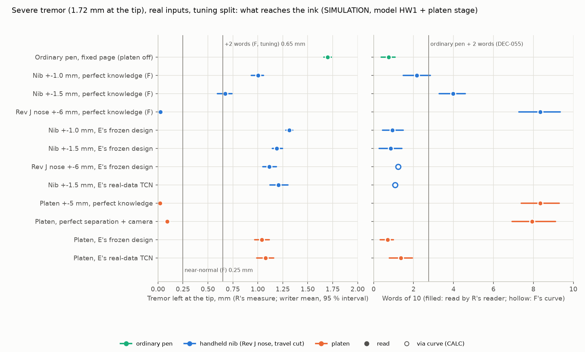
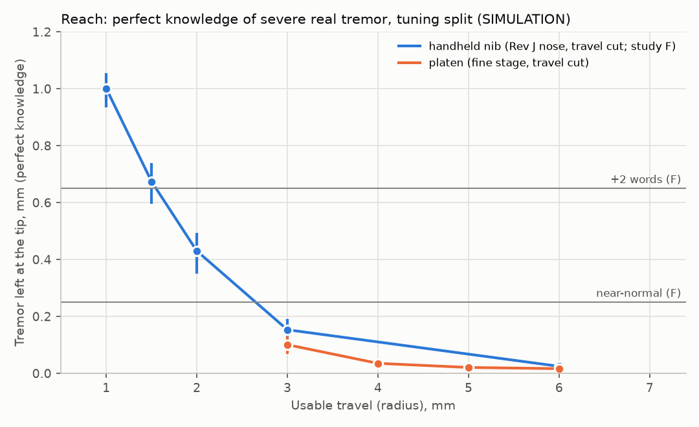
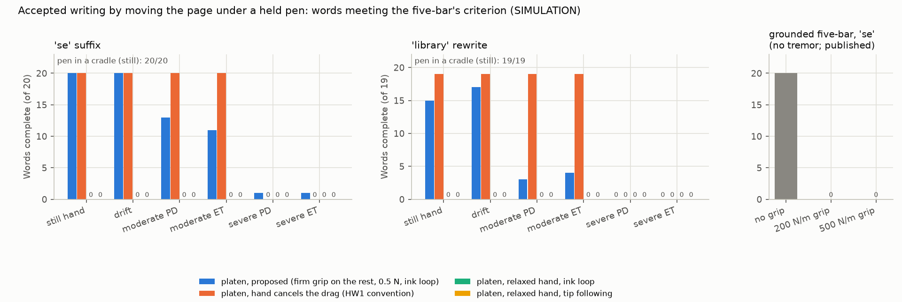
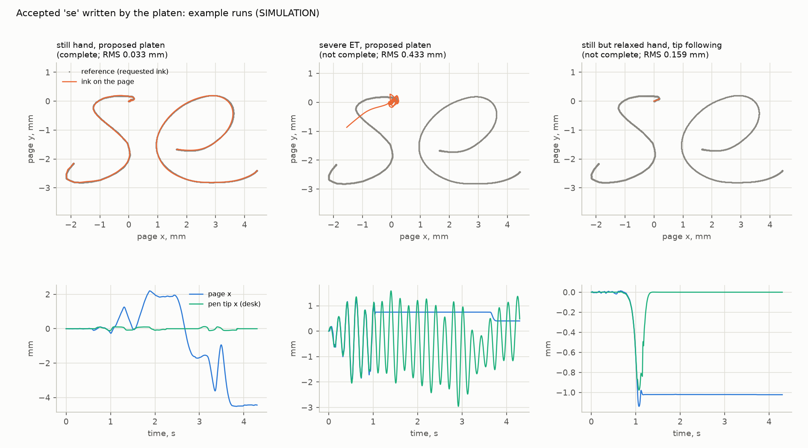
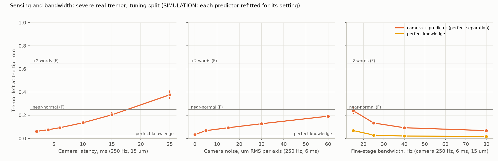
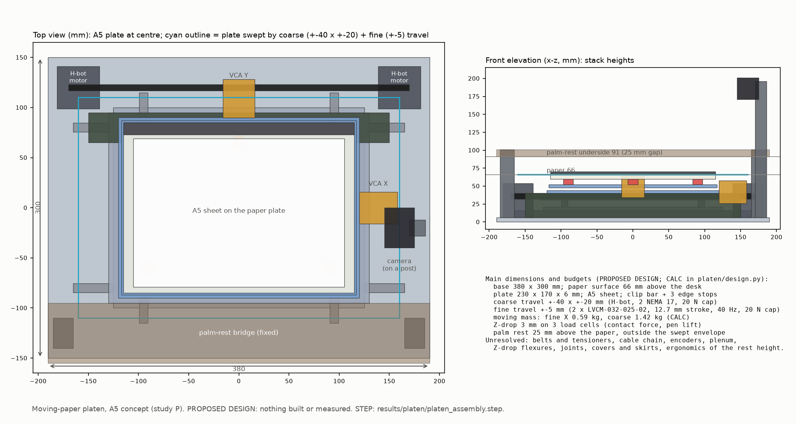

# A moving-paper platen: the active writing surface (study P)

<!-- Generated by `python3 -m platen.doc --fill` from platen/doc_template.md and results/platen/platen.json. The
tables and the fields of the template are filled from that file; the round numbers in the prose summarise them, and
numbers from studies R, E and F and from the independent engineering pass are quoted as theirs. -->

## The answer in plain words

*Study P, 30 September 2026. SIMULATION (the hand and pen model HW1 joined to a model of the proposed stage) with real
recorded handwriting and real recorded tremor, on study R's tuning split only, because the test split is spent;
CALCULATION; a PROPOSED DESIGN built from MANUFACTURER, LITERATURE and ASSUMPTION values. Nothing was built, and nothing
was measured on a device or a person. Every number carries one of these labels (SIM for simulation, CALC for
calculation, MFR for manufacturer data, LIT for literature).*

**What was asked.** Two results moved the correction off the pen. Study F found that severe tremor (about 1.7 mm at
the pen tip) needs about ±1.5 mm of correction reach even with perfect knowledge of the tremor, and ±2-3 mm with a
real estimator, while a 24 mm balanced nib reaches ±1-1.5 mm. The independent pass's grounded five-bar wrote 20 of 20
accepted "se" suffixes with no hand on the pen but 0 of 20 against a 200 or 500 N/m grip, and none of its words stayed
within 2 m/s² and 300 m/s³. Study P asks whether a desk platen that **moves the paper under a pen the user holds** does
better at both jobs: cancelling tremor at the ink, and writing accepted words.

**The answer in three points.**

1. **Reach is solved.** With perfect knowledge of the tremor, the ±5 mm platen leaves
   {{t:all/severe:P_oracle:tip_tremor_mm}} mm of tremor at the ink and the reader reads
   {{t:all/severe:P_oracle:words_read}} words of 10. The handheld nib leaves {{t:all/severe:F15_oracle:tip_tremor_mm}} mm
   ({{t:all/severe:F15_oracle:words_read}} words) at ±1.5 mm and {{t:all/severe:F10_oracle:tip_tremor_mm}} mm
   ({{t:all/severe:F10_oracle:words_read}} words) at ±1.0 mm. The ordinary pen leaves
   {{t:all/severe:none:tip_tremor_mm}} mm ({{t:all/severe:none:words_read}} words) (SIM, tuning split).
2. **The estimator still decides, and the platen does not change that.** Driven by study E's best causal estimator,
   the platen leaves {{t:all/severe:P_E_chosen:tip_tremor_mm}} mm and {{t:all/severe:P_E_chosen:words_read}} words are
   read. The nib with the same estimator leaves {{t:all/severe:N15_E_chosen:tip_tremor_mm}} mm at ±1.5 mm. Sensing is not
   the limit: with the tremor perfectly separated from the writing, a 250 frames/s camera that tracks the tip leaves
   {{t:all/severe:P_cam_sep:tip_tremor_mm}} mm and {{t:all/severe:P_cam_sep:words_read}} words are read (SIM).
3. **Accepted writing works when the pen is docked, and with a held pen only for a calm, firm hand.** Moving the page
   under the user's own pen docked in a cradle on the palm rest wrote {{a:se|cradle|cradle:complete}} accepted "se"
   suffixes to the five-bar's criterion, and {{a:library|cradle|cradle:complete}} "library" rewrites. With the pen held
   in a firm grip on the palm rest, at 0.5 N and with the proposed controller, it wrote {{a:se|proposed|still:complete}}
   suffixes for a still hand. Moderate tremor brought that down to {{a:se|proposed|mod_PD:complete}} and severe tremor
   to {{a:se|proposed|sev_PD:complete}}. With HW1's relaxed hand, the moving page drags the pen through the ball's
   friction. The platen cannot tell that drag from a hand movement, and it completes
   {{a:se|relaxed_naive|still:complete}} (SIM).

**The answers in more detail.**

- **Tremor with the platen off** (an ordinary pen on a fixed page; the platen's ink is then exactly HW1's ordinary
  pen): {{t:all/severe:none:tip_tremor_mm:ci}} mm at the severe class and {{t:all/moderate:none:tip_tremor_mm:ci}} mm at
  the moderate class (SIM, study R's measure).
- **Reach.** The fine stage stays inside its travel. With perfect knowledge at the severe class its 99th-percentile
  travel is {{t:all/severe:P_oracle:travel_p99_mm}} mm, and it spends {{t:all/severe:P_oracle:at_limit_share:3}} of the
  contact time at the ±5 mm soft limit. Its force is {{t:all/severe:P_oracle:force_rms_N}} N RMS, a copper loss of
  about {{t:all/severe:P_oracle:copper_W_per_axis_rms}} W per axis (CALC on SIM forces). Scaled to leave study F's +2-word residual, the platen keeps the estimator's
  result exactly ({{t:all/severe:P_a_r2:tip_tremor_mm}} mm). The ±1.5 mm nib loses some of it
  ({{t:all/severe:F15_a_r2:tip_tremor_mm}} mm, F).
- **Estimators.** Study E's real-data network on the platen leaves {{t:all/severe:P_E_net:tip_tremor_mm}} mm
  ({{t:all/severe:P_E_net:words_read}} words). On clean writing the estimators move the ink by
  {{r:tremor.clean.P_E_chosen.mean_over_writers.mean:1}} µm (E's frozen design) and
  {{r:tremor.clean.P_E_net.mean_over_writers.mean:1}} µm (real-data network), mean over writers. Neither design was
  built for an ordinary pen's sensor streams (§3.3).
- **Accepted writing.**
  - *Tremor.* The proposed configuration completes {{a:se|proposed|drift:complete}} "se" suffixes with a drifting hand,
    {{a:se|proposed|mod_PD:complete}} and {{a:se|proposed|mod_ET:complete}} with moderate Parkinson's and essential
    tremor, and {{a:se|proposed|sev_PD:complete}} and {{a:se|proposed|sev_ET:complete}} with severe tremor. The camera's
    residual and the pen's deflection pass the five-bar's 0.2 mm refusal limit, so a user with severe tremor docks the
    pen.
  - *The longer rewrite "library".* The held pen completes {{a:library|proposed|still:complete}}. The refusals fall on
    short strokes such as the dot of the i, where the pen's deflection must flip. The cradle completes
    {{a:library|cradle|cradle:complete}}.
  - *Smoothness.* After a 30 Hz low-pass the ink peaks at {{a:se|proposed|still:ink_lp30_max_acc_m_s2}} m/s² and
    {{a:se|proposed|still:ink_lp30_max_jerk_m_s3}} m/s³ (still hand). {{a:se|proposed|still:ink_lp30_passes_both}} of
    {{a:se|proposed|still:n}} words stay within 2 m/s² and 300 m/s³, against
    {{r:fivebar.derivative_check_same_definition.lp30_passes_both}} of
    {{r:fivebar.derivative_check_same_definition.n}} for the five-bar's own traces on the same definition. Sampled
    without filtering, as the five-bar's published check was, neither device passes: the platen's ink jerk is
    dominated by camera noise and encoder steps ({{a:se|proposed|still:ink_max_jerk_m_s3}} m/s³), the five-bar's reached
    {{r:fivebar.derivative_check.summary.tip_page.peak_sampled_jerk_m_s3.maximum:0}} m/s³ (§4.4). With tremor the ink
    carries residual tremor and fails both definitions.
- **Sensitivity.** Camera latency matters most: 2 / 6 / 15 / 25 ms leave {{s:latency_2ms|camera:tip_tremor_mm}} /
  {{s:baseline|camera:tip_tremor_mm}} / {{s:latency_15ms|camera:tip_tremor_mm}} / {{s:latency_25ms|camera:tip_tremor_mm}}
  mm with perfect separation. A marker that reads 10 % of the hand's tremor as tip motion leaves
  {{s:tilt_kappa_0.1|camera:tip_tremor_mm}} mm. A hand resting on paper held only by a clip lets the paper slip
  ({{s:slip_hand_on_paper_clip_only|oracle:tip_tremor_mm}} mm with perfect knowledge); the palm rest and vacuum keep it
  near the rigid-sheet result. A single belt stage cannot cancel tremor ({{s:belt_single_stage|oracle:tip_tremor_mm}} mm
  with perfect knowledge) (SIM, §5).

**What it would be (PROPOSED DESIGN).** A desk appliance with a 380 × 300 mm base. An A5 sheet lies on a vacuum plate
66 mm above the desk. The plate rides on a voice-coil fine stage (±5 mm, 40 Hz, 0.59 kg moving, 20 N cap), which sits on
a belt coarse stage (±40 × ±20 mm, about 8 Hz). A padded palm-rest bridge crosses 25 mm above the paper, and a
global-shutter camera on a post tracks a marker at the pen tip. Three load cells under the plate sense contact, and the
plate drops 3 mm to lift the pen off the page. The device would weigh 4-5.5 kg (ASSUMPTION) and draw
{{r:design.power.total_W.0:0}}-{{r:design.power.total_W.1:0}} W (CALC on ASSUMPTION ranges). The bill of materials would
be about USD {{r:design.bom.bom_usd_low}}-{{r:design.bom.bom_usd_high}} at prototype quantities and the retail price
about USD 1,500-3,000 (ASSUMPTION).

**Who would use it.** It suits people who write at a desk: letters, cards, forms and signatures at home; therapy,
assessment and research in clinics; a shared station in a special-needs classroom. For tremor it helps only once an
estimator separates tremor from writing. That is the same gate as the pen's (DEC-055), but the platen removes the
reach limit behind it. For accepted-word completion it works now in simulation, with the pen held firmly or docked.
It is not portable: it needs a desk, mains power and loose sheets (§6).

**What is not known.** Everything physical is still open:
- how far real hands let a pen be dragged by a moving page (EXP-PL03);
- the camera's real latency, noise, occlusion and tilt error (EXP-PL02);
- the stage's bandwidth and structural modes (EXP-PL01);
- whether the sheet stays put (EXP-PL04);
- whether people accept writing with the palm raised, whether a signature written by moving the page counts as
  theirs, and whether anyone prefers the platen to typing, dictation or a pen plotter (EXP-PL09).

## 1. What was done

| Part | Question | Model and inputs (SIMULATION unless stated) | Measures |
|---|---|---|---|
| Concept | What would a moving-paper platen be? | PROPOSED DESIGN with MFR data, LIT values and ASSUMPTIONS (`platen/design.py`); CAD layout (`mechanics/cad/platen.py`) | sizes, masses, forces, power, noise, cost, safety (CALC) |
| (a) Tremor | Does moving the page cancel real tremor at the ink, and how does it compare with the nib? | HW1's hand and ordinary 12 g pen; the page moved by the fine stage; study E's selection set: the 10 tuning notes × PD and ET × severe and moderate class (40 cases) + the 10 notes without tremor; perfect knowledge, study E's estimators, camera sensing | study R's tip tremor and words read by R's literal reader (TrOCR base), F's curve for rows not read; stage travel, force, copper loss; clean writing moved |
| (b) Accepted | Can the platen write an accepted word under a pen the user holds still? | the independent pass's 20 'se' references and 20 'library' rewrites (ai3's functions); HW1's hand holding the pen, with drift and real tremor of tuning patients; the two-layer stage; camera sensing; 40 ms Z-drop | the five-bar's measures and criterion; ink, page and tip acceleration and jerk against 2 m/s² and 300 m/s³ |
| (c) Sensitivity | What does the result depend on? | 20 severe cases; one change at a time: camera latency, noise, rate; stage bandwidth and travel; pen tilt; page slip under the hand; friction convention; pen mass; a single belt stage | tip tremor, words via F's curve (CALC), paper slip; accepted-mode variants |

**Re-used read-only:** `handwriting/` (model HW1), `realdata/` (study R's library, measures and reader),
`realtrack/` (study E's cases, estimators and frozen designs), `readable/` (study F's cases, reach limit, curve and
per-case caches), `ai3/` (the accepted references), `aiprior/`, `fusion/`, `ai2/`. Nothing in them was changed.

**The platen model (`platen/plant.py`).** HW1's hand and rigid pen are co-simulated with a paper plate on a servo
stage, at HW1's 25 µs step:

- **Ink.** The ink is the tip position minus the paper position. The ball's friction (HW1's LuGre law) acts on the
  tip's velocity relative to the paper.
- **Fine stage.** The voice-coil stage has its mass, a 20 N force cap, a ±5 mm soft limit, an end stop at 6 mm, one
  tick of latency, a 40 Hz reference follower and a 250 Hz inner loop on quantised encoders.
- **Coarse stage.** The belt stage carries the fine stage, with its own mass, force cap and a slow loop.
- **Paper.** The paper is rigid, or a 3 g sheet held by a friction hold-down and loaded by a hand resting on it.
- **Sensing.** The camera-class sensor has a frame rate, latency, white noise and a marker offset that turns with the
  pen. A multi-horizon linear predictor, fitted on the tuning split, predicts over the camera's and the stage's lag.
- **Accepted mode.** The Z-drop lift delays contact changes by 40 ms, and the five-bar's supervisor refuses a word
  when the platen's own ink estimate is off by more than 0.2 mm for 10 ms.

With the page held still, the model reproduces HW1's ordinary pen to 1e-17 m (a test checks it). The platen-off rows
are therefore exactly the ordinary pen of every earlier study. The largest difference from study F's ordinary pen on
the same cases is {{r:tremor.repro_ordinary_vs_F_max_abs_mm:4}} mm.

**The writer convention: who cancels the page's drag.** Every earlier study used HW1's convention ('hw1'), in which
the writer cancels whatever drag the ball meets, so the pen does not feel the paper. Part (a) keeps it, so the pen is
exactly HW1's pen. Part (b) needs more, because a page moving under a pen held still pulls the pen through the ball's
friction. The 'intended' convention compensates only the drag of the writer's own intended motion, which is zero when
the pen is held still. The page's drag then acts on the pen through the hand's compliance. Part (c) also runs part (a)
under this convention.

## 2. The concept design (PROPOSED DESIGN, with its calculations and sources)

The platen is a desk appliance. An A5 sheet lies on a plate that moves in the page plane. The user rests the hand on a
fixed bridge (the palm rest) and writes with a pen as usual, and the plate moves under the pen. The same stage does
two jobs:

- **Free writing.** The plate follows the pen tip's tremor, so the ink lands where the pen would have written without
  the tremor. The page moves, not the pen, so the pen can be any pen, light and passive, and the correction has as
  much travel as the stage has.
- **Accepted writing.** After the user accepts a word in the app (a completion or a spelling correction), the plate
  moves the page under a pen the user keeps still, so the ink draws the word. The user's hand is never pushed; the
  page only slides under the ball.

The stage's reaction force goes into the base and the desk. Size, heat and travel are therefore set by a desk device,
not by a 24 mm pen.

### 2.1 The stage: two layers

| Layer | Choice (PROPOSED DESIGN) | Numbers | Label and source |
|---|---|---|---|
| Fine XY | Stacked miniature ball guides. One moving-coil voice-coil motor per axis (Moticont LVCM-032-025-02), lying beside the plate so the stack stays low. Magnetic linear encoders and a linear current amplifier per axis | Stroke 12.7 mm (±6.35 mm), usable ±5 mm radial (soft limit), end-stop bumpers at 6 mm; continuous 9.3 N, intermittent 29.3 N (10 % duty); 3.9 N/A; 2.5 Ω; 1.3 mH; coil 28 g; body 127 g (Ø 31.8 × 38.1 mm); 14 W continuous. The drawing's force curve falls to about 80 % of its mid-stroke value 5 mm from the centre, so the force constant varies over the travel (not modelled; the 20 N cap stays below 80 % of 29.3 N) | MFR (drawing, AMF-280; the family is in the ledger as AMF-232) |
| | Motor constant | K_m = 3.9 / √2.5 = 2.47 N/√W | CALC |
| | Moving mass (A5 plate) | X axis {{d:masses.A5.fine_x_kg}} kg (it carries the Y stage and its coil body), Y axis {{d:masses.A5.fine_y_kg}} kg | CALC on ASSUMPTION part masses |
| | Servo | 2nd-order reference follower at 40 Hz (ζ 0.7) after one 0.5 ms tick of latency, a group delay of 6.07 ms; inner PD loop at 250 Hz on 0.25 µm encoders; 20 N force cap | PROPOSED DESIGN; encoder class MFR (OPT-89) |
| Coarse XY | Cross-slide on miniature rails; belt H-bot with two fixed NEMA 17 closed-loop steppers and 20-tooth GT2 pulleys | ±40 × ±20 mm, about 8 Hz, ≤ 50 mm/s, force capped at 20 N; moving mass {{d:masses.A5.coarse_moving_kg}} kg | PROPOSED DESIGN; motors MFR (AMF-92, AMF-286) |
| | Force for a word | {{d:masses.A5.coarse_moving_kg}} kg × 2 m/s² + 1 N friction = {{d:coarse_force.needed_N_at_2_m_s2:1}} N, a fifth of the cap. One motor's stall force through the pulley is about {{d:coarse_force.stall_force_per_motor_N:0}} N, so the cap is a software and driver-current limit | CALC |
| Why two layers | A belt axis rings at about 50 Hz (a desktop machine's example is 49.4 Hz, CON-112), so it cannot close the 40 Hz loop that tremor needs. The voice-coil stage cannot travel a whole word. A single long-travel linear-motor stage would do both but costs several times more (ASSUMPTION) | Part (c) runs a single belt stage at 15 Hz | LIT, SIM |

### 2.2 Paper hold-down and registration

- **Primary: low vacuum through a perforated, non-metallic plate,** with a hinged clip bar on the top edge and three
  edge stops. The hold-down must resist 3 N of shear on an A5 sheet: three times a hand resting on the paper, while
  the ball's drag is 0.1-0.4 N. That needs 3 / (0.4 × 0.031 m²) = {{d:hold_down.A5.vacuum_Pa:0}} Pa (CALC;
  {{d:hold_down.A6.vacuum_Pa:0}} Pa for A6). A small DC blower or a small diaphragm pump with a reservoir would supply
  it. A 97 mm blower draws 6.6 W at full speed (MFR AMF-285), but its static pressure is not published, so whether it
  holds 240 Pa through a perforated plate is an ASSUMPTION to test (EXP-PL04).
- **Silent alternative: a low-tack adhesive carrier sheet,** as cutting machines use to move paper (MFR AMF-284). It
  wears and must be cleaned or replaced.
- **Not chosen: electro-adhesion** (1-100 kPa is possible, LIT AMF-114). It needs kilovolt electrodes under the user's
  hand, and its hold depends on humidity.
- **Registration.** The stops place the sheet to about ±0.5 mm (ASSUMPTION). The camera reads two printed or pencilled
  corner marks and registers the sheet to the platen to about 0.2 mm (ASSUMPTION; EXP-PL04).

### 2.3 The stationary palm rest

The palm rest is a padded fixed bridge across the lower edge of the plate, 25 mm above the paper (adjustable 15-35 mm),
on two posts outside the plate's swept envelope (CAD, §7). Its job is to keep the hand off the moving paper. A hand
resting on the paper is dragged by it and holds the paper back (part c, page slip). 25 mm is ISO 13854's minimum gap
for fingers (LIT CON-110), so a finger between the plate and the bridge cannot be crushed. The plate rises only 3 mm
(the Z-drop), under a force cap. The rest also anchors the hand, which accepted writing needs (§4). The ergonomics of
writing with the palm raised are open (EXP-PL09).

### 2.4 Pen sensing: four options, with their delays and noise

The delays and noise below are the inputs of the simulation's sweeps (`design.SENSING_OPTIONS`).

{{tab:design}}

- **The choice (PROPOSED DESIGN): a global-shutter camera on a side post,** running at 250 frames/s in a region of
  interest (the OV9281 class gives 640 × 400 at 253 frames/s, MFR AMF-281). It tracks a small retro-reflective or IR-LED
  marker ring within 3 mm of the ball, with 6 ms from exposure to position and 15 µm RMS noise per axis (both
  ASSUMPTION). The 6 ms lies between a 240 frames/s motion-capture camera's 4.2 ms (MFR AMF-282) and a hobby camera's
  8-10 ms. The same camera reads the sheet's corner marks. An EMR digitiser under the plate is the alternative when
  line of sight fails.
- **Radio links.** A Bluetooth LE link adds at least one connection interval: 7.5 ms before Bluetooth Core 6.2, whose
  Shorter Connection Intervals go down to 375 µs (MFR AMF-287). A wire or a proprietary 2.4 GHz link adds about 1-2 ms
  (ASSUMPTION).
- **The pen's IMU** (clip-on, or in a light stylus) serves free-writing estimators; study E's designs use the IMU and
  a position stream. It cannot give the platen an absolute position.
- **Measuring the ball's drag.** For accepted writing, the load cells are three-axis. They read the ball's lateral drag
  after the plate's inertial force (plate mass × encoder acceleration) is subtracted. The simulation gives that
  measurement 1 ms of delay and 5 mN RMS of noise (ASSUMPTION; EXP-PL01, EXP-PL03).

### 2.5 Pen lift and contact

- **The user holds the pen down; the page moves away to lift.** The plate sits on a 3 mm Z-drop (three push-pull
  solenoids on a flexure, or one voice coil). Under gravity alone the plate falls 3 mm in
  {{d:z_drop.gravity_drop_s:3}} s (CALC). Lift and lower are taken as 40 ms each (ASSUMPTION), against the five-bar's
  200 ms (part c runs 200 ms). A plotter's pen lift is the precedent (0.5-0.64 mm by a solenoid, LIT PAT-41).
- **The platen senses contact.** Three load cells under the plate read the pen's normal force at 1 kHz, and contact is
  "on" above 50 mN (PROPOSED DESIGN). The page makes no pen-up move until the load cells confirm the break. If the user
  follows the page down, the platen pauses and asks.
- **In accepted mode the Z axis holds the normal force at 0.5 N** (force control on the load cells; PROPOSED DESIGN
  from part b). A lower normal force means less drag on the pen. A ballpoint needs some force to lay ink; a gel or
  rollerball refill is assumed to write at 0.5 N (ASSUMPTION; EXP-PL05).

### 2.6 Sizes, masses, power, noise, cost

| Quantity | A5 platen | A6 variant | Label |
|---|---|---|---|
| Base (footprint) | 380 × 300 mm | about 320 × 260 mm | PROPOSED DESIGN (CAD); A6 CALC with the same margins |
| Paper surface above the desk | 66 mm | about 62 mm | PROPOSED DESIGN (CAD) |
| Palm-rest top / camera post | about 103 mm / 200 mm (the post folds) | the same | PROPOSED DESIGN (CAD) |
| Device mass | 4.0-5.5 kg | 3.0-4.0 kg | ASSUMPTION range |
| Moving mass: fine X / coarse | {{d:masses.A5.fine_x_kg}} / {{d:masses.A5.coarse_moving_kg}} kg | {{d:masses.A6.fine_x_kg}} / {{d:masses.A6.coarse_moving_kg}} kg | CALC |
| Power | {{r:design.power.total_W.0:1}}-{{r:design.power.total_W.1:1}} W from a 24 V adapter | similar | CALC on ASSUMPTION ranges; the voice coils from the simulated force (§3) |
| Acoustic noise | target ≤ 40 dB(A) at 0.5 m | same | ASSUMPTION; steppers in a silent chopper mode (AMF-93). The blower is the loud part (a faster model of the same 97 mm blower is listed at 64 dB(A), AMF-285), so it must run slowly or give way to a tack mat |
| Bill of materials | USD {{r:design.bom.bom_usd_low}}-{{r:design.bom.bom_usd_high}} (prototype quantities) | somewhat less | ASSUMPTION ranges, sums CALC |
| Retail price | about USD 1,500-3,000 | about USD 1,200-2,500 | ASSUMPTION (2-3 × a volume bill of materials of USD 500-1,000; assistive device, low volume) |

### 2.7 Safety

| Hazard | Measure (PROPOSED DESIGN) | Check |
|---|---|---|
| Finger pinched between the plate and the palm rest | 25 mm underside gap (ISO 13854 finger gap, CON-110); the plate rises only 3 mm, under a capped force | CAD rule, tested in `platen/tests` |
| Pinch at the plate's edges and the frame | Brush skirts; no fixed gap between 4 and 25 mm at a moving edge; force caps of 20 N on both stages (hardware current limits), 14 % of ISO/TS 15066's 140 N for hands and fingers (CON-111) | EXP-PL08 |
| Moving mass | {{d:masses.A5.coarse_moving_kg}} kg at 50 mm/s carries {{d:pinch.kinetic_energy_J:4}} J, far below the 4 J screen quoted with ISO 13854 (CALC, CON-110) | CALC |
| The page pushing the hand | Only friction can act: the page slides under the ball, so it drags the pen by at most μN = 0.1-0.4 N (writing force 1.01 N, CON-01; μ 0.10-0.40, CON-14) (CALC) | part (b) records the drag in every run |
| Electrical | 24 V SELV adapter; no kilovolt hold-down | design |
| Heat | Voice-coil copper loss about {{t:all/severe:P_oracle:copper_W_per_axis_rms}} W per axis in the simulated severe-tremor duty (§3); coils under covers; touch limits of IEC 60601-1 (AMF-34) | EXP-PL07 |
| Faults | On an emergency stop or a lost sensor: hold the stage, drop the page (contact broken), keep the pen free | EXP-PL08 |

## 3. Part (a): tremor on real recorded inputs

### 3.1 Method

- **Cases.** The cases are study E's selection set on study R's tuning split: 10 tuning notes (5 writers × 2 notes),
  each with a Parkinson's (PD) and an essential-tremor (ET) recording of a tuning patient. Each case runs at the severe
  class (1.72 mm at the tip, DEC-055's condition; words read) and the moderate class (0.24 mm; tip tremor only), and
  the 10 notes also run without tremor.
- **Rows.** The pen is HW1's ordinary pen, and the page moves under it:
  - the **platen off** (the page held);
  - **perfect knowledge** (the page follows the true tip tremor of the fixed-page run, previewed by the stage's 6.07 ms
    group delay: R's oracle convention);
  - perfect knowledge **scaled to leave F's +2-word residual** (0.65 mm);
  - **study E's frozen design** (ai2's causal TCN with the soft size gate) and **E's real-data TCN**, on the ordinary
    pen's own IMU and E's ideal position stream (the platen's absolute tip sensor), predicted over the platen's lag;
  - **perfect separation with camera sensing** (250 Hz, 6 ms, 15 µm, the tuned predictor told the clean tip path).
- **The nib.** The Rev J nose, with its travel cut to ±1.5 and ±1.0 mm by study F's limit, is driven by the same two
  estimators on E's own cached streams. Study F's perfect-knowledge runs of the same cases (±6, ±3, ±2, ±1.5, ±1.0 mm)
  are read from F's caches.
- **Measures.** Study R's reader reads the platen rows and the nib at ±1.5 and ±1.0 mm with E's design. The other rows
  map their tip tremor to words through F's frozen curve (CALC). The intervals are 95 % writer-bootstrap intervals
  over the 5 tuning writers (R's). All values below are SIMULATION on the tuning split.

### 3.2 Results

*Figure 1. Tremor left at the ink and words of 10, severe class, tuning split (SIM; CSV twin
`results/platen/fig_tremor.csv`).*

**Severe class, PD and ET pooled (20 cases).**

{{tab:tremor_severe}}

**Severe class, Parkinson's (10 cases).**

{{tab:tremor_pd}}

**Severe class, essential tremor (10 cases).**

{{tab:tremor_et}}

**Moderate class (0.24 mm; 20 cases; tip tremor only).**

{{tab:tremor_moderate}}

**The fine stage's effort (severe class).**

{{tab:stage}}

**Clean writing moved by the estimators on the platen (10 notes without tremor; ai2's definition, the RMS over
contact of the ink against the fixed-page ink).**

{{tab:clean}}

*Figure 2. Tremor left against correction reach: the nib at ±1.0-6 mm (study F) and the platen at ±3-6 mm, perfect
knowledge (SIM; CSV twin `results/platen/fig_reach.csv`).*

### 3.3 What it means

- **Reach is no longer the limit.** With perfect knowledge, the platen leaves {{t:all/severe:P_oracle:tip_tremor_mm}}
  mm, against {{t:all/severe:F15_oracle:tip_tremor_mm}} mm on the ±1.5 mm nib and
  {{t:all/severe:F10_oracle:tip_tremor_mm}} mm on the ±1.0 mm nib. The words read follow:
  {{t:all/severe:P_oracle:words_read}} against {{t:all/severe:F15_oracle:words_read}} and
  {{t:all/severe:F10_oracle:words_read}} of 10. The ±5 mm travel is reached in
  {{t:all/severe:P_oracle:at_limit_share:3}} of the contact time.
- **The estimator is the limit, as study F found.** Study E's design leaves {{t:all/severe:P_E_chosen:tip_tremor_mm}}
  mm on the platen and {{t:all/severe:N15_E_chosen:tip_tremor_mm}} mm on the ±1.5 mm nib, and the words read are
  {{t:all/severe:P_E_chosen:words_read}} and {{t:all/severe:N15_E_chosen:words_read}}. The platen removes the reach
  term, but E's estimate is about 1 mm wrong in the tremor band, and no stage can correct an error it is told to make.
- **E's designs were not built for this pen.** They were tuned on the Rev J pen's streams. Here they read the ordinary
  pen's IMU, whose tremor-band motion differs (the Rev J nose moves, the ordinary pen does not). This domain shift is
  one reason the clean-writing change on the platen can differ from E's own numbers. A platen estimator should be
  trained on the platen's own sensors; the camera sees the tip directly (§5).
- **The camera is good enough if the tremor can be separated.** With the clean path known,
  camera sensing and prediction leave {{t:all/severe:P_cam_sep:tip_tremor_mm}} mm, far below F's near-normal level of
  0.25 mm. The platen's sensing is therefore not what stands between the user and legible writing; separation is.
- **The stage's effort.** With perfect knowledge the fine stage needs {{t:all/severe:P_oracle:force_rms_N}} N RMS
  ({{t:all/severe:P_oracle:copper_W_per_axis_rms}} W of copper loss per axis), and with the camera
  {{t:all/severe:P_cam_sep:force_rms_N}} N ({{t:all/severe:P_cam_sep:copper_W_per_axis_rms}} W), within the voice coil's
  9.3 N continuous rating. Part of that is chatter of the inner loop on its 0.25 µm encoder steps; part (c) removes it
  (the ideal inner loop). With study E's commands the stage works far harder:
  {{t:all/severe:P_E_chosen:force_rms_N}} N RMS, at the 20 N cap for part of the time, and
  {{t:all/severe:P_E_chosen:copper_W_per_axis_rms}} W per axis, near the coil's 14 W continuous limit. The cause is the
  command, not the tremor. ai2's network gives an output every 2 ms, and predicting 2.7 ms beyond its build horizon
  (to cover the platen's 6.07 ms lag instead of the Rev J servo's 3.39 ms) turns those outputs into a 2 ms sawtooth,
  which the stage follows. Smoothing the command removes most of the effort (part c):

{{tab:ecmd}}

- **Moderate tremor.** The ordinary pen leaves {{t:all/moderate:none:tip_tremor_mm}} mm, and perfect knowledge on the
  platen {{t:all/moderate:P_oracle:tip_tremor_mm}} mm. E's gated designs leave the moderate class almost as it was
  ({{t:all/moderate:P_E_chosen:tip_tremor_mm}} mm), because their gate keeps small tremor alone.

## 4. Part (b): accepted writing by moving the page

### 4.1 Method

- **References.** The 20 exported "se" suffix references (becau → because) that the grounded five-bar replayed, and
  the rewrite "libary" → "library". The rewrite was rebuilt with ai3's own functions (`plan_from_acceptance` with the
  grounded export's 100 mm reference envelope, 200 ms lift and lower phases, and letters joined by 500 ms pen-up
  moves) for the same 20 UJI writers, at 3 mm x-height. The references span {{n:ext}}. The glyphs were already used in
  development, so this is not a blind test.
- **Hand.** HW1's hand and ordinary pen hold the pen at a fixed point. The imposed hand path adds a slow drift (0.5 mm
  RMS per axis, 0.3 Hz; ASSUMPTION) and, for the tremor hands, real tremor of a tuning patient at the moderate or
  severe class. Nothing forces the hand; the page moves.
- **Configurations.**

  | Configuration | Writer convention | Hand | Normal force | Controller |
  |---|---|---|---|---|
  | firm_ideal | 'hw1' (the hand cancels the page's drag) | HW1's | 1.0 N | naive: the page follows the camera's tip prediction |
  | relaxed_naive | 'intended' (the page's drag acts on the pen) | HW1's relaxed hand (7.6 mm/N at the tip) | 1.0 N | naive |
  | relaxed_ink_loop | 'intended' | HW1's relaxed hand | 1.0 N | ink loop (below) |
  | **proposed** | 'intended' | firm grip, hand anchored on the palm rest (1.37 mm/N; ASSUMPTION) | 0.5 N (Z force control) | ink loop |
  | cradle | 'intended' | the pen docked in a stiff holder on the palm rest (0.1 mm/N; ASSUMPTION) | 0.5 N | naive |

- **The ink loop** (PROPOSED DESIGN) has three parts:
  - it cancels the hand-caused tip motion: the camera's tip minus the deflection the page's own drag causes (the
    measured drag × a calibrated compliance model of the hand);
  - it feeds forward the expected sliding deflection (compliance × μ_k × N, along the stroke direction, wound up
    before each stroke);
  - an integral on the measured ink error (25 1/s) winds the pen through stiction.
- **Stage and sensing.** The coarse stage follows the word's page motion with the reference's analytic velocity and
  acceleration as feedforward. The fine stage adds the correction at 40 Hz with tremor and 15 Hz for a calm hand. The
  camera runs at 250 Hz, 6 ms, 15 µm, and the predictor is fitted on the tuning split.
- **Lift and supervisor.** The 40 ms Z-drop lift follows the plan's phases, and the five-bar's supervisor refuses a
  word when the platen's own ink estimate is off by 0.2 mm for 10 ms.
- **Measures.** The five-bar's measures and criterion: required-ink coverage ≥ 98 %, RMS ≤ 0.10 mm while requested ink
  actually contacts, air-phase ink ≤ 0.02 mm, and no refusal or stop hit. Added to these:
  - extra ink outside the requested phases;
  - the five-bar check's sampled acceleration and jerk (adjacent differences at 0.5 ms) of the ink on the page, of the
    page and of the tip, against 2 m/s² and 300 m/s³;
  - a 30 Hz low-passed variant, as a secondary, labelled measure.

### 4.2 The physics found: the page drags the pen

The central finding of part (b) is that **a moving page pulls the pen along through the ball's friction, and a relaxed
hand lets it.** HW1's relaxed hand has a compliance of 7.62 mm/N at the tip. With μ_k 0.15 and 1 N of normal force,
the sliding drag deflects the tip by 1.14 mm (CALC), and stiction holds the pen until 1.48 mm. The platen cannot cancel
this by following the tip, because the page itself causes the tip's motion. Following it feeds the page's motion back
into the page, which is positive feedback in stiction, so the pen runs away with the page. The relaxed hand followed
naively completes {{a:se|relaxed_naive|still:complete}}.

- **Control alone does not rescue a relaxed hand.** With HW1's relaxed hand the ink loop completes
  {{a:se|relaxed_ink_loop|still:complete}}. Lowering the normal force to 0.5 or 0.3 N under the proposed controller
  completes {{as:relaxed_N0.5|still:complete}} and {{as:relaxed_N0.3|still:complete}}.
- **Stiffness decides.** A firm grip with the hand anchored on the palm rest (1.37 mm/N) at 0.5 N completes
  {{a:se|proposed|still:complete}}. At 1.0 N it completes {{as:firm_N1.0|still:complete}}. A medium grip (HW1's grip,
  the arm anchored at 1,000 N/m) completes {{as:medium_grip_N0.5|still:complete}}. With the pen docked in a cradle,
  {{a:se|cradle|cradle:complete}} 'se' and {{a:library|cradle|cradle:complete}} 'library' words complete, with a median
  RMS of {{a:se|cradle|cradle:median_rms_mm}} mm.
- **The controller matters once the hand is firm.** The firm grip followed naively completes
  {{as:proposed_naive|still:complete}}. With drag decoupling only (no feedforward, no ink integral) the ink stays
  {{as:decoupled_only|still:median_rms_mm}} mm off (median), just over the 0.10 mm criterion
  ({{as:decoupled_only|still:complete}}).
- **HW1's convention is the upper bound.** In firm_ideal the hand cancels the drag, as every earlier study assumed, and
  it completes {{a:se|firm_ideal|still:complete}} with a still hand.
- **Where a firm hand still fails.** The calm-hand refusals of the proposed configuration are in short strokes. All
  {{r:accepted.refusal_context.library|proposed|still.in_short_strokes}} of the
  {{r:accepted.refusal_context.library|proposed|still.refusals}} 'library' refusals with a still hand fall in strokes
  shorter than 200 ms (the dot of the i, short hooks), a median
  {{r:accepted.refusal_context.library|proposed|still.median_ms_into_phase:0}} ms into the stroke. The stroke
  reverses, so the pen's deflection must flip from one side to the other: 2 × 1.37 mm/N × 0.15 × 0.5 N = 0.21 mm
  (CALC), plus stiction. That flip is as large as the supervisor's 0.2 mm limit.
- **Tremor.** With moderate tremor the proposed configuration completes {{a:se|proposed|mod_PD:complete}} (PD) and
  {{a:se|proposed|mod_ET:complete}} (ET) 'se' suffixes. Its refusals come anywhere in long strokes (median
  {{r:accepted.refusal_context.se|proposed|mod_PD.median_ms_into_phase:0}} ms in, PD): the camera's prediction
  residual adds to the pen's deflection. With HW1's ideal drag compensation the moderate class completes
  {{a:se|firm_ideal|mod_PD:complete}}. Severe tremor defeats even that: the proposed configuration completes
  {{a:se|proposed|sev_PD:complete}} and {{a:se|proposed|sev_ET:complete}}, and firm_ideal
  {{a:se|firm_ideal|sev_PD:complete}}, because the camera's residual at the severe class passes the 0.2 mm supervisor.
  For a user with severe tremor, accepted words are written with the pen docked. The user's tremor then plays no part:
  the platen writes with the user's own pen, like a plotter.

### 4.3 Results

*Figure 3. Accepted words complete per configuration and hand, 'se' and 'library', against the five-bar
(SIM; CSV twin `results/platen/fig_accepted.csv`).*

**'se' (20 suffixes).**

{{tab:acc_se}}

**'library' (the rewrite for the 20 writers; ai3's preflight rejects the plan of {{r:accepted.library_rejected_text}}).**

{{tab:acc_library}}

**Sensitivity of accepted writing ('se', the proposed configuration unless named).**

{{tab:acc_sens}}

*Figure 4. One 'se' suffix: the proposed platen with a still hand and with severe ET, and a still but relaxed hand
followed naively (SIM; CSV twin `results/platen/fig_accepted_example.csv`).*

### 4.4 Against the five-bar

**The grounded five-bar (published; the independent pass, SIM).**

{{tab:fivebar}}

- **Completion.** The five-bar completed {{fb:0}} words with no hand on its pen, and {{fb:200}} and {{fb:500}} against
  200 and 500 N/m grips. The platen does not push the hand, so a grip does not resist it in the same way. What matters
  is how stiffly the pen is held against the page's drag. The proposed platen completes
  {{a:se|proposed|still:complete}} with a still hand, the cradle {{a:se|cradle|cradle:complete}}.
- **Smoothness.** The five-bar's ink on the page reached {{r:fivebar.derivative_check.summary.tip_page.peak_acceleration_m_s2.maximum:2}}
  m/s² (median word peak {{r:fivebar.derivative_check.summary.tip_page.peak_acceleration_m_s2.median_word_peak:2}})
  and a sampled jerk of {{r:fivebar.derivative_check.summary.tip_page.peak_sampled_jerk_m_s3.maximum:0}} m/s³, with
  {{r:fivebar.derivative_check.summary.tip_page.both_gates_pass}} of {{r:fivebar.derivative_check.summary.tip_page.words}} words within both limits. On the platen
  (proposed, still hand) the ink reached {{a:se|proposed|still:ink_max_acc_m_s2}} m/s² and
  {{a:se|proposed|still:ink_max_jerk_m_s3}} m/s³ sampled
  ({{a:se|proposed|still:ink_passes_both}} of {{a:se|proposed|still:n}} within both). After a 30 Hz low-pass it reached
  {{a:se|proposed|still:ink_lp30_max_acc_m_s2}} m/s² and {{a:se|proposed|still:ink_lp30_max_jerk_m_s3}} m/s³
  ({{a:se|proposed|still:ink_lp30_passes_both}} of {{a:se|proposed|still:n}}). The page itself (the stage) reached
  {{a:se|proposed|still:page_max_acc_m_s2}} m/s² and {{a:se|proposed|still:page_max_jerk_m_s3}} m/s³ sampled. The
  sampled jerk at 0.5 ms is dominated by the camera noise that the stage follows and by the 0.25 µm encoder steps of the
  inner loop, not by the word. The five-bar's own stored traces, put through the same check, reproduce its published
  sampled peaks ({{r:fivebar.derivative_check_same_definition.max_acc_m_s2:2}} m/s²,
  {{r:fivebar.derivative_check_same_definition.max_jerk_m_s3:0}} m/s³). After the same 30 Hz low-pass they reach
  {{r:fivebar.derivative_check_same_definition.lp30_max_acc_m_s2:2}} m/s² and
  {{r:fivebar.derivative_check_same_definition.lp30_max_jerk_m_s3:0}} m/s³, with
  {{r:fivebar.derivative_check_same_definition.lp30_passes_both}} of {{r:fivebar.derivative_check_same_definition.n}}
  words within both limits (CALC on its SIM traces, no hand on its pen). On one definition the two devices are
  therefore comparable in smoothness. The 2 m/s² and 300 m/s³ limits are reference-planning assumptions (the
  five-bar's check says so), not hardware ratings.

### 4.5 What it means

Moving the page writes accepted words without pushing the hand. With the pen docked it completes every word
({{a:se|cradle|cradle:complete}} 'se', {{a:library|cradle|cradle:complete}} 'library'), where the five-bar completed
{{fb:0}} only with no hand on its pen and {{fb:200}} against a grip.

With the pen in the user's hand, three conditions must all hold:
- a firm grip, with the hand anchored on the palm rest;
- a normal force held low;
- a controller that separates the page's own drag from the hand's motion.

Even then, short strokes with sharp reversals are sometimes refused, and tremor makes refusals common: about half the
words at the moderate class, nearly all at the severe class. The accepted mode's default should therefore be the pen
docked in a cradle on the palm rest, with the platen writing the word with the user's own pen. A held pen is an option
for calm hands (REQ-PLT-007, DEC-088).

A pen plotter already writes accepted text with no hand at all (AMF-283). The platen's case rests on two things: the
same device also cancels tremor in free writing, once an estimator allows it, and the user keeps their own pen and
paper.

## 5. Part (c): sensitivity

**Free writing (severe class, 20 cases, one change at a time; 'fixed page' is the ordinary pen under that variant's
own convention).**

{{tab:sens}}

*Figure 5. Tremor left against the camera's latency and noise and the stage's bandwidth, perfect separation (SIM;
CSV twin `results/platen/fig_sensing.csv`).*

- **Sensing delay** is the steepest dependence: 2 / 6 / 10 / 15 / 25 ms leave {{s:latency_2ms|camera:tip_tremor_mm}}
  / {{s:baseline|camera:tip_tremor_mm}} / {{s:latency_10ms|camera:tip_tremor_mm}} /
  {{s:latency_15ms|camera:tip_tremor_mm}} / {{s:latency_25ms|camera:tip_tremor_mm}} mm. Every predictor was refitted on
  the tuning split for its latency. A Bluetooth LE link (7.5-15 ms) would cost a large share of the margin to F's
  near-normal 0.25 mm; the platen's sensor should be wired.
- **Sensing noise:** 0 / 15 / 30 / 60 µm leave {{s:noise_0um|camera:tip_tremor_mm}} /
  {{s:baseline|camera:tip_tremor_mm}} / {{s:noise_30um|camera:tip_tremor_mm}} / {{s:noise_60um|camera:tip_tremor_mm}}
  mm. **Frame rate:** 125 / 250 / 500 Hz leave {{s:rate_125Hz|camera:tip_tremor_mm}} /
  {{s:baseline|camera:tip_tremor_mm}} / {{s:rate_500Hz|camera:tip_tremor_mm}} mm.
- **Pen tilt.** The marker sits above the ball, so the pen's rotation reads as tip motion. A marker error of 5 / 10 /
  20 % of the hand's tremor leaves {{s:tilt_kappa_0.05|camera:tip_tremor_mm}} /
  {{s:tilt_kappa_0.1|camera:tip_tremor_mm}} / {{s:tilt_kappa_0.2|camera:tip_tremor_mm}} mm. Put the marker close to the
  ball, or correct it with the pen's measured tilt.
- **Stage bandwidth:** 15 / 25 / 40 / 80 Hz leave {{s:bandwidth_15Hz|camera:tip_tremor_mm}} /
  {{s:bandwidth_25Hz|camera:tip_tremor_mm}} / {{s:baseline|camera:tip_tremor_mm}} /
  {{s:bandwidth_80Hz|camera:tip_tremor_mm}} mm with the camera, and {{s:bandwidth_15Hz|oracle:tip_tremor_mm}} /
  {{s:bandwidth_25Hz|oracle:tip_tremor_mm}} / {{s:baseline|oracle:tip_tremor_mm}} /
  {{s:bandwidth_80Hz|oracle:tip_tremor_mm}} mm with perfect knowledge (previewed by each stage's own group delay).
  **One belt stage** (15 Hz, 5 µm encoder, more friction) leaves {{s:belt_single_stage|oracle:tip_tremor_mm}} mm
  (perfect knowledge) and {{s:belt_single_stage|camera:tip_tremor_mm}} mm (camera).
- **Travel:** ±3 / ±4 / ±5 / ±6 mm leave {{s:travel_3mm|oracle:tip_tremor_mm}} / {{s:travel_4mm|oracle:tip_tremor_mm}}
  / {{s:baseline|oracle:tip_tremor_mm}} / {{s:travel_6mm|oracle:tip_tremor_mm}} mm with perfect knowledge.
- **Page slip under the hand.** In these runs the sheet is a 3 g body on a friction hold-down, and the hand's skin
  friction acts on it when the hand rests on the paper. With perfect knowledge, a hand on paper held by vacuum leaves
  {{s:slip_hand_on_paper_vacuum|oracle:tip_tremor_mm}} mm, a hand on paper held only by a clip
  {{s:slip_hand_on_paper_clip_only|oracle:tip_tremor_mm}} mm, and the palm rest with a clip only
  {{s:slip_palm_rest_clip_only|oracle:tip_tremor_mm}} mm. The largest slips are in the table's last column.
- **Friction convention.** Under 'intended', where the tremor-band drag acts on the pen, the fixed page leaves
  {{s:friction_intended|fixed:tip_tremor_mm}} mm, and the platen {{s:friction_intended|oracle:tip_tremor_mm}} mm
  (perfect knowledge) and {{s:friction_intended|camera:tip_tremor_mm}} mm (camera). **Pen mass** 20 g:
  {{s:pen_20g|oracle:tip_tremor_mm}} mm (perfect knowledge).
- **Accepted mode** (§4.3, last table):
  - a 200 ms lift (the five-bar's) instead of 40 ms: {{as:lift_200ms|still:complete}} (still hand);
  - camera noise 30 µm: {{as:camera_noise_30um|still:complete}}; camera latency 12 ms:
    {{as:camera_latency_12ms|still:complete}};
  - a compliance model 30 % off: {{as:model_x0.7|still:complete}} and {{as:model_x1.3|still:complete}};
  - the naive controller on the firm hand: {{as:proposed_naive|still:complete}};
  - 1.0 N instead of 0.5 N: {{as:firm_N1.0|still:complete}};
  - a medium grip: {{as:medium_grip_N0.5|still:complete}};
  - HW1's relaxed hand at 0.5 and 0.3 N: {{as:relaxed_N0.5|still:complete}} and {{as:relaxed_N0.3|still:complete}};
  - the hand resting on the paper (vacuum hold): {{as:slip_hand_on_paper|still:complete}}.

## 6. Product fit

**Who would use a desk platen (ASSUMPTION, from the simulated capabilities):**
- **Home.** Letters, cards, forms and signatures written at a desk by people with severe tremor, once an estimator
  reaches the target. Accepted-word completion for people with dyslexia who want their own handwriting on paper, with
  the pen held firmly or docked.
- **Clinics.** Occupational therapy, and research on handwriting under controlled tremor cancellation (the platen can
  replay perfect knowledge, which a pen cannot reach). Assessment of how much tremor matters to a person.
- **Schools.** A shared desk station for children with dysgraphia or dyslexia. Size, price and supervision limit it
  to special-needs rooms.
- **Portability limits.** It needs a desk and mains power, and takes loose A5 or A6 sheets only: no bound notebooks,
  bank counters, clipboards or envelopes already addressed. Registering a sheet takes a few minutes.

**Comparison per user need** (SIM of this study and of studies F and E and the independent pass, and ASSUMPTION or
LIT judgements; nothing measured).

{{tab:comparison}}

**Price.** The bill of materials is USD {{r:design.bom.bom_usd_low}}-{{r:design.bom.bom_usd_high}} at prototype
quantities (ASSUMPTION ranges; the sum is CALC), and the retail price about USD 1,500-3,000 (ASSUMPTION). For scale:
a hobby pen plotter was listed at USD 475 (AMF-283), and a CoreXY printer sells for USD 925-1,203 (AMF-231).

## 7. CAD

`mechanics/cad/platen.py` (CadQuery) writes `results/platen/platen_assembly.step`, `results/platen/drawing_platen.png`
(a top view and a front elevation, with a CSV twin) and `results/platen/cad_summary.json`. It shows:
- the base (380 × 300 mm) with the H-bot motors fixed to it;
- the coarse cross-slide, and the fine X frame and Y carrier with the two voice coils beside the plate;
- three load cells and Z-drop units, the 230 × 170 mm plate carrying an A5 sheet, and the clip bar;
- the plate's swept envelope as a keep-out;
- the palm-rest bridge on posts outside that envelope, with its underside 25 mm above the paper;
- the camera post and the electronics box.

Two layout rules are tested: the palm posts clear the swept envelope, and the underside gap is at least 25 mm.

*Figure 6. The platen's layout (PROPOSED DESIGN; nothing built).*

**Not resolved in the CAD:**
- the belt routing and tensioners of the H-bot;
- the cable chain;
- the encoder scales;
- the vacuum plenum and its seals;
- the Z-drop flexures;
- the guards and skirts;
- the ergonomics of the palm-rest height.

## 8. Limits of this study, and open items

- **Nothing was measured.** Every performance number is a simulation of model HW1 joined to a stage model.
- **Tuning split only.** The test split is spent, so the results are on study R's tuning split, which studies E and F
  also used for their choices. The platen's own choices, the predictor and the accepted-mode controller, were tuned on
  the tuning split as well.
- **Hand values in accepted mode are assumptions.** The hand's compliance under a firm grip (1.37 mm/N), the cradle's
  stiffness, the drag measurement (1 ms, 5 mN) and the 0.5 N normal force for a gel refill are all ASSUMPTIONS.
  Whether real hands can hold a pen that stiffly against a moving page, without fatigue, is the first thing to measure
  (EXP-PL03).
- **Friction.** The ball's friction is HW1's LuGre law with its constants. Paper, refill and plate change μ and
  stiction (EXP-PL05).
- **Camera model.** The camera has white noise and a fixed latency. Occlusion by the fingers, motion blur and marker
  loss are not modelled (EXP-PL02).
- **The estimators are not the platen's own.** Study E's estimators were designed for the Rev J pen's streams. A
  platen estimator that uses the camera's absolute tip position was not built; that is the next estimator study, and
  EXP-E10's held-out data decide it.
- **Words are read by an AI reader** standing in for people (study R's instrument); people must read them (EXP-R03).
- **Signatures by template** may not count as the user's own signature in law (EXP-PL09).

## 9. Files, commands, durations and tests

- **Package `platen/`:**
  - `plant.py`: the moving-page plant;
  - `design.py`: the concept, calculations and sources;
  - `predictor.py`: the camera predictor;
  - `tremor.py`: part (a);
  - `accepted.py`: part (b);
  - `sensitivity.py`: part (c);
  - `report.py`, `figures.py`, `evidence.py`, `proposals.py`, `doc.py`: results, figures, ledger rows, proposed rows,
    this document;
  - `run.py`: the entry point;
  - `tests/test_platen.py`.
  - Caches live in `platen/build/` (git-ignored).
- **Results `results/platen/`:**
  - `platen.json` and `design.json`, each with a `stabpen.provenance` block;
  - the figures `fig_tremor`, `fig_reach`, `fig_sensing`, `fig_accepted` and `fig_accepted_example` (PNG and CSV);
  - `evidence_rows.csv` (the ledger's 23 columns, CRLF);
  - `proposed_requirements.csv` and `proposed_criteria.csv`;
  - `platen_assembly.step`, `drawing_platen.png`, `drawing_platen.csv` and `cad_summary.json` (with provenance).
- **Commands** (from the repository root; `NUMBA_NUM_THREADS=1 OMP_NUM_THREADS=1`):
  - `python3 -m platen.run` runs every stage; `--stages tremor accepted sensitivity report` selects stages, and each
    stage resumes from its caches.
  - `python3 -m platen.run --quick` runs one note, two hands and two variants, and writes only to
    `platen/build/quick/`.
  - `python3 -m platen.doc --fill` writes this document.
  - `python3 mechanics/cad/platen.py` writes the CAD files.
  - `python3 -m pytest -q platen/tests` runs the tests.
- **Durations** (this machine: 4 cores shared with other studies; one process, one numerical thread):

{{tab:timings}}

## 10. Proposed rows (for the lead; not written into the shared files)

{{tab:proposed}}

**Proposed ledger rows** (for `docs/evidence.csv`; `results/platen/evidence_rows.csv`, the ledger's 23-column header,
CRLF).

{{tab:ledger}}
