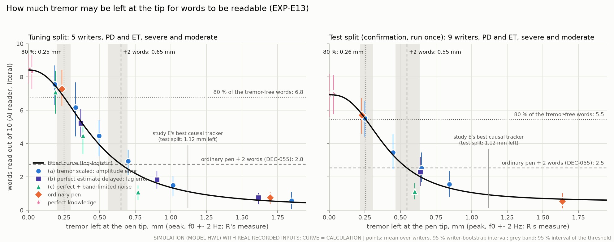
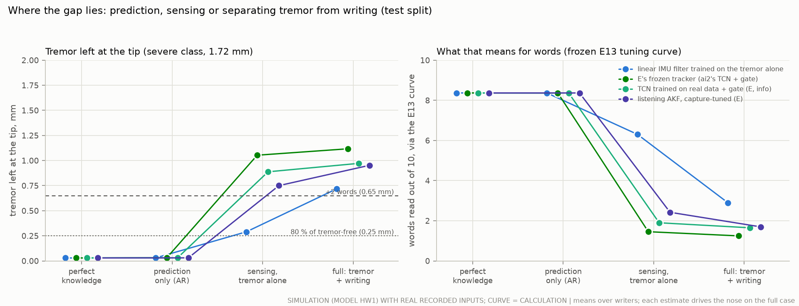
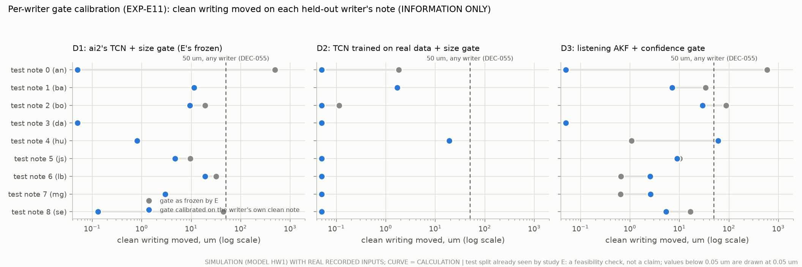

# How much tremor may be left at the pen tip, and where the gap lies (study F)

<!-- Generated by `python3 -m readable.doc --fill readable/doc_template.md --out docs/readable_target.md` from
results/readable/readable.json: every number in this document comes from that file; none was copied by hand. -->

## The answer in plain words

*Study F, 30 September 2026. SIMULATION (the hand–pen model HW1) with real recorded handwriting and real recorded
tremor; nothing was built, and nothing was measured on a pen or a person. Every number is labelled SIM (simulation),
CALC (calculation), ASSUMPTION or PROPOSED DESIGN (§1).*

**What was asked.** Study E found no tremor tracker that makes severely tremulous writing readable: at the severe
class (about 1.7 mm of tremor at the pen tip) an ordinary pen gives 0.5 readable words out of 10, perfect knowledge of
the tremor 7.0, and the best causal tracker 0.5, because it still leaves 1.1 mm of tremor at the tip. Three questions
followed:
1. **How much tremor may be left at the tip for words to be readable?** (EXP-E13: the target for any tracker.)
2. **Does setting the tracker's on/off gate from each user's own clean writing keep every writer's clean writing
   within 50 µm?** (EXP-E11, REQ-CTRL-016.)
3. **Is the gap to perfect knowledge a problem of predicting the tremor a few milliseconds ahead, or of telling tremor
   from writing in the pen's sensors?**

**The answers.**

1. **The readable level (EXP-E13; SIM, with the curve a CALC).** Drive the Rev J nose with perfect knowledge of the
   tremor, then spoil it on purpose (cancel only part of the tremor, cancel it late, or add random error) and read the
   ink. Words read fall along one curve as more tremor is left at the tip.
   - **DEC-055's words line (+2 words over the ordinary pen) needs no more than about 0.55-0.65 mm of tremor left at
     the tip.** The tuning split puts it at {{T_R2}} mm (95 % interval {{T_R2_LO}}-{{T_R2_HI}}). The test split, run
     once after that value was frozen, confirms it: with {{S_TIP_AT_R2}} mm left its writers gained {{S_GAIN_AT_R2}}
     words, just at the line; its own curve, on notes that are harder to read, puts the line at {{S_R2}} mm
     ({{S_R2_LO}}-{{S_R2_HI}}).
   - **Near-normal reading (80 % of the words read without tremor) needs about 0.25 mm or less**: {{T_R80}} mm on the
     tuning split ({{T_R80_LO}}-{{T_R80_HI}}), {{S_R80}} mm on the test split; within one word of the clean notes:
     {{T_RW1}} and {{S_RW1}} mm.
   - **Study E's best causal tracker leaves 1.12 mm: about {{E_OVER_R2}} times too much** in amplitude
     ({{E_POWER_OVER_R2}} times in power) against the tuning value, and {{S_E_OVER_R2}} times against the test value.
   - **How the error is made matters.** At the same tip tremor, random error costs more words than a smaller copy of the
     tremor: the +2-words level is {{T_R2_a}} mm for an amplitude error, {{T_R2_b}} mm for a lag error and {{T_R2_c}} mm
     for random error (tuning). On the test split, with {{S_TIP_E13c_r2}} mm left, random error gained {{S_GAIN_E13c_r2}}
     words where the amplitude error gained {{S_GAIN_E13a_r2}} with {{S_TIP_E13a_r2}} mm.

2. **Per-writer gates (EXP-E11; SIM, information only: study E has already seen these test writers).** Setting the
   gate from each writer's own clean writing (a different note from the one scored), with the rule chosen on the tuning
   writers, **kept every test writer's clean writing within {{D1_cal_WORST}} µm** for study E's frozen design (from
   {{D1_frozen_WORST}} µm) and within {{D2_cal_WORST}} µm for the network trained on real data, and removed the added
   tremor at small tremor. **It does not make words readable:** the gain at the severe class stays at
   {{D1_cal_GAIN}} and {{D2_cal_GAIN}} words, because the estimators still leave about 1 mm. A rule that may lower the
   threshold as well as raise it let one writer reach {{D3_cal_WORST}} µm, so calibration should only ever raise it.
   The real answer needs shadow-mode recordings of people (EXP-R01).

3. **Prediction or separation? Separation (SIM; the split of the residual is a CALC).**
   - **Predicting the tremor is not the problem.** Given the true tremor signal 1.52 ms late (the pen's sensor and filter
     delays), a simple causal linear predictor covers the whole 4.9 ms to the moment the nib acts: it leaves
     {{GS_pred_ar_imu_M}} mm, the same as perfect knowledge, and its ink was read as well ({{GS_pred_ar_imu_WR}} words of
     10 on the test split). A 10 ms horizon costs almost nothing more, and raw broadband tremor recordings give the same
     answer.
   - **Telling tremor from writing is the problem.** With the tremor alone in the pen's own sensors, a plain linear
     filter on the pen's accelerometer already gets down to {{GS_fir_trem_raw_M}} mm ({{GS_fir_trem_raw_WR}} words read).
     Once the person writes, every estimator either backs off and leaves {{GS_net_full_gated_M}}-{{GS_ai2tcn_full_gated_M}}
     mm (study E's, about half a word), or keeps acting and moves the writing itself (the same linear filter moved clean
     writing by about {{GS_fir_raw_CLEAN}} µm, and 0 words were read).
   - **Sensing is the smaller, second part.** From the accelerometer alone even a perfect sensor stalls near 0.3 mm (a
     fixed filter cannot turn acceleration into position well enough near the bottom of the tremor band); an accurate,
     drift-free position reference would allow about 0.1 mm; the page sensor modelled on the one measured pen-tip
     sensor would not.
   - **So the project should invest in separating tremor from writing first, and in position sensing in the tremor band
     second. Prediction and latency need no investment.**

**What it means for the pen.**
- **A tracker now has a number to hit.** At the severe class (1.7 mm at the tip) it must leave no more than about 0.55
  mm, a third of the tremor, while keeping clean writing within DEC-055's 25 µm on average and 50 µm for any writer;
  about 0.25 mm for near-normal reading. Study E's best leaves 1.1 mm.
- **Per-user gates make trackers safe, not useful.** Calibrating the gate on the user's own writing (only ever raising
  it) keeps clean writing still for every simulated writer, but it cannot add tremor removal the estimator does not have.
- **The work is in separation.** Better prediction or lower latency would not change the words. An estimator that
  tells writing from tremor, or a drift-free position reference at tremor frequencies, would.
- **Nothing here is a benefit to people yet.** It is a simulation with an AI reader standing in for a person.

**What to test next.**
- Whether people read these inks the way the AI reader does (a small blinded panel on the E13 inks; EXP-R03, proposed
  EXP-E20).
- How accurate a pen-tip position sensor must be in the tremor band to reach 0.25 mm with the tremor alone (a sensor
  sweep in simulation, then the rig; proposed EXP-E21).
- Per-user gates on people's own writing in shadow mode (EXP-R01), including users who cannot write without tremor
  (proposed EXP-E22).
- Estimators that separate writing from tremor, judged against the 0.55 mm target on new held-out data (EXP-E10,
  EXP-E12).

## One number per condition: words you can read out of 10, against the tremor left at the tip

{{TABLE:curve}}

- **Read off the curve fitted to every simulated reading** (below, and §3). The tuning curve was fitted and frozen
  first; the test curve comes from the test split's own readings. The AI reader (TrOCR base, literal) stands in for a
  person.
- **For comparison** (study E, test split): an ordinary pen leaves 1.64 mm, study E's best causal tracker 1.12 mm,
  perfect knowledge 0.03 mm.

## Details

### 1. Status, labels and how to reproduce

- **Labels.** **SIM**: an executed simulation of model HW1 (`handwriting/`, read-only) with real recorded inputs (study
  R's library: UNIPEN hpb2 writing, UCI Parkinson's tip tremor, Zenodo essential-tremor hand acceleration; recordings made
  by others). **CALC**: a calculation on simulated or recorded signals (the curve fit, the thresholds, the part
  residuals, the broadband check). **ASSUMPTION**: a value chosen here. **PROPOSED DESIGN**: nothing was built.
  **LIT**: literature with its ledger id (none new here). Nothing here is a MEASUREMENT: nothing was built, and nothing
  was measured on a person or on hardware.
- **Package.** `readable/` (new). `python3 -m readable.run` runs every stage (`--quick` for a short check that writes to
  `readable/build/quick/` and never to `results/readable/`). Stages resume from `readable/build/` (git-ignored). Tests:
  `python3 -m pytest -q readable/tests`.
- **Reused read-only.** `realdata/` (R's library, splits, HW1 set-up, the reader, R's measures and writer bootstrap,
  R's cached test cases) and `realtrack/` (E's tuning selection set and folds, cached cases, estimators, frozen designs,
  the command-path surrogate, the FIR code). Nothing in them was changed; the numba cache is private to `readable/build`.
- **Results.** `results/readable/readable.json` (with `stabpen.provenance`: git revision, the inputs' sha256, seeds,
  parameters and splits, command, python, numpy and torch versions), `frozen.json` (written after the tuning runs and
  before any test case was built), four figures with their CSV twins, and `evidence_rows.csv` (proposed ledger rows).
  The tables of this document are generated by `python3 -m readable.doc` into `readable/build/doc_tables.md`.

### 2. EXP-E13: how the readable level was found

- **The pen and the inputs.** Study R's hand–pen model HW1 with the Rev J nose (±6 mm), study R's real notes and real
  tremor, study R's reader and measures. On the tuning split: study E's selection set (5 tuning writers × 2 notes,
  tuning texts; PD and ET recordings of tuning patients of the note's fold) at the severe class (1.72 mm at the tip,
  DEC-055's condition) and the moderate class (0.24 mm), and the same 10 notes without tremor. Every case was rebuilt
  with study E's code and seeds: the nose-held tip tremor of every case equals study E's cached value to the last digit.
- **Three kinds of residual on top of perfect knowledge** (`readable/residual.py`; perfect knowledge is study R's:
  the nose is given the true handle tremor, previewed by the servo's delay):
  - **(a) amplitude error**: the nose cancels a share k of the tremor, so 1 − k is left: 0, 10, 18, 27, 38, 55 and 100 %
    left (100 % is the nose held still);
  - **(b) lag error**: the perfect estimate arrives τ late: 5.2 ms (study E's whole IMU-to-tip chain without any
    prediction: it leaves 19 % of a 6 Hz tremor, CALC), 13.4 ms (the far end of study E's horizon sweep: the servo delay
    + 10 ms) and 25 ms;
  - **(c) random error**: perfect cancellation plus band-limited noise (two-dimensional, the tremor's own band
    f0 ± 2 Hz) of 0.2, 0.4 and 0.8 mm (the class convention: √2 × RMS of the major axis).
  At the moderate class only perfect knowledge was added to the ordinary pen (the reading budget).
- **Measures.** Words read out of 10 (TrOCR base, literal: greedy decoding, no dictionary, no correction: study R's
  reader, unchanged), and the tremor left at the tip (study R's measure: √2 × RMS of the major axis of ink minus
  intended, in contact, f0 ± 2 Hz). Every run was read. The same notes without tremor give the ceiling.
- **The curve** (`readable/curve.py`, fixed before any reading): words fall from the tremor-free level to a floor
  along a log-logistic curve, w(r) = w_lo + (w_hi − w_lo) / (1 + (r / r50)^s), fitted by least squares to every run of
  every case (the ordinary pen and the clean notes included). Read off it:
  - **the residual for +2 words**: where the curve reaches the ordinary pen's words at the severe class plus 2
    (DEC-055's words line);
  - **the residual for 80 %** of the words read on the same notes without tremor (the brief);
  - **the residual for words within 1 of the clean notes** (EXP-E13's measurand in `validation/bench_protocols.md`).
  95 % intervals: 2000 bootstrap resamples of writers, each refitted.
- **Frozen, then confirmed once.** The tuning curve, its thresholds and six test levels aimed at them were written to
  `results/readable/frozen.json` before any test case was built: (a) at the 80 % residual, midway, the +2 residual and
  1.3 × the +2 residual; (b) the delay whose steady-sine residual equals the +2 residual; (c) noise at the +2 residual.
  On R's test split (9 test writers, R's severe PD and ET cases and seeds) each case ran once with those six levels;
  R's own readings of the same cases (ordinary pen, perfect knowledge at the severe and moderate classes, clean notes)
  were merged in, as study E did.

### 3. EXP-E13: results

**Tuning split** (SIM; study R's tuning split, study E's selection set: 5 writers, 10 notes, 20 severe and 20 moderate
cases, 10 clean notes; every run read).
- **Words fall smoothly as tremor is left at the tip.** The fitted curve starts at {{T_W@0.1}} words of 10 with 0.1 mm
  left, is at {{T_W@0.3}} with 0.3 mm, {{T_W@0.5}} with 0.5 mm, {{T_W@0.75}} with 0.75 mm and {{T_W@1}} with 1 mm (the
  same notes without tremor: {{T_WCLEAN}}; the ordinary pen at the severe class: {{T_WORD}}).
- **The thresholds** (CALC; 95 % writer-bootstrap intervals): +2 words over the ordinary pen at **{{T_R2}} mm**
  ({{T_R2_LO}}-{{T_R2_HI}}); 80 % of the tremor-free words at **{{T_R80}} mm** ({{T_R80_LO}}-{{T_R80_HI}}); within 1 word
  of the clean notes (EXP-E13's measurand) at **{{T_RW1}} mm** ({{T_RW1_LO}}-{{T_RW1_HI}}). A model-free check (straight
  lines through the per-level means of the amplitude sweep) gives {{T_MF_R2}}, {{T_MF_R80}} and {{T_MF_RW1}} mm.
- **The kind of error matters a little.** Fitted per kind of residual: +2 words at {{T_R2_a}} mm for an amplitude
  error, {{T_R2_b}} mm for a lag error, {{T_R2_c}} mm for random error. Random error costs the most at the same tip
  tremor. Part of it is the measure: R's convention counts the major axis only, and the isotropic noise has as much
  motion across the major axis as along it, where the real tremor has about half; with study E's broadband residual
  (0.5-20 Hz RMS, both axes) as the x-axis the three kinds give +2 words at {{T_R2BB_a}}, {{T_R2BB_b}} and
  {{T_R2BB_c}} mm RMS.
- **Parkinson's and essential tremor agree:** +2 words at {{T_R2_PD}} mm (PD) and {{T_R2_ET}} mm (ET); 80 % at
  {{T_R80_PD}} and {{T_R80_ET}} mm.
- **One reading of one note is noisy** (the curve's RMS error per reading is {{T_RMSE}} words): the AI reader moves in
  whole words, and a note can drop from 7 to 5 words between two inks that differ little. Means over writers are much
  steadier (the intervals in the tables).
- **AC-E13-01** (validation pass 10; a hypothesis: the +2-words residual lies within 0.24-1.0 mm): {{T_R2}} mm on the
  tuning split, inside the range (SIM).

**Test split** (SIM; run once after the freeze; 9 writers, R's severe PD and ET cases, six levels aimed at the frozen
thresholds; R's readings of the ordinary pen, perfect knowledge and the clean notes merged).
- **The test notes are harder to read** even without tremor ({{S_WCLEAN}} words of 10 against {{T_WCLEAN}} on the
  tuning notes), so the whole curve sits lower; the ordinary pen reads {{S_WORD}}.
- **The test curve**: +2 words at **{{S_R2}} mm** ({{S_R2_LO}}-{{S_R2_HI}}), 80 % of the tremor-free words at
  **{{S_R80}} mm** ({{S_R80_LO}}-{{S_R80_HI}}), within 1 word at {{S_RW1}} mm; model-free {{S_MF_R2}}, {{S_MF_R80}} and
  {{S_MF_RW1}} mm; PD {{S_R2_PD}} mm and ET {{S_R2_ET}} mm for +2 words.
- **At the level aimed at the tuning +2 residual** (the nose leaving {{S_TIP_AT_R2}} mm): {{S_WORDS_AT_R2}} words of 10,
  a gain of {{S_GAIN_AT_R2}} words over the ordinary pen.
- **The frozen tuning curve against the test readings**: mean error {{S_PRED_ERR}} words, mean absolute error
  {{S_PRED_MAE}} words per run: it over-predicts on the harder test notes by about the difference in their ceilings.

{{TABLE:e13}}

### 4. EXP-E11: how the per-writer gate was calibrated

- **The designs** (study E's frozen files, read-only): **D1** ai2's causal TCN with its soft size gate (E's frozen
  choice, retired as a nib driver by DEC-061, kept as a test object); **D2** the TCN trained on real data ('net') with its
  soft size gate; **D3** the listening AKF with the soft confidence gate (information, not read).
- **The gate.** The nose gets g × gain × the raw estimate, where g ramps from 0 to 1 as the estimate's own size A (√2 ×
  RMS over τ_amp) goes from a_lo to a_hi, with attack and release times. Calibration moves a_lo and a_hi only.
- **The rule** (REQ-CTRL-016, written before any run): run the design's raw estimate on another note of the same writer,
  written without tremor (the nose held, the DeltaPen-class page sensor, its own sensor seed); take the p-quantile of A
  over its pen-down time; set a_lo = κ × that quantile ('per user': it may go up or down), or the larger of that and the
  frozen a_lo ('raise only'); a_hi keeps the frozen ratio a_hi / a_lo. Grid: p ∈ {0.99, 0.999, 1 (the maximum)} × κ ∈
  {1, 1.25, 1.5, 2} × the two modes: 24 rules per design.
- **The calibration note** is the first note of the same writer (seed i + K·k, K = the number of writers in the split)
  that shares no recorded line with the scored note.
- **The choice on the tuning split** (study E's surrogate of the Rev J command path, the DeltaPen-class sensor; each
  tuning note calibrated on its writer's other note; the learned model of each tuning note is its cross-fitted fold
  model, which never saw that writer): a rule passes if clean writing moves ≤ 40 µm on every tuning note (the 50 µm
  line with a 10 µm margin) and ≤ 20 µm on average (E's T2), with E's T3 and T4 (no harm at the mild and moderate
  classes, none at 0.6 mm). The passing rule that removes the most severe tremor (E's T1) wins; within 0.01 of it, the
  most conservative.
- **The test** (once, after the freeze; information only): each of R's 9 test writers calibrated on another of their
  own notes, then R's cases in the full HW1 plant: the clean note (clean writing moved; words), the severe PD and ET
  cases (words read for D1 and D2; tip tremor), the moderate and mild cases (tip tremor: the no-harm check against the
  nose-held pen).

### 5. EXP-E11: results (information only)

**Tuning split** (SIM, surrogate of the command path; each tuning note calibrated on its writer's other note). The
rules chosen: D1 {{D1_RULE}}, D2 {{D2_RULE}}, D3 {{D3_RULE}} (q = the quantile, k = the margin κ). For the two networks
the rule only **raises** the frozen threshold where the writer's own clean writing needs it. The table below gives the
tuning numbers next to the frozen gates.

**Test split** (SIM, full plant, INFORMATION ONLY: study E has already seen these writers; each writer calibrated on a
different note of their own).

- **Every writer within 50 µm, for both networks.** With the gate calibrated on each writer's own clean note, the
  largest clean-writing change is **{{D1_cal_WORST}} µm** for ai2's TCN (D1; study E's frozen gate: {{D1_frozen_WORST}}
  µm, writer 'an') and **{{D2_cal_WORST}} µm** for the real-data TCN (D2; frozen: {{D2_frozen_WORST}} µm); the means
  are {{D1_cal_CLEAN}} and {{D2_cal_CLEAN}} µm. For writer 'an', whose large fast letters look like tremor to ai2's
  TCN, the calibration raised the gate's opening from {{E11_D1_FROZEN_ALO}} to {{E11_W0_D1_ALO}} mm; for most writers it
  left the frozen threshold where it was.
- **No harm at small tremor any more.** The worst writer's tip tremor at the mild class, as a share of the nose-held
  pen's: {{D1_cal_MILDW}} for D1 calibrated (frozen: {{D1_frozen_MILDW}}), {{D2_cal_MILDW}} for D2 ({{D2_frozen_MILDW}});
  at the moderate class {{D1_cal_MODW}} and {{D2_cal_MODW}} (REQ-CTRL-017 asks for at most 1.02).
- **But the words do not come back.** At the severe class, words gained over the ordinary pen: {{D1_cal_GAIN}} (D1
  calibrated) and {{D2_cal_GAIN}} (D2 calibrated), against DEC-055's +2. The estimators still leave
  {{D1_cal_RATIO}} and {{D2_cal_RATIO}} of the ordinary pen's tip tremor, about 1 mm, far above the {{T_R2}} mm that
  EXP-E13 asks for. For writer 'an' the calibrated gate simply stays shut: no harm, and no help.
- **A rule that may also lower the threshold is not safe.** The listening AKF's chosen rule (D3, {{D3_RULE}}) lowered
  the threshold for writer 'hu', whose calibration note was calmer than the scored note, and moved that writer's
  clean writing {{D3_cal_WORST}} µm: above the 50 µm line.
- **AC-E11-02** (the largest single writer ≤ 50 µm): met in this simulation for D1 and D2 with the raise-only rules,
  not met for D3 with its per-user rule. Information only: the test split was seen by study E, one note per writer
  calibrates, and people's own writing (EXP-R01 shadow mode) is the real test.

{{TABLE:e11}}

### 6. Prediction or separation: how the gap was split

The question: of the words lost between perfect knowledge (7.0 of 10) and the best causal estimator (0.5 of 10) on the
test split, how much is lost to predicting the tremor over the pen's horizon, and how much to getting the tremor out
of the pen's sensors while the person writes? Every configuration below drives the nose on the **full** case (tremor
and writing), in the full HW1 plant, at the severe class; the tremor left at the tip is study R's measure.

| Step | What the estimator is given | Configuration |
|---|---|---|
| C0 perfect knowledge | the true tremor, previewed by the servo delay (3.39 ms) | study R's oracle |
| C1 prediction only | the **true tremor signal**, known causally but 1.52 ms late (the IMU path's sensor and filter delays in study E's budget: anti-aliasing 1.04 ms, FIFO and SPI 0.35 ms, pair averaging 0.13 ms), to be predicted 3.39 ms ahead: a 4.9 ms horizon | a causal linear predictor (least-squares AR on the true tremor, 1 ms lag spacing, order chosen on the tuning split, cross-fitted by fold); with no prediction for comparison |
| C2 sensing, tremor alone | the pen's **sensor streams of the tremor alone**: the same case, sensor models and noise draws, the note's own contact, but only the tremor part of the handle's motion (and no writing in the pen-rotation model) | a linear filter on the IMU trained here on the tremor alone (study E's polyphase FIR, length chosen on the tuning split); the AR predictor on the page sensor's position (ideal and DeltaPen-class); study E's estimators as frozen |
| C3 full | the pen's real sensor streams: tremor **and** writing | the same estimators (study E's configuration) |

- **C1 − C0 is prediction; C2 − C1 is sensing; C3 − C2 is separation** (what the writing does to the estimate). The
  task's two parts are (i) = C1 and (ii) = everything between C1 and C3; the split of (ii) into sensing and separation
  is added because it changes where to invest.
- **Part residuals** (CALC): study R's measure applied to each error signal at the moment the nose acts, e.g. the
  separation part alone = the tremor-alone estimate minus the full estimate.
- **Words**: every tip residual is mapped to words through the frozen E13 tuning curve; on the test split four
  configurations were also read directly as a check of the mapping.
- **Clean writing**: the same estimators on the notes without tremor (tuning: study E's cached cases with E's surrogate;
  test: the full plant): the other face of separation.
- **A check on the tremor signal** (CALC on DATA): study R's tremor waveforms keep only f0 ± 2 Hz and 2 f0 ± 2 Hz, which
  makes them smooth. The predictor was refitted on the raw tuning ET recordings made displacement both in those bands and
  in one broad band (f0 − 2 Hz to 20 Hz), cross-fitted by subject.

### 7. Prediction or separation: results

**Tuning split** (SIM, 20 severe cases; the full plant; words via the frozen tuning curve, CALC):

| Step | Tremor left at the tip, mm | Words of 10 via the curve | What it shows |
|---|---|---|---|
| C0 perfect knowledge | {{GT_oracle_M}} | {{GT_oracle_W}} | the nose's own floor |
| C1 prediction only: AR on the true tremor, 4.9 ms horizon | {{GT_pred_ar_imu_M}} | {{GT_pred_ar_imu_W}} | predicting 4.9 ms ahead costs nothing |
| ... the same with a 10 ms horizon | {{GT_pred_ar_h10_M}} | {{GT_pred_ar_h10_W}} | even twice the horizon costs almost nothing |
| ... no prediction (the true tremor 4.9 ms late) | {{GT_pred_hold_M}} | {{GT_pred_hold_W}} | why prediction is needed, and is enough |
| C2 sensing, tremor alone: ideal page sensor (3 µm, 2 ms) + AR | {{GT_page_ar_trem_ideal_M}} | {{GT_page_ar_trem_ideal_W}} | a position sensor that is accurate in the tremor band would suffice |
| C2 sensing, tremor alone: linear filter on the pen's IMU | {{GT_fir_trem_raw_M}} | {{GT_fir_trem_raw_W}} | the IMU alone, with no writing to reject: about the 80 % level |
| C2 sensing, tremor alone: study E's listening AKF (capture-tuned) | {{GT_akf_trem_raw_M}} | {{GT_akf_trem_raw_W}} | |
| C2 sensing, tremor alone: study E's TCN trained on real data + gate | {{GT_net_trem_gated_M}} | {{GT_net_trem_gated_W}} | E's networks stay cautious even with no writing |
| C2 sensing, tremor alone: ai2's TCN + gate (E's frozen) | {{GT_ai2tcn_trem_gated_M}} | {{GT_ai2tcn_trem_gated_W}} | |
| C3 full: the IMU filter trained on the tremor alone meets writing | {{GT_fir_full_raw_M}} | {{GT_fir_full_raw_W}} | less tremor left, but it moves clean writing {{GT_fir_raw_CLEAN}} µm (tuning notes) |
| C3 full: study E's listening AKF | {{GT_akf_full_raw_M}} | {{GT_akf_full_raw_W}} | moves clean writing {{GT_akf_raw_CLEAN}} µm |
| C3 full: the real-data TCN + gate | {{GT_net_full_gated_M}} | {{GT_net_full_gated_W}} | clean writing {{GT_net_gated_CLEAN}} µm |
| C3 full: E's frozen design | {{GT_ai2tcn_full_gated_M}} | {{GT_ai2tcn_full_gated_W}} | clean writing {{GT_ai2tcn_gated_CLEAN}} µm |
| Rev J, nose held | {{GT_held_M}} | {{GT_held_W}} | |

- **(i) Prediction is not the gap.** Given the true tremor signal 1.52 ms late, a causal linear predictor leaves
  {{GT_pred_ar_imu_M}} mm (perfect knowledge {{GT_oracle_M}} mm): the words are those of perfect knowledge. Its
  cross-fitted in-band error is {{AR_CV_UM}} µm, against {{HOLD_CV_UM}} µm with no prediction. The check on broadband
  tremor ({{BB_NREC}} raw ET recordings, {{BB_NSUBJ}} subjects, CALC on DATA): the predictor's in-band error is
  {{BB_NARROW_PCT}} % of the tremor in the library's bands and {{BB_BROAD_PCT}} % in a broad band to 20 Hz
  ({{BB_BROAD_RMS_PCT}} % of the broadband RMS), against {{BB_HOLD_PCT}} % with no prediction. So smoothing by the
  library does not create the result.
- **(ii) The gap is getting the tremor out of the pen's sensors while the person writes.** Split in two:
  - **Sensing, with no writing at all.** Even with the tremor alone, the pen's IMU gives a linear filter
    {{GT_fir_trem_raw_M}} mm ({{GT_fir_trem_raw_W}} words): acceleration must be turned into position causally, which
    a fixed filter can do only roughly near the low edge of the tremor band. A perfect accelerometer does no better
    (§7.1). An accurate position sensor would (ideal page sensor: {{GT_page_ar_trem_ideal_M}} mm); the DeltaPen-class
    page sensor is not accurate enough in the tremor band (§7.1).
  - **Separation.** With writing present, the same tremor-trained filter moves clean writing about
    {{GT_fir_raw_CLEAN}} µm: it cannot tell writing from tremor. Study E's estimators avoid that by caution, and pay for
    it: they leave {{GT_net_full_gated_M}}-{{GT_ai2tcn_full_gated_M}} mm with writing and still {{GT_net_trem_gated_M}}-
    {{GT_ai2tcn_trem_gated_M}} mm on the tremor alone. The error that the writing itself puts into their estimates is
    {{GT_ai2tcn_gated_SEP}} mm (E's frozen design) and {{GT_net_gated_SEP}} mm (real-data TCN) at the tip (CALC).

**Test split** (SIM, 18 severe cases of R's 9 test writers, run once after the freeze; four configurations read
directly; words also mapped through the test split's own curve, since the test notes are harder to read):

| Step | Tremor left at the tip, mm | Words via the test curve | Words read directly |
|---|---|---|---|
| C0 perfect knowledge (R's reading) | {{GS_oracle_M}} | {{GS_oracle_WT}} | 7.0 (study R) |
| C1 prediction only: AR on the true tremor, 4.9 ms | {{GS_pred_ar_imu_M}} | {{GS_pred_ar_imu_WT}} | {{GS_pred_ar_imu_WR}} |
| C2 tremor alone: linear IMU filter | {{GS_fir_trem_raw_M}} | {{GS_fir_trem_raw_WT}} | {{GS_fir_trem_raw_WR}} |
| C2 tremor alone: ideal page sensor + AR | {{GS_page_ar_trem_ideal_M}} | {{GS_page_ar_trem_ideal_WT}} | - |
| C2 tremor alone: real-data TCN + gate | {{GS_net_trem_gated_M}} | {{GS_net_trem_gated_WT}} | {{GS_net_trem_gated_WR}} |
| C3 full: the same IMU filter meets writing | {{GS_fir_full_raw_M}} | {{GS_fir_full_raw_WT}} | {{GS_fir_full_raw_WR}} |
| C3 full: real-data TCN + gate | {{GS_net_full_gated_M}} | {{GS_net_full_gated_WT}} | - |
| C3 full: E's frozen design | {{GS_ai2tcn_full_gated_M}} | {{GS_ai2tcn_full_gated_WT}} | 0.5 (study E) |

- **The test split repeats the tuning split.** Prediction costs nothing ({{GS_pred_ar_imu_M}} mm left; read
  {{GS_pred_ar_imu_WR}} words, as perfect knowledge). The IMU alone, with no writing, leaves {{GS_fir_trem_raw_M}} mm
  ({{GS_fir_trem_raw_WR}} words read). With writing, the estimators leave {{GS_net_full_gated_M}}-{{GS_ai2tcn_full_gated_M}}
  mm.
- **The tip-tremor number is not enough on its own.** The IMU filter trained on the tremor alone leaves only
  {{GS_fir_full_raw_M}} mm of tremor with writing present, which the curve would score at {{GS_fir_full_raw_WT}} words,
  but it moves the writing itself (clean notes: {{GS_fir_raw_CLEAN}} µm on average) and {{GS_fir_full_raw_WR}} words are
  read. DEC-055's second line, on clean writing, is what catches this.
- **The mapping holds where the writing is left alone.** Read directly, the AR prediction, the IMU filter on the tremor
  alone and the real-data TCN on the tremor alone give {{GS_pred_ar_imu_WR}}, {{GS_fir_trem_raw_WR}} and
  {{GS_net_trem_gated_WR}} words, against {{GS_pred_ar_imu_WT}}, {{GS_fir_trem_raw_WT}} and {{GS_net_trem_gated_WT}}
  from the test curve.

**7.1 What the sensors allow with the tremor alone** (CALC on SIM, tuning split; `readable/gap.py`, sensing check).

{{TABLE:sensing}}

- **A perfect accelerometer is barely better than the pen's IMU** ({{SC_imu_perfect_SIG}} against {{SC_imu_pen_SIG}}
  mm in the tremor band; {{SC_imu_perfect_TIP}} against {{SC_imu_pen_TIP}} mm at the tip): the limit of the IMU route is
  turning acceleration into position causally with a fixed filter, not the sensor's noise, bias or the pen's rotation.
- **An accurate, drift-free position sensor would do it.** With the ideal page sensor (3 µm, 2 ms; a bound) the AR
  predictor fitted on the true tremor leaves {{GT_page_ar_trem_ideal_SIG}} mm in the tremor band and
  {{GT_page_ar_trem_ideal_M}} mm at the tip (tuning; test {{GS_page_ar_trem_ideal_M}} mm).
- **The DeltaPen-class page sensor does not.** Its window error grows with movement and accumulates (R's pessimistic
  model of the one measured pen-tip sensor). With the same predictor its in-band error is
  {{GT_page_ar_trem_deltapen_SIG}} mm, but its drift carries the nose away from centre and
  {{GT_page_ar_trem_deltapen_M}} mm is left at the tip. Removing the drift with a causal high-pass (1.5 Hz) before a
  linear predictor fitted to it leaves {{SC_page_deltapen_SIG}} mm (with the ideal sensor that high-passed estimator
  gives {{SC_page_ideal_SIG}} mm: the high-pass itself costs accuracy with a 64 ms predictor). So, in R's model, the
  relative page sensor is no better than the IMU for the tremor; an absolute, drift-free position reference in the
  tremor band is what would help.

{{TABLE:fir}}

{{TABLE:broadband}}

{{TABLE:gap}}

### 8. What this means for the pen

- **The target, in the pen's terms (CALC).** At the severe representative (1.72 mm at the tip) the nose-held Rev J
  pen shows about 1.8 mm; leaving 0.55-0.65 mm means cancelling about two thirds of it: the nib must move about 1.1-1.2
  mm (peak, along the tremor's major axis) in step with the tremor, and more at the tremor's bursts (its size wanders
  by about 60 %, study R). Rev K's two-axis nib is ±1.0 mm (DEC-050, DEC-060), so an estimator that reached the target
  would already need DEC-060's revisit of the ±1.5 mm nib; near-normal reading (0.25 mm) would need about 1.5 mm.
- **The words line in tip-tremor terms.** With study R's ordinary pen at 1.64 mm (test split), 0.55 mm is a share of
  0.34 (power −89 %); study E's best causal tracker reached 0.69 (power −52 %).
- **A tip-tremor target is necessary, not sufficient.** The linear IMU filter shows that tremor left at the tip can fall
  while the words vanish, because the correction moves the writing. Any estimator must pass both of DEC-055's lines.
- **Per-user calibration belongs in the firmware as a raise-only rule** (proposed REQ-CTRL-019): it removed study E's
  worst clean-writing case and the added tremor at small tremor at the cost of a few percent of severe-tremor removal;
  a rule that can lower the threshold failed one writer.
- **Where to spend the next estimator effort:** on separation (features and training that tell writing from tremor,
  per-user adaptation in shadow mode), and on an absolute position reference in the tremor band; not on prediction,
  latency or RL policies (study E §12 reached the same view from the other side).

### 9. Data discipline and reproduction checks

- **Every choice on R's tuning split.** The E13 levels, the curve model, the thresholds' definitions, the E11 rule grid
  and selection rule, the predictor's structure and the linear filter's size were written in the code before the runs
  and chosen on the tuning split only (E's selection set: 5 tuning writers x 2 notes, tuning texts, tuning patients).
- **Frozen, then tested once.** `results/readable/frozen.json` holds the tuning curve, its thresholds, the test levels
  aimed at them, the E11 rules and the predictor, with its time. The test split (R's 9 test writers, test texts, test
  patients) was then run once.
- **E11 on the test split is information only.** Study E has already looked at the test split; a per-user gate chosen
  after E's result cannot be claimed from it. The real answer needs shadow-mode data on people (EXP-R01).
- **Reproduction checks.** The rebuilt tuning cases give study E's nose-held tip tremor to the last digit; the rebuilt
  sensor streams equal E's cached streams sample for sample; the rebuilt test runs of E's frozen designs give E's test
  results; the rebuilt perfect-knowledge runs give R's.

### 10. Limitations

- **Simulation only.** Model HW1 with real recorded inputs; nothing was measured on a person or a pen. The Rev J nose is
  a PROPOSED DESIGN (the next prototype, Rev K, has a ±1 mm nib: DEC-050, DEC-060; at the severe class's 1.72 mm the
  residual targets here would have to be met within that reach).
- **The AI reader stands in for people.** Words are read by TrOCR base, literal (study R's reader). Its readings move in
  whole words and can change by 1-2 words between two inks that differ little; the curve smooths over this, the
  per-level tables do not. How people read the same ink is EXP-R03's question; the thresholds here are the reader's.
- **Composed inputs.** Healthy adults' notes (UNIPEN hpb2) with patients' tremor added at the hand. Patients' own
  writing (smaller, slower, adapted) may be more or less tolerant of residual tremor (EXP-R01).
- **Idealised residuals.** The three residual kinds are clean shapes (a scaled copy, a delayed copy, band-limited
  noise). A real estimator's error mixes them and adds error outside the f0 ± 2 Hz band, which R's measure does not
  count; the per-type fits show how much the kind matters.
- **Few writers.** 5 tuning writers (10 notes) and 9 test writers (one note each): the writer-bootstrap intervals are wide
  and the tuning split's own interval rests on 5 writers.
- **R's tremor waveforms are band-limited by construction** (f0 ± 2 Hz and 2 f0 ± 2 Hz). That makes the prediction step
  easy; the broadband check on the raw ET recordings (hand acceleration, 1.5-20 Hz) shows the same answer, but no open
  broadband recording of tremor at the pen tip exists (PD tip data are pixel-quantised at 0.2 mm).
- **The sensing step is one design.** The linear IMU filter is the best fixed linear filter of its size found on the
  tuning split; a non-linear or adaptive estimator trained on tremor alone might do better. The page-sensor rows use a
  predictor fitted on the true tremor.
- **E11 is information only.** Study E has already looked at the test split. One clean calibration note per writer; a
  person with severe tremor has no tremor-free writing to calibrate on (the gate would then have to be calibrated with
  the tremor present, which raises the threshold by the tremor itself).
- **R's convention.** Estimators see the sensor streams of the nose-held run (the nose's action does not feed back into
  what they see), as in studies R and E.
- **Compute limits.** One seed per case (R's and E's), and the reading budget: every E13 run was read, but at the
  moderate class only the ordinary pen and perfect knowledge; in E11 the D3 design and in the gap study most
  configurations were measured by tip tremor and mapped through the curve, not read.

<!-- PROPOSALS -->

<!-- OPEN -->

### 13. Files, how to run, tests and compute used

**Code** (`readable/`, new; imports `realdata/`, `realtrack/`, `handwriting/`, `ai2/`, `aiprior/`, `fusion/` and
`stabpen/` read-only):

| File | What it does |
|---|---|
| `run.py` | `python3 -m readable.run [--quick] [--stages ...] [--workers 2]`: every stage, resumable (predictor, tuning, freeze, test, extras, report) |
| `common.py` | R's and E's objects rebuilt with their own code and seeds (tuning and test cases), R's measures and results cards |
| `residual.py` | the three E13 residuals (amplitude, lag, band-limited noise) |
| `curve.py` | the words-against-residual model, its fit and inversion, the writer bootstrap |
| `e13.py` | the E13 plan, tuning and test jobs, the freeze levels, the aggregation, the model-free check |
| `e11.py` | the per-writer gate calibration: the rule grid, the tuning choice, the test part, the aggregation |
| `gap.py` | the AR predictor, the tremor-only sensor streams, the IMU filter, the page estimator, the decomposition, the sensing and broadband checks |
| `jobs.py`, `stages.py` | the job runner (at most two worker processes, spawned) and the job functions and the freeze |
| `report.py`, `figures.py`, `doc.py`, `evidence.py` | `readable.json` with provenance, the figures with CSV twins, this document from `doc_template.md`, the ledger rows |
| `tests/test_readable.py` | residual shapes, the curve and its inversion, the predictors' accuracy and causality, the gate rule, the part-residual measure, the job runner, and the published files' format |

**Results** (`results/readable/`): `readable.json`, `frozen.json`, `evidence_rows.csv`, `fig_e13_curve`,
`fig_e13_by_kind`, `fig_e11_clean`, `fig_gap` (each `.png` with its `.csv`). Build products (per-case caches with the
readings, the predictor, logs) are in `readable/build/` (git-ignored; they include UNIPEN-derived material and must not
be committed).

**Run commands and durations** (this machine, two worker processes, one numerical thread each):
- `python3 -m readable.run`: predictor {{T_predictor}} min, tuning {{T_tuning}} min, freeze {{T_freeze}} min, test
  {{T_test}} min, extras {{T_extras}} min, report {{T_report}} min.
- `python3 -m readable.run --quick`: <!-- QUICK_TIME -->.
- `python3 -m pytest -q readable/tests`: <!-- PYTEST -->.

**Compute.** At most two worker processes at a time; the main process only waits while they run. The AI reader
dominates (about 15 s per note read, one thread; <!-- N_READ --> readings in all). Memory: about 3 GB per worker with the
reader loaded. Disk: `readable/build/` <!-- DISK -->; `results/readable/` <!-- DISK_RES -->.

