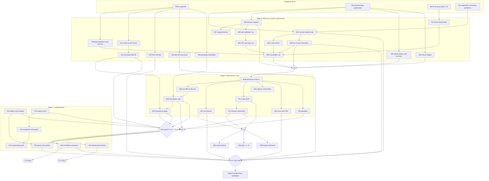

# Prototype stages, gates and the order of experiments

**Status: PROPOSED PLAN. No stage has started; no gate has been passed (2026-09-27; §0 added 2026-09-29).**

- Gates are defined by acceptance-criterion ids from [`acceptance_criteria.csv`](acceptance_criteria.csv).
- Protocols are in [`bench_protocols.md`](bench_protocols.md) and [`human_study_plan.md`](human_study_plan.md).
- Decision ids (DEC-…) refer to `docs/decisions.md`.

## 0. Current order for Rev J (2026-09-29): the review's gates on study M's rigs

This section supersedes the Stage A equipment and critical path below. **The nib to build is Rev K's balanced nib B1** (DEC-050, `docs/balanced_nib.md`): gate G2 tests its coupon, G3 the one-axis nib at ±1.0 mm, G4 the two-axis nib (±1.5 mm only if study E finds an estimator that uses the extra reach). The C1S nose is built only as a bench research module (autowrite, EXP-N08/N09/S19, and EXP-J17's check of the static-load model). For the Rev J nib and earlier notes, the stage structure (bench → tethered pen → untethered pen → product form) and the principles stand. Sources: the independent review of 29 September 2026 and the lead's response (`docs/reviews/2026-09-29_review_response.md` §3–§4), study M's rigs (`docs/measurement_rig.md`, DEC-058, DEC-059) and `bench_protocols.md` §47. Nothing has been built.

| Order | Review gate | Rig (study M) | Experiments | What passing decides |
|---|---|---|---|---|
| 0 | all | DAQ-1: one 24-bit simultaneous DAQ, encoders, camera trigger, sync pulse | bring-up (`docs/measurement_rig.md` §1.3) | every later rig shares one clock |
| 1 | **G1** contact and ink | R9 on a converted CoreXY printer: force plate under the paper plus an in-line axial cell (DEC-058) | EXP-T01, T02 (EXP-B01 re-specified, B08, Q02), T03 (B02, optional); **EXP-J17** (the nib's static side load and holding power at 35/50/75°) | the lowest refill force that writes, the static side load the nib must carry, the friction map of the simulator; the balanced nib's design range (DEC-046, study B) |
| 2 | sensing build gate | R10 on R9's frame | EXP-T04, T05 (EXP-S01 with DEC-059's metric, EXP-J10 with its accumulated-drift rule) | whether ordinary-paper sensing is good enough for guidance and autowrite (REQ-RVJ-C05); which die and optics |
| 3 | people, in parallel as soon as ethics allows | R11: tablet protocol (no build), then the recording pen | EXP-H01 (with T06), EXP-V07 | who the pen can help (tremor at the nib), the real axial/normal force split, the writer-model refit |
| 4 | **G2** actuator coupon | R12 coupon bench | EXP-T07–T09 (N01, J01, J14, B03) | the actuator's force map, magnetic pull and Hall interference before a nib is built |
| 5 | **G3** loaded one-axis nib, then **G4** complete two-axis nib | R13 loaded-nib rig (fixed bridge with a one-axis paper table) | G3: EXP-T10, T11, T12 part B (I05, B05, B09); G4: EXP-T13–T15 (N02–N06, J05, J13, B07) | correction bandwidth under contact; turns, roll, dropout and a 30-minute heat run |
| 6 | **G5** collar and tail | R14 grip simulant on R13's shaker | EXP-T16, T17 (K02, J16, I06; supersedes I04) | whether a moving collar or tail beats the same mass locked (≥ 10 %) |
| 7 | **G6** grounded guidance | heel bench and board rigs | EXP-D04…D08, EXP-G01…G07; EXP-J18 (people, after G-S) | whether any heel-wheel mode earns a place (it is retracted by default, DEC-048) |
| 8 | **G7** recognition and suggestions | offline, on recorded writing | EXP-L06, EXP-A03, study S's tests | spelling, completion and recognition on held-out people |
| 9 | **G8** user study | the pen that passed G1–G5, after G-S | `human_study_plan.md` | benefit to people (none is claimed before this) |

**Decisions taken for this order (lead, provisional).**
- **EXP-H01's pen.** It records with R11's Ø24 mm body first (the Rev J grip); the 14 mm slim body becomes a second arm once study B's slim core is chosen. Grip size changes how tremor reaches the nib, so the census must use the grip being designed.
- **EXP-K01** (net force of a clamped end-cap on its housing, AC-K01-01) stays its own bench test on a clamp fixture at R12; EXP-T16 does not measure it.
- **Open for the rig design:** EXP-B01's 4 N normal-force level needs a larger in-line axial cell than R9's 250 g cell at most tilts, and Part 1's indentation needs a named displacement sensor; to be specified before R9 is built.

## 1. Principles

1. **Measure before committing.** DEC-001: the decisive quantities (transverse load, tremor at the nib, causal separability, loaded cancellation) are unmeasured. Each stage buys the measurements that decide the next stage's spending.
2. **A gate is a list of criteria plus a recorded decision.** Passing means every listed criterion has a *pass* verdict under the decision rules of `bench_protocols.md` §0.5, or has a documented, approved waiver that states the consequence. A failed gate leads to one of the fallbacks listed with it, never to a silent continuation.
3. **Claims follow evidence, stage by stage.** What each stage may and may not claim is written down (§4) so that bench results are never reported as human benefit, and immediate assistance is never reported as lasting improvement.
4. **Safety before people.** No powered prototype touches a participant before gate **G-S** has passed for that exact build.

## 2. Stages

| Stage | Hardware | Purpose | Experiments run |
|---|---|---|---|
| **A: bench rig with commercial actuators** | Pen-scale nib and lever module: real D1 refill, titanium carrier, cross-strip gimbal, L1 = 12 mm, n = 3.17. Driven by two commercial 12.7 mm moving-coil VCMs (LVCM-013 class, K_m ≈ 0.8 N/√W, AMF-02) instead of the custom annular actuator. Rev A drive electronics on a bench board. A hand simulant on a 2-axis disturbance stage; µm metrology (`mechanics/README.md`, "Bench rig concept"). Coupons of the custom actuator and flexures in parallel. Non-active mock-ups for form and skid studies. The passive instrumented pen for EXP-H01. | Test the physics without actuator risk: contact loads, friction, ink tolerance, loaded cancellation, model validation. Qualify the custom actuator and flexures as coupons. Start the human census and perception work, which need no active device. | B01, B02, B03 (coupons), B04 and B05 (rig module), B06 (bench), B07 (coupons), B08, **B09-rig**, M02, S01, F01 (bench board), H01, H02, H03, H05a, then E01 once H01 data exist |
| **B: tethered research pen Rev A/A.1** | The CAD Rev A.1 pen with the custom annular actuator, gimbal, axial diaphragm, Hall stage sensing, optics per EXP-S01. USB-tethered for power and data through a medical-grade isolator. Stage lock for the OFF condition. | Reproduce the rig results in the pen form. Identify the pen plant, calibrate, prove safety. Validate γ identification with people. Replay recorded tremor in closed loop. Pilot of the efficacy study. | B04, B05, B07 (pen), **B09-pen**, B10 (start), E02, F01, F02, S01 (in-pen), S02 (robot-written), M03; after G-S: B06 in-pen γ, H05b, H06 pilot (n = 10) |
| **C: untethered research pen** | Stage B pen with a qualified pouch cell, charger, BLE, flash logging and the app (Rev A.1 package plan, DEC-014) | Realistic use: runtime, capture chain, recognition and notes; the full immediate-assistance (H06) and training (H04) studies, including home use | P01, P02, C01, C02, A01, S02 (human-written), B10 (complete), M03, **H06**, **H04**, H02 (optional repeat with the real pen) |
| **D: product-form candidates** | Configuration **D** (nose skid + constant-force nib, 0.07 W) and **E** (slow zero-hold bias actuator + the B stage, 0.02 W) per DEC-008, in product-like housings | Decide the product architecture on measured feel, heat, runtime and benefit | Actuated re-runs of B09, B07, P01, M03, F01, F02, P02; H02 and H03 with active prototypes; an H06-type crossover on the product form |

Stage D **design work** can start after G-D. H03 (non-active skid feel) runs during Stage A so that DEC-008 has human data early.

### 2.1 Stages here vs phases in `docs/plan.md`

`docs/plan.md` orders the programme by the development **phases** of the brief (§18): A requirements and evidence; B loaded mechanism feasibility; C research electronics and mechanics; D local sensing and capture; E ML; F compact integration; G product evidence. The hardware **stages** in this file (A–D) are a different axis. **The letters do not correspond**; Stage D (product form) is not Phase D (sensing).

| Plan phase (docs/plan.md) | Where it is decided here |
|---|---|
| A Requirements and evidence | Pre-registration and requirement conflicts at G-A |
| B Loaded mechanism feasibility ("Phase B gate": B08, B09) | **G-B**, the exit from Stage A |
| C Research electronics and mechanics | Stage B build; G-S; the B-side criteria of G-C |
| D Local sensing and capture ("Phase D gate": S01) | EXP-S01 at G-B (sensor selection or recorded DEC-005 revision); S02 and C-series at G-C and C-CAP |
| E ML contribution | EXP-E01/E02 (DEC-016), inputs to G-C and the H06 variant |
| F Compact integration | Stage C build (DEC-014 packaging) |
| G Product evidence | Claim gates C-IA and C-LI; G-D; Stage D |

In all project documents, "gate" references should name either a plan phase ("Phase B gate") or a stage gate here ("G-B"). To avoid ambiguity: COR-23's "gate G-B" is used here as the name of the Stage A → B gate. That gate is the same event as `docs/plan.md`'s "Phase B gate".

## 3. Gates

### G-A: entry to Stage A (readiness)

**Entry criteria.** No performance criteria yet:

- **Rig qualification** is complete, with records per `records/README.md`:
  - R1 tribometer: AC-B01-09 and AC-B02-03;
  - R3 ink metrology: centreline uncertainty ≤ 5 µm within 25 mm and ≤ 20 µm per page (`bench_protocols.md` §0.9);
  - R2 hand-simulant FRF within ±10 % of target;
  - R5 stage accuracy.
- **Pre-registration** (§0.2) of the first experiments. The simulator predictions are regenerated at a frozen parameter version, and the mixed parameter versions of the current result files are resolved (`README.md` issue list).
- **Bench-board bring-up** steps 1–10 of `electronics/README.md` pass on the board used with the rig.
- **Ethics approval** for the studies that run in Stage A: B06, H01, H02, H03, H05.
- **Requirement conflicts** that affect Stage A tests are resolved, or the tests are written against both values. The list is in `README.md` §5: REQ-SAF-002, REQ-MECH-002, REQ-SNS-004 vs ICD, REQ-ACT-001 vs REQ-SAF-002.

### G-B: exit A → entry B (build and use the tethered Rev A pen)

This is COR-23's "gate G-B", redefined per frequency band and task type with µm metrology. It is also the gate `mechanics/README.md` sets for Stage B: "loaded cancellation at practical force (EXP-B09 gate); ink tolerance to the resulting force modulation (EXP-B08)".

| Area | Criteria that must pass | Fallback if not |
|---|---|---|
| Loaded cancellation (rig) | AC-B09-01, **AC-B09-02**, AC-B09-03, AC-B09-14 | Find the cause (contact B01/B02, servo B05, hand coupling B06). No Rev A build for cancellation until resolved; DEC-003 re-opened. |
| Ink tolerance | AC-B08-01, AC-B08-02, AC-B08-03, AC-B08-04 | Limiter force-modulation budget and a lower REQ-MECH-005, or re-open DEC-006 and DEC-004 before building |
| Contact and friction models | AC-B01-03, AC-B02-01 | Replace the contact model; regenerate predictions; repeat AC-B09-03 |
| Loads and configuration | AC-B01-01, AC-B01-02 recorded (pass or fail); DEC-003 and DEC-008 decisions recorded | If loads exceed REQ-ACT-001: build Rev A only as a derated research pen, and move D/E earlier |
| Actuator coupons | AC-B03-01, **AC-B03-02**, AC-B03-04, AC-B03-07, AC-B03-09 (AC-B03-03, -10, -11 recorded; they are expected to fail by calculation) | K_m < 0.29: fixed-coil variant (B-MM) or D/E; gap contact: DEC-007 rev. re-opened |
| Flexures | AC-M02-02, AC-M02-03 (AC-M02-01 may still be running: Rev A then carries a cycle-count limit) | Blade redesign (M02 → B05 predictions) |
| Servo on the rig module | AC-B05-04 … AC-B05-07, AC-B05-14 | Servo redesign; DEC-011 re-opened |
| Motion sensing | AC-S01-01 … AC-S01-03 pass for a selected module, **or** a recorded DEC-005 revision that Stage B uses external housing metrology as the correction reference (tethered research only) | — |
| Bench-board safety | AC-F01-01, AC-F01-02, AC-F01-09 | Fix the interlock before any in-pen power-up |

Decisions recorded at G-B: DEC-003, DEC-006, DEC-011 and DEC-012 confirmed or revised; the actuator freeze for Rev A.

### G-S: safety gate for any powered prototype used with participants (per build)

| Area | Criteria |
|---|---|
| Hardware protection | AC-F01-01, AC-F01-02, AC-F01-05, AC-F01-07, AC-F01-09, AC-F01-10, and AC-F01-03/04 once REQ-SAF-002 is resolved |
| Firmware | AC-F02-05 (only if ASSIST_ML is used), AC-F02-06, AC-F02-07, AC-F02-08 |
| Thermal (this build) | AC-B07-01, AC-B07-02, AC-B07-03, AC-B07-07 |
| Battery (untethered builds only) | AC-P02-01 … AC-P02-06, AC-P02-08 |
| Mechanical robustness (pens used outside the lab) | AC-B10-05 |
| Documentation | Risk-management file (ISO 14971) reviewed; skin-contact materials evaluated (ISO 10993-1 or history of safe use); a USB isolator for tethered use; ethics or regulatory approval covering the device and the study |

**If G-S fails, no participant uses that build.** Bench work continues.

### G-C: exit B → entry C (untethered pen; full human efficacy and training studies)

| Area | Criteria |
|---|---|
| Loaded cancellation (pen) | B09-pen: AC-B09-02, AC-B09-03, AC-B09-05, AC-B09-06, AC-B09-07, AC-B09-09, AC-B09-10, AC-B09-13; AC-B09-15 for the ASSIST_KF profile used in H06; AC-B09-11 if guided mode is used |
| Closed-loop replay | AC-E02-03; AC-E02-02 and AC-E02-05 if ASSIST_ML is used |
| Firmware | AC-F02-01 … AC-F02-04, AC-F02-09, AC-F02-10, AC-F02-11 |
| Capture chain (needed for H04-B home use and notes) | AC-C02-01 … AC-C02-06; AC-C02-07 recorded |
| Battery and power | AC-P02-01 … AC-P02-08; AC-P01-01 and AC-P01-02 **measured** (a pass is not required for research use; the runtime sets session logistics) |
| Durability | AC-B10-01, AC-B10-03 (or AC-B10-04), AC-B10-05 |
| Form | AC-M03-01 … AC-M03-05 measured and reported |
| H06 variant decision | H06-F if AC-E01-04 and AC-E02-04 pass; otherwise H06-G if AC-B09-12 passes; otherwise H06 is postponed and DEC-009 revisited |
| Approvals | Ethics and regulatory approvals for H04 and H06 (`human_study_plan.md` §10) |

`docs/research_questions.md` (rank 4) says EXP-B09 gates "Phase B → C". That refers to the development **phases** of `docs/plan.md` (brief §18), where Phase B is "loaded mechanism feasibility". It is the same event as **G-B** here (§2.1). EXP-B09 then runs again on the pen for G-C.

### G-D: product-path decision (DEC-008) and entry to Stage D

| Input | Criteria |
|---|---|
| Skid acceptability (D) | AC-H03-01, AC-H03-02, AC-H03-04 (AC-H03-03 as the value case) |
| Ink at the constant nib force (D) | AC-B01-07, AC-B08-05 |
| Configuration B thermal and runtime | AC-B07-06, AC-P01-01, AC-P01-02, AC-B03-03 |
| Value of active correction | H06 result (claim gate C-IA); AC-E01-04; AC-B09-04 and AC-B09-12 |
| Form | AC-M03-01 … AC-M03-03, AC-H02-01, AC-H02-02 |
| Bias actuator (E) | Needs a bench feasibility test (zero-hold actuator slew, force and life; AMF-15) **that is not yet specified in this plan**. It must be written before G-D. |

The decision is recorded in `docs/decisions.md` as the resolution of DEC-008.

### Claim gates (independent of hardware stage)

| Claim gate | Required | Allowed wording |
|---|---|---|
| **C-IA: immediate assistance** | AC-H06-01, AC-H06-02, AC-H06-06, AC-H06-07, AC-H06-08, AC-H06-09 | "While in use, [metric] was reduced by [GM ratio, CI] vs the same pen not correcting, in [group], for [task type]". "Clinically meaningful" only if AC-H06-03 is met. |
| **C-LI: lasting improvement** | AC-H04-01, plus AC-H04-02 (and AC-H04-03 for faded guidance) for novice training; AC-H04-04, AC-H04-05 and AC-H04-06 for PD micrographia | "After [dose] of practice with [mode], unassisted [metric] improved by [effect, CI] vs control practice at [interval], with transfer to [tasks]". |
| **C-CAP: capture and notes** | AC-S02-01 … AC-S02-05, AC-C01-01 … AC-C01-03, AC-C02-01 … AC-C02-06, AC-A01-01 … AC-A01-09. Also AC-S02-06 and AC-C02-08 once the ICD stroke record carries the REQ-CAP-001 fields (both are expected to fail until then); AC-C01-04 for any claim about ordinary paper without a position pattern (REQ-CAP-003). AC-C01-06 and AC-A01-10 are validity conditions: if either fails, the recognition or grounding figures are not reported, whatever their values. AC-C01-05, AC-C02-07 and AC-A01-11 are recorded. | Per group (REQ-USR-001) and per paper type |
| Never | — | Any diagnostic or disease-scoring claim (REQ-USR-003; AC-A01-08, AC-H06-09) |

## 4. What each stage may and may not claim

| Stage | May claim (with CI and conditions) | May not claim |
|---|---|---|
| A | Contact loads, friction and ink tolerance of the named refills and papers. On a bench rig with commercial actuators and a mechanical hand simulant, loaded cancellation of injected disturbances changed deposited-ink error by the measured ratio at the stated force, tilt and frequency. Model agreement or disagreement. Tremor-at-nib distributions from the passive pen (H01, per group). Perception thresholds (H05). | Anything about the pen's own actuator, form factor or power. Any benefit to people. "The pen reduces tremor". Oracle results as achievable performance. |
| B | The tethered pen reproduced (or did not reproduce) the rig results. Measured plant, bandwidth, margins, thermal and safety performance of that build. Pilot feasibility and safety (H06 pilot, not powered for efficacy). | Untethered use, runtime, home use. Efficacy from the pilot. Learning effects. Product claims. |
| C | Results of H06 (**immediate assistance**, per group and task type) and H04 (**lasting improvement**, per group and dose), each only through its claim gate. Measured runtime, capture accuracy, recognition and assistant grounding. | Claims for untested groups, tasks, papers or doses. IA evidence presented as learning, or LI evidence presented as assistance. Diagnostic claims. Regulatory status. Product-form claims. |
| D | Engineering feasibility of the D and E candidates (heat, power, feel, bench cancellation). Comparative feel. | Clinical benefit of the product form until an H06-type study is repeated with it. Regulatory claims before conformity assessment. |

## 5. Order of experiments (dependency graph)

Arrows mean "must be completed, or have produced its decision input, before". Circles are gates; hexagons are claims.

### Critical path and parallel tracks

1. **Contact physics:** R1 qualification → B01 → B02 and B08 → B09-rig → **G-B**. EXP-B01 comes first because it feeds the actuator sizing (DEC-003/008), the simulator's friction (the most influential parameter for estimator performance) and the B08 and B09 designs.
2. **Actuator and flexures, in parallel:** B03 coupons → B07 coupons; M02 coupons. Both are needed at G-B for the actuator freeze and the flexure release.
3. **Human evidence, starting as soon as ethics allows** (it needs no active device): H01 → E01. H01 is on the critical path for the value case: E01, and the choice of H06 variant, depend on it. H05, H02 and H03 run alongside and feed REQ-CTRL-005, REQ-MECH-005, the form requirements and DEC-008.
4. **Sensing:** S01 early, because the optics selection (E-7) sets the nose-flex design of Rev A.
5. **Electronics safety:** bring-up → F01 (bench board) → F01 and F02 (pen) → **G-S**. This sits before any participant touches a powered pen.
6. **Capture and app:** S02 → C02 → C01 → A01. These gate the capture claims, not the assistance claims.
7. **Power:** P02 → P01 at Stage C. They inform G-D.

### Most decision-critical early experiments

- **EXP-H01** (with its analysis EXP-E01): the population and the separability that decide whether free-writing assistance exists for more than a few percent of ET patients.
- **EXP-B01**: the loads that decide configuration B vs D/E.
- **EXP-B09**: the first physical test of loaded cancellation.

All three can start in Stage A. None needs the miniature pen.
